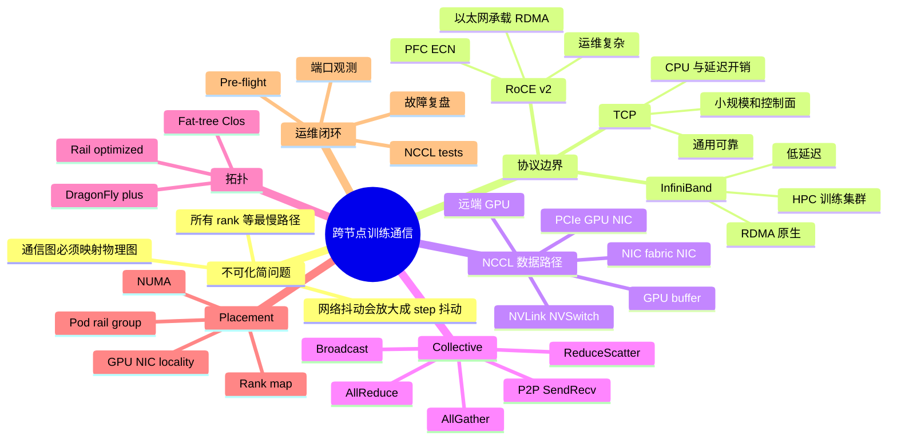
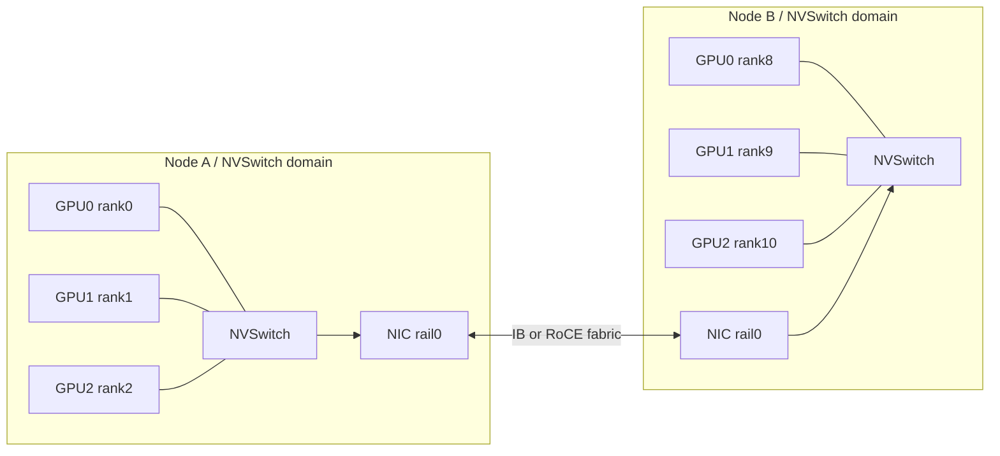
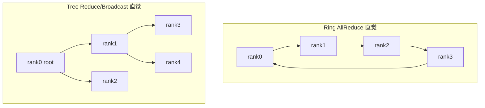
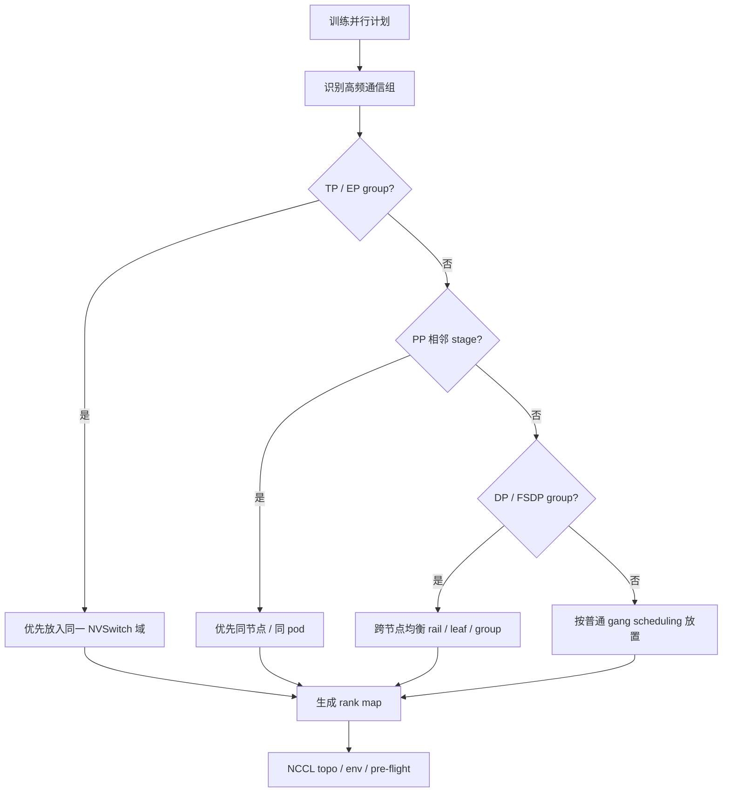
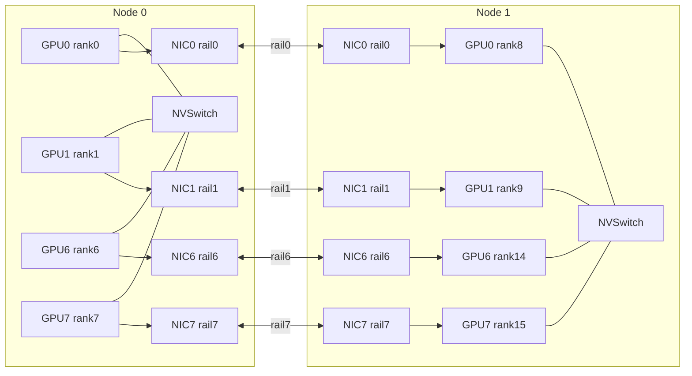
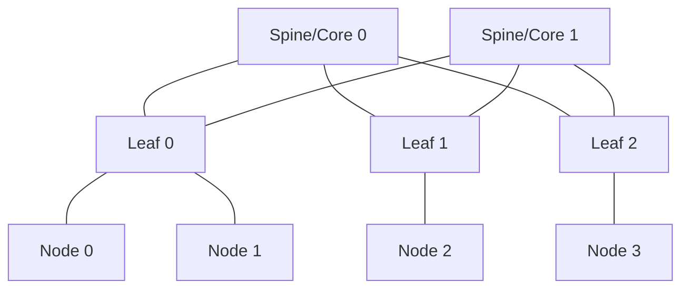
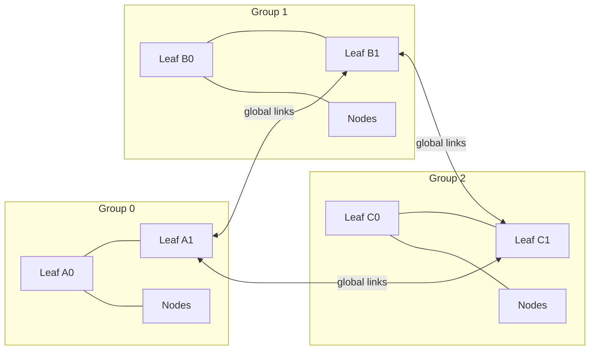
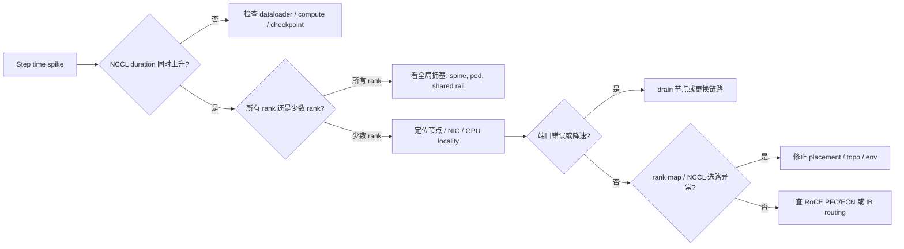

# 第5c章：跨节点互联、Collective 与集群拓扑

> **关联章节**：本章是 [第5章](./05-memory-interconnect-io.md) 中跨节点互联部分的独立展开，重点回答"训练通信到底怎么走、为什么有卡不一定跑得快、网络故障如何被 NCCL 放大"。阅读时可以同时参考 [第4c章](./04c-gpu-interconnect-and-systems.md) 的 GPU 互联与系统形态、[第8章](../part3-training-infra/08-data-parallel.md) 的数据并行、[第9章](../part3-training-infra/09-model-pipeline-parallel.md) 的模型并行，以及 [第21章](../part7-reliability-security/21-observability-and-capacity.md) 的观测与容量。

## 1. 第一性原理拆解 + 学习大纲

### 拆 — 不可化简的问题

把 RDMA、RoCE、InfiniBand、NCCL、Fat-tree、rail、DragonFly+ 这些名字先拿掉，本章真正要解决的问题只有一个：**多节点训练把一次 step 的完成条件变成所有 rank 都完成通信；只要某条路径慢、某个 rank 被放错位置、某个端口出现拥塞或丢包，整轮 collective 就会被最慢的一段拖住。**

单卡训练时，慢通常表现为某个 kernel、某段 H2D、某次 dataloader 等待。多节点训练时，慢会变成更隐蔽的同步等待：一个 rank 的梯度准备晚了，所有参与同一个 AllReduce 的 rank 都要等；一条 rail 上的 ECN/PFC 配置不稳，跨节点 reduce-scatter 会抖；一个节点的 GPU0 离 NIC1 更近，却被 rank map 绑定到 NIC0，NCCL 可以跑，但每个 step 都绕远路。对平台团队来说，网络不是"机器之间能 ping 通"这么简单，而是训练主路径的一部分。

这个问题来自三个硬边界。第一，**距离边界**：同一 GPU HBM、同节点 NVLink/NVSwitch、GPU 到 NIC 的 PCIe 路径、跨 leaf/spine 或跨 DragonFly group 的路径，带宽、延迟和排队模型都不同。第二，**同步边界**：AllReduce、ReduceScatter、AllGather、Broadcast 不是普通 RPC，而是集体操作；单点慢会传播成全体慢。第三，**运维边界**：InfiniBand、RoCE、TCP 都能搬数据，但它们对交换机、拥塞控制、驱动、固件、PFC/ECN、路由和观测的要求完全不同。一个集群能跑通 benchmark，不代表能承载长期、多租户、数百到数千 GPU 的训练。

所以，本章不把网络当作抽象带宽数字，而是把每一份通信字节放回路径：从 GPU buffer 出发，经过 NVLink/NVSwitch 或 PCIe，进入 NIC，通过 IB/RoCE/TCP fabric，抵达远端 NIC，再进入远端 GPU。只有这条路径被画清楚，rank placement、GPU-NIC locality、rail 对齐、pre-flight 和故障定位才有工程含义。

### 推 — 从这个问题如何推导出每个机制

从"跨节点同步会拖住 step"出发，第一步会得到 collective。数据并行训练的梯度同步、张量并行的 partial result 交换、ZeRO/FSDP 的参数分片重建，本质上都不是一对一发送，而是一组 rank 共同完成的数据重排。AllReduce 把所有 rank 的梯度求和并让每个 rank 拿到结果；ReduceScatter 把 reduce 后的结果切片分给不同 rank；AllGather 再把分片拼回全量；Broadcast 把一个 rank 的数据复制给其他 rank。训练框架看到的是一个 collective API，底层则要选择 ring、tree、CollNet、NVLS、多 channel、多 rail 和具体协议。

第二步会得到 RDMA。跨节点训练希望数据尽量少经过 CPU 拷贝和内核协议栈，让 NIC 直接从用户态 buffer 或 GPU buffer 读写。InfiniBand 是专门的数据中心/HPC fabric，提供 RDMA 语义、低延迟和成熟的拥塞控制体系；RoCE v2 把 RDMA 承载在以太网上，成本和生态更贴近传统网络，但要求 lossless 或 near-lossless 配置，尤其要把 PFC、ECN、DCQCN、队列和交换机缓冲调好；TCP 则最通用、最易运维，但 CPU 开销、延迟和可预测性通常不适合大规模强同步训练。三者的边界不是"能不能通信"，而是"在同步主路径上能否低抖动、可观测、可恢复地通信"。

第三步会得到拓扑。单个 NIC 端口的 400G 或 800G 线速不能代表集群 bisection bandwidth。Fat-tree / Clos 追求任意节点间的等价路径和更均匀的带宽；rail-optimized 把每个 GPU 或 GPU 组绑定到固定 NIC/rail，让 NCCL 多 rail 并行更可控；DragonFly+ 用 group 内高带宽和 group 间高 radix global links 支撑更大规模，但要求调度理解 group locality。拓扑存在之后，job placement 就从"找空闲 GPU"变成"把通信图映射到物理图"。

第四步会得到 pre-flight 和观测。网络问题不应该等到 3 天训练后才发现。一个严肃平台会在作业启动前检查 GPU-NIC 亲和、端口速率、NCCL topo、IB/RoCE 健康、rail 利用、基础 collective 性能；运行中把 step time、NCCL wait、端口错误、重传、ECN mark、PFC pause、交换机队列、链路 flap、GPU Xid 放在同一张时间线上。没有这些证据，"NCCL timeout"只是症状，不是诊断。

### 绘 — 因果链路



### 导 — 读完本章你应该能回答

1. RDMA、RoCE、InfiniBand、TCP 的边界分别在哪里，为什么"都能传数据"不等于"都适合大规模训练"？
2. NCCL AllReduce / ReduceScatter / AllGather 的数据路径如何从 GPU buffer 走到远端 GPU？
3. Ring、tree、多 channel、多 rail 为什么会让 rank placement 和 GPU-NIC locality 变成性能问题？
4. Fat-tree / Clos、rail-optimized、DragonFly+ 分别适合什么规模和调度假设？
5. 为什么 TP、PP、DP、EP 的 rank 放置策略不同，哪些通信组应该留在 NVSwitch 域内，哪些可以跨节点？
6. 一个训练作业启动前，pre-flight 应该检查哪些硬件、驱动、拓扑和 collective 性能项？
7. 出现 NCCL timeout、step time 抖动、单 rail 打满、PFC pause、端口 symbol error 时，你会如何从症状回溯到物理链路？

## 正文内容

### 5c.1 跨节点通信不是"更快的 socket"

很多工程师第一次看多机训练，会把跨节点网络理解成"把 tensor 从 A 机器发到 B 机器"。这个理解不够。训练通信有两个特征：

1. **同步性强**：一个 collective 里的所有 rank 都要进入同一轮操作，慢 rank 会拖住快 rank。
2. **通信频率高**：数据并行每个 step 要同步梯度；FSDP/ZeRO 可能每层前后都要 all-gather / reduce-scatter；张量并行甚至每层有通信。

所以，训练网络更像计算流水线的一部分，而不是后台文件传输。对比两类流量会更清楚：

| 流量 | 典型形态 | 对延迟敏感吗 | 对抖动敏感吗 | 失败影响 |
|------|----------|--------------|--------------|----------|
| NCCL collective | 多 rank 同步，固定阶段反复发生 | 高 | 很高 | step 卡住、timeout、吞吐下降 |
| Checkpoint 写入 | 大块写，频率较低，可重试 | 中 | 中 | 恢复时间和训练窗口受影响 |
| 日志 / metrics | 小流量，异步 | 低 | 低 | 可降级 |
| 控制面 RPC | 小流量，可靠优先 | 中 | 中 | 调度和健康检查异常 |

训练通信的工程目标不是追求单次发送最快，而是让反复发生的 collective 在所有 rank 上稳定完成。一个 256 GPU 作业里，只有一条 leaf 上联拥塞，也可能让全作业吞吐下降；一台节点的 NIC 固件异常，也可能表现为所有 rank 在 `ncclAllReduce` 处等待。

### 5c.2 RDMA、InfiniBand、RoCE、TCP 的边界

#### 5c.2.1 RDMA 是能力，不是某一种网线

RDMA 的核心是 Remote Direct Memory Access：一端 NIC 可以直接读写另一端注册过的内存区域，绕过大量 CPU 拷贝和内核协议栈开销。对 AI 训练更关键的是 GPUDirect RDMA：NIC 可以直接访问 GPU memory，避免把 GPU tensor 先拷到 host DRAM 再发出去。

一个理想的跨节点 GPU-to-GPU 数据路径是：

```text
GPU HBM
  -> GPU PCIe/NVLink path
  -> local NIC DMA
  -> network fabric
  -> remote NIC DMA
  -> remote GPU HBM
```

如果 GPUDirect RDMA 不可用，路径可能退化成：

```text
GPU HBM
  -> host DRAM staging buffer
  -> local NIC
  -> network fabric
  -> remote NIC
  -> host DRAM staging buffer
  -> remote GPU HBM
```

这条退化路径仍然能跑，但多了主机内存拷贝、PCIe 往返、CPU 参与和同步点。对小规模任务可能只是慢一点；对大规模强同步训练，会直接变成 step time 和抖动。

#### 5c.2.2 InfiniBand：专用 fabric 的确定性

InfiniBand 常见于高性能训练集群和 HPC 集群。它的优势不是某个单点特性，而是一整套为低延迟、高吞吐、RDMA 和大规模 fabric 设计的体系：

- RDMA 语义成熟，用户态通信路径稳定；
- 端口速率和交换生态与 GPU 集群节奏匹配；
- 子网管理、路由、拥塞控制和诊断工具相对完整；
- 与 NCCL、UCX、MPI、GDR 路径的生产经验丰富。

代价是成本、供应、布线、运维和团队能力要求更高。InfiniBand 也不是"插上就不会拥塞"：错误的 fat-tree oversubscription、坏线、端口降速、路由异常、交换机缓冲压力，同样会让 collective 抖动。

#### 5c.2.3 RoCE v2：在以太网上跑 RDMA

RoCE v2 把 RDMA 封装在 UDP/IP 上，能使用以太网交换设备和 IP 网络能力。它的吸引力很明显：以太网生态广、成本结构更熟悉、与现有数据中心网络更容易融合。但 RoCE 的工程难点也很明确：RDMA 对丢包非常敏感，而传统以太网默认不是 lossless。

RoCE 生产环境通常绕不开这些项：

| 项 | 作用 | 常见风险 |
|----|------|----------|
| PFC | 对指定优先级做 pause，减少 RDMA 流量丢包 | 配置错误会造成 head-of-line blocking 或 pause storm |
| ECN | 在拥塞前标记，让端系统降速 | 阈值不合理会过早降速或来不及降速 |
| DCQCN / 拥塞控制 | RoCE 常见拥塞控制机制 | NIC、交换机、驱动版本组合影响很大 |
| QoS / DSCP / priority | 区分 RDMA、存储、控制面流量 | 优先级映射不一致会让流量进错队列 |
| MTU | 减少包处理开销，提高有效吞吐 | 端到端不一致会出现隐蔽丢包或性能下降 |

RoCE 的典型失败不是"完全不通"，而是"跑得起来但一到大 job 就抖"。这类问题如果没有交换机队列、PFC pause、ECN mark、NIC counter 和 NCCL timing，很难靠应用日志定位。

#### 5c.2.4 TCP：通用但不是强同步训练默认答案

TCP 的优势是通用、可靠、运维门槛低。小规模训练、控制面通信、模型服务之间的普通 RPC、非主路径数据传输，用 TCP 很合理。问题在于大规模训练 collective 需要低延迟、低 CPU 开销和低抖动，而 TCP 的内核协议栈、拥塞控制、拷贝路径和 tail latency 通常不如 RDMA fabric。

选择边界可以这样看：

| 方案 | 更适合 | 不适合 | 平台要求 |
|------|--------|--------|----------|
| InfiniBand RDMA | 大规模强同步训练、HPC 风格集群、数百到数千 GPU | 成本极敏感、团队没有 IB 运维能力 | IB 子网、固件、链路、路由、NCCL/UCX 调优 |
| RoCE v2 | 以太网基础强、愿意投入 lossless/near-lossless 网络治理的训练集群 | 网络团队无法统一 PFC/ECN/QoS，或多租户流量不可控 | 端到端 QoS、PFC、ECN、DCQCN、交换机观测 |
| TCP | 小规模训练、控制面、普通服务通信、性能不极端敏感任务 | 大规模 AllReduce 主路径 | 常规网络运维、CPU 余量、重试和超时治理 |

**工程判断**：如果训练吞吐的价值高于网络复杂度，优先评估 RDMA 路径；如果团队不能观测和调 RoCE，就不要把 RoCE 当成"便宜 IB"；如果作业规模较小，TCP 可能是更稳的起点。

#### 5c.2.5 RDMA verbs API：QP / CQ / MR / PD / SRQ

前面把 RDMA 当成"NIC 直接读写远端内存"的能力，但**实际编程模型**是 senior 排查 IB/RoCE 事故必懂的层。任何用 RDMA 的库（NCCL、UCX、libfabric、MPI、Mellanox SHARP）底层都建立在这五个对象上。

**核心对象**：

```text
PD (Protection Domain)
  ↓ 像内存隔离域：所有 QP / MR 必须属于同一个 PD 才能交互
  
MR (Memory Region)
  ↓ 内存区域注册：调 ibv_reg_mr() 把 user buffer "钉"进 RDMA NIC 视图
  ↓ 注册后 NIC 知道虚拟地址 → 物理地址映射，可以直接 DMA
  ↓ 返回 (lkey, rkey)：lkey 给本地用、rkey 给对端发起 RDMA Read/Write 用
  ↓ 注册昂贵（要锁页 + 建 IOMMU 映射），生产中预注册 + 池化复用

QP (Queue Pair)
  ↓ 一对 send queue + recv queue，是 RDMA 的"连接"
  ↓ 三种模式：
  ↓   RC (Reliable Connected)    一对一可靠，TCP 风格 + RDMA 性能（NCCL 默认）
  ↓   UC (Unreliable Connected)  一对一不可靠
  ↓   UD (Unreliable Datagram)   广播式，RDMA-CM 控制面用
  ↓ 必须握手到 INIT → RTR → RTS 状态才能传输

CQ (Completion Queue)
  ↓ 工作完成事件队列：每条 SEND/RECV/RDMA WRITE 完成时产生 WC (Work Completion)
  ↓ 应用 ibv_poll_cq() 拿 WC，里面含 status（success / error code）
  ↓ 大量小消息时 CQ 是热点，需要 CQ moderation 减少中断

SRQ (Shared Receive Queue) [可选]
  ↓ 多个 QP 共享一个 recv queue，避免每 QP 都预 post 大量 recv WR
  ↓ 大集群（千 QP 级）必备
```

**两类操作**：

| 操作 | 语义 | 是否需要对端 CPU 参与 |
|---|---|---|
| **SEND/RECV** | 双边：发送方 SEND，接收方必须先 post RECV | 是（接收方要预 post buffer）|
| **RDMA WRITE** | 单边：发送方直接写到对端 MR，对端无感知 | 否（对端 NIC 自己 DMA）|
| **RDMA READ** | 单边：发送方直接读对端 MR | 否 |
| **ATOMIC** | 原子操作（compare-and-swap、fetch-and-add）| 否 |

NCCL 在大消息上倾向 RDMA WRITE（单边，零拷贝、无 CPU 参与），小消息用 SEND/RECV（语义简单、CQ 通知触发依赖）。

**RDMA-CM（Connection Manager）**：

QP 不是直接连接的，要先通过 RDMA-CM 协议交换 QP 参数（QPN、PSN、GID/LID、PKey）。RDMA-CM 走 UD 或 IPoIB；NCCL bootstrap 时常用 socket(TCP) 交换 QP 信息后再切到 RDMA。这是为什么"NCCL 启动卡住"经常和 socket 网络（管理面）有关，而不是 RDMA fabric 本身。

**生产事故诊断**：

| 现象 | 根因 | 排查 |
|---|---|---|
| `ibv_reg_mr` 失败 | locked memory limit 不够（ulimit -l）| 改 `/etc/security/limits.conf` `memlock unlimited` |
| QP 状态停在 INIT | RDMA-CM 没握手成功，可能是 socket bootstrap 网络问题 | `NCCL_DEBUG=INFO` 看 bootstrap 阶段日志 |
| WC 报 `IBV_WC_RETRY_EXC_ERR` | 重传超过限制（坏链路、PFC 异常）| 看交换机端口 retrans / pause / discard counter |
| WC 报 `IBV_WC_RNR_RETRY_EXC_ERR` | Receiver Not Ready：对端 SRQ/RECV 没 post 上 | 检查 SRQ 深度配置、对端是否阻塞 |
| WC 报 `IBV_WC_REM_ACCESS_ERR` | 远端拒绝访问，rkey 错或 MR 已 dereg | NCCL bug 或镜像内 RDMA stack 不一致 |
| 多 NIC 但只用一张 | 容器内只暴露部分 RDMA device | 检查 device cgroup 和 `rdma-core` 配置 |

**调试命令**：

```bash
# RDMA 设备列表 + 端口状态
ibv_devinfo                  # 详细：rate, state, link_layer, GID 表
ibstat                       # 简洁：每个 HCA 的端口速率、state
rdma link                    # 内核 rdma 子系统视角

# locked memory 限制
ulimit -l                    # unlimited 是健康值
cat /proc/<pid>/status | grep VmLck

# RoCE GID 表
show_gids                    # GID index → IP / VLAN / RoCE version 映射

# 端口错误计数
cat /sys/class/infiniband/mlx5_0/ports/1/counters/*
```

#### 5c.2.6 InfiniBand Subnet Manager：路由的"控制平面"

InfiniBand 不是以太网那样"插上就通"。**Subnet Manager (SM)** 是 IB fabric 的控制平面，所有 IB 集群必须有 SM 在跑（OpenSM 开源 / Mellanox UFM 商业 / 交换机内嵌 embedded SM）。SM 负责：

- **LID 分配**：每个 IB 端口分配 16-bit Local Identifier（类似 IP 但只在 subnet 内）
- **路由计算**：根据 fat-tree / DragonFly+ 拓扑算 forwarding tables，下发到每台交换机
- **链路状态监控**：周期 sweep 子网，发现端口 down/up、链路降速、新设备加入
- **多路径配置**：SHARP / Adaptive Routing 等高级特性的路由元数据
- **PKey 管理**：partition keys，类似 VLAN，用于多租户 fabric 隔离

**SM 失败模式**（生产 IB 集群最严重的根因之一）：

| 现象 | 根因 | 影响范围 |
|---|---|---|
| 大量 NCCL timeout，但单端口测试正常 | SM 节点抖动，路由表过期，跨交换机路径错 | 全 fabric |
| 节点新加入但 IB 端口 active 后无法通信 | SM 没及时 sweep 到，LID 没分配 | 该节点 |
| 链路 down 后恢复，但流量没切回原路径 | SM 没触发重路由 | 受影响路径 |
| 同一作业不同启动表现差异大 | 路由不稳定，每次 SM sweep 计算不同 | 大作业训练 |

**SM 高可用配置**：

```text
- 至少 2 个 SM 节点（master + standby），互相心跳
- master 异常时 standby 自动接管（SM priority）
- OpenSM 的 -p 参数设置 priority
- 商业 UFM 提供更完善的 HA + dashboard
```

**SM 监控**：

```bash
sminfo                       # 当前 master SM 是谁
saquery NodeRecord           # 子网中所有节点
ibnetdiscover                # 完整拓扑发现
ibdiagnet -r                 # SM-aware 诊断报告
```

生产经验：**SM 节点必须独立、稳定、低负载**——不要把它放在训练节点上跑。SM 抖动 = 整个 IB fabric 抖动 = 所有训练 NCCL 抖动。这是大集群最常见的"网络看起来好但训练不稳定"的根因。

#### 5c.2.7 RoCEv2 实际是 UDP encapsulation：跨设备 ECMP 与 DSCP

RoCE v2 把 RDMA 数据帧封装在 UDP/IP 里：

```text
[ Ethernet ][ IP ][ UDP dst=4791 ][ IB BTH (Base Transport Header) ][ RDMA payload ]
```

UDP dst port **4791** 是 RoCEv2 IANA 分配端口，固定不变。这导致两个工程后果：

**1. ECMP 哈希必须配对**：交换机做 ECMP（多路径选路）时常用 5-tuple hash（src IP + dst IP + src port + dst port + proto）。RoCEv2 的 dst port 永远是 4791，src port 由 NIC 选择——**如果 src port 也固定**，整个 fabric 看起来只有一条路径，多 rail 完全失效。Mellanox NIC 默认 entropy field 是 src port 自动 hash QP，但需要 RoCE Lossless 配置 + 交换机 ECMP 算法兼容。

**2. DSCP 标记决定 PFC 队列**：RoCE 流量需要 lossless 队列（PFC pause），其他流量走普通队列。靠 DSCP 标记区分，主机 NIC 必须 mark RoCE traffic 为特定 DSCP value（典型 26 = AF31），ToR 交换机按 DSCP 分到 priority queue（priority 3）；priority 3 启用 PFC，其他不启用。

**端到端一致性问题**：

```text
DSCP marking:    NIC → ToR → leaf → spine → leaf → ToR → 远端 NIC
PFC priority:    必须每跳都把 RoCE 队列配 PFC，缺一跳就丢包
MTU:             RoCE 一般 4200 (jumbo frame)，端到端必须一致
ECN:             配 marking threshold（典型 buffer 1/3 满时 mark）
```

任何一跳配错（典型：spine 没配 PFC、某 leaf MTU 不对）都会让大并发训练 timeout。这就是 RoCE 比 IB 难调的根本——IB SM 自动管理 fabric 一致性，RoCE 靠运维手工配每个交换机。

#### 5c.2.8 NCCL 内部 transport 选择与 GDR 协商

NCCL 启动时按拓扑探测和环境变量选择 transport。理解这个选择逻辑，"NCCL 慢"的根因才有方向。

**transport 类型**（按性能从高到低）：

| Transport | 用途 | 触发条件 |
|---|---|---|
| **NVLink P2P** | 同一 NVSwitch domain GPU 间 | 自动检测 NVLink 拓扑 |
| **PCIe P2P** | 同节点跨 NVLink domain GPU 间 | NVLink 不可用且 ACS 关闭 |
| **GPUDirect RDMA (GDR)** | 跨节点 GPU 间，NIC 直读 GPU memory | NIC 支持 + nv_peer_mem 模块加载 + GPU/NIC 同 PCIe domain |
| **Host staging RDMA** | 跨节点 GPU 间，先 H2D copy 到 host pinned，再 RDMA | GDR 不可用或 GPU/NIC 跨 NUMA 时 fallback |
| **Sockets (TCP)** | RDMA 完全不可用 | 兜底，性能极差 |

**GDR 协商流程**：

```text
NCCL 启动:
1. 调 cuPointerGetAttribute() 检查 GPU memory 是否可被 NIC 访问
2. 检查 nv_peer_mem.ko 内核模块是否加载（NVIDIA peermem）
   modprobe nvidia-peermem  # H100 + Linux 5.6+
3. 检查 GPU 和 NIC 是否在同一 PCIe root complex（nvidia-smi topo -m）
4. 通过 NCCL_NET_GDR_LEVEL 决定阈值:
   - PIX (1)  仅同一 PCIe switch 下才用 GDR
   - PXB (2)  同一 PCIe host bridge 下用
   - PHB (3)  同一 NUMA node 下用
   - SYS (4)  跨 NUMA 也用（性能差）
   - LOC (5)  从不用 GDR
5. NCCL_NET_GDR_READ 控制 GDR 是否用于 RDMA Read（早期 GPU 不支持）
```

**关键环境变量**：

```bash
# 显式控制 transport 选择
NCCL_NET=IB                  # 强制 IB（不允许 fallback 到 socket）
NCCL_IB_HCA=mlx5_0:1,mlx5_1:1   # 指定哪些 HCA + port，避免错绑
NCCL_IB_GID_INDEX=3          # RoCEv2 GID（看 show_gids 输出）
NCCL_IB_TIMEOUT=23           # IB QP timeout 指数（22 ≈ 4s，23 ≈ 8s）
NCCL_IB_RETRY_CNT=7          # 重试次数

# GDR
NCCL_NET_GDR_LEVEL=PIX       # 严格只在最近 PCIe topology 用
NCCL_NET_GDR_READ=1          # H100+ 默认开

# 多 rail
NCCL_NSOCKS_PERTHREAD=4      # 每 thread 多少个 socket（fallback 路径）
NCCL_SOCKET_NTHREADS=4

# 调试
NCCL_DEBUG=INFO
NCCL_DEBUG_SUBSYS=INIT,NET,GRAPH,COLL
NCCL_TOPO_DUMP_FILE=/tmp/topo.xml
```

**生产 checklist**：作业启动时 NCCL 日志必须显示：
- `NET/IB : Using ...` 而不是 `NET/Socket`（否则 fallback 了）
- 每个 rank 选择了预期的 HCA 和 port
- `NCCL INFO Channel xx -> ...` 显示多 channel + 多 rail
- 没有 `NCCL WARN`

#### 5c.2.9 SHARP：交换机内做 reduce，让 AllReduce 跳过 ring

**SHARP（Scalable Hierarchical Aggregation and Reduction Protocol）** 是 Mellanox/NVIDIA 高端 IB 集群的关键加速器，章节前面完全没提。它的核心想法是：**让 NVSwitch / IB switch 内部做 reduce 操作**，AllReduce 不再是端到端 ring，而是 in-network aggregation。

**传统 ring AllReduce vs SHARP AllReduce**：

```text
传统 ring（N 个 rank，message size M）:
  通信量: 2 × (N-1)/N × M per rank
  时间: 2 × (N-1) × (alpha + M/N/B)  [alpha 是延迟，B 是带宽]
  瓶颈: 最慢链路 + 串行 ring 距离

SHARP（同样 N 个 rank）:
  rank 把数据 SEND 到本地 leaf switch
  leaf switch 做 reduce 后 SEND 到 spine switch
  spine 做最终 reduce 后 BROADCAST 回各 leaf 再到 rank
  通信量: ~M per rank（接近最优）
  时间: 2 × log(N) × (alpha + M/B)
  瓶颈: 网络 hop 数 + switch 内 ALU 速度（不再是 ring 距离）
```

**SHARP 性能优势**（NVIDIA 公开数据 + 实测口径）：

| 集群规模 | message size | ring AllReduce | SHARP AllReduce | 加速 |
|---|---|---|---|---|
| 8 GPU | 16MB | ~50 μs | ~30 μs | 1.7× |
| 64 GPU | 16MB | ~120 μs | ~50 μs | 2.4× |
| 512 GPU | 64MB | ~3 ms | ~0.8 ms | 3.7× |
| 4096 GPU | 1GB | 50-100 ms | 15-25 ms | 3-5× |

集群越大、ring hop 越多，SHARP 优势越大。这是为什么 NVIDIA SuperPOD / DGX H100 Cluster 默认开启 SHARP。

**两代 SHARP**：

| 版本 | 支持位置 | 限制 |
|---|---|---|
| **SHARPv1** | IB switch ASIC 内的 reduction tree | 每集群一棵 tree，多 job 抢资源 |
| **SHARPv2** | Quantum-2 / Quantum-X800 switches | 支持多 stream（多 job 并发 reduce）+ 32-bit float native + reproducibility |
| **NVLink SHARP** | NVSwitch (H100/B200 时代) | 节点内 / NVL72 内 reduce，不需要走 IB |

**SHARP 启用条件**：

- 硬件：Mellanox Quantum / Quantum-2 / Quantum-X800 IB switch + ConnectX-6/7 HCA
- 软件：HPC-X / NCCL ≥ 2.7 + SHARP daemon (sharpd) 在 SM 上运行
- 配置：NCCL `NCCL_COLLNET_ENABLE=1` 触发 SHARP 路径
- 调度：作业必须在同一 partition 内（SHARP tree 是 partition-bound）

**调试**：

```bash
# 看 SHARP 是否被 NCCL 启用
NCCL_DEBUG=INFO ./nccl-test 2>&1 | grep -i sharp
# 应看到 "Connected SHARP rank xx, switch_lid xx, switch_qp xx"

# SHARP daemon 状态
systemctl status sharp_am
sharp_am --status

# SHARP tree 信息
sharp_am --show-trees
```

**何时 SHARP 不生效**：

- 跨 partition 训练（job 跨多个 SHARP tree）
- 算子不被 SHARP 支持（FP32/BF16/FP16 + sum/max/min OK；FP8 看版本）
- message 太小（< 8KB，setup 开销 > 收益）
- NCCL 自动判断 ring 更优（小集群 + 大 message）

#### 5c.2.10 Adaptive Routing：包级动态选路避免热点

InfiniBand 默认是 **deterministic routing**（路由表确定的），同一对 src/dst 永远走同一条路径。这导致一个问题：当多个大 job 的流量哈希到同一组路径时，spine 链路会拥塞而其他链路空闲，整个 fabric 看起来"不够带宽"，实际只是路径分配不均。

**Adaptive Routing（AR）的核心**：交换机按出口队列深度动态选路。同一对 src/dst 的不同包可能走不同 spine，避免单点拥塞。

```text
传统 deterministic routing:
  src → leaf1 → spine_A (固定) → leaf2 → dst
  spine_A 拥塞时无能为力

AR:
  src → leaf1 → 出口选择 = argmin(queue_depth) 在 [spine_A, spine_B, spine_C, ...]
  负载自动均衡到所有可用 spine
```

**AR 的工程代价**：

- **out-of-order delivery**：同一连接的包可能不按发送顺序到达。RDMA RC 模式严格要求顺序，必须有 NIC + switch 协作的 reorder 机制（Mellanox SHIELD）。
- **不是所有 fabric 都支持**：需要 Quantum 系列 switch + ConnectX-6/7 + 适当 firmware；老 fabric 用 deterministic。

**SHIELD（Self-Healing Interconnect Enhancement for inteLligent Datacenters）**：

让 NIC 在收到 out-of-order 包时按 PSN（Packet Sequence Number）重组，对应用透明。配合 AR 使用。

**配置（Mellanox UFM / OpenSM）**：

```bash
# OpenSM 配置 AR
opensm --enable_quirks
# /etc/opensm/opensm.conf:
adaptive_routing_disable FALSE
# 重启 opensm

# 验证 AR 启用
ibdiagnet --routing  
# 看输出中 "Adaptive routing enabled" / "AR groups"
```

**SHARP + AR 是大集群标配**：千卡以上的 IB 训练集群应该同时启用。NVIDIA SuperPOD / DGX SuperCluster 默认配置；自建集群如果只有基础 OpenSM + deterministic routing，64 卡以上 NCCL AllReduce 性能会显著低于 datasheet。

**故障模式**：

| 现象 | 根因 | 排查 |
|---|---|---|
| AllReduce 大 message 性能远低于预期，但单 rail `ib_write_bw` 正常 | spine 拥塞，没有 AR | `ibdiagnet --routing` 看是否 deterministic |
| 启用 AR 后 RDMA RC 报 PSN 错误 | SHIELD 没启用或 NIC firmware 不支持 | 升级 firmware；或 fallback deterministic |
| SHARP daemon 报 tree 不可用 | switch firmware 没启用 SHARP / SM 不是 SHARP-aware | 检查 switch firmware；用 UFM SM 替代 OpenSM |

### 5c.3 NCCL collective 的数据路径

NCCL 给框架提供的是 collective API，但底层会根据拓扑、消息大小、GPU 数、NIC 数、环境变量和版本选择算法。平台工程师不一定要手写 NCCL，但必须能把它的路径画出来。

#### 5c.3.1 常见 collective

| Collective | 输入 / 输出 | 训练中常见位置 | 性能关注点 |
|------------|-------------|----------------|------------|
| AllReduce | 每个 rank 有一份输入；所有 rank 得到 reduce 后的完整结果 | DDP 梯度同步 | 带宽、同步等待、bucket 划分、overlap |
| ReduceScatter | 每个 rank 输入完整或分片数据；reduce 后每个 rank 拿一片 | ZeRO/FSDP 梯度分片 | 分片均衡、跨节点路径、与 AllGather 配对 |
| AllGather | 每个 rank 有一片；所有 rank 收集完整数据 | FSDP 参数重建、TP/EP 部分路径 | 延迟、显存峰值、层级化调度 |
| Broadcast | 一个 rank 发送，其他 rank 接收 | 初始化参数、状态同步 | root rank 放置、启动阶段压力 |
| Send/Recv | rank 间点对点 | Pipeline parallel stage 通信 | 相邻 stage locality、气泡和背压 |

AllReduce 常被写成一个操作，但实际可能拆成两个阶段：

```text
AllReduce = ReduceScatter + AllGather
```

这很重要，因为现代训练框架会把梯度、参数和 optimizer state 做分片。你看到的不是一次"全员求和"，而是一系列分片数据在 rank 之间重新分布。

#### 5c.3.2 单节点与跨节点的层级路径

8 卡 HGX 节点内，NCCL 通常优先利用 NVLink/NVSwitch；跨节点时，才通过 NIC 进入 IB/RoCE fabric。一个层级化 AllReduce 可以粗略理解为：

1. 节点内 GPU 先做 local reduce；
2. 每个节点选出或组合代表数据，经 NIC 跨节点 exchange；
3. 远端返回后，节点内再 broadcast / all-gather 到本节点 GPU。



这张图隐藏了一个关键问题：GPU 到 NIC 的路径也有距离。如果 GPU0 与 NIC0 在同一 PCIe root 或同一 NUMA 域，而 GPU7 到 NIC0 要跨 socket，NCCL 可能仍然能使用 NIC0，但有效带宽和延迟会变差。多 rail 系统里，错误绑定还会让某一张 NIC 打满，其他 NIC 空闲。

#### 5c.3.3 Ring、Tree、Channel 与最慢路径

NCCL 常见算法包括 ring 和 tree。直觉上：

- **Ring**：每个 rank 只和前后邻居通信，带宽利用好，适合大消息；但环上任何一段慢都会影响整体。
- **Tree**：以树形聚合和分发，延迟更低，适合小消息或某些规模；但上层节点和链路可能成为热点。
- **多 channel**：把大 tensor 切成多个 chunk 并行走多条逻辑路径，提高并行度。
- **多 rail**：把跨节点流量分摊到多张 NIC / 多条网络 rail，前提是拓扑和 rank map 对齐。



Ring 的危险在于它会把物理拓扑不均匀暴露出来。假设 rank0 和 rank1 在同节点，rank1 和 rank2 跨 leaf，rank2 和 rank3 跨 pod，那么同一个 ring 里混入了不同距离。NCCL 会努力选择拓扑，但调度器如果把 rank 放散，算法没有足够的物理条件救回来。

### 5c.4 Rank placement：把通信图放进物理图

Rank placement 的核心问题是：哪些 rank 之间通信最频繁，应该放得最近；哪些通信可以跨远距离网络，应该均匀消耗带宽。

常见并行策略的 locality 需求不同：

| 并行策略 | 高频通信 | 放置优先级 | 错放后表现 |
|----------|----------|------------|------------|
| Tensor Parallelism | 每层 activation / partial result | 同一 NVSwitch / NVLink 域优先 | 每层同步变慢，TPOT / step time 明显上升 |
| Pipeline Parallelism | 相邻 stage 的 activation | 相邻 stage 尽量同节点或同 pod | pipeline bubble、stage 等待、吞吐下降 |
| Data Parallelism | 每 step 梯度 collective | 跨节点可接受，但要 rail/pod 均衡 | AllReduce 时间升高，扩展效率下降 |
| FSDP / ZeRO | 参数 AllGather、梯度 ReduceScatter | 同一 shard group 尽量局部，跨节点路径可预测 | 层级通信抖动，显存峰值与等待叠加 |
| Expert Parallelism | token dispatch / combine | expert group 尽量留在高速域，跨节点要谨慎 | MoE all-to-all 成为主瓶颈 |

一个粗略策略是：

1. TP / EP 的高频组先放进同一 NVSwitch 域；
2. PP 的相邻 stage 尽量不跨最远拓扑边界；
3. DP group 横跨节点时，尽量让每个节点、rail、pod 的 rank 数均衡；
4. FSDP/ZeRO 的 shard group 不要被调度器随机打散；
5. 避免把同一个大 job 切到多个拥塞域，除非容量确实不够。



调度器至少要知道这些信息：

| 资源标签 | 例子 | 为什么重要 |
|----------|------|------------|
| GPU 所属 NVSwitch 域 | `node-a/fabric-0` | 判断 TP/EP 是否能留在 scale-up 域 |
| GPU 到 NIC locality | `gpu0 -> nic0 local` | 影响 GDR 路径和 rail 选择 |
| PCIe root / NUMA | `socket0/root0` | 跨 socket 会增加延迟和共享瓶颈 |
| NIC 端口速率与健康 | `400G up`, `link_width` | 端口降速会拖慢 collective |
| Leaf / pod / rail | `leaf-12`, `pod-3`, `rail-0` | 避免跨拥塞域和 rail 不均 |
| DragonFly group | `group-7` | 控制 global link 流量 |

如果平台只把资源表达成 `gpu: 64`，它就无法区分"同一 pod 内 8 台完整 HGX"和"散落在 4 个 pod、某些端口降速、rail 不齐的 64 张卡"。这两种放置对用户看起来都是 64 GPU，对训练 step time 完全不是一回事。

### 5c.5 GPU-NIC locality 与 rail-optimized 网络

多 rail 的目标是让多个 NIC 并行承载跨节点流量。典型设计是每个节点有多张 NIC，NIC0 接 rail0，NIC1 接 rail1；每个 GPU 或 GPU 组与某张 NIC 更近。NCCL 可以把不同 channel 分布到多张 NIC，但前提是系统拓扑、环境变量、NCCL topo 和 rank map 没有互相打架。



常见错误包括：

- 所有 rank 都优先使用同一张 NIC，导致单 rail 打满；
- rank 编号与 GPU 编号、NIC 编号错位，导致 GPU0 的跨节点流量绕到远端 NIC；
- 某张 NIC 端口降速或 error counter 增长，但调度器仍把它当健康端口；
- 容器里看不到正确 RDMA device，NCCL 退回 socket 或只用部分接口；
- `NCCL_SOCKET_IFNAME`、`NCCL_IB_HCA`、容器网络和主机设备命名不一致。

排查 GPU-NIC locality 时，先看四类证据：

| 证据 | 常用命令 / 数据源 | 要看什么 |
|------|-------------------|----------|
| GPU 拓扑 | `nvidia-smi topo -m` | GPU-GPU、GPU-NIC、NUMA 距离 |
| PCIe 设备 | `lspci -tv`, `lspci -vv` | link speed/width、root complex、ACS/IOMMU |
| RDMA 设备 | `ibv_devinfo`, `rdma link`, `show_gids` | HCA 是否可见，GID/port 状态是否正确 |
| NCCL 日志 | `NCCL_DEBUG=INFO`, `NCCL_DEBUG_SUBSYS=INIT,NET,GRAPH` | 选择了哪些 NIC、算法、channel、路径 |

**工程边界**：不要把 `NCCL_DEBUG=INFO` 当长期默认设置，它会产生大量日志；但在 pre-flight 和故障复现时，它是理解路径选择的关键证据。

### 5c.6 三类集群拓扑

#### 5c.6.1 Fat-tree / Clos

Fat-tree / Clos 的目标是提供较均匀的任意节点间带宽。典型形态是节点连 leaf，leaf 上联 spine，甚至再上联 core。它适合多租户训练，因为调度器不需要像 DragonFly+ 那样强依赖 group locality，也不需要像 rail-optimized 那样让每个 GPU/NIC 编号严格对齐。



| 优势 | 代价 | Placement 要点 | 失败模式 |
|------|------|----------------|----------|
| bisection bandwidth 可规划，路径相对均匀 | 交换机端口、光模块、布线成本高 | 大作业优先同 pod；跨 pod 要均匀分布 | oversubscription、ECMP 哈希不均、spine 热点 |

Fat-tree 的关键问题是 oversubscription。1:1 non-blocking 最理想也最贵；2:1、3:1 甚至更高 oversubscription 在成本上更现实，但多个大作业跨 pod 同时跑时会互相影响。调度器需要知道 pod 负载，而不只是节点空闲。

#### 5c.6.2 Rail-optimized

Rail-optimized 网络把相同编号的 NIC 接到同一条 rail。例如每台 8 GPU 节点有 8 张 NIC，所有 NIC0 进入 rail0，所有 NIC1 进入 rail1。这样 NCCL 的 channel 可以并行使用多条 rail，布线和容量规划也更直接。

| 优势 | 代价 | Placement 要点 | 失败模式 |
|------|------|----------------|----------|
| 多 rail 并行，GPU-NIC 对齐清晰 | 需要调度、拓扑文件和 NCCL 配置协同 | `rank i` 尽量靠近 `GPU i / NIC i / rail i` | rail 不均、单 rail 拥塞、NIC 错绑、端口降速 |

Rail 设计的好处在大规模 AllReduce 中很明显：多个 rail 同时搬不同 chunk，可以提高有效跨节点带宽。它的坏处也明显：只要 rank map、容器设备、HCA 命名、NCCL 选择和物理布线有一处错位，性能下降可能很大，而且不一定直接报错。

#### 5c.6.3 DragonFly+

DragonFly+ 用 group 内高带宽连接和 group 间 global links 扩展到更大规模。它通常比纯多层 fat-tree 更节省全局链路和交换资源，但调度复杂度更高。



| 优势 | 代价 | Placement 要点 | 失败模式 |
|------|------|----------------|----------|
| 大规模成本和跳数可控 | 调度、流量工程、故障隔离复杂 | 先同 group；跨 group 时按并行策略切边界 | global link 热点、作业碎片化、跨 group all-to-all |

DragonFly+ 中，"跨 group"不是普通距离。global links 是稀缺资源，如果每个大作业都被碎片化到多个 group，所有作业都会争抢全局链路。平台需要尽量让单个大 job 留在同 group；如果必须跨 group，优先把低频 DP 边界放到跨 group，而不是把 TP/EP 的高频 all-to-all 放过去。

### 5c.7 Pre-flight：作业启动前先证明路径可用

Pre-flight 的目标不是跑一个漂亮的峰值，而是在训练真正开始前确认"这组节点按这个 rank map 能稳定通信"。它应该分成节点级、网络级、NCCL 级和训练 smoke test。

#### 5c.7.1 节点级检查

| 检查项 | 例子 | 不通过时的风险 |
|--------|------|----------------|
| GPU 数量和型号一致 | `nvidia-smi -L` | rank 数与设备数不匹配 |
| GPU/NIC 拓扑 | `nvidia-smi topo -m` | GDR 绕路、NUMA 错配 |
| PCIe 速率与宽度 | `lspci -vv` | x16 变 x8、Gen5 变 Gen4 |
| 驱动 / CUDA / NCCL 版本 | 镜像和主机版本 | NCCL fallback、已知 bug |
| GPU 错误状态 | Xid、ECC、retired pages | 长训练中断 |

#### 5c.7.2 RDMA / 网络检查

| 检查项 | InfiniBand / RoCE 例子 | 要看什么 |
|--------|------------------------|----------|
| HCA 可见性 | `ibv_devinfo`, `rdma link` | 设备、端口、link layer、state |
| 端口速率 | `ibstat`, vendor telemetry | 是否按预期 200G/400G/800G up |
| GID / RoCE 配置 | `show_gids` | RoCE v2 GID、VLAN、priority 是否正确 |
| 基础带宽 | `ib_write_bw`, `ib_read_bw` | 单 rail 与多 rail 是否达标 |
| 错误计数 | switch/NIC counters | symbol error、discard、retrans、pause |

#### 5c.7.3 NCCL 检查

`nccl-tests` 是最常见的 collective pre-flight。常用基准包括：

- `all_reduce_perf`：验证 DDP 梯度同步路径；
- `all_gather_perf`：验证 FSDP/ZeRO 参数 gather 路径；
- `reduce_scatter_perf`：验证分片 reduce 路径；
- `alltoall_perf`：验证 MoE / expert dispatch 风险。

关注点不是单个最大带宽，而是这些指标：

| 指标 | 解释 | 风险信号 |
|------|------|----------|
| bus bandwidth | NCCL 折算的有效总线带宽 | 低于同硬件 baseline 很多 |
| algorithm / protocol | NCCL 选择 ring/tree/LL/LL128/Simple 等 | 与预期不一致或频繁变化 |
| per-size 曲线 | 不同消息大小性能 | 小消息延迟异常、大消息带宽上不去 |
| 多次运行方差 | 重复运行稳定性 | 抖动大，说明网络或调度噪声强 |
| rail 利用率 | 多 NIC 是否均衡 | 单 rail 打满，其他 rail 空闲 |

#### 5c.7.4 训练 smoke test

网络 benchmark 不能替代真实训练。训练 smoke test 通常跑 50-200 step，检查：

- step time 是否稳定；
- `t_sync / t_step` 是否符合预期；
- GPU utilization 是否出现整齐的同步空洞；
- NCCL 日志是否有重试、fallback、timeout 前兆；
- 端口错误、ECN/PFC、retrans 是否随训练阶段上升；
- checkpoint 或 dataloader 是否和 collective 抢同一网络瓶颈。

**工程边界**：pre-flight 不应该变成用户手写脚本。平台应把 baseline 固化到队列或节点池：新节点入池、固件升级、交换机变更、驱动升级、大作业启动前，都应该有可重复的通信验收。

#### 5c.7.5 RDMA Collective CapacityLedger

跨节点通信的容量账本要同时覆盖物理带宽、NCCL 有效带宽、同步占比和拓扑方差。只写“400G 网络”没有意义；要把 collective message 放到实际 rank map 和 rail 上计算。

| 项 | 公式 / 填写方式 | 证据来源 | threshold |
|----|-----------------|----------|-----------|
| 参与 rank 和消息量 | `ranks`、`message_bytes_per_collective`、bucket size、FSDP shard size | 训练框架日志、NCCL trace、并行配置 | bucket 太小看 latency，太大影响 overlap；要和真实训练一致 |
| 单 rail RDMA 基线 | `effective_rail_bw = ib_write_bw_result` | `ib_write_bw`/`ib_read_bw`，按 HCA/port 分别跑 | 低于节点池 baseline 85% 不入池；低于 70% 先查链路或配置 |
| 多 rail 聚合 | `aggregate_bw = sum(active_rail_bw)`，同时看均衡度 | 多 HCA `ib_write_bw`、NIC telemetry | 最热 rail 利用率不应长期超过平均 rail 的 1.3 倍 |
| AllReduce 下限 | `t_ar_lb ~= 2 * (ranks - 1) / ranks * message_bytes / effective_fabric_bw` | `nccl-tests all_reduce_perf`、NCCL busbw | `nccl-tests` busbw >= 同节点池 baseline 80% |
| 同步占比 | `sync_ratio = t_sync / t_step` | profiler、训练日志、NCCL timing | DP 常规扩展中超过 20%-30% 要审查 bucket、placement 和网络 |
| 稳定性 | `CV = std(run_bw) / mean(run_bw)`，重复 5-10 次 | `nccl-tests` 多次运行、训练 smoke test | CV > 10% 说明拥塞、噪声或坏节点风险 |

例子：64 rank DDP 每轮需要同步 8GB 梯度，跨节点有效 fabric 带宽按 350GB/s 聚合估计，ring AllReduce 带宽下限近似：

```text
t_ar_lb ~= 2 * (64 - 1) / 64 * 8GB / 350GB/s
        ~= 28.8ms
```

如果 `nccl-tests` 和训练日志都显示 AllReduce P50 90ms、P99 180ms，问题不应先归因于模型，而要看 rail 使用、rank placement、RoCE/IB 端口和是否与 checkpoint 或数据读取共享网络瓶颈。

#### 5c.7.6 BenchmarkProtocol：从 RDMA 到 NCCL 的门禁

| 阶段 | 命令示例 | 通过标准 | 失败解释 |
|------|----------|----------|----------|
| HCA 和端口 | `ibv_devinfo`, `rdma link`, `ibstat`, `show_gids` | 端口 up、rate/GID/MTU/link layer 符合队列定义 | 设备不可见、RoCE GID 错、端口降速会导致 NCCL fallback 或抖动 |
| 单 rail RDMA | `ib_write_bw -d mlx5_0 -F <peer>`，每张 HCA 分别跑 | 每 rail >= baseline 85%，P99 无明显尖刺 | 坏线、交换机端口、固件、PFC/ECN 或 NUMA |
| 多 rail RDMA | 并发跑各 rail，或使用厂商/集群脚本 | 聚合带宽接近各 rail 之和，rail 利用均衡 | HCA 命名错、容器只暴露部分设备、单 rail 热点 |
| NCCL AllReduce | `all_reduce_perf -b 8M -e 8G -f 2 -g <gpus>` | busbw >= baseline 80%，多次 CV <= 10% | rank map、NCCL topo、算法、fabric 拥塞 |
| NCCL FSDP/ZeRO | `all_gather_perf`、`reduce_scatter_perf` | 大小曲线与真实 shard/bucket 匹配 | 小消息延迟或层级路径不适合 |
| 训练 smoke | 50-200 step，采 `t_sync/t_step`、rank wait、端口计数 | step P99/P50 <= 1.3，sync_ratio 在预算内 | benchmark 好但真实训练差，说明 overlap、bucket 或其他流量干扰 |

retest 必须用同一组节点、同一 rank map 和同一容器环境。只在任意两台健康节点上跑通 `ib_write_bw`，不能证明目标 128 卡 job 的 collective 路径健康。

### 5c.8 网络观测：把 NCCL、GPU 和交换机放在同一张图里

训练通信故障最怕证据分散。应用侧看到 `NCCL timeout`，GPU 侧看到 utilization 掉，网络侧看到某个端口 pause，调度侧看到节点来自不同 pod。如果这些时间线没有对齐，复盘只能猜。

建议把观测分成五层：

| 层 | 观测项 | 典型信号 |
|----|--------|----------|
| 训练框架 | step time、samples/s、tokens/s、loss、gradient bucket timing | 扩展效率下降、某阶段突然变慢 |
| NCCL / 通信库 | collective duration、rank wait、算法选择、timeout、retry | 某些 rank 等待、fallback 到 socket |
| GPU / 主机 | GPU utilization、SM/HBM、PCIe Rx/Tx、Xid、CPU softirq | GPU 空洞、PCIe 异常、CPU 被网络打满 |
| NIC | Tx/Rx、RDMA ops、retrans、CQ error、port down/up | 单 rail 打满、重传、链路 flap |
| 交换机 / fabric | ECN mark、PFC pause、discard、buffer、link error、route change | 拥塞、pause storm、坏线、热点 |



几个实用判断：

- **所有 rank 同步变慢**：优先怀疑全局拥塞、共享 spine、checkpoint 同时写、集群级网络事件。
- **少数 rank 变慢**：优先怀疑节点、NIC、端口、GPU-NIC locality、坏线、PCIe 降级。
- **周期性抖动**：检查 checkpoint、数据加载、其他租户周期任务、网络遥测采集或调度迁移。
- **只在大消息慢**：看带宽、rail 均衡、端口速率、拥塞控制。
- **只在小消息慢**：看延迟、CPU 调度、NCCL 算法、树路径、跨 NUMA。

### 5c.9 常见故障模式

#### 5c.9.1 NCCL timeout

NCCL timeout 是症状，不是根因。常见原因包括：

- 某个 rank 进程崩溃或卡在前一阶段；
- 某张 GPU 出现 Xid / ECC / thermal throttle；
- 某个 NIC 端口 flap、降速或错误计数暴涨；
- RoCE 丢包、PFC pause storm、ECN 配置不当；
- rank map 不一致，部分 rank 进入不同 collective 顺序；
- 容器没有正确挂载 RDMA device，部分 rank fallback 到 TCP；
- 防火墙、路由、MTU 或接口选择不一致。

排查顺序应先确认"所有 rank 是否进入同一个 collective"，再看 NCCL 日志中的网络选择，最后下钻端口和交换机。

#### 5c.9.2 扩卡后吞吐不线性

扩卡不线性不一定是模型问题。常见网络原因：

- DP group 跨 pod，AllReduce 穿过 oversubscribed spine；
- 多 rail 没有均衡使用，单 NIC 达到线速；
- TP group 被拆到跨节点，层内通信频率太高；
- FSDP bucket 过小，小消息延迟占比过高；
- 某些节点 PCIe/NIC locality 差，成为慢 rank；
- 网络和 checkpoint / dataset 读取共用瓶颈。

经验上，如果 `t_sync / t_step` 随 GPU 数增加快速上升，就要把并行策略、bucket 大小、rank placement 和拓扑一起看，而不是只调 batch size。

#### 5c.9.3 RoCE 能跑但抖

RoCE 的典型难点是"低负载时正常，高并发时不稳"。优先检查：

- PFC 是否只作用在 RDMA 优先级，而不是误伤控制面；
- ECN 阈值是否与交换机 buffer 和链路速率匹配；
- DSCP / priority 在主机、ToR、spine 是否一致；
- MTU 是否端到端一致；
- NIC 和交换机固件是否存在已知问题；
- 是否有非 RDMA 大流量挤占同一队列。

#### 5c.9.4 单节点拖慢全作业

多节点训练的残酷之处在于慢节点会放大。单节点可能因为 GPU 降频、PCIe 降级、NIC 错误、CPU 抢占、NUMA 错配、容器设备缺失而慢一点；但 collective 会把这个"一点"变成所有 rank 的等待。平台应该支持自动标记慢节点、隔离、drain 和重新入池，而不是让用户在作业日志里猜。

#### 5c.9.5 Troubleshooting：collective 瓶颈证据表

| symptom | evidence | root cause | action | retest |
|---------|----------|------------|--------|--------|
| `nccl-tests` busbw 低于同节点池很多 | `all_reduce_perf` 低于 baseline 80%；`ib_write_bw` 单 rail 正常 | rank map 或 NCCL topo 没用到多 rail，容器 HCA 暴露不全 | 修正 `NCCL_IB_HCA`、容器 RDMA device、rank/GPU/NIC/rail 对齐 | 目标节点集合 `all_reduce_perf` 达 baseline 80% 以上，rail 利用均衡 |
| `ib_write_bw` 单 rail 低或方差大 | 某 HCA 低于 baseline 85%；端口 error/retrans/pause 上升 | 链路降速、坏线、PFC/ECN、固件或交换机端口问题 | drain 节点/端口，修复链路；RoCE 调整 ECN/PFC/QoS | 单 rail retest 达 baseline 85% 以上，错误计数不随测试增长 |
| 训练 `t_sync/t_step` 随规模快速上升 | profiler 显示 backward 后 rank wait；`nccl-tests` 小消息差 | bucket 太小、TP/EP 跨节点、FSDP group 被打散 | 调整 bucket、重排高频通信组到 NVSwitch 域，DP 跨节点均衡 | sync_ratio 回到预算；step P99/P50 <= 1.3 |
| 只在夜间或多租户高峰 NCCL timeout | PFC pause/ECN mark/queue depth 与 timeout 前同步；checkpoint 归档也在跑 | RoCE 拥塞控制或训练流量与存储/归档流量抢队列 | 分离 QoS，归档限速错峰，限制大作业同 leaf 启动 | 高峰期重复 smoke test 无 timeout；PFC/ECN 在阈值内 |
| 少数 rank 长期慢 | rank wait 指向固定节点；GPU Xid/PCIe/NIC error 或 NUMA locality 异常 | 慢节点、端口降速、GPU-NIC 绕路、CPU 抢占 | 自动隔离节点，修复拓扑标签和调度规则 | 替换节点后同 rank map `nccl-tests` 方差 <= 10% |

### 5c.10 工程案例一：64 卡 DDP 从 8 卡扩上去后只有 4.5 倍吞吐

背景：团队在 8 卡 HGX 节点上训练正常，单机吞吐稳定。扩到 8 节点 64 卡后，理论上希望接近 8 倍，实际只有 4.5 倍，且 step time 方差变大。

初始现象：

- GPU utilization 周期性掉到 30%-40%；
- profiling 显示 backward 后半段等待 AllReduce；
- `all_reduce_perf` 在小规模节点上正常，在 8 节点 job placement 上低于 baseline；
- NCCL 日志显示只使用了部分 HCA；
- 网络遥测显示 rail0 长期接近线速，rail1-rail7 利用率很低。

排查路径：

1. 看 `nvidia-smi topo -m`，确认每张 GPU 对应的近端 NIC；
2. 看容器内 RDMA device，发现只暴露了 `mlx5_0` 和 `mlx5_1`；
3. 看 `NCCL_IB_HCA` 配置，发现镜像里固定写了两张 HCA；
4. 运行多 rail `all_reduce_perf`，确认放开 HCA 后 bus bandwidth 接近节点池 baseline；
5. 重新生成 rank map，使 `GPU i`、`NIC i`、`rail i` 对齐。

修复：

- 容器运行时按节点设备拓扑暴露全部 RDMA device；
- 调度器记录 `gpu -> nic -> rail` 映射；
- 作业启动前自动运行 2 节点和目标节点集合的 `all_reduce_perf`；
- 对 64 卡以上 DDP 队列启用 rail-aware placement。

结果：64 卡吞吐从 4.5 倍提升到约 6.8 倍单机吞吐，剩余差距主要来自梯度同步占比和 batch size scaling，而不是明显 rail 错配。

### 5c.11 工程案例二：RoCE 集群夜间 NCCL timeout

背景：一个 RoCE 训练池白天小作业稳定，夜间多个大训练同时启动后，部分作业随机 `NCCL timeout`。应用日志只显示某些 rank 等待 collective。

观测：

- timeout 前 5-10 分钟，部分 ToR 交换机 PFC pause 快速升高；
- ECN mark 几乎没有增长，说明拥塞前降速没有及时发生；
- 作业集中跨同一组 leaf，且 checkpoint 归档任务也在夜间启动；
- NIC retrans 和 CQ error 在少数节点上出现尖峰。

判断：

这不是单个 NCCL bug，而是 RoCE 拥塞控制和流量隔离问题。RDMA 训练流量、checkpoint 归档流量和普通数据流量在部分路径上共享队列；PFC 先触发 pause，造成 head-of-line blocking，最终 collective 超时。

处理：

- 分离训练 RDMA 流量和 checkpoint / 数据归档流量的 QoS；
- 调整 ECN 阈值，让端系统更早降速；
- 限制大作业夜间同时跨同一 leaf 组启动；
- checkpoint 归档改为错峰和限速；
- 增加 PFC pause、ECN mark、queue depth 到训练 dashboard。

这个案例的重点是：RoCE 问题不能只让训练团队改 timeout。没有网络队列和拥塞控制证据，timeout 会反复出现。

### 5c.12 Checklist：上线一个跨节点训练作业

#### 作业提交前

- [ ] 明确并行策略：DP、TP、PP、FSDP/ZeRO、EP 分别有哪些通信组。
- [ ] 确认 TP/EP 高频通信组优先放在同一 NVSwitch / NVLink 域。
- [ ] 确认 DP/FSDP 跨节点时不会被随机打散到多个拥塞域。
- [ ] 确认 GPU 数、节点数、NIC 数、rail 数和 rank map 一致。
- [ ] 确认镜像内 NCCL、CUDA、驱动兼容主机环境。

#### 节点与拓扑

- [ ] `nvidia-smi topo -m` 显示 GPU-GPU、GPU-NIC 路径符合预期。
- [ ] PCIe link speed/width 没有降级。
- [ ] GPU 到 NIC locality 已被调度器标注。
- [ ] NIC 端口速率、link state、错误计数正常。
- [ ] 节点属于预期 leaf、pod、rail、DragonFly group。

#### RDMA / RoCE / IB

- [ ] 容器内可见正确 RDMA devices。
- [ ] InfiniBand port state、link layer、rate 正常。
- [ ] RoCE 的 GID、MTU、priority、PFC、ECN、QoS 端到端一致。
- [ ] `ib_write_bw` / `ib_read_bw` 或等价工具达到节点池 baseline。
- [ ] 交换机端口没有持续 discard、symbol error、pause storm。

#### NCCL pre-flight

- [ ] `all_reduce_perf` 覆盖目标节点集合，而不只是任意两台节点。
- [ ] `all_gather_perf`、`reduce_scatter_perf` 覆盖 FSDP/ZeRO 路径。
- [ ] MoE 或 all-to-all 场景单独跑 `alltoall_perf`。
- [ ] NCCL 日志确认使用了预期 HCA、rail、算法和协议。
- [ ] 多次运行方差在可接受范围内。

#### 运行中

- [ ] step time、sync time、tokens/s 或 samples/s 持续采集。
- [ ] NCCL timeout、retry、rank wait 有结构化日志。
- [ ] NIC Tx/Rx、RDMA ops、retrans、port error、link flap 可观测。
- [ ] 交换机 ECN mark、PFC pause、discard、queue depth 可观测。
- [ ] checkpoint、dataloader 和训练 collective 的网络流量能分开看。

#### 故障处理

- [ ] 慢节点可自动标记并 drain。
- [ ] 端口错误、PCIe 降级、GPU Xid 可触发节点隔离。
- [ ] NCCL timeout 有固定取证包：rank logs、NCCL debug、拓扑、NIC counters、switch counters。
- [ ] 作业重试不会回到同一组坏节点。
- [ ] 复盘能更新节点池 baseline、调度规则或网络阈值。

### 5c.13 常见误区

#### 误区一：带宽够大就不需要拓扑感知

不对。400G 或 800G 是端口线速，不是任意两个 rank 之间的稳定有效带宽。跨 pod、跨 group、oversubscription、ECMP 哈希、rail 错配都会让端口线速变成纸面数字。

#### 误区二：NCCL 能跑通就说明网络健康

不对。NCCL 能跑通只说明基本路径可用。大消息上不去、小消息延迟高、多次运行方差大、只用到部分 HCA、某条 rail 长期打满，都是不健康信号。

#### 误区三：RoCE 是便宜版 InfiniBand

不准确。RoCE 的硬件和以太网生态可能更贴近现有数据中心，但它把复杂度转移到 PFC、ECN、QoS、队列、拥塞控制和跨团队运维。没有观测和调参能力，RoCE 可能比 TCP 更难稳定。

#### 误区四：NCCL timeout 调大就解决了

调大 timeout 可能减少误杀，但不能解决慢路径、拥塞、坏链路、rank 顺序错误或设备缺失。timeout 是保护机制，不是性能优化。

#### 误区五：调度只需要 gang scheduling

Gang scheduling 只保证一组 GPU 同时到位，不保证它们在正确拓扑位置。跨节点训练还需要 topology-aware scheduling：NVSwitch 域、GPU-NIC locality、rail、pod、group 都应该进入资源模型。

---

## 本章小结

| 主题 | 关键点 |
|------|--------|
| 协议边界 | RDMA 是低拷贝/低 CPU 参与的能力；IB 是专用 fabric；RoCE 是以太网上的 RDMA；TCP 更通用但不适合大规模强同步主路径 |
| NCCL 数据路径 | collective 从 GPU buffer 出发，经 NVLink/NVSwitch、PCIe、NIC、fabric 到远端 GPU；路径选择决定 step time |
| Collective | AllReduce、ReduceScatter、AllGather、Broadcast、Send/Recv 对并行策略的影响不同 |
| 拓扑 | Fat-tree 追求均匀带宽，rail-optimized 追求 GPU-NIC-rail 对齐，DragonFly+ 追求大规模成本和 group locality |
| Placement | 调度器要把通信图映射到物理图，而不是只凑 GPU 数 |
| Pre-flight | 作业启动前要验证节点、RDMA、NCCL 和真实训练 smoke test |
| 观测 | NCCL、GPU、NIC、交换机和调度时间线必须能对齐 |
| 故障模式 | Timeout、抖动、rail 不均、RoCE 拥塞、慢节点都会被 collective 放大 |

---

## 练习题

1. 为什么说 RDMA 是能力，而 InfiniBand 和 RoCE 是承载方式？请画出 GPU-to-GPU 的理想 RDMA 路径和退化 host staging 路径。
2. 一个 32 GPU DDP 作业从 4 台 8 卡 HGX 组成。请说明 AllReduce 可能如何分成节点内和跨节点两个层级。
3. Ring AllReduce 为什么对最慢链路敏感？如果 rank 被随机放到多个 pod，可能出现什么问题？
4. Rail-optimized 集群中，为什么 `GPU i -> NIC i -> rail i` 对齐很重要？列出至少 3 个错配信号。
5. Fat-tree / Clos、rail-optimized、DragonFly+ 三种拓扑分别把复杂度放在了哪里？
6. 一个 FSDP 作业 `t_sync / t_step` 从 15% 升到 45%。你会如何区分是 bucket 太小、rank placement 错误、单 rail 拥塞还是 RoCE 抖动？
7. 设计一个跨节点训练 pre-flight 流程，要求覆盖节点级、RDMA 级、NCCL 级和训练 smoke test。
8. 出现 NCCL timeout 时，为什么不能只调大 timeout？请列出你会收集的取证数据。
9. 某 RoCE 集群低负载稳定，高负载出现 PFC pause 暴涨和 step time 抖动。你会检查哪些 QoS / ECN / 流量隔离配置？
10. 假设一个 MoE 训练的 expert group 被跨 DragonFly group 放置，global link 利用率长期接近上限。你会如何调整并行策略或 placement？
