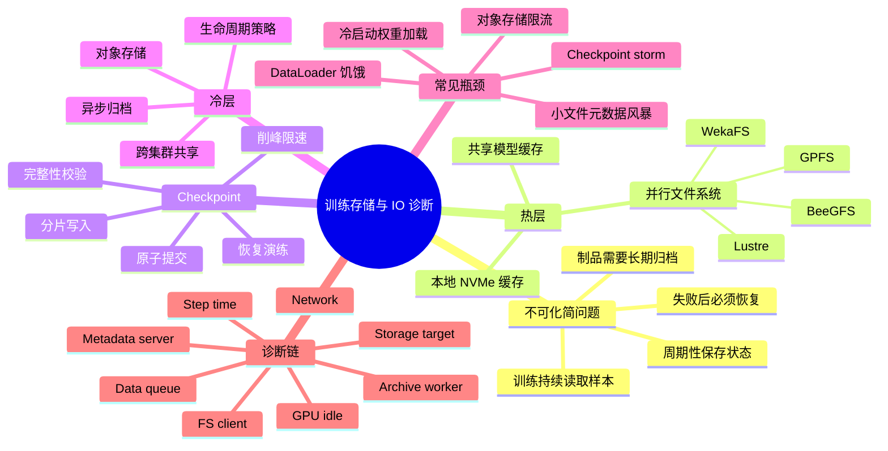
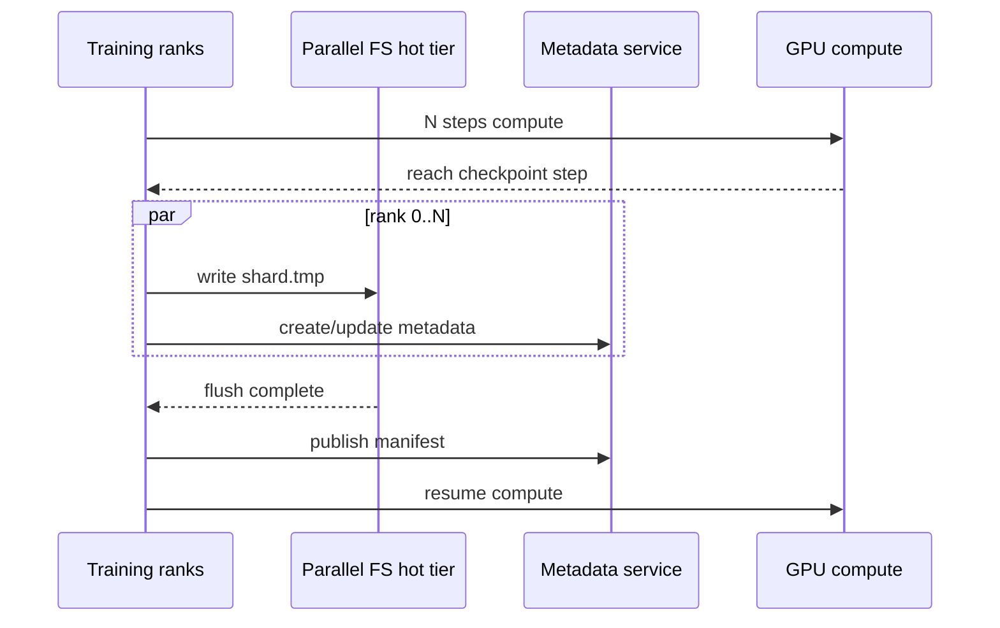
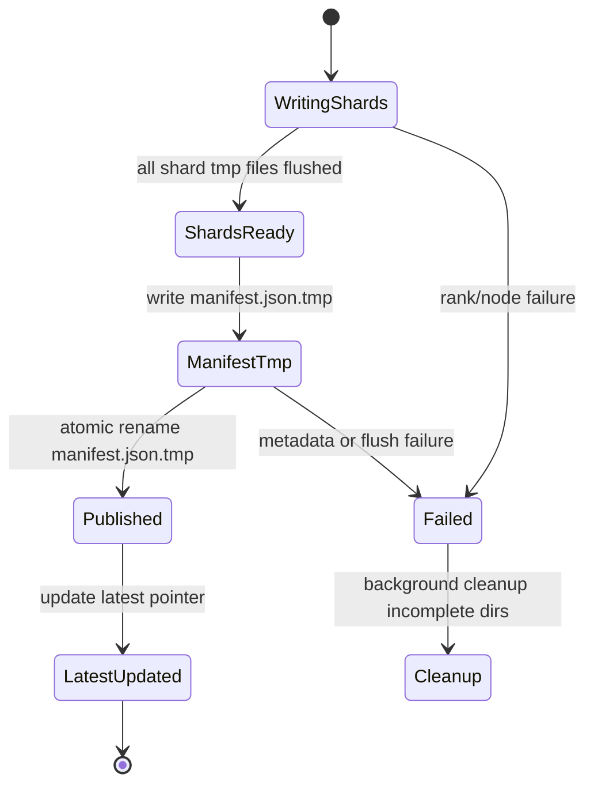
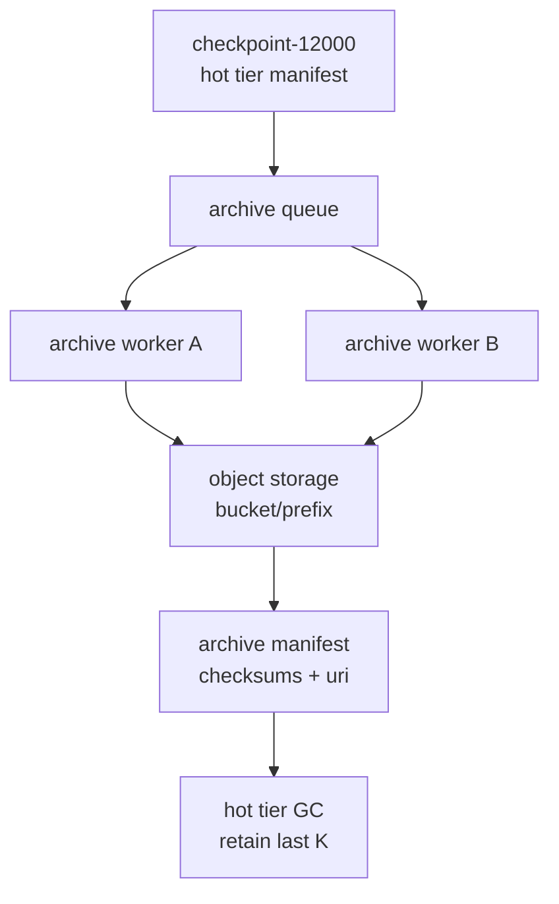
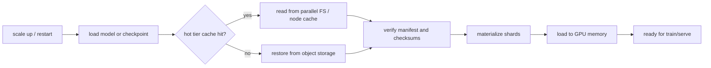
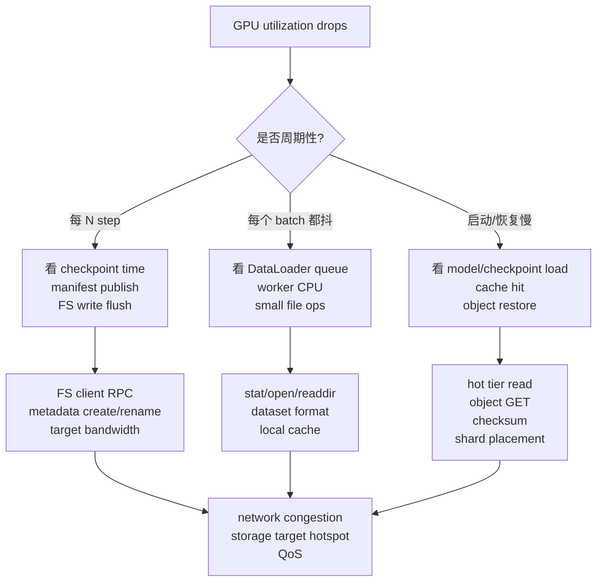

# 第5d章：训练存储、Checkpoint 与 IO 诊断

> **关联章节**：本章是 [第5章](./05-memory-interconnect-io.md) 中训练存储与 IO 路径的独立拆分篇。第5章讲“数据搬运链路”的总体骨架，本章聚焦训练集群里最容易被低估的共享热层、并行文件系统、checkpoint 写入与恢复、对象存储归档，以及 dataloader 和模型加载带来的 IO 瓶颈。阅读时可以同时参考 [第10章](../part3-training-infra/10-memory-checkpointing-and-recovery.md) 的训练恢复机制、[第11章](../part4-data-and-storage/11-data-pipeline.md) 的数据管道，以及 [第12章](../part4-data-and-storage/12-artifacts-and-checkpoints.md) 的制品管理。

## 1. 第一性原理拆解 + 学习大纲

### 拆 — 不可化简的问题

把 Lustre、GPFS、BeeGFS、WekaFS、S3、checkpoint shard、DataLoader worker 这些名字先拿掉，本章真正要解决的问题只有一个：**训练不是只消耗 GPU 算力，它还持续读取样本、加载权重、写入状态、恢复状态、归档制品；这些 IO 动作会在时间上聚集、在文件系统上共享、在失败时决定能否继续训练。**

这句话里有三层约束。第一层是吞吐约束：一个 1024 卡训练作业看起来像一个计算任务，但它可能同时有上千个进程读取数据、周期性写 checkpoint、重启时并发加载模型。第二层是一致性约束：checkpoint 写完之前不能被恢复逻辑误读，元数据更新不能让别的 rank 看到半成品，归档到对象存储不能破坏“最新可恢复点”的语义。第三层是平台约束：训练集群通常不止一个作业，多个团队共享同一个并行文件系统热层；一个作业的 checkpoint storm 可能拖慢另一个作业的 dataloader，让 GPU 利用率同时锯齿化。

所以，训练存储不是“买一个大文件系统”。它要回答四个问题：热数据放在哪里，写入峰值如何削平，恢复路径是否可预测，冷归档是否不干扰训练主路径。任何一个问题没设计好，GPU 集群都会出现相同的症状：step time 变长、GPU 空洞、rank 间等待、checkpoint 卡住、重启慢、文件系统元数据打满。

### 推 — 从这个问题如何推导出每个机制

从“训练持续读取样本”出发，第一步会得到训练存储热层。热层不是长期数据湖，而是离 GPU 集群足够近、能承受高并发读取、能给作业提供稳定吞吐的共享文件层。并行文件系统的价值在这里出现：Lustre、GPFS、BeeGFS、WekaFS 都在用不同方式把多个存储节点的容量和带宽聚合成一个命名空间，让很多训练节点可以并发读写。

从“训练周期性写入状态”出发，第二步会得到 checkpoint 设计。checkpoint 写入不能只看平均带宽，因为真正危险的是所有 rank 在同一时间把几十 GB 到数 TB 状态写向同一个热层。于是必须做分片、分层、限速、错峰、异步写、两阶段提交和原子发布。写入完成后，还要能被恢复逻辑验证：哪些 shard 完整，哪个 global step 可恢复，优化器状态、随机数状态、数据迭代位置是否匹配。

从“训练最终要保留制品”出发，第三步会得到对象存储归档。对象存储容量弹性好、成本低、跨集群共享方便，但它不是低延迟 POSIX 文件系统。工程上通常把并行文件系统作为热层，把对象存储作为冷层或制品层：训练先写到热层并完成原子提交，再由后台任务异步归档到对象存储。这样既保护训练主路径，又能满足长期保留、审计和跨区域复制。

最后，机制会推导出诊断链。IO 问题不能只看 `iostat` 或只看 GPU 利用率。你要把训练时间线、dataloader 队列、page cache、文件系统客户端、元数据服务、对象存储请求、网络端口、checkpoint 日志连起来。排障的核心不是“存储慢”，而是判断慢在小文件元数据、顺序读带宽、随机读放大、客户端缓存、服务端 OST/NSD/target 热点、网络拥塞、对象存储 API 限流，还是 checkpoint 提交语义设计错误。

### 概念先说清楚

训练存储热层是离 GPU 集群足够近、为正在运行的训练作业提供稳定高并发读写的存储层。它通常是并行文件系统、本地 NVMe 缓存或共享高性能文件层，不等同于长期数据湖。热层的目标是服务当前训练节拍：DataLoader 要持续读，模型加载要可预测，checkpoint 写入不能把其他作业拖死。它强调低抖动、聚合带宽、元数据能力和可恢复语义。

Checkpoint 是训练状态的可恢复快照，不只是“把权重保存成文件”。一个完整 checkpoint 通常要包含模型参数、优化器状态、scheduler、随机数状态、数据迭代位置、并行分片元数据、版本信息和完整性校验。分布式训练里 checkpoint 往往由多个 rank 分片写出，任何一个 shard 半写、丢失或版本错配，都可能让恢复失败或产生错误训练状态。因此 checkpoint 设计要包含 staging、完整性标记、两阶段提交、原子发布、保留策略和恢复演练。

对象存储冷层适合长期归档、跨集群分发和低成本保存，但它不是低延迟 POSIX 热层。把 checkpoint 先写到热层并完成原子提交，再异步归档到对象存储，是为了把训练主路径和归档路径解耦。IO 诊断也要沿着这个边界做：DataLoader 饥饿、Page Cache miss、小文件元数据风暴、checkpoint storm、对象存储 API 限流和归档 worker 堆积，是不同层的故障，不能都叫“存储慢”。

### 绘 — 因果链路



### 导 — 读完本章你应该能回答

1. 训练存储热层和对象存储冷层分别解决什么问题，为什么不能互相假装？
2. Lustre、GPFS、BeeGFS、WekaFS 在平台视角下分别有哪些典型优势和运维关注点？
3. 为什么 checkpoint 写入要关注峰值、元数据、提交语义和恢复演练，而不是只看文件系统总带宽？
4. 如何设计 checkpoint 的削峰、分片、原子提交和异步归档？
5. dataloader 小文件问题为什么会让 GPU 空转，如何从数据格式、缓存和预取层面治理？
6. 冷启动和模型加载为什么会变成线上推理或训练恢复的尾延迟问题？
7. 遇到 GPU 利用率锯齿、step time 周期性尖刺或 checkpoint 卡住时，你会如何沿着训练、客户端、文件系统、网络和对象存储排查？

## 正文内容

### 5d.1 训练存储不是“一个目录”

训练作业通常会同时触碰几类数据：

| 数据类型 | 生命周期 | 典型位置 | IO 特征 | 平台关注点 |
|----------|----------|----------|---------|------------|
| 原始数据 | 长期 | 对象存储、数据湖 | 大容量、批量导入 | 成本、权限、版本、审计 |
| 训练热数据 | 作业运行期到数周 | 并行文件系统、本地 NVMe 缓存 | 高并发读取、shuffle、预取 | 吞吐稳定性、元数据压力、缓存命中 |
| 模型权重 | 训练和推理共用 | 共享热层、模型仓库、本地缓存 | 大文件顺序读、启动时突发 | 冷启动、版本一致性、热点副本 |
| Checkpoint | 每隔 N step 写入 | 并行文件系统热层，之后归档 | 周期性大写入、恢复读取 | 原子提交、保留策略、恢复时间 |
| 日志与指标 | 运行期 | 日志系统、对象存储 | 小写入、持续追加 | 不要和 checkpoint 抢主路径 |
| 中间样本缓存 | 临时 | 本地 NVMe、节点缓存 | 高频读写、可丢弃 | 淘汰策略、节点亲和、重建成本 |

这几类数据如果都扔进同一个目录，会造成两个问题。第一，访问模式互相伤害：大量小日志、dataloader 小文件、checkpoint 大写入、模型冷加载会争同一套元数据和后端带宽。第二，语义混乱：训练恢复需要的是“完整且可验证的 checkpoint”，制品归档需要的是“长期可追溯的版本”，临时缓存需要的是“可丢弃且可重建”。把它们混在一起，排障时很难判断谁在消耗资源。

更合理的训练存储分层是：

```text
对象存储 / 数据湖
  -> 数据准备与格式转换
  -> 训练热层：并行文件系统或共享高性能文件层
  -> 节点本地 NVMe 缓存 / page cache
  -> DataLoader worker / CPU 内存队列
  -> H2D 拷贝
  -> GPU 计算

训练状态
  -> Rank 本地 shard
  -> 热层 checkpoint staging
  -> 原子发布 latest
  -> 后台异步归档到对象存储
```

工程上要把这两条路径分开看：样本读取路径追求持续供给，checkpoint 路径追求可恢复和可削峰。两者共享热层时，要通过目录、配额、QoS、客户端挂载参数和作业策略隔离。

### 5d.2 热层、冷层与缓存层

训练平台至少需要三种存储角色：

1. **热层**：服务正在训练的作业，要求低抖动、高并发、POSIX 或近似 POSIX 语义，典型是并行文件系统。
2. **缓存层**：减少重复远端读取，典型是本地 NVMe、节点级 cache、数据集预热目录。
3. **冷层**：长期保存原始数据、模型制品、归档 checkpoint，典型是对象存储。

不要把对象存储直接当训练热层，除非你的数据格式、客户端、并发控制和预取都为对象存储优化过。对象存储擅长大对象、批量吞吐和低成本持久化，不擅长被上千个 worker 当成本地目录随机 `stat/open/read` 小文件。相反，也不要把并行文件系统当无限归档仓库：热层容量昂贵，保留所有历史 checkpoint 会挤压正在训练的作业。


一个实用原则是：**热层只放近期要高速访问的内容，冷层保存长期必须存在的内容，缓存层保存可以重建的内容。** 这样容量、带宽和恢复语义才不会互相绑死。

### 5d.3 并行文件系统的平台视角

并行文件系统的核心目标是把多个存储节点的容量、带宽和元数据能力聚合给大量客户端。训练平台关心的不是“哪个文件系统绝对最好”，而是它能否稳定服务你的访问形状。

| 文件系统 | 平台视角下的典型优势 | 常见关注点 | 更适合的场景 |
|----------|----------------------|------------|--------------|
| Lustre | HPC 生态成熟，顺序大文件吞吐强，striping 控制明确 | 元数据服务要保护，小文件和目录风暴容易打爆 MDT，客户端与内核版本管理重要 | 大规模训练热数据、checkpoint 大文件写入、HPC 风格集群 |
| IBM Spectrum Scale / GPFS | 企业级特性完整，多协议和策略管理能力强，元数据与数据管理成熟 | 部署和运维复杂度较高，授权和平台集成要提前评估 | 多租户企业 AI 平台、混合工作负载、需要强治理的共享文件层 |
| BeeGFS | 部署相对轻量，性能调优直观，适合用通用服务器搭建高吞吐文件层 | 企业能力、生态集成和大规模治理要按版本与团队经验验证 | 中小到较大规模训练集群、需要快速搭建和灵活扩展的热层 |
| WekaFS | 面向低延迟高吞吐工作负载，云和对象存储分层能力较强，AI 场景常见 | 成本、专有栈、网络与客户端要求要纳入 TCO | 商业 AI 平台、云上混合热层、需要透明 tiering 的场景 |

这张表不是采购结论，而是排查入口。比如：

- 如果训练样本已经打包成少量大 shard，Lustre 的大文件带宽可能表现很好；
- 如果平台需要细粒度配额、快照、策略迁移和企业目录集成，GPFS 的治理能力可能更重要；
- 如果团队想用通用 NVMe 服务器快速搭建共享训练热层，BeeGFS 的简单性可能有优势；
- 如果想把高性能文件层和对象存储生命周期打通，WekaFS 的分层能力可能降低平台胶水成本。

真正验收时，要用你的 workload 做基准，而不是只看厂商数字。至少要覆盖：

| 基准类型 | 目的 | 示例指标 |
|----------|------|----------|
| 大文件顺序读 | 模拟打包数据集和模型加载 | GB/s、客户端扩展效率、P95 读延迟 |
| 大文件并发写 | 模拟 checkpoint shard 写入 | 聚合 GB/s、写入抖动、flush 时间 |
| 小文件元数据 | 模拟未打包图片、JSON、token 文件 | `stat/open/create` ops/s、MDT/MDS CPU |
| 混合读写 | 模拟多作业共享热层 | 带宽隔离、QoS、尾延迟 |
| 恢复读取 | 模拟故障后同时加载 checkpoint | 恢复时间、热点目录压力、客户端重试 |

### 5d.4 Checkpoint 的第一性原理

checkpoint 保存的是“让训练可以从某个点继续”的最小充分状态。对大模型训练，通常包括：

| 状态 | 为什么需要 | 常见位置 |
|------|------------|----------|
| 模型权重 | 恢复参数 | 每个 rank 或参数分片保存 |
| 优化器状态 | Adam 等优化器需要动量、方差等状态 | 通常比权重大，常分片 |
| LR scheduler 状态 | 保持训练曲线连续 | 小文件或 manifest |
| RNG 状态 | 保持 dropout、采样等随机过程可复现 | 每 rank 状态 |
| DataLoader / sampler 状态 | 避免重复或跳过样本 | global step、epoch、shuffle seed、offset |
| 并行策略元数据 | 说明 TP/PP/DP/FSDP/ZeRO 分片方式 | manifest |
| 代码和配置摘要 | 防止用错误代码恢复 | git sha、config、依赖版本 |

最常见的错误是只保存权重。权重能用于推理或微调初始化，但不一定能恢复训练。训练恢复需要优化器状态、数据位置、并行拓扑和随机状态匹配。否则表面上“load 成功”，实际训练曲线可能跳变，或者恢复后重复消费数据。

checkpoint 还有一个平台问题：状态大小通常随模型和并行策略放大。一个 70B BF16 权重大约 140 GB，仅权重已经很大；如果保存 Adam 优化器状态，状态体积可能是权重的数倍。再加上多份保留和多个实验，热层容量会很快被占满。

### 5d.5 写入峰值：Checkpoint Storm

训练 checkpoint 最危险的不是平均写入，而是峰值写入。假设一个作业有 512 个 rank，每个 rank 同时写 4 GB shard，总写入量是 2 TB。如果所有 rank 在同一秒开始写，热层会同时面对：

- 大量客户端并发写；
- 大量新文件创建和 rename；
- 存储 target 上的突发带宽；
- 元数据服务上的目录更新；
- 网络 fabric 上的突发流量；
- 训练进程等待写入完成造成的 GPU 空洞。

如果多个作业 checkpoint 周期刚好对齐，平台会看到周期性 step time 尖刺。用户往往会说“GPU 有时候突然很慢”，但根因可能是共享文件系统被 checkpoint storm 打满。



这条时间线里，GPU 等待的是整个 checkpoint 提交流程，而不是单个 shard 写完。只要最慢 rank 没完成，训练就不能认为这个 global checkpoint 可恢复。

### 5d.6 Checkpoint 削峰策略

削峰的目标不是让 checkpoint 消失，而是让它不把共享热层打成尖峰。

| 策略 | 作用 | 代价 | 适用场景 |
|------|------|------|----------|
| Rank 分片写 | 避免单文件写入瓶颈，天然匹配分布式状态 | 文件数量增加，manifest 更重要 | FSDP、ZeRO、Megatron 等大规模训练 |
| 分组错峰 | 不同 rank group 分批写入 | checkpoint wall time 可能变长 | 热层带宽不足但训练可容忍稍长保存 |
| 限速写入 | 给作业或客户端设置写入上限 | 单作业保存变慢 | 多租户共享文件系统 |
| 本地 NVMe staging | 先落本地，再后台汇聚 | 节点故障时本地临时数据可能丢失 | 可接受两阶段保存或有冗余设计 |
| 异步 checkpoint | 训练继续推进，后台写入状态副本 | 需要额外内存/磁盘，语义复杂 | 大模型长训练，checkpoint 开销明显 |
| 增量 / 差分 | 只写变化部分 | 实现复杂，恢复链变长 | 状态变化稀疏或框架支持成熟 |
| 保留窗口 | 只保留最近 K 个热 checkpoint | 需要可靠归档 | 热层容量有限 |

一个常见的工程组合是：

```text
每个 rank 写本 rank shard.tmp
  -> group 内完成后写 group manifest.tmp
  -> 所有 group 完成后写 global manifest.tmp
  -> fsync / flush 必要元数据
  -> rename global manifest.tmp 为 checkpoint-N/manifest.json
  -> 更新 latest 指针
  -> 后台归档 checkpoint-N
```

这里的关键是：恢复逻辑只认已经发布的 manifest，不扫描半成品目录猜测“看起来写完了没有”。

#### 5d.6.1 Checkpoint IO CapacityLedger

训练 checkpoint 的容量账本必须同时回答四件事：一次写多少、允许暂停多久、热层同时承受多少作业、恢复要读多少。下面这张表应成为大作业上线前的固定审查项。

| 项 | 公式 / 填写方式 | 证据来源 | threshold |
|----|-----------------|----------|-----------|
| 单次 checkpoint 大小 | `ckpt_bytes = model + optimizer + scheduler + RNG + dataloader + metadata` | 框架 checkpoint manifest、历史作业 | 不允许只按权重大小估算；Adam 状态常是权重数倍 |
| 每 rank shard | `shard_bytes = ckpt_bytes / checkpoint_writers`，再加临时文件和校验文件 | rank 数、FSDP/ZeRO/Megatron 配置 | shard 太小会放大元数据，太大容易单 target 热点 |
| 允许暂停窗口 | `allowed_pause = checkpoint_budget_ratio * interval_seconds` 或明确 SLO | 训练调度策略、用户 SLO | checkpoint pause 超过 step 窗口预算要异步或削峰 |
| 所需写带宽 | `required_ckpt_bw = ckpt_bytes / allowed_pause` | 容量账本 | `fio`/文件系统聚合写入 baseline >= `required_ckpt_bw * 1.3` |
| 平台并发峰值 | `platform_peak = sum(ckpt_bytes_i / write_window_i)` | 调度器、checkpoint 周期、jitter 策略 | 多作业峰值不超过热层写入 baseline 的 70%，保留 30% 给 dataloader/恢复 |
| 热层保留窗口 | `hot_retention = recent_k * ckpt_bytes + staging_headroom` | 恢复 SLO、归档延迟 | 热层至少保留最近 2-3 个已发布 checkpoint，且归档失败不能触发删除 |
| 恢复读带宽 | `restore_time = ckpt_bytes_to_read / effective_read_bw + verify_time + load_time` | 恢复演练、`fio` 读基线 | restore P95 必须低于作业恢复 SLO；跨对象存储恢复要单独演练 |

例子：一个作业每 30 分钟保存 2TB checkpoint，希望同步暂停不超过 120 秒，则 `required_ckpt_bw≈16.7GB/s`。考虑 1.3 余量，目标热层对这个作业的可用写入能力至少约 21.7GB/s。如果平台上 6 个类似作业 checkpoint 周期对齐，瞬时需求会超过 100GB/s，平均带宽看起来充足也会出现 checkpoint storm。

#### 5d.6.2 BenchmarkProtocol：用 fio、iostat 和文件系统指标复测

| 目标 | 命令 / 方法 | 看什么 | 通过标准 |
|------|-------------|--------|----------|
| 单客户端写入 | `fio --name=ckpt --rw=write --bs=4M --iodepth=32 --numjobs=4 --size=128G --filename=<hot-tier>/fio.bin --direct=1` | 单节点可写 GB/s、P99 latency | >= 节点池 baseline 85%，无长尾尖刺 |
| 多客户端聚合写 | 在目标节点数并发跑 `fio`，文件分散到 checkpoint staging 目录 | 聚合 GB/s、metadata/create/rename、服务端 target 均衡 | >= `required_ckpt_bw * 1.3`，target 不出现明显热点 |
| 小文件元数据 | 用 mdtest 或等价工具模拟 create/stat/rename；Lustre 可看 MDS/MDT 指标 | create/rename latency、MDS CPU、RPC queue | checkpoint manifest 和 shard 数不会把 MDS 打满 |
| 运行中排队 | `iostat -x 1`、文件系统客户端 RPC、Lustre `lfs df -h`/`lfs getstripe` | `await,%util,dirty,flush` 与 checkpoint time 对齐 | `await` 不超过空闲基线 2 倍；flush 在 pause 预算内 |
| 恢复读取 | 从热层和对象存储归档各恢复一次 | restore time、checksum、加载到 GPU 前耗时 | restore P95 达 SLO；归档 checkpoint 可独立恢复 |
| 归档干扰 | archive worker 限速前后对训练 step、NIC、对象存储 PUT 的影响 | 归档是否抢训练网络或热层读写 | 归档期间非 checkpoint 作业 step P99 不同步上升 |

`fio` 不能证明 checkpoint 语义正确，只能证明某种 IO 形状下的容量。checkpoint 验收还必须故意模拟 rank 失败、半写 shard、manifest 缺失、对象存储上传失败和热层清理延迟，确认恢复逻辑只认完整 manifest。

### 5d.7 原子提交：让恢复逻辑不读半成品

checkpoint 的原子性通常不来自“所有文件作为一个事务提交”，因为大多数并行文件系统不会给你跨上千个文件的事务语义。工程上常用 manifest 作为提交点：

1. 写入所有 shard 到临时文件名，例如 `rank-00042.pt.tmp`；
2. 对每个 shard 记录大小、校验和、rank、分片范围；
3. shard 写完并 flush 后 rename 为正式文件名；
4. 写 `manifest.json.tmp`，包含所有 shard 列表和训练状态；
5. flush manifest；
6. 原子 rename 为 `manifest.json`；
7. 更新 `latest` 指针或 `latest.json`。

恢复时只做一件事：读取某个 checkpoint 目录下已经正式发布的 manifest，并按 manifest 校验 shard。没有 manifest 的目录一律视为未完成；manifest 中缺 shard 或校验失败，一律视为不可恢复。



不要把“目录存在”当作 checkpoint 完成，也不要让 rank 0 在其他 rank 未确认完成时提前更新 `latest`。这类错误平时不明显，真正节点故障后会把恢复流程带到半成品状态。

### 5d.8 异步归档到对象存储

对象存储适合保存长期制品，但不适合放在训练主路径的同步提交里。更稳妥的模式是：

1. 训练进程只负责把 checkpoint 完整提交到热层；
2. 平台侧 archive worker 监听已发布 manifest；
3. archive worker 按 manifest 上传 shard 到对象存储；
4. 上传完成后写归档 manifest 和校验结果；
5. 生命周期策略清理热层旧 checkpoint，但至少保留最近 K 个可快速恢复点。



异步归档要处理三个边界：

| 边界 | 风险 | 处理方式 |
|------|------|----------|
| 上传失败 | 热层以为已归档但对象不完整 | 归档 manifest 必须在所有对象校验后发布 |
| 对象存储限流 | 归档 worker 抢占训练网络或 API quota | 限速、队列、退避、错峰 |
| 热层清理过早 | 最近可恢复点被删，远端又不可用 | 清理只认归档完成标记，保留热层窗口 |

对于多区域或跨集群恢复，还要把加密、权限、bucket 生命周期、对象版本、跨区域复制延迟纳入恢复演练。归档成功不等于恢复成功，恢复成功要能在目标集群读回、校验、加载并继续训练。

### 5d.9 DataLoader 小文件问题

很多训练 IO 瓶颈并不来自大文件带宽，而来自小文件元数据。典型例子是图片训练或多模态训练：每个样本一个图片文件、一个 JSON、一个文本文件，上亿样本散在深目录里。DataLoader worker 每取一个 batch 都在做：

```text
stat -> open -> read small range -> close -> decode -> collate
```

当 worker 数、节点数和作业数增加后，元数据服务会先被打满。症状通常是：

- GPU 利用率呈锯齿；
- DataLoader queue 经常为空；
- CPU worker 在 `open/stat/readdir` 上等待；
- 文件系统 MDS/MDT CPU 或 RPC 队列很高；
- 单节点测试还好，多节点一扩就慢。

治理方式通常比“换更快磁盘”更有效：

| 问题 | 优先治理 | 说明 |
|------|----------|------|
| 每样本多个小文件 | 打包成 shard | WebDataset tar、TFRecord、Parquet、Arrow、自定义 mmap 格式 |
| 随机读太碎 | 建索引并顺序预取 | 用大块连续读换随机小读 |
| 重复解码昂贵 | 缓存预处理结果 | 注意版本和数据增强语义 |
| 远端读取抖动 | 本地 NVMe warmup | 作业启动前预热热点 shard |
| 多作业抢元数据 | 数据集目录隔离和配额 | 避免所有团队共享同一热点目录 |

一个常见误区是盲目增加 `num_workers`。当瓶颈是 CPU 解码时，增加 worker 可能有效；当瓶颈是元数据服务或后端存储时，增加 worker 只会把压力放大。正确做法是同时看 DataLoader queue、worker CPU、文件系统 metadata ops、读吞吐和 GPU idle。

### 5d.10 冷启动、模型加载与恢复 IO

训练恢复和推理冷启动都有一个共同点：大量进程在短时间内读取同一批模型或 checkpoint 文件。它们不是稳定吞吐问题，而是启动风暴问题。

训练恢复时，平台要回答：

- 由多少 rank 同时读 checkpoint？
- 每个 rank 读自己的 shard，还是所有 rank 读公共权重后再切分？
- shard 是否和恢复后的并行拓扑一致？
- 热层上最近 checkpoint 是否还在，还是必须从对象存储拉回？
- 恢复前是否做完整性校验，校验是否会再制造一次读风暴？

推理冷启动时，平台要回答：

- 模型权重是否已经在节点本地缓存？
- 多副本同时扩容时是否会打爆共享模型仓库？
- 量化权重、tokenizer、LoRA adapter 是否一起缓存？
- 权重加载是否和服务就绪探针绑定，避免半加载副本接流量？



工程上，冷启动治理常见做法包括：节点级模型缓存、镜像预拉取、权重分层下载、启动错峰、按副本限速、只读共享缓存、恢复前预取 checkpoint、以及把模型加载时间纳入 SLO。不要只统计服务进程启动时间，真正用户感知的是“副本能稳定接请求”或“训练能继续跑 step”的时间。

### 5d.11 观测指标：从训练到存储

IO 诊断需要跨层指标。下面是一组实用的观测清单：

| 层级 | 指标 | 说明 |
|------|------|------|
| 训练框架 | step time、checkpoint time、restore time、samples/s、tokens/s | 先确认用户体验层是否真的变慢 |
| GPU | GPU utilization、SM active、memory copy overlap、idle gap | 判断 GPU 是否在等数据或等同步 |
| DataLoader | queue depth、batch wait time、worker CPU、worker exception | 识别数据供给不足 |
| 进程 IO | read/write bytes、IO wait、open/stat 次数、fd 数 | 判断大读写还是小文件元数据 |
| 客户端缓存 | page cache hit、local NVMe hit、cache eviction | 确认缓存是否有效 |
| 文件系统客户端 | RPC latency、retransmit、dirty pages、flush time | 观察客户端到服务端路径 |
| 元数据服务 | metadata ops/s、MDS/MDT CPU、lock wait、rename/create latency | 小文件和 checkpoint 提交关键 |
| 存储 target | OST/NSD/target bandwidth、IOPS、queue depth、磁盘延迟 | 判断数据服务端热点 |
| 网络 | NIC throughput、packet loss、ECN/PFC、retransmit、端口拥塞 | 存储流量和训练通信可能互相影响 |
| 对象存储 | GET/PUT QPS、错误率、P95/P99 latency、throttle、egress | 归档和冷恢复关键 |

不要只看平均值。训练 IO 问题常常是尾延迟和周期性尖刺：checkpoint 每 30 分钟打一次峰，dataloader 每个 epoch 切换 shard 时抖一次，对象存储在归档高峰时限流。P95/P99、时间线和作业事件比全天平均吞吐更有价值。

### 5d.12 排障链：从 GPU 空洞往回追

遇到“GPU 利用率低”时，可以按下面顺序排查：



更具体的排障动作：

1. **先切时间线**：把 step time、checkpoint start/end、data wait、GPU idle、文件系统指标放到同一时间轴。
2. **判断访问形状**：是大文件顺序读写，还是小文件元数据；是持续慢，还是周期性尖刺。
3. **缩小范围**：单节点复现、少量节点复现、全规模复现分别跑一遍。
4. **区分客户端和服务端**：只有某些节点慢，优先看客户端挂载、缓存、网络路径；所有节点慢，优先看服务端和共享资源。
5. **验证热层与冷层边界**：确认训练主路径有没有直接依赖对象存储，归档 worker 有没有抢带宽。
6. **做恢复演练**：能写 checkpoint 不代表能恢复；必须定期从最新热 checkpoint 和归档 checkpoint 分别恢复。

#### 5d.12.1 Troubleshooting：训练存储与 checkpoint IO

| symptom | evidence | root cause | action | retest |
|---------|----------|------------|--------|--------|
| 每 N step 或每 30 分钟 GPU 同步掉速 | checkpoint start/end 与 step P99、`iostat await`、MDS create/rename 同步尖刺 | checkpoint storm 或 manifest 发布打满元数据 | checkpoint jitter、rank group 分批写、限速、本地 staging、减少 shard 数 | checkpoint pause 低于预算；非 checkpoint 作业 step P99 不再同步尖刺 |
| checkpoint 写完但恢复失败 | manifest 缺 shard/checksum 错；恢复逻辑扫描半成品目录；rank 日志显示部分 tmp 未 rename | 原子提交协议不完整 | 只发布完整 manifest；tmp -> final 后再更新 latest；失败目录后台清理 | 故意 kill rank 后恢复端必须拒绝半成品；最新可恢复点保持前一个完整 checkpoint |
| 归档到对象存储后热层 checkpoint 被删，恢复很慢或失败 | archive manifest 缺失；对象存储 PUT error/throttle；GC 日志早于归档完成 | 热层 GC 没有绑定归档完成标记 | GC 只认 archive manifest；对象上传限速退避；保留最近 K 个热 checkpoint | 从热层和对象存储各恢复一次；归档失败时热层不删除 |
| DataLoader queue 为空，文件系统总带宽不高 | `open/stat/readdir` 高，MDS/MDT CPU 高，读吞吐低 | 小文件元数据风暴 | shard 化、索引、顺序预取、本地 NVMe warmup，限制 worker | metadata ops 降低；queue depth 稳定；GPU wait 低于 step 的 10% |
| 恢复或模型冷启动同时扩容时 P99 爆炸 | 多 rank/副本同时读同一权重或 checkpoint；热层 read、对象 GET、NIC 吞吐同步尖刺 | 启动风暴和热点文件 | 节点级缓存、错峰恢复、按副本限速、只读共享缓存、ready 前校验 | restore/ready P95 达 SLO；热点文件读被缓存吸收 |
| `fio` 达标但真实 checkpoint 仍慢 | `fio` 大块顺序写好，真实日志显示大量小 shard/rename/fsync | benchmark 形状不匹配真实 checkpoint | 用真实 shard 大小、文件数、目录结构和并发 writer 重跑 BenchmarkProtocol | 真实形状 benchmark 达 `required_ckpt_bw * 1.3`；manifest publish 在预算内 |

### 5d.13 工程案例一：小文件数据集导致 256 卡训练吃不满

背景：一个视觉语言预训练作业从 32 卡扩到 256 卡后，GPU 利用率从 85% 降到 45%，step time 抖动明显。单节点测试时文件系统吞吐看起来正常。

初始现象：

- 每张 GPU 的计算 kernel 中间有明显空洞；
- DataLoader queue 经常降到 0；
- 文件系统总读带宽没有打满；
- 元数据服务 CPU 接近满载，`open/stat` 延迟升高；
- 数据集目录包含数亿个图片和 JSON 小文件。

判断：瓶颈不是数据带宽，而是小文件元数据。扩卡后 worker 数线性增加，元数据请求先爆。

治理方案：

| 动作 | 目的 | 结果 |
|------|------|------|
| 将样本打包成 512 MB 到数 GB 的 shard | 降低 `open/stat` 次数 | 元数据 ops 大幅下降 |
| 为 shard 建索引 | 支持随机抽样和断点恢复 | 保留 shuffle 能力 |
| 作业启动前预热本地 NVMe | 减少共享热层重复读取 | epoch 切换抖动下降 |
| 限制单节点 worker 上限 | 避免把元数据服务打爆 | 稳定性提升 |
| 监控 DataLoader queue | 让瓶颈可见 | 后续回归能及时发现 |

工程结论：小文件问题不要用“更多 worker”硬顶。训练数据格式是系统设计的一部分，直接决定并行文件系统看到的是大块顺序读，还是海量元数据风暴。

### 5d.14 工程案例二：Checkpoint Storm 拖慢全平台

背景：平台上有 6 个大训练作业，每个作业每 30 分钟保存一次 checkpoint。多个作业启动时间接近，checkpoint 周期对齐。用户反馈每半小时 GPU 利用率同时掉一次。

排查发现：

- checkpoint 时间段文件系统写吞吐达到峰值；
- 元数据 rename/create 延迟升高；
- 对象存储归档 worker 也在 checkpoint 完成后立刻全速上传；
- 另一个不保存 checkpoint 的作业 dataloader 也变慢，说明共享热层被影响。

治理方案：

1. 作业级 checkpoint jitter：不同作业保存间隔加入随机偏移；
2. rank group 分批写入，限制单作业瞬时写入；
3. 归档 worker 限速并延迟启动，避开热层写入高峰；
4. 热层保留最近 2-3 个 checkpoint，旧 checkpoint 归档完成后清理；
5. checkpoint 指标进入平台面板，按作业展示写入量、持续时间、失败率和恢复成功率。

工程结论：checkpoint 是平台流量，不是单个训练脚本的私事。多租户集群必须把 checkpoint 纳入调度、配额、QoS 和观测。

### 5d.15 Checklist

| 检查项 | 通过标准 |
|--------|----------|
| 训练热层和对象存储职责是否分开 | 热层只承载近期高性能访问，冷层负责长期归档 |
| 数据集是否避免海量小文件直读 | 大规模训练使用 shard、索引、缓存或专门数据格式 |
| checkpoint 是否有 manifest | 恢复逻辑只认已发布 manifest，不读半成品目录 |
| checkpoint 是否原子发布 | shard 完整、校验通过后再发布全局 manifest 和 latest |
| checkpoint 是否削峰 | 分组、限速、错峰或异步机制至少有一种 |
| 归档是否异步 | 对象存储上传不阻塞训练主路径 |
| 热层清理是否安全 | 只删除已归档且超出保留窗口的 checkpoint |
| 恢复是否演练 | 定期从热层和对象存储分别恢复 |
| 冷启动是否可观测 | 统计权重下载、校验、加载到 GPU、服务就绪时间 |
| dataloader 是否可观测 | 有 queue depth、batch wait、worker CPU、读取延迟 |
| 文件系统指标是否接入 | 元数据、target 带宽、RPC 延迟、客户端错误可见 |
| 多作业是否隔离 | 配额、目录、QoS、归档限速避免互相拖垮 |

### 5d.16 速记表

| 主题 | 一句话判断 |
|------|------------|
| 热层 | 给正在训练的作业提供稳定高并发 IO，不负责无限归档 |
| 对象存储 | 适合长期保存和跨集群共享，不应直接承受 POSIX 小文件训练主路径 |
| Lustre | 大文件吞吐强，注意 MDT/小文件和 striping |
| GPFS | 治理能力强，适合企业级多租户，运维复杂度要算进去 |
| BeeGFS | 灵活轻量，适合快速搭建高吞吐热层，治理能力按规模验证 |
| WekaFS | AI 热层和对象分层能力强，成本和专有栈要纳入 TCO |
| Checkpoint storm | 平均带宽不说明问题，峰值和周期性尖刺才危险 |
| 原子提交 | 用 manifest 作为可恢复点，半成品目录不可恢复 |
| 异步归档 | 训练先写热层，后台再上传对象存储 |
| 小文件问题 | 元数据会先于带宽成为瓶颈 |
| 冷启动 | 多副本同时加载权重会制造读风暴 |
| 排障链 | 从 step time 和 GPU idle 出发，沿 DataLoader、FS client、MDS、target、网络、对象存储回溯 |

## 练习题

1. 用“热层、缓存层、冷层”重新设计一个 512 卡训练平台的数据路径。说明哪些数据放在并行文件系统，哪些放在本地 NVMe，哪些放在对象存储。
2. 一个数据集包含 5 亿个小图片文件和 5 亿个 JSON 文件。请设计一种打包、索引、shuffle 和断点恢复方案，目标是降低元数据压力。
3. 某作业每 1000 step 保存一次 checkpoint，每次写入 1.5 TB。平台每 30 分钟出现一次 step time 尖刺。请列出你会检查的训练指标、文件系统指标和网络指标。
4. 设计一个 checkpoint 原子提交协议。要求说明临时文件、正式文件、manifest、latest 指针和失败清理策略。
5. 为什么“checkpoint 目录存在”不能说明 checkpoint 可恢复？请举两个半成品目录被误读的风险。
6. 对比 Lustre、GPFS、BeeGFS、WekaFS：如果你要服务一个多租户企业 AI 平台，你会重点验证哪些能力？
7. 一个训练恢复流程从对象存储拉取 checkpoint 需要 45 分钟，从热层恢复只要 6 分钟。请设计热层保留窗口和归档策略。
8. 某推理平台扩容 100 个 70B 副本时，共享模型仓库被打满，P99 冷启动超过 20 分钟。请提出缓存、错峰和就绪探针方案。
9. DataLoader queue 为空时，如何区分 CPU 解码瓶颈、小文件元数据瓶颈、远端对象存储瓶颈和 H2D 拷贝瓶颈？
10. 如果 archive worker 上传对象存储时抢占了训练网络，你会如何限速、排队和观测？
11. 某团队希望直接把 S3 bucket 挂成文件系统给 PyTorch 训练读取小文件。请从语义、性能和排障三个角度说明风险，并给出替代方案。
12. 设计一次恢复演练：要求同时验证最近热 checkpoint、已归档 checkpoint、校验和、并行拓扑变化和数据迭代位置。
