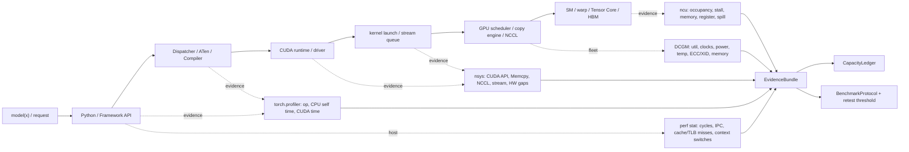

# 第6章：CUDA、运行时与算子执行导览

> **本章已拆分为独立子章**：原来的第 6 章同时覆盖 framework dispatch、kernel launch、stream、CUDA Graph、算子库、SM 资源、profiling 和排障 SOP，单页内容过宽。现在第 6 章保留为导览章，详细内容拆到 06a-06d。

## 1. 第一性原理拆解 + 学习大纲

### 拆 — 不可化简的问题

把 CUDA、PyTorch、Triton、Nsight 这些名字先拿掉，AI 执行栈要解决的不可化简问题是：**CPU 侧的模型语义必须被翻译成 GPU 能执行的命令流；命令流要在正确的数据依赖下排队、重叠和回放；每个 kernel 又必须在有限 SM、HBM、寄存器和 shared memory 里完成实际工作；所有优化结论都要能被 profiler 和基准复测证明。**

因此第 6 章的学习目标不是背 API，而是建立三条路径：

- **control path**：`model(x)` 如何经过 Python、framework dispatcher、ATen、CUDA runtime、driver、kernel launch 和 stream queue，最后变成 GPU work；
- **data path**：输入 batch、权重、workspace、KV cache、H2D/D2H、NCCL buffer 和中间 tensor 如何在 host memory、device memory、HBM、register/shared memory 之间流动；
- **failure path**：固定 launch 开销、隐式同步、overlap 失败、CUDA Graph 回退、fallback kernel、occupancy/resource pressure、allocator 碎片和观测误差如何让端到端吞吐下降。

### 推 — 从问题推导章节

从 control path 出发，先读 [06a](./06a-framework-dispatch-runtime-and-kernel-launch.md)：它回答一个上层 op 怎样被路由到算子实现，并给出 launch overhead 的近似模型：

```text
step_time ≈ cpu_dispatch_time + kernel_launch_time + gpu_execute_time + sync_wait_time + allocator_time
launch_bound 当：kernel_count * launch_overhead 接近或超过 gpu_execute_time
```

从命令排队和数据依赖出发，读 [06b](./06b-streams-synchronization-and-cuda-graphs.md)：它把 stream、event、默认 stream、隐式同步、H2D/compute/NCCL overlap 和 CUDA Graph 放到同一条时间线里。overlap 的基本判断是：

```text
serial_time = t_h2d + t_compute + t_comm
ideal_overlap_time >= max(t_h2d, t_compute, t_comm)
overlap_efficiency = (serial_time - measured_time) / (serial_time - ideal_overlap_time)
```

从 kernel 内部资源出发，读 [06c](./06c-kernel-libraries-fusion-and-sm-resource-limits.md)：它把 cuBLAS、cuDNN、CUTLASS、FlashAttention、Triton、fusion、occupancy、register pressure、shared memory 和 spill 连接起来。融合决策的基本规则是：

```text
fusion_gain ≈ saved_launch_time + saved_hbm_time - extra_compute_time - resource_pressure_penalty
上线条件：端到端吞吐/延迟改善，且 ncu 未显示 spill、occupancy 或 memory coalescing 明显退化
```

从证据链出发，读 [06d](./06d-profiling-debugging-and-performance-sop.md)：它规定先用 BenchmarkProtocol 固定 workload，再用 `nsys` 看系统时间线，用 `torch.profiler` 映射到 op/module，用 `ncu` 下钻少数 kernel，用 `perf stat` 排除主机侧 CPU/NUMA 问题，用 DCGM/nvidia-smi 监控功耗、温度、时钟、显存和 XID，最后用 retest 证明修复有效。

### 绘 — 执行栈证据图



### 导 — 读完本章你应该能回答

1. 一个 forward 有 5000 个 10 us 小 kernel，为什么新 GPU 可能加速不明显？
2. `print(loss.item())` 为什么可能让异步时间线变成串行？
3. 什么时候 CUDA Graph 值得打开，什么时候会因为 dynamic shape、recapture 或 static buffer 让 P99 变差？
4. 一个 fused kernel 比拆开更慢，可能和 register pressure、shared memory、spill、occupancy 有什么关系？
5. 看到 Nsight Systems 里 CUDA HW 行大量空白，你会先查 launch、H2D、NCCL、CPU dispatch 还是 kernel？
6. 为什么 `occupancy` 是诊断指标，而不是最终优化目标？

## 2. 拆分后的阅读路径

| 子章 | 主题 | 你应该在什么时候读 | 必须留下的证据 |
|------|------|--------------------|----------------|
| [06a Framework Dispatch、Runtime 与 Kernel Launch](./06a-framework-dispatch-runtime-and-kernel-launch.md) | Python/API、framework dispatcher、ATen、CUDA runtime/driver、kernel launch 固定开销、eager vs compiled | 你看到一个 step 里小 kernel 很多、CPU launch 跟不上、B200/H100 加速比低 | `torch.profiler` 表、`nsys` CUDA API 时间、kernel count、launch overhead 估算、compiled/eager A/B |
| [06b Stream、同步与 CUDA Graph](./06b-streams-synchronization-and-cuda-graphs.md) | stream、event、默认 stream、隐式同步、H2D/compute/NCCL overlap、CUDA Graph capture/replay | 你看到拷贝和计算串行、`.item()` 导致同步、Graph 开启后收益不稳定 | `nsys` stream/Memcpy/NCCL 时间线、Graph 命中率、fallback/recapture 次数、overlap efficiency |
| [06c 算子库、融合与 SM 资源边界](./06c-kernel-libraries-fusion-and-sm-resource-limits.md) | cuBLAS/cuDNN/CUTLASS/FlashAttention/Triton、fusion、SM/block/warp、occupancy、register pressure、spill | 你要判断该换库、开融合、写 Triton，还是某个 fused kernel 反而变慢 | `ncu` kernel report、库/shape/layout 记录、fusion_gain 假设、端到端 retest |
| [06d Profiling、Debugging 与性能排障 SOP](./06d-profiling-debugging-and-performance-sop.md) | nsys、ncu、torch.profiler、`perf stat`、DCGM、CUDA_LAUNCH_BLOCKING、时间线读法、性能回归测试 | 你要建立团队排障流程，或把一次性能退化定位到具体层级 | EvidenceBundle、CapacityLedger 更新、BenchmarkProtocol、retest threshold 和升级边界 |

## 3. 控制路径、数据路径、失败路径

### 3.1 Control Path

```text
Python model/request
  -> framework dispatcher / autograd / compiler guard
  -> ATen native op / library / generated kernel
  -> CUDA runtime or library API
  -> CUDA driver command submission
  -> stream queue / graph replay
  -> GPU scheduler
  -> kernel execution
```

控制路径的典型失败是 launch-bound：CPU API row 很忙、CUDA HW row 有空洞、kernel 很短且数量多。先用 `nsys profile --trace=cuda,nvtx,osrt,cudnn,cublas` 看 CUDA API 和 HW gaps，再用 `torch.profiler` 找造成小 op 的 module 或 Python 逻辑。只有当 GPU 连续忙且少数 kernel 占大头时，才进入 `ncu`。

### 3.2 Data Path

```text
storage / dataloader
  -> pageable or pinned host memory
  -> H2D copy stream
  -> device memory / allocator cache / workspace
  -> kernel register + shared memory + HBM traffic
  -> D2H metrics / checkpoint / NCCL buffer
```

数据路径的典型失败是搬运或通信没有藏进计算窗口。判断规则是：`t_copy`、`t_compute`、`t_comm` 先分别量出来；修复后 measured step time 应该向 `max(t_copy, t_compute, t_comm)` 靠近，而不是仍接近三者相加。证据来自 `nsys` 的 Memcpy、CUDA HW、NCCL rows，以及必要时的 PCIe/NUMA/topology 工具。

### 3.3 Failure Path

| 症状 | 首要假设 | 证据路径 | retest threshold |
|------|----------|----------|------------------|
| GPU utilization 低，kernel 短且稀疏 | CPU dispatch / kernel launch overhead | `nsys` CUDA API + HW gaps，`torch.profiler` op count，`perf stat` 看 CPU 是否被 host 侧热点卡住 | 稳态 step/request p50 改善 >= 5%，kernel count 或 CUDA API time 下降，数值一致 |
| H2D 与 compute 阶梯式串行 | pinned memory、copy stream、等待点错误 | `nsys` Memcpy row 与 stream row，DataLoader timing，NUMA/PCIe topology | H2D/compute overlap efficiency 提升，吞吐改善且显存峰值在预算内 |
| CUDA Graph P50 好但 P99 差 | dynamic shape、fallback、recapture、static buffer 容量 | Graph hit/fallback/recapture 指标，`nsys` 请求窗口，allocator peak | P99 不回退超过 baseline 阈值，fallback 有告警，Graph 命中率达标 |
| fused kernel 变慢 | register/shared memory 压力或 spill | `ncu` registers/thread、achieved occupancy、local memory、stall reason | 端到端改善，并且 spill/occupancy/resource 指标不劣化到解释吞吐下降 |
| profile 结论互相矛盾 | 采样窗口、warmup、同步 debug 污染 | BenchmarkProtocol、固定 seed/shape、分离 warmup/steady-state | 至少重复 3 轮，变异系数在团队阈值内，证据可复现 |

## 4. EvidenceBundle、CapacityLedger 与 BenchmarkProtocol

第 6 章所有优化都要能放进同一个证据包：

| 字段 | 内容 |
|------|------|
| Workload | 模型、shape、batch、dtype、并发、数据源、硬件、driver/CUDA/NCCL/框架版本 |
| Baseline | warmup 规则、稳态窗口、p50/p95/p99、tokens/s 或 samples/s、显存峰值、功耗/时钟 |
| Timeline | `nsys` 文件、NVTX range、CUDA API time、Memcpy、NCCL、stream overlap、HW gaps |
| Framework | `torch.profiler` 表、op/module、CPU self time、CUDA time、shape、memory |
| Kernel | 必要时的 `ncu` report、occupancy、stall、memory throughput、register、shared memory、spill |
| Host/Fleet | `perf stat`、NUMA/topology、DCGM/nvidia-smi dmon、ECC/XID、thermal/power throttling |
| Decision | root cause、修改项、风险、回滚开关、retest threshold |

CapacityLedger 要记录这些变更是否改变容量假设：Graph static buffer 是否抬高显存常驻，fusion 是否降低并发，shape bucket 是否增加 padding，compile warmup 是否影响首请求，NCCL overlap 是否要求特定拓扑。BenchmarkProtocol 则规定同一个 workload 如何复测，避免只展示一次漂亮 profile。

## 5. 快速决策规则

| 问题 | 决策规则 |
|------|----------|
| 是否 launch-bound | `kernel_count * median_launch_overhead` 接近端到端时间的 10%-20% 以上，且 `nsys` 有 HW gaps，优先减少 op/launch |
| 是否应该用 CUDA Graph | 稳态 shape/地址/控制流稳定，CPU launch 占比高，Graph hit rate 可监控；dynamic shape 长尾、频繁 recapture 或 static buffer 超预算时先做 bucket/回退 |
| overlap 是否有效 | 修复后 `measured_time` 应明显低于 `t_h2d + t_compute + t_comm`，且 `nsys` 中 copy/compute/NCCL row 有真实交叠 |
| 是否提高 occupancy | 只有当低 occupancy 与 memory stall、latency hiding 不足或资源限制共同出现，且该 kernel 占端到端显著比例时才优化 |
| 是否加深 fusion | 只有当 saved HBM/launch 大于新增 register/shared memory/spill/branch 成本，并通过 `ncu` 与端到端 retest 同时证明时才上线 |

## 6. 和相邻章节的关系

- 第 4 章讲 GPU 的执行模型、显存和互联硬件上限；第 6c 会把这些上限落到 kernel 实现和 SM 资源。
- 第 5 章讲数据搬运；第 6b 会解释 H2D、NCCL 和 compute 怎样通过 stream overlap。
- 第 15-16 章讲推理调度、量化、编译和引擎；它们依赖第 6 章的 launch、Graph、fusion 和 profiling 基础。
- 第 21 章讲可观测性与容量；第 6d 聚焦单机/单 step 的性能证据采集。
