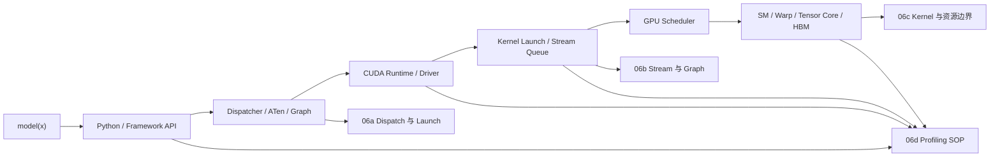

# 第6章：CUDA、运行时与算子执行导览

> **本章已拆分为独立子章**：原来的第 6 章同时覆盖 framework dispatch、kernel launch、stream、CUDA Graph、算子库、SM 资源、profiling 和排障 SOP，单页内容过宽。现在第 6 章保留为导览章，详细内容拆到 06a-06d。

## 1. 为什么要拆分第 6 章

AI 工程师不一定要手写很多 kernel，但必须知道框架调用怎样落到设备执行上。这里面至少有四类问题：

- `model(x)` 经过 Python、framework dispatcher、ATen、CUDA runtime、driver 和 kernel launch，每一层都有固定开销；
- stream、event、隐式同步、H2D/compute/NCCL overlap 和 CUDA Graph 决定命令队列是否真正异步；
- cuBLAS、cuDNN、FlashAttention、Triton、CUTLASS 和 fused kernel 决定常见算子是否吃到硬件路径；
- nsys、ncu、torch.profiler 和性能回归测试决定团队能否把“GPU 利用率低”拆成可验证的瓶颈。

这些问题都属于“运行时与算子执行”，但排查入口不同。拆开以后，每个子章可以服务一个具体工程动作：减少 launch、修同步、换 kernel、做 profile。

## 2. 拆分后的阅读路径

| 子章 | 主题 | 你应该在什么时候读 |
|------|------|--------------------|
| [06a Framework Dispatch、Runtime 与 Kernel Launch](./06a-framework-dispatch-runtime-and-kernel-launch.md) | Python/API、framework dispatcher、ATen、CUDA runtime/driver、kernel launch 固定开销、eager vs compiled | 你看到一个 step 里小 kernel 很多、CPU launch 跟不上、B200/H100 加速比低 |
| [06b Stream、同步与 CUDA Graph](./06b-streams-synchronization-and-cuda-graphs.md) | stream、event、默认 stream、隐式同步、H2D/compute/NCCL overlap、CUDA Graph capture/replay | 你看到拷贝和计算串行、`.item()` 导致同步、Graph 开启后收益不稳定 |
| [06c 算子库、融合与 SM 资源边界](./06c-kernel-libraries-fusion-and-sm-resource-limits.md) | cuBLAS/cuDNN/CUTLASS/FlashAttention/Triton、fusion、SM/block/warp、occupancy、register pressure、spill | 你要判断该换库、开融合、写 Triton，还是某个 fused kernel 反而变慢 |
| [06d Profiling、Debugging 与性能排障 SOP](./06d-profiling-debugging-and-performance-sop.md) | nsys、ncu、torch.profiler、CUDA_LAUNCH_BLOCKING、时间线读法、宏观到微观、性能回归测试 | 你要建立团队排障流程，或把一次性能退化定位到具体层级 |

## 3. 总框架：从模型调用到 SM 执行

第 6 章的核心不是背 CUDA API，而是建立一个判断：**性能问题到底出在发命令、排队同步、算子实现、设备资源，还是观测方法本身。**

## 4. 和相邻章节的关系

- 第 4 章讲 GPU 的执行模型、显存和互联硬件上限；第 6c 会把这些上限落到 kernel 实现和 SM 资源。
- 第 5 章讲数据搬运；第 6b 会解释 H2D、NCCL 和 compute 怎样通过 stream overlap。
- 第 15-16 章讲推理调度、量化、编译和引擎；它们依赖第 6 章的 launch、Graph、fusion 和 profiling 基础。
- 第 21 章讲可观测性与容量；第 6d 聚焦单机/单 step 的性能证据采集。

## 5. 快速自测

1. 一个 forward 有 5000 个 10 μs 小 kernel，为什么新 GPU 可能加速不明显？
2. `print(loss.item())` 为什么可能让异步时间线变成串行？
3. 一个 fused kernel 比拆开更慢，可能和 register pressure、shared memory、spill 有什么关系？
4. 看到 Nsight Systems 里 CUDA HW 行大量空白，你会先查 launch、H2D、NCCL 还是 kernel？
5. 为什么 `occupancy` 是诊断指标，而不是最终优化目标？
