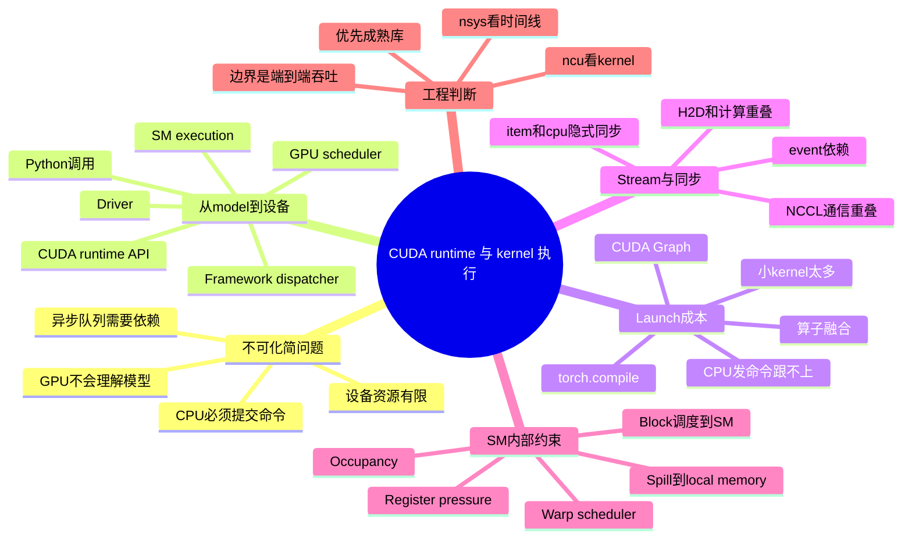

# 第6章：CUDA、运行时与算子执行

> AI 工程师不一定要手写很多 kernel，但必须知道框架调用到底是怎样落到设备执行上的，否则很多性能问题永远像黑箱。

> **关联章节**：本章内容与 [第5章](./05-memory-interconnect-io.md) 的搬运链路、[第4章](./04-gpu-and-accelerators.md) 的硬件上限直接相连。运行时优化的目标，是把硬件能力尽量接近真实可用吞吐。后续的 [第15章](../part4-inference-infra/15-batching-scheduling-and-kv-cache.md) 批处理调度、[第16章](../part4-inference-infra/16-quantization-compilation-and-engines.md) 编译优化，本质上都依赖本章讨论的 kernel launch、stream 和融合机制。

## 1. 第一性原理拆解 + 学习大纲

### 拆 — 不可化简的问题

剥离 CUDA、PyTorch、kernel、stream、Graph 这些名字，本章真正要解决的不可化简问题是：**一台 GPU 有大量并行计算单元和很高的显存带宽，但它不能自己理解模型，也不能自己决定下一步执行什么；AI 系统必须把上层的张量表达，分解成设备能执行的命令流，并让这些命令在有限的调度、内存、寄存器和同步约束下持续喂满硬件**。这件事之所以难，不是因为 API 多，而是因为两类时间尺度天然不匹配：CPU / runtime 发起一次 kernel 可能要 20-200 μs，而一个小算子本身可能只执行 5-20 μs；GPU 内部一个 warp 的指令切换以 cycle 计，而一次 HBM 访问可能要数百 cycle。只要命令供应、数据供应或线程驻留任一环节断掉，峰值 TFLOPS 就只存在于规格表里。

原本的导言说"AI 工程师不一定要手写很多 kernel，但必须知道框架调用到底是怎样落到设备执行上的"，它对应的不是好奇心，而是工程责任边界。训练或推理慢，表面现象可能都是 GPU 利用率低：有时是 Python 和 dispatcher 把图切成了几千个小 kernel；有时是 stream 依赖让 H2D 拷贝和计算串行；有时是一次 `.item()` 把异步队列强制拉平；有时是某个自定义 kernel 因 register pressure 太高，occupancy 掉到很低，还把临时变量 spill 到 local memory。平台工程师不需要代替库作者重写 GEMM，但必须能判断"慢在发命令、排队、同步、访存、寄存器，还是算子实现"。本章就是把这条从 `model(x)` 到 SM execution 的链路拆开，让你能把一个黑箱 profile 还原成可行动的瓶颈假设。

### 推 — 从这个问题如何推导出每个机制

从"GPU 不能自己决定干什么"出发，第一层机制必然是 runtime 和 driver：上层框架必须把张量操作变成 kernel launch，把参数、grid、block、stream 和依赖关系提交给设备。由于 launch 有固定成本，第二层机制必然是减少 launch 次数：算子融合把多个小算子合成一个 kernel，CUDA Graph 把重复的 launch 序列捕获成可回放的 DAG，编译器把稳定 shape 下的 eager 调用变成更少的设备命令。这里的因果不是"Graph 很高级所以要学"，而是"当每个小 kernel 的执行时间小于 launch 开销时，CPU 发命令会成为系统瓶颈"。

从"GPU 同时处理多条命令和多块数据"出发，stream 必然存在。没有 stream，所有拷贝、计算、通信都像单队列排队，H2D 预取、NCCL allreduce 和反向计算就无法重叠。stream 带来异步性，也带来同步语义；因此 event、隐式同步点、默认 stream 行为就变成工程边界。一个 `print(loss.item())` 看起来只是日志，实际可能把 CPU 阻塞到 GPU 完成前面所有工作；一个错误的 event 依赖可能让多 stream 重新退化成串行。

从"设备内部资源有限"出发，SM、warp、register、shared memory 和 occupancy 必然进入视野。kernel 被分成 block，block 被调度到 SM；SM 用 warp scheduler 在多个 warp 之间切换，以隐藏访存延迟。每个线程需要 register 保存中间值，每个 block 可能需要 shared memory；这些资源越多，同一 SM 能驻留的 block / warp 越少。若单线程临时变量过多，编译器会产生 register spill，把本该在寄存器里的值放到 local memory，而 local memory 实际落在显存路径上，代价远高于寄存器访问。于是你会看到一个反直觉结论：更复杂的 fused kernel 不一定更快，融合降低了 launch 和 HBM 中间写回，但也可能增加 register pressure，降低 occupancy，甚至因 spill 变慢。工程优化的目标不是追一个单指标，而是在 launch overhead、访存次数、occupancy、寄存器使用和库成熟度之间找可验证的平衡。

### 绘 — 因果链路



### 导 — 读完本章你应该能回答

1. 为什么一个 forward 里的 3000 个小 kernel 可能比 300 个较大的 fused kernel 更慢，即使总 FLOPs 没变？
2. 从 `model(x)` 到 SM execution，中间至少经过哪些层，每一层常见的固定开销和排障工具是什么？
3. 为什么 CUDA stream 能让拷贝、计算和通信重叠，而一个隐式同步点又如何把它们重新变成串行？
4. CUDA Graph 解决的是哪一类 CPU / runtime 开销？为什么动态 shape、动态地址或复杂依赖会削弱它的收益？
5. 一个 kernel 的 occupancy 很高但 Tensor Core utilization 很低时，你为什么不能简单说"GPU 已经跑满"？
6. register pressure 如何限制 SM 上的活跃 warp？register spill 到 local memory 为什么可能让 fused kernel 反而变慢？
7. 面对一次端到端性能退化，你如何判断该从框架图、runtime 时间线、stream 同步、成熟库版本，还是 kernel 级 `ncu` 指标开始查？

## 学习目标

完成本章学习后，你将能够：

1. 理解 AI 框架、CUDA runtime、kernel 和硬件之间的调用关系
2. 认识 kernel launch、stream、同步点对性能的影响
3. 理解为什么"很多小 kernel"常常意味着低效
4. 知道库、编译器和自定义算子在 AI 系统中的角色
5. 建立"问题到底出在框架、运行时还是设备"的排障意识
6. 读懂一个 Nsight Systems 时间线，识别 launch 稀疏、同步阻塞、stream 串行等常见问题
7. 知道 CUDA Graph 何时帮你、何时反而拖后腿

---

## 本章导读

很多团队第一次看性能 profile 时会有一个共同感受：**本以为 GPU 一直在忙，打开时间线发现大片空白**。

- Kernel 之间有 100-500 μs 的间隙
- H2D 拷贝和计算是串行的
- 一个 step 里 40% 时间 GPU 在等 CPU 发命令

这些问题的共同源头是：**GPU 不能自己决定干什么，它在等 CPU 告诉它下一步做什么**。CPU 侧的调度、dispatch、launch 路径如果慢，GPU 再快也没用。这在 2020 年前不是主要矛盾，但随着 H100、B200 的算力提升到 Ampere 代的 3-7 倍，**CPU launch 开销反而变成了更突出的瓶颈**。

本章要建立的核心理解是：

```text
从 model(x) 到 GPU 执行，中间有至少 6 层
  ├── Python 调用
  ├── Framework dispatcher (C++)
  ├── CUDA runtime API
  ├── CUDA driver
  ├── GPU scheduler
  └── SM execution

任何一层慢，整体都慢
```

这一章会带你看每一层的特征，以及对应的优化手段（CUDA Graph、stream、融合、profiler）分别解决哪一层的问题。

## 正文内容

### 6.1 从 `model(x)` 到 GPU 执行，中间发生了什么

一个看起来简单的框架调用，背后通常经历：

```text
Python / Framework API
  -> Graph / Eager dispatch
  -> CUDA runtime
  -> Kernel launch
  -> GPU scheduler / SM execution
```

这里面每一层都可能影响最终性能：

- Python 层可能引入额外调度和对象开销
- 框架层可能把计算拆成很多小算子
- runtime 层要负责 launch 和同步
- 设备层最终受寄存器、shared memory、warp 调度影响

#### 6.1.1 每一层的典型开销

| 层 | 一次调用的典型开销 | 主要优化手段 |
|----|-------------------|--------------|
| Python 解释 | 几 μs - 几十 μs | JIT、编译、减少 Python 层逻辑 |
| Framework dispatch | 几 μs | `torch.compile`、Fused op |
| Caching allocator | < 1 μs | 预分配、复用 buffer |
| CUDA runtime | 5-20 μs | CUDA Graph、减少 launch 次数 |
| CUDA driver | 2-10 μs | 同上 |
| Kernel 实际执行 | 视算子 10 μs - 数十 ms | 算子融合、更好的 kernel |

**关键观察**：一次 kernel launch 的"固定开销"累计约 20-200 μs。如果你的 kernel 本身只跑 10 μs（比如小矩阵的 LayerNorm），那大部分时间都在 launch，而不是计算。这也是"小 batch 训练 GPU 吃不饱"的底层原因。

这个开销在不同 GPU 上差别不大 —— 主要由 CPU、驱动和 runtime 决定。意味着**GPU 越快，launch 占比反而越高**。B200 相对 H100 的算力翻倍，但 launch 开销几乎不变，导致许多小算子负载在 B200 上的加速比远小于 2x。

### 6.2 为什么 kernel launch 不是"免费"的

每次 kernel launch 都有固定成本。若把一次本可融合的计算拆成大量小 kernel，常见后果是：

- launch overhead 占比升高
- 中间结果频繁回写显存
- stream 上同步点增加

这也是为什么现代框架和推理引擎都在做：

- 算子融合
- graph capture
- 编译优化

#### 6.2.1 一个直观算式

假设一次训练 step 有 N 个 kernel，每个 launch 开销 L μs，kernel 实际执行 K μs：

```text
理想执行时间 = N × K
实际执行时间 ≈ N × max(L, K)   (CPU 和 GPU 按瓶颈者算)

launch 占比 = max(0, L - K) / max(L, K)
```

当 L 和 K 接近时，CPU launch 可能和 GPU 执行并行（CPU 提前为下一个 kernel 做准备）。但当 L >> K 时（小算子），GPU 就会周期性空转等命令。

一个例子：某模型一个 forward 有 5000 个 kernel，平均每个 kernel 10 μs，launch 开销 20 μs：

- 理想：5000 × 10 = 50 ms
- 实际：5000 × 20 = 100 ms（翻倍）
- 如果算子融合把 kernel 数降到 500 个（每个 100 μs）：500 × max(20, 100) = 50 ms

这解释了为什么 FlashAttention、fused MLP、fused RMSNorm 这些优化的加速比可以到 2-3 倍 —— 不是"算得更少"，而是"launch 和同步得更少"。

#### 6.2.2 算子融合的层次

从粗到细，AI 系统里的融合有几种：

| 融合层次 | 例子 | 由谁做 |
|----------|------|--------|
| 手写 fused kernel | FlashAttention、RMSNorm + 残差、fused QKV projection | 研究员 / 库作者 |
| 编译器级融合 | TorchInductor、XLA 的 elementwise fusion | 编译器 |
| 图级优化 | TensorRT 引擎的算子合并 | 推理编译器 |
| Graph capture | CUDA Graph 把一串 kernel 变成一次 launch | 运行时 |

对工程师的实际含义：

- **追求极致吞吐**：用手写 fused kernel（FlashAttention-3 能把 H100 利用率从 35% 拉到 75-85%）
- **日常开发**：`torch.compile(mode="reduce-overhead")` 几乎无成本开启
- **推理生产**：TensorRT-LLM / vLLM 内置了大量融合

### 6.3 Stream 和同步点

默认情况下，很多人把 GPU 当作"发命令就自动快"。但真正重要的是：

- 命令是否落在同一个 stream
- 是否被隐式同步打断
- 数据拷贝和计算能否重叠

常见误区包括：

- 频繁调用同步 API
- 不必要地把结果拉回 CPU
- 在 debug 日志里无意识加入同步点

这些问题在小模型里不明显，在大规模训练和高并发推理里会被迅速放大。尤其当 H2D / D2H 已经受 [第5章 §5.3](./05-memory-interconnect-io.md) 的 PCIe 链路限制时，同步点会让"本可重叠的搬运"重新变成串行。

#### 6.3.1 常见的"隐式同步点"陷阱

这些操作会**偷偷**等待 GPU 完成所有前面的工作，很多人没意识到：

| 代码 | 隐式同步 | 修正 |
|------|----------|------|
| `tensor.item()` | 强制把 GPU 数值搬回 CPU | 只在真正需要时调 |
| `print(loss)` | 同上，`loss` 是 GPU 标量 | 累积后再 print，或用 async logger |
| `tensor.cpu()` | H → D 完整同步 | 用 pinned memory + `non_blocking=True` |
| `torch.cuda.synchronize()` | 显式全同步 | 只用于 benchmark，生产慎用 |
| `if tensor > 0:` | 隐含一次 `.item()` | 改成 tensor 级比较 |
| `tensor.numpy()` | D → H 同步 | 延后到真正需要 CPU 时 |
| `assert tensor.sum() > 0` | 同步 + 比较 | 生产代码去掉断言 |

一个实战经验：**如果你的训练代码里有 `print(loss.item())` 且每 step 都调用，大概率吃掉 5-10% 的吞吐**。这一条优化不难做，却被很多团队忽略。

#### 6.3.2 CUDA Graph 与 Stream 优化

对平台工程师来说，这两类优化分别解决不同问题：

| 手段 | 主要解决什么 | 更适合什么场景 | 常见限制 |
|------|--------------|----------------|----------|
| CUDA Graph | 减少重复 launch 的 CPU 开销 | 形状稳定、迭代重复的训练 step / 推理批次 | 动态 shape、多分支控制流、部分调试工具兼容性差 |
| 多 Stream | 让计算与拷贝、不同 kernel 尽量重叠 | H2D 预取、通信与计算 overlap、流水式推理 | 需要显式管理依赖，否则容易引入隐式同步 |

简化理解：

- **CUDA Graph** 更像把一串固定操作"录制"下来，下次整体回放
- **Stream 优化** 更像把不同工作放进多条队列，争取并行推进

如果你的时间线里看到大量短 kernel 和频繁 launch，优先怀疑能否 Graph 化；如果你的时间线里看到拷贝和计算严格串行，优先检查 stream 设计。

#### 6.3.3 CUDA Graph 的真实使用细节

CUDA Graph 听起来很美好，实际用起来有几个坑要知道：

**工作原理**：

```text
Capture 阶段（只做一次）:
  ├── 把一串 kernel launch 记录成 DAG
  ├── 固定所有输入 / 输出 tensor 地址
  └── 生成一个可回放的"graph" 对象

Replay 阶段（每次 step）:
  ├── 不再走 Python / dispatcher / runtime
  ├── 一次 launch 把整个 DAG 交给 GPU
  └── 典型 launch 开销从 N × 20 μs → 1 × 10 μs
```

**能带来多少收益**：

- 对大量小 kernel（< 20 μs 平均）：可省 50-80% CPU 开销
- 对少量大 kernel（> 1 ms 平均）：收益微小
- 对端到端训练吞吐：典型 10-30% 提升
- 对低 batch LLM decode：能显著降低 TPOT（vLLM V1 默认开）

**什么时候 CUDA Graph 反而变慢**：

研究发现 CUDA Graph 不是"无脑开"的优化，有些场景会拖后腿：

| 情况 | 为什么会更慢 |
|------|--------------|
| 参数频繁变化 | 每次 replay 要 copy 参数到 placeholder，overhead 可能占 20%+ |
| 动态 shape | 要捕获多个 graph，内存翻倍 |
| 长时间 graph + 大 tensor | GC 和内存复用机制复杂，反而抖动 |
| 多 stream 的复杂依赖 | Graph 里的隐式依赖关系可能破坏原本的重叠 |

**实战建议**：

- PyTorch 2.x：`torch.compile(mode="reduce-overhead")` 会自动用 CUDA Graph，先试这个
- vLLM / TensorRT-LLM：已经内置 CUDA Graph，不用管
- 自己写 serving：先用 `make_graphed_callables`，再评估是否需要手写
- 调试期：暂时关闭，Graph 的 trace 不直观

#### 6.3.4 Stream 的几种典型用法

除了默认 stream，在以下场景用多 stream 常有明显收益：

**H2D prefetch**：
```python
# 在 side stream 上做 H2D，主 stream 跑计算
next_batch_stream = torch.cuda.Stream()
with torch.cuda.stream(next_batch_stream):
    next_batch = next_batch.cuda(non_blocking=True)
# 主 stream 继续跑 current_batch 的计算
```

**通信与计算重叠**：NCCL 默认就会用独立 stream。DDP 的 bucket + allreduce 之所以能重叠 backward，就是把 allreduce 放在不同 stream。

**推理服务的 CUDA stream per request**：SGLang 等引擎会给每个请求分配独立 stream，让多个请求在同一 GPU 上并发。

注意：**多 stream 用错反而更慢**。最典型的问题是没有正确的 event 同步，导致 stream 之间产生隐式依赖或数据竞争。

### 6.4 为什么高质量库经常比"自己堆算子"更快

对于常见操作，如：

- GEMM
- 卷积
- layernorm
- attention

高质量库往往已经对：

- kernel 选择
- 数据布局
- 内存访问模式
- tensor core 路径

做过大量优化。成熟库不是一个抽象概念，而是具体的工程资产：

| 库 / 项目 | 主要负责什么 | 常见使用位置 |
|-----------|--------------|--------------|
| cuBLAS / cuBLASLt | 高性能矩阵乘法、GEMM 变体 | Linear、MLP、Attention 内部 matmul |
| cuDNN | 卷积、归一化、部分 attention / fused op 后端 | CNN、RNN、部分 Transformer 后端 |
| CUTLASS | 自定义 GEMM / epilogue 的模板化积木 | 自研 fused kernel、定制数据布局 |
| FlashAttention | IO-aware attention 优化 | 长上下文 attention、推理和训练加速 |
| FlashInfer | 推理优化算子库 | vLLM、SGLang 的 attention 后端 |
| Triton | Python 写 CUDA kernel 的 DSL | 社区大量自定义 kernel |
| CuTeDSL | Blackwell 优化抽象 | FlashAttention-4 等新一代库 |

因此，平台和系统工程里一个常见原则是：

> 先确认是不是调用方式、图形状或数据布局有问题，再考虑是否需要自定义算子。

#### 6.4.1 FlashAttention 为什么这么受追捧

FlashAttention 系列是近年最典型的"算法 + 硬件协同设计"案例，值得单独说：

**FlashAttention-1（2022）**：核心思想是 IO-aware —— 用 tiling 让整个 attention 在 SRAM 里完成，不往 HBM 写中间 N×N 矩阵。相对 naive attention 快 2-4 倍，显存从 O(N²) 降到 O(N)。

**FlashAttention-2（2023）**：优化了 warp 划分，parallelize over sequence。对 A100 利用率可以到 ~70%，对 H100 只有 35%（没用上新硬件特性）。

**FlashAttention-3（2024）**：针对 Hopper 架构，利用 WGMMA（异步 Tensor Core）、TMA（异步内存传输）、warp specialization 把 H100 利用率拉到 75-85%（BF16）。FP8 吞吐近 1.2-1.3 PFLOPS。相对 FA-2 快 1.5-2x。

**FlashAttention-4（2025，面向 Blackwell）**：继续针对 B200 的新特性优化。

**对平台工程的启示**：

- **同一个 "attention 算子"，实现方式不同带来 2-5 倍性能差**
- **跨硬件代际切换时要升级 kernel 库**（H100 上还在用 FA-2 就是浪费钱）
- **FP16 → FP8 不只是精度选择，还解锁了更高的 Tensor Core 吞吐**

这也说明：**对标准算子，依赖库的更新比自己优化实在得多**。除非你有特别定制的需求（自定义 mask、特殊 attention 变体），否则跟着 FlashAttention / cuDNN 的版本走就行。

### 6.5 SM 调度、Warp 与 Register Spill

一个 kernel launch 进入设备后，不是"整个 kernel 一次性占用 GPU"。更准确的过程是：grid 被拆成许多 thread block，GPU scheduler 把 block 分配到不同 SM；每个 block 内部的线程再按 warp 执行，NVIDIA GPU 上一个 warp 通常是 32 个线程。SM 内部有 warp scheduler，它会在多个已驻留的 warp 之间切换：某个 warp 在等 HBM、shared memory 或依赖指令时，scheduler 尽量切到另一个可执行 warp。这个机制的目标很朴素：用更多可运行 warp 隐藏单个 warp 的等待时间。

warp 可以粗略理解成 GPU 中一起执行的一小组线程。平台工程师不需要记住所有硬件细节，但需要知道两件事：

1. 如果同一 warp 里的线程走完全不同的分支，就会出现分支发散（warp divergence），执行效率下降
2. 如果同一 warp 访问的地址连续、规整，更容易形成 coalesced memory access，显存访问效率更高

这解释了为什么有些 kernel 看起来"做的是同样的事"，速度却差很多。真正的差异，常常不在数学公式，而在：

- 线程怎么排布
- 数据怎么布局
- 访存是否连续
- 每个线程占用多少 register
- 每个 block 占用多少 shared memory

#### 6.5.1 Register pressure、Occupancy 与 Spill

SM 的资源是硬边界：每个 SM 的 register file、shared memory、最大 block 数和最大 warp 数都有上限。一个 kernel 如果每个线程使用 32 个 register，和每个线程使用 128 个 register，能同时驻留在同一个 SM 上的 warp 数可能差很多。这种"单线程需要太多寄存器，导致 SM 上能同时容纳的 warp 变少"的问题，通常叫 register pressure。

occupancy 指的是 SM 上活跃 warp 数占理论最大 warp 数的比例。它的作用是帮助判断资源是否限制了并发驻留，但它不是最终目标：

| 现象 | 可能含义 | 该看什么 |
|------|----------|----------|
| occupancy 低 | register / shared memory / block size 限制驻留 | `ncu` 的 registers per thread、shared memory、active warps |
| occupancy 高但 kernel 慢 | 活跃 warp 多，但都在等内存或分支发散严重 | memory throughput、warp stall reason、branch efficiency |
| occupancy 中等但吞吐高 | 少量 warp 已经能喂满 Tensor Core 或访存流水 | Tensor Core utilization、kernel time |

当 register pressure 高到编译器无法把所有临时变量都放进寄存器时，会发生 register spill：部分变量被放到 local memory。这里的 "local" 很容易误导，它不是 SM 内部的低延迟存储，而是每个线程私有的地址空间，通常走 L1/L2/HBM 路径。寄存器访问可以近似看成单 cycle 级别，spill 后一次加载 / 写回可能变成几十到数百 cycle，且会增加额外显存流量。对 fused kernel 尤其要小心：融合减少了 launch 和中间 tensor 回写，但也会延长变量生命周期，增加 register pressure；当 spill 明显出现时，融合收益可能被 local memory 流量吃掉。

一个工程化判断边界：

| 优化动作 | 可能收益 | 风险边界 |
|----------|----------|----------|
| 融合多个 elementwise op | 减少 launch 和 HBM 中间读写 | register 增多，block 驻留下降 |
| 增大 tile / unroll | 提高数据复用和 Tensor Core 喂数效率 | register / shared memory 增多，可能 spill |
| 限制 register 数 | 提高 occupancy | 编译器被迫 spill，单 warp 更慢 |
| 追求高 occupancy | 更容易隐藏访存延迟 | 不保证 Tensor Core 利用率或端到端更快 |

实战里不要只看一个指标。若 `ncu` 显示 `registers per thread` 很高、`local memory load/store` 不为零、warp stall 里有大量 memory dependency，同时 kernel time 变长，就要怀疑 spill。处理顺序通常是：先确认是否能换成熟库或更新 kernel 后端；再看是否能拆掉过度融合、缩小 tile、减少 unroll、降低临时变量生命周期；最后才考虑用编译参数强行限制 register。强制限制 register 是有代价的，它可能把"寄存器不够"直接变成"spill 更多"。

**工程边界**：平台侧通常不需要手写 PTX 去微调每个 register，但需要能读懂 `ncu` 里的 `registers per thread`、occupancy、local memory traffic 和 stall reason。对训练 / 推理系统，最终验收不是 occupancy 从 45% 到 75%，而是端到端 step time、TPOT / ITL、GPU 时间线空洞和成本是否改善。对于 GEMM、attention、norm 这类成熟路径，优先升级 cuBLASLt、FlashAttention、Triton / Inductor 后端；只有在自定义 mask、特殊布局或新算子确实没有成熟实现时，才把 register pressure 当成 kernel 开发问题下钻。

#### 6.5.2 Occupancy：另一个常被误解的指标

`ncu` 会报 occupancy（SM 里活跃 warp 占最大 warp 数的比例）。很多人看到低 occupancy 就认为"GPU 没跑满"，其实是误解：

- Occupancy 只是"有多少 warp 在 SM 上驻留"，不等于"真正在计算"
- 高 occupancy 不等于高性能（等待访存的 warp 也算活跃）
- 低 occupancy 也能有高性能（如果少数 warp 能把 Tensor Core 跑满）

FlashAttention-2 在 H100 上 occupancy 很高，但利用率只有 35%；FlashAttention-3 通过 warp specialization（让部分 warp 专注搬运、部分专注计算）达到 85%，在某些指标上甚至"降低" occupancy。

**对平台工程的实际含义**：**occupancy 是诊断指标，不是目标**。真正的目标是 Tensor Core utilization 和整体 kernel time。

### 6.6 运行时与编译器的边界

运行时更关注：

- kernel launch
- stream 管理
- 内存申请与释放
- 同步语义

编译器或图优化更关注：

- 算子融合
- 常量折叠
- 内存复用
- shape 特化

如果你在做平台排障，知道问题大概属于哪一层，能节省大量时间。

#### 6.6.1 PyTorch 的执行模式演进

PyTorch 在执行模式上经历了几个阶段，理解差异有助于定位问题：

| 模式 | 特点 | 问题 / 收益 |
|------|------|-------------|
| Eager | 一条一条执行，灵活、调试友好 | 每算子都过 dispatcher、Python 层开销大 |
| TorchScript | 静态编译，一次 trace | 限制多，生态已退潮 |
| `torch.compile` (PyTorch 2.x) | 基于 TorchDynamo + TorchInductor 的 JIT | 自动融合、支持 CUDA Graph，推荐方式 |
| `torch.compile` + `mode="reduce-overhead"` | 自动启用 CUDA Graph | 对推理和小 batch 训练特别有效 |
| `torch.compile` + `mode="max-autotune"` | 更激进搜索最优 kernel | 首次编译慢，长期运行值 |

实战中：

- **原型期**：用 eager，方便调试
- **稳定训练**：`torch.compile(model)`，通常无痛 10-30% 提速
- **推理服务**：用 vLLM / TensorRT-LLM 内置优化，不要自己折腾

### 6.7 Profiling 和排障思路

一个有经验的工程师调性能问题时，通常走这个顺序：

```text
1. 先粗测：几个 step 的平均时间、GPU 利用率
   工具: nvidia-smi dmon, torch.cuda.utilization()
2. 再看时间线：一个 step 里每毫秒在干什么
   工具: nsys profile → Nsight Systems
3. 确定是哪一类问题：
   ├── launch 稀疏 → 小 kernel 太多 → 融合 / CUDA Graph
   ├── H2D 和计算串行 → stream 设计 → 调 DataLoader
   ├── 某个 kernel 很慢 → 钻进 kernel
   └── 通信尾巴 → NCCL 调优 / 改 bucket
4. 如果是 kernel 级问题，再用 ncu 深入
   工具: ncu --set full
```

一个关键原则：**从宏观到微观**。先看哪一类问题，再挑一个具体例子深入。直接上 ncu 看某个 kernel，很容易在不重要的地方浪费时间。

#### 6.7.1 Nsight Systems 时间线读法

打开一个 nsys profile 后，关键要看三条 row：

```text
CUDA API (CPU 侧的 launch 调用)    ↓
─────────────────────────────────────────
CUDA HW (GPU 实际执行的 kernel)    ↓
─────────────────────────────────────────
NCCL (通信 kernel 在哪个 stream)    ↓
```

常见"病态"时间线的特征：

| 模式 | 视觉特征 | 意义 |
|------|----------|------|
| "稀疏的点"  | CUDA HW 行上大量空隙 | Launch 跟不上，小 kernel 多 |
| "阶梯" | H2D 和 kernel 轮流出现 | 没有重叠，stream 用错 |
| "尾巴" | 某个 kernel 之后 GPU 空着一大段 | 通信 / 同步未重叠 |
| "平直一片" | CUDA HW 连续没间隙 | 健康 |
| "block 抖动" | 周期性卡 100-500 ms | GC / logger / checkpoint |

学会看时间线是 AI 系统工程师的基本功。一次 profile 通常能让你省下一周的盲调试。

### 6.8 工程建议

- 当 GPU 利用率低且 kernel 很碎时，优先怀疑图分裂和 launch 开销
- 当数据拷贝与计算无法重叠时，优先检查同步点和 stream 使用
- 当同一模型在不同引擎表现差异大时，优先检查执行计划和 kernel 选择
- 不要轻易把"框架慢"当成结论，先确认慢在 Python、图、runtime 还是设备
- `torch.compile` 几乎是默认推荐，除非你有明确理由不开
- 跨硬件代际升级时，同步升级 kernel 库（FlashAttention、cuDNN）
- Profile 从宏观到微观：nsys → torch.profiler → ncu
- 生产代码里移除 `.item()`、`print(loss)`、`assert tensor.sum() > 0` 这类隐式同步
- Occupancy 是诊断指标，不是优化目标

#### 本章涉及的常见工具

| 概念 | 常见工具 / 命令 | 备注 |
|------|-----------------|------|
| 系统级时间线 | `nsys profile python train.py` | 看 launch、stream、H2D 和同步点是否重叠 |
| kernel 级分析 | `ncu --set full python train.py` | 看访存、occupancy、warp 效率 |
| 框架侧热点 | `torch.profiler` | 适合从 PyTorch 调度和算子视角下钻 |
| 强制暴露同步问题 | `CUDA_LAUNCH_BLOCKING=1` | 便于排障，但会显著拖慢程序 |
| 自动编译 | `torch.compile(model, mode="reduce-overhead")` | 默认包含 CUDA Graph |
| 手动 CUDA Graph | `torch.cuda.CUDAGraph()`、`make_graphed_callables` | 需要小心管理静态 buffer |
| 内存监控 | `torch.cuda.memory_summary()`、`memory_profiler` | 定位 OOM 和碎片 |

## 本章小结

| 层 | 主要职责 | 常见优化 |
|----|----------|----------|
| Python / 框架层 | 组织算子、图和张量语义 | `torch.compile`、避免 `.item()` |
| Runtime 层 | launch、stream、同步、内存管理 | CUDA Graph、多 stream、pinned memory |
| Kernel 层 | 真正执行数值计算 | 用高质量库（FlashAttention、cuBLAS） |
| 硬件层 | 决定最终吞吐、带宽和并行效率 | 见 [第4章](./04-gpu-and-accelerators.md) |

核心判断能力：

- 一个 kernel 为什么慢：compute-bound 还是 memory-bound（[第4章](./04-gpu-and-accelerators.md) §4.5）
- 一次 step 为什么慢：launch 稀疏、同步串行、搬运瓶颈、还是真的算太多（本章 §6.7.1）
- 一个优化该加在哪：算子库（§6.4）、运行时（§6.3）、还是编译器（§6.6）

---

## 练习题

### 基础题

1. 为什么大量小 kernel 往往会降低整体效率？
2. 同步点为什么会破坏计算与拷贝重叠？
3. 在什么情况下应优先调用成熟库而不是自己拼很多算子？
4. 如果你发现 attention kernel 很快，但整体 step 仍然不快，你会继续检查哪一层？

### 进阶题

5. 用 §6.2.1 的算式：一个 forward 有 3000 个 kernel，平均执行时间 15 μs，launch 开销 25 μs。理想时间多少？实际时间多少？如果 kernel 数降到 300（平均 150 μs）呢？
6. 列出 §6.3.1 表格中至少 5 种隐式同步，说明各自出现在训练代码的什么地方。
7. FlashAttention-2 和 FlashAttention-3 的差距主要来自哪些 Hopper 专属特性？为什么不是简单的算法优化？
8. CUDA Graph 在什么情况下反而让性能变差？列出至少 3 种。
9. 一个训练时间线显示：每 step 结束后 GPU 有 80 ms 空闲，然后继续下一 step。这个 80 ms 最可能是什么？
10. 某团队把 PyTorch 从 eager 切到 `torch.compile` 后，首 step 慢了 30 秒，但稳态每 step 快 15%。这个权衡合理吗？什么情况下会不合理？

### 开放题

11. 设计一个简单的"性能回归测试"：每次 PR 合入前自动跑，能发现什么级别的性能退化？需要哪些指标？
12. 你的团队一直用 eager 模式跑训练。某同事建议"把所有模型都用 `torch.compile` 包起来"。作为平台方，你会怎么评估这个建议？需要考虑哪些风险？
13. 一个性能问题从哪一层开始排查，往往决定排查效率。你会怎么建立团队的"性能排障 SOP"，让新同事也能快速定位？
