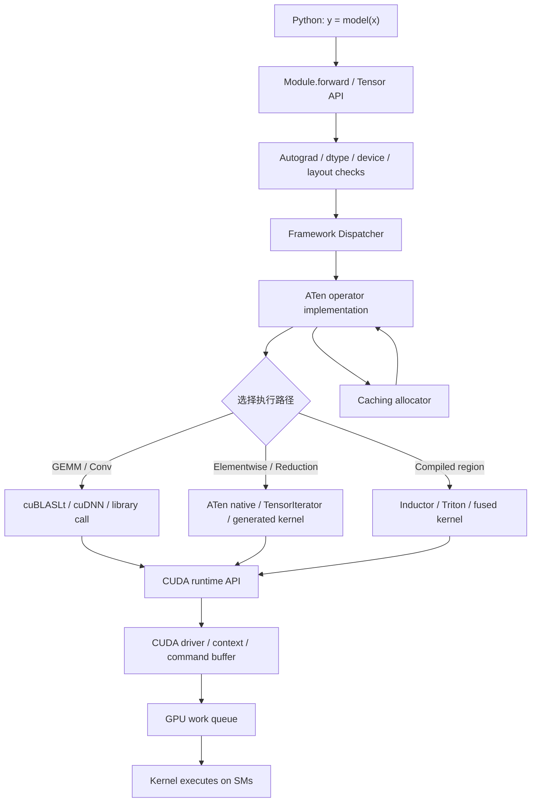
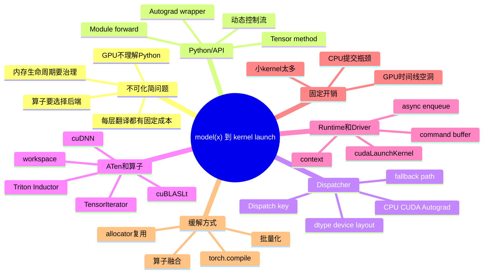
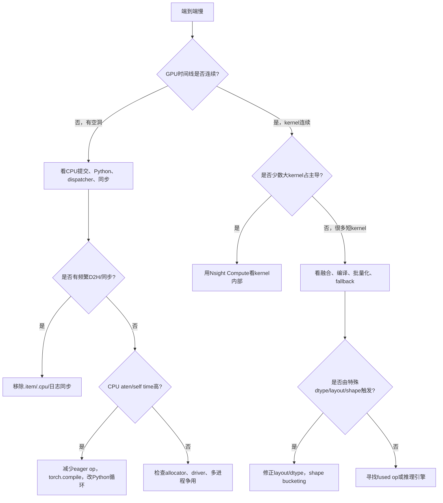

# 第6a章：从 `model(x)` 到 GPU 执行：框架调度、运行时与 Kernel Launch

> **关联章节**：本章是第6章拆分出的独立上层路径篇，重点回答“一个 Python 里的 `model(x)` 如何变成 GPU 上的一串 kernel launch”。本章只轻触 stream、CUDA Graph 和 kernel 内部优化；更细的 stream / 同步 / CUDA Graph 见 [第6b章](./06b-streams-synchronization-and-cuda-graphs.md)，SM / warp / register / occupancy 见 [第6c章](./06c-kernel-libraries-fusion-and-sm-resource-limits.md)，profiling SOP 见 [第6d章](./06d-profiling-debugging-and-performance-sop.md)。数据搬运路径见 [第5b章](./05b-host-device-io-pcie-numa-and-overlap.md)，显存预算和 roofline 见 [第4b章](./04b-hbm-memory-and-roofline.md)。推理引擎如何把这些固定开销转化为 continuous batching、shape bucket、prefill/decode 分离和 graph replay hit rate 指标，见 [第15章](../part5-serving-infra/15-batching-scheduling-and-kv-cache.md)。

## 1. 第一性原理拆解 + 学习大纲

### 拆 — 不可化简的问题

把 PyTorch、dispatcher、ATen、CUDA runtime、driver、kernel launch 这些名字先拿掉，问题只剩一个：**GPU 不理解 Python 函数，也不理解“模型”这个业务对象；它只能接收已经编译好的设备代码、参数地址、grid/block 配置和执行队列命令。AI 框架必须把上层张量表达，逐层翻译成设备可执行的命令流。**

这条路径有三个硬约束。

第一是**语义约束**。`model(x)` 里写的是模块、张量、动态控制流、自动求导、dtype、device、layout 和广播语义。GPU kernel 看到的是指针、shape、stride、标量参数和执行配置。框架必须在中间完成语义解析：这个 tensor 在 CPU 还是 CUDA？是 dense 还是 sparse？是 contiguous 还是 strided？需要 autograd 记录吗？应使用 cuBLAS、cuDNN、Triton 生成 kernel，还是走一个普通 elementwise kernel？

第二是**固定开销约束**。一次 kernel launch 不只是在 GPU 上“开始执行”。CPU 侧要穿过 Python/API、C++ dispatcher、算子实现选择、CUDA runtime、driver 提交和设备队列。即使 kernel 本身只运行 5-20 微秒，launch 路径也可能消耗十几到几十微秒，复杂环境下还会更高。于是大量小 kernel 会把系统从“GPU 算得慢”变成“CPU 发命令太碎、太频繁”。

第三是**生命周期约束**。算子不只计算，还会分配临时 tensor、申请 workspace、复用缓存块、记录 autograd 边、维护 stream 上的异步语义。一个看似普通的 `x + bias`，可能触发 allocator 查找空闲块、产生新的张量 metadata、排队一个 CUDA kernel，并把结果张量的生命周期交给后续 autograd 或 Python 引用管理。性能问题经常藏在这些“非数学 FLOPs”里。

### 本章的 control / data / failure path

- **Control path**：`model(x)` → Python/API → dispatcher → ATen / library selection → CUDA runtime → driver → kernel launch。
- **Data path**：输入 tensor、权重、workspace、autograd metadata、allocator cache、launch 参数和设备地址如何在 host memory、device memory 和 runtime 缓存之间流动。
- **Failure path**：小 kernel 太多、dispatch/fallback 过多、launch overhead 主导、图断裂、allocator 反复分配、CPU enqueue 跟不上、调试期开关误导性能结论。

### 推 — 从这个问题如何推导出每个机制

从“上层语义必须落到设备命令”出发，第一层机制是 **Python/API 层**。Python 负责用户可读的模型表达和控制流，但它不是高吞吐命令提交器。每进入一次张量 API，框架都要解析参数、检查 dtype/device、处理 autograd 包装，并把调用交给更底层的 C++ 实现。

从“同一个 API 有很多后端实现”出发，第二层机制是 **framework dispatcher**。`torch.add`、`torch.matmul`、`layer_norm` 不是单一函数，而是一个多后端入口。dispatcher 会根据 dispatch key 选择实现：CPU、CUDA、Autograd、AMP、NestedTensor、Sparse、Meta、Composite 等路径可能都挂在同一个算子名下。dispatcher 的价值是统一语义，代价是每个 eager op 都要做一次选择。

从“算子要对应具体 kernel 或库调用”出发，第三层机制是 **ATen / 算子选择**。ATen 是 PyTorch 的核心 tensor 算子层。到了这一层，框架会决定：这个 matmul 走 cuBLASLt 还是普通 kernel？这个 convolution 走 cuDNN 哪个 algorithm？这个 elementwise 是否使用 TensorIterator？这个 reduction 是否需要临时 buffer？算子选择正确，性能接近成熟库；选择落到泛化路径，可能功能正确但性能差很多。

从“设备命令必须提交给 GPU”出发，第四层机制是 **CUDA runtime / driver**。runtime API 负责把 launch、memcpy、event、stream、memory API 等转交给驱动；driver 管理 context、module、设备地址、命令 buffer 和硬件队列。应用侧看到的是一次异步 launch，系统侧实际发生的是 CPU 线程构造命令并提交给设备。

从“固定开销不能靠更快 GPU 消除”出发，必然推导出 **eager vs compiled** 的取舍。eager 模式逐 op 执行，调试好、动态性强，但会暴露大量 dispatcher 和 launch 开销。compiled 模式把一段稳定计算捕获、分析、融合、生成更少 kernel 或调用更高效库，降低 Python/dispatcher/launch 频率；代价是首次编译、shape guard、图断裂和调试复杂度。

从“中间 tensor 和 workspace 不能每次都向系统裸申请”出发，必然推导出 **caching allocator**。GPU 分配释放很贵，且异步执行下不能随便复用仍在某条 stream 上被使用的内存。框架 allocator 会缓存显存块、按大小分桶、延迟复用，并在性能、碎片和 OOM 风险之间折中。

### 绘 — 因果链路





### 导 — 读完本章你应该能回答

1. 为什么 `model(x)` 不是“一次 GPU 执行”，而是一串 Python、dispatcher、ATen、runtime 和 driver 调用？
2. Framework dispatcher 解决了什么问题？为什么它在 eager 模式下也会成为小算子负载的固定开销？
3. ATen / 算子选择如何决定一次调用走成熟库、泛化 kernel、Triton kernel 还是 fallback？
4. CUDA runtime 和 driver 在 kernel launch 中分别承担什么职责？
5. 为什么 launch overhead 是固定成本，且不会因为 GPU 算力翻倍而自动下降？
6. eager 模式和 compiled 模式的根本差异是什么？为什么 compiled 对小 kernel 多的图特别有效？
7. caching allocator 为什么存在？它如何同时带来性能收益、碎片风险和 OOM 误判？
8. 遇到“GPU 利用率低、kernel 很碎、CPU 很忙”时，如何把问题定位到上层路径而不是盲目优化 kernel 内部？

## 学习目标

完成本章学习后，你将能够：

1. 画出从 Python 模型调用到 GPU kernel launch 的上层路径。
2. 区分 Python/API、dispatcher、ATen、CUDA runtime、driver 和 GPU 执行各自的责任边界。
3. 用固定开销模型解释“小 kernel 多为什么慢”。
4. 判断一个性能问题更像 eager 调度问题、算子选择问题、allocator 问题，还是 kernel 本身问题。
5. 理解 `torch.compile`、算子融合和批量化为什么能减少上层开销。
6. 在 profile 中识别 launch 稀疏、CPU 提交瓶颈、fallback 算子和分配抖动。

---

## 2. 先建立一条可观察路径

一个最小的 PyTorch forward 可以写成：

```python
y = model(x)
```

但系统执行时更接近：

```text
Python bytecode
  -> nn.Module.__call__
  -> forward()
  -> Tensor API，例如 aten::linear、aten::gelu、aten::add
  -> dispatcher 按 dispatch key 选择实现
  -> ATen CUDA 算子或第三方库调用
  -> CUDA runtime launch / library API
  -> CUDA driver 提交命令
  -> GPU 队列接收 work
  -> kernel 在 SM 上执行
```

这条链路里，`model(x)` 只是用户看到的入口。真正决定性能的是：它被拆成多少个 op、每个 op 选择了什么实现、每个实现发起多少个 kernel、每个 kernel 是否足够大、是否有临时分配和同步、CPU 是否能持续提交命令。

### 2.1 层级职责表

| 层级 | 负责什么 | 常见开销 | 典型问题 | 观察工具 |
|------|----------|----------|----------|----------|
| Python / API | 模型组织、控制流、张量 API 调用 | Python 调用、对象创建、参数解析 | 循环里逐元素调用、小 batch 大量 Python 逻辑 | `torch.profiler` CPU trace、`cProfile` |
| Autograd 包装 | 记录反向图、保存 backward 所需 tensor | metadata、引用生命周期 | eval 忘记 `no_grad`、保存中间 tensor 导致显存涨 | `torch.profiler`、显存快照 |
| Framework dispatcher | 根据 dispatch key 选择后端 | 每 op 固定选择成本 | 大量小 op、fallback、错误 dtype/device | profiler 中的 `aten::` 事件 |
| ATen / native op | 实现 tensor 语义并调用 kernel 或库 | shape/stride 检查、临时 buffer、算法选择 | non-contiguous 慢路径、泛化 kernel、workspace 过大 | `torch.profiler`、Nsight Systems |
| CUDA runtime | 提交 launch、memcpy、event、stream API | launch 固定成本 | kernel 很碎、CPU enqueue 跟不上 | Nsight Systems |
| CUDA driver | context、module、命令 buffer、设备队列 | 驱动提交、上下文管理 | 多进程争用、初始化抖动、driver/runtime 不匹配 | Nsight Systems、driver 日志 |
| GPU 执行 | 执行 kernel | 实际计算/访存时间 | kernel 本身低效 | Nsight Compute |

这张表的关键是：**不要把所有慢都叫“GPU 慢”**。如果 Nsight Systems 里 kernel 之间有大量空洞，或者 CPU 线程长时间忙于提交短 kernel，问题还没进入 kernel 内部；此时用 Nsight Compute 下钻单个 kernel，往往会错过主要矛盾。

### 2.2 EvidenceBundle：本章的最小证据门槛

本章的证据目标是把“上层执行路径慢”拆成可复测的 control path 结论。一个合格 EvidenceBundle 至少包含：

| 证据 | 命令 / 来源 | 用来判断什么 |
|------|-------------|--------------|
| 端到端基线 | BenchmarkProtocol 中固定 warmup、shape、batch、dtype、采样窗口 | 退化是否真实，修复是否超过 retest threshold |
| 系统时间线 | `nsys profile --trace=cuda,nvtx,osrt,cudnn,cublas -o launch_path python train.py` | CUDA API time、kernel launch 间隙、CPU enqueue 是否跟不上 |
| 框架映射 | `torch.profiler`，打开 CPU/CUDA activity、shape、memory、必要时 call stack | 哪些 `aten::` op/module 造成小 kernel、同步或 fallback |
| 主机侧排除 | `perf stat -d -d -d -p <pid>` 或固定命令窗口 | CPU 是否卡在 IPC 低、cache/TLB miss、context switch 或系统调用 |
| 设备健康 | DCGM exporter、`dcgmi dmon` 或 `nvidia-smi dmon` | 时钟、功耗、温度、ECC/XID 是否污染 profile |

进入优化前先写下 retest threshold：例如稳态 P50 step/request time 改善至少 5%，P95/P99 不退化超过 3%，kernel count 或 CUDA API time 下降能解释收益，数值输出一致，显存峰值不超过 CapacityLedger 预算。

## 3. Python/API 层：模型表达不是执行计划

Python 层给模型开发带来灵活性：可以写普通 `if`、`for`、字典、列表、hook、module 嵌套和动态 shape。代价是 eager 模式下每个 tensor op 都会立即触发一次框架调用。

### 3.1 一个小算子链路的真实样子

考虑这段代码：

```python
def block(x, w, b):
    y = x @ w
    y = y + b
    y = torch.nn.functional.gelu(y)
    return y
```

在 eager 模式下，它至少包含：

| 代码 | 可能对应的底层事件 | 说明 |
|------|--------------------|------|
| `x @ w` | `aten::matmul` / `aten::mm` / cuBLASLt GEMM | 通常走成熟库，kernel 较大 |
| `y + b` | `aten::add` / broadcast elementwise kernel | 可能单独 launch |
| `gelu(y)` | `aten::gelu` / elementwise kernel | 可能单独 launch |
| 返回 `y` | tensor metadata 和 autograd 边 | 不一定 launch，但影响生命周期 |

如果 batch 很大，GEMM 时间远大于 `add` 和 `gelu` 的 launch 开销，问题不明显。如果 batch 很小，或者模型里有大量 norm、mask、slice、reshape、index、activation，固定开销会逐渐变成主导。

### 3.2 Python 开销什么时候重要

Python 开销不总是瓶颈。一个 4096x4096 的 BF16 GEMM 可能运行数百微秒到毫秒级，Python 入口开销占比很低。但以下场景会放大 Python/API 层成本：

| 场景 | 为什么放大 | 常见表现 |
|------|------------|----------|
| 小 batch 推理 | 每个 op 的设备执行时间短 | P50 延迟被框架开销占据 |
| token-by-token decode | 每生成一个 token 都执行一轮小图 | CPU 线程忙，GPU 间歇执行 |
| 大量小 tensor 操作 | 每个 op 都过 dispatcher | `aten::slice`、`aten::view`、`aten::copy_` 很多 |
| Python 循环包 tensor op | 循环次数乘以 op 固定开销 | profiler 里 CPU event 密集 |
| 动态 shape / 动态分支 | 难以稳定编译和融合 | `torch.compile` 图断裂 |
| 频繁日志和调试 | `.item()` / `.cpu()` 触发同步 | GPU 时间线被拉平 |

工程上先问两个问题：

1. 这段时间是否主要花在 `aten::` CPU event 和 kernel 间隙上？
2. 单个 kernel 是否很短，且数量很多？

如果答案都是是，优先考虑减少 op 数、融合、编译或批量化，而不是先改 kernel 内部。

## 4. Framework Dispatcher：同一个算子名背后的多后端路由

`torch.add` 不是一个简单函数。它要支持 CPU、CUDA、不同 dtype、不同 layout、autograd、vmap、AMP、meta tensor、sparse tensor、quantized tensor 等语义。dispatcher 的职责是把“同一个 API 名字”路由到“正确后端实现”。

### 4.1 Dispatch key 是什么

可以把 dispatch key 理解成张量调用的标签集合：

```text
Tensor properties
  device = cuda
  dtype = bf16
  layout = strided
  requires_grad = true
  autocast = enabled
  memory_format = contiguous

Dispatcher chooses:
  AutogradCUDA wrapper
    -> CUDA implementation
      -> optional library/kernel
```

这套机制的价值很大：用户写同一个 `torch.matmul`，框架能自动选择 CPU 或 CUDA，自动接入 autograd，自动处理 AMP。没有 dispatcher，框架 API 会变成大量手写分支。

代价也清楚：**eager 模式下每一个 op 都要经过一次路由**。当 op 很大时，这个成本可以忽略；当 op 很小且数量很多时，它会和 kernel launch 一起成为固定成本。

### 4.2 常见 dispatch 路径

| 路径 | 触发条件 | 性能特征 | 排障提示 |
|------|----------|----------|----------|
| CPU | tensor 在 CPU | 不走 GPU | 检查 `.device`，避免意外 CPU tensor |
| CUDA | tensor 在 CUDA 且有 native CUDA 实现 | 通常正常 | 继续看算子实现和 launch 数 |
| AutogradCUDA | `requires_grad=True` | 增加 autograd 包装 | eval/inference 要用 `torch.no_grad()` 或 `inference_mode()` |
| AutocastCUDA | AMP 开启 | dtype 自动转换 | 检查是否落到非预期 dtype |
| CompositeImplicitAutograd | 由多个基础 op 组合 | 功能正确但可能拆成多 kernel | profiler 中可能看到一串小 `aten::` |
| Sparse / Quantized / Nested | 特殊 layout 或 tensor 类型 | 后端覆盖不均 | 警惕 fallback 和不支持路径 |
| Meta | 只做 shape 推导 | 不执行计算 | 编译和 tracing 常见 |

很多“为什么这个 op 这么慢”的答案，不在 GPU，而在 dispatch 后走了不理想的路径。例如某个模型改了 tensor layout 后，原本的 fused CUDA kernel 不再适用，框架退回到多个通用 ATen op；功能仍正确，但 kernel 数暴涨。

### 4.3 Dispatcher 层的工程判断

排查 dispatcher 层问题时，看三类信号：

| 信号 | 可能含义 | 下一步 |
|------|----------|--------|
| profiler 中 `aten::` 事件数量远大于预期 | eager op 很碎 | 检查模型代码、开启编译、尝试融合 |
| 某个高层 op 展开成很多低层 op | composite 或 fallback | 查 dtype/layout/device 是否触发慢路径 |
| CPU self time 高，但 GPU kernel 很短 | dispatch + launch 主导 | 用 compiled / fused / batching 降低调用次数 |

注意：`view`、`reshape`、`transpose` 这类 op 不一定 launch kernel，但它们会改变 stride 和 contiguous 状态，影响后续算子选择。一次便宜的 metadata 操作，可能让后续昂贵算子落到慢路径。

## 5. ATen 与算子选择：从语义到具体实现

ATen 可以理解为 PyTorch 的核心 tensor 算子层。到了 ATen，问题从“用户调用了什么 API”变成“这个 tensor 形状、dtype、layout、device 下，应该用什么实现最合适”。

### 5.1 一个算子可能有多种实现

以矩阵乘和归一化为例：

| 算子 | 可能实现 | 选择依据 | 常见风险 |
|------|----------|----------|----------|
| `matmul` / `linear` | cuBLAS、cuBLASLt、batched GEMM、fallback | shape、dtype、transpose、stride、batch 维 | 小矩阵 launch 多、layout 不适配 |
| `conv` | cuDNN 多种 algorithm | shape、dtype、workspace、deterministic 设置 | algorithm 选择不稳定、workspace 占用 |
| `layer_norm` | native CUDA、fused kernel、Triton | hidden size、dtype、contiguous | fallback 为多个 op |
| `softmax` | native CUDA、fused attention 内部实现 | 维度大小、mask、dtype | 单独 softmax + mask + dropout 拆太碎 |
| elementwise | TensorIterator、specialized kernel、fused kernel | 广播、stride、dtype | 每个 elementwise 单独 launch |
| reduction | native reduction、library、Triton | reduce 维度、shape、dtype | 小 reduction 很多、临时 buffer |

同一个数学表达，性能可能差一个数量级。原因不是数学变了，而是实现路径变了。

### 5.2 TensorIterator：泛化的价值与代价

很多 elementwise 和简单 broadcast op 会走类似 TensorIterator 的泛化机制。它能处理不同 dtype、shape、stride、broadcast 和输出布局，极大减少框架维护成本。

但泛化能力有代价：

| 优点 | 代价 |
|------|------|
| 支持大量形状和 stride | 难以为每个 case 做极致优化 |
| 减少重复 kernel 实现 | 单 op 仍可能独立 launch |
| 语义覆盖完整 | 多个 elementwise 连起来时中间 tensor 会写回 HBM |

所以 `x = gelu(x + bias)` 在 eager 模式下可能是两个 kernel：一个 add 写出中间 tensor，一个 gelu 再读写一次。compiled / fused 后可以变成一个 kernel，减少 launch 和中间 HBM 流量。

### 5.3 算子选择失败的典型原因

| 原因 | 例子 | 后果 | 修复方向 |
|------|------|------|----------|
| dtype 不匹配 | 权重 BF16，输入 FP32 | 多余 cast 或落到慢路径 | 统一 AMP / dtype 策略 |
| device 混杂 | bias 在 CPU，activation 在 CUDA | 报错或隐式搬运 | 初始化和加载时固定 device |
| non-contiguous | transpose 后直接 matmul | 需要 copy 或使用低效 stride 路径 | 明确 layout，必要时集中 `contiguous()` |
| shape 太小 | 大量 1xN 或小 batch GEMM | launch 主导 | batch 合并、编译融合、使用 batched GEMM |
| 特殊 mask | attention mask 形态不被 fused kernel 支持 | 退回普通 attention 组合 | 约束 mask 格式或换后端 |
| deterministic 设置 | 强制确定性算法 | 可选算法减少 | 只在需要时开启 |
| workspace 限制 | allocator 剩余碎片少 | 选不到最快算法 | 预留 headroom，减少碎片 |

工程上不要只看 API 名字。`layer_norm` 可能是一个高效 fused kernel，也可能展开成 mean、variance、sub、mul、add 多个 kernel。profile 里的真实 `aten::` 和 CUDA kernel 名，才是当前运行路径。

## 6. CUDA Runtime 与 Driver：Launch 到底在提交什么

一次 CUDA kernel launch 可以粗略理解成：

```c
kernel<<<grid, block, shared_mem, stream>>>(input, weight, output);
```

框架和库最终会把它变成 runtime/driver 层的命令提交。提交内容至少包括：

| 项 | 含义 |
|----|------|
| kernel function | 要执行的设备代码入口 |
| grid size | 有多少 thread block |
| block size | 每个 block 有多少 thread |
| shared memory | 动态 shared memory 字节数 |
| stream | 命令进入哪条执行队列 |
| arguments | tensor 指针、shape、stride、标量等参数 |
| context/module | 当前 GPU 上下文和已加载代码模块 |

Launch 本身通常是异步的：CPU 把命令排进队列后可以继续往下跑，不会等待 kernel 完成，除非代码遇到同步点。本章只强调这个异步事实；stream 和同步语义的细节留给第6b章。

### 6.1 Runtime 与 driver 的边界

| 层 | 面向谁 | 负责什么 | 常见 API / 概念 |
|----|--------|----------|-----------------|
| CUDA runtime | 应用和框架更常用 | launch、memcpy、event、stream、简化上下文管理 | `cudaLaunchKernel`、`cudaMemcpyAsync` |
| CUDA driver | 更底层 | context、module、device memory、命令提交 | `cuLaunchKernel`、`CUcontext` |
| GPU firmware / scheduler | 硬件执行侧 | 接收 work、调度到硬件队列 | 应用通常不可直接控制 |

很多框架代码不会直接写 `cudaLaunchKernel`，而是通过 ATen、cuBLAS、cuDNN、Triton runtime 或自定义 extension 间接触发。对性能分析来说，不必执着于哪一行 C API；关键是理解：**每发起一个独立设备工作，都要经过一次 CPU 侧提交路径。**

### 6.2 Launch 固定开销的简单模型

可以用一个近似公式建立直觉：

```text
端到端时间 ≈ Python/dispatcher 开销
          + kernel launch 固定开销
          + GPU 实际执行时间
          + 必要同步/依赖等待
          + 内存分配和释放相关开销
```

对一个大 kernel：

```text
launch = 20 us
execute = 800 us
launch 占比约 2.4%
```

对一个小 kernel：

```text
launch = 20 us
execute = 8 us
launch 占比约 71%
```

如果一个 forward 有 2000 个小 kernel，且平均执行时间 8 微秒、launch 20 微秒，只看这两项：

```text
2000 * (20 + 8) us = 56 ms
```

如果通过融合和编译把它降到 200 个 kernel，每个平均执行 50 微秒：

```text
200 * (20 + 50) us = 14 ms
```

这个模型足够支持一个工程决策规则：

```text
launch_overhead_ratio = kernel_count * median_cuda_api_launch_time / measured_step_time

若 launch_overhead_ratio >= 0.10
且 nsys 显示 CUDA HW row 有规律空洞
且 torch.profiler 显示大量短 aten/CUDA op
则先按 launch-bound 处理，而不是先优化单个 kernel。
```

注意这里的 `median_cuda_api_launch_time` 应来自同一机器、同一进程形态和同一 profile 窗口；不要把网上的固定微秒数直接当阈值。多进程、MPS/MIG、容器隔离、driver 版本、debug build、profiling overhead 都会改变观测值。

总 FLOPs 可能差不多，但固定开销和中间读写少了很多，端到端时间会明显下降。

### 6.3 为什么更快的 GPU 会让 launch 问题更明显

Launch 开销主要来自 CPU、runtime、driver 和系统提交路径，不随 GPU Tensor Core 峰值线性下降。GPU 越快，小 kernel 的执行时间越短，固定开销占比反而越高。

| 硬件变化 | 数学计算时间 | launch 时间 | 结果 |
|----------|--------------|-------------|------|
| 老 GPU | 小 kernel 执行 30 us | 20 us | launch 占比 40% |
| 新 GPU | 同样 kernel 执行 10 us | 20 us | launch 占比 67% |
| 新 GPU + fused | fused kernel 执行 80 us | 20 us | launch 占比 20% |

这解释了一个常见现象：换更强 GPU 后，大 GEMM 加速明显，但小 batch 推理、token decode、控制流复杂模型的加速不成比例。瓶颈从计算转移到了命令供应、算子碎片和内存生命周期。

## 7. Eager vs Compiled：逐 op 执行还是生成执行计划

Eager 模式的核心承诺是：用户写一行 tensor op，框架立即执行它。它适合调试、研究、动态控制流和错误定位。

Compiled 模式的核心承诺是：框架观察一段计算，把它变成更少、更大的执行单元，减少 Python、dispatcher、launch 和中间 tensor 成本。以 PyTorch 2.x 为例，`torch.compile` 通常涉及 TorchDynamo 捕获 Python 层图、AOTAutograd 处理训练图、TorchInductor 生成融合 kernel 或调用库。

### 7.1 对比表

| 维度 | Eager | Compiled |
|------|-------|----------|
| 执行单位 | 每个 op 立即执行 | 一段图被捕获、优化、生成代码 |
| 调试体验 | 最直观 | 图断裂、编译缓存、生成代码增加复杂度 |
| 动态控制流 | 支持好 | 需要 guard，可能频繁重编译 |
| 小 kernel 开销 | 容易暴露 | 可通过融合减少 |
| 首次运行 | 无明显编译成本 | 可能有编译 warmup |
| 稳态性能 | 依赖手写融合和库 | 稳定 shape 下通常更好 |
| 失败模式 | 慢但可解释 | graph break、fallback、重编译、数值差异 |

Compiled 不是“永远更快”。它最适合稳定 shape、重复执行、op 较碎、elementwise/reduction 较多的区域。对完全由大 GEMM 主导、shape 高度动态、Python 副作用多的代码，收益可能较小，甚至被编译成本抵消。

### 7.2 编译为什么能减少 launch

考虑：

```python
y = torch.nn.functional.gelu(x + bias)
z = y * scale + residual
```

Eager 可能产生：

```text
add kernel
gelu kernel
mul kernel
add kernel
```

Compiled 后可能生成：

```text
fused add + gelu + mul + add kernel
```

减少的不只是 3 次 launch，还包括中间 tensor 的 HBM 写回和再次读取：

| 成本项 | Eager 多 kernel | Fused kernel |
|--------|-----------------|--------------|
| launch 次数 | 多 | 少 |
| 中间 tensor | 多次写 HBM / 读 HBM | 尽量保存在寄存器或片上 |
| allocator 压力 | 需要多个输出/临时块 | 临时块减少 |
| dispatcher 次数 | 每 op 一次 | 编译后稳态减少 |

本章不展开 fused kernel 内部如何优化寄存器、shared memory 和 occupancy。需要记住的上层结论是：**融合首先是在减少执行路径的固定成本和中间内存流量。**

### 7.3 Graph break 是什么

Compiled 模式要把 Python 程序变成图，但不是所有 Python 行为都容易捕获。例如：

| 触发因素 | 为什么会断 | 工程处理 |
|----------|------------|----------|
| Python side effect | 修改全局状态、打印、追加列表 | 移出热路径 |
| 数据依赖控制流 | `if x.sum() > 0` | 改成 tensor 表达或接受断图 |
| 动态 shape 变化频繁 | guard 不稳定 | bucketing、padding、限制输入形状 |
| 不支持的自定义 op | 编译器无 lowering | 写 decomposition 或注册 kernel |
| `.item()` / `.cpu()` | 需要设备到主机同步 | 延迟日志、批量汇总 |

断图不等于错误，但会把一段本可融合的区域切开，重新暴露 Python、dispatcher 和 launch 开销。性能排查时，要同时看编译日志和 profiler，不要只看“代码已经包了 `torch.compile`”。

## 8. Allocator 基础：为什么显存分配也在这条路径上

GPU tensor 计算通常会产生输出 tensor 和临时 workspace。如果每次都向 CUDA driver 申请和释放显存，开销会很高，而且异步执行下还存在“CPU 以为释放了，GPU 还没用完”的安全问题。

因此框架会使用 caching allocator。以 PyTorch CUDA allocator 的思想为例，它大致做这些事：

1. 向 CUDA 申请较大的显存块。
2. 把块切分给 tensor 使用。
3. tensor 释放后不立刻还给 CUDA，而是放回缓存池。
4. 后续相近大小的申请优先复用缓存块。
5. 结合 stream/event 语义，避免复用仍可能被 GPU 使用的块。

### 8.1 Allocator 解决的问题

| 问题 | 如果没有缓存 allocator | 有缓存 allocator 后 |
|------|------------------------|---------------------|
| 分配固定开销 | 每个临时 tensor 都可能调用底层分配 | 多数申请在进程内复用 |
| 异步生命周期 | CPU 释放与 GPU 使用可能错位 | allocator 追踪可复用时机 |
| 性能抖动 | 分配释放频繁导致 step 抖动 | 稳态后更平滑 |
| 内存局部性 | 难以复用相近大小块 | 分桶和缓存提高复用 |

### 8.2 Allocator 带来的新问题

| 现象 | 解释 | 判断方式 |
|------|------|----------|
| `nvidia-smi` 看起来显存很高 | allocator 缓存了已释放块 | 看框架的 allocated vs reserved |
| allocated 不高但 OOM | reserved 内部碎片或缺少连续大块 | `memory_summary()`、显存快照 |
| 首轮慢，后续快 | 首轮申请、算法搜索、缓存建立 | 区分 warmup 和稳态 |
| 动态 shape 越跑越碎 | 不同大小临时块反复申请 | shape bucketing、限制最大 batch |
| 推理长尾 OOM | 长请求/高并发导致 KV 或 workspace 峰值 | 结合请求维度和 allocator 统计 |

常见误区是看到 `nvidia-smi` 显示占用高，就认为发生泄漏。对框架进程来说，`reserved` 高可能只是缓存池；真正要看的是当前 tensor 活跃占用、峰值、碎片和是否持续增长。

### 8.3 Allocator 与小 kernel 的关系

小 kernel 多的图，通常也意味着中间 tensor 多。中间 tensor 多会带来：

1. 更多 allocator 申请/释放。
2. 更多 HBM 中间写回。
3. 更多 tensor metadata 和 autograd 节点。
4. 更复杂的生命周期，增加峰值和碎片。

算子融合和编译的收益因此不只是减少 launch，也会减少中间 tensor 的分配压力。对训练图尤其明显：forward 中保存给 backward 的 tensor 越多，显存峰值越高；如果编译器能重排、融合或消除中间值，就可能同时改善速度和显存。

## 9. 为什么小 Kernel 多会慢

“小 kernel 多”慢，至少有五个原因。它不是一句经验口号，而是一组可推导的固定成本叠加。

| 原因 | 机制 | profile 表现 |
|------|------|--------------|
| Launch 固定开销 | 每个 kernel 都要 CPU 提交 | kernel 很短，间隙明显 |
| Dispatcher 固定开销 | 每个 eager op 都要路由 | CPU `aten::` event 密集 |
| 中间 HBM 流量 | 每个 op 写出再读入中间 tensor | memory bandwidth 高但 FLOPs 低 |
| Allocator 压力 | 临时 tensor 多 | 分配事件、reserved 增长、step 抖动 |
| GPU 填不满 | 小 grid / 小 shape 并行度不足 | GPU utilization 低，SM 活跃不足 |

一个关键判断是：**kernel 小，不只代表 launch 占比高，也可能代表并行度不够。** 例如 batch size 太小的 layer norm、softmax、topk、indexing，即使 launch 免费，GPU 也可能没有足够工作填满所有 SM。上层优化通常先尝试批量化、融合和更适配的小 batch 后端。

### 9.1 一个工程估算

假设某推理服务每个请求包含 1200 个 kernel：

```text
平均 launch 开销：18 us
平均 kernel 执行：12 us
单请求设备路径近似：1200 * (18 + 12) us = 36 ms
```

如果线上 P50 目标是 50 ms，这条路径已经消耗了大部分预算，还没算 tokenization、调度、队列、网络和采样。

如果通过编译和融合降到 300 个 kernel，平均执行时间变成 35 us：

```text
300 * (18 + 35) us = 15.9 ms
```

减少 kernel 数后，平均单 kernel 执行时间变长是正常的，因为更多工作被合并到一次 launch 里。判断是否成功要看端到端延迟、GPU 时间线空洞和吞吐，而不是只看“单个 kernel 变长了”。

### 9.2 小 Kernel 多的常见来源

| 来源 | 例子 | 处理思路 |
|------|------|----------|
| 手写逐层 Python 逻辑 | 循环里对每个 head / adapter 单独算 | 合并维度、批量化 |
| unfused elementwise | bias、gelu、dropout、residual 分开 | `torch.compile`、fused op |
| mask / index 操作碎片 | 多次 slice、where、masked_fill | 约束输入格式，合并 mask |
| 小 batch decode | 每 token 小矩阵和小 reduction | continuous batching、专用推理引擎 |
| 动态 shape | 每个请求 shape 不同，难以复用图 | bucketing、padding、shape guard |
| fallback 路径 | 特殊 dtype/layout 不支持 fused kernel | 调整 layout/dtype 或换后端 |
| 频繁 CPU-GPU 往返 | `.item()`、`.cpu()`、日志统计 | 延迟同步、批量汇总 |

推理引擎层会把这些处理思路产品化：continuous batching 用更多请求填满 decode 小 kernel，shape bucket 让编译缓存和 CUDA Graph 更容易复用，prefill/decode 分离让长 prompt 计算和逐 token decode 走不同调度策略，graph replay hit rate 则衡量请求是否真的走到低 launch 开销路径。对应的服务侧调度、KV Cache 和指标口径见 [第15章](../part5-serving-infra/15-batching-scheduling-and-kv-cache.md)。

## 10. 工程案例一：小模型推理换 H100 后没有明显变快

### 背景

一个团队把一个小型 reranker 从 A10 迁移到 H100，期望延迟下降 3 倍以上。实际 P50 只从 18 ms 降到 14 ms，GPU 利用率很低，CPU 单核接近跑满。

### 观察

Profiler 显示：

| 观察 | 含义 |
|------|------|
| 每次请求约 900 个 CUDA kernel | 图被切得很碎 |
| 大部分 kernel 执行时间 < 15 us | launch 开销占比高 |
| kernel 之间有明显空洞 | CPU 提交跟不上 |
| `aten::add`、`aten::gelu`、`aten::slice` 很多 | eager 小 op 多 |
| 没有单个长时间 GPU kernel | 不是某个 kernel 内部慢 |

### 推断

这不是 H100 算力不足，而是上层路径固定开销主导。A10 上小 kernel 执行稍慢，launch 占比没那么极端；H100 上计算时间缩短后，CPU/dispatcher/launch 成本成为主要瓶颈。

### 动作

| 动作 | 目的 | 风险 |
|------|------|------|
| 对模型热路径启用 `torch.compile` | 融合 elementwise，减少 op 和 launch | 首次编译成本、图断裂 |
| 固定输入 shape bucket | 提高编译缓存命中 | padding 带来少量额外计算 |
| 合并 Python 循环中的 tensor op | 降低 dispatcher 次数 | 需要小幅重写模型代码 |
| eval 使用 `inference_mode()` | 去掉 autograd 包装 | 只适合纯推理 |
| 延迟 `.item()` 日志 | 避免同步 | 指标刷新不再逐请求实时 |

### 结果判断

优化后不只看平均延迟，还要看：

1. kernel 数是否下降。
2. CPU `aten::` self time 是否下降。
3. kernel 间空洞是否减少。
4. P99 是否因为编译、重编译或 allocator 抖动变差。
5. 吞吐提升是否在真实并发下仍成立。

## 11. 工程案例二：训练 step 抖动来自 allocator 和动态 shape

### 背景

一个多模态训练任务 step time 在 420 ms 到 900 ms 之间抖动。GPU utilization 不稳定，但单个主要 GEMM 和 attention kernel 的 Nsight Compute 指标看起来正常。

### 观察

| 观察 | 可能解释 |
|------|----------|
| batch 内图片数量和分辨率变化大 | 激活和 workspace shape 动态变化 |
| 每隔几十 step 出现一次显存峰值 | allocator 需要申请新块或碎片整理失败 |
| `reserved` 明显高于 `allocated` | 缓存池和碎片存在 |
| attention / MLP kernel 本身不慢 | 主瓶颈不在 kernel 内部 |
| profiler 中临时 tensor 分配多 | eager 中间结果和动态 shape 共同放大 |

### 推断

step 抖动来自上层执行路径：动态 shape 导致 workspace 和中间 tensor 大小变化，allocator 难以稳定复用；部分 op 因 shape/layout 变化无法进入稳定编译区域，kernel 数和分配事件波动。

### 动作

| 动作 | 目的 |
|------|------|
| 对输入做 resolution / token count bucketing | 降低 shape 种类 |
| 对热路径尝试 `torch.compile(dynamic=False)` 或受控 dynamic | 提高融合和缓存稳定性 |
| 记录 `allocated/reserved/peak` 与 step time | 关联显存峰值和抖动 |
| 检查 non-contiguous 和隐式 `contiguous()` | 避免临时 copy 放大 |
| 给 workspace 和峰值预留 headroom | 避免 allocator 在边缘状态反复失败 |

这里不需要先写自定义 kernel。更优先的是把输入形状、执行图和内存生命周期稳定下来。

## 12. 工程案例三：自定义算子没有比 ATen 快

### 背景

某团队把一个 `bias + activation + scale` 写成自定义 CUDA extension，期望减少三个 ATen op。上线后发现小 batch 下略快，大 batch 下反而慢。

### 拆解

| 维度 | 可能发生的事 |
|------|--------------|
| launch 数 | 自定义 fused kernel 从 3 次 launch 降到 1 次 |
| 中间 HBM | 中间 tensor 减少 |
| 算子实现质量 | 自定义 kernel 访存、向量化、边界处理不如编译器生成 |
| dispatcher 集成 | extension 仍有 Python/C++ 调用和 dispatch 成本 |
| dtype/layout 覆盖 | 只优化了 contiguous FP16，其他路径 fallback |

### 结论

融合是必要假设，不是充分保证。对常见模式，优先尝试框架编译器、Triton/Inductor、成熟 fused op 或推理引擎。自定义 CUDA 更适合已有路径无法表达的特殊语义，而不是重复实现通用 elementwise。

## 13. 排障路径：先判层，再下钻

面对“GPU 利用率低”或“模型推理慢”，不要直接跳到 kernel 内部。可以按这条路径排：



### 13.1 最小观测集

| 想确认的问题 | 最小指标 |
|--------------|----------|
| kernel 是否太碎 | 每 step/request kernel 数、平均 kernel duration |
| CPU 是否提交瓶颈 | CPU trace 中 `aten::` self time、CUDA API time |
| 是否有图断裂 | 编译日志、graph break 位置、重编译次数 |
| 是否 fallback | op 名称、kernel 名称、dtype/device/layout |
| allocator 是否抖动 | allocated、reserved、peak、OOM 时 summary |
| 是否有同步 | `.item()`、`.cpu()`、`cudaDeviceSynchronize`、D2H memcpy |

### 13.2 常用动作优先级

| 优先级 | 动作 | 原因 |
|--------|------|------|
| 1 | 去掉热路径里的 `.item()`、`.cpu()`、逐步日志 | 成本高且常被忽略 |
| 2 | 使用 `inference_mode()` / 正确 eval 设置 | 推理不应保留 autograd |
| 3 | 批量化 Python 循环里的 tensor op | 直接减少 dispatcher 和 launch |
| 4 | 尝试 `torch.compile` 或已有 fused op | 通常收益大、维护成本低 |
| 5 | 约束 shape bucket 和 layout | 提高编译、库和 allocator 稳定性 |
| 6 | 切换成熟后端或推理引擎 | 复用专业优化 |
| 7 | 写自定义 kernel | 只有语义特殊或成熟路径不足时再做 |

### 13.3 Launch Overhead 排障表

| 症状 | 可能根因 | 证据 | 修复 | retest |
|------|----------|------|------|--------|
| CUDA HW row 上短 kernel 之间有 50-200 us 空洞 | Python/dispatcher/launch 固定开销主导 | `nsys` CUDA API row、`torch.profiler` op count、kernel duration 分布 | 批量化小 op、`torch.compile`、已有 fused op、推理引擎 | P50 step/request 改善 >= 5%，kernel count 和 CUDA API time 同向下降 |
| GPU 升级后大 GEMM 变快但端到端几乎不变 | 固定 launch 占比随 GPU 执行时间下降而上升 | A/B 对比大 kernel time 与总时间，`launch_overhead_ratio` 上升 | 合并稳定热路径、CUDA Graph 或 compiled reduce-overhead | 新旧硬件上都复测，收益不能只来自单个 synthetic case |
| `torch.profiler` CPU self time 高，GPU 空洞明显 | Python 循环、动态分支、metric/logging 热路径 | `aten::` CPU event 密集，`perf stat` 可能显示低 IPC 或系统调用多 | 移出热路径、批量化、减少 per-token Python | CPU self time 降低，P95/P99 不因日志延后而变差 |
| 编译后首轮极慢，稳态变快 | compile/capture warmup 与稳态混在一起 | BenchmarkProtocol 未分离 warmup，`nsys` 首 step 异常 | 固定 warmup，缓存编译结果，设置冷启动 SLO | 稳态窗口达标，冷启动或首请求有单独容量预算 |
| kernel count 降了但延迟没降 | 融合后 kernel 更慢或引入同步/分配 | `ncu` 显示资源压力，`nsys` 出现新同步，allocator peak 上升 | 缩小融合边界，换库或 shape bucket | 端到端改善且 memory peak、P99、数值一致性同时达标 |

## 14. 与 Stream、CUDA Graph、Kernel 内部优化的边界

本章故意不深入展开三个话题：

| 话题 | 本章只讲什么 | 不展开什么 |
|------|--------------|------------|
| stream | launch 进入某条异步队列 | 多 stream 依赖、event、overlap 细节 |
| CUDA Graph | 它减少重复 launch 序列的 CPU 开销 | capture 规则、内存池、动态 shape 限制细节 |
| kernel 内部优化 | 小 kernel 可能填不满 GPU | warp、shared memory、register、occupancy、tiling |

边界判断很重要。若时间线显示 CPU 发命令稀疏，先处理本章问题；若时间线显示 GPU 连续执行但某个 kernel 很慢，再进入第6c章的 kernel 内部优化；若主要问题是 H2D/D2H 与计算无法重叠，再回到第5b章和第6b章的 stream/同步语义。

## 15. Checklist：从 `model(x)` 到 GPU 执行排查什么

### 代码与模式

- [ ] 推理路径是否使用 `model.eval()` 和 `torch.inference_mode()`？
- [ ] 热路径是否有 `.item()`、`.cpu()`、`print(tensor)` 或同步日志？
- [ ] 是否在 Python 循环里对许多小 tensor 重复调用 op？
- [ ] 是否有不必要的逐 token、逐 head、逐 adapter 小操作？
- [ ] 是否把纯 metadata 操作误认为免费，并导致后续 non-contiguous 慢路径？

### Dispatcher 与算子选择

- [ ] profiler 中 `aten::` 事件数量是否远高于预期？
- [ ] 高层 op 是否展开成多个低层 op？
- [ ] dtype、device、layout 是否一致？
- [ ] 是否有 CPU tensor 混入 CUDA 路径？
- [ ] 是否有 sparse、quantized、nested 或特殊 mask 触发 fallback？
- [ ] matmul、conv、attention、norm 是否走了预期的库或 fused 后端？

### Launch 与时间线

- [ ] 每个 step/request 的 kernel 数是多少？
- [ ] 平均 kernel duration 是否低于 launch 开销同一量级？
- [ ] Nsight Systems 中 kernel 之间是否有明显空洞？
- [ ] CPU CUDA API 时间是否过高？
- [ ] 换更强 GPU 后加速不明显，是否因为 launch 占比上升？

### Compiled 与融合

- [ ] 是否对稳定热路径尝试 `torch.compile`？
- [ ] 是否记录首次编译成本和稳态收益？
- [ ] 是否存在 graph break 或频繁重编译？
- [ ] 输入 shape 是否可以 bucketing 或 padding？
- [ ] 编译后 kernel 数、allocator 压力和端到端延迟是否都改善？

### Allocator 与显存生命周期

- [ ] 是否区分 allocated、reserved 和 peak？
- [ ] 是否存在动态 shape 导致的碎片和抖动？
- [ ] OOM 时是否保存 `memory_summary()` 或显存快照？
- [ ] 是否有中间 tensor 被 Python 引用长期持有？
- [ ] 是否给 workspace、编译、KV cache 或临时 buffer 留了 headroom？

## 16. 本章小结

| 层 | 核心问题 | 常见优化 |
|----|----------|----------|
| Python/API | 模型表达灵活，但逐 op 调用有固定成本 | 批量化、移除同步日志、减少 Python 热路径 |
| Dispatcher | 同一 API 路由到正确后端 | 减少小 op、修正 dtype/device/layout |
| ATen / 算子选择 | 从 tensor 语义选择库、native 或 fused 实现 | 使用成熟库、fused op、避免 fallback |
| CUDA runtime/driver | 把 kernel 和库调用提交给 GPU | 减少 launch 次数、稳定上下文和执行路径 |
| Allocator | 复用显存块并管理异步生命周期 | 控制动态 shape、监控碎片、减少中间 tensor |
| Compiled | 把逐 op 执行变成更少执行单元 | `torch.compile`、shape bucketing、处理 graph break |

核心结论：

1. `model(x)` 不是单次 GPU 执行，而是一条多层翻译和提交链路。
2. 小 kernel 多会慢，是 Python、dispatcher、launch、allocator、中间 HBM 流量和 GPU 并行度共同作用的结果。
3. 更快 GPU 不会自动消除 CPU 侧固定开销，反而会让 launch 占比更突出。
4. eager 适合表达和调试，compiled 适合稳定热路径的融合和降开销。
5. 排障时先看时间线和层级归因，再决定是否进入 stream、CUDA Graph 或 kernel 内部优化。

---

## 练习题

### 基础题

1. 为什么说 GPU 不理解 `model(x)`？请把从 Python 到 GPU work queue 的路径至少拆成 5 层。
2. Framework dispatcher 解决了哪些语义统一问题？它为什么会在大量小 op 场景下变成固定开销？
3. ATen 算子选择通常会参考哪些信息？请列出 dtype、device、layout、shape 之外的至少两个因素。
4. 为什么 `view` / `transpose` 这类不一定 launch kernel 的操作，仍可能让后续算子变慢？
5. `nvidia-smi` 显示显存占用高，为什么不一定代表显存泄漏？应该再看哪些 allocator 指标？

### 进阶题

6. 一个 forward 有 1500 个 kernel，平均 launch 开销 20 us，平均执行时间 10 us。只考虑这两项，耗时多少？如果融合到 300 个 kernel，平均执行时间变成 35 us，耗时多少？
7. 某模型从 A100 迁移到 H100 后，大矩阵乘明显变快，但端到端推理只快 10%。请用 launch 固定开销解释一种可能原因。
8. profiler 显示 `aten::slice`、`aten::copy_`、`aten::add` 数量很大，GPU kernel 很短。你会按什么顺序排查？
9. `torch.compile` 后首个 batch 慢 40 秒，稳态 step time 从 500 ms 降到 390 ms。什么情况下这个优化值得上线？什么情况下不值得？
10. 一个服务 P99 偶发 OOM，但平均 `allocated` 不高。请从 allocator 碎片、动态 shape、workspace 和 Python 引用生命周期角度提出排查方案。

### 开放题

11. 给一个小 batch embedding/reranker 推理服务设计性能 profile 方案：你会收集哪些 CPU、CUDA API、kernel、allocator 和端到端指标？
12. 你的团队准备把所有模型默认包上 `torch.compile`。请设计一个上线准入规则，覆盖编译成本、graph break、数值一致性、动态 shape、回滚策略和可观测性。
13. 一个模型里有特殊 mask，导致 fused attention 后端不可用。你会如何在“改 mask 表达、接受 fallback、写自定义 kernel、换推理引擎”之间做工程权衡？
14. 设计一个最小实验，证明某段代码慢在 launch/dispatcher，而不是慢在 GPU kernel 内部。要求说明实验变量、观测指标和预期现象。
