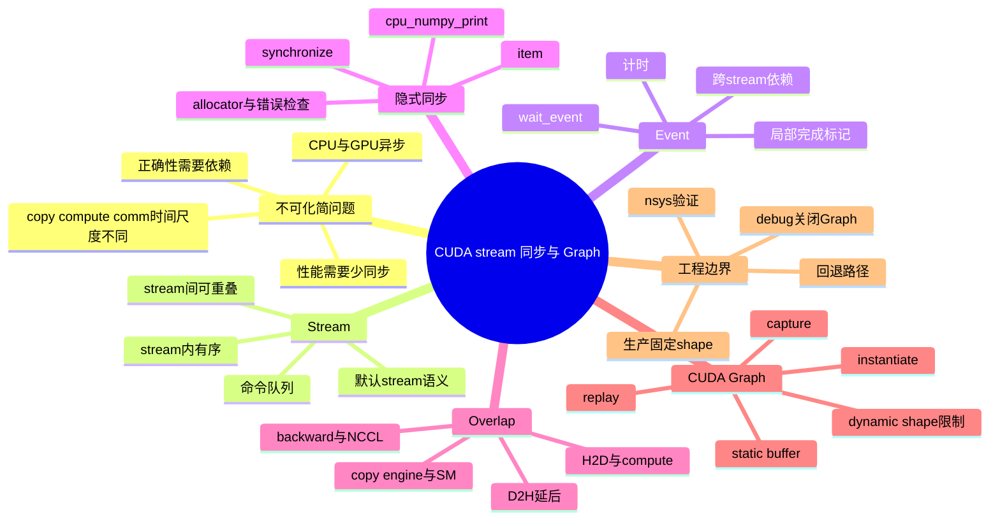
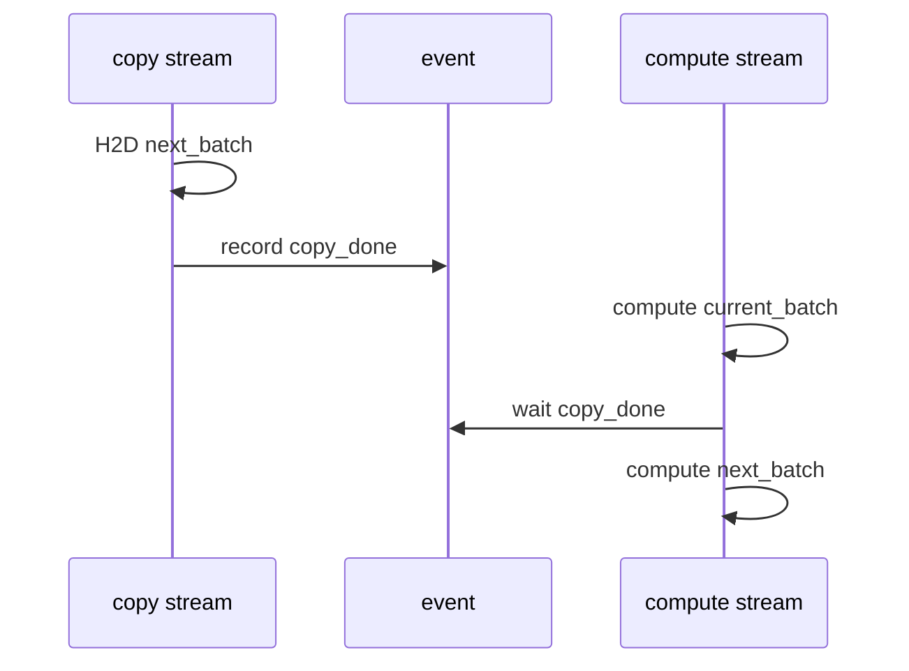
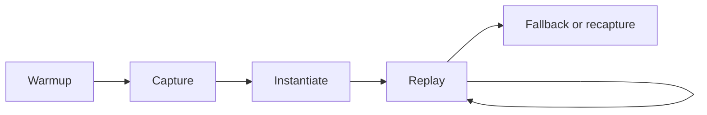

# 第6b章：CUDA Stream、同步与 CUDA Graph

> **关联章节**：本章是 [第6章](./06-cuda-runtime-and-kernels.md) 中 stream、同步和 CUDA Graph 的独立展开。第6章回答"模型调用怎样落到 CUDA runtime 和 kernel"，本章专注"命令流怎样排队、等待、重叠和回放"。H2D、PCIe、NUMA、pinned memory 的主机设备路径见 [第5b章](./05b-host-device-io-pcie-numa-and-overlap.md)；GPU 执行模型和 Tensor Core 见 [第4a章](./04a-gpu-execution-model-and-tensor-cores.md)。本章不展开 dispatcher 细节，也不下钻 kernel 内部 register、occupancy 和 PTX 优化。

## 1. 第一性原理拆解 + 学习大纲

### 拆 — 不可化简的问题

把 CUDA stream、event、默认 stream、NCCL overlap、CUDA Graph 这些名字先拿掉，AI 系统在 GPU 运行时遇到的不可化简问题是：**CPU、GPU copy engine、GPU compute engine 和通信引擎都在不同时间尺度上工作；如果没有一套明确的命令排序和依赖表达机制，系统既无法保证数据正确，又无法让可并行的搬运、计算和通信真正重叠。**

这里面有三个硬约束。

第一是**命令不是立即完成**。一次 `cudaMemcpyAsync`、一次 kernel launch、一次 NCCL collective，通常只是把工作提交到设备队列。CPU 很快返回，GPU 稍后执行。于是代码表面上的顺序，不等于设备完成的顺序。你写下 `y = model(x)` 后，CPU 可能已经继续跑 Python，GPU 还在执行上一批 kernel。

第二是**数据依赖必须被表达出来**。如果 H2D copy 还没结束，compute kernel 就读取目标 buffer，结果就是未定义行为；如果 backward 还没产出某个 gradient，NCCL allreduce 就开始读它，通信得到的就是错误数据。系统必须知道"谁等谁"。这就是 stream、event、`wait_stream`、record event、默认 stream 语义存在的原因。

第三是**正确性和性能天然冲突**。最粗暴的正确性做法是每一步都 `cudaDeviceSynchronize()`：所有前序 GPU 工作完成后再继续。这样当然正确，但会把 H2D、compute、D2H、NCCL 全部拉成串行。高性能做法是只同步必要边界：让当前 batch 计算时，下一 batch 的 H2D 已经在 copy stream 上进行；让 backward 计算较深层 gradient 时，较浅 bucket 的 allreduce 已经在 NCCL stream 上进行；让稳定形状的推理 decode 用 CUDA Graph 回放，减少 CPU launch 开销。难点在于：少同步会错，多同步会慢。

### 本章的 control / data / failure path

- **Control path**：stream / event / default stream / graph capture 如何表达排队、等待、重叠和回放。
- **Data path**：H2D、D2H、NCCL buffer、工作区和中间 tensor 在不同 stream 之间如何被正确传递。
- **Failure path**：隐式同步、错误等待、H2D 与 compute 串行、NCCL overlap 失败、CUDA Graph 回退或 recapture 过多。

### 推 — 从这个问题如何推导出每个机制

从"设备工作是异步的"出发，第一步推出 stream。stream 可以理解成 GPU 侧的命令队列：同一个 stream 内的命令按提交顺序执行，不同 stream 的命令在依赖和硬件资源允许时可以并发。它不是线程，也不是独占 GPU；它是一种排序语义。没有 stream，你很难表达"这段 H2D 可以和那段 compute 重叠"。

从"不同队列之间仍有数据依赖"出发，第二步推出 event。event 是设备时间线上的一个标记：某个 stream 执行到这里时记录 event，另一个 stream 可以等待这个 event。event 的价值不是计时本身，而是把"等待某个局部条件"替代成"等待全设备完成"。正确使用 event，可以只让 compute stream 等某次 H2D 完成，而不是让 CPU 调 `torch.cuda.synchronize()` 等所有 GPU 工作完成。

从"历史兼容和框架默认行为"出发，第三步必须理解默认 stream。默认 stream 不是普通小细节。legacy default stream 可能与其他 blocking stream 发生全局式顺序约束；per-thread default stream 则让每个 host thread 有自己的默认 stream。框架通常帮你封装了大量细节，但当你手写 CUDA、PyTorch stream、扩展算子或混用第三方库时，默认 stream 语义会直接决定时间线是否能重叠。

从"同步可以被隐藏在 API 后面"出发，第四步得到隐式同步。`.item()`、打印 GPU tensor、`tensor.cpu()`、某些内存分配、错误检查、benchmark 计时方式，都可能迫使 CPU 等 GPU。隐式同步的危险在于它看起来不像同步：一行日志、一句断言、一个 shape 分支，可能把本来能流水的 step 拉平。

从"多段工作可以并行推进"出发，第五步得到 overlap。训练中最常见的 overlap 是 H2D/compute overlap 和 compute/NCCL overlap。前者依赖 pinned host memory、non-blocking copy、copy stream 和正确等待；后者依赖梯度 bucket、NCCL stream、反向计算顺序和通信拓扑。overlap 的目标不是让单段工作消失，而是把端到端 step time 从 `t_h2d + t_compute + t_comm` 逼近 `max(t_h2d, t_compute, t_comm)` 的一部分。

最后，从"重复 launch 的 CPU 开销不能靠更多 stream 解决"推出 CUDA Graph。stream 解决的是排序和重叠；CUDA Graph 解决的是重复命令序列的提交开销。Graph capture 把一段稳定的 CUDA 工作录成 DAG，replay 时以更低 CPU 开销提交。它要求地址、shape、控制流、分配行为和依赖结构足够稳定，所以 static buffer、warmup、固定 batch 形状和 graph pool 才会成为生产边界。

### 绘 — 因果链路



### 导 — 读完本章你应该能回答

1. CUDA stream 是什么排序语义？为什么它不是 CPU thread，也不是 GPU 独占通道？
2. event 为什么比全局 synchronize 更适合表达跨 stream 依赖？
3. 默认 stream 有哪些常见语义差异？为什么混用库和自定义算子时要特别小心？
4. 哪些 PyTorch / CUDA 写法会触发隐式同步？它们如何破坏 H2D/compute/NCCL overlap？
5. 要让 H2D 和 compute 重叠，必须同时满足哪些内存、API、stream 和时间线条件？
6. DDP 中 backward 和 NCCL allreduce 为什么能 overlap？bucket 大小、拓扑和同步点会怎样影响收益？
7. CUDA Graph capture/replay 解决的是什么开销？为什么 static buffer 和固定地址是关键？
8. 动态 shape、动态控制流、运行中分配、调试检查为什么会限制 CUDA Graph？
9. debug 阶段和生产阶段应该怎样划分 stream、同步和 Graph 的使用边界？

## 正文内容

### 6b.1 先建立一个正确的时间线模型

很多 CUDA 性能问题来自一个误解：以为 Python 代码执行到下一行，上一行 GPU 工作就已经完成。实际更接近下面这样：

```text
CPU thread:
  enqueue H2D(batch 0) ---- enqueue kernel(batch 0) ---- enqueue H2D(batch 1) ---- enqueue kernel(batch 1)

GPU device:
                 copy batch 0 ---- compute batch 0
                                      copy batch 1 ---- compute batch 1
```

CPU 侧调用通常只是提交命令，真正的执行发生在 GPU 时间线上。stream 决定命令排队顺序，event 决定跨队列等待，synchronize 决定 CPU 是否停下来等设备。

| 对象 | 第一性作用 | 常见误解 | 正确理解 |
|------|------------|----------|----------|
| stream | 表达命令顺序 | 一个 stream 等于一个 GPU 线程 | stream 是队列语义，不保证独占硬件 |
| event | 表达某个点已完成 | 只用于计时 | 更重要的是跨 stream 依赖 |
| default stream | 默认命令队列 | 和普通 stream 完全一样 | 语义受 legacy / per-thread 行为和库封装影响 |
| synchronize | 等待完成 | benchmark 随便用 | 会切断异步流水，只应放在明确边界 |
| CUDA Graph | 录制并回放一段工作 | 自动让 kernel 更快 | 主要减少 launch / runtime 开销 |

一个最小判断规则：**只要某个 API 需要 CPU 立刻拿到 GPU 结果，它就可能同步；只要某个 API 只提交 GPU 后续工作，它就可能异步。**

### 6b.2 Stream：不是并行魔法，而是排序边界

同一个 stream 内，CUDA 保证命令按提交顺序执行：

```text
stream 0:
  H2D A -> kernel A -> D2H A
```

这里 `kernel A` 不会在 `H2D A` 完成前读取 A，`D2H A` 也不会在 `kernel A` 完成前回传结果。这个顺序保证是 stream 的核心价值。

不同 stream 之间，CUDA 允许在资源和依赖允许时重叠：

```text
copy stream:
  H2D batch 1 -------------------->

compute stream:
        compute batch 0 -------------------->
```

这不等于一定并发。能否重叠还取决于：

- H2D 是否来自 pinned host memory；
- 拷贝是否用 async / non-blocking 语义提交；
- GPU 是否有可用 copy engine；
- compute kernel 是否占满所有相关资源；
- 两个 stream 之间是否存在默认 stream 或 event 依赖；
- 代码中是否有 `.item()`、`synchronize()`、D2H、日志等同步点。

#### 6b.2.1 Stream 的几个工程规则

| 规则 | 含义 | 违反后的表现 |
|------|------|--------------|
| 同一数据的生产者和消费者必须有依赖 | copy 完才能 compute，compute 完才能通信或 D2H | 数据竞争、偶发错误、数值漂移 |
| 不相关工作才适合放不同 stream | 下个 batch H2D 与当前 batch compute 可以重叠 | 伪并发，甚至增加排队开销 |
| 多 stream 不是越多越好 | stream 有调度和依赖管理成本 | 时间线碎片化、debug 困难 |
| 同步粒度越小越好 | 等 event 优于等全设备 | GPU 空洞变小 |
| 必须用 profiler 验证 | 代码写成异步不代表真的重叠 | 误把 API 形式当性能结果 |

### 6b.3 默认 Stream：最容易被忽略的同步来源

默认 stream 是没有显式指定 stream 时 CUDA 使用的 stream。问题在于，默认 stream 的语义在不同模式和封装下可能不同。

| 模式 | 直觉 | 工程影响 |
|------|------|----------|
| legacy default stream | 默认 stream 和其他 blocking stream 有较强顺序关系 | 容易把多 stream 工作意外串行化 |
| per-thread default stream | 每个 host thread 有自己的默认 stream | 更利于多线程提交，但混用库时仍要检查 |
| framework current stream | PyTorch 等框架维护当前设备和当前 stream | `with torch.cuda.stream(s)` 只影响作用域内提交 |
| library internal stream | cuBLAS、NCCL、推理引擎可能设置自己的 stream | 需要确认 handle / communicator 绑定和等待关系 |

不要把"没有显式写 stream"理解成"没有 stream"。所有 CUDA 工作都在某个 stream 上，只是你可能不知道它是哪一个。

#### 6b.3.1 一个常见的串行化案例

假设你想让 H2D 在 side stream 上进行：

```python
copy_stream = torch.cuda.Stream()

with torch.cuda.stream(copy_stream):
    next_batch = next_batch.to("cuda", non_blocking=True)

out = model(current_batch)
```

这段代码仍然不完整。因为 `next_batch` 后续被默认 current stream 消费时，必须让 compute stream 等待 copy stream：

```python
torch.cuda.current_stream().wait_stream(copy_stream)
out = model(next_batch)
```

但等待的位置也不能太早。若你在当前 batch compute 之前就 `wait_stream(copy_stream)`，那么 H2D 和 compute 又被拉成串行。正确目标是：

```text
1. side stream 提前搬 next_batch
2. current stream 继续算 current_batch
3. 到真正使用 next_batch 前，current stream 等 copy_stream
```

这就是 stream 编程最核心的工程感：**等待要靠近消费点，而不是靠近生产点。**

### 6b.4 Event：用局部依赖替代全局等待

event 是记录在某个 stream 上的完成标记。另一个 stream 等待这个 event，含义是"等到记录 event 之前的工作完成"，而不是"等整张 GPU 空下来"。



| 同步方式 | 等待范围 | 适合场景 | 风险 |
|----------|----------|----------|------|
| `cudaEventRecord` + `cudaStreamWaitEvent` | 某个 stream 上 event 之前的工作 | 跨 stream 数据依赖 | 依赖漏写会错 |
| `stream.wait_stream(other)` | 等 other stream 已提交的前序工作 | PyTorch 中简单跨 stream 等待 | 等待点放太早会串行 |
| `cudaStreamSynchronize(stream)` | CPU 等某个 stream 完成 | 必须拿到该 stream 结果 | CPU 阻塞 |
| `cudaDeviceSynchronize()` / `torch.cuda.synchronize()` | CPU 等整个设备完成 | benchmark、错误定位、退出前清理 | 破坏所有 overlap |

event 也常用于计时，但要注意：CUDA event 计的是设备时间线，不等于端到端 wall clock。测端到端延迟时，还要包括 CPU 预处理、排队、调度、后处理和网络返回。

### 6b.5 隐式同步：最小的代码，最大的时间线伤害

隐式同步之所以危险，是因为它通常长得不像性能代码。

| 写法 | 为什么同步 | 常见出现位置 | 替代做法 |
|------|------------|--------------|----------|
| `loss.item()` | GPU 标量要搬到 CPU Python 数值 | 每 step 日志 | 降低频率，设备侧累计，异步回传 |
| `print(tensor)` | 打印需要 CPU 读取内容 | debug 日志 | 打印 shape / dtype / device，必要时抽样同步 |
| `tensor.cpu()` | D2H 需要等待前序写入完成 | metrics、后处理 | 批量 D2H，延后到边界 |
| `tensor.numpy()` | 先 D2H，再暴露 CPU array | 评估脚本 | 明确放在 eval 边界 |
| `if tensor_bool:` | Python 分支需要 CPU bool | 动态控制流、断言 | tensor 级控制或提前同步到明确边界 |
| `torch.cuda.synchronize()` | 显式全设备等待 | benchmark、排障 | 只包住测量区间 |
| `CUDA_LAUNCH_BLOCKING=1` | 每个 launch 变成阻塞 | 定位报错 | 只在 debug 会话开启 |
| 某些首次调用 | context 初始化、autotune、lazy load | 首 step、首请求 | warmup，不计入稳态 |
| 运行中大分配 | allocator 可能触发整理或等待 | 动态 shape、临时 tensor | 预分配、复用 static buffer |

一个实际经验是：训练日志里每 step `loss.item()`，通常不是一个"小小的 CPU 读取"，而是一次强同步。它可能让 CPU 等 backward、optimizer、前面所有已排队 kernel 完成，然后才继续提交下一 step 的工作。

#### 6b.5.1 Debug 代码如何进入生产事故

常见事故链路如下：

```text
线上吞吐下降
  -> 查看最近改动
  -> 某个 PR 加了每 batch nan 检查
  -> 检查写成 assert torch.isfinite(loss).all()
  -> Python 需要 bool
  -> 每 step D2H + synchronize
  -> H2D/compute/NCCL overlap 全部变差
```

这类问题很难靠代码 review 肉眼发现，因为检查逻辑本身是合理的。更稳的做法是把 debug 检查分层：

| 阶段 | 允许的同步 | 目标 |
|------|------------|------|
| 本地 debug | 可以开启 `CUDA_LAUNCH_BLOCKING=1`、频繁 `.item()` | 定位正确性错误 |
| 性能调试 | 只在测量边界同步 | 得到可信时间线 |
| 预生产压测 | 禁止 per-step 隐式同步 | 验证稳态吞吐 |
| 生产 | 同步必须可解释、可采样、可开关 | 控制尾延迟和成本 |

### 6b.6 H2D / Compute Overlap：从三段串行到流水线

最朴素的训练 step 是串行的：

```text
CPU prepare batch 0
H2D batch 0
compute batch 0
CPU prepare batch 1
H2D batch 1
compute batch 1
```

流水化后的目标是：

```mermaid
gantt
  title H2D 与 compute overlap
  dateFormat x
  axisFormat %L
  section CPU
  prepare b0 :0, 20
  prepare b1 :20, 20
  prepare b2 :40, 20
  section Copy Stream
  H2D b0 :20, 12
  H2D b1 :40, 12
  H2D b2 :80, 12
  section Compute Stream
  compute b0 :32, 48
  compute b1 :80, 48
  compute b2 :128, 48
```



这张图表达的是结构，不是具体时间。真实系统里，copy 和 compute 是否重叠要看 Nsight Systems 的 CUDA HW row、Memcpy row 和 stream row。

一个实用的 overlap 决策公式是：

```text
serial_time = t_h2d + t_compute + t_comm
ideal_time = max(t_h2d, t_compute, t_comm)
overlap_efficiency = (serial_time - measured_step_time) / (serial_time - ideal_time)
```

如果 `overlap_efficiency <= 0`，说明 measured step 仍接近串行，先查 pinned memory、non_blocking、copy stream、默认 stream、过早 wait 和隐式同步。若 efficiency 已经很高，继续增加 stream 往往收益有限，反而可能增加调度复杂度。

#### 6b.6.1 Overlap 的必要条件

| 条件 | 为什么必要 | 常见失败表现 |
|------|------------|--------------|
| host batch 在 pinned memory | pageable memory 可能触发 staging 和同步 | `non_blocking=True` 但 H2D 仍阻塞 |
| H2D 使用 async / non-blocking | CPU 能继续提交后续工作 | copy 期间 CPU 卡住 |
| copy 与 compute 不在同一严格串行队列 | 才有重叠机会 | 时间线上 H2D 和 kernel 轮流出现 |
| 消费前有 event / wait | 保证数据正确 | 偶发错误或脏数据 |
| 等待点靠近消费点 | 保留 overlap 窗口 | 过早 wait 导致串行 |
| compute 足够长 | copy 才有地方藏进去 | 小模型中 overlap 收益有限 |
| 没有隐式同步 | 避免 CPU/GPU 队列被拉平 | 每 step 固定空洞 |

#### 6b.6.2 PyTorch 预取器骨架

下面的代码只展示机制，不是完整生产模板：

```python
class CUDAPrefetcher:
    def __init__(self, loader, device):
        self.loader = iter(loader)
        self.device = device
        self.stream = torch.cuda.Stream(device=device)
        self.next_batch = None
        self.preload()

    def preload(self):
        try:
            batch = next(self.loader)
        except StopIteration:
            self.next_batch = None
            return

        with torch.cuda.stream(self.stream):
            self.next_batch = {
                k: v.to(self.device, non_blocking=True)
                for k, v in batch.items()
            }

    def next(self):
        torch.cuda.current_stream(self.device).wait_stream(self.stream)
        batch = self.next_batch
        if batch is None:
            return None
        self.preload()
        return batch
```

这段代码背后的时间线是：side stream 搬下一批，current stream 使用上一批；使用前只等待必要的 copy stream。真实生产还要处理 nested batch、异常、epoch 边界、多个 GPU rank、device guard、静态 buffer、CUDA Graph capture 兼容性和内存峰值。

### 6b.7 Compute / NCCL Overlap：通信不是等 backward 全结束才开始

分布式数据并行中，每个 rank 反向传播会产生梯度。朴素做法是：

```text
backward all layers
  -> allreduce all gradients
  -> optimizer step
```

这会把通信完整加在 backward 后面。更好的做法是按 bucket overlap：

```mermaid
gantt
  title Backward 与 NCCL overlap
  dateFormat x
  axisFormat %L
  section Compute Stream
  backward L4 :0, 20
  backward L3 :20, 20
  backward L2 :40, 20
  backward L1 :60, 20
  section NCCL Stream
  allreduce bucket4 :22, 28
  allreduce bucket3 :45, 28
  allreduce bucket2 :68, 28
  allreduce bucket1 :91, 28
```



当某个 bucket 的 gradient ready 后，DDP 可以在 NCCL stream 上启动 allreduce，同时 compute stream 继续算更早层的 backward。这样总 step time 更接近：

```text
step_time ≈ forward + max(backward_compute, overlapped_comm) + exposed_comm_tail + optimizer
```

而不是：

```text
step_time ≈ forward + backward_compute + all_comm + optimizer
```

#### 6b.7.1 为什么 overlap 经常没有想象中好

| 原因 | 表现 | 调整方向 |
|------|------|----------|
| bucket 太大 | 很晚才 ready，通信启动晚 | 调小 bucket，观察尾巴 |
| bucket 太小 | NCCL launch 太多，开销变大 | 合并 bucket，减少碎片 |
| backward kernel 太短 | 没有足够 compute 覆盖通信 | fusion / compile / graph，或接受通信尾巴 |
| 拓扑瓶颈 | NCCL stream 长尾明显 | 检查 NVLink、PCIe、NIC、NCCL topo |
| 隐式同步 | compute 和 NCCL 被强制对齐 | 移除 `.item()`、debug assert、全局同步 |
| 梯度使用顺序特殊 | bucket ready 顺序不理想 | 调整模型结构或 bucket assignment |

NCCL collective 本身通常以 CUDA kernel 或设备侧工作形式出现在时间线里。它也在 stream 上排队，也需要正确依赖。不要把 NCCL 理解成"CPU 发一个网络请求"；在 GPU 训练里，它是 GPU、NIC、互联拓扑和 runtime 共同构成的时间线。

### 6b.8 CUDA Graph：把重复命令序列变成可回放 DAG

CUDA Graph 的第一性目标是减少重复 launch 和 runtime 调度开销。它不会自动改变单个 kernel 的数学实现，也不会让一个 memory-bound kernel 变成 compute-bound。它主要解决这种场景：

```text
每 step 都执行同样的 CUDA 操作序列
  kernel A -> kernel B -> memcpy -> kernel C -> NCCL -> kernel D

如果每个操作都单独 launch:
  CPU 每次都走 Python / framework / runtime / driver 提交流程

如果 capture 成 graph:
  稳态 replay 用低开销提交整个 DAG
```

Graph 的生命周期可以拆成四步：



| 阶段 | 做什么 | 工程注意 |
|------|--------|----------|
| warmup | 初始化 context、allocator、autotune、lazy kernel | 不要把冷启动误判为 Graph 慢 |
| capture | 记录 CUDA 操作和依赖 DAG | capture 内避免不支持的 CPU 同步和动态分配 |
| instantiate | 生成可执行 graph 对象 | 可能占用额外内存 |
| replay | 重复提交同一 DAG | 输入输出地址必须稳定 |
| fallback / recapture | shape 或路径变化时走回退 | 需要明确策略，不能线上无限 recapture |

### 6b.9 Static Buffer：Graph 能工作的核心工程约束

CUDA Graph replay 复用的是捕获时的操作、依赖和内存地址。也就是说，Graph 中 kernel 参数指向的 tensor 地址通常要保持稳定。于是生产里常见的做法是维护 static input / output buffer：

```python
static_x = torch.empty((batch_size, hidden), device="cuda", dtype=torch.float16)
static_y = torch.empty((batch_size, hidden), device="cuda", dtype=torch.float16)

# capture 前，模型和 allocator 已 warmup
g = torch.cuda.CUDAGraph()
with torch.cuda.graph(g):
    static_y.copy_(model(static_x))

def run(x):
    static_x.copy_(x)
    g.replay()
    return static_y
```

这段代码只说明地址稳定的思想。真实 PyTorch Graph 使用还要考虑 `make_graphed_callables`、optimizer、AMP、RNG state、多个输入输出、in-place 更新和 stream capture 约束。

#### 6b.9.1 Static buffer 的收益与代价

| 维度 | 收益 | 代价 |
|------|------|------|
| launch 开销 | replay 降低 CPU 提交成本 | capture 前后代码复杂 |
| 内存地址 | 固定地址让 graph 可复用 | 需要额外常驻 buffer |
| shape | 固定 shape 下最稳定 | 动态 shape 需要 padding 或多 graph |
| allocator | 避免运行中频繁分配 | 显存峰值可能升高 |
| debug | 稳态路径更可控 | 错误栈和时间线不如 eager 直观 |

一个容易忽略的问题是：static buffer 不只是"多占一点显存"。它还改变了内存生命周期。原本 eager 模式下某些临时 tensor 可以被 allocator 复用；Graph 模式下为了保证 replay 正确，graph pool 和静态地址可能让显存常驻更高。对推理服务，吞吐提升和并发容量之间必须重新评估。

### 6b.10 动态 Shape：CUDA Graph 的主要边界

动态 shape 会让 Graph 复杂化，原因不是 CUDA 不喜欢 shape，而是 shape 变化通常意味着：

- kernel 参数不同；
- grid / block 或库内部算法选择不同；
- tensor 地址和临时 buffer 大小不同；
- 控制流路径不同；
- allocator 行为不同；
- 某些分支会多出或少掉 CUDA 操作。

常见处理策略如下：

| 策略 | 做法 | 适合场景 | 代价 |
|------|------|----------|------|
| padding 到固定 shape | 把请求 pad 到固定 batch / seq len | 在线推理、decode bucket | 多算 padding token |
| shape bucket | 为几个常见 shape 各 capture 一个 graph | LLM prefill、图像多分辨率 | graph 数量和显存增加 |
| eager fallback | 少见 shape 不 graph | 长尾请求 | 长尾延迟较高 |
| recapture | shape 变化时重新 capture | 离线任务、低频变更 | 线上抖动风险大 |
| 编译器托管 | 交给 `torch.compile`、TensorRT-LLM、vLLM | 标准模型路径 | 仍需理解失败边界 |

#### 6b.10.1 LLM 推理里的 shape bucket

LLM 服务里，decode 阶段每步通常只生成少量 token，kernel 很碎，Graph 收益明显。但请求的 batch size、sequence length、KV cache block 分布又是动态的。常见工程折中是：

```text
batch size bucket: 1, 2, 4, 8, 16, 32
sequence bucket: 128, 256, 512, 1024, 2048, 4096

请求实际 shape -> 选择最接近的 bucket -> pad / mask -> replay 对应 graph
```

这个策略降低 launch 开销，但带来两个新问题：

1. padding 增加无效计算，尤其在长短请求混合时明显；
2. 每个 graph / bucket 可能持有静态 buffer，显存容量和碎片都要重新测。

所以 Graph 不是"开关优化"，而是一套调度、内存和 shape 策略。

### 6b.11 Capture 期间哪些事情容易出问题

CUDA Graph capture 要求 capture 区间内的 CUDA 行为可重复。以下操作经常成为问题源：

| 操作 | 风险 | 处理方式 |
|------|------|----------|
| capture 内 `.item()` | CPU 需要等待 GPU 结果 | 移出 capture，改设备侧逻辑 |
| capture 内动态分配 | replay 时地址和 allocator 行为不稳定 | warmup + 预分配 |
| capture 内 shape 分支 | DAG 结构可能变化 | shape bucket 或 fallback |
| capture 内随机数 | RNG 状态需要可控 | 使用框架支持的 graph-safe RNG |
| capture 内 CPU IO / logging | 不是 CUDA DAG 的稳定部分 | 移到 capture 外 |
| capture 内异常检查 | 可能触发同步或分支 | debug 路径关闭 Graph |
| 混用未知第三方 CUDA 库 | 可能不支持 stream capture | 查文档，做最小验证 |

生产系统必须给 Graph 失败准备回退路径。最糟糕的做法是：线上遇到新 shape 时在请求线程里同步 recapture，导致 P99 抖动；或者 capture 失败后静默退回 eager，却没有指标，吞吐下降很久才被发现。

### 6b.12 Debug 与生产边界

stream、event 和 Graph 的正确使用，需要把 debug 和生产边界分清楚。

| 阶段 | 推荐设置 | 禁忌 |
|------|----------|------|
| 正确性 debug | eager，必要时 `CUDA_LAUNCH_BLOCKING=1`，关闭 Graph | 用 Graph 隐藏错误来源 |
| 性能 profile | 固定输入，warmup 后采样，少量明确 synchronize | 把冷启动、compile、capture 计入稳态 |
| 压测 | 开启生产 stream / Graph / bucket 策略 | 每请求打印 GPU tensor |
| 生产 | Graph 命中率、fallback、同步次数、P99 都要监控 | 无指标地自动 recapture |
| 事故排查 | 可切换 debug 开关，采样同步 | 全量开启阻塞模式 |

一个实用原则是：**debug 代码可以牺牲异步性，但必须有明确开关；生产代码可以使用异步和 Graph，但必须有可观测的回退边界。**

#### 6b.12.1 生产指标应该看什么

| 指标 | 意义 | 异常信号 |
|------|------|----------|
| Graph replay 命中率 | 请求是否走低开销路径 | shape 长尾过多，bucket 不合理 |
| Graph capture / recapture 次数 | 是否稳态运行 | 线上频繁 recapture |
| fallback eager 比例 | Graph 失败或不适用程度 | 新模型路径未覆盖 |
| H2D 与 compute overlap 比例 | 输入流水是否有效 | copy 和 kernel 严格交替 |
| exposed NCCL tail | 通信未被计算覆盖的尾巴 | bucket 或拓扑问题 |
| per-step synchronize 次数 | 隐式或显式同步风险 | debug 代码进入生产 |
| CUDA API CPU time | launch / runtime 开销 | 小 kernel 太多或 Graph 失效 |
| 显存常驻和峰值 | static buffer 与 graph pool 成本 | bucket 过多导致容量下降 |

#### 6b.12.2 Stream / Graph EvidenceBundle 与 retest

本章的 EvidenceBundle 不是只保存一张时间线截图，而是要能回答"异步性是否真的改善"。最小证据如下：

| 主题 | 必备证据 | retest threshold |
|------|----------|------------------|
| 隐式同步 | `torch.profiler` 找到 `.item()`、D2H、`cudaDeviceSynchronize` 或同步 API；`nsys` 显示同步前后 CUDA HW 空洞 | 移除后 P50/P95 step time 改善，且日志/metric 延迟写不影响正确性 |
| H2D/compute overlap | `nsys` Memcpy row、CUDA HW row、stream row；记录 pinned memory、`non_blocking`、DataLoader timing | overlap_efficiency 提升，measured step time 低于串行估算，显存峰值不超 CapacityLedger |
| NCCL overlap | 多 rank `nsys`，NCCL row 与 backward compute 是否交叠，bucket 配置和拓扑 | exposed comm tail 下降，最慢 rank 不再拖尾，吞吐提升能重复 3 次 |
| CUDA Graph | Graph hit rate、fallback eager ratio、recapture count、static buffer memory、shape bucket 分布 | P50 改善不能以 P99 明显退化为代价；fallback/recapture 必须有告警和回退开关 |

复测时要把 warmup、CUDA Graph capture、steady-state 分开。Graph 的收益必须在真实 shape 分布上验证；只在固定 synthetic shape 上变快，不足以上线。

### 6b.13 工程案例一：每 step `.item()` 让 overlap 消失

某训练任务在 8 GPU 上吞吐比预期低 12%。Nsight Systems 显示：

```text
每 step backward 结束
  -> CUDA HW row 空一段
  -> CPU row 出现 D2H copy / synchronize
  -> 下一 step H2D 才开始
```

代码里有：

```python
loss_value = loss.item()
logger.info("loss=%f", loss_value)
```

问题不是 D2H 的字节数大，而是 `.item()` 需要 CPU 拿到 GPU 标量，所以它等待前面所有相关 GPU 工作完成。修复方式：

- 每 N step 采样一次 loss；
- 或在 GPU 上累计 metrics，按窗口回传；
- 或把日志放到明确的 step 边界，并接受该边界同步；
- profile 验证 H2D prefetch 是否重新与 compute 重叠。

这个案例的关键教训：**小 D2H 也可能是大同步。**

### 6b.14 工程案例二：推理服务启用 CUDA Graph 后 P99 变差

某在线推理服务对固定 batch benchmark 启用 CUDA Graph 后，吞吐提升 20%。上线后 P50 改善，但 P99 变差。排查发现：

| 现象 | 原因 |
|------|------|
| Graph 命中率只有 55% | 请求 shape 长尾多 |
| fallback eager P99 高 | 长尾 shape 走未优化路径 |
| 显存占用增加 | 为多个 bucket 常驻 static buffer |
| 偶发尖刺 | 请求线程触发 recapture |

最终方案：

1. 只为高频 batch / seq bucket 捕获 graph；
2. 长尾 shape 明确走 eager fallback，不在线 recapture；
3. 调度层把相近 shape 合批，提高 bucket 命中；
4. 每个模型版本上线前报告 graph 命中率、显存成本和 P99；
5. debug 镜像默认关闭 Graph，生产镜像默认开启但可按模型回退。

这个案例说明，CUDA Graph 的收益不是单点 benchmark 决定的，而是由真实流量 shape 分布、bucket 策略和 fallback 行为共同决定。

### 6b.15 工程案例三：NCCL overlap 被错误的等待点吃掉

一个 DDP 训练任务升级后，单卡 kernel 时间没变，网络带宽也正常，但 step time 变长。时间线显示 NCCL allreduce 几乎都堆在 backward 之后。排查发现自定义 hook 中加入了：

```python
torch.cuda.synchronize()
```

作者的意图是"确保梯度已经 ready"，但 DDP 原本通过 bucket ready 和 stream/event 表达依赖；全局 synchronize 把所有 backward compute 等完，NCCL 才继续，overlap 消失。

修复方式：

- 删除全局 synchronize；
- 用 event 或框架 hook 的 ready 语义表达局部依赖；
- 调整 bucket size 后重新 profile；
- 增加性能回归检查：exposed NCCL tail 不得超过基线阈值。

## 排障 Checklist

### Stream 与 Event

- [ ] 每个 H2D、compute、D2H、NCCL 工作分别在哪个 stream 上？
- [ ] 同一 stream 内的顺序是否符合生产者 / 消费者关系？
- [ ] 跨 stream 依赖是用 event / wait 表达，还是靠全局 synchronize？
- [ ] 等待点是否靠近消费点，而不是过早切断 overlap？
- [ ] 是否混用了默认 stream、自定义 stream、库内部 stream，却没有明确等待关系？
- [ ] Nsight Systems 中不同 stream 的工作是否真的重叠？

### 隐式同步

- [ ] 训练或推理热路径里是否有 `.item()`、`tensor.cpu()`、`numpy()`、打印 GPU tensor？
- [ ] 是否有 Python `if` / `assert` 依赖 GPU tensor 值？
- [ ] 是否在每 step、每 request 或每 bucket 调用 `torch.cuda.synchronize()`？
- [ ] 是否把 `CUDA_LAUNCH_BLOCKING=1` 带进了性能测试或生产环境？
- [ ] benchmark 是否只在测量边界同步，而不是每个小段都同步？
- [ ] 首 step 的 context 初始化、autotune、compile、Graph capture 是否和稳态分开统计？

### H2D / Compute / NCCL Overlap

- [ ] DataLoader 是否使用 pinned memory，H2D 是否 `non_blocking=True`？
- [ ] H2D 是否有独立 copy stream，并在消费前才等待？
- [ ] copy 时间是否足够被 compute 覆盖，还是 compute 太短无法隐藏？
- [ ] D2H metrics / logs 是否被延后或批量化？
- [ ] DDP bucket 是否过大导致 allreduce 启动太晚？
- [ ] NCCL stream 是否与 backward compute overlap，还是形成通信尾巴？
- [ ] 拓扑、NCCL 算法和 bucket 设置是否一起验证？

### CUDA Graph

- [ ] Graph 捕获前是否完成 warmup、allocator 预热和 autotune？
- [ ] capture 区间内是否存在动态 shape、动态控制流或运行中分配？
- [ ] 输入、输出和关键中间 buffer 地址是否稳定？
- [ ] static buffer 的显存成本是否计入容量规划？
- [ ] 是否为常见 shape 设计 bucket，为长尾 shape 设计 fallback？
- [ ] 是否监控 graph replay 命中率、fallback 比例和 recapture 次数？
- [ ] debug 路径是否能关闭 Graph，生产路径是否能按模型回退？

### 故障速查表

| 故障 | 典型时间线 | 首查项 | 修复方向 | retest |
|------|------------|--------|----------|--------|
| 隐式同步 | CUDA HW row 后出现 CPU D2H / synchronize，后续 H2D 才开始 | `.item()`、`tensor.cpu()`、打印 GPU tensor、错误检查、benchmark 同步位置 | 延迟 metric 聚合、异步日志、只在测量边界同步 | per-step synchronize 次数下降，P95/P99 不再出现固定空洞 |
| bad overlap | Memcpy 与 kernel 像阶梯一样轮流出现 | pinned memory、`non_blocking=True`、copy stream、默认 stream、wait 点 | side stream 预取，event/wait 靠近消费点，修 DataLoader/NUMA | overlap_efficiency 提升，端到端 step time 低于串行估算 |
| CUDA Graph regression | P50 下降但 P99 或 OOM 上升 | shape bucket 命中率、fallback、recapture、static buffer、graph pool | bucket 重设、限制线上 recapture、显式 fallback、容量预算 | Graph hit rate 达标，P99 不超过阈值，CapacityLedger 更新 |
| NCCL overlap 消失 | backward compute 完后才出现 NCCL 长尾 | bucket、DDP hook、全局 synchronize、rank skew、拓扑 | 移除全局同步，调整 bucket，定位慢 rank，检查 NCCL topo | exposed comm tail 下降，多 rank 复测稳定 |

## 本章涉及的常见工具

| 目标 | 工具 / 命令 | 用法 |
|------|-------------|------|
| 系统时间线 | `nsys profile python train.py` | 看 stream、Memcpy、kernel、NCCL 是否重叠 |
| PyTorch 侧 profile | `torch.profiler` | 关联 Python op、CUDA op 和隐式同步 |
| 强制同步定位错误 | `CUDA_LAUNCH_BLOCKING=1` | 只用于 debug，不用于性能结论 |
| 手动同步测量 | `torch.cuda.synchronize()` | 只放在 benchmark 测量边界 |
| CUDA event 计时 | `torch.cuda.Event(enable_timing=True)` | 测设备侧区间 |
| Graph API | `torch.cuda.CUDAGraph()`、`torch.cuda.graph` | 手动 capture / replay |
| 编译托管 Graph | `torch.compile(mode="reduce-overhead")` | 优先尝试的 PyTorch 路径 |
| 显存观察 | `torch.cuda.memory_summary()`、`nvidia-smi` | 看 static buffer 和 graph pool 成本 |
| NCCL 观察 | `NCCL_DEBUG=INFO`、nsys NCCL row | 看通信算法、拓扑和通信尾巴 |

## 本章小结

| 主题 | 关键结论 |
|------|----------|
| stream | 表达 CUDA 命令队列顺序，同 stream 有序，跨 stream 可重叠 |
| event | 表达局部完成和跨 stream 依赖，优于全设备等待 |
| 默认 stream | 不是无害默认值，混用库和自定义 stream 时要确认语义 |
| 隐式同步 | `.item()`、打印、D2H、断言和全局 synchronize 会破坏异步流水 |
| H2D/compute overlap | 依赖 pinned memory、non-blocking copy、copy stream 和正确等待点 |
| NCCL overlap | 依赖 bucket ready、NCCL stream、反向计算顺序和拓扑 |
| CUDA Graph | 主要减少重复 launch / runtime 开销，不直接优化单个 kernel |
| static buffer | Graph replay 依赖稳定地址，代价是常驻显存和更复杂生命周期 |
| 动态 shape | 需要 padding、bucket、fallback 或 recapture 策略 |
| debug / 生产边界 | debug 可牺牲异步性，生产必须监控同步、Graph 命中和回退 |

---

## 练习题

### 基础题

1. 用自己的话解释 CUDA stream 的排序语义。为什么说 stream 不是 CPU thread，也不是 GPU 独占通道？
2. event 和 `torch.cuda.synchronize()` 都能"等待"，它们等待的范围有什么不同？
3. 列出 6 种常见隐式同步写法，并说明每一种为什么需要 CPU 等 GPU。
4. 默认 stream 为什么可能让原本不同 stream 的工作串行化？请描述一个混用默认 stream 和 side stream 的例子。
5. H2D copy 要和 compute 重叠，至少需要满足哪些条件？
6. CUDA Graph capture/replay 解决的主要开销是什么？它为什么不能让单个低效 kernel 自动变快？

### 进阶题

7. 某训练 step 中 H2D 18 ms、compute 60 ms、D2H metrics 2 ms。串行执行需要多少时间？如果 H2D 完全被上一 step compute 覆盖，而 D2H 每 20 step 批量一次，稳态下限大约是多少？
8. 下面的预取流程哪里可能过早同步：`copy next batch -> wait copy stream -> compute current batch -> compute next batch`？请改写成更合理的等待顺序。
9. 一个 DDP 任务中 NCCL allreduce 总在 backward 后集中出现。请列出至少 5 个可能原因和对应验证方法。
10. 一个推理服务启用 CUDA Graph 后平均延迟下降，但 P99 上升。请从 shape bucket、fallback、static buffer、recapture 四个角度分析。
11. 为什么 dynamic shape 会限制 CUDA Graph？请把原因拆成 kernel 参数、临时 buffer、控制流、allocator 四类。
12. 设计一个 CUDA event 计时实验，比较设备侧 kernel 时间和端到端请求时间。为什么两者可能相差很大？

### 开放题

13. 为一个单机训练任务设计 H2D/compute overlap 的 profiling SOP。要求包含采集命令、时间线观察点、常见根因和修复顺序。
14. 你的团队准备把训练默认打开 `torch.compile(mode="reduce-overhead")`。请设计灰度策略，覆盖 warmup、Graph capture 失败、动态 shape、显存峰值、性能回归和回退开关。
15. 为一个 LLM 推理服务设计 CUDA Graph shape bucket 策略。给出 bucket 选择、padding 代价、graph 命中率指标、fallback 规则和上线验收标准。
16. 某同事在自定义 DDP hook 里加入 `torch.cuda.synchronize()` 来"保证梯度 ready"。请写一段技术评审意见，说明它为什么可能破坏 NCCL overlap，以及应该用什么依赖表达方式替代。
