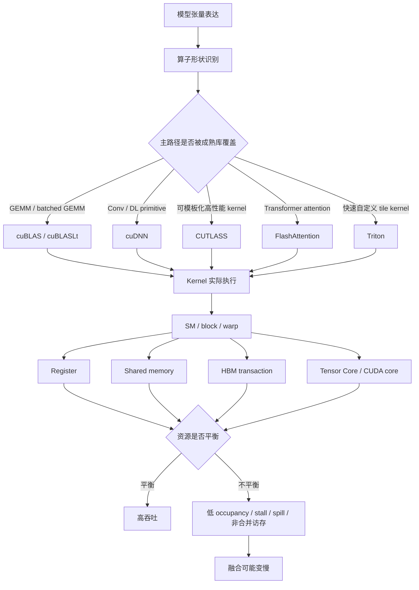
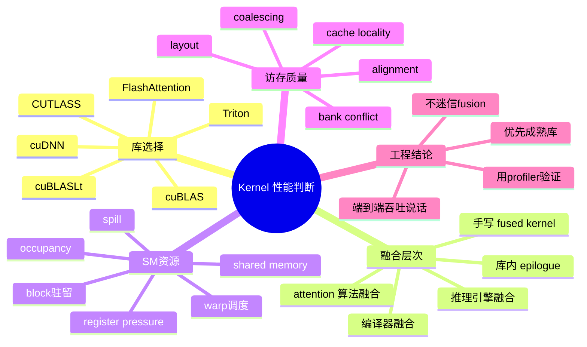
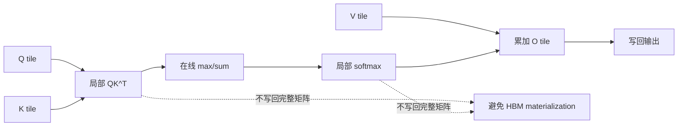
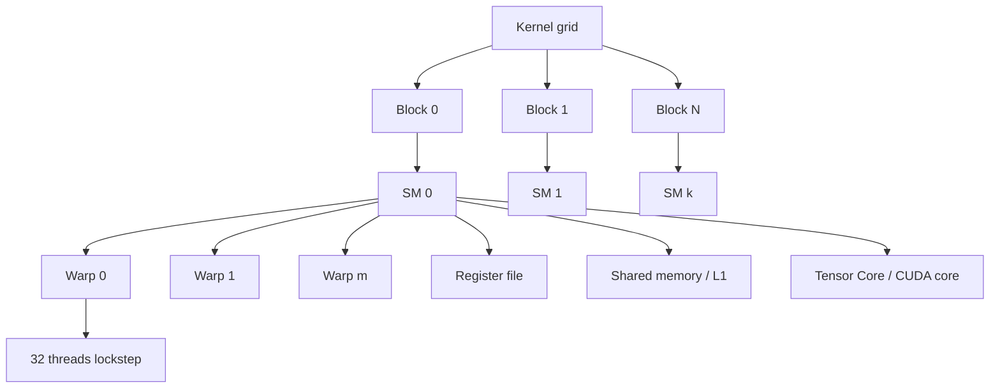
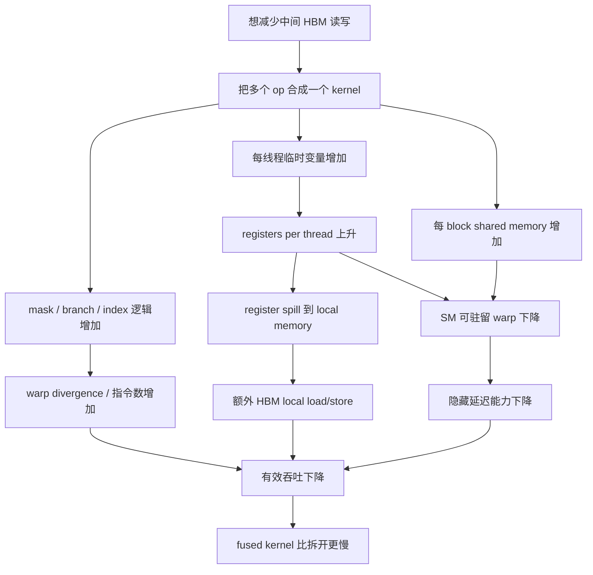

# 第6c章：高质量算子库、融合与 SM 内部资源限制

> AI 系统性能优化的第一原则不是"多写 kernel"，而是知道什么时候应该信任成熟库，什么时候融合真的减少了瓶颈，什么时候一个看起来更聪明的 fused kernel 反而把 SM 内部资源压垮。

> **关联章节**：本章是 [第6章](./06-cuda-runtime-and-kernels.md) 的独立拆分篇，重点从 runtime 和 launch 链路下沉到算子库选择、kernel 融合边界和 SM 内部资源。GPU 执行模型与 Tensor Core 见 [第4a章](./04a-gpu-execution-model-and-tensor-cores.md)，HBM、arithmetic intensity 和 roofline 见 [第4b章](./04b-hbm-memory-and-roofline.md)。本章只轻触 launch overhead，不展开 CUDA Graph 和 runtime 调度。

## 1. 第一性原理拆解 + 学习大纲

### 拆 — 不可化简的问题

去掉 cuBLAS、cuDNN、CUTLASS、FlashAttention、Triton、fusion、occupancy 这些名字，本章真正要解决的问题是：**一个模型 step 或一次推理请求最终会变成许多 kernel，而每个 kernel 必须在有限的 SM、warp、register、shared memory、HBM 带宽和指令调度能力内完成工作；高性能来自把正确的计算形状交给正确的库，并让 kernel 内部资源不要互相踩踏。**

这句话里有三层约束。

第一层是**算子形状约束**。Transformer 的主干里有 GEMM、batched GEMM、convolution、attention、normalization、activation、softmax、sampling、embedding lookup、optimizer update、quantization / dequantization 等算子。它们的计算密度、数据复用方式和 shape 规律完全不同。GEMM 可以高效使用 Tensor Core；LayerNorm、RMSNorm、softmax、embedding、decode attention 更容易受 HBM 带宽、访存规整性和小 batch 影响。一个平台如果把所有算子都当成"GPU 计算"，就无法解释为什么某些层很快，某些层换新卡也不怎么快。

第二层是**实现质量约束**。高质量算子库不是简单包了一层 API，而是在大量 dtype、layout、tile、pipeline、prefetch、epilogue、workspace、Tensor Core 指令和硬件版本上做了长期调优。cuBLAS/cuBLASLt、cuDNN、CUTLASS、FlashAttention、Triton 各自服务不同层级：有的给你现成的生产级 kernel，有的给你可配置模板，有的给你更高生产率的自定义 kernel 语言。工程上最贵的错误，是在成熟库已经覆盖的主路径上自研低质量 kernel，然后把时间花在追平别人多年优化上。

第三层是**SM 资源约束**。一个 kernel 被切成 block，block 驻留在 SM 上，SM 再调度 warp。每个线程要用 register，每个 block 可能要用 shared memory，每个 SM 能驻留的 block 和 warp 有硬上限。为了减少中间写回而融合多个算子，可能会增加每个线程的临时变量、shared memory tile、同步点和代码路径。于是 fused kernel 有双重性：它可能减少 HBM 往返和 launch 数，也可能降低 occupancy、增加 register pressure、触发 spill、破坏 memory coalescing，最后更慢。

因此，本章的核心不是背库名，而是建立判断顺序：**先识别算子形状，再选择成熟实现，再用 profiler 看 kernel 内部资源，最后才决定是否自定义或加深融合。**

### 本章的 control / data / failure path

- **Control path**：算子选择 → 库调用 / kernel 生成 → block / warp 调度 → kernel 退役。
- **Data path**：输入输出 tensor、workspace、register、shared memory、HBM 读写和 epilogue 中间值。
- **Failure path**：库选错、融合过深、register pressure 过高、shared memory 过大、spill、occupancy 下降、coalescing 退化。

### 推 — 从这个问题如何推导出每个机制

从"算子形状不同"出发，首先推出算子库分工。矩阵乘法是训练和推理里最值钱的密集计算，所以 cuBLAS 和 cuBLASLt 成为主路径；卷积、batch norm、pooling、RNN、部分 attention 和 fused deep learning primitive 更适合 cuDNN；如果要自己拼高性能 GEMM、implicit GEMM convolution 或特定 epilogue，CUTLASS 提供接近库内部风格的模板化组件；如果要写 Python 生态里快速迭代的自定义 elementwise、reduction、attention 变体或推理 kernel，Triton 提供更高层的 tile 编程模型；如果要优化 Transformer attention 的内存往返，FlashAttention 这类专门算法库会比手写普通 softmax attention 更可靠。

从"中间结果写回昂贵"出发，推出算子融合。没有融合时，`x -> bias -> activation -> dropout -> residual -> norm` 可能被拆成多个 kernel，每一步都读写 HBM。融合后，中间值可以留在 register 或 shared memory，最后只写一次输出。attention 也类似：普通 attention 会显式 materialize `QK^T` 和 softmax 矩阵；FlashAttention 通过 tile 化和在线 softmax 避免把巨大 attention matrix 写到 HBM。融合的本质不是魔法，而是减少不必要的字节移动和固定调度成本。

从"SM 内部资源有限"出发，推出 occupancy、register pressure、shared memory 和 spill。occupancy 衡量一个 SM 上有多少活跃 warp 能帮助隐藏延迟；register pressure 衡量每个线程需要多少寄存器；shared memory 用量决定每个 SM 能放几个 block；spill 表示寄存器不够时临时值被放到 local memory，而 local memory 通常走显存路径。一个 kernel 是否快，不由"融合了几个算子"决定，而由这些资源共同决定。

最后，从"硬件以 warp 为单位执行"推出 memory coalescing 和 warp-level 设计。相邻线程访问相邻地址，内存事务才能合并；线程分支一致，warp 才不会分路径串行；tile 对齐 Tensor Core 形状，矩阵乘加才能命中高吞吐路径。很多性能退化并不是 FLOPs 多，而是访存不连续、layout 不匹配、tail shape 太碎、mask 太复杂、寄存器太多或 shared memory bank conflict 太重。

### 绘 — 因果链路





### 导 — 读完本章你应该能回答

1. cuBLAS、cuBLASLt、cuDNN、CUTLASS、FlashAttention 和 Triton 分别解决什么层级的问题？
2. 为什么生产训练和推理中，GEMM、attention、normalization、sampling 不应该用同一种性能直觉分析？
3. 算子融合减少了哪些成本？它又可能增加哪些 kernel 内部资源压力？
4. SM、block、warp、thread 之间是什么关系？block size 为什么会影响 occupancy？
5. register pressure、shared memory 用量和 occupancy 之间如何互相制约？
6. spill 到 local memory 为什么经常让 fused kernel 变慢？
7. memory coalescing 为什么会决定一个看似简单的 elementwise 或 gather kernel 的性能？
8. 面对一个慢 kernel，你如何判断应该换库、调 layout、改 shape、拆 fusion，还是写 Triton / CUTLASS kernel？

## 学习目标

完成本章学习后，你将能够：

1. 建立"算子形状 -> 库实现 -> SM 资源 -> 端到端吞吐"的性能分析链路。
2. 区分 cuBLAS、cuBLASLt、cuDNN、CUTLASS、FlashAttention、Triton 的工程定位。
3. 理解融合在 elementwise、GEMM epilogue、attention、推理引擎中的不同层次。
4. 读懂 occupancy、registers per thread、shared memory per block、local memory load/store、memory throughput、warp stall 等 profiler 指标。
5. 解释为什么 fused kernel 可能因为 register pressure、spill、shared memory 占用或 coalescing 退化而变慢。
6. 给训练和推理团队设计一套算子优化排查 Checklist。

---

## 6c.1 为什么高质量算子库是 AI 系统的基础设施

AI 工程里最常见的误区之一，是把算子库看成"底层细节"。实际情况正好相反：算子库决定了模型表达能不能吃到硬件能力。一个 Transformer block 的数学形式很简洁，但落到 GPU 上，要处理 dtype、layout、stride、tile、workspace、epilogue、mask、dropout、causal attention、GQA/MQA、quantization scale、KV Cache layout、batch shape 和硬件代际差异。

高质量算子库通常做了这些事：

| 库内部工作 | 工程意义 |
|---|---|
| 根据 shape 选择 kernel algorithm | 同一个 GEMM 的 M/N/K 不同，最佳 tile 和 pipeline 不同 |
| 根据 dtype 命中 Tensor Core | BF16、FP16、TF32、FP8、INT8 路径不同 |
| 管理 layout 和 alignment | 避免 transpose、非连续 stride 和不对齐访存 |
| 使用 shared memory 做 tile 复用 | 减少 HBM 读取次数 |
| 使用 register blocking | 提升每个线程的计算复用 |
| 使用 pipelining / prefetch | 让计算和数据搬运在 kernel 内重叠 |
| 提供 fused epilogue | GEMM 后直接做 bias、activation、scale、residual |
| 适配硬件代际 | Ampere、Hopper、Blackwell 的指令和最佳参数不同 |

这也是为什么"同样是矩阵乘法"，调用成熟库和手写朴素 kernel 的差距可能是数量级。朴素 kernel 每个输出元素由一个线程计算，不做 tile 复用、不用 Tensor Core、不管 coalescing；成熟 GEMM kernel 则把矩阵切成多层 tile，在 global memory、shared memory、register 和 Tensor Core 指令之间安排数据流。

### 6c.1.1 库不是越底层越好

选择库时，应该先问：当前问题在哪一层？

| 层级 | 你面对的问题 | 更合适的工具 |
|---|---|---|
| 标准大 GEMM | 线性层、QKV projection、MLP projection | cuBLAS、cuBLASLt、框架内置 GEMM |
| GEMM 后处理复杂 | bias、GELU、scale、amax、residual、quantize | cuBLASLt epilogue、CUTLASS、Triton |
| 卷积或传统 CV primitive | Conv、BN、pooling、RNN | cuDNN |
| Transformer attention | causal / sliding / paged / varlen attention | FlashAttention、xFormers、Triton attention kernel、推理引擎内核 |
| 高性能模板开发 | 自定义 GEMM-like kernel | CUTLASS |
| 快速定制 kernel | elementwise、reduction、routing、sampling、小型 fused op | Triton |
| 端到端推理引擎 | graph rewrite、kernel selection、KV Cache、量化 | TensorRT-LLM、vLLM、SGLang 等 |

越底层，控制力越强，但你要自己承担更多正确性和性能细节。生产系统里，优先级通常是：

1. 先确认框架是否已经调用成熟库。
2. 再确认 dtype、layout、shape 是否让成熟库选到了好 kernel。
3. 再尝试库提供的 fused epilogue 或 engine fusion。
4. 只有当主路径确实未覆盖，才写 CUTLASS / Triton / CUDA kernel。

## 6c.2 cuBLAS 与 cuBLASLt：GEMM 是主干，不是普通算子

大模型训练和推理中，绝大多数 dense FLOPs 来自矩阵乘法。线性层、QKV projection、attention output projection、MLP up/gate/down projection，本质都是 GEMM 或 batched GEMM。

```text
C = A x B + bias

A: [batch_tokens, hidden]
B: [hidden, out_features]
C: [batch_tokens, out_features]
```

GEMM 的高性能来自三件事：

1. **高 arithmetic intensity**：每个输入元素可以被多个输出复用。
2. **规整 tile**：矩阵可以切成适合 Tensor Core 的块。
3. **成熟调度**：库可以根据 shape 选择不同 kernel。

### 6c.2.1 cuBLAS 解决标准 GEMM

cuBLAS 是 NVIDIA GPU 上最重要的基础数学库之一。对 AI 工程师来说，它的核心价值是：你不用自己实现高性能 GEMM，只要把 dtype、layout、transpose、leading dimension 和 batch 参数交对，库就能选择高度优化的 kernel。

常见问题不在 cuBLAS 本身，而在调用条件：

| 问题 | 后果 | 处理方向 |
|---|---|---|
| tensor 非连续 | 额外 copy 或低效 stride 访问 | 在上游保持 layout，避免频繁 transpose |
| M/N/K 太小 | Tensor Core 不容易吃满 | batch 合并、算子融合、调整并发 |
| dtype 不匹配 | 走不到期望 Tensor Core 路径 | 明确 BF16/FP16/TF32/FP8 策略 |
| shape 不对齐 | tile 尾部浪费或 fallback | padding、bucket、固定 shape |
| batch 维度碎片化 | 很多小 GEMM | grouped GEMM、batched GEMM、合并 token |

### 6c.2.2 cuBLASLt 解决更可调的 GEMM

cuBLASLt 可以理解为更灵活的 GEMM 接口。它支持更丰富的 algorithm search、layout 描述和 epilogue 融合，常用于现代训练和推理框架的线性层优化。

cuBLASLt 常见能力包括：

| 能力 | 例子 | 为什么重要 |
|---|---|---|
| Algorithm selection | 同一 GEMM 选择不同 tile / splitK / workspace | shape 变化时避免固定算法退化 |
| Epilogue fusion | GEMM + bias + activation | 少一次读写 HBM |
| Layout 描述 | row-major / col-major / interleaved | 适配 Tensor Core 友好布局 |
| 低精度路径 | FP8 / INT8 等 | 推理和新硬件训练需要 |
| Heuristic search | 给定 workspace 和 shape 选择候选 | 工程上比手调 kernel 稳定 |

一个典型例子是 MLP：

```text
x
  -> GEMM up_proj
  -> GELU / SwiGLU
  -> GEMM down_proj
```

如果第一个 GEMM 后立即写出完整 activation，再读回来做 GELU，会产生大量 HBM 流量。cuBLASLt 或专门 fused kernel 可以把部分 epilogue 合进去。但注意，GEMM 主体通常仍应该交给成熟库，而不是为了融合一点后处理就牺牲 Tensor Core GEMM 的质量。

## 6c.3 cuDNN：深度学习 primitive 的工程化集合

cuDNN 最初以 convolution、pooling、normalization 等 deep learning primitive 著称。虽然 LLM 让 GEMM 和 attention 成为主角，但 cuDNN 仍是很多视觉、多模态、语音、推荐和传统网络的核心路径。

cuDNN 的价值不只是"有卷积"：

| 场景 | cuDNN 的作用 |
|---|---|
| Conv2D / Conv3D | 选择 direct、FFT、Winograd、implicit GEMM 等算法 |
| BatchNorm / Layer-like primitive | 提供稳定、高带宽实现 |
| RNN / sequence primitive | 管理复杂数据布局和 workspace |
| Fused op | 在支持范围内减少中间读写 |
| Backend graph | 用更结构化方式组合 primitive |

卷积和 GEMM 有相似处：都依赖数据复用和 tile。但卷积多了 kernel size、stride、padding、dilation、NCHW/NHWC layout、workspace 选择等维度。错误的 layout 会让性能直接掉到不可接受。

工程判断：

- 视觉模型优先确认是否使用 cuDNN 推荐 layout，比如 Tensor Core 友好的 NHWC。
- 不要只看单个 conv kernel，很多模型慢在 layout transform 和小算子夹杂。
- 对多模态模型，视觉 encoder 的 kernel 路径和 LLM decoder 的 kernel 路径要分别 profile。

## 6c.4 CUTLASS：当你确实需要接近库内部的模板化 kernel

CUTLASS 是 CUDA Templates for Linear Algebra Subroutines。它更像一个高性能 kernel 组件库，而不是一个简单 runtime API。它暴露了 tile shape、warp shape、instruction shape、epilogue、threadblock swizzle、pipeline stage 等概念，让你以模板方式组合 GEMM-like kernel。

什么时候该考虑 CUTLASS？

| 适合 | 不适合 |
|---|---|
| 自定义 GEMM epilogue 很复杂 | 标准线性层直接替代 cuBLAS |
| 需要 grouped GEMM / MoE expert GEMM | 简单 elementwise op |
| 想长期维护 C++/CUDA 生产 kernel | 快速试验一个模型变体 |
| 需要精确控制 tile 和 pipeline | 团队没有 CUDA 性能维护能力 |

CUTLASS 的价值在于，它让你站在高性能 GEMM 的抽象层上修改，而不是从零写 shared memory tile、mma 指令和 epilogue。代价是模板复杂、编译慢、调参空间大，并且需要理解硬件架构。

### 6c.4.1 CUTLASS 的性能问题仍然是资源问题

即使用 CUTLASS，下面这些约束仍然存在：

| 参数 | 影响 |
|---|---|
| Threadblock tile | 决定每个 block 的工作量和 shared memory 用量 |
| Warp tile | 决定 warp 内计算分配 |
| Instruction tile | 决定 Tensor Core 指令形状 |
| Pipeline stages | 增加重叠，但也增加 shared memory 和 register |
| Epilogue | 融合越多，register pressure 可能越高 |
| Split-K / grouped scheduling | 改善小 batch 或 MoE，但增加归约和调度复杂度 |

工程上经常看到这种情况：为了融合 quantization scale、bias、activation、residual 和输出重排，把 epilogue 做得很重，结果主 GEMM 很快，epilogue 部分寄存器暴涨，occupancy 降低，甚至 spill。此时不一定要放弃融合，但要重新选择融合边界。

## 6c.5 FlashAttention：融合不是把代码粘起来，而是改变数据流

标准 attention 可以写成：

```text
S = Q K^T / sqrt(d)
P = softmax(S + mask)
O = P V
```

朴素实现会显式 materialize `S` 和 `P`。对于长序列，`S` 和 `P` 是 `[batch, heads, seq, seq]`，会迅速变成巨大的 HBM 读写和显存占用。

FlashAttention 的核心不是"少 launch 一两个 kernel"，而是**用 tile 化和在线 softmax 改变 attention 的内存复杂度**：

1. 把 Q、K、V 分块读取。
2. 在 SRAM/shared memory/register 层级内计算局部 score。
3. 在线维护 softmax 的 max 和 sum，避免保存完整 attention matrix。
4. 直接累加输出 O。
5. 只把必要结果写回 HBM。



### 6c.5.1 FlashAttention 为什么又省显存又快

| 维度 | 朴素 attention | FlashAttention 类实现 |
|---|---|---|
| 中间矩阵 | 保存 `QK^T` 和 softmax | 不保存完整矩阵 |
| HBM 流量 | 多次读写大矩阵 | 主要读 Q/K/V，写 O |
| 长序列显存 | `O(seq^2)` 中间状态 | 显著降低 |
| kernel 数 | 多个阶段 | 更少、更融合 |
| 难点 | 实现简单但流量大 | 数值稳定、tile、mask、dropout、varlen 复杂 |

但 FlashAttention 也不是所有 attention 场景的万能答案：

- 极小序列长度下，复杂 kernel 的固定开销可能不划算。
- 非标准 mask、稀疏 pattern、paged KV、sliding window、prefix sharing 可能需要专门变体。
- decode 阶段 batch 很小、每步只生成一个 token，瓶颈可能更偏 KV Cache 读取和调度，而不是 prefill attention 的 `seq^2` 矩阵。
- 不同 GPU 代际的最佳 kernel 不同，库版本很关键。

## 6c.6 Triton：高生产率的 tile 编程，不是性能自动挡

Triton 的价值是让工程师用 Python 风格写出 tile-level GPU kernel，常用于 PyTorch 生态的自定义算子和编译器后端。它比手写 CUDA 更容易表达 block program、mask、vectorized load/store、program id、stride 和 tile 计算。

Triton 特别适合：

| 场景 | 原因 |
|---|---|
| Elementwise + reduction 融合 | 表达简单，减少 HBM 往返 |
| LayerNorm / RMSNorm 变体 | 每行归约，shape 相对稳定 |
| Sampling / top-k / logits 处理 | 推理端常有定制逻辑 |
| MoE routing / token dispatch | 框架内置库不一定覆盖 |
| 自定义 attention 变体 | 快速试验布局和 mask |
| Quantization / dequantization | scale、zero point、packing 逻辑多 |

Triton 不适合被理解成"写了就快"。它仍然要面对：

- block size 选择是否合适；
- `num_warps` 和 `num_stages` 是否导致 register / shared memory 过高；
- mask 是否让很多 lane 空转；
- load/store 是否 coalesced；
- 数据 layout 是否导致 stride 访问；
- reduction 是否产生过多同步和临时值；
- auto-tune 是否覆盖真实 shape 分布。

### 6c.6.1 Triton kernel 的典型调参旋钮

| 旋钮 | 增大后可能收益 | 增大后可能代价 |
|---|---|---|
| BLOCK_M / BLOCK_N / BLOCK_K | 提高复用，减少 program 数 | register 和 shared memory 上升，tail 浪费 |
| num_warps | 更多并行 lane | 调度和寄存器压力上升 |
| num_stages | 更好地 prefetch / pipeline | shared memory 和 register 增加 |
| vectorized load | 更高带宽利用 | 要求对齐和连续 |
| mask 逻辑 | 支持 ragged shape | 分支和无效 lane 增加 |
| fused epilogue | 减少 HBM 往返 | register pressure 上升 |

一个实用规则：Triton 的性能优化不应该只对一个 shape 调参。训练和推理中的真实 shape 往往有分布，例如 prompt 长度、batch token 数、expert token 数、sequence bucket。只对 benchmark shape 最优，线上可能退化。

## 6c.7 算子融合的层次：从 epilogue 到算法级融合

"融合"这个词经常被过度泛化。不同层次的融合，收益和风险并不相同。

| 融合层次 | 例子 | 主要收益 | 主要风险 |
|---|---|---|---|
| Elementwise fusion | bias + GELU + dropout + residual | 减少 launch 和 HBM 往返 | register 增加，mask / RNG 复杂 |
| Reduction fusion | RMSNorm + residual | 少读写一次激活 | 归约占 shared memory / register |
| GEMM epilogue fusion | GEMM + bias + activation / quantize | 保持 GEMM 主体高效，少写中间结果 | epilogue 太重会拖慢主 kernel |
| Attention 算法融合 | FlashAttention | 避免 materialize attention matrix | 实现复杂，shape / mask 覆盖受限 |
| Block-level fusion | 多个小 op 放进一个 block 内 | 中间值留在 shared memory | shared memory 限制 occupancy |
| Persistent kernel | 长时间占住 SM 做调度或 decode | 减少重复加载和调度 | 隔离差，调参复杂，可能影响其他 kernel |
| 编译器图融合 | TorchInductor / XLA | 自动减少小 kernel | 动态 shape、alias、side effect 影响覆盖 |
| 推理引擎融合 | TensorRT-LLM、vLLM 内置 fused op | 端到端路径优化 | 引擎版本、模型结构和插件依赖 |

### 6c.7.1 融合收益来自哪里

融合通常减少四类成本：

1. **HBM 中间写回**：中间 tensor 不落显存，直接在 register/shared memory 里消费。
2. **HBM 中间读入**：下一步不用重新从显存读中间 tensor。
3. **kernel 固定调度成本**：多个小 kernel 变少。
4. **cache / locality 损失**：数据在更近的层级被复用。

以 `RMSNorm + residual` 为例：

```text
拆开：
  read x, residual -> add -> write y
  read y -> compute rms -> write normed

融合：
  read x, residual
  add and accumulate sumsq
  normalize
  write final output
```

如果中间 `y` 很大，融合能减少一次写和一次读，收益明显。

### 6c.7.2 融合成本来自哪里

融合也会增加成本：

| 成本 | 解释 | profiler 线索 |
|---|---|---|
| Register pressure | 一个线程要同时保存更多中间值 | registers per thread 高 |
| Shared memory 占用 | 多阶段 tile 或 reduction 需要更多 shared memory | shared memory per block 高 |
| Occupancy 下降 | 每个 block 消耗资源多，SM 上驻留 block 变少 | achieved occupancy 低 |
| Spill | register 不够，临时值落到 local memory | local load/store 高 |
| 指令数增加 | fusion 后每个元素做更多分支和计算 | instruction count 高 |
| Coalescing 变差 | 为兼容多个 layout，访问模式变复杂 | memory transactions 增加 |
| Divergence 增加 | mask、dropout、tail、ragged batch 分支多 | branch / predication 指标异常 |
| 调参空间变大 | 一个 kernel 要覆盖更多 shape | 某些 shape 退化 |

所以，融合的正确表述不是"融合一定快"，而是：**当减少的 HBM 往返和调度成本大于新增的资源压力与指令成本时，融合才快。**

#### 6c.7.3 Resource Pressure 排障表

| 症状 | 资源假设 | `ncu` 证据 | 修复方向 | retest |
|------|----------|------------|----------|--------|
| fused kernel 比拆开慢 | register pressure 限制 occupancy 或触发 spill | registers/thread 上升、achieved occupancy 下降、local load/store 增加 | 缩小 fusion 边界、减少 live variable、拆 epilogue、调 num warps/block size | 端到端 step/request 改善，local memory 下降，P95/P99 不退化 |
| HBM bandwidth 低但 kernel 时间长 | 访存不合并、layout/tail shape 差 | global load efficiency 低、memory transaction 多、warp stall memory dependency 高 | 调 layout、对齐、vectorize、shape bucket、专用 hot shape | 有效带宽和端到端吞吐同时提升 |
| occupancy 低 | shared memory/register/thread/block 上限卡住 | occupancy limit reason、shared memory per block、active warps | 减 tile、减 shared memory、调 block、拆阶段 | 只在 kernel 占端到端显著比例且 stall 改善时上线 |
| Tensor Core utilization 低 | dtype/layout/shape 未命中高吞吐路径 | Tensor Core pipe utilization、kernel 名、HMMA 指令、shape | 修 dtype、转 layout、换 cuBLASLt/FlashAttention/CUTLASS | GEMM/attention benchmark 与真实模型都改善 |
| fusion 只在单一 benchmark 快 | shape 分布和线上不同 | 分桶后的 kernel time、fallback 比例、autotune 命中 | shape bucket、保守 fusion、fallback 指标 | 线上代表 shape 的 BenchmarkProtocol 全部达标 |

## 6c.8 SM、block、warp：kernel 在设备里怎么占资源

GPU 执行模型可以简化为：

```text
Grid
  -> Blocks
      -> Warps
          -> Threads
```

一个 block 会被完整调度到一个 SM 上，不能拆到多个 SM。block 内线程可以同步，并共享 shared memory。warp 通常由 32 个线程组成，是硬件调度的基本执行单位。



### 6c.8.1 一个 SM 能放多少 block，不只看线程数

每个 SM 能驻留多少 block / warp，受多个上限共同限制：

| 限制 | 例子 | 后果 |
|---|---|---|
| 最大 blocks per SM | 硬件上限 | block 太小也不能无限增加 |
| 最大 warps / threads per SM | 硬件上限 | block size 影响活跃 warp |
| Register file 容量 | 每线程 registers x threads | register 多会减少驻留 block |
| Shared memory 容量 | 每 block shared memory | shared memory 大会减少驻留 block |
| Barrier / scheduler 资源 | 同步和调度槽位 | 复杂 kernel 可能受限 |

occupancy 可以粗略理解为：

```text
occupancy = active warps on SM / maximum resident warps on SM
```

但 occupancy 不是目标函数。高 occupancy 说明有足够 warp 可以隐藏延迟，却不保证每个 warp 做的是有价值的 Tensor Core 计算；低 occupancy 也不一定慢，如果 kernel 的数据复用好、每个 warp 计算密度高、延迟不靠大量 warp 隐藏。

### 6c.8.2 为什么 block size 不是越大越好

较大的 block size 可能带来：

- 更多线程协作，适合归约或 tile；
- 更少 block 数，调度开销降低；
- 更大的 shared memory tile，提高复用。

但也可能导致：

- 每个 block 消耗更多 register 和 shared memory；
- SM 上能驻留的 block 更少；
- tail shape 浪费更多线程；
- block 内同步成本变高；
- 单个 block 工作过大，负载均衡变差。

所以 block size 要和数据形状、tile 复用、资源占用一起调。对于小 batch decode、MoE expert token 分布不均、ragged sequence，负载均衡往往比单 block 理论效率更重要。

## 6c.9 Occupancy：重要诊断指标，但不是 KPI

occupancy 经常被误用。一个团队看到 occupancy 只有 35%，就想把它优化到 80%。这个目标可能对，也可能完全错误。

更好的判断方式是：

| 现象 | 可能解释 | 下一步 |
|---|---|---|
| 低 occupancy + high memory stall | 活跃 warp 不够隐藏访存延迟 | 降 register/shared memory、增 block、改善 coalescing |
| 低 occupancy + high Tensor Core utilization | 计算密度高，可能没问题 | 看端到端吞吐，不强行提高 occupancy |
| 高 occupancy + low throughput | warp 多但都在等内存或分支 | 查 stall reason、coalescing、divergence |
| 高 occupancy + low Tensor Core utilization | 没命中 Tensor Core 或算子不是 GEMM | 查 dtype、shape、layout、kernel 类型 |
| occupancy 波动大 | shape 分布或 autotune 不稳定 | bucket shape、固定 hot path |

### 6c.9.1 隐藏延迟靠 warp，但吞吐靠有效工作

SM 通过在多个 warp 之间切换来隐藏延迟。一个 warp 等 HBM 数据时，scheduler 可以切到另一个 ready warp。如果 ready warp 不够，SM 就会 stall。

但如果很多 warp 都在执行低效工作，例如：

- 访问不连续地址；
- lane 大量被 mask 掉；
- 分支路径发散；
- 做标量控制逻辑而不是矩阵乘加；
- 等待 shared memory bank conflict；

那么 occupancy 高也只是"很多 warp 一起低效"。

## 6c.10 Register pressure：融合变慢的常见根因

register 是线程最快的私有存储。每个线程的临时变量、指针、循环变量、accumulator、predicate、中间结果都要占 register。高性能 GEMM 甚至会故意使用较多 register 来保存多个 accumulator，提高每次加载后的计算复用。

register pressure 的问题在于：SM 的 register file 总量有限。每个线程用得越多，同一个 SM 能驻留的线程 / warp / block 越少。

粗略关系是：

```text
resident_blocks_by_register
  = floor(registers_per_SM / (registers_per_thread x threads_per_block))
```

如果融合后 `registers_per_thread` 从 48 增加到 120，哪怕线程数不变，SM 上可驻留 block 数可能直接减半。更严重时，编译器无法把所有 live variable 放进 register，就会 spill。

### 6c.10.1 Spill 到 local memory 为什么贵

local memory 这个名字容易误导。它不是"离线程很近的小内存"，而是线程私有地址空间，通常落在 global memory/HBM 路径上，并经过缓存。访问 local memory 比 register 慢得多。

常见 spill 来源：

| 来源 | 例子 |
|---|---|
| 融合太多阶段 | 同时保存 norm、activation、residual、scale、mask 中间值 |
| accumulator 太多 | 每线程负责过大 tile |
| unroll 过度 | 循环展开后 live variable 激增 |
| 模板参数过大 | CUTLASS/Triton tile 过大 |
| 分支路径复杂 | 多个路径的变量生命周期重叠 |
| 调试或边界逻辑 | 额外 index、predicate、检查变量 |

profiler 中如果看到 local memory load/store 明显，且 registers per thread 很高，就要怀疑 spill。解决方向通常不是"继续融合"，而是：

- 拆掉一部分 fusion；
- 缩小 tile；
- 降低 unroll；
- 减少 live variable 生命周期；
- 把某些中间值改为重新计算而不是保存；
- 分离 hot path 和 rare path；
- 使用库 epilogue 而不是自定义大而全 kernel；
- 对不同 shape 使用不同 specialized kernel。

## 6c.11 Shared memory：复用数据，也会限制驻留

shared memory 是 block 内线程共享的片上存储，延迟远低于 HBM，常用于 tile 复用、归约、scan、transpose、staging buffer。

典型用途：

| 用途 | 例子 | 收益 |
|---|---|---|
| GEMM tile staging | A/B tile 从 HBM 载入 shared memory | 多个线程复用 |
| Reduction | LayerNorm / softmax sum | block 内协作 |
| Transpose | 改善写出或读入 coalescing | 避免非连续访问 |
| Attention tile | Q/K/V tile 临时存放 | 减少 HBM 往返 |
| Pipeline buffer | double buffering | 搬运与计算重叠 |

shared memory 的代价是每个 SM 容量有限。每个 block 使用越多 shared memory，同一 SM 能驻留的 block 越少。某些 kernel 为了提高 tile 复用，增加 shared memory 后，可能从每 SM 4 个 block 降到 1 个 block；如果这个 kernel 又有长 HBM 延迟，就可能因为没有足够 warp 隐藏延迟而变慢。

### 6c.11.1 Shared memory bank conflict

shared memory 也不是随便访问都快。它被分成多个 bank。如果同一个 warp 内多个线程访问冲突的 bank，访问会被串行化。常见于 transpose、strided access、某些 reduction pattern。

处理方向：

- 调整 shared memory layout；
- padding 一列避免固定 stride 冲突；
- 使用 warp-level primitive 替代 shared memory；
- 让访问模式贴合连续线程访问连续地址；
- 参考成熟库的 tile layout，而不是随手二维数组。

## 6c.12 Memory coalescing：带宽不是自动给你的

HBM 带宽很高，但前提是 warp 内线程访问模式规整。coalescing 的核心直觉是：**一个 warp 里的相邻线程最好访问相邻、对齐、连续的地址，这样硬件能把多个访问合成较少的 memory transaction。**

### 6c.12.1 好访问与坏访问

```text
好：
thread 0 -> a[0]
thread 1 -> a[1]
thread 2 -> a[2]
thread 31 -> a[31]

坏：
thread 0 -> a[index[0]]
thread 1 -> a[index[1]]
thread 2 -> a[index[2]]
thread 31 -> a[index[31]]
index 无规律
```

| 访问模式 | 常见场景 | 性能风险 |
|---|---|---|
| 连续读写 | elementwise、contiguous tensor | 高带宽 |
| 固定 stride | transpose 后 tensor、列访问 | transaction 增多 |
| gather/scatter | embedding、MoE dispatch、KV page indirection | 随机访问，cache 命中不稳 |
| ragged sequence | varlen attention、packed batch | mask 和边界判断多 |
| misaligned vector load | dtype packing、量化权重 | 不能有效向量化 |

很多推理 kernel 慢，不是因为计算多，而是因为访问模式不规整。比如 paged KV Cache 可以降低显存碎片、支持连续 batching，但如果 page/block layout 设计不好，decode attention 会在每个 token 上做大量间接访问，HBM transaction 和 cache miss 会拖慢 TPOT。

### 6c.12.2 Layout 是性能契约

layout 不是数据长什么样的附属信息，而是 kernel 和上游系统之间的性能契约。常见 layout 问题：

- 训练时频繁 `transpose + contiguous`，把时间花在 layout 变换；
- 推理 engine 需要特定 KV Cache layout，但模型导出路径给了不匹配格式；
- quantized weight packing 和 kernel 预期不一致；
- MoE expert token 排列不连续，grouped GEMM 前后 dispatch 开销过高；
- batch 中 sequence length 分布过散，varlen kernel tail 浪费严重。

调 layout 的收益经常比改 kernel 更大，因为它让成熟库重新命中好路径。

## 6c.13 为什么 fused kernel 可能变慢

把前面的机制合起来，可以系统解释这个反直觉现象。

### 6c.13.1 一个 fused kernel 变慢的因果链



### 6c.13.2 典型场景

| 场景 | 为什么融合后可能慢 |
|---|---|
| RMSNorm + residual + quantize + reorder | norm 归约、scale、写出重排让 register 和 shared memory 都增加 |
| GEMM + 复杂 epilogue | 主 GEMM 很快，epilogue 变成瓶颈，还可能降低 occupancy |
| attention 加很多 mask 变体 | 分支和 predicate 增加，warp divergence 上升 |
| MoE dispatch + compute 融合 | token 分布不均，coalescing 变差，负载不均 |
| sampling fused kernel | top-k/top-p、temperature、penalty、mask 逻辑复杂，寄存器和分支多 |
| 小 shape 大融合 | 减少 launch 的收益小于复杂 kernel 成本 |

### 6c.13.3 判断 fusion 是否值得的公式

可以用一个简化收益模型：

```text
fusion_gain
  = saved_hbm_read_write
  + saved_launch_or_dispatch_cost
  + improved_locality
  - extra_register_cost
  - extra_shared_memory_cost
  - extra_instruction_cost
  - spill_cost
  - coalescing_loss
  - divergence_loss
```

这个公式不是用来精确计算，而是提醒你：融合收益和融合成本都要列出来。只说"减少了一个 kernel"是不够的。

工程上可以把它变成上线门槛：

```text
if saved_launch_or_dispatch_cost + saved_hbm_read_write
   <= extra_instruction_cost + resource_pressure_penalty:
    不上线融合，或缩小融合边界

if end_to_end_retest 未超过 threshold:
    不因为 microbenchmark 变快而上线
```

其中 `resource_pressure_penalty` 必须用 `ncu` 解释：register、shared memory、occupancy、spill、coalescing、divergence 至少要有一项能说明风险是否存在。若 fused kernel 只占 step time 1%-2%，即使 microbenchmark 快，也通常不值得增加维护复杂度。

## 6c.14 工程案例一：Fused RMSNorm 反而变慢

**背景**：训练团队把 `residual add + RMSNorm + quantize` 合成一个 Triton kernel。单看逻辑，中间 tensor 少写一次，kernel 数也减少了。但上线后 step time 增加 8%。

**profile 现象**：

| 指标 | 拆开前 | 融合后 |
|---|---:|---:|
| kernel 数 | 3 | 1 |
| HBM write bytes | 较高 | 较低 |
| registers per thread | 48 | 112 |
| achieved occupancy | 62% | 28% |
| local memory load/store | 几乎无 | 明显 |
| warp stall memory dependency | 中等 | 高 |

**解释**：

融合确实减少了中间 HBM 写回，但 `RMSNorm` 的归约、quantization scale、clamp、packing、residual 中间值和边界 mask 让每个线程 live variable 增多。寄存器压力上升后，SM 上可驻留 warp 下降，部分变量 spill 到 local memory。最终节省的一次中间写回，被 spill 和低 occupancy 吃掉。

**处理方案**：

1. 把 quantize 从 norm kernel 中拆出，只保留 `residual + RMSNorm`。
2. 对 hidden size 的热 shape 写专门 kernel，减少泛化分支。
3. 调小 block size，降低每 program 的寄存器压力。
4. 检查是否需要保存某些中间值，能否用重算替代。
5. 如果目标是推理，比较引擎内置 fused RMSNorm / quant kernel，不先维护自研路径。

**工程结论**：融合边界不是越大越好。对 memory-bound norm，减少 HBM 往返很重要；但一旦 spill 出现，"本来想少访问 HBM"会变成"通过 local memory 又访问回去了"。

## 6c.15 工程案例二：70B 推理 prefill 快，decode 慢

**背景**：一个 70B 在线推理服务使用 FlashAttention 后，长 prompt prefill 明显加速，但 decode 阶段 TPOT 改善很小。团队误以为 FlashAttention 没生效。

**拆解**：

| 阶段 | 主要工作 | 常见瓶颈 |
|---|---|---|
| Prefill | 一次处理大量 prompt token，attention 近似大矩阵 | attention 中间矩阵、GEMM、HBM 往返 |
| Decode | 每步生成一个 token，读取历史 KV | KV Cache 读取、batch 小、调度和 memory bandwidth |

FlashAttention 对 prefill 的收益很自然，因为它避免 materialize 大 attention matrix，提升 tile 复用。但 decode 每步 query token 很少，主要是读历史 KV Cache 和做小 batch attention。此时要看的不是"有没有 FlashAttention"，而是：

- KV Cache layout 是否连续、对齐；
- paged KV block 大小是否合适；
- batch scheduler 是否把足够 token 合在一起；
- GQA/MQA 是否减少 KV 读取量；
- decode attention kernel 是否针对 small query 优化；
- logits sampling 是否有大量小 kernel 或 CPU 同步；
- tensor parallel 通信是否进入 TPOT 主路径。

**工程结论**：attention 优化要分 prefill 和 decode。一个库在 prefill 上收益巨大，不代表 decode 自动解决。decode 端常常更像 memory coalescing、KV layout 和调度问题。

## 6c.16 工程案例三：MoE grouped GEMM 看似快，端到端没变快

**背景**：MoE 模型把多个 expert 的小 GEMM 合成 grouped GEMM。单个 grouped GEMM kernel 时间下降 35%，但端到端 tokens/s 只提升 5%。

**可能原因**：

| 环节 | 退化点 |
|---|---|
| Router | top-k routing 和 score 计算仍是小 kernel |
| Token dispatch | token 按 expert 重排产生 scatter/gather |
| Expert imbalance | 热 expert token 多，冷 expert token 少，负载不均 |
| Padding | 为了 grouped GEMM 对齐，填充 token 造成无效计算 |
| Combine | expert 输出合并回原 token 顺序，访存不连续 |
| 通信 | expert parallel 跨 GPU all-to-all 进入主路径 |

**处理顺序**：

1. 先画端到端时间线，确认 grouped GEMM 是否真是主瓶颈。
2. 统计每个 expert 的 token 分布，观察 imbalance 和 padding waste。
3. 分开测 routing、dispatch、grouped GEMM、combine、通信。
4. 调整 expert capacity、bucket、token 排列和 grouped GEMM 参数。
5. 如果跨 GPU，联动第5c章的拓扑和 collective 分析。

**工程结论**：优化一个 kernel 不等于优化一个 layer。MoE 的瓶颈经常在数据重排和负载均衡，而不是 GEMM 本体。

## 6c.17 Profiler 读数：从现象到假设

本章重点是 kernel 内部资源，所以更关注 Nsight Compute 这类 kernel profiler 指标。Nsight Systems 仍然有价值，但本章不展开 runtime 时间线。

| 你看到的现象 | 可能假设 | 下一步验证 |
|---|---|---|
| registers per thread 很高 | register pressure 限制 occupancy | 看 achieved occupancy、spill、本地内存 |
| local load/store 明显 | 发生 spill 或 local array | 查编译报告、减少 live variable |
| shared memory per block 高 | 每 SM 驻留 block 少 | 看 occupancy limit reason |
| global load efficiency 低 | coalescing 差或 stride 访问 | 查 memory transaction、layout |
| HBM bandwidth 接近上限 | memory-bound | 减少字节、改善复用、量化 |
| Tensor Core utilization 低 | 未命中 Tensor Core 或 shape 不合适 | 查 dtype、layout、M/N/K、kernel 名 |
| warp stall memory dependency 高 | 等内存 | coalescing、cache、occupancy、prefetch |
| warp stall barrier 高 | block 内同步重 | 优化 reduction / shared memory |
| branch / predication 异常 | divergence 或 mask 多 | 分离 hot path、bucket shape |
| kernel 时间随 shape 抖动 | autotune 或 tail shape 问题 | shape bucket、专用 kernel |

### 6c.17.1 排查顺序

面对一个慢 kernel，不要直接改代码。先按下面顺序缩小问题：

1. **确认是不是主瓶颈**：该 kernel 占端到端多少时间？
2. **确认是不是已有库覆盖**：是否可以换到 cuBLASLt、cuDNN、FlashAttention、引擎内置 kernel？
3. **确认 shape 和 dtype**：是否命中 Tensor Core，是否有奇怪 tail？
4. **确认 layout**：是否连续、对齐、符合库预期？
5. **看资源限制**：register、shared memory、occupancy、spill。
6. **看访存质量**：coalescing、HBM bandwidth、cache hit、local memory。
7. **看控制流**：branch、mask、barrier、divergence。
8. **决定动作**：换库、调 layout、调 tile、拆 fusion、专用 hot shape、或重写 kernel。

### 6c.17.2 Kernel EvidenceBundle 与 CapacityLedger

算子优化的 EvidenceBundle 要把 microbenchmark 和端到端结果连起来：

| 字段 | 内容 |
|------|------|
| Kernel 身份 | op/module、kernel name、shape、dtype、layout、batch bucket、库版本 |
| 端到端占比 | 该 kernel 或 kernel family 占 step/request 的比例，来自 `nsys` 或 `torch.profiler` |
| `ncu` 指标 | achieved occupancy、SM throughput、Tensor Core utilization、HBM/L2 throughput、stall reason、registers/thread、shared memory、local load/store |
| 变更假设 | 换库、改 layout、fusion、拆 fusion、tile 调参、Triton/CUTLASS 重写各自预期减少什么 |
| retest threshold | 真实模型吞吐/延迟改善、显存峰值、数值一致性、P95/P99、跨 shape 分桶结果 |

CapacityLedger 也要更新：更深 fusion 可能提高 register/shared memory 占用并降低并发；FlashAttention 或 cuBLASLt workspace 可能抬高显存峰值；shape bucket 可能增加 padding；专用 hot-shape kernel 可能增加编译缓存和版本维护成本。

## 6c.18 生产系统里的库版本和算法选择

算子库性能会随版本变化。CUDA、cuBLASLt、cuDNN、FlashAttention、Triton、PyTorch Inductor、TensorRT-LLM、vLLM 的版本组合，可能决定某个模型是否命中理想 kernel。

生产环境要把算子库当作可验证依赖：

| 管理项 | 为什么重要 |
|---|---|
| CUDA driver / runtime 版本 | 决定可用指令、兼容性和库行为 |
| cuBLASLt / cuDNN 版本 | 影响 algorithm heuristic 和新 dtype 支持 |
| FlashAttention 版本 | 影响 GPU 代际、mask、varlen、dropout、decode 支持 |
| Triton 版本 | 影响 codegen、autotune、编译缓存 |
| PyTorch / Inductor 版本 | 影响 graph fusion 和 kernel lowering |
| 推理引擎版本 | 影响 KV Cache、quantization、attention backend |
| Benchmark baseline | 版本升级必须有可比较数据 |

不要只做"能跑"测试。算子库升级至少要有：

- 标准 GEMM microbenchmark；
- attention prefill/decode benchmark；
- norm / activation / sampling microbenchmark；
- 真实模型 step time 或 tokens/s；
- 显存峰值；
- 数值一致性和质量回归；
- 关键 shape 分桶结果；
- fallback kernel 检查。

## 6c.19 算子优化 Checklist

### 库选择 Checklist

- [ ] 当前瓶颈算子是否属于 GEMM、attention、norm、conv、sampling、MoE、optimizer 中的哪一类？
- [ ] 是否已经确认框架实际调用的是 cuBLAS/cuBLASLt/cuDNN/FlashAttention/推理引擎内置 kernel，而不是 fallback？
- [ ] dtype 是否符合预期：BF16、FP16、TF32、FP8、INT8 是否真的命中目标路径？
- [ ] tensor layout、stride、alignment 是否符合库推荐？
- [ ] shape 是否太小、太碎或 tail 太多，导致成熟库也跑不满？
- [ ] cuBLASLt / cuDNN heuristic 是否受 workspace 限制？
- [ ] 库版本是否支持当前 GPU 代际和模型结构？

### Fusion Checklist

- [ ] 融合前后分别减少了哪些 HBM 读写？
- [ ] 融合前后 kernel 数、端到端耗时、显存峰值是否都有测量？
- [ ] registers per thread 是否明显上升？
- [ ] achieved occupancy 是否下降？下降是否影响吞吐？
- [ ] 是否出现 local memory load/store？
- [ ] shared memory per block 是否限制驻留 block？
- [ ] mask、branch、tail 逻辑是否增加 divergence？
- [ ] coalescing 是否因为融合多个 layout 变差？
- [ ] 是否只对一个 benchmark shape 变快，对线上 shape 变慢？
- [ ] 是否有更小融合边界可以保留主要收益？

### SM 资源 Checklist

- [ ] block size、num warps、tile shape 是否和数据 shape 匹配？
- [ ] occupancy 的限制来自 register、shared memory、threads 还是 block 上限？
- [ ] 低 occupancy 是否真的导致 memory stall，而不是计算密度高的正常现象？
- [ ] register pressure 是否来自过多 accumulator、unroll、复杂 epilogue 或泛化分支？
- [ ] shared memory 是否存在 bank conflict 或过大 tile？
- [ ] warp stall 的主因是 memory dependency、barrier、execution dependency 还是 not selected？
- [ ] global load/store 是否 coalesced、aligned、vectorized？
- [ ] 是否有 local memory 访问、非预期 copy 或 layout transform？

### 推理 Kernel Checklist

- [ ] prefill 和 decode 是否分别 profile？
- [ ] decode 阶段 KV Cache layout 是否适合连续读取？
- [ ] paged KV 的 block size 是否平衡碎片和访问效率？
- [ ] logits processing、sampling、penalty 是否产生大量小 kernel？
- [ ] quantized weight packing 是否和 kernel 预期一致？
- [ ] batch scheduler 是否提供足够大且稳定的 token batch？
- [ ] tensor parallel 通信是否掩盖了 kernel 优化收益？

## 6c.20 常见误区

| 误区 | 更准确的说法 |
|---|---|
| 自己写 kernel 一定比库快 | 成熟库覆盖主路径时，自研通常很难赢 |
| fusion 越多越快 | fusion 会增加 register、shared memory、分支和调参复杂度 |
| occupancy 越高越好 | occupancy 是诊断指标，最终看有效吞吐 |
| local memory 是快的本地内存 | local memory 常走 HBM 路径，spill 很贵 |
| HBM 带宽标称值自动可用 | 需要 coalesced、aligned、足够并行的访问 |
| FlashAttention 能解决所有 attention 慢 | prefill、decode、mask、KV layout 是不同问题 |
| Triton 写起来短，所以性能也自动好 | Triton 仍要调 tile、warps、stages、layout 和 mask |
| GEMM 快，整个模型就快 | norm、attention、sampling、dispatch、通信也可能主导端到端 |

## 6c.21 本章小结

| 概念 | 一句话 | 工程判断 |
|---|---|---|
| cuBLAS | 标准 GEMM 主路径 | 优先保证 dtype、layout、shape 命中好 kernel |
| cuBLASLt | 更灵活的 GEMM 和 epilogue | 适合 bias/activation/quant 等后处理融合 |
| cuDNN | 深度学习 primitive 库 | CV、多模态、卷积路径优先确认 layout 和算法 |
| CUTLASS | 高性能模板化 kernel 组件 | 适合长期维护的 GEMM-like 自定义 kernel |
| FlashAttention | 改变 attention 数据流 | prefill 收益常大，decode 还要看 KV layout |
| Triton | 高生产率 tile kernel 语言 | 适合快速定制，但仍需 profiler 调参 |
| Fusion | 减少 HBM 往返和小 kernel | 可能增加 register、shared memory、spill 和 divergence |
| Occupancy | 活跃 warp 比例 | 诊断延迟隐藏能力，不是单独 KPI |
| Register pressure | 每线程寄存器需求 | 过高会降低驻留，严重时 spill |
| Shared memory | block 内片上复用 | 提高复用，也限制每 SM 驻留 block |
| Spill | register 放不下落到 local memory | 常让 fused kernel 反而变慢 |
| Coalescing | warp 内合并访存 | layout 和连续访问决定带宽能否用上 |

---

## 练习题

### 基础题

1. 用自己的话解释：为什么高质量算子库是 AI 基础设施，而不是普通依赖？
2. cuBLAS 和 cuBLASLt 的区别是什么？cuBLASLt 的 epilogue fusion 解决什么问题？
3. cuDNN 在 LLM 时代是否还重要？请从视觉、多模态或卷积模型角度说明。
4. CUTLASS 和 Triton 都能写自定义 kernel，它们的抽象层级和适用场景有什么不同？
5. FlashAttention 为什么能减少显存和 HBM 流量？它避免 materialize 的中间状态是什么？
6. 什么是 occupancy？为什么 occupancy 高不等于 kernel 一定快？
7. register pressure 如何影响每个 SM 上可驻留的 block / warp？
8. local memory 为什么不是"很快的本地内存"？
9. memory coalescing 的核心直觉是什么？举一个连续访问和一个非连续访问的例子。

### 进阶题

10. 某 fused kernel 把 `bias + GELU + dropout + residual` 合成一个 kernel，理论 HBM 读写减少，但 `ncu` 显示 registers per thread 从 40 增到 128，local store 明显。请解释为什么可能变慢，并给出三种修复方向。
11. 一个 GEMM kernel Tensor Core utilization 很低。请列出至少 5 个可能原因，覆盖 dtype、shape、layout 和库选择。
12. 一个 decode attention kernel 的 HBM bandwidth 不高，但 TPOT 很慢。除了带宽上限，你还会查哪些指标或现象？
13. 你的 Triton RMSNorm kernel 在 hidden size=4096 时很快，在 hidden size=5120 时慢很多。请设计一次 shape 分桶和 autotune 实验。
14. MoE grouped GEMM 单 kernel 加速 40%，但端到端只加速 5%。请画出你会拆分 profile 的阶段，并说明每段可能瓶颈。
15. 某团队想把所有小算子融合成一个 persistent kernel。请从 register、shared memory、调度隔离、debug 和 shape 覆盖角度评估风险。

### 开放题

16. 为一个 70B 推理服务设计 kernel 性能基线。要求分别覆盖 prefill、decode、RMSNorm、MLP GEMM、logits sampling、KV Cache 读取和量化路径。
17. 选择一个你熟悉的 Transformer 子图，写出两个 fusion 方案：一个保守方案，一个激进方案。分别列出预期收益、资源风险和 profiler 验证指标。
18. 你的团队准备升级 CUDA、PyTorch、Triton、FlashAttention 和推理引擎版本。请设计一套算子库升级验收流程，覆盖性能、显存、正确性和回滚。
19. 给定一个 profiler 结果：occupancy 25%，Tensor Core utilization 70%，HBM bandwidth 40%，kernel 占 step time 3%。你会不会优化它？为什么？
20. 给定另一个 profiler 结果：occupancy 80%，Tensor Core utilization 5%，HBM bandwidth 75%，global load efficiency 很低。请提出排查假设和优化顺序。
