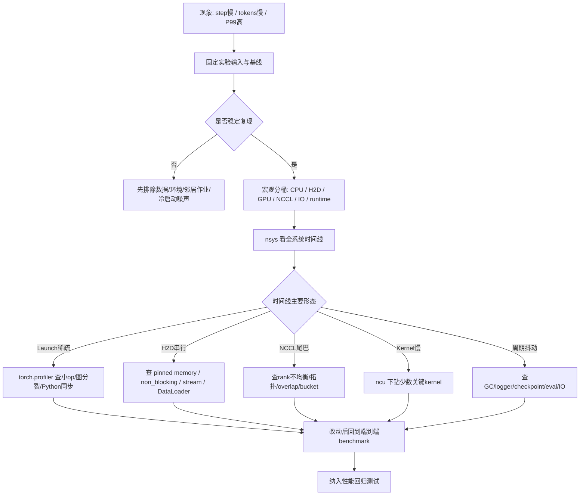
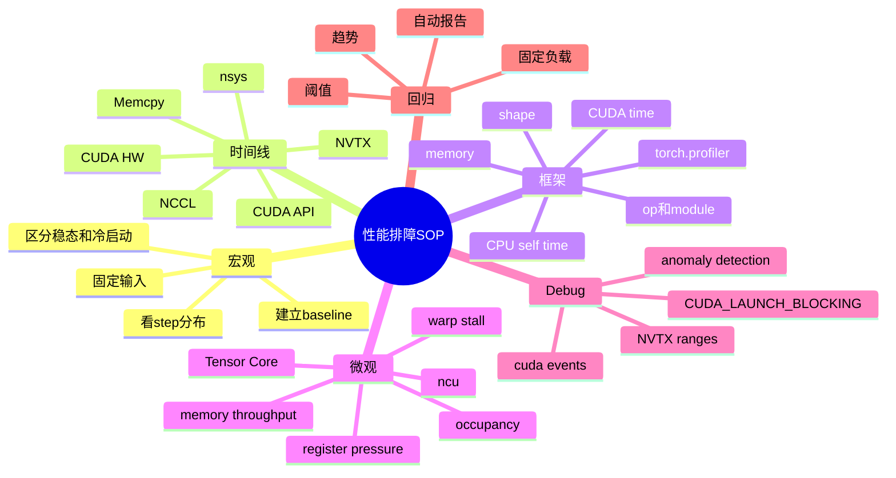

# 第6d章：Profiling、性能排障与回归测试 SOP

> **关联章节**：本章是 [第6章](./06-cuda-runtime-and-kernels.md) 的独立拆分篇。第6章解释 CUDA runtime、kernel launch、stream、同步和算子执行机制；本章把这些机制组织成可执行的 profiling 与性能排障 SOP。阅读时可以同时参考 [第4b章](./04b-hbm-memory-and-roofline.md) 的 roofline 与显存带宽判断、[第5b章](./05b-host-device-io-pcie-numa-and-overlap.md) 的 H2D / PCIe / NUMA 链路、[第5c章](./05c-rdma-collectives-and-cluster-topology.md) 的 NCCL 与集群互联，以及 [第5d章](./05d-training-storage-checkpoint-and-io-diagnostics.md) 的 checkpoint 和 IO 抖动。

## 1. 第一性原理拆解 + 学习大纲

### 拆 — 不可化简的问题

把 Nsight Systems、Nsight Compute、`torch.profiler`、`CUDA_LAUNCH_BLOCKING` 这些工具名先拿掉，性能排障真正要解决的问题是：**一次训练 step 或一次推理请求的端到端时间，是 CPU 发命令、数据搬运、GPU kernel、通信、同步、IO、日志和运行时维护动作串起来之后的结果；任何一个环节变慢、串行化或周期性抖动，都会表现为吞吐下降或尾延迟升高。**

这句话里有三层约束。第一层是可见性约束：GPU utilization、tokens/s、step time 只是症状，不告诉你慢在 launch、H2D、NCCL、kernel 还是 Python。第二层是时间尺度约束：一个 kernel 可能只有几十微秒，一次 checkpoint 可能卡几秒，一次 GC 或 logger flush 可能每几百 step 抖一次；如果只看平均值，尖刺会被抹平。第三层是归因约束：profiling 工具本身会引入开销，环境噪声会污染结果，单次复现不等于规律，微观 kernel 指标也不自动等于端到端收益。

所以性能 SOP 的核心不是“打开某个 profiler 看图”，而是建立一条从宏观到微观的排查链：先确认现象是否稳定，再用时间线定位空洞和串行，再用框架 profiler 连接 Python / op / CUDA，再用 `ncu` 下钻少数可疑 kernel，最后把结论放回端到端基准和回归测试。没有这条链，团队很容易在错误层次优化：明明是 H2D 串行，却去调 kernel tile；明明是 NCCL 尾巴，却去改 dataloader；明明是 logger 抖动，却怀疑 GPU 坏了。

### 本章的 control / data / failure path

- **Control path**：现象观察 → 基线固定 → `nsys` 时间线 → `torch.profiler` 映射 → `ncu` 下钻 → 回到基准和回归。
- **Data path**：step / request 过程中的 CPU、H2D、GPU、NCCL、IO、logger、checkpoint 和 allocator 数据流。
- **Failure path**：噪声误判、同步污染、数据路径没固定、时间线断层、微观指标与端到端收益不一致、回归漏测。

### 推 — 从这个问题如何推导出每个机制

从“端到端时间由多段组成”出发，第一步必须是宏观计量。你要固定模型、batch、序列长度、精度、并行策略、数据来源、硬件拓扑和软件版本，记录 step time、P50/P95/P99、GPU busy、H2D 时间、NCCL 时间、CPU 时间、IO 时间和内存峰值。没有稳定输入，profile 图再漂亮也只是一次偶然。

从“异步执行会隐藏真实错误位置”出发，第二步会得到同步诊断工具。CUDA 默认异步，Python 报错或计时的位置常常不是错误真正发生的位置。`CUDA_LAUNCH_BLOCKING=1` 可以强制 launch 同步，让栈更接近真实出错 kernel，也能暴露隐式同步；但它会显著改变性能，只适合 debug，不适合做吞吐结论。手写计时也必须用 `torch.cuda.Event` 或显式 `synchronize()`，否则测到的常常只是 CPU 提交时间。

从“GPU 时间线能说明排队关系”出发，第三步会得到 `nsys`。Nsight Systems 的价值不是告诉你某个 kernel 的寄存器用量，而是告诉你 CPU API、CUDA HW、Memcpy、NCCL、NVTX range、Python 线程、DataLoader、文件 IO 之间是否重叠。它能快速识别 launch 稀疏、H2D 串行、NCCL 尾巴、同步栅栏、GC / logger / checkpoint 抖动。

从“框架语义需要映射到设备事件”出发，第四步会得到 `torch.profiler`。它能把 PyTorch op、module、CUDA kernel、shape、memory 和调用栈连起来，适合回答“哪个 op 触发了这些 kernel”“CPU 时间花在 dataloader、dispatcher 还是 autograd”“某个模块为什么引入大量小 kernel”。但它不替代 `nsys` 的全系统时间线，也不替代 `ncu` 的 kernel 微结构指标。

从“少数 kernel 真的可能慢”出发，最后才轮到 `ncu`。Nsight Compute 用来分析一个或少数 kernel 的 occupancy、Tensor Core 利用、memory throughput、warp stall、register pressure、shared memory、L2/HBM 行为。它适合确认 kernel 是 compute-bound、memory-bound、launch-bound 之外的实现问题。它不适合一上来对整个训练跑 full set，因为开销大、输出多，而且容易让人陷入微观指标。

### 概念先说清楚

Profiling 是把端到端时间拆成可归因片段的过程，不是“打开一个工具看哪里红”。AI 系统的慢可能在 Python、dispatcher、DataLoader、H2D、kernel launch、GPU kernel、NCCL、IO、logger、checkpoint、allocator 或同步点。Profiling 的第一步是定义工作负载、固定输入、记录基线和确认复现；否则任何时间线都可能只是冷启动、邻居作业、缓存状态或随机抖动的快照。

`nsys`、`torch.profiler` 和 `ncu` 看的不是同一层。Nsight Systems 主要看全系统时间线：CPU API、CUDA queue、Memcpy、NCCL、stream、NVTX、线程和 IO 是否重叠；`torch.profiler` 把 PyTorch op/module、CPU self time、CUDA kernel、shape 和 memory 关联起来；Nsight Compute 下钻单个 kernel 的 occupancy、访存、Tensor Core、warp stall 和寄存器压力。正确顺序通常是先端到端，再 `nsys` 定位形态，再用框架 profiler 找 op，最后才用 `ncu` 下钻少数 kernel。

同步诊断和真实性能结论要分开。`CUDA_LAUNCH_BLOCKING=1`、`torch.cuda.synchronize()`、`.item()`、打印 GPU tensor 和异常检测都可能把异步执行强行同步，适合定位错误和确认隐式同步，但不能代表正常吞吐。性能 SOP 的核心概念是“证据链”：宏观指标说明慢了，时间线说明慢在哪一段，框架视角说明哪段代码触发它，微观工具说明 kernel 为什么慢，最终还要回到端到端 benchmark 和回归测试确认收益。

### 绘 — 因果链路





### 导 — 读完本章你应该能回答

1. 为什么性能排障要从端到端基线和 `nsys` 时间线开始，而不是直接跑 `ncu --set full`？
2. `nsys`、`ncu`、`torch.profiler` 分别解决哪一层问题，输出应该如何互相验证？
3. `CUDA_LAUNCH_BLOCKING=1` 适合定位什么问题，为什么不能用它做性能结论？
4. 时间线上 launch 稀疏、H2D 串行、NCCL 尾巴、kernel 慢、周期抖动分别长什么样？
5. 如何从宏观 step time 分布下钻到 PyTorch op，再下钻到单个 CUDA kernel？
6. 遇到 GC、logger、eval、checkpoint 造成的周期性抖动时，如何避免误判为 GPU 算力问题？
7. 一个性能修复合入前，应该怎样设计回归测试，避免未来版本悄悄变慢？

## 正文内容

### 6d.1 性能 SOP 的总原则：先定边界，再看图

性能排障最常见的失败方式，是拿着一张 profiler 截图直接问“哪里慢”。正确顺序应该是：

1. **定义工作负载**：训练还是推理，prefill 还是 decode，单机还是多机，是否包含 dataloader、checkpoint、eval、日志。
2. **固定输入形状**：batch size、microbatch、sequence length、hidden size、精度、并行策略、请求并发、输出 token 数。
3. **固定环境**：GPU 型号、驱动、CUDA、cuDNN、NCCL、PyTorch、FlashAttention / Triton / TensorRT-LLM 版本。
4. **区分阶段**：编译预热、CUDA Graph capture、cache warmup、稳态、checkpoint step、eval step、恢复后首 step。
5. **记录分布**：不要只看平均 step time，要看 P50、P95、P99、最大值和周期性尖刺。

一个可用的 profile 结论，至少要能回答：

| 问题 | 为什么重要 |
|------|------------|
| 这个 profile 是冷启动还是稳态？ | 编译、权重加载、CUDA Graph capture 会污染首轮数据 |
| 数据路径是否真实？ | synthetic data 可能掩盖 dataloader 和 H2D 问题 |
| 是否包含 checkpoint / eval / logging？ | 周期性任务会拉高尾部 |
| 是否有邻居作业或共享 IO 压力？ | 多租户环境下单次 profile 可能不可复现 |
| 采样窗口覆盖多少 step / request？ | 太短看不到周期抖动，太长文件巨大且噪声多 |

工程上建议先建立一个“黄金负载”：小到能在 CI 或 nightly 跑完，大到足以触发真实 kernel、通信、H2D 和日志路径。所有排障都先在这个负载上复现，再把结论推广到生产规模。

### 6d.2 工具分层：不要让 profiler 互相替代

不同工具看到的是不同层次：

| 工具 | 主要视角 | 最适合回答 | 不适合回答 |
|------|----------|------------|------------|
| 端到端 benchmark | 用户或训练循环视角 | step time、tokens/s、TTFT、TPOT、P99 是否变好 | 慢在哪个 kernel |
| `nsys` | 系统时间线 | CPU launch、GPU 空洞、Memcpy、NCCL、stream 是否重叠 | 单个 kernel 的寄存器和 stall 细节 |
| `torch.profiler` | PyTorch op / module | 哪个 op / module 触发开销，CPU / CUDA time 如何分布 | 跨进程 NCCL 拓扑和全系统 IO |
| `ncu` | 单 kernel 微结构 | occupancy、访存、Tensor Core、warp stall、register pressure | 端到端是否变快 |
| 日志和指标 | 生产运行视角 | 抖动是否周期性、是否和 checkpoint / GC / IO 相关 | 微秒级 kernel 排队 |
| `CUDA_LAUNCH_BLOCKING=1` | 同步 debug | 定位异步报错、确认隐式同步影响 | 真实性能 |

推荐顺序是：

```text
端到端指标
  -> nsys 时间线
  -> torch.profiler 映射到 op / module
  -> ncu 下钻少数 kernel
  -> 回到端到端指标验证
```

这条顺序的原因很实际：大多数性能问题不是“某个 kernel 写得差”，而是工作没有连续喂给 GPU。先看 `ncu` 容易把时间花在一个只占 2% 的 kernel 上，而真正的问题可能是前后各有 300 μs 空洞。

### 6d.3 基线采集模板

每次正式 profile 前，先写下这张表。它不是文档洁癖，而是为了让结论可复现。

| 项目 | 示例 | 备注 |
|------|------|------|
| 模型 | 7B decoder-only / ResNet / diffusion UNet | 写清结构和实现来源 |
| 模式 | training / inference prefill / inference decode | LLM 推理必须拆 prefill 和 decode |
| 输入 | batch=8, seq=4096, bf16 | shape 变化会改变 kernel 和 graph |
| 并行 | DP=8, TP=4, PP=1, ZeRO-2 | 影响 NCCL 和内存 |
| 数据 | synthetic / cached dataset / remote dataset | synthetic 只能测计算路径 |
| 软件 | PyTorch、CUDA、NCCL、driver、kernel lib | 版本差异常常就是根因 |
| 硬件 | GPU、PCIe/SXM、NUMA、IB/RoCE、存储 | 影响 H2D 和通信 |
| 采样 | warmup N step，profile M step | 分离预热和稳态 |
| 指标 | step time、GPU busy、H2D、NCCL、memory peak | 先定成功标准 |

这张表就是本章的 BenchmarkProtocol。它还必须写明 retest threshold，例如：

```text
P50 step/request time 改善 >= 5%
P95/P99 不退化超过 3%-5%
memory peak 不超过 CapacityLedger 预算
数值一致性或质量指标在容忍范围内
同一窗口重复 3 次，变异系数低于团队阈值
```

没有 threshold 的 profile 只能说明"看过图"，不能说明"修复有效"。

一个简单的训练计时骨架：

```python
import time
import torch

def timed_steps(train_step, warmup=10, steps=50):
    for _ in range(warmup):
        train_step()
    torch.cuda.synchronize()

    times = []
    for _ in range(steps):
        start = time.perf_counter()
        train_step()
        torch.cuda.synchronize()
        times.append(time.perf_counter() - start)
    return times
```

这里的 `torch.cuda.synchronize()` 会改变执行重叠，所以它适合做端到端 step 计时，不适合插在生产训练循环里。若要测一段 GPU work 的设备时间，应使用 CUDA event：

```python
start = torch.cuda.Event(enable_timing=True)
end = torch.cuda.Event(enable_timing=True)

start.record()
out = model(x)
end.record()
torch.cuda.synchronize()
print(start.elapsed_time(end), "ms")
```

### 6d.4 `nsys`：先看时间线的形状

`nsys` 是性能 SOP 的第一把刀。它不要求你先知道哪个 kernel 有问题，而是让你看到整条流水线是否连续。

常用命令示例：

```bash
nsys profile \
  --trace=cuda,nvtx,osrt,cudnn,cublas \
  --sample=cpu \
  --capture-range=cudaProfilerApi \
  --output=profile_step \
  python train.py
```

如果代码里没有 `cudaProfilerStart/Stop`，也可以先对短窗口直接 profile：

```bash
nsys profile --trace=cuda,nvtx,osrt,cudnn,cublas -o profile python train.py
```

建议在训练代码里加 NVTX range，把 profile 图切成可读的阶段：

```python
from torch.cuda import nvtx

nvtx.range_push("forward")
loss = model(batch)
nvtx.range_pop()

nvtx.range_push("backward")
loss.backward()
nvtx.range_pop()

nvtx.range_push("optimizer")
optimizer.step()
nvtx.range_pop()
```

读时间线时先看这些轨道：

| 轨道 | 你要看什么 |
|------|------------|
| CUDA API | CPU 是否在密集提交 kernel，是否有长时间 `cudaStreamSynchronize` / `cudaDeviceSynchronize` |
| CUDA HW | GPU 是否连续执行，kernel 之间是否有空洞 |
| Memcpy HtoD / DtoH | 拷贝是否和 compute 重叠，是否在 step 开头串行 |
| NCCL | 通信 kernel 是否和 backward compute 重叠，是否拖出长尾 |
| CPU threads | DataLoader、logger、Python 主线程是否阻塞 |
| NVTX ranges | forward / backward / optimizer / checkpoint 哪段异常 |
| OS runtime | 文件 IO、mutex、sleep、线程等待是否异常 |

时间线读法的第一原则：**先看空洞，再看忙碌**。GPU 忙的时候慢，可能是 kernel 效率；GPU 空的时候慢，通常是 CPU、IO、同步、通信依赖或调度问题。

### 6d.5 病态时间线速查表

| 症状 | 时间线视觉特征 | 常见根因 | 下一步工具 |
|------|----------------|----------|------------|
| Launch 稀疏 | CUDA HW 上很多短 kernel，中间空洞明显 | Python / dispatcher 开销、小 op 太多、动态图破碎、未启用编译或 graph | `torch.profiler`、NVTX、`torch.compile` A/B |
| H2D 串行 | HtoD 拷贝和 kernel 像阶梯一样轮流出现 | 未使用 pinned memory、`non_blocking=False`、默认 stream 依赖、DataLoader 慢 | `nsys`、DataLoader 指标、NUMA 检查 |
| NCCL 尾巴 | backward 后段或 step 末尾出现长 NCCL，其他 GPU 空等 | bucket 不合适、rank 计算不均、拓扑差、通信未 overlap、某 rank 慢 | `nsys` 多 rank、NCCL 日志、拓扑检查 |
| Kernel 慢 | GPU 连续忙，但少数 kernel 占大头 | 算子实现低效、shape 不友好、访存瓶颈、register pressure | `ncu`、库版本 A/B |
| 同步栅栏 | CUDA API 有长 `cudaStreamSynchronize`，之后 GPU 空洞 | `.item()`、`.cpu()`、print tensor、assert、debug hook、错误计时 | 代码审查、`CUDA_LAUNCH_BLOCKING=1` |
| 周期抖动 | 每 N step 出现 100 ms 到数秒尖刺 | GC、logger flush、checkpoint、eval、保存样本、remote IO | 日志时间戳、GC stats、IO 指标 |
| 首轮极慢 | 第一个 step 或第一个请求远慢于稳态 | 编译、cudnn benchmark、CUDA Graph capture、权重加载、cache warmup | 分离 warmup 与 steady-state |

不要把所有空洞都叫“GPU 利用率低”。空洞的位置决定排查方向：step 开头多半是数据和 H2D；backward 中后段多半是通信 overlap；每隔固定 step 多半是日志、eval、checkpoint；所有小 kernel 之间都有空洞才是 launch 稀疏。

### 6d.6 Launch 稀疏：GPU 在等 CPU 发命令

Launch 稀疏的典型图像是：CUDA HW 轨道上有很多短 kernel，像离散的点或细线，中间有大量白空。此时单个 kernel 也许很快，但端到端很慢，因为 CPU / framework / runtime 没有把足够连续的 work 喂给 GPU。

常见来源：

| 来源 | 例子 | 处理方向 |
|------|------|----------|
| 小 op 太多 | 大量 elementwise、view 后跟小 reduction、mask 处理 | `torch.compile`、融合、使用成熟 fused op |
| Python 控制流 | 每层 Python loop 里做小张量操作 | 静态化、批量化、减少 per-token Python |
| 动态 shape | 每步 shape 变化导致 graph break | bucketing、padding、固定 capture shape |
| 隐式同步 | `.item()` 后 CPU 等 GPU，再继续发下一个 kernel | 移除同步，异步日志 |
| 调试逻辑 | 每步保存 tensor、打印统计、assert GPU tensor | 迁出热路径 |

排查步骤：

1. 用 `nsys` 确认 CUDA HW 空洞分布在大量小 kernel 之间，而不是某个 checkpoint 或 H2D 前后。
2. 用 `torch.profiler` 打开 `record_shapes=True`，查看 op 数量、CPU self time 和是否有大量小 CUDA op。
3. 加 NVTX range，把模型主体、loss、metric、logger 分开，确认小 kernel 来自核心模型还是附加逻辑。
4. 做 A/B：eager vs `torch.compile`，debug metric 开关，固定 shape vs 动态 shape。
5. 只用端到端 step time 验收，不用“kernel 数减少”作为唯一成功标准。

`torch.profiler` 示例（一次性采集，适合调试）：

```python
import torch
from torch.profiler import ProfilerActivity, profile, record_function

with profile(
    activities=[ProfilerActivity.CPU, ProfilerActivity.CUDA],
    record_shapes=True,
    profile_memory=True,
    with_stack=True,
) as prof:
    for step, batch in enumerate(loader):
        if step >= 10:
            break
        with record_function("train_step"):
            loss = train_step(batch)

print(prof.key_averages().table(sort_by="self_cuda_time_total", row_limit=20))
print(prof.key_averages().table(sort_by="self_cpu_time_total", row_limit=20))
```

#### 6d.6.1 生产级 torch.profiler：schedule + Chrome Trace + 低 overhead

**工具口径标签**：`tooling-public-doc + illustrative overhead`，核对日期 `2026-05-05`；API 以 PyTorch `torch.profiler` 当前公开接口为准，shape=大模型训练或推理服务的稳定 step/request 窗口。overhead 数字是经验量级，不是某个固定模型的保证值；上线前必须用目标 workload 复测。

调试模式的 profiler 在生产 step 上跑会让 step time 翻 2-5 倍。生产环境用 `schedule` 限制采样窗口，把数据导出到 Chrome Trace（在 `chrome://tracing` 或 [Perfetto](https://ui.perfetto.dev/) 打开）：

```python
import torch
from torch.profiler import profile, ProfilerActivity, schedule, tensorboard_trace_handler

# schedule: 跳过 wait 步、热身 warmup 步、active 步采样、然后重复 repeat 次
prof = profile(
    activities=[ProfilerActivity.CPU, ProfilerActivity.CUDA],
    schedule=schedule(wait=10, warmup=5, active=20, repeat=1),
    on_trace_ready=tensorboard_trace_handler("./logs/profiler"),
    record_shapes=True,
    profile_memory=False,   # 生产关闭，with_stack 也关闭
    with_stack=False,
)
prof.start()
for step, batch in enumerate(loader):
    train_step(batch)
    prof.step()        # 必须每步调用，让 schedule 推进
    if step >= 50:
        break
prof.stop()

# 同时导出 Chrome Trace 给单步深度分析
# 上面 tensorboard_trace_handler 会自动生成 .pt.trace.json
# 在 Perfetto 打开即可看到完整 timeline
```

**生产 overhead 控制要点**：

| 选项 | 默认 | 生产建议 | 原因 |
|---|---|---|---|
| `with_stack` | False | **保持 False** | 开启会让每个 op 抓 Python 栈，overhead 5-20× |
| `profile_memory` | False | **保持 False** | memory tracking 引入 hook，overhead 2-5× |
| `record_shapes` | False | True 可接受 | 仅记录 shape，overhead 小 |
| `schedule` | 全程采样 | **必须配置** | 全程采样让 step time 翻倍 |
| `with_modules` | False | False | 同 with_stack |
| 采样比例 | — | < 1% step | tail-sampling：异常请求或周期性少量采样 |

> [!DANGER]
> **不要把 `with_stack=True` + `profile_memory=True` 直接挂到生产训练上**。`illustrative workload label`：单机或多机 PyTorch 大模型训练，step time 基线约 2 秒，核对日期 `2026-05-05`；这两个组合可能把 step time 放大到 10-20 秒量级，长窗口还可能因为 profiler 数据和内存上限被 kill。生产用 schedule + 低粒度，调试用 full mode。

#### 6d.6.2 Nsight Systems / Compute 命令速查

**工具口径标签**：`NVIDIA-public-doc`，核对日期 `2026-05-05`；CUDA 12.x 文档仍把 Visual Profiler / `nvprof` 标为 deprecated，CUDA 13.0 release notes 标明二者已移除。新项目统一用 Nsight Systems（系统时间线）和 Nsight Compute（kernel 微结构）：

```bash
# Nsight Systems —— 端到端时间线（CPU API + CUDA HW + Memcpy + NCCL + NVTX + IO）
nsys profile -t cuda,nvtx,osrt,cudnn,cublas,nccl \
  -o trace_$(date +%Y%m%d_%H%M%S) \
  --stats=true \
  python train.py

# 把 nsys 输出转成 SQL/CSV 进一步分析
nsys stats --report cudaapisum,gpukernsum trace.nsys-rep

# Nsight Compute —— 单 kernel 下钻（先用 nsys 找慢点，再用 ncu 看少数 kernel）
ncu --set full \
  --target-processes all \
  --kernel-name regex:gemm|attention|layernorm \
  --launch-skip 100 --launch-count 10 \
  -o kernel_$(date +%Y%m%d_%H%M%S) \
  python train.py

# 只采集少量轻量 section（避免 overhead 过大）
ncu --set default \
  --kernel-name regex:flash_attn \
  --launch-skip 100 --launch-count 5 \
  python train.py
```

> [!WARNING]
> **`ncu --set full` 的 overhead**：`illustrative workload label`：单 kernel replay profiling，shape=目标 kernel 的 5-10 次 launch 窗口，核对日期 `2026-05-05`；每个被采样的 kernel 会被 replay 多次以收集所有计数器，单 kernel 时间可能放大 **5-50×**。生产 step 上跑 full set 会让 step time 飙升甚至超时被 driver kill。规则：(1) 用 `--launch-skip` 跳过 warmup，(2) 用 `--launch-count` 限制采样数（通常 5-10），(3) 用 `--kernel-name` 只采目标 kernel，(4) 在专用 profile job 上跑而不是生产训练。

> [!TIP]
> **Nsight Compute `--set` 选项**：NVIDIA Nsight Compute CLI 公开文档包含 `default`、`detailed`、`full`、`roofline` 等 section set；括号内 overhead 只能作为 `illustrative` 经验量级：`default`（轻量，~5×）、`detailed`（中量，~10×）、`full`（全量，~30×）、`roofline`（含 Roofline 模型，~20×）。先 default 看大方向，需要时再 full。

不要一看到 launch 稀疏就立刻手写 CUDA kernel。更常见、更稳的路线是：删掉热路径里的同步和 Python 小逻辑，启用 `torch.compile`，使用 FlashAttention / fused optimizer / fused norm 等成熟实现，最后才考虑自定义算子。

### 6d.7 H2D 串行：数据搬运没有藏到计算后面

H2D 串行的典型图像是：Memcpy HtoD 出现一段，随后 kernel 执行一段，再下一次 H2D，再下一段 kernel。它说明 CPU 到 GPU 的拷贝没有和上一批计算重叠，GPU 在等数据。

常见根因：

| 根因 | 时间线表现 | 修复方向 |
|------|------------|----------|
| 未使用 pinned memory | H2D 慢且难以异步 | DataLoader `pin_memory=True` |
| `non_blocking=False` | 拷贝调用阻塞主线程或默认依赖强 | `.to(device, non_blocking=True)` |
| 默认 stream 串行 | H2D 和 compute 互相等待 | 独立 prefetch stream + event 依赖 |
| DataLoader 饥饿 | GPU 前有长 CPU / dataloader 空洞 | 增加 worker、预取、缓存、改善数据格式 |
| NUMA 错配 | H2D 带宽低且 CPU 远端访问 | 绑定 CPU、内存和 GPU 亲和 |
| 小 batch 搬运频繁 | 很多小 H2D | 合并 batch、减少小 tensor 搬运 |

一个简化的 prefetch 思路：

```python
class CudaPrefetcher:
    def __init__(self, loader, device):
        self.loader = iter(loader)
        self.device = device
        self.stream = torch.cuda.Stream()
        self.next_batch = None
        self.preload()

    def preload(self):
        try:
            batch = next(self.loader)
        except StopIteration:
            self.next_batch = None
            return
        with torch.cuda.stream(self.stream):
            self.next_batch = {
                k: v.to(self.device, non_blocking=True)
                for k, v in batch.items()
            }

    def next(self):
        torch.cuda.current_stream().wait_stream(self.stream)
        batch = self.next_batch
        self.preload()
        return batch
```

这段代码只是说明依赖关系，不是通用模板。真实工程还要处理 nested batch、异常、最后一个 batch、数据增强、随机数和多进程 worker。验收标准仍然是 `nsys` 中 H2D 与 compute 是否重叠，以及端到端 step time 是否下降。

### 6d.8 NCCL 尾巴：通信拖住最后一个 rank

分布式训练里，很多性能问题不是平均通信慢，而是尾部通信或某个 rank 慢。典型时间线是：backward compute 已经结束，某些 NCCL kernel 还在跑，其他 GPU 空等；或者大多数 rank 已经进入下一阶段，少数 rank 卡在 allreduce / reduce-scatter / all-gather。

常见原因：

| 类别 | 具体问题 | 观察方法 |
|------|----------|----------|
| 计算不均 | sequence length 不均、MoE token dispatch 不均、数据增强不均 | 多 rank step time、NVTX range 对齐 |
| bucket 不合理 | 梯度 bucket 太大导致晚启动，太小导致 launch 太碎 | DDP/FSDP 配置 A/B |
| overlap 失败 | 通信没有和 backward compute 重叠 | `nsys` 看 NCCL 与 compute 是否交叠 |
| 拓扑问题 | 跨 NUMA、跨 PCIe switch、IB rail 使用不均 | `nvidia-smi topo -m`、NCCL topo、网络计数器 |
| 某 rank 慢 | 数据读取、CPU 抖动、GPU 降频、ECC/Xid、邻居干扰 | rank 级日志和节点指标 |
| 参数分片阶段 | FSDP/ZeRO all-gather 在 forward 前形成栅栏 | NVTX 标记 shard gather |

NCCL 排障要避免单 rank 视角。至少采集：

```text
每个 rank 的 step time
每个 rank 的 forward/backward/optimizer/NCCL range
NCCL_DEBUG=INFO 的关键拓扑与算法信息
节点级 GPU clock / PCIe replay / IB throughput / error counter
```

如果 `nsys` 显示 NCCL 和 compute 完全串行，先查框架配置和 bucket，而不是网络硬件。如果显示只有某个 rank 晚到 collective，先查该 rank 的前置工作：dataloader、H2D、某个长 sequence、checkpoint shard、CPU 线程抢占。Collective 的特点是“大家等最慢的那个”，所以尾巴根因经常不在 NCCL kernel 本身。

### 6d.9 Kernel 慢：只有少数情况需要 `ncu` 下钻

当 `nsys` 显示 GPU 几乎连续忙，而且少数 kernel 占据大部分 CUDA time，才适合用 `ncu` 下钻。此时问题从“有没有喂满 GPU”转成“这个 kernel 为什么执行时间长”。

常用命令示例：

```bash
ncu --set full \
  --target-processes all \
  --kernel-name regex:attention \
  -o ncu_attention \
  python train.py
```

如果 kernel 名不稳定，可以先用 `nsys` 或 `torch.profiler` 找 kernel 名，再用 `ncu` 限定范围。不要对长训练直接全量 `ncu --set full`，输出会很大，运行也会明显变慢。

读 `ncu` 时先看这些问题：

| 问题 | 相关指标 | 解释 |
|------|----------|------|
| 是否吃到 Tensor Core | Tensor pipe utilization、HMMA 指令 | GEMM/attention 没吃到 Tensor Core 往往有 layout、dtype 或 shape 问题 |
| 是算力还是带宽限制 | SM throughput、memory throughput、roofline | 结合第4b章判断 compute-bound / memory-bound |
| warp 在等什么 | Warp stall reasons | 等 memory、barrier、dependency、pipe busy 的含义不同 |
| occupancy 是否受限 | Achieved occupancy、active warps | 低 occupancy 是线索，不是自动等于坏 |
| register pressure 是否高 | registers per thread、local memory load/store | spill 会把寄存器问题变成显存流量 |
| shared memory 是否冲突 | shared load/store、bank conflict | 自定义 kernel 或 fused kernel 里常见 |

工程边界要明确：本章不展开具体 kernel 优化实现。平台侧的合理动作通常是：

1. 确认 dtype、layout、shape 是否走到成熟库的高性能路径。
2. A/B 测试 cuDNN、cuBLASLt、FlashAttention、Triton、Inductor、TensorRT-LLM 等版本。
3. 检查是否因为过度融合导致 register pressure 或 spill。
4. 对自定义 kernel，给 kernel 作者提供 `ncu` 报告和端到端复现脚本。
5. 用端到端指标决定是否接受 kernel 层改动。

### 6d.10 `CUDA_LAUNCH_BLOCKING=1`：它是 debug 工具，不是 profiler

CUDA 默认异步。Python 代码执行到 `loss.backward()` 后，很多 GPU 工作只是被提交，还没有完成。错误可能在后续某个同步点才爆出来，栈看起来就会错位。`CUDA_LAUNCH_BLOCKING=1` 的作用是让每个 CUDA launch 阻塞到完成，从而让错误更接近真实来源。

适合使用的场景：

| 场景 | 为什么有用 |
|------|------------|
| device-side assert 栈不准 | 强制同步后，Python 栈更接近出错 op |
| 怀疑某行触发非法访问 | 缩小异步错误传播范围 |
| 怀疑隐式同步影响逻辑 | 让同步点更明显 |
| debug 小复现 | 牺牲性能换可定位性 |

不适合的场景：

| 场景 | 原因 |
|------|------|
| 测吞吐 | 它会破坏异步和 overlap |
| 判断 H2D 是否重叠 | 它会人为串行化 |
| 分析 NCCL overlap | 它会改变通信计算时序 |
| 作为 CI 性能基线 | 得到的是 debug 模式性能 |

常见用法：

```bash
CUDA_LAUNCH_BLOCKING=1 python train.py
```

如果打开后错误位置变化，说明之前确实有异步错位；如果打开后性能大幅下降，这是预期，不代表生产性能退化。

### 6d.11 周期性抖动：GC、logger、checkpoint 和 eval

周期性抖动最容易误导团队。GPU 利用率呈锯齿，step time 每隔固定步数尖刺，很多人第一反应是“GPU 不稳定”或“通信抖”。但如果尖刺间隔刚好等于 logging interval、checkpoint interval、eval interval 或 dataloader epoch 边界，根因通常在热路径外。

| 抖动来源 | 典型周期 | 时间线特征 | 处理方向 |
|----------|----------|------------|----------|
| Python GC | 不固定或对象增长后触发 | CPU 主线程停顿，GPU 空洞 | 降低对象创建、手动安排 GC 到安全点 |
| Logger flush | 每 N step | CPU IO、网络写、`.item()` 同步 | 异步 logger、批量写、减少 GPU tensor 转标量 |
| Checkpoint | 每 N step / N 分钟 | 大 IO、rank 等待、GPU 空闲 | 异步写、分片、错峰、后台归档 |
| Eval / generation | 每 N step | 训练流被推理流插入，KV / activation 峰值 | 独立 eval worker、降低频率、隔离资源 |
| 保存样本或图片 | 每 N step | D2H、编码、文件写 | 异步队列、采样降频 |
| Dataloader epoch 边界 | 每个 epoch | worker 重启、shuffle、metadata 扫描 | persistent workers、缓存索引 |

排查方法：

1. 把 step time 打成序列，而不是只看均值。
2. 在 logger、checkpoint、eval、GC 前后加时间戳或 NVTX range。
3. 临时关闭 logger / checkpoint / eval 做 A/B，不要同时改多个变量。
4. 对 checkpoint 抖动，结合第5d章检查写入分片、热层带宽、元数据和异步归档。
5. 对 logger 抖动，重点找 `.item()`、`.cpu()`、同步上传和主线程阻塞。

一个简单的 step 分布观察，比复杂 profiler 更早发现周期问题：

```python
if step % 10 == 0:
    p50 = percentile(recent_step_times, 50)
    p95 = percentile(recent_step_times, 95)
    p99 = percentile(recent_step_times, 99)
    print(f"step={step} p50={p50:.3f}s p95={p95:.3f}s p99={p99:.3f}s")
```

线上推理同理。P99 抖动可能来自 tokenizer 线程池、日志写入、请求 trace、KV cache eviction、模型热切换、GC 或 CPU 限流，不一定来自 GPU kernel。

### 6d.12 工程案例一：GPU 利用率只有 45%，但 kernel 本身很快

**背景**：一个 7B 微调任务从 A100 迁到 H100 后，单 step 只快了 15%。监控显示 GPU utilization 约 45%，团队怀疑 H100 没有吃到 Tensor Core，于是准备下钻 `ncu`。

**排查**：

1. 先跑端到端基线：warmup 20 step，稳态 100 step，P50 step time 620 ms，P99 910 ms。
2. 用 `nsys` 看 20 个稳态 step：CUDA HW 上大量 10-30 μs kernel，中间有 50-150 μs 空洞。
3. Memcpy H2D 占比很小，NCCL 也没有明显尾巴。
4. 用 `torch.profiler` 按 CPU self time 排序，发现 loss 和 metric 里有很多小张量操作，并且每 step 都有 `loss.item()` 和多个 GPU tensor 统计。
5. 临时关闭 metric 和同步 logger，P50 降到 470 ms。
6. 启用 `torch.compile(mode="reduce-overhead")` 并固定 sequence bucket，P50 降到 390 ms。

**结论**：根因不是 kernel 微结构，而是 launch 稀疏和热路径同步。`ncu` 在这个案例里不是第一工具。最终修复是减少小 op、移除同步 logger、固定 shape 并启用编译。

### 6d.13 工程案例二：多机训练每隔 500 step 卡 18 秒

**背景**：一个 64 GPU 训练作业稳态 step time 约 1.2 秒，但每隔 500 step 出现一次 18-25 秒尖刺。NCCL 日志里能看到 allreduce 时间变长，团队怀疑 IB 网络抖动。

**排查**：

1. 按 rank 记录 step time，发现所有 rank 在同一个 step 尖刺。
2. `nsys` 显示尖刺前 GPU compute 已结束，随后 CPU 线程进入 checkpoint range，NCCL 只是后续 collective 等待。
3. 文件系统指标显示 checkpoint 时元数据和写带宽同时冲高。
4. 临时关闭 checkpoint 后尖刺消失。
5. 改成每个 rank 写 shard 到 staging 目录，后台线程异步 flush，rank0 原子发布完成标记；同时把 logger 上传迁出训练主线程。

**结论**：NCCL 变慢是结果，不是根因。最慢 rank 被 checkpoint IO 卡住后，后续 collective 只能等它。这个案例说明时间线里“尾巴在哪里”不等于“根因在哪里”，要看尾巴前面发生了什么。

### 6d.14 工程案例三：推理 P99 高，但平均 TPOT 正常

**背景**：一个 LLM 推理服务离线压测平均 TPOT 正常，但线上 P99 周期性升高。GPU 时间线在尖刺窗口里并非完全忙碌，而是有短空洞。

**排查**：

1. 将请求按 prefill、decode、输出长度、batch occupancy 分桶，发现长输出请求的 P99 更明显。
2. `nsys` 采样显示 decode kernel 间有 CPU 空洞，且 logger 线程在同一时间 flush trace。
3. 服务代码每生成一定 token 会把 GPU 上的统计 tensor `.item()` 后写入同步 logger。
4. 关闭 trace 后 P99 明显下降，但平均 TPOT 变化不大。
5. 改成异步聚合 CPU 侧计数，GPU tensor 统计降频采样，trace 写入后台队列。

**结论**：平均 TPOT 掩盖了尾延迟问题。线上推理 profile 必须看请求分桶和 P99，不能只看离线平均吞吐。

### 6d.15 性能回归测试：把经验变成护栏

性能修复如果没有回归测试，很快会被下一次功能改动破坏。性能回归测试不需要在每个 PR 上跑完整大模型，但必须覆盖最容易退化的路径。

推荐分层：

| 层级 | 运行频率 | 负载 | 发现什么问题 |
|------|----------|------|--------------|
| PR smoke perf | 每个 PR 或关键 PR | 小模型、固定 shape、少量 step | 明显 step time 退化、同步点、op 数爆炸 |
| Nightly perf | 每晚 | 代表模型、真实数据子集、多 GPU | H2D、NCCL、compile、dataloader 回归 |
| Release perf | 发版前 | 生产形状、长窗口、多节点 | P99、checkpoint、eval、长期抖动 |
| Hardware / driver perf | 驱动或镜像升级前 | 标准 benchmark + 业务模型 | CUDA/NCCL/库版本兼容与性能变化 |

指标建议：

| 指标 | 用途 | 注意事项 |
|------|------|----------|
| P50 step time / TPOT | 稳态吞吐 | 需要固定 warmup |
| P95/P99 step time / latency | 尾部抖动 | 需要足够采样窗口 |
| tokens/s 或 samples/s | 业务吞吐 | 要写清 batch 和 shape |
| GPU busy time | 判断空洞 | 不等于有效算力 |
| H2D time 与 overlap | 数据路径回归 | synthetic data 可能测不到 |
| NCCL time 与 tail | 分布式回归 | 需要多 rank |
| CUDA kernel count | launch 稀疏预警 | kernel 数变化不一定坏 |
| CPU self time top ops | Python / dispatcher 回归 | 受 profiler overhead 影响 |
| memory peak | 防止优化引入显存风险 | allocator 行为会有噪声 |

阈值设计要承认性能噪声。常见做法：

```text
PR smoke:
  P50 step time 退化 > 8% 且连续 3 次复现 -> fail
  kernel count 增加 > 30% -> warning
  memory peak 增加 > 10% -> warning / fail

Nightly:
  P50 退化 > 5% -> warning
  P99 退化 > 15% -> warning
  H2D 或 NCCL 时间连续 3 天上升 -> issue

Release:
  生产代表负载不允许 P50/P99 超过签入基线阈值
```

回归报告至少包含：

1. Git commit、镜像、驱动、CUDA、NCCL、PyTorch、关键库版本。
2. 负载配置和输入 shape。
3. warmup、采样步数、随机种子。
4. P50/P95/P99、均值、标准差。
5. 与上一稳定基线的差异。
6. 附件：短窗口 `nsys`、`torch.profiler` 表、必要时的 `ncu`。

性能回归测试的目标不是追求实验室级精度，而是防止明显退化悄悄进入主线。阈值宁可先宽一点，也要稳定运行；等噪声模型清楚后再收紧。

### 6d.15.1 升级边界：什么时候不是本层继续调

06d 的职责是把问题定位到层级，并给出足够证据。以下情况应该升级给对应 owner，而不是在 profiler 里继续猜：

| 升级对象 | 触发条件 | 必须带上的证据 |
|----------|----------|----------------|
| 模型 / 框架 owner | `torch.profiler` 指向某个 module 的小 op、同步、graph break 或动态 shape | op/module 表、调用栈、输入 shape、最小复现、eager/compiled A/B |
| CUDA kernel / 编译器 owner | `ncu` 显示少数 kernel 的 occupancy、spill、memory coalescing、Tensor Core 路径异常且端到端占比显著 | `ncu` report、kernel 名、shape/dtype/layout、版本、端到端占比 |
| 数据 / 存储 owner | `nsys` 显示 GPU 等 DataLoader、H2D 前 CPU 准备或 checkpoint/logger 尖刺 | NVTX 时间线、DataLoader timing、IO 指标、周期性模式 |
| 网络 / 集群 owner | 多 rank `nsys` 显示 NCCL tail、rank skew 或 topology fallback | rank 对比、NCCL_DEBUG、topology、链路错误计数、nccl-tests 对照 |
| 平台 / SRE owner | DCGM 显示 clock throttle、power/thermal 限制、ECC/XID、邻居干扰或驱动异常 | DCGM/nvidia-smi dmon、XID/ECC、节点和镜像版本、同机对照 |

升级边界的原则是：给下游 owner 一个可复现的 EvidenceBundle，而不是一句"GPU utilization 低"。

### 6d.16 实战 SOP Checklist

#### Profile 前 Checklist

- [ ] 已固定模型、batch、sequence length、精度、并行策略和数据来源。
- [ ] 已区分 warmup、compile、CUDA Graph capture、稳态、checkpoint 和 eval。
- [ ] 已记录硬件、驱动、CUDA、NCCL、PyTorch、关键 kernel 库版本。
- [ ] 已确认是否有共享 IO、邻居作业、降频、错误计数或节点异常。
- [ ] 已定义成功指标：step time、tokens/s、TTFT、TPOT、P99、memory peak 或成本。
- [ ] 已准备短窗口 profile，避免 profiler 文件过大。

#### `nsys` 时间线 Checklist

- [ ] CUDA HW 是否连续，kernel 之间是否有明显空洞。
- [ ] CUDA API 是否有长时间 synchronize、memcpy、malloc/free 或 blocking call。
- [ ] H2D / D2H 是否和 compute 重叠。
- [ ] NCCL 是否和 backward compute 重叠，是否有尾巴。
- [ ] NVTX range 是否能对应 forward、backward、optimizer、logger、checkpoint。
- [ ] 尖刺是否和固定 step interval 对齐。
- [ ] 多 rank 时间线是否显示某个 rank 晚到 collective。

#### `torch.profiler` Checklist

- [ ] 是否按 CPU self time 和 CUDA time 分别排序。
- [ ] 是否打开 shape 信息，确认动态 shape 或小 tensor 问题。
- [ ] 是否能把可疑 CUDA kernel 映射回 PyTorch op 或 module。
- [ ] 是否发现 `.item()`、`.cpu()`、print tensor、debug hook、metric 同步。
- [ ] 是否比较了开启 / 关闭 logger、metric、compile、固定 shape 的 A/B。
- [ ] 是否注意 profiler 本身开销，避免用 profiler 数字直接当生产吞吐。

#### `ncu` Checklist

- [ ] 只选择少数占比高的 kernel 下钻。
- [ ] 已确认问题不是 launch 空洞、H2D 串行或 NCCL 尾巴。
- [ ] 已查看 Tensor Core、memory throughput、warp stall、occupancy、register、local memory。
- [ ] 已结合 roofline 判断 compute-bound 还是 memory-bound。
- [ ] 已比较成熟库版本或后端选择。
- [ ] 已用端到端 benchmark 验证 kernel 层改动收益。

#### 回归测试 Checklist

- [ ] 有固定小负载用于 PR smoke。
- [ ] 有代表负载用于 nightly 或 release。
- [ ] 报告包含版本、shape、warmup、采样窗口和分布指标。
- [ ] 阈值考虑噪声，并要求连续复现。
- [ ] 保存趋势，而不是只看单次 pass/fail。
- [ ] 性能退化能自动附带最小 profile 证据。

## 本章小结

| 排障层次 | 关键问题 | 首选工具 | 典型动作 |
|----------|----------|----------|----------|
| 端到端 | 是否真的变慢，慢多少，影响 P50 还是 P99 | benchmark、生产指标 | 固定输入、分离 warmup、看分布 |
| 系统时间线 | GPU 是否空等，搬运/通信/计算是否重叠 | `nsys` | 找空洞、串行、尾巴、周期尖刺 |
| 框架映射 | 哪个 op / module / Python 逻辑触发开销 | `torch.profiler` | 找小 op、同步点、CPU self time |
| Kernel 微观 | 少数 kernel 为什么慢 | `ncu` | 看 Tensor Core、访存、stall、register |
| 主机侧排除 | CPU 是否限制 dispatch、DataLoader 或 IO | `perf stat`、`perf record` | 看 IPC、cache/TLB miss、context switch、syscall |
| 设备健康 | GPU 是否被功耗、温度、ECC/XID 或时钟限制污染 | DCGM、`dcgmi dmon`、`nvidia-smi dmon` | 先排除平台异常再解释模型性能 |
| Debug 同步 | 异步错误栈是否错位 | `CUDA_LAUNCH_BLOCKING=1` | 定位错误，不做性能结论 |
| 工程护栏 | 修复会不会再次退化 | perf CI / nightly | 固定负载、阈值、趋势、报告 |

核心判断：

- GPU 空着时，先查 launch、H2D、同步、NCCL 等待、IO 和 CPU。
- GPU 忙着但慢时，再查 kernel、roofline、库版本和 shape。
- 周期性尖刺先查 logger、GC、checkpoint、eval 和数据边界。
- 所有微观优化都必须回到端到端 step time、tokens/s、P99 和成本验证。

---

## 练习题

### 基础题

1. 为什么 `CUDA_LAUNCH_BLOCKING=1` 能帮助定位异步报错，却不能用来判断真实吞吐？
2. `nsys` 和 `ncu` 的视角有什么区别？为什么 SOP 推荐先 `nsys` 后 `ncu`？
3. 时间线上大量短 kernel 之间有空洞，最可能是哪类问题？列出 3 个常见根因。
4. H2D 拷贝和 compute 串行时，你会检查 DataLoader、Pinned Memory、Stream 中的哪些设置？
5. 为什么 NCCL allreduce 变长不一定说明网络是根因？

### 进阶题

6. 某训练任务 P50 step time 为 800 ms，但每 100 step 有一次 6 秒尖刺。请设计一个排查步骤，区分 checkpoint、logger、GC 和 eval。
7. 一个 `torch.profiler` 表显示 `self_cpu_time_total` 最高的是 metric 计算，而 `self_cuda_time_total` 最高的是 attention。你会如何判断 metric 是否影响端到端性能？
8. `nsys` 显示 GPU 连续忙，前 5 个 kernel 占了 80% CUDA time。你准备用 `ncu` 看哪些指标？每个指标分别说明什么？
9. 一个分布式训练中 rank 7 总是比其他 rank 晚 300 ms 进入 allreduce。列出至少 5 个可能原因和对应证据。
10. 设计一个 PR 级性能回归测试，要求 10 分钟内完成，同时能发现 launch 数暴涨、显存峰值增加和 step time 退化。

### 开放题

11. 你的团队要把模型从 A100 迁到 H100。迁移后吞吐只提升 20%。请写一份从宏观到微观的 profiling 计划。
12. 一个推理服务平均 tokens/s 很高，但 P99 延迟不稳定。请说明你会如何按 prefill、decode、请求长度、batch occupancy 和日志路径分桶。
13. 选择一个你熟悉的训练或推理任务，写出它的“黄金负载”定义：输入、硬件、软件版本、warmup、采样窗口、指标和失败阈值。
