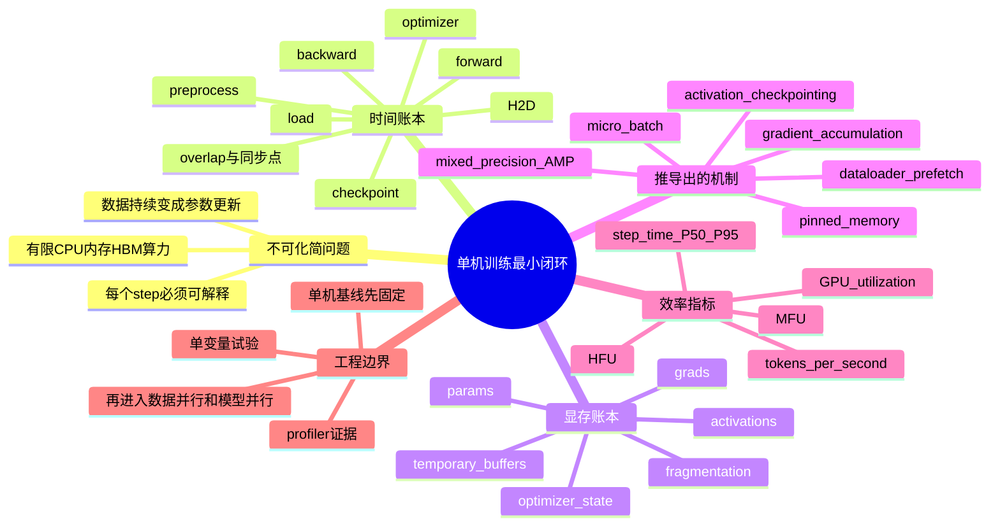

# 第7章：单机训练系统

> 分布式训练之前，先把单机训练讲清楚，是所有平台建设中最容易被忽略、却最值得打牢的基线。

> **关联章节**：本章是 [第8章](./08-data-parallel.md) 扩展效率分析的基线，也直接依赖 [第5章](../part2-systems-stack/05-memory-interconnect-io.md) 的数据供给链路。没有单机基线，就很难解释多卡结果到底是“扩得好”还是“噪声更多”。

## 1. 第一性原理拆解：为什么单机训练是训练系统的最小闭环

### 拆 — 不可化简的问题

剥掉 PyTorch、DDP、FSDP、AMP、Nsight 这些名字之后，单机训练要解决的不可化简问题其实只有一个：**如何让一台有限的机器，按可解释、可复现、可度量的方式，把数据转化成一次次参数更新。** 这台机器不是一个抽象的“GPU”，而是一组有边界的物理资源：CPU 负责读取、解码、拼 batch 和发起 kernel；主机内存负责缓存数据和承接 pinned memory；PCIe 或 NVLink 路径负责把数据送到设备；GPU HBM 放权重、梯度、优化器状态、activation 和临时 buffer；Tensor Core 负责真正的矩阵计算；本地盘或远端存储还会在 checkpoint、dataset shard、日志写入时插入额外扰动。训练脚本只是把这些资源串起来的调度程序。

因此，本章不是“单卡怎么跑一个 demo”，而是建立后续所有训练基础设施的测量原点。单机阶段最宝贵的地方在于变量还少：没有跨机网络，没有大规模 collective，没有队列调度造成的拓扑差异，也没有多租户干扰。如果在这个最小闭环里，step time、显存峰值、tokens/s、loss 曲线、checkpoint 耗时都无法解释，那么到了 [第8章](./08-data-parallel.md) 的数据并行和 [第9章](./09-model-pipeline-parallel.md) 的模型并行，问题会被复制到更多设备上，排障成本会按卡数和节点数放大。单机基线的价值不是“规模小”，而是它让你第一次能把训练系统当作一条完整因果链来观察：输入有没有连续到达，计算有没有吃满硬件，显存预算是否闭合，指标是否在描述真实进展。

这个不可化简问题还包含一个容易被忽略的约束：训练不是一次前向计算，而是持续数千、数万甚至数百万个 step 的闭环。一个 step 的延迟高并不可怕，可怕的是你不知道高在哪里；一次 OOM 也不可怕，可怕的是你无法判断它来自参数、梯度、优化器状态、activation、碎片还是临时通信 buffer。平台工程师需要的不是背诵“调大 num_workers”“打开 AMP”“用更大 batch”，而是能把每个动作映射到资源账本和时间账本：它减少了哪一项，增加了哪一项，是否只是把瓶颈从 HBM 挪到了输入链路，或者从计算挪到了 checkpoint 写入。

### 推 — 从这个问题如何推导出每个机制

从“数据要持续变成参数更新”出发，第一件必然出现的机制是 step 拆解。因为训练慢不是一个可操作的诊断，必须把它拆成 `load`、`preprocess`、`h2d`、`forward`、`backward`、`optim`、`checkpoint` 和 `logging`。拆开之后，dataloader、pinned memory、prefetch、stream overlap 才有意义：它们并不是孤立技巧，而是在缩短或隐藏输入阶段，让 GPU 计算阶段不要等数据。

第二件必然出现的机制是显存预算。权重只是模型训练账本里的第一行。训练需要梯度来更新参数，需要 AdamW 的 `m/v` 和可能存在的 FP32 master weight，需要为反向保留 activation，还需要 CUDA allocator、NCCL、framework runtime 的临时空间。于是 micro-batch、sequence length、activation checkpointing、optimizer 选择、mixed precision 都从同一个问题里被推导出来：在有限 HBM 里，哪些张量必须保存，哪些可以重算，哪些可以降精度，哪些必须分片。

第三件必然出现的机制是精度策略。FP32 稳但贵，BF16/FP16 能让 Tensor Core 更有效，也能降低参数、梯度和 activation 的字节数。AMP 的本质不是“自动加速开关”，而是在数值稳定性、吞吐和显存之间给每类算子选择合适的数据格式。BF16 通常少受 loss scaling 困扰；FP16 更依赖 GradScaler 和溢出检查；某些 reduction、normalization、optimizer update 仍需要更高精度。平台侧要记录的不只是“开了 AMP”，而是具体 dtype、是否保留 master weight、loss scaling 策略、哪些算子被 autocast。

第四件必然出现的机制是效率指标。GPU utilization 只回答设备是不是忙，不能回答忙在有效模型计算、重算、等待、拷贝还是低效 kernel。MFU（Model FLOPs Utilization）把“理论上一次训练 step 应该完成的模型 FLOPs”除以硬件峰值，用来衡量有效训练进展；HFU（Hardware FLOPs Utilization）看硬件实际执行了多少 FLOPs，activation checkpointing 这类重算会提高 HFU，却不提高每个 token 的有效训练进展。于是单机基线必须同时记录 tokens/s、step time、显存峰值、MFU/HFU 和 profiling 证据，否则高 utilization 可能只是一个漂亮但误导的表面数字。

第五件必然出现的机制是基线实验。所有优化都需要对照组，所以必须固定数据切片、随机种子、sequence length、micro-batch、gradient accumulation、precision、checkpoint 频率和 profiler 采样窗口。单变量改变才有诊断价值：调 `num_workers` 是在验证输入供给，调 micro-batch 是在验证 HBM 与 Tensor Core 饱和度，开 activation checkpointing 是在用算力换显存，改 checkpoint 频率是在验证持久化写入对稳态 step 的干扰。单机训练因此成为后续分布式训练的校准尺，而不是临时过渡阶段。

### 绘 — 因果链路



### 导 — 读完本章你应该能回答

1. 拿到一个训练作业时，如何把“训练慢”拆成可测量的 step 时间账本？
2. 为什么 7B 模型的 BF16 权重约 `14 GB`，但朴素训练仍然放不进一张 `80 GB` GPU？
3. micro-batch、gradient accumulation 和 effective batch 分别改变显存、吞吐和优化行为中的哪一部分？
4. AMP 为什么既可能提升吞吐、降低显存，也可能引入数值稳定性和算子覆盖边界？
5. GPU utilization、MFU、HFU 三个指标分别回答什么问题，为什么高 utilization 不能证明训练高效？
6. 当 step time 抖动时，如何区分数据供给、H2D、kernel、checkpoint 和 logging 的影响？
7. 一个最低可用的单机基线实验，必须固定和记录哪些变量，才能服务后续多卡扩展分析？

## 学习目标

完成本章学习后，你将能够：

1. 理解单机训练任务的完整时间结构
2. 知道 dataloader、前向、反向、优化器分别处在什么位置
3. 学会分析 GPU 利用率低的单机原因
4. 理解显存预算和 batch size 的关系
5. 建立“先把单机跑顺，再谈分布式”的工程习惯
6. 区分 GPU utilization、MFU 和 HFU 这三类训练效率指标
7. 理解 micro-batch、梯度累积和有效 batch 的区别
8. 设计一个最低可用的单机基线实验

---

## 本章导读

很多人会把“单机训练”理解成：

- 写训练脚本时的临时调试阶段
- 上分布式前随便跑一下的过渡步骤
- 只要 loss 在降就算完成

但工程现实恰恰相反。
单机训练是你第一次能把整个训练系统当作一个完整机器来看清楚的时候：

- 数据从哪里来
- CPU 和 GPU 怎么接力
- 时间到底花在输入、计算还是同步
- 显存为什么会在某个 batch 突然爆掉
- 某次“优化”到底是让吞吐真的变高，还是只是让曲线更好看

所以，本章不只是讲“单卡怎么训”，而是在建立一套之后所有章节都会依赖的观察框架：

```text
输入链路是否顺
  -> 单步时间结构是否清楚
  -> 显存预算是否可解释
  -> 指标是否可信
  -> 基线是否可复现
```

如果这几个问题在单机阶段就讲不清，到了 [第8章](./08-data-parallel.md)、[第9章](./09-model-pipeline-parallel.md) 和 [第10章](./10-memory-checkpointing-and-recovery.md)，问题只会变得更贵、更难定位。

## 正文内容

### 7.1 单机训练是所有复杂系统的最小原型

很多团队一开始就急着上多卡、多机、调度平台，但如果单机训练本身都不稳定、不高效，那么问题只会在更大规模下被放大。

单机训练至少应该回答：

- 数据是否能稳定供给？
- GPU 是否被喂饱？
- step time 是否稳定？
- loss 是否正常下降？
- checkpoint 是否能按预期写出？

如果这些基础问题都还没解决，分布式只会让排障更难。

### 7.2 一个 step 到底包含哪些阶段

单机训练的一个 step 通常可以拆成：

$$
t_{\text{step}} = t_{\text{load}} + t_{\text{preprocess}} + t_{\text{h2d}} + t_{\text{forward}} + t_{\text{backward}} + t_{\text{optim}}
$$

实际工程里有时还需要加上：

- `t_checkpoint`
- `t_eval`
- `t_logging`

这条式子非常重要，因为它把“训练慢”从一个模糊描述拆成了可测量的几段。

#### 7.2.1 真实 step 往往既有串行，也有重叠

上面的式子适合建立第一层直觉，但真实系统里，step 时间不一定是完全串行相加。

可以先把它再压缩成两大块：

$$
t_{\text{input}} = t_{\text{load}} + t_{\text{preprocess}} + t_{\text{h2d}}
$$

$$
t_{\text{gpu}} = t_{\text{forward}} + t_{\text{backward}} + t_{\text{optim}}
$$

如果 dataloader 预取、pinned memory 和 stream 重叠做得比较好，那么下一批数据的输入阶段，往往可以和当前批次的 GPU 计算阶段部分重叠。此时更接近的直觉是：

$$
t_{\text{step}} \approx \max(t_{\text{input}}, t_{\text{gpu}}) + t_{\text{unoverlapped}}
$$

其中 `t_unoverlapped` 表示那些无法被隐藏的同步、日志、checkpoint 或框架开销。

可以把两种时间线直观地对比成：

```text
低效时间线：
load -> preprocess -> h2d -> forward/backward -> optim

更健康的时间线：
step k:     forward/backward -> optim
step k+1: load/preprocess/h2d  (尽量与上面的 GPU 计算重叠)
```

这段理解很重要，因为它会直接影响调优顺序：

- 如果 `t_input` 明显大于 `t_gpu`，优先去看数据链路
- 如果两者已经充分重叠，再继续加 dataloader worker，收益可能很小
- 如果时间线上 H2D 和计算严格串行，就要优先怀疑内存拷贝路径、pin memory 或同步点

### 7.3 数据供给链路

很多人第一次做训练调优时只盯 GPU，但实际上 GPU 前面通常有一条更长的供给链：

```text
远端数据源 -> 本地缓存 -> dataloader -> CPU 预处理 -> H2D 拷贝 -> GPU 执行
```

如果这条链路中的任意一段慢，就会看到如下症状：

- GPU 利用率上下剧烈波动
- dataloader worker 长时间繁忙
- step time 不稳定
- CPU 使用率高但 GPU 没吃满

这说明单机训练的第一优化对象，常常不是模型，而是“数据供给系统”。

#### 7.3.1 dataloader 有哪些最常见的调节旋钮

很多单机训练的第一波收益，不来自改模型，而来自把 dataloader 调到一个更健康的状态。

| 旋钮 | 在解决什么 | 常见副作用 |
|------|------------|------------|
| `num_workers` | 让 CPU 解码、切分、拼接更并行 | 过多时会带来上下文切换、内存压力和 I/O 抢占 |
| `pin_memory` | 让 H2D 拷贝更顺畅 | 会增加主机内存占用 |
| `prefetch_factor` | 让 worker 提前准备更多 batch，减少抖动 | 会占用更多 CPU / 内存缓存 |
| `persistent_workers` | 避免每轮 epoch 反复拉起 worker | 长生命周期 worker 更难调试 |
| 本地缓存 / shard 预热 | 减少远端存储读取延迟 | 增加磁盘占用和缓存管理复杂度 |

一个常见误区是：

> dataloader 慢，就把 `num_workers` 一路调大。

实际上更稳妥的思路通常是：

1. 先确认瓶颈在远端读取、CPU 预处理，还是 H2D
2. 再选择对应旋钮，而不是只堆 worker 数
3. 每次只改一个变量，看 step time 和 CPU / 内存曲线是否真的改善

尤其当数据源还在远端对象存储或网络文件系统上时，本地缓存往往比单纯增加 worker 更值钱。

### 7.4 显存预算要怎么算

一个简单但很实用的显存预算式子是：

$$
M_{\text{total}} \approx M_{\text{params}} + M_{\text{grads}} + M_{\text{optim}} + M_{\text{activations}} + M_{\text{fragmentation}}
$$

其中：

- `params`：模型参数
- `grads`：梯度
- `optim`：优化器状态
- `activations`：前向过程中需要保留到反向的中间结果
- `fragmentation`：运行时碎片和临时 buffer

为什么同一模型有时能放下、有时 OOM？原因常常不只是参数数量，而是：

- batch size 改了
- 序列长度变了
- 激活多了
- mixed precision 关闭了
- 运行时出现内存碎片

#### 7.4.1 Mixed Precision 对显存和速度的影响

自动混合精度（AMP, Automatic Mixed Precision）的目标不是简单地“把所有张量变成半精度”，而是把训练 step 里不同数值敏感度的部分分层处理：矩阵乘、卷积、attention projection 这类 Tensor Core 友好的大算子尽量用 BF16 / FP16；loss、部分 reduction、normalization、optimizer update 等更容易受精度影响的路径保留 FP32 或更保守的累积方式。平台侧看 AMP，应该把它理解成一个工程策略：用更少字节和更高 Tensor Core 吞吐换取同等训练进展，同时守住数值稳定性边界。

AMP 的常见做法是：

- 主权重仍保留 FP32 副本，保证更新稳定
- 前向 / 反向中的大量计算用 FP16 或 BF16 执行
- 需要时配合 loss scaling 避免 FP16 下溢

对平台侧最重要的结论有两个：

1. **显存会显著下降**：相对纯 FP32，常见可节省约 30%-50%
2. **吞吐通常会上升**：尤其在 Tensor Core 友好的矩阵计算里更明显

但稳定性要分格式看：

- **BF16**：指数范围更大，通常比 FP16 更稳
- **FP16**：更依赖 loss scaling 和算子实现细节

在 PyTorch 里，一个最小训练 step 通常长这样：

```python
scaler = torch.cuda.amp.GradScaler(enabled=use_fp16)

for batch in loader:
    with torch.autocast(device_type="cuda", dtype=torch.bfloat16):
        loss = model(batch).loss

    scaler.scale(loss).backward()
    scaler.step(optimizer)
    scaler.update()
    optimizer.zero_grad(set_to_none=True)
```

如果使用 BF16，很多训练栈会关闭 `GradScaler`，因为 BF16 的指数范围接近 FP32，溢出/下溢风险比 FP16 小；如果使用 FP16，则需要观察 scaler 是否频繁回退、loss 是否出现 `nan`、梯度范数是否异常。对平台基线记录来说，“AMP on”这个字段不够，应至少记录 `dtype=bf16/fp16`、是否有 FP32 master weight、是否启用 loss scaling、是否有 activation checkpointing、是否使用 fused optimizer。

| 精度策略 | 参数/激活字节 | Tensor Core 友好度 | 数值稳定性 | 工程边界 |
|----------|---------------|--------------------|------------|----------|
| FP32 | `4 bytes` | 通常较差 | 最稳 | 显存和吞吐成本高，适合 debug 或少数敏感算子 |
| FP16 AMP | `2 bytes` | 高 | 依赖 loss scaling | 需要监控 overflow、`nan`、scaler 回退频率 |
| BF16 AMP | `2 bytes` | 高 | 通常更稳 | 需要硬件支持，老卡吞吐可能不理想 |
| FP8 / 低精度训练 | `1 byte` 级 | 很高 | 策略复杂 | 超出本章单机基线范围，通常要配合框架和校准策略 |

AMP 的工程边界是：它不能修复数据供给瓶颈，也不能让过小 micro-batch 自动吃满 GPU；它降低的是张量字节数并提升部分算子的峰值效率。如果 step time 主要耗在 dataloader、H2D、checkpoint 或 CPU 同步点，打开 AMP 后 MFU 可能只小幅变化。相反，如果原本是大矩阵计算占主导，BF16/FP16 通常会同时降低显存峰值、提升 tokens/s，并允许把 micro-batch 往上调一档。

#### 7.4.2 典型模型显存实例

下表采用非常粗略的数量级估算，只用于建立规模感。激活显存对层数、序列长度、micro-batch 和是否启用重计算极其敏感。

| 模型 | 参数显存 FP32 | 参数显存 BF16 / FP16 | Adam 状态显存 | 典型激活显存估算 | 工程含义 |
|------|---------------|----------------------|---------------|------------------|----------|
| LLaMA 7B | 约 28 GB | 约 14 GB | 约 56 GB | 约 6-10 GB | 推理容易单卡，训练时梯度和优化器很快把显存吃满 |
| LLaMA 13B | 约 52 GB | 约 26 GB | 约 104 GB | 约 12-20 GB | 单卡训练通常需要 AMP、重计算或切分 |
| LLaMA 70B | 约 280 GB | 约 140 GB | 约 560 GB | 约 60-100 GB | 必然进入多卡并行和状态分片 |

这里的 `Adam 状态显存` 只算两个 FP32 moment（`m` 和 `v`，约 `8 bytes / param`）。
如果训练实现还保留一份 FP32 master weight，则还要再加 `4 bytes / param`。
对 7B 模型，这意味着优化器相关状态会从约 `56 GB` 增加到约 `84 GB`，这也是为什么训练侧的显存规划，通常会比“只看权重大小”保守得多。

> **参考数量级（仅供建立直觉，实际值因硬件和配置差异较大）**
>
> | 场景 | 典型值 | 说明 |
> |------|--------|------|
> | AMP 相对 FP32 显存节省 | 约 30%-50% | 取决于优化器、激活和临时 buffer 占比 |
> | 7B 级模型 BF16 参数显存 | 约 14 GB | 只算权重，不含梯度和优化器 |
> | Adam 状态额外开销 | 约 8 bytes / param | 若再保留 FP32 master weight，开销更高 |
> | 激活显存波动 | 常可达数 GB 到数十 GB | 序列长度和 micro-batch 会迅速放大这一项 |

#### 7.4.3 batch size、micro-batch 与梯度累积

很多单机训练的问题，表面上是在问“batch 能开多大”，实际上是在混淆三个不同概念：

- **micro-batch**：一次前向 / 反向真正送进设备的 batch
- **gradient accumulation**：积累多少个 micro-batch 再做一次优化器更新
- **effective batch**：真正影响优化行为的总 batch

一个常见写法是：

$$
B_{\text{effective}} = B_{\text{micro}} \times N_{\text{accum}}
$$

在单机单卡场景里，这已经足够好用；到了数据并行场景，再继续乘上设备数即可。

这三个量的工程含义不同：

| 调大什么 | 更直接影响什么 | 常见代价 |
|----------|----------------|----------|
| `micro-batch` | GPU 利用率、单次前后向吞吐 | 激活显存迅速上升，最容易 OOM |
| `gradient accumulation` | 有效 batch，不必立即增加显存 | 每次参数更新更慢，单次 optimizer step 间隔更长 |
| `sequence length` | 单样本上下文能力 | 激活和 attention 开销上升非常快 |

所以很多单机调优的真实路径并不是：

- “把 batch 一路调到最大”

而更像：

- 先找到不会 OOM 的 `micro-batch`
- 再决定是否用梯度累积把有效 batch 拉上去
- 最后观察吞吐、稳定性和收敛行为有没有一起变差

#### 7.4.4 Worked Example：LLaMA-7B 单机训练资源规划

下面用一个平台侧经常会遇到的配置，把前面的公式真正算一遍。
目标不是追求“唯一正确答案”，而是建立一套拿到新模型后就能快速估预算、判可行性、找第一瓶颈的流程。

这组数字采用一个常见的 7B 级 decoder-only 模型近似：

| 项目 | 假设值 | 为什么这样选 |
|------|--------|--------------|
| 模型规模 | `7B params` | 代表常见的 LLaMA-7B 量级 |
| 层数 / hidden size | `32 layers` / `4096 hidden` | 方便估 activation 数量级 |
| 精度 | `BF16` | H100 上最常见，也比 FP16 更稳 |
| 优化器 | `AdamW + FP32 master weight` | 平台默认最常见，也最占显存 |
| 序列长度 | `4096` tokens | 已经能看出长上下文对显存和 step time 的压力 |
| micro-batch | `4 seq / GPU` | 单机吞吐和显存之间的常见折中 |
| gradient accumulation | `4` | 让有效 batch 不必直接顶满显存 |
| 目标机器 | `8 x H100-80GB, NVLink` | 典型单机训练节点 |

先看和 batch 无关、几乎“跑起来就必须付”的静态显存：

| 组成 | 计算 | 结果 | 工程解释 |
|------|------|------|----------|
| 参数 | `7B x 2 bytes` | `14 GB` | BF16 权重本体 |
| 梯度 | `7B x 2 bytes` | `14 GB` | 反向后需要保留到优化器更新 |
| AdamW optimizer state | `7B x 12 bytes` | `84 GB` | `FP32 master + m + v`，训练和推理差异最大的来源 |
| 静态小计 | `14 + 14 + 84` | `112 GB` | 还没算 activation、临时 buffer、碎片 |

这张表有一个很重要的结论：
**“7B 参数”只说明推理权重大约是 `14 GB`，并不说明训练能放进一张 `80 GB` 卡。**
如果按最朴素的单卡 / DDP 复制思路，每张卡都要持有这 `112 GB` 静态状态，根本没有给 activation 留空间。

activation 再继续把差距拉开。只用 hidden state 下界做一个一眼能算的估算：

$$
M_{\text{act, floor}} \approx L \times B_{\mu} \times S \times H \times 2 \text{ bytes}
$$

把上面的假设代进去：

$$
32 \times 4 \times 4096 \times 4096 \times 2 \approx 4.3 \text{ GB}
$$

但这只是“每层留一份 hidden state”的下界。
真实训练还会保留 attention、MLP、残差分支等中间张量，因此工程上更实用的估法是把它当作一个区间：

| activation 口径 | 估算值 | 解释 |
|-----------------|--------|------|
| hidden-state floor | `约 4.3 GB / GPU` | 只保留最基础的层输入 |
| 不开 activation checkpointing | `约 12-18 GB / GPU` | 通常是 floor 的 `3x-4x`，实现差异很大 |
| 开 activation checkpointing | `约 6-10 GB / GPU` | 用更多重算换更低显存 |

把静态状态和 activation 合起来之后，就能更清楚地判断“需要几张卡”：

| 方案 | 每卡显存近似 | 是否可行 | 第一瓶颈通常是什么 |
|------|--------------|----------|--------------------|
| `1 x H100-80GB`，无状态分片 | `112 GB + 12-18 GB` | 不可行 | HBM 容量直接不够 |
| `8 x H100`，纯 DDP 复制 | 每卡仍是 `112 GB + 12-18 GB` | 不可行 | 卡数增加了，但每卡仍保留整份状态 |
| `2 x H100`，ZeRO-1 | `14 + 14 + 42 + 6-10 = 76-80 GB` | 很紧 | activation 一抖就 OOM，几乎没有碎片余量 |
| `2 x H100`，FSDP / ZeRO-3 | `7 + 7 + 42 + 6-10 = 62-66 GB` | 可行 | all-gather / reduce-scatter 开始明显进入 step time |
| `8 x H100`，ZeRO-2 | `14 + 1.75 + 10.5 + 6-10 = 32.25-36.25 GB` | 很稳 | 从“能不能放下”转向“通信和数据能不能喂满” |

这个表想传达的平台工程视角是：

- **卡数不是唯一变量**。如果并行策略不变，`8` 张卡也可能和 `1` 张卡一样放不下。
- **单机里最先决定可行性的，往往是 optimizer state，而不是参数本体。**
- **从 `2` 卡到 `8` 卡，瓶颈会从 HBM 容量，逐渐转移到 NCCL overlap、输入供给和 kernel 形态。**

在 `8 x H100 + ZeRO-2` 这个可行方案上，还可以继续把 step time 和 MFU 直觉算出来。
按上面的 batch 假设，一个 optimizer step 覆盖的 token 数是：

$$
8 \times 4 \times 4 \times 4096 = 524{,}288 \text{ tokens}
$$

对 7B 级 decoder-only 模型，常见的训练 FLOPs 估算可以用：

$$
\text{model FLOPs per step} \approx 6 \times N_{\text{params}} \times \text{tokens per step}
$$

代入后得到：

$$
6 \times 7 \times 10^9 \times 524{,}288 \approx 2.2 \times 10^{16} \text{ FLOPs}
$$

也就是大约 `22 PFLOPs / optimizer step`。
如果把这个数字代回后面的 `7.6b` MFU 定义，在 `8 x H100`（BF16 峰值近似按 `8 x 989 TFLOPS = 7.9 PFLOPS`）上，可以得到下面这组很实用的直觉：

| 假设的 optimizer step time | 对应吞吐 | 近似 MFU | 读数含义 |
|---------------------------|----------|----------|----------|
| `6 s` | `约 87k tokens/s` | `约 46%` | 单机 `8` 卡、NVLink 健康区间 |
| `8 s` | `约 65k tokens/s` | `约 35%` | 系统在跑，但 overlap 和输入供给还有明显损失 |
| `12 s` | `约 44k tokens/s` | `约 23%` | 要优先查 dataloader、通信等待、checkpoint 干扰 |

这里最容易犯的错误，是把 `nvidia-smi` 上的高 utilization 当成“系统已经很高效”。
对平台工程来说，更有用的问题其实是：

- 当前 step time 对应的 MFU 是不是落在这个配置应有的区间？
- 如果不是，损失主要出在 activation checkpointing 的重算、NCCL collectives，还是数据供给？
- 这个作业到底是“显存不够”，还是“显存已经够了，但系统吞吐没有跟上”？

最后，把这个 worked example 的边界也明确写出来，避免把它误当成固定答案：

| 变量变化 | 对结果的影响 |
|----------|--------------|
| `micro-batch` 从 `4` 提到 `8` | activation 近似翻倍，吞吐可能升高，但 OOM 风险会先出现 |
| `sequence length` 从 `4096` 提到 `8192` | activation 至少近似翻倍，attention 临时张量和 step time 往往涨得更快 |
| 开 / 关 activation checkpointing | 显存和 HFU 都会明显变化，MFU 可能持平或略降 |
| `AdamW` 换成 `8-bit Adam` / `Adafactor` | optimizer state 会显著下降，最小可行卡数也会变 |
| `BF16` 换成 `FP32` | 参数和梯度翻倍，许多“勉强可行”的配置会直接失效 |

所以，平台做资源规划时，不能只记“7B 大概需要几张卡”，而要记：
**是什么 batch、什么序列长度、什么 optimizer、什么精度、有没有 checkpointing。**
只有把这些边界一起记录，显存预算和 step time 预估才真正可复用。

把上面的估算翻译成真实训练步骤，可以得到一条更适合排障的推理链：

| 训练步骤 | 主要资源动作 | 期望观察 | 异常时优先检查 |
|----------|--------------|----------|----------------|
| 读取 batch | CPU worker 从 shard 读取并 tokenize / collate | data time 低于 GPU compute time，P95 不剧烈抖动 | 远端存储、本地缓存、`num_workers`、CPU NUMA |
| H2D 搬运 | batch 从 host pinned memory 进入 GPU | H2D 与上一个 step 的计算部分重叠 | `pin_memory`、non_blocking copy、隐式同步 |
| 前向 | BF16 matmul / attention / MLP 执行并保存 activation | GPU kernel 连续，显存按 micro-batch 上升 | micro-batch 太小、算子碎片、sequence length 过长 |
| 反向 | 读 activation、算梯度，可能触发重算 | checkpointing 开启时 compute time 上升但显存下降 | 重算过多、梯度 `nan`、autocast 覆盖不一致 |
| 梯度规约 | ZeRO/FSDP 场景 reduce-scatter / all-gather | 通信与反向尽量 overlap | NCCL 等待、bucket 太小、NVLink 拓扑问题 |
| optimizer step | AdamW 更新 FP32 master、`m/v`、BF16 权重 | 周期稳定，显存无持续泄漏 | fused optimizer、allocator 碎片、状态是否分片 |
| checkpoint / logging | 周期性写权重、状态和指标 | 只在固定 step 出现可解释尖峰 | 文件系统吞吐、异步保存、保存频率 |

这条链路有两个常见结论。第一，如果 `8 x H100 + ZeRO-2` 的显存只有 `35 GB` 左右但 step time 很差，问题大概率已经不是“放不下”，而是输入、通信 overlap 或 kernel 形态。第二，如果 `2 x H100 + ZeRO-1` 勉强跑在 `76-80 GB`，任何 dataloader 预取、临时 buffer、长序列抖动、checkpoint 保存都可能把作业推到 OOM，因此它不适合作为稳定平台默认配置。

吞吐估算也要同时看 `tokens/s` 和 step 粒度。以上配置每个 optimizer step 是 `524,288 tokens`，如果 `gradient_accumulation=4`，每个 micro-step 约处理 `131,072 tokens`。因此：

| 观测对象 | 计算方式 | 示例值 | 用途 |
|----------|----------|--------|------|
| micro-step tokens | `8 GPUs x 4 seq x 4096` | `131,072` | 判断单次前后向是否吃满 GPU |
| optimizer-step tokens | `micro-step tokens x 4 accum` | `524,288` | 对齐 loss update 和 MFU 口径 |
| optimizer-step 吞吐 | `524,288 / step_time` | `6s -> 87k tokens/s` | 与同机型历史基线对比 |
| 每 GPU 吞吐 | `total tokens/s / 8` | `约 10.9k tokens/s/GPU` | 查单卡退化和拓扑不均衡 |

工程边界必须写进实验记录：这些 FLOPs 估算没有包含 tokenizer、数据增强、checkpoint 写入，也没有把 attention 在长序列下的二次复杂度完全展开；`6 x params x tokens` 是 decoder-only 训练的粗略模型 FLOPs 口径，适合算 MFU 和做同配置横向比较，不适合替代 profiler。真正的平台判断应把显存表、tokens/s、MFU/HFU、P50/P95 step time、Nsight 或 `torch.profiler` 时间线放在同一份基线报告里。

### 7.5 单机训练最常见的几类瓶颈

#### （1）数据加载瓶颈

症状：

- GPU 周期性空转
- dataloader 时间占比高
- 调大 worker 后吞吐改善明显

#### （2）显存瓶颈

症状：

- batch 很小
- 稍微拉长序列就 OOM
- 激活重计算一开速度变慢但任务能跑

#### （3）算子执行瓶颈

症状：

- GPU 利用率长期高
- 调大 batch 仍提升有限
- profiler 显示主要耗时集中在少数 kernel

#### （4）日志 / checkpoint 干扰

症状：

- 每隔固定时间 step time 抖动
- 保存 checkpoint 后训练中断明显

#### 7.5.1 用症状快速反推瓶颈

真实排障时，最有用的往往不是记住所有原理，而是先把症状和第一检查动作对上。

| 现象 | 更可能的问题 | 第一动作 |
|------|--------------|----------|
| GPU 利用率呈锯齿形波动 | 数据供给断续 | 先看 dataloader 时间、CPU 使用率和远端读取 |
| 稍微增大 batch 或序列就 OOM | 激活或优化器状态顶满 | 先看显存峰值，再区分是激活还是参数相关状态 |
| GPU 看起来很忙，但 tokens/s 上不去 | kernel / batch 形态不理想 | 用 profiler 看是不是小 batch、碎 kernel 或同步过多 |
| 每隔固定步数整体变慢 | checkpoint / eval / logging 插入 | 先对照定时任务频率和 step 抖动周期 |
| 首个 step 特别慢，后续正常 | JIT / cache / 数据预热 / cudnn autotune | 先区分“冷启动”还是“稳态慢” |

这张表的作用不是替代 profiler，而是帮助你先决定：
**第一眼应该去哪里看，而不是盲目把所有工具都跑一遍。**

### 7.6 一个最低限度的单机排障顺序

当训练变慢时，可以按以下顺序做：

1. 看 step time 是否稳定
2. 看 GPU 利用率与显存占用
3. 看 dataloader / CPU / I/O
4. 看 batch size 和序列长度变化
5. 看 checkpoint / eval / logging 是否插入额外停顿

这个顺序的核心逻辑是：
**先判断是不是供给链问题，再判断是不是纯计算问题。**

#### 7.6a 推荐的 Profiling 工具

| 工具 | 看什么 | 何时用 | 常见输出 |
|------|--------|--------|----------|
| `nvidia-smi` / `nvidia-smi dmon` | 利用率、显存、功耗、温度 | 先判断是不是明显空转或 OOM 临界 | 终端实时数据 |
| `torch.profiler` | step 内算子、CPU/GPU 时间分布 | 先从 PyTorch 层拆前向 / 反向 / dataloader | Chrome trace / TensorBoard |
| Nsight Systems (`nsys`) | kernel、stream、H2D、同步是否重叠 | 怀疑 pipeline 串行、拷贝阻塞、CPU 等待 | 系统级时间线 |
| Nsight Compute (`ncu`) | 单个慢 kernel 的 occupancy、访存效率 | 已定位到个别 kernel 很慢时 | kernel 报告 |
| `torch.cuda.memory_summary()` | 分配峰值、保留量、碎片线索 | OOM、显存涨不回去、怀疑碎片 | 文本报告 |

一个实用顺序是：

1. 先用 `nvidia-smi` 看是不是供给不足或显存打满
2. 再用 `torch.profiler` 看 step 结构
3. 需要系统级时间线时上 `nsys`
4. 只有确认是单个 kernel 问题时再用 `ncu`

#### 7.6b MFU、HFU 和 GPU Utilization 不是一回事

`nvidia-smi` 里的 GPU utilization 只能说明“设备在忙”，不能说明“忙得值不值”。

$$
\text{MFU} = \frac{\text{model FLOPs per step} / t_{\text{step}}}{\text{peak device FLOPS} \times N_{\text{devices}}}
$$

HFU 的分子换成硬件实际执行的 FLOPs：

$$
\text{HFU} = \frac{\text{actual hardware FLOPs per step} / t_{\text{step}}}{\text{peak device FLOPS} \times N_{\text{devices}}}
$$

这两个指标的关键差异在“什么算有效”。MFU 只把模型训练本身需要的理论 FLOPs 算进分子，常用近似是 decoder-only 模型 `6 x params x tokens`。它回答的是：当前系统把多少硬件峰值转化成了有效 token 训练进展。HFU 则更接近 profiler 里的硬件执行量，activation checkpointing、重复计算、某些 fused / unfused kernel 的额外操作都可能进入 HFU。也就是说，HFU 高不一定代表训练进展更快；它可能只是硬件在为省显存做更多重算。

| 指标 | 在回答什么问题 | 分子口径 | 容易被什么误导 |
|------|----------------|----------|----------------|
| GPU utilization | GPU 是否长期在忙 | 采样窗口内 GPU 是否有活动 | SM 忙于等待、拷贝或低效 kernel 时也可能很高 |
| tokens/s | 训练进度是否变快 | 单位时间处理 token 数 | batch、sequence length、accumulation 口径不一致时不可比 |
| MFU | 有效模型计算占理论峰值多少 | 模型 FLOPs / step time | 不包含激活重计算等“额外 FLOPs” |
| HFU | 硬件实际执行 FLOPs 占理论峰值多少 | 实际硬件 FLOPs / step time | 开了重计算时可能高于 MFU，但有效进展没同比增加 |

可以用一个小例子建立直觉：同样是 `8 x H100` 训练 7B，假设不开 activation checkpointing 时 step time 是 `6s`，MFU 约 `46%`。如果为了省显存打开 checkpointing，硬件每步多执行 `25%` 重算 FLOPs，step time 增加到 `7s`。这时 MFU 会因为有效模型 FLOPs 不变、时间变长而降到约 `39%`；HFU 的分子却包含重算，可能仍接近或高于原来的读数。平台侧如果只看 HFU 或 utilization，可能会误判“硬件更忙所以更好”；但从训练进度看，tokens/s 下降了。

一个典型误判是：

- `nvidia-smi` 显示 90% utilization
- 但 MFU 只有 35%-40%

这通常说明设备虽然没闲着，但大量时间并没有变成“有效模型吞吐”，而是耗在：

- 数据加载等待
- H2D 搬运
- 小 batch 导致 Tensor Core 吃不满
- checkpoint / logging 插入停顿
- 激活重计算把 HFU 拉高，但并没有增加有效训练进度

可用于建立直觉的数量级：

| 场景 | 常见 MFU |
|------|----------|
| 单卡调试 / 小 batch | 20%-40% |
| 单机 8 卡、NVLink 较健康 | 40%-55% |
| 多机 IB 训练 | 30%-50% |
| 接近 60% 以上 | 往往已经做了大量 overlap 和通信优化 |

例如前面 `7.4.4` 的 7B 算例里，如果 `8 x H100` 上一个 optimizer step 约 `6 s`，对应 MFU 约 `46%`，属于单机较健康区间；如果同样配置跑到 `12 s`，MFU 会掉到约 `23%`，这时就不能再只看 utilization，而应直接去查数据、通信和额外停顿。

诊断时可以按下面的组合读数反推问题：

| 组合读数 | 更可能的解释 | 下一步动作 |
|----------|--------------|------------|
| utilization 低，MFU 低，data time 高 | GPU 被输入链路饿住 | 查 dataloader、storage、H2D overlap |
| utilization 高，MFU 低，HFU 也低 | GPU 忙但 kernel 效率差 | 查 micro-batch、算子融合、Tensor Core dtype |
| utilization 高，MFU 低，HFU 较高 | 额外计算多，常见于重算 | 查 activation checkpointing、重复 forward、profiler FLOPs |
| MFU 正常但 P95 step 抖动 | 稳态计算健康，周期性干扰明显 | 查 checkpoint、eval、日志、数据 shard 切换 |
| tokens/s 高但 loss 更新慢 | gradient accumulation 口径被忽略 | 区分 micro-step 和 optimizer step |

工程边界是：MFU/HFU 都依赖 FLOPs 口径，不能脱离模型结构、精度峰值和 step 定义使用。H100 的 BF16 dense 峰值、FP8 峰值、是否使用 sparsity 峰值不是同一个分母；单机单卡、单机 8 卡、多机集群也不能混用同一条经验线。平台基线里建议固定写法：`model FLOPs = 6 x params x optimizer_step_tokens`，`peak FLOPS = device BF16 dense peak x GPU count`，同时记录 activation checkpointing 是否开启。这样同一团队内部的 MFU 才能横向比较，跨论文或跨厂商数字则只能做数量级参考。

### 7.7 为什么单机基线极其重要

平台工程里有一个很实用的原则：

> 如果单机 1 卡的性能和稳定性没有基线，任何多卡、多机数据都很难解释。

你至少应该知道：

- 单机单卡 step time
- 单机单卡吞吐
- 单机单卡显存占用
- 单机单卡在不同 batch 下的变化趋势

只有这样，当你开始做 [第8章 §8.4](./08-data-parallel.md) 的扩展效率分析时，才知道哪里是真扩展，哪里只是引入了更多噪声。

#### 7.7.1 一个最低可用的单机基线实验

如果团队现在还没有形成统一基线，至少可以先做一个很小但可重复的实验。

| 阶段 | 建议动作 | 目的 |
|------|----------|------|
| 固定输入 | 固定数据切片、随机种子、序列长度、精度和优化器 | 避免每次结果不可比 |
| 预热 | 先跑一小段 warmup，再开始记正式数据 | 去掉首次编译、缓存和 autotune 扰动 |
| 稳态采样 | 连续记录一段稳定 step 的 P50 / P95 step time | 避免只看单个幸运 step |
| 记录关键指标 | samples/s 或 tokens/s、显存峰值、data time 占比、utilization | 给后续优化留对照组 |
| 单变量试验 | 每次只改一个变量，如 batch、worker、precision | 避免不知道是哪个改动生效 |

最小记录表通常至少包含：

- 模型名和配置
- 数据切片版本
- micro-batch / sequence length
- precision（FP32 / FP16 / BF16）
- 平均 step time
- 吞吐（samples/s 或 tokens/s）
- 最大显存占用
- 备注：是否开 checkpointing、梯度累积、重计算

只有把这些信息留下来，单机基线才不是“我记得上次好像更快”，而是一份之后可以拿来和多卡、多机对照的证据。

### 7.8 工程建议

- 先固定数据集切片、随机种子和 batch，再记录单机基线
- 单机阶段就把 profiler 跑通，不要等到多卡出问题再补
- 显存一旦接近上限，就同时检查参数、激活和优化器，不要只盯模型大小
- 每次改数据管道、精度策略或 checkpoint 频率，都应重测单机基线

#### 本章涉及的常见工具

| 概念 | 常见工具 / 命令 | 备注 |
|------|-----------------|------|
| 启动单机训练 | `torchrun --nproc_per_node=1 train.py` | 建立后续多卡对照基线 |
| 显存巡检 | `nvidia-smi`、`torch.cuda.memory_summary()` | 快速定位 OOM 和碎片问题 |
| Step 分析 | `torch.profiler`、Nsight Systems | 看数据供给和计算是否重叠 |
| 混合精度 | `torch.cuda.amp.autocast`、`GradScaler` | BF16 更稳，FP16 更依赖 loss scaling |

---

## 本章小结

| 主题 | 关键点 |
|------|--------|
| 单机训练价值 | 是所有训练系统优化的基线 |
| step 结构 | 数据、搬运、前向、反向、优化器共同决定总时间 |
| 时间线理解 | 真实 step 常是输入与计算部分重叠，而不是完全串行 |
| 显存预算 | 不只看参数量，还要看梯度、优化器和激活 |
| Batch 策略 | micro-batch 决定显存压力，梯度累积决定有效 batch |
| Profiling | 先看 step 结构，再看系统时间线，最后才钻到单 kernel |
| 效率指标 | utilization 说明是否忙，MFU / HFU 才更接近“忙得是否有效” |
| 排障顺序 | 先看供给链，再看计算本身 |

---

## 练习题

1. 为什么说多机训练前必须先掌握单机训练基线？
2. 写出一个训练 step 的时间拆解式，并说明哪一项最容易被忽视。
3. 如果 GPU 利用率周期性掉到很低，你会优先怀疑什么？
4. 以 LLaMA 13B 为例，为什么只看参数显存会低估真实训练显存？
5. 为什么 `nvidia-smi` 看起来很忙，不代表 MFU 一定高？
