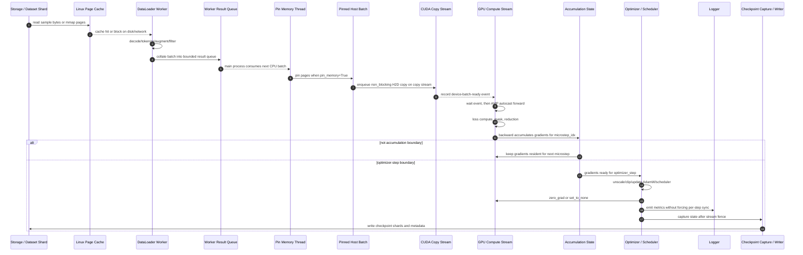

# 第7章：单机训练系统

> 分布式训练之前，先把单机训练讲清楚。单机不是 demo 阶段，而是训练系统最小、最便宜、最可解释的生产基线。

> **关联章节**：本章是 [第8章](./08-data-parallel.md) 的数据并行效率基线，也是 [第9章](./09-model-pipeline-parallel.md) 做模型并行切分前的容量基线，并依赖 [第5章](../part2-systems-stack/05-memory-interconnect-io.md) 对主机内存、PCIe/NVLink、存储和 page cache 的解释。

---

## Part3 贯穿实验路线图

Part3 建议用同一个训练作业贯穿所有章节：先用 LLaMA-7B 或同量级 7B dense 模型在单机 8xH100 上建立 baseline，固定 dataset manifest、token 口径、precision policy、显存账本、profile 窗口和 checkpoint schema；然后把同一作业扩到 DDP/FSDP，比较 global batch、通信暴露时间、rank skew 和恢复语义。

当 7B 作业的容量、吞吐和 checkpoint 交付物都稳定后，再把输入约束升级到 70B：第9章用 TP/PP/CP/hybrid 设计 rank mesh，第09e章把 dense FFN 替换为 MoE 并补充 EP、router 和 expert checkpoint，第10章对这些并行形态做 checkpoint dry-run、故障注入和恢复演练。最后，第10b/10c章复用同一套 base checkpoint、数据 manifest、eval gate 和 artifact registry，把预训练作业交付到 SFT/RLHF 以及 LoRA/Adapter 生命周期。

贯穿交付物按章节递进：`single_node_baseline.md` -> `dp_fsdp_scale_report.md` -> `parallel_strategy_70b.md` / `moe_ep_report.md` -> `checkpoint_recovery_drill.md` -> `post_training_manifest.md` -> `adapter_release_record.md`。每章不是孤立知识点，而是在补齐下一章必须消费的配置、指标、状态和准入证据。

## 1. 第一性原理拆解 + 学习大纲

### 1.1 不可化简的问题

单机训练要解决的最小问题不是“让 GPU 跑起来”，而是：

> 如何在一台有限资源的机器上，以可复现、可观测、可解释的方式，把数据流持续转化为参数更新。

这个问题不可再分，因为训练 step 同时消耗五类资源：

- 数据资源：dataset shard、metadata、tokenized sample、随机采样顺序。
- 主机资源：CPU core、page cache、DRAM、pinned memory、worker 进程、文件描述符。
- 传输资源：PCIe、NVLink、DMA engine、copy stream、NUMA locality。
- 设备资源：HBM、SM、Tensor Core、L2、kernel launch queue、CUDA allocator。
- 状态资源：参数、梯度、优化器状态、scheduler、RNG、`optimizer_step`、`microstep_idx`、checkpoint。

单机训练的工程目标是让这些资源形成稳定闭环：

```text
dataset -> CPU pipeline -> H2D -> GPU compute -> optimizer update -> durable state
```

如果这个闭环里任何一段不可解释，后续上 DDP、FSDP、TP、PP 只会把问题复制到更多 rank 上。单机阶段的价值在于变量少：没有跨节点网络，没有 collective 退化，没有调度系统造成的拓扑差异，也没有大规模 rank failure。它是所有训练系统的测量原点。

### 1.2 从不可化简问题推导机制

从“数据持续转化为参数更新”出发，可以推导出本章所有机制：

1. 必须拆 training step path，否则“训练慢”无法诊断。
2. 必须建显存账本，否则 OOM 只能靠猜。
3. 必须区分 GPU utilization、SM occupancy、MFU、HFU、tokens/s，否则会把“硬件忙”误判成“训练有效”。
4. 必须定义 precision policy，否则 AMP/BF16/FP8 只是开关，不是工程决策。
5. 必须建立 profiler chain，否则无法把症状映射到证据。
6. 必须做单机 baseline acceptance，否则多机扩展没有参照物。

### 1.3 学习大纲

读完本章，你应该能够回答：

- 一个完整 training step 从 dataset read 到 checkpoint 的每一段在哪里排队、在哪里同步、在哪里消耗显存。
- 为什么 BF16 的 LLaMA-7B 参数只有约 `13.0 GiB`，但 AdamW 训练账本远大于参数本身。
- microbatch、gradient accumulation、global batch、sequence length 分别影响 HBM、吞吐和优化行为的哪一项。
- 为什么 GPU utilization 高不代表 MFU 高，为什么 activation checkpointing 可能提高 HFU 但降低 tokens/s。
- AMP、BF16、FP8 的工程边界是什么，哪些算子和状态不能盲目降精度。
- 如何用 `torch.profiler`、Nsight Systems、Nsight Compute、DCGM、`iostat`、`perf` 串起证据链。
- 如何为 LLaMA-7B on 8xH100 设计单机 baseline，计算显存、吞吐、MFU/HFU，并定位瓶颈。

---

## 2. 概念边界：是什么、不是什么、相邻概念边界

### 2.1 是什么

单机训练系统是一个训练作业在单台服务器内的完整执行系统。它包括：

- 训练控制面：launcher、配置、随机种子、resume 逻辑、checkpoint policy、日志策略。
- 数据路径：dataset read、page cache、本地缓存、CPU preprocessing、DataLoader worker、collate、pinned memory、H2D。
- 计算路径：forward、loss、backward、gradient accumulation、optimizer step、AMP/GradScaler、scheduler。
- 状态路径：model weights、gradients、optimizer state、RNG、`optimizer_step`、`microstep_idx`、dataset cursor、checkpoint metadata。
- 故障路径：OOM、NaN、DataLoader hang、I/O stall、H2D stall、kernel inefficiency、checkpoint stall。

本章讨论的“单机”可以是：

- 单 GPU 训练。
- 单节点多 GPU 训练，但重点仍是节点内资源路径，不展开跨节点通信。
- 单节点 DDP/FSDP 的 baseline，但 collective 细节留给第8章。

### 2.2 不是什么

单机训练不是：

- 只跑一个 notebook 或 demo batch。
- 只看 loss 是否下降。
- 只调 `num_workers`、`batch_size`、`fp16=True` 三个旋钮。
- 只用 `nvidia-smi` 看 GPU utilization。
- 只靠经验判断 OOM 来自哪里。
- 只在失败后保存一次 checkpoint。

生产级单机训练基线必须给出可复现配置、时间账本、显存账本、精度策略、profile 证据和 acceptance checklist。

### 2.3 相邻概念边界

| 概念 | 单机训练中的含义 | 相邻概念边界 |
|---|---|---|
| Microbatch | 单次 forward/backward 放入一张 GPU 或一个 rank 的 batch | 不等于 global batch；global batch 还乘以 gradient accumulation 和 data parallel size |
| Gradient accumulation | 多个 microbatch 累计梯度后再 optimizer step | 增加优化步间样本数，不自动提升单 step kernel 效率 |
| GPU utilization | GPU 在采样窗口内是否忙 | 不说明忙的是 compute、copy、kernel launch 还是低效小 kernel |
| SM occupancy | SM 上 active warp / 理论上限 | 高 occupancy 不保证 Tensor Core 使用率高 |
| MFU | 有效模型 FLOPs / 硬件峰值 FLOPs | 排除重算、低效 kernel 等无效工作，更接近训练效率 |
| HFU | 硬件实际执行 FLOPs / 硬件峰值 FLOPs | activation checkpointing 会增加重算 FLOPs，HFU 可能高于 MFU |
| AMP | 框架按算子选择 dtype 的机制 | 不等于所有张量都变成 FP16/BF16 |
| BF16 | 8-bit exponent、7-bit mantissa 的 16-bit 浮点 | 比 FP16 更稳，精度尾数更少；仍需注意 reduction 和 optimizer |
| FP8 | E4M3/E5M2 等 8-bit 浮点训练路径 | 依赖硬件、Transformer Engine、scaling metadata 和框架覆盖 |
| Checkpoint | 可恢复训练状态协议 | 不只是保存 `model.state_dict()` |

---

## 3. 架构：控制路径、数据路径、状态路径、故障路径

### 3.1 责任边界

单机训练系统可以按责任拆成四条路径：

- 控制路径：谁启动训练、谁决定 precision、batch、checkpoint、resume、profile 窗口。
- 数据路径：样本如何从存储进入 HBM。
- 状态路径：参数、梯度、优化器、RNG、dataset cursor 如何更新和持久化。
- 故障路径：异常如何被发现、定位、止损、恢复。

这四条路径必须分开看。很多“GPU 低利用率”实际是数据路径问题；很多“checkpoint 慢”实际是状态路径和存储路径问题；很多“NaN”实际是 precision policy 和 optimizer 状态问题。

### 3.2 完整 training step timeline

下面的 Mermaid 图是本章最重要的路径图。它故意把 page cache、pinned memory、H2D、AMP、logging、checkpoint 放进同一条时间线，因为生产排障时这些阶段会互相遮蔽。



这条时间线要按 producer-consumer trace 读，而不是按串行伪代码读：

- DataLoader worker 是 producer，`worker_result_queue` 是有界队列。队列为空会让训练主线程 visible wait；队列长期满则说明 GPU/主线程消费慢，继续加 worker 没意义。
- `pin_memory=True` 通常由主进程侧 pin-memory thread 把 pageable batch 迁移到 pinned host pages。pinned memory 过量会挤压普通 DRAM 和 page cache。
- H2D copy 应放在 dedicated copy stream；compute stream 只等待“这个 batch ready”的 event，不应全局 `torch.cuda.synchronize()`。
- `microstep_idx` 每做一次 forward/backward 就递增；`optimizer_step` 只在 gradient accumulation boundary 且 optimizer update 真正执行后递增。
- checkpoint capture fence 是状态一致性边界：默认只在 optimizer-step boundary，等相关 compute/copy stream 对本次 update 可见后，捕获 model/optimizer/scheduler/RNG/data cursor 等状态。checkpoint 写盘可以异步，但被写出的快照必须来自同一个边界。

### 3.3 控制路径

控制路径的输入是训练配置，输出是可重复的 step 序列。生产上至少要固定：

- 代码版本：git SHA、container image digest、CUDA/cuDNN/NCCL/PyTorch 版本。
- 模型配置：layers、hidden size、heads、sequence length、vocab、normalization、activation。
- 数据配置：dataset revision、shard list、shuffle seed、tokenizer version、packing policy。
- 训练配置：microbatch、gradient accumulation、optimizer、LR schedule、precision、grad clip。
- 系统配置：CPU affinity、NUMA policy、DataLoader worker、pinned memory、prefetch、profile window。
- 状态配置：checkpoint interval、retention、resume mode、RNG capture、dataset cursor。

控制路径常见同步点：

- `loss.item()` 会触发 GPU 到 CPU 同步。
- 过频繁 logging 会把异步执行变成串行。
- `torch.cuda.synchronize()` 只应出现在测量边界，不应散落在训练循环里。
- checkpoint 写入如果在训练主线程执行，会把持久化延迟直接打进 step time。

### 3.4 数据路径

数据路径是：

```text
dataset storage
  -> Linux page cache
  -> DataLoader worker process
  -> CPU preprocessing / tokenize / decode / collate
  -> pageable host memory
  -> pinned host memory
  -> H2D DMA over PCIe or NVLink path
  -> GPU HBM
```

关键工程事实：

- page cache 命中时，`read()` 主要消耗 memory bandwidth 和 CPU；miss 时会阻塞在本地盘、网络盘或对象存储客户端。
- `num_workers` 增加的是并行 CPU preprocessing 和预取能力，不会自动提高磁盘吞吐。
- `pin_memory=True` 让 H2D DMA 更稳定，但 pinned memory 太多会挤压普通 DRAM 和 page cache。
- `non_blocking=True` 只有在源 tensor 位于 pinned memory 且 stream 使用合理时才有实际 overlap。
- dataset shard 太小会放大 open/seek/metadata 开销；shard 太大又会降低 shuffle 粒度和失败重试效率。
- NUMA 错配会让 CPU worker 在一个 socket 上准备数据，却通过另一个 socket 连接的 PCIe root complex 送 GPU。

### 3.5 状态路径

状态路径包含训练能否正确 resume 的全部内容：

- model parameters。
- gradients 或 gradient accumulation buffer。
- optimizer state，例如 AdamW 的 `exp_avg`、`exp_avg_sq`。
- LR scheduler state。
- AMP GradScaler state，FP16 训练尤其需要。
- RNG state：Python、NumPy、PyTorch CPU、PyTorch CUDA。
- dataset sampler state 和 consumed token/sample cursor。
- `optimizer_step`、`microstep_idx`、epoch。
- framework metadata，例如 FSDP/DDP wrapper、dtype policy、checkpoint schema。

`microstep_idx` 和 `optimizer_step` 不能混用：

- `microstep_idx`：每消费一个 microbatch 并执行一次 forward/backward 后递增。它对应 DataLoader 进度、gradient accumulation substep 和 profiling 里的 microstep 时间。
- `optimizer_step`：只在 accumulation boundary、梯度检查通过、optimizer update 和 scheduler update 完成后递增。它对应 LR schedule、checkpoint interval、训练曲线横轴和恢复一致性。
- 如果 FP16 `GradScaler` 发现 overflow 并跳过 `optimizer.step()`，这次 microstep 已经发生，但 `optimizer_step` 不应递增；否则 tokens/s 看起来正常，实际 update 数会错。

默认 checkpoint 只应在 optimizer-step boundary 保存。这样磁盘快照不需要保存半累计梯度，只需保存 update 后的 model、optimizer、scheduler、RNG、sampler cursor 和配置。若系统支持 mid-accum checkpoint，必须额外保存：

- accumulated gradients 或可恢复的 gradient accumulation buffer。
- `grad_accum_substep = microstep_idx % grad_accum_steps`。
- sampler cursor、streaming shard offset、worker base seed。
- packing residual buffer，例如上一个样本切分后尚未放入 packed sequence 的 token 尾巴。
- AMP `GradScaler` state，包括 scale、growth tracker、found_inf 相关状态。
- FP8 amax/scale metadata，包括 amax history、current scale、scale inverse 和 recipe 版本。
- 所有 rank 对齐的 RNG state，以及 DataLoader worker 可复现所需的 seed/cursor。

即使本章聚焦单机，也要把 checkpoint 当成恢复协议，而不是文件保存动作。否则第10章讨论的恢复一致性无法建立。

### 3.6 故障路径

单机训练故障通常先表现为：

- step time P95/P99 抖动。
- GPU utilization sawtooth。
- HBM 峰值逐步爬升或突然 OOM。
- loss spike、NaN、GradScaler scale 持续下降。
- DataLoader worker timeout。
- checkpoint 周期性造成长尾 step。
- page cache miss 或网络读导致 CPU pipeline 空转。

故障路径的处理原则是先定位资源域，再动配置：

```text
symptom -> metric evidence -> timeline evidence -> resource domain -> single variable change
```

不要直接从症状跳到“加 worker”“降 batch”“开 AMP”。这些动作会改变多个资源账本，容易把问题挪走而不是解决。

---

## 4. 原理：从 step time、显存和效率指标推导机制

### 4.1 Step time 模型

最朴素的串行模型是：

$$
t_{\text{step}} =
t_{\text{read}} +
t_{\text{cpu-preprocess}} +
t_{\text{h2d}} +
t_{\text{forward}} +
t_{\text{loss}} +
t_{\text{backward}} +
t_{\text{optimizer}} +
t_{\text{logging}} +
t_{\text{checkpoint}}
$$

真实训练会有 overlap，因此更有用的模型是：

$$
t_{\text{step}} \approx
\max(t_{\text{input-visible}}, t_{\text{gpu-compute}})
+t_{\text{sync}}
+t_{\text{unhidden-io}}
$$

其中：

- `t_input-visible` 是 DataLoader/H2D 中没有被当前 step 计算隐藏的部分。
- `t_gpu-compute` 是 forward、loss、backward、optimizer 的 GPU 可见时间。
- `t_sync` 来自 CPU 读取 GPU 标量、barrier、stream synchronize、blocking copy。
- `t_unhidden-io` 来自同步 checkpoint、同步 eval、日志后端阻塞。

调优前先判断哪项是 visible。被 overlap 隐藏的开销不一定需要优化；visible 开销才影响 tokens/s。

### 4.2 数据供给机制

DataLoader 的本质是一个带预取的多进程 producer-consumer 系统：

```text
worker queue depth = num_workers * prefetch_factor
```

它解决两个问题：

- 把 CPU preprocessing 从训练主线程移出去。
- 让下一批数据准备与当前 GPU 计算重叠。

它不解决三个问题：

- 远端存储本身慢。
- 单样本 decode/tokenize 太重。
- batch 内 padding 或 packing 策略导致有效 tokens/s 低。

证据链应该这样看：

- `torch.profiler` 中 `enumerate(DataLoader)#_MultiProcessingDataLoaderIter` 是否占 visible time。
- `iostat -xz 1` 中 `%util`、`await`、`r/s`、`w/s` 是否异常。
- `pidstat -dru -p <worker_pid> 1` 看 worker 是 CPU 忙、I/O 等还是被调度抢占。
- `perf top -p <worker_pid>` 看 CPU 时间是否耗在 tokenizer、jpeg decode、compression、pickle、collate。
- `nvidia-smi dmon` 或 DCGM 看 SM 是否周期性掉到低位。

### 4.3 显存模型

本章要求记住这条公式：

$$
\text{memory budget} =
\text{params} +
\text{grads} +
\text{optimizer states} +
\text{activations} +
\text{temp} +
\text{fragmentation}
$$

更工程化地写：

$$
M_{\text{peak}} =
N_p B_p +
N_p B_g +
N_p B_o +
M_{\text{act}}(B_\mu, S, L, H, C) +
M_{\text{temp}} +
M_{\text{frag}}
$$

符号含义：

- `N_p`：参数个数。
- `B_p`：每个参数常驻字节数，例如 BF16 为 2 bytes。
- `B_g`：每个梯度字节数，通常 BF16/FP16 为 2 bytes，部分框架保留 FP32 grad。
- `B_o`：每个参数对应 optimizer state 字节数。AdamW FP32 `m/v` 是 8 bytes，若还有 FP32 master weight 再加 4 bytes。
- `M_act`：activation，与 microbatch `B_mu`、sequence length `S`、layers `L`、hidden `H`、checkpointing 策略 `C` 强相关。
- `M_temp`：临时 buffer，例如 attention workspace、cuBLASLt workspace、fused optimizer workspace、CUDA graph pool。
- `M_frag`：allocator fragmentation 和 reserved-but-unused 内存。

一个常用 admission 规则：

```text
M_peak_p95 <= 0.85 * HBM_capacity
```

留 15% 不是保守主义，而是给 allocator、输入 shape 抖动、CUDA context、临时 kernel workspace 和 checkpoint/eval 插入留余量。

### 4.4 参数、梯度、优化器状态

以 7B 参数模型为例：

| 组件 | BF16/AdamW 常见大小 | 说明 |
|---|---:|---|
| Params | `7B * 2 = 14 GB`，约 `13.0 GiB` | 常驻 BF16 权重 |
| Gradients | `7B * 2 = 14 GB`，约 `13.0 GiB` | 每个 optimizer step 前需要 |
| AdamW m/v | `7B * 8 = 56 GB`，约 `52.2 GiB` | FP32 `exp_avg` + `exp_avg_sq` |
| FP32 master weights | `7B * 4 = 28 GB`，约 `26.1 GiB` | FP16 路径常见，BF16 可视框架策略省略 |
| Activations | 与 batch/seq/layer 相关 | 通常是 OOM 触发项 |
| Temp + fragmentation | 5% 到 20% HBM | 与 shape、allocator、kernel workspace 相关 |

这解释了为什么“参数 14 GB”不代表“80 GB 卡随便训”。朴素单卡 AdamW 如果保留 FP32 master weight，参数相关状态就接近 `104.4 GiB`，还没有算 activation。单节点 8xH100 训练 7B 通常要用 DDP 分摊 batch 吞吐，或用 FSDP/ZeRO 分摊状态；本章的 worked example 会给出单节点基线方案。

### 4.5 Activations 与 microbatch

Activation 是最容易被低估的显存项。它取决于：

- microbatch size。
- sequence length。
- hidden size。
- layer 数。
- attention 实现。
- 是否保存 attention probabilities。
- 是否 activation checkpointing。
- 是否使用 fused kernels、FlashAttention、sequence packing。

粗略判断：

```text
activation memory grows roughly with microbatch * sequence_length * hidden_size * layers
```

如果 OOM 随 sequence length 或 microbatch 线性放大，优先怀疑 activation。如果 OOM 与 batch 无关，优先看参数状态、optimizer、allocator fragmentation 或 checkpoint/eval 额外状态。

### 4.6 Allocator fragmentation

PyTorch CUDA allocator 会缓存和复用显存块。你看到的：

- `allocated`：tensor 当前实际占用。
- `reserved`：allocator 向 CUDA 申请并保留的块。
- `inactive_split`：切分后暂时无法复用的碎片。

诊断命令：

```python
print(torch.cuda.memory_summary(device=None, abbreviated=False))
```

常用证据：

- `reserved >> allocated` 且 OOM message 提示 reserved memory large，说明碎片或 shape 抖动可能严重。
- 每 step shape 不稳定，例如 dynamic padding、变长图像、随机 crop，会增加 allocator 压力。
- eval/checkpoint 临时分配大 tensor，可能在训练循环中造成峰值。

常用动作：

- 固定或 bucket sequence length。
- 使用 `PYTORCH_CUDA_ALLOC_CONF=expandable_segments:True,max_split_size_mb:256` 做实验对比。
- 将 eval 与 train 分离，或清理临时引用后再进入训练。
- 避免在 step 内创建大量短生命周期大 tensor。

### 4.7 MFU、HFU、GPU utilization、SM occupancy、tokens/s 边界

这些指标回答的问题不同：

| 指标 | 回答的问题 | 容易误用的地方 |
|---|---|---|
| tokens/s | 单位时间处理多少 token 或槽位 | 必须拆成 `raw_sequence_slots/s`、`compute_tokens/s`、`non_pad_tokens/s`、`loss_tokens/s` |
| GPU utilization | GPU 是否忙 | 不说明是否在做有效模型 FLOPs |
| SM occupancy | SM 上并发 warp 是否足够 | 不说明 Tensor Core 是否吃满，也不说明 memory stall |
| Tensor Core utilization | MMA/Tensor Core 指令使用情况 | 需要 Nsight Compute 或框架 profile，不等于 SM utilization |
| MFU | 有效模型 FLOPs / 理论峰值 | 依赖 FLOPs 估算，适合模型训练效率对比 |
| HFU | 实际硬件 FLOPs / 理论峰值 | 包含重算和额外工作，可能被无效计算抬高 |

常用公式：

$$
\text{MFU} =
\frac{\text{model FLOPs per effective token} \times \text{effective token/s}}
{\text{peak FLOPs per GPU} \times \text{num GPUs}}
$$

对 decoder-only Transformer，训练 FLOPs 常用近似：

$$
\text{model FLOPs per token} \approx 6N_p
$$

这个 `6N_p` 近似包含 forward 和 backward 的主要矩阵计算，不包含所有 attention 二次项、重算、optimizer、padding 浪费和 kernel inefficiency。对长序列或特殊 attention 结构要修正。

HFU 可以写成：

$$
\text{HFU} =
\frac{\text{actual executed FLOPs/s}}
{\text{peak FLOPs/s}}
$$

如果开启 activation checkpointing，反向会重算部分 forward：

```text
HFU may increase while MFU and tokens/s stay flat or decrease
```

原因是硬件执行了更多 FLOPs，但每个 token 的有效训练进展没有增加。

### 4.8 Token/FLOPs 账本：raw、compute、non-pad、loss

训练吞吐必须先定义分母。一个 batch 里至少有四种 token 口径：

| 名称 | 定义 | 典型来源 | 用途 |
|---|---|---|---|
| `raw_sequence_slots` | 固定 shape 中的 token 槽位数 | `B_mu * S * N_gpu`，optimizer step 再乘 `G_accum` | H2D、activation shape、dense kernel shape 的账本 |
| `padding_slots` | padding 槽位数 | `(attention_mask == 0).sum()` 或 packing metadata | 衡量 padding waste |
| `non_pad_tokens` | 非 padding token 数 | `attention_mask.sum()` 或 packed token count | 数据吞吐、样本进展 |
| `compute_tokens` | 实际执行主要模型 FLOPs 的 token 数 | 由 kernel 输入 shape 和 compaction 策略决定 | HFU、硬件 FLOPs 账本 |
| `loss_tokens` | 参与 loss reduction 的 label 数 | `(labels != -100).sum()`，注意 causal shift 后统计 | loss 分母、SFT 有效监督量 |

由此得到两个效率：

```text
packing_efficiency = non_pad_tokens / raw_sequence_slots
loss_efficiency = loss_tokens / non_pad_tokens
```

关键边界是：mask 不等于跳过计算。普通 padded dense Transformer 中，即使 `attention_mask` 阻止 pad token 被 attend，MLP/linear/norm 仍通常在 `[B, S, H]` 上执行；很多 attention kernel 也按 padded block shape 调度。因此：

```text
compute_tokens = raw_sequence_slots
```

如果声称 `compute_tokens < raw_sequence_slots`，必须说明具体机制：

- sequence packing：多个短样本被拼进同一个长序列槽位，减少 `padding_slots`，但仍以 packed 后的 dense slots 执行。
- unpadding / compaction：把非 pad token gather 成 `[total_non_pad_tokens, H]` 或 varlen layout，kernel 使用 `cu_seqlens`、offset table 等 metadata，只对 compacted token 执行部分算子。
- varlen FlashAttention：attention 可按非 pad token 和真实 sequence 边界执行，但如果 MLP 仍回到 padded `[B, S, H]`，全模型 `compute_tokens` 不能简单等于 `non_pad_tokens`。
- full compacted block：attention、MLP、norm、loss 都在 compacted token layout 上执行，并在需要时 scatter 回原 layout；这才可以把主要模型 FLOPs 近似按 compacted token 计。

SFT 和 instruction tuning 还要单独说明 loss 分母。常见 causal LM 训练会做 shift：位置 `t` 的 hidden state 预测位置 `t+1` 的 label。工程上通常构造 `labels` 后用 `labels == -100` mask 掉不计 loss 的位置：

- padding token 的 label 应为 `-100`。
- prompt-only token 在 SFT 中通常 label 为 `-100`，只让 response token 计入 loss。
- BOS 通常没有前文预测它；EOS 是否计入 loss 取决于模板策略，但必须固定并记录。
- 如果代码先构造 `labels=input_ids.clone()` 再由模型内部 shift，统计 `loss_tokens` 要按 shift 后真正送入 cross entropy 的 `shift_labels != -100` 数量，而不是原始 `labels` 的数量。

因此报告里至少写成：

```text
raw_sequence_slots/s = raw_sequence_slots / time
compute_tokens/s = compute_tokens / time
non_pad_tokens/s = non_pad_tokens / time
loss_tokens/s = loss_tokens / time
packing_efficiency = non_pad_tokens / raw_sequence_slots
loss_efficiency = loss_tokens / non_pad_tokens
MFU denominator = non_pad_tokens/s or loss_tokens/s, explicitly stated
HFU denominator = compute_tokens/s plus recompute/optimizer/extra FLOPs, explicitly stated
```

本章默认用 `non_pad_tokens/s` 计算训练进展 MFU，用 `compute_tokens/s` 和重算系数估算 HFU；SFT 场景必须同时报告 `loss_tokens/s`，否则 prompt mask 会把“看起来很高的 non-pad 吞吐”变成很少的监督信号。

---

## 5. AMP / BF16 / FP8 工程取舍

### 5.1 AMP 是策略，不是魔法开关

AMP 的工程含义是：

- 由 autocast 决定哪些算子用低精度。
- 由 GradScaler 在 FP16 路径上处理 underflow/overflow。
- 由 optimizer 保持必要的高精度状态。
- 由框架决定部分 reduction、normalization、softmax 是否回到 FP32。

上线时不能只记录 `amp=True`，必须记录：

- `precision=fp16|bf16|fp8|tf32|fp32`。
- autocast dtype。
- GradScaler 初始 scale、growth/backoff、是否频繁 overflow。
- optimizer state dtype。
- master weight policy。
- FP8 scaling recipe、amax history、per-tensor/per-channel scale。

一个可落地的 dtype policy 必须拆开四层，而不是把“BF16 训练”当成单一状态：

| 层 | BF16 baseline 常见策略 | 不能混淆的边界 |
|---|---|---|
| Compute autocast | matmul/conv/linear 等进入 BF16 Tensor Core 路径 | autocast 不强制所有 op BF16；softmax、norm、部分 reduction 可能保留或提升到 FP32 |
| Parameters | FSDP/DDP 常驻训练参数可为 BF16 | FSDP `param_dtype=bf16` 表示 shard/通信工作集 dtype，不表示 optimizer 内部状态也是 BF16 |
| Gradients / reduction | gradient bucket 或 reduce dtype 可为 BF16 | gradient clipping、norm 统计、overflow 检测和某些累加可能需要 FP32 语义 |
| Optimizer state | AdamW `exp_avg`/`exp_avg_sq` 通常 FP32 | BF16 optimizer state 是另一项数值实验，不能作为默认 baseline |
| Master weights | BF16 路径可省略 FP32 master，视框架和 optimizer 而定 | FP16 mixed precision 常见 FP32 master；容量账本必须显式写明有没有 master weights |

因此报告里应写成类似：

```text
compute_autocast=bf16
fsdp_param_dtype=bf16
reduce_dtype=bf16
optimizer_state_dtype=fp32
master_weights=none
fp16_grad_scaler=disabled
fp32_ops=layernorm, softmax/reduction as required by framework
```

### 5.2 BF16

BF16 是大模型训练的常用默认选择，原因是 exponent 范围接近 FP32，比 FP16 更不容易 overflow/underflow。工程优点：

- 通常不需要 loss scaling。
- HBM 占用与 FP16 相同，每值 2 bytes。
- 在 A100/H100 等硬件上 Tensor Core 支持成熟。
- 对 LLM pretraining 的稳定性通常好于 FP16。

边界：

- BF16 mantissa 只有 7 bits，某些小梯度、统计量、optimizer update 仍需要 FP32。
- CPU preprocessing 和 tokenizer 不因 BF16 自动变快。
- 如果 kernel 没走 Tensor Core，BF16 不保证提速。
- 某些老 GPU 或软件栈对 BF16 支持有限。
- BF16 不需要 dynamic loss scaling 是经验默认，不代表可以跳过 `grad_norm`、NaN/Inf、optimizer update 范围的观测。
- 使用 FSDP mixed precision 时，`param_dtype`、`reduce_dtype`、`buffer_dtype` 和 optimizer state dtype 要分别记录；否则 resume、checkpoint 转换和容量估算都会含糊。

### 5.3 FP16

FP16 的优点是硬件覆盖广、吞吐高，但工程风险更高：

- exponent 范围小，更容易 gradient underflow/overflow。
- 需要 GradScaler。
- overflow 会跳过 optimizer step，tokens/s 看起来正常但有效 update 变少。
- FP32 master weights 常见，会增加显存账本。

诊断信号：

- GradScaler scale 持续下降。
- `found_inf` 频繁出现。
- loss spike 后恢复慢。
- gradient norm 偶发 `inf` 或 `nan`。

FP16 GradScaler 的生命周期要和 accumulation boundary 对齐：

```text
microstep:
  autocast forward
  scaled_loss = scaler.scale(loss / grad_accum_steps)
  scaled_loss.backward()

optimizer-step boundary:
  scaler.unscale_(optimizer)
  check found_inf across grads/ranks
  optional grad clipping on unscaled grads
  if no inf:
      scaler.step(optimizer)      # optimizer_step increments only here
      scheduler.step()
  else:
      skip optimizer/scheduler update
  scaler.update()                 # grow/backoff scale
  zero_grad(set_to_none=True)
```

几个容易错的点：

- `clip_grad_norm_` 必须看 unscaled gradients；否则 max norm 的单位被 loss scale 污染。
- overflow 时可以消费了 microbatch，但没有发生参数更新；`microstep_idx` 可以增加，`optimizer_step` 不能增加。
- `GradScaler.state_dict()` 是 checkpoint 状态，不保存会导致 resume 后 scale/growth tracker 断裂，短期 loss 与 overflow 行为可能不同。
- FSDP/DDP 下 `found_inf` 需要跨 rank 对齐；一个 rank overflow，全局都应跳过同一个 optimizer update。

### 5.4 FP8

FP8 是 H100 时代重要的吞吐和显存优化方向，但它不是“把 dtype 改成 fp8”。工程要求包括：

- H100/Ada 等支持 FP8 Tensor Core 的硬件。
- Transformer Engine 或框架级 FP8 recipe。
- E4M3/E5M2 格式选择。
- amax history、scaling factor、delayed scaling 或 dynamic scaling。
- 对 attention、MLP、linear、activation、grad 的覆盖边界。
- checkpoint 是否保存 scaling metadata。
- 与 optimizer state、master weight、loss scale 的兼容策略。

常见取舍：

| 策略 | 收益 | 风险 |
|---|---|---|
| BF16 baseline | 稳定，排障简单 | 吞吐和 HBM 不如 FP8 激进 |
| FP8 linear only | 降低 matmul 带宽和提高 Tensor Core 吞吐 | 覆盖有限，需要校验 loss parity |
| FP8 activation + weight | 更高吞吐潜力 | scaling recipe 复杂，调试成本高 |
| FP8 optimizer state | 显存收益大 | 训练稳定性风险高，通常不作为初始 baseline |

生产建议：

- 先建立 BF16 baseline，再做 FP8 A/B。
- A/B 固定 data order、global batch、LR schedule、warmup、seed。
- 对比不只看 tokens/s，还看 loss parity、gradient norm、overflow、MFU/HFU、checkpoint 可恢复性。
- FP8 失败时回退 BF16 必须是配置级回滚，而不是改代码热修。

FP8 的核心状态不是单个 dtype，而是一套 amax/scale lifecycle：

```text
forward/backward matmul:
  read current scale / scale_inv for each FP8 tensor
  cast activation/weight/grad to FP8
  execute FP8 Tensor Core kernel
  collect observed amax

end of FP8 update window:
  update amax history
  compute next scale from recipe margin/interval
  publish scale/scale_inv for later kernels
```

常见 recipe 会使用 delayed scaling：本 step 的 kernel 使用上一窗口的 scale，本 step 观测到的 amax 进入 history，若达到 update interval 再生成后续 scale。工程含义：

- amax history、scale、scale inverse、recipe 参数和 update interval 都是训练状态。
- resume 时如果只恢复 model/optimizer，不恢复 FP8 metadata，前几个 step 会用错误 scale，可能出现 silent loss parity drift。
- FP8 通常覆盖 Linear/GEMM 的 activation/weight/grad；optimizer state 仍默认 FP32，master weight 策略要单独写。
- 不同 layer、tensor、channel granularity 的 scale 影响显存、通信和 checkpoint schema，不可只记录 `fp8=True`。

---

## 6. 框架实现：PyTorch knobs and constraints

### 6.1 PyTorch DataLoader / AMP / training loop 示例

下面示例不是完整项目模板，而是把单机基线必须显式化的旋钮放在一起。

```python
import os
import time
import torch
import torch.distributed as dist
from torch.utils.data import DataLoader, DistributedSampler

torch.backends.cuda.matmul.allow_tf32 = True
torch.backends.cudnn.allow_tf32 = True
torch.set_float32_matmul_precision("high")

device = torch.device("cuda", int(os.environ.get("LOCAL_RANK", "0")))
torch.cuda.set_device(device)

if int(os.environ.get("WORLD_SIZE", "1")) > 1 and not dist.is_initialized():
    dist.init_process_group("nccl")

rank = dist.get_rank() if dist.is_initialized() else 0
world_size = dist.get_world_size() if dist.is_initialized() else 1
sampler = DistributedSampler(
    train_dataset,
    num_replicas=world_size,
    rank=rank,
    shuffle=True,
    seed=data_seed,
    drop_last=True,
)
sampler.set_epoch(resume_epoch)

loader = DataLoader(
    train_dataset,
    batch_size=microbatch_size,
    sampler=sampler,
    num_workers=8,
    pin_memory=True,
    persistent_workers=True,
    prefetch_factor=4,
    drop_last=True,
)

model = model.to(device)
optimizer = torch.optim.AdamW(
    model.parameters(),
    lr=3e-4,
    betas=(0.9, 0.95),
    eps=1e-8,
    fused=True,
)

grad_accum_steps = 8
use_bf16 = True
scaler = torch.cuda.amp.GradScaler(enabled=False)  # BF16 usually does not need scaling.

model.train()
optimizer.zero_grad(set_to_none=True)

optimizer_step = resume_optimizer_step
microstep_idx = resume_microstep_idx

for batch in loader:
    t0 = time.perf_counter()

    batch = {
        k: v.to(device, non_blocking=True)
        for k, v in batch.items()
    }

    with torch.autocast(device_type="cuda", dtype=torch.bfloat16, enabled=use_bf16):
        out = model(**batch)
        loss = out.loss / grad_accum_steps

    loss.backward()
    microstep_idx += 1

    is_accum_boundary = (microstep_idx % grad_accum_steps) == 0
    if is_accum_boundary:
        torch.nn.utils.clip_grad_norm_(model.parameters(), max_norm=1.0)
        optimizer.step()
        optimizer.zero_grad(set_to_none=True)
        scheduler.step()
        optimizer_step += 1

    if microstep_idx % 20 == 0:
        # Avoid logging GPU tensors directly; .item() is a synchronization point.
        loss_value = float(loss.detach().cpu()) * grad_accum_steps
        max_mem = torch.cuda.max_memory_allocated(device) / 1024**3
        logger.info({
            "microstep_idx": microstep_idx,
            "optimizer_step": optimizer_step,
            "loss": loss_value,
            "max_mem_gib": round(max_mem, 2),
            "step_s": round(time.perf_counter() - t0, 4),
        })

    if (
        is_accum_boundary
        and optimizer_step > 0
        and optimizer_step % 1000 == 0
    ):
        torch.cuda.synchronize(device)  # checkpoint capture fence, not a timing habit.
        ckpt = {
            "model": model.state_dict(),
            "optimizer": optimizer.state_dict(),
            "scheduler": scheduler.state_dict(),
            "rng_cpu": torch.get_rng_state(),
            "rng_cuda": torch.cuda.get_rng_state_all(),
            "optimizer_step": optimizer_step,
            "microstep_idx": microstep_idx,
            "grad_accum_substep": 0,
            "sampler_cursor": sampler.state_dict(),
        }
        torch.save(ckpt, f"/checkpoints/step-{optimizer_step:08d}.pt")
```

工程约束：

- `torchrun` 下不要裸用 `shuffle=True`；必须用 `DistributedSampler` 或等价 streaming shard planner，并把 `epoch`、rank-local offset、streaming shard offset、packing residual buffer、worker base seed 和 gradient accumulation substep 纳入 checkpoint。
- `pin_memory=True` 与 `non_blocking=True` 要配套测，不是单独保证 overlap。
- `loss.item()`、`tensor.cpu()`、`print(cuda_tensor)` 都可能同步 GPU。
- `optimizer.zero_grad(set_to_none=True)` 通常减少内存写入和 fragmentation。
- `fused=True` 依赖 PyTorch/CUDA/参数 dtype 支持，失败时要有 fallback。
- BF16 autocast 不代表 optimizer state 也是 BF16。
- 示例默认只在 optimizer-step boundary 保存 checkpoint。若要在 accumulation 中间保存，不能把 `grad_accum_substep` 写成 0；还必须保存已累计梯度、sampler cursor、packing residual、GradScaler/FP8 metadata 和 worker/RNG 状态。

H2D overlap 的最低契约是：DataLoader 输出 pinned CPU tensor，H2D copy 放在 dedicated stream，training stream 在使用 batch 前等待 copy stream 的 event，并且 step 内没有同步日志或 `.item()`。真实项目通常封装成 prefetcher：

```python
copy_stream = torch.cuda.Stream(device=device)


def to_device_async(cpu_batch):
    with torch.cuda.stream(copy_stream):
        gpu_batch = {
            k: v.to(device, non_blocking=True)
            for k, v in cpu_batch.items()
        }
        ready = torch.cuda.Event()
        ready.record(copy_stream)
    return gpu_batch, ready


next_batch, next_ready = to_device_async(next(loader_iter))
for cpu_batch in loader_iter:
    batch, ready = next_batch, next_ready
    next_batch, next_ready = to_device_async(cpu_batch)
    torch.cuda.current_stream(device).wait_event(ready)
    # forward/backward uses batch here.
```

### 6.2 torchrun 单节点多 GPU launcher

单节点 8 GPU baseline 可以先用 `torchrun`：

```bash
export CUDA_VISIBLE_DEVICES=0,1,2,3,4,5,6,7
export OMP_NUM_THREADS=8
export TOKENIZERS_PARALLELISM=false
export PYTORCH_CUDA_ALLOC_CONF=expandable_segments:True,max_split_size_mb:256

torchrun \
  --standalone \
  --nnodes=1 \
  --nproc_per_node=8 \
  train.py \
  --model llama-7b \
  --seq-len 4096 \
  --micro-batch-size 2 \
  --grad-accum-steps 16 \
  --precision bf16 \
  --dataloader-num-workers 8 \
  --pin-memory true \
  --prefetch-factor 4 \
  --checkpoint-interval 1000 \
  --log-interval 20
```

如果这个 baseline 使用 DDP，通信仍在单节点 NVLink/NVSwitch 内。它可以作为第8章多节点 DDP 之前的局部基线，但本章排障重点仍是节点内数据、显存、kernel 和状态路径。

### 6.3 PyTorch FSDP FULL_SHARD 示例

LLaMA-7B on 8xH100 的 worked example 不建议用朴素 DDP 承载 AdamW 状态。下面是可以映射到真实代码的 FSDP baseline 片段，重点是 `ShardingStrategy.FULL_SHARD`、BF16 mixed precision、transformer block wrapping、activation checkpointing 和 sharded state-dict。

```python
import functools
import os
import torch
import torch.distributed as dist
from torch.distributed.fsdp import (
    FullyShardedDataParallel as FSDP,
    FullStateDictConfig,
    MixedPrecision,
    ShardedStateDictConfig,
    ShardingStrategy,
    StateDictType,
)
from torch.distributed.fsdp.wrap import transformer_auto_wrap_policy
from torch.distributed.algorithms._checkpoint.checkpoint_wrapper import (
    CheckpointImpl,
    apply_activation_checkpointing,
    checkpoint_wrapper,
)

dist.init_process_group(backend="nccl")
local_rank = int(os.environ["LOCAL_RANK"])
torch.cuda.set_device(local_rank)

bf16_policy = MixedPrecision(
    param_dtype=torch.bfloat16,
    reduce_dtype=torch.bfloat16,
    buffer_dtype=torch.bfloat16,
)

wrap_policy = functools.partial(
    transformer_auto_wrap_policy,
    transformer_layer_cls={LlamaDecoderLayer},
)

model = FSDP(
    build_llama_7b_model().to(local_rank),
    sharding_strategy=ShardingStrategy.FULL_SHARD,
    auto_wrap_policy=wrap_policy,
    mixed_precision=bf16_policy,
    device_id=torch.cuda.current_device(),
    limit_all_gathers=True,
    use_orig_params=True,
)

non_reentrant_wrapper = functools.partial(
    checkpoint_wrapper,
    checkpoint_impl=CheckpointImpl.NO_REENTRANT,
)
apply_activation_checkpointing(
    model,
    checkpoint_wrapper_fn=non_reentrant_wrapper,
    check_fn=lambda m: isinstance(m, LlamaDecoderLayer),
)

# Training checkpoint: sharded state_dict keeps per-rank memory and write pressure bounded.
FSDP.set_state_dict_type(
    model,
    StateDictType.SHARDED_STATE_DICT,
    state_dict_config=ShardedStateDictConfig(offload_to_cpu=True),
)
train_ckpt = {
    "model": model.state_dict(),
    "optimizer": FSDP.optim_state_dict(model, optimizer),
    "scheduler": scheduler.state_dict(),
    "rng_cpu": torch.get_rng_state(),
    "rng_cuda": torch.cuda.get_rng_state_all(),
    "optimizer_step": optimizer_step,
    "microstep_idx": microstep_idx,
    "grad_accum_substep": 0,
    "sampler_cursor": sampler.state_dict(),
}

# Release/export checkpoint: gather only outside the hot path.
full_cfg = FullStateDictConfig(offload_to_cpu=True, rank0_only=True)
with FSDP.state_dict_type(model, StateDictType.FULL_STATE_DICT, full_cfg):
    export_state_dict = model.state_dict()
```

工程约束：

- `FULL_SHARD` 会 shard params、grads、optimizer states，但 forward/backward 仍有 layer all-gather working set。
- `limit_all_gathers=True` 通常降低瞬时 HBM 峰值，代价是可能减少 prefetch overlap。
- wrapping granularity 直接影响 all-gather buffer、通信频率和 checkpoint shard 数量。
- activation checkpointing 是显存换算力；必须同时记录 MFU/HFU 和 tokens/s。
- 训练 checkpoint 用 sharded state-dict；导出或转换推理权重再使用 full state-dict，避免热路径 rank0 OOM。

FSDP/ZeRO-3 的关键不是“状态被 shard 了”这一句，而是瞬时 HBM ownership：

```text
steady state:
  resident param shard + optimizer shard + maybe grad shard

forward for wrapped unit k:
  all-gather param shards -> full params for unit k resident
  run forward kernels
  reshard full params after forward, unless kept for backward policy

backward for wrapped unit k:
  optional backward_prefetch all-gather params for next/previous unit
  all-gather full params needed by unit k backward
  run backward kernels and materialize grads
  reduce-scatter grads -> resident grad shard
  free full grad / full param working set when safe

optimizer-step boundary:
  local optimizer update on resident param shard + optimizer shard + grad shard
  zero or free grad shard according to zero_grad policy
```

峰值 HBM 常常出现在“当前 unit full params + prefetched unit full params + activation + RS bucket + temporary workspace”叠加的瞬间，而不是稳态 shard 大小。几个旋钮的影响：

- `backward_prefetch` 增加通信/计算 overlap，但可能让 backward 同时持有当前 full params 和 prefetched full params，抬高峰值。
- `limit_all_gathers=True` 给 all-gather 加节流，限制 CPU 提前发太多 all-gather；它通常降低 HBM 峰值和 OOM 风险，但可能牺牲 overlap。
- reduce-scatter bucket 越大，通信效率可能越好，但 grad bucket 和临时 buffer 的驻留时间更长；bucket 太小则 launch/collective overhead 增加。
- wrapping 粒度越粗，单次 all-gather full params 越大；粒度太细又会增加 collective 次数和 Python/framework overhead。
- CPU offload 会把 param/optimizer/grad shard staging 到 host pinned/pageable memory，降低 HBM resident 状态，但引入 H2D/D2H staging buffer、PCIe/NVLink 可见时间和 page cache/DRAM 压力。它是容量手段，不是免费吞吐优化。

### 6.4 torch.profiler 最小 profile

```python
from torch.profiler import ProfilerActivity, profile, schedule, tensorboard_trace_handler

prof_schedule = schedule(wait=5, warmup=5, active=10, repeat=1)

with profile(
    activities=[ProfilerActivity.CPU, ProfilerActivity.CUDA],
    schedule=prof_schedule,
    on_trace_ready=tensorboard_trace_handler("./traces/single-node"),
    record_shapes=True,
    profile_memory=True,
    with_stack=False,
) as prof:
    for step, batch in enumerate(loader):
        train_one_microstep(batch)
        prof.step()
        if step >= 32:
            break
```

看 profile 时优先回答：

- DataLoader 是否出现在 visible critical path。
- H2D copy 是否和 compute overlap。
- forward/backward 是否被大量小 kernel 和 CPU launch gap 打碎。
- optimizer 是否有大块 unfused elementwise kernel。
- memory peak 是否出现在 forward、backward、optimizer、checkpoint 或 eval。

### 6.5 Nsight / DCGM / Linux 工具链

单机排障工具不是互相替代，而是分层：

| 工具 | 主要回答 | 典型命令或入口 |
|---|---|---|
| `torch.profiler` | PyTorch op、CPU/CUDA 时间、memory、shape | TensorBoard trace |
| Nsight Systems | CPU thread、CUDA stream、H2D、kernel launch gap、NVTX timeline | `nsys profile -t cuda,nvtx,osrt,cudnn,cublas -o run python train.py` |
| Nsight Compute | 单个 kernel 的 SM、Tensor Core、memory stall、occupancy | `ncu --set full --kernel-name regex:... python train.py` |
| DCGM | GPU health、SM active、tensor active、PCIe/NVLink、power、XID | `dcgmi dmon -e 1002,1003,1004,1005,1009` |
| `iostat` | 本地盘 I/O queue、await、util | `iostat -xz 1` |
| `perf` | CPU preprocessing 热点、系统调用、锁竞争 | `perf top -p <pid>` |
| `pidstat` | worker CPU、I/O、context switch | `pidstat -dru -p <pid> 1` |

推荐 profiler chain：

```text
symptom dashboard
  -> torch.profiler locate PyTorch stage
  -> Nsight Systems confirm timeline and sync
  -> Nsight Compute inspect bad kernels
  -> DCGM validate device counters and health
  -> iostat/perf inspect host-side data path
```

不要一开始就用 Nsight Compute 抓全量训练。先用 `torch.profiler` 和 Nsight Systems 找到阶段，再对具体 kernel 做 Nsight Compute。

---

## 7. 工程化落地：配置、版本矩阵、准入、preflight、发布、观测、治理

### 7.1 配置分层

生产训练配置至少分四层：

| 层 | 例子 | 变更风险 |
|---|---|---|
| Model config | hidden size、layers、heads、seq len、vocab | 改变显存、FLOPs、checkpoint 兼容性 |
| Training config | optimizer、LR、batch、precision、grad clip | 改变收敛和数值稳定 |
| System config | workers、pin memory、prefetch、allocator、CPU affinity | 改变吞吐和稳定性 |
| State config | checkpoint interval、retention、resume、RNG | 改变恢复能力和存储成本 |

要求：

- 每次 baseline 只能允许一个主变量变化。
- 配置必须随 checkpoint 保存。
- 恢复时校验配置兼容性，不允许静默加载不兼容状态。

### 7.2 版本矩阵

单机训练 admission 前至少记录：

| 组件 | 必填项 | 验证命令 |
|---|---|---|
| GPU | 型号、HBM、驱动、MIG 状态、ECC | `nvidia-smi -q` |
| CUDA | runtime、driver compatibility | `python -c "import torch; print(torch.version.cuda)"` |
| PyTorch | version、git、CUDA build | `python -c "import torch; print(torch.__version__)"` |
| NCCL | version，即使单节点也可能用 | `python -c "import torch; print(torch.cuda.nccl.version())"` |
| cuDNN/cuBLASLt | framework bundle | PyTorch collect env |
| Dataset | revision、shard manifest、tokenizer | manifest hash |
| Container | image digest、entrypoint | scheduler metadata |

建议把 `torch.utils.collect_env` 输出保存到 run artifact。

### 7.3 Admission

作业准入必须过以下硬门槛：

- 显存预算小于 `0.85 * HBM`。
- 本地磁盘或远端缓存有足够 dataset shard 空间。
- checkpoint 路径有足够容量和写入吞吐。
- 数据 shard manifest 完整且 hash 可验证。
- precision policy 有 baseline 和 rollback。
- checkpoint resume 在小步数上验证成功。
- profile window 不覆盖 warmup 和首次 compilation/caching 阶段。

拒绝准入的例子：

- 只给出 `batch_size=auto`，没有显存估算。
- 数据从对象存储逐样本随机读，没有本地 cache 或 shard 策略。
- checkpoint 只保存 model，不保存 optimizer/RNG/`optimizer_step`/`microstep_idx`。
- FP8 训练没有 loss parity 和 fallback 计划。

### 7.4 Preflight

单机 preflight 可以用 200 到 500 step 完成：

```bash
python -m torch.utils.collect_env > artifacts/collect_env.txt
nvidia-smi topo -m > artifacts/topology.txt
nvidia-smi -q > artifacts/nvidia-smi-q.txt
iostat -xz 1 5 > artifacts/iostat-preflight.txt

torchrun --standalone --nproc_per_node=8 train.py \
  --max-steps 500 \
  --profile-steps 50:80 \
  --save-steps 250 \
  --resume-check artifacts/ckpt-step-250 \
  --strict-config true
```

Preflight 通过标准：

- warmup 后 step time P50/P95 稳定。
- max HBM 小于阈值。
- GPU SM active 与 tensor active 没有周期性掉零。
- DataLoader visible wait 小于总 step 的 5% 到 10%，具体阈值按任务类型定义。
- checkpoint 写入耗时可解释，并且不会污染稳态 step 统计。
- resume 后 loss、`optimizer_step`、LR、RNG、dataset cursor 连续。

### 7.5 发布与回滚

单机 baseline 发布不是把训练跑满，而是发布一个“可扩展前的证据包”：

- config snapshot。
- environment snapshot。
- 500 step 稳态 metrics。
- torch.profiler trace。
- Nsight Systems timeline。
- memory summary。
- checkpoint + resume verification。
- loss curve and gradient norm。
- bottleneck diagnosis。

回滚策略：

- precision 从 FP8 回 BF16。
- allocator config 回默认。
- fused optimizer 回非 fused。
- DataLoader worker/prefetch 回上一版。
- checkpoint interval 回上一版。

每个回滚必须是配置变更，不能依赖临时改代码。

### 7.6 Observability

单机训练 dashboard 至少包含：

- `step_time_s`：P50/P95/P99。
- `raw_sequence_slots_per_s`、`compute_tokens_per_s`、`non_pad_tokens_per_s`、`loss_tokens_per_s`。
- `padding_slots`、`packing_efficiency`、`loss_efficiency`。
- `loss`、`grad_norm`、`lr`、`overflow_count`。
- `gpu_sm_active`、`gpu_tensor_active`、`gpu_mem_used`、`gpu_power_w`。
- `h2d_time_ms`、`dataloader_wait_ms`。
- `max_memory_allocated_gib`、`max_memory_reserved_gib`。
- `checkpoint_write_s`、`checkpoint_bytes`。
- `samples_consumed`、`non_pad_tokens_consumed`、`loss_tokens_consumed`、`microstep_idx`、`optimizer_step`。

日志治理：

- 不要每 step 同步 GPU tensor 到 CPU。
- 不要把完整 batch 或 logits 打进日志。
- 指标上报失败不能阻塞训练主循环。
- 对 profile run 打标签，避免把 profiler overhead 混进生产基线。

### 7.7 Governance

平台侧应强制保存：

- run config。
- image digest。
- source SHA。
- dataset manifest。
- tokenizer hash。
- precision policy。
- checkpoint schema version。
- acceptance checklist 结果。

这些不是审计形式主义。没有这些信息，事故复盘会退化成“当时好像改过 batch”。

---

## 8. 容量与效率：公式、模型和边界

### 8.1 Effective batch

单机或单节点多 GPU 的有效 batch：

$$
B_{\text{global}} =
B_{\mu} \times
G_{\text{accum}} \times
N_{\text{gpu}}
$$

如果按 token 计：

$$
T_{\text{global}} =
B_{\mu} \times
S \times
G_{\text{accum}} \times
N_{\text{gpu}}
$$

其中：

- `B_mu` 是每 GPU 每 microstep 的样本数。
- `S` 是 sequence length。
- `G_accum` 是 gradient accumulation steps。
- `N_gpu` 是单节点 GPU 数。

注意：

- 增加 `G_accum` 提高 global batch，但不提高单 microstep 的 Tensor Core 饱和度。
- 增加 `B_mu` 通常提高 kernel efficiency，但会增加 activation 显存。
- 增加 `S` 提高每样本 tokens，也可能触发 attention 二次项和 HBM 压力。

### 8.2 Step time to tokens/s

如果一个 optimizer step 包含 `G_accum` 个 microstep：

$$
\text{tokens/s} =
\frac{B_{\mu} \times S \times G_{\text{accum}} \times N_{\text{gpu}}}
{t_{\text{optimizer-step}}}
$$

如果统计的是 microstep：

$$
\text{tokens/s} =
\frac{B_{\mu} \times S \times N_{\text{gpu}}}
{t_{\text{microstep}}}
$$

上面公式得到的是 `raw_sequence_slots/s`，也就是 fixed-shape 槽位吞吐。报告有效训练进展时要继续拆：

```text
raw_sequence_slots/s = raw_sequence_slots / time
padding_slots/s = padding_slots / time
compute_tokens/s = compute_tokens / time
non_pad_tokens/s = non_pad_tokens / time
loss_tokens/s = loss_tokens / time
```

如果没有全模型 unpadding/compaction，`compute_tokens = raw_sequence_slots`。如果做了 sequence packing，通常是降低 `padding_slots`、提高 `packing_efficiency`，不自动改变 dense kernel 的 `compute_tokens` 口径。如果 SFT 使用 prompt mask，`loss_tokens` 可能远小于 `non_pad_tokens`。

microstep 和 optimizer-step 两种 denominator 都可以用，但不能混用。报告时必须说明：

- 时间分母是 `t_microstep` 还是 `t_optimizer_step`。
- token 分子是 `raw_sequence_slots`、`compute_tokens`、`non_pad_tokens` 还是 `loss_tokens`。
- 是否跨 GPU aggregate，以及是否已经乘过 `N_gpu`。

### 8.3 MFU 数值模型

对 LLaMA-7B，参数量近似 `6.7B`。训练 FLOPs/token 近似：

```text
6 * 6.7B = 40.2B FLOPs/token
```

8xH100 SXM BF16 峰值可按每卡约 `989 TFLOP/s` 估算：

```text
peak = 8 * 989e12 = 7.912e15 FLOP/s
```

如果实测 `non_pad_tokens/s = 95,000`，并用 non-pad token 表示有效训练进展：

```text
effective FLOPs/s = 95,000 * 40.2e9 = 3.819e15
MFU = 3.819e15 / 7.912e15 = 48.3%
```

这比 GPU utilization 更有诊断价值。若 dashboard 显示 GPU utilization 98%，但 MFU 只有 25%，需要继续看：

- padding waste。
- 小 microbatch 导致 GEMM shape 不佳。
- kernel launch gap。
- unfused optimizer。
- H2D 或 logging 同步。
- activation checkpointing 重算是否被算进 HFU。

### 8.4 HFU 与重算

HFU 要用实际执行主要模型 FLOPs 的 `compute_tokens/s`。如果没有 padding，或已经做了全模型 compaction，使 `compute_tokens/s = non_pad_tokens/s = 95,000`，并且 activation checkpointing 让每个 compute token 实际执行 FLOPs 从 `6N_p` 增加到 `7.5N_p`：

```text
actual FLOPs/s = 95,000 * 7.5 * 6.7e9 = 4.774e15
HFU = 4.774e15 / 7.912e15 = 60.3%
MFU remains 48.3%
```

如果 padded dense kernel 仍对 raw slots 执行，HFU 应使用 `compute_tokens/s = raw_sequence_slots/s`，而 MFU 可以继续用 `non_pad_tokens/s` 表示有效进展。这就是 worked example 中 HFU 高于 compacted 情况的原因。

因此：

- MFU 衡量有效训练进展。
- HFU 衡量硬件执行强度。
- checkpointing 可能把 HFU 抬高，但不代表训练变便宜。

### 8.5 HBM admission 例子

假设每张 H100 80GB，生产 admission 使用 `0.85`：

```text
usable HBM per GPU = 80 GiB * 0.85 = 68 GiB
```

DDP 下每卡复制完整参数、梯度、优化器状态。若 BF16 params + BF16 grads + FP32 AdamW m/v：

```text
params = 13.0 GiB
grads = 13.0 GiB
adam_m_v = 52.0 GiB
subtotal = 78.0 GiB
```

这已经超过 68 GiB，不含 activation。因此 7B 用 DDP + AdamW 在 80GB 单卡上通常不可接受，除非：

- 使用 optimizer state sharding。
- 使用 8-bit optimizer 并接受精度风险。
- 用 SGD/Adafactor 等不同 optimizer。
- 用 CPU offload 并接受吞吐下降。
- 减少状态，例如 BF16 optimizer policy，但需验证稳定性。

这也是为什么单节点 8xH100 worked example 会选择 FSDP/ZeRO-style state sharding 作为训练基线，而不是朴素 DDP。

---

## 9. 故障排除：症状、证据、根因、动作

### 9.1 Troubleshooting table

| Symptom | Evidence | Root cause | Action |
|---|---|---|---|
| GPU utilization sawtooth，SM active 周期性掉零 | `torch.profiler` 显示 DataLoader wait；DCGM SM active 低谷；`iostat await` 高 | 数据读取或 CPU preprocessing visible，GPU 等 batch | 预热 page cache；增大 shard；调 `num_workers/prefetch_factor`；把 tokenize 离线；检查远端存储 |
| H2D copy 与 compute 严格串行 | Nsight Systems 中 memcpy HtoD 在 compute 前完整阻塞；copy stream 没 overlap | 未使用 pinned memory、`non_blocking` 无效、隐式同步 | 开 `pin_memory=True`；确认 tensor 来自 pinned memory；使用 dedicated stream；移除 step 内同步 |
| HBM OOM 但 `allocated` 明显小于 `reserved` | OOM message 提到 reserved memory；`memory_summary` inactive split 高 | CUDA allocator fragmentation 或 dynamic shape 抖动 | bucket sequence length；设置 `PYTORCH_CUDA_ALLOC_CONF` 做 A/B；减少 step 内临时大 tensor |
| OOM 随 microbatch 或 seq len 增大线性出现 | profile memory peak 在 forward/backward；activation 占比高 | activation memory 超预算 | 降 microbatch；开 activation checkpointing；用 FlashAttention；减少 padding |
| loss 出现 NaN 或 GradScaler scale 持续下降 | `found_inf` 频繁；grad norm 为 inf；FP16 run 复现，BF16 不复现 | FP16 overflow/underflow 或不稳定算子 | 切 BF16；调 loss scale；保持 norm/softmax/reduction FP32；降 LR；加 grad clip |
| GPU utilization 高但 MFU 低 | DCGM utilization 高；tokens/s 低；Nsight Compute 显示 Tensor Core utilization 低 | 小 GEMM、padding waste、unfused kernels、重算过多 | 增 microbatch；sequence packing；fuse optimizer；检查 matmul dtype；减少不必要 checkpointing |
| step time 每 N step 出现尖峰 | 尖峰与 log/checkpoint/eval interval 对齐；CPU stack 在 serialization/write | 同步日志或 checkpoint 阻塞训练主线程 | 降低日志频率；异步 checkpoint；分离 eval；写本地再异步上传 |
| DataLoader worker timeout | worker stderr、`pidstat` worker stuck、open file count 高 | worker 死锁、pickle 大对象、文件句柄耗尽、远端 read hang | 降低 worker；修 dataset `__getitem__`；增 `ulimit -n`；加 read timeout；避免 worker 内全局锁 |
| CPU 100%，GPU 低 | `perf top` 显示 tokenizer/decode/compression；DataLoader wait 高 | CPU preprocessing 太重 | 离线 tokenize；使用 mmap/arrow/webdataset；向量化 collate；绑定 CPU affinity |
| checkpoint 后 resume loss 跳变 | resume 后 LR/`optimizer_step`/RNG/cursor 不一致；dataset sample 重复或跳过 | checkpoint 状态不完整 | 保存 optimizer/scheduler/RNG/sampler/`optimizer_step`/`microstep_idx`；resume 做 strict validation |
| H100 上 BF16 吞吐低 | Nsight Compute 显示未走 Tensor Core；matmul dtype 为 FP32；TF32 disabled | autocast 覆盖不正确或 shape 不适合 Tensor Core | 检查 autocast scope；启用 TF32；调整 hidden/microbatch shape；升级 kernel/library |
| 训练越跑越慢 | page cache 被挤出；reserved memory 增长；checkpoint 目录文件数暴涨 | 内存泄漏、fragmentation、存储 metadata 退化 | 周期性 memory snapshot；清理引用；checkpoint retention；监控 inode/metadata latency |

### 9.2 排障顺序

推荐顺序：

1. 先看 run config 是否发生变化。
2. 看 step time P50/P95/P99 和尖峰周期。
3. 用 `torch.profiler` 定位 visible stage。
4. 用 Nsight Systems 验证 stream、H2D、kernel launch gap、sync。
5. 对坏 kernel 用 Nsight Compute。
6. 用 DCGM 验证设备 counters。
7. 用 `iostat`、`pidstat`、`perf` 查 host-side。
8. 单变量改配置，记录 A/B。

反例：

- 看到 GPU 低就直接增 batch，可能触发 OOM。
- 看到 OOM 就直接开 checkpointing，可能把瓶颈转成 compute 并降低 tokens/s。
- 看到 DataLoader wait 就盲目加 worker，可能把 page cache 挤掉并让 I/O 更差。

### 9.3 必备命令片段

```bash
# GPU topology and health
nvidia-smi topo -m
nvidia-smi dmon -s pucvmet -d 1
dcgmi dmon -e 1002,1003,1004,1005,1009

# Disk and host
iostat -xz 1
pidstat -dru 1
perf top -p <pid>

# PyTorch memory
python - <<'PY'
import torch
print(torch.cuda.memory_summary(abbreviated=False))
PY

# Nsight Systems
nsys profile -t cuda,nvtx,osrt,cudnn,cublas \
  --capture-range=cudaProfilerApi \
  -o artifacts/nsys-single-node \
  python train.py --profile-nsys true

# Nsight Compute for selected kernels only
ncu --set full --kernel-name regex:gemm \
  --launch-skip 20 --launch-count 10 \
  python train.py --max-steps 30
```

---

## 10. 方案设计 / Worked Example：LLaMA-7B on 8xH100

### 10.1 目标

设计一个单节点 8xH100 SXM 80GB 的 LLaMA-7B 训练 baseline。目标不是追求极限吞吐，而是得到可解释、可复现、可扩展到第8章的基线。

假设：

- Model：LLaMA-7B，`N_p = 6.7B`。
- Sequence length：4096。
- GPU：8xH100 SXM 80GB。
- Precision：BF16 baseline。
- Optimizer：AdamW，FP32 m/v。
- Attention：FlashAttention。
- Parallel：single-node FSDP full shard 或 ZeRO-3 style state sharding。
- Target：HBM peak P95 < 68 GiB/GPU，MFU > 45%，DataLoader visible wait < 5%。

### 10.2 为什么不用朴素 DDP

DDP 每卡复制完整参数、梯度和优化器状态：

```text
params BF16 = 6.7B * 2 bytes = 13.4 GB = 12.5 GiB
grads BF16  = 6.7B * 2 bytes = 13.4 GB = 12.5 GiB
Adam m/v FP32 = 6.7B * 8 bytes = 53.6 GB = 49.9 GiB
subtotal = 74.9 GiB
```

如果还保留 FP32 master weights：

```text
master weights = 6.7B * 4 bytes = 26.8 GB = 25.0 GiB
subtotal = 99.9 GiB
```

这还没算 activation、temporary buffers、fragmentation。80GB H100 的 production usable target 是 68 GiB，所以朴素 DDP + AdamW 不作为 baseline。

### 10.3 FSDP/ZeRO-style 显存预算

单节点 8 GPU full shard 粗略分摊参数、梯度、optimizer state：

```text
params per GPU = 12.5 GiB / 8 = 1.6 GiB resident shard
grads per GPU = 12.5 GiB / 8 = 1.6 GiB shard
Adam m/v per GPU = 49.9 GiB / 8 = 6.2 GiB shard
sharded subtotal = 9.4 GiB
```

FSDP 在 forward/backward 时会 all-gather 当前 layer 参数，因此还要加：

```text
unsharded layer working set + prefetch buffer + reduce-scatter buffer
```

工程估算：

| 项 | 估算/GPU | 说明 |
|---|---:|---|
| Sharded params/grads/Adam | 9.4 GiB | 稳态 shard |
| All-gather working params | 2-6 GiB | 取决于 wrap granularity 和 prefetch |
| Activations, microbatch=2, seq=4096 | 28-36 GiB | FlashAttention + selective checkpointing |
| Temporary buffers | 4-8 GiB | cuBLASLt、attention、optimizer、communication |
| Fragmentation reserve | 6-10 GiB | dynamic shape 越多越高 |
| Total expected | 49-66 GiB | 目标小于 68 GiB |

结论：

- `microbatch=2` 是初始候选。
- 若 HBM P95 > 68 GiB，先开更激进 activation checkpointing 或降到 `microbatch=1`。
- 若 HBM P95 < 55 GiB 且 MFU 低，可以试 `microbatch=3` 或减少 accumulation。

### 10.4 Batch、gradient accumulation 与 token 口径

初始配置：

```text
microbatch per GPU = 2
sequence length = 4096
num GPUs = 8
grad accumulation = 16

tokens per optimizer step =
2 * 4096 * 8 * 16 = 1,048,576 tokens
```

这里的 `1,048,576` 不是有效训练 token，而是固定 shape 的槽位数：

```text
raw_sequence_slots per optimizer step = 1,048,576
```

假设 dataloader 使用 pretokenized packed shards，但没有使用全模型 unpadding/compaction kernel。一个稳态窗口内测得：

```text
packing_efficiency = non_pad_tokens / raw_sequence_slots = 0.80
padding_slots = 1,048,576 * 0.20 = 209,715
non_pad_tokens = 838,861

loss_efficiency = loss_tokens / non_pad_tokens = 0.985
loss_tokens = 826,278
```

`loss_tokens` 要按真正进入 cross entropy 的 shifted labels 统计，也就是 `shift_labels != -100`。预训练 packed causal LM 中，padding、被切掉的无效边界、部分 BOS 位置不计 loss，所以 `loss_efficiency` 通常接近但小于 1。SFT 中如果 prompt token 被 mask 成 `labels=-100`，`loss_efficiency` 可能只有 0.2 到 0.6；这时必须额外报告 `loss_tokens/s`，不能只看 `non_pad_tokens/s`。

由于本 baseline 没有全模型 compaction，padding 仍经过 dense MLP、norm 和多数 `[B, S, H]` kernel：

```text
compute_tokens = raw_sequence_slots = 1,048,576
```

`attention_mask` 和 `labels=-100` 只改变 attention 可见性和 loss 分母，不自动跳过 MLP FLOPs。若要把 `compute_tokens` 改成 `non_pad_tokens`，必须使用 unpadding/compaction：把非 pad token gather 成 compacted layout，attention/MLP/norm/loss 都在 compacted token 上执行，并用 offset metadata 恢复边界。只做 varlen FlashAttention 还不够，因为 MLP 仍可能按 padded shape 执行。

假设 16 个 accumulation 加 optimizer/scheduler/FSDP communication 后，一个 optimizer step 的 P50 是 `8.83 s`：

```text
raw_sequence_slots/s = 1,048,576 / 8.83 = 118,751
compute_tokens/s = 118,751
non_pad_tokens/s = 838,861 / 8.83 = 95,000
loss_tokens/s = 826,278 / 8.83 = 93,600
```

这个账本是闭合的：dense 计算吞吐是 `118,751 compute_tokens/s`，有效数据进展是 `95,000 non_pad_tokens/s`，loss 分母是 `93,600 loss_tokens/s`。

保守 baseline 应拆成三档：

| Gate | 口径 | 示例阈值 |
|---|---|---:|
| Physical sanity | `raw_sequence_slots/s <= peak / actual_FLOPs_per_compute_token` | 本例约 `<= 157,000` |
| Early bring-up | `raw_sequence_slots/s`，确认 dense pipeline 能跑通 | `100,000-130,000` 且 HFU < 1 |
| Data efficiency | `packing_efficiency = non_pad_tokens / raw_sequence_slots` | `>= 0.75`，或明确解释为何更低 |
| Supervision efficiency | `loss_efficiency = loss_tokens / non_pad_tokens` | 预训练接近 1；SFT 必须单独报告 |
| Production baseline | `non_pad_tokens/s` + MFU + HFU | 约 `95,000` non-pad tokens/s，MFU `>= 45%`，HFU `<= 80%` |

报告时必须同时给 `raw_sequence_slots/s`、`compute_tokens/s`、`non_pad_tokens/s`、`loss_tokens/s`、`packing_efficiency`、`loss_efficiency` 和 denominator（microstep 还是 optimizer step）。若 packing 不好，raw slots/s 可能漂亮但有效样本进展差；若 loss mask 很重，non-pad 吞吐也可能高估监督信号。

### 10.5 MFU/HFU 计算

对 LLaMA-7B，参数量近似 `6.7B`。有效训练 FLOPs/token 用 `6N_p`：

```text
model FLOPs/token = 6 * 6.7e9 = 40.2e9
peak BF16 FLOPs/s = 8 * 989e12 = 7.912e15
```

本例用 `non_pad_tokens/s = 95,000` 作为有效训练进展：

```text
effective model FLOPs/s = 95,000 * 40.2e9 = 3.819e15
MFU = 3.819e15 / 7.912e15 = 48.3%
```

HFU 用实际执行 FLOPs。这个 baseline 有 selective activation checkpointing，估算每个 dense compute token 实际执行 `7.5N_p`：

```text
actual FLOPs/compute_token = 7.5 * 6.7e9 = 50.25e9
actual executed FLOPs/s = 118,751 * 50.25e9 = 5.968e15
HFU = 5.968e15 / 7.912e15 = 75.4%
```

这个结果满足 `HFU <= 1`。它也解释了为什么 padding 会拉开 MFU 和 HFU：硬件对 `118,751` 个 dense slots/s 做计算，但有效非 pad 进展只有 `95,000 tokens/s`。

反过来，如果有人在同样 dense padded baseline 下报告：

```text
raw_sequence_slots/s = 708,000
```

那么只算 `7.5N_p` 重算：

```text
HFU = 708,000 * 50.25e9 / 7.912e15 = 450%
```

这不是高吞吐，而是账本错了。常见原因是：

- 把 microstep denominator 和 optimizer-step denominator 混用。
- 把每卡 tokens/s 又乘了一次 `N_gpu`。
- 把 padded raw slots 当成 non-pad tokens 计算 MFU。
- 声称跳过 padding FLOPs，但实际模型仍在 dense `[B, S, H]` 上跑 MLP/norm。
- 使用了不同 precision peak，例如把 FP8 peak 拿来算 BF16 run。

如果系统真的做了全模型 compaction，使 `compute_tokens/s = non_pad_tokens/s = 95,000`，HFU 可重新估成：

```text
actual FLOPs/s = 95,000 * 50.25e9 = 4.774e15
HFU = 4.774e15 / 7.912e15 = 60.3%
```

但这必须由 kernel layout、varlen metadata、Nsight timeline 或框架 profile 证明，不能只靠 `attention_mask` 推断。

解释：

- MFU 48.3% 表示有效非 pad token 的模型训练进展合理。
- HFU 75.4% 表示硬件对 dense slots 做了 padding FLOPs 和 checkpoint 重算。
- 如果提高 packing 后 `non_pad_tokens/s` 上升而 `raw_sequence_slots/s` 接近不变，MFU 会升，HFU 可能基本不变。
- 如果增加 activation checkpointing 后 HFU 升、MFU 降，说明显存换算力的成本过高。

Accepted baseline for Chapter 8：

| Metric | Accepted baseline | 口径 |
|---|---:|---|
| Raw sequence slots/s | 118,751 | 8 GPU aggregate，fixed dense slots |
| Compute tokens/s | 118,751 | 本例 padding 仍执行 dense MLP/norm |
| Non-pad tokens/s | 95,000 | 8 GPU aggregate，排除 padding |
| Loss tokens/s | 93,600 | shifted `labels != -100` |
| Packing efficiency | 0.80 | `non_pad_tokens / raw_sequence_slots` |
| Loss efficiency | 0.985 | `loss_tokens / non_pad_tokens` |
| MFU | 48.3% | `6N_p` FLOPs/token，有效训练进展 |
| HFU | 75.4% | dense compute slots，checkpointing 后约 `7.5N_p` actual FLOPs/token |
| HBM P95 | 63 GiB/GPU | 低于 68 GiB admission 上限 |
| DataLoader visible wait | 3% | `torch.profiler` steady-state window |
| Checkpoint time | 18 s / 1000 steps | 从稳态 step 统计中单独拆出 |

### 10.6 Throughput 边界诊断

假设实测：

| 指标 | 值 |
|---|---:|
| microstep time P50 | 535 ms |
| optimizer-step time P50 | 8.90 s |
| raw_sequence_slots/s | 117,800 |
| compute_tokens/s | 117,800 |
| non_pad_tokens/s | 94,200 |
| loss_tokens/s | 92,800 |
| packing_efficiency | 0.80 |
| loss_efficiency | 0.985 |
| GPU utilization | 96% |
| SM active | 88% |
| tensor active | 74% |
| MFU by non-pad tokens | 47.9% |
| HFU | 74.8% |
| HBM peak P95 | 63 GiB |
| DataLoader visible wait | 3% |
| checkpoint write | 18 s every 1000 steps |

诊断：

- `raw_sequence_slots/s` 与 `non_pad_tokens/s` 的差距来自 20% padding；packing 仍是有效吞吐变量，但不是第一优先级的灾难。
- `loss_tokens/s` 接近 `non_pad_tokens/s`，说明这是预训练式监督口径；若换成 SFT prompt mask，需要重新给 loss 分母。
- GPU utilization 96% 但 tensor active 74%，需要看 GEMM shape、fused kernels、checkpointing 重算和 FSDP all-gather overlap。
- HBM 63 GiB 在 68 GiB admission 内，可以尝试 `microbatch=3`，但必须观察 activation peak。
- DataLoader visible wait 3% 不是优先瓶颈。
- checkpoint 18 s/1000 steps 如果同步写，会在 P99 形成尖峰；需要异步或从稳态统计中单独拆出。

下一轮 A/B：

1. 提高 packing 或改 packing bucket，目标 `packing_efficiency` 从 0.80 到 0.88 以上。
2. 对比 `microbatch=2` 与 `microbatch=3` 的 HBM、MFU、step time。
3. 对 optimizer 使用 fused AdamW，观察 optimizer stage。
4. checkpoint 写本地 NVMe 后异步上传，观察 P99。
5. 对关键 GEMM 用 Nsight Compute 看 Tensor Core utilization。

### 10.7 Worked Example 配置

```yaml
run:
  name: llama7b-single-node-h100-bf16-baseline
  image: registry.example.com/train:pytorch-2.4-cuda-12.4
  git_sha: 4f3a9c1

model:
  family: llama
  params: 6.7e9
  seq_len: 4096
  tokenizer_revision: tok-2026-05-04

parallel:
  launcher: torchrun
  nnodes: 1
  nproc_per_node: 8
  strategy: fsdp_full_shard
  mixed_precision: bf16
  activation_checkpointing: selective

training:
  microbatch_per_gpu: 2
  grad_accum_steps: 16
  raw_sequence_slots_per_update: 1048576
  expected_packing_efficiency: 0.80
  expected_loss_efficiency: 0.985
  optimizer: adamw_fused
  lr: 3.0e-4
  betas: [0.9, 0.95]
  grad_clip: 1.0

data:
  format: pretokenized_packed_shards
  padding_policy: dense_padded_no_full_compaction
  loss_mask_policy: pretraining_shifted_labels_ne_minus_100
  num_workers: 8
  pin_memory: true
  prefetch_factor: 4
  persistent_workers: true
  local_cache: /local_nvme/dataset_cache

checkpoint:
  interval_steps: 1000
  interval_unit: optimizer_step
  save_policy: optimizer_step_boundary_only
  async_upload: true
  include:
    - model
    - optimizer
    - scheduler
    - rng
    - sampler_cursor
    - packing_residual
    - optimizer_step
    - microstep_idx

acceptance:
  hbm_peak_p95_gib_max: 68
  raw_sequence_slots_per_s_range: [100000, 130000]
  non_pad_tokens_per_s_min: 95000
  loss_tokens_per_s_min: 93000
  packing_efficiency_min: 0.75
  mfu_min: 0.45
  hfu_max: 0.80
  dataloader_visible_wait_pct_max: 5
  resume_validation_steps: 20
```

### 10.8 交付物

这个 worked example 通过后，必须产出：

- `collect_env.txt`。
- `nvidia-smi topo -m`。
- 500 step metrics CSV。
- `torch.profiler` trace。
- Nsight Systems timeline。
- memory summary before and after optimizer step。
- checkpoint resume validation log。
- bottleneck diagnosis markdown。

没有这些证据，不应进入多节点扩展。

---

## 11. 反模式

### 11.1 把 nvidia-smi 当成效率分析

`nvidia-smi` 只能告诉你 GPU 忙不忙。它不能告诉你：

- Tensor Core 是否吃满。
- kernel 是否被 launch gap 打碎。
- H2D 是否和 compute overlap。
- padding 是否浪费 token。
- activation checkpointing 是否造成无效重算。

需要用 MFU/HFU、tokens/s、Nsight 和 profiler 补齐。

### 11.2 用 batch size 掩盖数据路径问题

GPU 低利用率时，增大 microbatch 可能让 utilization 变好，但如果根因是 DataLoader visible wait，问题会在更高 batch 下变成 OOM 或更大 step jitter。

正确做法：

- 先定位 visible wait。
- 再判断是 read、preprocess、collate、pin memory 还是 H2D。
- 最后只改对应变量。

### 11.3 AMP 只写一个布尔值

`amp=True` 不是可复现配置。至少要记录：

- autocast dtype。
- GradScaler 是否启用。
- optimizer state dtype。
- master weights。
- FP8 scaling recipe。
- 不参与低精度的算子列表。

### 11.4 Checkpoint 只保存 model

只保存 model 会导致 resume 后：

- optimizer momentum 丢失。
- LR schedule 错位。
- RNG 不连续。
- dataset sample 重复或跳过。
- loss 曲线跳变。

生产 checkpoint 必须是状态协议。

### 11.5 Profile warmup 或首步

首步包含：

- CUDA context 初始化。
- kernel autotune。
- allocator 初始扩张。
- dataset cache cold miss。
- lazy import 和 compilation。

把首步放进稳态统计会误导 admission。profile 应该有 wait/warmup/active 窗口。

### 11.6 追求单机极限导致不可扩展

单机 baseline 要服务后续扩展。如果为了单机吞吐使用不可恢复、不兼容 checkpoint、不稳定 FP8 recipe 或过度依赖本地手工缓存，进入多机后会付出更高成本。

---

## 12. Checklist：single-node baseline acceptance checklist

### 12.1 配置与版本

- [ ] 记录 git SHA、container image digest、PyTorch、CUDA、NCCL、driver。
- [ ] 保存 model、data、training、system、checkpoint 配置。
- [ ] 固定 dataset manifest、tokenizer hash、shuffle seed。
- [ ] 明确 precision policy：BF16/FP16/FP8、GradScaler、optimizer state dtype。
- [ ] 记录 GPU topology、NUMA、local NVMe、MIG/ECC 状态。

### 12.2 数据路径

- [ ] dataset shard 可校验，读路径没有逐样本远端随机读。
- [ ] DataLoader wait 在稳态 step 中低于目标阈值。
- [ ] `num_workers`、`prefetch_factor`、`pin_memory` 有 A/B 证据。
- [ ] H2D 与 compute 至少部分 overlap，Nsight Systems 可见。
- [ ] page cache、本地缓存、磁盘 await 没有异常长尾。

### 12.3 显存与状态

- [ ] 显存预算使用公式 `params + grads + optimizer states + activations + temp + fragmentation`。
- [ ] HBM peak P95 小于 `0.85 * capacity`。
- [ ] `allocated/reserved` 差距可解释。
- [ ] activation checkpointing 的收益和 tokens/s 成本有记录。
- [ ] optimizer state、GradScaler、RNG、sampler cursor 被 checkpoint 覆盖。

### 12.4 效率

- [ ] 报告 `raw_sequence_slots/s`、`compute_tokens/s`、`non_pad_tokens/s` 和 `loss_tokens/s`。
- [ ] 报告 `packing_efficiency`、`loss_efficiency`、padding 是否仍执行 dense MLP/attention。
- [ ] 报告 step time P50/P95/P99。
- [ ] 计算 MFU 和 HFU，并说明 FLOPs 口径。
- [ ] GPU utilization、SM active、tensor active 同时采集。
- [ ] profile 不包含 warmup 和首步初始化。

### 12.5 故障与恢复

- [ ] OOM、NaN、DataLoader timeout、checkpoint stall 有排障 runbook。
- [ ] checkpoint 可以 strict resume。
- [ ] resume 后 loss、LR、`optimizer_step`、`microstep_idx`、dataset cursor 连续。
- [ ] 日志后端失败不会阻塞训练。
- [ ] profile 和 debug 开关可配置关闭。

### 12.6 进入分布式前的门禁

- [ ] 单机瓶颈已归类为数据、H2D、kernel、optimizer、checkpoint 或 logging。
- [ ] 不存在未解释的 step time 周期性尖峰。
- [ ] 不存在未解释的 HBM 增长。
- [ ] 不存在高 utilization 低 MFU 的未解释差距。
- [ ] baseline 证据包可供第8章和第9章复用。

---

## 13. 本章小结

单机训练不是规模小的训练，而是训练系统的最小闭环。它把数据路径、计算路径、状态路径和故障路径放在一台机器里，让工程师可以用最低成本建立因果链。

本章的核心结论：

- Training step 必须拆到 dataset read、CPU preprocessing、DataLoader worker、page cache、pinned memory、H2D、forward、loss、backward、optimizer、AMP、logging、checkpoint。
- 显存预算必须包含 params、grads、optimizer states、activations、temp、fragmentation。
- GPU utilization 不能替代 MFU/HFU/tokens/s；tokens/s 必须拆成 raw sequence slots、compute tokens、non-pad tokens 和 loss tokens。
- BF16 是稳健 baseline，FP16 需要 loss scaling，FP8 需要硬件、recipe、scaling metadata 和 loss parity。
- Profiler chain 应从 `torch.profiler` 到 Nsight Systems，再到 Nsight Compute、DCGM、`iostat`、`perf`。
- LLaMA-7B on 8xH100 的 baseline 应先证明显存、吞吐、MFU/HFU 和 checkpoint resume，再进入多节点扩展。

一句话概括：

> 单机基线不是“先跑一下”，而是训练基础设施的第一份可审计证据。

---

## 14. 练习题

1. 给定一个 13B 模型、BF16 参数、AdamW FP32 m/v、8x80GB GPU，估算 DDP 是否能训。写出 params、grads、optimizer states、activation、temp、fragmentation 的预算。
2. 一个训练 run 的 GPU utilization 为 98%，MFU 为 28%，tokens/s 低于预期。列出 5 个可能根因，并说明你会用哪些工具验证。
3. DataLoader wait 占 step time 25%。设计一个单变量 A/B 实验序列，区分远端读取、CPU preprocessing、collate、H2D 哪一段是瓶颈。
4. FP16 run 中 GradScaler scale 从 `65536` 持续降到 `128`，loss 偶发 spike。给出证据链和回滚策略。
5. LLaMA-7B on 8xH100，`microbatch=2` 时 HBM P95 为 63 GiB、MFU 48%；`microbatch=3` 时 HBM P95 为 75 GiB、MFU 53%。你是否接受 `microbatch=3` 进入生产 baseline？说明理由。
6. 设计一个 checkpoint resume validation：需要保存哪些状态，resume 后比较哪些指标，跑多少 step 才算通过。
7. 用 Nsight Systems 看到 H2D copy 与 compute 严格串行。列出 4 个可能原因和对应修复动作。
8. activation checkpointing 后 HFU 从 52% 升到 63%，MFU 从 47% 降到 43%。解释这个现象，并给出下一步实验。
9. 训练每 1000 step 出现一次 30 秒尖峰。你如何证明它来自 checkpoint，而不是 DataLoader 或 kernel？
10. 写一份单机 baseline evidence package 目录结构，要求能支持一个新工程师复现你的结论。
