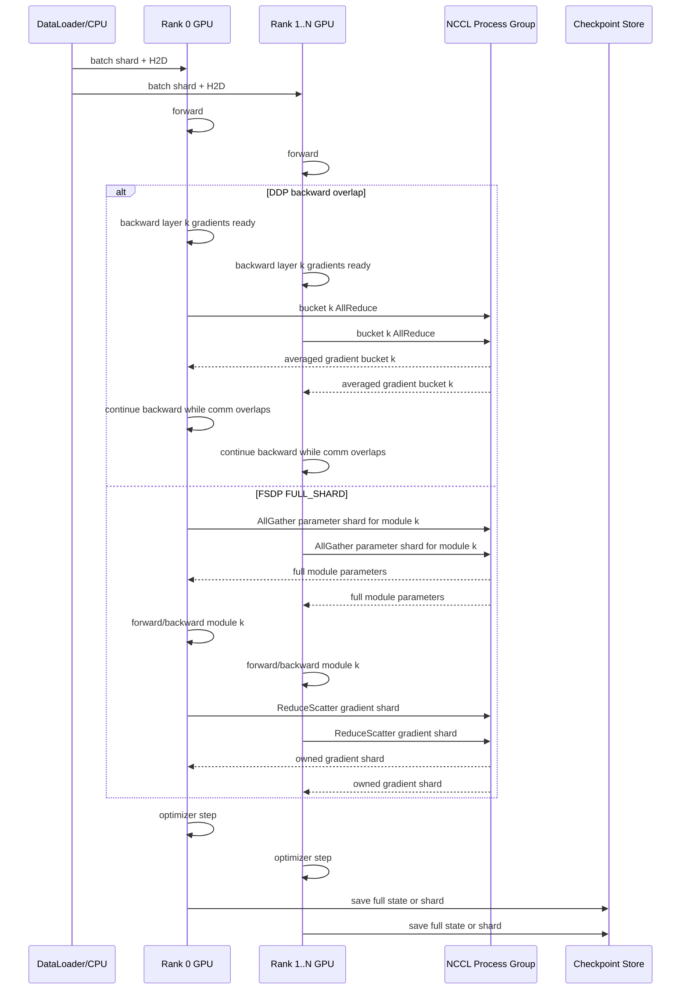

# 第8章：数据并行

> 数据并行的第一性原理是：复制可并行的样本计算，支付保持参数一致的同步成本。工程成败不在于能否启动 64 个 rank，而在于是否能证明每个新增 rank 带来的有效吞吐大于它引入的通信、等待和治理成本。

> **关联章节**：本章以 [第7章](./07-single-node-training.md) 的单节点基线为输入，继续扩展到多节点数据并行；当状态或模型无法再复制时，需要转向 [第9章](./09-model-pipeline-parallel.md) 的 TP / PP / CP / hybrid parallel；checkpoint 的状态一致性和恢复协议见 [第10章](./10-memory-checkpointing-and-recovery.md)。

## 1. 第一性原理拆解 + 学习大纲

### 1.1 拆：不可化简的问题

训练不是单次推理，而是反复估计同一组参数的更新方向。

单个 GPU 的样本吞吐有限。

多个 GPU 可以同时处理不同样本。

但优化器更新必须基于同一个全局梯度视图。

因此，同步数据并行的最小问题是：

```text
复制计算者以提高样本吞吐，同时让所有计算者在 optimizer step 前重新达成参数一致。
```

这句话推出四个必然后果：

1. 每个 rank 必须知道自己处理哪一份数据。
2. 每个 rank 必须在同一个 step 上使用等价的模型状态。
3. backward 产生的局部梯度必须变成全局平均梯度。
4. 任意 rank 变慢、数据倾斜、网络退化都会拖慢整个同步组。

数据并行不是“加卡就加速”。

它是把单节点瓶颈从计算路径延伸到通信路径、状态路径和故障路径。

### 1.2 推：机制如何从问题中长出来

如果完整训练副本能放进每张 GPU，最直接机制是 DDP：复制参数、切分数据、同步梯度。

如果 optimizer state 和 gradient 的重复存储太贵，机制变成 ZeRO-1 / ZeRO-2 或 FSDP `SHARD_GRAD_OP`：切分 optimizer state 或 gradient，用 ReduceScatter / AllGather 替代部分 AllReduce 语义。

如果参数本身也放不下，机制变成 ZeRO-3 或 FSDP `FULL_SHARD`：参数常驻为 shard，在 forward/backward 前后用 AllGather 暂时拼回需要的参数，再释放。

如果单层矩阵计算、流水空泡或超长序列成为瓶颈，数据并行不再是主轴，需要叠加 TP / PP / CP。

### 1.3 学习大纲

读完本章，你应该能回答：

1. DDP、FSDP、ZeRO 分别复制什么、切分什么、通信什么、保存什么。
2. AllReduce、ReduceScatter、AllGather 在 step timeline 中具体发生在哪里。
3. `bucket_cap_mb`、overlap、gradient accumulation、global batch、loss scale 为什么会互相影响。
4. straggler 和 data skew 为什么会让平均 GPU 利用率失真。
5. NCCL ring/tree、rail、NIC、IB/RoCE 如何进入训练 step time。
6. 如何用 NCCL 日志、`nccl-tests`、DCGM、Nsight、rank-level metrics 建立证据链。
7. 什么时候继续 DP，什么时候切 FSDP/ZeRO，什么时候上 TP/PP/CP/hybrid。
8. 如何为 8 节点 64 GPU 作业拆 step time，并定位 NCCL 或数据倾斜问题。

## 2. 概念边界：是什么、不是什么、相邻概念边界

### 2.1 是什么

数据并行是一组训练进程共同训练同一个模型的系统形态。

每个 rank 处理不同数据分片。

每个 rank 在一个同步边界上贡献本地梯度。

训练系统通过 collective communication 让优化器看到等价的全局梯度或等价的分片状态。

工程上，数据并行包括：

- process group 和 rank 管理；
- sampler 和 dataset shard；
- DDP/FSDP/ZeRO 包装；
- gradient bucket 和通信 overlap；
- NCCL 通信域和拓扑绑定；
- checkpoint shard 与恢复元数据；
- straggler、data skew、timeout 的观测和处置。

### 2.2 不是什么

数据并行不是：

- 单卡 OOM 的通用解法；经典 DDP 每卡仍保存完整参数、梯度和优化器状态。
- 网络问题的遮羞布；跨节点后 IB/RoCE/NIC/rail 会直接进入 step time。
- 自动提升 MFU 的按钮；per-rank compute 太小会让通信占比上升。
- 算法 batch 语义的免费扩展；global batch 改变会影响收敛、学习率和 warmup。
- checkpoint 简化器；FSDP/ZeRO 会让 checkpoint 从单文件变成分片状态协议。

### 2.3 相邻概念边界

| 概念 | 解决的问题 | 复制什么 | 切分什么 | 主要通信 | 何时使用 |
|---|---|---|---|---|---|
| DDP | 增加样本吞吐 | 参数、梯度、optimizer state | 数据 | Gradient AllReduce | 模型和训练状态能放进单卡 |
| ZeRO-1 | 减少 optimizer state 冗余 | 参数、梯度 | optimizer state | optimizer state AllGather/partition update | Adam state 顶显存但参数能放下 |
| ZeRO-2 | 减少 optimizer + gradient 冗余 | 参数 | optimizer state、gradient | ReduceScatter + state partition | gradient/optimizer 占用太大 |
| ZeRO-3 | 减少参数 + gradient + optimizer 冗余 | 很少常驻完整状态 | 参数、gradient、optimizer state | AllGather + ReduceScatter | 完整训练副本放不下 |
| FSDP NO_SHARD | PyTorch 包装但不切分 | 同 DDP | 不切 | AllReduce | 迁移或调试 |
| FSDP SHARD_GRAD_OP | PyTorch ZeRO-2 类形态 | 参数 | gradient、optimizer state | ReduceScatter | 参数能放下，状态太大 |
| FSDP FULL_SHARD | PyTorch ZeRO-3 类形态 | 按需临时完整参数 | 参数、gradient、optimizer state | AllGather + ReduceScatter | 参数也需要分片 |
| TP | 单层矩阵放不下或层内算力不足 | 数据并行组外可复制 | tensor dimension | AllReduce/AllGather/ReduceScatter | 优先节点内 NVLink/NVSwitch |
| PP | 层数/整网状态太大 | stage 内参数 | layers | activation send/recv | 模型太深，TP/FSDP 不够 |
| CP | context/attention 维度太大 | 依策略 | sequence/context | KV/attention collective | 长上下文训练 |

边界判断的核心句子：

```text
DP 切样本，FSDP/ZeRO 切训练状态，TP 切层内张量，PP 切层段，CP 切上下文。
```

## 3. 架构：控制路径、数据路径、状态路径、故障路径

### 3.1 责任边界

一个生产级数据并行作业至少有五个责任面：

| 责任面 | 关键对象 | 失败时的典型表现 |
|---|---|---|
| Scheduler | node、GPU、NIC、rank placement | rank 分布跨坏拓扑，P95 step time 上升 |
| Launcher | `torchrun`、Slurm、K8s job、env vars | rendezvous 失败，rank/world size 不一致 |
| Framework | DDP/FSDP/ZeRO、sampler、optimizer | hang、OOM、checkpoint mismatch |
| Communication | NCCL process group、rings、trees、rails | timeout、bus bandwidth 低、collective tail |
| Observability | profiler、NCCL logs、DCGM、dataset metrics | 只能看到“慢”，无法定位根因 |

### 3.2 控制路径

控制路径负责让所有 rank 在同一个训练协议里运行。

```text
scheduler allocates nodes
  -> launcher assigns RANK / LOCAL_RANK / WORLD_SIZE
  -> process group rendezvous
  -> framework wraps model
  -> sampler shards dataset
  -> train loop enters synchronized steps
  -> checkpoint coordinator records global_step and parallel metadata
```

控制路径的关键风险：

- `WORLD_SIZE` 与实际进程数不一致；
- node rank 重复；
- hostname 或 interface 选择错误；
- rank placement 不匹配 GPU-NIC topology；
- elastic restart 后 sampler epoch 或 global step 不一致。

### 3.3 数据路径

数据路径负责保证每个 rank 看到不同且可复现的数据分片。

```text
dataset manifest
  -> DistributedSampler / streaming shard planner
  -> per-rank DataLoader workers
  -> CPU preprocessing / tokenization / packing
  -> pinned memory
  -> H2D copy
  -> forward/backward
```

数据路径不是通信路径的旁支。

它会制造同步等待。

如果 rank 17 因为样本更长、CPU worker 卡住、远端对象存储抖动而慢 200 ms，那么所有 rank 都会在 collective 或下一个 step 同步边界等它。

#### 3.3.1 Sampler 分片协议

DDP/FSDP/ZeRO 不会自动保证“每个 rank 读到不同数据”。这个责任在 sampler 或 streaming shard planner。

普通 map-style dataset 的最小协议是：

```text
global dataset order for epoch e
  -> sampler.set_epoch(e) changes shuffle seed
  -> shard by rank: indices[rank::world_size] or equivalent balanced split
  -> DataLoader yields rank-local batches
  -> all ranks finish the same number of optimizer steps
```

关键边界：

- 每个 epoch 必须在所有 rank 上调用相同的 `set_epoch(epoch)`，否则不同 rank 可能重复样本或 shuffle 不一致。
- `drop_last=True` 常用于训练，目的是让每个 rank 的 batch 数一致；如果不 drop，需要 padding 或 join 协议处理尾部，否则少数 rank 先结束会让其他 rank 卡在 collective。
- 分片不能只看样本数。长文本训练应按 token count、packing 后 non-pad token 或 bucket 预算平衡，否则 rank-local compute 会倾斜。
- 每条日志至少带 `epoch`、`global_step`、`rank`、`dataset_shard`、`sample_tokens`，否则 data skew 很难和 NCCL wait 关联。

Streaming dataset 还要保存 cursor。

```text
manifest digest
  -> stream shard assignment
  -> rank-local object cursor
  -> record offset / byte offset / sample id
  -> packer residual buffer
  -> global optimizer step
```

这里最容易漏的是 packing residual：一个 rank 在 step 结束时可能已经读了下一批 token 的一部分，但还没组成完整 sequence。elastic restart 如果只保存 `global_step`，不保存 stream cursor 和 residual buffer，就可能重复或跳过 token。生产上至少要在 validated checkpoint metadata 里保存 `epoch`、rank-local shard id、stream cursor、packer residual、world size 和 manifest digest；如果 world size 变化，必须通过 reshard 工具重新计算 offset，不能让新 rank 直接继承旧 rank 的局部 cursor。

### 3.4 状态路径

状态路径回答“训练状态在哪里，谁拥有，何时一致”。

| 状态 | DDP | FSDP FULL_SHARD / ZeRO-3 | checkpoint 形态 |
|---|---|---|---|
| Parameters | 每 rank 完整副本 | shard 常驻，计算时 AllGather | full 或 sharded state dict |
| Gradients | 每 rank 完整梯度，AllReduce 后一致 | ReduceScatter 后每 rank 保存 shard | shard + metadata |
| Optimizer state | 每 rank 完整 Adam state | 每 rank 保存 state shard | optimizer shard + param mapping |
| RNG | 每 rank 独立但可恢复 | 同 DDP，需保存 rank/stream | rank-local RNG state |
| Dataset cursor | sampler epoch + offset | 同 DDP | global step + data shard cursor |
| Parallel metadata | process group | group + shard layout | world size、mesh、shard spec |

### 3.5 故障路径

数据并行的故障经常不是立刻报错，而是先表现为慢。

故障路径通常是：

```text
rank-local anomaly
  -> step skew
  -> collective wait
  -> NCCL watchdog timeout or throughput regression
  -> retry / job failure / checkpoint rollback
```

定位时不要从 Python stack trace 开始猜。

先建立证据：

- 哪个 step 开始慢；
- 哪些 rank 慢；
- 是 data time、compute time、NCCL time、optimizer time 还是 checkpoint time；
- 慢 rank 是否集中在同一 node、NIC、rail、rack、dataset shard；
- NCCL 日志中 ring/tree/channel 是否退化；
- DCGM 是否显示 GPU clock、PCIe replay、NVLink error、ECC、XID。

## 4. 原理：从不可化简的问题推导机制

### 4.1 DDP step timeline

DDP 的数学语义是同步 SGD/Adam：每个 rank 计算局部梯度，所有 rank 得到全局平均梯度，然后各自执行相同 optimizer step。

简化公式：

```text
global_grad = average(local_grad_rank_0 ... local_grad_rank_N-1)
```

DDP 不是等 backward 完成后才一次性通信。

PyTorch DDP 会把参数梯度按 bucket 组织。

当某个 bucket 内的梯度都 ready，DDP hook 会启动对应 AllReduce。

理想情况是早期 bucket 的通信被后续 backward compute 掩盖。

真实执行可以把 DDP reducer 看成一个小状态机。

初始化阶段：

```text
rank process group ready
  -> rank 0 broadcasts initial parameters and buffers
  -> DDP walks model parameters in reverse backward-ready order
  -> reducer builds gradient buckets by dtype/device/size
  -> each parameter's AccumulateGrad registers autograd hook
  -> bucket state = pending grads, pending work = none
```

这里的 init broadcast 是语义边界：所有 rank 从同一组参数出发。bucket 构建决定后续通信粒度；`static_graph=True` 依赖每步参数使用路径稳定，否则 reducer 可能要处理 unused parameter 或 rebuild bucket，overlap 会变差。

Backward 阶段：

```text
loss.backward()
  -> autograd computes grad for parameter p
  -> DDP hook marks p.grad ready
  -> reducer copies or aliases grad into bucket view
  -> if all grads in bucket are ready:
       bucket state = ready
       launch async AllReduce(bucket)
       bucket state = in_flight
  -> backward continues computing earlier layers
```

bucket 内最后一个 ready 的梯度决定该 bucket 何时能发出 collective。所有 rank 必须以相同 collective 顺序进入 NCCL；如果 rank 3 的 bucket 12 没 ready，其他 rank 已经 launch bucket 12 的 AllReduce，也只能等它。

Optimizer boundary 是强同步边界：

```text
before optimizer.step()
  -> reducer waits for all in-flight bucket work
  -> AllReduce result is divided by world_size or pre-divided by comm hook
  -> p.grad points to averaged gradient
  -> optional unscale / clipping sees synchronized gradients
  -> optimizer.step() consumes averaged grads
  -> zero_grad prepares next reducer iteration
```

如果使用 `gradient_as_bucket_view=True`，`param.grad` 可能是 bucket buffer 的 view，而不是独立 tensor。好处是少一次 grad copy 和少一份显存；代价是 optimizer、gradient clipping、日志代码不能对 `.grad` 做 `detach_()`、长期保存引用或假设每个 grad storage 独立。`zero_grad(set_to_none=True)` 通常安全，但自定义 optimizer 如果原地替换 `.grad` storage，会破坏下一轮 bucket view 复用。

### 4.2 FSDP / ZeRO step timeline

FSDP/ZeRO 的核心不是“更快同步”，而是“减少常驻冗余状态”。

典型 FULL_SHARD timeline：

1. layer forward 前 AllGather 该 layer 参数 shard；
2. forward 使用临时完整参数；
3. forward 后释放或 reshard 参数；
4. backward 前可能再次 AllGather；
5. backward 得到梯度；
6. ReduceScatter 梯度到 owner rank；
7. 每个 rank 只更新自己拥有的 optimizer state shard；
8. checkpoint 保存 shard 和 layout metadata。

更具体地说，FSDP FULL_SHARD / ZeRO-3 的 per-layer shard lifecycle 是：

```text
steady state:
  each rank owns flat_param_shard[i]
  optimizer owns only local shard state: master weight shard, m shard, v shard

forward(module k):
  pre-forward AllGather flat_param_shard[k] from all ranks
  materialize full flat_param[k] and expose parameter views to module k
  run module k forward
  if reshard_after_forward: free full flat_param[k], keep local shard

backward(module k):
  backward prefetch may AllGather module k-1 or k parameters before use
  materialize full param again if it was resharded after forward
  autograd computes full gradient for module k locally
  ReduceScatter full gradient across ranks
  rank i keeps grad_shard[i] for the flat param it owns
  free full param and full grad buffers

optimizer:
  local optimizer updates only owned param shard and optimizer state shard
  updated shards become the next steady state
```

`flat_param` 是性能和内存管理单位：框架把一个 FSDP unit 内多个原始 parameter flatten 成连续 buffer，再按 rank 切 shard。AllGather 拼出 full flat param 后，原始 parameter view 临时指向 full buffer；reshard 后这些 full view 不能再被用户代码长期引用。

单个 Transformer block 的 mini trace：

```text
Block 12 FSDP unit, world_size=8

forward:
  R0..R7 each holds 1/8 flat_param(Block12)
  AllGather -> every rank materializes full Block12 weight
  run LN -> QKV -> attention -> MLP
  save activations needed by backward
  reshard_after_forward -> free full Block12 weight, keep 1/8 shard

backward, running from last block to first:
  backward_prefetch starts AllGather(Block11) while Block12 backward compute runs
  AllGather(Block12) again if full weight was freed after forward
  compute dW(Block12) on each rank from its local microbatch activations
  ReduceScatter dW(Block12) -> R0 gets grad shard 0, ..., R7 gets grad shard 7
  local optimizer owner updates only its shard of Block12 master/m/v/param
```

ZeRO-3 的语义相同，名字通常是 parameter partition、gathered parameter、release parameter 和 reduce-scatter gradient。FSDP 更强调 wrap unit 和 flat param，DeepSpeed 更强调 partition owner 和 offload/prefetch policy；读 timeline 时应看“谁常驻 shard、谁临时 materialize full、谁拥有 optimizer state”，而不是只看框架名。

### 4.3 DDP / FSDP 通信时间线



### 4.4 AllReduce、ReduceScatter、AllGather 的边界

| Collective | 输入 | 输出 | DDP/FSDP 用途 | 性能敏感点 |
|---|---|---|---|---|
| AllReduce | 每 rank 一个 tensor | 每 rank 得到 reduce 后完整 tensor | DDP 梯度平均 | 大消息带宽、bucket tail、ring/tree 选择 |
| ReduceScatter | 每 rank 一个完整 tensor | 每 rank 得到 reduce 后的一个 shard | ZeRO/FSDP 梯度分片 | shard layout、跨节点带宽、overlap |
| AllGather | 每 rank 一个 shard | 每 rank 得到拼接后的完整 tensor | FSDP/ZeRO-3 参数按需聚合 | 调用频率、prefetch、wrap 粒度 |

AllReduce 可以拆成 ReduceScatter + AllGather。

FSDP/ZeRO-3 显式利用这个拆分：常驻 shard，计算前后做必要 collective。

对同一个 `tensor_bytes = B`、`N` 个 rank 的 ring 近似：

```text
AllReduce bytes_per_rank      ~= 2 * (N - 1) / N * B
ReduceScatter bytes_per_rank  ~=     (N - 1) / N * B
AllGather bytes_per_rank      ~=     (N - 1) / N * B
```

手算例子：`N=8`，`B=1 GiB`，ring 近似每 rank 传输量是：

| Collective | 语义输入/输出 | per-rank bytes | 如果有效 busbw = 100 GiB/s |
|---|---|---:|---:|
| AllReduce | 1 GiB -> 每 rank 得到 reduce 后 1 GiB | `2 * 7/8 * 1 GiB = 1.75 GiB` | `1.75 / 100 = 17.5 ms` |
| ReduceScatter | 1 GiB -> 每 rank 得到 reduce 后 1/8 GiB | `7/8 * 1 GiB = 0.875 GiB` | `0.875 / 100 = 8.75 ms` |
| AllGather | 1/8 GiB -> 每 rank 得到拼接后 1 GiB | `7/8 * 1 GiB = 0.875 GiB` | `0.875 / 100 = 8.75 ms` |

这只是大消息带宽心算，实际还要加 collective latency、拓扑层级、channel 数、rank skew 和与计算 overlap 的部分。

`algbw` 是从 tensor 语义看见的有效算法带宽，`busbw` 是折算到物理链路上的带宽。不同 collective 的 busbw/algbw 换算不同：同样的 1 GiB tensor，AllReduce 在 ring 上物理传输约 1.75 GiB，而 ReduceScatter/AllGather 约 0.875 GiB。于是 `all_reduce_perf` 的 `busbw=100 GiB/s` 和 `all_gather_perf` 的 `busbw=100 GiB/s` 可以说明物理链路利用相近，但不能说 AllReduce 和 AllGather 对训练 step 的 tensor 语义成本相同；也不能把某个 collective 的 `algbw` 拿去估另一个 collective。容量 admission 用 tensor bytes 心算，网络验收用同拓扑 nccl-tests baseline 和 profiler exposed tail 共同判断。

### 4.5 bucket 与 overlap

`bucket` 是通信调度单位。

bucket 太小：

- collective 启动次数多；
- latency 占比高；
- NCCL channel 不能充分吃满带宽。

bucket 太大：

- 早期梯度要等同 bucket 其他梯度；
- overlap 变差；
- step 末尾 tail 变长。

有效调参不看“bucket 越大越好”。

要看 profiler timeline：

```text
healthy: backward compute covers most NCCL kernels
bad-small-bucket: many tiny ncclKernel_AllReduce calls, launch overhead high
bad-large-bucket: backward ends, final bucket still running, exposed tail high
```

### 4.6 gradient accumulation、global batch、loss scale

全局 batch 定义：

```text
global_batch = per_device_batch * world_size * gradient_accumulation_steps
```

如果只增加 `world_size` 而保持其他不变，global batch 会线性变大。

这可能提升系统吞吐，但改变优化算法看到的 batch 语义。

如果要保持 global batch 不变，扩卡后必须降低 per-device batch 或 accumulation。

这会缩短每个 rank 的 compute 时间，使通信更难隐藏。

FP16 训练还要处理 loss scale。

如果某个 rank overflow，生产系统必须明确策略：

- 所有 rank 同步跳过 optimizer step；
- loss scale 更新一致；
- checkpoint 记录 scaler state；
- 不能让部分 rank step、部分 rank skip。

BF16 通常避免动态 loss scaling，但不是免费稳定；activation、optimizer、gradient clipping 仍需一致观测。

完整协议可以写成：

```text
for microstep in 1..grad_accum:
  scale loss by 1 / grad_accum
  if microstep < grad_accum:
    DDP: no_sync() or FSDP/ZeRO defer reduce
    backward accumulates local grads only
  else:
    backward launches gradient communication
    wait for synchronized full grads or reduced grad shards
    unscale FP16 grads
    all-reduce found_inf across ranks
    if found_inf: all ranks skip optimizer.step(), update scaler, zero grads
    else: clip grads with strategy-specific global norm, optimizer.step(), zero grads
```

`no_sync()` 只推迟通信，不推迟本地梯度累加。最后一个 microstep 必须进入同步路径，否则 optimizer 看到的是 rank-local gradient，等价于每个 rank 训练不同模型。

FP16 dynamic loss scaling 的 `found_inf` 必须 all-rank 同步，常见实现是对每 rank 的 overflow flag 做 `MAX` AllReduce。只要一个 rank overflow，所有 rank 都要跳过 optimizer step，并以相同方式更新 loss scale；否则部分 rank 更新参数、部分 rank 不更新，下一轮 collective 即使不 hang，数学状态也已经分叉。

Gradient clipping 也要按并行策略区分：

- DDP：每 rank 在 AllReduce 后持有完整平均梯度，`clip_grad_norm_(model.parameters())` 看到的是 full global grad norm。
- FSDP/ZeRO-2/3：每 rank 只持有 gradient shard 时，不能直接把 local shard norm 当 full norm；需要 shard-aware global norm，通常是各 rank 计算 local squared norm，再 AllReduce sum，取 sqrt 后按同一个 scale 缩放本地 shard。
- 如果 clipping 放在 communication 之前，DDP 会按 rank-local gradient 裁剪，语义不同；除非算法明确需要 local clipping，否则生产默认应在同步或 shard-aware norm 之后裁剪。

skip optimizer 的一致性同样适用于 scheduler、EMA、weight decay、gradient scaler 和 checkpoint step counter。一次 skipped step 不应推进 `global_step` 或保存为 validated checkpoint，除非训练框架把“skip 但 step counter 前进”的语义写入配置并由所有 rank 一致执行。

### 4.7 exposed communication 公式

训练工程里真正伤害吞吐的不是总通信，而是没有被计算覆盖的通信。

本章使用以下公式：

```text
exposed communication = max(comm - overlap, 0)
```

对应 step time 近似：

```text
step_time = data_visible + forward + backward + exposed_communication + optimizer + misc
```

其中：

- `comm` 是 NCCL collective 的总 wall time 或估算时间；
- `overlap` 是这些 collective 与 backward/forward compute 同时发生的部分；
- `exposed_communication` 是 GPU 或训练 loop 明确等待通信完成的 tail。

### 4.8 AllReduce 通信量心算

Ring AllReduce 对每个 rank 的近似传输量：

```text
bytes_per_rank ~= 2 * (N - 1) / N * gradient_bytes
```

通信时间近似：

```text
comm_time ~= bytes_per_rank / effective_bus_bandwidth + collective_latency
```

这不是精确模型，但足够用于 admission。

例子：7B 模型 BF16 gradient 约 `13.4 GB`，64 rank ring AllReduce 每 rank 传输约：

```text
2 * 63 / 64 * 13.4 GB ~= 26.4 GB
```

如果跨节点有效 bus bandwidth 只有 `120 GB/s`，纯通信约 `220 ms`。

如果 profiler 看到 exposed tail 只有 `45 ms`，说明 overlap 大约吃掉了 `175 ms`。

如果 tail 是 `180 ms`，瓶颈不一定是总带宽，也可能是 bucket、rank skew、拓扑或数据等待破坏了 overlap。

## 5. 框架实现：真实旋钮与约束

### 5.1 PyTorch DDP 关键旋钮

| 旋钮 | 作用 | 工程约束 |
|---|---|---|
| `DistributedDataParallel(model, bucket_cap_mb=...)` | 控制 gradient bucket 上限 | 需要用 profiler 验证 tail，不靠默认值迷信 |
| `static_graph=True` | 减少动态图开销，改善 bucket 稳定性 | 只有每步参数使用路径稳定时才能开 |
| `find_unused_parameters=True` | 处理未参与 loss 的参数 | 会增加 autograd traversal，常降低性能 |
| `gradient_as_bucket_view=True` | 减少 gradient copy | optimizer 或代码不能假设独立 grad storage |
| `no_sync()` | gradient accumulation 中跳过中间 AllReduce | 只在最后一个 microstep 同步 |
| `DistributedSampler.set_epoch(epoch)` | 保证 shuffle 可复现且 rank 间不同 | elastic/restart 后必须恢复 epoch/offset |

### 5.2 FSDP 关键旋钮

| 旋钮 | 作用 | 风险 |
|---|---|---|
| `ShardingStrategy.FULL_SHARD` | 参数、梯度、optimizer state 全切分 | AllGather 频繁，wrap 粒度错误会很慢 |
| `SHARD_GRAD_OP` | 梯度和 optimizer state 切分 | 参数仍常驻完整副本 |
| `auto_wrap_policy` | 决定模块 shard 边界 | 太粗 OOM，太细 collective 过多 |
| `backward_prefetch` | backward 中提前 AllGather | 可能增加 HBM 峰值 |
| `limit_all_gathers=True` | 限制 in-flight AllGather | 稳内存但可能降低 overlap |
| `state_dict_type=SHARDED_STATE_DICT` | 分片 checkpoint | 需要恢复工具理解 metadata |
| `use_orig_params=True` | 保持原参数视图 | 某些 optimizer/compile 路径更容易兼容 |

### 5.3 DeepSpeed ZeRO 关键边界

ZeRO 的阶段名称容易被当成性能等级。

生产上应按状态边界选择：

- ZeRO-1：optimizer state shard，适合 optimizer state 是主压力但参数能常驻。
- ZeRO-2：optimizer + gradient shard，适合 DDP 显存紧但不想引入参数 AllGather。
- ZeRO-3：parameter + gradient + optimizer shard，适合模型状态无法复制。
- ZeRO-Offload：把 optimizer 或 parameter 放 CPU/NVMe，解决容量但引入 PCIe/NVMe 延迟，通常不作为吞吐优先方案。

#### 5.3.1 ZeRO 各阶段真实显存节省（Adam BF16 训练，N 个 DP rank）

ZeRO 节省的"几倍"经常被误读。真实的端到端 reduction 来自三类训练状态分别按 N 切分后的总和，不是某个状态内部的节省比例。

**单卡每参数训练状态构成（BF16 训练 + Adam，混合精度 master FP32）**：

| 状态 | 单卡每参数字节 | 备注 |
|---|---:|---|
| 参数（BF16 训练副本） | 2 | forward / backward 用 |
| 梯度（BF16） | 2 | backward 输出 |
| Adam optimizer state（FP32 master + m + v） | 12 | master weight 4 + m 4 + v 4 |
| **小计 / 卡** | **16** | 不含 activation / workspace |

把这 16 bytes/参数 在 N 个 DP rank 之间按 ZeRO 各阶段切分后的真实占用：

| 阶段 | 参数 | 梯度 | Optimizer | 单卡每参数字节 | vs DDP（16） | 端到端 reduction（N=8）|
|---|---|---|---|---:|---|---:|
| DDP（baseline） | 全量 2 | 全量 2 | 全量 12 | **16** | 1× | 1× |
| ZeRO-1 | 全量 2 | 全量 2 | 切分 12/N | **4 + 12/N** | 略小 | N=8 时 5.5 字节 → ~**2.9× reduction** |
| ZeRO-2 | 全量 2 | 切分 2/N | 切分 12/N | **2 + 14/N** | 中 | N=8 时 3.75 字节 → ~**4.3× reduction** |
| ZeRO-3 | 切分 2/N | 切分 2/N | 切分 12/N | **16/N** | 极小 | N=8 时 2 字节 → **8× reduction**（即 ≈ N） |

> [!DANGER]
> **不要把"ZeRO-1 节省 4×"挂在嘴边。** 这种说法源于"optimizer state 切 8 份"的内部视角（12 → 12/8 = 1.5，节省约 8x）。但端到端单卡总占用从 16 降到 5.5，**实际 reduction 只有约 2.9×**（N=8）。容量规划如果按 4× 估算 ZeRO-1，会把"装得下"判断错。同样，ZeRO-2 真实端到端 reduction ≈ 4.3×（不是 8×），ZeRO-3 ≈ N（8 卡时 8×）。

> [!WARNING]
> **以上数字不含 activation**。激活随 batch、sequence length、layer、AC 策略大幅变化，ZeRO 不切 activation（CP / SP 才切）。所以 ZeRO 真正能解决的是"训练状态太大装不下"，对"激活吃满显存"无效——后者要靠 activation checkpointing、AC、BF16 activation、SP/CP。
> **Activation 内存的定量估算和不同 AC 策略对比，参见 [第9章 §4.1.1](./09-model-pipeline-parallel.md#411-activation-内存估算)。**

> [!NOTE]
> **N 越大 ZeRO 收益越大，但通信也成比例增加**。ZeRO-3 在 N=64 时单卡训练状态压到 16/64=0.25 字节/参数，但每个 forward / backward 都要做 AllGather 拉回完整参数 + ReduceScatter 散梯度，对带宽极度敏感。在跨节点带宽不足时（如只有 100Gbps Ethernet），ZeRO-3 的通信开销可能让 step time 比 ZeRO-2 还慢，节省的显存换不到 throughput。生产 64+ 卡 ZeRO-3 通常需要 IB / RoCE 200Gbps+ 或 NVLink 节点内分片。

### 5.4 Launcher 与 NCCL 配置示例

以下示例展示 8 节点 64 GPU 的 DDP launcher 与 NCCL 环境。

具体 interface、HCA 名称要由 `ibdev2netdev`、`nvidia-smi topo -m`、集群布线和运维标准决定。

```bash
#!/usr/bin/env bash
set -euo pipefail

export CUDA_DEVICE_MAX_CONNECTIONS=1
export OMP_NUM_THREADS=8
export TORCH_DISTRIBUTED_DEBUG=DETAIL

# NCCL diagnostics. INFO 用于预发和事故复盘；稳定生产可降为 WARN。
export NCCL_DEBUG=INFO
export NCCL_DEBUG_SUBSYS=INIT,ENV,GRAPH,COLL
export TORCH_NCCL_ASYNC_ERROR_HANDLING=1  # PyTorch ProcessGroupNCCL；旧栈可能仍接受旧 NCCL 变量名
export NCCL_BLOCKING_WAIT=0

# Network binding. 按实际集群替换。
export NCCL_SOCKET_IFNAME=eth0
export NCCL_IB_DISABLE=0
export NCCL_IB_HCA=mlx5_0,mlx5_1,mlx5_2,mlx5_3
export NCCL_IB_GID_INDEX=3          # RoCE 常见；IB 集群按实际 GID 配置
export NCCL_IB_TC=106               # RoCE QoS 示例，需网络团队确认
export NCCL_IB_TIMEOUT=22
export NCCL_IB_RETRY_CNT=7
export NCCL_NET_GDR_LEVEL=2
export NCCL_CROSS_NIC=1
export NCCL_MIN_NCHANNELS=8
export NCCL_MAX_NCHANNELS=32

# Rendezvous.
export MASTER_ADDR="node-0"
export MASTER_PORT="29500"

NODE_RANK="${NODE_RANK:?set by scheduler}"

torchrun \
  --nnodes=8 \
  --nproc_per_node=8 \
  --node_rank="${NODE_RANK}" \
  --rdzv_backend=c10d \
  --rdzv_endpoint="${MASTER_ADDR}:${MASTER_PORT}" \
  train.py \
  --parallel ddp \
  --model 1b-smoke \
  --precision bf16 \
  --seq-len 4096 \
  --micro-batch-size 2 \
  --grad-accum-steps 2 \
  --ddp-bucket-cap-mb 50 \
  --log-rank-metrics \
  --profile-window 100:130
```

这个 DDP launcher 是网络、sampler、NCCL 和日志链路的 smoke test，不是 7B AdamW 训练方案。7B BF16 + AdamW 在 DDP 下单卡状态约 100 GiB，不含 activation；生产基线应切到下面的 FSDP/ZeRO-3 入口，或把 smoke test 模型控制在能完整复制的规模。

FSDP FULL_SHARD 入口示例：

```bash
torchrun --nnodes=8 --nproc_per_node=8 --node_rank="${NODE_RANK}" \
  --rdzv_backend=c10d --rdzv_endpoint="${MASTER_ADDR}:${MASTER_PORT}" \
  train.py \
  --parallel fsdp \
  --fsdp-sharding-strategy full_shard \
  --fsdp-auto-wrap transformer_block \
  --fsdp-backward-prefetch backward_pre \
  --fsdp-limit-all-gathers true \
  --state-dict sharded \
  --precision bf16
```

### 5.5 训练代码中的 DDP 片段

```python
import os
import torch
import torch.distributed as dist
from torch.nn.parallel import DistributedDataParallel as DDP
from torch.utils.data import DataLoader, DistributedSampler


def init_dist():
    dist.init_process_group(backend="nccl")
    local_rank = int(os.environ["LOCAL_RANK"])
    torch.cuda.set_device(local_rank)
    return local_rank, dist.get_rank(), dist.get_world_size()


def wrap_ddp(model, local_rank, bucket_cap_mb):
    model.cuda(local_rank)
    return DDP(
        model,
        device_ids=[local_rank],
        output_device=local_rank,
        bucket_cap_mb=bucket_cap_mb,
        static_graph=True,
        gradient_as_bucket_view=True,
        find_unused_parameters=False,
    )


def train_one_epoch(model, dataset, optimizer, scaler, epoch, args):
    sampler = DistributedSampler(
        dataset,
        num_replicas=dist.get_world_size(),
        rank=dist.get_rank(),
        shuffle=True,
        drop_last=True,
    )
    sampler.set_epoch(epoch)
    loader = DataLoader(
        dataset,
        batch_size=args.micro_batch_size,
        sampler=sampler,
        num_workers=args.num_workers,
        pin_memory=True,
        persistent_workers=True,
        prefetch_factor=4,
    )

    for step, batch in enumerate(loader):
        sync_now = (step + 1) % args.grad_accum_steps == 0
        ctx = model.no_sync() if not sync_now else torch.enable_grad()
        with ctx:
            with torch.autocast("cuda", dtype=torch.bfloat16):
                loss = model(batch.cuda(non_blocking=True)) / args.grad_accum_steps
            loss.backward()

        if sync_now:
            torch.nn.utils.clip_grad_norm_(model.parameters(), args.max_grad_norm)
            optimizer.step()
            optimizer.zero_grad(set_to_none=True)
```

关键点：

- gradient accumulation 的中间 microstep 使用 `no_sync()`；
- loss 除以 accumulation steps，保持梯度尺度；
- BF16 不需要 dynamic loss scale，但 FP16 需要把 scaler state 纳入 checkpoint；
- 每个 rank 的 sampler epoch 必须一致；
- rank-level data time 和 step time 必须打点。

上面的片段是 BF16 简化版。FP16 + DDP 的 optimizer boundary 应显式包含 scaler 和全 rank overflow 同步；下面是协议伪代码，不是可直接复制的完整训练循环：

```python
def sync_found_inf(found_inf: torch.Tensor) -> torch.Tensor:
    dist.all_reduce(found_inf, op=dist.ReduceOp.MAX)
    return found_inf


if sync_now:
    scaler.unscale_(optimizer)
    found_inf = get_local_found_inf_from_scaler(scaler, optimizer)
    global_found_inf = sync_found_inf(found_inf.to("cuda"))

    if global_found_inf.item() == 0:
        torch.nn.utils.clip_grad_norm_(model.parameters(), args.max_grad_norm)
        scaler.step(optimizer)

    # 关键点：update 也必须使用 global_found_inf，而不是每个 rank 的本地 overflow。
    # 实际框架可以把 global flag 写回 scaler 的 found_inf state，或由 rank0 计算
    # new_scale 后 broadcast；不能让无 overflow 的 rank 自己 grow scale。
    scaler_update_with_global_found_inf(scaler, global_found_inf)
    optimizer.zero_grad(set_to_none=True)
```

实际代码应优先使用框架公开 API 或训练库封装；这里展示的是协议边界：unscale 后同步 `found_inf`，所有 rank 对 step/skip 作同一个决定，并且 loss scale update 也必须使用同一个 global overflow 结果。只把 `global_found_inf` 用来跳过 `optimizer.step()` 还不够：如果 `scaler.update()` 仍读取每个 rank 的本地 overflow，某些 rank 会 grow scale、某些 rank 会 backoff，下一轮即使参数还没分叉，AMP 状态也已经分叉。FSDP/ZeRO 场景不要用普通 `clip_grad_norm_` 读 shard 当 full norm，应使用 FSDP/DeepSpeed 提供的 shard-aware clipping 或自己做 squared norm AllReduce。

## 6. NCCL 与网络拓扑：ring/tree、rail、NIC、IB/RoCE、日志证据

### 6.1 Ring 与 Tree

NCCL collective 会基于拓扑构建 ring、tree 或混合算法。

| 算法 | 优势 | 劣势 | 常见场景 |
|---|---|---|---|
| Ring | 大消息带宽利用率高 | latency 随 rank 数和拓扑上升 | 大 gradient bucket、节点内/跨节点大吞吐 |
| Tree / Double Tree | latency 更低 | 对大消息带宽未必最优 | 小消息、跨节点层级拓扑 |
| CollNet / NVLS | 利用交换结构或 NVLink SHARP 类能力 | 依赖硬件和 NCCL 版本 | NVSwitch、特定云/集群环境 |

不要手工指定算法作为第一反应。

先看 NCCL 日志是否识别了正确 GPU、NIC、NVLink、IB/RoCE 路径。

### 6.2 rail、NIC、IB/RoCE

多 rail 是指节点有多张 NIC/HCA 可并行承载通信。

常见问题：

- 所有 rank 只走一张 NIC，另一张空闲；
- GPU 到 NIC 跨 NUMA 或跨 PCIe switch；
- RoCE PFC/ECN 配置不一致导致丢包重传；
- IB 链路降速，例如 HDR/NDR 端口被错误协商到较低速率；
- Kubernetes/容器没有暴露 RDMA device 或 IPC lock 权限不足。

预发必须记录：

```bash
nvidia-smi topo -m
nvidia-smi -q -d CLOCK,PCIE,NVLINK,ECC
ibdev2netdev
ibstat
rdma link
ethtool -S <iface>
numactl --hardware
```

### 6.3 NCCL 日志怎么看

建议事故复盘时保留每个 rank 的 NCCL 日志。

关键证据包括：

- `NCCL INFO Bootstrap`：使用了哪个 interface；
- `NCCL INFO NET/IB`：是否走 IB/RoCE，而不是 socket fallback；
- `Channel xx/yy`：channel 数量是否符合预期；
- `Trees` / `Rings`：拓扑构建是否跨越异常路径；
- `WARN NET/IB`、`unhandled system error`、`connection timed out`：网络或权限问题；
- `Watchdog caught collective operation timeout`：某 collective 等待超时，通常需要结合 rank skew 定位。

示例判断：

```text
证据：NCCL INFO NET/Socket : Using [0]eth0
解释：NCCL 没有走 IB/RoCE，跨节点带宽会显著低于预期。
动作：检查 NCCL_IB_DISABLE、容器 RDMA device、libnccl-net、HCA 名称、GID index。
```

### 6.4 nccl-tests admission

训练前至少跑这些基准：

```bash
# 单节点 8 GPU
./build/all_reduce_perf -b 8M -e 16G -f 2 -g 8
./build/all_gather_perf -b 8M -e 16G -f 2 -g 8
./build/reduce_scatter_perf -b 8M -e 16G -f 2 -g 8

# 多节点由 launcher 启动，每节点 8 GPU，按集群方式传 env。
mpirun -np 64 -N 8 ./build/all_reduce_perf -b 8M -e 16G -f 2 -g 1
```

记录字段：

- alg bandwidth；
- bus bandwidth；
- P50/P95；
- message size sweep；
- rank/node mapping；
- NCCL/CUDA/driver 版本；
- HCA/rail/interface。

Admission 不是追求理论峰值。

目标是发现 socket fallback、单 rail、链路降速和跨 NUMA placement。

## 7. 工程化落地：配置、版本矩阵、准入、preflight、发布、观测、治理

### 7.1 版本矩阵

生产平台不要只记录镜像 tag。

至少记录：

| 组件 | 必记字段 | 为什么重要 |
|---|---|---|
| GPU driver | version、CUDA compatibility | driver/CUDA/NCCL 组合影响通信 |
| CUDA runtime | version | PyTorch wheel 和 NCCL ABI 依赖 |
| PyTorch | version、commit、build CUDA | DDP/FSDP 行为和 bugfix 变化 |
| NCCL | version、plugin | ring/tree、IB、NVLS、async error 行为变化 |
| OFED / rdma-core | version | IB/RoCE 设备和 verbs 行为 |
| Firmware | NIC firmware、GPU VBIOS | 链路稳定性和降速问题 |
| Kernel | version、sysctl | RoCE、cgroup、IPC lock、hugepage 影响 |
| Scheduler | Slurm/K8s plugin version | GPU/NIC 拓扑和 device injection |

### 7.2 作业准入

一个多节点 DP 作业进入生产队列前，应满足：

- 第7章单节点 baseline 已通过，且证据包包含 tokens/s、MFU、HBM、data wait、checkpoint time。
- 模型状态账本明确：DDP/FSDP/ZeRO 每卡常驻内存低于 admission 上限。
- `nccl-tests` 在目标节点池通过，bus bandwidth 不低于平台基线阈值。
- dataset shard 计划可复现，样本长度分布已检查。
- global batch、LR scaling、warmup、gradient accumulation 已由算法 owner 签字。
- checkpoint 格式与并行策略匹配。
- observability 包含 rank-level step breakdown。

### 7.3 持久化生产配置示例：`train_config.yaml`

生产作业不能只靠 launcher 参数和临时环境变量复现。

平台应持久化一份经过 admission 的训练配置，把并行策略、batch 语义、NCCL env policy、preflight gate、rollback gate 和 checkpoint schema 固定下来。

示例：

```yaml
run:
  name: llama7b-fsdp-64gpu-bf16
  owner: pretrain-platform
  image_digest: sha256:9b1c...f43a
  version_matrix:
    pytorch: 2.4.1+cu124
    cuda_runtime: 12.4
    nccl: 2.21.5
    driver: 550.54.15
    ofed: 24.04-0.6.6.0

parallel:
  mode: fsdp_full_shard
  world_size: 64
  nnodes: 8
  nproc_per_node: 8
  fsdp:
    auto_wrap_policy: transformer_block
    backward_prefetch: backward_pre
    limit_all_gathers: true
    state_dict_type: sharded

batch:
  sequence_length: 4096
  micro_batch_per_gpu: 2
  gradient_accumulation_steps: 16
  global_batch_sequences: 2048
  token_accounting: non_pad_tokens

precision:
  compute: bf16
  gradients: bf16
  optimizer_state: fp32
  fp16_loss_scale: disabled

nccl_env_policy:
  debug_level_for_preflight: INFO
  production_debug_level: WARN
  require_rdma: true
  allow_socket_fallback: false
  required_hcas: [mlx5_0, mlx5_1, mlx5_2, mlx5_3]
  env:
    NCCL_IB_DISABLE: "0"
    NCCL_CROSS_NIC: "1"
    TORCH_NCCL_ASYNC_ERROR_HANDLING: "1"
    NCCL_NET_GDR_LEVEL: "2"

preflight_gates:
  steps: 300
  min_p50_non_pad_tokens_per_s: 700000
  min_p95_weak_scaling_efficiency: 0.85
  max_nccl_exposed_tail_ratio_p95: 0.08
  max_rank_step_skew_p95: 1.12
  max_data_visible_wait_ratio_p95: 0.05
  max_hbm_p95_gib: 68

rollback_gates:
  max_tokens_s_regression_ratio: 0.10
  max_nccl_exposed_tail_ratio_p95: 0.10
  max_rank_step_skew_p95: 1.15
  max_data_visible_wait_ratio_p95: 0.05
  require_loss_parity: true

checkpoint_schema:
  type: torch_distributed_sharded
  schema_version: dp-fsdp-v3
  save_rng_state: true
  save_sampler_state: true
  save_optimizer_state: true
  save_scaler_state: false
  required_metadata:
    - global_step
    - world_size
    - process_mesh
    - shard_layout
    - sampler_epoch
    - sampler_cursor
    - packer_residual_digest
    - dataset_manifest_digest
```

这里的 batch 字段对应第 10 节 worked example 的阶段 A：`2 * 16 * 64 = 2048 sequences`，用于系统 weak scaling 和通信效率验收。它不是 loss parity 阶段的配置；如果做阶段 B，应把 `gradient_accumulation_steps` 改成 `1`，并把 `global_batch_sequences` 改成 `128`，同时记录 LR/warmup 策略差异。

这份配置不是为了替代训练代码，而是为了让平台 admission、preflight、发布、rollback gate 和 checkpoint schema 使用同一份事实来源。

### 7.4 TorchElastic restart 与 rendezvous 边界

TorchElastic 解决的是“训练进程组如何重新 rendezvous，并从一致 checkpoint 恢复继续跑”。

它不能自动修复模型数学状态，也不能让没有保存的进度凭空回来。

典型启动方式：

```bash
torchrun \
  --nnodes=8:8 \
  --nproc_per_node=8 \
  --rdzv_backend=c10d \
  --rdzv_id="${JOB_ID}" \
  --rdzv_endpoint="${MASTER_ADDR}:29500" \
  --max_restarts=3 \
  --monitor_interval=5 \
  train.py \
  --config train_config.yaml \
  --resume auto
```

TorchElastic 能覆盖的边界：

- 单个 worker 进程退出后，launcher 重新拉起整组或局部 worker；
- 节点短暂抖动后，所有 rank 重新 rendezvous；
- 从最近一次完整 checkpoint 恢复模型、optimizer、scheduler、RNG、sampler 和 FSDP/ZeRO shard metadata；
- 在固定 `nnodes=8:8` 的配置下保持 world size 不变，降低 checkpoint layout 变化风险。

TorchElastic 不能覆盖的边界：

- 没有写入 checkpoint 的 step 会丢失；RPO 由 checkpoint 频率决定；
- checkpoint schema 不完整时，无法恢复 sampler cursor、loss scaler、RNG 或 FSDP shard layout；
- world size 改变后，旧 shard layout 不一定能直接恢复，除非平台提供 reshard/conversion 工具；
- NCCL fabric 持续故障、数据 shard 永久不可读、代码 deterministic bug 不会因 restart 消失；
- 某些 rank 已经执行 optimizer step、另一些 rank 未执行的 partial step 不能被“继续跑”修复，必须回滚到上一个一致 checkpoint。

因此，elastic restart 是恢复编排能力，不是状态一致性协议本身。

一次 collective hang 到 rollback 的状态机通常是：

```text
all ranks enter step S
  -> rank 17 fails before collective seq=812
  -> ranks 0..16,18..63 enter seq=812 and wait
  -> ProcessGroupNCCL watchdog observes timeout
  -> async error is recorded and communicators abort
  -> launcher kills remaining workers
  -> rendezvous starts a fresh worker group
  -> training code loads last validated checkpoint C
  -> sampler/RNG/optimizer/scaler/FSDP shard metadata restore from C
  -> any partial work from steps C+1..S is discarded
```

`seq num` 是排障线索，不是恢复点。它告诉你哪些 rank 进入了哪个 collective，帮助找第一个缺席 rank；恢复仍只能从上一个 validated checkpoint 开始。

validated checkpoint 的意思是：所有 rank 完成同一个 optimizer boundary，checkpoint metadata 写完并通过基本校验。以下状态不能作为恢复基准：

- 某些 rank 已经 ReduceScatter 完梯度，另一些 rank 还没进入 collective；
- 某些 rank 已经 `optimizer.step()`，另一些 rank 因 overflow、OOM 或 timeout 未 step；
- sharded optimizer state 写了一部分对象，但 metadata 没有 commit；
- streaming sampler cursor 已推进，但 model/optimizer checkpoint 没有对应推进。

partial optimizer step 必须丢弃。最实用的做法是把 checkpoint commit 设计成两阶段：先写 rank-local shard 到临时路径，再由 coordinator 写 `latest_metadata.json` 或等价 commit marker。elastic resume 只认 commit marker，不扫描“看起来最新”的分片文件。

### 7.5 Preflight

建议每个正式作业先跑 100 到 300 step preflight。

必须输出：

```text
step_time_p50_ms
step_time_p95_ms
data_visible_wait_p95_ms
forward_backward_p50_ms
nccl_total_p50_ms
nccl_exposed_tail_p95_ms
optimizer_p50_ms
rank_step_skew_p95
tokens_per_second_non_pad
global_batch
samples_per_rank
hbm_p95_per_gpu
nccl_busbw_allreduce_gbps
checkpoint_dry_run_seconds
```

Preflight 失败不应只给“任务失败”。

要自动分类：

- memory admission failed；
- NCCL baseline failed；
- data skew failed；
- rank straggler failed；
- checkpoint dry-run failed；
- convergence sanity failed。

### 7.6 发布与回滚

DP 配置发布要像服务配置发布一样治理。

推荐策略：

1. 单节点 baseline；
2. 2 节点 16 GPU smoke；
3. 8 节点 64 GPU preflight；
4. 生产长跑；
5. 每次只改变一个主变量，例如 bucket、NCCL env、parallel strategy、batch policy。

回滚条件示例：

- steady-state tokens/s 低于上一版本 10%；
- NCCL exposed tail P95 高于 step time 的 10%；
- rank skew P95 大于 1.15；
- data visible wait P95 大于 5% step time；
- checkpoint dry run 超过 RTO 预算；
- loss parity 与 baseline 偏离超过算法阈值。

### 7.7 观测

DP dashboard 至少分四层：

| 层 | 指标 | 目标 |
|---|---|---|
| Training | non-pad tokens/s、loss、grad norm、global batch | 判断训练有效进展 |
| Step breakdown | data、fwd/bwd、NCCL total、NCCL exposed、optimizer | 判断瓶颈位置 |
| Rank skew | per-rank step P50/P95、data time、sample length | 找 straggler/data skew |
| Fabric | NCCL busbw、IB port xmit/rcv、retransmit、GPU-NIC topo | 找网络退化 |
| GPU | SM active、tensor active、HBM、clock、NVLink error、XID | 找硬件/内核问题 |

日志必须带这些标签：

```text
run_id, job_id, global_step, rank, local_rank, node, gpu_uuid, hca, rail, dataset_shard, sample_tokens, parallel_mode
```

### 7.8 Governance

平台需要把“经验调参”变成可审计策略：

- NCCL env 由平台模板管理，用户可覆盖但必须记录 diff；
- rank placement 策略由 scheduler plugin 或 admission controller 约束；
- 多节点作业必须保存 preflight 证据包；
- FSDP/ZeRO checkpoint schema 需要版本化；
- data skew 超阈值应阻止进入长跑；
- 事故复盘要能关联 NCCL 日志、scheduler placement、dataset shard 和 checkpoint metadata。

## 8. 容量与效率模型

### 8.1 状态容量

DDP 每卡训练状态近似：

```text
state_per_gpu_ddp = params + grads + optimizer_states
```

BF16 参数 + BF16 梯度 + AdamW FP32 master/m/v 约：

```text
bytes_per_param ~= 2 + 2 + 12 = 16 bytes
```

7B 模型参数相关状态约：

```text
6.7e9 * 16 bytes ~= 107.2 GB ~= 99.8 GiB
```

这解释了为什么第7章接受的 LLaMA-7B 单节点 baseline 使用 FSDP/ZeRO-style state sharding，而不是朴素 DDP。

### 8.2 FSDP/ZeRO 分片容量

粗略估算：

```text
state_per_gpu_sharded ~= (params + grads + optimizer_states) / shard_world_size + live_allgather_params + activations + temp + fragmentation
```

`live_allgather_params` 取决于 wrap policy、prefetch、是否 reshard after forward。

它不是零。

因此 FULL_SHARD 的 admission 必须用 profiler 或 memory snapshot 验证 HBM P95，而不是只做 `/ world_size` 心算。

### 8.3 扩展效率

弱扩展口径：每卡 batch 不变，global batch 随 GPU 数增长。

```text
weak_scaling_efficiency = throughput_N / (N * throughput_1)
```

强扩展口径：global batch 固定，每卡工作量随 GPU 数下降。

```text
strong_scaling_efficiency = step_time_1 / (N * step_time_N)
```

两者不能混用。

DP 扩展报告必须同时记录：

- per-device batch；
- gradient accumulation；
- global batch；
- sequence length；
- non-pad token ratio；
- precision；
- parallel mode；
- rank count。

### 8.4 有效 step time 模型

本章的生产估算模型：

```text
step_time = max_rank(data_visible + compute + exposed_communication + optimizer + misc)
exposed communication = max(comm - overlap, 0)
```

`max_rank` 不能省略。

同步训练的 step time 由最慢 rank 决定。

### 8.5 Straggler 与 data skew 模型

rank skew：

```text
rank_step_skew = p95(step_time_by_rank) / p50(step_time_by_rank)
```

样本长度倾斜：

```text
sample_token_skew = p95(non_pad_tokens_by_rank) / p50(non_pad_tokens_by_rank)
```

如果 `rank_step_skew` 和 `sample_token_skew` 同时上升，优先查 dataset packing/sharding。

如果 `rank_step_skew` 上升但 token skew 正常，优先查硬件、CPU、I/O、GPU clock、NIC、NCCL path。

## 9. 故障排除：症状、证据、根因、动作

### 9.1 排障原则

先确定慢在哪里。

不要直接调 bucket 或换 NCCL env。

按下面顺序收敛：

1. 单节点 baseline 是否仍健康；
2. 多节点 `nccl-tests` 是否健康；
3. 训练 profiler 中 NCCL 是 total 高还是 exposed tail 高；
4. 慢 rank 是否固定；
5. 慢 rank 是否对应同一 dataset shard、node、GPU、NIC、rail；
6. checkpoint/logging/eval 是否混进 step time；
7. 最近变更是否涉及 image、driver、NCCL、dataset、batch、bucket、parallel strategy。

### 9.2 Troubleshooting table

| 症状 | 证据 | 可能根因 | 动作 |
|---|---|---|---|
| NCCL timeout | `Watchdog caught collective operation timeout`，某 collective seq num 卡住，部分 rank 无后续日志 | 某 rank 先崩、data loader 卡死、网络连接断、IB/RoCE 丢包、进程组不一致 | 收集所有 rank 日志；按 seq num 找第一个缺席 rank；检查 dmesg/XID/IB counters；开启 `TORCH_NCCL_ASYNC_ERROR_HANDLING=1`；修复 rank-local 根因后重跑 |
| low bus bandwidth | `nccl-tests` busbw 只有平台基线 40%-60%，NCCL 日志显示 Socket 或单 HCA | RDMA device 未注入、`NCCL_SOCKET_IFNAME` 错、`NCCL_IB_HCA` 错、单 rail、链路降速、跨 NUMA | 跑 `ibdev2netdev`、`ibstat`、`nvidia-smi topo -m`；修 HCA/env/device plugin；验证 all_reduce/all_gather/reduce_scatter |
| rank straggler | per-rank step P95 中某 rank 持续慢 10%+，sample token skew 正常 | GPU 降频、ECC/XID、CPU steal、NUMA 错、PCIe/NVLink error、NIC 拥塞 | 查 DCGM clock/throttle、`nvidia-smi -q`、host CPU、IB port counters；隔离节点；重排 rank placement |
| data skew | rank data time 和 sample tokens 同时倾斜，长样本集中在少数 rank | shard 不是按 token 平衡、packing 不均、远端数据分片热点、worker 数不足 | 按 non-pad tokens 做 batch/pack 平衡；记录 per-rank sample length；重建 manifest；加缓存或调整 worker/prefetch |
| exposed NCCL tail 高 | profiler 显示 backward 后 NCCL 仍运行，GPU idle | bucket 太大、gradient ready 顺序差、dynamic graph、FSDP wrap 太粗、straggler 破坏 overlap | sweep `bucket_cap_mb`；打开 `static_graph` 前验证图稳定；调整 FSDP wrap；先排 rank skew |
| AllGather 频繁小包 | FSDP timeline 里大量短 AllGather，NCCL launch overhead 高 | wrap policy 太细、prefetch 配置不当、module 边界碎 | 按 transformer block wrap；合并小模块；验证 HBM 峰值后调 prefetch |
| OOM only at scale | 单节点不 OOM，多节点或 FSDP prefetch 后 OOM | live AllGather 参数增多、bucket buffer、activation 随 batch 改变、fragmentation | 降 microbatch；`limit_all_gathers=True`；调 wrap；记录 memory snapshot；避免同时增 world size 和 batch |
| loss diverges after scaling | 吞吐提高但 loss parity 破坏 | global batch 变大、LR/warmup 未调整、FP16 loss scale 不一致、gradient clipping 时机错误 | 固定 global batch 做 A/B；同步 scaler state；检查 loss 除以 accumulation；算法 owner 审核 LR policy |
| checkpoint restore mismatch | FSDP/ZeRO 恢复后参数 key 或 shard shape 不一致 | checkpoint metadata 缺 parallel layout、world size 变化未转换、state_dict 类型混用 | 使用 sharded checkpoint API；保存 mesh/shard spec；恢复前做 metadata validation |

### 9.3 证据采集包

一次 DP 事故复盘至少保存：

```text
logs/
  rank-0000.stdout
  rank-0000.nccl.log
  ...
profiles/
  torch-profiler-step-100-130.json
  nsys-node-3-rank-24.qdrep
metrics/
  rank_step_breakdown.parquet
  dcgm.csv
  ib_counters.txt
  nccl_tests_before.txt
  nccl_tests_after.txt
config/
  launcher.env
  train_config.yaml
  image_digest.txt
  placement.json
  dataset_manifest_digest.txt
checkpoint/
  latest_metadata.json
```

没有 rank 粒度证据的“网络慢”结论不可接受。

## 10. 方案设计 / Worked Example：8 节点 64 GPU

### 10.1 输入基线

第7章给出的单节点 LLaMA-7B accepted baseline：

| Metric | Accepted baseline | 口径 |
|---|---:|---|
| Raw sequence slots/s | 118,751 | 8 GPU aggregate，fixed dense slots |
| Compute tokens/s | 118,751 | padding 仍执行 dense MLP/norm |
| Effective non-pad tokens/s | 95,000 | 8 GPU aggregate，排除 padding |
| Loss tokens/s | 93,600 | shifted `labels != -100` |
| MFU | 48.3% | `6N_p` FLOPs/token |
| HFU | 75.4% | dense compute slots，checkpointing 后约 `7.5N_p` actual FLOPs/token |
| HBM P95 | 63 GiB/GPU | 低于 68 GiB admission 上限 |
| DataLoader visible wait | 3% | steady-state profiler window |
| Checkpoint time | 18 s / 1000 steps | 单独拆出，不混入稳态 step |

目标：扩展到 8 节点 64 GPU，训练同一个 LLaMA-7B BF16 baseline。

硬件假设：

- 每节点 8xH100 SXM 80GB；
- 节点内 NVSwitch；
- 每节点 4x400Gb/s NDR IB 或等价 RoCE rail；
- GPUDirect RDMA 可用；
- 样例版本 tuple：PyTorch 2.4.1 + CUDA 12.4 + NCCL 2.21.5 + NVIDIA driver 550.54.15 + OFED 24.04。

这个 tuple 只是 worked example 的可复现样例。

真实生产必须把 PyTorch、CUDA、NCCL、driver、OFED、NIC firmware 和 scheduler plugin 固定在平台 version matrix 中，并把镜像 digest 写入 `train_config.yaml` 或等价 admission record。

### 10.2 并行策略选择

朴素 DDP 不通过容量 admission。

原因：7B BF16 + AdamW 参数相关状态约 100 GiB/GPU，不含 activation。

采用 FSDP FULL_SHARD 或 ZeRO-3 作为 DP-family baseline：

```text
parallel_mode = FSDP FULL_SHARD
shard_world_size = 64
node_local_topology = NVSwitch
cross_node_collective = NCCL over IB/RoCE
checkpoint = sharded state dict
```

这里的 `shard_world_size=64` 不是“把第7章单节点 FSDP 除以 8 再线性扩展”。64-way FULL_SHARD 会让参数 AllGather 和梯度 ReduceScatter 跨节点进入 IB/RoCE critical path，wrap 粒度、prefetch、bucket 和 rank placement 都会改变 step time。真实 admission 至少要比较三档：

| 方案 | shard group | 容量收益 | 通信路径 | 适用判断 |
|---|---|---|---|---|
| 单节点 FULL_SHARD | 8 GPU/node | 中 | NVSwitch 内 | 第7章 baseline，验证模型可训和 dtype policy |
| 64-way FULL_SHARD | 64 GPU | 高 | NVSwitch + IB/RoCE | 状态压力最大、网络足够强且 overlap 证据好 |
| HYBRID_SHARD | node-local shard + cross-node replicate/sync | 中高 | 参数聚合多在节点内，跨节点做 DP 同步 | HBM 足够但跨节点 AllGather tail 过高 |

如果 64-way FULL_SHARD 的 exposed AllGather P95 超过预算，不应只调 NCCL env；先评估 HYBRID_SHARD 或 ZeRO-2/3 的分组策略，确认容量和通信哪个是主约束。

为什么不立刻上 TP/PP：

- 7B 模型层内计算和整网深度在 64xH100 上不是容量主问题；
- TP 会给每层引入更频繁节点内 collective；
- PP 会引入 microbatch bubble 和 checkpoint layout 复杂度；
- 当前目标是验证从单节点到 8 节点的数据并行扩展，而不是为 70B/405B 设计 3D parallel。

如果后续序列长度升到 32K/128K 或模型升到 70B，应转入第9章的 TP/PP/CP/hybrid 设计。

### 10.3 Batch 与样本口径

单节点 baseline 假设：

```text
seq_len = 4096
micro_batch_per_gpu = 2
grad_accum = 16
world_size = 8
global_batch_sequences = 2 * 16 * 8 = 256 sequences
```

64 GPU 如果保持 microbatch 和 accumulation 不变：

```text
global_batch_sequences = 2 * 16 * 64 = 2048 sequences
```

这改变算法 batch。

本 worked example 选择两阶段：

| 阶段 | per GPU microbatch | grad accum | world size | global sequences | 目的 |
|---|---:|---:|---:|---:|---|
| A: system scaling | 2 | 16 | 64 | 2048 | 测 weak scaling 和通信效率，沿用第7章每 rank accumulation |
| B: loss parity | 2 | 1 | 64 | 128 | 接近较小 global batch，观察收敛 |

若算法要求严格保持第7章的 256 sequences，则 64 GPU 下 `grad_accum=2` 得到 256 sequences。若要求更小的 64 sequences，64 GPU 下 `microbatch=1, grad_accum=1` 仍有 64 sequences，但每 rank compute 变短，通信暴露会明显上升。

降低 microbatch 会缩短 compute，通信暴露可能上升。

这就是系统效率和优化语义的真实冲突。

### 10.4 Step time decomposition

以阶段 A 为例，单节点 baseline 的有效吞吐是 95,000 non-pad tokens/s。

弱扩展理想吞吐：

```text
ideal_64gpu_tokens_s = 95,000 * 8 = 760,000 non-pad tokens/s
```

假设 64 GPU preflight 实测：

| Component | P50 ms | P95 ms | 证据来源 |
|---|---:|---:|---|
| data visible wait | 35 | 70 | rank-level dataloader timer |
| forward + backward compute | 5,680 | 6,000 | torch profiler CUDA timeline，16 个 accumulation microstep |
| FSDP AllGather total | 760 | 960 | NCCL range + profiler，按 microstep 聚合 |
| ReduceScatter total | 620 | 840 | NCCL range + profiler，按 microstep 聚合 |
| other NCCL / barriers | 25 | 45 | profiler |
| communication total | 1,405 | 1,845 | summed NCCL kernels |
| overlap with compute | 1,125 | 1,365 | timeline intersection |
| exposed communication | 280 | 480 | `max(comm - overlap, 0)` |
| optimizer | 115 | 140 | optimizer timer |
| misc/logging | 25 | 40 | training loop timer |
| step time | 6,135 | 6,730 | max rank optimizer-step timer |

P50 step 模型：

```text
step_time = data_visible + compute + exposed_communication + optimizer + misc
          = 35 + 5680 + 280 + 115 + 25
          = 6135 ms
```

每 step token 数估算：

```text
sequences_per_step = 2 * 16 * 64 = 2048
raw_tokens_per_step = 2048 * 4096 = 8,388,608
non_pad_ratio = 0.60
non_pad_tokens_per_step = 5,033,165
throughput = 5,033,165 / 6.135 ~= 820,000 non-pad tokens/s
```

弱扩展效率：

```text
weak_scaling_efficiency = 820,000 / 760,000 = 107.9%
```

这个数字看起来过高，必须做 sanity check。

可能原因：

- 单节点 baseline 是保守 acceptance，不是极限；
- 64 GPU global batch 更大，compute 更容易饱和；
- non-pad ratio 或 step 口径可能不一致；
- checkpoint/eval/logging 是否被排除要核对。

保守验收应同时看 P95：

```text
throughput_p95 ~= 5,033,165 / 6.730 = 748,000 non-pad tokens/s
p95_efficiency = 748,000 / 760,000 = 98.4%
```

生产 acceptance 可以设置为：

| Metric | Gate |
|---|---:|
| P50 non-pad tokens/s | >= 700,000 |
| P95 weak scaling efficiency | >= 85% |
| exposed communication P95 / step time P95 | <= 8% |
| rank step skew P95 | <= 1.12 |
| data visible wait P95 | <= 5% step time |
| HBM P95 | <= 68 GiB/GPU |
| checkpoint dry run | <= 120 s for sharded save |

### 10.5 NCCL troubleshooting in the worked example

故障版本实测：

| Component | Healthy P95 | Bad P95 |
|---|---:|---:|
| communication total | 1,845 ms | 2,620 ms |
| overlap | 1,365 ms | 1,590 ms |
| exposed communication | 480 ms | 1,030 ms |
| exposed / step | 7.1% | 14.1% |
| step time | 6,730 ms | 7,300 ms |
| tokens/s P95 | 748,000 | 690,000 |
| rank skew P95 | 1.10 | 1.28 |

证据：

```text
NCCL INFO NET/Socket : Using [0]eth0
NCCL INFO NET/IB : No device found.
all_reduce_perf busbw 48 GB/s, platform baseline 125 GB/s
```

解释：NCCL fallback 到 socket 或 RDMA device 未注入。

动作：

1. 检查容器是否挂载 `/dev/infiniband`；
2. 检查 `NCCL_IB_DISABLE=0`；
3. 检查 `NCCL_IB_HCA` 与 `ibdev2netdev` 输出一致；
4. 检查 RoCE `GID_INDEX`；
5. 修复后重跑 `all_reduce_perf`、`all_gather_perf`、`reduce_scatter_perf`；
6. 再跑 300 step preflight，不直接恢复长跑。

### 10.6 Data-skew troubleshooting in the worked example

另一种故障：NCCL bus bandwidth 正常，但 P95 step time 抖动。

证据：

```text
rank_step_skew_p95 = 1.24
sample_token_skew_p95 = 1.21
data_visible_wait_p95 rank 39 = 310 ms
rank 39 dataset_shard = shard-0187
shard-0187 non_pad_ratio p95 = 0.91, fleet p50 = 0.59
```

解释：packing/sharding 按样本数均分，但没有按 token 数均衡。

动作：

1. dataset manifest 增加 token_count；
2. shard planner 按 token budget 而不是 sample count 分配；
3. batch 内 sequence packing 设置 max token bucket；
4. 每 step 上报 per-rank non-pad tokens；
5. 重新 preflight，要求 `sample_token_skew_p95 <= 1.08`。

### 10.7 决策复盘

本 64 GPU 方案接受 FSDP FULL_SHARD 的理由：

- 经典 DDP 不满足每卡 HBM admission；
- FSDP/ZeRO-3 保持 DP-family 的样本切分语义；
- 7B 不需要 TP/PP 才能放下；
- sharded checkpoint 与第10章恢复协议兼容；
- 主要风险是 AllGather/ReduceScatter 暴露通信，能通过 NCCL + overlap 证据治理。

不接受纯 DDP 的理由：

- 参数相关状态约 100 GiB/GPU；
- 即使用 80GB H100，也没有 activation/temp/fragmentation 空间；
- OOM 后再调 batch 不解决 optimizer state 常驻问题。

不接受 TP/PP 先行的理由：

- 引入额外通信域和 checkpoint layout；
- 对当前 7B 目标复杂度过高；
- 应保留给 70B/405B 或长上下文任务。

## 11. 决策边界：DP vs FSDP/TP/PP/CP/hybrid

### 11.1 选择流程

```text
1. 单节点 baseline 是否健康？
   no -> 回第7章修数据、显存、kernel、checkpoint
   yes -> 继续

2. 完整 DDP 训练状态能否放进每 GPU admission 上限？
   yes -> DDP 优先
   no -> FSDP/ZeRO

3. FSDP/ZeRO 后单层 compute 或 activation 是否仍超 HBM？
   yes -> TP 或 CP
   no -> 继续

4. 模型层数/总参数是否需要跨 stage 放置？
   yes -> PP + DP/FSDP/TP
   no -> 继续

5. 上下文长度是否导致 attention/KV/activation 主导？
   yes -> CP/SP + hybrid
   no -> DP-family 足够

6. 网络是否支持目标 collective？
   no -> 降规模、改拓扑、换并行策略或先修 fabric
```

### 11.2 决策表

| 现象 | 证据 | 推荐方向 | 不推荐 |
|---|---|---|---|
| 单节点 MFU 低 | 第7章 baseline MFU < 35%，data wait 高 | 先修单节点 | 直接扩 DP |
| DDP OOM | 参数+grad+Adam state > HBM admission | FSDP/ZeRO-2/3 | 只降低 microbatch |
| NCCL tail 主导 | exposed communication > 20% step | bucket/overlap/topology，必要时减少 DP degree | 盲目加节点 |
| 单层 GEMM/activation 放不下 | FSDP 后仍 OOM，层内峰值高 | TP/SP | 继续加 DP |
| pipeline 可按层切 | 70B/405B，整网状态太大 | PP + TP + DP/FSDP | 纯 FSDP 跨过大 world |
| 长上下文爆炸 | attention/KV/sequence activation 主导 | CP/SP + TP/FSDP | 只切 optimizer state |
| 网络弱 | 100GbE 且大模型梯度通信重 | 减少跨节点 DP，更多节点内并行或换 fabric | 大 world DDP |

### 11.3 Hybrid 的边界

Hybrid parallel 不是把所有并行维度打开。

它应该是最小满足约束的组合：

```text
capacity constraints -> choose FSDP/ZeRO/TP/PP/CP
throughput constraints -> choose DP degree and microbatch
fabric constraints -> bind TP intra-node, DP/FSDP cross-node carefully
recovery constraints -> choose checkpoint schema and shard ownership
```

每增加一个维度，都要增加：

- process group 数量；
- rank placement 规则；
- checkpoint metadata；
- restore conversion 工具；
- profiler 分析复杂度；
- failure blast radius。

## 12. 反模式

| 反模式 | 表现 | 后果 | 修正 |
|---|---|---|---|
| 单节点没验收就扩 | 多节点慢但不知道慢在哪里 | 把第7章问题复制到更多 rank | 先交付单节点 evidence package |
| 把 DDP 当显存扩容 | 7B AdamW DDP 在 80GB 上 OOM | 反复降 batch 仍不够 | 用 FSDP/ZeRO 切状态 |
| global batch 偷偷变大 | 64 GPU 吞吐好但 loss 变差 | 系统指标和算法指标冲突 | 明确 global batch 和 LR policy |
| 忘记 `no_sync()` | accumulation 每个 microstep 都 AllReduce | 通信扩大 N 倍 | 只在最后 microstep 同步 |
| 只看平均 GPU utilization | 利用率 95%，tokens/s 差 | 可能在等通信或处理 padding | 看 MFU、non-pad tokens/s、rank skew |
| 盲调 NCCL env | env 越加越多，问题随机 | 破坏默认拓扑选择 | 先用日志和 nccl-tests 证明路径 |
| 忽略 data skew | NCCL timeout 被误判为网络 | 慢 rank 其实在读长样本 | 记录 per-rank token 和 data time |
| checkpoint 格式混用 | DDP full ckpt 与 FSDP shard 混在一起 | restore 失败或 silent mismatch | schema 版本化，保存 parallel metadata |
| 跨节点 TP | TP collective 走慢网络 | 每层通信放大，吞吐崩 | TP 优先节点内，跨节点用 DP/PP 谨慎设计 |
| 把 profiler overhead 算进生产吞吐 | profile run 结果偏慢 | 错误回滚或误判 | profile window 单独标记 |

## 13. Checklist：data-parallel production readiness

### 13.1 Baseline

- [ ] 第7章单节点 baseline 已通过。
- [ ] baseline 包含 non-pad tokens/s、MFU/HFU、HBM P95、data wait、checkpoint time。
- [ ] 单节点配置、镜像 digest、数据 manifest digest 可复现。
- [ ] 单节点瓶颈已归类，不存在未解释的 DataLoader 或 checkpoint stall。

### 13.2 Parallel strategy

- [ ] DDP/FSDP/ZeRO 选择有状态容量账本支撑。
- [ ] 明确复制什么、切分什么、通信什么、保存什么。
- [ ] global batch、per-device batch、gradient accumulation 已记录。
- [ ] LR scaling、warmup、gradient clipping、loss scale 策略已确认。
- [ ] FSDP/ZeRO checkpoint schema 已验证 restore。

### 13.3 Fabric and topology

- [ ] `nvidia-smi topo -m`、`ibdev2netdev`、`ibstat` 已归档。
- [ ] `all_reduce_perf`、`all_gather_perf`、`reduce_scatter_perf` 达到平台基线。
- [ ] NCCL 日志确认没有 socket fallback。
- [ ] HCA、rail、NIC、NUMA、GPU placement 与调度策略一致。
- [ ] RoCE/IB QoS、GID、PFC/ECN 或 IB fabric 配置由平台 owner 确认。

### 13.4 Observability

- [ ] rank-level step breakdown 已上线。
- [ ] NCCL total 与 exposed communication 分开记录。
- [ ] rank step skew 和 sample token skew 有告警阈值。
- [ ] DCGM、IB counters、NCCL logs、training metrics 能按 run_id 关联。
- [ ] profiler window 不混入生产吞吐统计。

### 13.5 Release and recovery

- [ ] 100-300 step preflight 通过。
- [ ] checkpoint dry run 通过，RPO/RTO 符合预算。
- [ ] elastic/restart 后 global step、sampler epoch、RNG、optimizer、scaler state 一致。
- [ ] rollback gate 明确，包括 tokens/s、rank skew、NCCL tail、loss parity。
- [ ] 事故证据包路径和保留周期已配置。

## 14. 本章小结

数据并行的核心不是启动多个进程，而是管理复制后的同步语义。

DDP 复制完整训练状态，用 AllReduce 同步梯度。

FSDP/ZeRO 仍在数据并行家族里，但把参数、梯度、optimizer state 的冗余切成 shard，用 AllGather 和 ReduceScatter 交换容量与通信。

真正影响 step time 的是暴露通信：

```text
exposed communication = max(comm - overlap, 0)
```

bucket、overlap、gradient accumulation、global batch、loss scale 都必须放在同一个训练协议里理解。

NCCL 问题必须用 ring/tree、rail、NIC、IB/RoCE、env vars、logs、`nccl-tests` 和 rank-level metrics 建立证据链。

当容量、拓扑或序列长度超出 DP-family 能力时，应转向 TP/PP/CP/hybrid，而不是继续堆 rank。

## 15. 练习题

### 基础题

1. 解释 DDP 中每个 rank 在 forward、backward、AllReduce、optimizer step 之后分别持有哪些状态。
2. 为什么经典 DDP 不能降低每 GPU optimizer state 内存？用 7B + AdamW 的数字估算。
3. 写出 `global_batch = per_device_batch * world_size * gradient_accumulation_steps`，并说明扩 world size 时它如何影响收敛。
4. AllReduce、ReduceScatter、AllGather 分别在 DDP/FSDP/ZeRO 中承担什么角色？
5. 为什么 `exposed communication = max(comm - overlap, 0)` 比总 NCCL 时间更能解释吞吐？

### 进阶题

6. 你看到 profiler 中 backward 结束后还有 180 ms NCCL tail。列出三类可能根因和对应证据。
7. 64 GPU 作业 NCCL timeout，日志显示 seq num 812 卡住。你如何从 rank 日志、dataset metrics、DCGM、IB counters 建立排障顺序？
8. 一个作业 `rank_step_skew_p95=1.22`，`sample_token_skew_p95=1.03`。你会优先查 data skew 还是硬件/拓扑？为什么？
9. FSDP FULL_SHARD 中 `auto_wrap_policy` 太细和太粗分别会造成什么问题？
10. 在 8 节点 64 GPU 上，如果 `nccl-tests` bus bandwidth 只有平台基线 50%，你会阻止生产发布吗？给出证据和动作。

### 开放题

11. 设计一个 16 节点 128 GPU 的 DP/FSDP preflight gate，列出必须采集的指标和拒绝条件。
12. 某团队声称“把 bucket 从 25MB 改到 200MB 后吞吐提升 8%，所以所有作业都应该用 200MB”。请反驳并设计验证矩阵。
13. 给定 70B、seq_len 8192、8 节点 64 GPU、每节点 NVSwitch、跨节点 400G IB，你会选择 DDP、FSDP、TP、PP、CP 里的哪些组合？说明哪些问题留给第9章解决。
14. 写一份事故复盘摘要：NCCL timeout 最终根因是 dataset shard token skew，而不是网络。要求包含症状、证据、根因、修复、预防。
