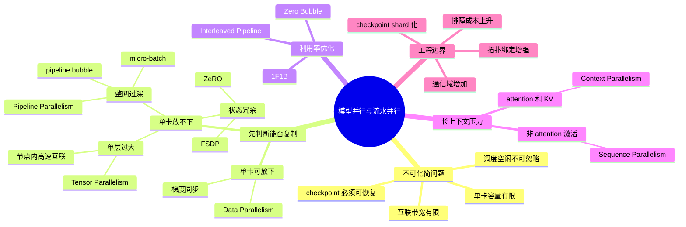
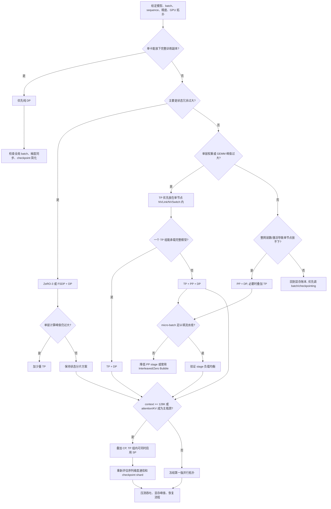

# 第9章：模型并行与流水并行

> 当模型已经大到单卡放不下时，问题就从“怎么复制模型”变成了“怎么拆模型”。

> **关联章节**：本章与 [第8章](./08-data-parallel.md) 的数据并行、[第10章](./10-memory-checkpointing-and-recovery.md) 的状态切分与 checkpoint 设计强相关。大模型训练通常不是替换关系，而是多种并行策略叠加。

## 1. 第一性原理拆解：为什么会有模型并行与流水并行

### 拆 — 不可化简的问题

剥离 Data Parallelism、Tensor Parallelism、Pipeline Parallelism、ZeRO、FSDP、Sequence Parallelism、Context Parallelism 这些术语，本章真正面对的不可化简问题只有一个：**一个训练 step 需要保存和计算的状态超过了单个物理设备的容量与带宽，系统必须把状态、计算和通信同时拆开，并且拆完之后仍然保持数学等价和工程可恢复。** 数据并行在 [第8章](./08-data-parallel.md) 中解决的是“同一个模型副本如何吃更多样本”，它默认每张 GPU 都能放下完整参数、梯度、优化器状态和必要激活。一旦 7B、70B、405B 模型叠加 BF16 参数、FP32 master weights、Adam 一阶二阶动量、activation checkpointing、长上下文 attention workspace 后超过单卡或单节点容量，复制模型就从扩展手段变成了障碍。

这个问题不能只用“显存不够”概括。显存只是第一层硬约束；第二层是计算单元是否闲置，第三层是 GPU 之间的链路能否承受同步，第四层是 checkpoint、恢复、故障定位是否还能解释清楚。一个策略如果让模型能放下，但每层都跨慢速网络 AllReduce，吞吐可能比小规模训练还差；另一个策略如果利用率很高，但 checkpoint 无法在 rank 重排后恢复，就不适合平台化运行。模型并行的本质不是“把模型分到多张卡”，而是在容量、带宽、延迟、调度复杂度和恢复复杂度之间做约束求解。

因此，本章的学习目标不是记住某个框架参数怎么写，而是建立工程决策直觉：什么时候先用纯 DP，什么时候把层内矩阵切成 TP，什么时候按层段切成 PP，什么时候用 ZeRO / FSDP 切训练状态，什么时候因为序列长度太长而叠加 SP / CP，以及什么时候不应该继续叠加并行维度。读这一章时要一直追问：我切掉的是哪一种重复？新引入的是哪一种通信？这个通信发生在节点内还是跨节点？它会不会改变 checkpoint 的组织方式？当一个 rank 掉线或恢复时，系统还能不能知道每个 shard 属于谁？

### 推 — 从这个问题如何推导出每个机制

从“单卡装不下完整训练副本”出发，第一种直接推导是状态分片。参数、梯度、优化器状态存在大量副本，ZeRO / FSDP 就是把这些重复状态切开，让每张卡只保存一部分；但它没有自动切开单层 GEMM 的计算，也没有自动降低 attention 对超长序列的压力。于是第二种推导是张量并行（Tensor Parallelism, TP）：如果某一层的权重矩阵或 attention projection 太大，就沿 hidden dimension、head 或矩阵行列把单层计算拆给多张 GPU。TP 的收益是降低单层参数和计算峰值，代价是每层都可能出现 `AllReduce`、`AllGather` 或 `ReduceScatter`，所以它天然应该优先放在 NVLink / NVSwitch 这类节点内高速互联里。

如果单层通过 TP 能放下，但整个网络层数太多、单节点仍然无法承载完整模型，就会推导出流水并行（Pipeline Parallelism, PP）：把 Transformer 层段切成多个 stage，不同 micro-batch 像工厂流水线一样依次通过 stage。PP 解决的是“整网太深、整模太大”，但它引入 pipeline bubble，因为流水线填充和排空阶段总有设备暂时没有活干。micro-batch 数 `m` 越少、stage 数 `p` 越多，bubble 越明显，因此 PP 必然引出 1F1B、Interleaved Pipeline、Zero Bubble 等调度优化。它们不是新的容量机制，而是在容量已经被 PP 解决后，进一步减少空闲槽。

当模型能放下后，还要解决吞吐扩展，这自然回到数据并行（Data Parallelism, DP）：把已经由 TP / PP / ZeRO 组成的“一个模型副本”复制多份，每份吃不同 batch，再同步梯度。大规模训练常见的 `DP x PP x TP` 不是为了炫技，而是因为三个维度分别切样本、层段和层内计算。长上下文又会推导出另一个分支：TP 主要切 hidden，PP 主要切 layers，ZeRO 主要切训练状态；当 context 从 8K 拉到 128K+，真正爆掉的可能是 token 维度上的激活、KV 和 attention workspace。Sequence Parallelism（SP）在 TP 组内切非 attention 路径的 sequence 激活，Context Parallelism（CP）切 attention 所需的 context/KV 流动。二者的共同点是补“序列维度”的短板，不是替代 DP / TP / PP。

工程上，机制推导的顺序也给出选型顺序：先问完整训练形态单卡能否放下；不能，再问单节点高速互联内能否通过 TP 或 FSDP 放下；还不能，再问模型是否适合按层切 PP；最后再根据长上下文、吞吐目标和 checkpoint 约束叠加 SP / CP / DP。边界很明确：每增加一个并行维度，rank 拓扑、通信域、日志归因、性能画像、checkpoint shard 数量都会变复杂。平台工程师的任务不是默认选择最复杂的组合，而是找到能满足容量和吞吐目标的最小复杂度组合。

### 绘 — 因果链路



### 导 — 读完本章你应该能回答

1. 当一个模型“单卡放不下”时，你如何区分是参数、优化器状态、激活、attention workspace 还是序列长度导致的容量问题？
2. 为什么 TP 通常优先限制在单节点 NVLink / NVSwitch 内，而 DP 可以更自然地跨节点扩展？
3. PP 的 pipeline bubble 从哪里来？为什么 stage 数变多不一定让训练更快？
4. ZeRO / FSDP 和 TP / PP 为什么是互补关系，而不是互相替代？
5. 给定 8、64、512 张 GPU，你如何从模型大小、上下文长度、micro-batch 和拓扑推导第一版并行配置？
6. SP 和 CP 分别切 sequence 的哪一部分？为什么 128K+ context 不能只靠 ZeRO 解决？
7. 并行维度叠加后，checkpoint、恢复和故障定位会发生哪些结构性变化？

---

## 正文内容

### 9.1 为什么数据并行不够了

数据并行默认每张卡都要装下一份完整模型。
当模型已经放不进单卡时，就必须改思路：

- 不是复制模型
- 而是把模型切开

这就进入模型并行的世界。

典型触发条件包括：

- 参数规模过大
- 中间激活太大
- 序列长度太长
- 单卡显存根本容纳不了目标训练形态

### 9.2 张量并行：切层内部的计算

张量并行的思路是：
把同一层里的矩阵计算切到多张卡上。

例如，一个大矩阵乘法可以按列或按行分片，让多张卡共同完成。

优点：

- 能解决单层参数太大问题
- 对超大线性层特别有效

难点：

- 通信频繁
- 对互联带宽和延迟敏感
- 实现与调试复杂

也就是说，张量并行把“显存问题”部分换成了“通信问题”。

### 9.3 流水并行：按层切模型

流水并行的思路是：

- 把模型的不同层段放到不同设备
- 让不同 micro-batch 像流水线一样流过这些阶段

例如：

```text
Stage 1 -> Stage 2 -> Stage 3 -> Stage 4
```

优点：

- 层次切分更符合模型结构
- 每张卡只承担部分层

难点：

- 会出现 pipeline bubble
- micro-batch 调度更复杂
- 前后阶段可能负载不均

### 9.4 什么是 pipeline bubble

在流水并行中，前几个 step 里后续 stage 还没工作，结束阶段里前面 stage 又可能空闲，这些空闲区间就是 bubble。

一个常见近似理解是：

$$
\text{pipeline utilization} \approx \frac{m}{m+p-1}
$$

其中：

- `m` 是 micro-batch 数
- `p` 是 pipeline stage 数

这个式子的直觉很重要：

- micro-batch 太少，bubble 占比高
- stage 太多，流水线填满更慢

所以流水并行并不是“切得越细越好”。

### 9.5 为什么大模型训练通常是混合并行

现实中，超大模型训练很少只用一种并行方式，更常见的是组合：

- 数据并行：做样本吞吐扩展
- 张量并行：解决单层过大
- 流水并行：解决整体层数过多
- 参数 / 状态切分：进一步降低显存压力

这意味着平台需要处理的不只是某一种并行策略，而是：

- 不同组之间的 rank 组织
- 不同通信域
- 不同 checkpoint 方式
- 不同恢复逻辑

### 9.6 ZeRO 系列与 FSDP

ZeRO 的核心思想不是“换一种模型并行”，而是把训练状态按不同粒度分片，减少每卡持有的冗余状态。

| 方案 | 主要分片什么 | 典型收益 | 主要代价 |
|------|--------------|----------|----------|
| ZeRO Stage 1 | Optimizer state | 先降优化器显存 | 实现简单，但参数和梯度仍全量保留 |
| ZeRO Stage 2 | Optimizer state + Gradients | 进一步降梯度占用 | 通信更多，反向路径更复杂 |
| ZeRO Stage 3 | Optimizer state + Gradients + Parameters | 最大幅度降低单卡状态占用 | 通信、checkpoint、恢复都更复杂 |
| PyTorch FSDP | 常被视作官方 ZeRO-3 风格实现 | PyTorch 原生集成较好 | 仍需认真处理 shard、state dict 和恢复流程 |

工程上最重要的判断是：

- **ZeRO / FSDP 与 TP / PP 是互补关系，不是替代关系**
- 当模型既放不下单卡，又不想把所有层硬切给 TP / PP 时，ZeRO / FSDP 往往是第一补充手段

但一旦进入状态分片，你的 checkpoint 就不能再按“单文件全量模型”思路设计，通常要转向 [第10章 §10.6](./10-memory-checkpointing-and-recovery.md) 的分布式 checkpoint 方案。

### 9.7 Interleaved Pipeline 与 Zero Bubble 简述

传统 1F1B 已经能降低部分 bubble，但 stage 负载仍可能不均。进一步优化时，常见两个方向：

| 思路 | 在解决什么 | 工程代价 |
|------|------------|----------|
| Interleaved Pipeline | 让一个设备承担多个更细的 stage，降低空闲比例 | 调度更复杂，stage 划分更难 |
| Zero Bubble 系列思路 | 尽量把前向、反向和权重更新空隙压到更低 | 依赖更复杂的调度与实现细节 |

#### Interleaved Pipeline

Interleaved Pipeline 可以理解成“把原来每张卡只放一个大 stage，改成每张卡放多个更细的小 stage，再交错执行”。
传统 1F1B 虽然已经比纯 GPipe 更省 bubble，但如果 `p` 个 stage 很粗，流水线填充和排空时仍会有明显空闲，特别是在 stage 数多、micro-batch 数不够多时更明显。Interleaved 的核心改进，不是改变“前向后向交替”的大方向，而是把 stage 切得更细，让同一张 GPU 在不同时间片承担多个虚拟 stage（virtual pipeline stage）。这样一来，单个 stage 的颗粒度更小，流水线更容易被填满，前后端空闲段也更短。

它解决的本质问题是：**传统 stage 太粗，导致 bubble 比例和负载不均同时存在。** 如果某个 stage 比其他 stage 更重，整条流水线都会被最慢 stage 拖住；而当每张卡承担多个更细的子阶段时，负载更容易被摊平，bubble 也通常会比原始 1F1B 更低。代价也很直接：切分后的依赖关系、activation 传递、micro-batch 调度都会更复杂，工程上往往需要框架原生支持，而不是平台自己临时拼出来。

#### Zero Bubble

Zero Bubble 这一类方法的目标更激进：它不是只接受“还有一点 bubble，但能忍”，而是试图把流水线中的空闲时间进一步塞满。核心直觉是，传统流水线通常把反向传播看成一个大块步骤，但从执行视角看，反向里其实包含不同类型的工作，例如输入梯度相关计算、权重梯度相关计算、以及后续权重更新。Zero Bubble 系列思路会把这些步骤拆成更细的 micro-op，然后重新编排，让原本会闲着的 stage 去做能够提前执行的那部分工作。

因此，Zero Bubble 解决的不是“流水并行能不能跑”，而是“流水并行已经能跑以后，如何继续压榨利用率”。它常见于超大规模训练、stage 很多、硬件极贵的场景，因为这时少量 bubble 都可能意味着大量 GPU 时间被浪费。要注意的是，这里的“Zero”更像优化目标，而不是说任何情况下都真的完全没有 bubble。平台侧真正需要理解的是：当团队讨论 Zero Bubble，他们通常已经在面对一个更高阶的问题，即**如何把 backward（B）和 weight update（W）拆散并穿插到原本空闲的时间槽里**。这会显著增加调度复杂度、实现难度和排障成本，但换来的是更高的流水线利用率。

平台侧不一定要自己实现这些算法，但需要知道：当训练团队开始谈这些词，通常说明传统流水线利用率已经成为明确瓶颈。

### 9.8 Sequence Parallelism 与 Context Parallelism

当上下文长度从 4K、8K 拉到 32K、128K 甚至更长时，只靠 TP / PP / ZeRO 往往还不够，因为激活和 attention 的 KV 开销会随着序列长度迅速放大。

这时常见补充手段有两类：

| 技术 | 切分什么 | 主要在解决什么 | 更依赖什么 | 常见通信 |
|------|----------|----------------|------------|----------|
| Tensor Parallelism | 隐藏维度 / 权重矩阵 | 单层参数或计算过大 | NVLink / NVSwitch | 每层 AllReduce |
| Sequence Parallelism | 序列维度中的非 attention 部分 | 降低 LayerNorm、Dropout 等激活占用 | 通常要配合 TP | AllGather / ReduceScatter |
| Context Parallelism | attention 的序列维度 | 让长上下文 attention / KV 不必全压在单卡 | 高速 GPU-GPU 或跨节点互联 | 环形 KV 传递 |

#### Sequence Parallelism

Megatron-LM 风格的 Sequence Parallelism（SP），首先要解决一个很容易被忽略的问题：**即便已经做了 TP，激活也不一定真的被切小了。**

原因在于，TP 主要切的是权重矩阵和隐藏维度上的 GEMM 计算；但像 LayerNorm、Dropout、Residual Add 这类“按 token 做、又不值得再做一次张量切分”的操作，在很多实现里仍然会在 TP 组内每张卡各自保留完整序列的激活。结果就是：

- 参数显存因为 TP 下降了
- 但 activation memory 仍然按完整 sequence 保留
- 当序列长度继续拉长时，真正先爆掉的常常是这些重复保留的激活，而不是权重

SP 的做法，就是在 **TP 组内部再按 sequence 维度切一刀**。直觉上可以理解成：

- TP 先把“大矩阵乘法”按隐藏维度切开
- SP 再把 LayerNorm、Dropout、Residual 路径上的 token 按序列分段
- 每张卡只保留自己那一段 token 的非 attention 激活

这样做之后，原来在每个 TP rank 上重复保留的一整条序列，会变成“每卡只拿到其中一段”，所以 LayerNorm / Dropout 一类中间激活显存会明显下降，通常能近似按 TP 组大小被摊薄。对于长序列训练，这个收益很直接，因为这些算子本来就是沿 token 独立处理的，最适合按 sequence 分摊。

但 SP 不是白拿的。为了让前后算子仍能看到正确张量布局，框架通常要在层间插入额外通信：

- 某些阶段需要 `AllGather`，把序列片段重新拼成后续算子所需的视图
- 某些阶段需要 `ReduceScatter`，在通信后再把结果重新按 sequence 分散回各卡

所以 SP 的工程定位非常明确：**它通常不是独立并行维度，而是 TP 的增强件。** 如果没有 TP 组，Megatron 语境下的 SP 往往没有意义；如果序列不长、瓶颈也不在 activation，那么这层复杂度也不一定值得引入。

#### Context Parallelism

Context Parallelism（CP）则是另一个层级的问题：**当上下文来到 128K、256K 甚至更高时，attention 本身就已经大到不能再把整条序列塞进单卡。**

这里的压力主要来自三部分：

- attention 相关激活会随序列长度快速膨胀，很多中间量带有明显的平方级趋势
- KV 表示至少会随序列长度线性增长，context 越长，KV 占用越夸张
- 即便参数已经通过 TP / PP / ZeRO 放下，attention workspace 仍可能把单卡显存顶满

所以 CP 不是在解决“权重太大”，而是在解决“**序列维度本身太长**”。它的核心思路是把 context 维度切到多张卡：

- 每张卡只持有一段 token / context block
- 本卡先对自己那段序列做局部 attention 计算
- 为了拿到完整上下文所需的 K/V，再通过跨卡通信逐段交换或重排 K/V

直觉上，CP 可以理解成“把一条超长文本拆成多段，让多张卡分摊 attention 的序列负担”。这样每张卡不再需要同时持有完整 128K+ 的 attention 激活和 KV，单卡显存才有机会落回可训练范围。

常见实现思路包括 Ring Attention、DeepSpeed Ulysses 一类方案，但它们的通信直觉不完全一样：

- **Ring Attention**：更像是“Q 留在本地，K/V 沿环逐跳传递”。每张卡反复接收下一段 K/V、更新本地 attention 结果，再继续把 K/V 往下传，通信模式很接近环形流水。
- **Ulysses 一类方案**：更像先把 token / head 的布局重新分发，让每张卡在新的切分视图下运行更标准的 attention kernel，常见代价是更重的重排或 All-to-All 风格通信。

这两类方案的共同目标，都是把原本集中在单卡上的 attention 序列开销摊到多卡上。差别主要在于：**是让 K/V 在环上流动，还是先把张量布局重排后再算。**

为什么 128K+ 训练经常几乎必须上 CP？因为这时真正撑爆显存的，往往不是参数，而是 attention 相关激活、softmax 中间量和 KV。ZeRO 主要切的是参数、梯度、优化器状态；它并不会把“这 128K token 之间的 attention 关系”自动切掉。所以在超长上下文场景里，TP / PP / ZeRO 解决的是“模型能不能放下”，CP 解决的则是“**这个上下文本身能不能算得动**”。

#### SP / CP 与 TP / PP / DP 的关系

理解 SP / CP 最容易犯的错误，是把它们当成“新一代并行方案”，仿佛上了 SP 或 CP 就可以替换掉 DP / TP / PP。实际工程里通常不是这样。

- DP 切的是样本维度，主要解决吞吐扩展
- TP 切的是层内隐藏维度 / 权重矩阵，主要解决单层太大
- PP 切的是模型层段，主要解决整网太深、整模放不下
- SP 切的是 **非 attention 路径**上的序列维度，主要给 TP 降 activation memory
- CP 切的是 **attention 路径**上的 context 维度，主要让超长上下文 attention 能落到多卡

所以它们通常是叠加关系，而不是替代关系。一个真实训练作业很可能同时长这样：

- `DP x PP x TP` 作为基础并行框架
- 在 TP 组内部再打开 SP，减少 LayerNorm / Dropout / Residual 的激活冗余
- 当 context 拉到 128K+ 时，再叠加 CP 去切 attention 的序列负担

也就是说，**SP/CP 是补“序列维度显存”这块短板，而不是把已有 DP/TP/PP 推翻重来。**

#### 什么时候该用，什么时候会失败

| 技术 | 典型适用条件 | 主要收益 | 主要代价 | 常见失败条件 / 不适用场景 |
|------|--------------|----------|----------|----------------------------|
| DP | 单卡能容纳完整训练副本，主要目标是扩吞吐 | 实现最成熟，扩样本最直接 | 需要做全局梯度同步，模型副本完全重复 | 单卡放不下参数、梯度、优化器状态或激活时失效 |
| TP | 单层线性层或注意力投影太大，且节点内有高速互联 | 把单层权重和计算切到多卡，解决单层过大问题 | 每层高频 `AllReduce` / `AllGather`，强依赖 NVLink / NVSwitch | 互联太慢、模型太小、隐藏维度不够大时，通信成本可能超过收益 |
| PP | 整体网络太深或整模无法放入单节点，希望按层切分 | 每卡只承载一段层，适合超深模型 | 有 pipeline bubble，调度和负载均衡复杂 | 层数不够多、stage 切分不均、micro-batch 太少时效率差 |
| SP | 已经在用 TP，且长序列下 LN / Dropout / Residual 激活占用明显 | 降低 TP 组内重复保留的非 attention 激活显存 | 每层引入额外 `AllGather` / `ReduceScatter`，实现更复杂 | 没有 TP、序列不长、瓶颈不在 activation 时收益有限 |
| CP | 128K+ 长上下文训练，attention 激活 / KV / workspace 已成主瓶颈 | 把超长 context 的 attention 序列负担摊到多卡，长上下文几乎必备 | 序列维度通信重，依赖高速互联和专门 attention 实现 | 上下文不够长、跨卡带宽不足、框架 / kernel 不支持 Ring / All-to-All 式 attention 时难落地 |

平台视角里，SP / CP 也会改变拓扑要求：

- SP 更常发生在同一 TP 组内，通常要求高速节点内互联
- CP 会让长上下文阶段出现更重的序列维度通信，对 [第5章](../part2-systems-stack/05-memory-interconnect-io.md) 的互联和拓扑更敏感

所以一旦训练团队开始讨论 128K、256K context，平台就不能只问“显存够不够”，还要问“序列维度通信能不能承受”。

### 9.9 并行策略选型决策树

下面给一个面向工程落地的简化决策树。输入不是“模型参数量”一个数，而是目标训练形态的完整账本：

- 模型状态：参数、梯度、optimizer state、master weights、embedding / vocab、MoE expert 是否稀疏
- 激活与序列：micro-batch、sequence length、activation checkpointing、attention workspace、KV / context block
- 硬件资源：总 GPU 数、每节点 GPU 数、HBM 容量、节点内 NVLink / NVSwitch、跨节点 IB / RoCE 带宽
- 工程约束：框架支持、checkpoint 格式、故障恢复 SLA、团队对混合并行调试的熟悉程度



可以把每个分支理解成一个“先解决最硬约束，再做吞吐优化”的过程：

- **单卡放得下 -> 纯 DP**。这是最优先的默认解。因为模型已经能完整落在单卡里，就没必要引入 TP / PP 的额外通信和调度复杂度。DP 的优点是实现成熟、调试成本最低、checkpoint 也最直观。这里的“放得下”必须按真实训练形态判断，而不是只看参数量；例如 7B 模型 BF16 参数约 14GB，但 Adam 状态、梯度、master weights 与激活会把训练显存推到远高于 14GB。工程边界是：如果必须靠极小 micro-batch 才勉强放下，导致 GPU 计算利用率很差，就应该比较 DP + activation checkpointing、FSDP 和 TP 的真实吞吐，而不是只看能否启动。

- **状态冗余是主因 -> ZeRO-3 / FSDP + DP**。如果单层计算峰值不夸张，模型主要卡在 optimizer state、gradient、parameter replica 的冗余上，优先考虑 ZeRO-3 / FSDP。它比 PP 更容易保持模型结构完整，也比大 TP 组更少绑定拓扑。工程边界是：ZeRO-3 / FSDP 会把参数 all-gather 放进前向路径，把 reduce-scatter 放进反向路径，checkpoint 也会变成 shard 化 state dict；如果作业每几百 step 就要保存超大 checkpoint，文件系统和恢复流程必须先按 [第10章](./10-memory-checkpointing-and-recovery.md) 的分布式 checkpoint 思路设计。

- **单层太大 -> TP（节点内）+ DP（跨节点）**。这是很多 30B-70B 量级模型的典型工程解。TP 的通信频率高，最好放在单节点内，用 NVLink / NVSwitch 承接每层 `AllReduce` / `AllGather` 成本；一旦节点内把模型切开装下了，就可以把一个 TP 组看成“逻辑模型副本”，再用 DP 在多个组之间扩吞吐。工程边界是：TP 组大小通常优先选 2、4、8 这类能整除 hidden size / attention heads 的值，而且尽量不跨慢速网络；跨节点 TP 只有在网络和框架都明确支持时才应作为高阶优化。

- **单节点仍放不下或层数过深 -> TP + PP + DP**。当一个完整模型连单节点都塞不下，且模型结构天然适合按 Transformer block 切段，就需要 PP。TP 解决单层太大，PP 解决整网太深，DP 保留样本吞吐扩展。工程边界是：PP 不是 stage 越多越好。若 `p=8`、micro-batch `m=8`，简单气泡近似下利用率只有 `8/(8+8-1)=53.3%`；即便 1F1B 会改善调度形态，stage 负载不均仍会被最慢 stage 放大。上 PP 前要确认 micro-batch 数足够、层切分均衡、embedding/loss 等首尾特殊层不会拖慢单个 stage。

- **超长上下文 -> 在原组合上叠加 SP / CP**。128K 以上时，真正先把显存顶爆的往往不是参数，而是 attention 相关激活、KV 和 workspace。SP 通常在 TP 组内部降低 LayerNorm、Dropout、Residual 等非 attention 激活冗余；CP 则切 attention context，让 K/V 或 token block 在多卡之间流动。工程边界是：SP / CP 会把通信从“层内隐藏维度”扩展到“序列维度”，对 kernel、通信库和拓扑更挑剔。上下文没有长到足以压垮显存时，盲目开启 CP 可能只是在增加 All-to-All 或环形传输成本。

> **参考数量级（仅供建立直觉，实际值因硬件、精度、batch 和激活重计算设置差异较大）**
>
> | 场景 | 典型值 | 说明 |
> |------|--------|------|
> | TP 组大小 | 2-8 卡 | 通常优先限制在单节点高速互联内 |
> | PP stage 数 | 2-8 段 | 与 micro-batch 数一起决定 bubble 比例 |
> | DP 组大小 | 2-数十组 | 取决于目标吞吐、全局 batch 和网络带宽 |
> | CP 组大小 | 2-4 起步 | 常见于 128K+ context，通信代价明显上升 |

### 9.10 典型配置实例表

下面的组合不是唯一答案，但它们能帮助把上面的决策树落到真实规模上：

| 模型 / 场景 | 集群 | TP | PP | DP | ZeRO / FSDP | SP / CP | 第一版配置理由 | 工程边界 |
|-------------|------|----|----|----|-------------|---------|----------------|----------|
| 7B baseline pretrain / SFT | 8 x H100 单节点 | 1 | 1 | 8 | 可选 FSDP | - | 7B BF16 参数约 14GB，单卡通常能通过 BF16、activation checkpointing、合理 micro-batch 放下；纯 DP 或轻量 FSDP 调试成本最低。 | 若 optimizer state + 激活导致 80GB HBM 仍吃紧，先试 FSDP / ZeRO-2/3，不要过早引入 TP / PP。 |
| 13B-34B，单节点多卡 | 8 x H100 或 A100 80G | 2-4 | 1 | 2-4 | 可选 | SP 可选 | 单层和激活开始变重，但通常仍希望把 TP 限在节点内；DP 复制 TP 组扩吞吐。 | TP 需要 hidden size、attention head 数能被 TP 整除；小 batch 下 TP 通信可能吃掉收益。 |
| 70B 常规上下文训练 | 64 x H100（8 节点） | 8 | 4 | 2 | 可选 ZeRO-1/2 | SP 可选 | 70B 单卡放不下，TP=8 放在单节点高速互联内，PP=4 分摊层段，DP=2 形成两个逻辑副本。 | `TP x PP x DP = 64` 必须严格匹配 rank 编排；PP stage 不均会拖慢全局 step。 |
| 70B，GPU 预算紧张 | 32-64 x A100 80G | 1-2 | 1-2 | 8-32 | ZeRO-3 / FSDP | - | 如果主要压力来自训练状态冗余，ZeRO-3 / FSDP 比深 PP 更容易落地；少量 TP 只用于解决大层峰值。 | checkpoint shard 多、恢复路径复杂；跨节点参数 all-gather 会让网络成为瓶颈。 |
| 70B + 128K context | 128 x H100 | 8 | 2 | 4 | 可选 | SP + CP=2 | 参数量不是唯一瓶颈，128K attention / KV / workspace 会把单卡显存顶满；在 TP/PP/DP 基础上用 SP 降非 attention 激活，用 CP 切 context。 | CP 需要专门 attention 实现和高速互联；上下文通信失败时通常表现为吞吐骤降而不只是 OOM。 |
| 405B dense 模型 | 512 x H100 | 8 | 8 | 8 | 可选 ZeRO-1/2 | SP 可选 | 405B 已进入必须 3D 并行的量级：TP 切层内，PP 切层段，DP 保留吞吐。 | 调参重点从“能否启动”变成 MFU、bubble、straggler、checkpoint 时间；平台必须有拓扑感知 placement。 |
| MoE 模型，专家数远大于激活专家数 | 128-512 x H100 | EP/TP 混合 | 2-8 | 4-16 | 常用 | 视 context 而定 | MoE 还会引入 Expert Parallelism（EP），每 token 只激活少数专家，容量和通信模式不同于 dense。 | 本章不展开 EP；工程上要额外处理 token dispatch、load balance、all-to-all 热点。 |

这里有两个容易忽略的现实判断：

- 表里的 `TP / PP / DP / CP` 是乘法关系，但 `ZeRO / FSDP` 更像“叠加的状态分片层”，不是和前面完全同一维度
- 同一个模型会因为精度、activation checkpointing、micro-batch、大词表、MoE 与否而改变配置，所以表格是“工程直觉模板”，不是固定答案
- 对平台团队来说，第一版配置还必须绑定 placement：TP 组尽量落在同一 NVSwitch island，PP stage 尽量沿网络距离稳定排布，DP 组之间允许跨节点但要保证梯度同步网络可预测

### 9.11 如何把决策树落地成第一版方案

如果你不想一开始就精确求最优解，可以按下面的顺序落地：

1. 先判断单卡能不能放下完整训练副本；能放下就从纯 DP 起步
2. 放不下时，优先看单节点 NVLink / NVSwitch 内能否通过 TP 装下
3. 单节点还不够，再决定是走 `TP + PP + DP`，还是走 `ZeRO-3 / FSDP + DP`
4. 如果 context 已经到 128K+，把 CP 当成额外维度，而不是最后临时补救

真实选择还要继续检查这些现实约束：

- 设备互联：TP 和 CP 都高度依赖拓扑
- 软件栈支持：Megatron-LM、DeepSpeed、FSDP 的能力边界不同
- 团队调试能力：越复杂的混合并行，越依赖经验
- checkpoint 与恢复复杂度：并行维度一多，恢复链路会一起变复杂

### 9.12 框架对照表

| 框架 | 主要定位 | 更适合什么场景 |
|------|----------|----------------|
| DeepSpeed | ZeRO 全系列、训练工程化能力强 | 大规模分片训练、复杂优化器状态管理 |
| PyTorch FSDP | 官方原生 ZeRO-3 风格实现 | 希望尽量留在 PyTorch 主生态 |
| Megatron-LM | TP + PP + 混合并行成熟 | 超大 Transformer 训练 |
| ColossalAI | 并行策略较丰富 | 想在多种并行手段间做组合试验 |
| DeepSpeed Ulysses / Ring Attention 实现 | 更关注 Context Parallelism | 长上下文训练 |

### 9.13 工程建议

- 先用单机和小规模配置验证切分逻辑，再放大规模
- 任何并行策略都要同时考虑训练路径和 checkpoint / 恢复路径
- 当 TP / PP 已经很重时，再叠加 ZeRO / FSDP 前要先确认通信预算
- 决策时不要只问“能不能跑”，要问“出故障后能不能恢复”

#### 本章涉及的常见工具

| 概念 | 常见工具 / 命令 | 备注 |
|------|-----------------|------|
| ZeRO 分片训练 | DeepSpeed | ZeRO Stage 1/2/3 是最常见入口 |
| 原生状态分片 | PyTorch FSDP | 更贴近官方生态，便于与 PyTorch 配套 |
| TP / PP 训练 | Megatron-LM | 大模型并行训练的常用参考实现 |
| Sequence / Context Parallelism | Megatron-LM、DeepSpeed Ulysses | 适合长上下文训练和激活降压 |
| 并行组合实验 | ColossalAI | 适合快速试不同并行编排 |

### 9.14 常见误区

#### 误区一：模型并行只是“分到多张卡”这么简单

不对。它重塑了通信模式、同步点和故障处理逻辑。

#### 误区二：流水线切得越细越高效

不对。切得太细会增加 bubble 和调度复杂度。

#### 误区三：张量并行只要显存够就行

不对。它对互联和通信延迟极其敏感。

#### 误区四：上了 ZeRO / FSDP 就不需要考虑模型并行

不对。状态分片主要解决冗余状态问题，无法替代所有层级切分需求。

---

## 本章小结

| 并行方式 | 解决的问题 | 主要代价 |
|----------|------------|----------|
| 张量并行 | 单层参数或计算过大 | 高频通信 |
| 流水并行 | 整体模型太深、单卡放不下 | bubble 与调度复杂度 |
| ZeRO / FSDP | 冗余状态过重 | 通信、checkpoint 与恢复更复杂 |
| Sequence / Context Parallelism | 长上下文激活或 KV 过大 | 序列维度通信更重 |
| 混合并行 | 同时解决吞吐与显存问题 | 系统复杂度最高 |

---

## 练习题

1. 为什么数据并行无法解决“模型放不下单卡”的问题？
2. 请解释张量并行和流水并行分别在“切什么”。
3. ZeRO Stage 1/2/3 的区别是什么？为什么它和 TP / PP 是互补关系？
4. 如果你的模型已经用了 TP 和 PP，checkpoint 设计为什么还要跟着调整？
5. 为什么 128K+ 上下文训练通常要开始讨论 Context Parallelism？
