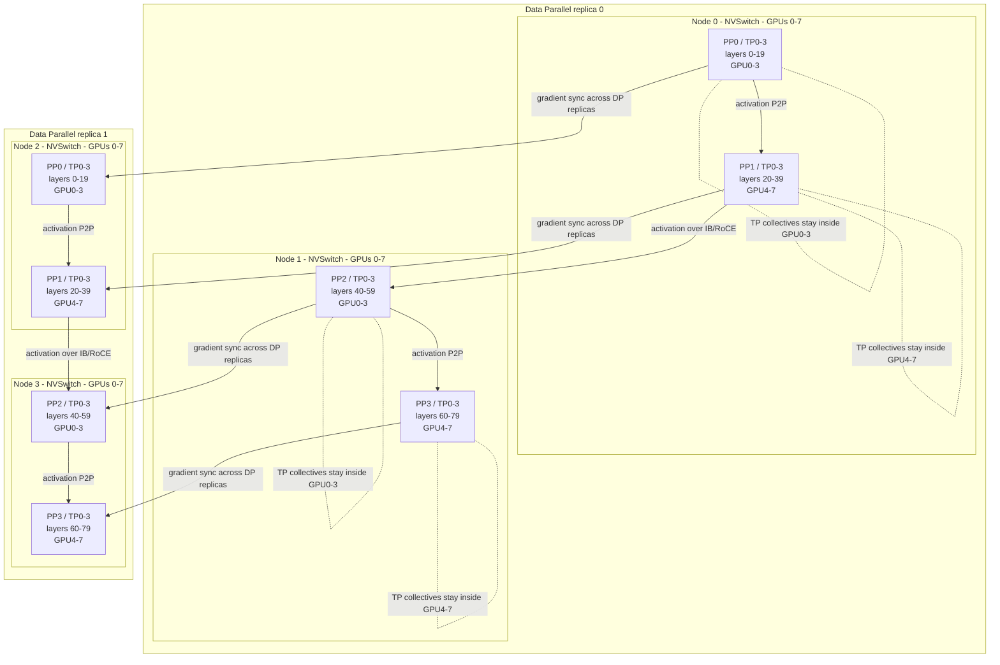
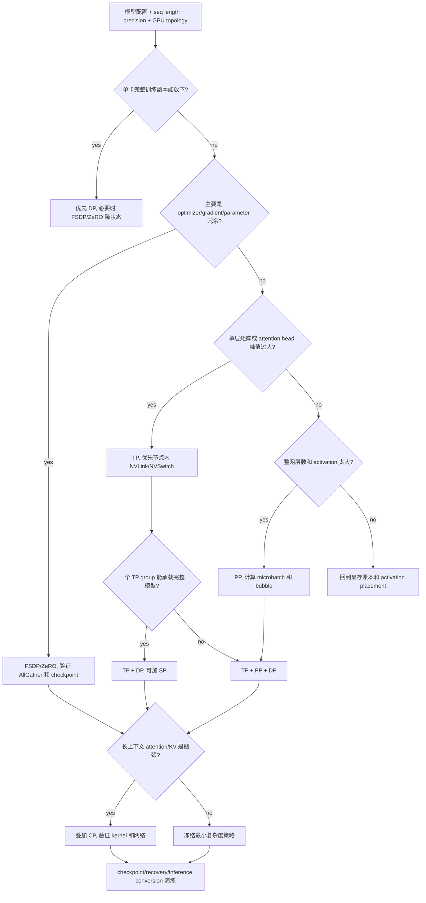

# 第9章：模型并行与流水并行

> 当模型、序列或训练状态已经不能被一张 GPU 完整承载时，训练系统必须把样本、层、张量、序列和状态同时拆开。本章讨论的不是术语清单，而是如何把这些切分组合成一个可训练、可恢复、可观测的生产方案。

> **关联章节**：本章以 [第7章](./07-single-node-training.md) 的单节点容量账本和 [第8章](./08-data-parallel.md) 的 DDP/FSDP/ZeRO 同步路径为基础。checkpoint、异步保存、跨并行恢复和故障恢复协议见 [第10章](./10-memory-checkpointing-and-recovery.md)。

---

## 1. 第一性原理拆解 + 学习大纲

### 1.1 拆：不可化简的问题

模型并行与流水并行要解决的最小问题是：

```text
一个 training step 所需的参数、梯度、优化器状态、activation、attention workspace 和计算量，
超过了单个设备或单个高速互联域的容量与带宽。
```

这个问题不能只归因于“显存不够”。显存只是第一道硬约束。生产训练中还会同时遇到：

- 单层矩阵太大：单个 attention projection、MLP projection 或 vocab head 的参数和 GEMM 峰值超过单卡容量或单卡算力效率边界。
- 整网太深：单层能放下，但完整 Transformer blocks、embedding、loss head、activation 和 optimizer state 不能放进一张 GPU 或一个节点。
- 序列太长：参数状态可分片，但 64K、128K、256K context 下的 attention activation、KV、workspace 和 mask 仍会爆 HBM。
- 同步太重：切分以后产生新的 AllReduce、AllGather、ReduceScatter、All-to-All 或 activation send/recv，网络进入 step time。
- 状态太碎：checkpoint 从一个文件变成成千上万个 shard，恢复时必须重建 parallel metadata。
- 故障不再局部：一个 pipeline stage、TP group、CP ring 或 expert group 出错，可能让全局作业 hang 在不同 collective 上。

因此模型并行的本质不是“把模型分到多张卡”，而是对五类维度做约束求解：

| 维度 | 切什么 | 典型机制 | 主要收益 | 主要代价 |
|---|---|---|---|---|
| 样本 | batch / sample | DP | 提升样本吞吐 | 梯度同步、straggler |
| 状态 | parameters / gradients / optimizer state | FSDP / ZeRO | 降低状态冗余 | 参数 all-gather、sharded checkpoint |
| 层内张量 | hidden / heads / matrix rows or columns | TP | 降低单层峰值、增加层内算力 | 高频 collective，强依赖 NVLink/NVSwitch |
| 层段 | Transformer blocks | PP | 降低每卡层数和整网驻留状态 | microbatch 调度、pipeline bubble |
| 序列 / 上下文 | tokens / context blocks / KV | SP / CP | 降低长序列 activation 和 attention 压力 | 序列维度通信、kernel 支持要求高 |
| 专家 | MoE experts | EP | 扩大稀疏容量 | token dispatch、All-to-All/AllToAllV、load balance |

### 1.2 推：机制如何从问题中长出来

从这个不可化简问题出发，可以自然推出每个机制。

如果完整训练副本能放进单卡，最简单的扩展是数据并行：每张 GPU 复制模型，处理不同样本，再同步梯度。第8章已经说明，DP 切的是样本，不切模型状态。只要完整训练副本放不下，经典 DDP 就失效。

如果主要问题是训练状态重复，FSDP/ZeRO 是第一层补救。ZeRO-1 切 optimizer state，ZeRO-2 继续切 gradients，ZeRO-3 / FSDP FULL_SHARD 连 parameters 也常驻为 shard。它降低状态冗余，但不会自动切单层 GEMM，也不会自动切 attention context。

如果单层过大或层内算力不足，需要 TP。TP 把一层里的权重矩阵、attention heads 或 hidden dimension 分到多个 rank。它的通信频率高，常在每个 Transformer block 内出现 AllReduce、AllGather 或 ReduceScatter，所以应该优先放在节点内 NVLink/NVSwitch。

如果单层通过 TP 能放下，但完整网络仍太大，需要 PP。PP 按层段把模型放到不同 stage，microbatch 像流水线一样经过 stage。PP 的容量收益明确，但会产生 pipeline bubble。stage 越多、microbatch 越少，空闲比例越高。

如果 PP bubble 太高，可以引入 interleaved pipeline 和 zero bubble 调度。interleaved pipeline 把一个物理 stage 拆成多个 virtual stage 交错执行，减少负载不均和填充/排空空闲。zero bubble 类调度把 backward 拆成输入梯度、权重梯度、更新等更细工作，尽量用可提前执行的工作填满空槽。

如果上下文长度继续增加，SP/CP 成为必要补充。SP 通常在 TP 组内切非 attention 路径的 sequence activation，例如 LayerNorm、Dropout、Residual。CP 切 attention context，让 token block 或 K/V 在多卡之间流动。它们解决的是序列维度压力，不替代 TP/PP/DP/FSDP。

如果模型是 MoE，还会引入 EP。EP 把不同 experts 放在不同 rank，token 通过 router 分发给少数 experts。EP 的主要瓶颈通常不是参数存储，而是 token dispatch、All-to-All/AllToAllV、expert load balance 和 dropless routing 的尾延迟。本章只把 EP 放进策略边界，MoE 细节需要单独设计。

### 1.3 学习大纲

读完本章，你应该能回答：

1. TP、PP、SP、CP、EP、FSDP/ZeRO 分别切什么，复制什么，通信什么。
2. 3D parallel 的 rank mesh 如何映射到节点、GPU、NVSwitch island 和 IB/RoCE rail。
3. microbatch、pipeline bubble、virtual stage、activation placement 如何共同决定 PP 效率。
4. 为什么 TP 更适合节点内，DP 更适合跨节点，CP 对长上下文网络路径更敏感。
5. 如何用模型大小、sequence length、GPU topology、framework support、checkpoint format 和 recovery SLA 选择并行策略。
6. Megatron-style TP/PP/CP/DP 配置、DeepSpeed pipeline boundaries、FSDP hybrid sharding 的工程边界是什么。
7. 并行策略如何改变 checkpoint、optimizer state、failure recovery 和 inference conversion。
8. 如何为 70B 和 405B 模型比较至少两套并行配置，并解释显存、吞吐、网络压力和恢复复杂度。

---

## 2. 概念边界：是什么、不是什么、相邻概念边界

### 2.1 是什么

模型并行与流水并行是一组把训练 step 拆到多个 rank 的系统技术。它覆盖：

- Tensor Parallelism, TP：切层内张量和矩阵计算。
- Pipeline Parallelism, PP：切 Transformer layer stage。
- Sequence Parallelism, SP：通常在 TP 组内切非 attention activation 的 sequence 维度。
- Context Parallelism, CP：切长上下文 attention / KV / context blocks。
- Expert Parallelism, EP：切 MoE experts 和 token dispatch。
- FSDP/ZeRO：切 parameters、gradients、optimizer state。
- 3D parallel：常指 `DP x PP x TP`，实际生产中还可能叠加 CP、SP、EP 或 ZeRO/FSDP。

工程上，这些机制共同定义一个 rank mesh：

```text
global_rank
  -> data_parallel_group
  -> pipeline_stage
  -> tensor_parallel_group
  -> optional context_parallel_group
  -> optional expert_parallel_group
```

每个 group 都有自己的通信域、状态归属、checkpoint shard、日志标签和故障传播方式。

一个可审计的 launcher 必须把这个映射写成确定的代数，而不是散落在各框架默认值里。下面是一种常见的 row-major 顺序，约定 `tp` 是最内层维度，`dp` 是最外层维度：

```text
world_size = DP * PP * CP * TP

tp_rank = global_rank % TP
cp_rank = (global_rank // TP) % CP
pp_rank = (global_rank // (TP * CP)) % PP
dp_rank = global_rank // (TP * CP * PP)

global_rank =
  (((dp_rank * PP + pp_rank) * CP + cp_rank) * TP + tp_rank)
```

例如 `DP=2, PP=4, CP=2, TP=8` 时，`global_rank=93`：

```text
tp_rank = 93 % 8 = 5
cp_rank = (93 // 8) % 2 = 1
pp_rank = (93 // 16) % 4 = 1
dp_rank = 93 // 64 = 1

global_rank = (((1 * 4 + 1) * 2 + 1) * 8 + 5) = 93
```

也可以选择 `dp/pp/tp/cp`、`pp/dp/tp/cp` 等其他 order，但 scheduler placement、launcher、框架 process group、日志标签和 checkpoint metadata 必须使用同一个 order。最危险的事故不是启动时报错，而是训练能跑、checkpoint 能写，但恢复或推理转换时按另一套 order 解释 shard owner，导致 silent weight corruption。

#### 2.1.1 Rank ID 表：`DP=2, PP=4, TP=4`

去掉 CP 后，上面的 row-major 公式退化为：

```text
world_size = 2 * 4 * 4 = 32
global_rank = ((dp_rank * PP + pp_rank) * TP + tp_rank)
```

完整 rank 表如下。读表时要先定位 `dp` 副本，再定位 `pp` stage，最后才是同 stage 内的 `tp` shard：

| `dp_rank` | `pp_rank` | `tp_rank=0` | `tp_rank=1` | `tp_rank=2` | `tp_rank=3` |
|---:|---:|---:|---:|---:|---:|
| 0 | 0 | 0 | 1 | 2 | 3 |
| 0 | 1 | 4 | 5 | 6 | 7 |
| 0 | 2 | 8 | 9 | 10 | 11 |
| 0 | 3 | 12 | 13 | 14 | 15 |
| 1 | 0 | 16 | 17 | 18 | 19 |
| 1 | 1 | 20 | 21 | 22 | 23 |
| 1 | 2 | 24 | 25 | 26 | 27 |
| 1 | 3 | 28 | 29 | 30 | 31 |

由这张表可以直接构造 process group：

| group 类型 | 构造规则 | 示例 |
|---|---|---|
| TP group | 固定 `(dp_rank, pp_rank)`，枚举 `tp_rank` | `dp0,pp2` → `[8,9,10,11]`；`dp1,pp0` → `[16,17,18,19]` |
| PP chain | 固定 `(dp_rank, tp_rank)`，按 `pp_rank=0..3` 串 stage | `dp0,tp0` → `[0,4,8,12]`；`dp1,tp3` → `[19,23,27,31]` |
| DP group | 固定 `(pp_rank, tp_rank)`，枚举 `dp_rank` | `pp0,tp0` → `[0,16]`；`pp3,tp2` → `[14,30]` |

这三个 group 不能互换：TP group 共同算同一层的一个 microbatch，PP chain 传 activation/activation gradient，DP group 同步等价 tensor shard 的梯度或 optimizer state。checkpoint metadata 至少要能从任意 `global_rank` 反查出这三个 group，否则 reshape restore 和故障定位都会变成猜测。

### 2.2 不是什么

模型并行不是：

- 纯粹的显存技巧。它会改变 step timeline、collective、checkpoint、恢复和推理转换。
- “越多维度越高级”。每多一个维度，rank placement、debug、profile、resume 都更难。
- 对 DP 的替代。多数大模型训练仍需要 DP 扩吞吐，只是 DP 的一个副本本身由 TP/PP/FSDP/CP 组成。
- 对 FSDP/ZeRO 的替代。TP/PP 切计算和层，FSDP/ZeRO 切训练状态，二者经常叠加。
- 框架参数的机械组合。`tensor-model-parallel-size=8` 只有在 hidden size、heads、节点内拓扑、kernel 和 checkpoint 格式都匹配时才成立。
- 一次训练配置的终点。训练态的 shard layout 还要能转换到 inference engine 接受的 TP、quantization 和 checkpoint 格式。

### 2.3 相邻概念边界

| 概念 | 切分对象 | 不切什么 | 主要通信 | 常见放置 |
|---|---|---|---|---|
| DP | samples | 单个模型副本内部结构 | gradient AllReduce / ReduceScatter | 可跨节点 |
| FSDP/ZeRO | training states | 单层 GEMM 本身 | parameter AllGather、gradient ReduceScatter | 节点内外均可，受网络影响 |
| TP | layer tensor / heads / hidden | layers、samples | AllReduce、AllGather、ReduceScatter | 优先节点内 NVLink/NVSwitch |
| PP | layers / stages | stage 内层计算 | activation / gradient send-recv | 可跨节点，但要固定拓扑 |
| SP | non-attention sequence activations | attention context 全局依赖 | AllGather、ReduceScatter | 通常在 TP 组内 |
| CP | attention context / KV / token blocks | parameters / optimizer states | ring KV、All-to-All、P2P | 高速互联优先，可跨节点但成本高 |
| EP | experts | dense shared layers | token dispatch All-to-All/AllToAllV | MoE expert mesh |

一句话边界：

```text
DP 切样本，FSDP/ZeRO 切训练状态，TP 切层内张量，PP 切层段，
SP 切非 attention 的序列激活，CP 切 attention context，EP 切专家。
```

---

## 3. 架构：控制路径、数据路径、状态路径、故障路径

### 3.1 责任边界

一个混合并行训练系统至少有六个责任面：

| 责任面 | 关键对象 | 失败表现 |
|---|---|---|
| Scheduler | node、GPU、NIC、topology label、placement policy | TP 跨慢链路，PP stage 跨坏节点，step time P95 飙升 |
| Launcher | rank、local rank、world size、process groups | rank mesh 错位，collective hang |
| Framework | Megatron、DeepSpeed、PyTorch FSDP、optimizer | OOM、loss 不一致、checkpoint mismatch |
| Communication | NCCL groups、P2P、AllReduce、All-to-All、rails | bus bandwidth 低、timeout、rank tail |
| State | parameters、gradients、optimizer、RNG、metadata | resume 后权重错位、optimizer shard 丢失 |
| Observability | per-rank metrics、stage timeline、NCCL logs、checkpoint audit | 只能看到慢或 hang，无法归因到 TP/PP/CP |

### 3.2 控制路径

控制路径负责把一个逻辑训练配置变成确定性的 rank mesh：

```text
job spec
  -> scheduler allocates topology-aware nodes
  -> launcher assigns global/local ranks
  -> framework builds DP/PP/TP/CP/EP/FSDP groups
  -> model partitioner maps layers/tensors/context/expert shards
  -> training loop executes microbatch schedule
  -> checkpoint writer records shard layout and global step
```

控制路径的关键不变量：

- `world_size == DP * PP * TP * CP * EP`，FSDP/ZeRO group size 另行定义。
- 每个 Transformer layer 必须有唯一 stage owner，除非 interleaved pipeline 让一个物理 rank 拥有多个 virtual stage。
- TP 组内 hidden size、attention heads、vocab padding 必须可整除；GQA/MQA 的 KV heads 约束取决于框架布局，见 §5.1。
- CP 组内 sequence partition、position encoding、attention mask、KV exchange 顺序必须一致。
- checkpoint metadata 必须保存并行维度、rank mapping、tensor shard spec、optimizer shard spec 和 RNG/data cursor。

### 3.3 数据路径

混合并行下，数据路径不再是“每个 rank 一份 batch”这么简单。

```text
dataset shard
  -> DP rank owns sample slice
  -> microbatch split
  -> PP stage 0 receives input tokens
  -> activation flows stage by stage
  -> TP group computes each layer shard
  -> optional SP/CP repartitions sequence/context
  -> final stage computes loss
  -> gradients flow backward through pipeline
```

其中：

- DP group 之间处理不同样本。
- PP stage 之间传 activation 和 activation gradients。
- TP group 内共同计算同一层。
- SP/CP group 内重新布局 sequence 或 context。
- EP group 内做 token dispatch 和 expert output combine。

因此一个 step 的慢点可能来自任意路径：DataLoader、PP send/recv、TP AllReduce、CP KV exchange、EP All-to-All/AllToAllV 或 FSDP parameter AllGather。

### 3.4 状态路径

状态路径回答“每一份训练状态归谁拥有，何时一致，如何保存”。

| 状态 | TP | PP | SP/CP | FSDP/ZeRO | checkpoint 影响 |
|---|---|---|---|---|---|
| Parameters | tensor shard | layer stage shard | 通常不切参数 | param shard | 保存 tensor / layer / state shard spec |
| Gradients | tensor shard gradient | stage-local gradient | 受重分布影响 | gradient shard | 需要记录 reduce/repartition 后的 owner |
| Optimizer state | 跟随 param shard | stage-local optimizer | 通常跟随 param | optimizer shard | Adam m/v shard 数量急剧增加 |
| Activations | TP 内可能分片 | 跨 stage 传递 | SP/CP 切 sequence/context | 不直接解决 activation | activation placement 决定 recompute 和内存峰值 |
| RNG | 每 rank 独立 | 每 stage 独立 | dropout/mask 必须可复现 | 每 shard 独立 | resume 必须保存 rank-local RNG |
| Dataset cursor | DP rank 负责 | stage 不拥有样本 | 不拥有样本 | 不拥有样本 | 保存 epoch、sample offset、packing seed |
| Parallel metadata | group mesh | layer map | sequence map | shard map | 恢复和推理转换的关键输入 |

### 3.5 故障路径

混合并行的故障通常有放大效应：

- 一个 TP rank OOM，TP group 的 AllReduce 会 hang，随后 PP stage 等不到 activation 或 gradient。
- 一个 PP stage 慢，整条 pipeline 被最慢 stage 限速，DP group 在梯度同步前等待。
- 一个 CP rank 网络抖动，长 context attention 的 KV exchange 拖慢全体 microbatch。
- 一个 checkpoint shard 缺失，恢复时可能不是立即报错，而是在 optimizer step 后才出现 loss spike。

生产平台需要把故障标签写到指标里：

```text
rank, node, local_rank, dp_rank, pp_stage, tp_rank, cp_rank, ep_rank, virtual_stage
```

没有这些维度，排障只能停留在“某个 rank 慢”。

### 3.6 Mermaid：跨节点和 GPU 的 3D parallel placement

下面是一个 `DP=2, PP=4, TP=4` 的 32 GPU 示例。每个节点 8 GPU，TP=4 放在同一节点半边 NVSwitch 域内；两个 TP 组组成两个 PP stage pair；DP 复制整条 `PP x TP` 模型副本。



设计要点：

- TP collective 不跨节点，避免每层 AllReduce 进入 IB/RoCE。
- PP activation 可以跨节点，但 stage 边界数量要少且固定。
- DP 同步跨副本发生在等价 stage 和 tensor shard 之间。
- 如果启用 FSDP hybrid sharding，FSDP group 应与 DP 或节点边界对齐，避免把 parameter AllGather 放到最慢路径。

---

## 4. 原理：从容量、通信和调度推导机制

### 4.1 最小容量账本

一个 rank 的峰值 HBM 可以近似写成：

```text
HBM_rank =
  parameter_shards
  + gradient_shards
  + optimizer_shards
  + activation_resident
  + attention_workspace
  + communication_buffers
  + fragmentation_margin
```

不同并行方式改变不同项：

- TP 降低单层 parameter 和 compute shard，但增加 TP communication buffers。
- PP 降低每 rank 常驻 layer 数，但增加跨 stage activation 缓冲。
- SP 降低部分 sequence activation 常驻量。
- CP 降低每 rank context / KV / attention workspace，但增加 KV exchange buffer。
- FSDP/ZeRO 降低 parameter/gradient/optimizer 常驻量，但增加 all-gather 和 reduce-scatter buffer。
- activation checkpointing 降低 activation resident，但增加 recompute FLOPs。

容量判断必须用真实训练形态，而不是只用参数量。粗略估算 BF16 dense 参数：

```text
parameter_bytes = num_parameters * 2
Adam_states_without_sharding ~= num_parameters * (grad 2 + master 4 + m 4 + v 4)
```

70B 参数 BF16 仅约 `140 GB`，但不分片 AdamW 训练状态可超过 `980 GB`，还没算 activation、workspace 和 fragmentation。405B BF16 参数约 `810 GB`，已经超出单节点 8x80GB 的裸参数容量，更不用说训练状态。

#### 4.1.1 Activation 内存估算

activation 是 HBM 账本中变化最大、最容易被低估的项。它不随并行维度切分而自动缩小——TP 切 hidden 后每 rank 的 activation 维度减半，PP 切层数后每 rank 的层数减少，但 ZeRO/FSDP 不切 activation。

**Per Transformer block activation（BF16，标准 MHA，无 AC）**

```text
以 BF16 训练为基准，一个 Transformer block 的 activation 分两类：

(1) Hidden 比例项（各 AC 策略均涉及）：

  attn_input       = batch × seq × hidden × 2
  attn_output      = batch × seq × hidden × 2
  mlp_activation   = batch × seq × intermediate × 2   （intermediate = 4 × hidden）
  residual + norms = batch × seq × hidden × 2 × 3

  hidden_bytes ≈ batch × seq × hidden × 18 bytes       （BF16，无 AC）

(2) Attention score 项（seq² 增长，标准 MHA 特有）：

  attn_scores = batch × num_heads × seq × seq × 2     （quadratic！标准 MHA）
```

**FlashAttention 对 activation 的影响**

FlashAttention 不存储 O(seq²) 的 attention score，只存 softmax 分母（log-sum-exp）：

```text
lse_bytes = batch × num_heads × seq × 4 bytes（FP32 LSE）

节省量（vs 标准 MHA）：
  saved = batch × num_heads × seq × seq × 2
```

对 seq=8192、64 heads、batch=1：`saved = 1 × 64 × 8192 × 8192 × 2 ≈ 8.6 GB / layer`。这是 FlashAttention 在长序列下成为必选项的根本原因。

**不同 AC 策略的 per-block activation 对比（BF16）**

| AC 策略 | Per-block activation | 额外 FLOPs | 备注 |
|---|---|---|---|
| 无 AC（全量存储） | hidden_bytes（18 B/elem）+ attn_scores（quadratic，见公式） | 0 | 短序列、HBM 充足；标准 MHA 下 attn_scores 随 seq² 急剧增长 |
| Full recompute（每层重算） | `batch × seq × hidden × 2 bytes`（只存 block 输入） | +33%（多一次 forward） | HBM 极度紧张 |
| Selective recompute（重算 attention） | `batch × seq × hidden × 12 bytes` | +~15% | 平衡选项 |
| FlashAttention（自动节省 attention score） | `batch × seq × hidden × 12 bytes` | 0（kernel fusion） | 生产首选 |
| Selective + FlashAttention | `batch × seq × hidden × 8 bytes` | 接近 0 | 长序列生产标准 |

**数字示例（70B，hidden=8192，seq=8192，num_heads=64，micro_batch=1，BF16，80 层）**

```text
无 AC（标准 MHA，无 FlashAttention）：
  hidden_prop：  80 ×      8192 × 8192 × 18 bytes ≈  97 GB
  attn_scores：  80 × 64 × 8192 × 8192 ×  2 bytes ≈ 688 GB
  合计：                                            ≈ 784 GB

无 AC（FlashAttention）：
  hidden_prop：  80 ×      8192 × 8192 × 18 bytes ≈  97 GB
  （attn_scores → LSE，可忽略）

Full recompute：             80 × 8192 × 8192 ×  2 bytes ≈  11 GB（仅存 block 输入）
Selective + FlashAttention： 80 × 8192 × 8192 ×  8 bytes ≈  43 GB
```

> [!DANGER]
> **标准 MHA（无 FlashAttention）下，70B 训练 activation 约 784 GB，超出 8×80GB 节点总 HBM（640 GB）。** 生产 70B 训练必须开 FlashAttention 或 Selective AC，无论是 DDP、FSDP 还是 TP/PP 配置。ZeRO 和 FSDP 不切 activation；降低 activation 的唯一系统手段是 AC（含 FlashAttention 隐式 AC）、降 batch/seq、或 SP/CP 切 sequence 维度。

**TP 和 PP 对 activation 的影响**

- TP=8：每 rank hidden/8，`attn_input/output` 等正比降低；但 `attn_scores`（quadratic）只降 `num_heads/TP`，不降 seq²。
- PP=4（70B 80 层）：每 rank 只有 20 层，activation 降到 1/4；但 stage 边界 send/recv buffer 增加（见 §4.1）。
- CP=4：attention 的 KV/scores 从 full seq² 降到 `(seq/CP)²`，对 attention workspace 有二次方级别改善（见 §4.6.3）。

### 4.2 TP 的通信边界

TP 常见做法：

- Column parallel linear：切输出 hidden，forward 后通常保留分片，后续按实现决定是否 AllGather。
- Row parallel linear：切输入 hidden，局部 matmul 后需要 AllReduce 或 ReduceScatter。
- Attention head parallel：按 heads 切，Q heads 通常需要能被 TP size 整除；GQA/MQA 的 KV heads 是否也硬性整除取决于框架 layout 和是否支持 KV replication/special handling。
- Vocab parallel：切 vocab projection，loss 前后有特殊通信。

TP 的工程判断：

```text
TP_comm_exposed = max(TP_collective_time - overlap_with_compute, 0)
```

如果 TP collective 在 Nsight Systems 中反复出现在每层 GEMM 之间，并且 NCCL bus bandwidth 明显低于节点内基线，TP size 可能过大或 placement 跨了慢链路。TP 不是越大越好：TP=8 通常适合 8 GPU NVSwitch 节点；TP=16 跨节点时，每层通信会直接吃掉训练效率。

#### 4.2.1 Decoder block TP shape trace

下面用一个 decoder block 说明 TP 到底怎么执行。约定：

```text
输入 X: [B, S, H]
TP = T
num_q_heads = Nh
num_kv_heads = Nkv        # GQA/MQA 时 Nkv <= Nh
head_dim = Dh
H = Nh * Dh
FFN hidden = 4H           # 为简化，实际 SwiGLU 常为 8H/3 或框架指定值
```

**不启用 SP 时，Megatron-style Column/Row TP 的前向 trace**

| 步骤 | 每个 TP rank 的输入 | 本地权重 shard | 本地输出 | 通信 / 下一步 |
|---|---|---|---|---|
| block input | `X [B,S,H]`（每 rank 都有完整 hidden） | - | `X` | 来自上一层 RowParallel 的 AllReduce 输出 |
| Q ColumnParallel | `X [B,S,H]` | `Wq_i [H, (Nh/T)*Dh]` | `Q_i [B,S,H/T]` | 不 AllGather；本 rank 只算本地 Q heads |
| K/V ColumnParallel（MHA） | `X [B,S,H]` | `Wk_i,Wv_i [H, (Nkv/T)*Dh]` | `K_i,V_i [B,S,(Nkv/T)*Dh]` | 要求 `Nkv % T == 0` |
| K/V ColumnParallel（GQA/MQA replication） | `X [B,S,H]` | `Wk_i,Wv_i` 可能是 owner shard 或复制 shard | `K_i,V_i` 可能少于、等于或复制本 rank 所需 KV heads | 需要 checkpoint 标记 KV owner/replica，不能只按 `tp_rank` 等分 |
| attention | `Q_i,K_i,V_i` | - | `Ctx_i [B,S,H/T]` | 本地 heads 内做 softmax；不跨 TP rank 混 heads |
| attention output RowParallel | `Ctx_i [B,S,H/T]` | `Wo_i [H/T,H]` | `Y_i_partial [B,S,H]` | 对 `Y_i_partial` 做 AllReduce，得到 `Y [B,S,H]` |
| residual + norm | `Y [B,S,H]` | LN 参数通常复制 | `U [B,S,H]` | 无 TP 通信 |
| MLP FC1 ColumnParallel | `U [B,S,H]` | `W1_i [H,4H/T]` | `M_i [B,S,4H/T]` | activation/GELU/SwiGLU 本地执行 |
| MLP FC2 RowParallel | `M_i [B,S,4H/T]` | `W2_i [4H/T,H]` | `Z_i_partial [B,S,H]` | AllReduce 得到 block output `Z [B,S,H]` |

因此一个普通 block 中，真正把各 TP shard 汇合回 full hidden 的位置通常是两个 RowParallel：attention output projection 和 MLP second projection。ColumnParallel 不急着 AllGather，是为了让后面的 attention heads 或 MLP activation 继续在本地 shard 上算。

**启用 SP 时，同一条 trace 的 layout 变化**

SP 的目标是避免每个 TP rank 都常驻完整 `[B,S,H]` 的非 attention activation。它把 RowParallel 后的 full-hidden AllReduce 改成序列维度上的 ReduceScatter，并在下一个 ColumnParallel 需要 full sequence 输入前 AllGather：

| 边界 | TP-only layout | SP layout | 通信替换 |
|---|---|---|---|
| attention RowParallel 输出 | 每 rank 得到 `Y [B,S,H]` | 每 rank 得到 `Y_seq_i [B,S/T,H]` | `AllReduce(hidden)` → `ReduceScatter(seq)` |
| LayerNorm / Dropout / Residual | 每 rank 对完整 `S` 重复做 | 每 rank 只对 `S/T` token 做 | 无额外通信，activation 常驻量约降到 `1/T` |
| 下一次 ColumnParallel 前 | 输入已是 `[B,S,H]` | 需要 `AllGather(seq)` 得到 `U [B,S,H]` | 插入 `AllGather(seq)` |
| MLP RowParallel 输出 | 每 rank 得到 `Z [B,S,H]` | 每 rank 得到 `Z_seq_i [B,S/T,H]` | `AllReduce(hidden)` → `ReduceScatter(seq)` |

这就是“`AllReduce -> ReduceScatter(seq) + AllGather(seq)`”的含义：总 bytes 近似不变，但常驻 activation 从每 rank 保存完整 sequence，变成大部分时间只保存 `S/T` sequence shard。实现上要注意 sequence 维度 shard 的 tensor stride/layout；很多 fused LayerNorm、Dropout、bias-dropout-add kernel 假设 `[tokens, hidden]` 连续，SP 打开后必须走支持 sequence shard 的 kernel。

**Backward trace**

反向传播沿前向反过来走：

```text
dZ [B,S,H] 或 dZ_seq_i [B,S/T,H]
  -> MLP FC2 RowParallel backward:
       dM_i [B,S,4H/T] 本地算
       dW2_i [4H/T,H] 本地累积
       dU partial 需要跨 TP reduce；SP 下对应 AllGather/ReduceScatter 的反向互换
  -> MLP FC1 ColumnParallel backward:
       dW1_i [H,4H/T] 本地累积
       dU_i_partial [B,S,H] 跨 TP AllReduce 或 SP ReduceScatter 得到 dU
  -> attention output RowParallel backward:
       dCtx_i [B,S,H/T] 本地算
       dWo_i [H/T,H] 本地累积
  -> QKV ColumnParallel backward:
       dWq_i/dWk_i/dWv_i 本地累积
       dX partial 跨 TP reduce 得到 dX；SP 下继续保持 sequence shard，必要处 AllGather(seq)
```

参数梯度天然跟随本地 weight shard，例如 `dWq_i`、`dWo_i`、`dW1_i`、`dW2_i` 都只在本 TP rank 上保存；需要跨 TP 同步的是 activation gradient 的合并，而不是把每个 weight shard 拼成 full weight 再更新。

#### 4.2.2 TP 通信量估算

第 8 章给出了 DP AllReduce 的心算公式。TP 需要等价的估算基础。

**Megatron Column-then-Row TP 的 per-layer 通信**

以标准 decoder-only Transformer 的 Megatron TP 实现为基准（Column parallel + Row parallel，每路各触发一次 AllReduce）：

```text
每个 Transformer block 的 AllReduce 次数：
  Attention (Q,K,V projection → Column) + (output projection → Row)：forward 1次，backward 1次
  MLP (FC1 → Column) + (FC2 → Row)：forward 1次，backward 1次
  合计：每 block forward 2次，backward 2次 AllReduce

每次 AllReduce 的数据量（Ring AllReduce，含 ReduceScatter + AllGather 两趟）：
  message_size = micro_batch × seq_len × hidden_size × dtype_bytes
  bytes_per_rank = 2 × (TP-1)/TP × message_size

每 block forward TP 通信量（per rank）：
  tp_fwd_bytes = 2 × 2 × (TP-1)/TP × micro_batch × seq × hidden × dtype_bytes
```

**数字示例（70B，BF16，seq=8192，micro_batch=1，TP=8，节点内 NVSwitch）**

```text
message_size = 1 × 8192 × 8192 × 2 = 134 MB
bytes_per_rank per call = 2 × (7/8) × 134 MB ≈ 235 MB
每 block forward 2次 AllReduce → per block ≈ 470 MB

70B 有 80 层：total forward TP traffic per rank ≈ 80 × 470 MB ≈ 37 GB

NVSwitch 节点内 AllReduce 有效 bus bandwidth ≈ 600 GB/s（8×H100 实测）：
  single call time ≈ 235 MB / 600 GB/s ≈ 0.4 ms
  80层 × 2次 = 160次 AllReduce，理论总时间约 64 ms（完全串行上界）
  实际：大部分 AllReduce 被下层 GEMM 掩盖，exposed tail 通常 5-15 ms（见 §4.2.3）
```

**SP（Sequence Parallel）模式的差异**

SP 把 TP AllReduce 改写为 ReduceScatter（scatter 到各 rank 保留 sequence 分片）+ AllGather（在需要全量时聚合），总通信量近似相同，但 activation 常驻量降低：每 rank 保存 `seq/TP` 的 sequence 分片而不是完整 seq。

> [!NOTE]
> 如果 TP collective 在节点内 NVSwitch 完全被 GEMM 掩盖（见 §4.2.3），TP 通信量对 step time 几乎无影响。跨节点 TP 时需用节点间带宽（如 400G IB ≈ 50 GB/s bus bw）重算：0.4 ms × (600/50) ≈ 4.8 ms per call，160 次串行约 768 ms——远超 GEMM 时间，成为严重瓶颈。这是"TP 优先节点内"的定量依据。

#### 4.2.3 3D Parallel 通信重叠机制

"通信量小"不等于"对 step time 无影响"。每种通信能否被 compute 掩盖，取决于实现条件。

**各类通信的重叠条件**

| 通信类型 | 能与什么重叠 | 实现条件 | 破坏条件 |
|---|---|---|---|
| TP AllReduce（Row parallel 输出） | 下一层的 Column GEMM（前向）、下一层的 backward GEMM | `CUDA_DEVICE_MAX_CONNECTIONS=1` + 独立 CUDA stream（Megatron 默认） | 与 GEMM 在同一 stream；显式 synchronize；未开 async collective |
| PP send/recv（forward activation） | 同 stage 下一个 microbatch 的某些 compute（1F1B 稳态） | 使用异步 `isend`/`irecv`；m ≥ PP（1F1B 稳态前提） | m < PP（warmup 区间 overlap 差）；同步 send/recv API |
| DP gradient AllReduce / ReduceScatter | 同一次 backward 中更早 bucket 的通信可与后续 layer backward compute 重叠 | DDP bucket 就绪即启动异步 AllReduce；FSDP grad shard ready 后启动 ReduceScatter | optimizer step 前必须 wait 全部 gradient sync；accumulation 中途未用 `no_sync()`；bucket 太大导致 tail 暴露（见第 8 章 §4.5） |
| FSDP AllGather（backward 参数预取） | 前一个 FSDP unit 的 backward compute | `backward_prefetch=BACKWARD_PRE`；FSDP 内部异步 AllGather stream | `limit_all_gathers=True` 过于保守；wrap 粒度太粗 |
| CP KV ring exchange | 本地 context 块的 attention compute（Ring FlashAttention） | Ring FlashAttention 实现（Megatron-Core CP / `ring_flash_attn`）；计算时间 ≥ KV 传输时间 | 未使用 Ring FA（标准 FA 无法重叠 ring exchange）；带宽严重不足时计算来不及覆盖 |

默认同步训练的参数一致性边界在 optimizer step 前：DDP/FSDP 必须先完成本轮 gradient AllReduce/ReduceScatter，才能 unscale/clip/optimizer step；下一轮 forward 也不能越过这个边界。若系统把 gradient sync 与 optimizer 或下一 step forward 重叠，那已经进入 async optimizer / stale update 语义，需要单独的收敛和恢复协议，不能用本章默认公式。

**Profiler 中的健康 vs 不健康形态**

```text
健康（Nsight Systems）：
  NCCL kernel 与 cuBLAS/cuDNN kernel 在时间轴交织；GPU SM active 无大段空洞。

TP AllReduce 暴露（不健康）：
  每层 GEMM 之后有明显 idle gap，AllReduce 结束后才出现下一层 GEMM。
  → 检查 CUDA_DEVICE_MAX_CONNECTIONS 和 TP placement（节点内？）

PP send/recv 暴露（不健康）：
  stage 完成 compute 后，有明显等待 recv 的 idle 段，recv 完成后才恢复 compute。
  → 检查 m vs PP：若 m < PP，进入 warmup 区间，overlap 天然差
  → 检查跨节点带宽：send/recv 时间 > stage compute 时间时无法掩盖

FSDP AllGather 暴露（不健康）：
  backward 中频繁出现 AllGather + idle gap 序列（参数聚合完成前计算停等）。
  → 调整 wrap policy（粒度适中）；确认 backward_prefetch 已开启

CP ring exchange 暴露（不健康）：
  Ring FlashAttention 阶段出现 send/recv 先于 attention compute 结束。
  → 检查带宽（见 §4.6.3 估算）；尝试降 CP size 或升级 IB 带宽
```

**调整顺序建议**

```text
出现通信 exposed tail 时，按以下顺序调整：

1. 先确认 placement 正确（TP 在 NVLink/NVSwitch 内，PP stage order 固定）
2. 再看 profiler 是哪类通信暴露（不要凭直觉先调 NCCL env）
3. TP 问题：检查 CUDA_DEVICE_MAX_CONNECTIONS=1，运行节点内 all_reduce_perf
4. PP 问题：检查 m vs PP 关系，确认使用异步 send/recv API
5. DP 问题：对齐第 8 章 §4.5 bucket + overlap 诊断
6. FSDP 问题：调 wrap policy 和 prefetch，不要先调 limit_all_gathers
7. CP 问题：确认 Ring FA 实现，估算 §4.6.3 数字后再决定是否降 CP
```

### 4.3 PP、microbatch 和 pipeline bubble

流水并行把一个 batch 切成 `m` 个 microbatch，通过 `p` 个 pipeline stage。教程和论文里常见两个 bubble 口径，必须先说清楚：

```text
空槽个数（bubble_slots）≈ p - 1                 # 1F1B 稳态估算，忽略首尾双向细节
理想计算槽个数（ideal_compute_slots）= m
端到端 elapsed 槽个数（elapsed_slots）= m + p - 1

overhead_vs_ideal_compute = bubble_slots / ideal_compute_slots
                          = (p - 1) / m

elapsed_idle_fraction     = bubble_slots / elapsed_slots
                          = (p - 1) / (m + p - 1)
```

`(p-1)/m` 是“相对理想计算槽的额外开销”，常用于问“要多付多少流水空泡成本”。`(p-1)/(m+p-1)` 是“端到端 elapsed time 中有多少比例是空槽”，常用于画时间线或估算 utilization。二者不是互相矛盾的调度公式，而是同一批空槽的不同分母。本文后续用 `bubble_overhead` 表示 `(p-1)/m`，用 `bubble_elapsed_fraction` 表示 `(p-1)/(m+p-1)`。

#### 4.3.1 主流调度的 bubble 口径

| 调度策略 | `bubble_overhead`（相对理想计算槽） | `bubble_elapsed_fraction`（端到端占比） | 典型框架 |
|---|---:|---:|---|
| **GPipe**（全 forward 后再全 backward） | 约 `2(p - 1) / m` | 约 `2(p - 1) / (2m + 2p - 2)` | 早期 GPipe、PaddlePaddle FleetX |
| **1F1B**（One-Forward-One-Backward） | `(p - 1) / m` | `(p - 1) / (m + p - 1)` | **Megatron-LM 默认**、DeepSpeed PipelineEngine、TorchTitan |
| **Interleaved 1F1B**（virtual stage = `v`） | 约 `(p - 1) / (v · m)` | 约 `(p - 1) / (v · m + p - 1)` | Megatron-LM `--num-layers-per-virtual-pipeline-stage` |
| **Zero Bubble Pipeline**（W-pass 拆分） | 接近 0（理想） | 接近 0（理想） | DeepSeek、Megatron-Core 实验路径 |

GPipe 的精确分母取决于把 forward/backward 作为一个 slot 还是两个 slot，以及 backward 计算是否约等于 forward。生产估算时更重要的是不要把 `elapsed_idle_fraction` 当成 `overhead`，否则会低估需要多少 microbatch 才能压低空泡。

#### 4.3.2 同条件下 1F1B 的两种 bubble 口径

以 `p = 8` PP stage 为例（典型 70B 模型 8 stage 配置）：

| `m`（microbatch 数） | 1F1B `bubble_overhead=(p-1)/m` | 1F1B `bubble_elapsed_fraction=(p-1)/(m+p-1)` | Interleaved 1F1B overhead（`v=4`） | Zero Bubble |
|---:|---:|---:|---:|---:|
| 8 | 87.5% | 46.7% | 21.9% | ~0% |
| 16 | 43.8% | 30.4% | 10.9% | ~0% |
| 32 | 21.9% | 17.9% | 5.5% | ~0% |
| 64 | 10.9% | 9.9% | 2.7% | ~0% |
| 128 | 5.5% | 5.2% | 1.4% | ~0% |

> [!DANGER]
> **注意口径差异**：`m = 8`、`p = 8` 时，同一条 1F1B pipeline 的 overhead 是 `(8-1)/8 = 87.5%`，elapsed idle fraction 是 `(8-1)/(8+8-1)=46.7%`。前者回答“相对满流水多付了多少空槽”，后者回答“端到端时间线里空槽占多少”。生产规则：**1F1B 的 m 至少应 ≥ p，最好 ≥ 4p，才能让稳态吞吐主导整个 batch**。

#### 4.3.3 工程含义

- **生产几乎都用 1F1B 或 Interleaved 1F1B，不是 GPipe**。看到 `(p-1)/(m+p-1)` 时先确认它是不是 elapsed idle fraction；如果拿它当 overhead，会低估 bubble 成本。
- **Interleaved 1F1B 的 `v` 值**：常见 v=2~8。v 越大 bubble 越低，但每个 microbatch 走的物理 stage 边界更多 → activation send/recv 通信量随 v 倍增加。在 NVLink/IB 带宽不足时，v 太大反而拖慢。
- **Zero Bubble** 在 DeepSeek-V3 训练里被报告把 ~10% bubble 进一步压到 ~1%，但实现复杂（必须重写 backward 把 W/B 拆开），框架支持仍在演进。
- **microbatch 数 `m` 与 batch size 的关系**：global_batch = `m × micro_batch_size × DP_world_size`。增加 m 是降 bubble 最直接的手段，但 activation 常驻不是“每个 stage 都约 p 个 microbatch”。非 interleaved 1F1B 下，stage `s`（从 0 开始）峰值大致是 `p-s` 个 microbatch activation；interleaved 时还要乘上同一物理 rank 上未完成的 virtual stage 数，见下表。

**`p=4,m=8` 的 1F1B stage-local trace**

下表展示每个 stage 的本地调度槽。`RFa` 表示从前一 stage recv forward activation，`SFa` 表示 send activation 到后一 stage；`RG` 表示从后一 stage recv activation gradient，`SG` 表示 send input gradient 到前一 stage。真实 wall-clock 上，某个槽如果依赖未到会等待；调度器的核心约束是本地只在 `F` 和 `B` 间切换，并按 recv/send 依赖推进。

| local slot | Stage 0 | Stage 1 | Stage 2 | Stage 3 |
|---:|---|---|---|---|
| 0 | `F0/SFa` | `RFa/F0/SFa` | `RFa/F0/SFa` | `RFa/F0` |
| 1 | `F1/SFa` | `RFa/F1/SFa` | `RFa/F1/SFa` | `B0/SG` |
| 2 | `F2/SFa` | `RFa/F2/SFa` | `RG/B0/SG` | `RFa/F1` |
| 3 | `F3/SFa` | `RG/B0/SG` | `RFa/F2/SFa` | `B1/SG` |
| 4 | `RG/B0` | `RFa/F3/SFa` | `RG/B1/SG` | `RFa/F2` |
| 5 | `F4/SFa` | `RG/B1/SG` | `RFa/F3/SFa` | `B2/SG` |
| 6 | `RG/B1` | `RFa/F4/SFa` | `RG/B2/SG` | `RFa/F3` |
| 7 | `F5/SFa` | `RG/B2/SG` | `RFa/F4/SFa` | `B3/SG` |
| 8 | `RG/B2` | `RFa/F5/SFa` | `RG/B3/SG` | `RFa/F4` |
| 9 | `F6/SFa` | `RG/B3/SG` | `RFa/F5/SFa` | `B4/SG` |
| 10 | `RG/B3` | `RFa/F6/SFa` | `RG/B4/SG` | `RFa/F5` |
| 11 | `F7/SFa` | `RG/B4/SG` | `RFa/F6/SFa` | `B5/SG` |
| 12 | `RG/B4` | `RFa/F7/SFa` | `RG/B5/SG` | `RFa/F6` |
| 13 | `RG/B5` | `RG/B5/SG` | `RFa/F7/SFa` | `B6/SG` |
| 14 | `RG/B6` | `RG/B6/SG` | `RG/B6/SG` | `RFa/F7` |
| 15 | `RG/B7` | `RG/B7/SG` | `RG/B7/SG` | `B7/SG` |

按阶段拆开看：

| Stage | warmup（只做 forward） | steady（1F1B） | drain（只做 backward） | activation resident peak |
|---:|---|---|---|---:|
| 0 | `F0,F1,F2,F3` | `B0,F4,B1,F5,B2,F6,B3,F7` | `B4,B5,B6,B7` | 4 |
| 1 | `F0,F1,F2` | `B0,F3,B1,F4,B2,F5,B3,F6,B4,F7` | `B5,B6,B7` | 3 |
| 2 | `F0,F1` | `B0,F2,B1,F3,B2,F4,B3,F5,B4,F6,B5,F7` | `B6,B7` | 2 |
| 3 | `F0` | `B0,F1,B1,F2,B2,F3,B3,F4,B4,F5,B5,F6,B6,F7` | `B7` | 1 |

这个 resident count 是“该 stage 已 forward、但对应 backward 尚未释放”的 microbatch 数。若启用 virtual pipeline，一个物理 rank 可能同时拥有 `vs0` 和 `vs4` 这样的多个 virtual stage，物理 rank 的 activation peak 近似是这些 virtual stage resident 的和；如果 W-pass 被推迟（zero bubble），还要把等待 W-pass 的 activation 计入，不能只套 `p-s`。

> [!NOTE]
> 这个公式仍是估算，不替代 profile。真实集群 stage 计算时间可能不均匀（某些 stage 算 attention，某些算 MLP），需要 profile 后用 layer placement 调平 stage time，否则 bubble 公式对应的"理想 utilization"也拿不到。

#### 4.3.4 PP 通信量估算

PP activation send/recv 是跨节点通信，带宽上限由 IB/RoCE 决定。

**Per stage boundary，per microbatch**

```text
forward activation send/recv（每个 stage 边界，每个 microbatch）：
  pp_boundary_bytes = micro_batch × seq_len × boundary_hidden_width × dtype_bytes

backward gradient send/recv（同一边界）：
  pp_boundary_bwd_bytes = micro_batch × seq_len × boundary_hidden_width × dtype_bytes

单 microbatch 走完一次完整 pipeline（PP stage，PP-1 个中间边界）：
  pp_per_microbatch_total = 2 × (PP-1) × pp_boundary_bytes
```

`boundary_hidden_width` 取决于 TP/PP 边界 layout：

- Megatron 常见 layout：PP 边界在 TP rank 之间一一对应传输 hidden shard，`boundary_hidden_width = hidden_size / TP`。每个 TP rank 只发自己的 shard，但同一个 PP boundary 上有 `TP` 对 P2P。
- 需要 gather/scatter 的实现：PP send 前先 AllGather 成 full hidden，或跨 stage 后再 Scatter，`boundary_hidden_width = hidden_size`。这种实现更简单，但 PP 边界 payload 和 buffer 是 Megatron shard layout 的 `TP` 倍，还会额外引入 gather/scatter collective。
- 如果 stage 边界跨越了会改变布局的模块（例如 vocab/loss、某些 sequence/context repartition），必须按边界处真实 tensor shape 计费，而不是机械套 `hidden/TP`。

**数字示例（70B，BF16，seq=8192，micro_batch=1，PP=4, TP=8）**

```text
Megatron shard layout：
  pp_boundary_bytes = 1 × 8192 × (8192/8) × 2 = 16.8 MB per boundary per rank
  PP=4 有 3 个中间边界
  单 microbatch forward+backward PP 通信量（per rank）= 2 × 3 × 16.8 MB = 101 MB

full-hidden gather/scatter layout：
  pp_boundary_bytes = 1 × 8192 × 8192 × 2 = 134 MB per boundary per rank
  单 microbatch forward+backward PP 通信量（per rank）= 2 × 3 × 134 MB = 804 MB

400G IB（单向 50 GB/s）：
  Megatron shard layout 单边界 forward send ≈ 16.8 MB / 50 GB/s ≈ 0.34 ms
  full-hidden layout 单边界 forward send ≈ 134 MB / 50 GB/s ≈ 2.7 ms
```

**PP 通信量对 TP 的敏感性**

TP 是否降低 PP payload 不是数学必然，而是 layout 选择：

```text
Megatron shard layout：
  PP 边界 payload per rank 随 TP 约 1/TP 降低，但 boundary 上有 TP 条并行 P2P。

gather/scatter layout：
  PP 边界 payload per rank 仍是 full hidden；TP 只改变边界前后的本地计算分片。
```

因此评审配置时必须问清楚：PP send/recv 的 tensor 是 `[seq, hidden/TP]` 还是 `[seq, hidden]`，checkpoint 和 profiler 里的 tensor shape 要能验证这一点。

#### 4.3.5 Stage 负载均衡

bubble 公式假设所有 stage 计算时间相同。真实集群中首尾 stage 通常更慢，导致实测吞吐低于公式预测。

**量化不均衡**

```text
# stage_time_p50[s] = 第 s 个 stage 的 per-microbatch compute P50 时间
stage_imbalance_ratio = max(stage_time_p50[s] for s in 0..PP-1)
                       / mean(stage_time_p50[s] for s in 0..PP-1) - 1

门限（参考值）：
  < 5%：可接受，公式误差范围内
  5-15%：显著，应用 layer redistribution 改善
  > 15%：应强制修复；即使开启 interleaved pipeline，最慢 stage 仍是瓶颈，实测 bubble 会超过公式预测
```

观测方式：从 training metric 中按 `pp_stage` 维度聚合 `microbatch_compute_time`（具体 metric 名称取决于框架，以 Megatron Timers 或自定义 instrumentation 为准）；或在 Nsight Systems 中按 stage 分组比较 compute kernel 时长。

**常见不均衡来源与修复**

| 来源 | 识别方式 | 修复方式 |
|---|---|---|
| Stage 0 含 embedding | Stage 0 compute 慢 10-30% | 将 embedding 单独作为 stage 0（0 层 Transformer block） |
| Stage N-1 含 LM head + loss | 最后 stage 显著更慢 | Vocab parallel 切分 LM head；或让 LM head 独占最后 stage |
| 序列长度倾斜（data skew） | 与第 8 章 data skew 症状一致（rank token skew P95 高） | 按第 8 章 §10.6 处理，不是 stage 负载均衡问题 |

**Megatron 非均匀切分**

Megatron 默认按均匀层数切分 stage。调整时：

```bash
# 通过 --num-layers-per-virtual-pipeline-stage 配合 interleaving 改变 virtual stage 粒度
# 自定义不均匀切分需修改模型构建代码中的 layer 分配逻辑（各框架实现不同，通常通过 pre_process/post_process 参数或 model constructor 控制）

# DeepSpeed PipelineModule 提供 partition_method="parameters"（按参数量切分）
# 对 embedding/LM head 不均有一定改善，但不精确
model = PipelineModule(
    layers=layers,
    num_stages=8,
    partition_method="parameters",  # 而非默认 "uniform"
)
```

> [!WARNING]
> 在修复 stage 不均衡之前，先确认 stage 时间差来自 compute（layer 负载），而不是来自 data skew（某些 rank 样本更长）。两种症状都表现为"某个 stage 慢"，但修复方式完全不同。

### 4.4 virtual stage、interleaved pipeline 和 zero bubble

physical stage 是真实 rank 或 GPU 上的一段层。virtual stage 是同一物理 rank 上更细的层段。interleaved pipeline 让一个 rank 持有多个 virtual stage，例如：

```text
rank0 owns virtual stages 0 and 4
rank1 owns virtual stages 1 and 5
rank2 owns virtual stages 2 and 6
rank3 owns virtual stages 3 and 7
```

收益：

- stage 粒度更细，负载更容易均衡；
- bubble 下降；
- 首尾 embedding / loss head 对单个 stage 的拖累可被摊薄。

代价：

- activation placement 更复杂；
- microbatch schedule 更难排查；
- checkpoint layer mapping 必须记录 virtual stage；
- 参数更新时序更容易和异步通信交织。

zero bubble 类调度的目标是把传统 backward 拆成更细的可调度单元，例如 input-gradient backward、weight-gradient backward、optimizer update，把原本空闲的槽填上。平台侧不需要自己实现算法，但必须知道它改变证据形态：Nsight 中不再是整齐的 F/B/W 块，checkpoint 和 profiler tag 必须能识别 micro-op。

**Zero Bubble Pipeline 工程细节**

Zero Bubble（ZB1P）的关键创新是把传统 backward 拆分为两个可独立调度的计算单元：

```text
B-pass（backward input gradient）：
  计算 dL/dX（输入梯度），用于向前一个 stage 传播梯度。
  必须在前一 stage 的 B-pass 开始前完成（依赖链不变）。

W-pass（backward weight gradient）：
  计算 dL/dW（权重梯度），累积到 gradient buffer。
  不需要立即完成——只要在 optimizer step 前完成即可。
  → 可以推迟到 pipeline warmup 的空槽中执行，填充原本空闲的 stage。
```

**工程代价**

| 代价项 | 说明 |
|---|---|
| Activation 保留时间延长 | W-pass 推迟时，对应 forward 的 activation 必须保留到 W-pass 执行完毕。推迟越多，activation 常驻量越高，可能超过标准 1F1B |
| Optimizer step 时序 | 调度器必须跟踪每个 microbatch 的 W-pass 状态，确保全部完成才触发 optimizer step |
| Profiler 证据形态变化 | Nsight 中不再是整齐的 F/B/W 块；checkpoint 和 profiler tag 必须能识别 B-pass 和 W-pass 两类 micro-op |

**框架支持现状（2026-05）**

```text
Megatron-Core：实验分支，可用 --pipeline-schedule ZB1P 触发
  → 需要验证 checkpoint metadata 是否记录 W-pass 状态

DeepSeek-V3 训练：自研实现，1024 GPU 规模下验证
  → 报告 bubble 从 ~10% 降到 ~1%；对 PP=16、m=64 场景收益最大

PyTorch：暂无原生支持，需要外部 pipeline schedule 库
  → 使用前必须做 20 step loss continuity 对比（B/W 拆分后梯度累积正确性）
```

**何时值得引入**

```text
Zero Bubble 收益最大的场景：
  PP 阶段数 ≥ 8，microbatch 数 m 受限（无法通过增大 m 降低 bubble）。

不值得引入的场景：
  m >> PP（bubble 已 < 5%，增加实现复杂度不划算）；
  框架尚无原生支持（需要自行实现 B/W 拆分，引入正确性风险）；
  activation 内存已经紧张（W-pass 推迟会进一步增加 activation 驻留）。
```

### 4.5 activation placement

activation placement 是 PP/SP/CP 中经常被低估的容量问题。需要明确：

- 哪些 activation 常驻到 backward；
- 哪些在 stage 边界发送后释放；
- 哪些由 activation checkpointing 重算；
- 哪些因为 SP 被 sequence shard 化；
- 哪些因为 CP 只持有本地 context block；
- 哪些 communication buffer 会和 compute peak 重叠。

常见反例：模型参数分片后 HBM 看起来足够，但 PP stage 边界缓存了过多 in-flight microbatch activation，导致 stage 1 或 stage 2 OOM。修复不是盲目减 TP，而是调 `num_microbatches`、activation checkpoint granularity、pipeline schedule 或 stage cut。

### 4.6 SP 和 CP 的本质区别

SP 通常依附于 TP。TP 切 hidden 后，LayerNorm、Dropout、Residual 等非 attention 路径可能仍在每个 TP rank 保留完整 sequence activation。SP 再按 sequence 分片，让这些 activation 不再重复。

CP 面向 attention context。长上下文下，Q/K/V、attention scores、mask、KV cache 或 training KV activation 的压力随 sequence 增长。CP 让每个 rank 只持有一段 context，并通过 ring、P2P 或 All-to-All 获取完整 attention 所需的信息。

边界：

- 8K/16K context：SP 可能已经有收益，CP 未必值得。
- 64K/128K context：attention workspace 和 KV 通常成为瓶颈，CP 需要进入候选。
- CP 需要 kernel、position encoding、mask、FlashAttention 变体和 checkpoint metadata 全部支持；不是开一个 group size 就能跑。

#### 4.6.1 SP/CP tensor layout

SP 与 CP 都切 sequence，但语义不同：

| 机制 | 本地 tensor | 全局语义 | 典型通信 | 参数是否切分 |
|---|---|---|---|---|
| SP | `X_sp_i [B,S/T,H]`，通常在 TP group 内 | 每 rank 持有一段 token 的非 attention activation | RowParallel 处 `ReduceScatter(seq)`，ColumnParallel 前 `AllGather(seq)` | 不新增参数切分 |
| CP | `Q_i [B,S/C,Hq]`，`K_i,V_i [B,S/C,Hkv]` | 每 rank 只拥有一段 context，但 attention 需要看历史全局 context | Ring KV exchange 或 Ulysses All-to-All | 通常不切参数，只切 attention context |

CP 的关键是不允许把本地 token 当成从 0 开始的新序列。每个 local token 必须保留全局位置：

```text
global_seq_start = cp_rank * ceil_div(S, CP)      # 或按 packed sequence metadata 给出
global_pos = global_seq_start + local_pos

RoPE(Q_i,K_i) 使用 global_pos，而不是 local_pos
causal_mask(q_global, k_global) = (k_global <= q_global)
```

packed dataset 或 variable length sequence 下，`global_seq_start` 不能只由 `cp_rank` 推断，必须来自 sample/segment 的 prefix-sum metadata。否则 RoPE 相位和 causal mask 会在 CP 边界错位，表现为 loss 能下降但长上下文能力损坏。

#### 4.6.2 Ring Attention execution trace

以 `CP=4`、rank `r` 持有第 `r` 段 query tokens 为例，Ring FlashAttention 的 forward 不是把 K/V 全量 AllGather 到本地，而是一边转发 K/V block，一边用 online softmax 合并局部结果：

| ring step | 本 rank 的 Q | 当前参与 attention 的 K/V block | mask 与 position | online softmax 状态 |
|---:|---|---|---|---|
| 0 | `Q_r [B,S/4,Hq]` | 本地 `K_r,V_r` | 用 `q_global` 与 `k_global` 做 causal mask | 初始化 `m_i=-inf,l_i=0,o_i=0` |
| 1 | `Q_r` | 从左/右邻居收到 `K_{r-1},V_{r-1}`（方向依实现） | 对收到 block 的全局 K 位置重算 mask | 更新 `m_i,l_i,o_i` |
| 2 | `Q_r` | 收到下一段 `K_{r-2},V_{r-2}` | 同上 | 继续 online merge |
| 3 | `Q_r` | 收到最后一段 `K_{r-3},V_{r-3}` | 同上 | 得到 `O_r [B,S/4,Hq]` 与 `LSE_r [B,heads,S/4]` |

online softmax 的核心是保存每个 query/head 的 running max 和 log-sum-exp（LSE），这样不同 K/V block 的 softmax 可以数值稳定地合并：

```text
score_block = Q_r @ K_block^T / sqrt(Dh) + causal_mask(global_q, global_k)
m_new = max(m_old, max(score_block))
l_new = exp(m_old - m_new) * l_old + sum(exp(score_block - m_new))
o_new = exp(m_old - m_new) * o_old + exp(score_block - m_new) @ V_block
O = o_final / l_final
LSE = log(l_final) + m_final
```

GQA/MQA 下，Q heads 与 KV heads 不一一对应。Ring 中传的是实际 owner 的 K/V heads：

```text
若保守 layout: 每 TP rank 持有 num_kv_heads/TP 个唯一 KV heads；
若 KV replication: 多个 TP rank 持有同一 KV head，CP ring 必须只发送唯一 owner，或显式接受重复发送的通信成本；
若 custom KV sharding: checkpoint metadata 必须记录 kv_head_id -> (tp_rank, replica_rank)。
```

Backward 有两种安全路径：

- 保存 forward 的 `LSE_r`，backward 复用它计算 `dQ,dK,dV`，避免重做完整 softmax denominator。
- 不保存 `LSE_r`，但 backward 必须按同样 ring 顺序 recompute score/mask/RoPE/LSE；这种路径省 HBM，但增加 FLOPs 和通信调度复杂度。

不允许的中间态是“forward 用 online softmax，backward 既没有 LSE 也没有可复现 recompute metadata”。这会让 CP 边界上的 softmax denominator 不一致，轻则梯度漂移，重则恢复后 loss spike。

#### 4.6.3 CP 通信量估算

CP 通过 ring 传递 KV（Ring FlashAttention 实现）或 All-to-All（Ulysses 实现），通信量随 context 长度和 CP size 决定。

**Ring FlashAttention CP 模式（每个 attention layer，每轮 ring）**

```text
每个 rank 持有 seq/CP 个 token 的 Q 分片；ring 交换只发送 K 和 V：
  kv_per_step = micro_batch × (seq/CP) × num_kv_heads × head_dim × 2（K+V）× dtype_bytes

一个 attention layer 完整 CP ring 通信量（CP-1 轮 ring，单向 send）：
  cp_total_per_layer = (CP-1) × kv_per_step
```

**数字示例（70B GQA：num_kv_heads=8，head_dim=128，seq=65536，CP=4，BF16）**

```text
kv_per_step = 1 × (65536/4) × 8 × 128 × 2 × 2 = 67 MB per ring step
3 ring steps per layer → 每层 CP 通信量 ≈ 201 MB（forward；backward 相似量级）
70B 80 层：单 step CP 通信量 ≈ 80 × 201 MB × 2（fwd+bwd）≈ 32 GB

对比标准 MHA（num_heads=64）：每层增至 537 MB × 3 = 1611 MB，80 层 × 2 ≈ 258 GB（GQA 将 CP 通信量降低 8×）
```

> [!DANGER]
> **GQA 下约 32 GB / step（标准 MHA 下约 258 GB），400G IB（50 GB/s）下纯通信时间分别约 0.64 s / 5.2 s。** 64K context 的 CP 必须依赖 Ring FA 的 overlap（KV exchange 与本地 attention 同时进行，见 §4.2.3）才能将 exposed communication 压到可接受范围内，并且需要 800G 或更高带宽 IB 才能支撑大规模 CP。这是 CP 对网络最敏感的原因，也是 GQA 在长 context 下的隐性收益。

**Ulysses（All-to-All CP）模式的通信量差异**

Ulysses 把 Q/K/V 在 sequence 维度重排，通信方式是 All-to-All 而不是 ring send/recv：

```text
以 head-parallel attention 为例，forward 通常包含两次 All-to-All：
  A2A#1：把 sequence-sharded Q/K/V 重排成 head-sharded Q/K/V
  A2A#2：把 attention output 从 head-sharded 重排回 sequence-sharded

per tensor logical size:
  tensor_bytes = micro_batch × seq × heads_or_kv_heads × head_dim × dtype_bytes

A2A#1 payload:
  Q + K + V 三个 tensor；GQA 下 K/V 用 num_kv_heads，Q 用 num_q_heads

A2A#2 payload:
  O 一个 tensor；heads = num_q_heads

All-to-All 每 rank 发送量约为 total × (CP-1)/CP，接收量相同。
```

所以旧口径里常见的“`×2（QKV）`”不是说只有两个 QKV tensor，而是把通信轮次粗略写成两次 All-to-All；第一轮搬 Q/K/V，第二轮搬 O。若要做 bytes 预算，应按 `Q + K + V + O` 四类 tensor 分开算，并在 GQA/MQA 下用实际 KV heads 修正。

### 4.7 EP 的位置

EP 主要用于 MoE。dense 模型没有 experts，EP 不适用。MoE 中每个 token 只路由到 top-k experts，参数容量可远大于实际激活计算。EP 的关键问题是：

- token dispatch All-to-All/AllToAllV；
- expert load balance；
- dropless routing 下的 variable-size dispatch（AllToAllV）、padding/fallback semantics 和尾延迟；
- expert optimizer state placement；
- checkpoint expert shard 与 inference router 兼容。

旧式 MoE 文档常围绕固定容量系数和 overflow 丢 token 展开，这只适用于允许丢弃或 padding 到固定容量的实现。当前大模型训练更常见的目标是 dropless：token 不应被静默丢弃，dispatch payload 变成 per-expert 变长，通信从固定 All-to-All 走向 AllToAllV 或带 padding 的 fallback。平台准入要看 `tokens_per_expert` 的 P50/P99、fallback padding 比例和 router auxiliary loss，而不是只记录一个固定容量参数。

如果一个 405B 是 MoE 而不是 dense，策略会完全不同：EP 可能比更高 PP 更重要。本章后面的 405B worked example 默认 dense 模型，MoE 只作为边界提醒。

---

## 5. 框架实现：knobs、constraints 和配置

### 5.1 Megatron-style 配置示例

下面是一个 70B dense 模型的 Megatron-style 片段，展示 TP/PP/CP/DP 如何落到真实参数。不同 fork 参数名会有差异，但工程语义基本一致。

```bash
torchrun \
  --nnodes 16 \
  --nproc_per_node 8 \
  --rdzv_backend c10d \
  --rdzv_endpoint "$MASTER_ADDR:29400" \
  pretrain_gpt.py \
  --num-layers 80 \
  --hidden-size 8192 \
  --num-attention-heads 64 \
  --seq-length 8192 \
  --max-position-embeddings 8192 \
  --micro-batch-size 1 \
  --global-batch-size 1024 \
  --tensor-model-parallel-size 8 \
  --pipeline-model-parallel-size 4 \
  --context-parallel-size 1 \
  --sequence-parallel \
  --use-distributed-optimizer \
  --overlap-grad-reduce \
  --overlap-param-gather \
  --bf16 \
  --recompute-granularity full \
  --recompute-method uniform \
  --recompute-num-layers 1 \
  --save ./checkpoints/70b_tp8_pp4_dp4 \
  --load ./checkpoints/70b_tp8_pp4_dp4
```

如果 `world_size=128`，则：

```text
DP = world_size / (TP * PP * CP) = 128 / (8 * 4 * 1) = 4
```

**FP8 / Transformer Engine 配置（H100/H800/Blackwell）**

H100 及后续架构支持 FP8 训练，通过 NVIDIA Transformer Engine（TE）实现。与并行策略的交互点：

```bash
# Megatron + Transformer Engine FP8 关键参数
torchrun ... pretrain_gpt.py \
  ...
  --fp8-format hybrid \               # E4M3 forward，E5M2 backward
  --fp8-amax-compute-algo max \       # amax 计算方式
  --fp8-amax-history-len 16 \         # 滑动窗口长度
  --transformer-impl transformer_engine  # 启用 TE kernel
```

**FP8 与 TP 的交互：scaling factor 同步**

```text
FP8 per-tensor scaling factor 在 TP 内所有 rank 必须相同：
  - TP 把一个逻辑 tensor 切成多份，scaling 必须对应同一逻辑 amax
  - Transformer Engine 通过 TP group 内 allreduce amax 自动同步
  - 生产配置必须确认 TE 版本支持目标 TP size 的 amax allreduce

FP8 checkpoint 额外状态：
  - 每层有 amax_history（默认 16 步滑动窗口）和 scale factor
  - FSDP/ZeRO checkpoint 需包含这些 metadata，否则 FP8 scale 冷启动
  - 冷启动不影响正确性，但导致训练初期 loss 不稳定（scale 收敛过程）
```

**FP8 与 PP 的交互：stage 边界 activation dtype**

```text
PP send/recv 的 activation 可用 BF16 或 FP8：
  - BF16（默认）：精度安全，占用 2× 带宽
  - FP8（显式开启）：带宽减半，但引入量化误差积累风险

生产建议：PP 边界 activation 默认 BF16；仅在带宽严重不足且 FP8 量化误差经过验证后才使用 FP8 send/recv。
```

配置审查要点：

- `hidden-size`、`num-attention-heads` 必须能被 TP 整除；GQA/MQA 的 KV heads 要按下文专项规则审查。
- `num-layers` 应能被 PP 或 virtual pipeline stage 合理切分。
- `global-batch-size == micro_batch * gradient_accumulation * DP`，PP 不乘 global batch。
- `sequence-parallel` 通常要求 TP > 1。
- `context-parallel-size > 1` 时，需要确认 attention kernel、mask、position encoding 和 checkpoint 支持。
- `use-distributed-optimizer` 是状态分片层，不等同于 TP/PP。

**GQA / MQA TP 约束专项**

现代 LLM 普遍使用 Grouped Query Attention（GQA）或 Multi-Query Attention（MQA），KV heads 远少于 Q heads。这里不能写成绝对的“TP size 必须整除 KV heads”：Megatron 经典 GQA layout 通常要求 `num_kv_heads % TP == 0`，但一些框架/版本支持在 TP 组内复制 KV heads、对 K/V 使用特殊 shard 规则，或在 checkpoint conversion 时把 KV tensor reshape 成目标 TP layout。

```text
保守合法性规则（Megatron 常见 layout，同时满足）：
  num_q_heads   % TP == 0
  num_kv_heads  % TP == 0        # 常见硬约束，通常是瓶颈
  hidden_size   % TP == 0
  ffn_size      % TP == 0
  vocab_size    % TP == 0（vocab parallel 模式下为硬约束）

带 KV replication/special handling 的实现：
  num_q_heads   % TP == 0
  hidden_size   % TP == 0
  num_kv_heads 可以小于 TP 或不整除 TP，但 K/V 在多个 TP rank 复制或按自定义规则分配
```

KV replication 不是免费午餐：K/V 参数和 activation 在 TP 组内出现额外重复，attention kernel 必须知道本地 KV layout，TP checkpoint shard 不能再只靠 `tp_rank` 等分推断。启用 CP 时，§4.6.3 的 `num_kv_heads` 通信公式也要按“每个 CP rank 实际发送的 KV heads 数”重算；如果复制后每个 TP rank 都持有同一份 KV，CP/NCCL 路径可能发送重复 KV，或者需要框架做去重/分组。

**主流 GQA 模型在保守 Megatron layout 下的 TP 值**

| 模型 | Q heads | KV heads | 合法 TP 值 | 常见生产 TP |
|---|---|---|---|---|
| Llama-3 8B | 32 | 8 | 1, 2, 4, **8** | 4 或 8 |
| Llama-3 70B | 64 | 8 | 1, 2, 4, **8** | **8** |
| Llama-3 405B | 128 | 8 | 1, 2, 4, **8** | **8**（节点内）|
| Mistral 7B | 32 | 8 | 1, 2, 4, **8** | 4 或 8 |
| Qwen2.5 72B | 64 | 8 | 1, 2, 4, **8** | **8** |
| Qwen2.5 7B | 28 | 4 | 1, 2, **4** | **4** |
| Gemma2 27B | 32 | 16 | 1,2,4,8,**16** | 8 |
| 标准 MHA（如 GPT-3 175B） | 96 | 96 | 1~96（因子集） | 8 或 16 |

> [!DANGER]
> **不要把 TP=16 直接套到 8 KV head 模型上。** 在 Megatron 常见 layout 下，8 KV heads 的 GQA 模型 TP 上限通常是 8，与单节点 8-GPU NVSwitch 对齐。若框架声称支持 TP=16，必须验证它采用的是 KV replication、custom KV sharding 还是 checkpoint conversion 特例，并重新评估 HBM、CP 通信和推理转换。

**框架检查行为**

```text
Megatron-LM / Megatron-Core：常见路径会 assert kv_heads % tp_size == 0；新版本和 fork 可能有专门 GQA layout，需看具体 commit
DeepSpeed：依 PipelineModule、inference kernel 和 attention 实现而异；部分版本不检查，可能 silent mismatch
PyTorch FSDP：不处理 attention head 约束，用户自行保证
Transformer Engine GQA：通常有 shape assertion，但行为随 TE 版本和集成方式变化
```

checkpoint conversion 也必须把这个约束显式化：训练 TP=8、推理 TP=4 的 GQA 权重可以常规 merge/reshard；训练使用 KV replication 或特殊 TP=16 layout 时，转换工具必须知道哪些 KV shard 是复制、哪些是唯一 owner，否则 merge 后会重复拼接 K/V heads。

### 5.2 DeepSpeed pipeline boundaries

DeepSpeed PipelineModule 需要显式定义 layer 顺序和 stage 边界。工程上最容易出问题的是首尾不均：

```python
from deepspeed.pipe import PipelineModule

layers = [
    EmbeddingLayer(config),
    *[TransformerBlock(config, i) for i in range(config.num_layers)],
    FinalNorm(config),
    LMHead(config),
]

model = PipelineModule(
    layers=layers,
    num_stages=4,
    partition_method="parameters",
    activation_checkpoint_interval=1,
)
```

边界要求：

- embedding 和 LM head 可能比普通 block 更重，不能只按层数均分。
- tied embeddings、loss computation、vocab parallel 需要和最后 stage 的通信匹配。
- pipeline stage 边界必须和 checkpoint layer id 稳定对应。
- virtual stage 或 interleaving 需要框架原生 schedule 支持，平台不要用外部脚本硬拼。

ZeRO 与 PipelineModule checkpointing 的交互需要单独演练。ZeRO-1/2/3 会改变 optimizer state ownership，PipelineModule 又按 stage/layer mapping 拆 checkpoint；两者叠加后，某个 rank 保存的可能是“stage 内若干 layer 的参数 shard + ZeRO 分片后的 optimizer state”，而不是完整 stage 状态。常见风险是：stage 边界调整后 layer id 还能对上，但 optimizer shard owner 已经变化；或 ZeRO-3 参数 all-gather 让 checkpoint writer 误以为本 rank 拥有完整参数。生产前必须做一次 drill：保存 checkpoint、校验 checkpoint shape、kill job、同 shape 恢复、再跑 20 step loss continuity；如果计划改变 PP stage 或 ZeRO stage，还要明确是支持 reshape restore，还是只允许 model-only warm start。

### 5.3 FSDP hybrid sharding

PyTorch FSDP 可用于混合并行中的状态分片。常见做法是把 FSDP sharding group 限制在节点内或 DP 组内，避免 parameter AllGather 走最慢跨节点链路。

```python
from torch.distributed.fsdp import FullyShardedDataParallel as FSDP
from torch.distributed.fsdp import ShardingStrategy

model = FSDP(
    model,
    sharding_strategy=ShardingStrategy.HYBRID_SHARD,
    device_id=torch.cuda.current_device(),
    use_orig_params=True,
    limit_all_gathers=True,
)
```

工程边界：

- FSDP HYBRID_SHARD 适合“节点内 shard、节点间 replicate 或 reduce”的拓扑。
- 如果已经使用 TP/PP，FSDP wrap 粒度必须和 layer/stage 边界一致。
- FSDP state dict 类型决定 checkpoint 和推理转换成本：full state dict 简单但内存/IO 峰值高，sharded state dict 可扩展但恢复协议复杂。
- FSDP 与 Megatron TP/PP 叠加时，必须验证 optimizer state owner、param naming 和 tied weights。

### 5.4 NCCL 和拓扑配置

混合并行需要把通信域与网络能力对齐：

```bash
export NCCL_DEBUG=INFO
export NCCL_DEBUG_SUBSYS=INIT,GRAPH,COLL
export NCCL_SOCKET_IFNAME=eth0
export NCCL_IB_HCA=mlx5_0,mlx5_1,mlx5_2,mlx5_3
export NCCL_IB_GID_INDEX=3
export NCCL_CROSS_NIC=1
export CUDA_DEVICE_MAX_CONNECTIONS=1
```

证据标准：

- `nvidia-smi topo -m` 确认 TP group 在 NVLink/NVSwitch 内。
- `nccl-tests` 记录节点内 AllReduce、跨节点 AllReduce、All-to-All 基线。
- NCCL `GRAPH` 日志确认 rings/trees 没有经过错误 NIC 或错误 interface。
- DCGM/NIC counters 确认 IB/RoCE rail 利用均衡。
- Nsight Systems 确认 TP collective 没有跨层暴露过多 idle gap。

---

## 6. 工程化落地：配置、版本矩阵、准入、发布、观测、治理

### 6.1 版本矩阵

并行策略要和框架版本绑定。平台准入表至少包含：

| 能力 | 需要记录的版本 / 开关 | 准入验证 |
|---|---|---|
| TP/PP | Megatron fork commit、Transformer Engine、CUDA、NCCL | 8 GPU dry-run、loss parity、rank mesh dump |
| SP | Megatron sequence parallel support、LayerNorm kernel | long-seq OOM 对比、activation peak 对比 |
| CP | Ring/Ulysses attention implementation、FlashAttention 版本 | 32K/128K correctness、mask/position test |
| FSDP/ZeRO | PyTorch/DeepSpeed 版本、optimizer support | shard state dict save/load、resume loss continuity |
| EP | MoE router、All-to-All/AllToAllV backend、dropless/fallback policy | token balance、expert checkpoint restore |
| Checkpoint | distributed checkpoint schema version | save, validate, kill, restore, convert |

### 6.2 作业准入

提交 70B+ 训练作业前，平台应要求以下字段：

```yaml
model:
  parameters: 70B
  layers: 80
  hidden_size: 8192
  attention_heads: 64
training:
  precision: bf16
  sequence_length: 8192
  micro_batch_size: 1
  global_batch_size: 1024
parallel:
  tensor_model_parallel_size: 8
  pipeline_model_parallel_size: 4
  virtual_pipeline_model_parallel_size: null
  context_parallel_size: 1
  data_parallel_size: 4
  sequence_parallel: true
  fsdp_or_zero: distributed_optimizer
placement:
  tp_scope: single_node_nvswitch
  pp_cross_node: allowed_fixed_order
checkpoint:
  format: sharded
  interval_steps: 1000
  metadata_schema: v3
recovery:
  max_requeue_minutes: 30
  require_same_parallel_shape: true
```

拒绝准入的例子：

- TP=16 但节点只有 8 GPU，且没有跨节点 TP 带宽证明。
- PP=8、microbatch=8，没有 interleaving，bubble 估算超过 45%。
- CP=4 但 attention kernel 不支持对应 mask 或 position encoding。
- FSDP full state dict checkpoint 需要单 rank 聚合 800GB 权重。
- checkpoint metadata 不记录 TP/PP/CP shape，无法恢复。

### 6.3 Preflight

建议在真实训练前运行四类 preflight：

```bash
# topology
nvidia-smi topo -m
ibstat

# communication baselines
./build/all_reduce_perf -b 64M -e 8G -f 2 -g 8
./build/alltoall_perf -b 1M -e 1G -f 2 -g 8

# framework dry-run
torchrun --nnodes 2 --nproc_per_node 8 pretrain_gpt.py \
  --train-iters 20 \
  --tensor-model-parallel-size 8 \
  --pipeline-model-parallel-size 2 \
  --micro-batch-size 1 \
  --global-batch-size 16 \
  --sequence-parallel \
  --bf16

# checkpoint drill
python tools/validate_dist_checkpoint.py \
  --path ./checkpoints/dryrun \
  --expected-tp 8 --expected-pp 2 --expected-cp 1
```

Preflight 通过标准：

- rank mesh dump 与 scheduler placement 一致；
- 第 10-20 step loss 无 NaN，且各 DP replica loss 对齐；
- peak HBM 留出 8%-15% fragmentation margin；
- TP/PP/DP/CP group 日志完整；
- 保存后可在同并行 shape 下恢复继续训练 10 step；
- 如要求 inference conversion，至少完成一次 sharded -> inference TP checkpoint 转换。

### 6.4 发布与回滚

并行策略变更应像发布系统一样管理：

- 从 `TP=4, PP=2` 改到 `TP=8, PP=4` 是状态布局变更，不是普通参数变更。
- 开启 CP 是 attention kernel 和 checkpoint schema 变更。
- 开启 FSDP/ZeRO 是 optimizer state owner 变更。
- 开启 interleaved pipeline 是 layer-to-stage mapping 变更。

回滚必须回答：

```text
旧 checkpoint 能否被新 shape 读取？
新 checkpoint 能否转换回旧 shape？
optimizer state 是否可转换，还是只能从 model weights warm start？
dataset cursor 和 global step 如何保持一致？
```

### 6.5 观测指标

最低指标集：

- `step_time_ms{rank,dp,pp,tp,cp,ep,virtual_stage}`
- `forward_ms`, `backward_ms`, `optimizer_ms`
- `tp_collective_ms`, `pp_send_recv_ms`, `cp_exchange_ms`, `dp_sync_ms`
- `pipeline_bubble_overhead_estimated`
- `pipeline_bubble_elapsed_fraction_estimated`
- `microbatch_time_ms`
- `tokens_per_sec`, `tokens_per_gpu_sec`, `MFU`
- `hbm_allocated_bytes`, `hbm_reserved_bytes`, `activation_peak_bytes`
- `checkpoint_write_seconds`, `checkpoint_shards`, `checkpoint_validate_seconds`
- `nccl_timeout_count`, `rank_restart_count`

日志要求：

- 每次启动打印 rank mesh。
- 每次 checkpoint 写 metadata schema、parallel shape、model hash。
- 每次恢复打印 checkpoint shape 与当前 shape diff。
- 每次 OOM 打印 rank、stage、microbatch id、activation checkpoint 状态。

---

## 7. 容量与效率：公式和数字模型

### 7.1 并行维度乘法

对 dense 模型，常见世界大小关系：

```text
world_size = DP * PP * TP * CP
```

SP 通常依附 TP，不单独乘 world size。FSDP/ZeRO 是状态分片层，可能与 DP 或节点边界对齐。EP 对 MoE 需要额外乘入或替换部分 mesh，取决于实现。

### 7.2 PP bubble 与有效吞吐

用前述近似：

```text
bubble_overhead = (PP - 1) / microbatches
bubble_elapsed_fraction = (PP - 1) / (microbatches + PP - 1)
effective_tokens_per_sec = ideal_tokens_per_sec * (1 - bubble_elapsed_fraction) * imbalance_factor
```

其中 `bubble_overhead` 用于评估相对理想计算槽的额外开销，`bubble_elapsed_fraction` 用于端到端吞吐折减；`imbalance_factor` 表示最慢 stage 拖累，取值 `0-1`。如果 stage 负载均衡很差，即使 bubble 公式好看，真实吞吐仍会被最慢 stage 限制。

示例：

```text
PP=8, microbatches=32, imbalance_factor=0.90
bubble_overhead = 7 / 32 = 21.9%
bubble_elapsed_fraction = 7 / 39 = 17.9%
effective ~= ideal * 0.821 * 0.90 = ideal * 0.739
```

也就是理想算力只有约 74% 能反映到 tokens/s，剩下损失来自流水空泡和 stage 不均。

### 7.3 3D Parallel Step Time 组合模型

第 8 章的 DP step time 模型（`step_time = compute + exposed_comm + optimizer`）在混合并行下需要扩展。3D parallel 的 step time 来源于四类通信的叠加，每类都有独立的 overlap 条件。

**组合模型**

```text
stage_slot_time ≈ max_stage(
        max_rank_in_stage(
            microbatch_compute                          # CUDA kernel 时间，profiler 直接测量
          + max(tp_collective - tp_overlap, 0)          # TP exposed（节点内通常 5-15 ms）
          + max(pp_send_recv - pp_overlap, 0)           # PP exposed（跨节点通常 1-5 ms per boundary）
        )
    )

pipeline_compute_time_1f1b ≈ (m + PP - 1) × stage_slot_time

step_time_3d ≈ max_dp_replica(
    pipeline_compute_time_1f1b
  + max(dp_sync - dp_overlap, 0)                        # DP exposed（梯度同步，见第 8 章公式）
  + max(fsdp_allgather - fsdp_overlap, 0)              # FSDP exposed（如启用 hybrid sharding）
  + max(cp_exchange - cp_overlap, 0)                    # CP exposed（KV exchange，长上下文敏感）
  + optimizer
)

bubble_slots_1f1b ≈ PP - 1
bubble_overhead ≈ (PP - 1) / m
bubble_elapsed_fraction ≈ (PP - 1) / (m + PP - 1)
```

这个模型固定采用 1F1B elapsed slots 口径：`m` 个有效 microbatch slot 加 `PP-1` 个 bubble slot。若使用 GPipe、flush schedule、同步 send/recv 或 stage 边界无法 overlap，应该把上式标为“1F1B 下界”，并按实际 schedule 重新写 elapsed slots，而不是再额外叠加一个 `PP_warmup + PP_drain`。

**各组件数量级参考（70B，TP=8, PP=4, DP=4，seq=8192，节点内 NVSwitch，跨节点 400G IB）**

| 组件 | 典型 P50 | 典型 P95 | 主要 overlap 来源 |
|---|---|---|---|
| microbatch_compute（per stage） | 350-500 ms | 380-540 ms | 无，是基准 |
| tp_collective（per layer，节点内） | 0.4 ms/call，160 calls ≈ 0.6-1 ms exposed | 1-2 ms exposed | 下一层 GEMM（CUDA stream） |
| pp_send_recv（per boundary） | Megatron shard layout 约 0.34 ms；full-hidden layout 约 2.7 ms | shard layout 1-5 ms exposed；full-hidden layout 8-15 ms exposed | 下一个 microbatch 某层 compute |
| dp_sync（梯度 AllReduce，DP=4） | 按第 8 章公式，通常 20-60 ms total | 40-80 ms total | backward 最后阶段（DDP bucket） |
| optimizer | 100-140 ms | 130-160 ms | 无（Adam 顺序更新） |
| PP bubble（PP=4，m=32，1F1B） | overhead 9.4%，elapsed fraction 8.6% | 同 | 无 |

**诊断路径**

```text
step_time 高 → 拆分 profiler：

1. PP bubble 明显（stage idle 约占 10% 以上）
   → 增加 microbatch_count（m），或开 interleaved pipeline；先不换 PP size

2. TP collective 暴露（每层 GEMM 间有明显 idle gap）
   → 验证 TP group 在 NVSwitch 内；检查 CUDA_DEVICE_MAX_CONNECTIONS=1；
     运行 nccl-tests 节点内 all_reduce_perf

3. PP send/recv 暴露（stage 结束后空闲等待 recv）
   → 检查 m 是否 ≥ PP（1F1B 稳态需要 m ≥ p）；检查跨节点 IB/RoCE 带宽

4. DP sync 暴露（与第 8 章 §9.2 对齐诊断）
   → 检查 bucket_cap_mb、overlap 配置、DP group 带宽

5. FSDP AllGather 暴露
   → 检查 wrap policy、limit_all_gathers、backward_prefetch

6. CP exchange 暴露（长上下文）
   → 检查 Ring FA 实现是否支持 KV overlap；检查 CP 网络带宽（见 §4.6.3）

7. compute 主导（所有通信被完全掩盖）
   → 系统工作正常；优化 kernel（FlashAttention、FP8）或增加 GPU 数量
```

> [!NOTE]
> 上述模型假设 microbatch 内 stage 时间均匀。真实 stage 不均衡（见 §4.3.5）会让 `max_stage()` 明显大于 `avg_stage()`，使 bubble 估算低估实际 stage idle 时间。排查 step time 时应同时检查 stage time 的 P95/P50 比值。

### 7.4 70B 状态粗算

假设 dense 70B，BF16 参数，AdamW，未分片状态：

| 项 | 粗略大小 |
|---|---:|
| BF16 parameters | 70B * 2 = 140 GB |
| BF16 gradients | 140 GB |
| FP32 master weights | 280 GB |
| Adam m | 280 GB |
| Adam v | 280 GB |
| 合计，不含 activation | 1120 GB |

这解释了为什么 70B 训练不会只靠“80GB HBM 很大”解决。必须通过 TP/PP/FSDP/ZeRO 把状态和层计算切开。

### 7.5 405B 状态粗算

405B dense BF16 参数：

| 项 | 粗略大小 |
|---|---:|
| BF16 parameters | 810 GB |
| BF16 gradients | 810 GB |
| FP32 master weights | 1620 GB |
| Adam m | 1620 GB |
| Adam v | 1620 GB |
| 合计，不含 activation | 6480 GB |

即使 512 张 80GB GPU 总 HBM 是 `40960 GB`，可用容量也不能简单总加。TP/PP/DP/FSDP shape 决定每 rank 峰值；activation、workspace、fragmentation、communication buffer 会出现在局部峰值上。

---

## 8. 策略选择：模型大小、序列长度、拓扑、框架和恢复

### 8.0 Rank Mesh 推导：从约束到配置的五步流程

第 9/10 节的 70B/405B worked example 直接给出配置结论。本节补充推导过程，使同样的方法可迁移到其他模型和集群。

**五步推导框架**

```text
Step 1：计算可用 HBM 预算
  available_hbm = gpu_hbm × (1 - fragmentation_ratio - comm_buffer_ratio)
  fragmentation_ratio ≈ 0.10-0.15（经验值；实测用 memory snapshot 校准）
  comm_buffer_ratio ≈ 0.05-0.08（NCCL、FSDP AllGather buffer、PP buffer）

Step 2：确定最小 TP（解决单层 GEMM 峰值）
  单层 activation peak（BF16，hidden 比例项，无 AC）≈ batch × seq × hidden × 18 bytes（见 §4.1.1）
  除以 TP 后 ≤ available_hbm × 0.25（留给其他项）→ 确定 min_tp

  GQA/MQA 约束（见 §5.1 GQA 专项）：
    保守 Megatron layout 要求 TP 整除 kv_heads；
    若框架支持 KV replication/special handling，需要把额外 HBM、CP 通信和 checkpoint conversion 计入
  → 最终 TP = max(min_tp，满足目标框架 KV layout 的最小合法值) 且 ≤ 节点 GPU 数

Step 3：确定最小 PP（解决整网层数和状态）
  per_rank_params = total_params × 2 bytes / TP      （BF16，不含 optimizer）
  per_rank_optim  = total_params × 12 bytes / (TP × ZeRO_degree × PP)（AdamW，ZeRO 切分后）
  per_rank_activ  = num_layers/PP × batch × seq × hidden × AC_factor_bytes（见 §4.1.1 AC 表）

  若 per_rank_params + per_rank_optim + per_rank_activ > available_hbm：
    增大 PP，直到满足预算；min_pp = ceil(合计 / available_hbm) 取上界

Step 4：计算 DP
  dp = world_size / (TP × PP)
  验证 dp ≥ 1；dp 太小（如 dp=1）意味着没有样本并行，可考虑减少 PP 或 TP

Step 5：验证 bubble 和带宽
  microbatch_count m = global_batch / (micro_batch_size × dp)
  必须保证 m ≥ PP（1F1B 稳态条件，否则 bubble 恶化，见 §4.3.1）

  bubble_overhead（1F1B） = (PP-1) / m
  bubble_elapsed_fraction（1F1B） = (PP-1) / (m+PP-1)
  若 bubble_overhead > 20%：优先增加 m（增大 global_batch 或降 micro_batch_size）；
                            次选 interleaved pipeline；最后再考虑减少 PP

  TP 带宽（节点内 NVSwitch）：用 §4.2.1 公式估算 per-call 时间，与 GEMM 时间对比
  PP 带宽（跨节点 IB）：用 §4.3.4 公式估算 per-boundary 时间，与 stage compute 对比
```

**推导示例：180B dense 模型，256 GPU，400G IB**

```text
输入：
  180B dense，hidden=12288，layers=96，Q heads=96，KV heads=8，ffn=4×hidden
  集群：32 nodes × 8 H100 80GB（256 GPU），节点内 NVSwitch，跨节点 400G IB
  目标：seq=8192，BF16，AdamW，global_batch=2048

Step 1：available_hbm = 80 GB × (1 - 0.12 - 0.06) = 66 GB

Step 2：KV heads=8；按保守 Megatron layout，TP ∈ {1,2,4,8}；min_tp 检查：
  单层 activation（hidden 比例项，无 AC，TP=1）= 1 × 8192 × 12288 × 18 bytes ≈ 2.2 GB
  → TP=1 时单层 activation 2.2 GB < 66 GB × 0.25 = 16.5 GB，层级上 TP=1 可行
  但整网状态（见 Step 3）需要 TP≥4；选 TP=8（最大合法值，节点内最优）

Step 3：per_rank_params（TP=8，PP=1）= 180B × 2 / 8 = 45 GB
  per_rank_optim（ZeRO-1，PP=1，world_size=256）= 180B × 12 / 256 = 8.4 GB（optimizer shard；此处不是 DP=256）
  per_rank_activ（无 PP，AC=selective+FA，8 bytes/elem）= 96 × 8192 × 12288 × 8 bytes ≈ 77 GB
  合计 = 45 + 8.4 + 77 = 130.4 GB >> 66 GB → 需要 PP

  尝试 PP=8：
    per_rank_params = 45 × (12/96) = 5.6 GB（每 rank 12 层）
    per_rank_activ  = 12 × 8192 × 12288 × 8 bytes ≈ 9.7 GB
    合计 ≈ 5.6 + 8.4 + 9.7 + comm_buffer(5 GB) = 28.7 GB ✓（< 66 GB）

Step 4：DP = 256 / (8 × 8) = 4

Step 5：m = 2048 / (1 × 4) = 512；
  bubble_overhead = (8-1)/512 = 1.4%
  bubble_elapsed_fraction = 7/(512+7) = 1.3% ✓（m >> PP）

  TP 通信估算（per call）= 2 × (7/8) × 8192 × 12288 × 2 = 352 MB
    NVSwitch 600 GB/s → 0.59 ms per call，96 层 × 2 = 192 calls ≈ 113 ms 理论上界
    实际 GEMM 时间远超 0.59 ms/call，几乎完全被掩盖 ✓

  PP 边界通信（TP=8 时 hidden/8 = 1536）：
    pp_boundary = 1 × 8192 × 1536 × 2 = 25 MB per boundary
    400G IB（50 GB/s）→ 0.5 ms per boundary，7 个 boundary ≈ 3.5 ms exposed（可接受）✓

结论：TP=8, PP=8, DP=4 是可行起点。下一步：HBM dry-run（preflight）+ nccl-tests。
```

### 8.1 决策树



### 8.2 拓扑选择

优先级：

1. TP 放节点内 NVLink/NVSwitch。TP 每层通信频繁，不应默认跨 IB/RoCE。
2. PP stage 可以跨节点，但 stage 边界要少且稳定，避免跨节点小消息过多。
3. DP 跨节点最自然，因为梯度同步频率低于 TP 层内通信，可通过 bucket 和 overlap 缓解。
4. CP 取决于 context size 和 attention 实现。长上下文下 CP 可能不得不跨节点，但需要专门压测 KV exchange 或 All-to-All。
5. FSDP hybrid sharding 尽量让 shard group 与节点或高速互联域对齐。

拓扑证据：

- `nvidia-smi topo -m` 中 TP group 应显示 NVLink/NVSwitch 等高速路径。
- 跨节点 DP/PP/CP 应有 IB/RoCE bandwidth 基线。
- 双 rail 或多 NIC 节点要验证 rail balance，不要只看总 bytes。

### 8.3 框架支持

| 策略 | Megatron | DeepSpeed | PyTorch FSDP | 主要约束 |
|---|---|---|---|---|
| TP | 强 | 部分场景 | 非原生主轴 | hidden/head/vocab 可整除，kernel 支持；GQA/MQA 的 KV heads 约束依框架 layout，保守 Megatron layout 需 KV heads 整除 TP |
| PP | 强 | PipelineModule 支持 | 需要额外 pipeline 框架 | stage 切分、microbatch schedule |
| SP | 强 | 视实现 | 非主轴 | 通常依赖 TP |
| CP | 新实现差异大 | Ulysses/Ring 相关实现 | 非主轴 | attention kernel、mask、position |
| FSDP/ZeRO | Megatron distributed optimizer | ZeRO 成熟 | FSDP 原生 | checkpoint schema、param naming |
| EP | Megatron MoE fork | MoE 支持依版本 | 非主轴 | All-to-All/AllToAllV、load balance、dropless/fallback semantics |
| FP8（via TE） | 强（TE 原生） | 视 TE 集成版本 | 有限（需外部 TE wrapper） | TP amax 同步、PP 边界 dtype、checkpoint amax history |

选型时不要只问”框架有这个参数吗”，要验证：

- 是否支持目标模型结构；
- 是否支持目标 dtype / FP8 / Transformer Engine；
- 是否支持 tied embedding、vocab parallel、GQA/MQA；
- 是否支持 sharded checkpoint 保存和恢复；
- 是否能转换到目标 inference runtime，例如 TensorRT-LLM、vLLM、SGLang 或自研引擎。

### 8.4 checkpoint、optimizer state、failure recovery、inference conversion

并行策略会改变状态形态：

- TP checkpoint：每个 tensor 被切成 TP shard，转换推理时可能需要 merge 或重新 shard。
- PP checkpoint：每个 stage 只保存自己层段，layer id 到 stage 的 mapping 是恢复关键。
- CP/SP checkpoint：参数未必变化，但 activation 和 RNG/mask 语义会影响 resume correctness；CP 还可能保存 context parallel metadata。
- FSDP/ZeRO checkpoint：optimizer state 和参数 owner 是 shard，恢复需要同 shape 或 reshape 工具。
- EP checkpoint：expert id 到 rank 的 mapping 必须稳定或可迁移。

恢复复杂度从低到高大致是：

```text
DDP full checkpoint
  < FSDP/ZeRO sharded checkpoint
  < TP checkpoint
  < TP + PP checkpoint
  < TP + PP + CP + FSDP checkpoint
  < TP + PP + CP + EP + optimizer reshape
```

推理转换要提前设计：

- 训练 TP=8，推理 TP=4：需要合并再重切 tensor shard。
- 训练 PP=8，推理通常不使用训练 PP：需要按 layer id 重组完整模型。
- 训练 FSDP/ZeRO：需要 materialize 或转换 sharded state dict。
- 训练 CP/SP：通常不改变权重 shape，但要确认 position encoding、rope scaling、long context metadata 进入推理 config。
- 训练 EP：推理 router、expert placement、dropless/fallback policy 和 quantization 都要兼容。

### 8.5 推理侧 Checkpoint 转换机制

训练 checkpoint 到推理 runtime 的转换是生产最后一公里，也是最常踩坑的环节。

**TP 转换：Column parallel 和 Row parallel 的拼接方向不同**

```text
Column parallel（Q/K/V projection，FC1 output dim 切分）：
  训练 TP=8:
    shard0..shard7 each [out/8, in]
  merge:
    full = torch.cat([shard0, ..., shard7], dim=0)     ← 沿 output dim 拼接，得到 [out, in]
  reshard 到 TP=4:
    new_shards = torch.chunk(full, 4, dim=0)           ← 每片 [out/4, in]

Row parallel（attention output proj，FC2 input dim 切分）：
  训练 TP=8:
    shard0..shard7 each [out, in/8]
  merge:
    full = torch.cat([shard0, ..., shard7], dim=1)     ← 沿 input dim 拼接，得到 [out, in]
  reshard 到 TP=4:
    new_shards = torch.chunk(full, 4, dim=1)           ← 每片 [out, in/4]

常见错误：对 Row parallel 层用 dim=0 拼接 → 权重 shape 正确但含义错误 → loss 正常但 logit 质量下降。
验证方法：对 10 个 token 比较训练推理 logit 相对差，阈值 < 1e-3（BF16）。
```

**PP 转换（flatten）：必须知道 layer-to-stage 映射**

```text
训练 checkpoint 目录结构（PP=4，每 stage 20 层）：
  ckpt/stage0/model.pt  → layers 0-19
  ckpt/stage1/model.pt  → layers 20-39
  ckpt/stage2/model.pt  → layers 40-59
  ckpt/stage3/model.pt  → layers 60-79

flatten 步骤：
  1. 读取 parallel_metadata.json，确认 layer-to-stage 映射
  2. 按 layer_id 顺序合并：full_model = [stage0_layers, stage1_layers, ...]
  3. 重命名 key（Megatron layer.{i} → HuggingFace model.layers.{i}）

tied embedding（首尾 stage 共享）：
  - 训练时 embedding 在 stage 0，LM head 在 stage N-1
  - merge 时只取 stage N-1 的 LM head weight（两者 gradient 更新历史可能略有差异）
  - 或显式校验两者 cosine similarity > 0.9999 后取均值
```

**PP reshape restore：按 `layer_id`，不要按 stage 文件名**

从 `PP=4` 恢复或转换到 `PP=8` 时，旧 stage 文件不能一一对应新 stage：

```text
旧 PP=4（80 层）：
  stage0 -> layers 0-19
  stage1 -> layers 20-39
  stage2 -> layers 40-59
  stage3 -> layers 60-79

新 PP=8：
  stage0 -> layers 0-9
  stage1 -> layers 10-19
  stage2 -> layers 20-29
  ...
  stage7 -> layers 70-79

restore mini trace：
  1. 扫描所有旧 stage 文件，建立 layer_id -> tensor_shards 映射
  2. 对每个 layer_id 先做 TP merge/reshard（例如 TP=8 -> TP=4）
  3. 用新 layer_to_stage(layer_id) 把 layer 写入新 stage 文件
  4. 对 embedding、final_norm、lm_head 等非 Transformer block 用 metadata 中的 owner 规则处理
```

这样做的原因是 stage 是运行时 placement，`layer_id` 才是模型语义。只按 `stage0.pt -> new_stage0.pt` 加载，会把旧 layers 0-19 塞到新 stage 0 期望的 layers 0-9 中，轻则 shape/key mismatch，重则 key 名对上但语义错位。

**Optimizer true resume 的 fail-closed 条件**

跨 shape 恢复分两类：

```text
model-only warm start:
  只恢复参数；optimizer state、scheduler、global step 可重置或按策略迁移。

true resume:
  恢复参数 + gradients/optimizer m/v/master weights + RNG + dataset cursor + global step，
  并要求下一步训练等价于未中断路径。
```

true resume 必须 fail-closed。只要下面任一条件不满足，就应拒绝 true resume，降级为显式 model-only warm start 或要求同 shape 恢复：

- checkpoint 缺少 `parallel_shape`、rank order、TP/PP/CP/EP/FSDP group metadata。
- 缺少 `tensor_shard_spec`，无法判断 Column/Row/Vocab/embedding 的切分维度。
- 缺少 `layer_id -> stage/virtual_stage` 映射，或当前模型 layer 数、顺序、参数名 hash 不匹配。
- optimizer shard owner 不能从旧 `(dp,pp,tp,fsdp)` 映射到新 owner，或 Adam `m/v/master` 任一 shard 缺失。
- RNG、dataset cursor、microbatch schedule、gradient accumulation、loss scale/FP8 amax history 不完整。
- GQA/MQA 的 KV shard/replica metadata 缺失，无法区分唯一 KV owner 与复制 shard。

这条规则故意保守：恢复工具宁可在加载阶段报错，也不能靠 `strict=False` 或缺省 owner 推断继续训练。

**常用工具链**

| 工具 | 用途 | 适用场景 | 注意事项 |
|---|---|---|---|
| Megatron `tools/checkpoint/convert_checkpoint.py` | TP/PP reshape，导出 HuggingFace 格式 | Megatron 训练 checkpoint | tied embedding 需要单独验证 |
| DeepSpeed `zero_to_fp32.py` | ZeRO-3 checkpoint 聚合为完整 FP32 权重 | DeepSpeed ZeRO-3 | 不处理 TP/PP，需先聚合再做 TP/PP 转换 |
| HuggingFace `from_pretrained` + `save_pretrained` | HuggingFace 格式互转 | 标准 HuggingFace 模型 | 需要对应的 `modeling_xxx.py` 支持并行格式 |
| vLLM `convert_megatron_checkpoint.py`（社区） | Megatron → vLLM 可读格式 | vLLM 部署 | 社区维护，稳定性不一，需要版本锁定 |

**推理转换 preflight 流程**

```text
1. 保存训练 checkpoint（包含 parallel_metadata.json）
2. 运行 convert_checkpoint.py（或等价工具），指定目标 TP/PP
3. 用推理 runtime 加载转换后权重，对 10-100 个 prompt 做 logit 对比（vs 训练推理 forward）
4. 确认 logit 最大绝对差 < 1e-2（BF16 容忍范围）
5. 如有 tied embedding，显式验证 embed_tokens.weight == lm_head.weight（或 cosine > 0.9999）
6. 在 preflight gate 中记录转换工具版本、权重 hash 和 logit diff 最大值
```

---

## 9. Worked Example：70B 并行策略设计

### 9.1 输入条件

假设：

- Dense 70B decoder-only Transformer。
- 80 layers，hidden size 8192，64 attention heads。
- BF16 training，AdamW，activation checkpointing enabled。
- Sequence length 8192。
- 集群：16 nodes x 8 H100 80GB = 128 GPUs。
- 节点内 NVSwitch，节点间 400G IB/RoCE，多 rail。
- 目标：稳定 pretraining，checkpoint 每 1000 step，允许同 shape 恢复。

### 9.2 配置 A：TP=8, PP=4, DP=4

```text
world_size = 128
TP = 8
PP = 4
CP = 1
DP = 128 / (8 * 4 * 1) = 4
micro_batch = 1
global_batch = 1024
num_microbatches m = global_batch / (micro_batch * DP) = 1024 / (1 * 4) = 256
gradient_accumulation = m = 256
```

放置：

- TP=8 占满单节点 NVSwitch，层内 collective 不跨节点。
- PP=4 跨 4 个节点，activation 在 stage 边界跨节点 3 次。
- DP=4 复制四条完整 pipeline。
- SP enabled，降低 TP 组内非 attention activation。
- Megatron distributed optimizer 或 ZeRO-1/2 降 optimizer state。

优点：

- TP 通信路径最好；
- PP stage 每段约 20 层，均衡性可控；
- DP=4 有一定吞吐扩展；
- checkpoint shard layout 直观：`dp, pp, tp` 三维。

风险：

- gradient accumulation 很大，optimizer step 间隔长，需要确认收敛 batch 语义；
- PP bubble 取决于 microbatch 数。本配置 `m=256`、`p=4`，`bubble_overhead=3/256=1.2%`，`bubble_elapsed_fraction=3/259=1.2%`；如果为了吞吐/显存改成更小的 `m`，必须同步重算；
- stage 0 embedding 和 stage 3 LM head 可能更重，需要按 profile 调整 layer split。

### 9.3 配置 B：TP=4, PP=8, DP=4

```text
world_size = 128
TP = 4
PP = 8
CP = 1
DP = 4
```

放置：

- 每个节点可放两个 TP=4 group。
- PP=8 stage 更细，可能跨更多节点。
- 每 stage 约 10 层，单 stage HBM 更低。

优点：

- 单 stage 层数少，activation 和 parameters 峰值下降；
- 对 80GB HBM 更保守；
- 如果某些层 activation 太大，PP=8 更容易放下。

风险：

- PP bubble 更高。在同一 global batch 下 `m=256, p=8`，`bubble_overhead=7/256=2.7%`，`bubble_elapsed_fraction=7/263=2.7%`；若实际只用 `m=32`，overhead 会升至 `21.9%`、elapsed fraction 为 `17.9%`；
- PP send/recv 边界增加；
- stage 切分、checkpoint layer mapping 和 failure recovery 更复杂；
- TP=4 降低层内并行，某些 GEMM 可能变慢。

### 9.4 70B 选择

第一版推荐配置 A：`TP=8, PP=4, DP=4, SP=on, CP=1`。

理由：

- 70B 的层内矩阵足够大，TP=8 可以利用节点内 NVSwitch；
- PP=4 把 80 层切成可控 stage，bubble 比 PP=8 低；
- sequence length 8192 不需要 CP，SP 已足够降低部分 activation；
- checkpoint 和恢复复杂度低于 PP=8；
- 如果 HBM profile 发现 stage 峰值超过 72GB，再比较 PP=8 或更强 activation checkpointing，而不是先跨节点 TP。

验收指标：

- peak HBM < 72GB，reserved < 76GB；
- pipeline bubble 估算 < 12%，profile 中 stage idle 与估算一致；
- TP collective 主要在节点内，NCCL bus bandwidth 接近节点内基线；
- checkpoint save/validate/restore 演练通过；
- 从 checkpoint resume 后 20 step loss 与不中断路径对齐。

### 9.5 70B 配置对比表

| 配置 | throughput | HBM pressure | network pressure | checkpoint shape | recovery complexity |
|---|---|---|---|---|---|
| A: TP=8, PP=4, DP=4, SP=on | 较高；`m=256` 时 PP elapsed fraction 约 1.2%，TP GEMM 并行度好 | 中等；每 stage 约 20 层，需要关注首尾 stage | 中等；TP node-local，PP 跨 3 个 stage 边界，DP 跨副本同步 | `dp=4, pp=4, tp=8`，可选 distributed optimizer shard | 中等；同 shape restore 清晰，stage mapping 稳定 |
| B: TP=4, PP=8, DP=4 | 中等；`m=256` 时 PP elapsed fraction 约 2.7%，TP 算力切分较少 | 较低；每 stage 约 10 层，activation 峰值更保守 | 较高；PP 边界更多，TP group 虽小但 pipeline send/recv 增加 | `dp=4, pp=8, tp=4`，stage shard 数翻倍 | 较高；layer/stage mapping、checkpoint shard、pipeline recovery 更复杂 |

### 9.6 70B per-rank HBM 预算模板

不要只写“70B 总状态约多少 GB”。上线前至少按 rank 维度填下面的预算表，数值来自 framework dry-run、memory snapshot 或同模型缩放估算：

| 输入 / 项 | 配置 A 待填值 | 说明 |
|---|---:|---|
| GPU HBM | 80 GB | 单卡物理容量 |
| fragmentation + allocator reserve | 8-12 GB | `reserved - allocated` 和碎片余量 |
| parameters per rank | `70B * 2 / (TP * PP)` | 若 embedding/LM head 不均，按 stage 覆盖修正 |
| gradients per rank | 同 parameters 或 optimizer 实现相关 | distributed optimizer/FSDP 会改变常驻形态 |
| optimizer state per rank | `70B * 12 / (TP * PP * optimizer_shard_degree)` | AdamW master/m/v，按真实 shard group 填 |
| activation resident | `layers_on_stage * micro_batch * seq * hidden * ac_bytes / TP_or_SP_effect` | 用 §4.1.1 的 AC 系数和真实 SP/TP layout |
| PP boundary buffers | `inflight_microbatches * seq * boundary_hidden_width * dtype_bytes` | `boundary_hidden_width` 按 §4.3.4 取 full hidden 或 hidden/TP |
| TP/DP/FSDP comm buffers | profile / NCCL snapshot | 包含 all-gather/reduce-scatter 临时 buffer |
| attention workspace | kernel profile | FlashAttention、CP、mask 实现差异很大 |
| peak HBM target | < 72 GB allocated | 给 80GB 卡留恢复和碎片余量 |

---

## 10. Worked Example：405B 并行策略设计

### 10.1 输入条件

假设：

- Dense 405B decoder-only Transformer。
- 126 layers，hidden size 16384，128 attention heads。
- BF16 training，AdamW，activation checkpointing enabled。
- Sequence length 8192 起步，未来可能扩到 32768。
- 集群：128 nodes x 8 H100 80GB = 1024 GPUs。
- 节点内 NVSwitch，节点间 400G/800G IB/RoCE。
- 目标：长周期 pretraining，checkpoint 每 500-1000 step，必须支持同 shape 恢复和推理转换。

### 10.2 配置 A：TP=8, PP=16, DP=8

```text
world_size = 1024
TP = 8
PP = 16
CP = 1
DP = 1024 / (8 * 16) = 8
micro_batch = 1
global_batch = 2048
num_microbatches m = global_batch / (micro_batch * DP) = 2048 / (1 * 8) = 256
gradient_accumulation = m = 256
```

放置：

- TP=8 每个 stage 使用一个完整节点。
- PP=16 跨 16 个节点形成一条 pipeline。
- DP=8 复制 8 条 pipeline。
- SP enabled。
- Megatron distributed optimizer 或 ZeRO-1/2；谨慎叠加 ZeRO-3，避免过多 parameter AllGather 干扰 PP/TP。

优点：

- TP 不跨节点，层内通信最优；
- 16 stage 把 126 层切到每 stage 约 8 层，405B 参数容量可控；
- DP=8 保持样本吞吐；
- checkpoint layout 仍是标准 `dp, pp, tp`。

风险：

- PP=16 的 bubble 很敏感。本配置 `m=256` 时，`bubble_overhead=15/256=5.9%`，`bubble_elapsed_fraction=15/271=5.5%`；如果实际为了内存或调度只跑 `m=64`，overhead 会升至 `23.4%`、elapsed fraction 为 `19.0%`；
- stage 数多，任意 stage straggler 都会拖慢全局；
- checkpoint shard 数至少 `DP * PP * TP = 1024` 级别，optimizer shard 更多；
- pipeline recovery 需要严格同 shape，节点替换要保持 stage order。

### 10.3 配置 B：TP=8, PP=8, CP=2, DP=8

```text
world_size = 1024
TP = 8
PP = 8
CP = 2
DP = 1024 / (8 * 8 * 2) = 8
```

放置：

- TP=8 仍在节点内。
- CP=2 将 context 分到两个相邻节点或同一 pipeline stage 的成对节点。
- PP=8 每 stage 约 16 层，比配置 A 层数更多。
- SP enabled，CP 用于 32K+ context 预备。

优点：

- PP stage 减少，bubble 降低。若 `m=256, p=8`，`bubble_overhead=2.7%`，`bubble_elapsed_fraction=2.7%`；若 `m=64, p=8`，overhead 为 `10.9%`、elapsed fraction 为 `9.9%`；
- CP=2 为 32768 context 提前建立 attention 路径；
- pipeline stage 边界减少，PP send/recv 和恢复映射更简单。

风险：

- 每 stage 层数翻倍，405B 下 HBM 峰值可能过高；
- CP 引入 KV/context exchange，对 attention kernel 和网络更挑剔；
- 8192 context 起步时 CP 可能收益不足，反而增加通信；
- checkpoint metadata 增加 CP shape，推理转换要保留 long context 配置。

### 10.4 配置 C：TP=8, PP=8, DP=16, FSDP HYBRID_SHARD

```text
world_size = 1024
TP = 8
PP = 8
CP = 1
DP = 16
micro_batch = 1
global_batch = 2048
num_microbatches m = global_batch / (micro_batch * DP) = 2048 / (1 * 16) = 128
gradient_accumulation = m = 128
FSDP HYBRID_SHARD group = explicit DP-subgroup of replicas with same (pp_rank, tp_rank)
```

放置：

- TP=8 必须保持 node-local：一个 TP group 占满单个 8-GPU NVSwitch 节点，TP collective 不跨 IB/RoCE。
- PP=8 使用 8 个相邻节点形成一条 pipeline；每个 DP replica 需要 8 个节点，16 条 pipeline 共 128 节点。
- DP=16 跨 16 条 pipeline 同步等价 stage/tensor shard；DP gradient sync 可以跨节点，但需要 bucket/overlap。
- FSDP HYBRID_SHARD 的 shard group 不能直接设成 TP group。TP group 内各 rank 持有不同 tensor shard，不是同一参数副本；FSDP shard group 必须沿相同 `(pp_rank, tp_rank)` 下的 DP/DP-subgroup 副本切分。若要求 node-local HYBRID_SHARD，需要 placement 先保证同一节点内有多个可分片的 DP replicas；在 `TP=8` 独占节点的布局里，FSDP shard group 通常只能跨节点或改用不同 placement/ZeRO 策略。
- FSDP wrap 粒度必须 stay stage-local：一个 FSDP unit 不能跨 PP stage，也不能跨 virtual stage；否则 checkpoint ownership 会同时跨 layer owner 和 optimizer owner。
- optimizer state ownership 必须记录为 `(dp_subgroup, pp_stage, tp_rank, fsdp_shard_rank)`；恢复时不允许只凭 global rank 顺序推断 owner。

优点：

- DP=16 吞吐更高；
- PP=8 bubble 低于 PP=16；
- FSDP hybrid sharding 降 optimizer/gradient/parameter 冗余。

风险：

- FSDP parameter AllGather 可能和 TP/PP 通信重叠不佳；
- 三套状态布局叠加，checkpoint 和恢复复杂；
- 如果 FSDP group 跨节点，网络压力可能超过收益；
- Megatron 参数命名、FSDP state dict、optimizer shard 转换需要专项验证。

### 10.5 405B 选择

第一版推荐配置 A：`TP=8, PP=16, DP=8, SP=on, CP=1`，先把 dense 405B 在 8192 context 下稳定跑通。

选择理由：

- 405B 参数量首先要求强 PP；PP=8 可能让 stage HBM 过高；
- TP=8 放节点内，避免层内通信跨节点；
- CP 暂不启用，避免在 8192 context 为未成为瓶颈的序列维度付费；
- FSDP/ZeRO 只先使用 distributed optimizer 或 ZeRO-1/2，避免 ZeRO-3 的 parameter AllGather 与 TP/PP 同时进入关键路径。

扩展路径：

- 如果 PP bubble 在 profile 中超过 25%，优先试 interleaved pipeline 或增加 microbatch，而不是立刻减少 PP。
- 如果 32768 context 成为目标，再比较 `TP=8, PP=8, CP=2, DP=8` 与 `TP=8, PP=16, CP=2, DP=4`。
- 如果 optimizer state 成为主要 HBM 压力，再局部试 FSDP HYBRID_SHARD，并先做 checkpoint drill。

验收指标：

- 每 stage peak HBM < 72GB；
- stage time P95/P50 < 1.15；
- PP bubble 实测 < 22% 或 interleaved 后 < 15%；
- TP collective 不跨节点；
- checkpoint validate < checkpoint interval 的 10% wall time；
- kill -9 任一非关键 rank 后，elastic 或 scheduler 重启能从最近 checkpoint 同 shape 恢复。

### 10.6 405B 配置对比表

| 配置 | throughput | HBM pressure | network pressure | checkpoint shape | recovery complexity |
|---|---|---|---|---|---|
| A: TP=8, PP=16, DP=8 | 中等偏高；`m=256` 时 PP elapsed fraction 约 5.5%，若 `m=64` 则约 19.0% | 中等；每 stage 约 8 层，405B 下最稳妥 | 中等；TP node-local，PP 跨 15 个 stage 边界，DP=8 | `dp=8, pp=16, tp=8`，约 1024 基础 model shards | 中等偏高；stage 多但 shape 标准，恢复路径可控 |
| B: TP=8, PP=8, CP=2, DP=8 | 取决于 context；32K+ 可更好，8K 可能被 CP 通信拖慢 | 中高；每 stage 约 16 层，但 CP 降 context 峰值 | 高；TP node-local，CP KV/context exchange 增加 network pressure | `dp=8, pp=8, tp=8, cp=2`，checkpoint shape 增加 CP metadata | 高；attention/kernel/CP shape 都参与恢复和推理转换 |
| C: TP=8, PP=8, DP=16, FSDP HYBRID_SHARD | 理论最高；DP=16 且 PP bubble 较低，但取决于 FSDP overlap | 中等；FSDP 降 state，PP=8 增 stage 内层数 | 高；DP 同步 + FSDP param AllGather 可能叠加，必须 node-local 或 DP-subgroup-local | `dp=16, pp=8, tp=8, fsdp_hybrid`，optimizer shards 带 owner metadata | 很高；TP/PP/FSDP 三套 owner，必须 checkpoint drill 后生产 |

### 10.7 405B per-rank HBM 预算关键输入

405B 的总状态数字只能说明问题规模，不能证明某个 rank 能放下。配置评审时必须逐项填 per-rank 预算：

| 输入 / 项 | 配置 A 起点 | 说明 |
|---|---:|---|
| layers_on_stage | `ceil(126 / 16) ≈ 8` | 非均匀 stage 要分别列 stage 0、middle、last |
| parameters per rank | `405B * 2 / (TP * PP)` | 约 6.3GB 的均摊下界；embedding/LM head 另算 |
| optimizer state per rank | `405B * 12 / (TP * PP * optimizer_shard_degree)` | distributed optimizer/ZeRO degree 必须写清楚 |
| activation resident | `layers_on_stage * micro_batch * seq * hidden * ac_bytes / TP_or_SP_effect` | 用真实 AC、SP、FlashAttention 设置 |
| PP boundary buffers | `inflight_microbatches * seq * boundary_hidden_width * dtype_bytes` | `boundary_hidden_width` 不能默认 full hidden，见 §4.3.4 |
| CP attention/KV workspace | 若 CP=1 填 0 或 kernel workspace；CP>1 按 §4.6.3 | GQA KV replication 会改变实际 KV heads |
| FSDP/ZeRO all-gather buffers | 若启用必须单列 | 与 optimizer shard 不同，是临时峰值 |
| fragmentation + NCCL buffers | 10-15GB 起步校准 | 1024 GPU 作业要按 P95 rank 看 |
| target peak allocated | < 72GB | H100 80GB 上给 recovery、allocator、通信峰值留余量 |

---

## 11. 故障排除

| 症状 | 证据 | 可能根因 | 处理动作 |
|---|---|---|---|
| OOM 只发生在某个 PP stage | OOM rank 集中在同一 `pp_stage`；HBM peak 高于其他 stage；stage 包含 embedding/LM head | layer split 不均、activation placement 过重、in-flight microbatch 太多、checkpoint granularity 太粗 | 重新切 stage；开启或加强 activation checkpointing；降低 microbatch；把 embedding/loss head 单独计入负载模型 |
| OOM 发生在长 context 才出现 | seq length 翻倍后 HBM 非线性增长；attention kernel workspace 峰值高 | attention workspace/KV/mask 成为瓶颈，ZeRO/FSDP 不切 context | 启用 CP；检查 FlashAttention/Ring/Ulysses 支持；降低 sequence 或改 attention checkpoint |
| pipeline bubble 太高 | Nsight 中 stage idle 明显；`bubble_overhead=(p-1)/m` 或 `bubble_elapsed_fraction=(p-1)/(m+p-1)` 高；tokens/s 低但 HBM 还有余量 | PP stage 太多、microbatch 太少、stage 不均、未启用 interleaving | 增加 microbatches；降低 PP；启用 interleaved pipeline；重新按 profile 切层 |
| stage 时间不均 | `microbatch_compute_time{pp_stage=X}` P50 中某 stage 比其他 stage 慢 10%+；stage P95/P50 比值高；bubble 公式估算与实测差距 > 5%（且排除 data skew 后） | embedding/LM head 在普通 stage；vocab parallel 未启用；data skew 误判为 stage 不均 | 按 `pp_stage` 聚合 compute time；将 embedding/LM head 单独处理；排查 data skew（见第 8 章 §10.6）；调整 partition method |
| TP communication bottleneck | 每层 GEMM 间 NCCL AllReduce 暴露；NCCL bus bandwidth 低；TP group 跨节点 | TP size 过大、placement 错误、NVLink/NVSwitch 未命中、NCCL ring 选错 | 把 TP 限制到节点内；调整 rank order；跑 nccl-tests；检查 `nvidia-smi topo -m` 和 NCCL GRAPH |
| bad placement 导致全局慢 | 同配置不同作业 step time 差异大；慢作业 TP/PP 跨不同拓扑 | scheduler 未做 topology-aware placement；GPU-NIC 亲和性差；rail 不均衡 | 加 node/GPU topology label；固定 rank mapping；按 NIC locality 分配；在准入中检查 mesh dump |
| checkpoint mismatch | restore 报 tensor shape/key mismatch；或恢复后 loss spike | TP/PP/CP shape 改变；layer-to-stage mapping 改变；optimizer shard owner 改变 | 使用同 shape 恢复；编写显式 reshape/merge 工具；保存 parallel metadata；先恢复 model-only 做 warm start |
| resume 后随机性不一致 | loss 从恢复点后逐步偏离；dropout/mask 不一致 | RNG、dataset cursor、microbatch id、CP mask state 未保存 | 保存 rank-local RNG、sampler epoch/offset、packing seed、parallel shape；恢复后做 20 step parity |
| CP 开启后吞吐骤降 | All-to-All 或 ring exchange 时间占比高；NIC counters 高但 SM idle | context partition 通信超过 attention compute，或 kernel 不匹配 | 降 CP size；改 placement；验证 attention 实现；只在更长 context 启用 CP |
| EP MoE load imbalance | expert token counts P99/P50 高；All-to-All/AllToAllV tail 高；fallback padding 比例高 | router 偏斜、dropless 变长 dispatch 尾延迟、expert placement 差 | 调 router auxiliary loss；重排 experts；监控 per-expert token 和 fallback padding；优化 All-to-All/AllToAllV topology |

排障原则：

- 先按 rank mesh 聚合，再看单 rank 日志。
- 先确认 placement，再解释 NCCL。
- 先用公式估算 bubble，再看 profiler 是否符合。
- checkpoint mismatch 一律按状态协议事故处理，不要只改 `strict=False`。

---

## 12. 反模式

1. **只看参数量选并行策略**
   70B BF16 参数约 140GB，但训练态和 activation 才决定 HBM 峰值。

2. **TP 跨节点但没有证据**
   TP 每层通信频繁，跨节点 TP 必须有带宽、延迟和 Nsight 证据。

3. **PP stage 越多越安心**
   stage 多会降低每 stage 容量压力，也会提高 pipeline bubble、send/recv 和恢复复杂度。

4. **把 SP/CP 当成 DP/TP/PP 的替代品**
   SP/CP 解决 sequence/context 压力，不解决 optimizer state 和层段容量。

5. **训练 checkpoint 不考虑推理转换**
   训练 TP/PP/FSDP shape 如果不能转换成推理 runtime 接受的 checkpoint，训练产物就无法上线。

6. **用 `strict=False` 掩盖 checkpoint mismatch**
   key mismatch 可能是 tensor shard、layer mapping 或 optimizer owner 错位，忽略会导致 silent corruption。

7. **没有 rank mesh 日志**
   没有 `dp/pp/tp/cp/ep` 标签，混合并行排障成本会成倍上升。

---

## 13. Checklist：parallel strategy design checklist

### 13.1 容量

- [ ] 参数、梯度、optimizer state、activation、attention workspace、communication buffer、fragmentation 都进入 HBM 账本。
- [ ] 对目标 sequence length 和 microbatch 做过 peak HBM dry-run。
- [ ] activation placement 和 checkpoint granularity 明确。
- [ ] stage 0 embedding、最后 stage loss head 和 vocab parallel 单独计入负载。

### 13.2 拓扑

- [ ] TP group 限制在 NVLink/NVSwitch 或有跨节点证据。
- [ ] PP stage order 固定，跨节点边界可解释。
- [ ] DP group 网络带宽和 rail balance 已验证。
- [ ] CP/EP 的 All-to-All 或 ring 路径有基线。
- [ ] scheduler 能按 topology-aware policy 放置 rank。

### 13.3 框架

- [ ] hidden size、attention heads、vocab padding 可被 TP 整除；GQA/MQA 的 KV heads layout、复制策略和 checkpoint conversion 已验证。
- [ ] PP layer mapping、virtual stage、interleaving 被框架原生支持。
- [ ] SP/CP attention kernel、mask、position encoding 已验证。
- [ ] FSDP/ZeRO wrap 粒度与 layer/stage 边界一致。
- [ ] FP8/BF16/Transformer Engine 与并行策略兼容。
- [ ] FP8 训练时确认 TE 版本支持 TP size 的 amax allreduce。
- [ ] FP8 checkpoint 包含 amax_history 和 scale factor；恢复后验证 scale 不重置。
- [ ] PP stage 边界 activation dtype 已明确（默认 BF16）。

### 13.4 性能

- [ ] pipeline bubble 公式估算已记录。
- [ ] microbatch 和 gradient accumulation 满足 global batch 语义。
- [ ] TP collective、PP send/recv、DP sync、CP exchange 可分开观测。
- [ ] stage time P95/P50 和 rank straggler 指标已接入。
- [ ] tokens/s、tokens/GPU/s、MFU 与单节点或小规模基线对齐。

### 13.5 checkpoint 与恢复

- [ ] checkpoint 保存 TP/PP/CP/EP/FSDP shape 和 rank mapping。
- [ ] optimizer state shard owner 可恢复。
- [ ] RNG、dataset cursor、global step、microbatch schedule 已保存。
- [ ] 同 shape restore 演练通过。
- [ ] 跨 shape conversion 策略明确：支持、只支持 model-only warm start，或禁止。
- [ ] inference conversion 已至少 dry-run 一次。

### 13.6 治理

- [ ] 并行策略变更进入发布记录。
- [ ] 准入拒绝条件明确。
- [ ] 每次启动打印 rank mesh 和 checkpoint schema。
- [ ] 每次失败能按 rank mesh 聚合日志。
- [ ] 已定义恢复 SLA、checkpoint interval、retention 和清理策略。

---

## 14. 本章小结

模型并行不是单一技术，而是一组围绕容量、通信、调度和状态恢复的切分协议。

- TP 切层内张量，适合节点内高速互联。
- PP 切层段，解决整网太大，但要支付 pipeline bubble。
- SP/CP 切序列和上下文，服务长上下文 activation 和 attention。
- EP 切专家，服务 MoE，但引入 token dispatch、AllToAllV/fallback 和 load balance。
- FSDP/ZeRO 切训练状态，与 TP/PP/CP 互补。
- 3D parallel 的关键不是 `DP x PP x TP` 的乘法，而是 rank mesh、拓扑、checkpoint 和恢复的一致性。

生产选型的原则是：先解决最硬容量约束，再用最少的并行维度达成吞吐目标；每增加一个维度，都必须同步增加观测、checkpoint metadata、preflight 和恢复演练。

本章交付物是 `parallel_strategy_70b.md`：它接收第8章的 DDP/FSDP 扩展报告，固定 70B 的 TP/PP/CP/FSDP rank mesh、拓扑放置、microbatch schedule、HBM 预算和 checkpoint metadata。下一章 09e 会在这套 dense 并行策略上替换部分 FFN 为 MoE，继续复用 rank mesh、checkpoint schema 和恢复门禁，只额外引入 EP、router 与 expert 状态。

---

## 15. 练习题

1. 一个 70B 模型在 64 张 H100 上训练，`TP=8, PP=4, DP=2`。如果 microbatches 为 16，请估算 pipeline bubble fraction，并说明怎样降低它。
2. 为什么 TP 通常优先放在节点内 NVLink/NVSwitch，而 DP 可以更自然地跨节点？
3. FSDP/ZeRO 与 TP/PP 分别减少 HBM 账本中的哪些项？哪些项不会被 ZeRO 自动解决？
4. 如果 checkpoint 从 `TP=8, PP=4` 恢复到 `TP=4, PP=8`，需要哪些 metadata 和转换步骤？
5. 128K context 训练 OOM，但参数和 optimizer state 已经被 FSDP 切分。请解释为什么 CP 可能比继续加 ZeRO 更有效。
6. 对 405B dense 模型，比较 `TP=8, PP=16, DP=8` 与 `TP=8, PP=8, CP=2, DP=8` 的吞吐、显存和恢复复杂度。
7. 设计一个 rank mesh 日志格式，要求能在 OOM、NCCL timeout、checkpoint mismatch 三类事故中快速定位责任 group。
