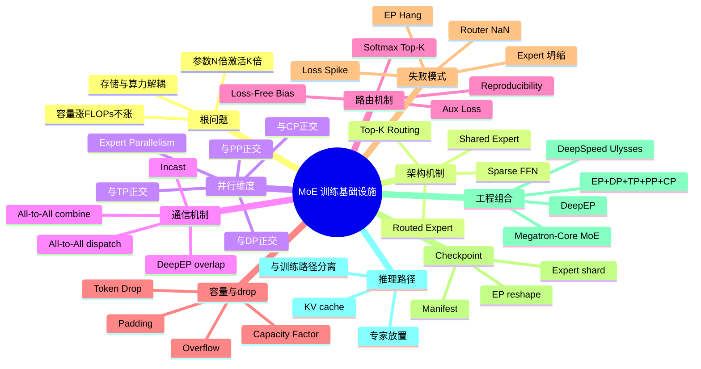
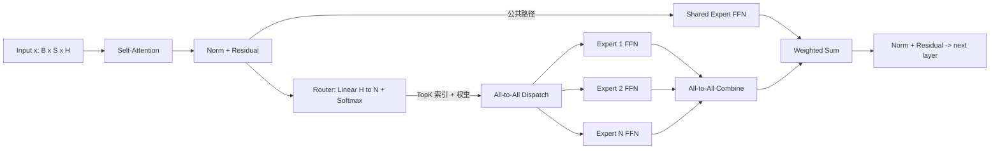
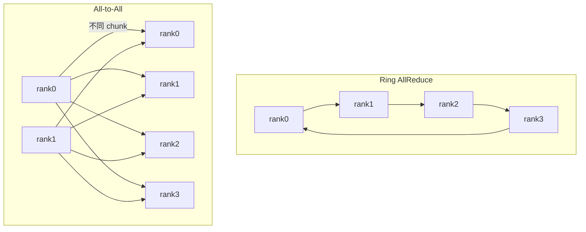
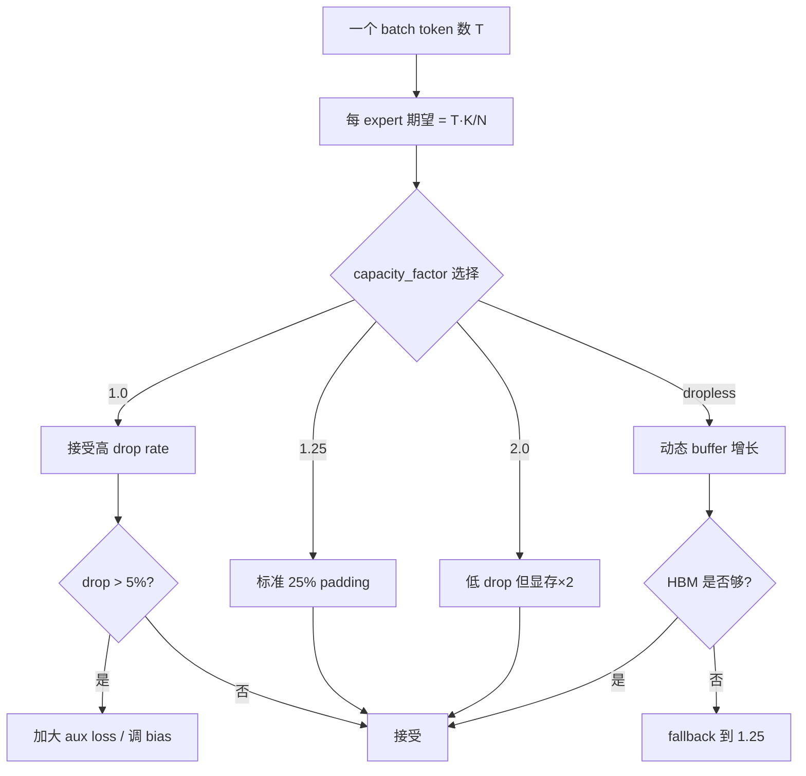
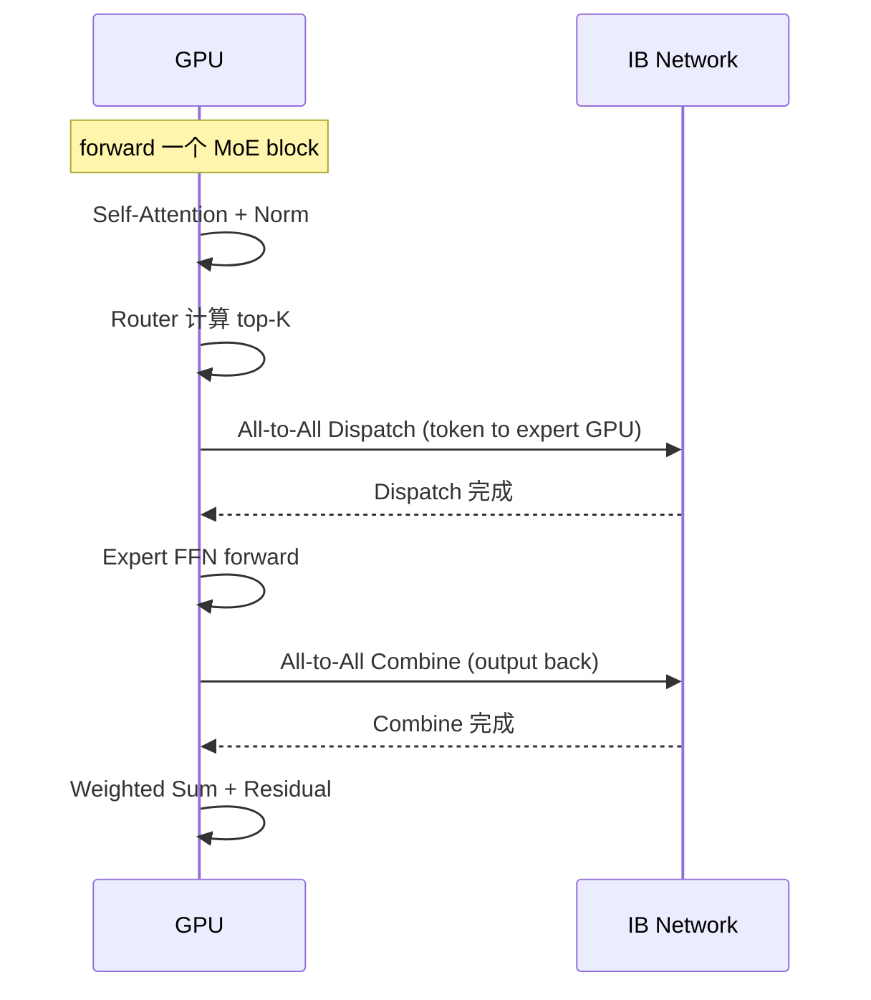
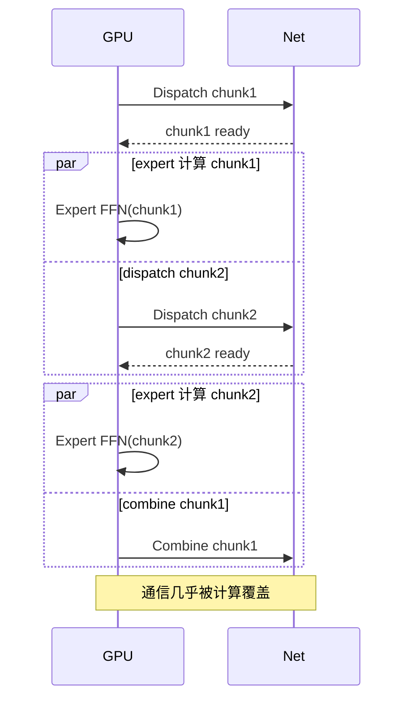
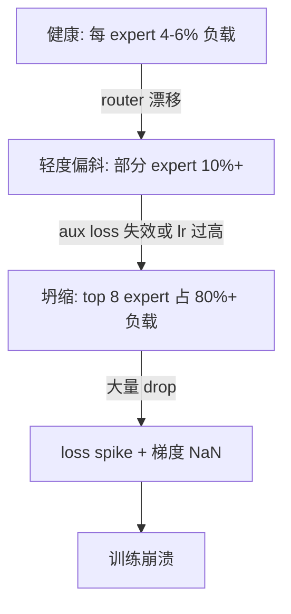
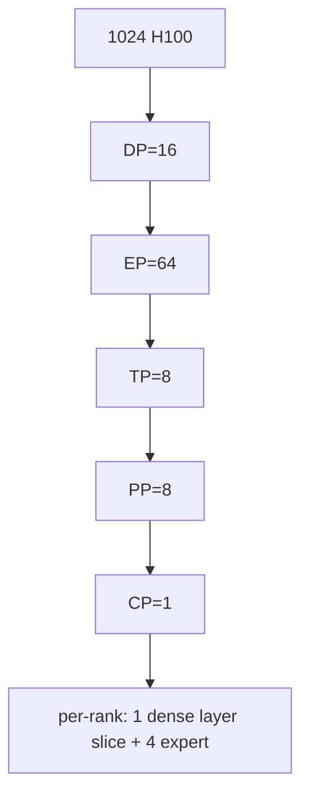
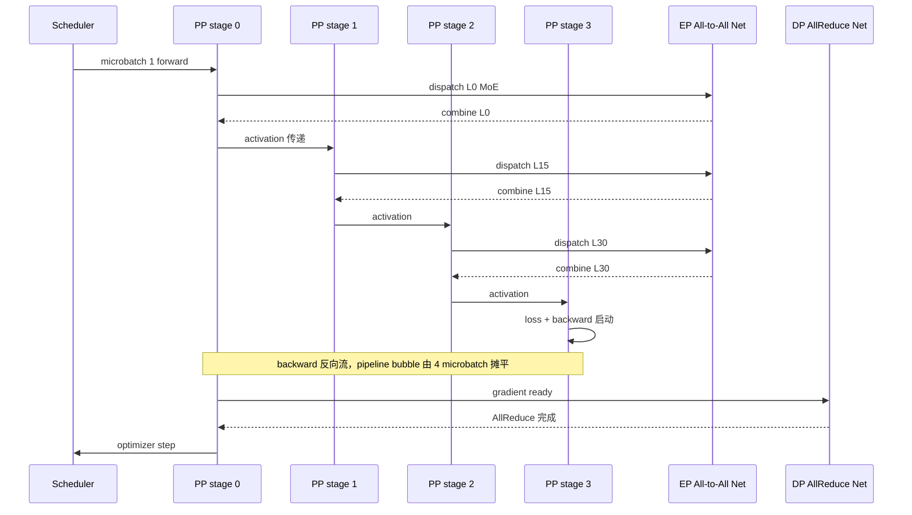

# 第 09e 章 · MoE 训练基础设施

> 2024-2025 年的大模型训练已经从 dense 集中走向 MoE：Mixtral 8×7B、DeepSeek-V2/V3、Qwen2-MoE、Grok、GPT-4、Claude 都采用了某种形式的 sparse expert 架构。MoE 让模型容量（总参数）增长不再线性拉高 FLOPs，但代价是：每个 step 必须额外做两次 All-to-All，必须在数百个 expert 之间维持 load balance，必须把 checkpoint 从"按层 shard"改成"按 expert shard"。本章把 MoE 训练当成 [第 9 章](./09-model-pipeline-parallel.md) 的第六个并行维度（EP）来系统讲。

> **关联章节**：阅读本章前请先掌握 [§9](./09-model-pipeline-parallel.md) 的 5 维并行（DP/TP/PP/CP/SP）和 rank mesh 的责任划分；阅读本章后再去 [§10](./10-memory-checkpointing-and-recovery.md) 看 checkpoint 协议在 expert shard 维度的影响。

---

## 1. 第一性原理拆解：MoE 训练为什么是独立子学科

### 1.1 拆 — 不可化简的问题

MoE 训练要解决的不可化简问题，可以浓缩成一句话：

```text
怎样让模型的"参数容量"增长，但"每 token 的 FLOPs"不成比例增长，
同时 step time、显存、collective、checkpoint 和故障域都还能在生产规模下收敛？
```

dense 模型把"参数 = 容量 = FLOPs"绑死。每加一个 layer 或加宽一个 hidden，激活就要走完所有权重，FLOPs 线性涨。结果是 70B → 405B → 1T 走到一定程度，单 step 算力就吃不消。MoE 的本质是把"FFN 这种容量大但每 token 只需要一小部分的算力"通过 router 稀疏化：每个 token 只激活 N 个 expert 中的 K 个（典型 K=2 或 K=8）。模型容量乘 N，但每 token FLOPs 只乘 K/N。

但这不是免费的。一旦把 expert 切到不同 GPU（Expert Parallelism），系统就被强行拉出"算力主导"区，进入"通信 + 路由调度"主导的世界。新出现的不可化简问题包括：

- **token dispatch**：router 决定每个 token 去哪些 expert 之后，必须把 token 物理搬到 expert 所在 GPU。这要求一次 All-to-All（dispatch），算完再一次 All-to-All（combine）回来。
- **load balance**：router 是学出来的，没有任何机制自然保证 256 个 expert 收到同样多的 token。坍缩（router 把所有 token 喂给少数热门 expert）会让大部分 GPU 空转，少数 GPU OOM。
- **capacity 决策**：每个 expert 物理上只能处理固定数量的 token（capacity factor × 平均 token 数）。超过的 token 要么 drop、要么排队、要么走 padding。drop 会损失训练信号，padding 会浪费 FLOPs。
- **incast 网络**：All-to-All 的 N×N 通信模式天然产生 incast。多个 sender 同时打向一个 receiver，交换机 buffer 溢出，ECMP 哈希不均，DCQCN/PFC 抖动。
- **checkpoint reshape**：dense 模型 checkpoint 是 layer × tensor shard。MoE 是 layer × expert × tensor shard。expert 数量本身可能在续训时变化（专家剪枝、专家增殖），reshape 不再是简单的 N→M。
- **故障爆炸半径**：一个 expert GPU 挂了，会让全局 All-to-All hang；router 出 NaN 会让所有 EP rank 同时进入 dead path。

这些子问题只在 MoE 出现，dense 训练的工程经验直接套过来会失败。所以 MoE 必须独立成章。

### 1.2 推 — 从这个问题如何推导出每个机制

从"想让容量涨但 FLOPs 不涨"出发，可以一步步推出本章的所有机制。

**为什么 sparse FFN？** Transformer 里 FFN 占了 60-70% 的参数和 FLOPs，但每个 token 显然不需要"读完所有 FFN 权重"才能预测下一个 token。把 FFN 分裂成 N 个 expert，每个 token 由 router 选 K 个，能在保留容量的同时把 FLOPs 砍到 K/N。Switch Transformer / GShard / SMoE 是这个思路的早期工程化。

**为什么 top-K + softmax？** router 输出每个 expert 的得分，必须可微才能让 router 自己被训出来。top-K + softmax 是最自然的可微近似（top-1 = Switch，top-2 = GShard，top-8 = DeepSeek-V3）。K 越大，覆盖越好，但通信和 capacity 浪费也越大。

**为什么需要 shared expert？** routed expert 之间没有共享，导致每个 expert 必须独立学到"基础语言能力 + 自己的特化"。DeepSeek-V2/V3 把一部分容量留作 shared expert（每个 token 都过），让它承担"公共基线"，routed expert 只学差异。这降低了 expert 之间的冗余学习。

**为什么 Expert Parallelism？** 256 个 expert 每个 hidden=2048 的 FFN，光参数就要几百 GB，单卡放不下。把 expert 切到不同 GPU 是最自然的切法（与 TP 切单层、PP 切多层正交）。但因为 token 选哪个 expert 是动态的，必须把 token 物理搬到 expert 所在 GPU，于是出现 All-to-All。

**为什么 capacity factor + drop？** 若每个 expert 都按"最差情况"分配 GPU 内存（接受最多的 token），代价是几乎所有 expert 都浪费 99% 容量。capacity factor 取一个折中值（通常 1.0-1.25），超出的 token 直接 drop（产出 0）或者 overflow 到下一层。drop 损失信号，但工程上是必要的。

**为什么 load balance loss？** 没有约束的 router 会迅速坍缩到只用少数 expert（强者愈强）。load balance loss 强制 router 输出的概率分布与实际 token 分布接近均匀。DeepSeek-V3 进一步提出 auxiliary-loss-free balancing，用 expert 级 bias 动态调整，避免 aux loss 与主 loss 的梯度冲突。

**为什么 communication-computation overlap？** dispatch + combine 两次 All-to-All 加起来可以占 step time 的 30-50%。如果不与 expert 计算 overlap，MFU 会很差。DeepEP（DeepSeek 开源）等优化让 dispatch 与 expert 计算重叠，把 EP 通信几乎隐藏在计算后面。

**为什么 checkpoint 要按 expert shard？** dense 模型 checkpoint 是按 layer × TP shard。MoE 多了一个 expert 维度，每个 expert 的权重独立，必须能在 EP 拓扑变化（如 EP=8 → EP=16）时按 expert 重映射。这要求 manifest 显式记录"哪个 expert 在哪个 rank"。

### 1.3 绘 — 因果链路



### 1.4 导 — 读完本章你应该能回答

1. MoE 与 dense 在容量、FLOPs、显存、通信、checkpoint 五个维度上分别相差多少倍？
2. Top-K routing 的 K 选 1、2、8 对 capacity factor、All-to-All 体积、load balance 难度分别有什么影响？
3. shared expert 与 routed expert 的设计动机是什么？为什么 DeepSeek-V3 同时用这两类？
4. Expert Parallelism 引入的两次 All-to-All 在网络上是 incast 模式还是 ring 模式？为什么 NCCL 要专门提供 ALLTOALL_ALGO_*？
5. capacity factor 为什么不能简单设为 2.0？drop rate 在训练初期、中期、末期分别有什么动态特性？
6. expert 坍缩怎么发现？aux loss 与 loss-free balancing 的工程取舍是什么？
7. EP=16 训练的 checkpoint 如何恢复到 EP=8 推理？

### 1.5 学习 checklist

- [ ] 能区分"参数容量"、"激活 FLOPs"、"通信体积"三个数字在 MoE 中的非线性关系
- [ ] 能画出一次 MoE forward 的完整 dispatch / expert / combine 时序图
- [ ] 能给出 capacity factor 的取值依据，并说明 drop rate 的监控阈值
- [ ] 能解释 aux loss 与 loss-free balancing 的优缺点
- [ ] 能根据 expert 数 / hidden / TP / PP / DP 估算 EP 的 All-to-All 体积
- [ ] 能写出 MoE checkpoint manifest 的最小 schema
- [ ] 能列出至少 3 种 MoE 特有的训练失败模式与对应的告警指标

---

## 2. MoE 架构基础：从 dense FFN 到 SMoE / DeepSeek-V3

### 2.1 dense FFN → Sparse MoE 的演化

```text
dense FFN:        x -> W_up -> SiLU -> W_down -> y           (所有 token 走全部权重)
SMoE FFN:         x -> Router(x) -> {Expert_i}_{i in TopK} -> WeightedSum -> y
DeepSeek-V3 FFN:  x -> SharedExpert(x) + Σ_{i in TopK(routed)} g_i · Expert_i(x)
```

主要演化里程碑：

| 时间 | 模型 | 关键设计 | 工程意义 |
|---|---|---|---|
| 2017 | Outrageously Large Neural Networks | top-K gating + load balance | 第一次把 sparse expert 引入 NLP |
| 2020 | GShard | top-2 routing + capacity factor | 首个工程化大规模 MoE |
| 2021 | Switch Transformer | top-1 routing 简化通信 | 减少 dispatch 体积 |
| 2024 Q1 | Mixtral 8×7B | 8 experts top-2，开放权重 | 工业界首个开源 MoE 标杆 |
| 2024 Q2 | DeepSeek-V2 | 多 routed + 1 shared expert，160 expert | shared expert 设计正式工程化 |
| 2024 Q4 | DeepSeek-V3 | 256 routed + 1 shared，top-8，loss-free balance | 把 MoE 推到 671B 总参 / 37B 激活 |
| 2024 Q4 | Qwen2-MoE | A14B 激活，60 expert | 同期开源 baseline |
| 2025 Q1 | DeepEP | dispatch / combine kernel + overlap | EP 通信工程化开源 |

### 2.2 Routed expert vs Shared expert

| 维度 | Routed expert | Shared expert |
|---|---|---|
| 激活方式 | top-K 选择 | 所有 token 都过 |
| 数量 | 几十到几百 | 通常 1-4 |
| 学习目标 | 专业化分工 | 公共基线能力 |
| 是否参与 routing | 是 | 否 |
| 是否参与 All-to-All | 是 | 否（与 dense 同处理路径） |
| 显存放置 | EP shard | 与 dense 层同处理 |
| 工程价值 | 容量扩张 | 减少 routed expert 之间的冗余学习 |

### 2.3 一个 MoE block 的标准结构



> **工程边界**：Router 是 linear + softmax，参数极小（H×N），放在 dense 路径里，每个 EP rank 都要复制一份，不参与 EP 切分。

---

## 3. Expert Parallelism (EP)：把 expert 切到不同 GPU

### 3.1 为什么 EP 必然出现

DeepSeek-V3 的 256 个 routed expert 每个 FFN 大约 0.6B 参数。256×0.6B ≈ 150B 仅 expert 权重，加上 master weight + optimizer state（Adam ×2 + master FP32 + grad），实际占 BF16 等价的 6-8 倍 → 单 expert 路径就要 ~1TB 显存。这无论如何都不能放进单卡，必须切。

切法只有 4 个选择：

| 切法 | 切什么 | 问题 |
|---|---|---|
| TP | 切单个 expert 内部 hidden | expert 太多，每个 expert 内部 GEMM 又太小，TP overhead 大 |
| PP | 把不同层的 MoE block 放不同 stage | 适用，但只解决层数问题，不解决单层 expert 太多 |
| DP/FSDP | 复制 expert | 显存爆炸，方向相反 |
| **EP** | 把不同 expert 放不同 GPU | 自然，但要 All-to-All |

### 3.2 EP 的 rank mesh

```text
global_rank = ep_rank × (DP * TP * PP * CP) + dp_rank × (TP * PP * CP) + ...
EP group: 同一个 (DP, TP, PP, CP) 坐标下，跨 EP 的 rank 集合
expert_per_rank = N / EP_size
```

| EP size | expert_per_rank（假设 N=256） | All-to-All 通信域大小 |
|---|---|---|
| 8 | 32 | 8 |
| 16 | 16 | 16 |
| 32 | 8 | 32 |
| 64 | 4 | 64 |
| 128 | 2 | 128 |
| 256 | 1 | 256（单 expert / GPU） |

> **工程边界**：EP_size 通常等于一个 NVLink/NVSwitch domain（8 或 16 卡）。再大就要跨 IB，All-to-All 体积乘 IB 链路数后吞吐很难打满。

### 3.3 EP 与其他并行的正交关系

| 并行 | 切的对象 | 与 EP 是否正交 | 备注 |
|---|---|---|---|
| DP | 样本 | 是 | 每个 DP 副本内部独立 EP |
| FSDP | 训练状态 | 部分 | shared expert + dense 路径走 FSDP，routed expert 不走 |
| TP | 单层张量 | 是 | TP 切 attention / shared FFN，EP 切 routed FFN |
| PP | 层段 | 是 | PP 切 transformer blocks，EP 切每个 block 内的 expert |
| CP | 序列 / context | 是 | CP 切 attention 上下文，与 EP 完全独立 |
| SP | 非 attention 序列 activation | 是 | 与 EP 配合时要小心 dispatch 前的 sequence layout |

---

## 4. All-to-All 通信：MoE 的真正瓶颈

### 4.1 All-to-All 的体积账本

dispatch 阶段，每个 EP rank 需要把"自己拥有的 token 中要送给其他 expert 的部分"打包发出去：

```text
dispatch 体积 (per rank, per layer) =
  tokens_per_rank × hidden × 2 (BF16) × K (top-K) × overhead(capacity_factor)
```

以 DeepSeek-V3 的典型配置（global batch 4096 × seq 4096，top-K=8，hidden=7168，EP=64）：

| 项 | 数值 |
|---|---|
| token 数（per EP rank） | 4096 × 4096 / 64 ≈ 262K |
| 每 token dispatch payload | 7168 × 2 × 8 = 114 KB |
| 单 layer dispatch 体积 | 262K × 114KB ≈ 30 GB |
| combine 体积 | 同 dispatch ≈ 30 GB |
| 单 layer EP 通信 | ≈ 60 GB |
| 一次 forward（30 MoE layer） | ≈ 1.8 TB |
| forward + backward | ≈ 3.6 TB |

> **工程含义**：在 800 Gbps IB（约 100 GB/s 双向）上，单 step EP 通信至少 30+ 秒。必须靠 overlap、capacity 调优和 dispatch 压缩才能压到 5 秒以内。

### 4.2 All-to-All 与 Ring/Tree AllReduce 的本质区别



| 维度 | Ring AllReduce | All-to-All |
|---|---|---|
| 通信模式 | 点对点环形，每 rank 1 send + 1 recv | N×N 全互联 |
| 总体积 | ~2(N-1)/N × 单卡数据量 | N × 单卡数据量 |
| 网络压力 | 均匀，链路友好 | incast 严重，受 ECMP 哈希影响 |
| 时延 | 与 N 线性 | 与 N 线性，但常数大 |
| NCCL 实现 | 成熟，多种算法 | 单一算法（NCCL_ALLTOALL_ALGO 控制） |
| 失败影响 | 慢一段 | 全 group 同时 hang |

### 4.3 NCCL ALLTOALL_ALGO_* 与网络规划

```text
NCCL_ALLTOALL_ALGO=PAIRWISE  # 默认，按 (i,j) 配对发送
NCCL_ALLTOALL_ALGO=RING       # 不存在；NCCL 不支持 Ring AllToAll
环境变量也常见: NCCL_PXN_DISABLE / NCCL_IB_HCA / NCCL_NET_GDR_LEVEL
```

| 网络层 | 调优要点 | 风险 |
|---|---|---|
| 单机 NVLink/NVSwitch | All-to-All in-domain，几乎打满 NVLink 带宽 | 跨 NVSwitch domain 直接掉到 PCIe |
| 多机 IB 800G | 必须 rail-aligned；同一 EP rank 集合走同一 rail | rail 不对齐 → ECMP 哈希成 hotspot |
| ECMP / RDMA | 用 entropy 字段（PSN / GID）打散流 | 单流容易在 1-2 链路堵塞 |
| 交换机 buffer | shared buffer 大、PFC 配置正确 | incast 时 PFC pause 反向传播 |

> **callout (warn)**：MoE 集群网络规划必须把 EP_size、rail 数、leaf 交换机 buffer 容量同时考虑。一个常见错误是按 dense 训练规划 IB（DP AllReduce 友好），结果 MoE 上线后 All-to-All 把交换机 buffer 打爆。

---

## 5. Gate Routing：让 router 学会公平分配

### 5.1 标准 top-K softmax router

```text
logits = x @ W_gate                     # [B*S, N_experts]
probs  = softmax(logits, dim=-1)
topk_val, topk_idx = topk(probs, K)
gates  = topk_val / topk_val.sum(-1)    # 归一化
```

| 设计选择 | 说明 | 风险 |
|---|---|---|
| Softmax 在 top-K 之前 | 概率含义清晰，可微 | 大部分概率被丢弃，浪费梯度 |
| Softmax 在 top-K 之后 | 直接归一化选中 expert | 梯度信号集中但不是全局概率 |
| sigmoid 替代 softmax | DeepSeek-V3 改用 sigmoid + bias | 解耦 expert 之间竞争 |
| K=1 (Switch) | 通信最小，但负载均衡难 | drop rate 高 |
| K=2 (GShard, Mixtral) | 平衡选择 | 通信×2 |
| K=8 (DeepSeek-V3) | 覆盖度高，loss 更稳 | 通信×8，capacity 难调 |

### 5.2 Router reproducibility

router 输出的 top-K 索引必须在 forward / backward / 重启之间完全一致，否则梯度不一致。常见的不一致来源：

- **浮点累加顺序**：BF16 softmax 在不同 GPU 数值不同 → 用 FP32 router
- **NaN 处理**：FP16 logits 溢出 → BF16 + clip
- **重排算法**：top-K 实现的 tie-breaker 不固定 → 强制按 expert id 升序
- **dropout / 噪声**：用 fixed seed 或不在 router 上加噪声

### 5.3 Load balance loss（aux loss）

```text
f_i = (1/T) Σ_t 1[token_t selects expert_i]   # 实际选中频率
P_i = (1/T) Σ_t softmax(logits_t)[i]          # 平均概率
L_aux = α · N · Σ_i f_i · P_i                 # Switch / GShard 的标准式
```

| 项 | 直觉 |
|---|---|
| f_i | 实际负载 |
| P_i | router 信心 |
| f_i × P_i | 让 router 不要把高概率给已经过载的 expert |
| α | 平衡系数，通常 0.001-0.01 |

### 5.4 DeepSeek-V3 的 auxiliary-loss-free balancing

aux loss 与主 loss 梯度方向常常冲突（aux loss 想"平均分散"，主 loss 想"专家化"）。DeepSeek-V3 改为：

```text
score_i = sigmoid(logits_i) + b_i
TopK by score, gate = sigmoid(logits) (only TopK)
b_i 由控制器动态调整：load_i > 平均 → b_i 减小；load_i < 平均 → b_i 增大
```

| 维度 | aux loss | loss-free balancing |
|---|---|---|
| 实现 | loss 项 | 训练循环外的控制器 |
| 主 loss 梯度污染 | 有 | 无 |
| 收敛速度 | 慢 | 快 |
| 工程复杂度 | 简单 | 需要每 step 维护 bias 状态 |
| 是否需 checkpoint | 否 | 是（bias 必须随 checkpoint 保存） |

---

## 6. Capacity Factor 与 Token Drop

### 6.1 容量定义

```text
capacity_per_expert = ceil(capacity_factor × tokens_per_batch × K / N_experts)
```

| capacity_factor | 含义 | 副作用 |
|---|---|---|
| 1.0 | 平均期望 | 任何不均衡都会 drop |
| 1.25 | 标准生产值 | 浪费 25% padding |
| 2.0 | 几乎不 drop | 浪费 100% padding，显存翻倍 |
| dropless | 动态 capacity | 实现复杂，无法预分配 buffer |

### 6.2 capacity 决策树



### 6.3 drop rate 的训练动力学

| 训练阶段 | 典型 drop rate | 原因 |
|---|---|---|
| 初期 (step < 1k) | 30-50% | router 接近随机，所有 expert 抢同样的 token |
| 中期 (1k - 100k) | 5-15% | router 开始分化，但容易过度集中 |
| 末期 (> 100k) | 1-5% | 平衡稳定 |
| 失败征兆 | drop rate 突增 + loss spike | router 坍缩或梯度爆炸 |

> **callout (note)**：drop rate 是 MoE 训练最重要的健康指标。建议 per-layer 输出，每 50 step 看一次。任何 layer drop > 20% 持续 1k step 就要告警。

---

## 7. 通信 / 计算 Overlap：DeepEP 风格的工程化

### 7.1 标准 SMoE 时序



通信占比约 30-50%。MFU 通常只有 dense 模型的 0.6 倍。

### 7.2 DeepEP 等优化路径

DeepSeek 开源的 DeepEP 把 dispatch / combine 拆成更细的 stage，并与 expert 计算 overlap：



| 优化技术 | 收益 | 限制 |
|---|---|---|
| dispatch chunking | overlap 通信与计算 | 增加 kernel launch overhead |
| in-place layout | 减少 buffer 拷贝 | 实现复杂 |
| RDMA 直写 expert buffer | 避免 host 中转 | 需要 GDR + 特殊 kernel |
| expert-side reduce | combine 阶段在 expert GPU 上做 reduce | 需要修改 NCCL plugin |

---

## 8. MoE Checkpoint：Expert 维度的 Reshape

### 8.1 MoE checkpoint manifest schema

```yaml
checkpoint:
  step: 120000
  parallel:
    DP: 16
    TP: 8
    PP: 8
    CP: 1
    EP: 64
  experts:
    total: 256
    per_rank: 4
    routing_fn: deepseek_v3_loss_free
  shards:
    - rank: 0
      ep_rank: 0
      experts_owned: [0, 1, 2, 3]
      path: step_120000/ep00/expert_0_3.safetensors
      checksum: sha256:abc...
    - rank: 1
      ep_rank: 1
      experts_owned: [4, 5, 6, 7]
      ...
  bias_state:                       # loss-free balancing 的 bias
    path: step_120000/router_bias.pt
    checksum: sha256:def...
```

### 8.2 Reshape：EP=64 → EP=32 的恢复


| reshape 类型 | 难度 | 备注 |
|---|---|---|
| EP=64 → EP=32（合并） | 容易 | 每 rank 只需多读一个旧 shard |
| EP=64 → EP=128（拆分） | 容易 | 每 rank 读一半旧 shard |
| 256 expert → 128 expert（剪枝） | 难 | 需要 expert importance 排序 + router 权重重映射 |
| 256 expert → 320 expert（增殖） | 难 | 新 expert 初始化策略未定，常见做法是复制 + 加噪 |

### 8.3 与 dense checkpoint 的对比

| 维度 | dense | MoE |
|---|---|---|
| shard 维度 | layer × TP | layer × expert × TP |
| manifest 大小 | KB | MB（256 expert × 60 layer） |
| reshape 复杂度 | TP / PP 重排 | + expert→rank 重映射 |
| 单 shard 大小 | 几 GB | 几百 MB（每 expert 单独） |
| 写入吞吐 | 大文件少 | 小文件多，元数据压力大 |
| 推荐存储 | 并行文件系统 | object store + manifest |

---

## 9. MoE 训练的特有失败模式

### 9.1 Expert 坍缩

router 把 90%+ 的 token 路由给少数 expert，其他 expert 长期空转。



**告警指标**：

| 指标 | 阈值 | 含义 |
|---|---|---|
| max_expert_load / avg | > 3 | 单 expert 严重过载 |
| min_expert_load / avg | < 0.1 | 部分 expert 几乎不工作 |
| drop_rate per layer | > 20% 持续 1k step | 容量被打爆 |
| router_entropy | < 2 (理论 max log(N)) | router 确信度过高 |

### 9.2 Loss spike

| 来源 | 检测 | 缓解 |
|---|---|---|
| router NaN | 监控 logits 范围 | FP32 router + clip |
| 单 expert 梯度爆炸 | per-expert grad norm | per-expert clip |
| All-to-All 数据腐坏 | combine 后激活 NaN | NCCL checksum + 重试 |
| capacity overflow | drop rate 突增 | 临时增大 capacity_factor |

### 9.3 Router gradient noise

top-K 是不可微的（只有被选中的 expert 收到梯度）。常见症状：

- router 在前 1k step 几乎不动
- 个别 expert 永远不被选中（dead expert）
- expert 之间梯度方差大

**缓解**：noisy top-K（GShard）、随机扰动、router 用 lower lr、热身阶段强制均匀路由。

---

## 10. MoE vs Dense 的工程对比

| 维度 | Dense 70B | MoE 256×0.6B (DeepSeek-V3 风格) |
|---|---|---|
| 总参数 | 70B | 671B |
| 激活参数 / token | 70B | 37B |
| 单 step FLOPs | 1× baseline | 0.5× baseline |
| HBM 单卡（无 sharding） | 800 GB+ | 8 TB+（必须 EP） |
| 通信 per step | DP AllReduce + TP AllReduce | + 2× All-to-All per layer |
| checkpoint 大小 | ~140 GB（fp16） | ~1.4 TB |
| checkpoint shard 数 | 数百 | 数千到数万 |
| 故障爆炸半径 | TP/PP group | + EP group |
| MFU 典型值 | 45-55% | 25-35% |
| 训练稳定性 | 较好 | 需主动监控 expert 健康 |
| inference 难度 | 标准 | 需要 expert placement 策略 |

---

## 11. MoE + 其他并行的 5 维组合

### 11.1 经典 5 维并行配置



满足约束：`world_size = DP × EP × TP × PP × CP = 16 × 64 × 8 × 8 × 1`？这个例子不严格，因为 EP 和 TP/PP 互相正交但维度上不直接相乘（EP 切 routed FFN，TP 切 attention/shared FFN），实际 rank 拓扑是 mesh 而非乘法。

### 11.2 Megatron-Core MoE 与 DeepSpeed-MoE 的差异

| 框架 | EP 实现 | 与 PP 配合 | 与 ZeRO 配合 |
|---|---|---|---|
| Megatron-Core MoE | tensor mesh，EP 是 mesh 的一维 | 良好 | 部分 |
| DeepSpeed-MoE | EP 独立 group | 需手工配置 | ZeRO-3 已支持 |
| DeepEP (kernel only) | 与上面框架配合 | 不参与 | 不参与 |
| Megatron + Ulysses | 加 SP / CP 维度 | 良好 | 部分 |

### 11.3 5 维并行的 rank mesh 责任表

| group | 负责的状态 | 负责的通信 | checkpoint shard 单位 |
|---|---|---|---|
| DP group | 副本之间同步梯度 | gradient AllReduce / FSDP AllGather | 全副本 |
| EP group | 不同 expert 的权重 | All-to-All dispatch / combine | per expert |
| TP group | 单层张量切片 | AllReduce / AllGather | per TP shard |
| PP group | 不同 stage 的层 | activation send / recv | per stage |
| CP group | attention context 切片 | ring KV / All-to-All | （无 weight，运行时） |

---

## 12. 推理时的 MoE：训练 ≠ 推理

| 维度 | 训练 | 推理 |
|---|---|---|
| batch | 大 (4M tokens) | 小 (1-100 sequences) |
| capacity factor | 1.25 | 必须 dropless |
| EP 拓扑 | 与 GPU 数耦合 | 按 expert placement 优化 |
| 通信 | All-to-All 主导 | 期望避免 All-to-All（小 batch 不划算） |
| 部署 | 单一集群 | 可能多副本，每副本完整 expert set |
| checkpoint 转换 | 不需要 | 必须把 EP shard reshape 到 inference EP |

### 12.1 Mixtral / DeepSeek-V3 的推理部署

| 模型 | 总参 | 激活参 | 推理 EP | 推理策略 |
|---|---|---|---|---|
| Mixtral 8×7B | 47B | 13B | EP=2 或 4 | 每副本完整 8 expert |
| DeepSeek-V3 | 671B | 37B | EP=8-16 | 多副本 + expert prefetch |
| Qwen2-MoE A14B | A14B | 2.7B | EP=4 | 标准部署 |

> **callout (warn)**：训练用 EP=64 + capacity_factor=1.25 + drop。推理 batch 极小时，drop 是不可接受的，必须 dropless 或 capacity=2.0。这意味着推理引擎的代码路径与训练完全不同。

---

## 13. Worked Example：DeepSeek-V3 风格 MoE 训练完整账本

### 13.1 模型与集群设定

| 项 | 值 |
|---|---|
| 总参 | 671B |
| 激活参 / token | 37B |
| layers | 61 (其中 58 个 MoE layer) |
| hidden | 7168 |
| expert FFN intermediate | 2048 |
| routed expert | 256 |
| shared expert | 1 |
| top-K | 8 |
| seq length | 4096 |
| global batch | 1024 sequences (4M tokens) |
| GPU | 2048 × H100 80GB（256 节点 × 8 卡） |
| 互联 | 节点内 NVSwitch 900 GB/s；节点间 8 × 400 Gbps IB |

### 13.2 5 维并行配置

```text
DP = 32
EP = 64
TP = 8
PP = 4
CP = 1
world_size 校验: DP × TP × PP × CP = 32 × 8 × 4 × 1 = 1024（dense 路径 rank 数）
EP rank 数 = 64（与 dense 路径正交，覆盖 1024 ranks 的 expert routing）
```

| 维度 | 大小 | 放置 |
|---|---|---|
| TP | 8 | 节点内 NVSwitch |
| EP | 64 | 跨 8 节点（每节点 8 个 EP rank） |
| PP | 4 | 跨 32 节点（每 stage 8 节点） |
| DP | 32 | 跨剩余维度 |

### 13.3 显存预算（per rank）

| 项 | 大小（GB） | 说明 |
|---|---|---|
| dense 层参数（attention + shared FFN）shard | 6 | TP=8 切完 |
| routed expert 参数（4 expert / rank） | 5 | EP=64 切完后每 rank 4 个 |
| optimizer state (Adam, FP32 ×2) | 22 | DP / FSDP 部分 shard |
| master weight (FP32) | 11 | |
| gradient buffer (BF16) | 11 | |
| activation (with checkpointing) | 8 | seq=4096, mb=1, recompute 70% |
| dispatch / combine buffer | 6 | capacity_factor 1.25 × 8 token × 7168 × 2 byte |
| NCCL / 通信 buffer | 3 | |
| 余量 | 8 | 80GB 上限，剩余安全裕量 |

### 13.4 通信账本（per step）

| 通信 | 频率 / step | 单次体积 | 总体积 |
|---|---|---|---|
| dispatch All-to-All | 58 layer × 4 microbatch | 30 GB / EP rank | ~7 TB |
| combine All-to-All | 58 layer × 4 microbatch | 30 GB / EP rank | ~7 TB |
| TP AllReduce (attention) | 61 layer × 4 mb × 2 | 1 GB | ~0.5 TB |
| PP send/recv | 4 stage × 4 mb × 2 dir | 0.5 GB | ~16 GB |
| DP gradient AllReduce | 1 / step | 11 GB | 11 GB |

> **关键瓶颈**：dispatch + combine 占总通信 ~14 TB，是 DP AllReduce 的 1000 倍。MoE 训练的通信预算几乎完全由 EP 决定。

### 13.5 单 step 时序



### 13.6 健康指标 dashboard

| 指标 | 采集点 | 阈值 | 告警 |
|---|---|---|---|
| step time | trainer | > 1.3 × baseline | warning |
| All-to-All wait | NCCL trace | > 40% step | critical |
| drop rate per layer | router stat | > 15% / 1k step | critical |
| max_load / avg_load | router stat | > 3 / 1k step | warning |
| router entropy | router stat | < 2 | warning |
| expert grad norm max/min | optimizer | > 100 | critical |
| MFU | trainer | < 25% | warning |
| checkpoint write time | ckpt writer | > 5 min | warning |

### 13.7 一次 incident 排查示例

> 现象：step time 从 4.2s 涨到 6.8s，drop rate 从 5% 涨到 22%，loss 微涨。

排查路径：

1. dashboard 看到 drop rate 突增 → 怀疑 router 漂移
2. 查看 per-expert load，发现 expert 17, 42, 109 负载占 65%
3. 查看 router_bias（loss-free balancing 状态），发现 bias 控制器在过去 1k step 没更新（一个 EP rank 的状态丢了）
4. 定位到 EP rank 23 在某次 OOM 重启后 bias state 没正确 restore
5. 修复：从 checkpoint 重新加载 router_bias，step time 和 drop rate 恢复

> **教训**：MoE 的 checkpoint 不只是参数，**控制器状态（bias、moving avg、capacity counter）必须一并 checkpoint**，否则恢复后 router 行为不一致。

---

## 14. 工程边界总结

| 边界 | 说明 |
|---|---|
| EP_size 上限 | 实际不超过单个高速互联 domain（NVSwitch 8/16） + IB rail 数 |
| top-K 上限 | K 越大通信越大；K=8 是当前生产上限 |
| capacity_factor 取值 | 1.0 太激进，2.0 太浪费，1.25 是工业默认 |
| router 数值精度 | 必须 FP32 |
| aux loss vs loss-free | 大模型推荐 loss-free，小模型 aux 简单 |
| MoE checkpoint | 必须含 expert→rank 映射 + 控制器状态 |
| inference 路径 | 与训练完全分离，不可复用 EP=64 |
| 故障半径 | 一个 expert GPU 挂 → 全 EP group hang，必须 fast detect |

---

## 15. 练习

- **09e-1（基础）**：dense 70B 与 MoE 256×0.6B（K=8）相比，激活 FLOPs 和总参各差多少倍？
- **09e-2（基础）**：top-K=2 与 top-K=8 的 dispatch 体积相差多少？capacity_factor 不变情况下哪个 drop rate 更高？
- **09e-3（基础）**：写出 capacity_per_expert 的公式，并解释 capacity_factor=1.25 时 25% 的 padding 浪费来自哪里。
- **09e-4（基础）**：列出 MoE 特有的 4 类失败模式，并对每一类给出至少一个监控指标。
- **09e-5（进阶）**：DeepSeek-V3 用 sigmoid + bias 替代 softmax。请解释为什么这样可以解耦 expert 之间的竞争。
- **09e-6（进阶）**：EP=64 在跨 8 节点的 IB 网络上做 All-to-All，请估算单 layer 通信延迟（假设 dispatch 30GB，800Gbps IB 双向，4 个 rail）。
- **09e-7（进阶）**：设计一个 MoE checkpoint manifest schema，要求支持 EP=64 → EP=32 reshape，且包含 loss-free balancing 的 bias 状态。
- **09e-8（进阶）**：训练中观察到 expert 17 长期负载只有平均的 5%（dead expert），列出至少 3 种可能原因和对应排查命令。
- **09e-9（进阶）**：DeepEP 把 dispatch 拆 chunk 与 expert 计算 overlap。请画出一个 4 chunk 的时序图，并估算 overlap 后 EP 通信的有效占比。
- **09e-10（设计）**：为 8 节点 × 8 卡 H100（IB 800Gbps）设计一个 64 expert × top-2 的 MoE 训练并行配置。给出 DP / EP / TP / PP 的具体值，并估算单 step 显存和通信。
- **09e-11（设计）**：训练用 EP=64 + capacity_factor=1.25 + drop。请设计推理路径的部署方案：单副本要求 dropless，推理 batch=8 sequences。说明 expert placement、KV cache、与训练 checkpoint 的转换步骤。
- **09e-12（开放）**：MoE 与 long context（CP）同时使用时，dispatch 之前的 sequence 维度布局会变得复杂。请说明 SP+CP+EP 三者组合时，dispatch 应该在哪一步发生，激活布局如何切换。

---

## 16. 深度参考阅读

- Shazeer et al., *Outrageously Large Neural Networks: The Sparsely-Gated Mixture-of-Experts Layer*, ICLR 2017（top-K gating + load balance loss 起源）
- Lepikhin et al., *GShard: Scaling Giant Models with Conditional Computation and Automatic Sharding*, ICLR 2021（top-2 + capacity factor 工程化）
- Fedus et al., *Switch Transformer: Scaling to Trillion Parameter Models with Simple and Efficient Sparsity*, JMLR 2022（top-1 + 简化通信）
- Mistral AI, *Mixtral of Experts*, 2024（8 expert top-2 开源标杆）
- DeepSeek-AI, *DeepSeekMoE: Towards Ultimate Expert Specialization*, 2024（fine-grained expert + shared expert）
- DeepSeek-AI, *DeepSeek-V2 / V3 Technical Reports*, 2024（loss-free balancing + 256 expert + 671B 工业实践）
- Qwen Team, *Qwen2-MoE Technical Report*, 2024
- DeepSeek-AI, *DeepEP: Efficient Expert Parallelism Communication Library*, GitHub 2025（dispatch / combine kernel + overlap）
- Megatron-Core MoE 文档（NVIDIA 工程实现）
- DeepSpeed-MoE 文档与 ZeRO-3 + EP 整合
- Tutel: An efficient mixture-of-experts implementation（微软）
- *ST-MoE: Designing Stable and Transferable Sparse Expert Models*, Zoph et al., 2022（router z-loss、稳定性技巧）
- *Expert Choice Routing*, Zhou et al., 2022（reverse routing：让 expert 选 token，天然平衡）
