# 第 09e 章 · MoE 训练基础设施

> 2024-2025 年的大模型训练已经从 dense 集中走向 MoE：公开资料可确认的代表包括 Mixtral 8×7B、DeepSeek-V2/V3、Qwen2-MoE 等；Grok 等模型也公开披露了 MoE / sparse expert 方向。GPT-4、Claude 这类闭源模型是否采用 MoE 只能作为外部推测或行业传闻处理，不能写成确定事实。MoE 让模型容量（总参数）增长不再线性拉高 FLOPs，但代价是：每个 MoE layer 的 forward 至少 dispatch + combine 两次 All-to-All，backward 还要反向通信，必须在数百个 expert 之间维持 load balance，必须把 checkpoint 从"按层 shard"改成"按 expert shard"。本章把 MoE 训练当成 [第 9 章](./09-model-pipeline-parallel.md) 的第六个并行维度（EP）来系统讲。

> **关联章节**：阅读本章前请先掌握 [§9](./09-model-pipeline-parallel.md) 的 5 维并行（DP/TP/PP/CP/SP）和 rank mesh 的责任划分；阅读本章后再去 [§10](./10-memory-checkpointing-and-recovery.md) 看 checkpoint 协议在 expert shard 维度的影响。

---

## 1. 第一性原理拆解：MoE 训练为什么是独立子学科

### 1.1 拆 — 不可化简的问题

MoE 训练要解决的不可化简问题，可以浓缩成一句话：

```text
怎样让模型的"参数容量"增长，但"每 token 的 FLOPs"不成比例增长，
同时 step time、显存、collective、checkpoint 和故障域都还能在生产规模下收敛？
```

dense 模型把"参数 = 容量 = FLOPs"绑死。每加一个 layer 或加宽一个 hidden，激活就要走完所有权重，FLOPs 线性涨。结果是 70B → 405B → 1T 走到一定程度，单 step 算力就吃不消。MoE 的本质是把"FFN 这种容量大但每 token 只需要一小部分的算力"通过 router 稀疏化：每个 token 只激活 N 个 routed expert 中的 K 个（典型 K=2 或 K=8）。在单个 MoE layer 的 routed FFN 局部口径下，expert FFN 计算大致随 K 增长，而不是随全部 N 个 expert 增长；不能把端到端每 token FLOPs 简化成"只乘 K/N"。完整 step time 还包括 attention、router、shared expert、dispatch/combine、load imbalance、activation recompute、反向传播通信和 optimizer/checkpoint 等路径。

但这不是免费的。一旦把 expert 切到不同 GPU（Expert Parallelism），系统就被强行拉出"算力主导"区，进入"通信 + 路由调度"主导的世界。新出现的不可化简问题包括：

- **token dispatch**：router 决定每个 token 去哪些 expert 之后，必须把 token 物理搬到 expert 所在 GPU。这要求一次 All-to-All（dispatch），算完再一次 All-to-All（combine）回来。
- **load balance**：router 是学出来的，没有任何机制自然保证 256 个 expert 收到同样多的 token。坍缩（router 把所有 token 喂给少数热门 expert）会让大部分 GPU 空转，少数 GPU OOM。
- **capacity / dropless 决策**：早期 MoE 常给每个 expert 固定 token capacity（capacity factor × 平均 token 数），超出 token drop 或 overflow；DeepSeek-V3 这类现代大 MoE 更常走 dropless，把实际路由量通过 alltoallv / flex dispatcher 搬运。前者要监控 drop rate，后者要监控 load skew、buffer peak 和 straggler。
- **incast 网络**：All-to-All 的 N×N 通信模式天然产生 incast。多个 sender 同时打向一个 receiver，交换机 buffer 溢出，ECMP 哈希不均，DCQCN/PFC 抖动。
- **checkpoint reshape**：dense 模型 checkpoint 是 layer × tensor shard。MoE 是 layer × expert × tensor shard。expert 数量本身可能在续训时变化（专家剪枝、专家增殖），reshape 不再是简单的 N→M。
- **故障爆炸半径**：一个 expert GPU 挂了，会让全局 All-to-All hang；router 出 NaN 会让所有 EP rank 同时进入 dead path。

这些子问题只在 MoE 出现，dense 训练的工程经验直接套过来会失败。所以 MoE 必须独立成章。

### 1.2 推 — 从这个问题如何推导出每个机制

从"想让容量涨但 FLOPs 不涨"出发，可以一步步推出本章的所有机制。

**为什么 sparse FFN？** Transformer 里 FFN 占了 60-70% 的参数和 FLOPs，但每个 token 显然不需要"读完所有 FFN 权重"才能预测下一个 token。把 FFN 分裂成 N 个 expert，每个 token 由 router 选 K 个，能在保留容量的同时把 FLOPs 砍到 K/N。Switch Transformer / GShard / SMoE 是这个思路的早期工程化。

**为什么 top-K + gate weight？** router 输出每个 expert 的得分，top-K 只决定"这个 token 被送到哪些 expert"，这个 membership 是离散的、不可微的；真正承载主 loss 梯度的是被选中 expert 的 gate weight 和 expert output。top-1 / top-2 / top-8 的差异首先是每 token 激活多少条 expert path，K 越大覆盖越好，但通信、buffer 和 load balance 压力也越大。

**为什么需要 shared expert？** routed expert 之间没有共享，导致每个 expert 必须独立学到"基础语言能力 + 自己的特化"。DeepSeek-V2/V3 把一部分容量留作 shared expert（每个 token 都过），让它承担"公共基线"，routed expert 只学差异。这降低了 expert 之间的冗余学习。

**为什么 Expert Parallelism？** 以 DeepSeek-V3 的 routed expert 为例，单个 SwiGLU expert/layer 的参数近似 `3 × H × I`，`H=7168, I=2048` 时约 44M；256 个 routed expert 就是约 11.3B 参数/MoE layer，58 个 MoE layer 接近 650B routed expert 参数。把 expert 切到不同 GPU 是最自然的切法（与 TP 切单层、PP 切多层正交）。但因为 token 选哪个 expert 是动态的，必须把 token 物理搬到 expert 所在 GPU，于是出现 All-to-All。

**为什么有 fixed-capacity 和 dropless 两条路径？** fixed-capacity MoE 通过 `capacity_factor` 预分配 buffer，超出的 token drop 或 overflow，工程简单但损失训练信号；dropless MoE 不默认丢 token，而是按真实 token 数动态打包、alltoallv 传输、可变长度 combine，代价是 buffer 峰值、负载偏斜和 straggler 更难控制。DeepSeek-V3 风格应按 dropless/flex dispatcher 来理解，而不是 `capacity_factor=1.25 + token drop`。

**为什么 load balance loss？** 没有约束的 router 会迅速坍缩到只用少数 expert（强者愈强）。load balance loss 强制 router 输出的概率分布与实际 token 分布接近均匀。DeepSeek-V3 进一步提出 auxiliary-loss-free balancing，用 expert 级 bias 动态调整，避免 aux loss 与主 loss 的梯度冲突。

**为什么 communication-computation overlap？** dispatch + combine 两次 All-to-All 加起来可以占 step time 的 30-50%。如果不与 expert 计算 overlap，MFU 会很差。DeepEP（DeepSeek 开源）等优化让 dispatch 与 expert 计算重叠，把 EP 通信几乎隐藏在计算后面。

**为什么 checkpoint 要按 expert shard？** dense 模型 checkpoint 是按 layer × TP shard。MoE 多了一个 expert 维度，每个 expert 的权重独立，必须能在 EP 拓扑变化（如 EP=8 → EP=16）时按 expert 重映射。这要求 manifest 显式记录"哪个 expert 在哪个 rank"。

### 1.3 绘 — 因果链路

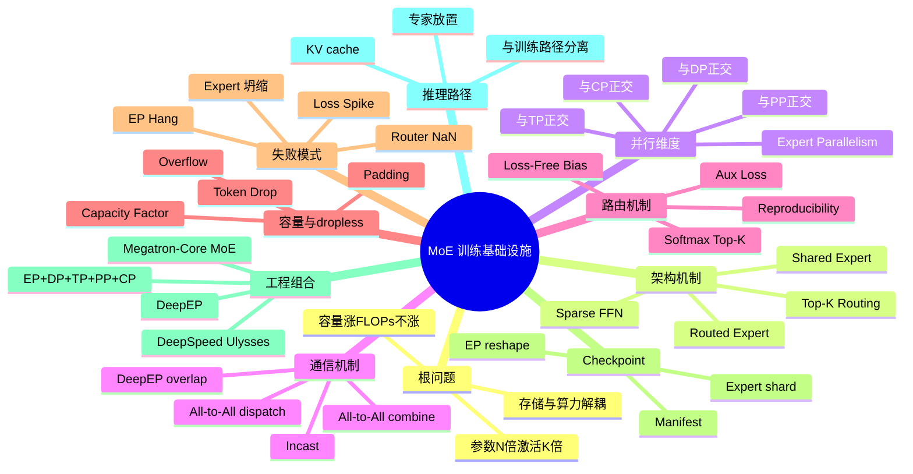

### 1.4 导 — 读完本章你应该能回答

1. MoE 与 dense 在容量、FLOPs、显存、通信、checkpoint 五个维度上分别相差多少倍？
2. Top-K routing 的 K 选 1、2、8 对 capacity factor、All-to-All 体积、load balance 难度分别有什么影响？
3. shared expert 与 routed expert 的设计动机是什么？为什么 DeepSeek-V3 同时用这两类？
4. Expert Parallelism 引入的两次 All-to-All 在网络上是 incast 模式还是 ring 模式？为什么 alltoallv / flex dispatcher 比固定等长 alltoall 更适合 dropless MoE？
5. capacity factor 为什么不能简单设为 2.0？dropping MoE 与 dropless MoE 分别应该监控哪些指标？
6. expert 坍缩怎么发现？aux loss 与 loss-free balancing 的工程取舍是什么？
7. EP=16 训练的 checkpoint 如何恢复到 EP=8 推理？

### 1.5 学习 checklist

- [ ] 能区分"参数容量"、"激活 FLOPs"、"通信体积"三个数字在 MoE 中的非线性关系
- [ ] 能画出一次 MoE forward 的完整 dispatch / expert / combine 时序图
- [ ] 能区分 fixed-capacity dropping MoE 与 dropless MoE，并给出各自的监控阈值
- [ ] 能解释 aux loss 与 loss-free balancing 的优缺点
- [ ] 能根据 expert 数 / hidden / TP / PP / DP 估算 EP 的 All-to-All 体积
- [ ] 能写出 MoE checkpoint manifest 的最小 schema
- [ ] 能列出至少 3 种 MoE 特有的训练失败模式与对应的告警指标

---

## 2. MoE 架构基础：从 dense FFN 到 SMoE / DeepSeek-V3

### 2.1 dense FFN → Sparse MoE 的演化

```text
dense FFN:        x -> W_up -> SiLU -> W_down -> y           (所有 token 走全部权重)
SMoE FFN:         x -> Router(x) -> {Expert_i}_{i in TopK} -> WeightedSum -> y
DeepSeek-V3 FFN:  x -> SharedExpert(x) + Σ_{i in TopK(routed)} g_i · Expert_i(x)
```

主要演化里程碑：

| 时间 | 模型 | 关键设计 | 工程意义 |
|---|---|---|---|
| 2017 | Outrageously Large Neural Networks | top-K gating + load balance | 第一次把 sparse expert 引入 NLP |
| 2020 | GShard | top-2 routing + capacity factor | 首个工程化大规模 MoE |
| 2021 | Switch Transformer | top-1 routing 简化通信 | 减少 dispatch 体积 |
| 2024 Q1 | Mixtral 8×7B | 8 experts top-2，开放权重 | 工业界首个开源 MoE 标杆 |
| 2024 Q2 | DeepSeek-V2 | 多 routed + 1 shared expert，160 expert | shared expert 设计正式工程化 |
| 2024 Q4 | DeepSeek-V3 | 256 routed + 1 shared，top-8，loss-free balance | 把 MoE 推到 671B 总参 / 37B 激活 |
| 2024 Q4 | Qwen2-MoE | A14B 激活，60 expert | 同期开源 baseline |
| 2025 Q1 | DeepEP | dispatch / combine kernel + overlap | EP 通信工程化开源 |

### 2.2 Routed expert vs Shared expert

| 维度 | Routed expert | Shared expert |
|---|---|---|
| 激活方式 | top-K 选择 | 所有 token 都过 |
| 数量 | 几十到几百 | 通常 1-4 |
| 学习目标 | 专业化分工 | 公共基线能力 |
| 是否参与 routing | 是 | 否 |
| 是否参与 All-to-All | 是 | 否（与 dense 同处理路径） |
| 显存放置 | EP shard | 与 dense 层同处理 |
| 工程价值 | 容量扩张 | 减少 routed expert 之间的冗余学习 |

### 2.3 一个 MoE block 的标准结构

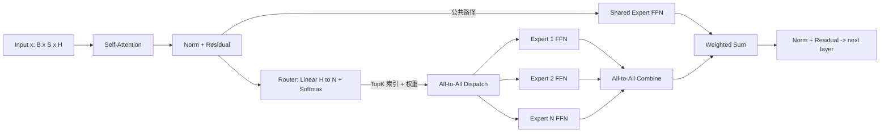

> **工程边界**：Router 是 `hidden -> expert score` 的小线性层，后面可以接 softmax、sigmoid+bias 或其他 gate 变换。router 参数极小（H×N），放在 dense 路径里，每个 EP rank 都要复制一份，不参与 EP 切分。

---

## 3. Expert Parallelism (EP)：把 expert 切到不同 GPU

### 3.1 为什么 EP 必然出现

DeepSeek-V3 的 routed expert 不是"每个 expert 0.6B"。按 SwiGLU FFN 估算，单 expert/layer 参数约为：

```text
params_per_expert_per_layer ~= W_gate + W_up + W_down
                              ~= H×I + H×I + I×H
                              ~= 3 × H × I

H = 7168, I = 2048  =>  3 × 7168 × 2048 ~= 44M
256 routed experts/layer => 44M × 256 ~= 11.3B
58 MoE layers => 11.3B × 58 ~= 656B routed expert params
```

这 650B 级别的 routed expert 参数加上 master weight、optimizer state、gradient 和 checkpoint buffer，任何单卡或单个 dense TP shard 都放不下，必须引入 EP。

切法只有 4 个选择：

| 切法 | 切什么 | 问题 |
|---|---|---|
| TP | 切单个 expert 内部 hidden | expert 太多，每个 expert 内部 GEMM 又太小，TP overhead 大 |
| PP | 把不同层的 MoE block 放不同 stage | 适用，但只解决层数问题，不解决单层 expert 太多 |
| DP/FSDP | 复制 expert | 显存爆炸，方向相反 |
| **EP** | 把不同 expert 放不同 GPU | 自然，但要 All-to-All |

### 3.2 EP 的 rank mesh

严格 mesh 下，EP 是 world mesh 的一维，而不是"附着"在 dense mesh 外面的虚拟维度：

```text
world_size = DP × PP × TP × EP × CP

rank coordinate = (dp_rank, pp_rank, tp_rank, ep_rank, cp_rank)
EP group        = 固定 (dp_rank, pp_rank, tp_rank, cp_rank)，跨 ep_rank
expert_per_rank = N_experts / EP_size              # 不考虑 ETP 时
```

有些系统会做 **MoE Parallel Folding**：attention / shared FFN 使用一套 dense 视图，MoE routed FFN 使用另一套 expert 视图。例如 dense path 可在 `(DP_dense, PP, TP, CP)` 上执行，进入 MoE block 前把 token layout fold 到 `(DP_moe, PP, TP_or_ETP, EP, CP)`。这种写法不是说 EP 不占 GPU，而是同一批 physical ranks 在不同子模块里解释成不同 mesh 维度。教程和配置必须明确当前是在严格 mesh 还是 folding 视图下讨论，否则 `DP × EP × TP × PP × CP` 会对不上 world size。

| EP size | expert_per_rank（假设 N=256） | All-to-All 通信域大小 |
|---|---|---|
| 8 | 32 | 8 |
| 16 | 16 | 16 |
| 32 | 8 | 32 |
| 64 | 4 | 64 |
| 128 | 2 | 128 |
| 256 | 1 | 256（单 expert / GPU） |

> **工程边界**：EP_size 通常等于一个 NVLink/NVSwitch domain（8 或 16 卡）。再大就要跨 IB，All-to-All 体积乘 IB 链路数后吞吐很难打满。

### 3.3 EP 与其他并行的正交关系

| 并行 | 切的对象 | 与 EP 是否正交 | 备注 |
|---|---|---|---|
| DP | 样本 | 是 | 每个 DP 副本内部独立 EP |
| FSDP | 训练状态 | 部分 | shared expert + dense 路径走 FSDP，routed expert 不走 |
| TP | 单层张量 | 是 | TP 切 attention / shared FFN，EP 切 routed FFN |
| PP | 层段 | 是 | PP 切 transformer blocks，EP 切每个 block 内的 expert |
| CP | 序列 / context | 是 | CP 切 attention 上下文，与 EP 完全独立 |
| SP | 非 attention 序列 activation | 是 | 与 EP 配合时要小心 dispatch 前的 sequence layout |

TP 与 EP “正交”不代表 routed expert 一定不受 TP 影响。配置必须写清 routed FFN 采用哪种布局：

| routed expert 布局 | 含义 | 代价 |
|---|---|---|
| `ETP = TP` | 每个 expert 内部也按 TP 切 FFN hidden/intermediate | expert GEMM 更小，通信/reshape 更复杂 |
| `ETP = 1` 且 dense TP rank 复制 expert | 每个 dense `tp_rank` 都持有一套 routed experts | expert 参数和 optimizer state 按 TP 复制，HBM 账本必须乘入 |
| MoE Parallel Folding | 进入 MoE block 前把 dense TP view fold 成 expert view，例如用更大的 EP 或 EDP 吸收 dense TP | layout 转换复杂，但避免无意复制 routed expert |

下面 worked example 使用严格 mesh `TP=4, EP=64, ETP=1` 时，表示 routed experts 在 dense TP rank 间复制；若生产实现不想复制，应把示例改写为 folding view 或 `ETP=TP`，并同步重算 HBM 与通信。

### 3.4 ETP / TP / EP 的 layout transition

`ETP`（Expert Tensor Parallel）决定单个 expert 内部是否再切 tensor。进入 routed FFN 前，activation layout 必须从 dense path 的 TP/SP layout 转成 expert path 能消费的 layout；出来后再转回 dense path。三种常见路径如下：

| 路径 | 进入 MoE 前 activation | expert 内部 collective | MoE 输出如何回 dense path | checkpoint 语义 |
|---|---|---|---|---|
| `ETP = TP` | 每个 dense `tp_rank` 也参与同一个 expert 的 TP shard；dispatch payload 通常是 `H/TP` shard 或按实现先 gather 成完整 H | expert FFN 内有 TP collective：column-parallel projection 后 reduce-scatter / all-reduce，row-parallel projection 前后要对齐 | combine 得到 `H/TP` shard，再接 dense TP 后续算子；如果中间 gather 过完整 H，出口要 reduce-scatter 回 TP shard | expert tensor 按 `(expert_id, etp_rank)` 存；optimizer slot 也按 ETP shard 存 |
| `ETP = 1` | 每个 dense `tp_rank` 独立拥有完整 expert 输入视图；若 dense path 当前是 TP shard，需要 all-gather activation 到完整 H | expert 内部无 TP collective，只有本地 grouped GEMM | expert 输出为完整 H；回 dense path 前按 dense TP 规则切分或 reduce-scatter | routed expert 参数会被 dense TP rank 复制；checkpoint 写入要去重，不能把 4 份复制当 4 个不同 expert |
| MoE Parallel Folding | 先把 physical ranks 从 dense view fold 到 MoE view，例如用 dense TP 维换成更大的 EP/EDP 维 | 取决于 fold 后的 `ETP`，可以是 1 或 TP-like shard | unfold 回 dense view；通常需要 activation all-to-all / all-gather / reduce-scatter 的组合 | manifest 必须记录 dense view 与 MoE view 的 rank 映射；同一 expert tensor 只保存 canonical owner |

工程实现里要显式写出三件事：

1. **activation gather / reduce-scatter 边界**：是在 router 前 gather 完整 hidden，还是只 dispatch `H/ETP` shard？这直接改变 All-to-All payload。
2. **expert 内 TP collective**：`ETP=TP` 时 grouped GEMM 不是普通本地 GEMM，FFN 的 column/row parallel 通信要算进 MoE layer 时间。
3. **checkpoint 去重**：`ETP=1` 且 dense TP 复制 experts 时，多个 dense `tp_rank` 可能写出相同 expert 参数。checkpoint writer 必须选 canonical replica 或校验 checksum 后去重，否则 EP reshape 会把复制品误认为独立 shard。

---

## 4. All-to-All 通信：MoE 的真正瓶颈

### 4.1 All-to-All 的体积账本

dispatch 阶段，每个 MoE rank 需要把"本 microbatch 在本 rank 上的 token 中，要送给远端 expert 的部分"打包发出去。先把口径说清楚：

```text
dispatch wire bytes (per rank, per MoE layer, per microbatch)
  ~= local_tokens_per_moe_rank_per_microbatch
      × topK
      × (hidden / ETP)
      × dtype_bytes
      × remote_fraction
      × padding_or_dropless_overhead
```

关键口径：

| 口径 | 说明 |
|---|---|
| logical payload | token hidden 向量本身，不含 headers、alignment、indices、scale 等元数据 |
| wire bytes | 真正在链路上传输的字节，包含 padding / alltoallv metadata / alignment / 重传等开销 |
| dispatch vs combine | dispatch 发送输入 hidden；combine 返回 expert 输出 hidden，体积通常同阶但可能多带 gate weight / index |
| per-rank egress / send+recv / aggregate | egress 只算本 rank 发出的远端字节；send+recv 约为 egress 的 2 倍；aggregate 是 EP group 或整个 step 的总和，不能混用 |
| microbatch vs global batch | All-to-All 在每个 PP microbatch、每个 MoE layer 发生；不能直接用 global batch 当单次 collective token 数 |

以一个严格 mesh 示例估算：`global batch=1024 seq, seq=4096, DP=2, PP=4, TP=4, EP=64, CP=1, microbatches_per_step=4, topK=8, hidden=7168, ETP=1, BF16`，单个 DP 副本每 step 约 `1024/2 × 4096 = 2.1M` tokens；拆成 4 个 microbatch 后，每个 EP rank 本地约 `2.1M / 4 / 64 = 8192` tokens。若负载近似均匀、`remote_fraction ~= 63/64`：

| 项 | 数值 |
|---|---|
| local tokens / MoE rank / microbatch | ~8K |
| 每 token dispatch logical payload | `7168 × 2 × 8 ~= 112 KiB` |
| 单 layer dispatch egress wire bytes / rank | `~8K × 112 KiB × 63/64 × overhead ~= 0.9-1.2 GB` |
| 单 layer dispatch send+recv / rank | 约 `1.8-2.4 GB` |
| combine send+recv / rank | 同阶，约 `1.8-2.4 GB` |
| 单 layer forward EP 通信 send+recv / rank | dispatch + combine，约 `3.6-4.8 GB` |
| per step forward send+recv（58 MoE layer × 4 microbatch） | 约 `0.8-1.1 TB / rank` |

> **工程含义**：MoE 通信账本必须先定 mesh、microbatch、ETP 和 per-rank/aggregate 口径。把 global batch tokens 直接除以 EP 得到"单次 All-to-All 体积"，通常会把单 collective 估大一个 microbatch 或 DP 因子。

### 4.2 Forward / backward 的训练通信账本

定义 `D = local_tokens × topK × (hidden / ETP) × dtype_bytes × overhead`，表示本 rank 在一个 MoE layer、一个 microbatch 上参与 dispatch 的 logical+wire payload 基数。若 expert 均匀放置，远端比例约为 `remote_fraction = (EP_size - local_expert_ranks) / EP_size`。下面表格的所有数字都是 **per-rank** 口径：

| 阶段 | collective | per-rank egress | per-rank recv | per-rank send+recv | EP-group aggregate remote wire | 触发条件 |
|---|---|---:|---:|---:|---:|---|
| forward dispatch | token owner -> expert owner | `D × remote_fraction` | 近似同 egress，受 load skew 影响 | `~2D × remote_fraction` | `Σ_rank egress` | 每个 MoE layer 每个 microbatch 必做 |
| forward combine | expert owner -> token owner | 同阶，按 expert output slots | 同阶 | 同阶 | `Σ_rank egress` | 每个 MoE layer 每个 microbatch 必做 |
| backward reverse-combine | token owner -> expert owner，发送 dExpertOutput | 同 forward combine | 同阶 | 同阶 | `Σ_rank egress` | no recompute 也必做 |
| backward reverse-dispatch | expert owner -> token owner，发送 dX contribution | 同 forward dispatch | 同阶 | 同阶 | `Σ_rank egress` | no recompute 也必做 |
| checkpoint recompute forward dispatch | token owner -> expert owner | `D × remote_fraction` | 同阶 | `~2D × remote_fraction` | `Σ_rank egress` | activation checkpoint 覆盖 MoE 且未保存 expert inputs 时额外发生 |
| checkpoint recompute forward combine | expert owner -> token owner | 同阶 | 同阶 | 同阶 | `Σ_rank egress` | checkpoint 需要重建 MoE output / intermediate 时额外发生 |

所以最小账本是：

```text
forward = dispatch + combine = 2 A2A
backward(no recompute) = reverse-combine + reverse-dispatch = 2 A2A
activation checkpoint full MoE recompute = 额外 dispatch + combine = +2 A2A
```

如果 checkpoint 策略只保存 router plan、不保存 expert activation，仍然要看实现是否重放 expert forward；只要重放 routed FFN forward，就会重新触发 dispatch/combine 或等价的 DeepEP handle replay。把 "forward+backward = 2 A2A" 写进设计文档是错误的；那只覆盖 forward。

### 4.3 All-to-All 与 Ring/Tree AllReduce 的本质区别

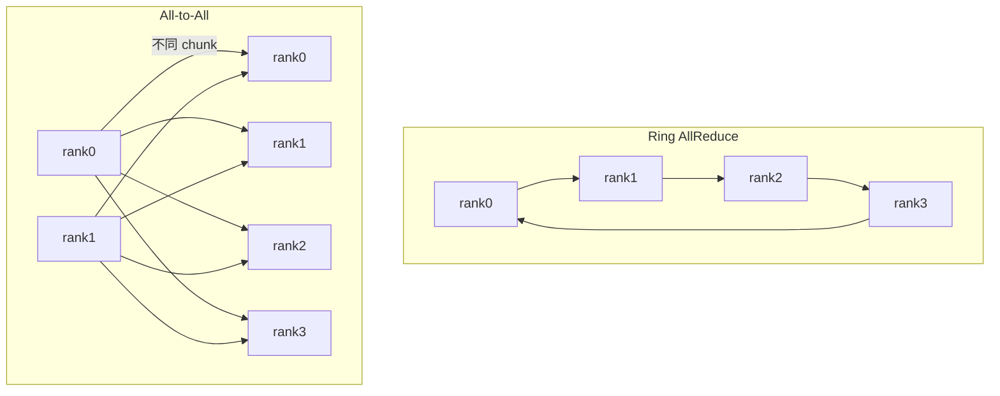

| 维度 | Ring AllReduce | All-to-All |
|---|---|---|
| 通信模式 | 点对点环形，每 rank 1 send + 1 recv | N×N 全互联 |
| per-rank egress | ~`(N-1)/N × D`，两阶段合计 send+recv 为 `2(N-1)/N × D` | ~`(N-1)/N × D`，send+recv 约 `2(N-1)/N × D` |
| group aggregate remote wire | ~`N-1 × D` 每阶段，AllReduce 两阶段约 `2(N-1)D` | ~`(N-1) × D` |
| 网络压力 | 均匀，链路友好 | incast 严重，受 ECMP 哈希影响 |
| 时延 | 与 N 线性 | 与 N 线性，但常数大 |
| NCCL 实现 | 成熟，多种算法 | NCCL AllToAll API 的可用版本和语义需要按目标 NCCL release 核对；生产 MoE 更常围绕 P2P alltoallv、framework dispatcher、DeepEP / FlexDispatcher 组合实现 |
| 失败影响 | 慢一段 | 全 group 同时 hang |

### 4.4 NCCL / P2P alltoallv 与网络规划

MoE 里不要假设存在一个通用的 NCCL all-to-all 专用算法开关可以解决问题，也不要把 `ncclAlltoAll` 写成所有生产 MoE 的常用/默认事实。NCCL 已有 AllToAll API 的版本、等长/不等长 payload 语义、in-place/out-of-place 限制和 framework 暴露方式，都需要按目标 NCCL release 与训练框架核对。dropless MoE 的难点通常是可变长度通信计划、token layout、dispatch/combine metadata、通信计算 overlap、buffer 峰值和失败恢复语义，而不是单个 collective API 名称。常见路径是：

```text
固定等长 payload: NCCL AllToAll API（版本语义需核对）/ grouped send-recv
可变长度 dropless payload: P2P alltoallv / framework flex dispatcher
DeepSeek-V3 风格: DeepEP normal/low-latency kernels + FlexDispatcher 集成

常见 NCCL/网络变量: NCCL_ALGO, NCCL_PROTO, NCCL_IB_HCA, NCCL_IB_GID_INDEX,
                 NCCL_IB_TC, NCCL_IB_QPS_PER_CONNECTION, NCCL_PXN_DISABLE
```

| 网络层 | 调优要点 | 风险 |
|---|---|---|
| 单机 NVLink/NVSwitch | All-to-All in-domain，几乎打满 NVLink 带宽 | 跨 NVSwitch domain 直接掉到 PCIe |
| 多机 IB 800G | 必须 rail-aligned；同一 EP rank 集合走同一 rail | rail 不对齐 → ECMP 哈希成 hotspot |
| ECMP / RDMA | 用 entropy 字段（PSN / GID）打散流 | 单流容易在 1-2 链路堵塞 |
| 交换机 buffer | shared buffer 大、PFC 配置正确 | incast 时 PFC pause 反向传播 |

> **callout (warn)**：MoE 集群网络规划必须把 EP_size、rail 数、leaf 交换机 buffer 容量同时考虑。一个常见错误是按 dense 训练规划 IB（DP AllReduce 友好），结果 MoE 上线后 All-to-All 把交换机 buffer 打爆。

---

## 5. Gate Routing：让 router 学会公平分配

### 5.1 标准 top-K softmax router

```text
logits = x @ W_gate                     # [B*S, N_experts]
probs  = softmax(logits, dim=-1)
topk_val, topk_idx = topk(probs, K)
gates  = topk_val / topk_val.sum(-1)    # 归一化
```

这里最容易误解的是"可微"两个字：

- `topk_idx` 是离散 membership，autograd 不会学习"把第 K+1 个 expert 慢慢变成第 K 个 expert"。
- `gates` 是连续权重，主 loss 可以沿 `gates[selected]` 回到 router logits。
- `Expert_i(x)` 只有在 token 选中 expert i 时才参与主路径；未选 expert 没有这条 token 的 expert-path gradient。

| 设计选择 | 说明 | 风险 |
|---|---|---|
| Softmax 在 top-K 之前 | 概率含义清晰；被选中的 `topk_val` 可对 logits 传梯度 | membership 仍不可微；大部分概率不会产生 expert-path 梯度 |
| Softmax 在 top-K 之后 | 只对 selected logits 归一化 | 梯度信号集中，但未选 logits 没有主 loss gate 梯度 |
| sigmoid 替代 softmax | DeepSeek-V3 改用 sigmoid + bias | 解耦 expert 之间竞争 |
| K=1 (Switch) | 通信最小，但负载均衡难 | drop rate 高 |
| K=2 (GShard, Mixtral) | 平衡选择 | 通信×2 |
| K=8 (DeepSeek-V3) | 覆盖度高，loss 更稳 | 通信×8，capacity 难调 |

### 5.2 Router reproducibility

router 输出的 top-K 索引必须在 forward / backward / 重启之间完全一致，否则梯度不一致。常见的不一致来源：

- **浮点累加顺序**：BF16 softmax 在不同 GPU 数值不同 → 用 FP32 router
- **NaN 处理**：FP16 logits 溢出 → BF16 + clip
- **重排算法**：top-K 实现的 tie-breaker 不固定 → 强制按 expert id 升序
- **dropout / 噪声**：用 fixed seed 或不在 router 上加噪声

### 5.3 Load balance loss（aux loss）

```text
f_i = (1/T) Σ_t 1[token_t selects expert_i]   # 实际选中频率
P_i = (1/T) Σ_t softmax(logits_t)[i]          # 平均概率
L_aux = α · N · Σ_i f_i · P_i                 # Switch / GShard 的标准式
```

| 项 | 直觉 |
|---|---|
| f_i | 实际负载 |
| P_i | router 信心 |
| f_i × P_i | 让 router 不要把高概率给已经过载的 expert |
| α | 平衡系数，通常 0.001-0.01 |

### 5.4 DeepSeek-V3 的 auxiliary-loss-free balancing

aux loss 与主 loss 梯度方向常常冲突（aux loss 想"平均分散"，主 loss 想"专家化"）。DeepSeek-V3 改为：

```text
score_i = sigmoid(logits_i) + b_i
TopK by score, gate = sigmoid(logits) (only TopK)
b_i 由控制器动态调整：load_i > 平均 → b_i 减小；load_i < 平均 → b_i 增大
```

| 维度 | aux loss | loss-free balancing |
|---|---|---|
| 实现 | loss 项 | 训练循环外的控制器 |
| 主 loss 梯度污染 | 有 | 无 |
| 收敛速度 | 慢 | 快 |
| 工程复杂度 | 简单 | 需要每 step 维护 bias 状态 |
| 是否需 checkpoint | 否 | 是（bias 必须随 checkpoint 保存） |

### 5.5 Router 的梯度路径语义

把单个 token 的 MoE 输出写成：

```text
y_t = Σ_{i in S_t} g_{t,i} · Expert_i(x_t)
S_t = TopK(score_t, K)
```

`S_t` 是 forward 时的离散集合，训练时通常当成 stop-gradient metadata 保存下来。主 loss 的反向传播有三条路径：

1. 对 `Expert_i`：只有 `i in S_t` 的 expert 收到这个 token 的权重梯度；`i not in S_t` 没有 expert-path grad。
2. 对 gate：只有 selected gate weight `g_{t,i}` 通过加权和收到主 loss 梯度。
3. 对 input `x_t`：来自 selected experts 的 `g_{t,i} · dExpert_i/dx` 加和，再加上 gate 分支对 router logits 的梯度。

| 信号 / 状态 | 是否可微 | 梯度或状态如何流动 | 工程含义 |
|---|---|---|---|
| `topk_idx` / membership `S_t` | 否 | 主 loss 不对"选中哪个 expert"求导；forward 保存，backward 复用 | 不要把 top-K 叫成可微近似；重算时必须保证 tie-breaker 一致 |
| selected gate weight `g_{t,i}` | 是 | 主 loss 通过 `∂y_t/∂g_{t,i}=Expert_i(x_t)` 回到 selected logits / router weight | router 能学会调 selected experts 的相对权重 |
| selected expert output `Expert_i(x_t)` | 是 | 主 loss 进入 expert 参数、expert input 和 token activation | 只有被路由到的 expert 为这个 token 更新 |
| unselected expert output | 否 | 这条 token 没有 forward compute，也没有 expert-path grad | dead expert 必须靠 aux / bias / exploration 解决 |
| `P_i = mean_t softmax(logits_t)[i]` | 是 | aux loss 可对所有 router logits 传梯度 | `P_i` 是概率侧的平衡信号，会影响未选 expert 的 router logits |
| `f_i` / hard load counter | 否 | 由 `topk_idx` 计数，通常 detach；只作为 aux 的系数或监控状态 | 不能指望 hard count 本身给 membership 传梯度 |
| router z-loss | 是 | 例如 `β · mean(logsumexp(logits)^2)`，只约束 router logit 尺度 | 稳定 router 数值，不给 expert 参数直接传梯度 |
| loss-free bias `b_i` | 不是 autograd 参数 | 控制器按 load EMA 更新：过载 expert 降 bias，欠载 expert 升 bias | 属于训练状态，必须 checkpoint；影响未来路由但不污染主 loss 梯度 |

> **callout (warn)**：如果实现先做 full softmax 再取 selected `topk_val`，softmax denominator 可能让未选 logits 收到很弱的概率耦合梯度；这仍然不是未选 expert 的 FFN 梯度。工程文档里讨论 MoE 梯度时，应区分 router-logit gradient 与 expert-path gradient。

---

## 6. Capacity Factor、Token Drop 与 Dropless MoE

### 6.1 两类容量策略

```text
capacity_per_expert = ceil(capacity_factor × tokens_per_batch × K / N_experts)
```

| capacity_factor | 含义 | 副作用 |
|---|---|---|
| 1.0 | 平均期望 | 任何不均衡都会 drop |
| 1.25 | dropping MoE 常见起点 | 浪费 25% padding，仍可能 drop |
| 2.0 | 几乎不 drop | 浪费 100% padding，显存翻倍 |
| dropless | 不设固定 capacity，按实际 token 数搬运 | alltoallv/flex dispatcher 复杂，buffer 峰值不可静态锁死 |

dropping MoE 和 dropless MoE 的工程目标不同：

| 路径 | 代表 | token 溢出行为 | 主要监控 |
|---|---|---|---|
| fixed-capacity + drop | GShard / Switch / 部分 Mixtral 训练实现 | 超过 capacity 的 token drop、overflow 或 padding 到固定槽位 | drop_rate、overflow_count、padding waste |
| dropless + alltoallv | DeepSeek-V3 风格大 MoE | 不默认丢 token，按实际目的 expert 动态发送 | max/avg load、buffer peak、alltoallv bytes、straggler、overflow fallback |

> **工程边界**：DeepSeek-V3 风格不要写成 `capacity_factor=1.25 + token drop`。更准确的说法是 dropless routing + flex dispatcher / alltoallv，必要时保留 overflow fallback 保护训练不中断，但 fallback 触发应被当成 incident，而不是正常 drop rate。

### 6.2 capacity / dropless 决策树

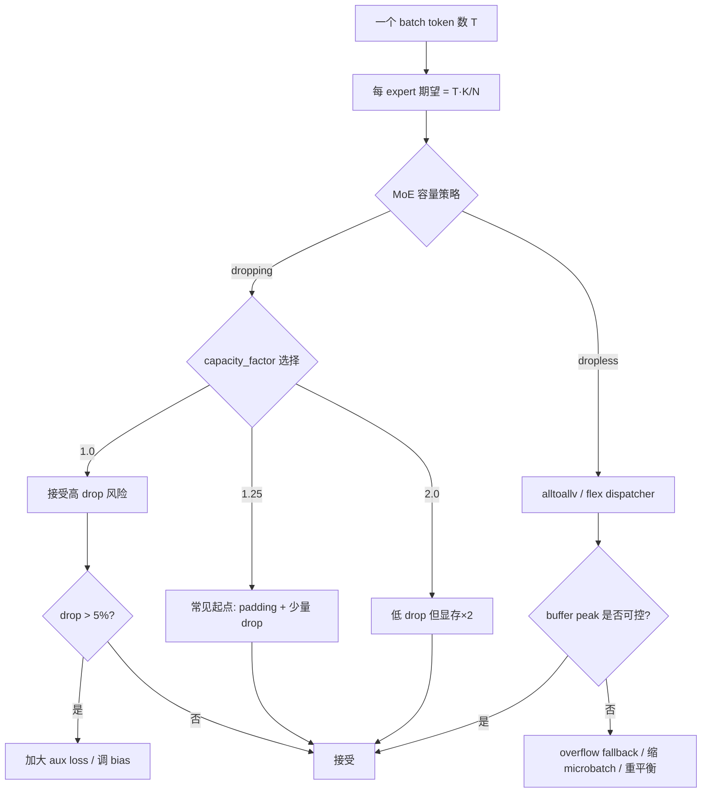

### 6.3 dropping MoE 的 drop rate 动力学

| 训练阶段 | 典型 drop rate | 原因 |
|---|---|---|
| 初期 (step < 1k) | 30-50% | router 接近随机，所有 expert 抢同样的 token |
| 中期 (1k - 100k) | 5-15% | router 开始分化，但容易过度集中 |
| 末期 (> 100k) | 1-5% | 平衡稳定 |
| 失败征兆 | drop rate 突增 + loss spike | router 坍缩或梯度爆炸 |

> **callout (note)**：对 dropping MoE，drop rate 是最重要的健康指标之一。建议 per-layer 输出，每 50 step 看一次。任何 layer drop > 20% 持续 1k step 就要告警。对 dropless MoE，同等位置要看 load skew、buffer peak、straggler 和 overflow fallback。

### 6.4 dropless MoE 的健康指标

dropless 不是"没有容量问题"，而是把问题从 drop rate 转成 tail latency 和 buffer 管理：

| 指标 | 采集点 | 告警含义 |
|---|---|---|
| max_load / avg_load | router per layer | 热门 expert 造成 straggler |
| p99 expert tokens | dispatcher | tail expert 拉长 MoE layer 时间 |
| dispatch/combine buffer peak | allocator / DeepEP buffer | HBM 峰值逼近 OOM |
| alltoallv bytes sent/recv skew | comm trace | 某些 rank 成为 incast 热点 |
| straggler rank id | MoE layer timer | 路由偏斜、网络热点或 expert kernel 慢 |
| overflow fallback count | dispatcher | dropless 保护路径被触发，应按故障处理 |

### 6.5 dropless / overflow / fallback runtime state machine

dropless dispatcher 需要把"是否成功"定义成 EP group 级事务，而不是每个 rank 各自尝试。推荐状态机：

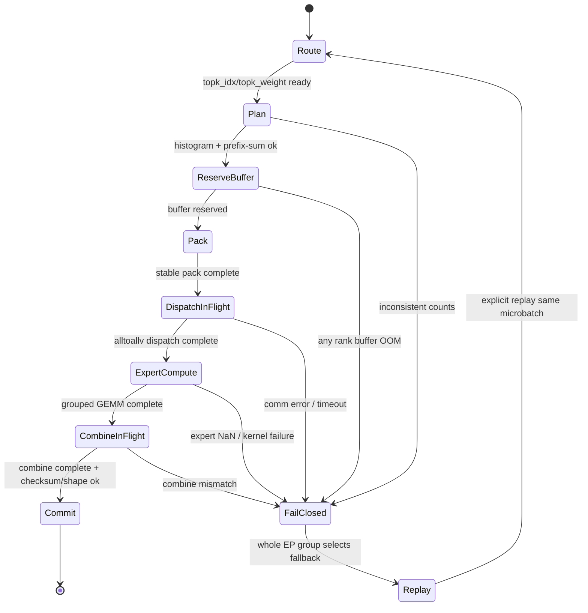

| 状态 | 本地动作 | 必须达成的 EP group 不变量 |
|---|---|---|
| `Route` | 计算 `topk_idx/topk_weight`，记录 router seed、tie-breaker | 所有 rank 使用同一 router 版本和 dtype 规则 |
| `Plan(histogram/prefix-sum)` | 由 `expert owner` 生成 `send_counts/offsets`，交换得到 `recv_counts/offsets` | `Σ send_counts == Σ recv_counts`，每个 dst 的计数一致 |
| `ReserveBuffer` | 按 recv peak 预留 dispatch/combine/workspace | 任一 rank 预留失败则全 group 失败 |
| `Pack` | stable pack payload 和 metadata | pack slots 与 offsets 完全覆盖，无重复、无空洞 |
| `DispatchInFlight` | 启动 alltoallv / DeepEP dispatch handle | handle 状态在所有 rank 上一致，不允许单 rank fallback |
| `ExpertCompute` | per-expert grouped GEMM，记录 counts 和 output slots | output slot 数必须等于 input slot 数 |
| `CombineInFlight` | alltoallv combine 回 token owner | combine metadata 与 forward dispatch handle 对齐 |
| `Commit` | 写回 MoE output，释放或缓存 handle 给 backward | 只有全 group combine 成功后才能让下游 layer 观察到输出 |

异常分支只有两种合法处理：

- **fail closed**：任一 rank 发现 plan mismatch、buffer OOM、通信超时、expert kernel failure，先通过 group-level error flag 让所有 EP rank 停在同一边界，丢弃本次未 commit 的 partial output。
- **显式 replay**：全 EP group 用同一个 fallback policy 重放同一个 microbatch，例如缩小 microbatch、切 fixed-capacity 保护路径、禁用 DeepEP 改走 framework P2P。replay 必须复用同一 router seed 或保存的 `topk_idx/topk_weight`，否则梯度语义改变。

禁止的状态是"rank0 已经 commit combine，rank1 因 buffer OOM 改走 drop，rank2 还在 DeepEP handle 里等待"。这种部分 commit 会让 PP/DP 后续 collective 看到不同 activation，最后表现为不可复现的 loss spike 或 hang。

---

## 7. 通信 / 计算 Overlap：DeepEP 风格的工程化

### 7.1 标准 SMoE 时序

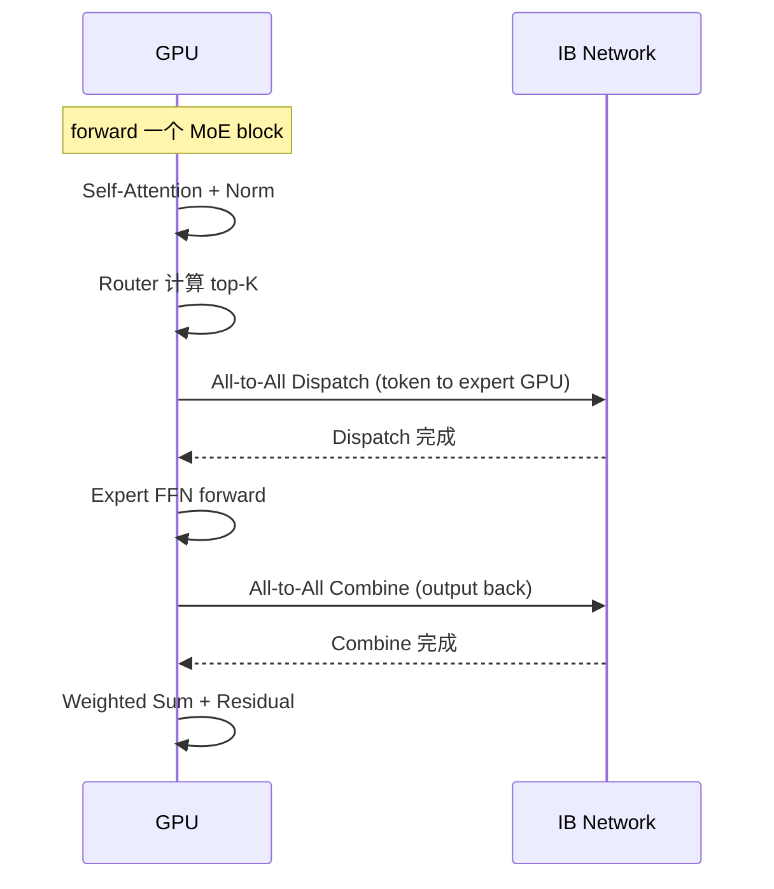

通信占比约 30-50%。MFU 通常只有 dense 模型的 0.6 倍。

### 7.2 DeepEP 等优化路径

DeepSeek 开源的 DeepEP 把 dispatch / combine 拆成更细的 stage，并与 expert 计算 overlap：

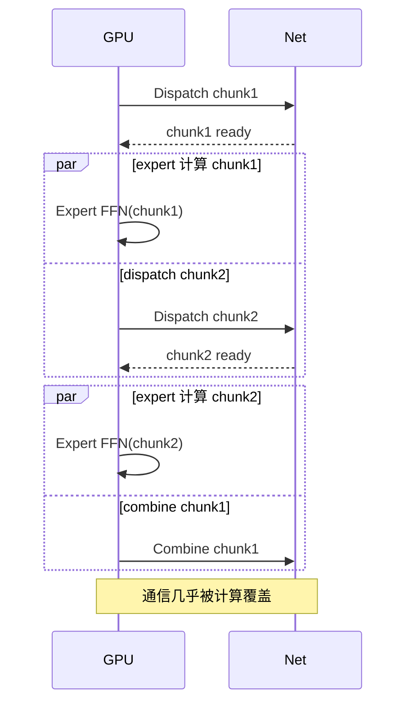

| 优化技术 | 收益 | 限制 |
|---|---|---|
| dispatch chunking | overlap 通信与计算 | 增加 kernel launch overhead |
| in-place layout | 减少 buffer 拷贝 | 实现复杂 |
| RDMA 直写 expert buffer | 避免 host 中转 | 需要 GDR + 特殊 kernel |
| expert-side reduce | combine 阶段在 expert GPU 上做 reduce | 需要修改 NCCL plugin |

### 7.3 DeepEP 集成边界

DeepEP 不是"替换 NCCL 后自动加速 MoE"。它通常处在 framework dispatcher 和 expert GEMM 之间，边界要写清楚：

| 边界 | 要求 |
|---|---|
| dispatcher | framework 负责 router topK、token 排序、expert histogram、metadata；DeepEP 负责高效 dispatch/combine kernel 和通信 |
| flex + deepep | dropless 需要 flex dispatcher 产出可变长度 send/recv plan，再交给 DeepEP normal 或 low-latency 路径 |
| normal mode | 面向训练吞吐，chunking + overlap，适合大 microbatch 和较高带宽利用率 |
| low-latency mode | 面向小 batch / 推理或短 token burst，降低首包延迟，但吞吐和 SM 占用未必最优 |
| dtype | payload 常见 BF16/FP16，router logits/bias/统计建议 FP32；量化通信需显式处理 scale 和 combine 精度 |
| SM budget | dispatch/combine kernel 会占 SM，与 expert GEMM 抢资源；需要限制通信 kernel 占用，避免 overlap 变成互相挤压 |
| buffers | 预分配 send/recv、combine、metadata、workspace；dropless 要按 p99/p999 token load 留峰值余量 |
| fallback | DeepEP 不可用、buffer 不足、alltoallv plan 异常时，要能退回 framework P2P、经版本语义核对的 NCCL AllToAll 路径或 fixed-capacity 保护路径，并把触发计数打到告警 |

最容易踩的坑是只接了 DeepEP kernel，没有把 flex dispatcher 的 token layout、ETP shard、gate weight、combine index 和 fallback 语义一起接上。结果看起来通信 kernel 变快了，端到端 step time 却被重排、buffer 拷贝或 straggler 吃掉。

### 7.4 一层 MoE 的完整 runtime trace

真正让 MoE training layer 跑起来的不是"有 EP 和 All-to-All"这两个概念，而是一串必须严格对齐的 runtime metadata：

```text
1. Router
   logits -> score -> topk_idx, topk_weight

2. Expert ownership
   expert_id -> owner_ep_rank, local_expert_id

3. Plan
   histogram(owner_ep_rank) -> send_counts[dst_rank]
   all_gather/all_to_all counts -> recv_counts[src_rank]
   prefix_sum(send_counts) -> send_offsets
   prefix_sum(recv_counts) -> recv_offsets

4. Stable pack
   对每个 routed copy 写入:
     payload = token hidden shard
     metadata = (src_rank, src_token_id, kth, expert_id, local_expert_id, gate)
   排序规则固定: dst_rank -> expert_id -> src token order -> kth

5. Dispatch
   alltoallv / DeepEP dispatch(payload, send_counts, send_offsets)
   返回 dispatch_handle:
     recv buffer pointer, recv_counts, recv_offsets, inverse permutation, combine metadata

6. Expert compute
   按 local_expert_id 分段
   grouped GEMM counts = tokens_per_local_expert
   对每个 expert 做 FFN forward，输出保持与 dispatch recv slots 对齐

7. Combine
   使用 combine metadata 把 expert output 发回 src_rank
   原 token owner 按 (src_token_id, kth) 聚合:
     y[token] += topk_weight[token,kth] * expert_output

8. Backward
   不重算时复用 forward 保存的 dispatch_handle / combine metadata / permutation
   dY 先按 combine metadata 拆到 expert output slots
   反向 alltoallv 到 expert owner，做 expert backward
   再反向 alltoallv 把 dX contribution 送回 token owner
```

`stable pack` 是可复现性的核心。只要 pack 顺序、tie-breaker 或 prefix offsets 在 forward/backward/recompute 之间变了，combine index 就会错位，表现可能不是 crash，而是 loss 慢慢变坏。

### 7.5 `T=4, N=4, EP=2, K=2` 可手算 mini trace

设一个 EP group 有两个 rank，expert 放置如下：

| expert_id | owner_ep_rank | local_expert_id |
|---|---:|---:|
| 0 | rank0 | 0 |
| 1 | rank0 | 1 |
| 2 | rank1 | 0 |
| 3 | rank1 | 1 |

本 microbatch 共 4 个 token，rank0 持有 `t0,t1`，rank1 持有 `t2,t3`。router 输出：

| token | source rank | `topk_idx` | `topk_weight` |
|---|---|---|---|
| t0 | rank0 | [0, 2] | [0.70, 0.30] |
| t1 | rank0 | [3, 1] | [0.60, 0.40] |
| t2 | rank1 | [2, 0] | [0.80, 0.20] |
| t3 | rank1 | [1, 3] | [0.55, 0.45] |

**Plan 阶段**按 routed copy 计数，不按原 token 计数。每个 token 有 K=2 份 hidden copy：

| source rank | 发往 rank0 的 copy | 发往 rank1 的 copy | `send_counts` |
|---|---|---|---|
| rank0 | `(t0,e0)`, `(t1,e1)` | `(t0,e2)`, `(t1,e3)` | [2, 2] |
| rank1 | `(t2,e0)`, `(t3,e1)` | `(t2,e2)`, `(t3,e3)` | [2, 2] |

因此两个 rank 的 `send_offsets=[0,2,4]`，接收侧也得到 `recv_counts=[2,2]`、`recv_offsets=[0,2,4]`。稳定 pack 后：

| source rank | pack slot | 内容 | combine metadata |
|---|---:|---|---|
| rank0 | 0 | `(t0,e0,g=0.70)` -> rank0 | `(src=rank0, token=t0, kth=0)` |
| rank0 | 1 | `(t1,e1,g=0.40)` -> rank0 | `(src=rank0, token=t1, kth=1)` |
| rank0 | 2 | `(t0,e2,g=0.30)` -> rank1 | `(src=rank0, token=t0, kth=1)` |
| rank0 | 3 | `(t1,e3,g=0.60)` -> rank1 | `(src=rank0, token=t1, kth=0)` |
| rank1 | 0 | `(t2,e0,g=0.20)` -> rank0 | `(src=rank1, token=t2, kth=1)` |
| rank1 | 1 | `(t3,e1,g=0.55)` -> rank0 | `(src=rank1, token=t3, kth=0)` |
| rank1 | 2 | `(t2,e2,g=0.80)` -> rank1 | `(src=rank1, token=t2, kth=0)` |
| rank1 | 3 | `(t3,e3,g=0.45)` -> rank1 | `(src=rank1, token=t3, kth=1)` |

dispatch 后，每个 owner rank 按 local expert 分组做 grouped GEMM：

| owner rank | expert | 收到的 token list | grouped GEMM count |
|---|---:|---|---:|
| rank0 | e0 | `t0(from rank0)`, `t2(from rank1)` | 2 |
| rank0 | e1 | `t1(from rank0)`, `t3(from rank1)` | 2 |
| rank1 | e2 | `t0(from rank0)`, `t2(from rank1)` | 2 |
| rank1 | e3 | `t1(from rank0)`, `t3(from rank1)` | 2 |

combine 阶段把 expert output 按 `src_rank, token, kth` 发回原 token owner，然后做 gate weighted sum：

```text
rank0:
  y_t0 = 0.70 * out(t0,e0) + 0.30 * out(t0,e2)
  y_t1 = 0.60 * out(t1,e3) + 0.40 * out(t1,e1)

rank1:
  y_t2 = 0.80 * out(t2,e2) + 0.20 * out(t2,e0)
  y_t3 = 0.55 * out(t3,e1) + 0.45 * out(t3,e3)
```

backward 不重算时，不能重新发明路由计划；它复用 forward 的 handle：

```text
saved:
  topk_idx/topk_weight
  send_counts/recv_counts
  send_offsets/recv_offsets
  pack permutation
  combine metadata

backward:
  dY -> 按 combine metadata 拆成 dExpertOutput slots
  reverse combine alltoallv: token owner -> expert owner
  grouped expert backward: counts 仍是 rank0 [2,2], rank1 [2,2]
  reverse dispatch alltoallv: expert owner -> token owner，聚合 dX
```

---

## 8. MoE Checkpoint：Expert 维度的 Reshape

### 8.1 MoE checkpoint manifest schema

```yaml
checkpoint:
  step: 120000
  parallel:
    DP: 16
    TP: 8
    PP: 8
    CP: 1
    EP: 64
  experts:
    total: 256
    per_rank: 4
    routing_fn: deepseek_v3_loss_free
  shards:
    - shard_id: moe_l03_e000_tp00_etp00
      rank: 0
      layer_id: 3
      expert_id: 0
      ep_rank: 0
      tp_rank: 0
      etp_rank: 0
      param_name: experts.0.w_gate
      shape: [7168, 2048]
      dtype: bf16
      role: routed_expert_param
      path: step_120000/layer_003/expert_000/tp00_etp00.safetensors
      checksum: sha256:abc...
    - shard_id: moe_l03_router
      rank: replicated
      layer_id: 3
      param_name: router.weight
      shape: [256, 7168]
      dtype: fp32
      role: router
      replicated_across: [EP]
      path: step_120000/layer_003/router.safetensors
  optimizer:
    - shard_id: adam_l03_e000_w_gate_m
      layer_id: 3
      expert_id: 0
      param_name: experts.0.w_gate
      state_name: adam_m
      shape: [7168, 2048]
      dtype: fp32
      tp_rank: 0
      etp_rank: 0
      path: step_120000/optim/layer_003/expert_000/adam_m_tp00_etp00.safetensors
  shared_experts:
    - layer_id: 3
      param_name: shared_expert.w_gate
      shape: [7168, 2048]
      dtype: bf16
      tp_rank: 0
      role: shared_expert_param
      path: step_120000/layer_003/shared/tp00.safetensors
  controller_state:
    router_bias:                    # loss-free balancing 的 bias
      shape: [58, 256]
      dtype: fp32
      path: step_120000/router_bias.safetensors
    load_moving_avg:
      shape: [58, 256]
      dtype: fp32
      path: step_120000/router_load_ema.safetensors
    overflow_fallback_counters:
      dtype: int64
      path: step_120000/moe_overflow_counters.json
  bias_state:                       # dense/shared bias 或框架兼容字段；不要与 router_bias 混淆
    path: step_120000/bias_state.safetensors
    checksum: sha256:def...
```

最小 manifest 需要能回答这些问题：`layer_id`、`expert_id`、`param_name`、`shape`、`dtype`、`TP/ETP shard`、这是参数还是 optimizer state、属于 router / shared expert / routed expert / bias / controller state 中哪一类。缺少任一项，EP reshape、ETP reshape、optimizer resume 或 loss-free bias restore 都可能变成靠文件名猜。

### 8.2 Reshape：EP=64 → EP=32 的恢复

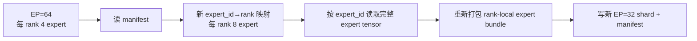

| reshape 类型 | 难度 | 备注 |
|---|---|---|
| EP=64 → EP=32（ownership remap） | 容易 | 新 rank 拥有更多完整 expert；不是把 expert tensor 相加 |
| EP=64 → EP=128（ownership remap） | 容易 | 新 rank 拥有更少完整 expert；不是把 expert tensor 拆半 |
| ETP=1 → ETP=4 | 中等 | 这才是 tensor 维度 reshard，需要按 FFN 权重维度切分 |
| ETP=4 → ETP=1 | 中等 | 需要按 param_name 聚合 ETP shards，并校验形状和 checksum |
| 256 expert → 128 expert（剪枝） | 难 | 需要 expert importance 排序 + router 权重重映射 |
| 256 expert → 320 expert（增殖） | 难 | 新 expert 初始化策略未定，常见做法是复制 + 加噪 |

EP degree 改变时，通常改的是 `expert_id -> owner_ep_rank`：

```text
old: expert 17 -> ep_rank 4, local_expert_id 1
new: expert 17 -> ep_rank 2, local_expert_id 5
tensor: experts.17.w_gate / w_up / w_down 的 shape 不变
```

只有改变 ETP、TP shard 规则、expert FFN hidden/intermediate、或剪枝/增殖 expert 时，才需要真正 reshape expert tensor。把 EP reshape 写成"把 expert tensor 拆半/合并"会导致 checkpoint 工具错误处理 optimizer slots。

**optimizer true resume 默认应该保守**：

| 恢复模式 | 允许条件 | 默认策略 |
|---|---|---|
| weight-only load | expert 参数、router、shared expert、bias/controller state 能按 manifest 对齐 | 允许，用于拓扑变化后的 warm resume / finetune |
| optimizer true resume, EP only remap | `param_name + expert_id + etp_rank + shape + optimizer state_name` 全部一一对应，step/lr scaler 一致 | 可允许，但必须离线验证后写新 manifest |
| optimizer true resume, ETP/TP changed | Adam `m/v`、master weight、grad accumulator 都已按同一 tensor 规则 reshard | 默认拒绝，除非离线 reshard 工具生成校验报告 |
| optimizer true resume, expert 剪枝/增殖 | optimizer slot 没有自然对应关系 | 默认拒绝；只能 weight-only 或显式初始化新 slot |

离线 reshard 工具至少要输出：每个 `expert_id` 的参数 checksum、每个 optimizer slot 的 shape/dtype/checksum、旧新 manifest 的 `expert_id` 对齐表、canonical replica 去重结果。缺少这些证据时，训练系统应该 fail closed，而不是"尽量加载"。

### 8.3 与 dense checkpoint 的对比

| 维度 | dense | MoE |
|---|---|---|
| shard 维度 | layer × TP | layer × expert × TP |
| manifest 大小 | KB | MB（256 expert × 60 layer） |
| reshape 复杂度 | TP / PP 重排 | + expert→rank 重映射 |
| 单 shard 大小 | 几 GB | 几百 MB（每 expert 单独） |
| 写入吞吐 | 大文件少 | 小文件多，元数据压力大 |
| 推荐存储 | 并行文件系统 | object store + manifest |

---

## 9. MoE 训练的特有失败模式

### 9.1 Expert 坍缩

router 把 90%+ 的 token 路由给少数 expert，其他 expert 长期空转。

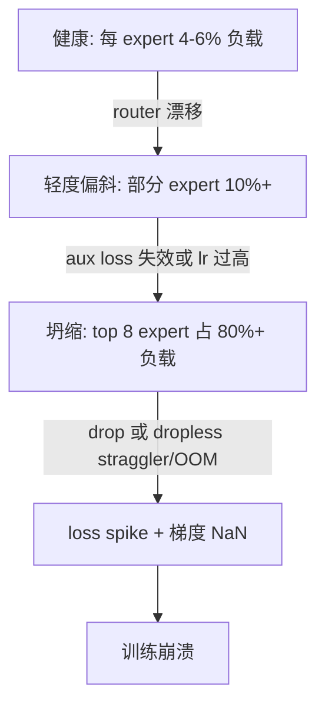

**告警指标**：

| 指标 | 阈值 | 含义 |
|---|---|---|
| max_expert_load / avg | > 3 | 单 expert 严重过载 |
| min_expert_load / avg | < 0.1 | 部分 expert 几乎不工作 |
| drop_rate per layer（dropping MoE） | > 20% 持续 1k step | 固定 capacity 被打爆 |
| buffer_peak / reserved（dropless MoE） | > 0.9 或持续增长 | flex dispatcher 接近 OOM |
| p99_expert_tokens / avg | > 3 | tail expert 造成 straggler |
| router_entropy | < 2 (理论 max log(N)) | router 确信度过高 |

### 9.2 Loss spike

| 来源 | 检测 | 缓解 |
|---|---|---|
| router NaN | 监控 logits 范围 | FP32 router + clip |
| 单 expert 梯度爆炸 | per-expert grad norm | per-expert clip |
| All-to-All 数据腐坏 | combine 后激活 NaN | NCCL checksum + 重试 |
| fixed capacity overflow | drop rate 突增 | 临时增大 capacity_factor / 降 microbatch |
| dropless buffer overflow | buffer peak、fallback count | 缩 microbatch、重平衡 router bias、扩大 dispatcher buffer |

### 9.3 Router gradient noise

top-K 是不可微的（只有被选中的 expert 收到梯度）。常见症状：

- router 在前 1k step 几乎不动
- 个别 expert 永远不被选中（dead expert）
- expert 之间梯度方差大

**缓解**：noisy top-K（GShard）、随机扰动、router 用 lower lr、热身阶段强制均匀路由。

---

## 10. MoE vs Dense 的工程对比

| 维度 | Dense 70B | MoE 256 experts (DeepSeek-V3 风格) |
|---|---|---|
| 总参数 | 70B | 671B |
| 激活参数 / token | 70B | 37B |
| 单 step FLOPs | 1× baseline | routed FFN 局部 FLOPs 低于同总参数 dense；端到端 step time 取决于 attention/router/shared expert/dispatch/combine/load imbalance/backward communication |
| HBM 单卡（无 sharding） | 800 GB+ | 8 TB+（必须 EP） |
| 通信 per step | DP AllReduce + TP AllReduce | forward 2× A2A / MoE layer，backward 2× A2A，checkpoint recompute 可能再加 |
| checkpoint 大小 | ~140 GB（fp16） | ~1.4 TB |
| checkpoint shard 数 | 数百 | 数千到数万 |
| 故障爆炸半径 | TP/PP group | + EP group |
| MFU 典型值 | 45-55% | 25-35% |
| 训练稳定性 | 较好 | 需主动监控 expert 健康 |
| inference 难度 | 标准 | 需要 expert placement 策略 |

---

## 11. MoE + 其他并行的 5 维组合

### 11.1 经典 5 维并行配置

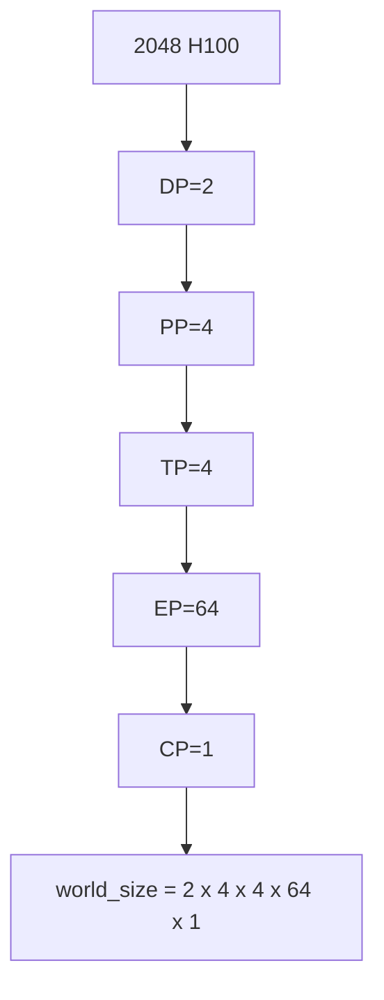

严格 mesh 必须满足 `world_size = DP × PP × TP × EP × CP`。如果框架使用 MoE Parallel Folding，attention/shared FFN 和 routed FFN 可以有两套 rank 视图，但文档和配置要显式写出 view 之间的 reshape / fold 关系，不能把 EP 从 world_size 里拿掉。

### 11.2 Megatron-Core MoE 与 DeepSpeed-MoE 的差异

| 框架 | EP 实现 | 与 PP 配合 | 与 ZeRO 配合 |
|---|---|---|---|
| Megatron-Core MoE | tensor mesh，EP 是 mesh 的一维 | 良好 | 部分 |
| DeepSpeed-MoE | EP 独立 group | 需手工配置 | ZeRO-3 已支持 |
| DeepEP (kernel only) | 与上面框架配合 | 不参与 | 不参与 |
| Megatron + Ulysses | 加 SP / CP 维度 | 良好 | 部分 |

### 11.3 5 维并行的 rank mesh 责任表

| group | 负责的状态 | 负责的通信 | checkpoint shard 单位 |
|---|---|---|---|
| DP group | 副本之间同步梯度 | gradient AllReduce / FSDP AllGather | 全副本 |
| EP group | 不同 expert 的权重 | All-to-All dispatch / combine | per expert |
| TP group | 单层张量切片 | AllReduce / AllGather | per TP shard |
| PP group | 不同 stage 的层 | activation send / recv | per stage |
| CP group | attention context 切片 | ring KV / All-to-All | （无 weight，运行时） |

---

## 12. 推理时的 MoE：训练 ≠ 推理

| 维度 | 训练 | 推理 |
|---|---|---|
| batch | 大 (4M tokens) | 小 (1-100 sequences) |
| capacity 策略 | dropping MoE 可用 fixed capacity；DeepSeek-V3 风格训练是 dropless/flex | 必须 dropless |
| EP 拓扑 | 与 GPU 数耦合 | 按 expert placement 优化 |
| 通信 | All-to-All 主导 | 期望避免 All-to-All（小 batch 不划算） |
| 部署 | 单一集群 | 可能多副本，每副本完整 expert set |
| checkpoint 转换 | 不需要 | 必须把 EP shard reshape 到 inference EP |

### 12.1 Mixtral / DeepSeek-V3 的推理部署

| 模型 | 总参 | 激活参 | 推理 EP | 推理策略 |
|---|---|---|---|---|
| Mixtral 8×7B | 47B | 13B | EP=2 或 4 | 每副本完整 8 expert |
| DeepSeek-V3 | 671B | 37B | EP=8-16 | 多副本 + expert prefetch |
| Qwen2-MoE A14B | A14B | 2.7B | EP=4 | 标准部署 |

> **callout (warn)**：不要把 DeepSeek-V3 风格训练写成 `EP=64 + capacity_factor=1.25 + drop`。训练和推理都不应把正常 token drop 当作默认路径；区别在于训练用大 batch dropless alltoallv / flex dispatcher 追求吞吐，推理 batch 极小时要按 expert placement、prefetch 和低延迟 dispatcher 重新设计。

### 12.2 Expert placement 与 node-limited routing

无论训练还是推理，`expert_id -> node/gpu` 不是简单取模就完事。placement 同时决定通信 locality、load skew 和 straggler。

最小 placement manifest 应显式记录：

```yaml
expert_placement:
  layer_id: 3
  ep_group_id: dp0_pp1_tp0_cp0
  policy: node_limited_round_robin_v1
  experts:
    - expert_id: 0
      node_id: node000
      gpu_id: 0
      ep_rank: 0
      local_expert_id: 0
    - expert_id: 1
      node_id: node000
      gpu_id: 1
      ep_rank: 1
      local_expert_id: 0
```

常见算法级策略：

| 策略 | 做法 | 适用场景 | 风险 |
|---|---|---|---|
| round-robin by expert_id | `owner = expert_id % EP` | baseline，易复现 | 热门 expert 可能集中到同一节点或 rail |
| node-balanced placement | 先按 node 分桶，再在节点内按 gpu 轮转 | 训练 EP group 跨多节点 | 需要 topology-aware rank map |
| replicated hot experts | 热门 expert 多副本，router 或 dispatcher 选最近副本 | 推理、小 batch | 训练 optimizer 同步复杂，不是默认训练路径 |
| straggler-aware remap | 根据 load EMA / layer timer 周期性交换 expert owner | 长训中消除 tail rank | 会改变 checkpoint ownership，必须在 step 边界做 |

**node-limited routing** 的思路是：router 先产生全局 score，但 dispatch plan 可以把候选 expert 限制在少数节点内，降低跨节点 A2A：

```text
for each token t on node n:
  candidate_nodes = topM_nodes(score_t, placement, M)
  candidate_experts = experts_on(candidate_nodes)
  S_t = topK(score_t over candidate_experts)
```

这不是免费优化：限制候选节点会改变模型可表达性和 load balance。训练里如果使用 node-limited routing，必须把 `candidate_nodes` 规则视为 router 语义的一部分，checkpoint 和评估都要一致；推理里可以更激进，因为目标是低延迟和 locality。

**send plan** 应由 placement 派生，而不是在通信层猜：

```text
topk_idx[token,k] -> expert_id
expert_id -> (node_id, gpu_id, ep_rank, local_expert_id)
ep_rank -> send_counts[ep_rank] += 1
```

如果发现 straggler，重排流程要在算法层闭环：

1. 收集每层 `tokens_per_expert`、`tokens_per_rank`、dispatch/combine time、expert GEMM time。
2. 把 expert 分成 hot / cold / normal，按 layer 单独处理，不要全局平均。
3. 在同一 EP group 内交换 hot expert 与 cold expert 的 owner，优先跨节点/跨 rail 打散。
4. 在 step 边界广播新 placement version，更新 router/dispatcher/checkpoint manifest。
5. 若要 true resume，先把 optimizer slots 跟随 expert_id 一起迁移，再允许 optimizer step。

placement 的核心原则是：**expert_id 是语义身份，rank/gpu 只是 owner**。所有 send_counts、checkpoint shard、optimizer slot、load EMA 和 loss-free bias 都必须跟 `expert_id` 对齐，而不是跟当前 rank 对齐。

---

## 13. Worked Example：DeepSeek-V3 风格 MoE 训练完整账本

### 13.1 模型与集群设定

| 项 | 值 |
|---|---|
| 总参 | 671B |
| 激活参 / token | 37B |
| layers | 61 (其中 58 个 MoE layer) |
| hidden | 7168 |
| expert FFN intermediate | 2048 |
| routed expert | 256 |
| shared expert | 1 |
| top-K | 8 |
| seq length | 4096 |
| global batch | 1024 sequences (4M tokens) |
| GPU | 2048 × H100 80GB（256 节点 × 8 卡） |
| 互联 | 节点内 NVSwitch 900 GB/s；节点间 8 × 400 Gbps IB |

### 13.2 5 维并行配置

```text
DP = 2
EP = 64
TP = 4
PP = 4
CP = 1
world_size 校验: DP × PP × TP × EP × CP
                 = 2 × 4 × 4 × 64 × 1 = 2048

这是严格 mesh 视图。若采用 MoE Parallel Folding，可以在 attention/shared FFN
使用不同 dense 视图，但必须显式写出两套 view 的 rank 映射；不能把 EP 当成
不计入 world_size 的额外维度。
```

| 维度 | 大小 | 放置 |
|---|---|---|
| TP | 4 | 节点内 NVSwitch，attention/shared FFN tensor shard |
| EP | 64 | 每个 EP group 跨 8 节点（每节点 8 个 EP rank） |
| PP | 4 | 按层切 stage |
| DP | 2 | 两个完整训练副本 |
| CP | 1 | 本例不切 context |

### 13.3 显存预算（per rank）

| 项 | 大小（GB） | 说明 |
|---|---|---|
| dense 层参数（attention + shared FFN）shard | 8 | TP=4、PP=4 切完，实际随 ZeRO/FSDP 策略变化 |
| routed expert 参数（4 expert / rank） | 5.0-5.3 | 单 MoE layer 每 rank 4 expert 约 `4 × 44M × 2B ~= 0.35GB`；每个 PP stage 常驻约 14-15 个 MoE layer |
| optimizer state (Adam, FP32 ×2) | 22 | DP / FSDP 部分 shard |
| master weight (FP32) | 11 | |
| gradient buffer (BF16) | 11 | |
| activation (with checkpointing) | 8 | seq=4096, mb=1, recompute 70% |
| dispatch / combine buffer | 6-12 | dropless/flex dispatcher，按 p99/p999 expert load、topK、hidden、ETP 和 overlap chunk 数预留 |
| NCCL / 通信 buffer | 3 | |
| 余量 | 8 | 80GB 上限，剩余安全裕量 |

### 13.4 通信账本（per step）

下面表格统一使用 **per-rank send+recv wire bytes**；`~1.8-2.4 GB` 是单次 A2A 的 send+recv，不是 EP group aggregate。

| 通信 | A2A 次数 / MoE layer / microbatch | 频率 / step | 单次 send+recv | step 总量 / rank |
|---|---:|---|---:|---:|
| forward dispatch | 1 | 58 layer × 4 microbatch | ~1.8-2.4 GB | ~0.42-0.56 TB |
| forward combine | 1 | 58 layer × 4 microbatch | ~1.8-2.4 GB | ~0.42-0.56 TB |
| backward reverse-combine | 1 | 58 layer × 4 microbatch | ~1.8-2.4 GB | ~0.42-0.56 TB |
| backward reverse-dispatch | 1 | 58 layer × 4 microbatch | ~1.8-2.4 GB | ~0.42-0.56 TB |
| activation checkpoint recompute dispatch | +1（若重算 MoE forward） | 58 layer × 4 microbatch × checkpoint_ratio | ~1.8-2.4 GB | 取决于 checkpoint 覆盖范围 |
| activation checkpoint recompute combine | +1（若重算 MoE forward） | 58 layer × 4 microbatch × checkpoint_ratio | ~1.8-2.4 GB | 取决于 checkpoint 覆盖范围 |

非 EP 通信仍要单独算，不能和 EP A2A aggregate 混在同一列：

| 通信 | 频率 / step | 单次体积口径 | 总体积口径 |
|---|---|---|---|
| TP AllReduce (attention) | 61 layer × 4 mb × 2 | ~1 GB / TP rank send+recv | ~0.5 TB / rank |
| PP send/recv | 4 stage × 4 mb × 2 dir | ~0.5 GB / boundary | ~16 GB / pipeline boundary |
| DP gradient AllReduce | 1 / step | ~11 GB gradient shard | 按 AllReduce 算法换算 per-rank send+recv |

> **关键瓶颈**：forward 的 dispatch + combine 已经是 2 次 A2A；正常 backward 还要 2 次反向 A2A；activation checkpoint 如果覆盖 MoE forward，会额外 replay dispatch + combine。做容量规划时必须同时看 per-rank 链路压力、EP-group aggregate fabric load 和 tail rank straggler。

### 13.5 单 step 时序

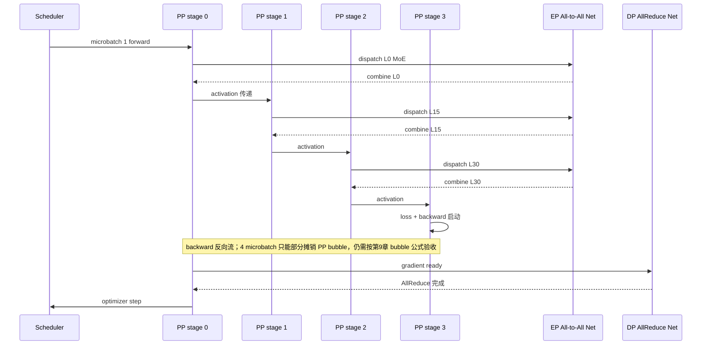

### 13.6 健康指标 dashboard

| 指标 | 采集点 | 阈值 | 告警 |
|---|---|---|---|
| step time | trainer | > 1.3 × baseline | warning |
| All-to-All wait | NCCL trace | > 40% step | critical |
| overflow fallback count | dispatcher | > 0 持续出现 | critical |
| max_load / avg_load | router stat | > 3 / 1k step | warning |
| buffer peak / reserved | allocator | > 0.9 | critical |
| straggler rank p99 | MoE layer timer | > 1.5 × median | warning |
| router entropy | router stat | < 2 | warning |
| expert grad norm max/min | optimizer | > 100 | critical |
| MFU | trainer | < 25% | warning |
| checkpoint write time | ckpt writer | > 5 min | warning |

### 13.7 一次 incident 排查示例

> 现象：step time 从 4.2s 涨到 6.8s，max_load/avg_load 从 1.6 涨到 4.8，dispatch buffer peak 接近 OOM，loss 微涨。

排查路径：

1. dashboard 看到 load skew 和 buffer peak 突增 → 怀疑 router 漂移
2. 查看 per-expert load，发现 expert 17, 42, 109 负载占 65%
3. 查看 router_bias（loss-free balancing 状态），发现 bias 控制器在过去 1k step 没更新（一个 EP rank 的状态丢了）
4. 定位到 EP rank 23 在某次 OOM 重启后 bias state 没正确 restore
5. 修复：从 checkpoint 重新加载 router_bias，step time、load skew 和 buffer peak 恢复

> **教训**：MoE 的 checkpoint 不只是参数，**控制器状态（bias、moving avg、capacity counter）必须一并 checkpoint**，否则恢复后 router 行为不一致。

---

## 14. 工程边界总结

| 边界 | 说明 |
|---|---|
| EP_size 上限 | 实际不超过单个高速互联 domain（NVSwitch 8/16） + IB rail 数 |
| top-K 上限 | K 越大通信越大；K=8 是当前生产上限 |
| capacity 策略 | dropping MoE 需要 capacity_factor；DeepSeek-V3 风格按 dropless/flex dispatcher 管 buffer 和 straggler |
| router 数值精度 | 必须 FP32 |
| aux loss vs loss-free | 大模型推荐 loss-free，小模型 aux 简单 |
| MoE checkpoint | 必须含 expert→rank 映射 + 控制器状态 |
| inference 路径 | 与训练完全分离，不可复用 EP=64 |
| 故障半径 | 一个 expert GPU 挂 → 全 EP group hang，必须 fast detect |

本章交付物是 `moe_ep_report.md`：它接收第9章的 70B dense rank mesh，补充 EP group、expert placement、router/load-balance 指标、All-to-All 证据和 MoE checkpoint manifest。下一章会把 dense 与 MoE 两类 checkpoint 都纳入 dry-run/recovery，验证 expert、router controller、parallel metadata 和 optimizer shard 能否在事故后严格恢复。

---

## 15. 练习

- **09e-1（基础）**：dense 70B 与 DeepSeek-V3 风格 256 routed experts（单 expert/layer 约 44M，K=8）相比，总参和每 token 激活参数为什么不是同一个比例？
- **09e-2（基础）**：top-K=2 与 top-K=8 的 dispatch logical payload 相差多少？在 dropless MoE 下还会引入哪些 tail latency 风险？
- **09e-3（基础）**：写出 fixed-capacity MoE 的 `capacity_per_expert` 公式，并解释它与 dropless alltoallv 的 buffer 规划有什么不同。
- **09e-4（基础）**：列出 MoE 特有的 4 类失败模式，并对每一类给出至少一个监控指标。
- **09e-5（进阶）**：DeepSeek-V3 用 sigmoid + bias 替代 softmax。请解释为什么这样可以解耦 expert 之间的竞争。
- **09e-6（进阶）**：EP=64 在跨 8 节点的 IB 网络上做 All-to-All，请用 `local_tokens × topK × hidden × dtype_bytes × remote_fraction` 估算单 layer per-rank 通信延迟（假设 dispatch wire bytes 为 1.0GB/rank，800Gbps IB 双向，4 个 rail）。
- **09e-7（进阶）**：设计一个 MoE checkpoint manifest schema，要求支持 EP=64 → EP=32 reshape，且包含 loss-free balancing 的 bias 状态。
- **09e-8（进阶）**：训练中观察到 expert 17 长期负载只有平均的 5%（dead expert），列出至少 3 种可能原因和对应排查命令。
- **09e-9（进阶）**：DeepEP 把 dispatch 拆 chunk 与 expert 计算 overlap。请画出一个 4 chunk 的时序图，并估算 overlap 后 EP 通信的有效占比。
- **09e-10（设计）**：为 8 节点 × 8 卡 H100（IB 800Gbps）设计一个 64 expert × top-2 的 MoE 训练并行配置。给出 DP / EP / TP / PP 的具体值，并估算单 step 显存和通信。
- **09e-11（设计）**：训练用 EP=64 dropless/flex dispatcher。请设计推理路径的部署方案：单副本要求 dropless，推理 batch=8 sequences。说明 expert placement、KV cache、与训练 checkpoint 的转换步骤。
- **09e-12（开放）**：MoE 与 long context（CP）同时使用时，dispatch 之前的 sequence 维度布局会变得复杂。请说明 SP+CP+EP 三者组合时，dispatch 应该在哪一步发生，激活布局如何切换。

---

## 16. 深度参考阅读

- Shazeer et al., *Outrageously Large Neural Networks: The Sparsely-Gated Mixture-of-Experts Layer*, ICLR 2017（top-K gating + load balance loss 起源）
- Lepikhin et al., *GShard: Scaling Giant Models with Conditional Computation and Automatic Sharding*, ICLR 2021（top-2 + capacity factor 工程化）
- Fedus et al., *Switch Transformer: Scaling to Trillion Parameter Models with Simple and Efficient Sparsity*, JMLR 2022（top-1 + 简化通信）
- Mistral AI, *Mixtral of Experts*, 2024（8 expert top-2 开源标杆）
- DeepSeek-AI, *DeepSeekMoE: Towards Ultimate Expert Specialization*, 2024（fine-grained expert + shared expert）
- DeepSeek-AI, *DeepSeek-V2 / V3 Technical Reports*, 2024（loss-free balancing + 256 expert + 671B 工业实践）
- Qwen Team, *Qwen2-MoE Technical Report*, 2024
- DeepSeek-AI, *DeepEP: Efficient Expert Parallelism Communication Library*, GitHub 2025（dispatch / combine kernel + overlap）
- Megatron-Core MoE 文档（NVIDIA 工程实现）
- DeepSpeed-MoE 文档与 ZeRO-3 + EP 整合
- Tutel: An efficient mixture-of-experts implementation（微软）
- *ST-MoE: Designing Stable and Transferable Sparse Expert Models*, Zoph et al., 2022（router z-loss、稳定性技巧）
- *Expert Choice Routing*, Zhou et al., 2022（reverse routing：让 expert 选 token，天然平衡）
