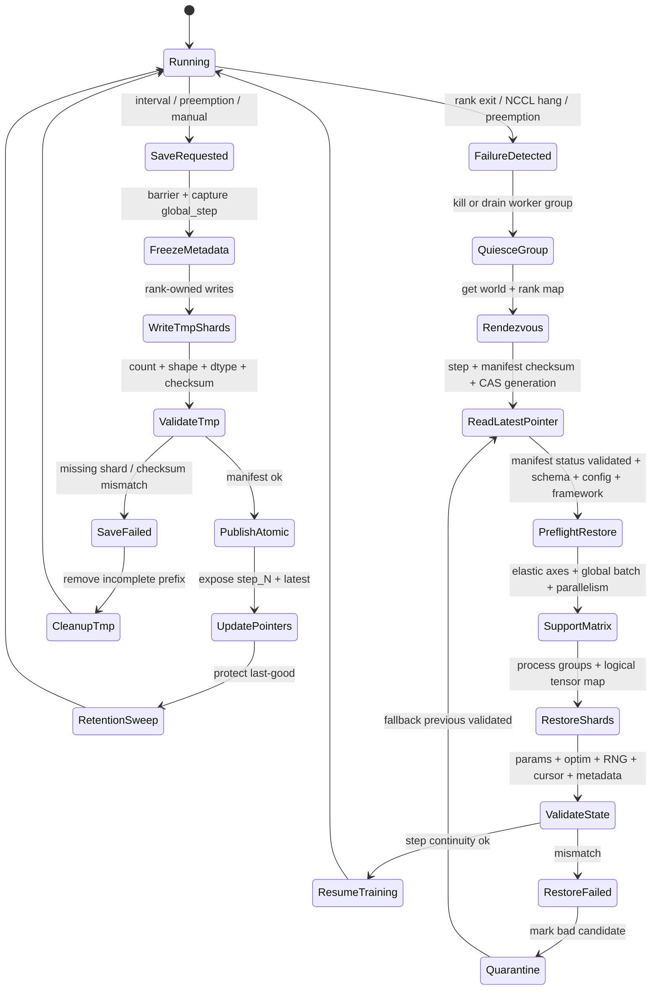

# 第10章：内存优化、Checkpoint 与恢复

> 长训练任务不是“一次跑完”的程序，而是一个持续数天到数月的分布式状态机。本章把显存优化、checkpoint、恢复、TorchElastic、NCCL hang 和 straggler detection 放在同一个可靠性控制面里讨论。

> **关联章节**：第7章建立单机 step 和显存基线；第8章讨论数据并行同步与 NCCL 证据链；第9章讨论 TP/PP/CP/FSDP/ZeRO 等并行策略。第10章关注这些策略如何被保存、验证、恢复和治理。

---

## 1. 第一性原理拆解 + 学习大纲

### 1.1 不可化简的问题

训练系统最小的事实不是“模型很大”，而是：

> 训练是一个长时间运行的状态转移过程；状态大到无法完整复制在每张 GPU 上，运行时间长到一定会遇到 GPU、网络、存储、节点、调度器或代码发布失败。

如果只看模型权重，checkpoint 像一个文件保存问题；如果看完整训练状态，checkpoint 是恢复协议。它必须回答：

- 状态有哪些：model parameters、gradients、optimizer states、scheduler、loss scaler、RNG、dataset cursor、global step、parallel metadata。
- 状态在哪里：GPU HBM、CPU DRAM、NVMe、本地 scratch、并行文件系统、对象存储。
- 谁拥有写入权：每个 rank 写自己的 shard，还是 coordinator 聚合 metadata，还是专用 checkpoint writer 异步落盘。
- 何时可见：半成品不能被 `latest` 指针暴露给恢复流程。
- 如何验证：shape、dtype、checksum、world size、parallel layout、训练配置、数据版本必须能被机器检查。
- 如何清理：retention 不能删掉最后一个可恢复版本，也不能让存储被里程碑 checkpoint 撑爆。
- 如何跨并行策略恢复：从 TP=8/PP=4/FSDP shard 恢复到 TP=4/PP=8 时，需要明确权重重分片、optimizer 是否可恢复、global batch 是否保持。

内存优化和 checkpoint 不是两个孤立主题。activation checkpointing 降低 HBM 但增加重算；offload 降低 GPU 常驻状态但增加 PCIe/NVMe 路径；optimizer state sharding 降低单卡状态但让 checkpoint 变成 sharded checkpoint；FP8 降低激活和通信体积但引入 scale/amax 状态；allocator fragmentation 不改变数学模型，却能让“理论可放下”的作业实际 OOM。每个省显存动作都会改变恢复协议和故障面。

### 1.2 学习大纲

读完本章，你应该能回答：

1. activation checkpoint、offload、optimizer state sharding、mixed precision、FP8、allocator fragmentation 分别解决什么，不解决什么，代价在哪里。
2. 一个可 true resume 的 checkpoint schema 应包含哪些对象、metadata 和校验字段。
3. sharded checkpoint、async checkpoint、atomic visibility、retention、RPO/RTO 如何一起决定长期训练可靠性。
4. TorchElastic elastic restart 如何和 checkpoint 语义配合，哪些场景不能“自动弹性”。
5. NCCL hang、腐坏 checkpoint、slow checkpoint、restore mismatch、straggler 的证据链怎么收敛。
6. 千卡训练中断后，如何从告警、rank 状态、NCCL 日志、checkpoint metadata、存储指标和调度事件推导恢复方案。

---

## 2. 概念边界：是什么、不是什么、相邻概念边界

### 2.1 是什么

本章讨论的是训练可靠性控制面，核心职责是让训练状态在资源受限和故障频发的系统里正确前进：

- **显存控制**：用 activation checkpointing、offload、optimizer state sharding、mixed precision、FP8、allocator 策略降低单卡峰值。
- **状态版本化**：把完整训练状态写成可验证、可恢复、可清理的 checkpoint schema。
- **恢复编排**：在进程、节点、world size 或并行策略变化后，恢复一致的 global step、数据游标和优化器轨迹。
- **故障控制**：用 preflight validation、straggler detection、NCCL hang 排障和 TorchElastic restart 降低无效训练时间。

### 2.2 不是什么

- 不是“只保存 `model.state_dict()`”。那是权重导出，通常只能 warm start，不能保证 optimizer、scheduler、RNG、dataset cursor 连续。
- 不是“把 batch size 调小”。调小 microbatch 是容量手段之一，但会改变吞吐、梯度累积、pipeline bubble 和 optimizer step 频率。
- 不是“打开 FSDP/ZeRO 就结束”。状态切分会改变通信路径、checkpoint writer ownership、restore layout 和故障恢复复杂度。
- 不是“失败后重跑”。没有 RPO/RTO 目标、checkpoint 校验和恢复演练的重跑只是碰运气。
- 不是“框架自动处理”。PyTorch、DeepSpeed、Megatron、TorchElastic 提供机制，生产语义仍由平台配置、准入、版本矩阵和治理规则定义。

### 2.3 相邻概念边界

| 概念 | 本章关注 | 相邻章节关注 | 边界 |
|---|---|---|---|
| 单机显存预算 | activation、optimizer、fragmentation、checkpoint buffer | 第7章的完整 step timeline | 本章强调长任务下的容量和恢复影响 |
| 数据并行通信 | checkpoint shard、NCCL hang、straggler | 第8章的 AllReduce/ReduceScatter/AllGather | 本章关注通信故障如何触发恢复 |
| 模型并行策略 | parallel metadata、cross-parallelism restore | 第9章的 TP/PP/CP/EP 设计 | 本章关注并行布局如何被持久化 |
| 评测与发布 | checkpoint visibility、best/milestone 语义 | 后训练与 serving 章节 | 本章只讨论训练恢复，不讨论模型质量治理全链路 |

---

## 3. 架构：控制路径、数据路径、状态路径、故障路径

### 3.1 责任边界

一个生产训练平台至少需要把责任拆成五层：

| 层 | 责任 | 典型 owner | 失败证据 |
|---|---|---|---|
| Training loop | 产生 step、保存 state_dict、恢复状态 | 训练框架/算法工程 | loss jump、step 回退、RNG 不一致 |
| Distributed runtime | rank group、collective、elastic restart | Infra/框架 | NCCL timeout、rank exit、world size 变化 |
| Checkpoint library | sharding、async writer、manifest、atomic commit | Infra/框架 | shard 缺失、checksum mismatch、latest 指针错误 |
| Storage service | 吞吐、元数据、权限、生命周期 | Storage/SRE | I/O latency p99、429/5xx、quota full |
| Scheduler/platform | 节点分配、抢占、重启、隔离 | Platform/SRE | pod eviction、node NotReady、GPU Xid |

### 3.2 控制路径

控制路径定义什么时候保存、谁能提交、恢复哪个版本：

1. trainer 在 `global_step % save_interval == 0` 或收到 preemption signal 时发起 checkpoint。
2. rank group 进入 save barrier，冻结需要一致化的 metadata。
3. 每个 writer 写入自己的临时 shard，例如 `step_12000.tmp/rank_00342/optim.safetensors`。
4. coordinator 写 manifest，验证 shard count、size、checksum、schema_version、parallel metadata。
5. coordinator 通过原子 rename 或 pointer update 暴露 `step_12000`，再更新 `latest`。
6. retention controller 清理过期版本，但保留 last-good、milestone、best、pre-upgrade。

### 3.3 数据路径

数据路径关心 bytes 怎么移动：

- GPU HBM -> CPU pinned memory：async checkpoint 常见 staging 路径，受 PCIe/NVLink-C2C、CPU 内存和 pinning 限制。
- GPU HBM -> storage：少数 GPUDirect Storage 场景可走直接路径，但生产可用性取决于文件系统、驱动和框架支持。
- CPU DRAM -> local NVMe -> remote storage：常见两段式写入，先落本地 scratch，再后台上传对象存储或并行文件系统。
- rank shard -> object storage prefix：对象数量太多会打爆 metadata/list；对象太大又影响并发和失败重试粒度。

### 3.4 状态路径

状态路径回答“恢复需要什么”：

- Model params：权重本体，可能按 DP/FSDP/TP/PP/EP 切分。
- Optimizer states：Adam `exp_avg`、`exp_avg_sq`、master weights、ZeRO/FSDP shard。
- Scheduler：step index、warmup、decay、restart policy。
- Precision state：GradScaler、FP8 amax history、scale、recipe、cast 边界。
- RNG：Python、NumPy、PyTorch CPU、CUDA 每卡、dataloader worker seed、per-DP-rank sampler RNG。
- Dataset cursor：epoch、per-DP-rank sample index、shuffle seed、consumed samples/tokens、streaming shard offset、packing residual、gradient accumulation substep。
- Parallel metadata：world size、rank mapping、TP/PP/CP/EP/DP degree、pipeline stage、tensor shard axis、vocab padding。
- Config and code identity：git SHA、container image digest、framework versions、feature flags。

### 3.5 故障路径

故障路径从症状反推责任层：

- 所有 GPU 利用率归零，进程不退出：优先看 NCCL hang、某 rank 未进入 collective、dataloader deadlock。
- checkpoint 写入 p99 飙升：看 storage bandwidth、metadata ops、writer concurrency、async backlog。
- 恢复后 loss 跳变：看 optimizer/scheduler/RNG/dataset cursor/global step 是否一致。
- 某些 rank step time 长尾：看 straggler detection 的 data time、comm wait、GPU clocks、ECC/Xid、host I/O。
- 弹性重启后吞吐下降：看 world size、global batch、gradient accumulation、parallel layout 是否变化。

### 3.6 Checkpoint 写入与恢复状态机



---

## 4. 原理：从不可化简的问题推导机制

### 4.1 显存预算不是权重预算

训练峰值显存可以写成：

$$
M_{peak} =
M_{params} + M_{grads} + M_{optim} + M_{acts}
+ M_{comm} + M_{temp} + M_{ckpt\_buffer} + M_{frag}
$$

其中每项增长规律不同：

- `M_params` 跟参数量、dtype、TP/FSDP shard 有关。
- `M_grads` 跟是否 sharded、是否 `set_to_none=True`、bucket 生命周期有关。
- `M_optim` 对 Adam 类优化器通常是大头；FP32 moment 会让状态远大于 BF16 权重。
- `M_acts` 跟 microbatch、sequence length、hidden size、layer count、checkpoint granularity 有关。
- `M_comm` 跟 DDP/FSDP bucket、NCCL buffer、TP activation collective 有关。
- `M_ckpt_buffer` 来自 async checkpoint staging；大作业里经常被遗漏。
- `M_frag` 是 allocator fragmentation，可能导致 reserved memory 高于 allocated memory 很多。

一个工程上有用的公式是 activation checkpointing 的节省和代价模型：

$$
M_{acts,ckpt} \approx \frac{M_{acts,full}}{K} + M_{boundary},
\quad
T_{step,ckpt} \approx T_{step,base} + r \cdot T_{forward}
$$

`K` 是重计算分段数，`M_boundary` 是必须保留的分段边界激活，`r` 是额外重算比例。Transformer 中常见经验是 activation memory 下降 30%-70%，step time 增加 5%-30%；具体值必须用 profiler 验证，因为 FlashAttention、sequence parallel、compiler fusion 会改变边界。

### 4.2 activation checkpointing：用计算换 HBM

activation checkpointing 的正确边界：

- 适合：activation 是峰值主因，GPU compute 仍有余量，长上下文或 microbatch 受限。
- 不适合：step 已被 compute 完全打满，或 recompute 破坏 kernel overlap，或 checkpoint segment 切在跨设备 collective 周围导致额外同步。
- 关键 knob：checkpoint granularity、reentrant/non-reentrant、selective checkpoint、RNG preserve、pipeline stage 内切分。

PyTorch 约束：

- `torch.utils.checkpoint.checkpoint(..., use_reentrant=False)` 更适合现代 autograd 场景。
- 如果 dropout 存在，`preserve_rng_state` 影响重算一致性；关闭后可能提高速度，但必须接受随机轨迹变化。
- 编译器、FlashAttention、FSDP auto-wrap 会改变 activation 生命周期，不能只靠静态估算。

### 4.3 offload：用慢路径换容量

offload 把 GPU HBM 中的状态移到 CPU DRAM 或 NVMe：

- activation offload：把部分激活放到 CPU，反向前再搬回。
- optimizer offload：ZeRO-Offload/FSDP CPU offload 常见，把 optimizer state 和部分参数更新放 CPU。
- parameter offload：需要前向前 prefetch，容易被 PCIe/NVMe latency 控制。

边界：

- PCIe Gen4 x16 理论单向约 32 GB/s，远低于 HBM 和 NVLink；NVMe 还要低一个数量级。
- offload 只有在通信/计算能覆盖搬运，或否则作业根本放不下时才划算。
- CPU memory pinning、NUMA placement、local NVMe endurance 都是生产约束。

反例：把 optimizer offload 打开后 OOM 消失，但 step time 从 1.2s 变成 4.8s，GPU duty cycle 只有 35%。这不是训练优化，而是把瓶颈换成了 PCIe/CPU。

### 4.4 optimizer state sharding：用复杂状态布局换单卡容量

DDP 复制 optimizer state；FSDP/ZeRO 把 params、grads、optimizer states 不同程度切分：

| 策略 | 单卡状态 | 通信 | checkpoint 影响 |
|---|---|---|---|
| DDP | params/grads/optim 全复制 | gradient AllReduce | checkpoint 简单但总写入重复 |
| ZeRO-1 | optimizer sharded | gradient AllReduce | optimizer shard 必须保存 |
| ZeRO-2 | optimizer + gradients sharded | ReduceScatter/AllGather | 恢复依赖 shard metadata |
| ZeRO-3/FSDP full shard | params + grads + optim sharded | prefetch + AllGather + ReduceScatter | checkpoint 必须支持 sharded 或聚合导出 |

生产判断：

- 如果 checkpoint 只保存 rank0 full state，ZeRO-3 训练会在保存点产生巨大 gather，可能 OOM 或造成长时间 pause。
- 如果保存 sharded checkpoint，恢复时必须保存 shard axis、rank mapping、FSDP wrap policy、flatten param mapping。
- 如果要跨 parallelism restore，需要一个重分片工具链，而不是依赖原 rank 文件名。

### 4.5 mixed precision 与 FP8：省显存也引入状态

mixed precision 的状态不只是 dtype：

- BF16：范围比 FP16 好，通常不需要 GradScaler，但某些 optimizer/kernel 仍有 FP32 master 或 accumulator。
- FP16：可能需要 loss scaling，checkpoint 要保存 `GradScaler` state。
- FP8：常见于 Transformer Engine/Megatron 路径，需要保存 amax history、scale、scale_inv、FP8 recipe、layer-wise cast 边界。

FP8 的工程边界：

- FP8 可以降低 activation 和部分通信体积，提高 Tensor Core 吞吐口径。
- 训练稳定性依赖 scale 更新策略；恢复时如果丢失 amax/scale，短期 loss spike 很常见。
- FP8 checkpoint 不能只描述 tensor dtype，还要描述哪些 tensor 是 FP8 存储、哪些是 BF16/FP32 master。
- 跨框架恢复时，FP8 metadata 的兼容性通常弱于 BF16 权重。

### 4.6 allocator fragmentation：理论容量和实际 OOM 的差距

PyTorch CUDA allocator 会缓存显存块。常见现象：

- `allocated` 不高，但 `reserved` 很高。
- `nvidia-smi` 显示还有空闲，但大块 allocation 失败。
- 训练到某个 sequence length、checkpoint 或 eval step 才 OOM。

证据命令：

```python
import torch
print(torch.cuda.memory_summary(device=0, abbreviated=False))
print(torch.cuda.max_memory_allocated() / 2**30)
print(torch.cuda.max_memory_reserved() / 2**30)
```

常见动作：

- 设置 `PYTORCH_CUDA_ALLOC_CONF=expandable_segments:True,max_split_size_mb:256` 并用 A/B 验证。
- 固定 shape，减少动态 sequence packing 的极端 batch。
- checkpoint/eval 前释放不再使用的引用，避免 Python object 持有 tensor。
- 避免在 hot path 中反复创建不同大小的临时 tensor。

### 4.7 step timeline：显存优化和 checkpoint capture 交界

checkpoint capture 只能发生在训练状态稳定的边界上。activation checkpointing、offload、FSDP、FP8 和 allocator 策略都会改变“状态何时稳定”的判断：

```text
microbatch fetch
  -> forward: activation checkpoint 只保留边界激活，FSDP/TP 可能 AllGather 参数，FP8 记录 amax
  -> backward: checkpoint segment 重算，梯度 bucket / ReduceScatter 完成
  -> optimizer step: params、optimizer slots、master weights 更新完成
  -> scheduler / GradScaler / FP8 scale update
  -> dataset cursor commit: consumed tokens、next sample、packing residual 固化
  -> StepCommitted: global_step=N 的 true-resume 状态稳定
  -> FenceStreams: training/NCCL/FSDP/copy/offload stream 全部 fenced
  -> SnapshotStaged: sharded state_dict、RNG、cursor、precision state 进入 staging
  -> TrainMayAdvance: staging 生命周期由 writer future 持有，训练可以进入 N+1
```

几个容易出错的边界：

- activation checkpointing 保存的是重算策略，不保存 activation 本身。capture 发生在 step committed 之后，不能把 forward/backward 中间的 recompute buffer 当成可恢复状态。
- FSDP/ZeRO 的参数可能在 forward/backward 中短暂 AllGather，稳定状态通常是 sharded param、sharded grad/optimizer slot 和可逆的 flat param map；capture 要用 logical tensor map，而不是当前物理 rank 上临时 materialized 的 full param。
- optimizer offload 到 CPU/NVMe 时，checkpoint writer 要么复制出不可变 staging，要么持有 offload state 的 generation/lease。offloaded optimizer update、prefetch、evict 还在进行时不能 capture；否则恢复到的是 params 和 slots 的混合代际。
- FP8 的 amax history、scale、scale_inv、recipe 更新属于 step committed 状态；如果 capture 在 scale update 前发生，恢复后第一个 step 的数值轨迹会错位。
- capture 后可以释放不再需要的 GPU/CPU staging 引用，但要记录 `allocated` 和 `reserved`。`reserved` 可能因为 CUDA allocator cache 继续很高，这说明 fragmentation/headroom 风险，不等同于 tensor 仍被引用；`allocated`、staging refcount 和 writer backlog 才能判断是否真的泄漏。

---

## 5. Checkpoint 作为恢复协议

### 5.1 checkpoint schema

一个生产 checkpoint schema 至少包含：

```text
checkpoint/
  step_00120000/
    manifest.json
    metadata.json
    ranks/
      rank_000000/
        model.safetensors
        optim.safetensors
        rng.pt
        dataloader.json
      rank_000001/
        model.safetensors
        optim.safetensors
        rng.pt
        dataloader.json
    global/
      scheduler.pt
      scaler.pt
      tokenizer.json
      train_config.yaml
  latest.json
```

`manifest.json` 应包含机器可验证字段：

| 字段 | 作用 |
|---|---|
| `schema_version` | 支持迁移和拒绝不兼容恢复 |
| `global_step` / `consumed_tokens` | 定义训练进度 |
| `world_size` / `rank_count` | 验证 shard 数量 |
| `parallelism` | TP/PP/CP/EP/DP/FSDP/ZeRO degree 和 rank mapping |
| `model_config_hash` | 防止错误模型结构恢复 |
| `optimizer_config_hash` | 防止 Adam beta、weight decay、param group 错配 |
| `dataset_version` / `shuffle_seed` | 保证数据进度可解释 |
| `files[]` | path、size、sha256、tensor_count、dtype summary，以及 sharded tensor index |
| `created_by` | git SHA、image digest、framework versions |
| `status` | `writing`、`validated`、`failed`、`quarantined`；发布不写进 manifest status，而由 `latest.json` pointer record 表达 |

本章统一使用这个语义：`writing` 表示对象还在写，`validated` 表示对象本身已完整且校验通过，`failed` 表示写入或校验失败，`quarantined` 表示曾经被选作恢复候选但恢复校验失败。`published` 不是 manifest 的终态；某个 checkpoint 是否对恢复可见，只看 `latest.json` 或同等 pointer record 是否以 CAS/generation 条件指向它。

对 ZeRO/FSDP，`files[]` 不能只列文件。manifest 还需要一个逻辑 tensor identity index，使恢复流程不依赖物理 rank 文件名：

```json
{
  "files": [
    {
      "path": "ranks/rank_000032/model.safetensors",
      "bytes": 1073741824,
      "sha256": "sha256:...",
      "tensor_count": 128,
      "dtype_summary": {"bfloat16": 96, "float32": 32},
      "logical_tensors": [
        {
          "canonical_name": "model.embed_tokens.weight",
          "param_uuid": "p-7f2c...",
          "global_shape": [32000, 8192],
          "dtype": "bfloat16",
          "shard_offsets": [4096, 0],
          "shard_shape": [1024, 8192],
          "flat_param_id": "fsdp_flat_embeddings",
          "flat_param_range": [33554432, 41943040],
          "optimizer_slot": null,
          "param_group_id": 3,
          "tied_to": ["lm_head.weight"],
          "shared_storage_id": "shared-embed-lm-head"
        }
      ]
    }
  ]
}
```

字段含义：

- `canonical_name` 是跨 rank、跨进程稳定的参数名；不能用本次运行的 Python object id。
- `param_uuid` 是由模型初始化/导入阶段生成并持久化的参数身份，用于处理重命名和 shared parameter。
- `global_shape`、`shard_offsets`、`shard_shape` 描述全局 tensor 到 shard 的映射。
- `flat_param_id`、`flat_param_range` 描述 FSDP flatten 后的原始参数区间。
- `optimizer_slot` 区分 `param`、`grad`、`exp_avg`、`exp_avg_sq`、`master_weight` 等状态。
- `param_group_id` 防止 optimizer group、weight decay、LR multiplier 错配。
- `tied_to`、`shared_storage_id` 明确 tied embedding、shared projection 等关系，恢复后必须重新建立 alias，而不是复制成两份独立 tensor。

### 5.2 保存内容：true resume 最小集合

| 状态 | 不保存的后果 | 验证方式 |
|---|---|---|
| model params | 权重丢失或回退 | tensor name/shape/dtype/checksum |
| optimizer states | loss 短期跳变，收敛轨迹改变 | param group、moment shape、step |
| scheduler | LR 重复 warmup 或提前 decay | scheduler state 和 global_step |
| RNG | dropout、数据增强、采样轨迹变化 | CPU/CUDA/per-DP-rank sampler/worker seed |
| dataset cursor | 重复或跳过样本 | per-DP-rank sampler state、streaming offsets、packing residual、worker seeds、grad accumulation substep |
| global step | 日志、LR、eval、save cadence 错位 | manifest 单一来源 |
| parallel metadata | shard 无法映射或静默错位 | rank mapping 和 shard axis |
| precision state | FP16/FP8 scale 错误 | GradScaler、amax/scale history |

如果只保存 model params，这叫 warm start。warm start 可以用于迁移训练、微调或发布权重，但不能声称 RPO 等于 checkpoint 间隔，也不能解释 optimizer 连续性。

dataset cursor 建议使用显式 schema，而不是只保存一个全局 offset：

```json
{
  "dataset_cursor": {
    "dataset_version": "pretrain_mix_2026_04_30",
    "global_consumed_tokens": 184467440737,
    "global_consumed_samples": 912345678,
    "gradient_accumulation_substep": 3,
    "dp_ranks": [
      {
        "dp_rank": 0,
        "sampler_epoch": 12,
        "sampler_position": 345678,
        "sampler_rng_state": "base64:...",
        "streaming_offsets": [
          {"shard": "s3://bucket/corpus/a.jsonl.zst", "byte_offset": 987654321, "record_index": 123456}
        ],
        "packing_residual": {
          "token_ids": [101, 234, 567],
          "segment_ids": [0, 0, 0],
          "source_sample_ids": ["doc-9"]
        },
        "worker_seeds": {"worker_0": 193847, "worker_1": 193848}
      }
    ]
  }
}
```

恢复时必须按 DP rank 重建 sampler partition。若 DP degree 改变，平台要么有确定性的 cursor repartition 逻辑，要么拒绝 true resume；不能只把 `global_consumed_tokens` 均分给新 rank。

### 5.3 true resume restore algorithm

true resume 不是“把文件读回来”，而是一组 fail-closed 的校验和加载步骤。恢复入口应该只从 latest pointer 开始，除非用户显式指定某个受保护 checkpoint：

```python
def restore_from_latest(ckpt_dir, runtime, job_config, *, dry_run=False):
    candidates = read_latest_chain(ckpt_dir)
    # candidates[0] is latest.json. Older entries come from previous pointer,
    # protected rolling index, or retention metadata.
    last_error = None

    for pointer in candidates:
        try:
            assert pointer["kind"] == "latest"
            assert pointer["step"] >= 0
            assert pointer["manifest_sha256"].startswith("sha256:")
            assert pointer["generation"]

            manifest = read_json(pointer["manifest_path"])
            assert sha256_json(manifest) == pointer["manifest_sha256"]
            assert manifest["status"] == "validated"
            assert manifest["global_step"] == pointer["step"]
            rank_ids = {f["rank"] for f in manifest["files"]}
            assert manifest["rank_count"] == len(rank_ids)

            rdzv = runtime.rendezvous_world_info()
            assert_supported_world(
                saved=manifest["parallelism"],
                current=rdzv.parallelism,
                elastic_axes=manifest["elastic_axes"],
                support_matrix=manifest["restore_support_matrix"],
                global_batch_policy=job_config.global_batch_policy,
            )
            assert_schema_config_framework(
                manifest=manifest,
                job_config=job_config,
                framework_versions=runtime.framework_versions(),
            )

            logical_map = build_logical_tensor_map(
                manifest["files"],
                current_rank=rdzv.rank,
                current_parallelism=rdzv.parallelism,
            )
            process_groups = build_process_groups(rdzv, manifest["parallelism"])

            model = init_model_from_config(job_config.model, device="meta")
            apply_parallel_wrapping(
                model,
                process_groups=process_groups,
                fsdp_policy=manifest["parallelism"]["fsdp_wrap_policy"],
                fp8_recipe=manifest["precision_state"]["fp8_recipe"],
            )
            materialize_empty_shards(model, logical_map)

            optimizer = init_optimizer(model, manifest["optimizer"]["param_groups"])
            scheduler = init_scheduler(optimizer, manifest["scheduler"]["class"])
            grad_scaler = init_grad_scaler_if_needed(manifest["precision_state"])

            load_model_params(model, logical_map)
            load_optimizer_slots(optimizer, logical_map)
            restore_param_groups(optimizer, manifest["optimizer"]["param_groups"])
            scheduler.load_state_dict(read_global("scheduler.pt"))
            if grad_scaler:
                grad_scaler.load_state_dict(read_global("scaler.pt"))
            restore_fp8_state(model, manifest["precision_state"]["fp8_amax"])
            restore_rng(manifest["rng"])
            restore_dataset_cursor(manifest["dataset_cursor"], rdzv.dp_rank)
            runtime.set_global_step(manifest["global_step"])

            validate_lr_and_tokens(
                scheduler=scheduler,
                expected_lr=manifest["lr"],
                consumed_tokens=manifest["consumed_tokens"],
                next_sample=manifest["dataset_cursor"]["next_sample_id"],
            )
            validate_tied_storage(model, manifest["shared_storage"])
            all_rank_restore_validation(model, optimizer, manifest, logical_map)
            guardrail_restore_dry_run(
                model=model,
                optimizer=optimizer,
                dataloader=runtime.dataloader,
                max_steps=0 if dry_run else job_config.restore_guardrail_steps,
            )

            return RestoreResult(step=manifest["global_step"], pointer=pointer)

        except Exception as exc:
            last_error = exc
            quarantine_checkpoint(pointer, reason=repr(exc))
            continue

    raise RestoreFailed(f"no validated checkpoint could be restored: {last_error}")
```

这段伪代码里的关键顺序不能反过来：

1. 先读 `latest.json`，验证 generation/CAS、pointer 中的 manifest checksum 和 step。`latest.json` 是发布事实来源；manifest 只允许 `writing/validated/failed/quarantined` 这类对象状态。
2. 再读 manifest，并校验 `status=validated`、checksum、rank count、文件列表和每个 shard 的 size/checksum。`writing`、`failed`、`quarantined` 都不能恢复。
3. rendezvous 得到当前 `world_size/rank/local_rank/node_id` 后，比较 `elastic_axes`、parallelism、global batch policy 和 support matrix。DP elastic 可以有条件通过；TP/PP/CP/EP、FSDP wrap、ZeRO stage、optimizer param groups、schema/config/framework 不兼容时 fail closed。
4. 初始化 process groups 和 logical tensor map，再做 model/FSDP/FP8 初始化。FSDP 必须先恢复可逆 flat param map，FP8 必须按 checkpoint recipe 建立 scale/amax buffer。
5. 按 logical identity 加载 model params、optimizer slots、param groups、scheduler、GradScaler、FP8 amax/scale、RNG、dataset cursor 和 global step。optimizer slot 不能按文件顺序猜，只能按 `param_uuid + optimizer_slot + param_group_id` 对齐。
6. 校验 LR、`consumed_tokens`、`next_sample`、tied/shared storage alias、per-rank tensor checksum 和 all-rank state digest。embedding/lm_head 这类 tied weight 恢复后必须共享 storage，不能变成两份相等但独立的 tensor。
7. guardrail dry-run 用 `--resume dry-run --exit-after-restore` 验证加载路径；正式恢复后再跑短窗口 guardrail，比较 loss、grad norm、tokens/s、FP8 scale、rank p99。任一 rank 失败都要 quarantine 当前 checkpoint 并回退 previous validated，不能静默 warm start。对象存储或不可变 prefix 场景下，quarantine 通常写 sidecar/denylist 或新 manifest generation，不能原地改坏 `latest.json` 已校验过的 manifest checksum。

MoE 的 true resume 还要额外恢复 expert placement、expert parallel rank map、router bias、router/load-balancing loss 的 moving average、capacity/overflow counters，以及每个 expert optimizer slot 的 logical identity。EP degree 或 expert placement reshape 只能由离线 conversion job 显式生成新 checkpoint；TorchElastic 不应在 worker group restart 时自动尝试 EP reshape。

### 5.4 writer ownership

三种 writer ownership 模式：

| 模式 | 优点 | 风险 | 适用 |
|---|---|---|---|
| rank-owned shard | 并发高，无集中 OOM | 文件数多，manifest 必须严格 | FSDP/ZeRO 大规模训练 |
| coordinator gather | 恢复简单，单文件少 | rank0 OOM，pause 长 | 小模型或导出发布权重 |
| async writer pool | 训练 pause 短 | staging memory、backlog、失败语义复杂 | 长任务周期保存 |

生产默认应倾向 rank-owned sharded checkpoint，加 coordinator manifest。发布用 full checkpoint 可以由离线 conversion job 从 sharded checkpoint 生成。

### 5.5 atomic visibility

checkpoint 可见性必须是原子的：

1. 写入 `step_N.tmp/`。
2. 每个 writer 写完 shard 后 `fsync(file)`，再 `fsync(parent_dir)`；对象存储路径必须完成 multipart commit，并记录 object generation/version。
3. 所有 rank 上报写入结果，coordinator 做 all-rank failure aggregation；任一 rank 失败则整个 checkpoint failed。
4. coordinator 校验 manifest，并把 `capture_time`、文件 checksum、generation/CAS token 写入 manifest；此时 manifest 仍为 `status=validated`。
5. POSIX 文件系统上，`fsync(step_N.tmp/manifest.json)` 和目录后，`rename(step_N.tmp, step_N)`，再 `fsync(ckpt_dir)`。
6. 对象存储上，不使用“目录 rename”假设；写不可变 step prefix，用 `latest.json` 的 generation/CAS 条件更新暴露版本。
7. pointer 更新后执行 post-publish barrier。所有 rank 必须观察到同一个 latest pointer 或同一个失败结果，训练 loop 才能继续把该 step 计入 `last_validated_capture_step`。

对象存储没有 POSIX rename 语义时，不要假设目录 rename 原子。更稳妥的方式是：

- 每个 step prefix 不可变。
- `manifest.json` 包含 `status=validated`。
- `latest.json` 是小对象，最后写入，包含 step、manifest checksum 和 generation id；更新时使用 compare-and-swap 或 generation precondition，避免两个 coordinator 互相覆盖。
- restore 只读取 `latest.json` 指向且 manifest validated 的版本。

### 5.6 validation 与 cleanup

保存后立即验证：

- shard count 等于 expected writer count。
- 每个 shard size > 0，checksum 匹配。
- tensor name/shape/dtype 与 schema 匹配。
- global metadata 在所有 rank 一致。
- storage read-after-write 检查通过。
- 恢复 smoke test 能在小 world size 或 dry-run 模式加载 metadata。

cleanup 原则：

- 清理 `*.tmp` 和 failed prefix。
- 保留至少 2 个 last-good checkpoint，避免最新版本恢复失败时没有后退点。
- milestone checkpoint 使用单独 retention 类，不能被普通 rolling policy 删除。
- pre-upgrade checkpoint 保护到新版本完成恢复演练。

### 5.7 sharded checkpoint 与 cross-parallelism restore

sharded checkpoint 必须让 shard 名称不依赖物理 rank：

```text
model.layers.17.attn.q_proj.weight:
  global_shape: [8192, 8192]
  dtype: bfloat16
  shard_axis: 0
  shards:
    - logical_shard: tp0_fsdp0
      offset: [0, 0]
      shape: [1024, 8192]
      file: ranks/rank_000032/model.safetensors
      checksum: sha256:...
```

跨并行策略恢复的关键问题：

- TP degree 改变：tensor shard axis 需要重分片。
- PP degree 改变：layer-to-stage mapping 需要重算。
- FSDP wrap policy 改变：flat parameter mapping 可能不兼容。
- DP world size 改变：optimizer shard 需要重新分配。
- global batch 改变：LR schedule 和 gradient accumulation 必须显式声明策略。

工程建议：权重跨并行恢复可以支持；optimizer 跨布局恢复要谨慎。对关键 pretraining，如果必须恢复 optimizer，应保持 shard schema 稳定，或提供经过测试的 offline reshard 工具。

支持矩阵建议写进 schema 和 admission policy：

| 变化 | true resume | warm start | offline reshard | 默认动作 |
|---|---:|---:|---:|---|
| DP degree 变化，TP/PP/CP/EP/FSDP wrap 不变 | 有条件支持：optimizer shard、sampler state、global batch 策略必须可重分配 | 支持 | 通常不需要 | 通过 preflight 后允许 |
| 只替换物理节点，world size 和 rank topology 不变 | 支持 | 支持 | 不需要 | 直接 true resume |
| TP degree 变化 | 通常不支持 optimizer true resume | 支持权重 | 需要 tensor reshard | 默认 fail closed，除非 reshard 工具和测试通过 |
| PP degree 或 layer-to-stage mapping 变化 | 通常不支持 optimizer true resume | 支持权重 | 需要 layer/stage remap | 默认 fail closed |
| FSDP wrap policy、flat param layout 变化 | 不支持，除非 flat param map 可逆且版本兼容 | 支持权重 | 需要 unflatten/reshard | 默认 fail closed |
| ZeRO stage 变化 | 通常不支持 optimizer true resume | 支持权重 | 需要 optimizer state conversion | 默认 fail closed |
| EP/MoE expert parallel degree 变化 | 通常不支持 | 有条件支持权重 | 只能 offline conversion 生成新 expert placement | 默认 fail closed；TorchElastic 不自动尝试 |
| CP/sequence parallel degree 变化 | 取决于框架 metadata 和 activation/RNG 边界 | 支持权重 | 可能需要 tensor metadata rewrite | 默认 fail closed |

这里的 `true resume` 表示 model、optimizer、scheduler、precision state、RNG、dataset cursor、global step 全部连续；`warm start` 表示只把权重作为初始化，optimizer/scheduler/RNG/cursor 重新定义。平台不要在不满足 true resume 的情况下静默降级成 warm start。

### 5.8 async checkpoint

async checkpoint 把训练 pause 拆成两段：

- synchronous capture：冻结 step metadata，把 GPU tensor 转移到 staging buffer 或创建一致视图。
- background flush：writer pool 写本地盘、并行文件系统或对象存储。

完整状态机建议写成平台状态，而不是散落在日志里：

```text
StepCommitted(N)
  -> FenceStreams(N)
  -> SnapshotStaged(N)
  -> TrainMayAdvance(N, inflight <= max_inflight)
  -> FlushAttempt(N, k=1)
  -> Validate(N)
  -> PublishCAS(N)
  -> PostPublishBarrier(N)
  -> last_validated_capture_step = N
```

分支必须同样明确：

| 状态 | 失败/事件 | 动作 |
|---|---|---|
| `FenceStreams` | CUDA/NCCL/copy/offload stream event timeout | 标记 capture failed；释放未发布 staging；训练按策略 fail fast 或跳过本次 checkpoint |
| `SnapshotStaged` | CPU pinned/NVMe staging 不足 | backpressure：等待最老 in-flight、降低并发或跳过 capture 并记录 RPO 风险 |
| `TrainMayAdvance` | `inflight > max_inflight` 或 `checkpoint_async_backlog` high | 阻塞训练直到最老 flush 完成，或进入 degraded mode；不能继续申请无界 staging |
| `FlushAttempt(k)` | storage 429/5xx、timeout、multipart abort | 指数退避重试到 `k_max`；重试期间 checkpoint 仍不可见 |
| `Validate` | checksum/size/tensor identity/status 校验失败 | manifest 标记 `failed`，checkpoint quarantine，禁止更新 latest，回退 previous validated |
| `PublishCAS` | CAS lost，另一个 coordinator 已更新 latest | 重新读取 latest；若对方 step 更新且 manifest validated，接受较新 pointer；若冲突，当前 step quarantine 并告警 |
| `PostPublishBarrier` | 有 rank 未观察到同一 pointer | worker group fail closed，从最新 pointer 重新 rendezvous 和 restore |
| 任意状态 | preemption signal | 若 flush 可在 grace period 内完成则等待；否则停止新 capture，保留 last-good，退出给调度器重启 |

`last_validated_capture_step` 只能在 `PostPublishBarrier` 后更新。`SnapshotStaged` 或 `FlushAttempt` 中的 checkpoint 即使包含完整 bytes，也还不是恢复点。

一致性细节：

- GPU tensor capture 需要在当前 training stream 上 record CUDA event，并让 copy stream 等待该 event；如果用 NCCL/FSDP prefetch stream，也要把相关 stream 的事件纳入 fence。
- capture 完成前不能让 optimizer step 覆盖 staging 所引用的 storage。常见做法是 copy 到 CPU pinned staging buffer，或对不可变 snapshot buffer 做 refcount。
- staging buffer 的生命周期由 background flush future 持有；只有 checksum、flush、validation、publish 或 failed cleanup 完成后才能释放。
- 如果 capture 使用 GPU-to-CPU async copy，CPU writer 必须等待 copy completion event，不能只等待 Python future。
- background failure 必须回传训练进程：设置 checkpoint health flag、增加 failure counter、阻止 `latest` 更新，并在超过策略阈值时让训练阻塞或 fail fast。
- backpressure 必须显式：in-flight 超过阈值时，训练要么同步等待最老 flush，要么跳过本次保存并记录 RPO 风险，不能无限申请 staging memory。

必须治理的指标：

- `checkpoint_capture_seconds`
- `checkpoint_flush_seconds`
- `checkpoint_async_backlog`
- `checkpoint_staging_memory_bytes`
- `checkpoint_bytes_written`
- `checkpoint_last_success_step`
- `checkpoint_validation_failures_total`

硬边界：

- 最多允许 1-2 个 in-flight checkpoint。超过后要阻塞训练或跳过新 checkpoint，不能无限堆积。
- preemption signal 到来时，如果后台 flush 未完成，需要明确选择等待、降级保存轻量 checkpoint，或回退到 last-good。
- async 失败不能只写日志；必须把 checkpoint 标记为 failed，并阻止 `latest` 更新。

---

## 6. 容量与效率：RPO/RTO 和 checkpoint cost

### 6.1 checkpoint 成本模型

一次 checkpoint 的端到端成本可以估算为：

$$
T_{ckpt} =
T_{barrier} + T_{capture} +
\max_i \frac{B_i}{BW_i \cdot \eta_i} +
T_{manifest} + T_{validate}
$$

其中 `B_i` 是第 `i` 个 writer 写入字节数，`BW_i` 是有效带宽，`\eta_i` 是并发效率。同步 checkpoint 的 pause 近似等于 `T_ckpt`；async checkpoint 的训练 pause 近似等于：

$$
T_{pause,async} = T_{barrier} + T_{capture}
$$

但后台 flush 仍会消耗存储和 CPU 资源。如果 `T_flush` 大于保存间隔，backlog 会持续增长。

### 6.2 RPO/RTO

训练平台需要显式定义：

- **RPO (Recovery Point Objective)**：故障后最多可接受丢失多少训练进度。
- **RTO (Recovery Time Objective)**：从故障检测到恢复训练吞吐达标最多多久。

RPO 不能用“开始写 checkpoint 的时间”计算，必须用已验证且已被 pointer 暴露的 checkpoint 计算。定义：

- `capture_time(step)`：训练状态被冻结的时间点，对应该 checkpoint 的 `global_step`、optimizer step、RNG、dataset cursor。
- `publish_time(step)`：manifest validated 且 `latest` 或等价 pointer record 原子暴露该 step 的时间点。
- `last_validated_capture_step(t)`：在时间 `t` 之前已经完成 publish、恢复流程可以读取的最大 capture step。
- `failed_capture_step`：曾经开始 capture 或 flush，但未 validated 或未被 pointer 暴露的 step；它不能参与 RPO 计算。

如果故障发生在时间 `t_fail`，以 wall clock 表示：

$$
RPO(t_{fail}) =
t_{fail} - capture\_time(last\_validated\_capture\_step(t_{fail}))
$$

以训练进度表示：

$$
RPO_{steps}(t_{fail}) =
global\_step(t_{fail}) -
last\_validated\_capture\_step(t_{fail})
$$

RTO 仍然由恢复路径决定：

$$
RTO \approx T_{detect} + T_{quiesce} + T_{schedule} + T_{restore} + T_{warmup}
$$

三个场景要分开算：

| 场景 | 条件 | 可恢复版本 | RPO 直觉 |
|---|---|---|---|
| no-backlog | `T_flush < I`，且最新 capture 已被 pointer 暴露 | 最新 pointer-visible step | 接近故障到最新 `capture_time` 的间隔，通常小于 `I + T_flush` |
| backlog | `T_flush >= I` 或 in-flight 达上限，后续 capture 不能及时更新 pointer | 仍然是最后一个 pointer-visible step | RPO 会随 backlog 增长，可能超过多个保存间隔 |
| checkpoint failure | 某 step capture/write/validate 失败，未被 pointer 暴露 | 跳过失败 step，回退到更早 pointer-visible step | 失败 checkpoint 的 capture 不能降低 RPO |

例子：保存间隔 `I=30min`，`step_A` 在 03:00 capture、03:08 更新 latest pointer；`step_B` 在 03:30 capture、03:38 仍未更新 pointer，03:35 故障。`last_validated_capture_step(03:35)=step_A`，RPO 是 35 分钟，而不是 5 分钟。

如果 `step_B` 最终 validation failure，03:52 故障时仍只能回到 `step_A`，RPO 是 52 分钟。若同时 backlog 允许 `step_C` 在 `step_B` 未完成时 capture，但 `latest` 仍停在 `step_A`，RPO 继续按 `step_A` 算；不能把 `step_B/step_C` 的 capture time 当成可恢复点。

### 6.3 保存间隔选择

保存太频繁会浪费吞吐和存储；保存太稀疏会扩大 RPO。一个实用策略：

- 小规模实验：15-30 分钟 rolling checkpoint，保留 3-5 个。
- 百卡训练：30-60 分钟，根据 checkpoint pause 控制在 step time budget 的 1%-3%。
- 千卡预训练：按 tokens 或 wall clock 双触发；preemption window、存储带宽和 RPO 共同决定。
- 关键里程碑：按 consumed tokens 保存 milestone，不参与普通滚动清理。

---

## 7. 框架实现：knobs、约束与配置示例

### 7.1 PyTorch activation checkpointing

```python
import torch
from torch.utils.checkpoint import checkpoint

class Block(torch.nn.Module):
    def forward(self, x, attention_mask):
        def inner(hidden):
            return self.mlp(self.attn(hidden, attention_mask))

        return checkpoint(
            inner,
            x,
            use_reentrant=False,
            preserve_rng_state=True,
        )
```

约束：

- dropout 存在时，`preserve_rng_state=True` 更接近原始语义。
- 分段太细会增加调度开销；分段太粗节省有限。
- PP/TP 边界附近切 checkpoint 要看 collective 是否被重复触发。

### 7.2 FSDP sharded checkpoint publish protocol

下面是协议骨架，不是可直接复制运行的完整实现。真实系统需要把 `platform_*` 函数接到文件系统或对象存储 SDK、指标、重试、权限和 retention 控制面。

```python
import torch
import torch.distributed as dist
from torch.distributed.checkpoint import FileSystemWriter, save
from torch.distributed.checkpoint.state_dict import (
    StateDictOptions,
    get_model_state_dict,
    get_optimizer_state_dict,
)

def validate_manifest(manifest, expected):
    assert manifest["schema_version"] == expected["schema_version"]
    assert manifest["global_step"] == expected["global_step"]
    assert manifest["world_size"] == expected["world_size"]
    assert manifest["parallelism"] == expected["parallelism"]
    assert manifest["rank_count"] == expected["world_size"]
    assert manifest["status"] == "validated"
    assert manifest["capture_time_unix"] > 0
    assert manifest["publish_time_unix"] is None
    assert len(manifest["files"]) == expected["file_count"]
    for f in manifest["files"]:
        assert f["bytes"] > 0
        assert f["sha256"].startswith("sha256:")
        assert f["tensor_count"] > 0
        assert f["dtype_summary"]
        assert f["logical_tensors"]
        for t in f["logical_tensors"]:
            assert t["canonical_name"]
            assert t["param_uuid"]
            assert t["global_shape"]
            assert t["shard_offsets"] is not None
            assert t["shard_shape"]
            assert "optimizer_slot" in t
            assert "param_group_id" in t

def aggregate_rank_results(local_ok, local_error):
    payload = {"rank": dist.get_rank(), "ok": local_ok, "error": local_error}
    results = [None for _ in range(dist.get_world_size())]
    dist.all_gather_object(results, payload)
    failures = [r for r in results if not r["ok"]]
    if failures:
        raise RuntimeError(f"checkpoint failed on ranks: {failures[:8]}")

def publish_posix(tmp_dir, visible_dir, latest_path, manifest):
    assert manifest["status"] == "validated"
    publish_time = platform_now()
    platform_write_json(f"{tmp_dir}/manifest.json", manifest)
    platform_fsync_file(f"{tmp_dir}/manifest.json")
    platform_fsync_tree(tmp_dir)
    platform_rename(tmp_dir, visible_dir)
    platform_fsync_dir(parent=visible_dir)

    platform_write_json_atomic(latest_path, {
        "step": manifest["global_step"],
        "path": visible_dir,
        "manifest_sha256": platform_sha256_file(f"{visible_dir}/manifest.json"),
        "publish_time_unix": publish_time,
        "generation": publish_time,
    })
    platform_fsync_file(latest_path)

def publish_object_store(step_prefix, latest_key, manifest):
    # All shard objects and manifest objects are immutable. Latest is a small
    # pointer updated with generation/CAS precondition.
    assert manifest["status"] == "validated"
    publish_time = platform_now()
    latest = {
        "step": manifest["global_step"],
        "prefix": step_prefix,
        "manifest_sha256": platform_object_sha256(f"{step_prefix}/manifest.json"),
        "publish_time_unix": publish_time,
        "generation": publish_time,
    }
    platform_put_json_if_generation_matches(latest_key, latest)

def save_sharded_checkpoint(model, optimizer, scheduler, dataloader_state, step, ckpt_dir):
    options = StateDictOptions(full_state_dict=False, cpu_offload=True)
    tmp_dir = f"{ckpt_dir}/step_{step:08d}.tmp"
    visible_dir = f"{ckpt_dir}/step_{step:08d}"
    capture_time = platform_now()
    state = {
        "model": get_model_state_dict(model, options=options),
        "optimizer": get_optimizer_state_dict(model, optimizer, options=options),
        "scheduler": scheduler.state_dict(),
        "rng": {
            "torch_cpu": torch.get_rng_state(),
            "torch_cuda": torch.cuda.get_rng_state_all(),
        },
        "dataloader": dataloader_state,
        "metadata": {
            "schema_version": 3,
            "global_step": step,
            "capture_time_unix": capture_time,
            "world_size": dist.get_world_size(),
            "parallelism": {
                "dp": 128,
                "tp": 4,
                "pp": 2,
                "cp": 1,
                "fsdp": "full_shard",
            },
        },
    }
    local_ok = True
    local_error = None
    try:
        writer = FileSystemWriter(tmp_dir)
        save(state, storage_writer=writer)
        platform_fsync_rank_outputs(tmp_dir, rank=dist.get_rank())
    except Exception as exc:
        local_ok = False
        local_error = repr(exc)
    aggregate_rank_results(local_ok=local_ok, local_error=local_error)

    if dist.get_rank() == 0:
        manifest = build_manifest_from_tmp_dir(tmp_dir, state["metadata"])
        manifest["status"] = "validated"
        manifest["publish_time_unix"] = None
        validate_manifest(manifest, expected={
            "schema_version": 3,
            "global_step": step,
            "world_size": dist.get_world_size(),
            "parallelism": state["metadata"]["parallelism"],
            "file_count": dist.get_world_size() * 4,
        })
        publish_posix(tmp_dir, visible_dir, f"{ckpt_dir}/latest.json", manifest)

    # Post-publish barrier: every rank learns that this step is either visible
    # through the pointer or globally failed before training advances.
    pointer_update = platform_broadcast_publish_result(src=0)
    if not pointer_update["ok"]:
        raise RuntimeError(pointer_update["error"])
    dist.barrier()
```

这个示例中的 `platform_*` 和 `build_manifest_from_tmp_dir` 是平台侧伪函数。重点是顺序：先写 `step_N.tmp`，每个 rank 完成本地 durable write；再做 all-rank failure aggregation；rank0 校验 `schema_version/global_step/world_size/parallelism/rank_count/files[].bytes/files[].sha256/files[].logical_tensors`；manifest 终态保持 `status=validated`，发布事实由 `latest.json` 的 `publish_time_unix` 和 generation/CAS 表示；最后 post-publish barrier。任一阶段失败都不能更新 `latest.json`。

### 7.3 TorchElastic launcher 与 preflight snippet

```bash
#!/usr/bin/env bash
set -euo pipefail

export NCCL_DEBUG=INFO
export TORCH_NCCL_ASYNC_ERROR_HANDLING=1  # 新 PyTorch 命名；旧栈可能仍接受旧 NCCL 变量名
export TORCH_NCCL_BLOCKING_WAIT=1
export CUDA_DEVICE_MAX_CONNECTIONS=1
export PYTORCH_CUDA_ALLOC_CONF=expandable_segments:True,max_split_size_mb:256

# Preflight: fail fast before reserving a multi-day run.
nvidia-smi -L
python - <<'PY'
import torch
assert torch.cuda.is_available()
for i in range(torch.cuda.device_count()):
    p = torch.cuda.get_device_properties(i)
    print(i, p.name, p.total_memory)
PY

# Cluster preflight normally also runs nccl-tests, storage write/read,
# dataset manifest validation, and checkpoint restore dry-run.
torchrun \
  --nnodes="${NNODES_MIN}:${NNODES_MAX}" \
  --nproc-per-node=8 \
  --rdzv-backend=c10d \
  --rdzv-endpoint="${RDZV_ENDPOINT}" \
  --rdzv-id="${JOB_ID}" \
  --max-restarts=8 \
  train.py \
  --checkpoint-dir "${CHECKPOINT_DIR}" \
  --resume auto \
  --save-interval-minutes 30 \
  --checkpoint-format sharded_v3 \
  --rpo-minutes 45 \
  --rto-minutes 20
```

TorchElastic 注意点：

- `--max-restarts` 不是可靠性目标；没有 validated checkpoint 时，restart 只能重复失败。
- 大多数大模型训练只把 **DP 维度** 设计成 elastic；TP、PP、CP、EP/MoE expert parallel degree 通常固定，因为它们改变 tensor layout、pipeline schedule、expert placement 和 RNG/activation 边界。
- elastic world size 改变后必须重新计算 DP degree、gradient accumulation、global batch 和 sampler partition。
- 如果训练语义要求固定 global batch，应在 worker 数变化时调整 accumulation，而不是静默改变学习率有效尺度。
- 如果恢复目标会改变 TP/PP/CP/EP、FSDP wrap policy、ZeRO stage、optimizer param group 或 dataset cursor 无法 repartition，launcher 应 fail closed，并要求用户显式选择 warm start 或离线 reshard。
- checkpoint manifest 要声明 `elastic_axes=["dp"]` 或等价字段；不在支持矩阵里的变化不能由 TorchElastic 自动尝试。

TorchElastic 的恢复控制流应显式落到训练入口里：

```text
WorkerGroupFailed
  -> rendezvous(new_world_info)
  -> load latest pointer and validated manifest
  -> compare saved world / current world
  -> compare elastic_axes, global_batch_policy, dataset cursor repartition policy
  -> check restore_support_matrix
  -> restore_from_latest()
  -> all-rank validation barrier
  -> resume from manifest.global_step + 1
```

fail-closed 分支要清楚：

- 没有 latest pointer，或 pointer checksum 与 manifest 不匹配：停止恢复，等待人工选择 checkpoint 或 warm start。
- manifest `status` 不是 `validated`：quarantine 该候选，回退 previous validated；没有后退点则失败。
- 当前 rendezvous world 只改变 DP，但 global batch policy 要求固定而 accumulation 无法调整：失败，不静默改变 LR 语义。
- 当前 world 改变 TP/PP/CP/EP、FSDP wrap、ZeRO stage 或 MoE expert placement：失败，要求 offline conversion 或显式 warm start。
- 任一 rank 的 restore digest、dataset next sample、LR、FP8 scale 或 tied storage 校验失败：整个 worker group 失败并 quarantine 当前候选，而不是让部分 rank 继续训练。

### 7.4 DeepSpeed / Megatron 常见 knobs

| 框架 | knob | 工程含义 |
|---|---|---|
| DeepSpeed | `zero_optimization.stage` | optimizer/grad/param sharding 级别 |
| DeepSpeed | `offload_optimizer.device=cpu/nvme` | 把 optimizer state 移出 HBM，换 PCIe/NVMe 压力 |
| DeepSpeed | `checkpoint.tag_validation` | 防止 tag 不一致恢复 |
| Megatron | `--use-distributed-optimizer` | optimizer state sharding |
| Megatron | `--use-checkpoint-args` | checkpoint 内参数约束恢复 |
| Megatron | `--fp8-format`, `--fp8-amax-history-len` | FP8 scale/amax 状态边界 |
| PyTorch FSDP | `StateDictType.SHARDED_STATE_DICT` | 生产保存大模型默认选项 |
| PyTorch | `torch.distributed.checkpoint` | 分布式保存/恢复 API |

版本矩阵要固定到 container image digest，不能只写“PyTorch 2.x”。checkpoint schema 和分布式 API 在小版本间可能有兼容差异。

---

## 8. 工程化落地：准入、发布、观测、治理

### 8.1 版本矩阵

生产作业提交前记录并校验：

| 类别 | 必填字段 |
|---|---|
| 代码 | git SHA、dirty flag、训练入口、config hash |
| 镜像 | image digest、CUDA runtime、cuDNN、NCCL、PyTorch |
| 驱动 | NVIDIA driver、GPU firmware、DCGM exporter |
| 通信 | IB/RoCE driver、OFED、NCCL topology、rail 配置 |
| 存储 | backend 类型、endpoint、quota、带宽等级、一致性语义 |
| 数据 | dataset manifest、tokenizer hash、shuffle seed |
| checkpoint | schema_version、retention class、restore policy |

### 8.2 admission control

准入检查不只是资源够不够：

- 显存预算：估算 `M_peak`，要求 headroom >= 10%-15%，长上下文或动态 shape >= 20%。
- checkpoint 带宽：估算 `B_total / save_interval`，不能超过存储保底带宽的 30%-40%。
- 文件数量：rank-owned shard 数量乘 retention 后不能超过 metadata 服务阈值。
- RPO/RTO：作业声明目标，平台验证配置能满足。
- 并行策略：checkpoint schema 支持当前 TP/PP/CP/FSDP/ZeRO 组合。
- 恢复演练：新模型规模或新 schema 必须通过 dry-run restore。

### 8.3 preflight validation

preflight 应在真正训练前执行：

```bash
# GPU health
nvidia-smi --query-gpu=index,name,uuid,pci.bus_id,clocks.sm,power.limit,ecc.errors.uncorrected.volatile.total --format=csv

# NCCL smoke test, example path depends on deployment image
all_reduce_perf -b 8M -e 8G -f 2 -g 8

# Storage write/read/checksum
dd if=/dev/zero of="${CKPT_TEST_PATH}/rank_${RANK}.bin" bs=64M count=16 oflag=direct
sha256sum "${CKPT_TEST_PATH}/rank_${RANK}.bin"

# Dataset manifest
python tools/validate_dataset_manifest.py --manifest "${DATASET_MANIFEST}"

# Checkpoint restore dry-run
python train.py --checkpoint-dir "${CHECKPOINT_DIR}" --resume dry-run --exit-after-restore
```

preflight pass/fail 阈值建议写进 admission policy，而不是靠人工读日志：

| 项目 | Pass threshold | Fail condition |
|---|---|---|
| `nccl-tests` | 单节点 AllReduce busbw >= 同机历史 p50 的 90%；跨节点 >= 同拓扑历史 p50 的 85%；rank 间 p95/p50 <= 1.2 | 任一 rank timeout；busbw 低于阈值；重复 3 次波动 > 15% |
| storage write/read | 每 rank 1GB 写读成功；checksum 匹配；聚合写入带宽 >= checkpoint 预算带宽的 1.5x；p99 latency < 2s | 5xx/429 非零；checksum mismatch；带宽不足；metadata/list p99 > 5s |
| dataset manifest | 100% shard 可访问；样本数/token 数/hash 与 manifest 匹配；随机抽样 1000 条 decode 成功 | 缺 shard；tokenizer hash 不一致；抽样 decode 失败率 > 0.1% |
| restore dry-run | manifest validated；model/optimizer/scheduler/RNG/dataset cursor/global step/parallel metadata 全部加载；退出码 0；耗时 < RTO 预算的 25% | 任一状态缺失；shape/dtype mismatch；schema 不兼容；耗时超过阈值 |

### 8.4 release 与 rollback

checkpoint 相关变更必须按 schema 变更处理：

- backward compatible：新增 optional metadata，可直接发布。
- read-new/write-old：先升级 reader，再切 writer。
- breaking change：新旧 schema 双写或提供 migration job。
- rollback：保留 pre-upgrade last-good checkpoint，直到新版本完成至少一次保存和恢复演练。

### 8.5 observability

最小指标集：

- step：`train_step_seconds{rank}`、`data_time_seconds{rank}`、`comm_wait_seconds{rank}`。
- memory：`cuda_allocated_bytes`、`cuda_reserved_bytes`、`cuda_oom_total`、fragmentation ratio。
- checkpoint：`checkpoint_capture_seconds`、`checkpoint_flush_seconds`、`checkpoint_bytes`、`checkpoint_failures_total`、`last_success_step`。
- storage：write/read throughput、p99 latency、5xx/429、metadata ops、quota。
- elastic：restart count、rendezvous time、world size changes、restore duration。
- NCCL：timeout count、async error count、collective duration p99、rank last collective。

### 8.6 straggler detection policy

straggler detection policy 要用窗口和自动动作定义清楚，避免只在事故后看平均 tokens/s：

| 信号 | Warning | Critical | 自动动作 |
|---|---|---|---|
| rank step p99/p50 | 10 分钟窗口内 > 1.15 | 连续 3 个窗口 > 1.25 | 标记 suspect node，禁止新作业调度 |
| rank step p95/p50 | 10 分钟窗口内 > 1.10 | 连续 6 个窗口 > 1.18 | 触发 per-rank timeline dump |
| data_time skew | 最慢 rank / median rank > 1.5 | 连续 3 个窗口 > 2.0 | 重新分配 dataset shard；检查远端 I/O |
| comm_wait skew | 最慢 rank / median rank > 1.3 | 连续 3 个窗口 > 1.6 | 采集 NCCL log、IB/RoCE counters、拓扑 |
| checkpoint flush skew | 最慢 writer / median writer > 2.0 | 单次 > 4.0 或连续 2 次 > 3.0 | 降低 writer 并发；切 local NVMe staging |
| GPU health | clocks 低于同型号 median 10% | Xid/ECC uncorrected 或 clocks 低于 20% | auto-quarantine node，训练从 last-good checkpoint 重启 |

auto-quarantine 只应在证据足够时触发：同一节点连续 3 个窗口命中 critical，或任一 GPU 出现 Xid/ECC uncorrected，或 `nccl-tests` 复测低于同拓扑基线 80%。隔离动作必须写入 scheduler event，并把 job 的 RPO/RTO 计算更新到事故记录里；否则平台只是在静默替换坏节点，复盘时无法解释吞吐波动。

### 8.7 governance

治理规则应写成平台策略：

- 任何长于 6 小时的训练必须启用 checkpoint，并声明 RPO/RTO。
- 任何超过 64 GPU 的训练必须通过 NCCL 和 storage preflight。
- schema_version 变更必须带 restore test。
- 最后一个 validated checkpoint 禁止自动删除。
- checkpoint restore mismatch 必须阻断恢复，不允许降级成只加载权重，除非用户显式选择 warm start。

---

## 9. 故障排除

| 症状 | 证据 | 可能根因 | 动作 |
|---|---|---|---|
| NCCL hang，所有 rank 卡住 | `NCCL_DEBUG=INFO` 最后 collective 不一致；某 rank 无新日志；GPU 利用率 0 | rank 未进入 collective、dataloader 卡死、GPU Xid、网络链路 flap、进程被调度器杀死 | 找 last collective；比对 rank heartbeat；查 `dmesg`/DCGM/Xid；启用 `TORCH_NCCL_ASYNC_ERROR_HANDLING=1`；隔离坏节点后从 last-good checkpoint 恢复 |
| corrupt checkpoint | manifest checksum mismatch；shard size 0；restore 读到 EOF；`latest` 指向 tmp prefix | writer 崩溃、对象存储 multipart 未完成、atomic visibility 错误、cleanup 误删 | 禁止读取该 step；回退前一 validated；修复 publish 顺序；增加 read-after-write validation |
| slow checkpoint | `checkpoint_flush_seconds` p99 飙升；storage 429/5xx；metadata ops 高 | shard 过多、writer 并发过高、对象存储限流、并行文件系统 metadata 热点 | 限制 writer 并发；合并小 shard；两段式 local NVMe staging；调整 save interval；和 storage 团队确认带宽配额 |
| restore mismatch | tensor shape/dtype mismatch；optimizer param group 数不同；loss 恢复后跳变 | 代码/config 变更、parallel metadata 不兼容、optimizer 未恢复、FP8 scale 丢失、dataset cursor 错 | 阻断 true resume；比对 config hash；执行 offline reshard；必要时显式 warm start 并重置 optimizer/scheduler |
| straggler，step p99 被少数 rank 拉长 | per-rank `data_time` 或 `comm_wait` 长尾；某节点 GPU clocks 低；NIC counters 异常 | 数据倾斜、远端 I/O 慢、GPU 降频、PCIe/NIC 拓扑差、节点健康问题 | 按 rank 展开 step timeline；重分配 dataset shard；隔离慢节点；检查 NUMA/NIC/GPU 亲和；重新跑 nccl-tests |
| OOM 只发生在 checkpoint 或 eval | `max_reserved` 高；checkpoint staging memory 增长；eval batch shape 不同 | async staging buffer、allocator fragmentation、eval 临时 tensor、未释放引用 | 降低 in-flight checkpoint；调整 allocator config；固定 eval microbatch；checkpoint 前后记录 memory snapshot |
| elastic restart 后吞吐下降 | world size 变小；global batch 改变；accumulation 未调整 | worker 缩容后训练语义漂移、DP degree 变化、sampler repartition | 明确 elastic policy；保持 global batch 或记录变更；恢复后打点 world size 和 consumed tokens |

NCCL hang 排查顺序：

1. 确定是 collective hang 还是某 rank 没进入 collective：看每个 rank 最后一条 collective 日志。
2. 确定进程是否仍活着：scheduler event、rank heartbeat、host pid。
3. 查 GPU/驱动：DCGM、Xid、ECC、温度、功耗、clocks。
4. 查网络：IB port counters、RoCE pause/PFC、NCCL topology、rail mapping。
5. 查数据路径：dataloader worker、远端数据源、文件系统 p99。
6. 收敛后隔离节点，从 last-good checkpoint 恢复，保留现场日志做事故复盘。

---

## 10. 方案设计 / Worked Example：千卡训练中断恢复

### 10.1 背景

任务：

- 模型：约 180B dense Transformer。
- 集群：128 节点，每节点 8xH100，共 1024 GPU。
- 并行：TP=8，PP=8，DP=16，FSDP shard within DP，sequence length 8192。
- 精度：BF16 params，FP8 activation/GEMM 路径，AdamW，distributed optimizer。
- 吞吐：约 2.2M tokens/s。
- checkpoint：每 30 分钟保存 sharded checkpoint，单次总量约 18 TB，async capture 80s，flush p50 7min、p99 13min。
- RPO 目标：45 分钟；RTO 目标：25 分钟。
- 存储：local NVMe staging + 对象存储，`latest.json` 原子 pointer。

### 10.2 事故时间线

| 时间 | 事件 |
|---|---|
| 03:10 | `latest.json` 指向 `step_08460000`，manifest `status=validated` |
| 03:40 | `step_08478000.tmp` 开始写入 |
| 03:48 | storage p99 从 180ms 升到 4.2s，async backlog=1 |
| 03:52 | 节点 `node-077` 出现 GPU Xid 79，rank 616 退出 |
| 03:53 | 多数 rank 卡在 pipeline boundary 后的 NCCL AllReduce，NCCL watchdog 报 timeout |
| 03:54 | TorchElastic 标记 worker group failed，scheduler 隔离 `node-077`，用 spare node 补齐后重新拉起 128 节点 |
| 04:02 | restore preflight 发现 `step_08478000.tmp` 缺少 6 个 shard，未发布 |
| 04:03 | 选择 `step_08460000` last-good 恢复 |
| 04:15 | 1024 GPU 恢复训练，前 200 step warmup metrics 正常 |

### 10.3 证据链

- NCCL：rank 616 最后日志停在进入 collective 前，其他 ranks 停在同一 collective 等待。
- DCGM：`node-077/gpu3` Xid 79，随后 NVLink error counter 增长。
- Scheduler：pod eviction 发生在 checkpoint flush 期间。
- Checkpoint metadata：`step_08478000.tmp/manifest.json` 未写入 `status=validated`；`latest.json` 仍指向 `step_08460000`。
- Storage：03:48-03:57 对象存储 5xx 增加，flush p99 超过保存间隔的一半。
- Training metrics：恢复后 `global_step=8460000`，`consumed_tokens` 与 manifest 一致，LR scheduler step 连续，FP8 amax history 存在。

### 10.4 决策

1. 不尝试从 `step_08478000.tmp` 恢复。它缺 shard 且未 validated，使用会造成 optimizer shard 静默错位风险。
2. 隔离 `node-077`，用 spare node 补齐 128 节点并保持 world size=1024。这样避免 DP degree 和 global batch 改变；如果没有 spare node，就必须进入 DP elastic/global batch policy 分支，不能假装仍是 1024 GPU。
3. 从 `step_08460000` true resume。丢失 30 分钟内训练进度，满足 RPO 45 分钟。
4. 恢复后执行 200 step guardrail：loss、grad norm、tokens/s、FP8 scale、per-rank step p99 与事故前窗口对比。
5. 暂停 retention sweep 2 小时，保留事故前后 checkpoint 和 tmp prefix 供复盘。

### 10.5 RPO/RTO 复盘

- 实际 RPO：03:10 到 03:52，约 42 分钟。满足 45 分钟，但接近上限。
- 实际 RTO：03:52 到 04:15，约 23 分钟。满足 25 分钟。
- lost tokens：2.2M tokens/s * 42 * 60 = 5.544B tokens。因为从 `step_08460000` true resume，这些 tokens 对训练进度无贡献，日志中必须标记为 replay/lost window。
- GPU-hour cost：1024 GPU * 42 / 60 = 716.8 GPU-hour。若按 H100 internal chargeback 3.20 USD/GPU-hour，直接算力成本约 2294 USD，未含存储、调度空转和工程处理成本。
- 风险：flush p99 13 分钟，保存间隔 30 分钟，若连续 storage 抖动，in-flight checkpoint 会让 worst-case RPO 超过目标。

改进动作：

- 把 checkpoint interval 从 30 分钟降到 25 分钟，但要求 flush p99 低于 10 分钟；否则无效。
- 对象存储按 job 申请独立带宽配额，writer 并发从 4096 降到 1024，合并小 shard。
- preemption/GPU Xid 触发时优先 kill 整个 worker group，避免其他 rank 长时间 NCCL hang。
- 增加 `checkpoint_latest_age_minutes` 告警，超过 RPO 的 70% 即报警。
- 每周恢复演练随机选择上一个 milestone checkpoint，在隔离队列跑 100 step。

### 10.6 取舍

- 使用 sharded checkpoint 而不是 rank0 gather：保存 pause 从不可接受的 OOM 风险变成可控的存储并发问题。
- 保持 world size 恢复而不是缩容弹性：牺牲调度灵活性，换取 global batch、LR 和 sampler 语义稳定。
- async checkpoint 降低训练 pause，但引入 backlog 风险；因此必须把 RPO 计算建立在 validated checkpoint 上，而不是开始写入的 checkpoint 上。
- FP8 带来吞吐收益，但恢复必须保存 scale/amax；否则事故后 loss spike 会难以区分是恢复错误还是正常波动。

---

## 11. 反模式

- **只保存权重却标记为 resume**：恢复后 optimizer 和 scheduler 轨迹改变，事故复盘无法解释 loss。
- **`latest` 指向正在写的目录**：半成品被恢复流程读取，造成 corrupt checkpoint。
- **checkpoint 文件名绑定物理 rank**：换节点或 world size 后无法恢复，或更糟的是静默错位。
- **manifest 只列文件不列 tensor identity**：ZeRO/FSDP restore 只能按 rank 文件猜测 shard，跨节点或重分片时容易把 optimizer slot 对错参数。
- **把 capture 当成 pointer-visible**：async capture 开始不等于可恢复点；RPO 必须按 `last_validated_capture_step` 计算。
- **没有 restore test 的 schema 变更**：保存成功不代表能恢复。
- **无限 async backlog**：训练看似不阻塞，实际把失败推迟到存储爆掉或 preemption 到来。
- **async staging buffer 提前释放**：后台 writer 还在读，训练 stream 已经复用或覆盖 tensor storage，最后得到 checksum 正确但语义错误的 checkpoint。
- **把 NCCL hang 当成只调 env var**：如果根因是 rank 未进入 collective 或节点 Xid，调大 timeout 只会延长事故。
- **自动删除最后一个好版本**：retention 只按时间清理，没有 last-good 保护。
- **elastic 缩容后不记录训练语义变化**：global batch 和 sampler 改变后，实验不可复现。
- **让 TorchElastic 改 TP/PP/EP**：没有显式 support matrix 和 offline reshard，却让 launcher 自动尝试恢复，应该 fail closed。

---

## 12. Checkpoint and Recovery Production Readiness Checklist

- [ ] 显存预算包含 params、grads、optimizer、activations、comm/temp、checkpoint buffer、allocator fragmentation。
- [ ] activation checkpointing 的 memory saving 和 step time penalty 有 profiler 证据。
- [ ] offload 策略记录 CPU/NVMe/PCIe 带宽假设，并有 NUMA 亲和配置。
- [ ] optimizer state sharding 的 checkpoint schema 包含 shard axis、logical shard、rank mapping、canonical name、param uuid、global shape、shard offsets、flat param map、optimizer slot、param group id、tied/shared relations。
- [ ] checkpoint 保存 model、optimizer、scheduler、RNG、dataset cursor、global step、parallel metadata、precision state。
- [ ] dataset cursor/RNG schema 包含 per-DP-rank sampler state、streaming offsets、packing residual、worker seeds、grad accumulation substep。
- [ ] manifest 包含 schema_version、config hash、dataset version、framework versions、file checksum 和 logical tensor identity index。
- [ ] 半成品 checkpoint 使用 tmp prefix，validated 后才通过 fsync+rename 或 object-store generation/CAS atomic publish。
- [ ] publish protocol 有 post-publish barrier 和 all-rank failure aggregation。
- [ ] `latest`、`best`、milestone、pre-upgrade checkpoint 有不同 retention policy。
- [ ] async checkpoint 有 CUDA event/fence、staging buffer lifetime/refcount、in-flight 上限、backlog 指标和失败阻断。
- [ ] RPO/RTO 是作业配置的一部分，并按 `last_validated_capture_step` 被平台 admission 校验。
- [ ] cross-parallelism restore 有 support matrix，区分 true resume、warm start 和 offline reshard。
- [ ] TorchElastic restart 后会验证 world size、elastic axes、global batch、sampler 和 LR 语义；通常只允许 DP elastic，TP/PP/EP unsupported 时 fail closed。
- [ ] preflight 覆盖 GPU health、NCCL、storage、dataset manifest、restore dry-run。
- [ ] NCCL hang 有 per-rank last collective、heartbeat、DCGM/Xid、network counters 证据链。
- [ ] straggler detection 暴露 per-rank data time、comm wait、step p50/p95/p99。
- [ ] schema 变更有 read compatibility 计划、migration 或双写策略。
- [ ] 每个生产模型至少定期做一次 checkpoint restore 演练。

---

## 13. 本章小结

内存优化解决的是单次 step 能不能在有限 HBM 内完成；checkpoint 和恢复解决的是数万到数百万 step 能不能在不可靠系统里正确前进。两者必须一起设计。activation checkpointing、offload、optimizer state sharding、mixed precision、FP8 和 allocator 策略会改变显存峰值，也会改变保存内容、恢复成本和故障面。

生产 checkpoint 不是文件保存，而是协议：schema、writer ownership、atomic visibility、validation、cleanup、retention、RPO/RTO、cross-parallelism restore 都是协议的一部分。TorchElastic 可以重建 worker group，但不能替你定义训练语义；NCCL hang 和 straggler 也不能只靠重启掩盖，必须有 rank 级证据链。可靠的训练平台把失败当常态，把 last-good checkpoint 当控制面事实来源，把恢复演练当发布门禁。

---

## 14. 练习题

1. 一个 70B 模型使用 BF16、AdamW、FSDP full shard，在 64 GPU 上训练。请估算 params、grads、optimizer state 的单卡下界，并说明 activation 和 fragmentation 为什么仍可能导致 OOM。
2. 设计一个 checkpoint schema，使它能从 TP=8/PP=4 恢复到 TP=4/PP=8。哪些状态可以重分片，哪些状态应拒绝 true resume？
3. 某训练每 20 分钟保存一次，async flush p99 为 18 分钟，最多允许 2 个 in-flight checkpoint。请计算 worst-case RPO 风险，并给出治理动作。
4. 恢复后 loss 从 2.1 跳到 2.8，100 step 后仍未回落。列出你会检查的 8 类状态和对应证据。
5. 一个 512 GPU 作业每隔数小时 NCCL hang，一直没有 rank crash。请设计排障计划，区分网络问题、数据加载 straggler 和 rank 未进入 collective。
6. FP8 训练恢复后前 50 step grad norm 异常。说明 FP8 checkpoint 需要保存哪些额外状态，以及如何做恢复 smoke test。
