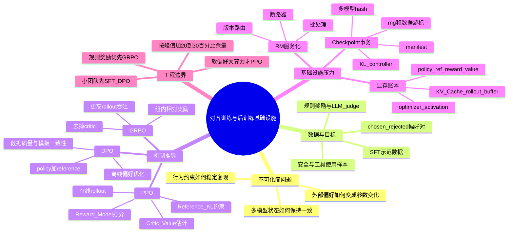

# 第10b章：对齐训练与后训练基础设施

> 预训练解决"模型学到了什么分布"，后训练解决"模型在真实任务里该怎样表现"。两者都在训练模型，但目标函数、数据来源和基础设施形态并不相同。

> **关联章节**：本章建立在 [第10章](./10-memory-checkpointing-and-recovery.md) 的 checkpoint 与恢复机制之上，也和 [第10c章](./10c-finetuning-and-multi-adapter.md) 的微调形态、[第14章](../part5-serving-infra/14-online-inference-architecture.md) 的推理系统强相关。对齐训练经常同时消耗训练资源和推理资源。

## 1. 第一性原理拆解 + 学习大纲

### 拆 — 不可化简的问题

剥掉 PPO、DPO、GRPO、RLHF、Reward Model 这些名字，本章真正要解决的不可化简问题是：**一个预训练模型已经学会了语言分布，但它还不知道在具体产品场景里什么回答更应该被偏好、什么边界必须遵守、什么行为虽然概率高却不能交付；平台必须把这些外部偏好稳定地转化为模型参数变化，并且保证这个转化过程可复现、可评测、可恢复、可扩容。** 预训练只要求模型继续压低 token prediction loss，目标函数来自语料本身；后训练的目标函数却来自人、规则、judge、业务策略和安全约束。它们不是自然存在于语料里的单一数值，而是一组会漂移、会冲突、会被模型利用漏洞的外部信号。

这就带来一个基础设施层面的本质差异：pretraining 的系统中心是一个连续训练 loop，alignment 的系统中心是一个闭环控制系统。这个闭环里至少有四类状态同时存在：policy model 负责生成候选行为，reference model 负责约束它不要离原始能力太远，reward model 或规则系统负责把行为映射成偏好信号，critic/value 或组内 baseline 负责把稀疏反馈变成可更新的梯度。每一类状态都可能有独立版本、独立显存峰值、独立吞吐瓶颈和独立失败模式。工程上最容易犯的错误，是把对齐训练想象成"换一个 loss 的 SFT"。如果这样做，rollout 阶段会把训练卡闲置，RM 打分会拖慢 step，reference 版本漂移会让 KL 曲线不可解释，checkpoint 恢复后 policy、critic、rollout buffer 不一致会让训练继续跑但结论失真。

因此，本章不是算法排行榜，而是后训练基础设施的建模课。你要学会把"模型怎样更符合偏好"拆成数据、推理、训练、评测、checkpoint、服务化部署六个互相约束的问题：数据决定偏好信号是否可信，推理决定 rollout 是否跟得上训练，训练决定参数如何更新，评测决定更新是否真的改善行为，checkpoint 决定失败后能否回到同一组状态，部署选型决定 RM/ref/rollout 是共置还是独立服务。只要其中一个环节没有版本化和可观测性，对齐结果就很难解释。

### 推 — 从这个问题如何推导出每个机制

从"外部偏好如何变成参数变化"出发，可以自然推导出本章每个机制。第一步是 SFT：如果我们有高质量示范回答，就先用监督学习把 base model 拉到可指令跟随的区域，这降低后续偏好优化的探索成本。第二步是偏好数据：单个标准答案不足以表达"更好"，所以需要同一 prompt 下的 chosen/rejected、打分、critique 或规则验证结果。第三步是 DPO：如果偏好对已经离线存在，那么最省系统复杂度的做法，是直接比较 policy 对 chosen/rejected 的 logprob，并用 reference model 作为锚点；这解释了为什么 DPO 像 SFT，却必须严守 tokenizer、chat template、截断策略和 reference 版本一致性。

如果偏好信号必须来自当前 policy 生成的新样本，就推导到 PPO/GRPO。PPO 需要 rollout，因为模型需要在线试错；需要 Reward Model，因为人类不可能在训练内环实时打分；需要 reference model，因为只追 reward 会导致模型跑偏；需要 critic/value model，因为单条 response 的 reward 太稀疏，需要估计 advantage 来稳定更新。于是 PPO 必然变成多模型协调系统，而不是单模型训练脚本。GRPO 则从 critic 的成本继续推导：如果同一 prompt 可以生成一组 response，并且 reward 能在组内比较，那么组均值可以充当 baseline，critic 就可以被移除；代价是 rollout 样本数上升，推理引擎吞吐变得更关键。

再往下推，就是 RM 部署、显存账本和 checkpoint 一致性。RM 如果写在训练脚本里，任何超时都会阻塞策略更新；如果服务化，就必须有批处理、版本路由、限流、重试和指标。PPO 显存账本必须列出 policy、reference、reward、value/critic、optimizer、activation、KV Cache 或 rollout buffer，因为这些组件虽然不一定同时峰值，却会在阶段切换、权重同步、checkpoint 保存时形成短暂 OOM。checkpoint 也不能只保存 policy 权重，而要把 policy、critic、reference artifact、RM artifact、rollout buffer、KL controller、rng、数据游标写进同一份 manifest；否则恢复出来的是一组目录，而不是同一个训练状态。最后，评测必须进入训练内环，因为 loss 或 reward 上升不代表行为改善，win-rate、长度分布、安全拒答、格式遵循和 judge 版本才决定一个 checkpoint 是否值得继续训练或进入发布门禁。

### 绘 — 因果链路



### 导 — 读完本章你应该能回答

1. 为什么 post-training 不是"预训练后再训一下"，而是一条包含数据、训练、推理、评测和发布门禁的闭环管线？
2. 为什么 alignment training 不能等同于 RLHF，SFT、DPO、GRPO、PPO 分别解决偏好塑形里的哪一层问题？
3. 给定 LLaMA-7B 和 8×H100 80GB，怎样把 PPO 的 policy、reference、reward、value/critic、optimizer、activation、KV Cache 或 rollout buffer 分项列成显存账本？
4. 为什么 DPO 更容易平台化，但仍然需要严格保证 reference model、tokenizer、chat template、数据版本和评测口径一致？
5. 什么情况下应该把 Reward Model 和训练节点共置，什么情况下应该把 RM 做成独立推理服务或共享推理池？
6. GRPO 去掉 critic 后省掉了哪些状态，又为什么会把压力转移到大 batch rollout 和 reward 可靠性上？
7. 一个可恢复的 PPO checkpoint manifest 至少要记录哪些模型、控制器、随机数、数据游标和评测版本，才能避免"恢复后还能跑但结果不可解释"？

## 学习目标

完成本章学习后，你将能够：

1. 区分 pretraining、post-training、alignment training 三者的关系
2. 理解后训练常见阶段：SFT、偏好优化、安全/工具使用整形、评测门禁
3. 理解为什么"对齐训练"不是 RLHF 的同义词
4. 看懂 PPO / RLHF 里的多模型协调关系
5. 区分 PPO、DPO、GRPO 在资源形态上的差异
6. 识别 RLHF 系统里的典型性能瓶颈（rollout、RM 打分、显存峰值）
7. 设计更适合后训练的实验管理与 checkpoint 策略
8. 为不同规模的团队选择合适的对齐路线（SFT → DPO → PPO/GRPO）

---

## 正文内容

### 10b.1 先分清 Pretraining、Post-Training 与 Alignment Training

很多人第一次接触这一块时，最容易把三个词混成一个：

- **Pretraining**：让模型在大规模通用数据上学会语言 / 代码 / 多模态分布
- **Post-training**：在 base model 预训练完成之后，用更贴近产品目标的数据和目标函数继续塑形
- **Alignment training**：post-training 里的一个重要子集，重点让模型行为更接近人类、系统或产品希望它遵守的偏好与约束

可以先把关系理解成：

```text
pretraining
  └── post-training
        ├── instruction tuning / SFT
        ├── alignment training  (DPO / PPO / GRPO / RLAIF / Constitutional AI ...)
        ├── tool-use / agent tuning
        ├── safety / refusal shaping
        └── domain adaptation / distillation
```

但要注意两点：

1. **不是所有 post-training 都是 alignment**
2. **也不是所有 alignment 都要用 RLHF**

例如：

- instruction tuning / SFT：通常属于 post-training，也常常承担一部分 alignment 作用
- 偏好优化（DPO / PPO / GRPO）：更明确地属于 alignment training
- tool-use tuning、格式整形、拒答边界、安全策略整形：通常也属于 post-training
- 某些纯领域适配或压缩蒸馏：属于 post-training，但未必以"行为对齐"为核心

| 维度 | Pretraining | Post-training | Alignment training |
|------|-------------|---------------|--------------------|
| 核心问题 | 模型会什么 | 模型怎样更可用 | 模型怎样更符合偏好和约束 |
| 常见数据 | 海量通用语料、代码、多模态数据 | 指令样本、偏好对、工具轨迹、安全样本 | 偏好数据、规则反馈、拒答 / 安全数据 |
| 常见目标 | 学表示、学通用能力 | 提升任务可用性与产品形态 | 提升 helpfulness、truthfulness、harmlessness、风格一致性 |
| 数据量级 | T 级 token | 10K～10M 样本 | 1K～1M 偏好对或轨迹 |
| 训练时长 | 数周到数月 | 小时到数天 | 小时到数周 |
| 资源特征 | 大吞吐、长作业、强通信 | 数据更小但 loop 更多 | 训练 + 推理 + 评测更强耦合 |
| 失败代价 | 极高（钱 + 时间） | 中等（可重跑） | 中等，但调参空间大 |

一个很实用的判断是：

> pretraining 更像"把能力写进参数"，post-training 更像"把能力组织成可交付行为"，alignment training 则是在其中明确约束"应该怎样做、不应该怎样做"。

**一个反直觉的事实**：从算力角度看，post-training 通常只占整个训练预算的 1%～10%，但它对最终产品体验的影响往往超过 50%。这也是为什么基础设施团队必须认真对待它 —— 它虽然"便宜"，但**单位算力的产品价值极高**，而且一旦 loop 打不通，再强的 base model 也交付不出来。

### 10b.2 一个典型的后训练 Pipeline 长什么样

后训练不是一个单一算法名，更像一条工艺链。一个常见流程可以画成：

```text
base pretrained model
  │
  ▼
[1] SFT / instruction tuning            ← 学会按指令回答
  │
  ▼
[2] preference data construction        ← 收集 chosen/rejected
  │
  ▼
[3] preference optimization             ← DPO / PPO / GRPO / RLAIF
  │     (+ reward model training if PPO)
  ▼
[4] safety / refusal / tool-use shaping ← 补边界、补工具使用
  │
  ▼
[5] eval / red-team / release gate      ← 判断能不能放出去
  │
  ▼
 release candidate
```

这条链的关键点在于：**不同阶段解决的是不同问题**，而且每个阶段都可能独立迭代多轮。一次完整的模型发布，往往是 1 次 SFT + 3～5 次偏好优化 + 多轮 safety 补丁 + 十几次评测。

| 阶段 | 常见输入 | 主要目标 | 更像哪类基础设施 |
|------|----------|----------|------------------|
| SFT / instruction tuning | prompt-response 演示数据 | 先学会按指令回答、输出格式更稳定 | 离线训练 job |
| 偏好数据构建 | chosen / rejected、打分、critique、AI feedback | 给"什么更好"提供监督信号 | 数据平台 + 标注 / judge 流水线 |
| 偏好优化 | DPO、PPO、GRPO 等训练流程 | 让模型行为向偏好分布靠近 | 训练 + 推理混合系统 |
| 安全 / 工具使用整形 | refusal 样本、工具轨迹、策略规则 | 让模型学会边界、调用方式和失败处理 | 训练 + 策略控制面 |
| 评测与放行 | benchmark、红队数据、人工 / LLM judge | 判断版本是否可上线 | 评测平台 + 发布门禁 |

这也是为什么行业里常把 post-training 单独拿出来讲。比如 Llama 3 的公开说明里，就把 post-training 描述成一条会组合使用 **SFT、rejection sampling、PPO、DPO** 的管线，而不是单个"再微调一下"的动作。类似地，DeepSeek-R1 的训练过程在 SFT 和 GRPO 之间反复切换了多轮，每一轮解决一类问题。

#### 10b.2.1 Llama 3 后训练的启示

为什么要把 Llama 3 这类公开案例拿出来看？因为它说明生产级 post-training 不是"选一个最火算法"的问题，而是多阶段工艺组合的问题。平台如果只支持单次 SFT 或单次 DPO，就无法承载真实发布节奏：数据会反复生成、过滤、重标；模型会反复训练、评测、回滚；每一轮还要保留足够的 artifact 让结果可复现。

Llama 3 公开的后训练工艺给基础设施团队几个重要信号：

- **不是单算法**：官方文档明确提到使用了 SFT + rejection sampling + DPO + PPO 的组合
- **多轮迭代**：不是"一次 SFT + 一次 DPO 就完事"，而是在多个阶段反复
- **合成数据占比高**：相当比例的偏好数据由更强的模型 / judge 自动生成
- **评测是一等公民**：红队、自动评测、人工评测贯穿始终，不是最后一步

这些工程决策都会直接反映在基础设施需求上：
- 平台要能跑**多种不同形态**的训练 job（SFT、DPO、PPO）并在同一个实验框架下对比
- 数据平台要支持**模型生成 → 模型打分 → 人工校验**的半自动流水线
- 评测系统要能**在 checkpoint 粒度自动触发**，而不是等训练完才评

#### 10b.2.2 后训练的资源特征

从资源角度看，post-training 往往有三个明显特征：

- **总算力通常远小于 pretraining**，但反馈密度更高
- **训练 loop 更短、更频繁**，更依赖快速评测和版本对比
- **数据质量往往比数据量更重要**

一个粗略的成本感觉（基于 2025～2026 的公开价格）：

| 训练形态 | 7B 模型代价 | 70B 模型代价 | 数据准备成本 |
|----------|-------------|--------------|--------------|
| SFT（单卡 / 小集群） | $50 - $500 | $500 - $5K | 示范数据标注 $5K - $50K |
| DPO | $200 - $500 | $2K - $5K | 偏好对标注 $10K - $100K |
| PPO（全量 RLHF） | $2K - $5K | $20K - $50K | 偏好 + RM 数据 $50K - $500K |
| GRPO（规则奖励） | $1K - $5K | $10K - $30K | 可低至 $0（规则生成） |

所以它的瓶颈经常不是"卡够不够多"，而是：

- 偏好数据是否可靠（"数据脏"比"卡少"更致命）
- RM / judge 吞吐是否够
- 评测与回滚是否足够快
- 实验能否复现（同一份数据同一组超参，跑两次结果能差很多）

### 10b.3 为什么对齐训练是一个独立的基础设施问题

Pretraining 的主路径通常很单纯：

- 一个模型
- 持续前向 / 反向 / 更新
- 关注吞吐、扩展效率和 checkpoint

而对齐训练不是这样。它经常同时包含：

- 生成 rollout（推理）
- 计算偏好或 reward（推理 + 前向）
- 做策略更新（训练）
- 维护多个模型状态（内存管理）

这意味着平台面对的不再是"一个训练 job"，而是"**推理子系统 + 训练子系统 + 评测回路**"的组合。

| 维度 | Pretraining / SFT | 对齐训练 |
|------|-------------------|----------|
| 模型数量 | 通常 1 个主模型 | 2-4 个模型并存 |
| 主资源形态 | 连续训练 | 推理与训练交替 |
| 关键瓶颈 | 吞吐、通信、显存 | 显存峰值、rollout 吞吐、实验稳定性 |
| 通信模式 | 主要是 gradient all-reduce | 还要 policy → rollout engine 同步权重 |
| 失败模式 | OOM、通信挂 | 以上全部 + reward hacking、KL 发散 |
| checkpoint | 主要保存模型与优化器 | 还要保存 policy / critic / 偏好训练状态 |
| 调度难度 | 静态资源 | 资源需求随 rollout 长度动态变化 |

#### 10b.3.1 一个直观的时间线对比

用一个具体的例子感受一下差异。同样是训练一个 7B 模型 1 小时：

**SFT 的一小时**：
```text
[████████████████████████████████████████████████] forward + backward
│                                                 │
└── 全程一个模型，稳定吞吐                         │
```

**PPO 的一小时**：
```text
[rollout][RM][ref][update][cp][rollout][RM][ref][update][cp]...
   ↑       ↑    ↑     ↑     ↑
   推理    推理  推理   训练   存档
   (最慢)  (快)  (中)   (中)   (I/O)
```

同一份 GPU 资源，在 PPO 里的利用率曲线是剧烈波动的：rollout 时 policy model 做推理（KV cache 压显存，计算量大但不训练），RM 打分时 RM 模型工作、policy 空转，update 时反过来……**这种"有人干活别人等"是对齐训练最大的效率黑洞**。

根据 OpenRLHF 等开源框架的实测数据，**RLHF 训练时间中约 80% 花在 sample generation（rollout）上**，真正的策略更新只占 20%。这意味着：

1. **推理优化比训练优化更值钱** —— 把 rollout 提速 2x，整体就接近 2x
2. **vLLM、TGI 这类推理引擎是 RLHF 的一等公民**，而不是"可选优化"
3. **训练卡和推理卡的比例**不是 1:1，而应该基于 rollout 耗时反推

所以如果平台把对齐训练简单当成"又一个 train.py"，通常会在资源编排和恢复逻辑上踩坑。更合理的抽象是：

```text
Alignment Job = {
    rollout_service,       // 推理子系统，可以是 vLLM 集群
    reward_service,        // 推理子系统，独立部署或共置
    reference_service,     // 推理子系统，只前向
    trainer,               // 训练子系统
    orchestrator,          // 协调器，管理 step / sync / checkpoint
}
```

### 10b.4 RLHF / PPO 的基础设施形态

如果采用经典 RLHF 路线，一个常见训练顺序是：

```text
SFT model
  └── preference collection
        └── reward model training
              └── PPO against reward + KL to reference model
```

PPO 是最能体现"多模型协调"的典型例子。一次训练循环大致可以拆成：

$$
t_{\text{step}} \approx t_{\text{rollout}} + t_{\text{ref}} + t_{\text{reward}} + t_{\text{update}} + t_{\text{checkpoint}}
$$

其中前半段更像推理，后半段才是训练。reference model 虽然不参与反向，但为了计算 KL 约束所需的前向并不是免费的。

| 模型 | 是否训练 | 在做什么 | 主要资源压力 | 可否替换 |
|------|----------|----------|--------------|----------|
| Policy model | 是 | 生成 response、参与 PPO 更新 | 参数、梯度、优化器、KV Cache | 核心，不可替换 |
| Reference model | 否 | 提供 KL 约束基线 | 只读权重、前向显存 | 可与 policy 共享权重（LoRA 场景） |
| Reward model | 否 | 给 rollout 打分 | 高频推理吞吐 | 可替换为规则 / judge LLM |
| Critic / Value model | 是 | 估计 value，参与更新 | 参数、梯度、优化器 | GRPO 中被组内相对奖励替代 |

#### 10b.4.1 PPO 的显存账本

为什么 PPO 必须单独做显存预算？因为它不是"一个 7B 模型训练"，而是同一轮里要同时管理 policy、reference、reward、critic 和 rollout KV Cache。SFT 的账本主要是"一个可训练模型 + 激活 + 通信缓冲"，PPO 的账本则包含两个可训练模型、两个只读推理模型，以及生成阶段临时膨胀的 KV Cache。工程上最危险的误判，是拿 SFT 的显存经验去估 PPO，然后在 rollout 或 update 切换点 OOM。

下面以 LLaMA-7B 级 policy、bf16 权重、Adam 全量训练、8×H100 80GB 单节点为例做一个 worked example。这里的数字是资源规划用的粗估：7B bf16 权重约 14GB；全量 Adam 训练通常按"参数 + 梯度 + optimizer state"约 12 bytes/param 估算，即单个可训练 7B 模型约 84GB，不含激活、通信 bucket 和碎片。

| 组件 | 单模型/阶段估算 | 是否常驻 | 8×H100 上的工程含义 |
|------|----------------|----------|---------------------|
| Policy 参数 + 梯度 + optimizer | ~84GB | update 阶段常驻 | 可用 ZeRO/FSDP 切到 8 卡，每卡约 10.5GB 起步，但还要加激活和通信缓冲 |
| Reference model bf16 权重 | ~14GB | 通常常驻或可重载 | 只前向，用于 KL；可和 policy 初始权重共享存储，但运行时仍要有可访问权重 |
| Reward model bf16 权重 | ~14GB | rollout 后打分阶段常驻或远端服务 | 如果共置会吃训练节点显存；独立部署则吃网络和服务治理 |
| Critic 参数 + 梯度 + optimizer | ~84GB | update 阶段常驻 | PPO 的第二个可训练模型，是 GRPO 最主要省掉的部分 |
| Policy/critic 训练激活 | ~20-80GB | update 阶段峰值 | 取决于 micro-batch、seq len、checkpointing；通常比参数账本更难静态估 |
| Rollout KV Cache | ~10-60GB | rollout 阶段峰值 | 与并发序列数、层数、hidden size、生成长度线性相关；长 response 时会成为主峰值 |
| 通信 bucket / allocator 碎片 / runtime buffer | ~20-50GB | 阶段切换时明显 | NCCL、FSDP/ZeRO、CUDA graph、推理引擎预分配都会吃掉余量 |
| **PPO 理论总账本（未复用）** | **~246-386GB+** | 不应全部同时压实 | 8×80GB=640GB 总量够，但单卡峰值和阶段切换决定是否 OOM |

和同模型 SFT 对比，差异不是"多一点显存"，而是资源形态完全不同：

| 训练形态 | 可训练模型 | 只读模型 | 额外推理态 | 粗略总显存账本 | 主要峰值来源 |
|----------|------------|----------|------------|----------------|--------------|
| 7B SFT 全量训练 | policy 约 84GB | 无 | 无 | ~110-180GB（含激活/缓冲） | 反向激活、optimizer、通信 bucket |
| 7B PPO 全量训练（共置） | policy ~84GB + critic ~84GB | ref ~14GB + RM ~14GB | rollout KV ~10-60GB | ~246-386GB+ | rollout KV、policy/critic update、阶段切换碎片 |
| 7B PPO 训推分离 | train 节点放 policy/critic；RM/ref/rollout 可远端 | 远端或分片 | rollout service 承担 KV | 训练节点 ~190-260GB；推理节点另算 | 权重同步、远端服务吞吐、buffer 排队 |

这也是为什么 [Efficient RLHF 论文](https://arxiv.org/abs/2309.00754) 指出：**full fine-tuning PPO 对 Llama 7B 在单卡 A100 80GB 上会直接 overflow**，即便用 DeepSpeed ZeRO-1 也不行。8×H100 能跑，不代表可以把四个模型"无脑共置"：总显存有余，不等于每张卡在每个阶段都有余。

PPO 的峰值显存通常高于稳态，有三个原因。第一，rollout 阶段要给 policy 推理保留 KV Cache，生成越长、并发越高，KV Cache 越大；update 阶段又要为 policy/critic 的反向传播保留激活，两者虽然不完全同时发生，但切换时推理引擎、CUDA allocator、FSDP buffer 不一定立即释放。第二，reference 和 reward 虽然只前向，但如果为了降低延迟选择共置，它们的权重会挤占训练余量。第三，checkpoint、权重同步到 rollout engine、optimizer step 都可能短暂复制权重或 buffer，形成"几秒钟的峰值"，而 OOM 往往就发生在这几秒。

因此成熟框架会做 rollout/training 显存复用：rollout 时优先把训练激活和部分 optimizer shard 释放或 offload，把空间让给 vLLM/SGLang 的 KV Cache；update 时销毁或压缩 rollout KV，把显存还给 FSDP/ZeRO 反向传播；RM/ref 可以远端服务化，或者在同节点上按阶段加载。平台调度不能只看平均显存曲线，而要把"rollout 峰值、RM/ref 前向峰值、update 峰值、checkpoint 峰值"分别记录下来，并按峰值再留 20%-30% 余量。

#### 10b.4.2 PPO 的部署架构选型

平台工程里最常见的做法不是"把四个模型硬塞一台机器"，而是**按资源特征拆层**：

**方案 A：同机共置（适合小规模实验）**
```text
┌─────────────── 1 node (8× A100 80GB) ────────────────┐
│  [policy (train)]  [critic (train)]                  │
│  [reference (ro)]  [reward (ro)]                     │
│  共用 NCCL，本地推理                                  │
└──────────────────────────────────────────────────────┘
```
优点：路径短、延迟低、运维简单。缺点：显存压力大、扩展性差。

**方案 B：训推分离（生产常见）**
```text
┌─ Train Nodes ─────┐  ┌─ Rollout Service ──┐  ┌─ RM Service ─┐
│ policy + critic   │  │ vLLM / TGI cluster │  │ RM inference │
│ (with optimizer)  │◀─│ (policy weights    │  │ (batched)    │
│                   │─▶│  periodically      │  │              │
│                   │  │  synced)           │  │              │
└───────────────────┘  └────────────────────┘  └──────────────┘
        │                       │                     │
        └───────── 权重同步、结果回传 (NCCL/RPC) ──────┘
```
优点：各组件可独立扩容、利用率更高。缺点：权重同步和网络治理变复杂。

**方案 C：Hybrid Engine（OpenRLHF 等框架）**
```text
┌── 共享 GPU 池 (Ray 调度) ──┐
│                           │
│ [policy]──train──▶        │
│    │                      │
│    ▼ (swap weights)       │
│ [vLLM rollout engine]     │
│    │                      │
│    ▼                      │
│ [reward / ref forward]    │
│                           │
└───────────────────────────┘
```
训练和推理**时分复用**同一批 GPU，通过 Ray + vLLM 动态调度，避免 rollout 时训练卡空转的问题。这是 2024 年后 OpenRLHF、Verl、RLHFuse 等框架的主流做法。

| 方案 | 显存利用率 | 扩展性 | 实现复杂度 | 推荐场景 |
|------|------------|--------|------------|----------|
| 同机共置 | 低（峰值挤） | 差 | 低 | 单实验原型 |
| 训推分离 | 中 | 好 | 中 | 生产 PPO 平台 |
| Hybrid Engine | 高 | 好 | 高 | 追求极致效率的团队 |

#### 10b.4.3 PPO 训练的典型问题与对策

为什么 PPO 的故障排查比 SFT 更难？因为很多问题不是系统直接报错，而是模型行为悄悄变坏。SFT OOM、loss nan、数据读取失败通常很直观；PPO 可能表现为 reward 上升但人类偏好下降、KL 看似正常但回答变短、critic loss 不动但 policy 仍在更新。平台必须把"训练健康"和"行为健康"同时监控，否则等到人工评测才发现问题时，已经浪费了大量 rollout 和 GPU 时间。

PPO 不稳是公认的难题。下面是常见故障模式和对应的基础设施支持：

| 故障模式 | 现象 | 根因 | 平台应提供 |
|----------|------|------|------------|
| Reward hacking | reward 飙升但人眼看质量下降 | RM 有漏洞，模型学到"刷分姿势" | 在线 win-rate、多样本抽检 |
| KL 发散 | KL 越训越大，模型"跑偏" | KL 系数太小或 reward 太强 | KL 实时监控、自动回滚 |
| Loss 震荡 | 训练曲线剧烈抖动 | learning rate 大、batch 小 | 自动早停、ckpt 对比 |
| 输出退化 | 长度崩塌、重复、空输出 | advantage 估计不稳、reward 畸形 | rollout 样本抽样展示 |
| Critic 学不动 | value loss 长期不降 | value function 难估 | 考虑切 GRPO |

### 10b.5 DPO / GRPO 等方法为什么更容易平台化

为什么要认真区分 DPO、GRPO 和 PPO？因为它们解决的产品问题可能相似，但对平台的压力完全不同。PPO 是训推混合系统，DPO 更像离线训练，GRPO 介于两者之间。选错方法的代价不只是效果差，还包括错误采购 GPU、错误建设 RM 服务、错误设计 checkpoint 格式。基础设施团队的目标不是证明某个算法先进，而是在当前数据、算力和评测成熟度下，选一条能稳定迭代的路线。

不是所有对齐方法都像 PPO 那样重。近两年出现了一系列"简化版对齐算法"，它们各自在不同维度上砍掉了 PPO 的某些组件。

| 方法 | 在线 rollout | 需 reward model 打分 | 需 critic | 需 reference | 基础设施复杂度 |
|------|--------------|----------------------|-----------|--------------|----------------|
| PPO / RLHF | 需要 | 通常需要 | 需要 | 需要 | ★★★★★ |
| GRPO | 需要 | 可由规则或组内相对奖励替代 | 不需要 | 需要 | ★★★ |
| RLOO / REINFORCE++ | 需要 | 需要 | 不需要 | 需要 | ★★★ |
| DPO | 不需要 | 不需要 | 不需要 | 需要 | ★★ |
| ORPO | 不需要 | 不需要 | 不需要 | 不需要 | ★ |
| KTO | 不需要 | 不需要 | 不需要 | 需要 | ★★ |

#### 10b.5.1 DPO：偏好优化的"离线化"

为什么很多团队会先做 DPO？因为它把"在线试错"变成了"离线监督"，平台形态几乎退化回 SFT。PPO 要先让 policy 生成新 response，再让 RM/ref/critic 参与训练内环；DPO 直接消费已经准备好的偏好对，把 chosen 和 rejected 的相对概率拉开。对基础设施团队来说，这意味着少了 rollout 服务、RM 在线打分、critic checkpoint、权重同步这几类最容易出故障的环节。

DPO 的数据格式也更明确。最常见 schema 是：

```json
{
  "prompt": "...",
  "chosen": "...",
  "rejected": "...",
  "metadata": {
    "source": "human|llm_judge|rule",
    "judge_model": "optional",
    "quality_score": 0.93
  }
}
```

它要求每条样本至少有同一个 prompt 下的一好一坏两个 response。数据量级不一定巨大：几千到几万条高质量偏好对就能做小模型验证，几十万到百万级偏好对才更接近生产大模型后训练。关键不是"数量越多越好"，而是 chosen/rejected 的差异要和产品偏好一致；如果 rejected 只是随机差样本，DPO 会学到表面模式；如果 judge 噪声很高，DPO 会把噪声放大成模型风格偏移。

训练形态上，DPO 很接近 SFT：读取 batch、算 policy logprob、算 reference logprob、反向更新 policy。差异在 loss 而不是系统结构：

- 资源形态更接近 [第10c章](./10c-finetuning-and-multi-adapter.md) 的监督微调
- 不需要在线 rollout 服务
- 不需要维护 reward model 推理链路

从算法视角看，DPO 的关键价值在于：

- 直接用偏好对做优化（chosen vs rejected）
- 不必单独训练显式 reward model
- 不必再跑一层 PPO-style policy optimization
- 训练过程就是普通的监督学习循环

DPO 的 loss 可以粗略写成：
$$
\mathcal{L}_{\text{DPO}} = -\log \sigma \left( \beta \log \frac{\pi_\theta(y_w|x)}{\pi_{\text{ref}}(y_w|x)} - \beta \log \frac{\pi_\theta(y_l|x)}{\pi_{\text{ref}}(y_l|x)} \right)
$$

其中 $y_w$ 是偏好样本，$y_l$ 是非偏好样本，$\pi_{\text{ref}}$ 是冻结的 SFT 模型。整个流程里**没有任何在线采样**，对基础设施的要求等同于 SFT + 一个只前向的 reference model。

数值稳定性上，DPO 比 PPO 少了 advantage、value loss、reward scaling 这些震荡源，但并不等于"不会炸"。常见问题是 $\beta$ 太大导致 sigmoid 饱和，chosen/rejected logprob 差异过大时 loss 梯度变得很小；或者 reference logprob 计算不一致，导致模型被错误 KL 锚定。工程上要保证 policy 和 reference 使用同一 tokenizer、同一截断策略、同一 chat template；训练日志里除了 loss，还要看 chosen/rejected reward margin、隐式 KL、长度分布和 win-rate。也就是说，DPO 的训练器像 SFT，但数据校验和评测要求更接近对齐训练。

这让它对现有 SFT / fine-tuning 平台更友好。如果平台连数据、评测和 artifact 流程都还没跑顺，直接上 PPO 往往不是好选择。更稳的路径是：先用 DPO 暴露偏好数据和评测 pipeline 的问题，再决定是否值得为 PPO/GRPO 付出在线 rollout 的复杂度。

#### 10b.5.2 GRPO：砍掉 critic 的 PPO

为什么 GRPO 会突然变得重要？因为 PPO 最重的组件之一是 critic：它不仅占一份接近 policy 的权重，还要梯度、optimizer、checkpoint 和 value loss 监控。GRPO（Group Relative Policy Optimization）来自 DeepSeekMath 论文，后来在 DeepSeek-R1 里大放异彩。它的核心观察是：

> **既然 reward model 本来就是做"相对比较"训练出来的，那我们根本不需要一个 critic 来估绝对 value —— 直接用一组样本的平均 reward 当 baseline 就行了。**

具体做法：对同一个 prompt 采样 $G$ 个 response（DeepSeek-R1 用 16 到 64 个），每个的 reward 减去这组的平均，作为 advantage。这一改动带来的**基础设施影响**是显著的：

| 维度 | PPO | GRPO | 差异 |
|------|-----|------|-----|
| Critic 模型 | 需要（和 policy 同大小） | 不需要 | **显存 -25%~-50%** |
| Critic 优化器 | 需要 | 不需要 | **显存再 -10%~-20%** |
| Value loss | 需要 | 不需要 | 训练代码更简单 |
| 每 prompt 采样数 | 1～4 | 16～64 | **rollout 开销↑** |
| 总 batch 吞吐 | 较小 | 必须大 batch（典型 1024） | 调度要适配 |
| 典型 7B 最低配置 | 8× A100 80GB | 4× A100 80GB | 门槛降低 |

显存账本会因此明显简化。以 7B 全量训练粗估，PPO 至少要同时规划 policy 的 ~84GB 训练态和 critic 的 ~84GB 训练态；GRPO 去掉 critic 后，训练态直接少一份参数、梯度和 optimizer，checkpoint 也少一套模型状态。reference 仍然需要，rollout KV Cache 也仍然需要，所以 GRPO 不是"像 DPO 一样轻"，但它把 PPO 中最难恢复、最难调参的 value model 移除了。平台侧随之少了 policy/critic 版本一致性、critic optimizer 恢复、value loss 早停等工作。

所以 GRPO 不是"全面更好"，而是**用更多 rollout 样本换掉了一个学习型 critic**。它的好坏取决于你的 rollout 引擎（vLLM 吞吐）有多强、以及 reward 信号是否足够"可对比"（规则类奖励特别契合）。如果任务是数学、代码、结构化答案，规则 reward 便宜且稳定，GRPO 的组内相对优势很适合；如果任务是写作风格、帮助性、安全边界，reward 更软、更主观，PPO 的学习型 critic 和 RM 可能仍有价值。

**什么时候选 GRPO？**
- reward 可以用规则计算（数学正确性、代码编译通过、答案匹配等）
- 有强的 rollout 引擎（vLLM、SGLang）可以支持大批量采样
- 显存敏感（小团队、单节点）
- 任务是"对/错"有清晰界线的 reasoning 类

**什么时候仍选 PPO？**
- reward 是学习型 RM 给出的软分数（helpfulness、写作质量）
- 短输出、需要细粒度 credit assignment
- 需要用 sample efficiency 换 memory（单次采样尽可能利用）

#### 10b.5.3 选择路线的决策树

给后训练平台团队的一个实用决策流程：

```text
你有什么数据？
├── 只有示范数据（prompt → ideal_response）
│   └── SFT
│
├── 有配对偏好数据（chosen / rejected）
│   ├── 数据量大、想快速落地         → DPO
│   ├── 只有单点打分（👍 / 👎）      → KTO
│   └── 资源紧（单卡、≤7B）         → ORPO
│
├── 有可验证的 reward（规则、编译、测试）
│   └── GRPO / DAPO
│
└── 有学习型 reward model + 大算力
    └── PPO（金标，但最贵最难）
```

也可以把选择压缩成一个 **PPO vs DPO vs GRPO 决策框架表**：

| 决策维度 | PPO | DPO | GRPO |
|----------|-----|-----|------|
| 最适合的数据 | 在线 rollout + RM 分数 + KL 约束 | 离线 chosen/rejected 偏好对 | 同 prompt 多 response + 规则/可比较 reward |
| 训练形态 | 推理、打分、训练交替 | 近似 SFT，额外 reference 前向 | 在线 rollout + policy 更新，无 critic |
| 显存压力 | 最高：policy、critic、ref、RM、KV | 中低：policy 训练态 + ref 前向 | 中：policy 训练态 + ref + 大 rollout KV |
| 系统瓶颈 | rollout 吞吐、RM 吞吐、critic 稳定性 | 数据质量、reference 一致性、loss 饱和 | 大 batch rollout、reward 可靠性、组内方差 |
| 适合团队阶段 | 已有稳定评测、RM、训推调度平台 | 刚建立偏好数据和后训练平台 | 有强 rollout 引擎、任务可规则验证 |
| 主要风险 | reward hacking、KL 发散、OOM | 偏好数据噪声放大、过拟合离线分布 | 采样成本高、软偏好任务信号不足 |
| 推荐先后顺序 | 最后上，先小模型验证 | 优先作为第一条偏好优化路线 | 在规则奖励或 reasoning 场景优先试 |

**一个实战经验**：即便你最终想上 PPO，也应该**先用 DPO 跑通整条数据-训练-评测链路**。DPO 花的是 PPO 的 1/10 成本，但能暴露 90% 的工程问题（数据 schema、评测指标、实验管理、checkpoint 流程）。等这条链路稳定了，再把 DPO 换成 PPO 只是训练器的替换，外围设施都是复用的。

### 10b.6 Reward Model 本质上是推理子系统

为什么单独讲 RM？因为它经常被算法论文写成一个函数 `reward(x, y)`，但在平台里它是一个会排队、会超时、会吃显存、会产生版本漂移的在线推理服务。只要 PPO 训练内环依赖 RM 分数，RM 的吞吐和稳定性就会直接决定训练 step time；RM 的版本和 prompt template 也会直接决定 reward 曲线是否可比较。

在 PPO 中，reward model 的角色很像一个高频打分服务。每轮 rollout 生成完候选响应后，都要尽快得到 reward；RM 吞吐不够，整个 step 就会被拖慢。

一个典型的 RM 请求流量特征：

- **突发性强**：rollout 一批结束后，所有样本一起要打分
- **上下文较长**：通常要把 prompt + response 全部送进去
- **延迟敏感**：RM 慢 1 秒，整个 step 就慢 1 秒
- **吞吐导向**：单次打分可以慢，但整批必须快

这和在线推理服务有相似之处，但关注点不同：

| 维度 | 线上推理服务 | RM 打分服务 |
|------|--------------|-------------|
| 请求模式 | 长时间稀疏到达 | 训练步内集中突发 |
| 首 token 延迟 | 关键 | 不关心（不生成） |
| 吞吐 | 重要 | 决定训练 step 时长 |
| 可用性 | 5 个 9 | 训练期可用即可 |
| 失败处理 | 必须降级 | 可重试甚至丢弃样本 |

#### 10b.6.1 三种 RM 部署形态

为什么 RM 部署不能只按"方便"选？因为 RM 既会拖慢 PPO step，又会改变训练节点的显存峰值。一个 7B RM bf16 权重约 14GB，如果和 policy/critic 共置，这 14GB 可能正好挤掉 rollout KV Cache 或 FSDP 通信缓冲；但如果独立部署，训练 loop 又要承担网络延迟、RPC 重试和服务限流。正确做法是把模型大小、吞吐要求、显存余量放在同一张表里判断。

| 部署方式 | 决策条件 | 优点 | 代价 | 更适合什么场景 |
|----------|----------|------|------|----------------|
| 和训练节点共置 | RM 较小（≤7B）、训练节点峰值后仍有 20%-30% 显存余量、rollout batch 不大 | 路径短，少一次网络跳转；无序列化开销 | 抢显存，训练峰值更高；故障耦合 | 小规模实验、LoRA PPO、单节点验证 |
| 独立 RM 服务 | RM 较大（7B-70B）、多个作业共享 RM、训练节点显存紧、需要独立扩容吞吐 | 训练显存更稳，便于单独扩容；可多训练任务共享 | 多一跳网络与服务治理；需要鉴权、限流、版本路由 | 稳定的 PPO 平台、多个实验并行 |
| 共享推理池部署 | RM 和 judge/ref 共用 vLLM/SGLang 池，吞吐高但任务多 | GPU 利用率高，可按队列调度 | 多租户隔离复杂，队列延迟波动 | 中大型平台、RM 请求突发明显 |
| 批量异步打分 | rollout batch 很大，step 可容忍 buffer 延迟 | 吞吐高，成本更好控 | step 延迟更难预测；需要 buffer 与幂等重试 | 大批量 rollout、离线 RLAIF |

一个简单规则是：如果 RM 权重 + peak KV Cache + update 激活之后，训练节点剩余显存低于 20%，就不要共置；如果 RM 的目标吞吐超过单训练节点本地推理能力，或者多个 PPO 作业会复用同一个 RM，也应独立部署。反过来，如果只是 7B 小实验、batch 小、网络环境差，共置可能更稳定。

它和 [第14章](../part5-serving-infra/14-online-inference-architecture.md) 的推理服务有很多共性：

- 都要批处理
- 都要控制尾延迟
- 都要监控吞吐和失败率
- 都可以用 vLLM / TGI 这类框架加速

区别在于 RM 更偏离线训练内环，但一旦变慢，影响的是训练效率而不是线上 SLA。

#### 10b.6.2 RM 打分的工程优化点

一个成熟的 RM 服务通常会做几件事：

1. **动态批处理**：把短请求合并成一个大 batch，减少 GPU 空闲
2. **请求优先级**：同一训练作业内的请求可以放同一优先级，避免饥饿
3. **结果缓存**：对确定性 prompt 做缓存（虽然 RLHF 里相同 prompt 比例不高，但某些评测重复率高）
4. **健康检查 / 断路器**：RM 挂了不能把训练拖死，要有 graceful degrade（如临时用规则 reward 顶着）
5. **多版本共存**：可以同时 serve RM v1 / v2，用于对比实验

一个经验数字：**RM 推理吞吐至少要跟上 rollout 生成速度的 2x**，否则 RM 会成为瓶颈。如果 rollout 每秒生成 100 个样本，RM 服务至少要能每秒打分 200 个。

RM 打分还有一个常被忽略的调度选择：**rollout batch 全量打分**还是**流式打分**。

| 打分模式 | 工作方式 | 优点 | 风险 | 适合场景 |
|----------|----------|------|------|----------|
| 全量打分 | rollout 一整批生成完后，一次性提交给 RM | 实现简单，batch 大，GPU 吞吐高；reward 与样本批次天然对齐 | step 尾延迟由最慢样本决定；RM 队列突发明显；失败重试粒度大 | 小中批量 PPO、同步训练 loop |
| 流式打分 | 每个 response 或小 micro-batch 生成完就提交 RM | 隐藏 RM 延迟，减少训练等待；失败可局部重试 | orchestration 更复杂；需要样本 id、幂等写入、乱序聚合 | 大 rollout、长 response、训推分离平台 |

全量打分的核心问题是"简单但容易形成洪峰"。假设一次 rollout 生成 4096 条 response，RM 会在几秒内收到一批长上下文请求，GPU 可能短时间打满，训练器则只能等待整个 batch 完成。流式打分把这个洪峰摊平：rollout engine 生成一部分样本就交给 RM，RM 返回后写入 reward buffer，等到训练器需要 update 时，大部分 reward 已经准备好。代价是系统必须有严格的样本 id、prompt id、policy version、RM version 和重试语义，否则 reward 可能和错误的 rollout 对上。

生产平台通常会采用混合策略：rollout 内部用 micro-batch 流式打分，训练 step 边界仍保持同步；如果 RM 服务延迟超过阈值，就暂停新 rollout 或降低生成并发，避免 reward buffer 无界增长。这样既保留了 PPO 算法上对 batch 的一致性，又能把 RM 推理延迟从关键路径中挤出去。

### 10b.7 实验管理的额外复杂度

对齐训练的难点通常不止算力，更在于可解释性更差、变量更多。同样的训练脚本跑两次，结果都可能有几个百分点的差异 —— 这在 pretraining 里几乎不会发生。

| 复杂度来源 | 为什么麻烦 | 平台应提供什么 |
|------------|------------|----------------|
| 超参更多 | KL 系数、rollout 长度、mini-batch、reward scaling、group size 都会影响稳定性 | 结构化实验配置与追踪 |
| 训练更不稳 | reward hacking、KL 发散、loss 震荡更常见 | 更密的指标采集和早停规则 |
| 状态更多 | policy、critic、optimizer、sampler 状态都要保存 | 更完整的 checkpoint 模板 |
| 数据链更长 | 演示数据、偏好对、judge 结果、红队样本都要版本化 | 数据 lineage 与标注元数据管理 |
| 评测更复杂 | 不能只看 loss，还要看偏好评测和人工 / LLM judge | 离线评测流水线 |
| 结果难解释 | 同样超参结果差几个点，不知道是噪声还是真差异 | 多 seed 重跑机制 |

#### 10b.7.1 必须监控的核心指标

对齐训练必须看的不只是 loss。一个健康的 PPO / GRPO 监控面板至少该有：

**训练侧指标**：
- policy loss、value loss（PPO）
- KL divergence（policy vs reference） —— 最关键，发散了就完蛋
- reward 均值、方差、直方图
- advantage 分布
- gradient norm、learning rate

**Rollout 侧指标**：
- 响应长度分布（防止长度崩塌）
- 生成速度（tokens/sec）
- 停止原因分布（EOS / 长度截断 / 其他）
- 重复率、n-gram 多样性

**评测侧指标**：
- win-rate vs reference model（用 LLM judge 或人工）
- 各能力维度的基准分（MMLU、GSM8K、HumanEval 等）
- 安全评测通过率
- 格式遵循率

**系统侧指标**：
- GPU 利用率（rollout / RM / train 分别统计）
- 各阶段耗时占比
- checkpoint 保存时长
- 失败重试次数

#### 10b.7.2 Checkpoint 比预训练更复杂

为什么 checkpoint 在 PPO 里会变成平台问题？因为恢复的对象不再是一个模型，而是一组必须版本一致的状态机。预训练恢复时，只要模型权重、optimizer、scheduler、数据游标一致，继续训练通常就能复现；PPO 恢复时，如果 policy 回到 step 12000，但 critic 是 step 11800，rollout buffer 来自旧 policy，KL controller 又重置了，训练曲线可能立刻漂移，甚至 reward/KL 指标都无法解释。

因此后训练作业的 checkpoint 一般至少要覆盖：

- **policy 权重与优化器状态** —— 基本的训练 state
- **critic 权重与优化器状态** —— PPO 特有
- **reference model 版本标识** —— 不一定保存权重，但要能找回来
- **reward model 版本标识** —— 同上
- **当前 step / episode / 全局样本计数**
- **采样与随机数状态**（rollout 的随机性需要可复现）
- **偏好数据版本或 rollout 批次信息**
- **KL controller 的内部状态**（如果用的是自适应 KL 系数）
- **replay buffer 内容**（如果用了）

更完整地看，一个 PPO checkpoint 应该被当作"多模型事务"：

| 状态类别 | 必须保存什么 | 一致性风险 | 恢复校验 |
|----------|--------------|------------|----------|
| Policy 状态 | 权重、optimizer、scheduler、global step | policy 权重和 optimizer step 不匹配会导致学习率/动量错误 | 校验 config hash、optimizer step、权重 shard 完整性 |
| Critic 状态 | 权重、optimizer、scheduler、value head 配置 | critic 落后 policy 会让 advantage 估计失真 | 要求 policy_step == critic_step，或显式记录可接受偏移 |
| Reference/RM 状态 | model id、artifact hash、tokenizer/chat template | ref/RM 版本漂移会让 KL 或 reward 不可比 | 恢复时从 registry 拉取同 hash，不允许"latest" |
| Rollout 状态 | prompt cursor、sample id、policy version、生成参数、可选 buffer | 旧 policy rollout 混入新 policy update | rollout 必须绑定 policy checkpoint id |
| 控制器状态 | KL coef、reward normalization、rng、data cursor | 恢复后 KL 系数重置，训练行为突变 | training_state.json 必须记录并在恢复日志中打印 |
| 评测状态 | eval suite version、judge model id、上次通过门禁的 ckpt | 无法判断恢复后模型是否退化 | 恢复后触发 quick-eval 对齐基线 |

policy/critic 版本一致性要显式编码，而不是靠目录名约定。推荐做法是每个 checkpoint 生成一个 manifest，里面记录 `policy_checkpoint_id`、`critic_checkpoint_id`、`reference_artifact_hash`、`reward_artifact_hash`、`rollout_policy_id` 和 `config_hash`。恢复流程先校验 manifest，再加载权重；如果 policy 和 critic 不一致，默认 fail fast，除非训练器明确支持"丢弃旧 rollout、重新 warmup critic"这类降级恢复。这样做看起来繁琐，但它能避免最难排查的故障：训练能继续跑，指标也在动，但实际上 reward、KL、advantage 都已经不再对应同一组模型状态。

这是一个典型的 PPO checkpoint 目录布局：

```text
checkpoint-step-12000/
├── policy/
│   ├── model.safetensors
│   ├── optimizer.pt
│   └── scheduler.pt
├── critic/
│   ├── model.safetensors
│   ├── optimizer.pt
│   └── scheduler.pt
├── refs/
│   ├── reference_model_id.txt      # "llama3-8b-sft-v3"
│   └── reward_model_id.txt         # "rm-helpful-v7"
├── training_state.json
│   # step, epoch, global_sample_count,
│   # kl_coef, rng_states, data_cursor
├── rollout_buffer.pt               # 可选
└── metadata.json
    # git_sha, config_hash, dataset_versions
```

一个实战教训：**很多团队第一次做 PPO 时会忘了存 KL controller 的状态**。如果用自适应 KL（根据实际 KL 大小调整系数），恢复时 KL 系数会重置到初始值，导致训练在恢复后行为和恢复前明显不同。

#### 10b.7.3 多 seed / 多配置实验的必要性

为什么对齐训练不能用"一次实验赢了"来下结论？因为 rollout 采样、偏好数据噪声、judge 偏差、KL 控制器和 reward normalization 都会引入随机性。同一个配置换一个 seed，win-rate 可能差几个百分点；两个配置差 0.5 分，很可能只是噪声，而不是方法真的更好。

由于对齐训练的随机性更强，**单次实验结论的可信度较低**。一个严肃的团队通常会：

- 关键配置至少跑 3 个 seed，看方差
- A/B 对比时让两组配置各跑 3 次，做配对检验
- 评测结果要看置信区间，而不是单一数字

这对平台的要求是：实验提交、调度、追踪、对比要做到**批量化**，而不是每次手动起一个 job。

工程上可以把多 seed 当作一种"实验模板"，而不是研究员手工复制三份配置。平台提交一次实验后自动展开为多个 seed、多个 checkpoint eval、统一聚合均值和方差；如果某个 seed OOM 或 judge 服务失败，要能标记为系统失败而不是算法失败。这样实验结论才不会被单次偶然性牵着走。

#### 10b.7.4 LLM-as-judge 自动评估 loop

为什么对齐训练不能只等最后人工评测？因为 PPO/DPO/GRPO 的失败经常发生在训练中段：reward 看起来上升，输出长度却开始异常；KL 还没发散，格式遵循率已经下降；主 benchmark 没掉分，但安全拒答边界被破坏。如果这些问题等到 full eval 才发现，前面的 GPU 时间和标注迭代都会浪费。

一个实用的自动评估 loop 是：

```text
checkpoint produced
  │
  ├── quick sample: 固定 prompt set + 新鲜 prompt set
  │
  ├── candidate/reference 双模型生成
  │
  ├── LLM-as-judge 成对打分（win/tie/lose + rationale）
  │
  ├── 指标聚合：win-rate、长度、格式、安全、拒答、领域分桶
  │
  ├── 门禁判断：低于阈值则暂停/回滚/降 KL 或缩短 rollout
  │
  └── 结果写入 experiment tracker 与 checkpoint manifest
```

LLM-as-judge 不是人工评测的替代品，而是训练内环的早期预警器。工程上要记录 judge model 版本、prompt 模板、采样温度、评测集 hash 和 rubric 版本，否则 win-rate 的历史曲线不可比。为了降低 judge 偏差，候选答案顺序要随机化，评测 prompt 要分桶抽样，关键 release checkpoint 还要抽取一部分样本做人工复核。平台还应支持"失败样本回流"：把 judge 判输、rationale 指向明确问题的 prompt 写回 error analysis 队列，用于下一轮偏好数据构建或 safety patch。

这个 loop 和 checkpoint 管理要绑定。每个 checkpoint 不只保存权重，还要保存它在 quick-eval、judge-eval、red-team 子集上的结果；恢复训练后第一件事不是盲目继续跑，而是对恢复点做一次 quick-eval，确认 policy/critic/RM/ref 状态加载后行为仍和恢复前一致。这样评测才不是训练后的报表，而是训练系统的一部分。

### 10b.8 数据与评测管线：被低估的"基础设施"

为什么本章最后还要回到数据与评测？因为对齐训练里最贵的失败往往不是训练失败，而是训练"成功"后发现偏好方向错了。GPU 可以重跑，脏数据和错误评测带来的结论污染却会进入下一轮数据构建、超参选择和发布判断。平台必须把数据版本、样本来源、judge 结果、红队反馈和模型 checkpoint 绑定起来，才能解释一次效果回退到底来自算法、数据还是评测。

大多数团队做对齐训练遇到的坑，最后都不是算力问题，而是数据和评测问题。这里单独拎出来讲。

这一层的关键问题是闭环速度。数据构建太慢，训练团队会反复在旧偏好上过拟合；评测太慢，坏 checkpoint 会继续消耗 rollout 资源；错误样本不能回流，下一轮 SFT/DPO/PPO 仍会踩同一个坑。所以数据与评测不是附属工具，而是决定 post-training 迭代周期的控制面。

平台设计时要把这条链路当作和训练同级的一等系统来做容量、权限、版本和审计，而不是临时脚本，并保证每次结论都可复盘。

#### 10b.8.1 偏好数据的生命周期

偏好数据不是"标一次就完"，它有完整的生命周期：

```text
prompt pool
    │
    ▼
[1] response sampling           ← 从 1 个或多个模型采样
    │
    ▼
[2] annotation / AI judge       ← 人工或 judge LLM 给出 chosen/rejected
    │
    ▼
[3] quality filtering           ← 过滤低一致性、歧义、敏感样本
    │
    ▼
[4] versioning & dedup          ← 打版本、去重、和旧数据合并策略
    │
    ▼
[5] training use                ← 被 DPO/PPO 消费
    │
    ▼
[6] feedback / error analysis   ← 跑出来的模型问题反推数据问题
    │
    └─────────── 回到 [1] 迭代 ──────────
```

平台能力要求：

- **Prompt pool 管理**：哪些 prompt 已经标过、哪些该补充
- **采样引擎**：能用多个模型 / 多组参数批量出候选
- **标注系统**：支持人工 + LLM judge 的混合流程
- **版本化**：每个数据集都有 hash 和血缘
- **质量报告**：一致性、难度分布、来源构成

**一个反复被验证的经验**：模型最后的表现，80% 取决于数据质量。把精力花在"让偏好数据更干净"，比花在"调 KL 系数"通常回报高得多。

#### 10b.8.2 评测：训练内环 vs 发布门禁

对齐训练有两套评测节奏，不能混：

| 类型 | 频率 | 目的 | 工具 |
|------|------|------|------|
| 训练内环评测 | 每 N 步 | 看训练是否健康、早停 | 小 benchmark、LLM judge win-rate |
| 发布门禁评测 | 候选 ckpt 出来后 | 决定能否上线 | 完整 benchmark 套件、红队、人工 eval |

训练内环评测要**快**（几分钟内出结果），哪怕粗；发布门禁要**全**（可能几小时到几天），哪怕慢。两者用同一套评测管线是常见错误 —— 要么训练监控跟不上节奏，要么发布决策过于草率。

一个实际的 cadence 示例：

```text
step 0 ────── step 500 ────── step 1000 ──── step 2000 ──── step 4000
│                │                 │                │                │
│         [quick-eval]      [quick-eval]     [quick-eval]    [quick-eval]
│                                                                    │
│                                                                    ▼
│                                                          [full eval + red-team]
│                                                                    │
│                                                                    ▼
│                                                            [human preference]
│                                                                    │
└────── checkpoint retained ─────────────────────────────────▶ [release decision]
```

### 10b.9 工程建议

综合前面的讨论，对后训练平台团队的具体建议：

**架构层面**：
- 先把"post-training 总管线"和"alignment 具体阶段"分开建模，不要把所有后训练都塞进一个 job 类型
- 先用 SFT / DPO 跑通数据、评测和 artifact 流程，再考虑 PPO
- 把 rollout、RM、reference 都抽象成独立服务，而不是训练脚本里的函数调用
- 预留显存余量，不要按稳态均值去压峰值 —— PPO 的显存是波动的，按峰值 1.3x 留冗余

**训练选型**：
- 先验证 SFT 数据流程 → 再 DPO → 再 PPO/GRPO，不要跳级
- 小团队 / 有规则奖励 → 优先 GRPO
- 软奖励 + 大算力 → 可以上 PPO
- PPO 先在小模型（如 1B）上验证 reward model 质量，再放大到 7B、70B
- 任何对齐训练都要配 SFT 数据做 KL 锚点，否则很容易"训废"

**监控与可观测**：
- rollout、RM 打分、策略更新应拆成可观测的三个阶段
- KL、reward 均值、响应长度是三个最关键的健康指标
- 评测要和训练解耦，用独立的评测服务而不是训练脚本里调
- 多 seed 是必需的，不是可选的

**数据与评测**：
- 偏好数据集像代码一样版本化，每个训练作业要记录用了哪版
- 训练内环评测要快（几分钟），发布评测要全（可慢）
- 把 RM 当作推理服务运营，而不是训练脚本里的一个函数调用
- 为 reward hacking 准备早期预警机制（长度突变、格式异常、重复率飙升）

#### 10b.9.1 反模式（Anti-patterns）

为什么要列反模式？因为后训练平台的很多事故不是新技术不会用，而是把熟悉的 SFT/预训练习惯直接搬过来。PPO 的资源峰值、DPO 的数据噪声、RM 的服务化、LLM judge 的版本漂移，都会在"看起来能跑"之后才暴露。提前识别这些反模式，可以少走很多成本很高的弯路。

平台上常见的几个坑：

| 反模式 | 典型表现 | 后果 | 正确做法 |
|--------|----------|------|----------|
| 把 PPO 当 SFT 跑 | 用同一套 SFT 平台直接起 PPO | OOM、rollout 卡死 | 单独设计对齐作业类型 |
| 忽略 rollout 吞吐 | 训练卡强、推理引擎弱 | 训练卡空等 80% | 先上 vLLM 之类的推理引擎 |
| RM 和训练耦合 | RM 写在训练脚本里 | RM 挂训练死 | 独立服务 + 断路器 |
| 不记数据版本 | 训完发现效果回退找不到原因 | 无法排查 | 数据版本强制绑定 |
| 只看 loss | 训练曲线好看但模型变差 | reward hacking | 加 win-rate、响应长度监控 |
| 单次实验下结论 | A 配置跑一次比 B 好 0.5 分 | 噪声当信号 | 至少 3 seed |

#### 10b.9.2 本章涉及的常见工具

| 概念 | 常见工具 / 命令 | 备注 |
|------|-----------------|------|
| SFT / DPO 训练 | TRL、LLaMA-Factory、Axolotl | Hugging Face 生态入口较常见 |
| 分布式 RLHF | OpenRLHF、Verl、RLHFuse、Ray | 更适合多角色协调 |
| DeepSpeed 对齐训练 | DeepSpeed-Chat | 适合已有 DeepSpeed 栈的团队 |
| Reward Model 推理 | vLLM、TGI、SGLang、自建批处理服务 | 重点是吞吐与批处理 |
| Rollout 引擎 | vLLM、SGLang、TensorRT-LLM | RLHF 80% 时间花在这里，不可忽视 |
| GRPO 实现 | TRL（GRPOTrainer）、OpenRLHF、Verl | DeepSeek-R1 路线 |
| 评测追踪 | Weights & Biases、MLflow、Aim | 方便比较 reward、KL、win-rate |
| LLM judge 框架 | LLM-as-a-judge pipelines、AlpacaEval、MT-Bench | 自动化偏好评测 |

---

## 本章小结

| 主题 | 关键点 |
|------|--------|
| Post-training | 是 pretraining 之后的一整条塑形管线，不是单个算法名 |
| Alignment training | 是 post-training 的重要子集，重点解决行为是否符合偏好与约束 |
| PPO 资源形态 | 同时包含推理、打分、更新三条路径，4 个模型并存 |
| DPO | 只需 policy + reference，最容易平台化 |
| GRPO | 砍掉 critic，用大 batch rollout 换显存，适合规则奖励场景 |
| Reward Model | 本质上是训练内环里的推理子系统，吞吐决定训练速度 |
| Rollout 瓶颈 | 占 RLHF 训练 80% 时间，是优化的重点 |
| 实验管理 | checkpoint、评测和数据 lineage 复杂度都明显高于 pretraining |
| 数据质量 | 最终效果 80% 取决于数据，不是算法 |
| 评测节奏 | 训练内环快而粗、发布门禁慢而全，不能混 |

---

## 练习题

### 基础题

1. post-training 和 alignment training 的关系是什么？为什么不能把两者完全等同？
2. 为什么 PPO 的基础设施形态不能简单等同于 pretraining？至少列出 3 个维度的差异。
3. 用 LLaMA-7B bf16 全量训练粗估 policy 的参数、梯度、Adam optimizer 显存，为什么会接近 84GB？
4. DPO 的偏好对数据一般包含哪些字段？为什么 chosen/rejected 必须来自同一个 prompt？
5. Reward Model 适合和训练节点共置还是独立服务？请分别说明模型大小、吞吐和显存余量对决策的影响。
6. 如果一个 PPO 作业要支持恢复，checkpoint 至少应额外保存哪些状态？

### 进阶题

7. 假设你要在 8×H100 80GB 上给 7B 模型做全量 PPO，按 policy ~84GB、critic ~84GB、ref ~14GB、RM ~14GB、KV Cache ~10-60GB 估算总账本，并说明为什么总显存够不代表不会 OOM。
8. 某团队有 20 万条高质量 chosen/rejected 偏好对、没有稳定 RM、只有 SFT 训练平台。它应优先选 DPO、PPO 还是 GRPO？说明理由和风险。
9. GRPO 相比 PPO 省下了 critic，但代价是"每个 prompt 要采样 16-64 个 response"。在什么样的任务和硬件配置下，GRPO 会比 PPO 更划算？反过来什么情况下不划算？
10. 你发现训练中 reward 越来越高但人工抽查觉得质量变差了。这是什么现象？在基础设施层面应该怎样提前预警？
11. KL 系数调得过大或过小分别会带来什么模型行为和系统指标变化？平台应如何监控和自动干预？
12. rollout 长度从 512 增加到 2048，会如何影响 KV Cache、RM 打分吞吐、step time 和 checkpoint 频率？
13. 对同一批 rollout，选择"全量打分"和"流式打分"分别会怎样影响 RM 服务的吞吐、尾延迟、重试语义和训练器复杂度？

### 开放题

14. 你的团队现在只有 4 张 A100 80GB，想做 7B 模型的对齐训练。给出一个从 SFT → 偏好优化 → 上线的完整路线图，说明每一步选什么算法、为什么。
15. 设计一个 PPO 多模型 checkpoint 恢复策略：如何组织 policy、critic、reference、RM、rollout buffer、KL controller 和数据游标？恢复时应做哪些一致性校验？
16. 设计一个 LLM-as-judge 评测 pipeline：从 checkpoint 产生到 quick-eval、judge 打分、门禁、失败样本回流，说明每一步记录哪些版本信息。
17. 某团队声称他们"用 DPO 完全替代了 PPO，效果一样还更省钱"。结合本章内容，你会问他们哪些问题来判断这个结论是否可靠？
