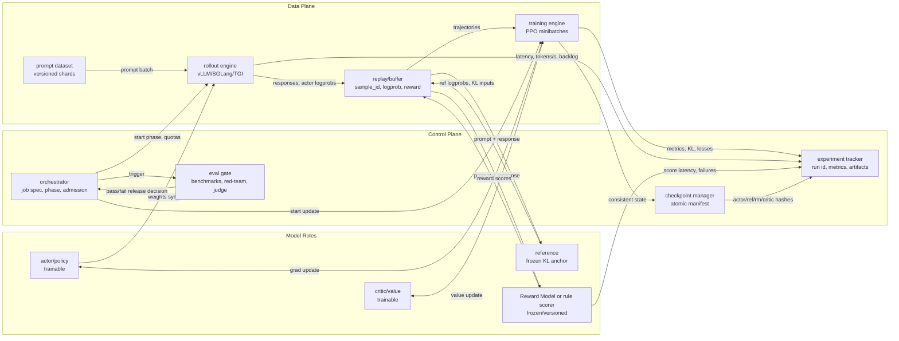

# 第10b章：对齐训练与后训练基础设施

> 预训练把通用能力写进参数，后训练把能力塑造成可交付行为。PPO/RLHF 不是"换一个 loss 的训练脚本"，而是一个同时运行推理、打分、训练、评测、checkpoint 和发布门禁的多模型系统。

> **关联章节**：本章依赖 [第10章](./10-memory-checkpointing-and-recovery.md) 的 checkpoint 与恢复协议，也和 [第10c章](./10c-finetuning-and-multi-adapter.md) 的微调平台、[第14章](../part5-serving-infra/14-online-inference-architecture.md) 的推理服务强相关。后训练经常把训练资源和推理资源绑在同一条关键路径上。

---

## 1. 第一性原理拆解 + 学习大纲

### 1.1 不可化简的问题

LLM post-training 的不可化简问题是：**base model 已经学到了 token 分布，但产品需要的是符合指令、偏好、安全策略、工具协议和发布门禁的行为；平台必须把这些外部偏好稳定、可复现、可恢复地转成参数更新。**

这个问题不能只靠一个训练 loop 解决，因为偏好信号不在原始语料里。它来自示范数据、chosen/rejected 偏好对、Reward Model、规则 reward、LLM judge、红队集、人工验收和线上策略。于是后训练系统天然包含三条路径：

- **生成路径**：actor/policy 对 prompt 生成 response，形成 rollout 样本。
- **反馈路径**：reference 计算 KL 锚点，reward model 或规则系统打分，critic 或组内 baseline 估计 advantage。
- **更新路径**：training engine 消费带 reward 的样本，更新 actor，必要时更新 critic，并把新权重同步回 rollout engine。

pretraining 和 SFT 的系统中心是高吞吐训练 step；RLHF/PPO 的系统中心是闭环控制。闭环里任何一个版本漂移，都会让结果变得不可解释：actor checkpoint 是 A，reference artifact 是 B，reward model prompt template 是 C，rollout buffer 却来自旧 actor，这种作业通常还能继续跑，但曲线、评测和发布结论都不可信。

### 1.2 学习大纲

读完本章，你应该能回答：

1. pretraining、SFT、RM、PPO、DPO、GRPO 分别是什么系统形态，而不只是算法名。
2. PPO/RLHF 中 actor、reference、reward、critic、rollout engine、training engine、sample generation、reward scoring、replay/buffer 的责任边界。
3. rollout 生成吞吐、reward scoring 吞吐和训练消费吞吐如何匹配，哪个环节会让 GPU 闲置。
4. actor/ref/reward/critic 如何切分 GPU，什么时候共置，什么时候训推分离。
5. 多模型 checkpoint 为什么必须用 manifest 保证一致性，而不是保存几个目录。
6. DPO/GRPO 为什么更容易平台化，又各自把复杂度转移到哪里。
7. 一个 LLaMA-7B PPO/RLHF 作业如何配置 GPU 布局、容量模型、评测门禁和故障恢复。

---

## 2. 概念边界：是什么、不是什么、相邻概念边界

### 2.1 是什么

**Post-training** 是 base model 预训练完成后的继续塑形过程，目标是让模型在指令、格式、偏好、安全、工具使用、领域任务上更可交付。它包含 SFT、偏好优化、安全补丁、工具轨迹训练、领域蒸馏、评测门禁和发布候选产物管理。

**Alignment training** 是 post-training 的子集，重点把外部偏好和约束写入模型行为。PPO/RLHF、DPO、GRPO、RLAIF、Constitutional AI 都属于这个范围，但 SFT 也常承担一部分对齐作用。

**RLHF/PPO 平台** 是一个多模型、多阶段、训推混合系统。它至少要调度 actor/policy、reference、Reward Model、critic/value、rollout engine、training engine、sample buffer、eval gate 和 checkpoint manager。

### 2.2 不是什么

它不是：

- 不是 pretraining 的小号版本。pretraining 主要优化 next-token loss，post-training 的目标来自外部偏好和发布策略。
- 不是单纯的 SFT。SFT 消费示范答案；PPO/GRPO 还要在线 sample generation、reward scoring、KL 约束和 buffer 管理。
- 不是只看 reward 越高越好。reward 上升可能是 reward hacking，必须同时看 win-rate、KL、长度分布、安全拒答、格式遵循和人工抽检。
- 不是训练脚本内部的一个函数。Reward Model 在平台里是推理服务，reference 是版本锚点，rollout engine 是吞吐瓶颈，eval gate 是发布门禁。

### 2.3 相邻概念边界

| 形态 | 系统中心 | 模型数量 | 数据来源 | 主要瓶颈 | 典型 checkpoint |
|------|----------|----------|----------|----------|-----------------|
| Pretraining | 连续训练 step | 1 个主模型 | 海量语料 token | 计算、通信、数据读取 | model、optimizer、scheduler、RNG、dataset cursor |
| SFT | 离线监督训练 | 1 个主模型 | prompt-response 示范 | 数据质量、显存、吞吐 | SFT model + tokenizer/chat template/data version |
| RM 训练 | pairwise/ranking 训练 | 1 个 reward model | chosen/rejected、score、critique | 标注噪声、长度偏差 | reward model + reward head + label schema |
| DPO | 离线偏好优化 | policy + reference | chosen/rejected | reference 一致性、beta、数据噪声 | policy + frozen reference artifact hash |
| PPO/RLHF | 在线 rollout + RL update | actor + reference + reward + critic | policy 生成样本 + RM 分数 | rollout、RM 延迟、critic 稳定性、KL | 多模型 manifest + buffer + controller state |
| GRPO | 在线 group rollout + relative update | actor + reference + reward/rule | 同 prompt 多 response | rollout 大 batch、reward 方差 | actor + reference hash + group sample state |

一个实用判断：如果你的训练过程不需要当前 policy 生成新 response，它大概率是 SFT/DPO 类离线训练；如果需要当前 policy 生成并被打分，它就是 RL 系统，必须按推理和训练混合平台设计。

---

## 3. 系统架构：控制路径、数据路径、状态路径、故障路径

### 3.1 RLHF/PPO 控制和数据路径



这张图要读出四条路径：

- **控制路径**：orchestrator 决定 rollout、reward scoring、PPO update、evaluation、checkpoint 的阶段切换和准入。
- **数据路径**：prompt 进入 rollout engine，生成 response，再经过 reference/RM 打分，写入 replay/buffer，最后被 training engine 消费。
- **状态路径**：actor 和 critic 会变化；reference 和 RM 必须冻结并版本化；buffer、KL controller、RNG、data cursor 也是状态。
- **故障路径**：RM 超时会堵住 buffer，rollout backlog 会让训练卡空转，checkpoint manifest 不一致会污染恢复，eval gate 失败必须阻断 release。

### 3.2 责任边界

| 组件 | 责任 | 不负责 | 关键指标 |
|------|------|--------|----------|
| actor/policy | 生成 response，接受 PPO/DPO/GRPO 更新 | 充当评测标准 | actor tokens/s、policy loss、approx KL、entropy |
| reference | 提供冻结基线，计算 KL 或 DPO ref logprob | 跟随 actor 更新 | ref artifact hash、ref forward latency、KL inputs coverage |
| Reward Model | 把 prompt+response 映射成 reward | 决定发布是否通过 | reward p50/p95 latency、score distribution、failure rate |
| critic/value | 估计 value，降低 PPO advantage 方差 | 替代 RM 判断好坏 | value loss、explained variance、critic checkpoint age |
| rollout engine | 批量 sample generation，管理 KV cache，接受 actor 权重同步 | 执行反向传播 | generated samples/s、output tokens/s、KV cache usage、backlog |
| training engine | PPO/DPO/GRPO minibatch update，写训练状态 | 托管长期 prompt 队列 | update samples/s、GPU MFU、step time、OOM count |
| replay/buffer | 绑定 sample、logprob、reward、ref logprob、actor version | 长期数据湖 | ready samples、age、version mismatch count |
| checkpoint manager | 原子记录多模型一致状态 | 修复坏训练 | manifest completeness、restore test result、RPO/RTO |
| eval gate | checkpoint 粒度评测、阻断坏版本 | 替代训练监控 | win-rate、safety pass、format pass、regression count |

### 3.3 状态路径：多模型 checkpoint 不是多个目录

PPO checkpoint 应该是一个事务 manifest，而不是"actor.pt + critic.pt + 一堆外部路径"。最低要求：

```json
{
  "run_id": "rlhf-llama7b-helpfulness-0421",
  "global_step": 820,
  "phase": "after_ppo_update",
  "update_id": "ppo_update_820",
  "world": {"num_nodes": 2, "gpus_per_node": 8, "global_world_size": 16},
  "actor": {
    "uri": "s3://ckpt/actor/step_820",
    "sha256": "actor_hash",
    "weight_version": "actor_step_820_hash",
    "optimizer": {"uri": "s3://ckpt/actor_optim/step_820", "sha256": "actor_optim_hash", "type": "adamw"},
    "scheduler": {"uri": "s3://ckpt/actor_sched/step_820", "sha256": "actor_sched_hash"},
    "distributed_state": {"strategy": "fsdp", "shards": 4, "zero_stage": null}
  },
  "critic": {
    "uri": "s3://ckpt/critic/step_820",
    "sha256": "critic_hash",
    "optimizer": {"uri": "s3://ckpt/critic_optim/step_820", "sha256": "critic_optim_hash", "type": "adamw"},
    "scheduler": {"uri": "s3://ckpt/critic_sched/step_820", "sha256": "critic_sched_hash"},
    "distributed_state": {"strategy": "fsdp", "shards": 2, "zero_stage": null}
  },
  "reference": {"artifact": "sft-v17", "sha256": "ref_hash", "frozen": true},
  "reward_model": {"artifact": "rm-helpful-v9", "sha256": "rm_hash", "prompt_template": "rm_template_v4"},
  "tokenizer": {"artifact": "tokenizer-v17", "chat_template": "chatml-v6"},
  "data": {"prompt_dataset": "prompts-v31", "cursor": "shard-044:000912"},
  "buffer": {
    "uri": "s3://buffer/run/step_820",
    "policy_version": "actor_step_819_hash",
    "accepted_policy_versions": ["actor_step_819_hash"],
    "min_ready_samples": 2048
  },
  "rollout": {
    "actor_weight_version": "actor_step_819_hash",
    "actor_weight_hash": "actor_step_819_hash",
    "engine": "vllm-0.8.x",
    "decoding_config_hash": "decode_v12_hash"
  },
  "controllers": {"kl_coef": 0.034, "reward_norm": "ema-v3"},
  "rng": {"python": "...", "torch_cuda": "...", "sampler": "..."},
  "eval": {"suite": "posttrain-gate-v12", "last_passed_step": 800}
}
```

`phase: after_ppo_update` 的含义要严格限定：actor/critic 已完成 update 820，optimizer/scheduler/FSDP 或 ZeRO shard 已写入，但 rollout buffer 仍然只能包含 update 819 的 actor 生成样本，因为这些样本是在 update 前 rollout 的。典型阶段关系如下：

| 阶段 | actor 版本 | buffer policy_version | 允许动作 |
|------|------------|-----------------------|----------|
| `pretrain_or_sft_seed` | SFT artifact | none | 初始化 actor、reference、tokenizer 和 RM 版本 |
| `rollout_generation` | `actor_step_819_hash` | `actor_step_819_hash` | rollout engine 生成 response，写入 actor hash、weight version 和 decoding config |
| `reward_scoring` | 不更新 | `actor_step_819_hash` | reference/RM/verifier 对同一批样本补 logprob 和 reward |
| `ppo_update` | 从 819 更新到 820 | consume `actor_step_819_hash` only | training engine 拒绝混入其他 actor/RM/template 版本 |
| `after_ppo_update` | `actor_step_820_hash` | last consumed `actor_step_819_hash` | 保存 actor/critic optimizer、scheduler、distributed state，准备同步 rollout 权重 |
| `rollout_weight_sync` | `actor_step_820_hash` | next `actor_step_820_hash` | rollout engine 清理旧 KV/cache，barrier 后才接受新 prompt |
| `save_manifest` | manifest actor=820 | buffer 指向已保存或已消费区间 | strict restore dry-run 通过后 manifest 可见 |

恢复时必须校验 actor、reference、Reward Model、critic、tokenizer、prompt template、buffer、optimizer、scheduler、FSDP/ZeRO shard 和 world size 的版本关系。只恢复 actor 权重而丢掉 KL controller、reward normalization、optimizer state 或 buffer policy_version，会产生一种危险状态：训练继续跑，但 advantage、KL 和 reward 分布已经不再对应同一轮 rollout。

### 3.4 一个 PPO iteration：update 819 -> 820

把 PPO 看成控制 loop，最小 trace 应该能串起一次 update 的所有状态变更。下面以 actor 从 `actor_step_819_hash` 更新到 `actor_step_820_hash` 为例：

1. orchestrator 打开 `ppo_update_820`，冻结本轮版本元组：`actor_step_819_hash`、`ref_hash`、`rm_hash`、`rm_template_v4_hash`、`chatml_v6_hash`、`decode_v12_hash`、`klctl-v12`、`reward-whiten-ema-v4`。prompt service 从 `prompts-v31/shard-044:000912` 开始 reserve `P=1024` 个 prompt，为每个 prompt 和 sample slot 生成幂等 `sample_id`，状态进入 `ReservedPrompt`。
2. rollout scheduler 只把这些 reserved prompts 派给已经加载并校验 `actor_step_819_hash` 的 rollout engine。engine 生成 response，同时写入 `rollout_actor_weight_hash`、decoding config、seed、finish reason 和 response token 上的 `old_logprobs_response`。这些 logprob 是 PPO ratio 的分母，不能在 update 前用当前 actor 重算。成功样本进入 `Generated`；如果 worker 回报的 actor hash 不等于 reservation 里的 hash，样本直接 quarantine。
3. buffer 把 `Generated` 样本转成 `ScoringPending`。reference worker 计算 `ref_logprobs_response`；RM worker 用同一 `rm_hash` 和 `template_hash` 打分，返回 raw reward 和 calibrated reward。reward shaping 在 buffer/scoring 层完成：按 token 计算 `kl = old_logprob - ref_logprob`，写入 `non_score_reward = -kl_coef * kl_sum + rule_bonus - length_penalty`，再得到 `final_reward`。reward normalization 用本轮 manifest 里的 normalization state 产生 `normalized_reward`，并记录 normalization version。
4. critic 用 `critic_step_819_hash` 对 response loss token 计算 `values_response`。advantage worker 用 `normalized_reward`、`values_response`、`gamma`、`lambda` 生成 GAE `advantages` 和 `returns`。只有 `old_logprobs`、`ref_logprobs`、raw/calibrated reward、normalized reward、values、advantages、returns、版本字段和 mask 都齐全，样本才进入 `Ready`。
5. training engine 向 buffer 请求 lease：`lease_ready_samples(count=2048, actor=actor_step_819_hash, ref=ref_hash, rm=rm_hash, template=rm_template_v4_hash, chat_template=chatml_v6_hash, decoding=decode_v12_hash)`。buffer 只能从同一 actor/RM/template/decoding_config 的 `Ready` 集合里返回样本，写入 `lease_id`、`trainer_worker_id`、`expires_at`，状态进入 `TrainerLeased`。
6. trainer 对 leased samples 跑 `E_ppo=4` 个 PPO epoch，每个 epoch 再切 minibatch。每个 minibatch 重新用当前 trainable actor 计算 `new_logprobs_response`，用 `ratio = exp(new_logprob - old_logprob)` 计算 clipped policy loss，用当前 critic 计算 value prediction 和 value loss，同时记录 entropy、clip fraction、approx KL、value loss 和 explained variance。任何样本的 actor/RM/template/decoding tuple 不一致，本轮 update 拒绝启动，而不是过滤后凑 batch。
7. actor 和 critic optimizer/scheduler 从 819 推进到 820。KL controller 根据 consumed set 的 measured KL 和 target 更新 `kl_coef`；reward normalization controller 写入本轮统计的 after-state，但不回写已经训练消费过的 sample reward。trainer 以 `lease_id` ack consumed `sample_id` 列表，buffer 幂等地把这些样本转为 `ConsumedAck`。
8. buffer 定期 expire stale leases：未 ack 且 TTL 到期的 `TrainerLeased` 样本，如果 actor age 仍在准入窗口内，回到 `Ready` 等待重新 lease；超过 `max_staleness_updates` 的样本删除或 quarantine，不能混入后续 actor version 的 update。prompt cursor 只在 reservation 和 checkpoint 协议确认后推进，防止恢复后重复或跳过 prompt shard。
9. checkpoint manager 原子写 actor 820、critic 820、optimizer/scheduler、KL controller、reward normalization controller、RNG、data cursor 和 buffer cursor/retention range。restore dry-run 校验 actor 820 可以和 consumed actor 819 的 buffer 边界同时解释，才把 manifest 从 `manifest.tmp` rename 成可见。
10. rollout side 进入 weight sync：orchestrator 停止给 `actor_step_819_hash` 派新 prompt，等待 active requests drain 或按策略取消，释放旧 KV/prefix cache，加载 `actor_step_820_hash` shard，校验 hash 后才把 rollout admission 从 819 推进到 820。此后新 prompt reserve 才允许写入 `policy_version=actor_step_820_hash`。

这条 trace 的重点不是顺序必须完全串行，而是每个异步 worker 都围绕同一个版本元组和 sample state 推进。rollout、scoring、training 可以流水化，但 trainer 消费的 ready set 不能跨 actor、RM、template 或 decoding config 混批。

### 3.5 Buffer lifecycle FSM

replay/buffer 不是一个 append-only 表，而是 PPO 控制 loop 的状态机。正常路径如下：

```text
ReservedPrompt -> RolloutInFlight -> Generated -> ScoringPending -> Ready -> TrainerLeased -> ConsumedAck -> RetainedForCheckpoint/Deleted
```

| 状态 | 进入条件 | 退出条件 |
|------|----------|----------|
| `ReservedPrompt` | prompt cursor 已预留，`sample_id`、actor version、template、decoding config 已绑定 | rollout engine 接受请求并写入 rollout lease |
| `RolloutInFlight` | rollout worker 持有 prompt lease，actor hash 已校验 | response、old logprobs、finish reason 写入，或 rollout 失败 |
| `Generated` | response 和 rollout-side metadata 完整 | reference/RM/verifier scoring 任务入队 |
| `ScoringPending` | 等待 ref logprobs、RM/raw reward、calibrated reward、critic values 或 verifier result | 全部字段齐全后进入 `Ready`；失败后按失败分支处理 |
| `Ready` | sample 可训练，且 ready index 按 actor/RM/template/decoding_config 分区 | trainer lease 命中同一版本元组 |
| `TrainerLeased` | trainer 拿到 `lease_id`、sample ids 和 TTL | trainer ack、lease expired 或 actor age 超限 |
| `ConsumedAck` | trainer 幂等确认 PPO update 已消费 | checkpoint retention 决定保留或删除 |
| `RetainedForCheckpoint/Deleted` | manifest 需要恢复窗口或审计样本 | RPO 窗口过期、checkpoint 可恢复后删除 |

失败分支要和正常路径一样显式：

- **RM timeout retry**：`ScoringPending` 可以重试，但只能重试同一个 `rm_hash`、`template_hash`、tokenizer、calibration version 和 length policy。重试预算耗尽后进入 quarantine，不能 fallback 到另一个 RM hash。
- **version mismatch quarantine**：rollout、reference、RM 或 verifier 返回的 actor/RM/template/decoding hash 与 reservation 不一致时，样本进入 quarantine；平台不能“修字段”后继续训练。
- **lease expired recycle**：`TrainerLeased` 到期但未 ack 时，如果 actor age 仍小于 `max_staleness_updates`，样本回到同一 ready partition；否则按 stale sample 删除或 quarantine。
- **actor too old expire**：`Ready` 样本如果来自过旧 actor，即使字段完整也要 expire，因为 PPO 的 on-policy 假设已经被破坏。

因此 trainer 的读取 API 不应该是 `next_ready_batch()`，而应该是带完整版本谓词的 lease：`next_ready_batch(actor_hash, rm_hash, template_hash, decoding_config_hash, count)`。这条约束比 schema 字段本身更重要。

---

## 4. 原理：从不可化简的问题推导机制

### 4.1 为什么 SFT 是第一站

如果 actor 连指令格式都不稳定，在线 RL 会把大量 rollout 浪费在无效输出上。SFT 用 prompt-response 示范把 base model 拉到可交互区域，让后续偏好优化关注"哪个回答更好"，而不是"模型是否知道要回答"。

SFT 的系统形态接近普通监督训练：

```text
versioned examples -> DataLoader -> policy forward/backward -> checkpoint -> eval gate
```

它的工程重点不是 rollout，而是数据准入：去重、PII、license、chat template、response 质量分、长度分布、拒答样本比例。SFT 产物通常作为 reference 初始点，因此 tokenizer 和 chat template 一旦不受控，后续 DPO/PPO 的 KL 和 logprob 都会失真。

一个真实的平台事故通常长这样：SFT 数据集 `sft-helpful-v18` 用 `chatml-v6` 生成，训练 job 却从镜像默认配置读到了 `chatml-v5`；两者都能正常 tokenize，loss 也会下降，但 assistant 起始 token、system prompt 拼接和 EOS 位置不同。后续 DPO 用 `chatml-v6` 计算 reference logprob 时，policy 实际学到的是另一种格式，表现为 chosen/rejected margin 抖动、平均输出更长、KL 偏高但没有明显 OOM 或 NaN。另一个常见事故是 tokenizer registry 指向同名不同 hash 的 artifact，新增 special token 后 embedding resize 发生在 SFT 阶段，却没有写进 reference manifest；PPO 恢复时 reference 前向可以跑，但 token id 对不上，KL 曲线失去意义。

SFT 作业的最小平台配置应该显式绑定这些版本：

```yaml
sft_job:
  dataset: sft-helpful-v18@sha256:data_hash
  data_schema: chat_completion_v3
  base_model: llama-7b-base-v12@sha256:model_hash
  tokenizer: tokenizer-v17@sha256:tok_hash
  chat_template: chatml-v6@sha256:tmpl_hash
  max_seq_len: 4096
  packing: true
  response_loss_only: true
  output_artifact:
    model: llama-7b-sft-v18
    must_record:
      - dataset
      - tokenizer
      - chat_template
      - special_tokens_map
      - data_filter_config
      - truncation_policy
```

准入规则很简单：如果 `dataset.chat_template_hash != job.chat_template_hash`，或者 tokenizer special tokens 和 base model embedding shape 不匹配，作业直接拒绝启动。不要把这类问题留给训练曲线发现，因为曲线通常不会立刻报错。

### 4.2 为什么 RM 是独立系统

Reward Model 训练通常消费 chosen/rejected 或分数数据，学习 `reward(prompt, response)`。论文里它像一个函数；平台里它是推理服务，因为 PPO 内环会高频调用它。

RM 必须版本化这些内容：

- base model 和 reward head 权重。
- tokenizer、chat template、截断长度、special token 策略。
- label schema：pairwise、scalar score、rank list、rule label。
- 校准集：score distribution、长度偏差、类别偏差、拒答偏差。
- 服务配置：batch size、max sequence length、timeout、retry；fallback 只能指向同一 RM hash 的健康副本，不能切到另一个 RM artifact。

RM 不是发布质量的唯一裁判。它能提供训练信号，但可能被 actor 利用。发布判断要看 eval gate 的多指标，而不是单一 reward。

RM 的平台故障也经常不是 crash，而是 reward 分布悄悄漂移。例子一：RM 训练时使用 `rm_template_v4`，线上 scoring worker rolling update 后一半实例路由到 `rm_template_v5`，同一批 rollout 被两个模板打分；训练日志只看到 reward 方差变大，根因其实是 version route 没有按 run_id 固定。例子二：RM 对长回答有 length bias，`prompt+response > 3072` tokens 时截断掉后半段，长而空泛的回答反而保留了高分开头；PPO 会学会变长，eval 里 `avg_response_tokens_delta` 上升。例子三：batching 按 request count 而不是 token count 合批，混入超长样本后 RM p95 从 8s 抬到 35s，rollout engine 和 training engine 都在等 reward。

一个 RM worker 配置至少要把模板、长度、batching 和版本路由写清楚：

```yaml
reward_worker:
  artifact: rm-helpful-v9@sha256:rm_hash
  tokenizer: tokenizer-v17@sha256:tok_hash
  prompt_template: rm_template_v4@sha256:tmpl_hash
  route_key: "{run_id}:{reward_model_hash}:{prompt_template_hash}"
  max_input_tokens: 4096
  truncation: reject_over_limit
  batching:
    policy: token_bucket
    max_batch_tokens: 65536
    max_wait_ms: 50
    length_buckets: [1024, 2048, 4096]
  guards:
    reject_mixed_template_batch: true
    emit_length_bias_metrics: true
    timeout_ms: 30000
```

RM runtime path 要按请求级别记录版本和校准，而不是只在 job config 里写一遍：

```json
{
  "request_type": "ScoreRequest",
  "sample_id": "run820-p044-000912-g03",
  "run_id": "rlhf-llama7b-helpfulness-0421",
  "rm_hash": "rm_hash",
  "template_hash": "rm_template_v4_hash",
  "tokenizer_hash": "tok_hash",
  "calibration_version": "rm-calib-v9:zscore-domain-v3",
  "length_policy_hash": "reject_over_4096_hash",
  "prompt_token_count": 812,
  "response_token_count": 560,
  "max_input_tokens": 4096
}
```

gateway 收到 `ScoreRequest(sample_id, rm_hash, template_hash)` 后，先按 `run_id:rm_hash:template_hash` 固定路由，再按 token bucket 合批。合批键至少包含 `rm_hash`、`template_hash`、`tokenizer_hash` 和 length bucket；batch admission 看 `max_batch_tokens`，不能只看 request 数。长度策略必须在 scoring 前执行：manifest 写 `reject_over_limit` 就拒绝并把样本标成 scoring failure；写 deterministic truncate 就必须记录截断方向、截断 token 数和 policy hash。不能让 worker 静默截断，因为这会把长回答 reward bias 藏进训练信号。

正常返回应该区分 raw score 和校准后 reward：

```json
{
  "request_type": "ScoreResult",
  "sample_id": "run820-p044-000912-g03",
  "rm_hash": "rm_hash",
  "template_hash": "rm_template_v4_hash",
  "raw_reward": 2.28,
  "calibrated_reward": 2.18,
  "calibration_version": "rm-calib-v9:zscore-domain-v3",
  "length_policy_action": "accepted",
  "score_latency_ms": 842
}
```

retry 只能在同一个 `rm_hash`、`template_hash`、`tokenizer_hash`、`calibration_version` 下发生；换 RM hash 等于换训练目标，必须开新 run 或新 manifest。超时、长度拒绝、校准缺失、mixed template batch 都应把 sample 或 group 标记为 quarantine，而不是给一个默认低分继续训练。

RM 的 length bias 要用证据看：按 response token 分桶画平均 reward、win-rate 和 judge disagreement。如果 0-512 token bucket 的人工 win-rate 高于 1024+ token bucket，但 RM 平均分反过来，就不能继续把这个 RM 放进 PPO 内环。

### 4.3 为什么 PPO 必然变成多模型系统

PPO 要解决的是在线偏好优化：actor 生成新 response，RM 给 reward，reference 约束 actor 不要离 SFT 太远，critic 估计 value 降低方差，然后 actor 根据 advantage 更新。

一个 PPO batch 的关键字段应该像这样：

```json
{
  "sample_id": "run820-p044-000912-g03",
  "prompt_id": "prompts-v31/shard-044/000912",
  "actor_version": "actor_step_819_hash",
  "reference_version": "sft-v17_hash",
  "reward_version": "rm-helpful-v9_hash",
  "rollout_actor_weight_version": "actor_step_819_hash",
  "rollout_actor_weight_hash": "actor_step_819_hash",
  "decoding_config": {
    "temperature": 1.0,
    "top_p": 0.95,
    "max_new_tokens": 768,
    "stop": ["<|eot_id|>"],
    "seed": 913337
  },
  "prompt": "...",
  "response": "...",
  "input_ids": [128000, 882, 198],
  "response_token_ids": [128006, 78191],
  "attention_mask": [1, 1, 1, 1, 1],
  "response_mask": [0, 0, 0, 1, 1],
  "loss_mask": [0, 0, 0, 1, 1],
  "old_logprobs_response": [-1.9, -0.7],
  "ref_logprobs_response": [-1.8, -0.9],
  "values_response": [1.71, 1.91],
  "advantages": [0.41, 0.19],
  "returns": [2.12, 2.10],
  "advantage_estimator": "gae_lambda_0.95",
  "reward_normalization_version": "reward-whiten-ema-v4",
  "kl_controller_version": "klctl-v12",
  "value_model_version": "critic_step_819_hash",
  "raw_reward": 2.28,
  "non_score_reward": -0.17,
  "final_reward": 2.11,
  "normalized_reward": 0.73,
  "reward_components": {
    "rm_score": 2.18,
    "rule_bonus": 0.10,
    "format_penalty": 0.00,
    "kl_penalty": -0.15,
    "length_penalty": -0.02
  },
  "sequence_length": 1372,
  "finish_reason": "stop"
}
```

`old_logprobs_response` 必须来自 rollout 时的 actor，而不是 update 前临时重算的当前 actor；它和 `response_mask` 一起决定 PPO ratio 的有效 token 范围。`old_logprobs_response`、`ref_logprobs_response`、`values_response`、`advantages`、`returns` 的长度必须等于 response loss token 数。`advantages`/`returns` 要记录生成算法和 reward normalization 版本，例如 GAE、whitening、per-batch normalize 或 EMA normalize。reward 字段要拆清 raw RM 分、KL/长度等 non-score reward、最终训练 reward 和 normalized reward，避免训练端重复扣 KL 或漏扣 KL。缺少 `actor_version`、`rollout_actor_weight_hash`、`reward_version` 或 decoding config 的 buffer 不能进入训练。否则 training engine 会把不同 policy、不同 RM、不同采样策略或不同 prompt template 的样本混在同一个 PPO update 中，曲线看起来只是"噪声大"，实际是训练目标被污染。

### 4.4 为什么 DPO 更像训练平台，GRPO 更像 rollout 平台

DPO 消费离线偏好对，不需要在线 sample generation，也不需要 Reward Model 在线打分。它只需要 policy 和 frozen reference 的 logprob。但这不等于 DPO 是“两个字符串丢进 loss”。生产 schema 至少要绑定 pair id、chosen/rejected 的同源 prompt、tokenization/truncation、reference logprob cache、beta 和长度监控：

```json
{
  "pair_id": "pref-v22/shard-003/000812",
  "prompt_id": "prompt-7742",
  "prompt": "...",
  "chosen": "...",
  "rejected": "...",
  "chosen_token_ids": [128006, 78191],
  "rejected_token_ids": [128006, 2345],
  "chosen_loss_mask": [1, 1],
  "rejected_loss_mask": [1, 1],
  "source": {"annotator_pool": "helpful-raters-v5", "label_schema": "pairwise_v3"},
  "tokenization": {
    "tokenizer_hash": "tok_hash",
    "chat_template_hash": "chatml-v6_hash",
    "prompt_tokens": 812,
    "chosen_response_tokens": 241,
    "rejected_response_tokens": 189,
    "truncation": "reject_over_4096",
    "truncation_side": "right"
  },
  "ref_logprob_cache": {
    "reference_hash": "sft-v17_hash",
    "logprob_scope": "response_only",
    "chosen_sum_logprob": -132.4,
    "rejected_sum_logprob": -118.7,
    "chosen_tokens": 241,
    "rejected_tokens": 189,
    "cache_key": "ref_hash:tok_hash:tmpl_hash:pair_id"
  },
  "dpo": {"beta": 0.1, "loss_variant": "sigmoid", "length_normalization": "token_mean_monitor_only"}
}
```

cache 只能在 reference、tokenizer、chat template、truncation policy 全部一致时复用。DPO 的主要平台风险是 length bias：chosen 如果系统性更长或更短，sum logprob margin 会把长度差带进训练目标。平台必须按 chosen/rejected token length bucket 监控 margin、win-rate、loss、输出平均长度，并做 beta sweep；`beta` 太小容易弱化偏好信号，太大容易把 noisy pair 和长度偏置放大。因此 DPO 对平台最友好，是指它没有在线 rollout/RM 内环，不是指它可以省掉数据契约和 logprob 版本治理。

DPO reference cache 的最小生命周期可以写成：

```text
CacheMissing -> RefForward(policy_batch waits only for cache key) -> CacheReady -> TrainerRead -> Retained
                         \-> QuarantinedPair / StaleInvalidated
```

cache key 应该覆盖会影响 ref logprob 的全部输入，例如：

```text
dpo_reflogprob:{reference_hash}:{tokenizer_hash}:{chat_template_hash}:{truncation_policy_hash}:{logprob_scope}:{pair_id}:{chosen_hash}:{rejected_hash}
```

`policy_weight_version` 不应该放进 ref cache key，因为 DPO 每个 step 都要用当前 policy 重新算 chosen/rejected logprob；但 trainer batch 必须同时记录当前 `policy_weight_version` 和 cache 里的 `reference_hash`，否则复盘时看不出 margin 变化来自 policy 更新还是 reference cache 漂移。chosen/rejected 必须来自同一个 prompt group；如果 `prompt_hash` 不一致、tokenization 后 mask 长度和 logprob 长度不一致、pair bytes 与 cache key 里的 response hash 不一致，pair 进入 quarantine。reference、tokenizer、chat template、truncation policy、logprob scope 任一 hash 变化，旧 cache 只能标记 stale invalidated，不能“继续用到本 epoch 结束”。

GRPO 去掉 critic，用同一 prompt 的多条 response 组内 reward 均值作为 baseline。它减少了 critic 权重、optimizer、checkpoint 和 value loss，但要求每个 prompt 生成更多 response。平台复杂度从 critic 训练转移到 rollout 吞吐、组内样本聚合和 reward 稳定性。

GRPO 的 batch 不能把 group 当成普通样本 shuffle。每个 group 必须保持完整性：

```json
{
  "group_id": "prompt-7742:actor_step_819:g32",
  "prompt_id": "prompt-7742",
  "actor_version": "actor_step_819_hash",
  "decoding_config_hash": "decode_v12_hash",
  "group_size": 32,
  "responses": [{
    "sample_id": "g00",
    "response": "...",
    "response_token_ids": [128006, 78191],
    "response_mask": [1, 1],
    "old_logprobs_response": [-1.2, -0.8],
    "ref_logprobs_response": [-1.1, -0.9],
    "reward": 0.83,
    "reward_components": {"correctness": 1.0, "format": 0.0, "tool_success": 0.0, "kl_penalty": -0.17},
    "finish_reason": "stop",
    "decoding_config_hash": "decode_v12_hash"
  }],
  "verifier": {"type": "math_rule+unit_tests", "version": "verifier-v6", "timeout_ms": 2000},
  "reward_components": ["correctness", "format", "tool_success", "kl_penalty"],
  "group_reward_mean": 0.47,
  "group_reward_std": 0.31,
  "kl_aggregation": "token_mean_then_group_mean"
}
```

admission 要拒绝 group 缺样、混 actor version、混 verifier version、混 decoding config 的样本。`group_reward_std` 太低时 advantage 近似退化，说明 verifier 分辨率不足或采样多样性不够；太高时要检查 verifier timeout、规则 reward 和 prompt 难度分桶。KL 聚合要明确是 token mean、sequence sum 还是 group mean，否则不同实现之间的 KL 曲线不可比较。

GRPO group assembly 的最小 trace 是：

1. prompt scheduler reserve 一个 group slot，生成 `group_id=prompt_id:actor_step_819_hash:decode_v12_hash:g32`，并绑定 actor、reference、verifier/RM、template、decoding config 和 group size。
2. rollout engine 对同一 prompt 生成 `G=32` 条 response，每条 response 有独立 seed、`sample_id`、old logprobs 和 finish reason，但共享同一 `group_id` 和版本元组。
3. scorer/verifier 对 32 条 response 写 reward 和 ref logprobs。buffer 只有在 group 内所有 sample 都 scored 且版本一致时才计算 `group_reward_mean`、`group_reward_std` 和 per-sample advantage。
4. trainer 可以把 group 内样本分到不同 minibatch 做张量并行，但 advantage 计算前不能把 group 拆散，也不能把同一 prompt 的 31 条新 actor response 和 1 条旧 actor response 凑成完整 group。
5. 缺样、verifier timeout 超预算、混 actor/RM/verifier/template/decoding hash、group size 不足都会让整个 group quarantine 或 recycle prompt；超过 actor staleness 窗口的 group 整组 expire。

| 方法 | 省掉的系统组件 | 新增或保留的压力 | 平台化结论 |
|------|----------------|------------------|------------|
| DPO vs PPO | rollout engine、online RM scoring、critic、replay buffer、权重同步 | reference logprob、偏好数据校验、beta/length 监控 | 最适合作为第一条偏好优化产品线 |
| GRPO vs PPO | critic/value model、critic optimizer、critic checkpoint、value loss 排障 | 每 prompt 多样本 rollout、组内 reward 方差、reward/rule 质量 | 适合数学、代码、可验证任务和强推理引擎平台 |
| PPO | 无 | 多模型一致性、RM 服务、rollout/training 匹配、KL 控制 | 效果空间大，但只有在数据、评测、服务治理成熟后才值得上 |

---

## 5. 框架实现：从组件映射到真实 knobs

### 5.1 常见框架映射

| 平台能力 | OpenRLHF / verl / TRL / DeepSpeed-Chat / Ray 中的对应项 | 关键约束 |
|----------|----------------------------------------------------------|----------|
| actor training | PPO trainer、DPO trainer、FSDP/DeepSpeed actor worker | actor 和 rollout engine 权重同步延迟必须可观测 |
| reference forward | ref model worker、reference logprob worker | frozen artifact hash 固定，不能跟随 actor 更新 |
| reward scoring | reward model worker、remote RM service、rule scorer | timeout、batching、score version 必须写入样本 |
| critic training | critic/value worker | PPO 需要与 actor checkpoint 同步；GRPO 不需要 |
| rollout engine | vLLM、SGLang、TGI、Ray actor worker | KV cache 预留和 max_num_batched_tokens 决定吞吐 |
| replay/buffer | rollout storage、experience maker、Ray object store | 样本必须带 actor/ref/RM 版本和幂等 sample_id |
| distributed training | DeepSpeed ZeRO、FSDP、Megatron TP/PP | optimizer state 和 checkpoint schema 要能恢复 |
| evaluation gate | lm-eval-harness、自研 judge、red-team runner | judge model、prompt template 和阈值版本化 |

### 5.2 verl / OpenRLHF 风格 knobs

真实框架的参数名会随版本变化，但平台工程师需要识别这些 knob 对应的系统边界。下面的写法接近 verl 的 Hydra/Ray 配置和 OpenRLHF 的 Ray/vLLM 启动参数，重点是语义映射。

```yaml
verl_style:
  actor_rollout_ref:
    actor:
      strategy: fsdp
      ppo_mini_batch_size: 256
      ppo_micro_batch_size_per_gpu: 4
      optim:
        lr: 1.0e-6
      fsdp_config:
        param_offload: false
        optimizer_offload: false
    rollout:
      name: vllm
      tensor_model_parallel_size: 2
      gpu_memory_utilization: 0.82
      max_model_len: 4096
      max_num_seqs: 256
      max_num_batched_tokens: 262144
      enable_prefix_caching: true
      logprobs: 1
      n: 2
      temperature: 1.0
      prompt_length: 1024
      response_length: 768
      enforce_eager: false
      free_cache_engine: true
      sleep_level: 1
      backpressure:
        max_pending_requests: 4096
        reject_when_buffer_ready_samples_above: 8192
    ref:
      log_prob_micro_batch_size_per_gpu: 8
      fsdp_config:
        param_offload: true
  reward_model:
    enable: true
    strategy: fsdp
    micro_batch_size_per_gpu: 8
    max_length: 4096
    reward_manager: batched_remote
  algorithm:
    kl_ctrl:
      type: adaptive
      kl_target: 0.05
      init_kl_coef: 0.03
    adv_estimator: gae
  trainer:
    save_freq: 20
    test_freq: 20
    total_epochs: 1
```

```bash
# OpenRLHF/Ray/vLLM 风格：参数名按框架版本会有差异，平台侧要保留这些语义。
openrlhf_train_ppo \
  --pretrain llama-7b-sft-v17 \
  --reward_pretrain rm-helpful-v9 \
  --actor_num_nodes 1 --actor_num_gpus_per_node 4 \
  --critic_num_nodes 1 --critic_num_gpus_per_node 2 \
  --ref_num_nodes 1 --ref_num_gpus_per_node 1 \
  --reward_num_nodes 1 --reward_num_gpus_per_node 1 \
  --vllm_num_engines 4 \
  --vllm_tensor_parallel_size 2 \
  --vllm_gpu_memory_utilization 0.82 \
  --rollout_batch_size 2048 \
  --micro_train_batch_size 4 \
  --train_batch_size 2048 \
  --n_samples_per_prompt 2 \
  --max_prompt_len 1024 \
  --max_new_tokens 768 \
  --init_kl_coef 0.03 \
  --kl_target 0.05 \
  --save_steps 20 \
  --eval_steps 20
```

这些 knob 可以映射到平台控制面：

| knob 族 | verl / OpenRLHF 典型字段 | 平台含义 | 失配证据 |
|---------|--------------------------|----------|----------|
| actor-rollout sync | `free_cache_engine`、actor weight sync、`save_freq` 附近的权重发布逻辑 | actor 更新后多久同步到 rollout engine，是否释放旧 KV/cache | `weight_sync_seconds` 高、`actor_version_lag > 1` |
| RM worker placement | `reward_model.enable`、`reward_num_nodes`、`reward_num_gpus_per_node`、remote reward manager | RM 共置还是独立服务，是否按 run_id 固定 version route | RM p95 高、mixed RM hash、score distribution 漂移 |
| rollout tensor parallel | `tensor_model_parallel_size`、`vllm_tensor_parallel_size`、`vllm_num_engines` | rollout engine 的吞吐、显存和跨 GPU 通信边界 | tokens/s 低、KV cache OOM、TP 通信占比高 |
| microbatching | `ppo_micro_batch_size_per_gpu`、`micro_train_batch_size`、`log_prob_micro_batch_size_per_gpu` | actor/ref/RM 前向和 PPO update 的显存-吞吐交换 | update OOM、ref logprob 慢、GPU util 锯齿 |
| KL controller | `algorithm.kl_ctrl.type`、`init_kl_coef`、`kl_target` | actor 偏离 reference 的闭环控制 | approx KL 发散、clip fraction 飙升、reward hacking |
| checkpoint/eval cadence | `save_freq`、`test_freq`、`save_steps`、`eval_steps` | checkpoint 和 eval cadence 是否足以限制 RPO 和坏版本传播 | 失败后 RPO 大、last passed checkpoint 太旧 |

### 5.3 actor/ref/reward/critic 资源布局配置示例

下面是一个可执行作业 spec 的形状，不是某个框架的完整语法，但字段都能映射到 Ray placement group、Kubernetes pod、OpenRLHF/verl worker、vLLM runtime 和 DeepSpeed/FSDP 参数。

```yaml
job:
  name: rlhf-llama7b-helpful-ppo
  run_id: rlhf-llama7b-helpful-20260504-001
  method: ppo
  base_model: llama-7b-sft-v17
  tokenizer: tokenizer-v17
  chat_template: chatml-v6

data:
  prompt_dataset: prompts-helpful-v31
  prompt_config: prompt-pack-v12
  max_prompt_tokens: 1024
  max_response_tokens: 768
  rollout_batch_prompts: 1024
  samples_per_prompt: 2

resources:
  placement:
    node_group: h100-80g
    total_nodes: 2
    gpus_per_node: 8
  actor:
    role: trainable
    nodes: [0]
    gpus: [0,1,2,3]
    parallelism: {fsdp_shards: 4, tensor_parallel: 1}
    optimizer: adamw_bf16
  critic:
    role: trainable
    nodes: [0]
    gpus: [4,5]
    parallelism: {fsdp_shards: 2}
    optimizer: adamw_bf16
  reference:
    role: frozen_forward
    nodes: [0]
    gpus: [6]
    max_batch_tokens: 65536
  reward:
    role: frozen_forward
    nodes: [0]
    gpus: [7]
    artifact: rm-helpful-v9
    timeout_ms: 30000
    max_batch_tokens: 65536
  rollout_engine:
    runtime: vllm
    nodes: [1]
    gpus: [0,1,2,3,4,5,6,7]
    tensor_parallel: 2
    replicas: 4
    gpu_memory_utilization: 0.82
    max_model_len: 4096
    max_num_seqs: 256
    max_num_batched_tokens: 262144
    enable_prefix_caching: true
    logprobs: 1
    kv_cache: {sleep_level: 1, free_before_weight_sync: true}
    backpressure: {max_pending_requests: 4096, buffer_high_watermark: 8192}
    weight_sync:
      source: actor
      every_updates: 1
      max_staleness_updates: 1
      barrier: drain_requests_then_swap_weights
      verify_hash_before_accepting_prompts: true

ppo:
  kl_target: 0.05
  init_kl_coef: 0.03
  train_batch_size: 2048
  minibatch_size: 256
  ppo_epochs: 4
  gamma: 1.0
  lambda: 0.95
  clip_range: 0.2
  reward_normalization: ema_by_run

checkpoint:
  every_updates: 20
  atomic_manifest: true
  include_buffer: true
  restore_validation: strict_hash

evaluation:
  gate_every_updates: 20
  suite: posttrain-gate-v12
  block_on_fail: true
  thresholds:
    helpful_winrate_vs_sft: ">= 0.56"
    safety_regression_rate: "<= 0.01"
    format_pass_rate: ">= 0.98"
    avg_response_tokens_delta: "<= 0.15"
```

这个配置里最重要的不是 YAML 格式，而是资源语义：actor/critic 是训练态，reference/reward 是冻结前向，rollout engine 是推理态，checkpoint 和 eval gate 都知道这些角色的版本关系。

rollout contract 需要比“用 vLLM 生成”更具体。`max_model_len` 决定 prompt+response 的硬上限，必须和训练端 `max_prompt_tokens + max_response_tokens`、RM `max_input_tokens`、reference 前向长度一致；`max_num_seqs` 和 `max_num_batched_tokens` 共同决定 scheduler 能否把短长请求混批；prefix cache 可以显著降低共享 system prompt 的 prefill 成本，但权重切换时必须按 actor weight version 隔离或清理。PPO 还需要 rollout 端返回 response token 的 old logprobs，不能只返回文本，否则 update 阶段会被迫用新 actor 重算旧策略 logprob。

权重同步必须有 barrier：orchestrator 先停止给旧 actor version 派新 prompt，等待 active requests drain 或达到超时策略，调用 KV sleep/free 释放旧权重和 prefix/KV cache 的显存，再加载新 actor shard，校验 `actor_weight_hash`，最后才把 buffer policy_version 推进到新版本。backpressure 也要写进契约：当 buffer ready samples 超过高水位、reward backlog 过大或 rollout engine pending requests 超限时，rollout 应该减速或拒绝新 prompt，而不是继续制造会过期的旧 policy 样本。

### 5.4 框架 knobs 与约束

| knob | 影响 | 常见证据 | 错配后果 |
|------|------|----------|----------|
| `rollout_batch_prompts` | rollout 洪峰、buffer 大小、RM 批量效率 | rollout p95、buffer ready samples | 太小 GPU 不满，太大 RM 队列尖峰 |
| `samples_per_prompt` / group size | 探索、多样性、GRPO baseline 方差 | per-prompt reward std、tokens/s | 太小 advantage 噪声大，太大 rollout 成本高 |
| `max_response_tokens` | KV cache、reward latency、长度偏置 | output length p50/p95、KV usage | 长输出拖慢所有路径，短输出学会截断 |
| `max_model_len` / `max_num_seqs` | vLLM/SGLang admission、KV cache 上限和并发 | prefill queue、decode queue、OOM、truncation count | 与训练/RM 长度不一致会让样本不可复现或被 RM 截断 |
| `init_kl_coef` / KL controller | actor 偏离 reference 的速度 | approx KL、clip fraction | 太小 reward hacking，太大不学习 |
| `max_num_batched_tokens` | vLLM/SGLang 吞吐与显存峰值 | engine tokens/s、OOM、queue wait | 太低吞吐差，太高阶段切换 OOM |
| prefix cache / logprobs | prefill 成本和 PPO ratio 输入 | prefix hit rate、old logprob coverage | cache 未按权重隔离会污染 rollout，缺 logprob 会破坏 PPO |
| KV sleep/free / backpressure | 权重同步峰值和样本新鲜度 | sync time、pending requests、buffer stale ratio | 不 drain 就换权重会混版，不卡流会堆过期样本 |
| `reward.timeout_ms` | step 尾延迟与失败恢复 | RM timeout rate、retry count | 太短误杀慢批次，太长训练空等 |
| `checkpoint.include_buffer` | 恢复一致性和存储成本 | restore dry-run、manifest size | 不保存 buffer 会丢 rollout，保存过多会拖慢 ckpt |

---

## 6. 工程化落地：配置、版本矩阵、准入、preflight、发布、观测、治理

### 6.1 版本矩阵

每个 run 必须记录一张版本矩阵。缺任意一列，复盘时都会变成猜测。

| 版本项 | 示例 | 为什么必须记录 |
|--------|------|----------------|
| base/SFT model | `llama-7b-sft-v17@sha256` | reference 和 actor 初始点 |
| actor checkpoint | `actor-step-820@sha256` | 发布候选和恢复目标 |
| critic checkpoint | `critic-step-820@sha256` | PPO advantage 一致性 |
| Reward Model | `rm-helpful-v9@sha256` | reward 曲线可比较性 |
| tokenizer/chat template | `tokenizer-v17`, `chatml-v6` | logprob、KL、RM 输入一致性 |
| prompt dataset | `prompts-helpful-v31` | rollout 样本来源 |
| prompt/config version | `prompt-pack-v12`, decoding config | sample generation 可复现 |
| evaluation suite | `posttrain-gate-v12` | 门禁阈值和 judge 版本 |
| framework image | `verl:0.4.2-cu124`, `vllm:0.8.x` | kernel、调度和输出差异 |

RM 训练和评测也要有自己的校准记录，不能只写一个 RM artifact hash：

| RM 校准项 | 示例 | 为什么必须记录 |
|-----------|------|----------------|
| training label schema | pairwise helpfulness v3, 3-rater majority | RM 学到的偏好语义边界 |
| holdout/calibration set | rm-calib-v9@sha256 | 分数分布和跨版本可比性 |
| score calibration | z-score by domain, isotonic optional | PPO reward scale 和 KL controller 输入 |
| length bucket report | 0-256, 256-512, 512-1024, 1024+ | 发现长回答 reward 偏置 |
| category slice report | safety, refusal, coding, math, multilingual | 防止某类 prompt 上 reward 失真 |
| judge disagreement | RM vs human/judge delta | 决定 RM 是否能进在线内环 |

### 6.2 作业准入与 preflight

后训练作业提交前至少检查：

```bash
# 数据 schema 和版本完整性
python tools/validate_posttrain_data.py \
  --dataset prompts-helpful-v31 \
  --schema rollout_prompt_v2 \
  --require-license \
  --require-chat-template chatml-v6

# 模型角色是否兼容
python tools/validate_model_roles.py \
  --actor llama-7b-sft-v17 \
  --reference llama-7b-sft-v17 \
  --reward rm-helpful-v9 \
  --tokenizer tokenizer-v17

# 资源和吞吐预算
python tools/plan_rlhf_capacity.py \
  --actor 7b --critic 7b --reward 7b \
  --rollout-gpus 8 --train-gpus 8 \
  --samples-per-prompt 2 --max-response-tokens 768

# 恢复协议预演
python tools/check_checkpoint_manifest.py \
  --manifest-template configs/ppo_manifest_v3.json \
  --strict
```

这些命令是平台能力的表达：数据、模型、资源、checkpoint 在准入时就要失败，而不是训练 6 小时后才失败。

### 6.3 观测指标

PPO/RLHF 需要同时观测系统健康和行为健康。

| 层 | 指标 | 告警例子 |
|----|------|----------|
| rollout | generated samples/s、output tokens/s、queue wait、KV cache usage、weight sync lag | `rollout_backlog_ready_seconds > 300` |
| reward | p50/p95/p99 latency、timeout rate、score distribution、batch tokens | `rm_p95_latency_ms > 20000 for 5m` |
| reference | ref forward tokens/s、KL input coverage、version hash | `ref_version != manifest.reference` |
| training | update samples/s、policy loss、value loss、approx KL、clip fraction、entropy | `approx_kl > 2 * kl_target` |
| buffer | ready samples、stale samples、version mismatch、sample age | `buffer_stale_ratio > 0.02` |
| evaluation | win-rate、safety regression、format pass、length delta、judge disagreement | `eval_gate_status = failed` |
| checkpoint | manifest write time、restore dry-run result、RPO/RTO、artifact hash mismatch | `last_restore_validation_failed = 1` |

发布门禁应该用 safety suite matrix，而不是一个总分：

| Suite | 样本来源 | 指标 | 阈值动作 |
|-------|----------|------|----------|
| harmless red-team | 内部红队 + 公开越狱改写 | unsafe comply rate、refusal correctness | 超阈值阻断 release |
| policy regression | 上一稳定版失败样本回放 | 新增违规数、修复保持率 | 新增高危违规为 hard fail |
| benign refusal | 正常帮助请求 | over-refusal rate、helpfulness win-rate | 拒答率异常升高阻断 canary |
| format/tool safety | JSON/tool call/system prompt cases | schema pass、tool misuse | 工具 misuse 为 hard fail |
| length/cost safety | 长上下文和长回答 bucket | avg tokens delta、timeout、RM length bias | 长度漂移触发人工复核 |

safety gate 失败不一定停止训练，但必须把 manifest 标为 `non_releasable`，并把失败样本、judge/verifier 版本、policy 版本和对应 actor hash 写进 eval report。

### 6.4 发布和回滚

发布候选不应直接来自"最后一个 checkpoint"。推荐流程：

1. checkpoint manager 写入 `candidate_manifest`。
2. eval gate 对固定 suite 跑自动评测、红队集、格式测试、长度分布、成本估计。
3. experiment tracker 生成和基线的差异报告。
4. 人工抽检只看通过自动门禁的候选。
5. release controller 把 actor artifact 推给 serving registry。
6. 回滚按 manifest 回到上一个 passed checkpoint，不按目录名猜。

失败门禁必须阻断发布，但不一定阻断训练。比如 safety regression 超阈值时，可以允许训练继续探索，同时把该 checkpoint 标为不可发布；如果 KL 发散或 reward 分布异常，则应触发早停或回滚到上一个可训练状态。

release gate 也应该有显式状态机：

```text
candidate_manifest -> eval_running -> passed/releasable
                                   \-> failed/non_releasable
```

| 状态 | serving registry | 训练作业 | 控制面动作 |
|------|------------------|----------|------------|
| `candidate_manifest` | 保持 last passed actor | 可继续下一轮 rollout/update，但候选不能发布 | 固定 eval suite、judge/template、阈值和 candidate manifest hash |
| `eval_running` | 不变 | 默认异步继续；若门禁是 hard blocking，可暂停发布队列但不改 serving | eval 只读 candidate manifest，不读“最新目录” |
| `passed/releasable` | release controller 才允许把 actor artifact 推到 canary/serving | 继续训练或结束 run 都可以 | 标记 `last_passed_step`，记录可回滚 manifest |
| `failed/non_releasable` | 必须不变，不能自动切到 candidate | 视失败类型继续训练、rollback 或 early stop | 写失败样本、指标、judge/verifier 版本、actor hash 和不可发布原因 |

失败后的动作要分层：helpfulness win-rate 未达标通常允许训练继续最多几个 gate 周期；format fail 可以继续训练但要把错误样本送回数据/模板修复；safety hard fail 必须阻断 release 并触发人工抽检，serving registry 仍指向上一个 passed manifest；KL 发散、reward 分布突变、mixed RM hash 这类训练目标异常应暂停 update，回滚到 last trainable manifest 或 early stop。无论哪种失败，`failed/non_releasable` manifest 不能被 serving registry 引用。

---

## 7. 容量与效率：吞吐匹配模型

### 7.1 rollout、reward、training 的匹配公式

设：

- `P` = 每轮 prompt 数。
- `G` = 每个 prompt 生成 response 数。
- `S = P * G` = 每轮样本数。
- `L_out` = 平均生成 token 数。
- `R_rollout` = rollout engine 生成吞吐，单位 output tokens/s。
- `R_rm` = Reward Model 打分吞吐，单位 samples/s。
- `R_train` = training engine 消费吞吐，单位 samples/s。
- `T_sync` = actor 权重同步、buffer 聚合、调度开销。

则一轮 PPO 的关键路径近似为：

$$
T_{iter} \approx \max\left(\frac{S \cdot L_{out}}{R_{rollout}},\ \frac{S}{R_{rm}}\right) + \frac{S \cdot E_{ppo}}{R_{train}} + T_{sync}
$$

其中 `E_ppo` 是每批样本重复训练的 PPO epoch 数。训练卡是否空转，取决于样本供给：

$$
\rho_{train} = \frac{S / T_{rollout+reward}}{R_{train}/E_{ppo}}
$$

如果 `rho_train < 1`，训练消费能力大于 rollout+reward 供给，训练 GPU 会等待；如果 `rho_train > 1`，buffer 会堆积，rollout 或 RM 产生的样本可能因为 actor 版本过旧而失效。

Reward Model 是否是瓶颈，可以用：

$$
B_{rm} = \frac{S}{R_{rm}} - \frac{S \cdot L_{out}}{R_{rollout}}
$$

`B_rm > 0` 表示 reward scoring 慢于 sample generation；`B_rm < 0` 表示 rollout 更慢。

### 7.2 数字模型

假设 LLaMA-7B PPO：

- `P=1024`，`G=2`，每轮 `S=2048`。
- 平均生成 `L_out=512` tokens。
- rollout engine 吞吐 `R_rollout=52000 output tokens/s`。
- RM 打分吞吐 `R_rm=180 samples/s`。
- training engine 消费 `R_train=900 samples/s`，`E_ppo=4`。
- 权重同步和调度 `T_sync=25s`。

计算：

```text
T_rollout = 2048 * 512 / 52000 = 20.2s
T_reward  = 2048 / 180 = 11.4s
T_update  = 2048 * 4 / 900 = 9.1s
T_iter    = max(20.2, 11.4) + 9.1 + 25 = 54.3s
rho_train = 2048 / 20.2 / (900 / 4) = 0.45
```

结论：训练引擎只能被喂到约 45%，主要瓶颈是 rollout 和权重同步，不是 RM。优化方向应该先看 rollout engine batching、生成长度、actor weight sync 和 `max_num_batched_tokens`，而不是盲目加 training GPU。

如果 RM 降到 `R_rm=60 samples/s`：

```text
T_reward = 2048 / 60 = 34.1s
T_iter   = max(20.2, 34.1) + 9.1 + 25 = 68.2s
B_rm     = 34.1 - 20.2 = 13.9s
```

这时 RM 明确成为瓶颈。正确动作是提高 RM batch tokens、加 RM 副本、流式打分或降低 rollout 洪峰，而不是改 PPO learning rate。

---

## 8. 故障排除

### 8.1 症状、证据、根因、动作表

| 症状 | 证据 | 常见根因 | 处理动作 |
|------|------|----------|----------|
| Reward Model latency 升高 | `rm_p95_latency_ms` 从 8s 到 35s；RM GPU 利用率 40% 但队列长；batch tokens 波动大 | 动态 batching 配置太保守；长 response 混入同批；RM 服务副本不足；网络重试 | 按长度分桶；提高 `max_batch_tokens`；加 RM replica；启用流式打分；设置超时后局部重试 |
| rollout backlog 堆积 | `buffer_ready_samples` 增长但 `sample_age_p95 > 2 updates`；actor version lag 超阈值 | training engine 太慢；PPO epochs 太多；rollout 生成超过消费；权重同步慢导致样本变旧 | 降低 `ppo_epochs` 或 rollout 并发；按 actor_version 丢弃过旧样本；提高训练 GPU；缩短 weight sync |
| 训练卡空转 | training GPU util 周期性降到 0；`rho_train < 1`；rollout queue wait 高 | rollout output tokens/s 不足；RM 比 rollout 慢；prompt 数据加载慢 | 用吞吐公式定位；增大 rollout replicas；优化 vLLM `max_num_batched_tokens`；缓存 prompt shard；扩 RM |
| checkpoint 多模型不一致 | restore dry-run 报 actor step 820、critic step 800；buffer policy version 不符合当前 phase 的 expected consumed/next policy version | 非原子保存；critic 保存失败但 actor 可见；恢复脚本按最新目录拼接；phase contract 校验缺失 | 使用 atomic manifest；先写临时目录再提交 manifest；恢复时 strict hash 和 phase contract 校验；坏 manifest 标记 quarantine |
| failed evaluation gate | reward 上升但 win-rate 下降；safety regression 超 1%；平均长度下降 25% | reward hacking；KL 太松；RM 长度偏置；评测 prompt template 变更 | 阻断 release；回滚到 last passed checkpoint；固定 judge/template 复评；加长度惩罚或调 KL；抽样人工复核 |
| KL 突然发散 | `approx_kl > 2x target`，clip fraction 飙升，response 风格突变 | KL controller 状态丢失；reference 版本错；reward scale 变大 | 停止 update；校验 reference hash；恢复 KL controller；降低 LR/reward scale；从上一个 manifest 重跑 |
| critic 学不动 | value loss 高位震荡；explained variance 近 0；policy update 噪声大 | reward 太稀疏；critic LR 不合适；样本太短或分布漂移 | 调 critic LR；增加 batch；做 reward normalization；如果任务可规则验证，评估 GRPO |
| buffer version mismatch | `version_mismatch_count > 0`；同 batch 混入多个 RM hash | RM rolling update 没有 drain；actor weight sync 和样本写入无事务 | RM 灰度必须按 run_id 路由；buffer schema 强制版本字段；训练前过滤混版样本 |

### 8.2 证据链模板

排查 PPO 事故时不要从 loss 开始猜。建议按这条证据链：

```text
1. run manifest: actor/ref/RM/critic/tokenizer/data/eval 是否一致
2. rollout metrics: samples/s、tokens/s、长度分布、finish_reason、backlog
3. reward metrics: latency、score distribution、timeout、RM version
4. training metrics: KL、clip fraction、policy/value loss、entropy
5. buffer audit: sample_id、actor_version、reward_version、sample_age
6. eval result: win-rate、safety、format、length、judge disagreement
7. checkpoint restore: strict hash dry-run、RPO/RTO、last passed step
```

---

## 9. 方案设计 / Worked Example：LLaMA-7B PPO/RLHF pipeline

### 9.1 目标和输入

目标：把 `llama-7b-sft-v17` 做一轮 helpfulness PPO/RLHF，对比 SFT baseline 的自动 judge win-rate 至少提升 6 个点，同时 safety regression 不超过 1%。

输入：

- actor 初始权重：`llama-7b-sft-v17`。
- reference：冻结的 `llama-7b-sft-v17`。
- Reward Model：`rm-helpful-v9`，7B reward head，bf16。
- prompt dataset：`prompts-helpful-v31`，80K prompts，已按长度和场景分桶。
- eval suite：`posttrain-gate-v12`，包含 helpfulness、safety、format、length、red-team。
- 硬件：2 节点，每节点 8xH100 80GB，节点内 NVSwitch，节点间 400Gbps IB。

### 9.2 GPU 布局

| 节点 | GPU | 角色 | 说明 |
|------|-----|------|------|
| node0 | 0-3 | actor training | FSDP 4-way，AdamW bf16，gradient checkpointing |
| node0 | 4-5 | critic training | FSDP 2-way，独立 optimizer，与 actor 同步 checkpoint |
| node0 | 6 | reference forward | frozen SFT，批量计算 ref logprobs |
| node0 | 7 | Reward Model | frozen RM，本地服务，长度分桶 batching |
| node1 | 0-7 | rollout engine | vLLM，4 replicas，每 replica TP=2，接收 actor 权重同步 |

这个布局故意把 rollout 放到独立节点。原因是 PPO 的 sample generation 占关键路径大头，rollout engine 需要 KV cache 和连续推理吞吐；如果和 actor/critic 共置，阶段切换会产生显存碎片和权重加载峰值。reference/RM 留在训练节点，是因为 7B 前向可控，且能减少一跳网络；如果 RM p95 超过 20s，再迁到独立服务池。

### 9.3 显存和吞吐预算

粗略显存：

- actor 7B 全量训练态：约 84GB，加激活、bucket、碎片后 node0 GPU0-3 每卡目标峰值 < 62GB。
- critic 7B 训练态分到 2 卡，峰值预计每卡 55-70GB，必须启用 activation checkpointing 和较小 microbatch。
- reference/RM 每个 7B bf16 权重约 14GB，加前向 activation 和 batch buffer 后单卡 25-40GB。
- rollout node 每 replica TP=2，7B 权重分片后加 KV cache，单卡限制 `gpu_memory_utilization=0.82`，给权重同步和 allocator 留余量。

吞吐测算采用第 7 节公式：

```text
P = 1024 prompts
G = 2 responses per prompt
S = 2048 samples
L_out = 512 tokens
R_rollout = 52000 output tokens/s
R_rm = 180 samples/s
R_train = 900 samples/s
E_ppo = 4
T_sync = 25s

T_iter = 54.3s
```

预期每小时约：

```text
iterations/hour = 3600 / 54.3 = 66.3
samples/hour = 66.3 * 2048 = 135,782
output_tokens/hour = 135,782 * 512 = 69.5M
```

这不是最终性能承诺，而是 admission baseline。上线后如果 `T_iter` 连续 10 轮高于 70s，orchestrator 应自动标记 capacity drift 并输出瓶颈诊断。

### 9.4 瓶颈诊断

运行 3 小时后观测：

```text
rollout output tokens/s: 31K, expected 52K
RM p95 latency: 9.8s, expected < 20s
training update time: 8.7s, expected 9.1s
weight sync time: 41s, expected 25s
rho_train: 0.31
buffer stale ratio: 0.018
eval gate at step 80: not run yet
```

诊断：

- RM 没有瓶颈，p95 低于阈值。
- training engine 没有瓶颈，update time 符合预期。
- rollout output tokens/s 只有预期 60%，weight sync time 超预期 16s，训练卡供给率 `rho_train=0.31`，说明主要瓶颈在 rollout 和权重同步。

处理动作：

1. 检查 vLLM replica 的 `max_num_batched_tokens` 和实际 KV cache。若 GPU memory usage 只有 68%，把 `gpu_memory_utilization` 从 0.82 提到 0.87，`max_num_batched_tokens` 从 262144 提到 393216。
2. 把 actor weight sync 从完整 checkpoint 拷贝改成分片增量同步，目标把 `T_sync` 降回 25s。
3. 输出长度 p95 如果超过 900 tokens，收紧 decoding config 或按长度分桶，避免长样本拖慢 batch。
4. 继续监控 `buffer_stale_ratio`，超过 0.02 时丢弃旧 actor_version 样本，防止 PPO update 混入过旧 policy。

如果优化后 rollout 到 50K tokens/s 但 RM p95 升到 35s，则第二阶段动作变成：把 RM 从 node0 GPU7 拆到独立 2-GPU 服务池，启用流式打分和长度分桶，而不是继续调 rollout。

### 9.5 checkpoint 和 evaluation gate

每 20 个 PPO update 写一次 manifest。写入顺序：

1. actor、critic 分别写临时 shard。
2. buffer 写入本轮可恢复样本和 policy_version。
3. checkpoint manager 校验 reference/RM/tokenizer/data/eval artifact hash。
4. 写 `manifest.tmp`，restore dry-run 通过后 rename 为可见 manifest。
5. eval gate 异步评测该 manifest。

门禁阈值：

| 指标 | 阈值 | 失败动作 |
|------|------|----------|
| helpful win-rate vs SFT | `>= 0.56` | 标记不可发布，继续训练最多 2 个 gate 周期 |
| safety regression | `<= 0.01` | 立即阻断 release，触发安全集抽样 |
| format pass rate | `>= 0.98` | 阻断 release，生成格式错误样本报告 |
| avg response tokens delta | `<= 0.15` | 检查 reward 长度偏置和 decoding |
| KL mean | `<= 0.08` | 若连续 3 轮超阈值，回滚到 last passed checkpoint |

---

## 10. 反模式

1. **把 PPO 当成 train.py 参数**：没有 rollout/RM/buffer/checkpoint 独立指标，故障时只能看 loss 猜。
2. **只保存 actor checkpoint**：恢复后 critic、KL controller、buffer 和 RM 版本对不上，曲线不可解释。
3. **RM 不版本化 prompt template**：同一个 RM 权重不同模板会产生不同 score distribution。
4. **用最终 reward 决定发布**：reward 可能被攻击，发布必须看 eval gate 和人工抽检。
5. **rollout 无限堆 buffer**：样本来自旧 actor，PPO 更新会变成离线混版训练。
6. **DPO 没有 reference 校验**：policy/ref tokenizer 或截断不一致时，DPO loss 会优化错误目标。
7. **GRPO 只看省 critic**：去掉 critic 后 rollout 样本数暴涨，推理引擎弱时总成本可能更高。
8. **共置所有模型不留峰值余量**：平均显存低不代表阶段切换、KV cache、checkpoint、NCCL buffer 不会 OOM。

---

## 11. Checklist：post-training pipeline readiness

- [ ] SFT、RM、DPO、PPO、GRPO 作业类型在平台 schema 中有明确 role 和 resource contract。
- [ ] actor、reference、Reward Model、critic、tokenizer、chat template、prompt/config、data、eval suite 都进入版本矩阵。
- [ ] rollout 样本包含 sample_id、prompt_id、actor_version、reference_version、reward_version、decoding config。
- [ ] replay/buffer 拒绝混 actor/RM 版本的样本进入同一 update。
- [ ] rollout、reward scoring、training consumption 有容量模型和 admission 阈值。
- [ ] RM 服务有 p95 latency、timeout、batch tokens、score distribution、version route 指标。
- [ ] actor 权重同步到 rollout engine 有 max staleness 约束和失败重试。
- [ ] checkpoint 使用 atomic manifest，包含 actor/critic/ref/RM/buffer/controller/RNG/data cursor。
- [ ] restore dry-run 是 checkpoint 写入门槛，不是事故后手工动作。
- [ ] eval gate 能阻断 release，并记录失败 checkpoint 的指标和样本。
- [ ] experiment tracker 能按 run_id 对比数据版本、prompt template、reward version、KL、win-rate 和安全回归。
- [ ] PPO 有 KL 发散、reward hacking、长度崩塌、critic 学不动的早停或回滚策略。
- [ ] DPO 有 reference logprob 一致性检查、beta 扫描、chosen/rejected margin 和长度分布监控。
- [ ] GRPO 有 group size、组内 reward 方差、rollout tokens/s 和规则 reward 可信度监控。
- [ ] 发布只允许引用 passed manifest，不允许手工挑 actor 权重目录。

---

## 12. 本章小结

后训练的核心不是"哪个对齐算法最好"，而是外部偏好如何通过可控系统进入模型参数。SFT 是离线监督入口，RM 是偏好信号服务，DPO 是最容易平台化的离线偏好优化，PPO 是最完整也最重的训推混合闭环，GRPO 用更多 rollout 样本换掉 critic。

对 AI Infra 工程师来说，PPO/RLHF 的主要工作不是推导算法公式，而是把 actor、reference、Reward Model、critic、rollout engine、training engine、buffer、checkpoint、eval gate 变成可观测、可恢复、可扩容、可治理的系统。只要 rollout/training 吞吐不匹配、多模型 checkpoint 不一致、RM 版本漂移或评测门禁缺失，训练结果就算跑完也难以交付。

本章交付物是 `post_training_manifest.md`：它接收第10章 validated base checkpoint，补充 SFT/RM/DPO/PPO/GRPO 的数据版本、actor/ref/RM/critic 状态、eval gate、buffer 和发布门禁。下一章会把通过 gate 的 SFT 或 preference-tuned base 作为 fine-tuning/adapter 平台的 base contract，继续追踪 tokenizer、chat template、license、安全策略和 artifact digest。

---

## 13. 练习题

1. 你的平台有 8xH100，只能跑一个 7B 后训练作业。给出 SFT、DPO、PPO、GRPO 四种路线的资源布局，并说明你会先上线哪一种。
2. 一个 PPO run 的 reward 从 1.8 涨到 2.6，但 eval win-rate 从 55% 降到 48%。按本章证据链列出你要查的 8 个指标。
3. 设计一个 checkpoint manifest，要求支持 actor/critic/RM/reference/tokenizer/prompt dataset/eval suite 的 strict restore。
4. 计算：`P=2048`、`G=4`、`L_out=384`、`R_rollout=90000 tokens/s`、`R_rm=160 samples/s`、`R_train=1200 samples/s`、`E_ppo=4`、`T_sync=30s` 时，瓶颈在哪一段？
5. 你的 DPO 训练 loss 正常下降，但输出平均长度增加 40%。列出三种可能根因和对应的平台证据。
6. 对一个数学 reasoning 任务，比较 PPO 和 GRPO 的平台成本。假设规则 reward 几乎免费，但每个 prompt 需要 `G=32` 个 response。
