# 第10c章：Fine-Tuning 基础设施与多 Adapter 服务

> 本章讨论的不是“怎样调一个 LoRA 训练脚本”，而是如何把 fine-tuning 做成面向租户的 FTaaS 控制面，并把训练产物安全接入 production inference。

> **关联章节**：[第10章](./10-memory-checkpointing-and-recovery.md) 讲 checkpoint 与恢复协议，[第10b章](./10b-alignment-and-post-training.md) 讲 SFT/RLHF/DPO 等后训练 pipeline，[第12章](../part4-data-and-storage/12-artifacts-and-checkpoints.md) 讲制品与 checkpoint，[第14章](../part5-serving-infra/14-online-inference-architecture.md) 讲推理架构，[第17章](../part5-serving-infra/17-multitenancy-and-cost.md) 讲多租户成本治理。

---

## 1. 第一性原理拆解 + 学习大纲

### 1.1 不可化简的问题

一个已经足够大的 base model，不能为了每个租户、每个任务、每次实验都完整复制、完整训练、完整部署。业务侧却需要快速改变模型行为，例如客服话术、法律检索摘要、游戏 NPC 风格、内部工单分类、行业术语抽取。这个矛盾同时落在四条路径上：

| 路径 | 不可化简的问题 | 如果没有平台机制 |
|------|----------------|------------------|
| 训练路径 | 每个任务都更新全量参数会消耗过多 GPU、存储和排队时间 | 短作业被长作业挤压，用户等待小时到天 |
| 制品路径 | adapter 依附 base model、tokenizer、template、训练数据和评测报告 | 线上无法证明“这个小文件能挂在哪个服务上” |
| 服务路径 | 不能为每个 adapter 常驻一套完整 base model | 成本退回到每租户一模型，发布和回滚变慢 |
| 治理路径 | 多租户需要配额、权限、审批、审计、A/B 和 rollback | 一个租户的训练或路由错误会影响其他租户 |

所以 fine-tuning infra 的目标不是把 pretraining 缩小，而是把“数据提交 -> 短训练 -> 评测 -> adapter registry -> hot load -> production route”变成可治理闭环。

### 1.2 从问题推导机制

1. **不能全量复制模型**，推导出参数高效微调。LoRA、QLoRA、DoRA 等方法冻结大部分 base 权重，只训练小规模增量参数，把训练成本、制品大小和上线粒度降下来。
2. **adapter 不是独立模型**，推导出 adapter registry。registry 必须记录 base digest、tokenizer digest、chat template、rank、target modules、quantization、license、安全策略和评测结论。
3. **租户会高频提交短任务**，推导出 FTaaS 控制面。控制面需要数据准入、队列、quota、image allowlist、base model constraints、审批、artifact release 和审计。
4. **服务不能复制 base**，推导出 Multi-LoRA serving。base model 常驻，adapter 按租户、版本和实验桶动态 attach，配合 hot load、cache、A/B、rollback、权限和审计。
5. **动态 attach 会制造新风险**，推导出 admission、preflight、compatibility gate、capacity model 和 per-adapter observability。

### 1.3 学习大纲

读完本章，你应该能回答：

1. full fine-tune、LoRA、QLoRA、DoRA 分别交换了哪些显存、质量、训练时间、存储和服务成本。
2. 一个 FTaaS 控制面如何处理数据准入、queue、quota、镜像、base model constraints、approval 和 artifact release。
3. adapter/base compatibility 为什么必须覆盖 architecture、tokenizer、rank、target modules、quantization、license 和 safety policy。
4. merge deployment 与 dynamic attach 的边界在哪里。
5. Multi-LoRA serving 如何实现 hot load、cache、A/B、rollback、permission 和 audit。
6. 训练产物如何从 checkpoint/object storage 进入 production inference service。
7. 如何为多租户 LoRA 平台做容量预算、排障和 readiness review。

---

## 2. 概念边界：是什么、不是什么、相邻概念边界

### 2.1 是什么

Fine-tuning infra 是围绕已有 base model 的短训练、制品和服务生命周期系统。它的核心对象不是单个训练脚本，而是下面这组契约：

| 对象 | 平台含义 | 必须可追踪的字段 |
|------|----------|------------------|
| Base model | 被冻结或部分更新的主权重 | model id、checkpoint digest、architecture、license、safety profile |
| Dataset snapshot | 本次训练可复现的数据输入 | dataset id、版本、清洗规则、PII scan、许可、样本数 |
| Trainer image | 实际执行训练的环境 | image digest、CUDA、PyTorch、PEFT、bitsandbytes、driver constraints |
| Adapter artifact | 训练产物或增量权重 | format、rank、alpha、target modules、dtype、quantization dependency |
| Adapter registry record | 可上线制品元数据 | compatibility、eval report、approval、tenant ACL、serving status |
| Serving route | production inference 选择规则 | tenant、traffic split、adapter version、rollback target、audit id |

### 2.2 不是什么

| 误解 | 为什么不成立 | 工程后果 |
|------|--------------|----------|
| fine-tuning 是小号 pretraining | 作业节奏、制品形态、评测门禁、发布路径都不同 | 用长作业调度器会导致短任务排队抖动 |
| LoRA 文件就是完整模型 | adapter 强绑定 base 权重空间和输入契约 | 脱离 base digest 无法安全加载 |
| QLoRA 只影响训练 | 训练期量化配置会影响可复现性和质量评测边界 | registry 必须记录量化方式和库版本 |
| Multi-LoRA 只是多加载几个文件 | 它改变 batching、KV cache、权限、cache eviction 和路由 | 没有容量模型会在流量峰值 OOM |
| shape 能对上就兼容 | tokenizer、chat template、safety policy 变化也会语义漂移 | 可能出现加载成功但线上质量回退 |

### 2.3 相邻概念边界

| 相邻概念 | 与本章关系 | 边界 |
|----------|------------|------|
| SFT/RLHF/DPO | fine-tuning 可以是 SFT 或偏好训练的一个阶段 | 本章重点是平台生命周期，不展开算法目标函数 |
| Checkpoint | full fine-tune 产物通常是 checkpoint，LoRA 产物通常是 adapter | checkpoint 恢复协议详见第10章 |
| Artifact store | 保存文件字节 | adapter registry 保存可运行契约和状态机，不只是文件路径 |
| Model serving | 执行推理请求 | 本章只讨论 adapter 如何进入 serving 和多 adapter 运行边界 |
| Feature flag | 控制流量策略 | adapter A/B 还必须绑定模型兼容性、权限和审计 |

---

## 3. 资源交换：Full Fine-Tune、LoRA、QLoRA、DoRA

### 3.1 四种路径的工程边界

| 方法 | 训练哪些参数 | 训练显存 | 制品大小 | 推理接入 | 质量/风险边界 |
|------|--------------|----------|----------|----------|----------------|
| Full fine-tune | 全部或大部分 base 权重 | 最高；参数、梯度、optimizer state 都是大头 | 接近完整模型 | 常作为独立模型部署或覆盖 checkpoint | 能力改写强，但灾难性遗忘、发布慢、回滚重 |
| LoRA | 冻结 base，训练低秩矩阵 | 低；base 权重常驻，adapter 参数和 optimizer 小 | MB 到数百 MB 常见 | 可 merge，也可 dynamic attach | 依赖 target modules/rank，质量上限受低秩容量约束 |
| QLoRA | 量化 base，训练 LoRA adapter | 更低；NF4/4bit base 降低训练门槛 | adapter 仍小，外加量化元数据 | 服务期未必使用同一量化路径 | 对量化库、dtype、梯度 checkpoint 更敏感 |
| DoRA | 将权重更新拆成方向与幅度，通常结合 LoRA | 比 LoRA 略高或相近，取决于实现 | 比同 rank LoRA 略大 | 需要 serving engine 支持对应 adapter 格式或先 merge | 可能提升低 rank 表达力，但兼容矩阵更窄 |

不要把这个表理解为“越省越好”。平台选型取决于约束：

- **质量优先且版本少**：full fine-tune 或 LoRA merge 更容易压榨单版本质量和吞吐。
- **租户多且版本高频**：LoRA dynamic attach 更容易做上线、A/B、rollback 和成本分摊。
- **训练资源稀缺**：QLoRA 把更多任务放进中低端 GPU，但要强化量化环境复现。
- **低 rank 质量不足**：DoRA 可以进入候选，但 registry 和 serving engine 必须支持它的 schema。

### 3.2 LoRA 参数量与 adapter 体积

对一个线性层：

$$
W \in \mathbb{R}^{d_{out} \times d_{in}}, \quad \Delta W = BA
$$

其中：

$$
A \in \mathbb{R}^{r \times d_{in}}, \quad B \in \mathbb{R}^{d_{out} \times r}
$$

该层 LoRA 参数量为：

$$
P_{lora,layer} = r(d_{in} + d_{out})
$$

如果一个 adapter 覆盖若干 target modules：

$$
P_{adapter} = \sum_{m \in target\_modules} r_m(d_{in,m} + d_{out,m})
$$

adapter 文件预算近似为：

$$
M_{adapter} \approx P_{adapter} \times bytes(dtype) + M_{metadata}
$$

例如 BF16 adapter 使用 2 bytes/parameter。rank 从 16 提到 64，adapter 参数和服务 hot 层显存近似线性增长 4 倍。target modules 从 `q_proj,v_proj` 扩到 `q_proj,k_proj,v_proj,o_proj,gate_proj,up_proj,down_proj`，增长可能比 rank 调整更剧烈。

### 3.3 训练成本不是唯一成本

| 成本项 | Full fine-tune | LoRA | QLoRA | DoRA |
|--------|----------------|------|-------|------|
| GPU 小时 | 高 | 低 | 更低或可用更便宜 GPU | 低到中 |
| 启动时延 | 拉取完整 checkpoint，optimizer 初始化重 | 主要拉取 base 和 adapter config | 额外加载量化依赖 | 依赖实现 |
| artifact 上传 | 完整模型级别 | adapter 级别 | adapter 级别 | adapter 级别 |
| serving 热加载 | 通常不能热加载完整模型 | 可热加载 | 取决于 serving 是否支持格式 | 支持面较窄 |
| rollback | 需要模型级回滚 | 路由切回旧 adapter | 路由切回旧 adapter | 同 LoRA，但要校验 schema |
| 兼容风险 | 新完整模型风险 | base 绑定风险 | base + quantization 绑定风险 | base + schema 支持风险 |

工程判断不能只看训练 job 成功率，还要看从提交到 production 的 lead time：

```text
time_to_prod = queue_wait + data_stage + train + eval + register + preload + canary_window
```

FTaaS 的优化目标通常是降低 p50/p95 `time_to_first_eval` 和 `time_to_prod`，而不是追求单个训练 job 的极限 MFU。

---

## 4. 系统架构：FTaaS 控制路径、数据路径、状态路径、故障路径

### 4.1 FTaaS 控制面与 artifact path 到 serving

```mermaid
flowchart LR
  subgraph Tenant["Tenant / Project"]
    U[Submit fine-tune request]
    D[Dataset snapshot]
  end

  subgraph Control["FTaaS Control Plane"]
    API[API + AuthN/AuthZ]
    AD[Admission: data, quota, base constraints]
    Q[Priority queue]
    IMG[Trainer image resolver]
    SCHED[GPU scheduler]
    REG[adapter registry]
    APPR[Approval + release gate]
  end

  subgraph Train["Training Data Plane"]
    STAGE[Data staging]
    WORKER[LoRA/QLoRA/DoRA worker]
    CKPT[Checkpoint + adapter artifact]
    EVAL[Eval + safety scan]
  end

  subgraph Serve["Inference Serving Plane"]
    STORE[Artifact store]
    EVENT[Registry release event]
    LOADER[Serving adapter loader]
    CACHE[GPU/CPU/NVMe adapter cache]
    ROUTER[Router: tenant, version, A/B]
    MODEL[Shared base model replicas]
    AUDIT[Permission + audit log]
  end

  U --> API
  D --> AD
  API --> AD
  AD --> Q
  Q --> IMG
  IMG --> SCHED
  SCHED --> STAGE
  STAGE --> WORKER
  WORKER --> CKPT
  CKPT --> STORE
  CKPT --> EVAL
  EVAL --> REG
  REG --> APPR
  APPR --> EVENT
  EVENT --> LOADER
  STORE --> LOADER
  LOADER --> CACHE
  ROUTER --> AUDIT
  ROUTER --> MODEL
  CACHE --> MODEL
  MODEL --> AUDIT
```



这张图里有四类路径：

| 路径 | 经过组件 | 平台责任 |
|------|----------|----------|
| 控制路径 | API、admission、queue、scheduler、approval、release event | 谁能提交、能用什么、排到哪里、何时发布 |
| 数据路径 | dataset snapshot、staging、worker、artifact store、loader | 数据和 adapter 字节如何移动，是否可复现 |
| 状态路径 | job state、eval state、registry state、serving load state | 每个状态由哪个 actor 推进，是否可审计 |
| 故障路径 | rejected、failed、non_deployable、load_failed、rolled_back | 失败是否阻断下一步，旧版本是否保持服务 |

### 4.2 FTaaS 状态机

```text
submitted
  -> admitted
  -> queued
  -> staging_data
  -> running
  -> evaluating
  -> registered
  -> approval_pending
  -> released
  -> preloading
  -> canary
  -> production
```

允许的失败转移必须显式建模：

| 转移 | 触发条件 | 动作 |
|------|----------|------|
| `submitted -> rejected` | 数据许可、PII、安全策略、quota、base constraints 不通过 | 返回机器可读原因，不创建训练 job |
| `running -> retrying` | 节点重启、对象存储 5xx、可抢占资源回收 | 指数退避，复用最近 checkpoint |
| `running -> failed` | 配置错误、shape mismatch、数据 schema 错误 | 停止重试，生成失败证据 |
| `evaluating -> non_deployable` | 质量、安全、回归门禁未通过 | registry 保留记录，但不能 release |
| `preloading -> load_failed` | serving engine 不支持、显存不足、artifact 拉取失败 | 保持旧路由，告警 |
| `canary -> rolled_back` | 错误率、TTFT、业务指标、拒答率异常 | route 指向上一 stable version |

### 4.3 责任边界

| 组件 | 可以做什么 | 不可以做什么 |
|------|------------|--------------|
| Training worker | 训练、保存 checkpoint、上报 artifact digest | 不能直接把 adapter 标为 production |
| Eval worker | 运行离线质量、安全、兼容评测 | 不能绕过审批和 registry |
| Adapter registry | 保存元数据、状态、ACL、release event | 不能修改对象存储里的 artifact 字节 |
| Serving loader | 校验并加载 adapter，上报真实显存增量 | 不能变更租户权限和流量比例 |
| Router/release system | 做 A/B、canary、rollback、traffic split | 不能偷偷替换 base model digest |
| Audit service | 记录谁在何时使用或发布哪个 adapter | 不能作为 runtime 权限判断的唯一来源 |

---

## 5. 工程化落地：准入、版本矩阵、preflight、release、治理

### 5.1 Data admission

数据准入不是“能读到文件就可以训练”。FTaaS 需要在提交阶段给出确定性拒绝原因。

| 检查项 | 证据 | 拒绝条件 |
|--------|------|----------|
| 数据格式 | JSONL/Parquet schema validate report | 缺少 prompt/response/messages 字段，或 schema 混杂 |
| 样本规模 | sample count、token count、max length histogram | 超过租户 quota 或 base max context |
| 数据许可 | dataset license tag、owner approval | license 与 base license 或商用策略冲突 |
| PII/secret | scanner report、命中样本 id | 高危 PII 未脱敏，secret 泄露 |
| 安全策略 | policy classifier report | 禁止类别样本比例超过阈值 |
| 去重与污染 | hash dedup、eval contamination scan | 与评测集或禁止语料重叠 |

最小 admission 命令可以做成可复现 preflight：

```bash
ftaasctl validate-data \
  --dataset s3://tenant-a/datasets/support-2026-05-01.jsonl \
  --schema chat_messages_v2 \
  --base-model llama-3.1-8b-instruct@sha256:ab12 \
  --max-samples 200000 \
  --max-seq-len 8192 \
  --policy commercial-safe-v4
```

### 5.2 Queue、quota、image、base model constraints

| 控制项 | 推荐策略 | 失败证据 |
|--------|----------|----------|
| Queue | 按 tenant/project/base_model 分层队列，支持 priority 和 aging | `queue_wait_p95` 持续升高，单租户占满短作业池 |
| Quota | 同时限制并发 job、GPU hours/day、artifact size、hot adapter count | 租户账单异常或 cache 被单租户挤爆 |
| Trainer image | image digest allowlist，不接受浮动 tag | 同一配置两次训练结果不可复现 |
| Base constraints | allowlist base id + digest + license + max context + adapter support | 训练成功但 serving 不支持 |
| Runtime | 固定 CUDA、driver、PyTorch、PEFT、bitsandbytes、transformers 组合 | QLoRA resume 失败或数值漂移 |

示例版本矩阵：

| Profile | CUDA/Driver | PyTorch | transformers | PEFT | bitsandbytes | serving engine |
|---------|-------------|---------|--------------|------|--------------|----------------|
| `lora-bf16-v1` | CUDA 12.4 / 550+ | 2.4.x | 4.45.x | 0.13.x | optional | vLLM Multi-LoRA compatible |
| `qlora-nf4-v1` | CUDA 12.1 / 535+ | 2.3.x | 4.43.x | 0.12.x | 0.43.x | adapter export validated before serving |
| `dora-v1` | CUDA 12.4 / 550+ | 2.4.x | 4.45.x | 0.13.x | optional | merge or engine-specific adapter plugin |

### 5.3 Preflight for training and serving

训练前 preflight 至少输出一个不可变 manifest：

```yaml
job_id: ftjob-20260504-001392
tenant_id: tenant-a
base_model:
  id: llama-3.1-8b-instruct
  digest: sha256:ab12...
  architecture: llama
  max_position_embeddings: 8192
  license: llama-community
trainer:
  image: registry.internal/ftaas/lora-trainer@sha256:99ef...
  profile: lora-bf16-v1
dataset:
  snapshot: s3://ml-data/tenant-a/support-ds@sha256:2211...
  samples: 120000
  tokens_estimate: 410000000
adapter:
  method: lora
  rank: 16
  alpha: 32
  target_modules: [q_proj, k_proj, v_proj, o_proj]
  dropout: 0.05
resources:
  gpu_type: l4-24gb
  gpu_count: 4
  max_runtime_hours: 6
```

serving 前 preflight 需要校验：

```bash
ftaasctl preflight-serving \
  --adapter tenant-a/support-bot:2026-05-04.3 \
  --serving-pool llama31-8b-prod \
  --check-base-digest \
  --check-tokenizer \
  --check-engine vllm-0.8-lora \
  --estimate-hot-memory
```

### 5.4 Adapter registry schema 示例

下面的 schema 是生产上更接近可用的最小记录。注意它既包含 artifact 信息，也包含 compatibility、release、permission、audit。

```yaml
adapter_id: tenant-a/support-bot
adapter_version: "2026-05-04.3"
status: approval_pending
artifact:
  uri: s3://ml-artifacts/adapters/tenant-a/support-bot/2026-05-04.3/adapter.safetensors
  digest: sha256:74bb...
  format: peft-lora-safetensors
  size_bytes: 188743680
  created_by_job: ftjob-20260504-001392
base_compatibility:
  base_model_id: llama-3.1-8b-instruct
  base_model_digest: sha256:ab12...
  architecture: llama
  hidden_size: 4096
  num_layers: 32
  tokenizer_digest: sha256:cf21...
  chat_template_version: chatml-v3
  max_position_embeddings: 8192
adapter_schema:
  method: lora
  rank: 16
  alpha: 32
  target_modules: [q_proj, k_proj, v_proj, o_proj]
  dtype: bf16
  quantization_dependency: none
  mergeable: true
policy:
  tenant_id: tenant-a
  allowed_projects: [support-prod, support-staging]
  license: commercial-internal
  safety_policy: commercial-safe-v4
  pii_review: passed
evaluation:
  report_id: eval-20260504-4432
  quality_gate: passed
  safety_gate: passed
  regression_gate: passed
  metrics:
    task_f1: 0.842
    refusal_rate: 0.031
    win_rate_vs_previous: 0.57
serving:
  allowed_engines: [vllm-0.8-lora, lorax-0.9]
  hot_load: allowed
  max_traffic_percent: 25
  rollback_target: tenant-a/support-bot:2026-04-29.2
audit:
  requested_by: alice@example.com
  approved_by: bob@example.com
  approval_ticket: CHG-89231
  created_at: "2026-05-04T10:12:33Z"
```

### 5.5 Artifact release

artifact release 不是把文件复制到线上目录。推荐把 release 拆成四个独立动作：

1. **Freeze**：训练 worker 写入 artifact，生成 digest，关闭写权限。
2. **Register**：registry 记录 artifact 与 compatibility metadata，状态为 `registered`。
3. **Approve**：自动门禁和人工审批把状态推进到 `released` 或 `non_deployable`。
4. **Load**：serving loader 根据 release event 拉取 artifact，完成 hot load 后上报 `loaded_revision`。

任何一步失败都不能覆盖旧版本 route。production route 只引用已经加载成功的 adapter revision。

---

## 6. Adapter/Base Compatibility：从能加载到可信运行

### 6.1 兼容性维度

| 维度 | 必须校验什么 | 常见证据 | 默认策略 |
|------|--------------|----------|----------|
| Architecture | `llama`、`mistral`、`qwen`、层数、hidden size、attention 结构 | config diff、state_dict key list | 不匹配直接拒绝 |
| Tokenizer | vocab、special tokens、BOS/EOS、added tokens | tokenizer digest、sample encode diff | digest 不同进入 review |
| Chat template | system/user/assistant 包装、工具调用格式 | template version、golden prompt replay | 变化后不允许自动 production |
| Rank/alpha | rank、alpha、dropout、scaling | adapter config | schema 不同按新 adapter type 管理 |
| Target modules | q/k/v/o、MLP、embedding、lm_head | module existence check、shape check | key/shape 不匹配拒绝 |
| Quantization | NF4、int8、AWQ/GPTQ、serving dtype | quantization config、engine matrix | 训练量化与 serving 不一致时重评 |
| License | base license、dataset license、adapter license | policy scan、legal tag | 冲突则拒绝 release |
| Safety policy | 数据安全、输出安全、拒答策略 | eval report、policy version | policy 不一致时 shadow only |

### 6.2 “shape 通过”不是上线许可

最危险的兼容问题不是 loader 报错，而是 loader 成功但语义漂移。下面几种变化都可能 shape 通过：

- base model 做了新的 SFT/DPO 后训练。
- tokenizer 只新增了 special token。
- chat template 增加了工具调用字段。
- safety policy 从 `research-safe` 切到 `commercial-safe`。
- serving engine 改了 LoRA scaling 或 dtype 路径。

因此 compatibility gate 只能证明“允许进入下一阶段”，不能替代离线评测、shadow、canary 和线上 per-adapter 指标。

### 6.3 Compatibility preflight 输出示例

```text
adapter: tenant-a/support-bot:2026-05-04.3
base digest: expected sha256:ab12..., serving sha256:ab12... OK
tokenizer digest: expected sha256:cf21..., serving sha256:cf21... OK
target modules: q_proj,k_proj,v_proj,o_proj OK
rank/alpha: rank=16 alpha=32 OK
engine support: vllm-0.8-lora OK
license: commercial-internal + llama-community OK
safety policy: commercial-safe-v4 OK
estimated loaded delta: 214 MiB
decision: load_allowed
```

---

## 7. Merge Deployment 与 Dynamic Attach

### 7.1 两种 deployment 策略

| 策略 | 做法 | 优点 | 代价 | 适合场景 |
|------|------|------|------|----------|
| Merge deployment | 将 adapter 合并到 base 权重，导出完整模型或量化模型 | 推理路径简单，batching 友好，运行时权限和 cache 简化 | 发布慢，制品大，每版本占完整模型资源 | 少量稳定版本、单租户、吞吐优先 |
| Dynamic attach | base 常驻，adapter 按请求或租户动态 attach | 多租户成本低，hot load 快，A/B 和 rollback 细粒度 | cache、权限、fragmentation、路由复杂 | 大量租户、高频实验、FTaaS 平台 |

LoRA 是训练形态，Multi-LoRA 是服务形态。训练用 LoRA 后，既可以 merge，也可以 dynamic attach；full fine-tune 也可以被拆成独立 serving pool。

### 7.2 决策边界

| 判断问题 | 倾向 merge | 倾向 dynamic attach |
|----------|-------------|---------------------|
| adapter 数量 | 1-5 个稳定版本 | 数十到数千个版本 |
| 流量分布 | 单版本高流量 | 长尾租户 + 少量热点 |
| 发布频率 | 周级/月级 | 小时级/天级 |
| 服务目标 | 极限吞吐、固定 SLA | 快速上线、多租户隔离 |
| 回滚方式 | 模型版本回滚 | 路由层 rollback |
| 权限治理 | 服务实例级 | 请求/租户/adapter 级 |

### 7.3 Serving hot-load config 示例

```yaml
serving_pool: llama31-8b-prod
base_model:
  id: llama-3.1-8b-instruct
  digest: sha256:ab12...
engine:
  name: vllm
  version: "0.8-lora"
  dtype: bf16
multi_lora:
  enabled: true
  max_loras_per_replica: 48
  max_lora_rank: 64
  hot_cache_memory_gib: 10
  warm_cache_path: /mnt/nvme/adapter-cache
  eviction_policy: weighted_lru
  preload_on_release: true
  load_timeout_ms: 30000
  unload_grace_period_ms: 60000
routing:
  default_adapter: none
  rules:
    - tenant: tenant-a
      project: support-prod
      adapter: tenant-a/support-bot:2026-05-04.3
      traffic_percent: 10
      ab_bucket: canary
      rollback_target: tenant-a/support-bot:2026-04-29.2
permissions:
  enforce_adapter_acl: true
  deny_cross_tenant_route: true
audit:
  log_adapter_id: true
  log_release_id: true
  sample_rate: 1.0
```

---

## 8. Multi-LoRA Serving：Hot Load、Cache、A/B、Rollback、Permission、Audit

### 8.1 Runtime 数据路径

```text
request
  -> gateway auth
  -> route lookup(tenant, project, model_alias, A/B bucket)
  -> permission check(adapter ACL, base license, safety policy)
  -> adapter cache lookup(GPU hot -> CPU/NVMe warm -> object store cold)
  -> hot load if admitted
  -> shared base model forward with selected adapter
  -> per-adapter metrics and audit log
```

### 8.2 Hot load 不是简单 load file

一次 adapter hot load 至少包括：

1. 从 registry 读取 adapter record 和 artifact digest。
2. 校验 serving pool 的 base digest、tokenizer、engine、policy。
3. 检查 GPU hot cache 预算，必要时选择可驱逐 adapter。
4. 从 warm/cold 层拉取 artifact，并校验 digest。
5. 在 engine 内创建 adapter handle，绑定 rank、target modules、dtype。
6. 运行小流量 synthetic prompt 或 golden prompt smoke test。
7. 上报 loaded revision、load latency、loaded delta memory。

如果第 3 步无法找到足够预算，应该返回 `load_blocked_capacity`，而不是强行加载等 CUDA OOM。

### 8.3 Cache 分层

| 层级 | 位置 | 目标 | 典型指标 |
|------|------|------|----------|
| Hot | GPU memory | 最低 TTFT，直接参与请求 | hot hit rate、loaded adapters、evictions、fragmentation |
| Warm | CPU memory 或本地 NVMe | 避免对象存储冷拉取 | warm hit rate、promotion latency |
| Cold | Artifact store + registry | 真实来源和审计归档 | fetch latency、digest mismatch、object 404 |

Weighted LRU 比纯 LRU 更适合多租户，因为它可以把租户等级、canary 状态、预约活动、历史 QPS 纳入驱逐权重。驱逐时必须跳过 active requests 绑定的 adapter。

### 8.4 A/B 与 rollback

adapter A/B 不是普通 feature flag。它必须带上 base digest、adapter version 和 safety policy：

| 阶段 | 流量 | 放行条件 | 失败动作 |
|------|------|----------|----------|
| Offline eval | 0% | 任务指标、安全、回归门禁通过 | `non_deployable` |
| Shadow/replay | 0% 用户可见 | 输出差异、拒答率、延迟在阈值内 | 保持 shadow only |
| Canary | 1%-10% | p95 TTFT、错误率、质量代理指标达标 | route rollback |
| Ramp | 10%-50% | 分租户指标稳定 | 暂停扩量或回滚 |
| Production | 100% 或默认路由 | 变更窗口结束，审计完成 | 保留上一 stable revision |

rollback 必须是路由层原子切换，不依赖重新训练，也不依赖卸载新 adapter。常见策略是先把 route 指回 `rollback_target`，再异步卸载坏 adapter。

### 8.5 Permission 与 audit

多租户 Multi-LoRA 的权限要在请求路径执行，而不是只在控制台隐藏按钮：

- request tenant 必须能访问 adapter tenant。
- adapter policy 必须允许目标 project 和 serving pool。
- base license 和 adapter license 不能冲突。
- safety policy 必须满足目标 route 的策略。
- audit log 必须记录 request id、tenant、base digest、adapter id、adapter version、release id、A/B bucket。

审计样例：

```json
{
  "request_id": "req-91a2",
  "tenant_id": "tenant-a",
  "serving_pool": "llama31-8b-prod",
  "base_model_digest": "sha256:ab12...",
  "adapter": "tenant-a/support-bot:2026-05-04.3",
  "route_rule": "rr-20260504-77",
  "ab_bucket": "canary",
  "decision": "allowed",
  "ts": "2026-05-04T12:40:11Z"
}
```

---

## 9. 容量与效率：Adapter Memory Budget 和 Tenant Capacity Model

### 9.1 单副本显存预算

Multi-LoRA serving 的显存预算不能只看 adapter 文件大小。一个实用公式是：

$$
M_{gpu} \ge M_{base} + M_{hot\_adapters} + M_{kv\_cache,p95} + M_{workspace} + M_{fragmentation} + M_{safety}
$$

其中：

$$
M_{hot\_adapters} = \sum_{i=1}^{N_{hot}} P_{adapter,i} \times bytes(dtype) \times \gamma_{engine}
$$

`gamma_engine` 是 serving engine 对 adapter handle、padding、alignment、metadata 的放大系数。生产上不要假设它等于 1，应该由 loader 上报真实 delta memory。容量准入可以写成：

$$
N_{hot,max} = \left\lfloor \frac{M_{gpu,total} - M_{base} - M_{kv,p95} - M_{workspace} - M_{fragmentation} - M_{safety}}{M_{adapter,p95}} \right\rfloor
$$

### 9.2 数字模型

假设一个 80 GB GPU 副本：

| 项 | 数值 |
|----|------|
| GPU total | 80 GiB |
| base model BF16 常驻 | 32 GiB |
| p95 KV cache 预算 | 22 GiB |
| workspace/CUDA graph | 4 GiB |
| fragmentation reserve | 4 GiB |
| safety margin | 8 GiB |
| p95 adapter loaded delta | 180 MiB |

可用于 hot adapter 的预算：

```text
80 - 32 - 22 - 4 - 4 - 8 = 10 GiB
```

可常驻 hot adapter 数：

```text
floor(10 GiB / 180 MiB) = floor(10240 / 180) = 56
```

如果产品要求 90 个 hot adapters，不能只改配置。必须至少做一项取舍：

- 降低 p95 KV cache 预算，例如缩短 max context 或降低并发。
- 增加副本数，把 hot set 分片到多个 serving pools。
- 减小 adapter rank/target modules。
- 使用更大显存 GPU。
- 接受更高 cold/warm load rate 和 TTFT 抖动。

### 9.3 租户容量模型

多租户平台还要限制每个租户能占多少热层：

$$
quota_{tenant,hot} = \min(Q_{contract}, \lfloor N_{hot,max} \times weight_{tenant} \rfloor)
$$

其中 `weight_tenant` 来自套餐、历史 QPS、SLO 等级和活动预约。实际 admission 规则：

```text
if tenant_hot_loaded + requested_preload > quota_tenant_hot:
  reject preload or place adapter in warm tier
if pool_free_hot_memory < requested_adapter_delta + safety_delta:
  reject load_blocked_capacity
if tenant_qps surge is scheduled:
  temporarily raise weight with expiry
```

这个模型能防止一个租户把所有 GPU hot cache 占满，也能让平台把高价值活动的 adapter 预加载做成显式预约。

---

## 10. 框架实现：真实 knobs 与约束

### 10.1 Training knobs

| 框架/库 | Knob | 工程含义 |
|---------|------|----------|
| Hugging Face PEFT | `LoraConfig(r, lora_alpha, target_modules, lora_dropout, task_type)` | 决定 adapter 参数量、服务兼容性和质量容量 |
| transformers Trainer | `gradient_checkpointing`, `bf16`, `per_device_train_batch_size`, `gradient_accumulation_steps` | 显存/吞吐/稳定性的核心旋钮 |
| bitsandbytes | `load_in_4bit`, `bnb_4bit_quant_type="nf4"`, `bnb_4bit_compute_dtype` | QLoRA 训练显存和数值路径 |
| DeepSpeed | ZeRO stage、offload、bf16/fp16 | full fine-tune 或较大 adapter 训练的状态切分 |
| Accelerate | `device_map`, `mixed_precision`, multi-GPU launch | 轻量分布式 fine-tuning |
| Ray/Kueue/Volcano | queue、priority、quota、gang scheduling | FTaaS 作业调度 |

训练配置示例：

```yaml
method: qlora
base_model: llama-3.1-8b-instruct@sha256:ab12...
tokenizer: llama-3.1-8b-instruct@sha256:cf21...
peft:
  r: 16
  lora_alpha: 32
  lora_dropout: 0.05
  target_modules: [q_proj, k_proj, v_proj, o_proj]
  bias: none
quantization:
  load_in_4bit: true
  bnb_4bit_quant_type: nf4
  bnb_4bit_compute_dtype: bfloat16
training:
  bf16: true
  gradient_checkpointing: true
  per_device_train_batch_size: 2
  gradient_accumulation_steps: 16
  max_seq_length: 4096
  learning_rate: 2.0e-4
  max_steps: 3000
artifact:
  save_format: safetensors
  publish_to_registry: true
```

### 10.2 Serving knobs

| Engine | Multi-LoRA 相关约束 | 平台动作 |
|--------|---------------------|----------|
| vLLM Multi-LoRA | max LoRA rank、max loaded adapters、adapter dtype、scheduler 支持 | registry 记录 allowed engine 和 rank 上限 |
| LoRAX | 面向 adapter serving，支持动态选择和加载 | 强化 artifact cache 和 route metadata |
| TensorRT-LLM | 追求吞吐，LoRA 支持受版本和构建约束影响 | 需要 engine-specific compatibility matrix |
| TGI | 取决于版本和 LoRA 支持路径 | 不允许 registry 泛化为所有 engine |

平台不要把“PEFT 能训练”推导成“所有 serving engine 都能 hot load”。每个 adapter release 都应经过 engine-specific preflight。

---

## 11. 故障排除

| 症状 | 证据 | 根因 | 动作 |
|------|------|------|------|
| adapter incompatible | loader 报 missing keys、shape mismatch；preflight 显示 base/tokenizer digest 不一致 | base architecture、target modules、rank schema、tokenizer 或 chat template 不匹配 | 阻断 release；把 registry 状态置为 `load_blocked_incompatible`；要求重训或重新验收 |
| hot-load failure | `load_timeout_ms` 超时、artifact 404、digest mismatch、engine unsupported | artifact 未 freeze、对象存储权限错误、engine 不支持 DoRA/QLoRA export 格式 | 保持旧路由；修复 artifact ACL；补 engine matrix；重新触发 preload |
| fragmentation / OOM | GPU free memory 看似足够但 CUDA OOM；eviction 增多；load delta 波动大 | hot adapter 频繁加载卸载、KV cache 波峰、allocator fragmentation、短时双拷贝 | 提高 safety margin；降低 max_loras_per_replica；重启滚动整理；把长尾 adapter 留在 warm tier |
| quality regression | canary win rate 下降、拒答率上升、业务错误率升高，loader 无报错 | base 语义漂移、数据污染、rank/target modules 不足、chat template 变化 | route rollback；冻结问题版本；做 golden set diff；必要时重训 |
| tenant isolation breach | audit 显示 tenant-b 请求命中 tenant-a adapter；route miss 增多 | router 规则默认值错误、ACL 未在 runtime 执行、adapter id 命名不隔离 | 立即关闭 route；按 request id 审计影响范围；强制 runtime ACL；增加 deny-cross-tenant 测试 |
| queue starvation | 某些租户 `queue_wait_p95` 高，GPU 空闲碎片多 | 队列只按 FIFO，未按 base locality 和 quota 分层 | 引入 tenant fair share、priority aging、base-aware scheduling |
| eval passed but production failed | 离线指标正常，线上 TTFT/错误率异常 | eval 未覆盖 serving engine、真实 template 或长上下文 | 增加 shadow/replay；把 serving smoke test 纳入 release gate |

排障顺序建议：

```text
registry record -> compatibility preflight -> artifact digest -> serving loader log
  -> GPU memory timeline -> router decision log -> per-adapter quality metrics
```

不要从“重新训练一个 adapter”开始排障。很多事故根因在 registry、route、cache 或 serving engine。

---

## 12. 方案设计 / Worked Example：多租户 LoRA 平台

### 12.1 背景

一家 SaaS 公司要给 200 个企业租户提供客服助手定制能力。统一 base model 是 `llama-3.1-8b-instruct`，每个租户可以上传自己的 FAQ、工单、话术样例，平台训练 LoRA adapter 并接入共享推理池。

业务目标：

| 目标 | 数值 |
|------|------|
| 租户数 | 200 |
| 每天 fine-tune job | 300 p50，600 p95 |
| 单 job 数据 | 20k-150k samples，p95 5e8 tokens |
| time_to_first_eval | p95 < 4 小时 |
| production release | 自动门禁通过后 30 分钟内可 canary |
| 推理 QPS | 全平台 1200 QPS，前 20 租户占 70% |
| GPU | 训练池 32 x L4 24GB；服务池 24 x H100 80GB |

### 12.2 训练平台设计

决策：

1. 只允许 `lora-bf16-v1` 和 `qlora-nf4-v1` 两个 trainer profile。
2. 每个租户默认并发 2 个 training jobs，企业级租户可到 8 个。
3. 每个 job admission 限制 max runtime 6 小时、max seq length 8192、max artifact 512 MiB。
4. 数据准入必须通过 PII scan、license scan、schema validation、eval contamination scan。
5. full fine-tune 不进入 FTaaS 自动发布 pipeline，只走离线训练队列和单独评审。

调度策略：

```text
queue_key = (base_model_digest, trainer_profile, tenant_priority)
score = priority_weight + aging_minutes * 0.1 + base_locality_bonus - quota_penalty
```

这样做的原因是 base locality 会减少反复拉取 base checkpoint 的冷启动，tenant quota 防止一个大租户把短作业池占满，aging 防止低优先级任务长期饥饿。

### 12.3 Registry 与 release

每个 adapter 注册后进入 `approval_pending`。自动 release 条件：

| Gate | 阈值 |
|------|------|
| task metric | 相比上一 stable adapter 不低于 -1%，或 win rate >= 0.53 |
| safety regression | 高危输出不高于上一版本 |
| refusal rate | 绝对变化 < 2% |
| compatibility | base/tokenizer/template/engine 全部通过 |
| artifact | digest 校验通过，size < 512 MiB |

如果租户开启自动发布，版本进入 shadow 30 分钟，再 5% canary 60 分钟。失败时 route rollback 到 `rollback_target`。

### 12.4 Serving platform 设计

服务池 24 x H100 80GB，按 3 个 pool 分片：

| Pool | 副本 | 租户 | 策略 |
|------|------|------|------|
| hot-enterprise | 10 | 前 20 租户 | 每副本最多 56 个 hot adapters，预加载活动版本 |
| standard | 10 | 中等流量租户 | weighted LRU，warm tier NVMe |
| long-tail | 4 | 低频租户 | 更小 hot cache，允许较高 warm load |

使用第 9 节模型，单 H100 可放约 56 个 p95 adapter。平台不把 200 个租户全部放进每个副本，而是按流量分片。这样前 20 租户有更高 cache hit rate，长尾租户接受更高 TTFT。

### 12.5 关键取舍

| 取舍 | 选择 | 理由 |
|------|------|------|
| LoRA vs full fine-tune | FTaaS 默认 LoRA/QLoRA | 满足短反馈和多租户上线；full fine-tune 走独立评审 |
| Dynamic attach vs merge | 多租户默认 dynamic attach | 每天数百版本，merge 会造成模型副本爆炸 |
| Hot cache 策略 | weighted LRU + preload | 纯 LRU 会在大客户活动前冷启动 |
| A/B 粒度 | tenant + adapter version + release id | 只按 model alias 不足以审计 |
| Rollback | route rollback first，卸载异步 | 回滚不依赖 loader 或训练系统 |

### 12.6 演练：一次 adapter 从训练到上线

```text
10:00 tenant-a 提交 support-bot 数据集
10:03 data admission 通过，job 进入 queue
10:18 scheduler 分配 4 x L4，开始 QLoRA
12:41 worker freeze adapter，写入 artifact digest
12:55 eval 通过，registry 创建版本 2026-05-04.3
13:02 approval gate 通过，release event 发给 hot-enterprise pool
13:05 10 个副本 preload 完成，load p95 7.4s，delta memory 204 MiB
13:10 shadow 开始，真实流量 replay 不返回用户
13:40 canary 5%，route rule 绑定 rollback_target
14:40 指标达标，扩到 25%
```

如果 13:40 canary 发现拒答率从 3% 升到 8%，release system 立即把 route 指回上一版本。问题 adapter 保留在 registry，状态改成 `rolled_back_quality`，训练和评测团队用 golden prompt diff 排查。

---

## 13. 反模式

| 反模式 | 为什么危险 | 替代方案 |
|--------|------------|----------|
| 只保存 adapter 文件路径 | 无法证明兼容哪个 base、tokenizer、template | adapter registry 保存完整 contract |
| 所有 base model 使用浮动标签 | 同名 checkpoint 被覆盖后旧 adapter 静默漂移 | 使用 digest 和不可变 release |
| 训练成功自动上线 | 质量、安全、兼容和服务加载都可能失败 | 训练、评测、注册、审批、加载分离 |
| 不限制 rank 和 target modules | 租户可制造超大 adapter，占满 hot cache | admission 限制 max rank、target modules allowlist |
| 把 ACL 只做在控制台 | runtime route 仍可能越权 | serving path 强制 permission check |
| 用纯 LRU 管所有租户 | 高价值租户活动前可能被长尾驱逐 | weighted LRU + preload + tenant quota |
| merge 和 dynamic attach 混用但无记录 | 回滚时不知道线上到底跑的是哪个权重 | route 记录 deployment mode 和 digest |
| base 升级原地替换 | 所有 adapter 生态同时暴露在语义漂移下 | 新旧 base 并存，adapter 分批重训与 canary |

---

## 14. FTaaS 和 Multi-Adapter Production Readiness Checklist

### 14.1 FTaaS readiness

- [ ] 数据准入覆盖 schema、PII、license、安全策略、污染扫描和 token length histogram。
- [ ] queue 支持 tenant quota、priority、aging、base locality 和可解释拒绝原因。
- [ ] trainer image 使用 digest allowlist，禁止生产 job 使用浮动 tag。
- [ ] base model allowlist 绑定 architecture、digest、tokenizer、template、license、max context。
- [ ] training manifest 可复现，包含 seed、trainer profile、dataset snapshot、adapter schema。
- [ ] artifact freeze 后不可变，release 使用 digest 而不是路径覆盖。
- [ ] eval gate 覆盖任务质量、安全、回归和 serving smoke test。
- [ ] full fine-tune、LoRA、QLoRA、DoRA 有清晰准入边界和资源池策略。

### 14.2 Adapter registry readiness

- [ ] registry 记录 base compatibility、adapter schema、artifact digest、policy、eval、serving、audit。
- [ ] compatibility gate 覆盖 architecture、tokenizer、rank、target modules、quantization、license、safety policy。
- [ ] registry 状态机区分 `registered`、`approval_pending`、`released`、`loaded`、`production`、`rolled_back`。
- [ ] approval 和 release 有操作者、ticket、时间戳和 rollback target。
- [ ] registry 事件幂等，重复 release 不会造成多次加载或路由错乱。

### 14.3 Serving readiness

- [ ] serving pool 校验 base digest 和 tokenizer digest 后才接受 adapter。
- [ ] hot load 有超时、digest 校验、capacity admission、smoke test 和失败状态。
- [ ] GPU/CPU/NVMe/object store cache 分层有指标和驱逐策略。
- [ ] 单副本显存预算包含 base、hot adapters、p95 KV cache、workspace、fragmentation、safety。
- [ ] A/B、canary、rollback 在路由层原子执行，不依赖重新训练。
- [ ] runtime permission check 阻断跨租户 adapter route。
- [ ] audit log 记录 request id、tenant、base digest、adapter version、route rule、A/B bucket。
- [ ] 按 adapter 维度观测 TTFT、tokens/s、错误率、拒答率、cache hit、load latency、eviction。

---

## 15. 本章小结

Fine-tuning infra 的核心不是更小的训练脚本，而是一个 adapter 生命周期系统。full fine-tune、LoRA、QLoRA、DoRA 的差异体现在训练显存、制品大小、质量风险和 serving 接入方式上。FTaaS 控制面必须把数据准入、队列、quota、镜像、base model constraints、adapter registry、approval 和 artifact release 串起来。

adapter 与 base model 的关系是强绑定，不只是 shape 绑定，还包括 architecture、tokenizer、chat template、rank、target modules、quantization、license 和 safety policy。merge deployment 适合少量稳定版本，dynamic attach 适合多租户和高频实验。Multi-LoRA serving 通过共享 base 降低固定成本，但把复杂度转移到 hot load、cache、A/B、rollback、permission、audit 和显存容量模型上。

生产判断标准很简单：如果一个 adapter 从训练产物到 production route 的每一步都能被解释、校验、回滚和审计，这个平台才真正具备 FTaaS 和多 adapter 服务能力。

---

## 16. 练习题

1. 为什么 fine-tuning infra 的目标不是最大化单 job MFU，而是缩短 `time_to_first_eval` 和 `time_to_prod`？
2. 对比 full fine-tune、LoRA、QLoRA、DoRA：它们分别节省了哪些成本，又引入了哪些新约束？
3. 设计一个 data admission report，要求能阻断 PII、license 冲突、schema 错误和 eval contamination。
4. 为什么 adapter registry 必须记录 base digest，而不能只记录 `base_model_name`？
5. 举例说明 tokenizer 或 chat template 变化为什么可能导致 adapter shape 能加载但质量回退。
6. 写出一个 compatibility gate，覆盖 architecture、tokenizer、rank、target modules、quantization、license、safety policy。
7. 给定 80 GiB GPU、base 34 GiB、p95 KV cache 24 GiB、workspace 5 GiB、fragmentation 4 GiB、safety 7 GiB、p95 adapter 220 MiB，计算最多可放多少 hot adapters。
8. 如果租户要求从 50 个 hot adapters 提升到 90 个，你会如何在 rank、target modules、KV cache、分片和 GPU 类型之间取舍？
9. 说明 merge deployment 和 dynamic attach 在 A/B、rollback、吞吐、权限和成本上的差异。
10. 设计一次 adapter hot load 的状态机和失败处理，要求加载失败时旧路由不受影响。
11. 为什么 pure LRU 不适合多租户 adapter cache？weighted LRU 应该纳入哪些信号？
12. 一个 canary adapter 的拒答率从 3% 升到 8%，但 loader 无错误。请给出证据链和 rollback 动作。
13. 如何证明某次线上回复使用了哪个 base digest、哪个 adapter version、哪个 A/B bucket？
14. 为什么 full fine-tune 不应该默认进入和 LoRA 相同的自动 hot-load release pipeline？
15. 为 200 租户、每天 600 个 fine-tune jobs 的平台设计 queue 和 quota 策略。
16. 当 serving engine 升级后，哪些 adapter 需要重新 preflight 或 shadow 验证？
17. 如果 adapter artifact digest mismatch，release system、registry、loader 应分别做什么？
18. 设计一个跨 base model 升级方案，要求新旧 base 并存、adapter 分批重训、canary 和 rollback。
