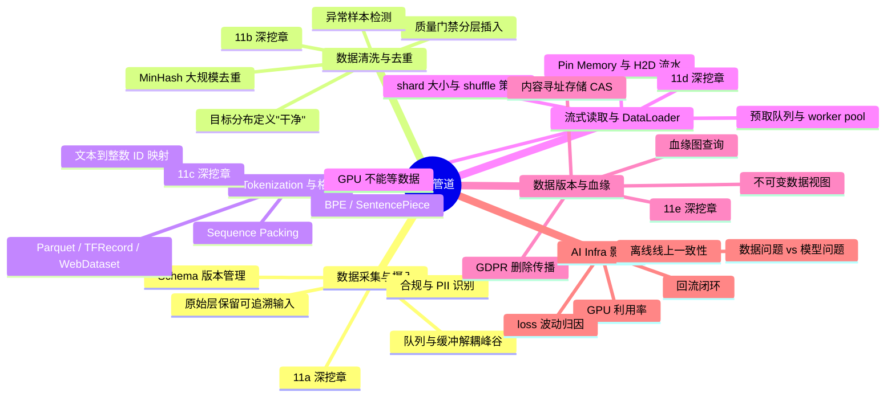
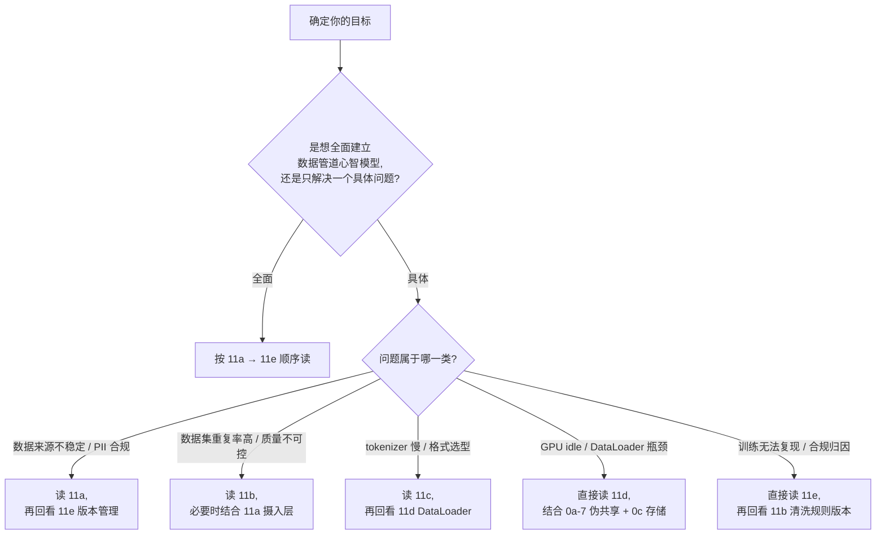

# 第 11 章 · 数据管道总览

在很多 AI 系统里，模型性能的上限往往先被数据管道决定，而不是被模型结构决定。

本章是 **Part 4 数据管道系列的入口总览章**。它用第一性原理把数据管道的全部核心机制串成一张推导图，并指引你按需进入 11a-11e 五个独立深挖章。如果你只关心一个具体话题（比如"如何做大规模去重"或"DataLoader 为何让 GPU idle"），可以直接跳到对应深挖章；如果要建立完整的数据管道心智模型，按 11a → 11e 顺序阅读即可。

> **关联章节**：本章与 [第 12 章](./12-artifacts-and-checkpoints.md) 训练制品和检查点、[第 13 章](./13-feature-vector-and-cache.md) 特征向量与缓存共同构成 Part 4 的数据供给链；数据读取的底层 IO 行为见 [第 0c 章](../part0-foundations-of-systems/0c-filesystems-and-storage-internals.md)，DataLoader worker 的 CPU 侧瓶颈见 [第 0b 章](../part0-foundations-of-systems/0b-memory-virtual-memory-and-io.md)。

---

## 11.1 第一性原理拆解 + 学习大纲

### 拆 — 不可化简的问题

把 Airflow、Spark、Ray Data、WebDataset、Iceberg、Delta Lake 这些名字先拿掉，数据管道要解决的不可化简问题只有一个：模型只能消费被组织成特定样本语义的字节流，而现实世界给平台的是来源分散、质量不齐、时间不断变化、权限边界复杂、存储形态不同的原始数据。训练 step 不关心这些复杂性，它只要求每个 batch 在固定时间内到达 GPU；评测不关心清洗脚本多复杂，它只要求同一个 dataset version 能被复现；线上推理不关心离线任务多庞大，它只要求特征和文档在延迟预算内保持足够一致。

因此，数据管道不是"把文件放到存储里"，也不是"把表跑成另一张表"。它本质上是在有限时间、有限 IO、有限人工标注和有限一致性语义下，把不稳定的数据世界压缩成模型可消费、可审计、可回放的输入序列。这个问题有四个无法绕开的物理和工程约束。

第一，数据量增长通常快于单机存储和单进程解析能力，必须分层、分片、并行读取。第二，数据质量不是一个布尔值，而是 schema、去重、脱敏、标签、分布、时间边界共同形成的置信度。第三，训练、评测、回流和在线特征共享部分来源，却需要不同延迟、吞吐和一致性目标。第四，数据一旦进入训练结果，就会变成模型行为的一部分；如果版本、切分、清洗规则和回填窗口不可追踪，后续 loss 波动、线上退化、GPU 空转都很容易被误判成模型或算力问题。

这四个约束叠加产生了数据管道独有的三角张力：吞吐、质量与一致性常常互相牵制。训练希望样本尽快到达 GPU，但越严格的质量验证链路越慢；线上特征和 RAG 索引需要分钟级更新，但每次更新都带来版本和一致性管理的成本；大规模去重能改善模型泛化，但在百 TB 级语料上它本身就需要分布式计算。没有一个能同时最大化三者的设计，所有的工程决策都是在这个三角形内寻找当前阶段的最优点。这也是为什么数据管道问题常常被误判成模型或算力问题——三角关系的某一个顶点出现了裂缝，但表现出来的症状（loss 曲线抖动、GPU 利用率下降、线上离线对不上）很容易被归因到其他地方。

### 推 — 从这个问题如何推导出每个机制

从"原始数据不能直接喂给模型"出发，分层架构必然出现。原始层保留可追溯输入，避免清洗错误后无法回放（详见 [11a 数据采集与摄入](./11a-data-ingestion.md)）；清洗层把格式、权限、脏数据、重复样本和脱敏要求固化为规则（详见 [11b 数据清洗、去重与质量治理](./11b-data-cleaning-dedup-quality.md)）；样本层把通用数据变成具体任务可训练的 token 序列（详见 [11c Tokenization、切分与训练 Dataset 格式](./11c-tokenization-and-dataset-formats.md)）。没有分层，任何一次规则变更都会把来源、处理和样本语义搅在一起，平台只能靠脚本作者的记忆运转。

从"模型需要稳定 batch"出发，流式读取与 DataLoader 工程化必然出现（详见 [11d 流式读取与 DataLoader 工程化](./11d-streaming-and-dataloader-engineering.md)）。千万小文件会把 `open/stat/list` 和元数据服务打满，所以训练侧要把小样本聚合成 64MB 到 1GB 级 shard；GPU 不等解析线程，所以 DataLoader、worker pool、prefetch queue 和本地 cache 要把远端存储的不确定性吸收掉；随机性不能完全依赖远端随机读，所以通常采用 shard 级 shuffle 加 shard 内顺序读，在统计随机性和存储吞吐之间折中。这里的存储边界要和 [第 0c 章：文件系统与存储内核](../part0-foundations-of-systems/0c-filesystems-and-storage-internals.md) 联动理解。

从"训练结果必须可解释、可复现"出发，数据版本管理与血缘追踪必然出现（详见 [11e 数据版本、血缘与谱系](./11e-data-versioning-and-lineage.md)）。一个 dataset version 不能只是一串路径，它至少要记录来源时间范围、清洗规则版本、切分策略、样本数量、schema、生成任务、校验摘要和发布时间。否则"同一模型今天效果比上周差"无法归因：可能是源数据变了，可能是去重阈值变了，可能是 valid 集泄漏了未来信息，也可能只是 shard 读取顺序导致样本分布在前 1,000 step 里变了。

从"线上系统会持续产生新数据"出发，批流一体、回填和时间语义必然出现。离线训练通常能接受小时级或天级延迟，在线特征和 RAG 索引却要面对分钟级甚至秒级更新；event time 和 processing time 一旦混用，离线评测会看到线上当时看不到的信息，形成 point-in-time 泄漏。读完这五章时，你应该能把一个"GPU 利用率低"或"线上质量下降"的表面症状，拆成数据来源、质量门禁、样本构造、shard 读取、缓存、时间语义和版本发布这几条可排查链路。

### 绘 — 因果链路

### 导 — 读完本章你应该能回答

1. 为什么数据管道的核心不是存储目录，而是把不稳定原始数据变成可复现样本语义？
2. 原始层、清洗层、样本层、回流层分别保存什么状态，缺少任一层会让哪些问题不可追踪？
3. 为什么训练读取通常选择"大 shard 内顺序读 + shard 间 shuffle"，而不是直接随机读海量小文件？
4. 数据质量验证应该插在管道哪些位置，为什么不能只在训练前做一次总检查？
5. dataset version 至少要记录哪些元数据，才能支持复现、回滚和效果归因？
6. event time、processing time、late data 和 backfill 如何影响在线特征与离线训练的一致性？
7. 当 GPU 利用率下降或线上质量退化时，如何区分模型问题、数据质量问题和数据读取吞吐问题？

---

## 11.2 五个深挖章节导览

| 章节 | 标题 | 核心主题 | 何时优先读 |
|---|---|---|---|
| [11a](./11a-data-ingestion.md) | 数据采集与摄入 | 队列解耦、schema 演进、PII 合规、CDC、批流摄入、摄入元数据 | 训练数据来源不稳定、峰值丢数据、上游字段变更导致链路静默失效 |
| [11b](./11b-data-cleaning-dedup-quality.md) | 数据清洗、去重与质量治理 | 目标分布定义质量、MinHash 去重、fastText 过滤、质量门禁与统计监控 | 担心数据集重复率高、想建立持续质量看板、清洗规则不可复现 |
| [11c](./11c-tokenization-and-dataset-formats.md) | Tokenization、切分与训练 Dataset 格式 | BPE / SentencePiece / Tiktoken、sequence packing、Parquet / WebDataset / TFRecord 格式选型 | tokenizer 成为预处理瓶颈、格式选型影响读取带宽、packing 影响 loss 语义 |
| [11d](./11d-streaming-and-dataloader-engineering.md) | 流式读取与 DataLoader 工程化 | GPU 不等数据的多级流水线、prefetch / pin_memory / num_workers、shard 大小与 shuffle、DALI / WebDataset | GPU 利用率低但模型本身没问题、DataLoader queue 经常清空、训练首个 epoch 明显慢于后续 |
| [11e](./11e-data-versioning-and-lineage.md) | 数据版本、血缘与谱系 | CAS 不可变视图、Merkle Tree、DVC / lakeFS / Iceberg 快照、OpenLineage、GDPR 删除传播 | 训练结果无法复现、生产事故后无法归因数据来源、合规审计要求血缘可查 |

---

## 11.3 阅读路径建议

| 角色 | 推荐路径 | 估算时间 |
|---|---|---|
| 训练平台工程师 | 全顺序阅读 11a → 11e | 6-8 小时（含练习） |
| 数据工程师 | 11a → 11b → 11e | 4-5 小时 |
| 算法工程师（关心数据质量） | 11b → 11c → 11d（shard 部分） | 3-4 小时 |
| MLOps / SRE | 11d → 11e，按报警类型回看对应章 | 2-3 小时 |
| 合规 / 数据治理 | 11a（PII 部分）→ 11e | 2 小时 |

> [!NOTE]
> **本总览章不重复深挖内容**：MinHash 算法细节、packing 的 attention mask 实现、CAS 的 Merkle Tree 推导等都在对应深挖章里。这里只保留第一性原理推导链 + 章节导航。

> [!TIP]
> **读完所有 5 章后应能独立完成的事**：拿到一个"GPU 利用率下降"或"训练效果退化"的现象，能在 10 分钟内把原因定位到数据采集、清洗、tokenization、DataLoader、版本管理这五条链路中的某一条，并给出下一步排查动作。

---

## 11.4 与 Part 4 其他章的关系

Part 4 数据与存储的三章共同覆盖从原始数据到模型可用状态的完整链路：

- **[第 12 章：训练制品与检查点](./12-artifacts-and-checkpoints.md)**：数据管道的产物（dataset shard）最终进入训练，训练结果以模型制品形式保存。11e 的 dataset version 与 12 章的 model artifact 共同构成从数据到模型的完整可追溯链；清洗规则版本（11b）和 checkpoint 版本（12b）要协同管理才能保证复现性。
- **[第 13 章：特征向量与缓存](./13-feature-vector-and-cache.md)**：数据管道处理的文本最终会被 embedding 成向量，进入 RAG 索引；11a 的摄入时间语义（event time vs processing time）和 11e 的 point-in-time correctness 直接影响 13 章特征缓存的一致性保证。如果时间边界没定义清楚，在线检索结果就会和离线评测对不上。

与 Part 0 系统基础的联动：

- **[第 0c 章：文件系统与存储内核](../part0-foundations-of-systems/0c-filesystems-and-storage-internals.md)**：dataset shard 的大小、读取顺序、Page Cache 命中和对象存储 `LIST` 语义都在 0c 建立物理直觉；11d 的 DataLoader 优化建立在 0c 的 IO 模型之上。
- **[第 0b 章：内存、虚拟内存与 IO](../part0-foundations-of-systems/0b-memory-virtual-memory-and-io.md)**：DataLoader worker 的 pin_memory 路径、DMA 传输和主存带宽竞争，都需要 0b 提供的内存 IO 基础理解；多 worker 并发 decode 和 H2D 传输的带宽上限来自 0b 的物理约束。

---

## 深度参考阅读（总览级）

- Martin Kleppmann, *Designing Data-Intensive Applications*. 批流处理、容错语义、时间模型和数据血缘的权威参考，是理解数据管道工程取舍的最佳整体框架。
- Chip Huyen, *Designing Machine Learning Systems*. 面向 ML 工程师的数据管道设计，从训练数据到在线特征，涵盖数据版本、漂移检测和回流设计。
- Tom B. Brown et al., *Language Models are Few-Shot Learners* (GPT-3 技术报告). Common Crawl 过滤、去重、分词与 dataset 构造的实践参考，是现代 LLM 数据管道设计的经典样本。
- FineWeb 技术博客（HuggingFace）. 大规模网页数据清洗与质量过滤的最新实践，涵盖 CCNet、质量分类器和去重流水线。
- Apache Iceberg & Delta Lake 官方文档. 表格式数据版本管理的工程参考，与 11e 的 snapshot 和 time travel 主题直接对应。

> 各深挖章节末尾还有面向具体主题的进一步深读列表。本总览只列共用的基础参考。
