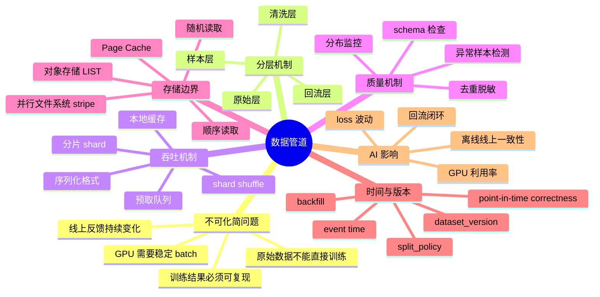

# 第11章：数据管道

> 在很多 AI 系统里，模型性能的上限往往先被数据管道决定，而不是被模型结构决定。

> **关联章节**：本章讨论训练数据的供给链路，是 [第7章](../part3-training-infra/07-single-node-training.md) 单机训练基线的上游前提；如果 GPU 利用率异常，先确认不是数据读取与分片出了问题。

## 11.1 第一性原理拆解 + 学习大纲

### 拆 — 不可化简的问题

在很多 AI 系统里，模型性能的上限往往先被数据管道决定，而不是被模型结构决定。把 Airflow、Spark、Ray Data、WebDataset、Iceberg、Delta Lake 这些名字先拿掉，数据管道要解决的不可化简问题只有一个：模型只能消费被组织成特定样本语义的字节流，而现实世界给平台的是来源分散、质量不齐、时间不断变化、权限边界复杂、存储形态不同的原始数据。训练 step 不关心这些复杂性，它只要求每个 batch 在固定时间内到达 GPU；评测不关心清洗脚本多复杂，它只要求同一个 dataset version 能被复现；线上推理不关心离线任务多庞大，它只要求特征和文档在延迟预算内保持足够一致。

因此，数据管道不是“把文件放到存储里”，也不是“把表跑成另一张表”。它本质上是在有限时间、有限 IO、有限人工标注和有限一致性语义下，把不稳定的数据世界压缩成模型可消费、可审计、可回放的输入序列。这个问题有四个无法绕开的物理和工程约束。第一，数据量增长通常快于单机存储和单进程解析能力，必须分层、分片、并行读取。第二，数据质量不是一个布尔值，而是 schema、去重、脱敏、标签、分布、时间边界共同形成的置信度。第三，训练、评测、回流和在线特征共享部分来源，却需要不同延迟、吞吐和一致性目标。第四，数据一旦进入训练结果，就会变成模型行为的一部分；如果版本、切分、清洗规则和回填窗口不可追踪，后续 loss 波动、线上退化、GPU 空转都很容易被误判成模型或算力问题。

### 推 — 从这个问题如何推导出每个机制

从“原始数据不能直接喂给模型”出发，第一步必然是分层。原始层保留可追溯输入，避免清洗错误后无法回放；清洗层把格式、权限、脏数据、重复样本和脱敏要求固化为规则；样本层把通用数据变成具体任务可训练的 `train / valid / test` shard；回流层把线上反馈、人工审核和漂移信号重新接入系统。没有分层，任何一次规则变更都会把来源、处理和样本语义搅在一起，平台只能靠脚本作者的记忆运转。

从“模型需要稳定 batch”出发，分片、序列化、缓存和预取必然出现。千万小文件会把 `open/stat/list` 和元数据服务打满，所以训练侧要把小样本聚合成 64MB 到 1GB 级 shard；GPU 不等解析线程，所以 DataLoader、worker pool、prefetch queue 和本地 cache 要把远端存储的不确定性吸收掉；随机性不能完全依赖远端随机读，所以通常采用 shard 级 shuffle 加 shard 内顺序读，在统计随机性和存储吞吐之间折中。这里的存储边界要和 [第 0c 章：文件系统与存储内核](../part0-foundations-of-systems/0c-filesystems-and-storage-internals.md) 联动理解：Page Cache、对象存储 `LIST`、并行文件系统 stripe、顺序/随机 IO 形状都会改变训练吞吐。

从“训练结果必须可解释”出发，元数据和版本管理必然出现。一个 dataset version 不能只是一串路径，它至少要记录来源时间范围、清洗规则版本、切分策略、样本数量、schema、生成任务、校验摘要和发布时间。否则“同一模型今天效果比上周差”无法归因：可能是源数据变了，可能是去重阈值变了，可能是 valid 集泄漏了未来信息，也可能只是 shard 读取顺序导致样本分布在前 1,000 step 里变了。

从“线上系统会持续产生新数据”出发，批流一体、回填和时间语义必然出现。离线训练通常能接受小时级或天级延迟，在线特征和 RAG 索引却要面对分钟级甚至秒级更新；event time 和 processing time 一旦混用，离线评测会看到线上当时看不到的信息，形成 point-in-time 泄漏。于是管道需要迟到窗口、幂等回填、快照、增量重建和回流质量门禁。读完本章时，你应该能把一个“GPU 利用率低”或“线上质量下降”的表面症状，拆成数据来源、质量门禁、样本构造、shard 读取、缓存、时间语义和版本发布这几条可排查链路。

### 绘 — 因果链路



### 导 — 读完本章你应该能回答

1. 为什么数据管道的核心不是存储目录，而是把不稳定原始数据变成可复现样本语义？
2. 原始层、清洗层、样本层、回流层分别保存什么状态，缺少任一层会让哪些问题不可追踪？
3. 为什么训练读取通常选择“大 shard 内顺序读 + shard 间 shuffle”，而不是直接随机读海量小文件？
4. 数据质量验证应该插在管道哪些位置，为什么不能只在训练前做一次总检查？
5. dataset version 至少要记录哪些元数据，才能支持复现、回滚和效果归因？
6. event time、processing time、late data 和 backfill 如何影响在线特征与离线训练的一致性？
7. 当 GPU 利用率下降或线上质量退化时，如何区分模型问题、数据质量问题和数据读取吞吐问题？

## 学习目标

完成本章学习后，你将能够：

1. 理解数据管道在训练与推理系统中的角色
2. 区分采集、清洗、切分、分片、缓存和回流的职责
3. 识别数据吞吐、数据一致性和数据质量之间的取舍
4. 设计一个可复现、可扩展的数据流
5. 避免把数据问题误判成模型或算力问题

---

## 正文内容

### 11.2 数据管道不是“把文件放到存储里”

很多项目在早期把“数据管道”理解成一个目录结构：

```text
data/
  train/
  valid/
  test/
```

这在小实验中勉强可用，但在平台阶段远远不够。  
真正的数据管道至少要回答：

- 数据从哪里来
- 如何清洗、去重、切分
- 如何生成训练样本
- 如何为不同模型或任务构造不同视图
- 如何回流线上反馈
- 如何保证版本可追踪

如果这些问题不清晰，后续很多现象都无法解释：

- 为什么同一模型今天效果比上周差
- 为什么训练吞吐突然下降
- 为什么线上结果和离线评测对不上

### 11.3 数据管道的四层结构

一个更稳妥的思路，是把数据管道按层拆开：

| 层次 | 主要任务 | 典型产物 |
|------|----------|----------|
| 原始层 | 接入原始日志、文档、标签、行为流 | raw files / event logs |
| 清洗层 | 去重、校验、脱敏、格式统一 | cleaned dataset |
| 样本层 | 构造训练样本、负采样、切分 | train / valid / test shards |
| 回流层 | 汇总线上反馈、人工审核结果、漂移信号 | feedback dataset |

这种分层的价值是：

- 原始数据可追溯
- 清洗逻辑可复现
- 样本生成规则可解释
- 回流路径可闭环

没有分层时，数据管道往往会演变成一堆“谁也不敢动的脚本”。

### 11.4 训练管道和推理管道的差别

训练数据管道更关注：

- 大批量吞吐
- 离线清洗
- 分片与 shuffle
- 数据版本稳定性

推理或在线特征管道更关注：

- 低延迟
- 数据一致性
- 权限
- 热点缓存
- 降级策略

这两类管道虽然都叫“数据管道”，但目标函数不同：

| 场景 | 首要目标 |
|------|----------|
| 训练 | 吞吐、规模、可复现 |
| 推理 | 时延、一致性、稳定性 |

把训练思路直接搬到在线系统，或者反过来，都容易出问题。

### 11.5 一个通用的数据流

一个较完整的 AI 数据流可以写成：

```text
原始数据
  -> 清洗 / 去重 / 脱敏
  -> 切分 / 标注 / 样本化
  -> 分片 / 序列化 / 存储
  -> 训练读取
  -> 模型输出
  -> 线上反馈 / 人工审核
  -> 回流
```

这条链里最常被忽视的是“中间层状态”：

- 哪个清洗版本生成了当前数据
- 哪个切分规则生成了当前评测集
- 哪个时间点之后的线上反馈还没回流

如果这些中间状态不保留，后续很难做复现和归因。

### 11.6 数据吞吐、数据质量与一致性的三角关系

数据管道通常同时面对三类压力：

#### （1）吞吐

训练希望样本尽快到达 GPU，推理希望特征尽快到达模型服务。

#### （2）质量

清洗、校验、脱敏、标注一致性都需要成本。  
越严格，处理链路越慢，但结果越可信。

#### （3）一致性

你要决定：

- 线上是否允许读到稍旧缓存
- 训练数据是否允许延迟一天聚合
- 文档更新后索引是否立即重建

所以，数据管道不是简单 ETL，而是在三角关系中做工程取舍。

### 11.7 为什么数据问题常常被误判成模型问题

以下现象都很容易被误判：

- 训练 loss 波动：可能是样本切分变化，不一定是模型结构问题
- 线上质量下降：可能是回流断裂，不一定是模型退化
- GPU 利用率下降：可能是数据格式碎片化，不一定是算子效率问题

这说明数据管道需要自己的观测面，而不是等模型指标退化后再被动发现。

### 11.8 数据质量验证应该插在哪一层

平台视角下，数据质量验证不是上线前一次性检查，而是贯穿清洗层、样本层和回流层的常驻门禁。

| 验证类型 | 常见检查 | 适合插入的位置 | 主要目的 |
|----------|----------|----------------|----------|
| Schema 检查 | 字段是否缺失、类型是否变化、主键是否重复 | 原始层进入清洗层时 | 尽早拦截格式错误 |
| 统计分布监控 | 长度分布、类别占比、标签比例、空值率 | 清洗完成后、样本生成后 | 发现数据漂移和批次异常 |
| 异常样本检测 | 极端长度、乱码、脏标签、重复样本 | 样本层出片前 | 降低训练污染和评测偏差 |
| 回流质量校验 | 反馈时间戳、用户标识、去重状态 | 回流层入库前 | 避免线上噪声直接反哺训练 |

如果把校验都堆到训练前最后一步，问题虽然也能发现，但代价已经变成整条链路回滚。更稳妥的做法是在每层设置轻量门禁，让错误尽可能在靠近源头的位置暴露。

### 11.9 dataset shard 的大规模读取模式

训练侧常见的读取问题，不是“文件能不能打开”，而是“GPU 能否持续吃到样本”。这要和 [第 0c 章：文件系统与存储内核](../part0-foundations-of-systems/0c-filesystems-and-storage-internals.md) 一起理解：dataset shard 的大小、读取顺序、Page Cache、对象存储 `LIST` 语义、并行文件系统 stripe，都会改变同一批样本到达 GPU 的稳定性。

| 模式 | 优势 | 代价 | 适用场景 |
|------|------|------|----------|
| 顺序读取 | 吞吐高，适合大文件预取 | 随机性弱，容易形成热点 | 预分片后的大规模训练集 |
| 随机读取 | shuffle 更充分，易做细粒度采样 | 小文件多时 IOPS 压力大 | 中小规模实验、重采样任务 |
| 流式读取 | 本地落盘需求低，便于跨对象存储扩展 | 依赖稳定网络与预读窗口 | TB 级训练集、弹性训练集群 |

工程上常见做法是：离线阶段先把小样本打包成较大的 shard，训练阶段尽量顺序读 shard 内部数据，再配合跨 shard shuffle。经验边界是单个 shard 通常落在 64MB 到 1GB；文本 token shard、tar shard、Parquet row group 都可以按这个量级起步。低于 16MB 时，`open/stat`、对象存储请求数、TLS/HTTP 开销和调度开销会变得显著；高于 2GB 时，失败重试、负载均衡、worker 间切分和局部 shuffle 的灵活性会下降。真正的目标不是追求某个固定大小，而是让一个 shard 足够大，使存储看到连续流；又足够小，使 100 到 10,000 个 worker 可以均匀分摊。

顺序/随机读取的取舍要看底层存储。对本地 NVMe 或 XFS cache，顺序读能触发内核 readahead 和 Page Cache 命中，第二轮 epoch 可能明显变快；这也会让 benchmark 失真，因为第一次冷读和第二次热读不是同一个问题。对对象存储，随机读小对象通常受请求并发、range GET、尾延迟和 `LIST prefix` 影响；推荐训练任务读取 manifest 中的 immutable shard 列表，而不是每个 worker 启动时都扫一遍远端目录。对 Lustre、GPFS、BeeGFS、WekaFS 这类并行文件系统，大 shard 可以用 stripe 叠加带宽，但小 manifest、索引文件和日志不应盲目大 stripe；千万小文件会把 MDS 打满，和 GPU 数量无关。

| 边界 | 建议起点 | 失效信号 |
|------|----------|----------|
| shard 大小 | 64MB-1GB | 小于 16MB 时请求/元数据开销高；大于 2GB 时重试和均衡变差 |
| 读取顺序 | shard 内顺序读，shard 间 shuffle | 完全随机读导致 IOPS/MDS 饱和 |
| Page Cache | 本地 cache 可复用热数据 | 冷热读混测导致吞吐判断失真 |
| 对象存储 | 用 manifest 发布版本，worker 读固定列表 | 依赖 `LIST prefix` 发现完整数据集 |
| 并行文件系统 | 大 shard 设置合理 stripe | 小文件、大目录、默认 stripe 打爆 MDS |

工程边界：dataset shard 不是越大越好，也不是越随机越好。平台应分别压测冷读、热读、单 worker、全 worker、对象存储 GET/list、并行文件系统 `open/stat` 和 shard 内解码 CPU 成本；当 GPU 利用率下降时，先看 DataLoader queue depth、样本解码耗时、远端请求尾延迟、Page Cache 命中和 MDS 指标，再判断是否真的是训练算子问题。像 WebDataset、Mosaic StreamingDataset 这类方案，本质上都是把“远端海量文件”重组为“训练进程更容易稳定消费的流”。

### 11.10 一个最低限度的数据管道元数据表

哪怕没有大平台，也建议至少记录：

```yaml
dataset_version: support-v3
source_range: 2026-03-01..2026-03-31
cleaning_ruleset: clean-r7
split_policy: by_user_hash_v2
sample_count:
  train: 18_400_000
  valid: 920_000
  test: 920_000
generated_at: 2026-04-10T08:00:00Z
```

这份元数据的意义在于让“数据到底是什么”变成可回答的问题。

### 11.11 批流一体、回填与时间语义

很多平台在离线训练和在线特征之间，真正踩坑的不是 ETL 本身，而是“时间语义没有统一”。

| 问题 | 如果没处理好会怎样 | 平台上常见做法 |
|------|--------------------|----------------|
| Event time vs processing time 混用 | 离线统计和线上读取对不上 | 明确以事件时间为主，处理时间只用于运维观测 |
| Late data 迟到 | 回填后训练集和线上特征定义漂移 | 设迟到窗口，允许增量修补或批量回放 |
| Backfill 不可重放 | 修一次数据就生成一套新口径 | 回填任务幂等化，保留输入快照与任务版本 |
| Point-in-time 不正确 | 训练看到了“未来信息” | 样本构造时按样本时间截断特征与标签 |

这也是为什么成熟平台会把“回填”看成正式工作流，而不是一次性脚本。
尤其在在线特征和检索系统里，如果时间边界没定义清楚，到了 [第13章](13-feature-vector-and-cache.md) 的特征缓存与索引层，问题只会更难排查。

### 11.12 工程建议

- 数据管道必须和版本管理一起设计
- 训练集、评测集、线上反馈流要分层管理
- 让“数据问题”有可观测信号，而不是只在模型指标退化时被动发现
- 尽量让回流路径结构化，而不是靠日志抓取拼接
- 在平台规模扩大前，就先固定数据命名、切分和元数据规范
- 回填任务要可重放、可审计，并明确时间语义

#### 本章涉及的常见工具

| 概念 | 常见工具 / 命令 | 备注 |
|------|-----------------|------|
| 批式数据编排 | Airflow、Dagster | 适合管理多阶段离线数据流与重跑 |
| 分布式数据处理 | Spark、Ray Data | 用于清洗、聚合、重分片 |
| 流式样本格式 | WebDataset、MosaicML Streaming | 适合大规模训练时稳定喂数 |
| 表格式数据治理 | Apache Iceberg、Delta Lake | 适合保留 schema 演进与快照 |

---

## 本章小结

| 主题 | 要点 |
|------|------|
| 数据管道 | 决定模型输入、版本和回流的组织方式 |
| 训练 vs 推理 | 吞吐型与低延迟型数据管道侧重点不同 |
| 核心取舍 | 吞吐、质量、一致性常常互相牵制 |
| 主要风险 | 版本缺失、清洗不透明、回流断裂 |
| 新增视角 | 质量门禁、读取模式与时间语义会一起影响训练稳定性 |

---

## 练习题

1. 为什么数据管道问题常常会被误判成模型问题？
2. 训练和在线特征管道在目标上有什么根本差异？
3. 设计一个包含回流环节的数据流图。
4. 为什么“先让数据能用”不等于“数据管道已经设计好”？
5. 如果对象存储里的训练样本有数十亿条，你会优先选择顺序读取、随机读取还是流式读取？为什么？
6. 请为一个文本训练管道设计最小的数据质量验证表，至少包含 3 类检查。
7. 为什么在线特征系统特别需要 point-in-time correctness？
