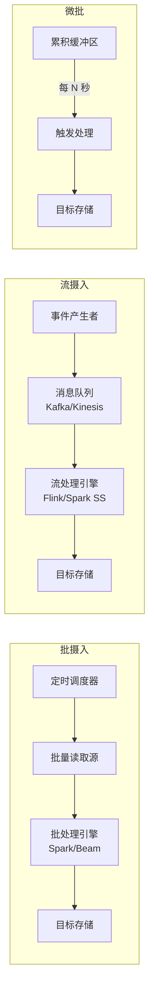
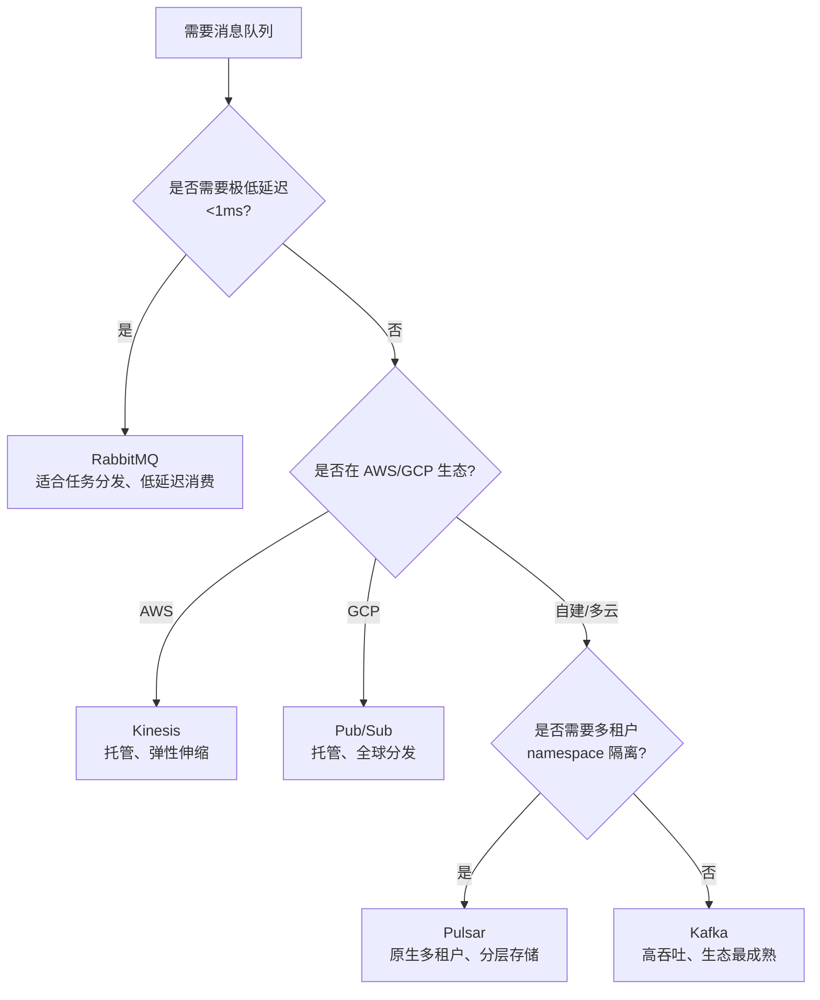
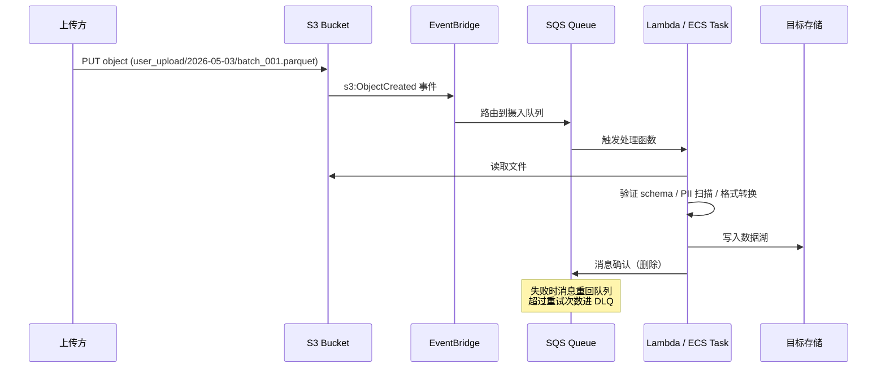
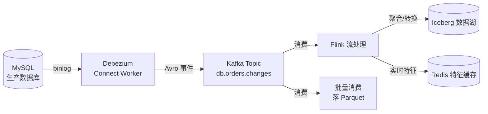
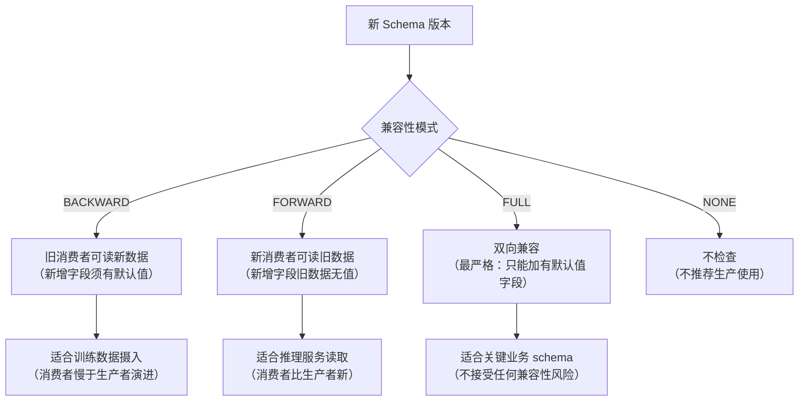
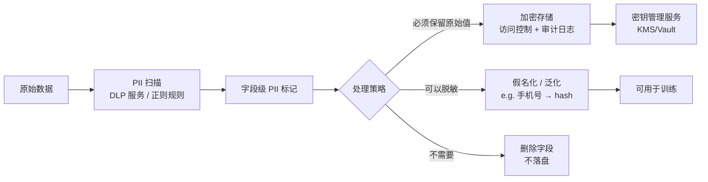
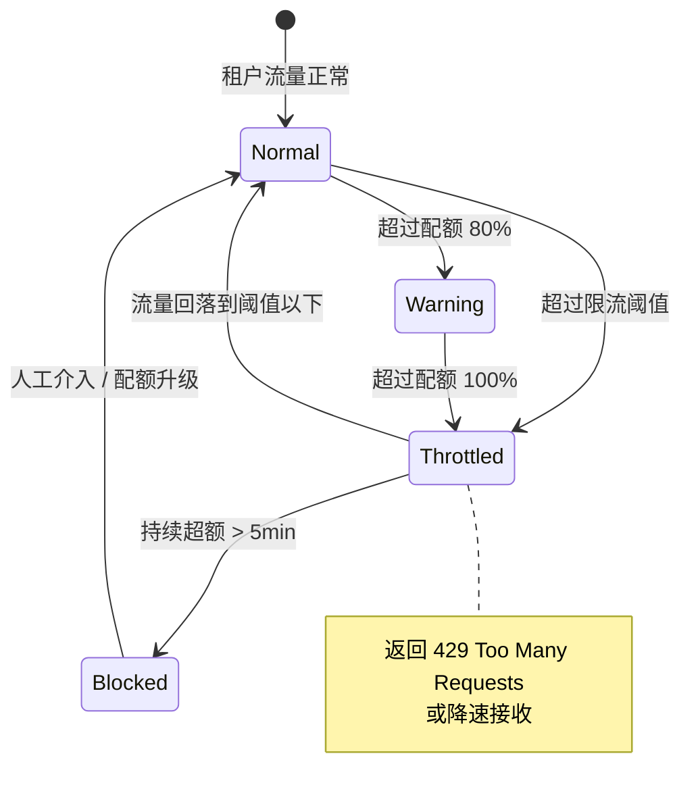
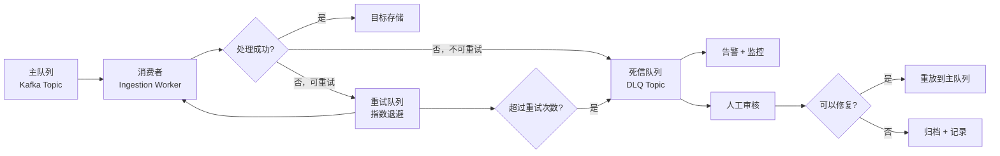
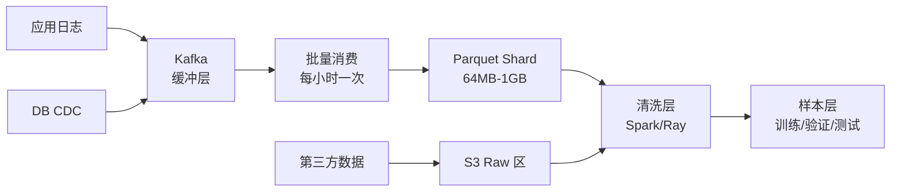
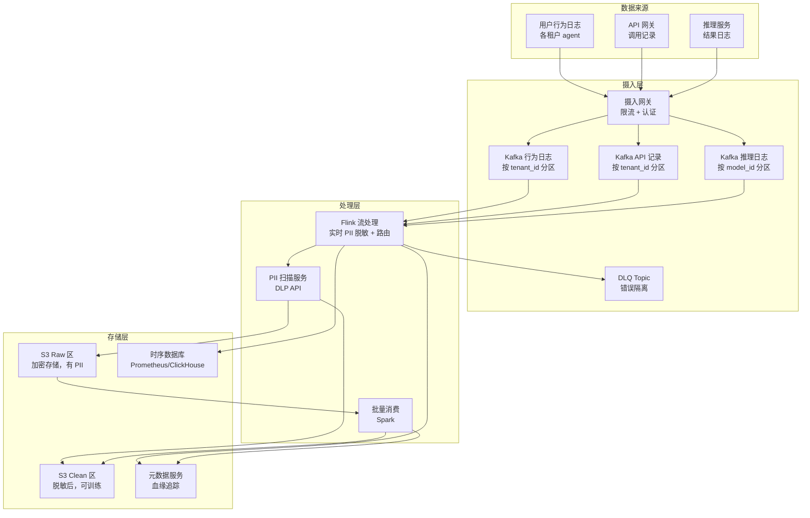

# 第 11a 章 · 数据采集与摄入

> 数据采集不是"把数据搬进来"，而是在来源分散、格式不齐、合规边界复杂的现实世界里，把原始信号压缩成可审计、可回放、可扩展的字节流。

> **关联章节**：本章是 [第 11 章](./11-data-pipeline.md) 数据管道的上游入口；摄入进来的原始数据经过 [第 11 章](./11-data-pipeline.md) 分层清洗、切分、样本化后进入训练；线上推理日志的摄入路径最终与 [第 13 章](./13-feature-vector-and-cache.md) 特征缓存系统对接。

---

## 11a.1 第一性原理拆解 + 学习大纲

### 拆 — 不可化简的问题

把 Kafka、Debezium、Avro、Lambda、Flink 这些名字先拿掉，数据摄入要解决的不可化简问题只有一个：现实世界产生数据的速度、格式、来源和边界条件，与 AI 系统消费数据所需的语义、结构、一致性和可追溯性之间，存在一条不可消除的鸿沟。数据不会自动"变得可用"，每一个字节在进入存储之前，都要经过隐式或显式的决策：什么时候采集、采多少、用什么格式、怎么排序、如何处理失败、谁对质量负责。

这个问题有四个无法绕开的物理和工程约束。

第一，数据产生的速度和模式高度不均匀。电商大促时 API 调用量是平时的 100 倍；深夜用户行为日志量远低于白天；CDC（变更数据捕获）在数据库批量导入时瞬间涌出百万条变更事件。任何摄入系统都必须在这种不均匀性下保持可用，既不能因为峰值丢数据，也不能因为等峰值过去而让训练数据饥渴。

第二，数据格式和 schema 是活的，不是固定的。上游业务系统会在不通知下游的情况下新增字段、废弃枚举值、改变日期格式。如果摄入系统没有 schema 版本管理机制，某一天的一个业务迭代就会让整条训练链路静默失效——数据"进来了"，但字段含义已经变了，模型在不知情的情况下被喂了语义错误的输入。

第三，数据来源的权限边界、合规要求和地理位置各不相同。用户行为日志含有 PII（Personally Identifiable Information），必须在摄入时识别和标记，不能原封不动落盘后再处理；GDPR 的删除权要求系统能追踪某条用户数据流过了哪些存储节点，并能在规定时间内完成物理删除或不可逆匿名化；跨境数据传输要遵循各国数据本地化法规，不能因为"数据流向训练集群"就绕过这些约束。

第四，不同 AI 工作负载对摄入语义的要求截然不同。离线训练需要的是高吞吐、历史完整性和可回放的批量数据；推理日志收集需要低延迟、顺序性和去重；评测数据集需要精确的时间截止（point-in-time）保证，不能混入"未来信息"；合成数据和第三方采购数据需要来源溯源和许可证管理。这四类需求没有统一的最优解，把训练摄入的设计直接套到推理日志收集，或者反过来，都会产生严重的资源浪费或数据质量问题。

因此，数据摄入不是"把文件搬进 S3"，也不是"在 Kafka 里发一条消息"。它本质上是在峰谷不均、格式演进、合规约束和异构消费需求共同存在的条件下，设计一个可以长期运转、可以被审计、可以在出错时被精确回放的数据入口体系。

### 推 — 从这个问题如何推导出每个机制

从"数据产生速度不均匀"出发，队列和缓冲层必然出现。生产者和消费者解耦，消费者可以按自己的速度处理；峰值流量被队列吸收，不会直接击穿下游存储。Kafka、Pulsar、Kinesis、RabbitMQ 这些消息队列中间件的存在，都是同一个根因的不同工程实现。队列的容量、保留策略、分区方式和消费者组语义，都是这条推导链上的工程参数。

从"格式是活的"出发，schema 注册和版本兼容性机制必然出现。只记录数据本身不够，还必须记录"这条数据是用哪个 schema 版本序列化的"。Avro、Protobuf、Thrift 这些序列化格式加上 Confluent Schema Registry 这类 schema 服务，都是在回答"如何让读者和写者能用不同的 schema 版本互操作"这个问题。Backward compatibility（旧读者能读新数据）和 Forward compatibility（新读者能读旧数据）是这里必须做的工程决策，不是可选项。

从"不同工作负载要求不同语义"出发，批摄入和流摄入的分离必然出现。批摄入适合历史数据回填、大文件导入、计划性 ETL；流摄入适合事件驱动、低延迟更新、CDC 传播。更复杂的场景催生了 micro-batch（每几秒一个批次）和 Lambda 架构（批 + 流并行）等折中方案。选型不是品味问题，而是由延迟 SLA、吞吐目标和容错语义共同决定的工程约束。

从"来源包括数据库变更"出发，CDC（Change Data Capture）机制必然出现。数据库的 binlog 或 WAL（Write-Ahead Log）记录了每一条插入、更新、删除操作，CDC 工具读取这些日志并把变更事件发布到消息队列，让下游系统能够在不影响数据库性能的前提下实时感知数据变化。Debezium、Maxwell、Flink CDC 都是这条推导链的具体实现。

从"合规要求数据可追踪和可删除"出发，PII 标记、数据血缘和删除令牌机制必然出现。摄入时如果不打 PII 标记，后续要做 GDPR 删除就只能全表扫描。数据血缘要求每一条记录都能追溯到来源、通过了哪些处理步骤、落入了哪些下游存储。这些不是事后加的功能，必须在摄入系统设计阶段就内置进去。

从"摄入会失败"出发，错误处理、重试机制和死信队列（Dead Letter Queue，DLQ）必然出现。消息格式错误、下游写入超时、schema 不兼容——这些失败都不应该让整条摄入链路停止。DLQ 把无法处理的消息隔离，让正常消息继续流动，同时为人工介入和问题排查保留现场。

从"多个租户共用同一套摄入基础设施"出发，限流、隔离、配额和计量必然出现。一个租户的突发流量不能让其他租户饿死；配额管理让平台能够对不同等级的用户提供不同的摄入保证；计量让成本可以被合理分摊。

### 绘 — 因果链路

```mermaid
mindmap
  root((数据摄入))
    不可化简问题
      数据产生不均匀
      格式/schema 是活的
      合规边界复杂
      消费语义异构
    来源类型
      日志与事件
      数据库 CDC
      API 抓取
      用户上传
      第三方供应商
      合成数据
    摄入模式
      批摄入 Batch
      微批 Micro-batch
      流摄入 Streaming
      事件驱动
    队列与缓冲
      Kafka
      Pulsar
      Kinesis
      RabbitMQ
      Pub/Sub
    Schema 治理
      Avro Protobuf
      Schema Registry
      向后/向前兼容
    CDC 机制
      Binlog / WAL
      Debezium Maxwell
      Flink CDC
    合规与安全
      PII 标记
      GDPR 删除权
      跨境合规
      数据血缘
    错误处理
      DLQ 死信队列
      重试策略
      幂等性
    多租户
      限流
      配额
      隔离
      计量
    AI Infra 路径
      训练数据摄入
      推理日志收集
      评测数据集
      合成数据管道
```

### 导 — 读完本章你应该能回答

1. 批摄入、微批、流摄入、事件驱动四种模式分别适合什么场景，选型的决定因素是什么？
2. Kafka、Pulsar、Kinesis、RabbitMQ 在 AI Infra 数据摄入中的选型差异体现在哪些维度？
3. CDC 与直接 API 抓取相比，在延迟、侵入性、数据完整性上各有什么取舍？
4. Avro + Schema Registry 如何保证 schema 演进时生产者和消费者之间的兼容性？
5. 摄入 SLA 的吞吐、延迟、顺序、exactly-once 和幂等性五个维度如何相互制约？
6. PII 标记和 GDPR 删除权在摄入系统中需要哪些具体的工程机制才能实现？
7. 训练数据集、推理日志、评测数据在摄入路径上有哪些本质差异？
8. 死信队列的正确使用方式是什么，什么时候应该触发人工介入？

---

## 11a.2 数据源类型全景

AI Infra 平台面对的数据来源远比想象中复杂。把来源按产生方式分类，才能为每类来源选择最合适的摄入策略。

| 来源类型 | 产生特征 | 典型体积 | 主要挑战 | AI Infra 用途 |
|----------|----------|----------|----------|---------------|
| 应用日志 | 半结构化、高频、持续写入 | 100GB-10TB/天 | 格式不规则、重复、乱序 | 行为建模、异常检测训练 |
| 用户事件流 | 事件驱动、突发性强 | 10M-1B 条/天 | 峰谷比大、去重复杂 | 推荐系统、序列建模 |
| 数据库 CDC | 精确变更、有序、有 schema | 1MB-100GB/天 | 需要解析 binlog、锁依赖 | 特征实时更新、数据湖同步 |
| API 抓取 | 拉式、按计划或事件触发 | 不定 | 限流、失败重试、分页 | 第三方数据增强、爬虫 |
| 用户上传 | 主动、异步、格式多样 | 不定 | 病毒扫描、格式校验、权限 | 多模态训练、RLHF 标注 |
| 第三方供应商 | 批量、定期交付、许可证管理 | GB-TB 级 | 格式协商、版本追踪、合规 | 语料扩充、预训练数据 |
| 合成数据 | 计算生成、可控分布 | 按需 | 生成成本、分布漂移、水印 | 数据增强、小样本补充 |
| 推理日志 | 高频、低延迟要求 | 10B-100B 条/天 | 采样策略、隐私、存储成本 | 模型监控、回流训练 |

> **[note]** 合成数据不等于免费数据。生成合成数据的计算成本可能超过采集真实数据，且合成数据的分布偏差（distribution shift）如果没有被监控，会静默地降低训练效果。合成数据必须和真实数据的分布做持续对比。

### 来源选型决策

数据源的选择往往不由工程师决定，但数据源的接入策略必须由工程师决定。关键问题有三个：

1. 数据是推（push）还是拉（pull）？推模式下，生产者主动发送，摄入系统必须随时可用；拉模式下，摄入系统按计划或按事件触发拉取，生产者的压力更小，但延迟更高。
2. 数据是否有原生顺序保证？数据库 CDC 有全局顺序（在单分区内）；用户事件流通常只有近似顺序；日志文件在写入时是顺序的，但多节点聚合后顺序可能打乱。
3. 数据量和速率是否可预测？可预测则批摄入更高效；不可预测则流摄入和队列缓冲必不可少。

---

## 11a.3 摄入模式：批、流与中间地带

### 四种摄入模式对比

| 模式 | 触发方式 | 典型延迟 | 典型吞吐 | 复杂度 | 适用场景 |
|------|----------|----------|----------|--------|----------|
| 批摄入（Batch） | 定时或手动 | 小时-天 | 极高（PB 级可行） | 低 | 历史数据回填、定期 ETL、大文件导入 |
| 微批（Micro-batch） | 定时（秒-分钟级） | 秒-分钟 | 高 | 中 | 接近实时的训练数据更新、日志聚合 |
| 流摄入（Streaming） | 事件触发 | 毫秒-秒 | 中（受队列限制） | 高 | 推理日志实时收集、特征实时更新 |
| 事件驱动（Event-driven） | 外部事件（S3 上传、DB 变更） | 毫秒-秒 | 中 | 高 | CDC、对象存储触发处理、Webhook |



### 批 vs 流的本质取舍

批摄入的优势不只是简单：它还意味着全局排序、完整性保证和更高效的压缩。当你把一天的数据一次性写入时，可以按主键排序、全局去重、做跨行统计。流摄入放弃了这些"批次内全局视图"，换来了低延迟。

> **[warn]** 微批（Micro-batch）不是免费的午餐。把 10 秒的数据当作一个批次处理，表面上是"接近流"，但实际上每 10 秒产生一次小文件写入，对 HDFS/S3 等对象存储产生大量小文件，可能比真正的流摄入或者纯批摄入的运维成本更高。选择微批时必须明确：小文件合并策略是什么？

---

## 11a.4 消息队列与中间件选型

消息队列是摄入系统的核心解耦层。选错队列会在吞吐、延迟、运维、成本和语义正确性上付出长期代价。

### 主流消息队列对比

| 维度 | Kafka | Pulsar | RabbitMQ | Amazon Kinesis | Google Pub/Sub |
|------|-------|--------|----------|----------------|----------------|
| 消息保留 | 日志式、可配保留天数 | 日志式分层存储 | 默认消费即删 | 可配 1-365 天 | 确认前保留 |
| 吞吐峰值 | 极高（>1M msg/s/节点） | 极高（>1M msg/s） | 中（~100K msg/s） | 高（按 shard 扩展） | 高（托管扩展） |
| 延迟 | 低（<10ms） | 极低（<5ms） | 极低（<1ms） | 中（70-200ms） | 中（100-200ms） |
| 顺序保证 | 分区内有序 | 分区内有序 | 队列内有序 | 分片内有序 | 无顺序保证 |
| exactly-once | 需配置（幂等生产者+事务） | 原生支持 | 需业务幂等 | 至少一次 | 至少一次 |
| 多租户隔离 | 手动（topic/ACL） | 原生（namespace/tenant） | vhost | 账号/流隔离 | 项目/topic 隔离 |
| 运维复杂度 | 中（Zookeeper 或 KRaft） | 高（Bookkeeper+Zookeeper） | 低 | 低（托管） | 低（托管） |
| 适用场景 | AI Infra 主流、高吞吐日志 | 多租户 SaaS、分层存储 | 任务队列、低延迟消费 | AWS 生态、无服务器摄入 | GCP 生态 |



> **[success]** 对于大多数 AI Infra 团队，Kafka 是第一选择，理由是：生态成熟（Kafka Connect 有 200+ connectors）、社区活跃、与 Flink/Spark 深度集成、Confluent 提供商业支持。只有当你有明确的多租户命名空间需求或分层存储需求时，才考虑 Pulsar。

### Kafka 分区策略与 AI Infra

Kafka 的 topic 分成多个 partition，同一 partition 内消息有序。对 AI Infra：

- 训练日志摄入：按 `model_id` 或 `experiment_id` 分区，保证同一实验的日志落在同一分区，方便后续按实验聚合。
- 用户事件：按 `user_id` hash 分区，保证同一用户的事件有序，支持序列建模。
- 推理日志：按 `service_instance_id` 分区，避免跨节点乱序，同时能按节点排查问题。

---

## 11a.5 对象存储事件驱动摄入

当数据以文件形式落在 S3/GCS/Azure Blob 时，事件驱动摄入模式比轮询更高效：文件上传即触发处理，无需定时扫描。

### S3 + SQS/Lambda 事件链



### EventBridge 规则设计

EventBridge 规则可以按 prefix/suffix 过滤，只触发特定路径或文件类型的处理：

```json
{
  "source": ["aws.s3"],
  "detail-type": ["Object Created"],
  "detail": {
    "bucket": { "name": ["ai-infra-data-lake"] },
    "object": {
      "key": [{ "prefix": "raw/user-logs/" }],
      "size": [{ "numeric": [">", 1024] }]
    }
  }
}
```

> **[warn]** S3 事件触发不保证恰好一次（at-least-once 语义）。如果同一文件被重复触发（例如覆盖写），Lambda 会被调用两次。摄入函数必须实现幂等性：用文件的 ETag 或版本 ID 作为去重键，写入前检查是否已处理。

---

## 11a.6 CDC：变更数据捕获

CDC 是把数据库的变更历史实时传输到下游系统的关键机制。它读取数据库的 WAL（Write-Ahead Log）或 binlog，把每条 INSERT/UPDATE/DELETE 转换成结构化事件，发布到消息队列。

### CDC 工具选型

| 工具 | 数据库支持 | 延迟 | 输出格式 | 运维复杂度 | 特点 |
|------|----------|------|----------|-----------|------|
| Debezium | MySQL、PostgreSQL、Oracle、MongoDB、SQL Server | 毫秒级 | JSON/Avro（Kafka） | 中 | 生态最成熟，Kafka Connect 插件 |
| Maxwell | MySQL（binlog） | 毫秒级 | JSON（Kafka/Kinesis） | 低 | 轻量，适合 MySQL 专项 |
| Flink CDC | MySQL、PostgreSQL、Oracle、TiDB | 毫秒级 | Flink Table | 高 | 直接在 Flink 作业内消费 |
| Snowflake Stream | Snowflake（内部） | 秒级 | Snowflake Table | 低（托管） | 仅 Snowflake 内部使用 |
| AWS DMS | 多种 | 秒级 | S3/Kinesis/RDS | 低（托管） | 适合 AWS 生态迁移 |



### Debezium 事件结构

Debezium 输出的每个事件包含变更前后的完整记录：

```json
{
  "op": "u",
  "ts_ms": 1746230400000,
  "before": { "user_id": 42, "score": 0.85, "updated_at": "2026-05-03T00:00:00Z" },
  "after":  { "user_id": 42, "score": 0.91, "updated_at": "2026-05-03T08:00:00Z" },
  "source": {
    "db": "ml_features",
    "table": "user_profiles",
    "pos": "mysql-bin.000123:4096"
  }
}
```

> **[note]** CDC 的 `before` 字段需要数据库开启 `binlog_row_image = FULL`（MySQL）或 `REPLICA IDENTITY FULL`（PostgreSQL），否则只有主键变更可见，无法做精确的特征更新。这是一个需要 DBA 配合的基础设施配置，必须在设计阶段确认。

---

## 11a.7 Schema 演进与 Schema Registry

Schema 是摄入系统的隐式契约。生产者和消费者用同一套 schema 理解数据，但随着业务迭代，schema 必然演进。

### Avro vs Protobuf 选型

| 维度 | Avro | Protobuf |
|------|------|----------|
| Schema 随消息携带 | 支持（schema 嵌入或引用 registry） | 不支持（消费者必须有编译时 proto 文件） |
| 序列化大小 | 二进制紧凑 | 二进制更紧凑（无字段名） |
| 动态 schema 读取 | 支持（无需编译时 schema） | 需要 .proto 文件编译 |
| Schema Registry 集成 | 天然（Confluent 首选） | 支持但较少见 |
| AI 框架生态 | Kafka 生态常用 | gRPC 服务、TensorFlow 生态 |

### 兼容性模式

Confluent Schema Registry 支持 4 种兼容性模式：



> **[danger]** 在没有 Schema Registry 的情况下，生产者 schema 升级是一个静默炸弹。某天生产者删掉了一个字段，消费者（通常是训练脚本）继续运行，但从那个字段读到的全是 None 或默认值，模型效果悄悄下降。Schema Registry 的强制注册和兼容性检查是防止这类事故的最低基础设施。

---

## 11a.8 摄入 SLA 的五个维度

AI Infra 摄入系统的 SLA 不能只用"数据有没有进来"衡量，需要在五个维度上同时定义和监控。

| SLA 维度 | 定义 | 典型目标 | 权衡因素 | 监控指标 |
|----------|------|----------|----------|----------|
| 吞吐（Throughput） | 单位时间内可摄入的数据量 | 10TB/天、1M 条/秒 | 增加吞吐通常增加延迟和成本 | 消费者 lag、写入速率 |
| 延迟（Latency） | 从数据产生到可供消费的时间 | P99 < 5s（流摄入） | 低延迟要求更多资源和更复杂架构 | end-to-end 延迟分布 |
| 顺序（Ordering） | 消息到达顺序是否与产生顺序一致 | 分区内有序 | 全局有序极难扩展 | 乱序率、时间戳漂移 |
| Exactly-once | 每条消息恰好被处理一次 | 金融/审计场景必须 | 显著增加系统复杂度 | 重复率、丢失率 |
| 幂等性（Idempotency） | 重复摄入同一数据不产生副作用 | 所有摄入场景推荐 | 需要额外的去重存储 | DLQ 消息量 |

### Exactly-once 的实现代价

Exactly-once 是最昂贵的语义保证。在 Kafka 中实现 exactly-once 需要：

1. 生产者开启幂等模式（`enable.idempotence=true`）
2. 生产者使用事务（`transactional.id`）
3. 消费者隔离级别设为 `read_committed`
4. 下游写入与 offset 提交在同一个事务内

这 4 步加在一起，会将吞吐降低 20-40%，延迟提升 50-100%。对于大多数 AI 训练数据摄入，at-least-once + 幂等消费端是更实用的选择。

> **[success]** 幂等摄入的最简单实现：用内容哈希（MD5 或 xxHash）或业务主键作为去重键，写入时先 `INSERT IGNORE` 或 `ON CONFLICT DO NOTHING`，让数据库做重复检测。比在消息队列层实现 exactly-once 便宜得多，且更易于理解和维护。

---

## 11a.9 数据合规：PII、GDPR 与跨境合规

合规不是法务部门的事，是摄入系统的工程约束。

### PII 识别与标记

PII（Personally Identifiable Information）必须在数据进入存储之前识别和标记，不能事后补救。常见的 PII 字段类型：

- 直接标识符：姓名、身份证号、手机号、邮箱、IP 地址、设备 ID
- 间接标识符：出生年份 + 性别 + 邮编的组合足以唯一标识个人
- 敏感属性：健康状况、宗教、政治观点

摄入时 PII 处理策略：



### GDPR 删除权（Right to be Forgotten）

GDPR 第 17 条要求在收到删除请求后 30 天内完成。对摄入系统的含义：

1. **数据血缘追踪**：每条数据必须能追溯到哪个用户 ID，流经哪些系统。
2. **删除令牌（Tombstone）**：在 Kafka 中发布 `user_id → null` 的 tombstone 消息，触发下游系统清理。
3. **训练集的处理**：如果用户数据已经进入训练集，需要从训练集中删除，并重新训练或用机器遗忘（Machine Unlearning）技术处理。
4. **日志的处理**：原始日志中含有该用户 ID 的记录需要在 30 天内完成匿名化或删除。

> **[danger]** GDPR 删除是最难的工程问题之一，因为数据已经被复制到多个地方：对象存储、消息队列、缓存、备份、训练集、模型权重。没有端到端数据血缘，删除请求无法被完整执行，面临的罚款上限是全球营业额的 4%。摄入时的 PII 标记和血缘记录是后续删除的前提条件，不是可选的。

---

## 11a.10 多租户摄入：隔离、限流与计量

AI Infra 平台通常服务多个业务团队。多租户摄入需要在共享基础设施上提供强隔离和公平的资源分配。

### 四层隔离模型

| 隔离层 | Kafka 实现 | 隔离效果 | 成本 |
|--------|-----------|----------|------|
| Topic 隔离 | 每个租户独立 topic | 逻辑隔离，资源共享 | 低 |
| Consumer Group 隔离 | 每个租户独立 consumer group | 消费进度隔离 | 低 |
| Kafka Cluster 隔离 | 每个租户独立 cluster | 完全隔离，运维翻倍 | 极高 |
| Namespace 隔离（Pulsar） | Pulsar 原生 tenant/namespace | 资源配额 + ACL + 隔离 | 中 |

### 限流与配额设计



限流实现的三种层次：

1. **生产者侧限流**：在 Kafka Producer 配置 `max.block.ms` 和 `buffer.memory`，超出时阻塞或抛错。
2. **网关侧限流**：在摄入 API 网关（如 Kong、Envoy）配置 Token Bucket 或 Sliding Window 限流。
3. **消费者侧配额**：为每个租户的消费者 group 配置 `fetch.min.bytes` 和 `fetch.max.bytes`，控制消费速率。

### 计量（Metering）

多租户场景下，计量数据是成本分摊和容量规划的基础：

- 摄入字节数（按 topic/tenant 统计）
- 消息条数（区分原始消息和 DLQ 消息）
- 端到端延迟 P50/P99（按 tenant 分组）
- 消费者 lag（实时监控，超阈值告警）

---

## 11a.11 错误处理与死信队列

摄入失败是常态，不是异常。每条消息都有可能因为 schema 不兼容、下游写入超时、内容校验失败或资源限制而无法被正常处理。

### 失败分类与处理策略

| 失败类型 | 重试策略 | 最终处理 |
|----------|----------|----------|
| 瞬态网络错误 | 指数退避重试（3-5 次） | 超次数进 DLQ |
| Schema 不兼容 | 不重试（重试无效） | 立即进 DLQ + 告警 |
| 下游存储不可用 | 指数退避 + 限次重试 | 暂停消费，等恢复 |
| 内容校验失败（PII 未脱敏、格式错误） | 不重试 | 进 DLQ + 人工审核 |
| 消息过大 | 不重试 | 进 DLQ + 拆分逻辑 |

### 死信队列（DLQ）架构



> **[note]** DLQ 不是垃圾桶。DLQ 消息必须有 SLA：多长时间内必须被处理或归档？谁收到告警？谁有权限重放？没有 SLA 的 DLQ 最终会积累成 TB 级的"等待排查"数据，在某次峰值时拖垮系统。

---

## 11a.12 AI Infra 视角：三条不同的摄入路径

同一套数据摄入基础设施，在 AI Infra 场景下服务三类截然不同的消费者：训练数据集构建、推理日志收集和评测数据集管理。这三条路径在延迟、吞吐、顺序、保留期和合规要求上各有不同。

### 三路径对比

| 维度 | 训练数据摄入 | 推理日志摄入 | 评测数据摄入 |
|------|------------|------------|------------|
| 延迟要求 | 小时级可接受 | 秒级（实时监控需要） | 按需（可离线） |
| 吞吐要求 | 极高（TB 级批量） | 高（实时流量） | 低（批量交付） |
| 顺序要求 | 无（训练不依赖顺序） | 中（同 session 内有序） | 高（时间截止精确） |
| 保留期 | 长期（版本化永久保留） | 中（通常 30-90 天） | 永久（评测可复现性） |
| PII 处理 | 脱敏后才可用于训练 | 匿名化或假名化 | 严格脱敏 + 访问控制 |
| 去重要求 | 全局去重（避免数据泄漏） | 幂等（避免重复计费） | 严格（不重复样本） |
| 版本化 | 必须（dataset_version） | 通常不需要 | 必须（evaluation_version） |

### 训练数据摄入路径



### 推理日志摄入路径

推理日志有特殊的采样问题：不是每条推理结果都需要记录，但哪些需要记录必须在摄入时决定：

- 随机采样（1%-10%）：用于整体分布监控
- 困难样本采样：模型置信度低于阈值的输出
- 用户反馈触发：用户主动提交的反馈必须全量保留
- 错误全量保留：所有推理错误必须完整记录

> **[warn]** 推理日志的采样策略是不可逆决策。一旦某条日志被丢弃，就无法在事后恢复。如果某个模型问题只在特定条件下触发（长尾输入），而这些条件恰好被采样率过滤掉，问题可能永远无法被发现。初期宁可多采样，存储成本远低于线上质量问题的代价。

---

## 11a.13 Worked Example：每天 10TB 用户日志 + 1 亿 API 调用记录的多租户摄入管道

### 场景描述

某 AI SaaS 平台，服务 50 个企业租户，每天产生：
- 用户行为日志：10TB（JSON 格式，约 500 亿条记录）
- API 调用记录：1 亿条（含请求/响应元数据，平均 1KB/条）
- 推理结果日志：2 亿条（按 5% 采样率，原始 40 亿条）

需求：
1. 训练数据每小时更新一次（延迟 < 1 小时）
2. 推理监控实时（延迟 < 30 秒）
3. 50 个租户互相隔离，A 租户的峰值不影响 B 租户
4. 满足 GDPR，所有数据含 PII 标记
5. 支持 GDPR 删除请求（72 小时内完成）

### 架构设计



### 容量规划

| 资源 | 估算 | 参数基础 |
|------|------|----------|
| Kafka 分区数 | 50 租户 × 3 topic × 10 分区 = 1500 分区 | 每分区峰值 20MB/s |
| Kafka 存储 | 10TB/天 × 7天保留 = 70TB | 不含副本 |
| Kafka 节点 | 15 节点（每节点 100MB/s 写入） | 3 副本后约 40MB/s 有效写入/节点 |
| Flink TaskManager | 20 节点（每节点 8 核 32G） | 处理 10TB/天 ≈ 116MB/s 平均，峰值 10x |
| DLQ 保留期 | 30 天 | 人工审核 SLA |
| PII 扫描 QPS | ~60,000 条/秒 | 500 亿/天 |

### 租户限流配置

```yaml
tenant_quota:
  default:
    ingest_rate: 100MB/s
    message_rate: 100000 msg/s
    daily_volume: 500GB
  enterprise:
    ingest_rate: 500MB/s
    message_rate: 500000 msg/s
    daily_volume: 5TB
  premium:
    ingest_rate: 2GB/s
    message_rate: 2000000 msg/s
    daily_volume: 50TB
```

### GDPR 删除流程

当收到用户 `user_id=12345` 的删除请求时：

1. 查询元数据服务，获取该用户数据流经的所有系统（Kafka topic、S3 路径、下游存储）
2. 在 Kafka 发布 tombstone：`key=user_12345, value=null`
3. Flink 消费 tombstone，标记该 user_id 的所有记录为"待删除"
4. S3 Raw 区：Athena 查询找到含该 user_id 的 Parquet 文件，重写文件删除对应行
5. S3 Clean 区：同样操作
6. 训练集：检查 dataset_version 元数据，确认该 user_id 是否进入任何训练集；如进入，触发数据集重建或机器遗忘流程
7. 72 小时内完成，更新删除确认记录

> **[success]** 这个架构的关键设计决策是"摄入时标记，删除时追踪"。PII 标记在数据进入系统时就完成，元数据服务在每次数据移动时都记录血缘。这使得 GDPR 删除可以被系统化执行，而不是靠人工搜索每个系统。

### 工程边界

- 日志量超过 100TB/天时，Flink 的实时 PII 扫描延迟会成为瓶颈，需要换成异步扫描 + 临时隔离存储模式
- 租户数超过 500 时，Kafka topic/分区数管理变得复杂，应考虑 Pulsar 的原生多租户命名空间
- GDPR 删除的 S3 文件重写成本是 O(文件大小)，不是 O(删除行数)，当每个文件有大量行时，整体删除成本极高。建议在 S3 层按 user_id 分桶存储，使得重写范围可控

---

## 11a.14 工具与生态速查

| 场景 | 推荐工具 | 备注 |
|------|---------|------|
| 高吞吐消息队列 | Kafka 3.x（KRaft 模式） | 去除 Zookeeper 依赖 |
| 多租户消息队列 | Apache Pulsar | 原生 tenant/namespace |
| MySQL CDC | Debezium + Kafka Connect | 或 Maxwell（轻量级） |
| PostgreSQL CDC | Debezium | 需开启 `logical_replication` |
| Schema 管理 | Confluent Schema Registry | 开源版可用 |
| 流处理 | Apache Flink 1.17+ | 原生 exactly-once |
| S3 事件驱动 | EventBridge + SQS + Lambda | 或 S3 Notification |
| PII 扫描 | Google DLP / AWS Macie / 开源 Presidio | Presidio 适合私有化部署 |
| 数据血缘 | OpenLineage / Apache Atlas | OpenLineage 与 Flink/Spark 集成好 |
| 摄入监控 | Kafka Consumer Lag Exporter + Prometheus | 必须监控 consumer lag |

---

## 本章小结

| 主题 | 核心要点 |
|------|----------|
| 数据源类型 | 日志/事件/CDC/API/上传/第三方/合成/推理日志各有不同接入策略 |
| 摄入模式 | 批 vs 流的选型由延迟 SLA 和吞吐目标决定，微批有运维陷阱 |
| 消息队列选型 | Kafka 是大多数场景的第一选择，Pulsar 适合多租户，托管服务降低运维负担 |
| Schema 演进 | Schema Registry + 兼容性检查是防止静默数据质量事故的基础设施 |
| 摄入 SLA | 吞吐/延迟/顺序/exactly-once/幂等性五个维度需要显式权衡 |
| 合规 | PII 标记和血缘追踪必须在摄入时完成，不能事后补救 |
| 多租户 | 限流/配额/隔离/计量四层体系保证公平性和可运营性 |
| AI 摄入路径 | 训练数据、推理日志、评测集三条路径的需求截然不同，不可混用设计 |

---

## 练习题

**11a-1（基础）**：解释批摄入和流摄入的本质区别，各举一个适合 AI Infra 的具体场景。说明为什么这两个场景不能互换摄入模式。

**11a-2（基础）**：Kafka 和 RabbitMQ 在消息保留策略上有什么本质不同？这个差异对 AI 训练数据的历史回放能力有什么影响？

**11a-3（基础）**：什么是 CDC？Debezium 读取 MySQL binlog 和直接轮询数据库表相比，在延迟、数据库压力和数据完整性上各有什么优势？

**11a-4（基础）**：Avro Schema Registry 的 BACKWARD 兼容模式具体保证什么？举一个生产者新增字段后，旧消费者能继续工作的例子。

**11a-5（基础）**：死信队列（DLQ）的正确使用方式是什么？列举 3 种应该进 DLQ 的失败类型和 2 种不应该进 DLQ 而应该直接重试的失败类型。

**11a-6（进阶）**：在每天 10TB 用户日志的摄入系统中，如何设计 Kafka 的分区策略，使得既能保证同一用户的事件有序，又能保证 50 个租户之间的隔离性？给出 topic 设计方案和分区 key 选择理由。

**11a-7（进阶）**：S3 + EventBridge + Lambda 的事件驱动摄入模式中，如何保证幂等性？Lambda 函数的哪些设计决策与幂等性直接相关？

**11a-8（进阶）**：GDPR 删除权（Right to be Forgotten）在 AI 训练数据管道中的工程挑战是什么？如果某用户的数据已经进入了上个月的训练集，有哪些处理方案？各方案的代价是什么？

**11a-9（进阶）**：多租户限流中，Token Bucket 算法和 Sliding Window 算法各有什么特点？在 AI Infra 摄入场景中，哪种更适合应对用户上传的突发大文件？

**11a-10（设计）**：设计一个推理日志采样策略，要求：(a) 整体采样率 5%；(b) 模型置信度 < 0.6 的样本全量保留；(c) 用户主动反馈全量保留；(d) 每个用户每天最多保留 100 条。写出实现这个策略的 Flink 算子逻辑（伪代码）。

**11a-11（设计）**：为本章 Worked Example 的多租户摄入系统设计监控仪表盘，要求：列出 8 个核心指标（名称 + 采集方式 + 告警阈值），给出 2 条 PromQL 告警规则。

**11a-12（设计）**：某 AI 平台需要从 5 个第三方数据供应商定期采购数据。设计一个第三方数据摄入标准化方案，包括：接入格式要求、许可证元数据记录、数据溯源标记、质量验收门禁和后续更新的版本追踪机制。

---

## 深度参考阅读

### 书籍
- Martin Kleppmann, *Designing Data-Intensive Applications*. 第 11 章（流处理）和第 10 章（批处理）是摄入模式选型的最佳系统论述。
- Neha Narkhede 等, *Kafka: The Definitive Guide*, 2nd ed. Kafka 生产实践的权威指南。
- Adam Bellemare, *Building an Event-Driven Microservices Architecture*. 事件驱动摄入的架构模式。

### 论文与技术文档
- Jay Kreps 等, "Kafka: a Distributed Messaging System for Log Processing", NetDB 2011. Kafka 设计原始论文。
- Tathagata Das 等, "Discretized Streams: Fault-Tolerant Streaming Computation at Scale", SOSP 2013. Spark Streaming 的理论基础。
- Confluent Schema Registry 文档（docs.confluent.io）。
- Debezium 官方文档（debezium.io）。
- OpenLineage 规范（openlineage.io）。

### 工程博客
- Netflix Tech Blog: "Keystone Real-time Stream Processing Platform"（Kafka 大规模运营经验）
- LinkedIn Engineering: "The Log: What every software engineer should know about real-time data's unifying abstraction"（Jay Kreps，数据摄入哲学基础）
- Uber Engineering: "Marmaray: An open source generic data ingestion and dispersal framework"
- Pinterest Engineering: "Secor: Open-source Kafka Consumer for Data Persistence"
- Cloudflare Blog: "Kafka at Cloudflare"（超大规模 Kafka 运营）

### 工具与标准
- Apache Kafka 3.x 文档（kafka.apache.org）
- Apache Pulsar 文档（pulsar.apache.org）
- Presidio（Microsoft 开源 PII 识别工具）：github.com/microsoft/presidio
- Apache Atlas（数据血缘管理）：atlas.apache.org
- OpenLineage（摄入血缘标准）：openlineage.io
- GDPR 全文及第 29 条工作组（WP29）技术指引
