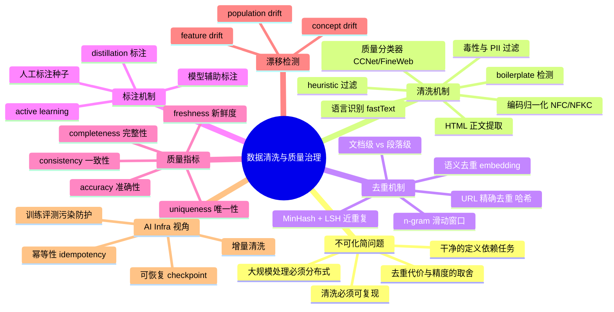
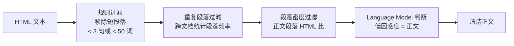
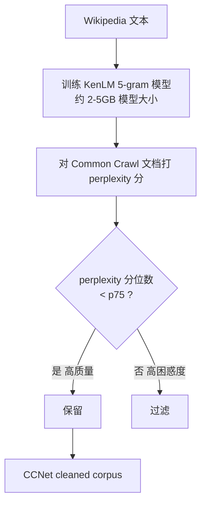
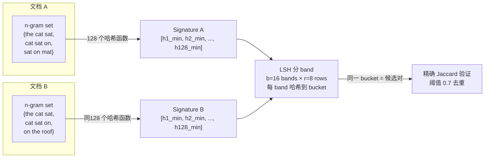
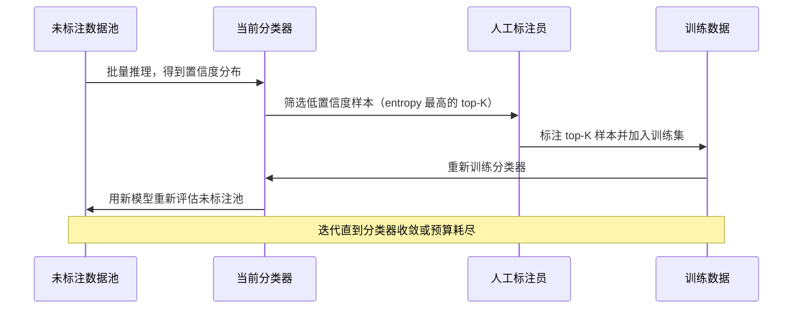
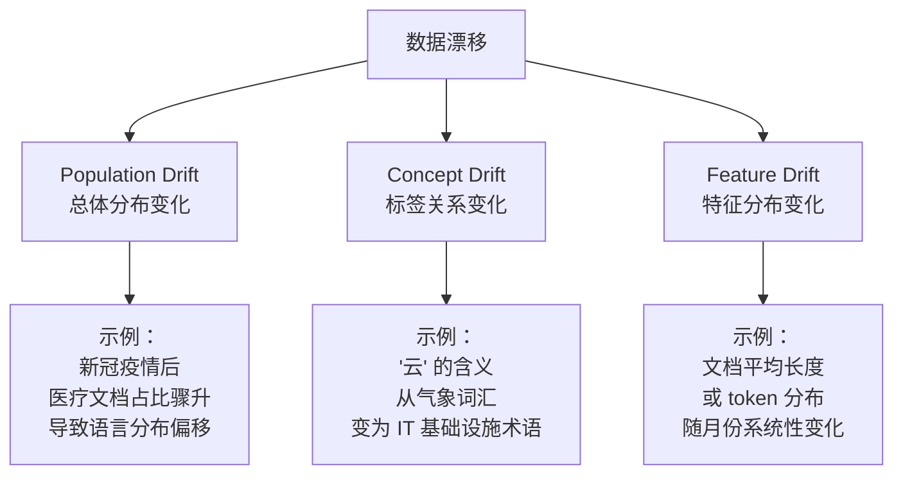
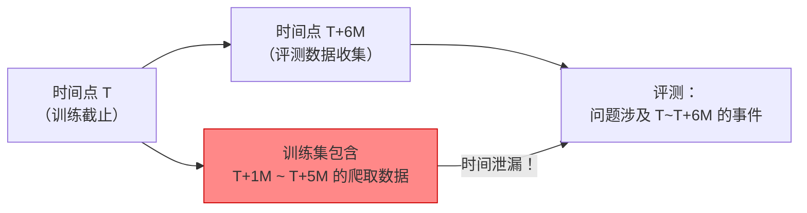
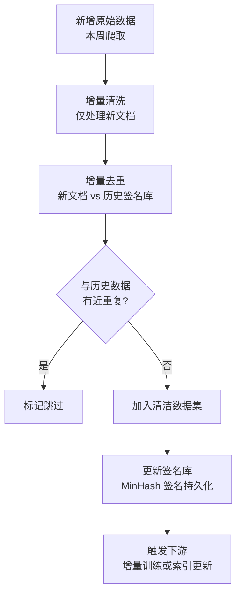

# 第 11b 章 · 数据清洗、去重与质量治理

> 数据的"干净"不是一个布尔值，而是在具体任务、具体用途、具体时间点下，质量维度与成本预算之间的连续权衡。

> **关联章节**：本章是 [第 11 章](./11-data-pipeline.md) 数据管道四层结构中"清洗层"的深挖；去重结果直接影响 [第 12 章](./12-artifacts-and-checkpoints.md) 训练制品的复现性；质量治理标准也决定了 [第 13 章](./13-feature-vector-and-cache.md) 向量索引的基础数据质量。

---

## 11b.1 第一性原理拆解 + 学习大纲

### 拆 — 不可化简的问题

把 MinHash、fastText、CCNet、FineWeb、perplexity filter 这些名字先放在一边，数据清洗与去重要解决的不可化简问题只有两个，而且它们相互矛盾。

**第一个问题：什么叫"干净"，谁来定义？**

没有哪个通用的"干净"标准能跨越所有 AI 训练任务。一篇包含大量拼写错误的 OCR 扫描文本，对训练 OCR 纠错模型来说是宝贵的正样本，对训练通用语言模型来说却是噪声。一段包含医学术语的英文段落，对通用 LLM 来说语言质量极高，对只用来训练中文对话模型的团队来说却不在目标分布内。原始的网络爬取数据里，一条"Buy shoes 50% off now!"的广告，对垃圾邮件检测模型是正样本，对语言建模是 boilerplate 噪声。

因此，"清洗"本质上是：**在给定训练目标、给定模型受众、给定合规约束下，把不满足当前任务最优训练分布的数据段剔除或降权的过程**。这个过程不可能有一个对所有人都成立的答案。工程师在设计清洗管道时，必须先回答"我的目标分布是什么"，才能定义"干净"的操作定义。

**第二个问题：大规模清洗与去重必然带来的不可化简工程张力。**

清洗越彻底，剩余数据越少、越贵。对 Common Crawl 这量级的数据（压缩后约 100TB/爬取批次），完整处理需要数千节点小时的计算；而过于激进的过滤会把有价值的低频知识（专业术语、小语种、代码注释）连同噪声一起删掉。

去重越彻底，模型的泛化能力越好，但计算代价越高；而去重不足会让模型对常见句式过拟合，评测集泄漏甚至可能让 benchmark 分数虚高。MinHash + LSH 的去重管道，在 1B token 规模下是几小时内可以完成的，但在 10T token 规模下需要精心设计分布式拓扑。

**这两个张力叠加在一起，使得数据清洗不是"跑完脚本就算完"的一次性工程，而是需要持续迭代、可观测、可回滚、可复现的治理系统。**

### 推 — 从这个问题如何推导出每个机制

从"干净需要被定义"出发，**质量评分（quality scoring）** 必然出现：单条规则无法覆盖所有"干净"的语义，于是机器学习分类器被训练来区分"高质量"和"低质量"文本。CCNet 最早用 Wikipedia 与 Common Crawl 的 LM perplexity 差值来代理质量；FineWeb-EDU 直接训练一个"教育价值"分类器；DCLM 则用 fastText 分类器区分有价值的网页文本与广告/垃圾。质量分类器需要人工标注的种子数据，于是**标注闭环（annotation loop）** 必然出现。

从"规则需要组合"出发，**清洗 pipeline 的多阶段串联** 必然出现：先做语言识别（fastText langdetect），再做 URL/域名过滤，再做正文提取（Trafilatura / resiliparse），再做 boilerplate 检测，再做 heuristic 过滤（长度、标点比、数字比），再做质量分类，最后做去重。每一阶段都有留存率（retention rate），中间任何一步的阈值变化都会改变整体留存分布。

从"去重必须做但代价高"出发，**三级去重策略** 必然出现：URL 精确去重（O(n) 哈希）→ 文档级近重复（MinHash + LSH，O(n log n)）→ 段落/n-gram 级重叠（滑动窗口哈希或 suffix array）。越往后，精度越高，代价越大，适用规模越小。实际生产管道通常把前两级做在全量数据上，第三级只做在高价值子集上。

从"清洗必须可复现"出发，**幂等性（idempotency）与版本化** 必然出现：同一批原始数据，用同一个清洗规则版本跑两次，应该产生完全相同的输出。这要求清洗步骤不依赖外部随机性、不依赖处理顺序、哈希函数版本固定。如果清洗结果不幂等，数据 lineage 就无法追踪，A/B 实验的变量控制就失效。

从"漂移必须被检测"出发，**分布监控与漂移告警** 必然出现：网络爬取数据的语言分布、域名分布、话题分布会随时间变化；训练集和评测集的时间边界一旦没有严格隔离，就会产生 temporal leakage，让评测分数虚高。

### 绘 — 因果链路



### 导 — 读完本章你应该能回答

1. "干净"不是一个绝对标准，具体到 LLM 预训练数据，FineWeb-EDU 和 DCLM 分别用什么代理指标来定义"质量"？两者的取舍是什么？
2. 为什么 MinHash + LSH 能在接近线性时间内完成近重复去重？LSH band 数量和阈值如何影响查全率与查准率的取舍？
3. 文档级去重、段落级去重和 token 级 n-gram 去重的适用场景和代价有何不同？在 1T token 规模下应该选哪种组合？
4. 清洗管道的幂等性要求哪些工程条件？如果中间某步骤产生非确定性输出，会带来什么样的下游问题？
5. 训练-评测污染（test set leakage）和 temporal leakage 分别是如何形成的？如何在管道设计阶段就预防它们？
6. 数据质量的六个维度（completeness、accuracy、freshness、consistency、validity、uniqueness）在 LLM 训练数据场景下分别对应什么具体检查项？
7. 当下游模型评测分数下降时，如何区分是模型问题、训练数据质量问题、还是清洗规则变更带来的分布偏移问题？

---

## 11b.2 "干净"的操作定义：谁说了算

"干净"是清洗工程里最容易被跳过却最不能跳过的一步。很多团队直接拿 Common Crawl 的 WET 文件跑 heuristic 过滤，没有先问：我们的目标任务是什么？目标用户是谁？这个数据集是用来训练通用 LLM 还是专域微调？

在实际项目中，"干净"的操作定义通常包含以下三个维度：

| 维度 | 操作定义示例 | 谁来决定 |
|------|------------|---------|
| 格式合规 | 无乱码，UTF-8 编码，段落完整 | 数据工程团队 |
| 内容质量 | 语言流畅，无过度重复，有信息量 | 研究团队（通过分类器代理） |
| 合规与安全 | 无 PII、无毒性内容、版权清晰 | 法务/安全团队 |

这三个维度的优先级在不同组织里完全不同，而且它们之间会产生真实的张力：过于激进的毒性过滤会把历史文献、新闻报道里的敏感词连同上下文一起删掉，损害模型对世界知识的理解；过于宽松则引入合规风险。

> **工程原则**：在管道里把"格式合规"（规则可描述）和"内容质量"（需要分类器代理）分成两个独立阶段，使得二者的阈值可以独立调节，清洗规则的 changelog 也更清晰。

---

## 11b.3 文本清洗：从字节流到可训练文本

### 11b.3.1 编码归一化

网络爬取的原始文本里，同一个字符可能有多种 Unicode 表示。"fi"（U+FB01 fi 合字）和 "fi"（f + i 两个字符）在视觉上相同，但在 byte 层面不同，tokenizer 可能把它们分配到不同 token。

| 归一化形式 | 全称 | 特点 | 推荐场景 |
|-----------|------|------|---------|
| NFC | Canonical Decomposition + Canonical Composition | 组合形式，保留合字 | 一般文本保留 |
| NFD | Canonical Decomposition | 分解形式，合字拆分 | 搜索、比较 |
| NFKC | Compatibility Decomposition + Canonical Composition | 兼容分解，fi→fi，²→2 | LLM 训练推荐 |
| NFKD | Compatibility Decomposition | 兼容分解不组合 | 排序、归一化 |

LLM 训练数据通常推荐 **NFKC**：它把兼容字符（合字、数学上标、全角字符）统一到标准形式，减少 tokenizer 的碎片化，同时不会像 NFD 那样把汉字拆分成基字+变音符号。

```python
import unicodedata
def normalize_text(text: str) -> str:
    # NFKC 归一化 + 替换不可见字符
    text = unicodedata.normalize("NFKC", text)
    # 把 zero-width chars、BOM、换行符标准化
    text = text.replace("​", "").replace("", "")
    text = "\n".join(line.rstrip() for line in text.splitlines())
    return text
```

### 11b.3.2 HTML 与 Markdown 提取

Common Crawl 的 WARC 文件包含原始 HTTP 响应，正文需要从 HTML 中提取。主要工具对比：

| 工具 | 特点 | 速度 | 适用场景 |
|------|------|------|---------|
| Trafilatura | 基于可读性模型，去 nav/footer/ad | 中等 | 通用网页正文提取 |
| resiliparse | 极快 C++ 实现，支持流式处理 | 极快 | 大规模批处理 |
| jusText | 基于段落密度，可调参数 | 中等 | 需要细调的场景 |
| BeautifulSoup | 通用 HTML 解析，不去 boilerplate | 慢 | 小规模、定制规则 |
| html2text | 转 Markdown，保留格式 | 快 | 需要保留结构的场景 |

> **关键工程细节**：resiliparse 的 `extract_plain_text` 函数在 CC 规模下比 Trafilatura 快约 5-8 倍，但在某些 CMS 生成的页面上正文提取率略低。生产管道通常用 resiliparse 做第一遍快速提取，再对低置信度页面用 Trafilatura 复跑。

### 11b.3.3 Boilerplate 检测

Boilerplate 是指页面中与正文无关的重复性文本：导航栏、版权声明、"点击这里订阅"、Cookie 提示等。检测方法从简单到复杂：



**跨文档重复段落检测**（也称 "exact-match paragraph dedup"）：先把所有文档按段落（≥3 句）哈希，统计每个段落出现次数；出现超过 N 次（通常 N=5 到 N=100，视数据规模定）的段落标记为 boilerplate 删除。这一步能有效去除版权声明、免责条款等。

### 11b.3.4 语言识别

FastText 语言识别（`lid.176.bin` 模型）是目前最主流的方案，覆盖 176 种语言，推理速度 >100K docs/s（单线程）。

```python
import fasttext
model = fasttext.load_model("lid.176.bin")

def detect_lang(text: str, min_chars: int = 20) -> tuple[str, float]:
    if len(text) < min_chars:
        return "unk", 0.0
    text_one_line = text.replace("\n", " ")[:512]
    labels, probs = model.predict(text_one_line, k=1)
    lang = labels[0].replace("__label__", "")
    return lang, float(probs[0])
```

> **边界提醒**：FastText 在短文本（< 50 字符）、代码片段、混合语言文本上准确率显著下降。CLD3（Google Chrome 使用）在部分语言上更准，但推理更慢。对于代码训练数据，应该用扩展名/语法检测而不是自然语言语言识别。

### 11b.3.5 Heuristic 过滤规则

主流预训练数据集（C4、RedPajama、Dolma）的过滤规则汇总：

| 规则类型 | 具体指标 | 典型阈值 | 原因 |
|---------|---------|---------|------|
| 长度过滤 | token 数 / 字符数 | 100 ≤ tokens ≤ 100,000 | 过短无信息量，过长通常是代码/数据转储 |
| 符号比例 | 非字母字符占比 | < 0.5 | 过高表示乱码或纯符号列表 |
| 数字比例 | 数字字符占比 | < 0.2 | 过高表示数据表/日志 |
| 重复 n-gram | 最高频 10-gram 重复比 | < 0.2 | 过高表示模板/爬虫生成 |
| 平均词长 | avg word length (chars) | 3 ≤ avg ≤ 10 | 过短/过长表示分词错误或乱码 |
| 停用词覆盖 | 常用停用词出现次数 | ≥ 2 或 ≥ 5 | 确认是自然语言而非列表/代码 |
| 标点结尾 | 最后字符是标点 | 推荐 | 剔除不完整段落 |
| 椭圆/省略号 | "..." 连续出现次数 | < 3 | 剔除导航类省略文本 |

---

## 11b.4 LLM 训练数据专属过滤

### 11b.4.1 CCNet / LM Perplexity 过滤

CCNet（Wenzek et al., 2020）提出用 KenLM 语言模型的 perplexity（困惑度）来过滤质量。其核心假设是：一个在高质量语料（如 Wikipedia）上训练的 n-gram LM 对高质量文本会给出低困惑度，对噪声文本会给出高困惑度。



**局限性**：Perplexity 依赖种子语料的分布。用 Wikipedia 训练的 KenLM 会偏向百科全书风格的文本，容易过滤掉口语对话、编程文档、法律文件等风格不同但信息量高的文本。

### 11b.4.2 URL 域名黑名单

在文档级别过滤之前，URL 级别的黑名单过滤成本最低、效果显著：

- **成人/色情域名**：直接黑名单匹配，无需内容分析
- **已知垃圾域名**：爬虫农场、SEO 垃圾站，通过 UT1 / DNSBL 等公开列表过滤
- **社交聚合站**（Reddit/HN）：通常单独处理，不走通用过滤流程

### 11b.4.3 Education Quality Classifier（FineWeb-EDU / DCLM）

**FineWeb-EDU**（HuggingFace, 2024）：
- 训练一个 5 分制"教育价值"分类器（0=无价值，5=极高价值教材）
- 种子数据：Llama 3 对约 50 万文档的教育价值打分（成本约 $1k）
- 分类器：用种子数据微调一个小型文本分类器（如 `deberta-v3-small`）
- 过滤策略：取分数 ≥ 3 的文档，约为 CC 全量的 **5-7%**，但 MMLU/ARC 评测提升显著

**DCLM**（Li et al., 2024）：
- 用 fastText 在 OpenHermes 等高质量对话数据上训练内容质量分类器
- 分类器区分"模型需要的信息密度高的文本"和"垃圾/广告/重复"
- 结合全局去重（MinHash + suffix array），最终构建 DCLM-Baseline 数据集

| 数据集 | 质量代理指标 | 过滤留存率 | 评测提升（7B LM） |
|--------|------------|-----------|----------------|
| C4 | heuristic rules | ~65% of CC | 基线 |
| CCNet | Wikipedia LM perplexity | ~30% of CC | +3-5% MMLU |
| FineWeb | heuristic + quality filter | ~40% of CC | +5-8% MMLU |
| FineWeb-EDU | education classifier | ~5% of CC | +10-15% MMLU |
| DCLM-Baseline | fastText classifier + dedup | ~17% of CC | +8-12% MMLU |

> **关键洞察**：留存率低不等于质量低。FineWeb-EDU 留存约 5% 的数据，但这 5% 的"教育密度"极高；用同样计算量训练，效果优于留存 40% 的通用质量过滤。对于预算有限的团队，**优先提高数据质量而不是数据规模**在 1T token 以内是正确的。

---

## 11b.5 毒性、PII 与合规过滤

### 11b.5.1 毒性内容检测

| 工具/方法 | 精度 | 速度 | 主要覆盖 |
|----------|------|------|---------|
| Perspective API | 高 | 慢（API 限速） | 英文毒性内容 |
| Detoxify | 中高 | 中等 | 多语言，开源 |
| fastText 分类器 | 中 | 极快 | 粗粒度，需自定义训练 |
| 关键词黑名单 | 低（高误报） | 极快 | 兜底层，成本最低 |

生产管道通常分两层：先用关键词黑名单做快速粗过滤（cost-free），再对疑似内容用 Detoxify 或微调的 BERT 分类器做精确判断。

### 11b.5.2 PII（个人隐私信息）检测

PII 检测的核心挑战是**召回率和精确率的取舍**：过于激进会把"Barack Obama was president"里的人名也替换掉，损害训练数据的信息完整性。

常见 PII 类型及检测方法：

| PII 类型 | 检测方法 | 处理策略 |
|---------|---------|---------|
| 邮箱地址 | 正则 `\w+@\w+\.\w+` | 替换为 `<EMAIL>` |
| 手机号 | 正则 + 国家码前缀库 | 替换为 `<PHONE>` |
| 身份证/社保号 | 正则 + luhn 校验 | 替换为 `<ID>` |
| 信用卡号 | 正则 + luhn 校验 | 替换为 `<CARD>` |
| 姓名（人名实体） | NER 模型（spaCy/flair） | 替换或保留（视场景） |
| IP 地址 | 正则 | 替换或删除 |
| 地址/位置 | NER 模型 | 视场景 |

---

## 11b.6 去重：精确去重 vs 近重复 vs 语义去重

### 11b.6.1 三层去重策略

```mermaid
flowchart TD
    A[原始文档集\nN 文档] --> B[URL 精确去重\nSHA256/MD5 哈希\nO(N) 时间]
    B --> C[文档级近重复去重\nMinHash + LSH\nO(N log N) 时间]
    C --> D{文档规模 < 10B token?}
    D -->|是| E[段落级 n-gram 去重\nSuffix Array\nO(N log N) 时间高常数]
    D -->|否| F[token-level 滑动窗口\n抽样去重]
    E --> G[可选:语义去重\nEmbedding 聚类\nO(N²) → 近似 ANNS]
    F --> G
    G --> H[最终清洗数据集]
```

### 11b.6.2 MinHash + LSH 精讲

MinHash（Minimum Hashing）的核心思想是：用一组随机哈希函数，把每个文档的 n-gram 集合压缩成一个固定长度的签名向量（signature），使得任意两个文档的签名 Jaccard 相似度等于原始 n-gram 集合的 Jaccard 相似度的期望。



**LSH 参数选择**：

| 参数 | 含义 | 典型值 | 对去重的影响 |
|------|------|--------|-------------|
| n-gram 大小 | 词级或字符级 n-gram | 词级 5-gram | 决定相似度粒度 |
| signature 长度 | hash 函数数量 | 128 或 256 | 越长估计越准，内存越大 |
| band 数量 b | 分 band 数 | 16-32 | b 越大，高相似度文档越容易被找到 |
| row 数量 r | 每 band 行数 | signature_len / b | b × r = signature 总长 |
| 相似度阈值 | Jaccard 阈值 | 0.7-0.8 | 越低去重越激进 |

**近似阈值公式**：LSH 两文档被检测为候选对的概率约为 `1 - (1 - s^r)^b`，其中 `s` 是真实 Jaccard 相似度。当 `s = (1/b)^(1/r)` 时，概率约为 50%，此即 LSH 的"阈值点"。

### 11b.6.3 文档级 vs 段落级 vs Token 级去重

| 去重粒度 | 优点 | 缺点 | 适用场景 |
|---------|------|------|---------|
| 文档级（整篇去重） | 计算成本最低，实现简单 | 无法处理"整合站"（把多篇拼在一起的网页） | 第一步快速去重 |
| 段落级（段落哈希去重） | 能处理 copy-paste 段落复用 | 短段落误报高，计算量 O(文档数 × 平均段落数) | 新闻/博客类数据 |
| n-gram 级（suffix array） | 最精确，能检测逐词复制 | 内存和计算密集，数 TB 数据时需分布式 | 代码、学术论文去重 |
| 语义去重（embedding 聚类） | 能处理改写/语义重复 | 极慢，embedding 本身有误差 | 小规模高价值数据集 |

> **典型工程选择（1B token 规模）**：文档级 SHA256 去重 → 5-gram MinHash LSH 去重（阈值 0.75）→ 段落级精确哈希去重。语义去重通常只在构建高质量 SFT/instruction 数据集时才做，不在预训练全量数据上做。

---

## 11b.7 大规模去重工程：Spark / Ray Data / Daft

### 11b.7.1 分布式 MinHash LSH Pipeline

在 1T token 规模下，单机 MinHash 无法完成。以下是 Ray Data 实现的分布式 LSH 去重流程：

```python
import ray
from datasketch import MinHash

@ray.remote
def compute_minhash(doc_batch: list[dict], num_perm: int = 128) -> list[dict]:
    results = []
    for doc in doc_batch:
        m = MinHash(num_perm=num_perm)
        tokens = doc["text"].lower().split()
        ngrams = [" ".join(tokens[i:i+5]) for i in range(len(tokens)-4)]
        for ng in ngrams:
            m.update(ng.encode("utf8"))
        results.append({"id": doc["id"], "hashvalues": m.hashvalues.tolist()})
    return results

# LSH 分 band，每 band 做 group-by，找同 bucket 的文档对
def lsh_candidates(signatures: list[dict], b: int = 16, r: int = 8):
    # 每个 band 哈希到 bucket，找碰撞对
    ...
```

**Spark 实现要点**：
1. 把文档拆成 n-gram 集合 → `flatMap`
2. 计算 MinHash signatures → `mapPartitions`（用 datasketch 库）
3. 分 band，每 band 做 `groupBy(band_hash)` → 找候选对
4. 对候选对精确计算 Jaccard → 过滤 > 阈值的对
5. 用 Union-Find 做连通分量，每个连通分量只保留一个代表文档

**性能数据参考**（公开文献）：

| 数据规模 | 工具 | 集群规模 | 耗时 |
|---------|------|---------|------|
| 100B token | Spark | 128 节点（16 core × 64GB） | ~8 小时 |
| 1T token | Spark + Ray | 512 节点 | ~2 天 |
| RedPajama（CommonCrawl 部分） | cc_net + custom | 数百节点 | ~1 周 |

### 11b.7.2 Daft 的去重优势

Daft（Eventual Inc.）是为大规模非结构化数据设计的 DataFrame 框架，其 native 支持字节级操作和 Arrow-based 列存，在去重场景下比 Spark 有以下优势：
- 无 JVM overhead，Python 原生，与 HuggingFace Datasets 直接对接
- 支持 Ray backend，可在同一集群上混跑清洗和训练
- 内置 `daft.col("text").apply(minhash_fn)` 等 UDF，比 Spark `mapPartitions` 更易调试

---

## 11b.8 标注：人工标注、模型辅助与 Active Learning

数据质量的上限来自标注质量。清洗分类器的种子数据、PII 识别模型的训练集、毒性分类器的人工标注——都需要系统化的标注工程。

### 11b.8.1 标注方法对比

| 方法 | 成本 | 质量 | 可扩展性 | 适用场景 |
|------|------|------|---------|---------|
| 纯人工标注 | 极高 | 最高 | 低 | 种子数据，金标准测试集 |
| 模型辅助标注（LLM 打分） | 中等 | 高（有偏差） | 高 | 质量分类器训练数据 |
| Active Learning | 中等 | 高 | 中等 | 分类边界模糊的数据 |
| Distillation 标注 | 低 | 中等 | 极高 | 大规模弱标注 |
| 规则生成伪标签 | 极低 | 中低 | 极高 | 粗粒度初始过滤 |

### 11b.8.2 Active Learning 闭环



**Active Learning 的工程关键**：
- 选样策略：不确定性采样（entropy）比随机采样效率高 3-5 倍
- 批量选样：不要每次只选 1 条，一次选 50-200 条（batch mode active learning）
- 冷启动：先随机标注 500-1000 条作为初始训练集，再启动主动学习循环

### 11b.8.3 LLM 辅助标注的注意事项

FineWeb-EDU 的做法为行业树立了范例：用 Llama 3 对 ~500K 文档打 1-5 分的教育价值分数，再把这些分数作为训练信号训练一个小型分类器（`deberta-v3-small`）。

> **风险提醒**：LLM 辅助标注会把 LLM 的偏见编码进训练数据。如果 Llama 3 对某些文化背景的文本系统性低分，这个偏见会被放大进入下一代模型。标注前必须做跨文化/跨语言的 calibration 检查。

---

## 11b.9 数据质量指标体系

### 11b.9.1 六个质量维度

| 维度 | 定义 | LLM 数据具体指标 | 检查时机 |
|------|------|----------------|---------|
| Completeness（完整性） | 必要字段是否存在 | text 字段非空率，language 字段覆盖率 | 原始层 → 清洗层 |
| Accuracy（准确性） | 内容是否符合事实/规范 | 语言识别置信度，格式合规率 | 清洗层 |
| Freshness（新鲜度） | 数据是否在时间预算内 | 文档时间戳分布，crawl date 覆盖 | 样本层 |
| Consistency（一致性） | 不同批次/来源间是否统一 | schema 版本一致性，归一化规则一致性 | 跨批次监控 |
| Validity（合规性） | 是否满足业务和法规约束 | PII 剩余率，毒性内容率，版权状态 | 回流层门禁 |
| Uniqueness（唯一性） | 是否有效去重 | 精确重复率，近重复率，evaluation set 泄漏率 | 样本层 |

### 11b.9.2 数据质量仪表盘（最小可行指标）

```python
# 每个数据批次产出后应自动计算的质量报告
quality_report = {
    "total_docs": 10_000_000,
    "after_lang_filter_rate": 0.82,      # 82% 是目标语言
    "after_length_filter_rate": 0.78,    # 78% 通过长度过滤
    "after_quality_score_rate": 0.45,    # 45% 通过质量分类器
    "after_dedup_rate": 0.38,            # 38% 去重后留存
    "pii_detection_rate": 0.003,         # 0.3% 文档含 PII
    "toxicity_rate": 0.008,              # 0.8% 含毒性内容
    "eval_set_contamination_rate": 0.0001, # 0.01% 与评测集重叠
    "language_distribution": {"zh": 0.42, "en": 0.35, "other": 0.23},
    "token_count": 1_200_000_000,        # 留存 12亿 token
}
```

---

## 11b.10 数据漂移检测

数据漂移是指训练数据的统计特性随时间变化，导致模型在新数据上表现退化。对于持续更新的数据管道，漂移检测是质量治理的关键组成部分。

### 11b.10.1 三类漂移



### 11b.10.2 漂移检测工具

| 方法 | 检测对象 | 工具 | 触发阈值 |
|------|---------|------|---------|
| KL 散度 | 特征/label 分布 | 自定义 / Evidently | > 0.1 告警 |
| Population Stability Index (PSI) | 整体分布 | Evidently / GreatExpectations | > 0.2 严重 |
| Chi-squared test | 类别特征 | scipy.stats | p < 0.01 |
| Wasserstein 距离 | 连续分布 | scipy.stats | 业务定义阈值 |
| 文档嵌入分布监控 | 语义分布 | 自定义 embedding pipeline | 余弦距离均值 > 0.3 |

---

## 11b.11 反模式：训练-评测污染与时间泄漏

### 11b.11.1 Test Set Leakage（评测集泄漏）

这是最严重的数据质量反模式之一。当训练数据中包含评测集的原文（或近重复），模型的 benchmark 分数会虚高，造成对模型真实能力的高估。

| 泄漏类型 | 成因 | 检测方法 | 预防 |
|---------|------|---------|------|
| 完全重复 | 评测集网页被爬入训练集 | n-gram 精确匹配 | 去重时把评测集也纳入 |
| 近重复 | 改写版本进入训练集 | MinHash 相似度检测 | 对评测集做 8-gram overlap 检测 |
| 答案泄漏 | 含问题+答案对的网页 | 专项扫描 | 评测集构建时检查来源域名 |

**推荐实践**：在做 MinHash 去重时，把所有已知评测集（MMLU、HellaSwag、ARC、WinoGrande 等）的问题文本加入去重集合，以候选对的形式检测。任何与评测集 8-gram overlap > 30% 的训练文档都应标记并审查。

### 11b.11.2 Temporal Leakage（时间泄漏）



**预防措施**：
- 所有文档保留 `crawl_date` 和 `publish_date` 两个时间戳
- 训练集严格按 `publish_date` 截止，不按 `crawl_date`
- 评测集构建时检查所有数据的 `publish_date`，确保在训练截止之后

---

## 11b.12 AI Infra 视角：清洗管道的工程属性

### 11b.12.1 幂等性（Idempotency）

幂等的清洗步骤满足：`clean(clean(data)) == clean(data)`。实现幂等的要求：

1. **哈希函数版本固定**：同一条文档用同一个 MD5/SHA256 函数始终产生同一个哈希，不受处理顺序影响
2. **规则无副作用**：过滤规则不依赖外部状态，不依赖当前时间戳（除非明确是时间相关规则）
3. **分类器版本固化**：清洗用的质量分类器、语言识别模型的版本号必须记录在元数据中
4. **确定性随机**：如果需要随机采样，seed 必须固定并记录

> **工程反例**：用 `datetime.now()` 作为过滤条件（如"只保留过去 30 天的数据"），导致同一份数据在不同时间跑出不同结果。应该把时间窗口作为参数固化在配置文件中。

### 11b.12.2 增量清洗（Incremental Cleaning）

对于持续增长的数据源（每周新增爬取），全量重跑清洗管道成本太高。增量清洗的正确姿势：



**关键工程细节**：MinHash 签名库需要持久化存储（通常存在 Parquet 或 Redis 里），新文档的签名只需要和历史签名库比较，不需要重跑历史数据。

### 11b.12.3 可恢复性（Recoverability）

清洗管道应该在任意步骤失败后可以从检查点（checkpoint）恢复，而不是从头重跑：

- 每个清洗阶段输出中间结果到独立路径（如 `s3://bucket/clean/v3/step2_lang_filter/`）
- 用 Airflow/Dagster 的 task-level retry 而不是 job-level retry
- 每个阶段记录已处理文档的哈希集合，支持断点续跑

---

## 11b.13 Worked Example：1B Token 网页数据从 Raw 到 Cleaned

### 场景设定

目标：从一批 Common Crawl 爬取数据（原始约 20B 汉字 + 英文混合文本，约 1000 万文档）中清洗出约 1B token 的高质量中文预训练数据。

### 完整 Pipeline

```mermaid
flowchart TD
    Raw["原始数据\n1000万文档\n~50GB 压缩 WARC/WET\n约 20B 汉字当量"]
    
    Raw --> S1["步骤1：URL 精确去重\n工具：SHA256 哈希\n去除完全相同 URL"]
    S1 --> R1["留存：850万文档\n留存率：85%\n时间：~30min 单机"]
    
    R1 --> S2["步骤2：HTML 正文提取\n工具：resiliparse\n提取 main content，去 nav/footer"]
    S2 --> R2["留存：750万文档\n留存率：88%\n（空内容页面过滤）\n时间：~2h 32核"]
    
    R2 --> S3["步骤3：编码归一化\n工具：unicodedata NFKC\n+不可见字符清理"]
    S3 --> R3["全量通过\n无留存损失\n时间：~20min"]
    
    R3 --> S4["步骤4：语言识别\n工具：fastText lid.176\n保留中文 conf>0.7\n允许中英混合"]
    S4 --> R4["留存：420万文档\n留存率：56%\n时间：~40min 32核"]
    
    R4 --> S5["步骤5：Heuristic 过滤\n长度/符号比/重复n-gram\n停用词/标点规则"]
    S5 --> R5["留存：310万文档\n留存率：74%\n时间：~30min"]
    
    R5 --> S6["步骤6：质量分类器\n工具：微调 deberta 中文教育质量分类器\n阈值：≥3/5 分"]
    S6 --> R6["留存：180万文档\n留存率：58%\n时间：~3h A100×4"]
    
    R6 --> S7["步骤7：PII + 毒性过滤\n工具：正则 + Detoxify\n替换 PII，过滤毒性 > 0.7"]
    S7 --> R7["留存：175万文档\n留存率：97%\n时间：~1h"]
    
    R7 --> S8["步骤8：文档级 MinHash 去重\n5-gram 128 perm\n16 bands × 8 rows\nJaccard ≥ 0.75"]
    S8 --> R8["留存：140万文档\n留存率：80%\n时间：~2h Ray 64核"]
    
    R8 --> S9["步骤9：段落级精确哈希去重\n段落 ≥ 50 字\nMD5 跨文档去重"]
    S9 --> R9["留存：135万文档\n留存率：96%\n去除 boilerplate 段落\n时间：~45min"]
    
    R9 --> S10["步骤10：评测集污染检测\n8-gram overlap 检测\n与 CEVAL/CMMLU 对比"]
    S10 --> R10["过滤 812 文档\n约 0.06%\n时间：~15min"]
    
    R10 --> Final["最终数据集\n约134万文档\n~1.15B token\n质量分均值：3.8/5"]
```



### 各步骤留存率统计

| 步骤 | 操作 | 输入文档数 | 输出文档数 | 留存率 | token 当量 |
|------|------|-----------|-----------|-------|-----------|
| 原始数据 | — | 10,000,000 | 10,000,000 | 100% | ~20B |
| URL 去重 | SHA256 | 10,000,000 | 8,500,000 | 85% | ~17B |
| HTML 提取 | resiliparse | 8,500,000 | 7,480,000 | 88% | ~15B |
| 语言识别 | fastText | 7,480,000 | 4,190,000 | 56% | ~8.4B |
| Heuristic 过滤 | 规则 | 4,190,000 | 3,100,000 | 74% | ~6.2B |
| 质量分类 | deberta 分类器 | 3,100,000 | 1,798,000 | 58% | ~3.6B |
| PII/毒性过滤 | 规则+模型 | 1,798,000 | 1,744,000 | 97% | ~3.5B |
| MinHash 去重 | LSH | 1,744,000 | 1,395,000 | 80% | ~2.8B |
| 段落去重 | MD5 | 1,395,000 | 1,339,000 | 96% | ~2.1B |
| 评测集检测 | n-gram | 1,339,000 | 1,338,188 | ~100% | ~1.15B |

**总体留存率：约 13.4%（文档数），约 5.75%（token 数）**

> **工程洞察**：token 留存率远低于文档留存率，是因为段落去重会删除文档内的大量重复段落（如版权声明、导航文本等），使每个文档的平均有效 token 数显著下降。这是正常的，最终 1.15B token 的数据质量分均值达到 3.8/5，远优于未过滤的 20B token 数据。

### 元数据记录

```yaml
dataset_version: zh-web-v2.1
source: common_crawl_2024_22
cleaning_ruleset: zh-clean-r4
cleaning_model_versions:
  lang_detect: fasttext-lid.176-2023
  quality_classifier: deberta-zh-edu-v1.2
  toxicity: detoxify-multilingual-v0.5
split_policy: doc_hash_mod_1000
sample_count:
  train: 1_330_000
  valid: 5_000
  test: 3_188
token_count:
  train: 1_143_000_000
  valid: 4_300_000
  test: 2_700_000
eval_contamination_removed: 812
generated_at: 2026-05-03T08:00:00Z
total_compute_hours: ~12h
```

---

## 11b.14 工程建议与常见工具

### 清洗工具全景

| 类别 | 工具 | 特点 |
|------|------|------|
| 正文提取 | resiliparse、Trafilatura、jusText | 速度/质量不同取舍 |
| 语言识别 | fastText lid.176、CLD3、lingua | lid.176 最广泛 |
| 质量分类 | deberta 微调、fastText 分类器 | 小模型快，大模型准 |
| 去重 | datasketch (MinHash)、text-dedup (HuggingFace)、Daft | text-dedup 最易上手 |
| PII 检测 | spaCy、presidio、自定义正则 | presidio 覆盖全 |
| 毒性检测 | Detoxify、Perspective API、自定义 | Detoxify 开源首选 |
| 分布式处理 | Spark、Ray Data、Daft | 视集群环境选择 |
| 编排 | Airflow、Dagster、Prefect | Dagster 对数据任务友好 |

### 核心工程原则

1. **质量分类器先于规则**：规则是"已知坏的"的快速剔除，分类器是"未知坏的"的发现。两者互补不可相互替代
2. **留存率追踪是必须的**：每个步骤的留存率必须记录在日志和元数据中，任何步骤留存率异常变化（>5%）需要触发告警
3. **评测集隔离是红线**：评测集在数据管道的最早期就应该被锁定，在去重阶段作为"已知集合"参与，不能事后补检
4. **去重签名持久化**：MinHash 签名库是宝贵的去重资产，应该和数据集一起版本化保存，支持增量去重

---

## 本章小结

| 主题 | 要点 |
|------|------|
| "干净"的定义 | 依赖任务、用途、合规约束，不存在通用标准 |
| 清洗阶段顺序 | 格式合规 → heuristic 过滤 → 质量分类 → 去重 → 合规检测 |
| 去重三级策略 | 精确哈希（O(N)）→ MinHash LSH（O(N log N)）→ 语义去重（小规模） |
| 质量分类器 | CCNet perplexity、FineWeb-EDU、DCLM 是主流范式，种子数据质量决定上限 |
| 工程属性 | 幂等性、可恢复性、增量更新三者缺一不可 |
| 反模式 | 评测集污染和 temporal leakage 是最严重的数据质量问题 |
| 留存率 | 1B token 清洗目标，原始数据需要 5-20 倍规模（约 5-20B token 原始量） |

---

## 练习题

### 基础

**11b-1（基础）**：对以下 Unicode 字符串，NFKC 归一化后会发生什么变化？`"file²"` → ? 请解释 fi 合字和数字上标的归一化行为，并说明这对 LLM tokenizer 的影响。

**11b-2（基础）**：MinHash 签名的 Jaccard 相似度估计为什么是无偏估计？如果签名长度从 128 增加到 512，查准率和计算成本分别如何变化？

**11b-3（基础）**：列举 3 种典型的 Temporal Leakage 场景（不限于文本数据），并说明如何在数据管道设计阶段就预防它们。

**11b-4（基础）**：FineWeb-EDU 的"教育价值"分类器为什么比通用质量分类器在 MMLU 等学术 benchmark 上效果更好？这种方法有什么局限性？

### 进阶

**11b-5（进阶）**：设计一个幂等的中文网页清洗步骤序列（至少 6 步）。对每步说明：输入、输出格式、幂等性保证方式、典型留存率。如果某步骤引入了随机性，如何改造使其幂等？

**11b-6（进阶）**：在 10B token 规模的数据上做 5-gram MinHash 去重，假设每个文档平均 500 tokens，签名长度 128，分 16 bands × 8 rows。估算：(1) 签名存储总大小，(2) LSH 候选对数量（假设 1% 文档有近重复），(3) 精确 Jaccard 验证的计算量。用这些数字说明为什么需要分布式计算。

**11b-7（进阶）**：比较文档级去重和段落级去重对下游 LLM 训练的影响。在以下场景下分别推荐哪种策略，并说明理由：(a) 新闻数据集，(b) 代码数据集，(c) 学术论文数据集，(d) 社交媒体数据集。

**11b-8（进阶）**：设计一个数据漂移监控系统，用于监控每周新增爬取的中文网页数据。需要监控哪些指标？每个指标的告警阈值如何设定？漂移告警触发后的处理流程是什么？

### 设计

**11b-9（设计）**：从 0 设计一个面向中文 LLM 预训练的数据清洗系统，支持每月新增 500B token 原始数据。要求：(1) 系统架构图（含数据流和组件），(2) 各阶段的工具选型和理由，(3) 幂等性和可恢复性的实现方案，(4) 质量监控仪表盘最小指标集（至少 8 个），(5) 增量清洗的设计方案。

**11b-10（设计）**：针对评测集污染问题设计一个系统级防护方案。要求：(1) 在数据管道哪几个节点插入检测，(2) 使用什么算法和阈值，(3) 对于检测到的污染文档，给出三种不同处理策略及各自适用场景，(4) 如何在不重新训练的情况下估算已训练模型受污染的程度？

**11b-11（设计）**：为一个 10 人的 AI 团队设计最小可行的数据标注工程系统，用于构建质量分类器的种子数据。要求：(1) 标注工具选型，(2) 标注流程（含质量控制），(3) Active Learning 的引入时机和选样策略，(4) 标注数据的版本管理方案，(5) 说明如何用 LLM 辅助标注把人工成本降低 80% 同时保持标注质量。

**11b-12（开放）**：假设你负责一个多语言 LLM 预训练项目，目标语言包括中文、英文、阿拉伯文和斯瓦希里语。针对这四种语言，质量分类器的构建面临哪些不同挑战？（提示：资源稀缺性、现有评测集、文化差异、用 LLM 辅助标注的偏差风险。）给出每种语言的定制化清洗建议。

---

## 深度参考阅读

### 核心论文

- **CCNet**：Wenzek et al., *CCNet: Extracting High Quality Monolingual Datasets from Web Crawl Data*, LREC 2020 — LM perplexity 过滤的奠基之作
- **FineWeb**：HuggingFace, *FineWeb: Decanting the Web for the Finest Text Data at Scale*, 2024 — 系统性对比多种清洗策略
- **FineWeb-EDU**：HuggingFace, *The FineWeb Datasets: Decanting the Web for the Finest Text Data at Scale* (EDU section), 2024 — 教育质量分类器范式
- **RedPajama**：Together AI, *RedPajama: An Open Dataset for Training Large Language Models*, 2023 — 开源 LLaMA 训练数据集的完整构建方案
- **Dolma**：Soldaini et al., *Dolma: an Open Corpus of Three Trillion Tokens for Language Model Pretraining Research*, ACL 2024 — 最详细的数据清洗 pipeline 文档之一
- **DCLM**：Li et al., *DataComp-LM: In Search of the Next Generation of Training Sets for Language Models*, 2024 — 系统性 benchmark 不同清洗策略
- **The Pile**：Gao et al., *The Pile: An 800GB Dataset of Diverse Text for Language Modeling*, 2020 — 多源数据集构建的早期范式

### 去重技术

- **MinHash 原始论文**：Broder, *On the resemblance and containment of documents*, 1997
- **LSH**：Indyk & Motwani, *Approximate nearest neighbors*, STOC 1998
- **DataComp dedup**：Li et al., 2024 (DCLM) §4 — 详细的 MinHash + suffix array 去重工程实现
- **text-dedup**：HuggingFace 开源库，实现了 MinHash/SimHash/Suffix Array 等多种去重方案

### 工程与工具

- **Trafilatura 文档**：Barbaresi, *Trafilatura: A Web Scraping Library and Command-Line Tool for Text Discovery and Extraction*, ACL 2021
- **resiliparse 文档**：Janek Bevendorff et al., *Efficient Web Archive Processing with the ChatNoir Resiliparse Toolkit*
- **Presidio**：Microsoft 开源 PII 检测框架 — `github.com/microsoft/presidio`
- **Detoxify**：Hanu & Unitary, *Detoxify*, 2020 — 多语言毒性检测
- **data-juicer**：阿里巴巴开源数据清洗工具，支持多模态和 LLM 场景 — `github.com/modelscope/data-juicer`

### 数据质量治理

- **Great Expectations 文档**：数据质量测试框架
- **Evidently AI 文档**：数据漂移监控框架
- **Daft 文档**：`getdaft.io` — 面向大规模非结构化数据的 DataFrame 框架
