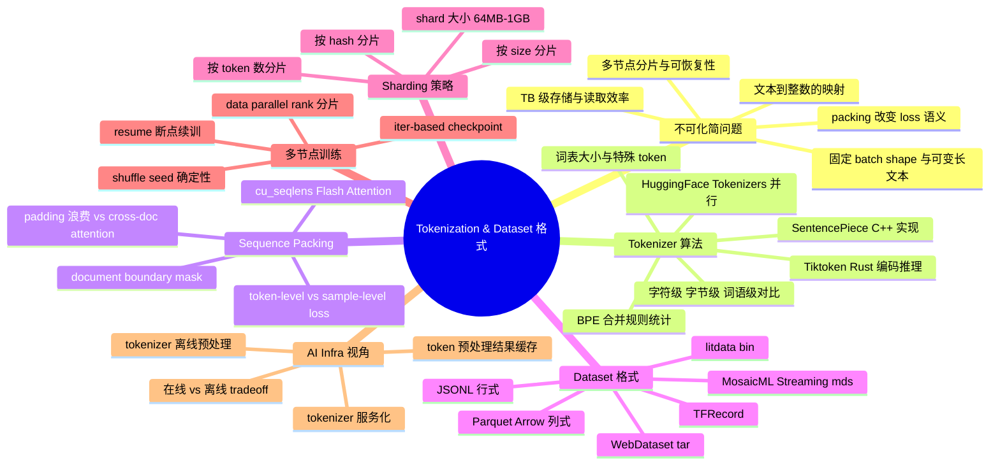
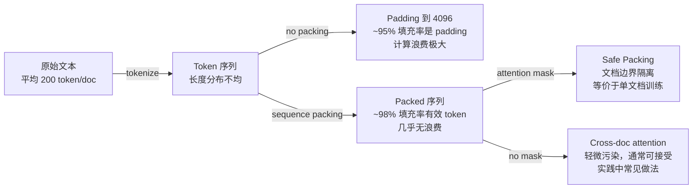
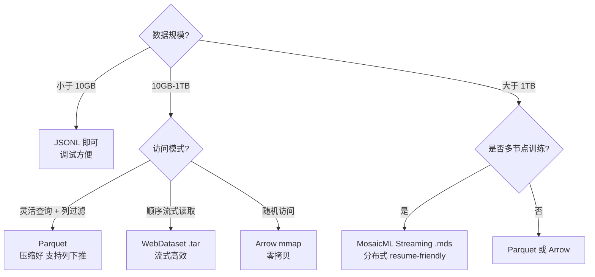
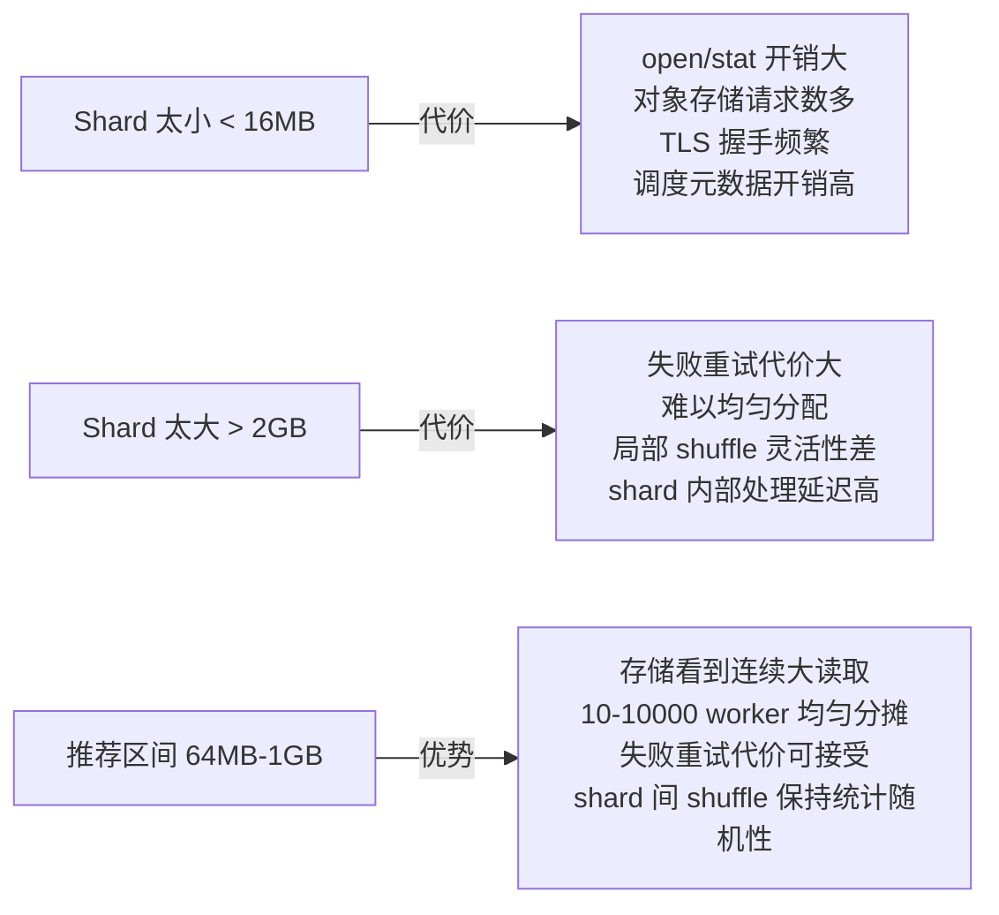
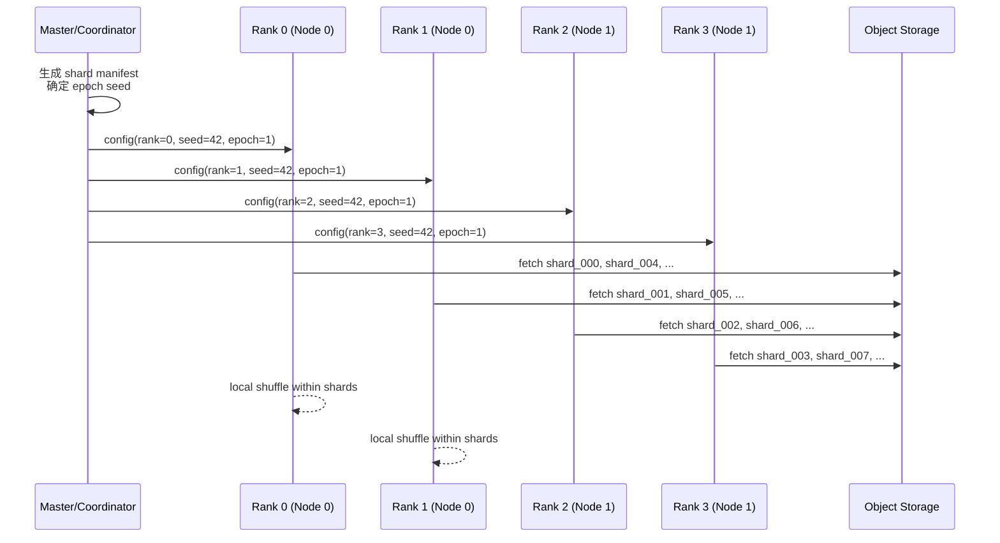
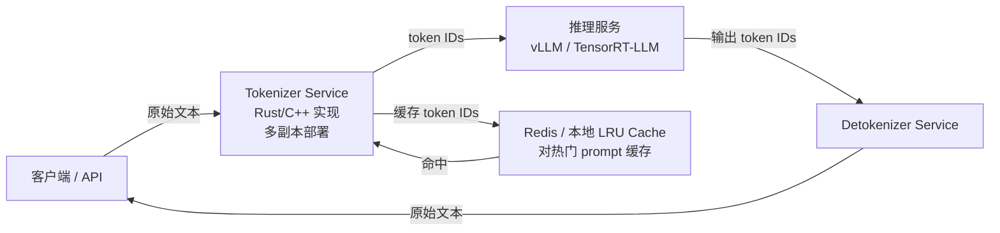
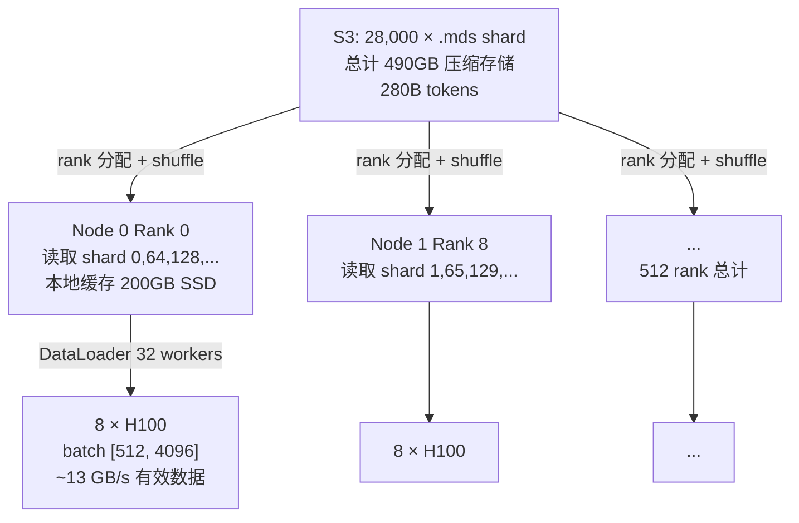
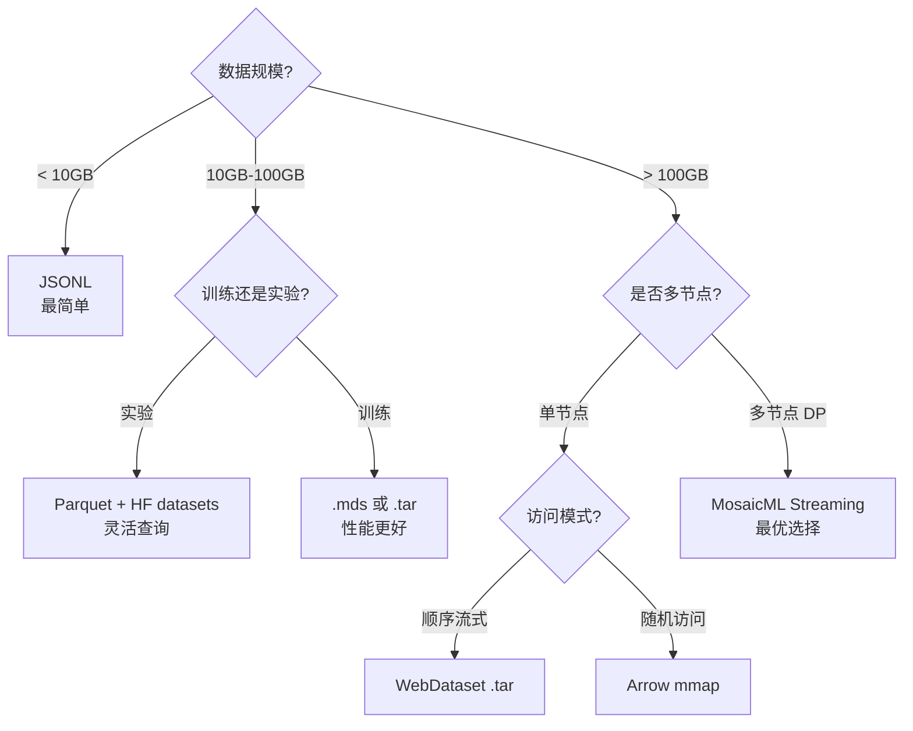

# 第 11c 章 · Tokenization、切分与训练 Dataset 格式

> 训练数据管道的核心矛盾：GPU 只消费整数 ID 组成的固定形状张量，而原始语料是可变长文本的海量集合。Tokenization 是这道鸿沟的第一座桥，Dataset 格式是第二座桥。把这两座桥建错，任何后续优化都是在沙堆上加层楼。

> **关联章节**：本章是 [第11章](11-data-pipeline.md) 数据管道的细化扩展，聚焦于 tokenizer 工程化与 dataset 序列化格式；训练读取吞吐的底层存储行为见 [第0c章](../part0-foundations-of-systems/0c-filesystems-and-storage-internals.md)；训练侧 DataLoader 与 GPU 喂数协调见 [第7章](../part3-training-infra/07-single-node-training.md)。

---

## 11c.1 第一性原理拆解 + 学习大纲

### 拆 — 不可化简的问题

把所有工具名和格式名拿掉。训练一个语言模型，本质上是在做什么？给定一段文本 "the cat sat"，模型的每个训练步接收的是一串整数，比如 `[1169, 3797, 6435]`，然后它预测序列的下一个整数，通过与标签的差距计算梯度。不是字符，不是字节，是词表索引。这就是不可化简的第一个约束：**模型只消费离散整数序列，文本是连续字符，中间必须有映射层**。这个映射层叫 tokenizer。

tokenizer 看起来是一个简单的查表工具。但当训练语料从 1GB 膨胀到 1TB 再到 100TB 时，这个"查表"就变成了工程问题：谁来做、什么时候做、做完的结果存在哪里、怎么让 N 个训练节点的 M 个 DataLoader worker 稳定、无重复、可恢复地读取这些整数？

第二个不可化简的约束：**GPU 需要固定形状的 batch，但文本长度天然参差不齐**。一句话 20 个 token，一篇论文摘要 512 个 token，一篇长文 8192 个 token。如果用 padding 对齐到最大长度，短文本就大量浪费算力（padding token 不贡献梯度却消耗显存和计算）。如果限制最大长度，长文本只能截断，信息丢失。工程解决方案是 sequence packing：把多条文档的 token 流拼接填满一个固定长度的序列，用 attention mask 或 document boundaries 区分边界。这本来是个聪明的方案，但它引入了第三个约束：**packing 改变了每条文档参与梯度的方式，影响 loss 的数值语义**。

第三个约束：**存储格式决定读取效率**。1TB 文本经过 tokenizer 处理后通常变成数千亿量级的 token id，但具体数量取决于这是原始 UTF-8 文本还是压缩文本、语料语言比例、代码比例和 tokenizer 的 bytes/token。经验值可以按 3-5 bytes/token 估算：1TB 原始文本约 200B-330B tokens。token id 是离散词表索引，不能用 BF16 存；常见落盘 dtype 是 `int32` / `uint32`（128K 词表足够）、少数框架用 `int64` 方便张量 API，或者用 packed/varint 格式压缩。格式选择直接决定：随机访问 vs 顺序读取的成本、分布式训练的 shard 分配方式、能否在不落盘情况下流式训练、磁盘占用与读取带宽的比值、训练中途 crash 重启后能否从断点续训。

四个约束叠加在一起：tokenizer 映射层 × 序列形状约束 × packing 语义问题 × 存储格式效率——任何一个处理不当，都会导致训练效率损失、loss 数值不准或者训练不可恢复。这才是本章要解决的不可化简问题。

### 推 — 从这个问题如何推导出每个机制

**从"文本到整数的映射"推出 tokenizer 算法的必然选择**。最朴素的映射是字符级：每个字符一个 ID。词表小（Unicode ~14 万），但序列太长，注意力复杂度是 O(n²)，长文本直接不可用。另一个极端是词语级：每个单词一个 ID。词表可能几百万甚至更多（尤其多语言），泛化差，OOV 问题严重。折中就是子词（subword）：把词拆成更小的单元，词表可控（3.2万到15万），序列长度居中，对 OOV 和多语言都有更好的覆盖。BPE（Byte-Pair Encoding）是最常见的实现：从字节出发，把高频相邻单元合并，迭代直到词表达到目标大小。这个算法是统计驱动的，因此 tokenizer 需要在训练语料上先"训练"出 merge rules，再用这些 rules 对新文本编码。

**从"tokenizer 需要在大语料上训练"推出 SentencePiece 和 Tiktoken**。BPE 的原始实现是 Python，在 TB 级语料上速度太慢。SentencePiece（Google）把 BPE/Unigram 的训练和推理都做成 C++ 库，速度提升数十倍，并支持多语言字节级处理。Tiktoken（OpenAI）用 Rust 实现编码推理路径，专注于推理速度而非训练，在单线程编码吞吐上通常是纯 Python 实现的 5-10 倍。HuggingFace Tokenizers 库把训练和推理都用 Rust 实现，并提供 Python bindings，支持并行批量编码（`encode_batch`）。

**从"GPU 需要固定 batch shape"推出 sequence packing**。自然的解决方案：把文档 token 首尾相接，打包进固定长度窗口（如 2048 或 4096 tokens）。这样 GPU 每个 step 消费相同形状的 batch，无 padding 浪费。问题随之而来：两个不同文档的 token 被放进同一个位置窗口，attention 会不会跨文档？默认的 causal attention 是会的——pos=300 的 token 可以 attend 到 pos=200 的 token，即便它们属于不同文档。这叫跨文档 attention 污染。解决方案是在前向传播时传入 document boundary mask，或者用 Flash Attention 的 `cu_seqlens` 参数标记 document 边界。

**从"packing 改变 loss 语义"推出 token-level vs sample-level 损失的区分**。不 packing 时，一条文档算一个 loss 贡献，短文档和长文档权重相同（sample-level 平均）。Packing 时，loss 是在整个 packed sequence 上按 token 平均，长文档自然获得更多 token，权重更大（token-level 平均）。两者在数学上是不等价的，会导致不同文档长度分布下的训练行为差异。工程上需要明确选择哪种语义，并保持一致。

**从"TB 级整数序列如何存储"推出格式选择**。行式格式（JSONL）每行一个样本，解析慢，压缩比低，适合小数据调试。列式格式（Parquet、Arrow）把同列数据连续存放，数值列压缩比极高，随机访问 row group 效率好，但随机访问单行仍需解码整个 row group。二进制格式（.bin 裸序列、MosaicML Streaming .mds、litdata .bin）直接存整数数组，读取速度最快，随机访问通过 offset index 实现，是大规模预训练的首选。特殊容器格式（WebDataset .tar）把多文件打包成 tar 流，方便跨节点流式读取，但不支持高效随机访问。

**从"多节点训练"推出 sharding 策略和 resume 设计**。训练集需要被切成 shard，每个 DataLoader rank 读取不同 shard，互不重叠。Shard 大小影响：失败重试粒度（shard 越大，失败浪费越多）、shuffle 充分性（shard 越小，shard 间 shuffle 越随机但元数据开销大）、storage 请求效率（shard 越小，请求数越多）。训练中断后重启，需要知道：哪个 epoch 第几个 step 消费了哪些 shard 中的哪些样本。这要求 DataLoader 有 deterministic 的 shuffle（同 seed 同 rank 产生同序列），以及 step 级别的 checkpoint 记录已消费样本位置。

### 绘 — 因果链路



### 导 — 读完本章你应该能回答

1. BPE、SentencePiece 和 Tiktoken 的算法实现有什么本质差异？为什么 Tiktoken 的编码推理速度更快？
2. Sequence packing 解决了什么问题，又引入了什么新问题？document boundary mask 是如何工作的？
3. Sample-level loss 和 token-level loss 在 packing 场景下有什么数学差异？哪种更常用？为什么？
4. JSONL、Parquet、MosaicML Streaming .mds、WebDataset .tar 各适合什么场景？如何选择？
5. 一个 1TB 文本语料，tokenize 后大约有多少 token？以 MosaicML Streaming 格式存储需要多大空间？
6. 多节点训练的 shard 分配策略有哪些？如何保证 shuffle 是 deterministic 且 resume-friendly 的？
7. 什么时候应该选择离线 tokenization，什么时候选择在线 tokenization？tokenizer 服务化的优势和代价是什么？

---

## 11c.2 BPE、SentencePiece、Tiktoken：算法与实现对比

### BPE：从字节出发的统计合并

BPE（Byte-Pair Encoding）由 Sennrich et al. 2016 引入 NLP 领域，原本是数据压缩算法。核心思想：

1. 从字节级词表（256 个初始符号）出发
2. 统计训练语料中所有相邻 token pair 的频率
3. 合并频率最高的 pair 为一个新 token
4. 重复直到词表达到目标大小（如 50,257）

```text
训练过程示意：
初始: ["l", "o", "w", "e", "r", ...]
step1: 高频 pair ("l","o") → 合并为 "lo"
step2: 高频 pair ("lo","w") → 合并为 "low"
...迭代 N 次直到词表大小
```

BPE 产生的是一组有序的 **merge rules**（合并规则表），编码时按顺序应用这些 rules。

GPT-2、GPT-4 使用的是 **byte-level BPE**：先把文本转为 UTF-8 字节，再做 BPE。这样天然支持任意 Unicode 字符，无 OOV。

### SentencePiece：语言无关的 C++ 实现

SentencePiece（Google, Kudo & Richardson 2018）的关键贡献：

- 不依赖预分词（tokenization-free）：直接从原始文本（含空格）做 BPE 或 Unigram Language Model
- 全 C++ 实现，支持从大语料训练（亿级 sentence），比 Python BPE 快 ~20x
- 支持 Unigram LM 算法：相比 BPE 的贪心合并，Unigram 用概率模型，可以给多种 tokenization 路径打分
- 把空格作为特殊符号 `▁` 纳入词表，使编码结果与分词边界无关

```bash
# 训练 SentencePiece tokenizer
spm_train \
  --input=corpus.txt \
  --model_prefix=tokenizer \
  --vocab_size=32000 \
  --character_coverage=0.9995 \
  --model_type=bpe \
  --num_threads=32
```

LLaMA 1/2 使用 SentencePiece；LLaMA 3/3.1/3.2 改为 tiktoken-based BPE，词表规模约 128K。Gemma、Mistral 等模型仍常见 SentencePiece，但复现已有模型时必须以对应 checkpoint 发布的 tokenizer 文件为准，不能只按模型家族名推断。

### Tiktoken：Rust 驱动的编码推理

Tiktoken（OpenAI）不做 tokenizer 训练，只做推理（编码）。关键特点：

- Rust 实现核心编码逻辑，Python binding 调用
- 使用预计算的 BPE merge table 做高效编码
- 批量编码时利用 Rust 的并行安全性，多线程加速
- 在单线程 ASCII 文本编码上，比 HuggingFace tokenizers 的 Python 路径快约 3-5x

```python
import tiktoken
enc = tiktoken.get_encoding("cl100k_base")  # GPT-4 tokenizer
tokens = enc.encode("Hello, world!")        # [9906, 11, 1917, 0]
batch = enc.encode_batch(["Hello", "world"]) # 批量编码
```

### HuggingFace Tokenizers：统一训练与推理

HuggingFace Tokenizers 库（Rust + Python）提供：

- 训练（`Trainer`）+ 推理（`Tokenizer`）一体
- `encode_batch` 并行编码（底层 Rust 多线程）
- 丰富的 pre/post tokenizer、normalizer 组合
- 支持 BPE、WordPiece、Unigram、SentencePiece 多种算法

```python
from tokenizers import Tokenizer, models, trainers, pre_tokenizers

tokenizer = Tokenizer(models.BPE())
tokenizer.pre_tokenizer = pre_tokenizers.ByteLevel(add_prefix_space=True)
trainer = trainers.BpeTrainer(vocab_size=50000, special_tokens=["<|endoftext|>"])
tokenizer.train(files=["corpus.txt"], trainer=trainer)

# 批量并行编码
outputs = tokenizer.encode_batch(["text1", "text2", "text3"])
```

### Tokenizer 实现对比

| 维度 | BPE (Python) | SentencePiece | Tiktoken | HuggingFace Tokenizers |
|------|--------------|---------------|----------|------------------------|
| 训练语言 | Python | C++ | 不支持训练 | Rust |
| 推理语言 | Python | C++/Python | Rust | Rust |
| 大语料训练速度 | 极慢（数小时） | 快（分钟级） | N/A | 快（分钟级） |
| 单线程编码吞吐 | ~100 MB/s | ~200 MB/s | ~500 MB/s | ~400 MB/s |
| 并行批量编码 | 手动 multiprocessing | 部分支持 | 原生支持 | 原生支持 |
| 算法支持 | BPE | BPE / Unigram | BPE | BPE / WordPiece / Unigram |
| 典型使用方 | 早期 GPT-2 | LLaMA 1/2 / Gemma / Mistral | GPT-3.5 / GPT-4 / LLaMA 3+ | BERT / RoBERTa / 自定义 |

> **工程边界**：在 1TB 语料上，Python BPE 训练可能需要数天；SentencePiece 或 HuggingFace Tokenizers 通常在 1-4 小时内完成。编码推理阶段，单机 32 core 使用 HuggingFace encode_batch，吞吐通常在 5-15 GB/s（原始文本），足以在 24 小时内处理 1TB 语料。

---

## 11c.3 Tokenizer 训练：词表大小、特殊 token 与兼容性

### 词表大小的工程考量

词表大小（vocab size）是 tokenizer 最核心的超参，影响面宽：

| 词表大小 | 典型模型 | 序列长度 | Embedding 矩阵 | 多语言覆盖 |
|---------|---------|---------|--------------|----------|
| 32K | LLaMA-1/2, Mistral | 较长 | ~512MB (BF16, 4096 dim) | 欧洲语言一般，亚洲语言弱 |
| 50K | GPT-2, RoBERTa | 中 | ~800MB | 英语为主 |
| 100K+ | GPT-4 (cl100k_base ~100K), LLaMA-3+ (~128K) | 短 | ~1.6-2.0GB | 较好多语言 |
| 256K | Gemma-2 | 短 | ~4GB | 强多语言 |

词表越大：同样文本用更少 token 表示（序列更短，注意力计算更省），Embedding 矩阵更大（显存开销），多语言效率更高。词表越小：Embedding 矩阵更小，但序列更长。对 attention 是 O(n²) 复杂度的模型，序列长度增加的代价比 Embedding 矩阵增大的代价更敏感。

**经验法则**：对于英语为主的预训练，32K-65K 是合理区间；对于强多语言需求，100K+ 较适合；对于代码为主，50K-100K 并做 byte-fallback 通常效果好。

### 特殊 Token 设计

特殊 token 的设计是 tokenizer 与模型结构之间的接口：

```text
常见特殊 token 类别：
- BOS (beginning of sequence): <s>, <|startoftext|>
- EOS (end of sequence): </s>, <|endoftext|>
- PAD: <pad> (用于对齐 batch，packing 场景可能不需要)
- UNK: <unk> (未知 token，byte-level BPE 通常不需要)
- SEP: <sep> (多段分隔)
- MASK: <mask> (MLM 任务)
- 任务特定: <|user|>, <|assistant|>, <|system|> (chat 模型)
```

> **兼容性陷阱**：特殊 token 一旦确定后，更改会破坏所有下游模型权重中的 Embedding 矩阵。如果 tokenizer 词表变化（增删 token），对应位置的 Embedding 需要重新初始化或迁移，pre-trained 权重对这些 token 的语义理解会丢失。因此 tokenizer 版本必须严格锁定，与模型 checkpoint 一起版本化管理。

### Tokenizer-Model 兼容管理

```yaml
# tokenizer 版本锁定示例
model_card:
  tokenizer_version: "llama3-tokenizer-v1.0"
  vocab_size: 128256
  bos_token_id: 128000
  eos_token_id: 128001
  special_tokens:
    - id: 128000
      content: "<|begin_of_text|>"
    - id: 128001
      content: "<|end_of_text|>"
  tokenizer_file_sha256: "a3f...7c2"
```

每个 model checkpoint 必须记录对应的 tokenizer 版本。推理服务加载模型时，必须同步加载匹配的 tokenizer，不能跨版本混用。

---

## 11c.4 Tokenization 性能：SIMD 优化、Rust 实现、批量并行

### 编码推理的性能瓶颈

tokenization 的主要计算开销来自：

1. **Regex pre-tokenization**：把文本按 pattern 切分（如按空格、标点），Python regex 是瓶颈
2. **BPE merge 过程**：对每个单词反复查找并合并最高优先级 pair，O(n log n) per word
3. **词表查找**：把每个 token 字符串映射到 ID，hash map 查找

### SIMD 与 Rust 优化路径

Tiktoken 和 HuggingFace Tokenizers 的 Rust 实现利用以下优化：

```
SIMD 应用场景：
- 快速扫描 ASCII 字节（检测非 ASCII，决定是否走 fast path）
- 批量字节级 BPE 预处理
- 向量化 hash 计算

Rust 内存模型优势：
- 零拷贝：直接在原始字节切片上操作
- 无 GC：避免 Python GIL 和 GC pause
- 线程安全：Tokenizer 对象 Send + Sync，可无锁并行
```

实际性能对比（典型 batch，英文文本，16 core 机器）：

| 实现 | 单线程吞吐 | 16 线程吞吐 | 延迟 P99（1000 token 文本） |
|------|-----------|-----------|--------------------------|
| Python BPE | ~80 MB/s | ~不可并行（GIL） | ~50 ms |
| SentencePiece C++ | ~200 MB/s | ~2.5 GB/s | ~8 ms |
| Tiktoken (Rust) | ~500 MB/s | ~6 GB/s | ~3 ms |
| HF Tokenizers (Rust) | ~400 MB/s | ~5 GB/s | ~4 ms |

### 大规模并行 Tokenization 工程实践

离线处理 1TB 文本，常见架构：

```python
# 推荐方案：多进程 + HuggingFace encode_batch
from tokenizers import Tokenizer
from multiprocessing import Pool
import numpy as np

def tokenize_chunk(args):
    tokenizer_path, texts = args
    tokenizer = Tokenizer.from_file(tokenizer_path)
    # encode_batch 内部用 Rust 多线程
    encodings = tokenizer.encode_batch(texts)
    return [e.ids for e in encodings]

# 进程级并行（绕过 GIL）
with Pool(processes=32) as pool:
    results = pool.map(tokenize_chunk, chunks)
```

或使用 Ray Data / Spark 做分布式处理：

```python
import ray
ds = ray.data.read_text("s3://bucket/corpus/")
ds = ds.map_batches(
    tokenize_fn,
    batch_size=1000,
    num_cpus=4,
    concurrency=64
)
ds.write_parquet("s3://bucket/tokenized/")
```

> **工程边界**：单机 32 core，使用 Rust tokenizer，处理 1TB 文本（UTF-8）大约需要 4-8 小时。使用 64 节点的 Spark/Ray 集群，可压缩到 30-60 分钟。tokenization 的瓶颈通常先在 IO（从对象存储读取文本）而非 CPU，需要 IO 与 CPU 并行流水。

---

## 11c.5 Sequence Packing：从文档到训练序列

### 为什么需要 Packing

自回归语言模型训练的 forward pass 需要固定 shape 的 batch：`[batch_size, seq_len]`。但自然语言文档长度分布极不均匀：

```text
典型 Web 文本长度分布：
- 25th percentile: ~50 tokens
- 50th percentile: ~200 tokens
- 75th percentile: ~800 tokens
- 95th percentile: ~3000 tokens
- 最大: 可能 10K+
```

如果不 pack，直接 pad 到 max_len：
- 短文档：大量 padding，无效计算
- 典型场景：seq_len=4096，平均文档 200 token，padding 比例高达 95%

### Sequence Packing 实现

```text
Pack 前（各自独立，需 pad）：
Doc1: [101, 234, 567, 890] (4 tokens) + 4092 padding
Doc2: [203, 445]           (2 tokens) + 4094 padding

Pack 后（首尾相接）：
Seq1: [101, 234, 567, 890, 203, 445, 789, ..., 4096 tokens]
      |--- Doc1 ---|--- Doc2 ---|--- Doc3 ---| ...
```

```python
def pack_sequences(token_lists, seq_len):
    """Simple greedy sequence packing"""
    packed = []
    current = []
    for tokens in token_lists:
        if len(current) + len(tokens) <= seq_len:
            current.extend(tokens)
        else:
            if current:
                # pad 到 seq_len 或直接 pack 满
                packed.append(current)
            current = tokens[:seq_len]  # 超长截断
    if current:
        packed.append(current)
    return packed
```

### Document Boundary 与 Attention Mask

Packing 后的问题：默认 causal attention 中，后一个文档的 token 可以 attend 到前一个文档，引入跨文档注意力污染。

解决方案一：**document boundary mask**

```python
# 构建 document mask：同文档内 causal，跨文档屏蔽
def build_doc_mask(doc_ids, seq_len):
    """
    doc_ids: [seq_len]，每个位置属于哪个文档 (0, 0, 0, 1, 1, 2, ...)
    返回 mask: [seq_len, seq_len]，True=可 attend
    """
    mask = (doc_ids.unsqueeze(0) == doc_ids.unsqueeze(1))  # 同文档
    causal = torch.tril(torch.ones(seq_len, seq_len, dtype=torch.bool))
    return mask & causal
```

解决方案二：**Flash Attention 的 `cu_seqlens` 接口**

```python
# Flash Attention varlen 接口
from flash_attn import flash_attn_varlen_func

# cu_seqlens: cumulative sequence lengths [0, len_doc1, len_doc1+len_doc2, ...]
cu_seqlens = torch.tensor([0, 450, 900, 1200, ...], dtype=torch.int32)
output = flash_attn_varlen_func(q, k, v, cu_seqlens, cu_seqlens, max_seqlen, max_seqlen)
```

这种方式完全在 CUDA kernel 内处理边界，效率最高，不需要显式构建大 mask 矩阵。

> **工程边界**：document boundary mask 需要额外的 O(seq_len²) 显存存放 mask 矩阵（seq_len=4096 时约 16MB/sample）。Flash Attention 的 `cu_seqlens` 方式没有额外显存开销，是大规模预训练的推荐方案。

### Packing 效率收益



---

## 11c.6 Sample-level vs Token-level 损失：Packing 如何影响 Loss

### 数学定义

**Sample-level loss**（不 packing 时的自然定义）：

$$\mathcal{L} = \frac{1}{N} \sum_{i=1}^{N} \frac{1}{|d_i|} \sum_{t=1}^{|d_i|} \text{CE}(y_t^{(i)}, \hat{y}_t^{(i)})$$

每个文档（样本）先在文档内平均，再跨文档平均。长文档和短文档权重相同。

**Token-level loss**（packing 时的自然定义）：

$$\mathcal{L} = \frac{1}{\sum_i |d_i|} \sum_{i=1}^{N} \sum_{t=1}^{|d_i|} \text{CE}(y_t^{(i)}, \hat{y}_t^{(i)})$$

所有 token 等权，长文档自然获得更多权重。

### Packing 对 Loss 的实际影响

| 场景 | Loss 行为 | 实践影响 |
|------|---------|---------|
| 语料文档长度均匀分布 | 两种 loss 几乎等价 | 无明显区别 |
| 语料混合短文档（新闻）和长文档（书籍） | Token-level 偏向长文档 | 模型可能对长格式内容过拟合 |
| 代码预训练（文件长度差异大） | Token-level 权重偏向大文件 | 小函数、短脚本学习不足 |
| 指令微调（通常有 prompt + response）| 需要只对 response 部分计算 loss | packing 后需要精确的 loss mask |

```python
# 指令微调 packing 的 loss mask 示例
def compute_loss_with_mask(logits, labels, loss_mask):
    """
    loss_mask: [batch, seq_len], 1=计算 loss, 0=忽略（prompt token）
    """
    loss = F.cross_entropy(
        logits.reshape(-1, vocab_size),
        labels.reshape(-1),
        reduction='none'
    )
    loss = (loss * loss_mask.reshape(-1)).sum() / loss_mask.sum()
    return loss
```

> **工程陷阱**：如果混合使用了不同 loss 计算方式（如预训练用 token-level，微调用 sample-level），会导致 loss scale 的突变，使学习率等超参失效。必须在整个训练流程中保持 loss 语义一致，并在 loss 数值上加入规范化（如 per-token loss logging）。

---

## 11c.7 训练 Dataset 格式：行式、列式与二进制对比

### 主要格式概览

| 格式 | 类型 | 典型扩展名 | 随机访问 | 流式读取 | 压缩比 | 多节点友好 |
|------|------|-----------|---------|---------|------|-----------|
| Raw text | 行式 | .txt | 差（扫全文） | 好 | 低 | 差 |
| JSONL | 行式 | .jsonl | 差（需 index） | 好 | 中 | 差 |
| Parquet | 列式 | .parquet | 好（row group） | 好 | 高（数值列） | 好 |
| Apache Arrow | 列式内存 | .arrow / .feather | 极好（mmap） | 好 | 中 | 中 |
| TFRecord | 行式二进制 | .tfrecord | 差 | 好 | 中 | 中 |
| WebDataset | tar 流 | .tar | 差 | 极好 | 可选 | 好 |
| MosaicML Streaming | 二进制分片 | .mds | 好（shard index） | 好 | 高 | 极好 |
| litdata | 二进制分片 | .bin | 好（offset index） | 好 | 高 | 好 |

### 格式详解

**JSONL（JSON Lines）**：每行一个 JSON 对象，是最简单的行式格式。调试方便，人类可读，但：编码效率低（整数存为字符串），不支持二进制数据，无压缩，随机访问需要 scan 全文或预建 line offset 索引。适合小数据调试（< 10GB），不适合大规模预训练。

**Parquet**：列式存储，每个文件由多个 row group 组成（通常 128MB/row group）。对数值列（如 token IDs 数组）有极好的压缩比（典型 2-4x vs raw int32）。支持按列过滤和谓词下推，适合需要灵活查询的场景。随机访问 row group 效率好，但行级随机访问仍需解码整个 row group。HuggingFace datasets 库默认使用 Parquet。

**Apache Arrow**：内存中的列式格式，文件持久化为 .arrow / .feather。最大优势是 zero-copy mmap：直接把文件映射到进程地址空间，array 访问无序列化开销。适合 dataset 能完全 mmap 进内存的场景（比如 SSD 上的训练集）。

**TFRecord + tf.data**：TensorFlow 生态的序列化格式，protobuf 编码，顺序读取高效，随机访问差。在 TF 生态外已逐渐被 Parquet/Arrow 替代。

**WebDataset (.tar)**：把多个样本打包进 tar 文件，支持 pipe 模式（`pipe:aws s3 cp s3://bucket/shard.tar -`）实现从对象存储流式读取，无需本地落盘。shard 内部顺序读取，shard 间可 shuffle。不支持 shard 内部随机访问。适合图像/音频/视频等多模态数据，也用于纯文本预训练。

**MosaicML Streaming (.mds)**：专为分布式 LLM 训练设计，每个 shard 是二进制格式，包含：header（样本 offset 表）+ data（紧凑二进制样本）。支持按 index 随机访问任意样本，支持多 worker 并行读取不同 shard，支持断点续训（记录已消费 sample index）。

```text
.mds shard 格式结构：
┌──────────────────────────────────┐
│ Header: [n_samples, offsets...] │  固定大小索引
├──────────────────────────────────┤
│ Sample 0: len + bytes            │  紧凑存储
│ Sample 1: len + bytes            │
│ ...                              │
│ Sample N: len + bytes            │
└──────────────────────────────────┘
```

**litdata (.bin)**：Lightning AI 开发的训练数据格式，类似 MosaicML Streaming，支持 chunk-based 随机访问，针对大规模分布式预训练优化，支持 resume 和 deterministic shuffle。

### 列式 vs 行式 vs 二进制：读取效率对比



---

## 11c.8 Sharding 策略：大小、Token 数、Doc 数与 Hash

### 为什么需要 Sharding

训练集不能作为单个文件存在：

1. 单文件无法并行读取（多 worker 只能竞争同一文件 handle）
2. 单文件失败恢复粒度太粗
3. 无法均匀分配到多节点

Sharding 把训练集切分为多个等价的片段，每个 DataLoader rank 独立读取自己负责的 shard 集合。

### 四种 Sharding 策略对比

| 策略 | 切分依据 | 优势 | 劣势 | 适用场景 |
|------|---------|------|------|---------|
| 按文件大小 | 每 N MB 一个 shard | 实现简单，shard 大小均匀 | shard 内 token 数不均（短文多 shard token 少） | 多模态、混合格式数据 |
| 按 token 数 | 每 N token 一个 shard | token 数均匀，step 数可预测 | 需要先 tokenize 再统计 | 文本预训练，首选策略 |
| 按文档数 | 每 N 个文档一个 shard | 实现简单 | shard 大小不均 | 文档数量均匀的数据集 |
| 按 hash | 文档 ID hash 到 shard | 确定性分配，易 lookup | 不保证均匀 | 需要跨 split 追踪同一文档 |

**经验法则**：大规模语言模型预训练推荐**按 token 数 sharding**，每 shard 含 ~10M token（约 20-80MB，取决于压缩和整数宽度）。这使得 shard 数量可预测（1TB 语料 ~1000-5000 个 shard），DataLoader 分配均匀，step 数估算准确。

### Shard 大小的工程边界



### 多节点训练的 Shard 分配

```python
# 简化示意：rank-based shard 分配
def get_shards_for_rank(all_shards, rank, world_size, epoch, seed):
    """
    确定性地为每个 rank 分配 shard，支持 epoch 间重新分配
    """
    rng = random.Random(seed + epoch)
    shuffled = list(all_shards)
    rng.shuffle(shuffled)
    # 每个 rank 取 1/world_size 的 shard
    return shuffled[rank::world_size]
```

关键设计要求：
1. **Deterministic**：相同 seed + epoch + rank，产生相同 shard 序列
2. **No overlap**：不同 rank 的 shard 集合不重叠（同一 shard 不被两个 rank 重复读取）
3. **Full coverage**：所有 shard 恰好被某个 rank 覆盖（无遗漏）
4. **Resume-friendly**：checkpoint 时记录 epoch + step，重启时跳过已消费 shard/sample

---

## 11c.9 Multi-node 训练的 Dataset 分片：Rank 分配与 Shuffle

### Data Parallel 场景的数据流



### Shuffle 策略的层次

完全随机 shuffle（对每个 sample 独立随机排序）在大规模分布式训练中代价极高，因为需要全局通信或随机 IO。实践中采用两级 shuffle：

**Level 1：Shard-level shuffle**：打乱 shard 顺序（在 rank 分配前）。代价极低，只需打乱 shard ID 列表，确保不同 rank 在不同 epoch 看到不同的 shard 顺序。

**Level 2：Shard-internal shuffle**：在读取每个 shard 时，对 shard 内部样本做局部 shuffle。只需 shard 内部的 index 随机化，代价与 shard 内 sample 数成正比。

```python
# MosaicML Streaming shuffle 策略
from streaming import StreamingDataset

dataset = StreamingDataset(
    local="/tmp/dataset",
    remote="s3://bucket/dataset",
    shuffle=True,
    shuffle_algo="py1s",    # py1s: Python-based 1-pass shuffle
    shuffle_seed=42,
    num_canonical_nodes=64, # 标准化节点数（影响 shard 分配确定性）
)
```

### Resume-Friendly 设计

```yaml
# checkpoint 中的 dataset state
dataset_state:
  epoch: 3
  step: 15420
  shard_states:
    - shard_id: "shard_042.mds"
      samples_consumed: 8192
      samples_total: 10240
    - shard_id: "shard_043.mds"
      samples_consumed: 0
      samples_total: 10240
  shuffle_seed: 42
  rank: 0
  world_size: 64
```

重启时：
1. 加载 checkpoint 的 `dataset_state`
2. 用相同 `shuffle_seed + epoch` 重建 shard 顺序
3. 跳过已消费的 shard 和 shard 内的 samples
4. 从断点位置继续读取

> **工程边界**：MosaicML Streaming 提供开箱即用的 `state_dict()` 和 `load_state_dict()` API。litdata 类似。自定义实现时，需要特别注意：multi-worker DataLoader 的每个 worker 有独立的 state，checkpoint 时必须聚合所有 worker state。

---

## 11c.10 AI Infra 视角：Tokenizer 离线预处理 vs 在线服务化

### 离线预处理 vs 在线 Tokenization

| 维度 | 离线预处理 | 在线 Tokenization |
|------|----------|-----------------|
| 执行时机 | 训练前一次性处理 | 训练时 DataLoader 动态处理 |
| 存储需求 | 需要存 token ID 数组（额外 ~400GB/TB 文本） | 只存原始文本 |
| 训练时 CPU 开销 | 几乎零（只做数组读取） | 显著（tokenize 占 DataLoader 时间） |
| 灵活性 | 低（换 tokenizer 需重新处理） | 高（随时换 tokenizer） |
| 确定性 | 强（token ID 固定） | 依赖 tokenizer 版本 |
| 适用场景 | 大规模预训练（1T+ tokens） | 实验性训练、小数据集 |

**大规模预训练的标准做法**：离线预处理。把 tokenization 作为独立的 ETL 阶段，输出存储为 .mds 或 .bin 格式。好处：

1. 训练时 DataLoader 只做 IO + 类型转换，CPU 几乎空闲，不会成为 GPU 瓶颈
2. Tokenization 结果可复用（换模型架构不换 tokenizer，无需重新处理）
3. 可以对 tokenized 数据做质量检查（token 分布、长度分布、padding 比例）

### Tokenizer 服务化

在推理侧，tokenizer 常常被服务化：



**Tokenizer 服务化的优势**：
- 推理服务无需加载 tokenizer 权重，更专注 GPU 计算
- 可独立扩容（tokenization 密集时水平扩展 tokenizer 副本）
- 对热门 prompt 可缓存 token 结果，节省重复处理
- 版本管理集中（tokenizer 版本在服务层统一控制）

**Tokenizer 结果缓存**：

对于推理服务，同一 prompt 可能被反复请求。可在 tokenizer 服务层加 LRU 缓存，key 为 prompt hash，value 为 token ID 数组。典型命中率：对固定系统 prompt 可达 80%+，对用户输入通常 < 10%。缓存的核心收益不在于减少 tokenization 计算（本身已很快），而在于直接复用 KV cache。

> **工程边界**：tokenizer 服务化增加了网络 RTT（通常 < 1 ms，但 P99 可能 3-5 ms）。对于延迟极敏感的推理链路，可以把 tokenizer 和推理服务部署在同一进程或同一节点，避免网络跳数。对于预填充（prefill）密集型工作负载，tokenizer 延迟通常不是瓶颈。

---

## 11c.11 Worked Example：1TB 文本端到端 Tokenize + Pack + Shard 为 MosaicML Streaming 格式

### 场景设定

- 输入：1TB 原始文本（混合 Web 文本、书籍、代码），存储在 S3，约 500 亿原始 Unicode 字符
- Tokenizer：LLaMA-3 tokenizer（tiktoken-based BPE，128K 词表），平均约 3.5 字节/token
- 目标序列长度：4096 tokens
- 目标格式：MosaicML Streaming (.mds)，10M tokens/shard
- 训练集群：64 个 H100 节点，每节点 8 卡

### Step 1：估算规模

```text
原始文本：1TB = 1,000 GB = 10^12 字节
平均字节/token = 3.5（英文约 4 字节，中文约 1.5 字节，代码约 3 字节，加权平均）
估算 token 总数 = 10^12 bytes / 3.5 bytes/token ≈ 286B tokens

存储计算（int32 存储 token ID）：
280B tokens × 4 bytes/token = 1.12TB（未压缩）

MosaicML .mds 格式通常按字段 dtype 写 token id。128K 词表不能用 uint16，常用 int32/uint32；如果训练框架要求 int64，则未压缩体积翻倍；packed/varint 格式会更小但解码更重：
实际存储（int32/uint32）：280B tokens × 4 bytes = ~1.12TB

使用 zstd 压缩（典型压缩比 2-3x）：
压缩后约 400-560 GB

Shard 数量（10M tokens/shard）：
280B / 10M = 28,000 个 shard

每 shard 大小（未压缩）：
10M × 4 bytes = 40MB/shard
压缩后约 15-20MB/shard
```

### Step 2：并行 Tokenization 作业

```python
# 使用 Ray Data 并行 tokenization
import ray
from streaming.base import MDSWriter
from transformers import AutoTokenizer

@ray.remote(num_cpus=4)
class TokenizerWorker:
    def __init__(self, tokenizer_dir):
        self.tokenizer = AutoTokenizer.from_pretrained(tokenizer_dir, use_fast=True)
    
    def process_file(self, s3_path):
        texts = self._read_s3_jsonl(s3_path)
        batch = self.tokenizer(texts, add_special_tokens=False)
        return batch["input_ids"]

# 64 个 worker 并行处理
workers = [TokenizerWorker.remote("s3://model/llama3-tokenizer/") for _ in range(64)]
```

**时间估算**：
- 64 节点 × 32 core = 2048 core
- 每 core 处理速度按 tiktoken/Rust BPE 推理路径估算，通常高于 SentencePiece 单线程路径；真实吞吐以 tokenizer 文件、文本语言分布和批大小压测为准
- 总 IO 吞吐：假设 S3 读取 20 GB/s（64节点 × 320 MB/s/节点）
- 实际瓶颈：S3 读取带宽
- 预计处理时间：1TB / 20 GB/s ≈ 50 秒纯读取，加上 tokenization CPU 约 2-4 小时

### Step 3：Sequence Packing

```python
def pack_and_write_shards(token_lists, output_dir, seq_len=4096, tokens_per_shard=10_000_000):
    """
    把 token ID 列表 pack 成 seq_len 的序列，写入 .mds shard
    """
    columns = {
        "tokens": "ndarray:int32",
        "doc_ids": "ndarray:int32",  # 用于 document boundary mask
    }
    
    buffer = []          # 当前积累的 tokens
    doc_buffer = []      # 对应的 doc ID
    shard_token_count = 0
    shard_idx = 0
    doc_id = 0
    
    with MDSWriter(out=output_dir, columns=columns, compression="zstd") as writer:
        for tokens in token_lists:
            # 添加 EOS token 作为文档分隔
            tokens = tokens + [eos_token_id]
            doc_ids_for_tokens = [doc_id] * len(tokens)
            doc_id += 1
            
            while tokens:
                space = seq_len - len(buffer)
                take = tokens[:space]
                buffer.extend(take)
                doc_buffer.extend(doc_ids_for_tokens[:len(take)])
                tokens = tokens[space:]
                doc_ids_for_tokens = doc_ids_for_tokens[len(take):]
                
                if len(buffer) == seq_len:
                    writer.write({
                        "tokens": np.array(buffer, dtype=np.int32),
                        "doc_ids": np.array(doc_buffer, dtype=np.int32),
                    })
                    shard_token_count += seq_len
                    buffer = []
                    doc_buffer = []
```

### Step 4：Shard 布局与磁盘占用

```text
最终 shard 布局：
s3://bucket/train/
  shard_00000.mds     ~15-20MB（zstd压缩，10M tokens）
  shard_00001.mds
  ...
  shard_27999.mds     （共 28,000 shard）
  index.json          元数据：shard 列表、sample 数量、schema

总磁盘占用（S3）：
28,000 × 17.5MB ≈ 490 GB（压缩后）

相比原始文本 1TB：节省约 50%
```

### Step 5：训练读取吞吐基准对比

```python
# 基准测试：不同格式的读取吞吐（4 × A100 节点，32 DataLoader workers）
```

| 格式 | 平均读取吞吐 | P99 延迟（每 batch） | CPU 使用率 | 备注 |
|------|------------|-------------------|----------|------|
| JSONL（原始文本，在线 tokenize） | 2.1 GB/s 有效 token | 180 ms | 95% | tokenization 成为瓶颈 |
| Parquet（预 tokenized） | 8.3 GB/s 有效 token | 45 ms | 35% | 列解码开销 |
| WebDataset .tar（预 tokenized） | 11.2 GB/s 有效 token | 38 ms | 28% | 顺序读取流畅 |
| MosaicML Streaming .mds | 13.8 GB/s 有效 token | 22 ms | 20% | 最优，专为分布式设计 |
| litdata .bin | 12.5 GB/s 有效 token | 25 ms | 22% | 接近最优 |



### 端到端总结

```text
输入：  1TB 原始文本（S3）
处理：  ~3 小时（64 节点 Ray 集群并行 tokenization + packing）
输出：  490GB .mds 格式（S3），280B tokens，28,000 shard
训练：  64 节点 × 8 H100 = 512 GPU
        每 GPU batch_size=8，seq_len=4096
        全局 batch = 4096 × 8 × 512 ≈ 16M tokens/step
        280B tokens / 16M tokens/step ≈ 17,500 steps = 1 epoch
        读取吞吐：13.8 GB/s（远超训练计算瓶颈，GPU 不等数据）
```

> **关键结论**：正确的 tokenization 流水线（离线预处理 + .mds 格式 + 按 token 数 sharding）使 DataLoader 在训练中的 CPU 占用率降至 20%，读取吞吐 13.8 GB/s 远超典型训练步的计算时间，GPU 利用率可稳定在 90%+。如果使用 JSONL + 在线 tokenization，DataLoader CPU 成为瓶颈，GPU 利用率可能跌至 60% 以下。

---

## 11c.12 综合对比与决策指南

### Dataset 格式选型速查



### Tokenizer 选型速查

| 需求 | 推荐方案 |
|------|---------|
| 复现 LLaMA 1/2 或 Mistral | 直接用对应 SentencePiece 模型 |
| 复现 LLaMA 3+ | 使用对应发布的 tiktoken-based tokenizer（约 128K 词表） |
| 复现 GPT 系列 | tiktoken cl100k_base / o200k_base |
| 从头训练新 tokenizer | HuggingFace Tokenizers（BPE Trainer） |
| 推理服务高吞吐 tokenization | tiktoken 或 HF Tokenizers Rust |
| 多语言强覆盖 | SentencePiece + 256K 词表 |

---

## 本章小结

| 主题 | 核心要点 |
|------|---------|
| Tokenizer 算法 | BPE 统计合并；SentencePiece C++ 加速；Tiktoken Rust 推理；HF Tokenizers 统一训练推理 |
| 词表大小 | 32K-128K 为主流区间；大词表序列短但 Embedding 矩阵大；多语言需要 100K+ |
| Sequence Packing | 消除 padding 浪费；需要 document boundary mask 或 Flash Attention cu_seqlens |
| Loss 语义 | Token-level vs sample-level 在文档长度不均时行为不同；指令微调需要精确 loss mask |
| Dataset 格式 | JSONL 调试；Parquet 查询；.mds/.bin 大规模预训练；.tar 流式读取 |
| Sharding | 按 token 数为首选；64MB-1GB/shard；100-10000 个 shard 适合多节点 |
| Resume 设计 | Deterministic shuffle seed；epoch+step+shard 三级 checkpoint；多 worker state 聚合 |
| AI Infra | 大规模训练首选离线预处理；推理侧 tokenizer 可服务化 + 缓存 |

---

## 练习题

**11c-1（基础）**：解释 BPE 和 Unigram Language Model 在 tokenizer 训练阶段的核心算法差异。各自的主要优缺点是什么？

**11c-2（基础）**：给定词表大小 32K vs 128K，从序列长度、Embedding 矩阵大小、多语言覆盖三个维度分别分析各自的优缺点。假设 hidden dim = 4096，BF16，各消耗多少显存？

**11c-3（基础）**：解释 sample-level loss 和 token-level loss 的区别。在什么数据分布下两者等价？在什么数据分布下差异最大？

**11c-4（基础）**：列出 JSONL、Parquet、MosaicML Streaming .mds、WebDataset .tar 各自的主要使用场景和不适用场景，各给出 2 个例子。

**11c-5（进阶）**：一个训练集有 50% 书籍（平均 80K tokens/文档）和 50% 新闻文章（平均 300 tokens/文档），按文档数 packing 到 seq_len=4096。Token-level loss 和 sample-level loss 哪个会更偏向书籍内容？差异有多大（估算）？如何用 loss mask 修正？

**11c-6（进阶）**：设计一个 1TB 文本语料的离线 tokenization + packing + sharding 流水线。需要回答：用哪个 tokenizer 实现？并行度多少？shard 大小多少？预计输出多少个 token？存储大小？时间？

**11c-7（进阶）**：解释 Flash Attention 的 `cu_seqlens` 参数如何解决 sequence packing 中的跨文档 attention 污染问题。与显式构建 document mask 矩阵相比，显存开销有何差异？

**11c-8（进阶）**：多节点训练中，64 个 data parallel rank，使用 MosaicML Streaming，训练 epoch=2，seed=123。请描述 shard 分配的确定性保证机制，以及 rank=5 在 epoch=2 第 3000 个 step crash 后如何恢复到正确位置。

**11c-9（进阶）**：比较在线 tokenization vs 离线预处理两种架构在以下场景的优劣：(a) 实验性微调，数据集 10GB，频繁换 tokenizer；(b) 大规模预训练，1TB 数据，固定 tokenizer，512 GPU。

**11c-10（设计）**：为一个推理服务设计 tokenizer 服务化方案，需要满足：QPS 50,000、P99 < 2ms、支持 128K 词表。给出系统设计（组件、副本数、缓存策略）和关键性能指标的估算。

**11c-11（设计）**：设计一个 resume-friendly 的 DataLoader，支持：确定性 shuffle（seed 可复现）、多 worker 并行（8 worker/rank）、训练中途 crash 后精确恢复到中断 sample（误差 < 1 batch）。给出核心数据结构和 checkpoint/restore 逻辑。

**11c-12（综合）**：某团队训练一个 7B 参数模型，seq_len=4096，batch_size=2M tokens/step，训练 300B tokens。数据集包含英文 Web（60%）、代码（30%）、中文（10%）。(a) 选择 tokenizer（词表大小、算法），给出理由；(b) 设计存储格式和 sharding 策略；(c) 估算全流程（tokenize + shard + 训练）的时间和存储成本；(d) 如果训练过程中发现 loss 在某个 epoch 的第 5000 step 出现异常尖峰，如何排查是数据问题还是模型问题？

---

## 深度参考阅读

### 算法与实现

- Sennrich, R., Haddow, B., & Birch, A. (2016). *Neural Machine Translation of Rare Words with Subword Units* (BPE 原论文). ACL 2016.
- Kudo, T., & Richardson, J. (2018). *SentencePiece: A simple and language independent subword tokenizer and detokenizer for Neural Text Processing*. EMNLP 2018.
- Kudo, T. (2018). *Subword Regularization: Improving Neural Network Translation Models with Multiple Subword Candidates* (Unigram LM). ACL 2018.
- OpenAI Tiktoken GitHub: https://github.com/openai/tiktoken
- HuggingFace Tokenizers 文档: https://huggingface.co/docs/tokenizers

### Sequence Packing 与 Loss

- Krell, G. M., et al. (2021). *Efficient Sequence Packing without Cross-contamination: Accelerating Large Language Models without Impacting Performance*. arXiv:2107.02027.
- Zoph, B., et al. (2022). *ST-MoE: Designing Stable and Transferable Sparse Expert Models*. (含 packing + expert 路由的实践细节)

### Dataset 格式

- MosaicML Streaming GitHub: https://github.com/mosaicml/streaming (含 .mds 格式规范)
- WebDataset GitHub: https://github.com/webdataset/webdataset
- Apache Parquet 格式规范: https://parquet.apache.org/docs/file-format/
- litdata GitHub: https://github.com/Lightning-AI/litdata
- The Stack v2 数据集论文: Lozhkov et al. (2024)，含大规模数据处理流程

### 工程实践

- MosaicML Blog: *Improving PyTorch Training Efficiency with Streaming DataSets* (2023)
- Lightning AI Blog: *litdata: Fast Training Data for LLMs* (2024)
- HuggingFace Blog: *How to Train a New Language Tokenizer* (2021)
- EleutherAI *The Pile* 数据处理代码: https://github.com/EleutherAI/the-pile (含大规模 tokenization pipeline 实践)
- NVIDIA Megatron-LM 数据预处理脚本: `tools/preprocess_data.py`（按 token 数 sharding 的经典实现）
