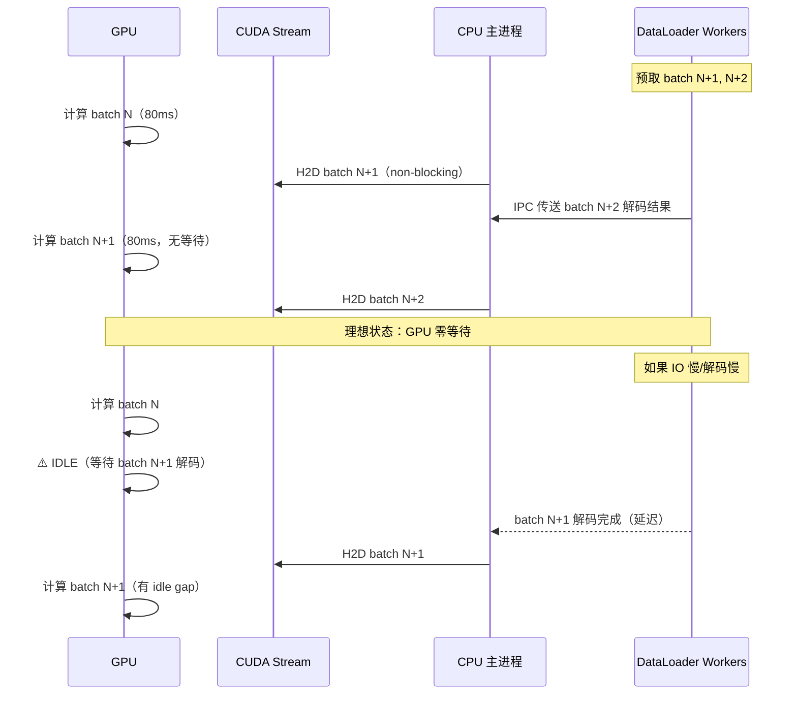
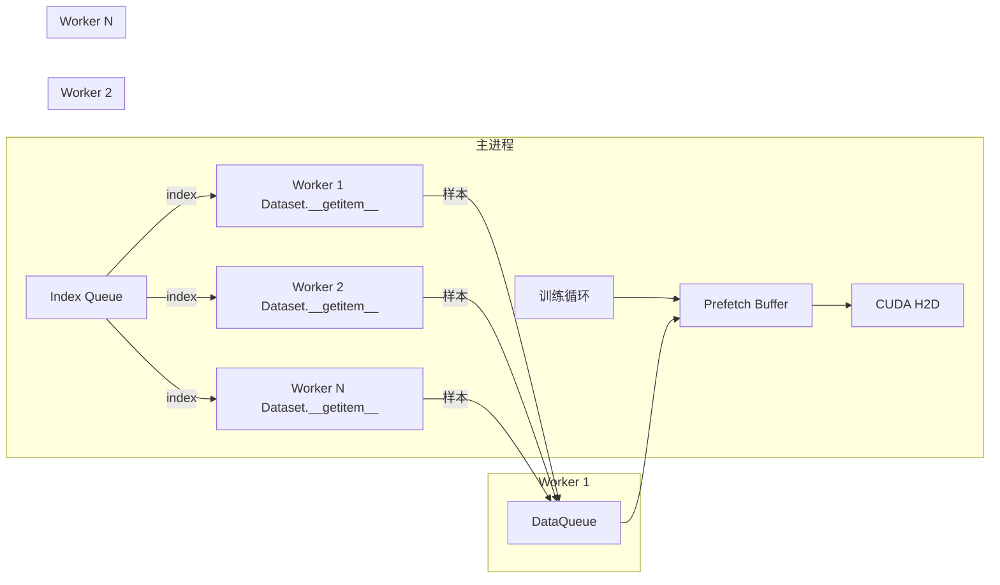
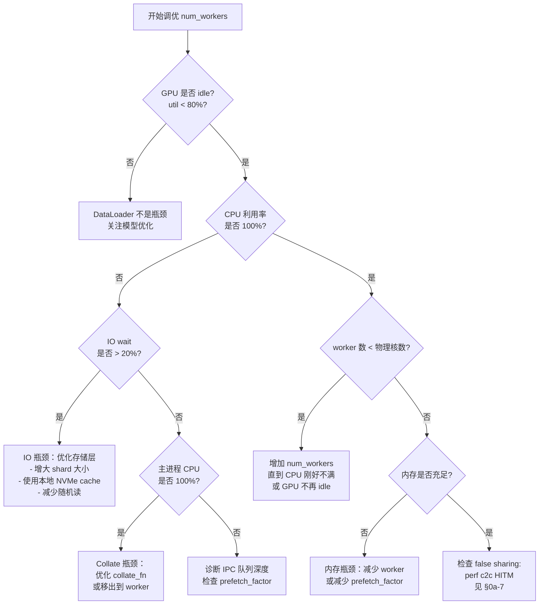
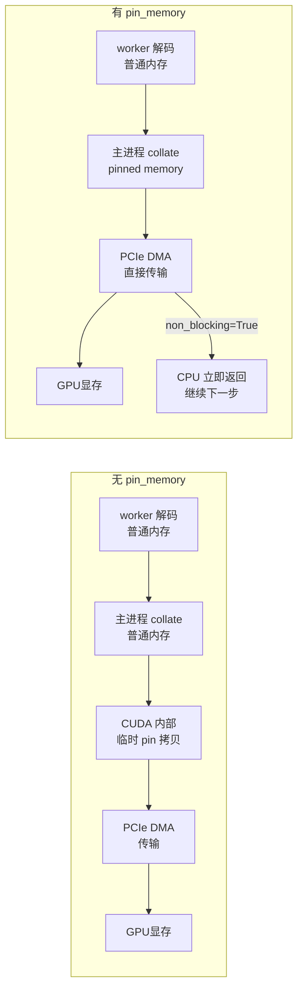
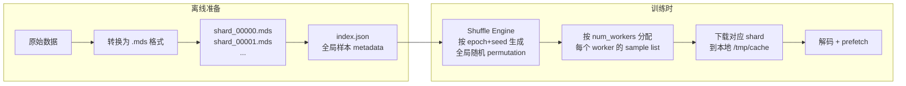
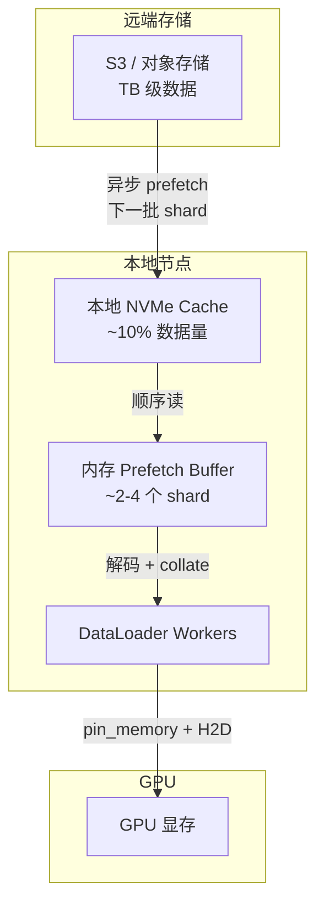
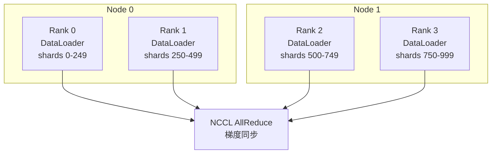
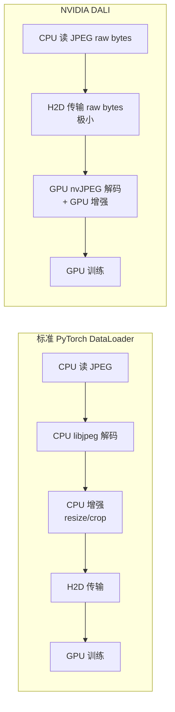
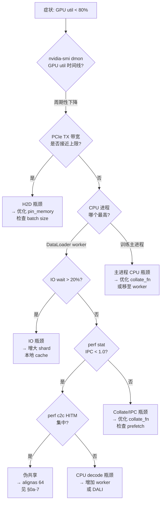

# 第 11d 章 · 流式读取与 DataLoader 工程化

> **关联章节**：本章是 [第 11 章](./11-data-pipeline.md) 数据管道的深挖子章节，聚焦 GPU 训练中 DataLoader 如何成为瓶颈、如何调优至非瓶颈；GPU idle 问题的 CPU/IO 成因见 [§0a-8](../part0-foundations-of-systems/0a8-cpu-worked-example.md)；DataLoader worker 伪共享的物理机理见 [§0a-7](../part0-foundations-of-systems/0a7-false-sharing.md)。

## 11d.1 第一性原理拆解 + 学习大纲

### 拆 — 不可化简的问题

把 prefetch_factor、pin_memory、WebDataset、DALI 这些名字先拿掉，DataLoader 工程化要解决的不可化简问题只有一个：**GPU 不能等数据**。

这句话比听起来更严苛。现代 A100/H100 能在 1-5ms 内完成一个 batch 的前向+后向计算；如果下一个 batch 在这段时间内没有出现在 GPU 显存里，GPU 就空转（SM utilization 下降）。GPU 空转不是简单的"慢一点"——它是固定成本的浪费：租用一张 H100 每小时数美元，每个 idle 周期都在消耗真实金钱却没有产出梯度。

让 GPU 始终有"满足条件的下一个 batch"，听起来只是"快点把数据送过来"，但实际上是在有限 CPU 核数、有限 IO 带宽、有限主存带宽这三个物理约束下，协调以下五个不同时间尺度的动作：

1. **磁盘/对象存储读取**：从持久存储把 shard 读入内存，典型延迟数十毫秒，IOPS 有上限，顺序 IO 远快于随机 IO。
2. **CPU 解码/预处理**：把压缩格式（JPEG/PNG/Parquet/tar）解码并转为张量，典型吞吐受 CPU 核数和每样本计算量限制。
3. **CPU→GPU 数据搬运（Host-to-Device, H2D）**：通过 PCIe 把 pinned memory 中的 batch 传入 GPU 显存，PCIe 带宽有上限，典型 H100 节点 NVLink+PCIe 合并带宽 64-128 GB/s，但单路 PCIe Gen4 x16 约 32 GB/s。
4. **GPU 前向+后向计算**：消耗 batch，时间由模型和 batch size 决定。
5. **shuffle/采样/collate**：对样本重新排列、填充（padding）、组合成 batch，在 CPU 侧执行。

这五个动作的吞吐必须匹配——任何一个成为瓶颈，GPU 都会等。问题还在于它们之间存在依赖：H2D 传输只能在前一步（CPU 解码）完成后才能启动；GPU 计算只能在 H2D 完成后才能启动。经典的流水线化（pipelining）是让 step N 的 GPU 计算与 step N+1 的 H2D 传输以及 step N+2 的 CPU 解码并行进行，但这个流水线要求每一级的时间都不超过 GPU 计算时间——否则流水线在某一级被截断，导致 GPU 等待。

不可化简性来自三个层面。第一，**存储的不确定性**：对象存储的 GET 延迟从毫秒到数十秒均有可能；本地 NVMe 的队列深度超限时延迟也会爆炸。任何单次超时都会打断流水线，让 GPU 在那一步 idle。第二，**CPU 资源是有限共享资源**：DataLoader worker 要和训练主进程、通信进程（NCCL 线程）、日志进程竞争 CPU 时间和 LLC。增加 worker 会提升解码并发，但超过物理核数后会引入调度开销和 cache 竞争（包括 §0a-7 所述的伪共享问题）。第三，**内存带宽是瓶颈而不只是容量**：DDR5/HBM 有峰值带宽上限，多 worker 高并发 decode + pin_memory 拷贝都在竞争同一条内存总线。

因此，DataLoader 工程化不是"设置几个参数让代码跑起来"，而是在一个多级流水线的约束下，找到让 GPU 永远不等、CPU 和 IO 刚好不溢出的参数组合。

### 推 — 从这个问题如何推导出每个机制

从"GPU 不能等数据"推出**预取（prefetch）**的必然性：DataLoader 必须在 GPU 消耗当前 batch 的同时，提前解码好下一个 batch，存放在内存缓冲区中。PyTorch 用 `prefetch_factor` 控制每个 worker 预先在队列里缓冲几个 batch——默认值 2 表示队列里始终保有 2×num_workers 个 batch。

从"预取需要并发"推出**多进程 worker 模型**：解码是 CPU 密集型的，用线程在 Python 里会被 GIL 锁死，所以 PyTorch DataLoader 用 `multiprocessing.Process`（`fork` 或 `spawn`）创建 worker，每个 worker 拥有独立的 Python 解释器和内存空间，通过 IPC 队列（`multiprocessing.Queue` 内部用共享内存和信号量）把解码好的样本传给主进程。

从"IPC 传输有代价"推出 **pin_memory 和 non_blocking H2D**：主进程从 worker 收到张量后，如果内存是普通可分页内存（pageable），CUDA 在 H2D 传输前必须先把数据拷贝到固定内存（pinned memory），增加一次 CPU 内存拷贝。提前申请 pinned memory（`pin_memory=True`）让 CUDA 可以直接 DMA 传输，避免这次中间拷贝；再配合 `tensor.cuda(non_blocking=True)` 让 H2D 传输在 CUDA stream 上异步执行，不阻塞 CPU 主循环。

从"顺序读比随机读快"推出 **IterableDataset vs MapDataset 的取舍**：MapDataset 允许随机访问任意 index，但对远端对象存储意味着每次都可能是随机读；IterableDataset 按顺序消费数据流，对海量 shard 更友好，但 shuffle 只能靠有限大小的内存缓冲区（shuffle buffer）来近似全局随机。

从"worker 的 tokenizer 会进程膨胀"推出 `persistent_workers` 的必要性：每次 epoch 开始时重建 worker 进程（默认行为），tokenizer、词表、model artifact 都要重新加载，fork+exec+初始化耗时几秒到几十秒。`persistent_workers=True` 让 worker 进程在 epoch 间保持存活，只在进程间传递样本数据，大幅减少初始化开销。

从"大量样本变长"推出 **bucket batching 和 dynamic batching**：对变长序列（文本、音频）的 naive padding 会让短序列浪费大量 padding token，导致 GPU 上有效计算比例低；bucket batching 把长度相近的序列归入同一个 bucket，在 bucket 内组 batch，让 padding 最小化。

从"训练数据远超单机存储"推出**流式 dataset（WebDataset/MosaicML Streaming/litdata）**的必然性：把 TB 级数据全部预下载到本地不现实，需要边读边训练；但朴素流式读取在 shuffle、断点续训、多 worker 并发上都有问题，这几个框架分别给出了不同的工程答案。

从"训练中断后应该能恢复"推出 **resume-friendly DataLoader**：PyTorch 的标准 DataLoader 在训练中断后重放整个 epoch 是浪费的；需要保存 worker 状态（已消费的 shard index、shard 内 offset、shuffle seed）才能精确从断点继续。

### 绘 — 因果链路

```mermaid
mindmap
  root((DataLoader 工程化))
    不可化简问题
      GPU 不能等数据
      存储延迟不确定
      CPU/IO 资源有限共享
      多级流水线协调
    预取机制
      prefetch_factor
      worker IPC 队列
      主进程 prefetch buffer
      CUDA stream pipeline
    worker 模型
      multiprocessing fork/spawn
      IPC 共享内存
      persistent_workers
      tokenizer 进程膨胀
    H2D 优化
      pin_memory
      non_blocking copy
      PCIe 带宽上限
      CUDA stream 异步
    数据集类型
      MapDataset 随机访问
      IterableDataset 顺序流
      shuffle buffer 近似随机
      shard 级 shuffle
    collate 工程化
      dynamic batching
      bucket batching
      padding 策略
      custom collate_fn
    流式框架
      WebDataset tar shard
      MosaicML Streaming
      litdata
      reader 实现原理
    远端存储
      S3 对象存储
      partial download
      本地 cache 层
      prefetch buffer
    大规模训练
      sharded read
      cross-shard sample
      多机 shuffle
    Resume 断点续训
      worker 状态保存
      迭代位置 deterministic
      shard offset 记录
    性能诊断
      GPU idle 周期
      host-side bottleneck
      IO wait
      CPU saturate
    False Sharing 关联
      worker stats 紧凑布局
      alignas(64) 修复
      0a-7 章联动
```

### 导 — 读完本章你应该能回答

1. GPU 在一个 training step 里有几个可能等待的环节？哪些属于 DataLoader 的职责、哪些属于模型代码的职责？
2. PyTorch DataLoader 的 worker 进程如何通过 IPC 把样本送到主进程？`prefetch_factor` 实际控制的是哪段缓冲区的大小？
3. `num_workers` 超过物理核数后为什么吞吐会下降？tokenizer 的进程膨胀为什么让这个问题更严重？
4. `pin_memory=True` + `non_blocking=True` 组合为什么能降低 H2D 延迟？什么情况下它反而会引发问题？
5. IterableDataset 的 shuffle buffer 在统计意义上和 MapDataset 的全局 shuffle 有什么差距？大规模训练时如何在两者间折中？
6. WebDataset、MosaicML Streaming、litdata 各自的 reader 实现有什么核心差异？你应该在什么场景下选择哪个？
7. 训练 LLaMA-7B 时，DataLoader 从瓶颈到非瓶颈需要经历哪些调优步骤？每步对 GPU 利用率有多大改善？

---

## 11d.2 DataLoader 的不可化简问题：为什么 GPU 不能等数据

GPU 的算力和时间是稀缺资源。在一次典型的 LLaMA-7B BF16 训练中：

- 每个 training step 的 GPU 计算时间约 80-200ms（取决于 batch size 和序列长度）
- 如果 DataLoader 无法在这段时间内备好下一个 batch，GPU SM 会降到 0% 利用率
- 对于一个 8 卡节点，每分钟的 idle 时间等价于几美分到几角钱的算力浪费

更关键的是，GPU idle 往往不是"偶尔等一下"，而是**周期性等待**——每当 DataLoader 的流水线在某个环节超时，整个训练就会以 GPU 计算时间 + idle 时间为周期运行，而不是只有 GPU 计算时间。



| 导致 GPU idle 的层次 | 典型原因 | 诊断信号 |
|---|---|---|
| 存储 IO 层 | 对象存储 GET 尾延迟、NVMe 队列满、并行文件系统 MDS 瓶颈 | `iostat` IO wait、DataLoader queue depth 为 0 |
| CPU 解码层 | JPEG 解码、tokenization、数据增强 CPU 密集 | CPU 利用率 100%、`perf stat` IPC 低 |
| IPC 传输层 | worker → 主进程的共享内存传输竞争 | `vmstat` 高 si/so、IPC 队列满 |
| H2D 传输层 | PCIe 带宽饱和、pageable memory 中间拷贝 | `nvidia-smi dmon` PCIe TX 带宽饱和 |
| Collate 层 | 复杂 collate_fn 的 Python 开销 | CPU 主进程 100%、worker 空闲 |

> **关键直觉**：DataLoader 调优的本质是识别五层流水线中哪一层最慢，让该层的吞吐至少等于 GPU 计算所需的 batch/s，然后用 prefetch 把剩余的时间不确定性吸收掉。

---

## 11d.3 PyTorch DataLoader 内部实现：worker 进程模型与 IPC 队列

### Worker 进程架构

PyTorch DataLoader 在 `num_workers > 0` 时启动 N 个独立的 worker 进程，每个 worker 有完整的 Python 解释器实例（因此不受 GIL 限制）。



**IPC 机制**：

- `index_queue`（每个 worker 一个）：主进程向 worker 分发 sample index，使用 `multiprocessing.Queue`（底层是 POSIX 管道 + 信号量）
- `worker_result_queue`（所有 worker 共享一个）：worker 把解码好的张量通过共享内存（`/dev/shm`）传回主进程，仅传递内存句柄（文件描述符）而非数据本身
- 主进程的 `_MultiProcessingDataLoaderIter` 按照 batch 发出顺序从 result queue 取结果，保证顺序性

### prefetch_factor 的实际含义

```python
DataLoader(dataset, num_workers=4, prefetch_factor=2)
```

实际效果：每个 worker 在 index_queue 里预先收到 `prefetch_factor` 个 index 并解码，即总 prefetch 数 = `num_workers × prefetch_factor = 4×2 = 8` 个 batch 在飞行中（in-flight）。

> **工程边界**：`prefetch_factor` 越大，内存占用越高（每个 in-flight batch 都要占用主存）；`prefetch_factor=4` 在 batch_size=32 的图像任务里约多占 4×32×3×224×224×4 bytes ≈ 1.5GB。需要在内存允许范围内取最大值，使 GPU 计算时间 > DataLoader 解码时间。

### persistent_workers 与 tokenizer 进程膨胀

| 参数 | 行为 | 适用场景 |
|---|---|---|
| `persistent_workers=False`（默认） | 每 epoch 开始时 fork/spawn 新进程，epoch 结束时终止 | 小型实验，worker 初始化开销可接受 |
| `persistent_workers=True` | worker 进程在 epoch 间保持存活，下一 epoch 开始时重置 dataset state | 有重型 tokenizer（如 tiktoken、SentencePiece）的 NLP 任务 |

**tokenizer 进程膨胀**的机理：当 `num_workers=16` 且每个 worker 加载一个 HuggingFace tokenizer 时：
- 每个 tokenizer 实例占用约 200-400MB（词表 + BPE merge rules）
- 16 workers → 额外消耗 3.2-6.4GB 主存
- `persistent_workers=False` 时，每 epoch 这些内存要被分配和释放一次，期间会产生大量 GC 压力和 `/dev/shm` 清理开销

> **工程建议**：NLP 训练时，`persistent_workers=True` + `num_workers=8-16` 是最常见的稳定组合；同时用 `prefetch_factor=2-4` 弥补单 epoch 前几个 batch 的预热延迟。

### fork vs spawn 的选择

| 模式 | 启动速度 | 内存占用 | 安全性 | 适用场景 |
|---|---|---|---|---|
| `fork` | 快（~10ms） | 低（COW 延迟复制） | 不安全（CUDA 上下文、OpenMP 状态、文件锁会被复制） | 纯 CPU worker、无 CUDA 初始化、Linux |
| `spawn` | 慢（~500ms-2s） | 高（重新导入所有模块） | 安全 | 有 CUDA、Windows、tokenizer 有全局状态 |
| `forkserver` | 中（1次 fork 开销） | 中 | 较安全 | 大型 Python 环境、想避免 spawn 代价 |

> **陷阱**：在主进程初始化 CUDA（如调用 `torch.cuda.is_available()`）后使用 `fork` 会导致 worker 进程中 CUDA 上下文损坏，产生难以调试的 segfault。应确保在 `DataLoader` 实例化前不触碰 CUDA，或使用 `spawn`。

---

## 11d.4 IterableDataset vs MapDataset：工程取舍

### 核心对比

| 维度 | MapDataset | IterableDataset |
|---|---|---|
| 访问语义 | 随机访问（支持任意 index） | 顺序流（只支持 next） |
| shuffle 方式 | 全局 index 打乱（完美随机） | shuffle buffer（近似随机） |
| 适合的存储形态 | 本地文件、内存映射 | 对象存储、网络流、shard 文件 |
| worker 分片方式 | 按 index 分片，主进程分发 | 每个 worker 订阅不同 shard（需手动实现） |
| resume 难度 | 保存 sampler index 即可 | 需要保存 shard index + shard 内 offset |
| 典型框架 | PyTorch 默认 Dataset | WebDataset、Streaming、litdata |
| 主要缺点 | 海量小文件时 IO 效率差；需要预建 index | shuffle 质量受 buffer 大小限制 |

### shuffle buffer 的统计含义

IterableDataset 的 shuffle 通常实现为：维护一个大小为 `buffer_size` 的内存缓冲区，每次从缓冲区中随机选一个样本返回，并从流中读入新样本补充缓冲区。

```
有效随机性 ≈ min(buffer_size, total_dataset_size) 个样本的排列数
```

**实践取值**：
- `buffer_size=1000`：接近随机，对 NLP 任务通常够用
- `buffer_size=10000`：接近全局随机（dataset > 1M 样本时仍是近似）
- `buffer_size=100000`：接近 MapDataset 的随机性，但内存开销 ≈ 100K × 平均样本大小

> **工程取舍**：在 1T token 级别的预训练中，完美全局 shuffle 本身需要数 TB 内存，工程上通常用"shard 级 shuffle + shard 内顺序读 + 小 shuffle buffer"的三级近似，牺牲少量统计随机性换取实际可行的 IO 效率。

---

## 11d.5 num_workers 调优：CPU 数、内存带宽、进程膨胀

### num_workers 的调优决策树



### num_workers 经验上界

| 场景 | 推荐 num_workers 起点 | 上界 | 备注 |
|---|---|---|---|
| 图像任务（JPEG 解码） | 物理核数 / 卡数 | 物理核数 | 解码 CPU 密集，可吃满 |
| NLP 任务（tokenization） | 4-8 | 16 | tokenizer 进程膨胀，超 16 内存压力大 |
| 流式 WebDataset | 4-8 | 16 | IO 受限，增 worker 收益递减早 |
| 本地 NVMe + 轻预处理 | 物理核数 / 2 | 物理核数 | 磁盘带宽通常先饱和 |
| 对象存储（S3/OSS） | 8-16 | 32 | 网络 IO 密集，worker 可以多些 |

### 与 §0a-7 伪共享的关联

DataLoader 的 worker stats 数组是伪共享的经典反例（见 §0a-7.10 事故 1）。在 PyTorch 内部或自定义监控代码中，若维护 `std::vector<WorkerStats>` 紧凑数组记录各 worker 的 `samples_processed` 和 `bytes_processed`，当 `num_workers=16` 且跨 NUMA socket 时：

- 16 个 worker 的 stats 分布在约 6-8 条 cache line（每个 `WorkerStats` 16-24B）
- 每个 worker 高频写自己的统计字段 → cache line 在核心间反复 invalidate
- 最终表现：16 worker 吞吐反而低于 8 worker（与 §0a-8 剧本一完全一致）

**修复**：对任何 worker 粒度的统计结构加 `alignas(64)`，并用 thread-local 累加 + 周期性 flush（每 64 样本 flush 一次）降低 atomic 写频率。

---

## 11d.6 pin_memory + non_blocking H2D copy

### 机制原理



| 配置 | H2D 流程 | 中间拷贝 | CPU 阻塞 | 适用场景 |
|---|---|---|---|---|
| 默认（无 pin_memory） | 可分页内存 → 临时 pin → DMA | 有 | 有 | 简单实验 |
| `pin_memory=True` | pinned 内存 → 直接 DMA | 无 | 有（默认） | 大多数训练任务 |
| `pin_memory=True` + `non_blocking=True` | pinned 内存 → 异步 DMA | 无 | 无 | 生产级训练，GPU/CPU 流水线 |

### 使用注意事项

```python
# 正确用法
for batch in dataloader:  # DataLoader 内部自动 pin
    inputs = batch['input_ids'].cuda(non_blocking=True)
    labels = batch['labels'].cuda(non_blocking=True)
    # 此时 H2D 传输在 CUDA default stream 上异步进行
    # 必须在 GPU kernel 使用 inputs 之前确保传输完成
    # （同一 stream 上的 kernel 会自动等待）
    loss = model(inputs, labels=labels)

# 常见陷阱：non_blocking + 立即在 CPU 上访问
x = tensor.cuda(non_blocking=True)
print(x.cpu())  # 会强制同步，丧失 non_blocking 优势
```

> **工程边界**：pinned memory 是不可换出的物理内存，过度分配会增加 OS 内存压力。建议仅对 DataLoader 的输出张量使用 pin_memory；模型参数和 optimizer state 不需要。每张 H100 卡建议预留 2-4GB 给 pinned memory 缓冲区。

---

## 11d.7 collate_fn 工程化：dynamic batching、padded sequence、bucket batching

### 变长序列 padding 的代价

对于文本训练，序列长度分布通常呈长尾分布（大量短序列 + 少量极长序列）。naive padding 到 batch 内最大长度会带来：

- **计算浪费**：Attention 是 O(L²) 的，把 batch 中所有序列 pad 到最长序列长度，对短序列浪费极大
- **内存浪费**：padding token 占用 GPU 显存但不贡献梯度

### Bucket Batching

```python
def bucket_batch_sampler(dataset, batch_size, bucket_boundaries):
    """
    按长度分桶，同桶内组 batch，最小化 padding
    bucket_boundaries: [64, 128, 256, 512, 1024]
    """
    lengths = [len(dataset[i]['input_ids']) for i in range(len(dataset))]
    buckets = defaultdict(list)
    for idx, length in enumerate(lengths):
        bucket = bisect_right(bucket_boundaries, length)
        buckets[bucket].append(idx)
    
    for bucket_indices in buckets.values():
        random.shuffle(bucket_indices)
        for i in range(0, len(bucket_indices), batch_size):
            yield bucket_indices[i:i+batch_size]
```

| batching 策略 | padding 比例 | 吞吐（相对 naive） | 复杂度 | 适用场景 |
|---|---|---|---|---|
| Naive padding（到最长） | 30-60% | 基准 | 低 | 实验、序列长度均匀 |
| Bucket batching（固定桶） | 10-20% | +20-40% | 中 | 生产 NLP 训练 |
| Dynamic batching（按 token 数） | 5-10% | +30-50% | 高 | LLM 预训练 |
| Packing（无 padding） | <2% | +50-80% | 很高 | 极致优化，需 attention mask |

### Dynamic Batching（按 token 数组 batch）

```python
def dynamic_batch_collator(max_tokens_per_batch=4096):
    """每个 batch 的 token 总数不超过 max_tokens，允许 batch size 变化"""
    def collate(samples):
        # 按长度排序，贪心装箱
        samples = sorted(samples, key=lambda x: len(x['input_ids']), reverse=True)
        batches, current_batch, current_tokens = [], [], 0
        for sample in samples:
            length = len(sample['input_ids'])
            if current_tokens + length > max_tokens_per_batch and current_batch:
                batches.append(current_batch)
                current_batch, current_tokens = [], 0
            current_batch.append(sample)
            current_tokens += length
        if current_batch:
            batches.append(current_batch)
        return batches
    return collate
```

> **工程边界**：Dynamic batching 中 batch size 随序列长度变化，会影响梯度估计的方差；LLM 预训练通常在 dynamic batching 外层再加 gradient accumulation 来稳定有效 batch size。

---

## 11d.8 流式 Dataset：WebDataset、MosaicML Streaming、litdata

### 三框架核心对比

| 维度 | WebDataset | MosaicML Streaming | litdata |
|---|---|---|---|
| 核心格式 | `.tar`（WebDataset tar shard） | `.mds`（自定义 binary） | 自定义 chunked binary |
| Shuffle 实现 | shard-level shuffle + 内部 buffer | 全局 shuffle（跨 shard index 随机化） | epoch-level shuffle + local buffer |
| 远端存储支持 | S3/GCS/HTTP（通过 fsspec） | S3/GCS/Azure/本地 | S3/GCS/本地 |
| Resume 支持 | 弱（需记录 shard 消费位置） | 强（内建 epoch+sample offset） | 强（checkpoint 即可） |
| 多机 worker 分片 | 手动配置 shard 分配 | 内建（按 worker 数自动分片） | 内建 |
| 安装复杂度 | 轻量（`pip install webdataset`） | 中（`pip install mosaicml-streaming`） | 轻量（`pip install litdata`） |
| 典型用户 | 学术界、中小规模 | 大规模工业预训练 | PyTorch Lightning 生态 |

### WebDataset 的 tar shard 读取实现

WebDataset 把样本组织在 `.tar` 文件中，每个样本由多个文件组成（如 `00001.jpg` + `00001.txt`）。Reader 实现核心：

```python
import webdataset as wds

dataset = (
    wds.WebDataset("s3://bucket/data/shard-{000000..001000}.tar",
                   shardshuffle=True,      # shard 级 shuffle
                   nodesplitter=wds.split_by_node,   # 多机分片
    )
    .shuffle(1000)                          # 内存 shuffle buffer
    .decode("pil")                          # 自动解码 JPEG
    .to_tuple("jpg", "txt")
    .batched(32)
)
```

**内部实现**：
- tar 文件按 shard index 分配给 worker，每个 worker 顺序读取分配到的 shard
- 通过 `itertools.cycle` 在 shard 列表上循环，支持无限迭代
- `fsspec` 处理 S3/HTTP 透明读取，内部使用 `requests.Response.raw` 流式传输

### MosaicML Streaming 的 shuffle 实现

MosaicML Streaming 最大的工程特点是**真正的跨 shard 全局 shuffle**：



关键参数：`shuffle_seed`（确定性）、`download_timeout`（容错）、`cache_limit`（本地磁盘上限）。

---

## 11d.9 远端 Dataset：S3/对象存储 + 本地 Cache、Partial Download、Prefetch Buffer

### 架构设计



### Partial Download 策略

对象存储支持 HTTP Range GET，允许只下载文件的一部分。对于 Parquet 或自定义 binary 格式，可以：

```python
# 只下载 shard 的前 N 行（Parquet row group 级别的 partial read）
import pyarrow.parquet as pq
pf = pq.ParquetFile("s3://bucket/shard_00001.parquet")
# 只读取第 0 个 row group（通常 ~50k 行，~100MB）
table = pf.read_row_group(0)
```

| 策略 | 延迟 | 带宽效率 | 实现复杂度 | 适用场景 |
|---|---|---|---|---|
| 全量下载 shard | 高（等下载完才读） | 高 | 低 | 本地存储充足时 |
| Partial download + streaming | 低（边下边读） | 中（有 HTTP 请求开销） | 中 | 本地磁盘有限 |
| Prefetch 下一批 shard | 中（异步预下载） | 高 | 中 | 最常见生产方案 |
| 完全内存 streaming | 极低 | 中 | 高 | 超大带宽节点 |

### 本地 Cache 大小选择

```
推荐 cache size = max(2 × 单次训练遍历的 IO 量, 最热 shard 的总大小)
```

**实践边界**：
- 对象存储平均 GET 延迟 50-200ms，每个 worker 读 shard 期间约需 0.5-5 秒
- 本地 NVMe cache 读取速度 3-7 GB/s，远快于对象存储
- 建议至少预留 10-20GB 本地 cache（约 10-20 个 1GB shard）

> **工程提醒**：cache 目录需要定期清理，避免占满磁盘影响训练日志和 checkpoint 写入。MosaicML Streaming 的 `cache_limit` 参数可以自动 LRU 清理。

---

## 11d.10 大规模训练 DataLoader：Sharded Read、Shuffle Buffer、Cross-Shard Sample

### 多机多卡的 DataLoader 架构

在 DDP（DistributedDataParallel）训练中，每个 rank 需要读取不同的数据（数据并行的前提）：



**Shard 分配策略**：

```python
# PyTorch DDP 标准做法：使用 DistributedSampler
from torch.utils.data.distributed import DistributedSampler

sampler = DistributedSampler(
    dataset,
    num_replicas=world_size,  # 总 rank 数
    rank=local_rank,          # 当前 rank
    shuffle=True,
    seed=42                   # 确保所有 epoch 的 shuffle 可复现
)
dataloader = DataLoader(dataset, sampler=sampler, ...)
```

对于 IterableDataset（WebDataset/Streaming），需要手动实现 shard 分片：

```python
# WebDataset 多机分片
dataset = wds.WebDataset(shard_urls,
    nodesplitter=wds.split_by_node,    # 按 dist.get_rank() 分片
    workerssplitter=wds.split_by_worker  # 按 worker_id 进一步分
)
```

### Cross-Shard Sample：打破 shard 边界的随机性

标准流式读取的问题：shard 内样本顺序固定，不同 epoch 看到的顺序相同（只有 shard 顺序随机）。cross-shard sample 在同时读取多个 shard，从多个 shard 交叉采样：

```python
# 伪代码：cross-shard 交叉读取
class CrossShardDataset(IterableDataset):
    def __iter__(self):
        open_shards = [open_shard(s) for s in random.sample(all_shards, k=4)]
        buffer = []
        while open_shards:
            # 从每个打开的 shard 各取一个样本，加入 buffer
            for shard in open_shards:
                sample = next(shard, None)
                if sample: buffer.append(sample)
            # 随机采样
            if len(buffer) >= buffer_size:
                yield random.choice(buffer)
                buffer.pop(random.randrange(len(buffer)))
```

---

## 11d.11 Resume-Friendly DataLoader：保存 Worker 状态与 Deterministic 迭代

### 问题：为什么标准 DataLoader 不能 resume

训练中断后，标准 PyTorch DataLoader 只能从 epoch 开头重新开始。对于大规模训练（epoch 需要数小时到数天），这意味着：
- 重新消费已经见过的样本（浪费算力，改变数据分布）
- 无法复现精确相同的训练轨迹（影响可复现性）

### Resume 所需的状态

| 状态项 | MapDataset | IterableDataset |
|---|---|---|
| Sampler 状态 | 已消费的 index 列表 | 当前 shard index + shard 内 offset |
| Shuffle seed | epoch + step seed | epoch + shard shuffle seed |
| Worker 状态 | prefetch queue 位置 | 每个 worker 的 shard 游标 |
| Collate 状态 | 通常无状态 | 通常无状态 |

### PyTorch 2.3+ StatefulDataLoader

PyTorch 2.3 引入了 `StatefulDataLoader`（实验性）：

```python
from torch.utils.data import StatefulDataLoader

dataloader = StatefulDataLoader(dataset, batch_size=32, num_workers=4)

# 保存状态
state = dataloader.state_dict()
torch.save(state, "dataloader_state.pt")

# 恢复状态
dataloader.load_state_dict(torch.load("dataloader_state.pt"))
# 从断点继续，而不是从 epoch 头开始
```

**内部实现**：记录每个 worker 的 `dataset.__iter__` 的状态（通过 `__getstate__/__setstate__`），以及主进程的 index 发送位置和 result queue 中 in-flight batch 数量。

> **工程提醒**：Resume 要真正有效，dataset 的 `__iter__` 必须实现 `__getstate__` 和 `__setstate__`。WebDataset 已原生支持；自定义 IterableDataset 需要手动实现。

---

## 11d.12 与 Ray Data / NVIDIA DALI / 推理 DataLoader 的对比

### 框架对比

| 框架 | 定位 | 优势 | 局限 | 适用场景 |
|---|---|---|---|---|
| PyTorch DataLoader | 通用训练数据加载 | 灵活、生态好 | 多机协调弱、resume 基础 | 大多数训练任务 |
| Ray Data | 分布式数据处理流水线 | 跨节点弹性、与 Ray Train 深度集成 | 额外学习成本、overhead | 大规模分布式、复杂预处理 |
| NVIDIA DALI | GPU 加速数据预处理 | 解码/增强在 GPU 上，绕过 CPU 瓶颈 | 仅 NVIDIA、支持算子有限 | 图像/视频，CPU decode 是瓶颈 |
| TensorRT 推理 DataLoader | 推理批处理 | dynamic shape 感知、低延迟 | 仅推理 | LLM/CV 推理服务 |

### NVIDIA DALI 的核心价值

DALI 把 JPEG 解码、图像增强（resize、crop、normalize）移到 GPU 上执行：



**适用场景**：当 CPU JPEG 解码是 DataLoader 瓶颈时（`num_workers=32` 仍然 CPU 饱和），DALI 可以直接把这部分工作卸载到 GPU。代价是对 GPU 显存有额外占用（解码缓冲区约 1-2GB）。

### 训练 DataLoader vs 推理 Batching vs 评测 DataLoader 的差异

| 维度 | 训练 DataLoader | 推理 Batching | 评测 DataLoader |
|---|---|---|---|
| 首要目标 | 最大吞吐，GPU 零等待 | 最小延迟，P99 < SLA | 可复现，结果精确 |
| Shuffle | 必须，影响模型质量 | 通常不需要 | 通常不需要（除非 OOD 测试） |
| Batch size | 固定或 dynamic（最大化 GPU 利用） | 动态（continuous batching） | 固定（保证结果一致性） |
| 数据来源 | 离线 shard，吞吐导向 | 在线请求，延迟导向 | 固定评测集，可复现性导向 |
| Resume | 需要（训练可能中断） | 不需要 | 可能需要（大规模评测） |
| 预处理 | 离线+在线混合 | 纯在线，延迟敏感 | 预处理离线完成，保证一致 |

> **评测 DataLoader 的严格要求**：评测时必须固定所有随机性（seed、shuffle=False、drop_last=False），且不同 epoch / 不同机器 / 不同 num_workers 的结果必须完全一致。这与训练 DataLoader 完全相反。

---

## 11d.13 性能诊断：GPU Idle 周期与 Host-Side Bottleneck 定位

### 诊断信号层次



### 诊断工具命令速查

```bash
# 1. GPU 侧：每秒采样 GPU util、内存、PCIe 带宽
nvidia-smi dmon -s pucmt -d 1 -c 60

# 2. CPU 侧：看 DataLoader worker 的 CPU 占用
pidstat -t -p $(pgrep -f "python.*train") 1 30

# 3. IO 侧：看磁盘 IO wait 和吞吐
iostat -x 1 30

# 4. 内存带宽：看是否接近主存带宽上限
perf stat -e mem_load_l3_miss_retired.local_dram,\
mem_load_l3_miss_retired.remote_dram -a sleep 10

# 5. DataLoader 队列深度（自定义监控）
# 在 DataLoader 循环里加计时：
import time
for i, batch in enumerate(dataloader):
    wait_time = time.time() - last_step_end
    if wait_time > 0.01:  # > 10ms 认为 GPU 在等
        print(f"Step {i}: DataLoader wait {wait_time*1000:.1f}ms")
    # ... train step ...
    last_step_end = time.time()
```

### 性能诊断信号映射表

| 诊断信号 | 含义 | 对应瓶颈 | 推荐行动 |
|---|---|---|---|
| GPU util 周期性 <80%，PCIe TX 高 | H2D 带宽饱和 | H2D 传输 | 减小 batch size 或优化模型以减少 activation 传输 |
| GPU util 周期性 <80%，PCIe TX 低 | DataLoader 未备好 batch | CPU/IO | 增加 workers、prefetch_factor |
| CPU worker 进程 100%，IO wait <5% | CPU decode 瓶颈 | CPU 解码 | 增加 worker 或用 DALI |
| CPU worker 进程 100%，IO wait >20% | 磁盘/网络 IO 瓶颈 | 存储 IO | 增大 shard、本地 cache、并行 IO |
| CPU worker 100%，perf c2c HITM 高 | 伪共享 | Worker stats 布局 | alignas(64) + thread-local |
| 主进程 CPU 100%，worker 空闲 | Collate 瓶颈 | collate_fn | 简化 collate 或移至 worker |
| DataLoader wait time 均匀 | prefetch 不足 | 预取配置 | 增大 prefetch_factor |
| DataLoader wait time 偶发尖峰 | IO 尾延迟 | 存储抖动 | 本地 cache + retry |

---

## 11d.14 Worked Example：训练 LLaMA-7B 时把 DataLoader 从瓶颈调到非瓶颈

### 场景描述

单节点 8×A100 80GB，本地 NVMe（7 GB/s），训练数据约 1TB token（存储为 WebDataset tar shard，每个 shard 约 500MB，共 2000 个 shard），LLaMA-7B BF16，sequence length 2048，micro batch size 2（每卡），global batch size 16×2048 tokens。

**初始配置**（调优前）：
```python
DataLoader(dataset, num_workers=2, prefetch_factor=2,
           pin_memory=False, persistent_workers=False)
```

### 调优过程与 GPU 利用率变化

| 调优步骤 | 变更内容 | GPU util（avg） | GPU util（min） | DataLoader wait（ms/step） | 备注 |
|---|---|---|---|---|---|
| Step 0：基线 | num_workers=2, 无 pin_memory | 45% | 12% | 280 | GPU 大量等待 DataLoader |
| Step 1：增加 workers | num_workers=8 | 68% | 35% | 95 | 大幅改善，IO 尚未成瓶颈 |
| Step 2：pin_memory | pin_memory=True + non_blocking | 74% | 42% | 75 | H2D 延迟降低 |
| Step 3：persistent_workers | persistent_workers=True | 76% | 45% | 68 | epoch 边界 overhead 消除 |
| Step 4：prefetch_factor | prefetch_factor=4 | 80% | 55% | 45 | 缓冲区更深，IO 抖动吸收 |
| Step 5：shuffle buffer | shuffle(buffer_size=5000) | 80% | 55% | 45 | shuffle 对吞吐无影响 |
| Step 6：本地 NVMe cache | 预缓存 20GB shard 到本地 | 88% | 72% | 18 | IO 稳定性大幅提升 |
| Step 7：bucket batching | 按序列长度分桶 | 91% | 78% | 18 | 减少 padding，有效计算提升 |
| Step 8：num_workers 精调 | 从 8 提升到 12 | 93% | 82% | 12 | 刚好不超物理核数/4卡 |
| 最终状态 | 所有优化组合 | **93%** | **82%** | **12** | DataLoader 不再是瓶颈 |

### 关键诊断步骤详情

**Step 0 → Step 1 的诊断**：

```bash
# 在训练脚本里加简单计时
start = time.time()
for batch in dataloader:
    load_time = time.time() - start  # DataLoader 等待时间
    # ... train ...
    start = time.time()
    
# 输出：avg load_time = 280ms，avg compute_time = 220ms
# → DataLoader 时间 > compute 时间，明确是 DataLoader 瓶颈
```

**Step 6 的 NVMe cache 实现**：

```python
class CachedWebDataset:
    def __init__(self, remote_shards, local_cache_dir, cache_size_gb=20):
        self.cache = LocalShardCache(local_cache_dir, max_size_gb=cache_size_gb)
        self.dataset = wds.WebDataset(remote_shards).map(self.cache_shard)
    
    def cache_shard(self, shard_url):
        local_path = self.cache.get_or_download(shard_url)
        return local_path  # 返回本地路径，Worker 直接读本地
```

**Step 7 的 bucket batching 效果量化**：

```
调优前：avg sequence length in batch = 1024，padding = 42%，有效 tokens/step = 2048×2048×0.58 = 2.4M
调优后：avg sequence length in batch = 1024，padding = 11%，有效 tokens/step = 2048×2048×0.89 = 3.7M
→ 有效计算量提升 54%，直接反映在 GPU MFU（Model FLOP Utilization）上
```

### 最终配置

```python
dataset = (
    wds.WebDataset(shard_urls, shardshuffle=True,
                   nodesplitter=wds.split_by_node,
                   workerssplitter=wds.split_by_worker)
    .shuffle(5000)
    .decode("torch")
    .map(tokenize)
)

dataloader = DataLoader(
    dataset,
    batch_size=2,
    num_workers=12,
    prefetch_factor=4,
    pin_memory=True,
    persistent_workers=True,
    collate_fn=bucket_collate_fn,  # 按 token 数 dynamic batching
)

# 训练循环
for batch in dataloader:
    input_ids = batch['input_ids'].cuda(non_blocking=True)
    labels = batch['labels'].cuda(non_blocking=True)
    with torch.cuda.amp.autocast(dtype=torch.bfloat16):
        loss = model(input_ids, labels=labels).loss
    loss.backward()
    optimizer.step()
```

> **关键教训**：DataLoader 调优是一个"先诊断瓶颈在哪一层，再用对应工具修"的过程，而不是把所有参数调到最大。过度增加 workers 或 prefetch_factor 会引发内存压力和伪共享，反而让吞吐下降。每次调优只改一个变量，用 GPU util 和 DataLoader wait time 两个指标同步确认效果。

---

## 11d.15 工程建议与常见陷阱

> **陷阱 1：num_workers 越大越好**。超过物理核数 / 任务 GPU 数后，worker 调度开销、cache 竞争和伪共享会让吞吐下降。推荐从 `物理核数 / GPU 数量` 开始测，逐步增加直到 GPU 不再 idle 或 CPU 打满。

> **陷阱 2：在 DataLoader 之外做 H2D**。`batch.to(device)` 默认是同步的，会阻塞 CPU 主循环。应始终使用 `.cuda(non_blocking=True)` + `pin_memory=True` 组合。

> **陷阱 3：epoch 级别的 shuffle 不够**。对于有强时序相关性的数据（如爬取日期相近的文档），shard 级 shuffle 不足以打乱；需要在 shard 内部也做 shuffle（WebDataset `.shuffle()`）或使用 MosaicML Streaming 的全局 shuffle。

> **陷阱 4：在主进程初始化 CUDA 后使用 fork**。会导致 worker 中 CUDA 状态损坏。检查：import 顺序，避免在 DataLoader 实例化前调用任何 CUDA API。

> **陷阱 5：collate_fn 在主进程执行**。PyTorch 默认 collate_fn 在主进程执行；如果 collate_fn 很重（如在 collate 中做 tokenization），主进程 CPU 会成为瓶颈。解决方案：把 tokenization 移到 Dataset.__getitem__（在 worker 中执行）。

> **陷阱 6：评测时使用训练用的 DataLoader**。评测需要 `shuffle=False`、`drop_last=False`、固定 seed，与训练配置完全不同。建议用独立函数构建评测 DataLoader，避免共享训练配置。

> **最佳实践：DataLoader 健康检查脚本**

```python
def benchmark_dataloader(dataloader, n_batches=50):
    """在训练前快速诊断 DataLoader 吞吐"""
    import time
    times = []
    for i, batch in enumerate(dataloader):
        if i == 0:
            start = time.time()
            continue
        times.append(time.time() - start)
        start = time.time()
        if i >= n_batches: break
    
    avg_ms = sum(times) / len(times) * 1000
    print(f"DataLoader avg: {avg_ms:.1f}ms/batch")
    print(f"DataLoader throughput: {1000/avg_ms:.1f} batches/s")
    # 对比 GPU 计算时间，判断是否是瓶颈
```

---

## 本章小结

| 主题 | 核心结论 |
|---|---|
| 不可化简问题 | GPU 不能等数据；DataLoader 调优是五层流水线的协调 |
| Worker 模型 | fork/spawn 各有陷阱；persistent_workers 避免 tokenizer 重加载 |
| num_workers | 超过物理核后反降；伪共享是 §0a-7 所述的真实高发场景 |
| pin_memory | 必须配合 non_blocking=True 才能发挥流水线效果 |
| IterableDataset | shuffle buffer 是近似随机；大规模训练的实际最优方案 |
| 流式框架 | WebDataset 灵活、Streaming 全局 shuffle、litdata 轻量 |
| 性能诊断 | GPU util + DataLoader wait time 是最直接的诊断双指标 |
| Resume | StatefulDataLoader（PyTorch 2.3+）是推荐方案 |

---

## 练习题

### 11d-1（基础）：prefetch_factor 内存计算

一个 DataLoader 配置：`num_workers=8, prefetch_factor=4, batch_size=32`，每个样本是 224×224×3 float32 图像。计算理论上 DataLoader prefetch 缓冲区占用的主存大小（MB）。如果主存只有 64GB，这个配置是否有风险？

### 11d-2（基础）：fork vs spawn 选择

以下代码在 fork 模式下会报错，说明原因并给出修复方案：
```python
import torch
device = torch.device('cuda:0')  # 初始化 CUDA
dataloader = DataLoader(dataset, num_workers=4)  # 使用 fork
```

### 11d-3（基础）：pin_memory 原理

解释为什么 `pin_memory=True` 能加速 H2D 传输。在什么系统条件下（内存大小、NUMA 配置），pin_memory 可能反而降低性能？

### 11d-4（进阶）：num_workers 调优实验

设计一个实验，在以下三种存储配置下分别测量最优 num_workers：(a) 本地 NVMe SSD，(b) NFS 网络存储，(c) S3 对象存储。每种配置你预期的最优 num_workers 是多少？理由是什么？

### 11d-5（进阶）：bucket batching 实现

为 LLaMA 训练实现一个 bucket sampler，要求：按序列长度分 5 个桶（0-64, 64-128, 128-256, 256-512, 512+），同桶内随机组 batch，不同桶间按比例混合（按样本数比例）。给出关键代码片段。

### 11d-6（进阶）：WebDataset vs MosaicML Streaming 选型

给定以下场景，判断哪个框架更合适：(a) 学术实验，数据 100GB，存储在本地；(b) 工业预训练，数据 10TB，存储在 S3，8 节点 64 GPU，需要精确的全局 shuffle 和 resume；(c) 快速原型，数据格式多样（JSON、JPEG、parquet 混合）。分别给出理由。

### 11d-7（进阶）：false sharing 在 DataLoader 中的诊断

某 16-worker DataLoader 在 8-worker 时吞吐 8000 samples/s，在 16-worker 时反降到 6500 samples/s，且 CPU 利用率高但 IO wait 低。给出完整的诊断步骤（至少 5 步），包括使用的工具和判读标准。最终如果确认是伪共享，给出修复方案。

### 11d-8（进阶）：S3 远端数据集设计

设计一个生产级的 S3 数据集 class，要求：
1. 支持 shard 级别的本地 NVMe cache（LRU 淘汰）
2. 异步预下载下一批 shard
3. 支持 resume（保存当前消费的 shard index + offset）

给出类的接口设计和关键实现思路。

### 11d-9（设计）：多机 DataLoader 架构

设计一个 32 节点、每节点 8 卡的 DDP 训练的 DataLoader 架构。数据量 100TB，存储在 S3。要求：各 rank 读取不重叠的数据、每节点有本地 cache、支持 resume、支持多 epoch 不同 shuffle 顺序。画出架构图（用 mermaid 或文字描述）并列出关键参数选择。

### 11d-10（设计）：DataLoader 健康监控系统

设计一个 DataLoader 健康监控系统，能够实时检测以下异常：
1. DataLoader wait time 超过 GPU compute time 的 20%
2. 某个 worker 处理时间明显高于其他 worker（可能是 IO 抖动或伪共享）
3. Prefetch buffer 经常为空（prefetch 不足）
4. 内存使用接近上限（pinned memory + worker cache 之和）

给出监控指标定义、采集方式和告警阈值。

### 11d-11（开放）：评测 DataLoader 的严格要求

一个模型评测系统要求在不同机器（4 卡 vs 8 卡）、不同 num_workers（4 vs 8）下得到完全相同的评测结果。列出至少 5 个可能导致结果不一致的 DataLoader 配置项，并给出使结果一致的参数设置。

### 11d-12（开放）：AI Infra 视角的 DataLoader 差异

从 AI Infra 平台视角，训练 DataLoader、推理 Batching Engine（如 vLLM 的 continuous batching）和评测 DataLoader 的设计目标完全不同。请为这三种场景各写一段不超过 200 字的"设计原则"，重点区分它们在 shuffle、batch size、延迟要求、resume、数据来源五个维度上的差异。

---

## 深度参考阅读

1. PyTorch 官方文档，*torch.utils.data.DataLoader*，重点阅读 multiprocessing worker 和 pin_memory 部分：https://pytorch.org/docs/stable/data.html
2. PyTorch 源码 `torch/utils/data/_utils/worker.py` 和 `torch/utils/data/_utils/fetch.py`：IPC 队列和 prefetch 实现细节。
3. Greg Brockman et al., *WebDataset*，https://github.com/webdataset/webdataset：tar shard reader 实现原理和最佳实践。
4. MosaicML, *Streaming Documentation*，https://docs.mosaicml.com/projects/streaming：全局 shuffle 算法和 resume 实现。
5. Lightning AI, *litdata Documentation*：https://github.com/Lightning-AI/litdata
6. NVIDIA DALI 文档，https://docs.nvidia.com/deeplearning/dali/user-guide/docs/：GPU 加速数据预处理的适用场景和算子列表。
7. Ulrich Drepper, *What Every Programmer Should Know About Memory*，§6：多核 cache 一致性对数据结构布局的影响（本章 §0a-7 伪共享的理论基础）。
8. PyTorch RFC，*StatefulDataLoader*，https://github.com/pytorch/pytorch/issues/101646：Resume-friendly DataLoader 的设计讨论。
9. Shen Li et al., *PyTorch Distributed: Experiences on Accelerating Data Parallel Training*，MLSys 2020：DDP 与 DataLoader 集成的工程实践。
10. Sung-Han Lin et al., *Efficient Large Scale Language Modeling with Mixtures of Experts*：大规模 NLP 预训练的 DataLoader 调优经验。
11. Daniel Cotting, *How we trained LLaMA 2 efficiently*（Meta 博客）：实际 LLaMA 训练中 DataLoader 配置的取舍与调优过程。
12. Brendan Gregg, *Systems Performance: Enterprise and the Cloud*, 2nd ed., Chapter 8（文件系统）：理解 IO wait、Page Cache、顺序/随机 IO 的诊断方法。
