# 第 11e 章 · 数据版本、血缘与谱系

> 模型生产事故无法复现的根本原因，往往不是代码 bug，而是数据版本没有被固定。

> **关联章节**：本章是 [第 11 章](11-data-pipeline.md) 数据管道的纵向深挖子章节，聚焦"版本如何定义、血缘如何追踪、合规如何保障"三个问题；与 [第 12a 章](12-artifacts-and-checkpoints.md) 模型注册表协同，共同构成从数据到模型的完整可追溯链。

---

## 11e.1 第一性原理拆解 + 学习大纲

### 拆 — 不可化简的问题

把 DVC、lakeFS、Iceberg、Delta Lake、OpenLineage 这些工具名全部拿掉，数据版本管理要解决的不可化简问题只有一个：**数据是随时间变化的，而模型训练的结果必须可以在任意未来时间点被完整复现。**

这句话比看起来更难实现。它意味着：

第一，数据本身是可变的（mutable）。文档会被更新，标签会被修正，用户行为日志会持续追加，GDPR 删除请求会让部分样本从历史数据中消失。没有任何机制可以阻止数据随时间变化；唯一能做的是在数据变化之前给它拍快照，并让快照永远可被访问。

第二，训练是依赖精确数据视图的。同一个数据集在不同时间点，因为清洗规则版本不同、去重阈值不同、标注者不同、分片策略不同、时间边界不同，会产生截然不同的训练效果。如果你无法精确重现"训练 run-0314 看到的那批数据"，你就无法重现 run-0314 的 loss 曲线，也无法判断今天的 run-0421 是真的更好还是只是数据分布不同导致的假象。

第三，血缘（lineage）不是锦上添花，而是归因的最低配置。当一个模型在生产中出现质量退化时，可能的原因包括：数据版本被静默更新、上游数据源 schema 变化未被捕获、某个清洗规则的边界条件在新数据分布下开始错误触发、训练 run 使用了一个"看起来名字相同但其实是上周数据"的数据集。如果没有血缘追踪，这些原因在事故发生之后都不可区分，工程师只能靠经验猜测和二分法排查，平均修复时间（MTTR）以天计。

第四，合规是系统性约束，不是可选功能。GDPR 要求能够追踪某个用户的数据流入了哪些训练集、这些训练集生成了哪些模型，并在删除请求到达时能够传播删除影响。如果数据版本和血缘系统不支持"影响传播"查询，合规团队就无法完成这个任务，公司就会面临监管风险。

因此，数据版本管理的不可化简问题不是"给文件加个时间戳"，而是：**在数据持续变化、训练需要精确复现、血缘必须可查询、合规必须可传播的四重约束下，如何设计一个让每次训练 run 都能精确指向一个不可变数据视图的系统。**

### 推 — 从这个问题如何推导出每个机制

从"数据可变，训练需要不可变视图"出发，Content-Addressable Storage（CAS）必然出现。如果用路径标识数据（`s3://bucket/data/train/`），路径下的内容随时可以被覆盖，版本就无法固定。如果改用 blob 的 SHA-256 哈希作为标识符，同样的内容永远得到同样的 hash，hash 就天然是内容的版本号，也天然实现了去重（相同 hash = 相同内容，不需要存两份）。把 blob hash 组织成 Merkle Tree，整棵树的根 hash 就代表整个数据集的精确版本。这是 DVC、git-lfs、以及所有版本化存储系统的基础。

从"Merkle Tree 太细粒度，不适合数百 GB 到 TB 级数据集"出发，三种粒度的版本控制模式必然出现。file-level 版本（DVC/git-lfs）在小到中型数据集（<100GB）上可用，但每次修改都需要重新计算全量 hash，对 TB 级数据不现实。commit-level 版本（lakeFS/Project Nessie）把"一个 commit 对应一个数据状态"的 git 语义复制到数据湖，一个 commit 可以原子性地包含数百 GB 数据的变更，适合大规模数据湖场景。table format 版本（Iceberg/Delta Lake/Hudi）在表格式数据上实现 snapshot + time travel，让每个 snapshot id 都是一个精确、不可变、可查询的数据视图，适合结构化/半结构化的 lakehouse 场景。

从"版本之间的衍生关系需要被记录"出发，lineage tracking 必然出现。一个 cleaned_dataset_v3 不仅需要知道"它是什么"，还需要知道"它从 raw_data_2026-Q1 经过 cleaning_rule_v7 生成而来"，更需要知道"它的下游是哪些 training_run 和哪些 model_checkpoint"。这种 DAG 结构的依赖关系，就是血缘图（lineage graph）。OpenLineage 提供了统一的血缘事件格式；Marquez、Unity Catalog、Atlas 是收集和查询这些血缘的平台。

从"合规需要影响传播"出发，端到端血缘的可查性变成了系统性需求。一个 GDPR 删除请求触达时，系统必须能回答：user_id=X 的数据出现在哪些 dataset 版本中？这些 dataset 版本被哪些 training_run 使用？这些 training_run 产生了哪些 checkpoint 并部署为哪些线上模型？如果这条链路无法被自动查询，只能靠人工追溯，合规成本将随规模线性增长，最终不可维护。

从"训练和数据之间的绑定需要从协议层面保证"出发，强制版本绑定（version pinning）和反模式检测必然成为平台规范。用 `latest` 指针指向训练数据、用文件修改时间（mtime）推断版本、用 S3 路径前缀当作版本标识，都是会在生产中制造无法复现灾难的反模式。

### 绘 — 因果链路

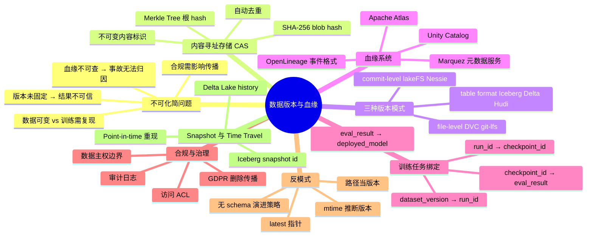

### 导 — 读完本章你应该能回答

1. 为什么用文件路径或"latest"指针标识训练数据是生产事故的根源？Content-Addressable Storage 如何从根本上解决这个问题？
2. DVC、lakeFS、Iceberg 三种数据版本化方案分别在什么数据规模、数据类型和团队规模下是最合适的选择？
3. 血缘图（lineage DAG）的最小必要结构是什么？一个 training_run 需要记录哪些血缘边才能支持完整的事故归因？
4. Iceberg 的 snapshot 机制和 Delta Lake 的 transaction log 在实现细节上有什么本质差异？各自的 time travel 查询如何执行？
5. GDPR "被遗忘权"删除请求到达时，数据版本系统需要执行哪些步骤？哪些步骤可以自动化，哪些需要人工决策？
6. Schema evolution 的 backward compatible 和 forward compatible 在 AI 训练场景下分别意味着什么风险？
7. 如何设计一个 RAG 系统的文档索引版本管理，使得每次重新生成索引都能精确对应某个文档版本快照？

---

## 11e.2 为什么数据版本是生产事故的根本原因

### 不可复现的事故剧本

2026 年 3 月，某推荐系统线上模型质量出现 3% 的 NDCG 退化。工程师排查两周后确认：

- 模型代码未变（有 git commit hash 证明）
- 训练超参未变（有 mlflow 日志证明）
- 但训练数据的"路径"对应的内容，在训练 run 结束后被上游数据工程师静默覆盖了（修复了去重 bug），导致无法复现原始训练数据视图。

这个剧本在 AI 平台上高频发生，根本原因是：**大多数团队对模型版本化（用 git hash 固定代码）的严格程度，远高于对数据版本化的严格程度。**

| 维度 | 常见实践 | 问题 |
|------|----------|------|
| 代码 | git commit hash，不可变 | 无问题 |
| 超参 | mlflow / wandb 日志 | 通常可重现 |
| 训练数据 | `s3://bucket/data/train/` 路径 | 内容随时可被覆盖 |
| 评测数据 | 同上 | 同上，且 valid set 常被污染 |
| 数据处理脚本 | 有时在 git，有时是临时脚本 | 版本不固定 |

> **反模式警告**：用 S3 路径当数据版本，等价于用"文件名"当代码版本，然后随时覆盖文件内容。这在软件工程里是不可接受的，在 AI 数据工程里同样不可接受。

### 三大根因

**根因一：数据的可变性（Mutability）。** 文件系统和对象存储默认允许覆盖写。一个路径指向的内容随时可以被 `aws s3 cp` 或 `hdfs dfs -put` 覆盖，而不留下任何版本记录。

**根因二：版本意识的缺失。** 数据工程师在修复数据问题时，习惯"原地更新"而非"发布新版本"。这种习惯在小团队小数据集时无害，但在平台规模下会传播到所有下游训练 run。

**根因三：版本粒度的错误。** 即使有版本意识，很多团队用"文件夹 + 日期后缀"管理版本（`data/train_2026-03-01/`），这既无法保证内容不变（日期文件夹里的文件仍然可以被修改），也无法支持精确的血缘查询。

> **工程边界**：一个正确的数据版本标识符必须满足：（1）唯一标识内容（不仅仅是时间或路径）；（2）不可变，一旦发布不允许修改；（3）可寻址，任意时刻都能根据版本号重新访问到对应内容。

---

## 11e.3 Content-Addressable Storage（CAS）：版本的物理基础

### 核心机制

Content-Addressable Storage 的核心思想：**内容的 hash 值就是内容的地址（和版本）。**

```text
文件内容 → SHA-256 哈希 → "0a3f7c..." → 作为存储 key
                                        ↓
                           读取时用同样的 key → 得到同样的内容
```

这个设计自动保证了三个性质：

1. **不可变性**：同一个 hash 永远指向同一个内容，不可能被覆盖
2. **去重**：相同内容只需存储一次（hash 相同 → 已存在 → 跳过写入）
3. **可验证性**：读出内容后重新计算 hash，与存储 key 比对，可以检测静默损坏（silent corruption）

### Merkle Tree：把 CAS 扩展到数据集

单个文件的 SHA-256 hash 解决了单文件的版本问题。整个数据集包含数十万个文件，需要 Merkle Tree：

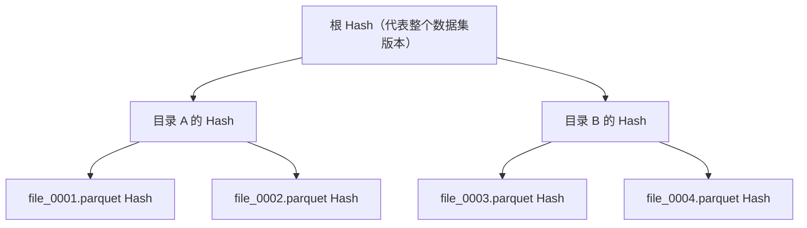

Merkle Tree 的关键性质：**任何一个叶子节点（文件）的变化，会向上传播到根 hash，使根 hash 改变。**

这意味着：
- 根 hash 变了 → 数据集一定变了
- 根 hash 没变 → 数据集一定没变（以 SHA-256 碰撞概率为界，工程上视为零）

DVC、git-lfs 的版本机制本质上都是 Merkle Tree 的一种实现。

### 去重（Deduplication）的工程价值

在 AI 数据管理中，CAS 去重有两个高价值场景：

| 场景 | 没有 CAS 去重 | 有 CAS 去重 |
|------|---------------|-------------|
| 数据集版本迭代 | 每个版本完整拷贝，存储成本 O(N×V) | 增量存储 delta，成本 O(N + delta) |
| 多任务共享数据 | 相同原始数据在不同任务目录各存一份 | 相同 hash 只存一份，不同版本的元数据指向同一 blob |
| 数据集回滚 | 需要重建历史数据 | 直接切换到旧版本的根 hash，无需数据迁移 |

> **工程边界**：CAS 去重的代价是增加了一次 hash 计算。SHA-256 在现代 CPU 上的速度约为 2-4 GB/s（软件实现），对于训练时的批量写入，这个开销通常可以接受。但对于流式数据（streaming）或超高频更新（每秒数千次写入），需要评估 hash 计算是否成为瓶颈。

---

## 11e.4 三种主流数据版本化模式

### 模式对比

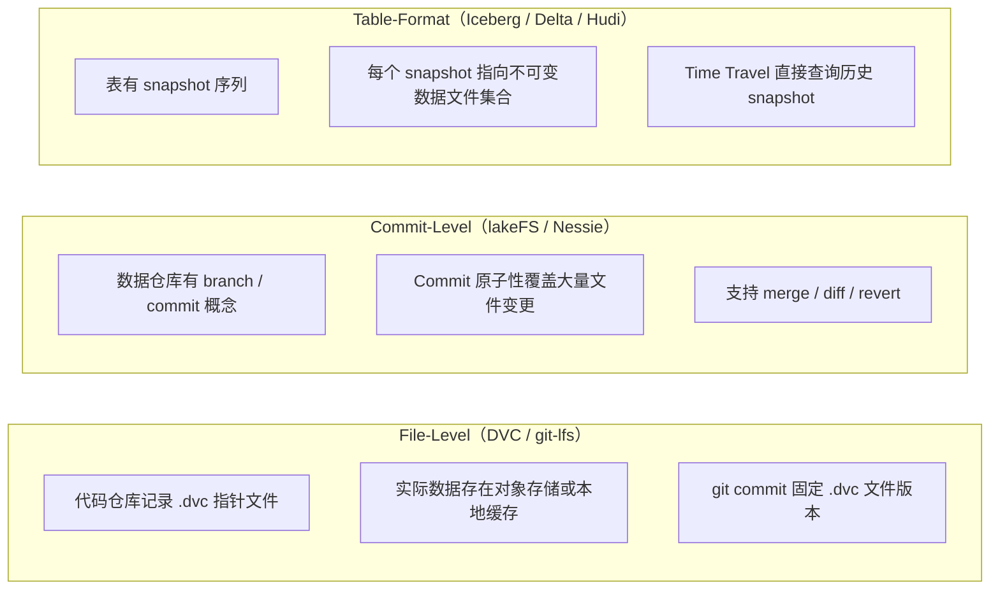

| 维度 | File-Level（DVC） | Commit-Level（lakeFS） | Table-Format（Iceberg/Delta） |
|------|-------------------|------------------------|-------------------------------|
| 版本粒度 | 单文件或目录 | 整个数据湖的 commit | 单张表的 snapshot |
| 数据规模适用 | <100GB | 100GB - PB | 100GB - PB |
| 数据类型 | 任意（文件） | 任意（文件） | 结构化/半结构化 |
| Git 语义 | 有（通过 .dvc 文件） | 有（branch/merge/PR） | 无，但有 snapshot 序列 |
| Time Travel | 无（需手动回滚） | 有（commit hash） | 有（snapshot id / timestamp） |
| Schema 演进 | 无内置支持 | 无内置支持 | 内置支持（backward/forward） |
| 查询引擎集成 | 无 | 有（S3 兼容 API） | 有（Spark/Trino/Flink/DuckDB） |
| 适用场景 | ML 实验文件、模型权重、中小型数据集 | 多团队协作数据湖、数据分支开发 | 生产 lakehouse、特征存储、分析查询 |

### 模式一：File-Level 版本化（DVC / git-lfs）

DVC（Data Version Control）把数据版本和代码版本通过 `.dvc` 指针文件绑定在同一个 git 仓库中：

```bash
# 将数据集纳入 DVC 管理
dvc add data/train_v3/
git add data/train_v3.dvc .gitignore
git commit -m "Add train_v3 dataset"

# 切换到历史版本
git checkout <commit_hash>
dvc checkout  # 自动拉取对应版本的数据
```

`.dvc` 文件内容示例：
```yaml
outs:
- md5: a1b2c3d4e5f6...  # 内容 hash
  size: 45000000000     # 45 GB
  path: data/train_v3/
```

> **工程边界**：DVC 在 <100GB 单版本、<1TB 总存储（含历史版本）的场景工作良好。超过这个规模，每次 `dvc push/pull` 的网络传输成本和本地存储需求会成为瓶颈。

### 模式二：Commit-Level 版本化（lakeFS / Project Nessie）

lakeFS 在对象存储（S3、GCS、Azure Blob）之上实现了 git 语义：

```bash
# 创建数据开发分支
lakectl branch create lakefs://repo/feature/new-cleaning-rules \
  --source lakefs://repo/main

# 在分支上修改数据
lakectl fs upload lakefs://repo/feature/new-cleaning-rules/train/...

# 对比分支差异
lakectl diff lakefs://repo/main lakefs://repo/feature/new-cleaning-rules

# 合并到主干
lakectl merge lakefs://repo/feature/new-cleaning-rules lakefs://repo/main
```

lakeFS 的核心价值：**把"数据评审（data review）"变成可操作的工程流程**，而不是口头约定。新的数据清洗规则在分支上测试，验证通过后才合并主干，训练任务只消费主干上的稳定版本。

### 模式三：Table-Format 版本化（Iceberg / Delta Lake / Hudi）

Apache Iceberg 的快照（snapshot）机制是生产 lakehouse 中最成熟的数据版本化方案：

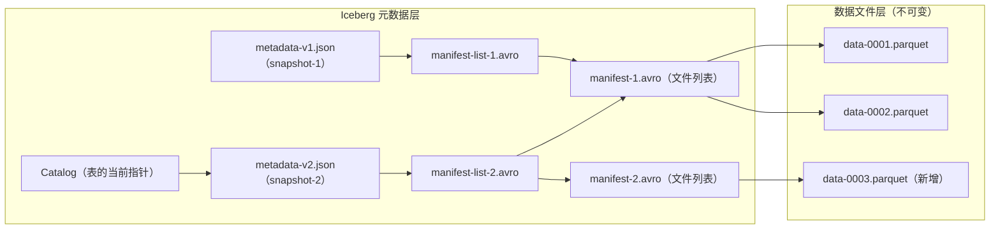

Time Travel 查询：
```sql
-- 查询某个 snapshot 时的数据视图
SELECT * FROM training_data
FOR SYSTEM_VERSION AS OF 5432109876;  -- snapshot id

-- 查询某个时间点的数据视图
SELECT * FROM training_data
FOR SYSTEM_TIME AS OF '2026-03-14 12:00:00';

-- 查看 snapshot 历史
SELECT * FROM training_data.snapshots;
```

> **工程边界**：Iceberg snapshot 的元数据开销约为每 1000 个数据文件产生 1 个 manifest 文件（约 50-200KB）。一张有 100 万个 parquet 文件的大表，snapshot 元数据约为 50-200GB，需要为元数据层规划独立存储和缓存。

---

## 11e.5 Lineage Tracking：从数据到模型的完整血缘

### 血缘的最小必要结构

一个 AI 训练系统的血缘图（lineage DAG）至少需要记录以下节点和边：

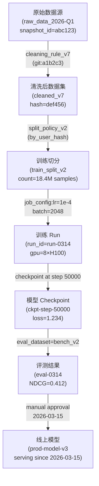

每条边上的元数据称为 **provenance metadata**，是归因的关键。缺少这些元数据，血缘图就只是节点列表，而不是可查询的因果链。

### OpenLineage：统一的血缘事件格式

OpenLineage 是 CNCF 项目，定义了一个与工具无关的血缘事件规范：

```json
{
  "eventType": "COMPLETE",
  "eventTime": "2026-03-14T12:00:00Z",
  "run": {
    "runId": "run-0314-uuid",
    "facets": {
      "jobConfig": {
        "learning_rate": 1e-4,
        "batch_size": 2048,
        "epochs": 3
      }
    }
  },
  "job": {
    "namespace": "ai-platform",
    "name": "train_recommendation_model"
  },
  "inputs": [
    {
      "namespace": "s3://ml-data",
      "name": "train_split_v2",
      "facets": {
        "datasetVersion": {"version": "def456"}
      }
    }
  ],
  "outputs": [
    {
      "namespace": "s3://ml-models",
      "name": "ckpt-step-50000",
      "facets": {
        "datasetVersion": {"version": "ghi789"}
      }
    }
  ]
}
```

兼容 OpenLineage 的工具包括：Airflow（内置）、dbt（插件）、Spark（OpenLineage Spark agent）、Flink、以及自定义 SDK。

### 血缘平台选型

| 平台 | 定位 | 核心能力 | 适用规模 |
|------|------|----------|----------|
| Marquez | OpenLineage 参考实现，轻量 | 血缘图存储与查询 API | 中小团队，开源自部署 |
| OpenMetadata | 全功能数据治理平台 | 血缘 + 数据目录 + 质量 | 中大型团队 |
| Unity Catalog（Databricks） | Lakehouse 统一治理 | 血缘 + 访问控制 + Delta Lake 集成 | Databricks 生态 |
| Apache Atlas | Hadoop/云原生生态 | 血缘 + 分类 + 标签 + 政策 | 大型企业，Hadoop 生态 |
| DataHub（LinkedIn） | 元数据搜索与发现 | 全链路血缘 + 数据目录 | 大型团队，多数据源 |

> **工程边界**：血缘平台的引入会给每个数据处理 job 增加约 50-200ms 的 OpenLineage 事件发送延迟。对于批处理 job，这个开销可以接受；对于流处理或在线特征计算，需要评估是否使用异步发送。

---

## 11e.6 训练任务血缘：强绑定的完整链路

### AI Infra 视角的血缘完整性要求

从 AI Infra 工程视角，以下绑定关系必须是强绑定（hard binding），而不是软记录（soft logging）：

```
dataset_version → training_run → checkpoint → eval_result → deployed_model
```

"强绑定"的含义：

1. **不能在训练启动后修改 dataset_version**：训练 run 启动时，dataset_version 必须被固定并写入 run 的不可变元数据，此后即使原始数据被修改，run 的记录也不会改变。
2. **checkpoint 必须记录生成它的 training_run**：不允许存在"来源不明的 checkpoint"。
3. **eval_result 必须记录使用的 checkpoint 版本和 eval_dataset 版本**：不允许"不知道评测用的哪个模型"。
4. **deployed_model 必须指向具体的 checkpoint**：不允许"latest"指针指向模型服务。

### 训练 run 元数据最小规范

```yaml
run_id: run-0314-a1b2c3
started_at: 2026-03-14T08:00:00Z
finished_at: 2026-03-14T20:00:00Z
status: COMPLETE

# 强绑定：训练数据
dataset:
  name: train_split_recommendation_v2
  version: def456abc789  # 不可变 hash，不允许是路径或 "latest"
  snapshot_id: 5432109876  # Iceberg snapshot id（如果使用 Iceberg）
  record_count: 18_400_000
  schema_version: schema-v5

# 强绑定：代码和配置
code:
  git_commit: a1b2c3d4e5f6
  config_hash: 9f8e7d6c5b4a

# 强绑定：训练环境
environment:
  framework: pytorch-2.2.0
  cuda: 12.2
  nodes: 4
  gpus_per_node: 8
  gpu_type: H100-SXM5-80GB

# 输出：checkpoints
checkpoints:
  - step: 10000
    path: s3://models/ckpt-step-10000/
    hash: ck10000hash
  - step: 50000
    path: s3://models/ckpt-step-50000/
    hash: ck50000hash
```

> **反模式警告**：不允许在 dataset 字段填写 `s3://ml-data/train/latest/` 或 `s3://ml-data/train/2026-03-14/`。路径可以随时改变内容，只有内容 hash 才能真正固定版本。

---

## 11e.7 Snapshot 与 Time Travel：重现训练时的数据视图

### 为什么 Time Travel 是 AI Infra 的必需功能

一个常见的生产需求：**用 6 个月前的数据重新训练，验证当时的数据是否存在问题。**

如果没有 time travel：
- 需要人工查找 6 个月前的数据备份（可能不存在）
- 需要手动"撤销"所有这期间的数据修改（不可能精确）
- 实际上无法重现 6 个月前的精确数据视图

如果有 Iceberg time travel：
```sql
-- 直接重现 6 个月前的数据状态
SELECT * FROM training_data
FOR SYSTEM_TIME AS OF '2025-09-01 00:00:00'
LIMIT 1000;

-- 验证该时间点的数据量
SELECT COUNT(*) FROM training_data
FOR SYSTEM_TIME AS OF '2025-09-01 00:00:00';
```

### Delta Lake Time Travel

Delta Lake 通过 transaction log 实现类似功能：

```python
# PySpark 使用 Delta Lake time travel
df = spark.read.format("delta") \
    .option("timestampAsOf", "2025-09-01") \
    .load("s3://ml-data/training_data/")

# 或者使用 version
df = spark.read.format("delta") \
    .option("versionAsOf", 42) \
    .load("s3://ml-data/training_data/")

# 查看历史版本
from delta.tables import DeltaTable
dt = DeltaTable.forPath(spark, "s3://ml-data/training_data/")
dt.history().show()
```

### Iceberg vs Delta Lake vs Hudi 核心对比

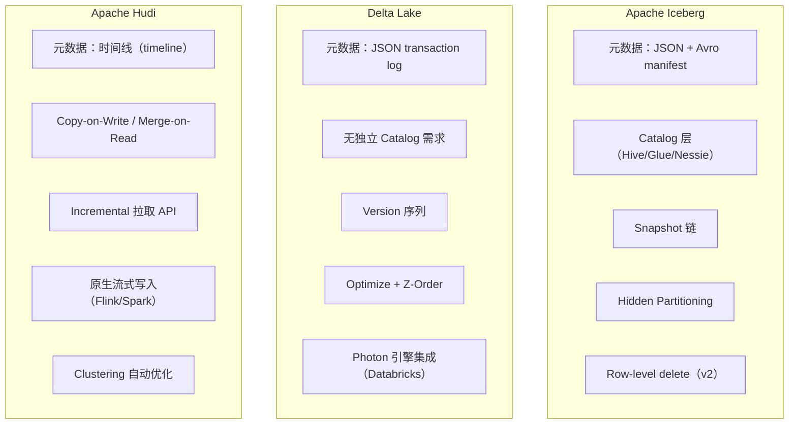

| 维度 | Iceberg | Delta Lake | Hudi |
|------|---------|------------|------|
| 元数据格式 | JSON + Avro manifest | JSON transaction log | Parquet + avro timeline |
| Catalog 依赖 | 需要独立 Catalog 服务 | 无强依赖 | 无强依赖 |
| Time Travel | snapshot id / timestamp | version / timestamp | instant time |
| 流式写入 | 支持（Flink/Spark） | 支持（Spark Streaming） | 原生优化，最强 |
| 批量查询性能 | 最强（manifest 裁剪） | 强（Z-Order） | 中（视模式而定） |
| Row-level update | v2 支持（Equality delete） | 支持（MERGE INTO） | 原生（MoR 模式） |
| 社区生态 | 最广（Netflix、Apple） | Databricks 主导 | Uber、字节跳动 |
| AI 训练场景推荐 | 优先（快照语义最清晰） | 次选（Databricks 生态） | 流式特征更新场景 |

---

## 11e.8 Schema Evolution：向前兼容与向后兼容

### Schema Evolution 在 AI 场景的特殊性

AI 训练数据的 schema evolution 比纯数据分析场景更复杂，因为 schema 变化直接影响模型输入：

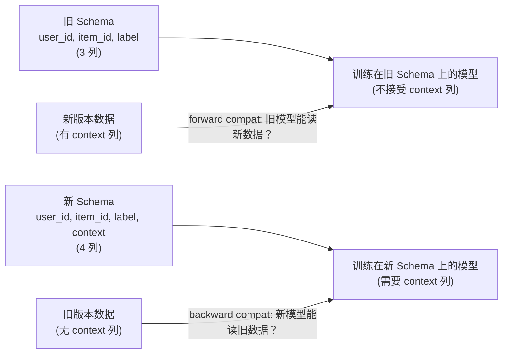

### 两种兼容性定义

**Backward Compatible（向后兼容）**：新 schema 能读取旧格式的数据。
- 允许：新增列（旧数据该列为 null）
- 允许：删除列（新 schema 不再使用该列）
- 不允许：修改已有列的类型（int → string）
- 不允许：修改已有列的语义（"label=1 表示正样本"→"label=1 表示负样本"）

**Forward Compatible（向前兼容）**：旧 schema 能读取新格式的数据。
- 允许：新增列（旧代码忽略未知列）
- 不允许：删除旧 schema 中已有的列

| 操作 | Backward Compat | Forward Compat | AI 训练风险 |
|------|-----------------|----------------|-------------|
| 新增可选列 | 是 | 是 | 低（旧模型忽略新列） |
| 新增必填列 | 否 | 是 | 中（旧数据该列为 null，需处理缺失） |
| 删除列 | 是 | 否 | 高（新 schema 无该列，旧模型崩溃） |
| 修改列类型（扩展） | 是（int→long） | 否 | 中（精度损失） |
| 修改列类型（缩减） | 否 | 是 | 高（数据截断） |
| 重命名列 | 否 | 否 | 极高（静默语义错误） |

> **工程边界**：AI 训练场景中，最危险的 schema 变化是**重命名列**（如把 `click_label` 改为 `purchase_label`），因为这不会引发解析错误，但会导致模型学习到错误的标签语义，且这种错误通常只在线上出现质量下降后才被发现。

### Iceberg Schema Evolution 实践

```sql
-- Iceberg 支持的 schema 演进操作
ALTER TABLE training_data ADD COLUMN context_vector ARRAY<FLOAT>;
ALTER TABLE training_data DROP COLUMN deprecated_feature;
ALTER TABLE training_data RENAME COLUMN old_name TO new_name;  -- 危险！需评审

-- 查看 schema 版本历史
SELECT * FROM training_data.history;
```

Iceberg 对每个 schema 变更分配一个新的 schema_id，每个 snapshot 记录它使用的 schema_id，实现 schema 和数据版本的联动追踪。

---

## 11e.9 大数据 Lakehouse 架构：S3 + Iceberg + 元数据服务

### 生产形态

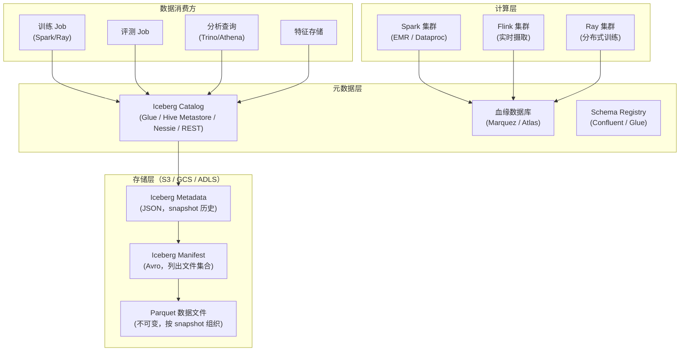

### 关键组件说明

**Iceberg Catalog**：表的注册表，记录每张表当前指向的 metadata 文件路径。常用实现：
- AWS Glue Data Catalog（托管，与 EMR/Athena 原生集成）
- Project Nessie（开源，支持 git-like branch/merge 操作）
- Hive Metastore（传统，需要额外配置支持 Iceberg）
- Iceberg REST Catalog（2023 年后推荐，标准化 API）

**元数据服务的性能要求**：训练 Job 启动时需要读取 manifest 列表来确定数据文件集合。一张有 100 万个 parquet 文件的表，其 manifest 列表可能有 1000 个 manifest 文件（每个 manifest 管理约 1000 个数据文件），读取这些 manifest 是训练 Job 的冷启动开销（通常 30-120 秒）。

> **工程边界**：生产 Iceberg 表应该定期执行 `REWRITE MANIFESTS` 和 `EXPIRE SNAPSHOTS` 操作，防止元数据层无限膨胀。一般策略是保留最近 30 天的 snapshot，更早的 snapshot 通过 expire 清理（但对应的数据文件若被当前 snapshot 引用则不删除）。

---

## 11e.10 数据合规与可追溯性：GDPR 和审计要求

### GDPR 删除请求的传播链路

当一个 GDPR 删除请求到达时，系统需要执行：

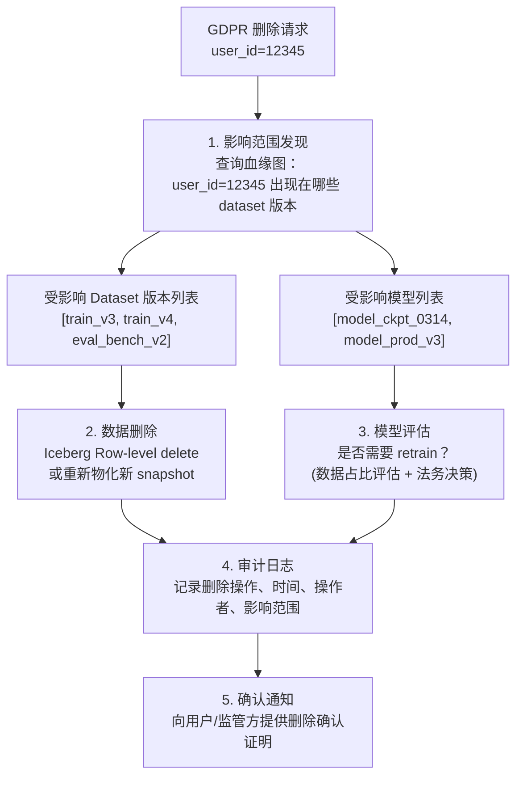

### 合规检查清单

| 检查项 | 技术实现 | 合规要求 |
|--------|----------|----------|
| 数据主体识别 | 每条数据携带可追溯 user_id（加密或假名化） | GDPR Art.4 |
| 同意记录 | 同意事件写入不可变日志，与数据版本绑定 | GDPR Art.7 |
| 访问控制 | 数据集级别 ACL，基于角色的访问（RBAC） | GDPR Art.32 |
| 数据目录 | 所有数据集在元数据系统中注册，有数据负责人 | GDPR Art.30 |
| 删除能力 | Row-level delete 或重新物化，有审计日志 | GDPR Art.17 |
| 数据最小化 | 训练集中只保留必要的 PII，不保留原始 PII | GDPR Art.5 |
| 跨境传输 | 数据存储位置在元数据中标注，有传输协议记录 | GDPR Art.44 |
| 模型影响评估 | 血缘图支持查询"删除 X 条样本影响哪些模型" | 监管最佳实践 |

> **工程建议**：GDPR 合规不应该是事后补救，而应该在数据版本系统设计阶段就引入 privacy-by-design 原则。最简单的方法是：从训练数据进入系统开始就用假名化 ID，并建立 ID 映射表（仅合规团队可访问），使删除操作只需要在 ID 映射表中删除记录，而不需要重新物化整个数据集。

### 审计日志的最低要求

```json
{
  "audit_event": {
    "timestamp": "2026-03-14T12:00:00Z",
    "actor": "user@company.com",
    "action": "READ",
    "resource": {
      "type": "DATASET",
      "name": "train_recommendation_v3",
      "version": "def456"
    },
    "purpose": "MODEL_TRAINING",
    "run_id": "run-0314",
    "outcome": "SUCCESS",
    "data_classification": "CONFIDENTIAL"
  }
}
```

审计日志必须是不可篡改的（append-only），可以存储在：对象存储（配置 Object Lock）、Kafka（保留策略 7 年）、或专用审计数据库（如 Immudb）。

---

## 11e.11 与 Model Registry 的协同（→ Ch 12a）

### 数据版本到模型注册的完整链路

Model Registry（详见 [第 12a 章](12-artifacts-and-checkpoints.md)）是数据版本体系的下游消费方。两个系统必须通过强绑定的版本 ID 相互引用：

| 数据版本系统记录 | Model Registry 记录 | 绑定方式 |
|-----------------|---------------------|----------|
| dataset_version: def456 | training_run: run-0314 | run 元数据中记录 dataset_version |
| training_run: run-0314 | checkpoint: ckpt-50000 | checkpoint 元数据中记录 run_id |
| checkpoint: ckpt-50000 | model_version: prod-v3 | model 元数据中记录 checkpoint_id |
| model_version: prod-v3 | eval_result: eval-0314 | eval 元数据中记录 model_version + eval_dataset_version |

"强绑定"的实现方式：在 Model Registry API 中，`register_model()` 接口的 `source_run_id` 字段是必填项，而 `source_run_id` 又被训练平台强制关联到不可变的 `dataset_version`。这样形成一条从数据到模型的不可断裂链路。

> **反模式**：在 Model Registry 中注册一个模型，但 `source_run_id` 为空，或者 `source_run_id` 对应的 run 元数据中 `dataset_version` 字段为"未记录"。这种情况意味着该模型的来源数据无法追溯，合规团队无法完成 GDPR 影响评估。

---

## 11e.12 反模式：版本管理的常见错误

### 反模式一：用 "latest" 指针

```python
# 错误示范
train_data = load_dataset("s3://ml-data/train/latest/")
```

**问题**：`latest/` 指向的内容随时可能改变。今天运行的训练 run 和昨天运行的使用了相同的"路径"，但实际上看到了不同的数据。

**正确做法**：
```python
# 正确示范
train_data = load_dataset(
    path="s3://ml-data/train/",
    snapshot_id=5432109876,  # Iceberg snapshot id
    # 或者
    version_hash="def456abc789"  # DVC content hash
)
```

### 反模式二：用 mtime 推断版本

```bash
# 错误示范：根据文件修改时间判断数据是否"最新"
if [ $(stat -c %Y data/train.parquet) -gt $LAST_TRAIN_TIME ]; then
    echo "数据已更新，重新训练"
fi
```

**问题**：mtime 在文件系统挂载、文件系统修复、rsync 同步、时区变更后都可能不可靠。而且 mtime 只告诉你文件"什么时候变了"，不告诉你"变成了什么"。

### 反模式三：用路径前缀当版本

```python
# 错误示范
version = "2026-03"  # 用月份当版本
data_path = f"s3://ml-data/train/{version}/"
```

**问题**：`2026-03/` 路径下的文件在整个月内都可以被修改，3 月 1 日和 3 月 31 日运行的训练看到的数据可能完全不同。

### 反模式四：忽略数据集的 schema 变更

**问题**：上游数据工程师增加了一个新列，下游训练代码没有处理该列，但因为 Parquet 的列存储特性，旧代码读取新数据时不会报错——它只是静默忽略了新列。如果这个新列携带了重要的特征信息，模型性能损失也不会立即显现。

> **工程边界**：建立 schema 变更的通知和评审机制。使用 Schema Registry 强制校验新数据的 schema 与训练代码期望的 schema 一致，不一致时阻断数据管道并告警。

---

## 11e.13 Worked Example：RAG 系统与微调模型的全链路版本管理

### 场景描述

一个企业级 RAG（Retrieval-Augmented Generation）系统包含两条数据链路：
1. **文档索引链路**：企业内部文档 → 清洗 → 分块 → 向量化 → 向量数据库索引
2. **模型微调链路**：用户 Q&A 历史 → 清洗 → 微调数据集 → 微调 Embedding 模型 + LLM

需要设计一个版本管理方案，使两条链路都可以被完整追溯和复现。

### 文档索引版本管理

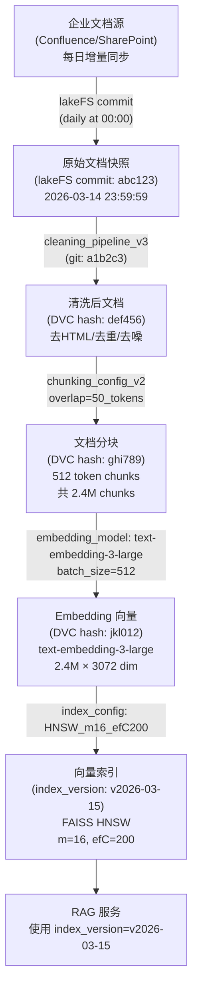

每次文档源更新后，通过以下命令检查哪些文档发生了变化，只对变化部分重新处理：

```bash
# 对比两个 lakeFS commit 的差异
lakectl diff \
  lakefs://rag-docs/main@2026-03-13T23:59:59Z \
  lakefs://rag-docs/main@2026-03-14T23:59:59Z

# 输出：仅有变化的文档列表
# Modified: docs/product/manual_v2.pdf
# Added: docs/hr/policy_2026.docx
# Deleted: docs/legacy/old_api.md
```

索引版本元数据：
```yaml
index_version: v2026-03-15
created_at: 2026-03-15T06:00:00Z

# 完整血缘记录
provenance:
  raw_snapshot: abc123  # lakeFS commit hash
  cleaned_docs_hash: def456  # DVC hash
  chunks_hash: ghi789  # DVC hash
  embedding_vectors_hash: jkl012  # DVC hash
  embedding_model: text-embedding-3-large
  embedding_model_version: 2024-10-21
  chunking_config:
    strategy: sliding_window
    chunk_size: 512
    overlap: 50
  index_config:
    type: FAISS_HNSW
    m: 16
    ef_construction: 200

statistics:
  total_documents: 45_230
  total_chunks: 2_400_000
  changed_documents: 127  # 相比上个版本
  added_documents: 23
  deleted_documents: 8
```

### 微调数据集版本管理

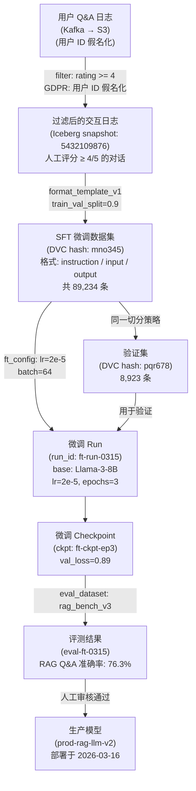

### 全链路血缘可视化查询

使用 Marquez API 查询血缘：

```python
import requests

# 查询生产模型 prod-rag-llm-v2 的上游血缘
response = requests.get(
    "http://marquez:5000/api/v1/lineage",
    params={
        "nodeId": "job:ai-platform:prod-rag-llm-v2",
        "depth": 5  # 往上追溯 5 层
    }
)

lineage = response.json()
# 输出完整的 DAG：
# prod-rag-llm-v2 ← ft-ckpt-ep3 ← ft-run-0315
#                                 ← sft_dataset (mno345)
#                                   ← filtered_logs (snapshot: 5432109876)
#                                     ← qa_logs (Kafka topic: user-interactions)
```

当 GDPR 删除请求到达时，执行影响分析：

```python
def gdpr_impact_analysis(user_id: str):
    """
    查询 user_id 对应的假名化 ID 出现在哪些数据集和模型中。
    """
    pseudonym = lookup_pseudonym(user_id)  # 仅合规团队有权限
    
    # 查询该用户数据出现的所有 Iceberg snapshot
    affected_snapshots = spark.sql(f"""
        SELECT snapshot_id, table_name, COUNT(*) as records
        FROM data_lineage_catalog
        WHERE contains_user_id = '{pseudonym}'
        GROUP BY snapshot_id, table_name
    """).collect()
    
    # 查询这些 snapshot 被哪些 training_run 使用
    affected_runs = query_lineage_graph(affected_snapshots)
    
    # 查询这些 run 产生的 checkpoint 和部署的模型
    affected_models = query_downstream_models(affected_runs)
    
    return {
        "user_id": user_id,  # 仅在报告中显示，不存储
        "affected_datasets": affected_snapshots,
        "affected_training_runs": affected_runs,
        "affected_deployed_models": affected_models,
        "recommendation": "需要法务评估是否触发模型重训" if len(affected_models) > 0 else "仅需数据删除"
    }
```

---

## 11e.14 工程建议与反模式总结

### 建立数据版本管理的优先级

| 团队规模 | 推荐方案 | 最小投入 |
|----------|----------|----------|
| 1-5 人 | DVC + git，数据存 S3 | DVC 安装 + S3 存储 |
| 5-20 人 | lakeFS 或 Iceberg + Glue Catalog | 1 台 lakeFS 实例或 AWS Glue |
| 20-100 人 | Iceberg + Nessie + Marquez | 独立元数据服务 + 血缘平台 |
| 100+ 人 | Unity Catalog 或 DataHub + Iceberg | 全功能数据治理平台 |

### 版本化的最低配置

无论规模大小，以下三条必须满足：

1. **训练 Run 启动时，数据版本 ID 必须被固定并写入 Run 元数据**（不允许使用路径或 latest）
2. **同一训练 Run 不允许中途切换数据集版本**（即使上游数据更新了）
3. **数据版本 ID 和 git commit hash 必须一起出现在 Run 元数据中**（确保代码和数据的双版本锁定）

> **最终工程底线**：如果你只能做一件事，就做这一件：在训练启动时计算训练数据目录的 MD5/SHA-256，写入 mlflow/wandb 的 run 元数据。哪怕没有完整的版本管理系统，这一步骤也能让"数据是否发生过变化"变成可回答的问题。

---

## 本章小结

| 主题 | 要点 |
|------|------|
| 不可化简问题 | 数据可变，训练需精确复现 → 必须有不可变的版本快照机制 |
| CAS 原理 | SHA-256 hash 自动实现内容标识、去重、不可变性 |
| 三种版本模式 | file-level（DVC）/ commit-level（lakeFS）/ table-format（Iceberg/Delta） |
| 血缘追踪 | OpenLineage 事件 → Marquez/Atlas 存储 → 支持 GDPR 影响传播查询 |
| 训练任务绑定 | dataset_version → run_id → checkpoint_id → eval_result → deployed_model |
| Time Travel | Iceberg snapshot id / Delta Lake version 支持重现历史数据视图 |
| Schema Evolution | 向后/向前兼容的选择直接影响模型训练的稳定性 |
| 合规 | GDPR 删除请求需要数据版本系统支持"影响传播"查询 |
| 反模式 | latest 指针、mtime 版本推断、路径当版本是三大最常见错误 |

---

## 练习题

**11e-1**：列举三个在实际 AI 项目中"数据版本未固定"导致无法复现训练结果的具体场景，说明每个场景的根本原因和预防方法。

**11e-2**：用 SHA-256 内容哈希解释：为什么 CAS 能同时实现去重和不可变性？在 2 亿个 1KB 文件的数据集上，CAS 去重能节省多少存储空间（假设重复率 30%）？

**11e-3**：比较 DVC、lakeFS、Apache Iceberg 三种方案在以下场景中的适用性：（a）个人实验室的 10GB 图像数据集；（b）多团队协作的 10TB 文本语料库；（c）生产环境每小时更新的 100TB 用户行为数据。

**11e-4**：画出一个完整的 training lineage DAG，包含原始数据源、3 个数据处理步骤、1 个训练 run、2 个 checkpoint、1 个评测结果和 1 个部署的模型。标注每条边上需要记录的 provenance metadata。

**11e-5**：使用 Apache Iceberg 的 SQL 语法，写出以下查询：（a）查看某张表最近 10 个 snapshot 的历史；（b）比较两个 snapshot 之间的数据差异；（c）将表回滚到 7 天前的 snapshot。

**11e-6**：设计一个 Schema Evolution 策略，使一个推荐系统的训练数据表能够安全地：（a）新增 embedding 向量列；（b）将 click_label 列从 INT 改为 FLOAT；（c）删除已废弃的 deprecated_feature 列。哪些变更需要特别警惕？

**11e-7**：一个 GDPR 删除请求到达，要求删除 user_id=X 的所有数据。系统中有 Iceberg 表 A（包含该用户 2000 条行为数据）、训练数据集版本 v3（基于表 A 的 snapshot）、以及用该数据集训练的线上模型 prod-v5。描述完整的处理步骤，重点说明哪些步骤可以自动化，哪些需要人工决策。

**11e-8**：解释 Iceberg 的 manifest list → manifest → data files 三层元数据结构。为什么这种结构比"直接在 metadata 文件中列出所有数据文件"更有利于大规模训练场景？

**11e-9**：对比 Iceberg 和 Delta Lake 在 time travel 实现上的核心差异：（a）元数据格式；（b）Catalog 依赖；（c）time travel 查询的执行计划。哪种方案在 AI 训练场景下更容易集成？

**11e-10**：设计一个 RAG 系统的文档版本管理方案，要求：每次文档源更新后只对变化部分重新处理；每个索引版本能够精确追溯到对应的文档快照、分块配置、Embedding 模型版本；当 RAG 质量退化时能够在 30 分钟内完成原因归因。

**11e-11**：解释为什么"用文件夹日期命名（如 `data/train_2026-03-14/`）"是一种不充分的数据版本化方案。提出一种最小化改进方案，使其满足"版本不可变"和"内容可验证"两个要求，同时不引入任何额外工具。

**11e-12**：一个训练平台规定所有训练 Job 必须通过 OpenLineage 上报血缘事件。设计一个 `TrainingJobWrapper` 类，自动在 Job 启动时发送 `START` 事件（包含 dataset_version 和 code_version），在 Job 完成时发送 `COMPLETE` 事件（包含 checkpoint_path 和 final_metrics）。

---

## 深度参考阅读

### 核心论文与规范

- **Apache Iceberg 规范**：[https://iceberg.apache.org/spec/](https://iceberg.apache.org/spec/)  
  表格式版本化的权威规范，Snapshot、Manifest、Schema Evolution 的实现细节。

- **Delta Lake 论文**：Armbrust et al., "Delta Lake: High-Performance ACID Table Storage over Cloud Object Stores," *VLDB 2020*  
  Delta Lake 的事务日志（DeltaLog）设计，与 Iceberg 的核心差异。

- **Apache Hudi 论文**：Sivaram et al., "The Apache Hudi Lake Platform," *VLDB 2023*  
  流批一体场景下的 Hudi 实现，Copy-on-Write vs Merge-on-Read 模式。

- **OpenLineage 规范**：[https://openlineage.io/spec/](https://openlineage.io/spec/)  
  血缘事件格式标准，Run/Job/Dataset facets 的完整定义。

- **lakeFS 架构**：[https://docs.lakefs.io/understand/architecture.html](https://docs.lakefs.io/understand/architecture.html)  
  对象存储上的 git 语义实现，Committed vs Uncommitted 存储机制。

### 工具文档

- **DVC 文档**：[https://dvc.org/doc](https://dvc.org/doc)  
  File-level 数据版本化，与 git 的集成模式。

- **HuggingFace Datasets Versioning**：[https://huggingface.co/docs/datasets/load_hub#load-a-dataset-from-the-hub](https://huggingface.co/docs/datasets/load_hub)  
  HuggingFace Hub 的 dataset 版本管理，适合 ML 社区标准数据集。

- **Marquez API**：[https://marquezproject.ai/](https://marquezproject.ai/)  
  OpenLineage 参考实现，血缘图存储和查询。

- **Unity Catalog**：[https://docs.databricks.com/en/data-governance/unity-catalog/](https://docs.databricks.com/en/data-governance/unity-catalog/)  
  Databricks 的统一数据治理平台，Iceberg + Delta + 访问控制 + 血缘。

- **Project Nessie**：[https://projectnessie.org/](https://projectnessie.org/)  
  Iceberg Catalog 的 git-like 分支管理，用于多团队数据协作。

### 延伸阅读

- Kleppmann, M. *Designing Data-Intensive Applications*, O'Reilly, 2017  
  第 11 章（Stream Processing）和附录（Linearizability）对理解数据一致性和版本语义有重要参考价值。

- **Lakehouse 架构论文**：Zaharia et al., "Lakehouse: A New Generation of Open Platforms that Unify Data Warehousing and Advanced Analytics," *CIDR 2021*

- **ML Metadata（MLMD）**：[https://www.tensorflow.org/tfx/guide/mlmd](https://www.tensorflow.org/tfx/guide/mlmd)  
  TFX 生态的 ML 元数据存储，涵盖 dataset → run → model 的完整血缘。

- **Feast Feature Store**：[https://docs.feast.dev/](https://docs.feast.dev/)  
  特征存储的版本管理模式，与在线/离线训练的协同。

### 学习路线

1. **入门**：理解 DVC 的基本用法，把一个本地 ML 实验的数据纳入 DVC 管理（1 天）
2. **进阶**：在 Iceberg 表上实践 Time Travel 查询，理解 snapshot 元数据结构（2 天）
3. **工程**：部署 lakeFS 或 Nessie，实践数据分支开发和 PR Review 流程（3 天）
4. **平台**：集成 OpenLineage + Marquez，实现训练任务的自动血缘上报（1 周）
5. **合规**：设计 GDPR 影响传播查询，在血缘图上实现"删除 user_id X 的影响范围分析"（1 周）
