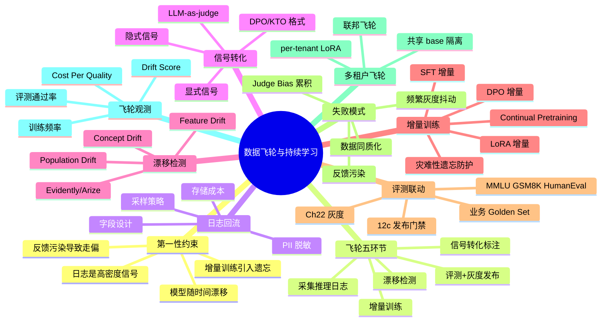
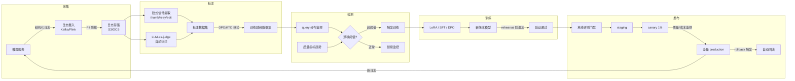
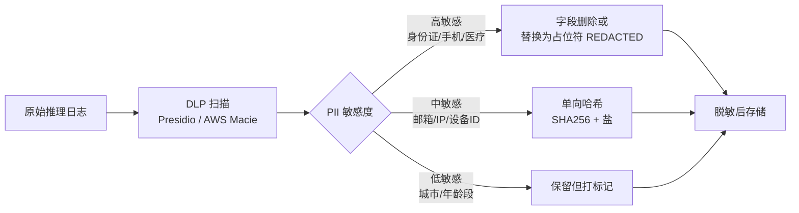
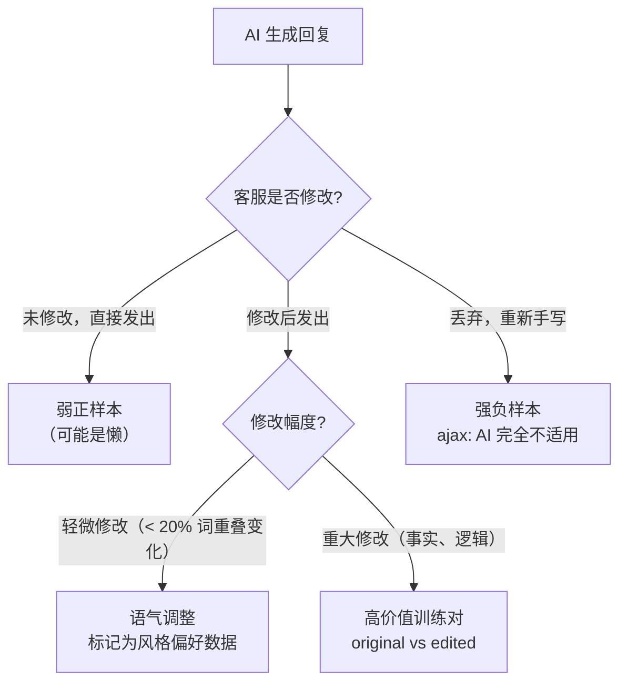
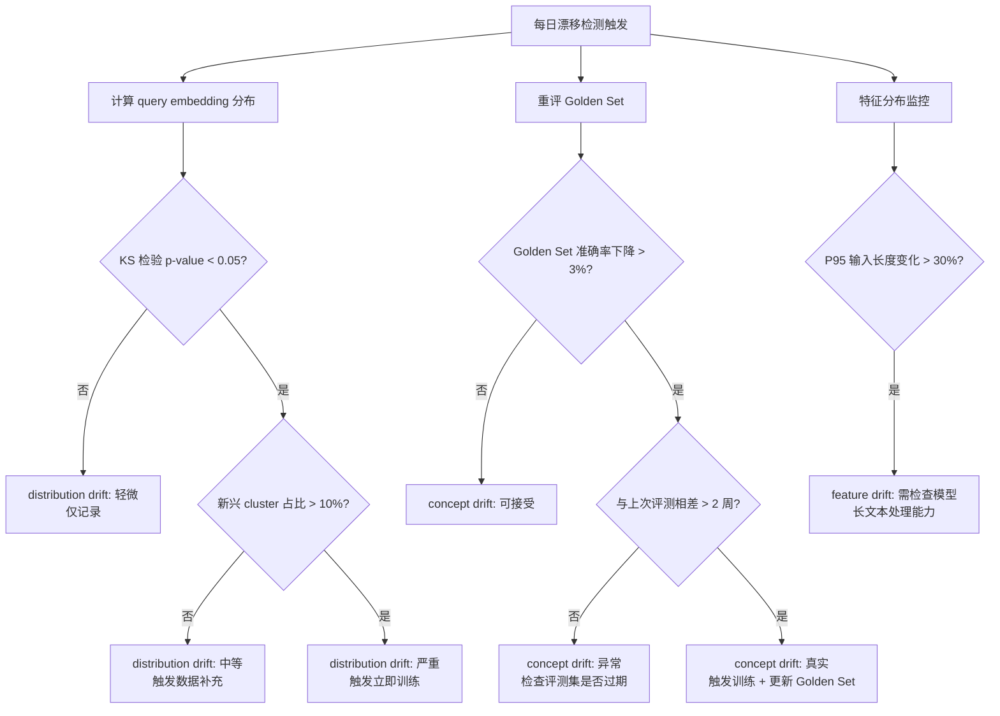
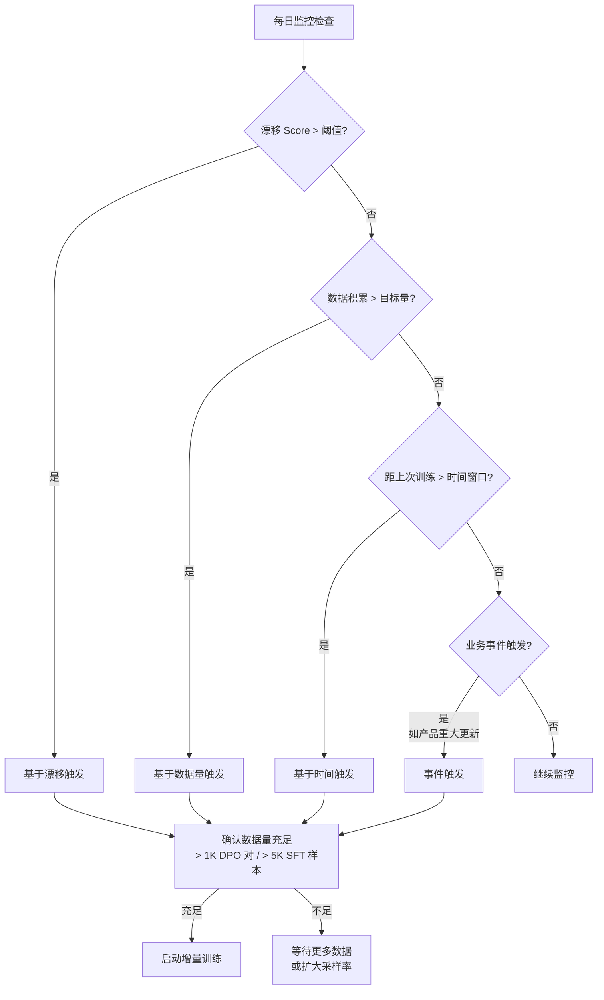
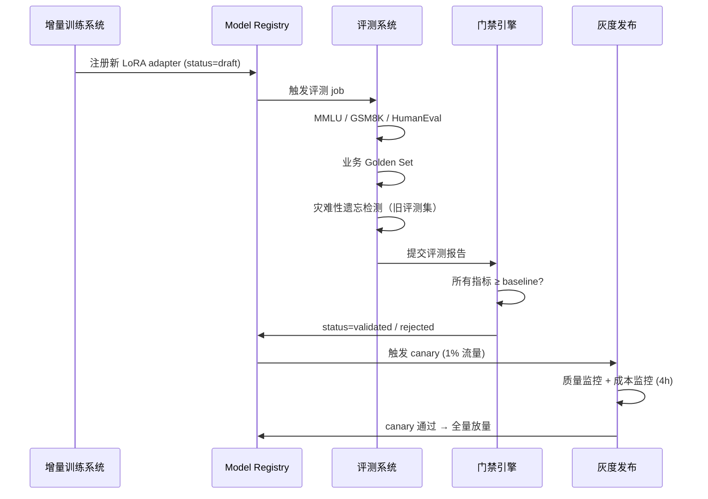
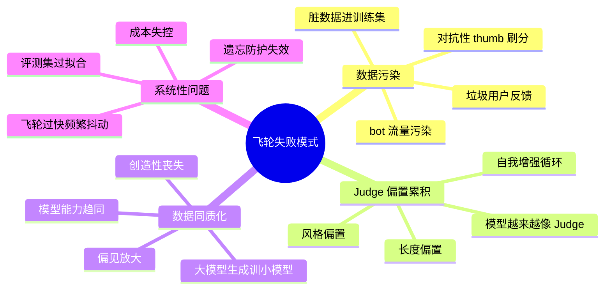
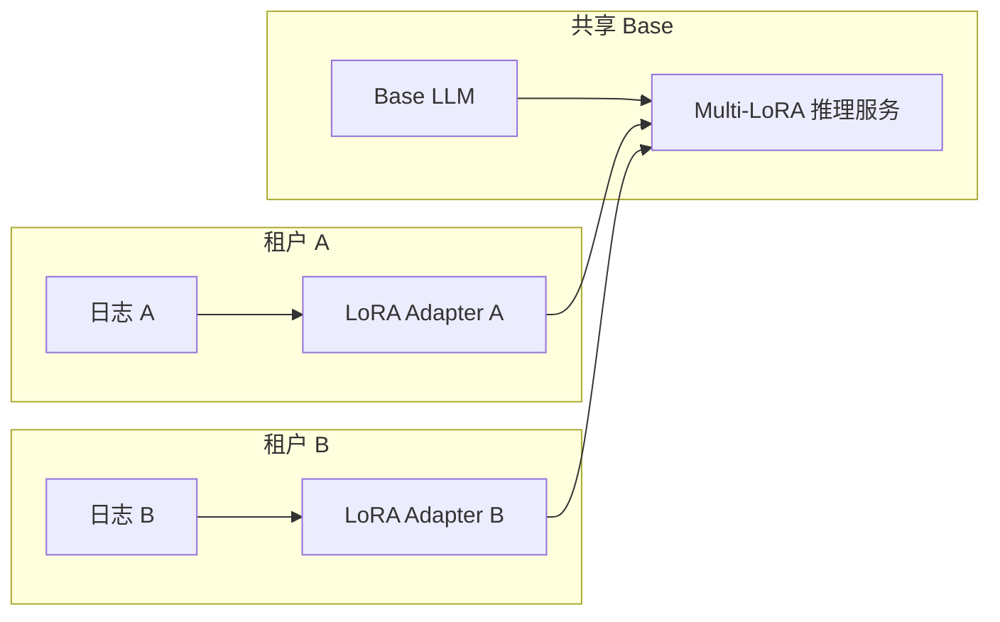

# 第 11f 章 · 数据飞轮与持续学习闭环

> 数据飞轮不是"收集更多数据"，而是把推理日志、用户反馈、漂移检测、增量训练、评测门禁和灰度发布连成一个自我强化的反馈系统——让模型每运行一天，就离用户需求更近一分。

> **关联章节**：本章整合 [第 11a 章](./11a-data-ingestion.md) 推理日志采集、[第 11e 章](./11e-data-versioning-and-lineage.md) 数据版本管理、[第 12c 章](./12c-release-governance.md) 发布门禁、[第 22 章](../part7-reliability-security/22-evaluation-release-and-incident.md) 灰度发布与评测，构建"日志回流 → 漂移检测 → 增量训练 → 评测 → 灰度发布"的完整闭环。如果你还没读 11a 和 12c，强烈建议先阅读后再进入本章。

---

## 11f.1 第一性原理拆解 + 学习大纲

### 拆 — 不可化简的问题

把 RLHF、DPO、LoRA、Evidently、Arize、Continual Learning 这些名字先拿掉，本章要解决的不可化简问题只有一个：**LLM 产品上线不是终点，而是起点——模型会随时间漂移，用户需求会持续演化，而每一次用户交互本身就是宝贵的训练信号；如果没有系统性的机制把这些信号转化成模型能力，产品就会被后来者快速赶超，最终被用户抛弃**。

这个问题有四个无法绕开的物理和工程约束。

**约束一：模型会随时间漂移，但漂移无法即时察觉。** 上线的 LLM 是在某个历史语料集上训练的快照，而现实世界持续变化：政策法规更新、产品功能迭代、用户提问风格演化、知识截止日期带来的知识缺口越来越大。这种漂移不会在一夜间爆发，而是以每周 0.1% 质量下滑的方式静默积累，直到某天突然变成用户投诉风暴。传统的离线评测无法发现漂移——因为评测集本身也是历史快照，无法捕捉"现实世界今天提出的新类型问题"。

**约束二：推理日志是高密度信号，但提取成本高昂。** 每一次用户交互都包含丰富信息：用户问了什么（query 分布）、模型如何回答（completion 质量）、用户满意吗（反馈信号）。每天数十万次对话，如果能提取出其中哪怕 1% 的高质量训练样本，积累一个月就是一个有意义的数据集。但"把日志变成训练数据"不是简单地复制粘贴——需要 PII 脱敏、质量过滤、标注、格式转换，每个步骤都有工程代价和质量风险。

**约束三：增量训练会引入灾难性遗忘，必须有精确的质量门控。** 用新数据微调模型，往往会让模型"忘记"旧能力——专注于新数据分布后，在历史测试集上的表现退化。如果没有严格的评测门禁（包括通用能力基准 + 业务 Golden Set + 安全评测），一次糟糕的增量训练就会悄然上线，导致比漂移更严重的质量崩坏。

**约束四：反馈污染和 judge 偏置会让飞轮走偏。** 用户反馈不是纯净信号——有垃圾用户、对抗用户、batch 点赞刷分，也有 LLM-as-judge 系统自身的偏置（偏好长答案、偏好特定风格）。如果飞轮的输入被污染，模型会越来越偏离真实用户需求，反而陷入"越飞越偏"的负循环。

从这四个约束出发，一个可靠的数据飞轮必须同时解决五个子问题：**如何高效采集和清洗推理日志**（第 3 节）；**如何把原始日志转化为高质量标注数据**（第 4 节）；**如何系统性地检测漂移**（第 5 节）；**如何选择合适的增量训练策略并防止遗忘**（第 6 节）；**如何与评测和灰度发布系统联动，确保每次更新安全可控**（第 7 节）。

这五个子问题之间不是简单的线性关系，而是形成一个闭环：增量训练的输出是新模型，新模型上线后产生新的推理日志，这些日志又进入下一轮的漂移检测和训练信号提取。飞轮的转速（更新频率）、质量（每轮改善幅度）和稳定性（不因污染或遗忘而崩溃）必须同时被工程化地管理。这就是本章的核心——把数据飞轮从"听起来很好"的概念变成"可以落地、可以监控、可以在出错时被快速恢复"的工程实体。

### 推 — 从这个问题如何推导出每个机制

从"模型会随时间漂移"出发，**漂移检测系统**必然出现。仅靠人工感知漂移会失之迟缓；必须用统计方法（KS 检验、Jensen-Shannon 散度）持续比较当前 query 分布与历史分布，用 embedding 聚类发现新兴话题，用监控指标捕捉 concept drift（同一类问题的"正确答案"变化）。

从"推理日志是宝贵信号"出发，**结构化日志记录**和**采样策略**必然出现。并非所有推理结果都值得保留，但采样策略必须保证不丢失罕见场景（因为恰恰是这些场景往往是模型的弱点）；同时，PII 脱敏必须在日志进入存储前完成，不能事后处理。

从"把日志变成训练数据"出发，**标注流水线**（含 LLM-as-judge 自动标注）和**偏好数据格式**（DPO/KTO）必然出现。人工标注成本高但质量最好；隐式信号（用户行为）成本低但噪声大；LLM-as-judge 是两者之间的折中，但必须持续校准 judge 的偏置。

从"增量训练会引入遗忘"出发，**训练策略选型**（LoRA 增量、SFT 增量、DPO、Continual Pretraining）和**防遗忘机制**（rehearsal、EWC）必然出现。LoRA 仅更新低秩适配器，对 base model 破坏最小，是大多数场景的首选；但 LoRA 无法修复 base model 的深层知识缺陷，此时才需要代价更高的 full fine-tune 或 continual pretraining。

从"反馈可能被污染"出发，**数据质量监控**和**异常检测**必然出现。飞轮必须有"对抗内部腐化"的机制：周期性校验 judge 质量、检查训练集分布是否异常、在发现污染时能快速隔离并回滚。

### 绘 — 因果链路



### 导 — 读完本章你应该能回答

1. 为什么 LLM 产品上线后会随时间漂移？漂移有哪三种类型，各自如何检测？
2. 推理日志必须记录哪些字段，PII 脱敏、采样策略和存储成本三者如何权衡？
3. 隐式信号和显式信号各有哪些，LLM-as-judge 方案在成本、质量和一致性上的取舍是什么？
4. DPO 和 KTO 偏好数据格式各自适合什么场景？如何从用户行为日志构建偏好对？
5. LoRA 增量、SFT 增量和 Continual Pretraining 三种增量训练策略如何选择，触发条件是什么？
6. 飞轮的失败模式有哪些，反馈污染事件如何被发现和处置？
7. 多租户飞轮的三种架构（per-tenant adapter、共享 base、联邦飞轮）各自的隔离保证和数据安全边界是什么？

### 学习 checklist

- [ ] 能描述数据飞轮五环节及每个环节的核心工程问题
- [ ] 能设计推理日志的字段 schema，并说明 PII 脱敏的时机选择
- [ ] 能区分 population drift、concept drift 和 feature drift，并为每种给出具体检测方法
- [ ] 能解释 DPO 偏好数据格式，并给出从用户行为日志构建偏好对的流程
- [ ] 能为一个具体业务场景选择增量训练策略，并说明灾难性遗忘防护机制
- [ ] 能识别飞轮运行中的至少 4 种失败模式，并说明对应的防护手段
- [ ] 能设计飞轮观测看板的核心指标集

---

## 11f.2 数据飞轮整体架构

数据飞轮的五个核心环节形成一个闭合回路，每个环节的输出是下一个环节的输入。



### 五大环节 + 四类反馈信号

| 环节 | 核心问题 | 主要工具/机制 | 典型延迟 |
|------|---------|------------|---------|
| 采集（Collect） | 采什么、多少、如何脱敏 | Kafka、Flink、DLP 脱敏、采样器 | 毫秒-秒 |
| 标注（Annotate） | 如何把日志转化为训练信号 | LLM-as-judge、用户行为分析、人工标注 | 小时-天 |
| 检测（Detect） | 何时需要更新模型 | KS 检验、embedding 聚类、Evidently AI | 实时-小时 |
| 训练（Train） | 用什么策略训练、如何防遗忘 | LoRA、DPO、EWC、rehearsal | 小时-天 |
| 发布（Deploy） | 如何安全地把新模型推上线 | 评测门禁、canary 灰度、自动回滚 | 小时 |

**四类反馈信号**（按信号质量从高到低）：

| 信号类型 | 来源 | 质量 | 获取成本 | 规模 |
|--------|------|------|---------|------|
| 专家审核 | 领域专家人工标注 | 最高 | 极高 | 小（百-千条） |
| 客服二次修改 | 客服/运营修改 AI 回复 | 高 | 高 | 中（千-万条） |
| 用户显式反馈 | thumb up/down、表单评分 | 中高 | 低 | 中大（万-十万条） |
| 用户隐式行为 | retry、停留时长、编辑后内容 | 中 | 极低 | 极大（百万+条） |

> [!NOTE]
> **信号量 ≠ 信号质量。** 隐式信号规模最大，但噪声也最大。"用户没有 retry"不等于"用户满意"——可能只是用户放弃了。构建标注数据集时，必须优先使用高质量信号，用隐式信号做数量补充，而不是反过来。

---

## 11f.3 推理日志回流

### 必须记录的字段

推理日志不只是"请求和响应"，还需要记录足够多的上下文以支持后续的质量分析、漂移检测和训练数据提取。

```json
{
  "log_id": "req-20260503-a1b2c3",
  "timestamp": "2026-05-03T08:23:14.512Z",
  "model_version": "assistant-v3.2-lora-w12",
  "tenant_id": "tenant_42",
  "session_id": "sess-xyz789",
  "user_id_hash": "sha256:3f4a...",
  "prompt": "[SYSTEM] ...\n[USER] 如何申请退款？",
  "completion": "您好，退款申请可以通过以下步骤...",
  "tool_calls": [
    {"name": "search_kb", "args": {"query": "退款流程"}, "result": "..."}
  ],
  "retrieval_chunks": [
    {"doc_id": "kb-refund-001", "score": 0.91, "content": "退款政策..."}
  ],
  "input_tokens": 342,
  "output_tokens": 187,
  "latency_ms": 1240,
  "cost_usd": 0.0024,
  "user_feedback": null,
  "finish_reason": "stop",
  "sampling_reason": "random_5pct"
}
```

| 字段 | 用途 | 存储建议 |
|------|------|---------|
| `model_version` | 按版本聚合分析漂移；回滚时对比不同版本质量 | 必须 |
| `tool_calls` | 分析工具调用失败率；生成 Agent 训练数据 | 强烈建议 |
| `retrieval_chunks` | RAG 系统的检索质量分析；发现 retrieval 漂移 | RAG 场景必须 |
| `user_feedback` | 直接训练信号来源；最高价值字段 | 必须，延迟回填 |
| `cost_usd` | 成本回归检测；cost per quality unit 计算 | 建议 |
| `sampling_reason` | 反偏差分析；知道某条日志被保留的原因 | 必须 |

### PII 脱敏策略

> [!DANGER]
> **推理日志几乎必然含有 PII。** 用户在 prompt 中输入的姓名、身份证、联系方式、医疗信息等，必须在日志写入持久存储之前完成脱敏，不能原样落盘后再处理。原样落盘的日志一旦被访问或泄漏，构成 GDPR 违规。

脱敏分层策略：



### 采样策略设计

全量保存推理日志的成本不可接受，必须有精心设计的采样策略，兼顾成本控制和信号覆盖。

| 采样类型 | 触发条件 | 采样率 | 目的 |
|--------|---------|-------|------|
| 随机基线采样 | 所有请求 | 3-10% | 分布监控基准 |
| 低置信度采样 | 模型生成概率 < 阈值 | 50-100% | 捕捉模型弱点 |
| 用户负反馈 | thumb down / retry | 100% | 直接训练信号 |
| 长输入采样 | 输入 > P95 长度 | 30% | 覆盖长尾场景 |
| 新 query 类型 | embedding 距离 > 阈值 | 80% | 捕捉新兴话题 |
| 工具调用失败 | 工具返回错误 | 100% | Agent 改进 |

> [!TIP]
> **采样率初期宁高勿低。** 一旦某类日志被丢弃，就无法事后恢复。线上质量问题的代价远高于存储成本。建议前 3 个月全量保留，再根据存储成本和数据分析结果逐步降低采样率。

### 存储成本估算

以每天 100K 会话（平均 1KB/条日志）为例：

```
原始日志：100K × 1KB = 100MB/天 = 3GB/月
脱敏+压缩后（约 40%）：1.2GB/月
按 5% 采样保留训练候选：60MB/月
Parquet 格式压缩（约 30%）：18MB/月
```

对于大型生产系统（10M+ 日话/天），30 天滚动窗口成本约 2-5TB，在可接受范围内。

---

## 11f.4 信号转化为标注数据

### 隐式信号提取

用户行为本身携带大量训练信号，无需额外成本。

| 行为信号 | 解释 | 标注转化方式 | 噪声来源 |
|--------|------|------------|---------|
| Thumb Up | 用户明确满意 | 正样本；chosen in DPO pair | 礼貌性点赞、群体效应 |
| Thumb Down | 用户明确不满意 | 负样本；rejected in DPO pair | 误触、网络错误 |
| Retry（重新生成） | 用户认为回答不好 | 弱负信号 | 好奇心重新试、测试模型 |
| 停留时长 > P90 | 用户阅读了完整回答 | 弱正信号 | 用户离开未关闭 |
| 用户编辑后发送 | 用户直接修改了 AI 生成内容 | 高质量：(original, edited) 对 | 编辑可能只是语气调整 |
| 会话继续（follow-up） | 用户在同一会话继续提问 | 弱正信号（上下文满足） | 澄清性追问 |
| 快速关闭（< 5s） | 用户未阅读即关闭 | 弱负信号 | 误触、看完不需要回复 |

### 显式信号：专家审核与客服标注

对于高风险场景（医疗、法律、金融），隐式信号不够可靠，必须引入显式标注。

**客服标注路径**：



### LLM-as-Judge 半自动标注

使用更强的 LLM（如 Claude Opus、GPT-4o）对推理日志进行质量评估，批量生成伪标注。

> [!DANGER]
> **LLM-as-judge 存在系统性偏置，不校准不可用于生产飞轮。** 常见偏置包括：（1）长度偏置：judge 偏好更长的回答，即使内容更差；（2）风格偏置：judge 偏好与自身风格接近的输出；（3）位置偏置：A/B 对比时，判断结果受呈现顺序影响。未经校准的 judge 会导致训练数据系统性地偏向某一方向，让模型越来越像 judge，而不是越来越像用户期望的样子。

LLM-as-Judge 校准流程：

| 步骤 | 操作 | 验证指标 |
|------|------|---------|
| 1. 构建校准集 | 人工标注 200-500 条，覆盖各质量档位 | Kappa 一致性 > 0.7 |
| 2. 校准 judge | 在校准集上运行 judge，计算与人工标注的一致性 | Pearson r > 0.75 |
| 3. 去除偏置 | Swap A/B 顺序取均值；显式指令压制长度偏置 | 顺序敏感性 < 5% |
| 4. 周期重校准 | 每月或 judge 模型更新时重新校准 | 一致性保持 > 0.75 |
| 5. 人工抽检 | 每批 judge 输出随机抽取 5% 人工复核 | 抽检通过率 > 90% |

### DPO / KTO 偏好数据格式

**DPO（Direct Preference Optimization）偏好对格式**：

```json
{
  "prompt": "如何优化 RAG 检索质量？",
  "chosen": "RAG 检索质量优化可以从三个维度入手：\n1. 查询改写（Query Rewriting）...\n2. 重排序（Reranking）...\n3. 上下文压缩（Context Compression）...",
  "rejected": "你可以试试调整参数，比如增加召回数量，或者换一个更好的 embedding 模型。",
  "source": "llm_judge_v2.3",
  "chosen_score": 4.2,
  "rejected_score": 2.1,
  "created_at": "2026-05-03T10:00:00Z"
}
```

**KTO（Kahneman-Tversky Optimization）格式**（无需配对，适合只有单向信号时）：

```json
{
  "prompt": "如何优化 RAG 检索质量？",
  "completion": "你可以试试调整参数...",
  "label": false,
  "source": "user_thumb_down",
  "created_at": "2026-05-03T10:00:00Z"
}
```

> [!NOTE]
> **KTO 更适合真实业务场景。** DPO 需要对同一 prompt 构建 chosen/rejected 对，但实际中用户 thumb down 的 completion 很少有对应的 chosen 版本。KTO 仅需单条记录（completion + 好/坏标签），更易从真实日志中构建。

---

## 11f.5 数据漂移检测

### 三种漂移类型

| 漂移类型 | 定义 | 典型表现 | 检测方法 |
|--------|------|---------|---------|
| **Population Drift** | query 的输入分布发生变化 | 新话题/新功能带来从未出现过的 query 类型 | Embedding 聚类 + KS 检验 |
| **Concept Drift** | 同样 query 的"正确答案"发生变化 | 政策更新后，旧答案变成错误答案 | 业务 Golden Set 定期重评 |
| **Feature Drift** | 上下文特征分布变化 | 用户平均输入长度变化；工具调用频率变化 | 特征统计分布监控 |

### 漂移检测决策树



### 漂移检测工具选型

| 工具 | 适合场景 | 优势 | 局限 |
|------|---------|------|------|
| **Evidently AI** | 开源、快速接入 | 丰富的开箱即用报告；支持 LLM 评估 | 大规模场景需自行扩展 |
| **Arize Phoenix** | LLM 专用漂移检测 | embedding 漂移可视化强；支持 span 追踪 | 商业工具，成本较高 |
| **自建 + Prometheus** | 完全自定义控制 | 灵活性最高；与内部监控体系统一 | 开发成本高 |
| **WhyLogs** | 统计特征漂移 | 轻量；流式处理支持好 | LLM 特定场景支持弱 |

> [!NOTE]
> **漂移阈值是业务决策，不是技术参数。** KS 检验 p-value < 0.05 是统计意义上的显著漂移，但不代表需要立即重训。是否触发训练还取决于：业务场景的质量容忍度、训练成本、当前 drift score 的绝对值。工程团队需要和业务团队共同制定"触发训练的漂移阈值"，而不是用统计显著性直接驱动系统动作。

---

## 11f.6 增量训练 vs 完全重训

### 训练策略对比

| 策略 | 训练对象 | 适用场景 | 灾难性遗忘风险 | 成本 | 恢复旧能力难度 |
|------|---------|---------|--------------|------|--------------|
| **LoRA 增量** | 低秩适配器（冻结 base） | 风格/任务特化；快速响应漂移 | 极低（base 不动） | 极低（~5-10% base 训练成本） | 容易（加载旧 LoRA） |
| **SFT 增量** | 全量参数或部分层 | 知识更新；能力扩展 | 中等 | 中 | 需要重训或 merge 回滚 |
| **DPO 增量** | 在 SFT 基础上偏好对齐 | 行为对齐；减少有害输出 | 低（从 SFT checkpoint 开始） | 低-中 | 回退到 SFT 版本 |
| **Continual Pretraining** | Base model 全量 | 大规模知识注入；领域适配 | 高（需要专门防护） | 极高 | 困难 |

### 灾难性遗忘防护机制

**Rehearsal（回放）**：在新数据中混入 10-30% 的旧数据样本（从历史训练集采样），让模型在学习新知识的同时保持对旧知识的记忆。计算成本低，效果可靠，是最常用的方法。

**EWC（Elastic Weight Consolidation）**：通过 Fisher 信息矩阵识别对旧任务重要的参数，在训练新任务时对这些参数施加额外的正则化约束，防止其被大幅更新。计算成本较高，但对特定参数的保护更精准。

**LoRA-only 更新**：冻结 base model 全量参数，只训练 LoRA adapter。这是最强的遗忘防护，因为 base model 的知识完全不变，新能力通过 adapter 叠加。代价是表达能力受限，不适合需要修改 base model 深层能力的场景。

### 训练触发条件



> [!NOTE]
> **训练触发需要多条件 AND。** 单一条件（如"距上次训练超过 7 天"）不足以触发训练——还需要确认数据量充足、数据质量通过验收、当前系统负载允许。频繁但数据不足的训练，比适时但充分准备的训练更危险。

---

## 11f.7 自动评测 + 灰度发布联动

### 与 §12c 发布门禁的串联

增量训练完成后，必须经过与完整发布等效的评测门禁——不能因为是"小改动"而降低门槛。



**增量训练特有的评测项**（在标准 12c 门禁基础上追加）：

| 评测项 | 目的 | 通过条件 |
|--------|------|---------|
| 历史 Golden Set 回归 | 检测灾难性遗忘 | 不低于 base 版本 98% |
| 旧漂移场景准确率 | 验证新训练改善了目标场景 | 高于 base 版本 ≥ 2%（或统计显著） |
| 对抗样本防御率 | 确认新数据未引入安全漏洞 | ≥ base 版本 |
| cost per token 变化 | LoRA 额外推理成本 | ≤ 3% overhead |

### 自动 Rollback 触发条件

```yaml
auto_rollback_rules:
  # 硬性触发（任一条件即触发）
  hard:
    - metric: harmful_output_rate
      threshold: ">0.1%"
      action: immediate_rollback
    - metric: error_rate
      threshold: ">2x_baseline"
      action: immediate_rollback
    - metric: golden_set_accuracy
      threshold: "<95%_baseline"
      action: immediate_rollback

  # 软性触发（需要人工确认）
  soft:
    - metric: quality_score_p50
      threshold: "<98%_baseline"
      window: "30min"
      action: pause_rollout + alert
    - metric: cost_per_request
      threshold: ">110%_baseline"
      window: "1h"
      action: alert + review
```

> [!DANGER]
> **不要因为"是增量训练"而跳过安全评测。** 增量训练污染事件的典型形态是：一批脏数据进入 DPO 训练集 → 模型在特定 pattern 下开始输出不安全内容 → 由于基准指标变化不大，标准评测未发现 → 数周后通过用户投诉才暴露。安全评测必须是增量训练门禁的必过项，零容忍任何降低。

---

## 11f.8 飞轮的失败模式

### 失败模式分类



| 失败模式 | 根因 | 早期症状 | 防护手段 |
|--------|------|---------|---------|
| **反馈污染** | spam/对抗用户刷分 | 某类 query 的正向反馈率异常高 | 异常检测（统计 + 行为模式）；用户可信度评分 |
| **Judge Bias 累积** | LLM-as-judge 未校准 | 模型输出越来越冗长；评分和人工评估偏差增大 | 定期人工校准；多 judge 交叉验证 |
| **数据同质化** | 用大模型生成数据训小模型 | 模型回答风格趋同；创造性和多样性下降 | 限制合成数据比例（< 30%）；多样性指标监控 |
| **飞轮过快抖动** | 训练频率高于评测速度 | 版本频繁切换；用户体验不稳定 | 最小训练间隔；强制评测通过后才放量 |
| **评测集过拟合** | Golden Set 未随漂移更新 | Golden Set 高分但线上质量持续下降 | 定期轮换 Golden Set；盲测集制度 |

> [!DANGER]
> **反馈污染是飞轮最危险的失败模式，因为它会自我增强。** 受污染的训练数据 → 模型在该方向偏移 → 模型输出更多用户"满意"的偏移内容 → 产生更多正向反馈 → 下一轮训练进一步偏移。在发现污染之前，飞轮会持续加速朝错误方向转。早期检测的关键指标：某类 query 的 thumb up 率突然大幅上升（> 2 sigma），或特定用户群的反馈模式与历史极度不一致。

> [!DANGER]
> **LLM-as-judge 偏置累积是慢性失败模式，比污染更难发现。** 模型每轮训练后输出风格向 judge 靠拢，judge 对"自己风格"的输出给更高分，下轮训练进一步靠拢——这个正反馈回路会让模型在 judge 评分持续提升的同时，对真实用户的帮助越来越少。防护手段：每季度用"人类偏好研究"校验 judge 评分与人类偏好的相关性，相关性下降 > 10% 则暂停飞轮。

---

## 11f.9 多租户飞轮治理

### 三种多租户飞轮架构

| 架构 | 数据共享 | 模型共享 | 适合场景 | 数据隔离保证 |
|------|---------|---------|---------|------------|
| **Per-Tenant LoRA 飞轮** | 无（各租户独立） | 共享 base，独立 adapter | 租户数据差异大；高隐私要求 | 最强（训练数据物理隔离） |
| **共享 Base 飞轮** | 汇总训练（脱敏后） | 共享 base + 共享飞轮 | 租户数据差异小；成本优先 | 中等（需脱敏+差分隐私） |
| **联邦飞轮** | 无（梯度聚合） | 共享全局模型；本地数据不离境 | 数据本地化法规；跨客户协同 | 最强（原始数据不离本地） |

**Per-Tenant LoRA 飞轮**（联动 Multi-LoRA，见第 10c 章）：



> [!DANGER]
> **共享 Base 飞轮必须有严格的数据隔离，否则租户 A 的数据会影响租户 B 的体验。** 常见隐患：（1）数据脱敏不充分，商业机密信息泄漏到共享训练集；（2）某一租户数据量极大，主导了训练方向，导致其他租户效果退化；（3）数据混合后无法追溯"哪个版本的哪次训练用了哪个租户的数据"。对于有竞争关系的租户，必须使用 Per-Tenant LoRA 飞轮，不允许数据混合。

---

## 11f.10 飞轮观测看板

运营数据飞轮需要一套专用的观测指标，覆盖飞轮每个环节的健康状态。

| 指标名称 | 定义 | 采集频率 | 健康值 | 告警阈值 |
|--------|------|---------|-------|---------|
| **Drift Score** | 当前 query 分布与基线的 JS 散度 | 每小时 | < 0.05 | > 0.15 |
| **Label Rate** | 有效标注数据生成速率（条/天） | 每日 | 按计划目标 | < 目标 50% |
| **Judge Calibration Score** | judge 与人工评估的 Kappa 一致性 | 每月 | > 0.75 | < 0.65 |
| **Training Frequency** | 增量训练触发频率（次/月） | 每月 | 按计划 | > 4次/月（可能过频） |
| **Eval Pass Rate** | 增量训练后评测门禁通过率 | 每次训练 | > 85% | < 70% |
| **Canary Success Rate** | canary 放量成功（未回滚）的比率 | 每次发布 | > 90% | < 75% |
| **Cost Per Quality Unit** | 每单位质量提升的美元成本 | 每月 | 下降趋势 | 连续 2 月上升 |
| **User Preference Curve** | 用户 thumb up 率趋势 | 每周 | 上升或平稳 | 连续 3 周下降 |
| **Forgetting Index** | 历史基准测试准确率变化 | 每次训练 | ≥ 98% baseline | < 95% baseline |
| **Feedback Anomaly Rate** | 异常反馈（可能污染）占比 | 每日 | < 1% | > 3% |

> [!TIP]
> **最重要的单一指标是 Cost Per Quality Unit（CPQU）**，它把训练成本、评测成本、推理成本和质量改善综合反映为一个数字，直接回答"飞轮是否在创造价值"。如果 CPQU 持续上升，说明飞轮效率在下降，需要排查是数据质量下降、遗忘问题还是评测集过拟合。

---

## 11f.11 与传统 ML 持续学习的差异

LLM 飞轮与传统 ML 的 CI/CT/CD pipeline 在结构上相似，但有几个 LLM 独有的挑战。

| 维度 | 传统 ML 持续学习 | LLM 飞轮 |
|------|--------------|---------|
| **训练成本** | 通常几十美元至几千美元 | 每轮 LoRA 训练 $500-$5000；full SFT $10K+ |
| **评测成本** | 通常秒-分钟级自动评测 | LLM-as-judge 每批 $20-200；人工抽检额外成本 |
| **"标签"定义** | 明确（分类标签、回归值） | 模糊（"更好"是主观的）；需要偏好建模 |
| **遗忘保护** | 通常不需要（数据集全量覆盖） | 必须显式处理灾难性遗忘 |
| **Judge 循环风险** | 不存在 | 存在：模型 → judge → 训练数据 → 模型 |
| **数据合规复杂度** | 通常较简单 | 极高：用户对话数据、GDPR、数据隔离 |
| **Reasoning Model 挑战** | 不适用 | o-series 等推理模型的 CoT 数据生成成本极高 |
| **Token 成本** | 不适用 | 每次评测和 judge 都消耗 token，成本可观 |

> [!NOTE]
> **Reasoning Model 的飞轮更昂贵，但回报也更高。** 对于 o-series 类型的推理模型，每条训练数据的生成成本远高于普通 LLM（因为需要完整的 CoT 推理链），但经过飞轮训练后在推理任务上的提升也更显著。实践中，reasoning model 的飞轮通常采用更长的更新周期（月级）和更高的数据质量门槛，而不是追求高频更新。

---

## 11f.12 Worked Example：客服 LLM Agent 的 8 周飞轮

### 业务背景

某电商平台的智能客服 Agent，每天处理 100K 会话。上线初期（第 0 周）的核心问题：
- 退款流程类问题处理准确率 73%（内部 Golden Set 评测）
- 用户 thumb down 率 18%
- 客服二次介入率 12%

目标：8 周内把准确率提升到 85%+，thumb down 率降到 10% 以下。

### 飞轮配置

```yaml
flywheel_config:
  log_collection:
    sampling_rate: 10%          # 基线采样
    full_sample_on: [thumb_down, tool_fail, confidence_low]
    pii_scrubbing: presidio     # 实时脱敏

  annotation:
    llm_judge: claude-opus-4    # judge 模型
    judge_calibration: monthly
    human_review_rate: 5%       # 随机抽检

  training:
    strategy: dpo_lora          # DPO + LoRA 增量
    trigger: weekly             # 每周触发一次
    min_dpo_pairs: 2000         # 最少偏好对数量
    rehearsal_ratio: 20%        # 20% 历史数据回放

  evaluation:
    benchmarks: [mmlu, gsm8k, golden_set, safety]
    forgetting_threshold: 98%   # 历史准确率保留 98%

  deployment:
    canary_traffic: 5%          # 5% canary
    canary_duration: 6h         # 观测 6 小时
    auto_rollback: true
```

### 8 周质量变化

| 周次 | Golden Set 准确率 | Thumb Down 率 | Retry 率 | 客服介入率 | 事件 |
|------|----------------|-------------|---------|---------|------|
| Week 0 | 73% | 18% | 14% | 12% | 基线 |
| Week 1 | 75% (+2%) | 16% | 12% | 11% | 第一轮 DPO：退款流程偏好对 |
| Week 2 | 77% (+2%) | 15% | 11% | 10% | 补充工具调用失败日志 |
| Week 3 | 79% (+2%) | 14% | 10% | 9% | 增加客服修改对作为训练数据 |
| Week 4 | 81% (+2%) | 12% | 9% | 8% | Concept drift：新退货政策更新 |
| Week 5 | 78% (-3%) | 15% | 12% | 10% | **⚠ 飞轮污染事件（见下）** |
| Week 6 | 83% (+5%) | 11% | 8% | 7% | 污染清除 + 重训 |
| Week 7 | 85% (+2%) | 10% | 7% | 6% | 全量发布新版本 |
| Week 8 | 86% (+1%) | 10% | 7% | 6% | 飞轮进入稳态 |

### 成本变化

| 周次 | 训练成本（$） | Judge 成本（$） | 总成本（$） | 质量提升（%） | CPQU（$/质量点） |
|------|------------|--------------|-----------|------------|----------------|
| Week 1 | 800 | 120 | 920 | +2% | 460 |
| Week 3 | 750 | 110 | 860 | +2% | 430 |
| Week 6 | 1200 | 180 | 1380 | +5% | 276 |
| Week 8 | 600 | 90 | 690 | +1% | 690 |

CPQU 在第 6 周最低（污染清除后大量高质量数据可用），第 8 周后随新增高质量数据减少而上升，进入维护阶段。

### 第 5 周污染事件复盘

**事件经过**：

第 5 周训练完成后，canary 发布（5% 流量），6 小时内未触发自动 rollback 阈值，但人工巡检时发现：Golden Set 准确率下降 3%，特别是"价格异议"类问题的回答开始出现"无条件同意用户价格判断"的倾向。

**根因分析**：

```
1. 第 4 周末，一批机器人用户（约 500 个账号）对"AI 同意降价"类回复集中 thumb up
2. 这批异常反馈通过采样进入了第 5 周的 DPO 候选池
3. Judge 未发现问题（这类"顺从回答"在 judge 的评分模型中得分偏高——存在未校准的"顺从偏置"）
4. 污染数据进入训练，导致模型在价格类问题上行为异常
```

**发现时机**：人工抽检（5% 随机抽样）在 canary 阶段触发。抽检人员注意到 3 条回复异常顺从，触发深入排查。

**处置流程**：

```
1. 立即回滚 canary，恢复上一版本（Week 4 模型）
2. 隔离可疑日志：异常 thumb up 批次 → 标记为 suspect
3. 分析 500 个账号的行为模式 → 确认机器人特征（高度相似、时间集中）
4. 从训练集中删除所有来源于这批账号的标注数据
5. 修复 judge 校准：增加"过度顺从"为负面标注样本
6. 重新训练（第 6 周），质量跳升 5%（因为污染数据被高质量替代）
```

**预防措施**（事后加入飞轮配置）：

```yaml
anti_pollution:
  user_trust_score:
    min_account_age_days: 30
    min_session_count: 5
    max_feedback_rate_per_day: 50  # 超出认为异常
  anomaly_detection:
    thumb_up_spike_sigma: 2.0      # 超过 2sigma 触发人工审核
    cluster_feedback_window: 24h   # 24h 内同类 query 的反馈集中度
  mandatory_human_check:
    for_categories: [pricing, refund_policy]  # 高风险类别强制人工抽检
```

### 关键经验

1. **canary 时间窗口 6 小时不足以发现行为类问题**——质量指标回归需要更长观测期（12-24h）；
2. **人工抽检是最后防线**——自动化评测未能发现的污染，被 5% 抽检发现；
3. **Judge 校准的顺从偏置是系统性盲点**——必须在校准集中显式包含"顺从但错误"的负例；
4. **污染后重训往往有"蓬勃反弹"效应**——高质量替代数据 + 更好的 judge 校准 → 第 6 周 +5% 远超正常训练轮次。

---

## 练习题

**11f-1（基础）**：解释 LLM 产品上线后为什么会出现"模型漂移"？列举三种不同类型的漂移（Population/Concept/Feature Drift），并各给一个电商客服场景的具体例子。

**11f-2（基础）**：设计推理日志的必要字段 schema，至少包含 8 个字段。对于每个字段，说明它用于飞轮的哪个环节（漂移检测/标注提取/成本监控/安全审计）。

**11f-3（基础）**：对比 DPO 和 KTO 两种偏好数据格式：各自需要什么原始信号？在什么情况下 KTO 比 DPO 更实用？给出从"用户 thumb down 日志"构建 KTO 训练集的完整流程。

**11f-4（基础）**：什么是 LLM-as-judge 的"长度偏置"和"顺从偏置"？各给出一个具体例子，并说明如何在 judge prompt 设计中缓解这两种偏置。

**11f-5（进阶）**：设计一个漂移检测系统，要求：(a) 能检测 population drift；(b) 能检测 concept drift；(c) 能区分"新兴 query 类型"和"query 语言风格变化"。给出每种检测的具体方法和告警阈值。

**11f-6（进阶）**：对比 LoRA 增量训练、DPO 增量训练和 Continual Pretraining 三种策略：(a) 各自适合什么样的漂移类型？(b) 在"用户开始大量询问最新政策"这个场景下，应该选择哪种策略？理由是什么？

**11f-7（进阶）**：解释"灾难性遗忘"在 LLM 增量训练中的具体表现。rehearsal（数据回放）和 EWC 两种防遗忘方法各有什么优缺点？你会如何选择？

**11f-8（进阶）**：在 §11f.8 中列出了五种飞轮失败模式。对于"Judge Bias 累积"这种失败模式：(a) 设计一个早期检测指标体系；(b) 如果已经检测到 judge 与人类偏好的 Pearson 相关性从 0.85 下降到 0.70，应该采取哪些补救措施？

**11f-9（进阶）**：设计一个多租户飞轮的数据隔离方案，满足：(a) 租户 A 和租户 B 是直接竞争对手；(b) 系统使用共享 base model；(c) 需要遵守 GDPR。说明选择哪种多租户架构，以及关键的隔离边界在哪里。

**11f-10（设计）**：为一个每天 100K 会话的客服 LLM 设计完整的采样策略，要求：(a) 控制总采样率在 8% 以内；(b) 确保长尾场景被覆盖；(c) 优先保留高价值训练信号。给出各采样规则的优先级和分配比例。

**11f-11（设计）**：设计飞轮观测看板，包含：(a) 10 个核心指标（名称+定义+采集频率+告警阈值）；(b) 说明如何从这 10 个指标判断飞轮是否"健康运转"；(c) 给出一个"飞轮走偏"的典型指标组合（哪些指标异常，哪些看起来正常）。

**11f-12（综合）**：某 AI 写作助手的飞轮在运行 3 个月后出现以下现象：judge 评分持续升高，但用户 thumb down 率也在同步上升。请分析：(a) 这是什么失败模式？(b) 根因最可能在哪里？(c) 如何在不停止飞轮的情况下进行修复？(d) 事后如何调整飞轮配置防止复发？

---

## 深度参考阅读

### 学习路线

1. 从 §11f.1 建立第一性认知：LLM 会漂移 + 日志是信号 + 遗忘是风险 + 污染会走偏
2. 阅读 §11f.2-11f.4 掌握采集和标注，先从推理日志字段设计开始
3. 阅读 §11f.5 理解漂移检测，联动 Evidently AI 文档
4. 阅读 §11f.6 理解增量训练策略选型，联动 PEFT 文档
5. 阅读 §11f.7 理解如何与 §12c 和 Ch22 协同
6. 阅读 §11f.8-11f.9 建立风险意识
7. 通过 §11f.12 Worked Example 把所有概念在一个完整场景中串联
8. 做练习 11f-10 到 11f-12，从设计题检验理解深度

### 数据飞轮与持续学习

- Lillian Weng, *"Prompt Engineering"* (2023, Lilian's Blog). 包含 RLHF、DPO、KTO 等对齐方法的详细解析。
- Rafael Rafailov et al., *"Direct Preference Optimization: Your Language Model is Secretly a Reward Model"* (NeurIPS 2023). DPO 原始论文。
- Kawin Ethayarajh et al., *"KTO: Model Alignment as Prospect Theoretic Optimization"* (ICML 2024). KTO 原始论文，适合只有单向信号时使用。
- John Schulman et al., *"Proximal Policy Optimization Algorithms"* (2017). PPO/RLHF 基础算法。
- Deepmind, *"Scaling Laws for Reward Model Overoptimization"* (2022). 描述 judge/reward model 过拟合和 judge bias 累积的实证研究。

### 漂移检测与监控

- Evidentlyai.com/blog. Evidently AI 官方博客，包含大量 LLM 漂移检测的实践案例。
- Arize AI, *"LLM Observability Guide"* (2024). LLM 专用可观测性和漂移检测的工程指南。
- Montiel et al., *"River: machine learning for streaming data in Python"* (JMLR 2021). 在线学习和漂移检测的 Python 生态。
- Gama et al., *"A Survey on Concept Drift Adaptation"* (ACM Computing Surveys 2014). 传统 ML concept drift 的系统综述，对理解 LLM 漂移有参考价值。

### 持续学习与遗忘防护

- James Kirkpatrick et al., *"Overcoming catastrophic forgetting in neural networks"* (PNAS 2017). EWC 原始论文。
- Tongshuang Wu et al., *"AI Chains: Transparent and Controllable Human-AI Interaction by Chaining Large Language Model Prompts"*. 讨论系统性评测与人工校准。
- Hugging Face PEFT 文档 (huggingface.co/docs/peft). LoRA、IA³、Prefix Tuning 等 PEFT 方法的权威实现文档。
- Sebastian Raschka, *"Practical Tips for Finetuning LLMs Using LoRA"* (2023, Magazine). LoRA 微调的实战经验总结。

### LLM 评测与门禁

- Lianmin Zheng et al., *"Judging LLM-as-a-Judge with MT-Bench and Chatbot Arena"* (NeurIPS 2023). LLM-as-judge 方法论与偏置分析。
- Yann Dubois et al., *"AlpacaFarm: A Simulation Framework for Methods that Learn from Human Feedback"* (NeurIPS 2023). 人工反馈的仿真研究，分析信号噪声和偏置。
- EleutherAI, *lm-evaluation-harness* (github.com/EleutherAI/lm-evaluation-harness). 标准评测套件，支持 MMLU、GSM8K、HumanEval 等。

### 工程博客与案例

- Anthropic Engineering Blog, *"Constitutional AI"* (2022). 通过 AI 反馈改进 AI 的飞轮实践。
- OpenAI, *"Aligning language models to follow instructions"* (InstructGPT, 2022). 基于 RLHF 的飞轮实践案例。
- Snap Engineering, *"How Snapchat built its LLM data flywheel"* (2024). 工业界 LLM 飞轮的完整实践。
- Netflix Tech Blog, *"ML Platform: Enabling Responsible Real-Time ML"*. 持续学习与数据飞轮的 MLOps 工程实践。
