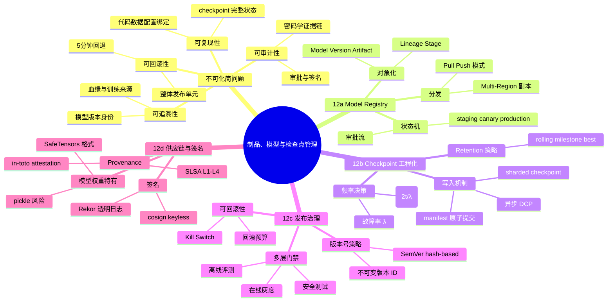
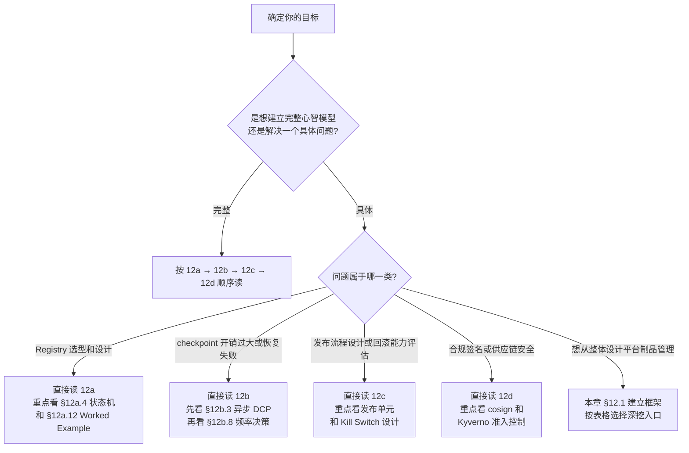

# 第 12 章 · 制品、模型与检查点管理总览

> 模型训练不是只产生一个最终权重文件；AI 平台真正需要管理的，是一整组能证明结果来源、支持恢复、支撑发布决策并能在事故中快速回退的工件。这个工程问题在大规模训练和多模型生产环境下不会自动消失，它需要被拆清、被建模，然后被系统化解决。

本章是 **Part 4 制品管理系列的总览章**。它用第一性原理把全链路的问题串成一张推导图，并指引你按需进入 12a-12d 四个独立深挖章。如果你只关心一个具体话题（比如"怎么设计 Model Registry 的状态机"或"如何让 175B 训练的 checkpoint 开销降到 1% 以内"），可以直接跳到对应深挖章；如果你要建立完整心智模型，按本章导览顺序阅读即可。

## 12.1 第一性原理拆解 + 学习大纲

### 拆 — 不可化简的问题

剥离 MLflow、Weights & Biases、S3、DCP、cosign、SLSA、Model Registry、checkpoint manager 这些工具名之后，整个制品管理体系要解决的不可化简问题只有一个：

**模型从训练到上线的全链路必须可追溯、可复现、可回滚、可审计。**

这个问题之所以不可再拆，是因为它同时触碰四个完全独立的工程约束，缺少任何一个，整个链路就会在事故时崩溃：

**约束一：可追溯性（Traceability）。** 线上出了问题，平台必须能回答"当前跑的是哪个版本的权重、tokenizer、配置、镜像，从哪段代码、哪份数据、哪次训练产生"。如果输出只是按日期堆在 bucket 里，事故时排障只能靠人工猜测目录名，一个 70B 模型可能有数百 GB 到数 TB 的候选文件，没有元数据索引就等于没有事实依据。

**约束二：可复现性（Reproducibility）。** 一个版本的评测报告说模型通过了门禁，但如果训练代码 revision、数据集版本、配置哈希、镜像 digest 没有绑定，任何人都无法验证"线上跑的和报告里评测的是同一个东西"。特别是在 checkpoint 层面，只保存权重而丢弃 optimizer state、scheduler state、RNG 状态和 sampler 进度，导致的是"warm start"而非"true resume"，恢复后的训练曲线无法与故障前衔接，代价等同于重新训练。

**约束三：可回滚性（Rollbackability）。** 线上事故发生时，SRE 需要在 5 分钟内定位上一个可用的 production 版本并切换流量。这要求上一个版本的权重、tokenizer、推理配置、镜像 digest 和评测报告必须全部还在，彼此版本兼容，且能立即被 serving 拉起。如果任何一项缺失或不匹配，"回滚"就退化成临时拼凑，往往因为 tokenizer 版本或 config 不一致而二次失败。

**约束四：可审计性（Auditability）。** 谁在什么时候批准了哪个版本进入 production？这次发布对应哪个评测报告？模型权重从训练到部署期间是否被篡改？这些问题在监管合规和内部安全审查时必须有密码学意义上的答案，而不是人工填写的电子表格。

这四个约束叠加起来，推出了一个必然结论：AI 平台需要一套独立的元数据控制平面，它把离散的训练输出文件提升为带有身份、状态、血缘、完整性证明和生命周期的平台对象（artifact）。这套控制平面不是一个工具，而是四个互锁的工程层：Model Registry（对象化与状态机）、Checkpoint 工程化（可靠写入与恢复语义）、发布治理（门禁与不可变版本）和供应链签名（密码学证据链）。

### 推 — 从这个问题如何推导出每个机制

**从"可追溯"推出 Model Registry 和 Metadata Schema。** 平台需要把每个模型版本的逻辑身份（Model）、具体迭代（Version）、物理文件集合（Artifact）、血缘（Lineage）和当前状态（Stage）分层建模，任何一层缺失都会在查询或回滚时遇到语义空洞。对象存储只解决"放文件"，registry 解决"这组文件是不是一个可信的、可发布的、可回滚的版本"（详见 [12a 章](./12a-model-registry.md)）。

**从"可复现"推出 Checkpoint 工程化。** 故障一定会发生。一个 512 卡 H100 集群的预期故障间隔在数天量级，任何超过数天的训练任务都必须假设"中途一定会断"。Checkpoint 频率、异步保存、分片写入、manifest + 原子提交、shard 级校验和是把"GPU 小时的代价"控制在可接受范围的工程必需品，而不是可选优化（详见 [12b 章](./12b-checkpoint-engineering.md)）。

**从"可回滚"推出发布门禁与版本治理。** 回滚必须先于发布存在。模型版本需要经过 `draft → validated → staging → canary → production → deprecated` 的有序状态机，每次状态迁移都要有可机器验证的门禁、可审计的审批记录和不可变的版本 ID。"把文件改个名字"不是发布，"把 `latest` 指针挪一下"不是回滚（详见 [12c 章](./12c-release-governance.md)）。

**从"可审计"推出供应链签名与 Attestation。** 模型权重是可执行 artifact，pickle 格式的权重在加载时可执行任意代码。签名（cosign）、透明日志（Rekor）、构建来源声明（SLSA provenance）、SBOM 和准入控制共同构成端到端的密码学证据链，让"可信来源"从社会性承诺变成可验证事实（详见 [12d 章](./12d-supply-chain-and-signing.md)）。

### 绘 — 因果链路

### 导 — 读完本章你应该能回答

1. 为什么"文件已上传"仍不等于模型版本可发布？制品管理的核心判定问题是什么？
2. Checkpoint 和模型包分别服务于哪个系统目标，为什么不能混用？缺 optimizer state 后恢复训练会发生什么？
3. 一个 artifact 版本至少需要哪些元数据才能串起训练、评测、部署和回滚？哪几个字段是跨系统边界的关键锁扣？
4. 生命周期状态（`staging`/`canary`/`production`）为什么属于平台控制面而不是人工备注？状态字段如何驱动发布、路由和清理系统？
5. 为什么大规模训练必须使用异步 checkpoint？同步 checkpoint 在 512 卡集群上会损失多少吞吐？
6. 模型发布门禁为什么要分离线评测、在线灰度和安全测试三层？任何一层可以被跳过吗？
7. 为什么模型权重必须做供应链签名？pickle 格式权重的安全风险和 SafeTensors 的改进在哪里？

## 12.2 四个深挖章节导览

| 章节 | 标题 | 核心主题 | 何时优先读 |
|---|---|---|---|
| [12a](./12a-model-registry.md) | Model Registry 体系 | 五大核心实体、Stage 状态机、Metadata Schema、LoRA Registry、100GB+ 分发架构、Worked Example 从零设计企业 Registry | 要建立或评估团队的 model registry；想理解发布系统如何通过 Alias 自动发现版本 |
| [12b](./12b-checkpoint-engineering.md) | Checkpoint 工程化 | 同步 vs 异步 DCP、sharded checkpoint、manifest 原子提交、频率决策模型 T*、Retention 策略、175B 端到端 Worked Example | 训练因为 checkpoint 损失大量吞吐；故障后恢复失败；想量化最优 checkpoint 间隔 |
| [12c](./12c-release-governance.md) | 制品版本治理与发布门禁 | 版本号策略、发布单元（Release Bundle）、多层评测门禁、4-eyes 审批、Kill Switch、deprecation 依赖追踪 | 需要设计可审计的发布流程；曾因模型发布导致线上质量退化而无法快速定位 |
| [12d](./12d-supply-chain-and-signing.md) | 制品供应链与签名 | cosign 签名、Rekor 透明日志、SLSA Provenance、SBOM、镜像扫描、模型权重签名、准入控制 Kyverno/OPA | 有合规审计要求；想防御供应链攻击；需要在 K8s 准入层强制验证镜像和权重签名 |

## 12.3 阅读路径建议

| 角色 | 推荐路径 | 估算时间 |
|---|---|---|
| 训练平台工程师 | 12b → 12a → 12c → 12d | 10-12 小时（含练习） |
| MLOps / 发布工程师 | 12a → 12c → 12d → 12b（快读） | 6-8 小时 |
| 算法工程师（关心恢复和复现） | 12b → 12a（§12a.2-12a.4） | 3-4 小时 |
| SRE / on-call | 12c → 12a（§12a.4 状态机）→ 12b（§12b.12 Resume 策略） | 3-4 小时 |
| 安全 / 合规工程师 | 12d → 12c（§ 发布单元）→ 12a（§12a.3 Metadata Schema） | 4-5 小时 |

> [!NOTE]
> **本总览章不重复深挖内容**：Postgres DDL、DCP async 代码、cosign 命令序列、SLSA 等级说明等都在对应深挖章里。这里只保留第一性原理推导链 + 章节导航。

> [!TIP]
> **读完所有 4 章后应能独立完成的事**：给出一个团队的模型发布事故描述，能在 10 分钟内判断根因属于 Registry 缺状态机、checkpoint 缺 optimizer state、发布缺门禁还是权重被篡改；并给出对应的工程修复方向。

## 12.4 与 Part 4 / Part 7 其他章的关系

制品管理是 Part 4 数据与存储的第二根基，它向前承接训练数据，向后打通向量与特征，并和 Part 7 的发布与安全章节形成完整的生产闭环：

**与 [第 11 章 · 数据管道](./11-data-pipeline.md) 的关系**：数据管道负责把原始数据转化为训练就绪的样本集，并维护数据集版本和血缘；制品管理的 `dataset_version` 字段和 Lineage 记录直接引用这里产生的数据集快照。训练数据的可追溯性是模型血缘可追溯的上游前提——数据版本丢失，模型版本的血缘链就会出现空洞。详见 [第 11e 章 · 数据版本与血缘](./11e-data-versioning-and-lineage.md)。

**与 [第 13 章 · 特征、向量与缓存](./13-feature-vector-and-cache.md) 的关系**：向量索引和 embedding 本身也是制品——它们有版本、有失效窗口、有和模型权重的绑定关系。当模型升级时，对应的 embedding 索引可能需要重建，这是 Registry 层面的版本联动问题，不能靠手工对比时间戳处理。

**与 [第 22 章 · 评测、发布与事故](../part7-reliability-security/22-evaluation-release-and-incident.md) 的关系**：12c 章的发布门禁和状态机定义了"哪些版本可以进入 canary 和 production"，Ch 22 定义了"canary 期间如何采集指标、判断健康、触发自动回滚"。两章在灰度发布阶段紧密交汇：12c 提供控制面状态，Ch 22 提供观测信号和决策规则。

**与 [第 23 章 · 安全、隔离与治理](../part7-reliability-security/23-security-isolation-and-governance.md) 的关系**：Ch 23 介绍了 cosign/SLSA/Trivy 的概念背景，12d 是其工程化深挖——如何把签名验证和 SBOM 扫描嵌入 CI/CD 流水线，以及如何用 Kyverno 或 OPA Gatekeeper 在 K8s 准入层强制执行签名策略。

**与 [第 10 章 · 内存、检查点与恢复](../part3-training-infra/10-memory-checkpointing-and-recovery.md) 的承接关系**：Ch 10 建立了 checkpoint 的概念基础——保存什么、true resume vs warm start、manifest 和原子提交的直觉理解；12b 章是 Ch 10 的工程化深挖，覆盖分布式 sharded checkpoint、异步 DCP、频率决策模型、175B 规模的端到端实践。两章应联读：Ch 10 建立判断力，12b 提供实现路径。

## 深度参考阅读（总览级）

- Chip Huyen, *Designing Machine Learning Systems*, Chapter 7（模型部署与版本管理）. 系统化介绍 MLOps 全链路中制品管理的位置和设计权衡。
- Martin Fowler, [Feature Toggles](https://martinfowler.com/articles/feature-toggles.html). Canary release 和 Stage 状态机的软件工程基础，与 12c 发布门禁同源。
- CNCF, [Kubeflow Model Registry](https://github.com/kubeflow/model-registry). 开源社区对企业 Model Registry 的标准化尝试，可作为自建 Registry 的参考实现。
- SLSA 规范：[slsa.dev](https://slsa.dev). 供应链完整性等级框架，是 12d 章工程实践的理论基础。
- Google, *Continuous Delivery for Machine Learning* (2019). 把 CI/CD 引入 ML 生命周期的奠基性论文，与本章制品流转模型高度吻合。
- PyTorch 官方文档：`torch.distributed.checkpoint`（DCP）API reference，与 12b 章直接对应。

> 各深挖章节末尾还有面向具体主题的进一步深读列表。本总览只列共用的跨章参考。
