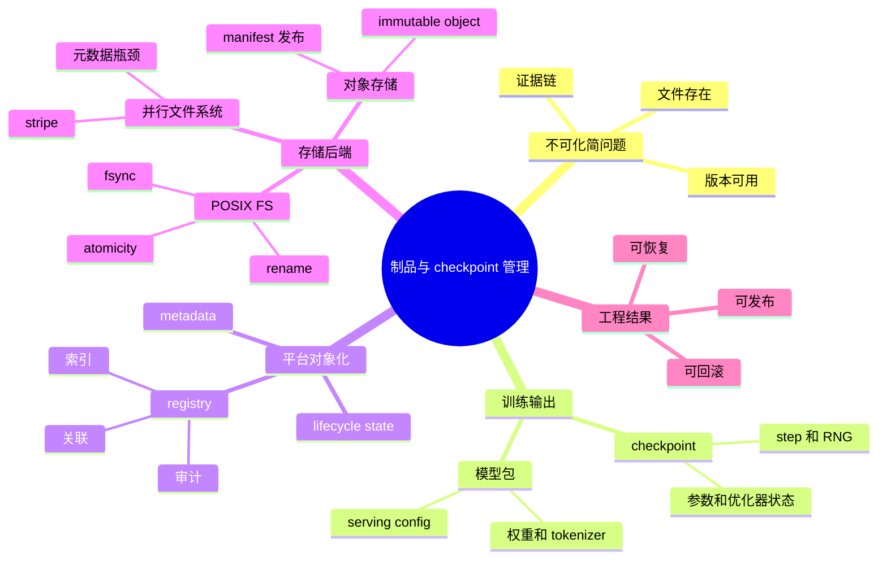

# 第12章：制品、模型与检查点管理

> 模型训练不是只产生一个最终权重文件；真正需要平台管理的，是一整组能证明结果来源、支持恢复并支撑发布决策的工件。

> **关联章节**：本章讨论的 checkpoint、模型包和回滚链路，与 [第10章](../part3-training-infra/10-memory-checkpointing-and-recovery.md) 的训练恢复机制直接相连；恢复能否成功，取决于制品是否被平台正确登记和保留。

## 1. 第一性原理拆解 + 学习大纲

### 拆 — 不可化简的问题

剥离 MLflow、W&B、S3、Model Registry、checkpoint manager 这些工具名之后，本章要解决的不可化简问题只有一个：训练和发布会产生很多文件，但平台真正需要管理的不是“文件存在”，而是“某个结果是否有完整证据链，能否恢复、验证、发布、回滚和审计”。文件系统只能回答路径下有没有字节；训练系统关心 step、rank、optimizer state、随机数状态；发布系统关心权重、tokenizer、推理配置、镜像和评测报告是否属于同一个版本。一个 70B checkpoint 可能有数百 GB 到数 TB；一次回滚可能必须在 5 分钟内定位上一个 production 模型包。如果只把结果按日期扔进 bucket，平台看似保存了所有文件，实际却无法证明哪个版本完整、哪个版本通过门禁、哪个版本可以恢复。制品管理的第一性问题不是容量，而是把离散输出变成可查询、可判定、可流转的平台对象。

### 推 — 从这个问题如何推导出每个机制

如果结果需要证明来源，就必然需要元数据：代码 revision、数据集版本、配置、job id、step、评测报告和镜像 digest 要绑定到同一个 artifact 版本。如果结果需要恢复，就必然要区分 checkpoint 和模型包：checkpoint 保存 optimizer、scheduler、随机数状态和分片布局，模型包保存部署所需权重、tokenizer、模型签名和推理配置。如果结果需要自动发布，就必然需要生命周期状态：`draft`、`validated`、`staging`、`production`、`deprecated` 不只是标签，而是发布、权限和清理系统共同消费的控制面字段。

如果结果需要跨系统流转，就必然需要 registry 或 metadata plane。对象存储适合保存大对象，但它不知道某个目录是否代表完整版本；CI/CD 不天然知道哪个 checkpoint 通过评测；Serving 平台不应靠人工表格判断 tokenizer 是否匹配。因此 registry 把“字节”提升成“对象”，提供索引、关联、状态、权限和审计。底层存储解决另一层问题：POSIX FS 适合临时 staging；并行文件系统适合集群共享的大 checkpoint；对象存储适合归档和分发。故障后恢复可信，还要依赖 manifest、校验和、临时文件、原子 rename、父目录 `fsync`、对象存储 immutable key、评测门禁和回滚候选选择。

### 绘 — 因果链路



### 导 — 读完本章你应该能回答

1. 为什么“文件已上传”仍不等于模型版本可发布？
2. checkpoint 和模型包分别服务于哪个系统目标，为什么不能混用？
3. 一个 artifact 版本至少需要哪些元数据，才能串起训练、评测、部署和回滚？
4. 生命周期状态为什么属于平台控制面，而不是人工备注？
5. POSIX FS、并行文件系统和对象存储的哪些语义差异会破坏恢复可靠性？
6. 为什么 manifest、校验和和状态门禁能把“文件集合”提升为“可判定版本”？
7. 清理 checkpoint 和模型包时，为什么不能只按文件年龄删除？

## 学习目标

完成本章学习后，你将能够：

1. 区分 checkpoint、模型包、评测报告、配置和日志等不同制品
2. 理解为什么工件管理是训练和发布之间的桥梁
3. 设计一套可追踪的模型版本与状态管理方式
4. 避免“文件都在，但没人知道哪个能用”的局面
5. 把工件治理与恢复、评测、发布、审计串起来

---

## 正文内容

### 12.1 什么算制品

AI 平台中的制品（artifact）通常包括：

- checkpoint
- 最终模型包
- tokenizer / vocab
- 评测报告
- 训练配置
- 实验日志
- embedding 索引
- 推理镜像与部署清单

它们共同构成了“模型是怎么来的、现在能不能上线、失败后能不能恢复”的证据链。

如果这些制品只是散落在对象存储里，那么平台就很难回答：

- 线上跑的是哪个版本
- 它对应哪次训练
- 它是否通过评测
- 出故障后该回滚到哪一个版本

### 12.2 checkpoint 和模型包不是同一种东西

Checkpoint 面向训练恢复，往往包含：

- 模型参数
- 优化器状态
- scheduler 状态
- 当前 step / epoch
- 随机数状态

模型包面向部署，通常更关注：

- 可加载权重
- 推理配置
- tokenizer
- 模型签名
- 版本元数据

把两者混为一谈，会在两端都制造问题：

- 恢复时发现缺状态
- 部署时发现包过大、依赖过重

所以一个成熟平台会把“训练恢复资产”和“部署资产”视为相关但不同的对象。

### 12.3 一个最小版本元数据示例

```yaml
artifact:
  model_name: reranker
  model_version: 2026-04-10-rc1
  dataset_version: support-v3
  code_revision: abc1234
  training_job: train-20260410-001
  eval_report: eval-20260410-001.json
  image: serving-reranker:2026-04-10-rc1
  status: staging
```

没有这类元数据时，你无法可靠回答：

- 当前线上跑的是哪个版本
- 它对应哪次训练
- 它是否通过评测
- 它能否快速回滚

### 12.4 生命周期状态为什么重要

一个模型版本至少可以有：

- `draft`
- `validated`
- `staging`
- `production`
- `deprecated`

这些状态不是形式化文档，而是平台控制面的一部分。  
它们直接影响：

- 谁能发布
- 哪个版本能被流量路由
- 哪个版本能被回滚选中
- 哪些工件可以清理

### 12.5 制品管理的真正价值

很多人会问：  
“对象存储里已经有文件了，为什么还需要 registry 或管理系统？”

原因在于管理系统解决的不只是“放文件”，而是：

1. **索引**：快速查找
2. **关联**：训练、评测、部署之间可追踪
3. **状态**：哪些版本能上线
4. **权限**：谁能读、谁能发、谁能删
5. **审计**：谁在什么时候做了什么变更

也就是说，制品管理系统的价值是让“文件”变成“平台对象”。

### 12.6 一个常见失败模式：文件都在，但系统无法回滚

这类事故通常来自：

- checkpoint 和模型包命名不一致
- 线上版本没有记录对应评测结果
- 镜像版本和模型版本脱节
- 回滚时发现 tokenizer 或配置文件不匹配

它说明一个重要事实：

> 回滚不是“把旧文件拷回来”，而是让一整组彼此兼容的制品重新组成一个可运行系统。

### 12.7 存储后端怎么选

制品管理首先是对象治理，其次才是“放在哪里”。更稳妥的理解是：底层存储和上层 registry / metadata plane 是两层不同能力，前者负责放大文件，后者负责版本、状态和审计。

| 层 | 优势 | 局限 | 适用规模 |
|------|------|------|----------|
| 本地 NFS / NAS | 接入简单，训练集群共享方便 | 跨地域差、扩容与审计能力弱 | 小团队、单机房 |
| 对象存储（S3 / GCS / MinIO） | 容量弹性大，适合 checkpoint 和模型包归档 | 目录语义弱，需额外做索引和状态管理 | 中大规模平台 |
| Artifact Registry / Metadata Plane（MLflow、W&B 等） | 自带版本、状态、实验关联 | 本身通常仍要依赖对象存储或共享存储承载大文件 | 需要审计与门禁的团队 |

平台上常见的组合是：大文件放对象存储，元数据和生命周期状态放 registry。这样既保留了弹性容量，也能让发布系统直接消费“哪个版本可用”的控制面信息。

#### 12.7.1 checkpoint 的文件系统选型边界

Checkpoint 写入比普通制品上传更接近文件系统语义问题，底层差异可参考 [§0c 文件系统与存储内核](../part0-foundations-of-systems/0c-filesystems-and-storage-internals.md)。POSIX FS 适合写临时文件、`fsync(file)`、同目录 `rename()` 成正式文件，再 `fsync(parent dir)`；工程边界是 `write()` 成功不等于落盘，`rename()` 成功不等于父目录已持久化，跨挂载点 rename 也不是原子替换。并行文件系统适合多 rank 写 10GB-100GB 级 shard，通过 stripe 聚合带宽，但小文件、频繁 `stat/open`、单目录并发会打 MDS。对象存储适合归档和跨地域保留，但 S3/OSS 不是 POSIX：没有本地 `fsync`，`rename` 往往是 copy+delete，`LIST prefix` 不能当事务边界；可靠协议应改成 immutable key + manifest。

| 后端 | 适合放什么 | 关键语义 | 工程边界 |
|------|------------|----------|----------|
| 本地 POSIX FS | 临时 staging、单节点 checkpoint | `fsync`、同 FS `rename` 原子可见 | 节点丢失会丢本地副本，需异步归档 |
| 并行 FS | 多节点共享 checkpoint、大 shard | stripe 聚合带宽、POSIX 路径语义 | MDS 和小文件是上限，需压测目录并发 |
| 对象存储 | 长期归档、发布分发、跨区域保留 | PUT 完成、multipart、manifest | 非 POSIX，不能依赖 rename/fsync/list 事务 |

### 12.8 制品与 CI/CD 的集成

制品真正发挥作用，是在训练结束后继续沿着评测、审批和发布链路流动，而不是停留在某个 bucket 目录中。

```text
训练完成
  -> 注册 checkpoint / 模型包
  -> 触发离线评测
  -> 写入版本状态与报告
  -> 发布系统读取 validated 版本
  -> 灰度 / 全量 / 回滚
```

从平台工程角度看，关键不是自动化步骤多，而是状态流转要稳定：

| 阶段 | 平台动作 | 产出 |
|------|----------|------|
| 训练结束 | 上传制品并登记元数据 | 可查询版本 |
| 自动评测 | 运行基准集、生成报告 | `validated` 候选 |
| 发布门禁 | 检查签名、配置、镜像一致性 | `staging` 或拒绝 |
| 正式发布 | 流量切换与留痕 | `production` 版本 |

如果 CI/CD 不认识制品状态，训练、评测、发布就仍然是三套松散流程；一旦出故障，排障和回滚会重新退回手工比对文件名。

### 12.9 工程建议

- 训练输出路径、评测结果、模型注册必须可关联
- checkpoint 保存策略要和恢复流程一起设计
- 模型“可下载”不等于模型“可发布”
- 老工件必须有清理和归档规则
- 发布系统应直接消费工件状态，而不是靠人工表格同步

#### 本章涉及的常见工具

| 概念 | 常见工具 / 命令 | 备注 |
|------|-----------------|------|
| 模型与实验注册 | MLflow Model Registry、Weights & Biases Artifacts | 管理版本、状态和关联关系 |
| 大文件与对象存储同步 | `aws s3 cp/sync`、`mc cp` | 适合 checkpoint / 模型包上传归档 |
| 制品打包 | Hugging Face Hub、`safetensors` | 适合发布可加载模型资产 |
| 流水线编排 | GitHub Actions、Argo Workflows | 用于训练完成后的评测与状态流转 |

### 12.10 最低限度的制品分层

即使没有复杂平台，也建议至少区分：

```text
artifacts/
  checkpoints/
  model-packages/
  eval-reports/
  configs/
  deployment-manifests/
```

这能显著减少后续恢复、审计和回滚时的混乱。

---

## 本章小结

| 工件 | 主要用途 | 关键问题 |
|------|----------|----------|
| checkpoint | 训练恢复 | 是否包含足够状态 |
| 模型包 | 部署与回滚 | 是否与配置、tokenizer 匹配 |
| 评测报告 | 发布门禁 | 是否与模型版本绑定 |
| 配置 / 日志 | 复现与排障 | 是否可追踪、可查询 |
| 平台补充 | 存储后端与状态流转同样属于制品治理范围 | 是否能支撑自动发布与审计 |

---

## 练习题

1. 为什么 checkpoint 不适合直接当生产模型包？
2. 一个模型版本的最小元数据应该包含哪些字段？
3. 为什么模型状态管理必须进入平台控制面？
4. 举一个“文件都在但无法回滚”的失败案例。
5. 如果团队同时用对象存储和 registry，各自应该保存什么信息？
6. 请画出一个“训练结束到正式发布”的最小制品流转链路。
