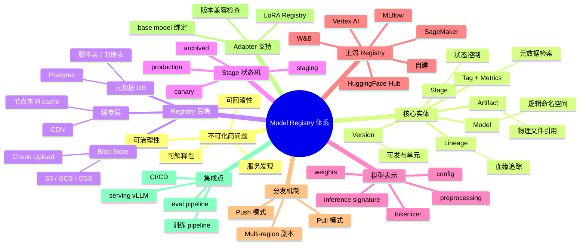
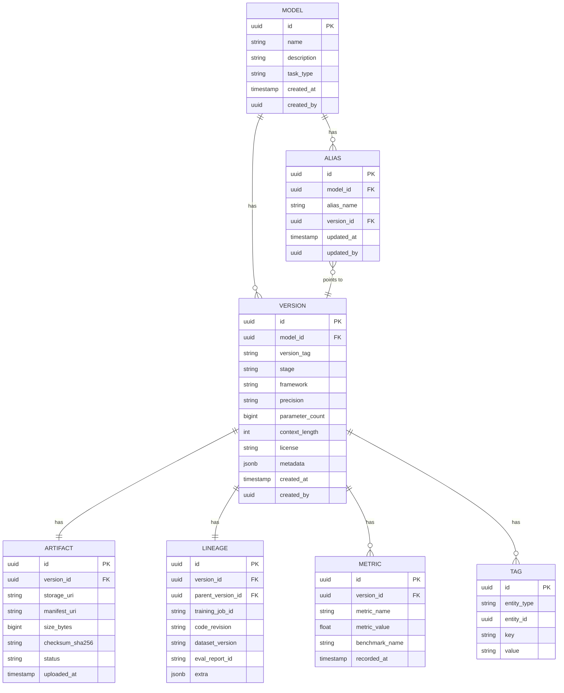
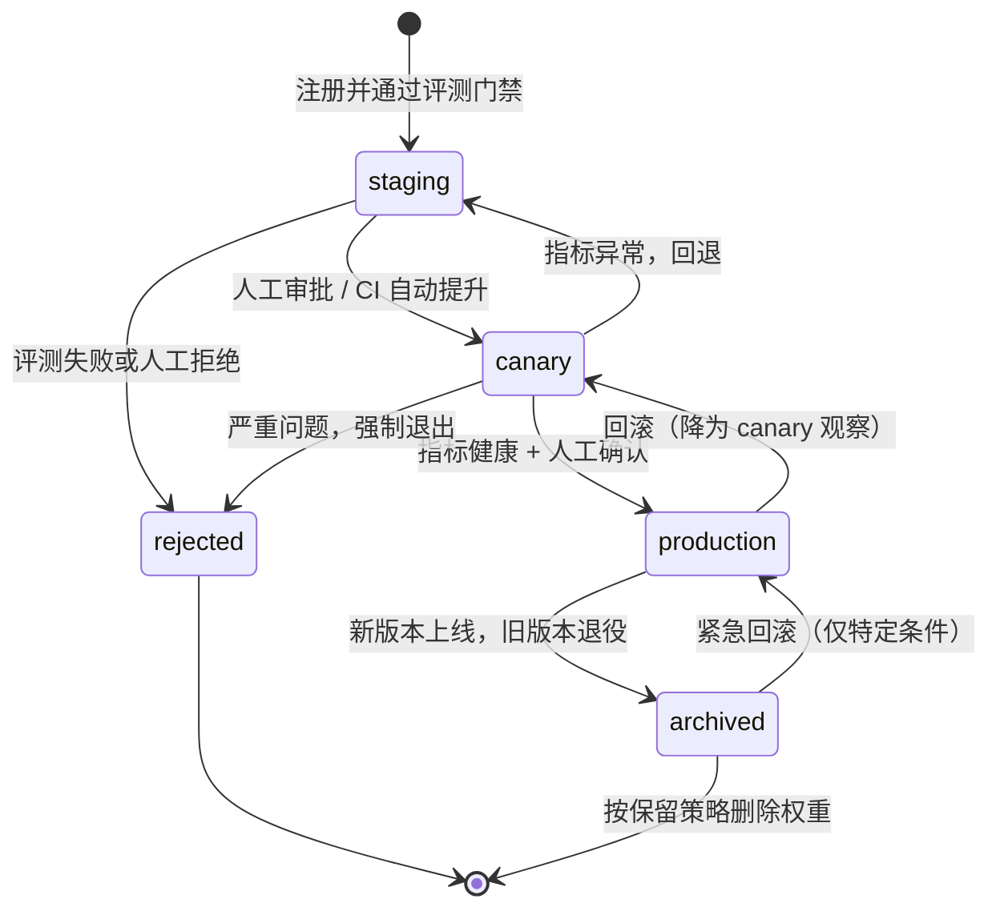
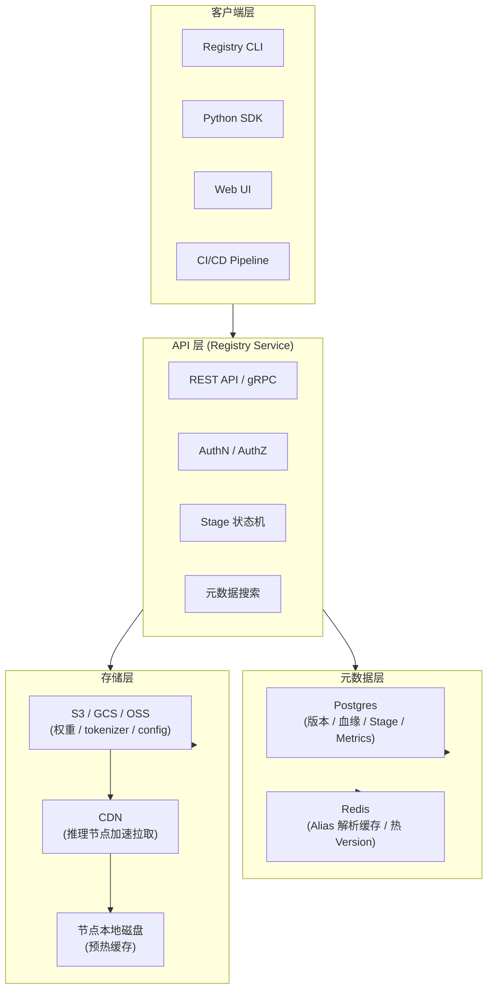
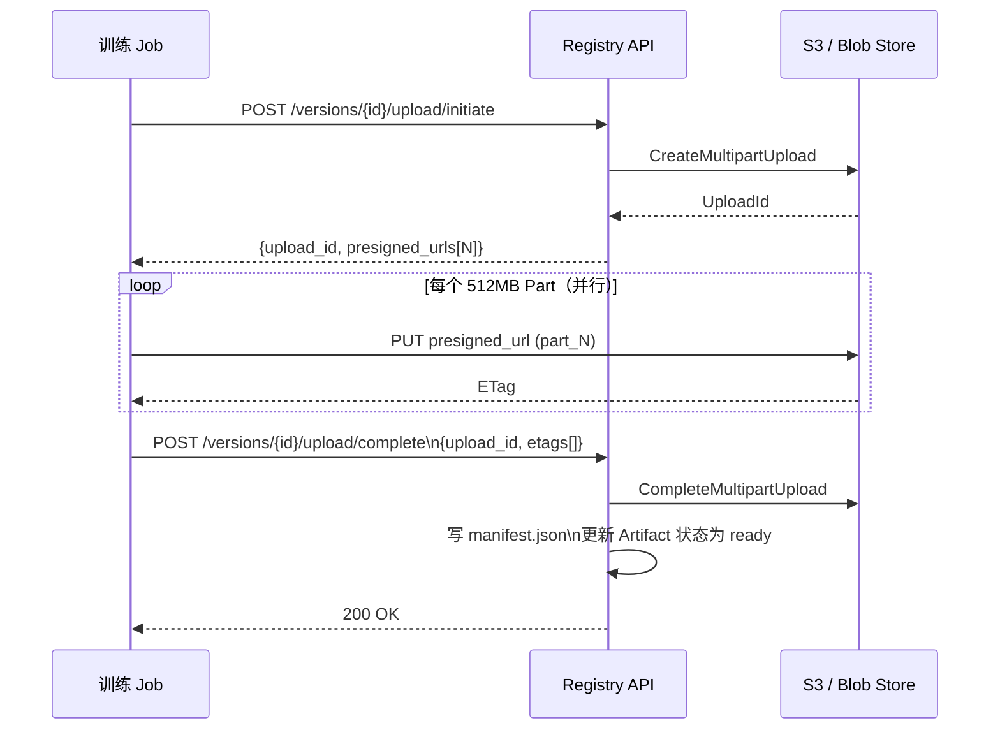
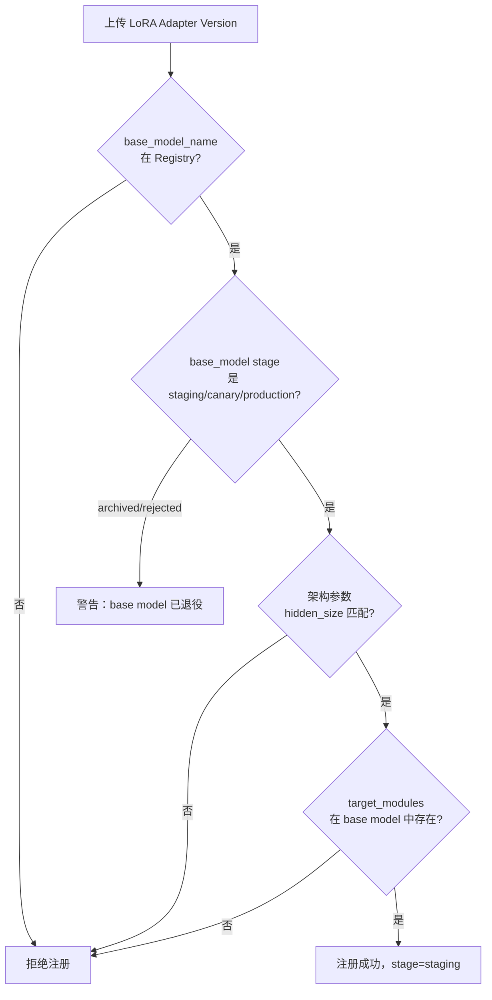
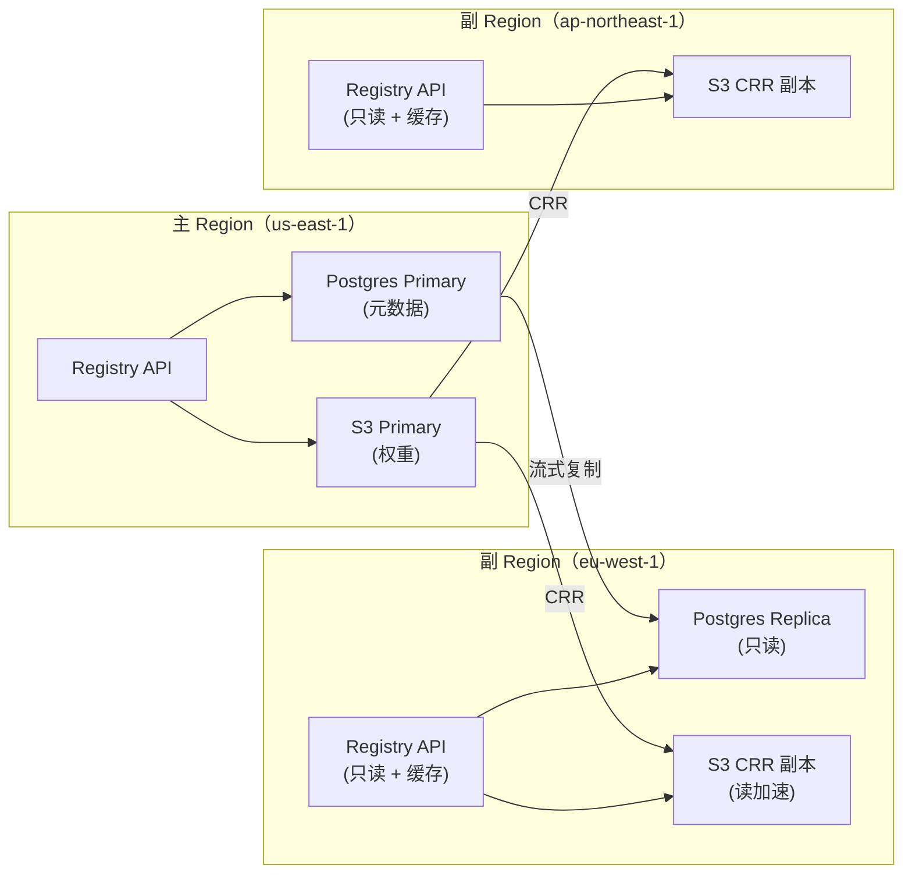
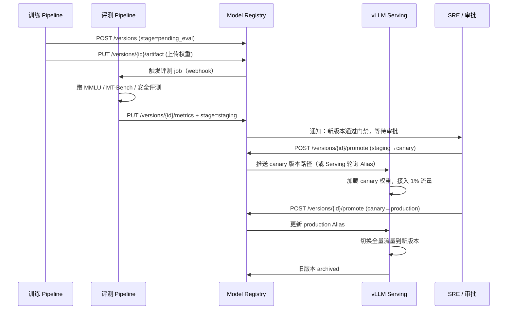

# 第 12a 章 · Model Registry 体系

> 训练出的模型权重只是字节流；只有当这些字节被平台登记、版本化、状态化、血缘化、可分发、可回滚，服务才能找到它、信任它、治理它。Model Registry 不是 MLflow 的一个 Tab，而是 AI Infra 的控制平面核心。

> **关联章节**：本章与 [第 12 章](./12-artifacts-and-checkpoints.md) 的 checkpoint / 制品体系直接衔接；与 [第 10b 章 RLHF 多模型](../part3-training-infra/10b-rlhf.md)、[第 10c 章 Multi-LoRA](../part3-training-infra/10c-multi-lora.md)、[第 16a 章 vLLM Multi-LoRA serving](../part5-serving-infra/16a-vllm-internals.md) 形成完整的"训练 → 注册 → 服务"闭环。

---

## 12a.1 第一性原理拆解 + 学习大纲

### 拆 — 不可化简的问题

剥离 MLflow、W&B、HuggingFace Hub、Vertex AI、SageMaker 这些产品名，以及 Stage、Version、Tag、Lineage 这些 API 名词之后，Model Registry 要解决的不可化简问题是：**训练出来的模型必须能被服务发现、可解释、可治理、可回滚，否则生产无法运行。**

这个问题之所以不可再拆，是因为它同时触碰四个独立的工程约束，每个约束单独存在都能让生产系统瘫痪：

**约束一：服务发现（Service Discovery）。** Serving 集群在启动或热更新时需要知道"去哪里取权重、取哪个版本"。对象存储能存文件，但它没有"当前 production 版本是哪个"的语义；DNS 能做路由，但它对权重路径一无所知。如果 Registry 不存在，运维就只能靠人工改配置文件或 Slack 消息通知服务节点去哪里拉模型，这在节点动态扩缩容时必然出错。

**约束二：可解释性（Explainability）。** 当一个模型在线上产生了一个不符合预期的输出，平台必须能回答：这个模型版本是从哪段代码、哪份数据、哪次训练产生的？它通过了哪些评测？谁在什么时候批准了它上线？没有血缘（Lineage）记录，这些问题无从回答，监管合规和内部审计都将失败。

**约束三：可治理性（Governance）。** 一个大型 AI 平台上同时运行着数十到数百个模型版本，有 base model、有 fine-tuned variant、有 LoRA adapter、有 embedding model，还有辅助模型（reranker、classifier、reward model）。如果没有 Stage 状态机（staging / canary / production / archived），平台无法在不停机的情况下做渐进发布，无法控制谁可以将一个版本提升到 production，无法在违规模型上线时有留痕的撤销路径。

**约束四：可回滚性（Rollback）。** 线上事故发生时，SRE 需要在 5 分钟内定位上一个 production 版本并切换流量。这要求上一个版本的权重、tokenizer、推理配置、镜像必须全部还在，且彼此版本兼容，且可以立即被 serving 拉起。如果只靠人工记录版本路径，回滚就变成一次高压力的手工猜测，往往因为 tokenizer 版本或 config 不匹配而失败。

这四个约束叠加起来，推出了一个必然结论：AI 平台需要一个独立的元数据控制平面，它知道每个模型版本的完整身份（元数据 + 血缘）、当前状态（Stage）、存储位置（Blob URI）和分发策略（CDN / 副本）。这个控制平面就是 Model Registry。

### 推 — 从这个问题如何推导出每个机制

**从"服务发现"推出核心实体设计。** Registry 必须有 Model 实体（代表一个模型的逻辑身份，如 `llama3-8b-instruct`）、Version 实体（代表同一逻辑模型的不同迭代，如 `v1.3.0`）、Artifact 实体（代表一组实际文件：weights、config、tokenizer），以及它们之间的关联关系。Model 是 namespace，Version 是可发布单元，Artifact 是物理存储引用。三者缺一都会导致服务发现语义不完整。

**从"可解释性"推出 Lineage 和 Metadata Schema。** 每个 Version 必须携带可追溯的元数据：训练 job id、代码 revision、数据集版本、framework、precision（BF16/FP16/INT8/INT4）、parameter count、context length、eval results、license、training data reference、calibration data reference。这些字段不是可选注释，而是审计和合规的法律证据，一旦缺失便无法补录。

**从"可治理性"推出 Stage 状态机。** 版本必须经历 `staging → canary → production → archived` 的有序流转，且每次状态迁移必须记录操作者、时间戳、审批凭据和关联的评测报告 ID。状态机还要和 CI/CD 集成：评测 pipeline 可以自动将通过门禁的版本从 `staging` 提升到 `canary`；人工审批可以将 `canary` 提升到 `production`；自动回滚可以将 `production` 降级并把上一个稳定版本提升为 `production`。

**从"可回滚性"推出分发架构。** 权重不能只有一份在对象存储，还需要 CDN 缓存层加速服务节点下载，以及跨 region 副本保证地理容灾。Pull 模式（serving 节点从 Registry 拉模型）适合版本更新频率低的大模型；Push 模式（Registry 主动推送到 serving 节点的本地缓存）适合低延迟场景。100GB+ 的权重还需要分块上传（chunk upload）、断点续传（resume）和并行下载（parallel download）机制，否则任何一次网络闪断都会让整个版本上传失败。

**从"Adapter / LoRA"推出扩展模型。** LoRA adapter 不能脱离 base model 独立运行，Registry 必须强制记录 adapter 与 base model 的绑定关系（`base_model_name`、`base_model_version`），并在提升 adapter 版本到 production 时自动检查对应 base model 是否也在 production 或 canary 状态。base model 的 architecture 参数（hidden size、num layers、attention heads）也必须作为兼容性依据保存在 Version 元数据中。

### 绘 — 因果链路



### 导 — 读完本章你应该能回答

1. Model Registry 解决了哪四个不可化简的工程约束？为什么对象存储加目录约定不够？
2. Model、Version、Artifact、Stage、Lineage 五个实体各自代表什么？在数据库层面如何建模？
3. Stage 状态机的合法跳转路径是什么？哪些跳转需要人工审批，哪些可以自动触发？
4. Pull 模式和 Push 模式分发分别适合什么场景？CDN 缓存层如何与 Registry 版本语义对齐？
5. LoRA adapter 在 Registry 中如何与 base model 绑定？版本不兼容时平台应如何拦截？
6. 100GB+ 的权重如何实现可靠的 chunk upload、断点续传和并行下载？manifest 文件承担什么角色？
7. 一套企业级 Model Registry 从零设计，最小 MVP 需要哪些数据库表、API 端点、存储结构和与 vLLM 的集成点？

---

## 12a.2 核心实体与数据模型

Model Registry 的数据模型是其他所有能力的基础。设计不良的实体关系会导致 API 语义模糊、状态一致性困难、血缘追踪缺口。

### 12a.2.1 五大核心实体

| 实体 | 职责 | 类比 |
|------|------|------|
| **Model** | 模型的逻辑身份，跨版本稳定 | Git 仓库 |
| **Version** | 同一模型的一次具体迭代，是发布单元 | Git commit |
| **Artifact** | 版本对应的物理文件集合（weights、config、tokenizer） | Release bundle |
| **Stage** | Version 在发布流程中的当前状态 | Git branch 角色 |
| **Lineage** | Version 的来源追踪：训练 job、数据集、代码、父版本 | Git blame + provenance |

一个 Model 拥有多个 Version，一个 Version 拥有一个 Artifact（或多个 artifact 副本），一个 Version 有且仅有一个当前 Stage，一个 Version 有一条 Lineage 记录。

### 12a.2.2 扩展实体

- **Tag**：键值对，附加在 Model 或 Version 上，支持自由检索（如 `task=chat`, `lang=zh`, `department=search`）
- **Metric**：评测指标快照，附加在 Version 上（如 `mmlu=78.3`, `mtbench=8.1`），支持版本间比较
- **Alias**：Model 级别的别名指针，如 `production`、`canary`、`latest`，指向某个具体 Version ID，serving 层通过 Alias 解析版本避免硬编码

### 12a.2.3 数据库 ER 图



> **设计边界**：Stage 存在 Version 表上（单字段枚举），而不是单独一张表。Alias 是 Model 级别的指针层，serving 通过 Alias 解析实际 Version，避免在发布时改动所有 serving 配置。

---

## 12a.3 Metadata Schema 详解

完整的版本元数据是 Registry 可解释性的核心。下表覆盖生产必备字段：

| 字段 | 类型 | 必填 | 说明 |
|------|------|------|------|
| `framework` | enum | 是 | `pytorch` / `jax` / `tensorflow` / `gguf` |
| `precision` | enum | 是 | `bf16` / `fp16` / `fp32` / `int8` / `int4` / `awq` / `gptq` |
| `parameter_count` | int64 | 是 | 模型参数量，单位：个（如 7B = 7_000_000_000）|
| `context_length` | int | 是 | 最大上下文 token 数（如 4096 / 32768 / 131072）|
| `architecture` | string | 是 | 模型架构名（如 `llama3` / `qwen2` / `mistral`）|
| `hidden_size` | int | 推荐 | 隐层维度，LoRA 兼容性检查必需 |
| `num_layers` | int | 推荐 | Transformer 层数 |
| `vocab_size` | int | 推荐 | tokenizer 词表大小，与 tokenizer 版本绑定 |
| `license` | string | 是 | SPDX 格式（如 `Apache-2.0` / `llama3` / `proprietary`）|
| `training_data_ref` | string | 是 | 数据集标识或 URI，blood lineage 必需 |
| `eval_results` | jsonb | 推荐 | 各 benchmark 结果快照 |
| `calibration_data` | string | 条件 | 量化模型必填，指向校准数据集 |
| `base_model_name` | string | adapter 必填 | LoRA/adapter 指向的 base model 名 |
| `base_model_version` | string | adapter 必填 | LoRA/adapter 指向的 base model 版本 |
| `code_revision` | string | 是 | 训练代码 git commit SHA |
| `training_job_id` | string | 是 | 训练任务 ID，可追溯日志和配置 |
| `image_digest` | string | 推荐 | 训练容器镜像 digest，复现性需要 |
| `inference_signature` | jsonb | 推荐 | 推理接口签名（输入输出 shape 和 dtype）|

> **工程边界**：`eval_results` 是 JSON 快照，不是实时数据。评测流水线完成后把结果写入 Registry，后续查询只需读 Registry，不需要重新跑评测。`inference_signature` 用于 serving 层在加载模型前做兼容性检查，避免形状不匹配导致的 runtime 错误。

---

## 12a.4 Stage 状态机

Stage 是 Registry 治理能力的核心。它不是自由打标签，而是有严格跳转规则的有限状态机。

### 12a.4.1 状态定义

| Stage | 含义 | 流量 | 可回滚候选 |
|-------|------|------|-----------|
| `staging` | 已注册，评测通过，等待灰度 | 无 | 否 |
| `canary` | 接受少量（1-5%）真实流量，观察指标 | 小比例 | 否 |
| `production` | 承载全量或大部分流量 | 全量 | 是 |
| `archived` | 已退役，保留权重用于回滚、复盘 | 无 | 是（降级回滚用）|
| `rejected` | 未通过门禁或被显式拒绝 | 无 | 否 |

### 12a.4.2 状态转移规则



| 跳转 | 触发方 | 前置条件 | 是否可撤销 |
|------|--------|----------|-----------|
| `staging` | 评测 pipeline | 评测门禁全部通过 | 否（可 reject）|
| `staging → canary` | CI 自动或人工 | 无额外条件（可配置二次审批）| 可降回 `staging` |
| `canary → production` | 人工 | canary 期间无告警，P99 latency 达标 | 可降为 `canary` |
| `production → archived` | 系统或人工 | 新版本就绪 | 紧急情况可反向回滚 |
| `* → rejected` | 任何人 / 系统 | 无 | 否 |

> **平台约定**：同一 Model 最多只有一个 `production` 版本，最多两个 `canary` 版本（多 LoRA 场景可例外）。`archived` 版本保留权重至少 30 天，保留元数据永久存在。

---

## 12a.5 主流 Registry 对比

> **版本口径（2026-05）**：下表是工程选型口径，不是长期有效的产品排名。托管服务 API、LoRA 支持、企业审计、on-prem 能力和价格会变化；落地前需要按当前版本重新核对官方文档，并把核对日期写入 `BenchmarkProtocol` 或发布决策记录。

| Registry | 定位 | 优势 | 劣势 | 大模型（100GB+）支持 | LoRA 支持 | 自建友好度 |
|----------|------|------|------|---------------------|-----------|------------|
| **MLflow Model Registry** | 开源，实验 + 模型管理一体 | 轻量，易集成 CI/CD，API 简单 | 分发能力弱，无 CDN，Stage 概念简化 | 勉强（需自配 S3 backend）| 无原生支持 | 高 |
| **Weights & Biases Artifacts** | 商业 SaaS，实验追踪为主 | Lineage 可视化出色，与 W&B 实验无缝集成 | 价格较高，定制化受限 | 支持但受带宽限制 | 无原生支持 | 低 |
| **HuggingFace Hub** | 开源社区 + 商业 Hub | 生态最大，safetensors 标准，模型卡友好 | 治理能力弱，无 Stage 状态机，企业审计有限 | 支持（LFS），速度依赖地区 | 社区规范，无 API 强制 | 中（Hub on-prem）|
| **Vertex AI Model Registry** | GCP 托管，MLOps 全栈 | 与 GCP 生态（BigQuery、Pipelines）深度集成 | 强 GCP 绑定，费用高，无本地部署 | 支持 | 需自定义处理 | 低（GCP 专属）|
| **SageMaker Model Registry** | AWS 托管，生产 MLOps | Stage 管理成熟，与 S3/ECR 紧密集成 | 强 AWS 绑定，API 复杂度高 | 支持（S3 backend）| 无原生支持 | 低（AWS 专属）|
| **Modal** | Serverless 推理平台，内建部署 | 极简 API，自动容器化，适合快速原型 | Registry 功能弱，不适合企业多模型治理 | 有限制 | 无 | 低 |
| **自建（Postgres + S3）** | 完全定制 | 完全控制 schema、Stage 逻辑、API、分发 | 需要维护，初期成本高 | 最优（自定义 chunk upload）| 可完全定制 | 最高 |

> **选型建议**：初期（<10 个模型版本）用 MLflow 起步；中期（多团队协作、合规要求）叠加 HuggingFace Hub on-prem 或迁移到 SageMaker/Vertex；大规模平台（多 region、多 LoRA、严格治理）自建 Postgres + S3 + 自定义 API 是唯一能满足所有约束的方案。

---

## 12a.6 Registry 后端架构

Registry 的后端分为三层，各层职责不重叠：



### 12a.6.1 元数据 DB（Postgres）

Postgres 存储所有结构化元数据：版本表、血缘表、Stage 历史、Metrics、Tag、Alias。关键设计点：

- Stage 变更必须走数据库事务 + 行锁，防止并发提升同一 Model 的两个版本到 `production`
- Alias 解析是读热路径，必须加 Redis 缓存，TTL 建议 30 秒（允许秒级的 Alias 更新延迟）
- 血缘表的 `parent_version_id` 支持自引用，构成有向无环图（DAG），支持 fine-tune 链追溯

### 12a.6.2 Blob Store（S3）

S3 / GCS / OSS 存储实际权重文件。关键设计点：

- 每个 Version 分配独立的 key 前缀：`s3://bucket/models/{model_name}/{version_id}/`
- `weights/` 目录存权重分片（可以是 safetensors shard）
- `config/` 目录存 `config.json`、`tokenizer.json`、`tokenizer_config.json`
- `manifest.json` 存文件清单（路径、sha256、大小）和 Version 元数据引用

100GB+ 权重上传使用 S3 Multipart Upload（每个 part 建议 512MB），下载使用并行 HTTP Range 请求（aria2c 或自定义 downloader）。

### 12a.6.3 缓存层（CDN）

CDN 缓存权重文件，加速多地区节点下载：

- 权重文件的 S3 presigned URL 有效期建议 1 小时，CDN 可缓存 24 小时（因为 key 包含 version_id，内容不变）
- 新 Version 上线时无需主动 purge（旧 Version key 不变，新 Version 有新 key）
- 服务节点在本地磁盘维护 LRU 模型缓存（通常 2-5 个版本），避免每次滚动更新都重下

---

## 12a.7 模型表示标准

一个 Version 的 Artifact 应包含完整的推理所需资产，缺一不可：

| 资产 | 文件 | 作用 |
|------|------|------|
| **Weights** | `*.safetensors` / `*.bin` shard 集合 | 模型参数 |
| **Config** | `config.json` | 架构超参数，serving 加载必需 |
| **Tokenizer** | `tokenizer.json` + `tokenizer_config.json` + `special_tokens_map.json` + `vocab.json` | 输入/输出编解码 |
| **Preprocessing** | `preprocessing_config.json`（可选）| 图像/音频模型的预处理配置 |
| **Postprocessing** | `generation_config.json`（可选）| 生成参数默认值（temperature、top_p 等）|
| **Inference Signature** | `signature.json` | 输入输出 tensor shape 和 dtype，serving 兼容性检查 |
| **Manifest** | `manifest.json` | 所有文件的路径 + sha256 + 大小，完整性验证 |

> **safetensors 优先**：`safetensors` 格式相比 `pytorch_model.bin` 更安全（无 pickle）、加载更快（支持 mmap）、分片更明确。新版本注册应强制使用 safetensors。

---

## 12a.8 大模型挑战：100GB+ 权重管理

标准文件上传在 100GB+ 权重场景下必然失败。以下是各阶段的工程方案：

### 12a.8.1 上传：Chunk Upload + Multipart



断点续传：Client 在上传前先查询 `GET /versions/{id}/upload/status`，Registry 返回已完成的 part 列表，Client 跳过已上传的 part 继续。

### 12a.8.2 下载：并行 Range 请求

Serving 节点下载权重时，使用并行 HTTP Range 请求：

- 每个 shard 文件分成 N 个 range（建议 128MB 一块）
- 并行度建议 8-16 线程（受节点带宽和 S3 QPS 限制）
- 下载完成后用 manifest.json 中的 sha256 校验每个文件

### 12a.8.3 本地缓存策略

| 策略 | 适用场景 | 实现 |
|------|----------|------|
| LRU 按版本 | 单节点多版本 serving | 按 version_id 目录缓存，最久未访问的版本先驱逐 |
| 固定 pinning | production 版本必须常驻 | 在 serving 启动配置中 pin production alias |
| 增量更新 | base model 相同的 LoRA 版本更新 | 只下载 adapter shard，base model 复用缓存 |

---

## 12a.9 Adapter / LoRA Registry

LoRA adapter 是大模型生产环境中变化最频繁的模型组件。每次 fine-tune 只产生几百 MB 的 adapter shard，但如果 Registry 不强制绑定 base model，就会出现 adapter 版本兼容性漂移问题。

### 12a.9.1 LoRA 版本表扩展

LoRA Version 继承通用 Version 实体，额外必填字段：

| 字段 | 含义 | 校验逻辑 |
|------|------|----------|
| `base_model_name` | base model 的 Model 名 | 必须存在于 Registry |
| `base_model_version` | base model 的 Version ID 或 tag | 必须存在，stage 不能是 `rejected` |
| `lora_rank` | LoRA rank（如 16 / 64 / 128）| 与 base model 的 `hidden_size` 一起决定参数量 |
| `target_modules` | 注入 LoRA 的模块列表（如 `q_proj,v_proj`）| 需要与 base model 架构匹配 |
| `adapter_size_bytes` | adapter 文件大小 | 通常 <2GB，异常时告警 |

### 12a.9.2 兼容性检查



> **vLLM Multi-LoRA 集成**：vLLM 的 Multi-LoRA serving（见 [第 16a 章](../part5-serving-infra/16a-vllm-internals.md)）在加载 adapter 时从 Registry 获取 `base_model_name` 和 adapter 的 `storage_uri`，自动选择已加载的 base model 引擎实例，无需用户手动指定 base model 路径。

---

## 12a.10 模型分发：Multi-Region 架构

### 12a.10.1 分发模式对比

| 模式 | 触发方 | 延迟 | 适用 |
|------|--------|------|------|
| **Pull 模式** | Serving 节点启动/热更新时主动拉 | 秒级到分钟级（取决于权重大小）| 大模型（>10GB），更新频率低 |
| **Push 模式** | Registry 在版本提升时主动推送 | 毫秒级（预热完成后）| 小 adapter（<1GB），要求零延迟上线 |
| **预热缓存** | 发布前提前推到节点本地 | 0（发布时已就绪）| 计划内发布 |

### 12a.10.2 Multi-Region 架构



**一致性保证**：写操作（版本注册、Stage 变更）仅发生在主 Region。副 Region 的 Postgres 副本延迟通常在 1 秒内，对于 Stage 读取场景足够。Alias 解析在副 Region 通过 Redis 缓存（TTL 30 秒）提供，可接受最终一致。

---

## 12a.11 Registry 与生产流程集成

Registry 不是孤立的数据库，它是训练流水线和 Serving 之间的枢纽：



> **解耦原则**：Registry 通过 Alias 解耦 Serving 与具体 Version ID。Serving 只需关注 `production` alias 指向哪个版本，Registry 负责在 Stage 迁移时原子更新 Alias，Serving 定期（如 30 秒）重新解析 Alias，实现无停机发布。

---

## 12a.12 Worked Example：从零设计企业 Model Registry

以下是一套最小可行的企业 Model Registry 设计，覆盖 base model + LoRA adapter + tokenizer，含数据库 schema、API 设计和与 vLLM serving 集成。

### 12a.12.1 数据库 Schema（Postgres DDL）

```sql
-- 模型表
CREATE TABLE models (
    id UUID PRIMARY KEY DEFAULT gen_random_uuid(),
    name TEXT UNIQUE NOT NULL,          -- e.g. "llama3-8b-instruct"
    description TEXT,
    task_type TEXT,                      -- "chat", "embedding", "reranker"
    created_at TIMESTAMPTZ DEFAULT now(),
    created_by UUID NOT NULL
);

-- 版本表
CREATE TABLE model_versions (
    id UUID PRIMARY KEY DEFAULT gen_random_uuid(),
    model_id UUID NOT NULL REFERENCES models(id),
    version_tag TEXT NOT NULL,           -- e.g. "v1.3.0" or "2026-05-03-rc1"
    stage TEXT NOT NULL DEFAULT 'pending_eval'
        CHECK (stage IN ('pending_eval','staging','canary','production','archived','rejected')),
    framework TEXT NOT NULL,
    precision TEXT NOT NULL,
    parameter_count BIGINT,
    context_length INT,
    architecture TEXT,
    hidden_size INT,
    num_layers INT,
    vocab_size INT,
    license TEXT NOT NULL,
    training_data_ref TEXT,
    code_revision TEXT,
    training_job_id TEXT,
    image_digest TEXT,
    metadata JSONB DEFAULT '{}',
    created_at TIMESTAMPTZ DEFAULT now(),
    created_by UUID NOT NULL,
    UNIQUE (model_id, version_tag)
);

-- 制品表（物理存储引用）
CREATE TABLE artifacts (
    id UUID PRIMARY KEY DEFAULT gen_random_uuid(),
    version_id UUID NOT NULL REFERENCES model_versions(id),
    storage_uri TEXT NOT NULL,           -- s3://bucket/models/{name}/{version_id}/
    manifest_uri TEXT,
    size_bytes BIGINT,
    checksum_sha256 TEXT,
    status TEXT DEFAULT 'uploading'
        CHECK (status IN ('uploading','ready','corrupted')),
    uploaded_at TIMESTAMPTZ
);

-- 血缘表
CREATE TABLE lineages (
    id UUID PRIMARY KEY DEFAULT gen_random_uuid(),
    version_id UUID NOT NULL REFERENCES model_versions(id),
    parent_version_id UUID REFERENCES model_versions(id),  -- NULL = 从头训练
    training_job_id TEXT,
    code_revision TEXT,
    dataset_version TEXT,
    eval_report_id TEXT,
    extra JSONB DEFAULT '{}'
);

-- 指标表
CREATE TABLE metrics (
    id UUID PRIMARY KEY DEFAULT gen_random_uuid(),
    version_id UUID NOT NULL REFERENCES model_versions(id),
    metric_name TEXT NOT NULL,
    metric_value FLOAT NOT NULL,
    benchmark_name TEXT,
    recorded_at TIMESTAMPTZ DEFAULT now()
);

-- Alias 表（serving 层通过 alias 解析版本）
CREATE TABLE aliases (
    id UUID PRIMARY KEY DEFAULT gen_random_uuid(),
    model_id UUID NOT NULL REFERENCES models(id),
    alias_name TEXT NOT NULL,            -- "production", "canary", "latest"
    version_id UUID NOT NULL REFERENCES model_versions(id),
    updated_at TIMESTAMPTZ DEFAULT now(),
    updated_by UUID NOT NULL,
    UNIQUE (model_id, alias_name)
);

-- LoRA 扩展表
CREATE TABLE lora_versions (
    version_id UUID PRIMARY KEY REFERENCES model_versions(id),
    base_model_name TEXT NOT NULL,
    base_model_version_id UUID NOT NULL REFERENCES model_versions(id),
    lora_rank INT,
    target_modules TEXT[],
    adapter_size_bytes BIGINT
);

-- Stage 变更审计表
CREATE TABLE stage_transitions (
    id UUID PRIMARY KEY DEFAULT gen_random_uuid(),
    version_id UUID NOT NULL REFERENCES model_versions(id),
    from_stage TEXT,
    to_stage TEXT NOT NULL,
    operator UUID NOT NULL,
    reason TEXT,
    eval_report_id TEXT,
    transitioned_at TIMESTAMPTZ DEFAULT now()
);
```

### 12a.12.2 API 设计

```
# 模型管理
POST   /api/v1/models                        # 创建 Model
GET    /api/v1/models                        # 列出所有 Model
GET    /api/v1/models/{name}                 # 查看 Model 详情
DELETE /api/v1/models/{name}                 # 删除 Model（无 production 版本时）

# 版本管理
POST   /api/v1/models/{name}/versions        # 注册新 Version
GET    /api/v1/models/{name}/versions        # 列出所有 Version（支持 stage 过滤）
GET    /api/v1/models/{name}/versions/{id}   # 查看 Version 详情
PATCH  /api/v1/models/{name}/versions/{id}   # 更新 metadata / tags

# 制品上传
POST   /api/v1/models/{name}/versions/{id}/upload/initiate   # 发起 multipart 上传
POST   /api/v1/models/{name}/versions/{id}/upload/complete   # 完成 multipart 上传
GET    /api/v1/models/{name}/versions/{id}/upload/status     # 查询上传进度（断点续传用）

# Stage 管理
POST   /api/v1/models/{name}/versions/{id}/promote           # 提升 Stage
POST   /api/v1/models/{name}/versions/{id}/reject            # 拒绝版本
GET    /api/v1/models/{name}/versions/{id}/transitions       # 查看 Stage 历史

# Alias 管理
GET    /api/v1/models/{name}/aliases                         # 列出所有 Alias
PUT    /api/v1/models/{name}/aliases/{alias}                 # 设置 Alias 指向
GET    /api/v1/models/{name}/aliases/{alias}                 # 解析 Alias（serving 层调用）

# 指标和血缘
PUT    /api/v1/models/{name}/versions/{id}/metrics           # 写入评测指标（batch）
GET    /api/v1/models/{name}/versions/{id}/lineage           # 查看血缘链

# 搜索
GET    /api/v1/search?stage=production&task=chat&precision=bf16  # 按条件搜索版本
```

### 12a.12.3 与 vLLM Serving 集成

vLLM serving 节点通过 Registry 的 Alias API 实现版本自动发现：

```python
# serving/model_loader.py
import httpx
import hashlib
import asyncio
from pathlib import Path

REGISTRY_BASE = "http://registry.internal/api/v1"
LOCAL_CACHE_DIR = Path("/mnt/model-cache")

async def resolve_alias(model_name: str, alias: str = "production") -> dict:
    """从 Registry 解析 alias 到具体 version 信息."""
    async with httpx.AsyncClient() as client:
        resp = await client.get(
            f"{REGISTRY_BASE}/models/{model_name}/aliases/{alias}"
        )
        resp.raise_for_status()
        return resp.json()  # 返回 {version_id, storage_uri, manifest_uri, ...}

async def download_model(version_info: dict) -> Path:
    """并行下载权重到本地缓存."""
    version_id = version_info["version_id"]
    local_path = LOCAL_CACHE_DIR / version_id

    if local_path.exists() and verify_manifest(local_path, version_info["manifest_uri"]):
        return local_path  # 缓存命中

    local_path.mkdir(parents=True, exist_ok=True)
    manifest = await fetch_manifest(version_info["manifest_uri"])

    # 并行下载所有文件（aria2c 或 asyncio + httpx）
    tasks = [
        download_file(f["url"], local_path / f["path"], f["sha256"])
        for f in manifest["files"]
    ]
    await asyncio.gather(*tasks)
    return local_path

async def watch_alias_and_reload(model_name: str, engine):
    """轮询 Registry Alias，检测版本变更并热加载."""
    current_version_id = None
    while True:
        info = await resolve_alias(model_name)
        new_version_id = info["version_id"]
        if new_version_id != current_version_id:
            local_path = await download_model(info)
            await engine.hot_reload(str(local_path))
            current_version_id = new_version_id
        await asyncio.sleep(30)  # 30 秒轮询一次
```

LoRA adapter 加载：

```python
async def load_lora_adapter(adapter_model_name: str, alias: str = "production"):
    """从 Registry 加载 LoRA adapter，自动验证 base model 兼容性."""
    info = await resolve_alias(adapter_model_name, alias)
    # Registry 在 alias 响应中包含 base_model_name 和 base_model_version
    base_name = info["base_model_name"]
    base_version_id = info["base_model_version_id"]

    # 检查 base model 是否已加载
    if not engine.is_loaded(base_name, base_version_id):
        raise RuntimeError(f"Base model {base_name}@{base_version_id} not loaded")

    adapter_path = await download_model(info)
    engine.load_lora(adapter_path, base_name)
```

> **vLLM Multi-LoRA 场景**：单 vLLM 引擎可同时服务一个 base model 和多个 LoRA adapter。Registry 的 Alias API 统一管理所有 adapter 的当前 production 版本，vLLM 只需在请求时指定 `lora_name`，Registry-aware loader 负责版本解析和缓存管理。详见 [第 16a 章](../part5-serving-infra/16a-vllm-internals.md)。

---

## 12a.13 工程边界与反模式

> **反模式 1：用目录日期做版本。** `s3://bucket/models/llama3/2026-05-01/` 无法表达 Stage、血缘、Alias 关系。回滚时只能靠人工猜，tokenizer 版本对不上时无法自动检测。

> **反模式 2：Schema 过度灵活。** 全是 JSONB、全是 Tags，没有必填字段约束。导致 10 个团队有 10 种命名惯例，`precision` 有时是 `"bf16"`、有时是 `"BFloat16"`、有时缺失。搜索和过滤全部失效。

> **反模式 3：Stage 用注释代替状态机。** 把 `production` 写在模型描述文字里，而不是数据库枚举字段。Serving 无法自动解析"当前 production 版本是哪个"，每次发布都要手动改 serving 配置。

> **反模式 4：Alias 直接是 S3 路径。** 把 S3 路径硬编码进 serving 配置，每次发布必须重启 serving 节点更新配置。正确做法是 Alias 指向 Version ID，Serving 通过 Registry API 解析，30 秒轮询即可无停机更新。

> **反模式 5：LoRA adapter 不记录 base model 版本。** 当 base model 升级时，无法自动检测哪些 adapter 可能不兼容。正确做法是在 Registry 中强制绑定，升级 base model 时自动触发对所有绑定 adapter 的兼容性回归测试。

> **反模式 6：权重上传没有校验和。** 上传完成后不验证 sha256，导致网络中断后的部分文件被误认为完整版本上传到 production。正确做法是 artifact 状态只有在 manifest 中所有文件的 sha256 全部通过验证后才从 `uploading` 变为 `ready`，Stage 提升操作必须检查 artifact status = `ready`。

> **反模式 7：没有保留策略，archived 版本也立即删除权重。** 某次 production 出问题，发现上一个 archived 版本的权重已被清理，无法回滚。正确做法是 `archived` 版本保留权重至少 30 天（大模型至少 7 天），元数据永久保留。

> **反模式 8：多 Region 用同一 S3 URI 跨区下载。** us-east-1 的权重被 ap-northeast-1 的 serving 节点跨 Region 拉取，带宽费用高且延迟大。正确做法是用 S3 Cross-Region Replication（CRR），各 Region serving 就近读本地副本。

---

## 12a.14 深度参考阅读

### 学习路线

1. 先读 **§12a.1** 建立"四个约束推导体系"的心智模型，理解 Registry 不是选项而是必需品。
2. 读 **§12a.2-12a.3** 掌握数据模型，思考自己团队的 Version 元数据哪些字段缺失。
3. 读 **§12a.4** Stage 状态机，对照你们团队的发布流程，找出状态缺口。
4. 读 **§12a.5** 选型表，根据团队规模和约束选择起点工具。
5. 读 **§12a.7-12a.9** 了解分发和大模型挑战，重点关注 Multipart Upload 和 LoRA 绑定。
6. 用 **§12a.12 Worked Example** 作为实施模板，先跑通 MVP（Postgres + S3 + 最简 API），再迭代 CDN 和 Multi-Region。
7. 最后过 **§12a.13 反模式**，逐条对照现有系统，列出需要修复的债务。

### 延伸阅读

- MLflow 文档：[Model Registry](https://mlflow.org/docs/latest/model-registry.html)，重点关注 Stage 转换 API 和 Model Signature。
- HuggingFace Hub 文档：[Model Cards](https://huggingface.co/docs/hub/model-cards)，了解社区元数据规范（`model_card_data`）。
- Weights & Biases 文档：[Artifacts](https://docs.wandb.ai/guides/artifacts)，重点关注 Lineage Graph 可视化。
- AWS 文档：[SageMaker Model Registry](https://docs.aws.amazon.com/sagemaker/latest/dg/model-registry.html)，了解企业级 Stage 审批流程。
- Google Cloud 文档：[Vertex AI Model Registry](https://cloud.google.com/vertex-ai/docs/model-registry/introduction)，了解与 Pipelines 的集成。
- Hugging Face `safetensors` 规范：[github.com/huggingface/safetensors](https://github.com/huggingface/safetensors)，了解权重格式的安全性和性能优势。
- vLLM 文档：[Multi-LoRA Serving](https://docs.vllm.ai/en/latest/features/lora.html)，了解 LoRA adapter 动态加载机制。
- CNCF 项目 [Kubeflow Model Registry](https://github.com/kubeflow/model-registry)，开源社区对企业 Model Registry 的标准化尝试。
- Chip Huyen，*Designing Machine Learning Systems*，Chapter 7（模型部署与版本管理）。
- Martin Fowler，[Feature Toggles](https://martinfowler.com/articles/feature-toggles.html)（canary release 的软件工程基础，与 Stage 状态机同源）。
- AWS S3 文档：[Multipart Upload](https://docs.aws.amazon.com/AmazonS3/latest/userguide/mpuoverview.html)，大文件分块上传实现细节。

---

## 本章练习

**12a-1（基础）**  
Registry 中的 Model、Version、Artifact、Stage、Lineage 五个实体各自的职责是什么？请用一句话定义每个实体，并举一个它们之间关系不清晰会导致什么问题的例子。

**12a-2（基础）**  
Stage 状态机的合法跳转路径是什么？`canary → staging` 和 `production → archived` 分别在什么业务场景下触发？`archived → production` 在什么极端场景下才会发生？

**12a-3（基础）**  
列出 Version 元数据 Schema 中至少 5 个字段，说明每个字段在哪个工程环节是必需的（评测、审计、serving 加载、LoRA 兼容性检查等）。

**12a-4（进阶）**  
对比 MLflow Model Registry 和自建 Postgres + S3 Registry，分别列出至少 3 个优势和 3 个劣势。在什么规模和约束下你会选择自建？

**12a-5（进阶）**  
设计一个 100GB safetensors 权重的可靠上传流程，要求支持断点续传。写出主要步骤和关键 API 调用，说明如何处理 "部分 part 上传成功但最终 complete 失败" 的情况。

**12a-6（进阶）**  
LoRA adapter 在 Registry 中应该记录哪些额外字段？当 base model 从 `v1.2` 升级到 `v1.3`（hidden_size 从 4096 变为 4096，但 attention heads 从 32 变为 40），原来的 adapter 是否还能使用？Registry 应如何自动检测这种不兼容？

**12a-7（进阶）**  
Pull 模式和 Push 模式分发各自适合什么场景？如果一个 7B 模型（~14GB BF16）在 canary 期间需要在 30 秒内完成所有 serving 节点的版本切换，应该选哪种模式？写出具体实现步骤。

**12a-8（设计）**  
为一个多 Region 部署（us-east-1、eu-west-1、ap-northeast-1）的企业 Model Registry 设计数据一致性方案：元数据层和存储层分别用什么策略？Alias 解析在副 Region 的延迟是多少？Stage 变更操作是否允许在副 Region 发起？

**12a-9（设计）**  
设计 Serving 层的模型版本自动发现和热更新机制：Serving 节点如何知道 Registry 的 Alias 已经变更？轮询方案和 Webhook/Watch 方案各自的优缺点是什么？本地缓存的驱逐策略如何设计？

**12a-10（设计）**  
设计一套 Registry 与 CI/CD 的完整集成链路：从训练 job 结束到模型进入 `production` stage，需要哪些自动化步骤？哪些步骤需要人工审批？哪些条件下允许全自动提升（跳过人工审批）？

**12a-11（综合）**  
某平台有 20 个 LoRA adapter（基于同一个 base model `llama3-8b`），base model 需要升级到新版本（架构不变，只是权重更新）。请设计完整的迁移方案：Registry 中的操作顺序、serving 层的切换策略、如何保证迁移过程中的可回滚性，以及如何验证所有 adapter 与新 base model 兼容。

**12a-12（开放）**  
回顾你所在团队（或公开案例）的模型发布流程，找出至少 3 个与本章 Registry 设计原则不符的地方（参考 §12a.13 反模式）。对每个问题，提出最小改动的修复方案，并估计修复的工程成本（人周）和预期收益（减少多少事故概率 / 加快多少发布速度）。
