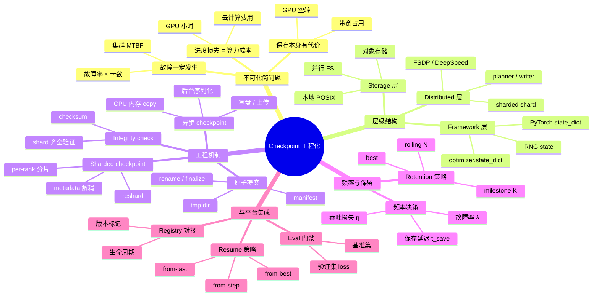
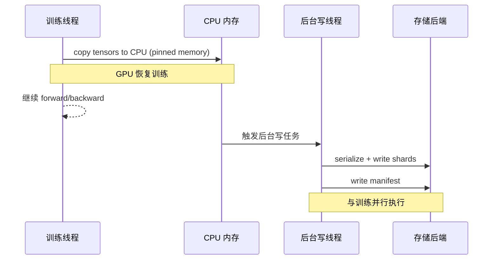
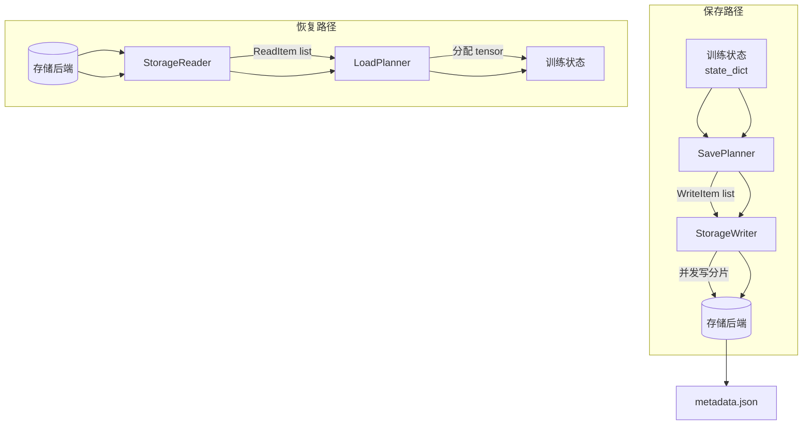
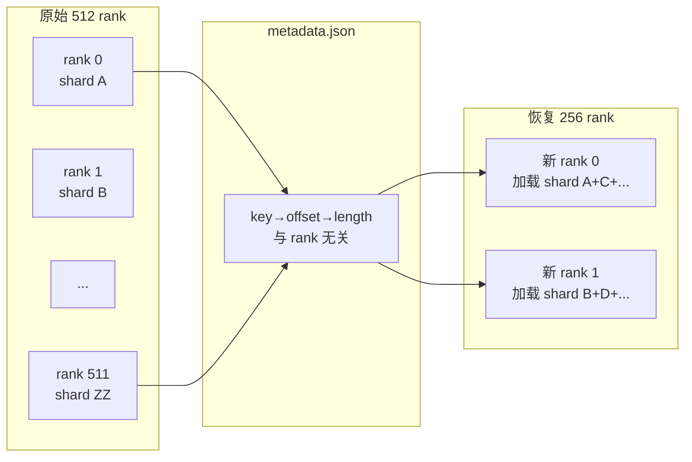
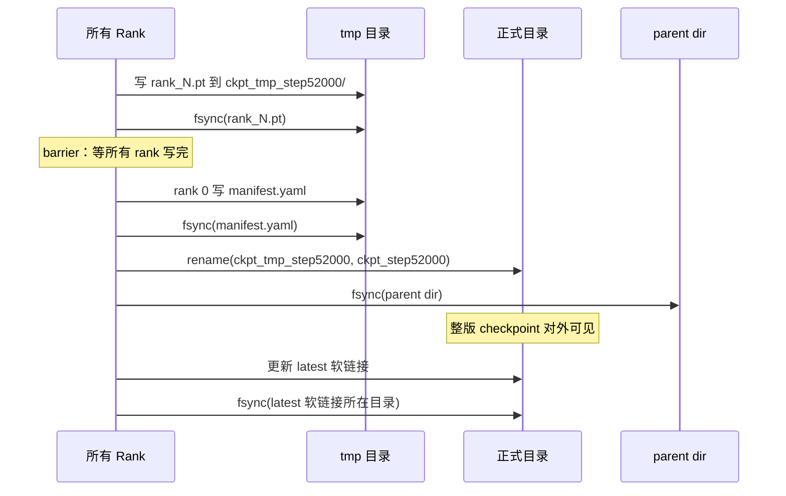
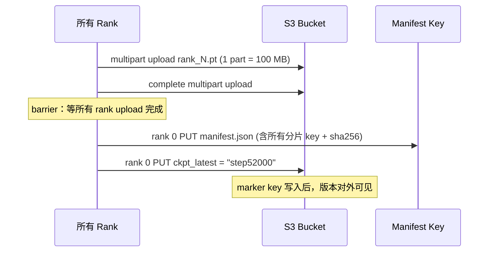
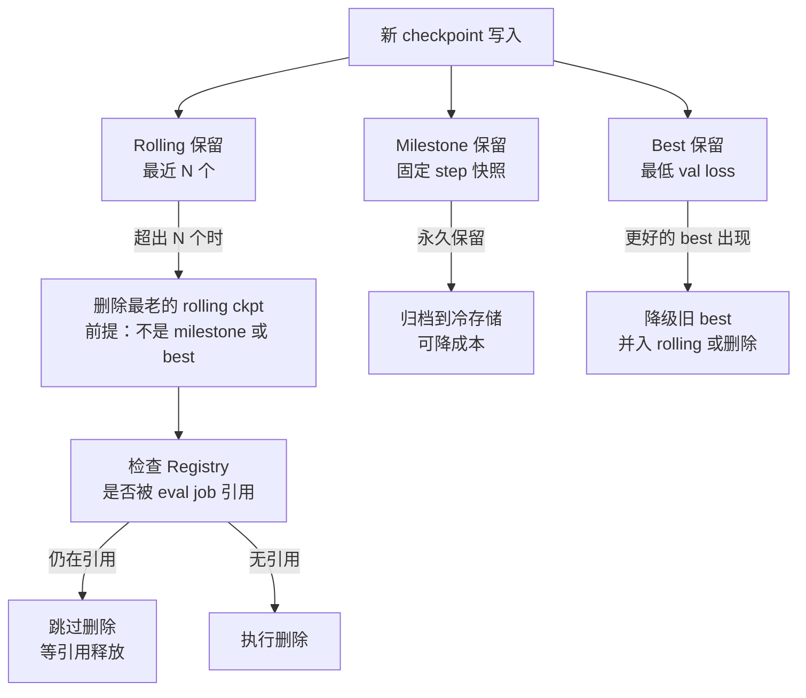
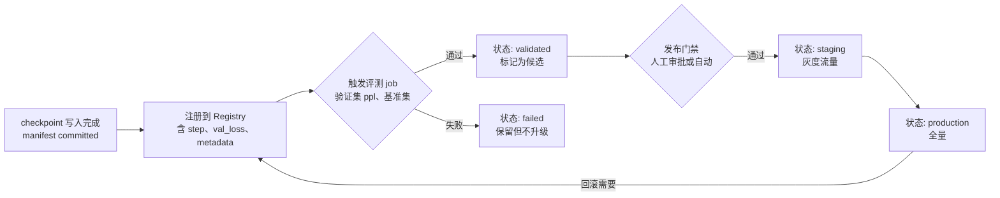

# 第 12b 章 · Checkpoint 工程化

> 训练任务故障不是小概率事件，而是系统常态；Checkpoint 工程化的目标是让每次故障的代价被算清楚、压到最低，而不是靠运气熬完一次训练。

> **关联章节**：[第 10 章](../part3-training-infra/10-memory-checkpointing-and-recovery.md) 已覆盖 checkpoint 的基础概念（保存什么、true resume vs warm start、manifest、原子提交）；本章是工程化深挖，不重复 Ch10 已讲内容，而是从实现细节、分布式实现、异步存储、频率决策、retention 策略到 175B 规模的端到端 worked example 全面展开。本章还与 [第 12 章](./12-artifacts-and-checkpoints.md) 的制品管理框架直接对应，checkpoint 是 registry 的最重要 artifact 类型。

---

## 12b.1 第一性原理拆解 + 学习大纲

### 拆 — 不可化简的问题

剥离 PyTorch DCP、FSDP、DeepSpeed、TorchSnapshot、Lustre、S3 multipart 这些工具名之后，Checkpoint 工程化要解决的不可化简问题是：**训练任务故障一定会发生，恢复时间和数据安全直接决定训练成本，而保存和恢复的代价又与训练吞吐相互博弈。**

这里"一定发生"不是夸张。一台 H100 的年度平均故障间隔（MTBF）大约 1–3 年，但一个 512 卡的集群在时间维度上的"期望故障间隔"会按卡数反比压缩，达到每几天一次的量级。加上调度器抢占、NCCL hang、存储断联、Xid 错误、驱动崩溃，任何超过数天的训练任务都必须假设"中途一定会断"。

一旦断了，损失的进度 = 最后一次 checkpoint 距故障点的 token 数。这不是"几步训练"，而是真实的 GPU 小时数，也是真实的用电和云计算费用。一个 512 卡 H100 集群每小时消耗的算力成本（云上约 $25,000–$40,000/小时），直接等于每小时 checkpoint 频率对应的"最坏进度损失"的货币价值。

同时，保存 checkpoint 本身也有代价：同步保存期间所有 GPU 空转，异步保存会占用 CPU 和本地盘带宽。175B 模型在 512 卡上，每次同步 checkpoint 可能需要 5–15 分钟的等待，相当于整小时吞吐损失 8–25%。因此 checkpoint 频率、保存延迟、存储后端、异步实现之间存在一个必须显式建模的博弈，而不是靠经验值随手设一个"每 1000 步"。

这个问题的第二层不可化简在于：分布式训练的 checkpoint 不是"一个文件"，而是 N×rank 的分片状态集合，包含模型参数分片、优化器状态分片、RNG 状态、sampler 进度、scheduler 状态、并行布局 metadata。这些东西必须全部对齐、全部校验、整体原子提交，才算一个"可恢复版本"。任何一个 rank 的分片缺失、损坏或版本不对齐，整个 checkpoint 都无法 true resume。

### 推 — 从这个问题如何推导出每个机制

从"保存有代价 + 故障一定发生"推出 **频率决策模型**：最优 checkpoint 间隔 T* 是在进度损失期望值和保存开销之间取极小值，与集群故障率（λ）、单次保存延迟（t_save）和保存期间吞吐损失（η）共同决定。

从"保存期间 GPU 空转"推出 **异步 checkpoint**：把状态复制到 CPU 内存后立即恢复训练，后台在 CPU 上执行序列化和写盘。这把 GPU 阻塞时间从"序列化+写盘"压缩为仅"内存 copy"（~10–30秒），代价是 CPU 内存必须额外保留一份训练状态。

从"N 卡分片状态"推出 **sharded checkpoint**：每个 rank 独立保存自己持有的分片，不 gather 到 rank 0，不存全量权重。这使写入带宽线性扩展（N 个 rank 并发写），避免 rank 0 成为瓶颈，但恢复时如果 rank 数发生变化（扩容/缩容/换卡），必须能重新 reshard——这是 DCP 设计中最复杂的部分。

从"半成品 checkpoint 比没有 checkpoint 更危险"推出 **manifest + 原子提交**：先写到 tmp 目录，所有 rank 写完后，rank 0 写 manifest，最后执行 rename（POSIX）或 finalize（S3 multipart），使整版 checkpoint 原子对外可见。这个机制在 Ch10 已介绍，本章重点覆盖 S3 multipart upload 的具体协议、integrity check 的 checksum 方案和 metadata 设计。

从"rank 数可能变化"推出 **DCP 的 planner/writer/reader 设计**：Planner 负责决定哪些 tensor 由哪些 rank 写/读，解耦物理 rank 布局和逻辑 state；storage_writer/storage_reader 负责把 planner 决策翻译成实际 I/O；metadata 记录每个分片的 key、shape、dtype、offset，使恢复时不依赖原始 rank 数。

从"checkpoint 和存储系统语义强耦合"推出 **存储后端分层设计**：临时写入用本地 POSIX（利用 fsync+rename 原子性），长期归档用对象存储（利用 multipart + immutable key），高并发大吞吐用并行文件系统（利用 stripe 聚合带宽）。三者的 checkpoint 协议完全不同，混用会造成数据安全漏洞。

从"保留多少 checkpoint"推出 **retention 策略**：训练过程中保留 rolling N 个最近、K 个 milestone，以及 best（按验证集 loss）。这三类用途不同：rolling 用于快速恢复、milestone 用于消融实验和 paper 复现、best 用于最终发布。删除老 checkpoint 时必须查 registry 状态，防止删除仍被引用的版本。

### 绘 — 因果链路



### 导 — 读完本章你应该能回答

1. 为什么 checkpoint 频率不应该是固定经验值？集群故障率、保存延迟和吞吐损失如何共同决定最优间隔？
2. 同步 checkpoint 的 GPU idle 代价怎么计算？异步 checkpoint（DCP async）把哪段延迟移出了关键路径？
3. DCP 的 planner、storage_writer、storage_reader、metadata 各自负责什么？为什么它能支持 rank 数变化时的 reshard？
4. 一个 shard 级 checkpoint 的 manifest 至少要包含哪些字段才能保证 integrity？
5. 对象存储的 checkpoint 原子提交协议与 POSIX rename 有什么本质区别？
6. 175B 模型在 512 卡上做 sharded checkpoint，一次 save 的磁盘占用、写入带宽、上传时间和对吞吐的影响分别是多少？
7. Rolling、milestone、best 三类 checkpoint 的保留策略分别服务于什么用途？什么时候绝对不能删？

---

## 12b.2 Checkpoint 的层级结构

大模型 checkpoint 工程化的第一步是弄清楚"checkpoint"这个词在不同层次的含义。

### Framework 层：PyTorch state_dict

最基础的 checkpoint 单元是 PyTorch 的 `state_dict`，它是一个从参数名到 tensor 的有序字典。训练代码保存的状态至少包含：

```python
{
  "model": model.state_dict(),          # 所有参数和 buffer
  "optimizer": optimizer.state_dict(),  # Adam 的 exp_avg, exp_avg_sq
  "scheduler": scheduler.state_dict(),  # lr 调度状态
  "step": global_step,
  "tokens_seen": tokens_seen,
  "rng_state": {                        # 必须所有 rank 的 RNG
    "cpu": torch.get_rng_state(),
    "cuda": torch.cuda.get_rng_state(),
    "numpy": np.random.get_state(),
    "python": random.getstate(),
  },
  "tokenizer_hash": sha256(tokenizer_config),
  "code_commit": git_rev,
  "data_shard_indices": sampler_state,
}
```

> **[warn] 只保存模型权重不是 checkpoint**：如果 `optimizer.state_dict()` 缺失，恢复后 Adam 的一阶和二阶矩归零，相当于重新开始热身，loss 曲线会出现明显跳变，甚至需要数百步才能恢复平稳。这是"warm start"而不是"true resume"，在成本上和重新训练没有本质区别。

### Distributed 层：FSDP / DeepSpeed

单机 state_dict 在分布式训练中遇到第一个问题：每个 rank 只持有参数的一个分片（FSDP sharding、ZeRO Stage-2/3），不存在"完整的 state_dict"。

**选项 A：gather 后保存（全量 checkpoint）**
- rank 0 把所有 rank 的参数 all-gather 到自己
- rank 0 串行写出一个完整权重文件
- 问题：写入成为 rank 0 的瓶颈，带宽受限；175B BF16 约 350 GB 写入只走一个 rank

**选项 B：sharded checkpoint（推荐）**
- 每个 rank 把自己持有的分片独立写出
- N 个 rank 并发写，总带宽线性扩展
- 恢复时各 rank 加载自己的分片
- 但 rank 数变化时必须 reshard

| 方式 | 写入并发 | 单 rank 写入量（175B BF16） | rank 数变化 |
|------|---------|--------------------------|------------|
| 全量（rank 0） | 1 | ~350 GB | 支持 | 
| Sharded（per rank） | N=512 | ~700 MB | 需 reshard |
| Hybrid | 节点数 | ~8 GB/node | 部分支持 |

### Storage 层：POSIX、并行 FS、对象存储

存储层是 checkpoint 工程化最容易踩坑的地方。三种后端的语义差异决定了写入协议完全不同（详见 [§0c 文件系统](../part0-foundations-of-systems/0c-filesystems-and-storage-internals.md)）：

| 存储后端 | 适合场景 | 原子性保证 | checkpoint 协议 |
|---------|---------|----------|----------------|
| 本地 POSIX（ext4/xfs） | 单节点、临时 staging | `rename()` 同 FS 原子 | write to tmp → fsync → rename → fsync(parent) |
| 并行 FS（Lustre/GPFS） | 多 rank 共享写、集群 NAS | POSIX rename 语义 | 同 POSIX，注意 MDS 元数据并发 |
| 对象存储（S3/GCS/OSS） | 长期归档、跨地域 | multipart + finalize | multipart upload → manifest PUT → marker key |

> **[danger] S3 没有 rename**：S3 的"rename"是 copy + delete，不是原子操作。如果把 POSIX 的 checkpoint 协议（写完就 rename）直接移植到 S3，会出现"tmp 目录 key 存在但 manifest 未写入"的中间状态，恢复程序可能读到半成品。正确协议是：所有分片 multipart upload 完成 → 写 manifest JSON（含所有分片 key、checksum、size）→ 写 `checkpoint_latest` marker key 指向该版本，整个操作对外原子。

---

## 12b.3 同步 vs 异步 Checkpoint

### 同步保存的代价

同步 checkpoint 的流程是：

```
allreduce/step 完成 → 所有 rank 停下来 → 序列化 state_dict → 写盘 → 所有 rank 确认写完 → 继续训练
```

GPU idle 时间 = 序列化时间 + I/O 时间。175B 模型 BF16 参数 ~350 GB，Adam 状态 ~700 GB，共 ~1.05 TB（FP32 optimizer state）。若 Lustre 写带宽 per-rank 约 2 GB/s，512 rank 并发，则写入时间约：

```
per-rank 写入量 = 1.05 TB / 512 ≈ 2.1 GB
写入时间 ≈ 2.1 GB / 2 GB·s⁻¹ ≈ 1.05 s（纯 I/O）
```

但序列化（CPU pickle / safetensors 编码）和等待最慢 rank 的尾延迟往往让实际阻塞超过 60–300 秒。每小时一次 checkpoint 意味着 1–5% 的吞吐损失。

### 异步 Checkpoint：DCP Async 模式

DCP（`torch.distributed.checkpoint`）的异步模式把流程改为：



关键设计：
- GPU 只阻塞"CPU memory copy"这一步（pinned memory，~10–30 秒）
- 序列化和 I/O 在 CPU 线程池中执行，与下一个 step 并行
- 必须有"在飞 checkpoint 数"上限（通常 1–2），防止 CPU 内存堆积
- 若训练速度快于 checkpoint 写入，系统需要反压（block 直到上一个 checkpoint 完成）

> **[note] 异步 checkpoint 的 OOM 风险**：async copy 会在 CPU 内存中持有训练状态的完整副本。175B 模型 BF16 + FP32 Adam ~1.05 TB，若 CPU 内存小于这个量级，async 模式会 OOM。实际工程中需要评估节点 CPU DRAM 容量（通常 512 GB–2 TB/节点）并限制并行 checkpoint 任务数。

| 方式 | GPU 阻塞时间 | CPU 内存额外占用 | 实现复杂度 |
|------|------------|----------------|----------|
| 同步（blocking） | 序列化 + I/O（1–10 分钟） | 无 | 低 |
| 异步（DCP async） | 仅 CPU copy（10–30 秒） | 1 份训练状态 | 中 |
| 异步 + 压缩 | 仅 CPU copy | 压缩后（~50%） | 高 |

---

## 12b.4 DCP 原理：Planner、Writer、Reader、Metadata

PyTorch Distributed Checkpoint（`torch.distributed.checkpoint`，简称 DCP）是 PyTorch 2.x 推荐的分布式 checkpoint 方案，其核心设计在于将"哪些数据由谁写/读"（planner）与"数据怎么写到存储"（writer/reader）解耦。

### 架构图



### Planner

`SavePlanner` 的职责是把 `state_dict` 中的每个 tensor 拆解成 `WriteItem` 列表，每个 item 包含：
- tensor key（逻辑名，不依赖 rank）
- storage key（物理文件/prefix）
- 写入的字节范围（offset + length）
- tensor 的 metadata（shape、dtype、stride）

这个设计的关键是**逻辑 key 与物理 rank 解耦**：同一个逻辑参数（如 `transformer.layer.0.attn.weight`）在不同 rank 数配置下可以有不同的物理分片，但 planner 记录的是逻辑 key 和 byte range，不记录"rank N 写了哪些"。

### StorageWriter / StorageReader

- `FileSystemWriter`：把 items 写到 POSIX FS，每个 rank 写到 `<ckpt_dir>/<rank>.pt`，rank 0 写 `metadata.json`
- `S3Writer`（社区扩展）：使用 multipart upload，每个分片对应一个 part，上传完成后 writer 负责 finalize
- `GCSWriter`：类似，使用 GCS compose 实现原子提交

### metadata.json 结构

```json
{
  "format": "pytorch_dcp",
  "version": "1.0",
  "storage_data": {
    "transformer.layer.0.attn.weight": [
      {
        "storage_key": "0.pt",
        "offset": 0,
        "length": 524288,
        "properties": {
          "dtype": "bfloat16",
          "shape": [4096, 1024],
          "stride": [1024, 1]
        }
      },
      ...
    ]
  },
  "planner_data": {
    "pytorch_version": "2.3.0",
    "dp_size": 512,
    "tp_size": 8,
    "pp_size": 4
  }
}
```

### Reshard：rank 数变化时的处理



LoadPlanner 根据当前 rank 数和 world size 重新分配 tensor 分片的加载任务，每个新 rank 可能需要加载多个旧分片的不同 byte range，DCP 的 storage_reader 负责按需 seek 读取。

> **[warn] reshard 的边界条件**：Tensor Parallel 和 Pipeline Parallel 的分片布局不是 DCP 内置的，需要 planner 的自定义 `transform_state_dict` 钩子来处理。如果 TP size 或 PP size 同时改变，还需要额外的参数重组逻辑，不是 DCP 开箱即用能处理的。

---

## 12b.5 TorchSnapshot、DCP、Megatron-LM Checkpoint 对比

三套主流分布式 checkpoint 方案的设计差异：

| 维度 | PyTorch DCP | TorchSnapshot | Megatron-LM ckpt |
|------|------------|--------------|------------------|
| 维护方 | PyTorch 官方 | Meta（已归档） | NVIDIA |
| 主要模式 | Sharded per-rank | Sharded per-rank | Sharded per-rank + global |
| Async 支持 | 内置 async API | 内置 async | 外部实现 |
| Reshard 支持 | 原生支持 | 原生支持 | 手动，需 merge+split 脚本 |
| metadata 格式 | JSON，逻辑 key | JSON，逻辑 key | 目录结构 + tracker file |
| 存储后端抽象 | StorageWriter 接口 | 存储插件 | 写死 POSIX / S3 路径 |
| 原子提交 | 依赖 writer 实现 | 内置 finalize | tmp dir + rename |
| 与 FSDP 集成 | 原生 | 需适配 | 不适用（MP only） |
| 与 DeepSpeed 集成 | 需适配 | 需适配 | 不适用 |
| 推荐使用场景 | PyTorch 生态大模型 | 已迁移到 DCP | Megatron-Core 训练 |
| 状态 | 活跃开发 | 已停止维护 | 活跃开发 |

> **[note] TorchSnapshot 已归档**：Meta 将 TorchSnapshot 的功能合并到 PyTorch DCP，新项目不建议使用 TorchSnapshot。如果现有代码依赖 TorchSnapshot，建议迁移路径是替换 `snapshot.save/restore` 为 `dist_cp.save/load`，planner 语义基本兼容。

---

## 12b.6 Checkpoint 元数据设计

一个完整的 checkpoint 元数据不只包含 step 和版本号，而是把"恢复时需要的所有判断条件"全部记录：

```yaml
# checkpoint_manifest.yaml
version: "1.0"
format: "pytorch_dcp"
checkpoint_id: "ckpt-step-52000-20260503-142530"
step: 52000
tokens_seen: 2_184_320_000_000    # 2.18T tokens
wall_time_s: 187200               # 52 小时训练时间
created_at: "2026-05-03T14:25:30Z"

model:
  arch: "llama3-175b"
  tp_size: 8
  pp_size: 4
  dp_size: 16     # 8×4×16 = 512 rank

training:
  global_batch_size: 4096
  seq_len: 8192
  lr: 2.4e-5
  warmup_steps: 2000
  code_commit: "a3803d5c33e862adf"
  config_hash: "sha256:b7f3e9a2..."

data:
  dataset_version: "pile-v3-dedup"
  tokenizer_hash: "sha256:c4d1f8b9..."
  shard_index: 52000    # dataloader shard 进度

shards:
  total: 512
  files:
    - key: "rank_0000.pt"
      size_bytes: 2147483648
      sha256: "a1b2c3d4..."
    - key: "rank_0001.pt"
      ...
  metadata_key: "metadata.json"

eval:
  val_loss: 2.1834
  ppl: 8.87

tags:
  - "rolling"
status: "committed"
```

| 字段 | 用途 | 缺失后果 |
|------|------|---------|
| `step` / `tokens_seen` | 恢复训练进度 | 不知道从哪继续，可能重复训练 |
| `tokenizer_hash` | 验证 tokenizer 版本一致性 | tokenizer 更新后恢复出词汇错位 |
| `code_commit` | 复现和排障 | 无法确定哪个代码版本产生此 ckpt |
| `tp_size/pp_size/dp_size` | reshard 决策 | 无法判断是否需要 reshard |
| `shard_index` | data sampler 状态 | 恢复后重复数据或跳过数据 |
| `sha256` per shard | integrity check | 无法检测位翻转或部分写失败 |
| `val_loss` | best checkpoint 选择 | 无法自动选 best 用于发布 |
| `status` | 原子提交状态 | 无法区分完整版本和半成品 |

---

## 12b.7 原子提交：POSIX vs 对象存储

### POSIX 原子提交协议



关键点：
1. `rename()` 在同一文件系统内是原子操作（POSIX 保证）
2. 必须 `fsync(parent dir)` 才能保证目录项在断电后持久化
3. 跨挂载点 rename 不是原子操作，不能跨 NFS 挂载做 checkpoint

### 对象存储原子提交协议



S3 的 multipart upload 保证：
- 单个 part 上传失败不影响其他 part
- `complete_multipart_upload` 是服务端原子操作（key 要么可见要么不可见）
- manifest 写入后，reader 才认为这个版本"committed"

> **[success] S3 版本化（Versioning）可以防止覆盖**：开启 S3 Bucket versioning 后，即使 manifest 被意外覆盖，旧版本的 manifest 仍可恢复。建议在 checkpoint bucket 上开启 versioning 并设置 Object Lock，防止误删。

> **[danger] LIST prefix 不是事务边界**：不要用 `s3 ls s3://bucket/ckpt_step52000/` 来判断 checkpoint 是否完整，因为 LIST 看到的文件可能来自多个并发写入操作的混合状态。必须用 manifest 的存在性和内容作为完整性判断。

---

## 12b.8 Checkpoint 频率决策模型

### 从故障率反推最优频率

设：
- λ = 集群故障率（次/小时），例如 512 卡集群故障率 ~0.1–0.3 次/小时
- T = checkpoint 间隔（小时）
- t_save = 每次 checkpoint 耗时（小时），阻塞期间 GPU 空转
- C = 算力成本（$/小时）
- η = 保存期间吞吐损失比例（t_save / T）

期望进度损失成本：
```
E[loss] = λ × T × (T/2) × C = λ × C × T²/2
```

checkpoint overhead 成本：
```
E[overhead] = (t_save / T) × C × T_total
```

对 T 求导取极小值，近似最优间隔：
```
T* = sqrt(2 × t_save / λ)
```

| 场景 | λ（次/小时） | t_save（分钟） | T*（分钟） | 吞吐损失 |
|------|------------|--------------|----------|---------|
| 512 卡 H100（同步） | 0.2 | 10 | 44 | ~23% |
| 512 卡 H100（异步） | 0.2 | 0.5 | 10 | ~5% |
| 1024 卡 H100（同步） | 0.4 | 15 | 39 | ~38% |
| 1024 卡 H100（异步） | 0.4 | 0.5 | 5 | ~10% |

> **[warn] 越大的集群越需要异步 checkpoint**：上表说明，1024 卡同步 checkpoint 每小时损失 38% 吞吐，这意味着实际有效训练时间只有 62%，GPU 使用效率极差。异步 checkpoint 是大规模训练的基础设施要求，不是可选优化。

### 频率决策表

| 训练规模 | 模型大小 | 建议间隔 | 建议模式 | 说明 |
|---------|---------|---------|---------|------|
| <64 卡 | <7B | 每 1000 步或 30 分钟 | 同步 | 故障率低，影响可接受 |
| 64–256 卡 | 7B–70B | 每 500 步或 20 分钟 | 异步 | 故障率上升 |
| 256–1024 卡 | 70B–175B | 每 200 步或 10 分钟 | 异步 + 并行上传 | 需精确建模 T* |
| >1024 卡 | >175B | 每 100 步或 5 分钟 | 异步 + 内存映射 | 对吞吐影响需持续监控 |

---

## 12b.9 Retention 策略

保留多少 checkpoint 由三个独立的用途决定，每种用途的生命周期完全不同：



| 保留类型 | 数量 | 触发删除条件 | 绝对不删条件 |
|---------|------|------------|------------|
| Rolling | 最近 3–5 个 | 超出数量 | 仍有 eval job 引用 |
| Milestone | step 100K/200K/... | 不自动删除 | 永久保留 |
| Best | 1–3 个 | 新 best 出现 | 已发布到 production |

> **[danger] 不要按文件年龄删除 checkpoint**：age-based 删除会同时误删 milestone 和 best checkpoint。必须按类型 + registry 引用状态做决策，否则可能删掉唯一能恢复的版本。

### Ring 保留的磁盘估算

175B BF16（~350 GB）+ FP32 Adam（~700 GB）= ~1.05 TB/ckpt

每小时一次，保留最近 5 个 + 5 个 milestone + 1 个 best = 11 个

磁盘占用：`11 × 1.05 TB ≈ 11.55 TB`（仅 checkpoint，不含日志和 eval 结果）

---

## 12b.10 Selective Checkpoint 与 LoRA Delta

并非所有场景都需要保存完整 checkpoint：

| 类型 | 保存内容 | 大小 | 用途 |
|------|---------|------|------|
| Full checkpoint | 所有参数 + optimizer + RNG | ~1.05 TB（175B） | True resume |
| 权重 only | 仅模型参数（BF16） | ~350 GB | 推理 / 评测 |
| LoRA delta | 仅 LoRA 参数（A/B 矩阵） | ~50–500 MB | SFT/RLHF 快速保存 |
| Activation checkpoint | 中间激活（不是训练 ckpt） | 取决于 recompute 策略 | 节省显存（非持久化） |

> **[note] LoRA delta checkpoint 的注意事项**：保存 LoRA delta 时，必须同时记录 base model 版本 hash，否则 delta 和 base 不对应，恢复后权重损坏。RLHF 多模型 checkpoint 场景（Policy + Reward + Reference 模型同时训练）需要在 manifest 中记录所有模型的 step 对应关系，保证三个模型状态一致（详见 [§12 制品管理](./12-artifacts-and-checkpoints.md) 的多 artifact 一致性讨论）。

---

## 12b.11 大模型 Checkpoint 实践：100B+ 规模

### 并行上传设计

对于 175B 模型在 512 卡上，每次 checkpoint 后向 S3 上传约 1.05 TB：

- 每个 rank 独立上传自己的分片（~2.1 GB/rank）
- 512 rank 并发上传，每个 rank 并发 4 个 multipart part
- 有效并发：512 × 4 = 2048 个并发 upload stream
- 若 S3 带宽上限约 50 GB/s（企业级），上传时间约 21 秒
- 加上序列化和 manifest 写入，实际约 30–60 秒

> **[success] 并行上传的工程关键**：（1）每个 rank 上传自己的分片，不让 rank 0 聚合；（2）使用 multipart upload，每 part 100–200 MB，允许失败重传；（3）upload 失败后要有重试队列，而不是整版 checkpoint 重新开始；（4）manifest 只在所有分片 upload 成功后才写入。

### 网络带宽规划

| 操作 | 数据量（175B FP16+FP32 Adam） | 理想时间（50 GB/s） | 实际时间（含开销） |
|------|---------------------------|--------------------|------------------|
| 同步写 Lustre（512 rank 并发） | 1.05 TB | ~21 s | 60–300 s |
| 异步写 Lustre（CPU copy） | GPU 阻塞仅 copy | 10–30 s（GPU block） | 后台继续 60–300 s |
| 上传 S3（512 rank 并发） | 1.05 TB | ~21 s | 30–60 s |
| Integrity check（sha256） | 1.05 TB per rank | per rank ~2 s | 并发，整体 5–10 s |

### 文件系统选型对 Checkpoint 的影响

| 文件系统 | Checkpoint 写入性能 | 元数据开销 | 推荐角色 |
|---------|-------------------|----------|---------|
| ext4/xfs（本地 NVMe） | 高（3–7 GB/s/node） | 低 | 异步 checkpoint 的 CPU-side staging |
| Lustre | 高（聚合 100s GB/s） | MDS 是瓶颈 | 集群共享 checkpoint 主存储 |
| GPFS/Spectrum Scale | 高，小文件更优 | 低 | 替代 Lustre 的企业选择 |
| NFS | 低（~1 GB/s） | 高 | 不推荐大规模 checkpoint |
| S3/GCS | 中（弹性） | 无 POSIX | 长期归档，不做训练时主存储 |

---

## 12b.12 Resume 策略

恢复训练时有四种语义不同的 resume 策略：

| 策略 | 从哪个 checkpoint 恢复 | 适用场景 |
|------|----------------------|---------|
| from-last | 最新提交的 checkpoint | 故障后自动恢复（最常见） |
| from-best | val loss 最低的 checkpoint | 过拟合后回退 |
| from-step N | 指定 step 的 checkpoint | 消融实验、分支训练 |
| from-scratch | 不加载 checkpoint | 重新训练 |

> **[warn] resume 后必须验证训练语义**：恢复后的前几个 step，应检查 loss 是否平滑衔接（不出现突变）、global step 是否正确、学习率是否按 scheduler 继续（不从头 warmup）、data sampler 是否从正确位置继续（不重复或跳过）。这些检查应该是自动化脚本，而不是人工目测 loss 曲线。

---

## 12b.13 与 Model Registry 集成

Checkpoint 完成后，与 registry 的集成流程：



> **[success] checkpoint 转模型包**：`validated` 状态的 checkpoint 可以被转换为"模型包"：提取纯权重（BF16 只需模型参数，去掉 optimizer state），打包 tokenizer、config、推理适配层，发布到 serving registry。这个转换不应该直接修改 checkpoint 本身，而是派生出一个独立的 model package artifact。

---

## 12b.14 Worked Example：175B 模型 512×H100 端到端 Checkpoint 流水线

### 场景设定

| 参数 | 值 |
|------|---|
| 模型 | 175B LLaMA-3 变体，BF16 权重 |
| 集群 | 512 × H100-80GB，64 节点 × 8 卡 |
| 并行配置 | TP=8, PP=4, DP=16 |
| 总参数量 | 175B × 2 bytes = 350 GB（BF16） |
| Adam 状态 | 175B × 4 bytes = 700 GB（FP32 一阶+二阶矩） |
| 总 checkpoint 大小 | ~1.05 TB |
| 训练速度 | ~3,500 tokens/s/GPU × 512 = 1,792,000 tokens/s |
| checkpoint 频率 | 每 60 分钟（约 6.4B tokens） |
| 目标 | 故障后最多丢失 1 小时进度 |

### 端到端流程

**Step 1：触发异步 checkpoint（训练 step 完成后）**

```python
# 每 N step 或每 T 秒触发
if should_checkpoint(step, last_ckpt_time):
    # GPU 阻塞：把所有 tensor copy 到 CPU pinned memory
    cpu_state = copy_to_cpu(model, optimizer, scheduler)  # ~20s
    
    # 启动后台任务，训练立即恢复
    ckpt_future = async_ckpt_pool.submit(
        save_checkpoint,
        cpu_state,
        step=step,
        tokens_seen=tokens_seen,
    )
    training_resumes()  # GPU 立即继续
```

GPU 阻塞时间：约 20–30 秒（CPU memory copy，pinned memory 带宽约 30–50 GB/s）

**Step 2：后台序列化 + 写 Lustre**

- DCP SavePlanner 把 state_dict 拆成 512 个 WriteItem
- 每个 rank 写约 2.1 GB 到 Lustre `ckpt_tmp_step52000/rank_XXXX.pt`
- 序列化（safetensors 格式）+ 写盘约 60–120 秒
- Lustre stripe count = 64（每文件分布到 64 个 OST），有效写带宽约 2 GB/s/rank

**Step 3：Barrier + Manifest**

```python
# 所有 rank 写完后 barrier
dist.barrier()
# rank 0 写 manifest（含所有分片 sha256）
if rank == 0:
    manifest = compute_manifest(ckpt_tmp_dir)
    write_manifest(manifest, f"ckpt_tmp_step{step}/manifest.yaml")
    fsync(manifest_file)
    os.rename(f"ckpt_tmp_step{step}", f"ckpt_step{step}")
    fsync(parent_dir)
    update_symlink("latest", f"ckpt_step{step}")
```

**Step 4：并行上传 S3（Lustre → S3 归档）**

- 512 rank 并发启动 S3 multipart upload
- 每个分片约 2.1 GB，分成 21 个 100 MB part
- 有效上传带宽：假设每节点出口 25 Gbps × 64 节点 = 1600 Gbps ≈ 200 GB/s
- 上传时间：1.05 TB / 200 GB/s ≈ 5.25 秒（理论），实际约 20–40 秒
- 上传完成后 rank 0 写 S3 manifest + marker key

**Step 5：Integrity Check**

```python
# 每个 rank 验证自己的分片
local_sha256 = sha256(f"ckpt_step{step}/rank_{rank:04d}.pt")
assert local_sha256 == manifest["shards"][rank]["sha256"]

# rank 0 验证 manifest 完整性
if rank == 0:
    for shard in manifest["shards"]:
        verify_s3_etag(shard["key"], shard["md5"])
```

**Step 6：更新 Registry + 触发 Eval**

```python
# rank 0 注册到 checkpoint registry
registry.register(
    checkpoint_id=f"ckpt-step-{step}",
    step=step,
    tokens_seen=tokens_seen,
    val_loss=eval_result.loss,
    manifest_s3_path=f"s3://ckpt-bucket/ckpt_step{step}/manifest.yaml",
    status="committed",
    tags=["rolling"],
)
# 触发异步 eval job
eval_queue.submit(checkpoint_id=f"ckpt-step-{step}")
```

**Step 7：Retention 清理**

```python
# 检查 rolling 队列，超出 5 个则删除最老
rolling = registry.list(tags=["rolling"], sort="step")
if len(rolling) > 5:
    oldest = rolling[0]
    if not registry.is_referenced(oldest.checkpoint_id):
        delete_checkpoint(oldest)
        registry.mark_deleted(oldest.checkpoint_id)
```

### 汇总数字

| 指标 | 数值 | 说明 |
|------|-----|------|
| 每次 checkpoint 磁盘占用 | ~1.05 TB | Lustre 上临时 + 正式 |
| S3 归档大小 | ~1.05 TB | 含 manifest，不压缩 |
| Rolling 保留（5个）磁盘 | ~5.25 TB | Lustre |
| GPU 阻塞时间（异步） | 20–30 秒 | CPU copy |
| 后台写盘时间（Lustre） | 60–120 秒 | 与训练并行 |
| S3 上传时间 | 20–40 秒 | 与训练并行 |
| 对训练吞吐影响 | ~0.5–1.5%/小时 | 仅 GPU block 时间 |
| 同步模式吞吐损失 | ~5–25%/小时 | 序列化+写盘全阻塞 |

> **[success] 异步 checkpoint 将吞吐损失从 5–25% 压缩到 0.5–1.5%**，在 512 卡 H100 集群上（约 $30,000/小时），每次训练节省数千美元的 GPU 成本，是大规模训练中 ROI 最高的工程优化之一。

---

## 12b.15 本章小结

| 机制 | 解决的问题 | 关键工程边界 |
|------|-----------|------------|
| Sharded checkpoint | 避免 rank 0 带宽瓶颈 | rank 数变化需 reshard |
| 异步 checkpoint（DCP） | 消除 GPU idle | CPU 内存需额外 1 份训练状态 |
| Manifest + 原子提交 | 防止半成品 checkpoint | S3 不能用 rename，需 multipart + marker |
| Integrity check | 检测位翻转和部分写失败 | sha256 计算本身有 CPU 开销 |
| 频率决策模型 | 量化最优 checkpoint 间隔 | 需持续监控实际故障率 |
| Retention 策略 | 控制存储成本，保留关键版本 | 必须查 registry 引用状态 |
| Registry 集成 | checkpoint → eval → 发布 | eval 必须异步，不能阻塞训练 |

---

## 练习题

**12b-1** 一个 70B 模型在 256 卡 H100 上训练，集群平均故障率 0.15 次/小时，异步 checkpoint 的 GPU 阻塞时间 15 秒，忽略其他开销。用 T* = sqrt(2 × t_save / λ) 计算最优 checkpoint 间隔。

**12b-2** 解释为什么 DCP 的 planner 设计能支持 rank 数变化时的 reshard，而 Megatron-LM 的传统 checkpoint 需要额外脚本处理同样的问题。

**12b-3** 设计一个 S3 multipart checkpoint 的原子提交协议：当 rank 5 的 upload 在 part 7/21 失败时，系统应该怎么处理？写出错误恢复流程。

**12b-4** 一个团队把 checkpoint 保存到 S3，用 `s3 ls s3://bucket/ckpt_step52000/` 来判断 checkpoint 是否完整。列出这个做法的至少 3 个风险。

**12b-5** 解释 `tokenizer_hash` 字段在 checkpoint manifest 中的作用。举一个 tokenizer 版本不一致导致恢复失败的具体场景。

**12b-6** 一个 175B 模型每小时 checkpoint 一次，同步模式写盘需要 8 分钟。计算这 8 分钟对每小时训练吞吐的影响百分比。如果换成异步模式（GPU block 25 秒），影响变为多少？

**12b-7** 设计 rolling + milestone + best 三类 retention 策略的具体参数：(1) 每次 checkpoint 1.05 TB，总 Lustre 容量 50 TB，最多能保留多少个 rolling？ (2) milestone 应该设在哪些 step？(3) 如果 best checkpoint 同时也是 rolling 最新的，清理时怎么处理？

**12b-8** 解释为什么 LoRA delta checkpoint 必须在 manifest 中记录 base model 版本 hash。如果 base model 在 LoRA 训练期间被更新了，恢复时会发生什么？

**12b-9** 比较 PyTorch DCP 的 `FileSystemWriter` 和一个假想的 `S3Writer` 在原子提交语义上的实现差异。哪些 DCP 接口需要 S3Writer 实现？

**12b-10** 一个团队把 RLHF 的 Policy、Reward、Reference 三个模型的 checkpoint 分别保存，但没有在 manifest 中记录三者的 step 对应关系。描述一个因此导致的恢复失败场景，并设计修复方案。

**12b-11** 为一个 512 卡 H100 集群设计 checkpoint 监控仪表盘的最小指标集：应该监控哪些数值，设置什么告警阈值？

**12b-12** 解释 T* = sqrt(2 × t_save / λ) 公式的推导假设。在哪些真实场景下这个公式会明显低估或高估最优间隔？给出 2 个具体反例。

---

## 深度参考阅读

### PyTorch 官方文档与源码

- PyTorch DCP 官方文档：`torch.distributed.checkpoint` API reference（PyTorch >= 2.1）
- PyTorch DCP 设计文档：[Distributed Checkpoint (DCP) RFC](https://github.com/pytorch/pytorch/issues/88378)
- FSDP + DCP 集成示例：`torch/distributed/fsdp/_shard_utils.py`

### 框架实现

- Megatron-LM checkpoint 实现：`megatron/checkpointing.py`（NVIDIA GitHub）
- DeepSpeed ZeRO checkpoint：`deepspeed/runtime/zero/stage_1_and_2.py` 中的 `save_checkpoint` 实现
- TorchSnapshot（Meta，已归档）：[github.com/facebookresearch/torchsnapshot](https://github.com/facebookresearch/torchsnapshot)

### 论文与技术报告

- **Gemini 训练技术报告**（2024）：介绍 Google 如何在 TPU Pod 上管理大规模 checkpoint 和故障恢复
- **Megatron-LM: Training Multi-Billion Parameter Language Models Using Model Parallelism**（Shoeybi et al., 2019）：包含 checkpoint 分片策略
- **PyTorch FSDP: Experiences on Scaling Fully Sharded Data Parallel**（Meta, 2023）：FSDP + DCP 的实际使用经验
- **PaLM: Scaling Language Modeling with Pathways**（2022）：包含大规模训练故障率和恢复策略的数据

### 存储系统

- Lustre 官方文档：Striping 配置和 checkpoint 最佳实践
- AWS S3 multipart upload 文档：part size、并发、错误处理
- [§0c3 fsync、Direct IO 与 Checkpoint 语义](../part0-foundations-of-systems/0c-filesystems-and-storage-internals.md)：本教程的存储语义基础

### 工程博客

- Meta Engineering：「How Meta trains large language models at scale」（2023）
- EleutherAI：「GPT-NeoX-20B: An Open-Source Autoregressive Language Model」- checkpoint 策略部分
- Weights & Biases 博客：「Checkpoint Management at Scale」
- HuggingFace 博客：「Large-scale model training with PyTorch FSDP」
