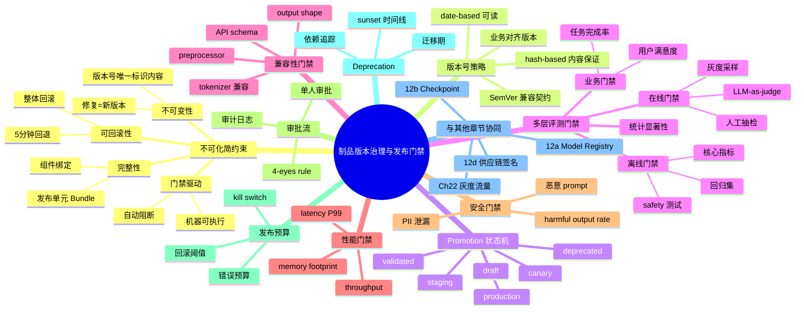
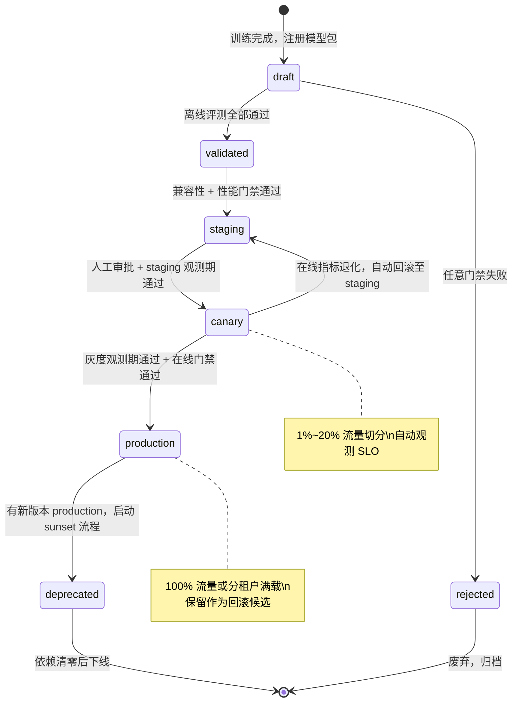
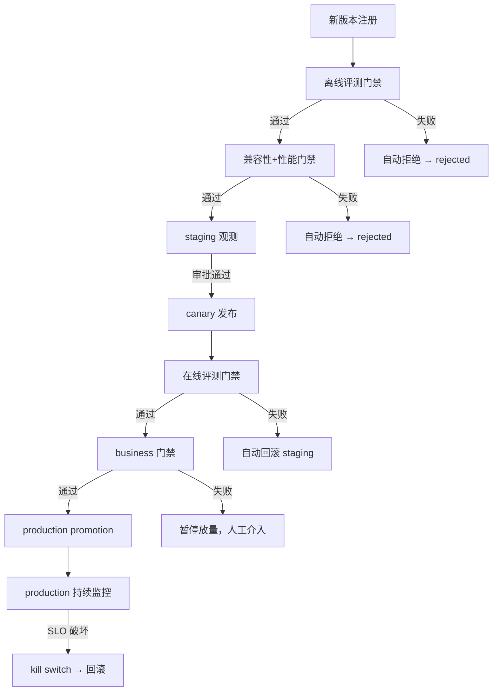
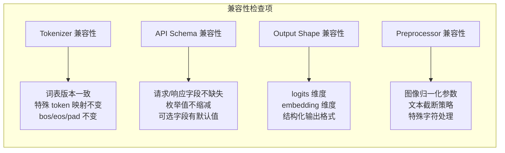
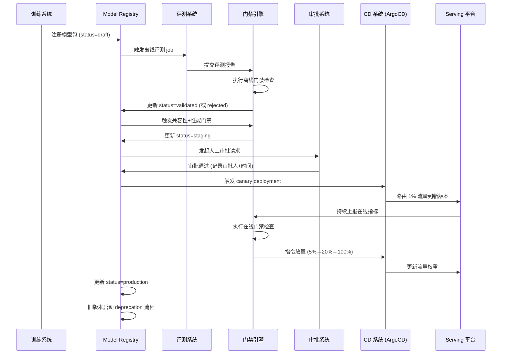
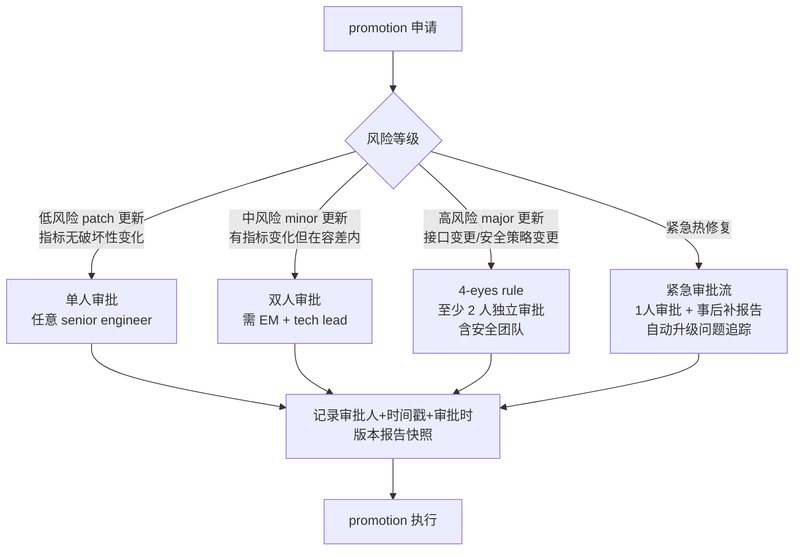
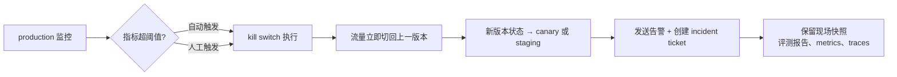
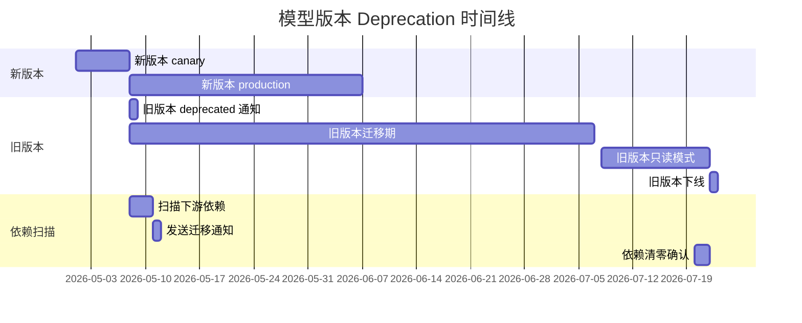

# 第 12c 章 · 制品版本治理与发布门禁

> 模型发布不是"把文件推上去"；它是一条从训练完成到线上流量的证明链——证明这个版本足够安全、足够正确、足够兼容，并且出了问题可以在 5 分钟内找到上一个确定可用的版本。

> **关联章节**：本章聚焦 release-time governance（版本号策略、promotion 门禁、审批流、不可变制品、deprecation）。灰度发布期间的流量切分与观测信号见 [第 22 章](../part7-reliability-security/22-evaluation-release-and-incident.md)；模型 artifact 的注册与元数据见 [第 12a 章](./12a-model-registry.md)；checkpoint 工程见 [第 12b 章](./12b-checkpoint-engineering.md)；供应链签名与完整性见第 12d 章。

---

## 12c.1 第一性原理拆解 + 学习大纲

### 拆 — 不可化简的问题

剥离 GitOps、ArgoCD、MLflow、SemVer、SBOM、4-eyes approval 这些词之后，本章要解决的不可化简问题只有一个：**模型的线上版本必须可追溯、可回滚、可审计，任何错误的 promotion 都会污染线上服务并影响真实用户**。

先定位问题的严重性。普通软件的发布失败通常是"接口报 500"或"构建失败"，发现成本低，自动回滚代价也低。模型的发布失败经常是"接口返回 200，但回答质量退化了 8%"，或者"新 tokenizer 对某类输入的处理方式悄然改变，下游 parsing 逻辑出现边界错误"。这类故障在 A/B 实验数据积累到足够的统计显著性之前，通常是不可见的——但它已经在影响真实用户。更危险的是，如果发布流程允许手工覆盖元数据或跳过评测报告，团队可能在根本不知道"线上跑的是什么"的情况下继续操作。

从这个核心问题展开，会推出四个第一性约束：

**约束一：不可变性（Immutability）**。一旦一个模型 artifact 被打上版本号并注册，它的内容就绝不能被修改。任何"修复"必须产生一个新版本、触发新的门禁流程、生成新的审计日志。如果允许就地修改，版本号就失去了意义，整个追溯链条就断裂了。

**约束二：完整性（Completeness）**。一个可发布版本不只是一组模型权重，而是一个完整的"发布单元"——权重、tokenizer、推理配置、serving 镜像摘要、评测报告、版本元数据、签名——这些必须作为一个原子对象被管理。任何一项缺失，都意味着系统不知道"线上是什么组合"。

**约束三：门禁驱动（Gate-driven）**。从 staging 到 canary、再到 production 的每一步 promotion，都必须经过预设的、机器可执行的门禁条件。门禁不是走形式，而是用来挡住已知坏版本。门禁失败必须自动阻断，不能靠人工"觉得没问题"来跳过。

**约束四：可回滚性（Rollbackability）**。回滚必须先于发布存在。这意味着在任意时刻，系统都能确定性地回答"上一个确认可用的 production 版本是什么"，并且能在 5 分钟内把流量切回去。回滚不是"把旧文件拷回来"，而是把整个发布单元——权重、tokenizer、配置、路由规则——一起回退到上一个版本。

### 推 — 从这个问题如何推导出每个机制

从"不可变性"必然推导出**版本号策略**：版本号不能是可以任意改变的标签，它必须能唯一且确定地标识一个制品的内容状态。这就引发了 SemVer vs date-based vs hash-based vs 业务对齐版本之间的设计权衡。哈希（如 SHA-256 摘要）天然保证内容不可变，但对人类不友好；日期版本号容易理解，但不表达语义破坏；SemVer 表达兼容性契约，但模型"兼容"的定义本身比 API 更模糊。

从"完整性"必然推导出**发布单元（Release Bundle）**的概念：registry 必须把所有组成部分绑定为一个原子对象，而不是让各组件版本在不同系统中漂移。这进一步推出**兼容性门禁**：必须自动校验新版本的 tokenizer、API schema、input/output shape 是否与上一个生产版本保持后向兼容。

从"门禁驱动"必然推导出**多层评测门禁体系**：离线评测（核心指标、回归样本、safety 测试）、在线采样（灰度期间的 LLM-as-judge、人工抽检）、业务指标（任务完成率、用户满意度信号）。每一层门禁都有固定阈值，低于阈值自动阻断。这还推出**统计显著性要求**：两个版本之间的指标差异必须超过最小可检测效果量（MDE），否则"通过"可能只是噪声。

从"可回滚性"必然推导出**promotion 状态机**：模型版本的生命周期是一条单向、有状态、可阻断的流转——draft → validated → staging → canary → production → deprecated。每个状态转换都是一次有记录的事件，回滚是显式触发状态转换，而不是手工操作文件。

从"审计"必然推导出**审批流**：promotion 到 production 之前，谁批准了、什么时候批准、批准时看了哪些报告——这些都必须是不可否认的、有时间戳的记录。对于高风险版本，还需要"4-eyes rule"（至少两人独立审批）。

从"出了问题"必然推导出**发布预算与 kill switch**：每个版本在 production 都有一个错误预算（error budget）。超过预算阈值时，系统自动触发回滚，不等待人工决策。Kill switch 是一种紧急降级机制，可以在 30 秒内把流量从新版本切离，不依赖完整的 CD 流程。

从"deprecation"必然推导出**依赖追踪与迁移期**：当一个模型版本将被下线时，必须先扫描所有下游依赖（API 调用方、嵌入应用、实验 baseline），给出迁移期，生成 migration guide，最终才能安全下线。

### 绘 — 因果链路



### 导 — 读完本章你应该能回答

1. 为什么模型 artifact 一旦发布就不能就地修改？如果需要紧急修复，正确的操作是什么？
2. SemVer、date-based、hash-based 版本号各自的优劣是什么？在 AI Infra 场景下如何组合使用？
3. 从 staging 到 production 的 promotion 链路上，至少需要哪几类门禁，每类门禁检查什么？
4. 兼容性门禁为什么必须覆盖 tokenizer、API schema 和 output shape？哪一项被忽略最容易导致隐性故障？
5. 统计显著性在评测门禁中扮演什么角色？如何避免"通过了但只是噪声"？
6. 审批流的"4-eyes rule"解决什么问题，什么场景下单人审批就足够？
7. 模型 deprecation 的"依赖追踪"包含哪些维度？如何保证下游系统有足够的迁移时间？

---

## 12c.2 版本号策略：为什么这个问题没有唯一答案

模型版本号的设计必须服务于两个相互矛盾的目标：**人类可读**（让工程师、PM、安全团队能快速判断版本关系）和**机器可验证**（让 CI/CD、registry、serving platform 能用版本号做自动化决策）。

### 四种主流策略

| 策略 | 示例 | 优势 | 劣势 | 推荐场景 |
|------|------|------|------|----------|
| **SemVer** | `2.1.0`, `3.0.0-rc1` | 表达兼容性契约（MAJOR=破坏性变更，MINOR=后向兼容新能力，PATCH=无接口变更的修复） | "兼容"对模型输出语义比对 API 接口更难定义；团队常争论"这个改动算 MAJOR 还是 MINOR" | 对外暴露 API 的模型服务，需要向调用方传递兼容性信号 |
| **Date-based** | `2026-05-03`, `20260503-r2` | 可读性强，自然表达时间顺序，不需要讨论版本号语义 | 不表达兼容性，同一天可能有多个版本，排序不够精细 | 快速迭代的内部模型，发布频率高，不需要对外承诺接口稳定性 |
| **Hash-based** | `sha256:a3f2c...` | 内容可验证，天然不可变，任何内容变更都会产生不同哈希 | 对人类完全不可读，无法从版本号判断时间顺序或兼容性 | 供应链安全要求内容完整性验证的场景，通常与其他策略叠加使用 |
| **业务对齐版本** | `gpt-4o-2025-05`, `reranker-v3` | 对产品和业务团队最友好，与产品里程碑对齐 | 版本号背后绑定的技术细节不透明，容易产生"v3 究竟改了什么"的混乱 | 对外发布的产品模型，用户感知型版本 |

> **工程建议**：AI Infra 实践中最常见的组合是：**业务版本号 + 内部日期/SemVer + 内容哈希**。例如，对外叫 `reranker-v3`，内部注册为 `reranker-2026-05-03-rc1`，artifact 存储时用 `sha256:a3f2c...` 做内容完整性锚定。三层版本号各司其职，互不干扰。

> **关键原则**：版本号一旦发布，禁止重用（no tag reuse）。如果 `2026-05-03-rc1` 因评测失败被废弃，下一次发布必须用新的版本号（如 `2026-05-03-rc2`），即使内容改动极小。

### 版本号与不可变制品的关系

不可变制品（Immutable Artifact）原则是版本号策略的执行保障：在对象存储层，模型文件必须写入不可覆盖的路径（如使用版本号或哈希作为路径组成部分，并禁用覆盖 API）；在 registry 层，版本记录一旦写入就不能被删除或修改，只能标记为 `deprecated`；在 serving 层，必须严格通过版本号引用模型，禁止"latest"指针指向变化的内容。

```yaml
# 正确做法：内容哈希锚定
artifact:
  uri: s3://models/reranker/2026-05-03-rc1/model.safetensors
  sha256: a3f2c8d1e9b4f7a6c2d0e5f8b3a1c4d7e9f2b5a8c1d4e7f0b3a6c9d2e5f8b1
  immutable: true   # registry 禁止修改此记录

# 错误做法：指向 mutable 路径
artifact:
  uri: s3://models/reranker/latest/model.safetensors  # "latest" 随时可能变化
```

---

## 12c.3 Promotion 状态机：模型版本的生命周期

模型版本从诞生到退休，经历一条有明确转换条件的状态链路。每个状态代表该版本在平台上被允许做的事、被允许接收的流量，以及被允许触发的后续动作。



| 状态 | 含义 | 允许流量 | 触发转换的条件 |
|------|------|----------|----------------|
| `draft` | 已注册，未评测 | 无 | 训练完成后自动创建 |
| `validated` | 离线评测通过 | 无（仅内部测试） | 离线门禁全部通过 |
| `staging` | 兼容性和性能已验证 | 仅内部测试流量 | 兼容性门禁 + 性能门禁通过 |
| `canary` | 小比例生产流量验证 | 1%—20% 生产流量 | 人工审批 + staging 观测期通过 |
| `production` | 全量生产流量 | 100%（或分租户满载） | 在线门禁通过 + 正式审批 |
| `deprecated` | 新版本已上线，开始 sunset | 无（旧请求继续服务至迁移完成） | 新版本 production + deprecation 流程启动 |
| `rejected` | 评测或门禁失败 | 无 | 任意必过门禁失败 |

> **状态流转必须有审计日志**。每次状态变更都应记录：操作者（人工或自动化）、时间戳、触发原因、关联门禁报告 ID。这是事后追溯"谁在什么时候、凭什么把这个版本推到 production"的唯一证据。

---

## 12c.4 多层评测门禁体系

评测门禁分为三层，每层回答不同的问题，覆盖不同的时间窗口。



### 第一层：离线评测门禁

在 canary 之前必须完成，覆盖以下检查项：

| 门禁项 | 必过指标 | 对比基准 | 统计要求 |
|--------|---------|----------|----------|
| **传统 ML 任务指标** | Accuracy、F1、AUC、NDCG、Recall@K（分类/排序/检索任务）| 上一个 production 版本 | 不低于 baseline 的 (1 - δ)，δ ≤ 2% |
| **LLM 通用知识 / 推理** | **MMLU、MMLU-Pro、BBH、AGIEval** | 上一个 production 版本 + 公开 LLM 排行榜 | 关键 subset（如 MMLU STEM、BBH causal）不能下降 |
| **LLM 数学推理** | **GSM8K、MATH、AIME** | 上一个版本 | 不低于 baseline，特别注意 fixed prompt 模板 |
| **LLM 代码** | **HumanEval、HumanEval+、MBPP、LiveCodeBench**；工程任务用 **SWE-bench** | 上一个版本 | 必须沙箱执行验证（不是字符串匹配）|
| **LLM 指令跟随 / 对话** | **MT-Bench、AlpacaEval 2.0、Arena-Hard、IFEval** | 上一个版本 | 用 GPT-4 / Claude 作 judge，固定 judge 版本，swap A/B 顺序消除 position bias |
| **RAG 系统专用** | **Ragas（context relevance / faithfulness / answer correctness）、TruLens、RAGChecker** | 上一个版本 | 与 retrieval index 版本绑定 |
| **Agent 系统专用** | **GAIA、AgentBench、SWE-bench、τ-bench** | 上一个版本 | 多步任务完成率 + 工具调用成功率 |
| **业务 Golden Set** | 业务场景特定的事实正确性、合规性 | 维护的 50-500 条标注样本 | 不允许 high-criticality case 退化 |
| **回归集** | 已知 bad case 集合的错误率 ≤ 阈值 | 固定的 bad case 集 | 不允许新增已知类型错误 |
| **Safety 测试** | **ToxiGen、AdvBench、HarmBench、PromptBench** + 恶意 prompt 拒绝率、PII 泄漏率、有害输出率 | 最严格的 safety baseline | 不能低于 baseline，有害输出率 ≤ 0.1%；prompt injection 防御成功率必跑 |
| **成本测试** | 平均输出 token 数、每次调用推理时长、reasoning token 消耗（reasoning model） | 上一个版本 | 成本 regression ≤ 5% |
| **传统 NLG（仅翻译/摘要任务）** | BLEU、ROUGE、BERTScore | 上一个版本 | 仅这两类任务保留，其他 LLM 任务不再使用 |

> [!DANGER]
> **不要把 BLEU / ROUGE 当 LLM 主评测指标。** 它们对开放式问答、推理、代码、Agent 任务与人评相关性很低（多份研究 Pearson < 0.3）。继续把它们当 release gate，会出现"分数没退化但用户感受明显变差"或"分数大幅退化但实际质量没变"两种错误信号。LLM 评测必须用上面表格里的 benchmark 矩阵。

> [!NOTE]
> **LLM-as-judge 工程化要点**：(1) 固定 judge 模型版本（judge 升级会引入 0.5-1 分系统漂移）；(2) swap A/B 顺序两次取均值消除 position bias；(3) 长度归一化或显式提示约束，避免 length bias（judge 偏好长答案）；(4) 用人工样本周期校准 judge，确保一致性 > 0.8；(5) judge 成本可观（GPT-4 1000 题约 $20-50），release gate 通常 sample 200-500 题做 daily run，full set 做 weekly。

> [!TIP]
> **release gate 最小组合**（任何 LLM 模型上线前必跑）：MMLU + GSM8K + HumanEval + MT-Bench + 业务 Golden Set + Safety benchmark。前 4 项可用 lm-evaluation-harness（EleutherAI）或 OpenCompass 在 1-2 小时跑完。

> **统计显著性**：若两个版本的指标差异小于最小可检测效果量（MDE = 0.5σ），则认为差异不显著，视为通过（避免因噪声拒绝等效版本）。若差异超过 MDE 且低于阈值，则阻断。评测报告必须包含置信区间和样本量。

### 第二层：在线评测门禁（Canary 阶段）

在 1%—20% 流量切分的 canary 阶段，持续收集：

| 信号类型 | 具体指标 | 采集方式 | 告警阈值 |
|---------|---------|---------|---------|
| **硬性质量信号** | 错误率、超时率、OOM 率 | metrics + log | 超过 baseline 的 2× 触发告警 |
| **软性质量信号** | LLM-as-judge 质量分、人工抽检通过率 | 随机采样 + judge model | 低于 baseline 的 95% 触发暂停 |
| **安全信号** | 有害输出率、越权输出率 | 安全过滤层 metrics | 任何 > 0.1% 立即回滚 |
| **成本信号** | 每请求 token 消耗、推理延迟 | tracing | 成本上升 > 10% 触发评审 |

> **按切片观察**：在线采样必须按租户、场景、输入长度分桶，不能只看整体平均。整体平均可能掩盖某类用户严重受损的情况（如长 prompt 用户的输出质量退化，但被大量短 prompt 用户的正常结果平均掉）。

### 第三层：业务门禁（Production 前置）

| 门禁项 | 指标来源 | 通过条件 |
|--------|---------|---------|
| 任务完成率 | 产品埋点 | ≥ 上一版本 98% |
| 用户满意度信号 | thumbs up/down、重试率 | 不明显退化（统计显著性检验） |
| SLA 达成率 | P99 latency | ≤ SLA 阈值（如 ≤ 2s） |
| 下游依赖稳定性 | 依赖服务错误率 | 无新增下游错误 |

---

## 12c.5 兼容性门禁：最容易被忽视的一类

兼容性门禁往往在事故发生后才被重视——因为不兼容的变更通常不会产生 500 错误，而是产生"静默错误"：输出格式变了，但没有 exception；tokenizer 边界行为变了，但解码结果只在极少数输入上出错。



| 兼容性维度 | 检查方法 | 失败后果 | 严重程度 |
|-----------|---------|---------|---------|
| **Tokenizer 词表** | 比对 tokenizer 配置哈希，对同一组样本做 encode-decode roundtrip | 下游 parsing 错误、embedding 不匹配 | 严重 |
| **特殊 token 映射** | 校验 bos、eos、pad、sep 的 ID 是否与上一版本一致 | 序列截断错误、对话格式错乱 | 严重 |
| **API 请求 schema** | OpenAPI diff，检查字段删除、类型变更、枚举缩减 | 调用方 400 错误 | 严重 |
| **API 响应 schema** | 对同一组测试输入比对输出格式，检查字段结构 | 调用方解析失败 | 中等 |
| **Embedding 维度** | 数值检查输出 tensor shape | 下游向量库 insert 失败 | 严重 |
| **Output shape（生成模型）** | 对边界输入（最大长度、特殊格式）做端到端测试 | 截断、格式错误 | 中等 |

> **工程边界**：兼容性检查不能只靠"schema 看起来没变"，必须用真实样本做端到端验证。一个常见陷阱是：tokenizer 的词表文件哈希没变，但 normalizer 配置变了，导致某些 Unicode 输入的 tokenize 结果不同。

---

## 12c.6 性能门禁：防止吞吐和延迟 Regression

性能门禁的目标不是"越快越好"，而是"不能比上一个版本差"。在模型量化、架构调整、服务框架升级之后，性能可能因为各种原因出现隐性 regression。

| 性能门禁项 | 检查方法 | Regression 阈值 | 触发行动 |
|-----------|---------|----------------|---------|
| **Throughput (tokens/s)** | 固定 batch 大小下的 token 生成速率 | 低于上一版本 95% | 阻断 promotion |
| **Latency P50/P99** | 固定请求集的端到端推理延迟 | P99 超过上一版本 110% | 阻断 promotion |
| **Memory Footprint** | 固定 batch 下的峰值显存占用 | 超过上一版本 105% | 告警 + 人工评审 |
| **Time-to-First-Token (TTFT)** | streaming 场景下首 token 延迟 | 超过上一版本 115% | 告警 |
| **KV Cache 命中率** | 相同 prefix 请求集下的缓存命中率 | 低于上一版本 90% | 告警 |

> **性能测试基准固定化**：性能门禁的测试集（请求分布、batch 大小、序列长度分布）必须是固定的、版本化的，不能每次测试都用不同输入，否则比较没有意义。

---

## 12c.7 安全门禁

安全门禁保证新版本不会引入或放宽对有害内容的生成限制。

| 安全检查项 | 测试集 | 通过条件 | 失败处置 |
|-----------|--------|---------|---------|
| **恶意 prompt 拒绝率** | 固定的 red-team 测试集（越狱、角色扮演攻击、间接注入） | 拒绝率 ≥ 上一版本 × 98% | 立即阻断，无豁免 |
| **PII 泄漏率** | 包含 PII 数据的测试集，检查输出中是否有 PII | 泄漏率 = 0（零容忍） | 立即阻断 |
| **有害输出率** | 人工标注的有害内容分类集 | ≤ 0.1% | 立即阻断 |
| **越权输出率** | 权限边界测试集（跨租户、跨角色） | = 0 | 立即阻断 |
| **Prompt Injection 防御** | 结构化 injection 攻击集 | 防御率 ≥ 上一版本 | 阻断 |

> **安全门禁必须独立执行**。安全测试集不能与普通评测集合并，不能因为"整体质量够好"而豁免安全门禁失败。安全门禁失败时，不允许任何人工覆盖（override）。

---

## 12c.8 自动化 Release Pipeline

一个典型的 release pipeline 把所有门禁串联成可自动执行的工作流：



### 常用实现方案对比

| 方案 | 适合规模 | 优势 | 局限 |
|------|---------|------|------|
| **GitOps + ArgoCD** | 中大规模，服务化程度高 | 声明式、可回滚、可审计（git history = 审计日志） | 模型特有的门禁需要定制化 webhook |
| **Argo Workflows** | 中大规模，计算密集型评测 | DAG 编排灵活，天然支持评测 job | 配置复杂，学习成本高 |
| **GitHub Actions + 自研 Gate** | 小中规模，快速起步 | 接入成本低 | 并发和状态管理依赖自研 |
| **自研 release 系统** | 超大规模，高度定制化需求 | 与内部 registry、评测平台深度集成 | 维护成本高 |

---

## 12c.9 审批流：谁有权力把模型推到 Production



| 审批模式 | 适用场景 | 要求 | 风险 |
|---------|---------|------|------|
| **单人审批** | 低风险变更，patch 级别 | 审批人必须看完评测报告 | 审批人可能有偏见或疏忽 |
| **双人审批** | 中风险变更 | 两人独立查看，意见一致才通过 | 审批效率降低 |
| **4-eyes rule** | 高风险变更 | 任意两人不能来自同一团队 | 审批周期长，需提前规划 |
| **紧急审批流** | 生产故障紧急修复 | 单人可通过，但必须在 24h 内补充完整文档 | 滥用风险，必须有审计告警 |

> **审计不可删除**：审批记录必须写入不可删除的审计日志，包含：审批人、审批时间、版本号、关联评测报告 ID、审批意见。这些记录不仅用于内部追溯，也是安全合规和外部审计的基础。

---

## 12c.10 发布预算与 Kill Switch

### 错误预算与回滚阈值

每个 production 版本应该有预设的发布预算：

```yaml
release_budget:
  version: reranker-2026-05-03-rc1
  production_slo:
    error_rate_threshold: 0.5%      # 超过此值自动触发告警
    p99_latency_threshold: 2000ms   # 超过此值自动触发告警
    quality_score_min: 0.85         # LLM-as-judge 分数下限
  auto_rollback_trigger:
    error_rate: 2%                  # 超过此值自动回滚，不等人工
    p99_latency: 5000ms             # 超过此值自动回滚
    harmful_output_rate: 0.1%       # 超过此值立即回滚
  kill_switch:
    enabled: true
    target_version: reranker-2026-04-20-prod  # 回滚目标版本
    execution_time_sla: 30s         # kill switch 必须在 30s 内完成流量切换
```

### Kill Switch 设计原则

Kill switch 必须满足以下要求：

1. **独立于正常 CD 流程**：不能因为 CD 系统故障而无法执行 kill switch
2. **单命令执行**：运维工程师执行一条命令或点击一个按钮即可触发
3. **执行时间 SLA**：流量 100% 切离新版本的时间 ≤ 30s（取决于服务规模）
4. **自动触发阈值**：某些指标超过阈值时自动执行，不等待人工决策
5. **回滚后自动通知**：触发 kill switch 后立即通知 on-call 工程师和相关负责人



---

## 12c.11 与 Ch 22 灰度发布的协同

本章（12c）和第 22 章分别负责 release pipeline 的不同层面，必须配合但不能混淆：

| 维度 | 本章（12c）负责 | 第 22 章负责 |
|------|----------------|-------------|
| **关注点** | Release-time governance：版本合法性、门禁通过、审批、不可变性 | Traffic shaping：流量切分比例、观测信号、放量节奏 |
| **时间窗口** | Promotion 之前（pre-flight checks） + 状态机管理 | Canary 期间（in-flight monitoring） |
| **核心问题** | "这个版本有资格进入 production 流量" | "这个版本在真实流量下是否表现正常" |
| **失败处理** | 阻断 promotion，版本状态回到 staging/rejected | 暂停放量或自动回滚，通知 on-call |
| **产出** | 经过审批的 production promotion 事件 | 灰度观测报告、放量决策 |

> **协同接口**：12c 的 promotion 状态机是 Ch 22 灰度发布的前提——只有 `staging` 状态的版本才能进入 canary 流量；在线观测结果回流到 12c 的门禁系统，决定是否继续放量或回滚。

---

## 12c.12 模型 Deprecation：版本退休流程



### Deprecation 流程步骤

1. **依赖扫描**：扫描所有引用当前 production 版本的系统（API 调用方、实验 baseline、评测集 reference、serving route）
2. **发布 deprecation 通知**：包含下线时间、新版本迁移指南、联系人
3. **迁移期**（通常 30—90 天）：旧版本继续服务，新版本并行运行
4. **只读模式**（下线前 14 天）：旧版本禁止新增流量路由，仅服务已有流量
5. **依赖清零确认**：确认所有依赖已迁移到新版本
6. **下线**：旧版本标记 `retired`，artifact 进入归档（长期保留，但不可路由流量）

> **归档 ≠ 删除**：已 deprecated 的模型版本 artifact 必须继续保留在对象存储中，保留期限按合规要求决定（通常 1—3 年）。归档版本仍然可以用于审计、法律取证和历史评测对比，但不能路由生产流量。

---

## 12c.13 Worked Example：一次完整的 staging → production promotion

### 场景设定

- 模型：`reranker` 向量召回重排模型
- 当前 production：`reranker-2026-04-20-prod`
- 候选版本：`reranker-2026-05-03-rc1`（训练集更新 + 轻微架构调整）
- 团队：3 名工程师，1 名 EM，1 名安全工程师

### 阶段 0：训练完成，注册 draft

```bash
# 训练完成后，pipeline 自动执行：
model-registry register \
  --name reranker \
  --version 2026-05-03-rc1 \
  --artifact-uri s3://ml-models/reranker/2026-05-03-rc1/ \
  --sha256 a3f2c8d1e9b4f7a6c2d0e5f8b3a1c4d7e9f2b5a8c1d4e7f0b3a6c9d2e5f8b1 \
  --training-job train-20260503-007 \
  --code-revision abc1234 \
  --dataset-version support-v4 \
  --status draft
```

**结果**：版本注册成功，状态 `draft`，触发离线评测 job。

### 阶段 1：离线评测门禁

评测系统自动运行，约 2 小时后输出报告：

| 门禁项 | 结果 | 说明 |
|--------|------|------|
| NDCG@10 vs baseline | **通过** (0.742 vs 0.731, +1.5%) | 超过 baseline，MDE 检验显著 |
| MRR@5 vs baseline | **通过** (0.681 vs 0.674, +1.0%) | 显著提升 |
| 回归集错误率 | **通过** (2.1% vs 2.3%) | 优于 baseline |
| Safety：有害输出率 | **通过** (0.03%) | 低于 0.1% 阈值 |
| Safety：PII 泄漏 | **通过** (0) | 零泄漏 |
| 推理成本 | **警告** (token 消耗 +3%) | 在 5% 容差内，记录警告 |

**结果**：全部必过门禁通过，状态更新为 `validated`，附推理成本警告。

### 阶段 2：兼容性 + 性能门禁

```bash
# 自动触发兼容性检查
compatibility-check \
  --new reranker-2026-05-03-rc1 \
  --baseline reranker-2026-04-20-prod

# 输出（精简）：
# [PASS] tokenizer vocab hash: 匹配
# [PASS] special tokens (bos/eos/pad): 匹配
# [PASS] API schema: 无 breaking change
# [PASS] embedding dim: 768 → 768
# [PASS] output format: 无变化
```

```bash
# 自动触发性能基准测试
perf-benchmark \
  --model reranker-2026-05-03-rc1 \
  --baseline reranker-2026-04-20-prod \
  --batch-size 32 --seq-len 512

# 输出（精简）：
# [PASS] throughput: 4820 tok/s vs 4760 tok/s (+1.3%)
# [PASS] p99 latency: 187ms vs 182ms (+2.7%, 阈值 10%)
# [PASS] peak memory: 14.2GB vs 14.1GB (+0.7%, 阈值 5%)
```

**结果**：所有兼容性和性能门禁通过，状态更新为 `staging`。

### 阶段 3：人工审批（Staging → Canary）

系统发送审批请求给 tech lead。审批人查看：
- 评测报告摘要
- 兼容性检查结果
- 性能基准对比
- 推理成本警告（确认可接受）

**审批结果**：tech lead 批准，审批记录自动写入审计日志：

```json
{
  "event": "promotion_approval",
  "version": "reranker-2026-05-03-rc1",
  "from_status": "staging",
  "to_status": "canary",
  "approver": "alice@example.com",
  "timestamp": "2026-05-03T14:32:17Z",
  "eval_report_id": "eval-20260503-007",
  "notes": "成本轻微上升在可接受范围内，建议 canary 阶段持续监控"
}
```

### 阶段 4：Canary 发布（1% 流量）

ArgoCD 自动部署，路由 1% 流量到新版本，持续 4 小时观测：

| 在线指标 | 新版本 (1%) | baseline (99%) | 状态 |
|---------|------------|---------------|------|
| 错误率 | 0.08% | 0.09% | 正常 |
| P99 latency | 195ms | 189ms | 正常（在容差内） |
| LLM-as-judge 质量分 | 0.88 | 0.86 | 正常（轻微提升） |
| 有害输出率 | 0% | 0% | 正常 |

**结果**：在线门禁全部通过，放量至 5%、20%，各观测 2 小时，指标稳定。

### 阶段 5：Production Promotion（正式审批）

因为本次是 minor 更新，需要双人审批。EM 和 tech lead 独立查看 canary 观测报告，均批准。

**结果**：状态更新为 `production`，ArgoCD 路由 100% 流量到新版本。旧版本 `reranker-2026-04-20-prod` 状态更新为 `deprecated`，发送迁移通知（本例无外部依赖，迁移期 30 天后自动下线）。

### 假设失败场景：阶段 2 兼容性门禁失败

如果在阶段 2，检查发现：
```
[FAIL] special tokens: pad_token_id 变更 (0 → 1)
```

**系统自动动作**：
1. 版本状态更新为 `rejected`
2. 发送告警给模型团队，附详细 diff
3. 创建 bug ticket，关联版本号和失败报告
4. 阻断所有后续 promotion 步骤

**团队修复**：修复 tokenizer 配置，重新训练（或重新打包），注册新版本 `reranker-2026-05-03-rc2`，从阶段 0 重新走流程。

---

## 12c.14 与其他章节的协同关系

| 章节 | 协同内容 |
|------|---------|
| **12a Model Registry** | 版本元数据存储、状态管理、查询接口 |
| **12b Checkpoint Engineering** | 训练 checkpoint 到模型包的转换，确保两者有可追溯的关联 |
| **12d 供应链签名** | 模型 artifact 的 SBOM、签名和完整性验证，作为兼容性门禁的补充 |
| **第 22 章** | 灰度流量切分、在线观测信号，作为在线门禁数据来源 |
| **第 21 章** | 可观测性信号（metrics、logs、traces），驱动在线门禁和 kill switch |

---

## 12c.15 工程建议清单

> **版本号**：业务版本 + 内部 date-based + 内容 SHA256 三层组合，永不重用版本号。

> **不可变性**：对象存储路径包含版本号，禁用覆盖 API，registry 记录不可删除。

> **门禁顺序**：先离线（评测 + safety），再兼容性 + 性能，再 canary 在线观测，最后业务门禁。任一层失败立即阻断。

> **统计显著性**：评测结论必须包含置信区间和样本量，避免用噪声判断版本优劣。

> **Kill switch 先行**：在 promotion 之前，必须确认回滚目标版本存在且可服务，kill switch 命令已测试。

> **审计日志不可删除**：所有状态变更、审批记录、门禁结果写入不可删除的审计存储，保留至少 1 年。

> **Deprecation 有迁移期**：下线前至少 30 天通知，依赖清零后才执行下线。

> **安全门禁零容忍**：有害输出、PII 泄漏不允许人工 override，无论情况多紧急。

---

## 练习

**12c-1（基础）**：解释为什么模型 artifact 一旦发布就不能就地修改。如果团队发现一个刚发布的模型有一个小 bug，正确的处理流程是什么？版本号如何变化？

**12c-2（基础）**：对比 SemVer、date-based、hash-based 三种版本号策略，分别说明它们各自最适合的场景，以及在 AI Infra 实践中如何组合使用。

**12c-3（基础）**：画出模型版本的 promotion 状态机，标注每个状态转换的触发条件。为什么 `canary` 状态需要自动回滚到 `staging` 而不是直接到 `rejected`？

**12c-4（进阶）**：设计一个 tokenizer 兼容性检查方案，需要覆盖哪些具体检查项？哪种兼容性失败最容易被忽视但后果最严重？给出一个真实的失败案例。

**12c-5（进阶）**：离线评测门禁中的"统计显著性"要求是什么意思？如果两个版本的指标差异为 0.3%，但样本量只有 100，该如何判断是否通过？给出计算框架。

**12c-6（进阶）**：对比单人审批、双人审批和 4-eyes rule 三种审批模式。在什么情况下紧急审批流是合理的？如何防止紧急审批流被滥用？

**12c-7（进阶）**：设计一个 kill switch 机制，要求：触发条件、执行时间 SLA、自动通知链路、执行后状态如何恢复。

**12c-8（进阶）**：在线评测门禁中，为什么必须按切片（租户、场景、输入长度）观察，而不是只看整体平均值？给出一个具体的例子说明平均值掩盖了问题的情况。

**12c-9（设计）**：设计一个完整的 release pipeline，支持以下需求：(a) 多个模型并发发布不相互干扰；(b) 支持紧急热修复快速通道；(c) 所有门禁结果可查询和回放；(d) 支持按租户粒度的 canary。

**12c-10（设计）**：设计一个模型 deprecation 系统，需要：自动扫描下游依赖、生成迁移通知、跟踪迁移进度、在依赖清零后自动触发下线。给出系统架构和关键 API 设计。

**12c-11（综合）**：假设你的团队刚发生一次事故：一个新版本 promotion 到 production 后，某类用户的输出质量显著退化，但整体 error rate 正常，事故持续 4 小时才被发现。请设计一套补救方案：(a) 哪个门禁应该能拦住这次事故？(b) 如何修补当前发布流程？(c) 如何更新评测集？

**12c-12（开放）**：你的团队正在考虑用自动化门禁完全替代人工审批（即全自动发布）。请分析这个方案的优缺点，说明哪些场景下可以安全地去掉人工审批，哪些场景下人工审批是不可替代的，并给出你的推荐方案。

---

## 深度参考阅读

### 学习路线

1. 从 §12c.1 建立第一性约束：不可变、完整、门禁驱动、可回滚
2. 阅读 §12c.2 理解版本号策略，结合团队实际场景选择组合方式
3. 阅读 §12c.3 掌握 promotion 状态机，这是整个 release governance 的骨架
4. 按顺序阅读 §12c.4—12c.7，每层门禁都理解其"检查什么"和"失败后做什么"
5. 阅读 §12c.8 了解自动化 pipeline 实现选型
6. 阅读 §12c.13 Worked Example，将前面所有概念在一个端到端场景中串联
7. 做练习 12c-9 到 12c-12，从设计题中检验理解深度

### 延伸阅读

**制品与版本管理**
- Google, *Site Reliability Engineering*, Chapter 8 (Release Engineering)
- Netflix Tech Blog: "How We Build Code at Netflix" — release pipeline 设计
- Martin Fowler, *Continuous Delivery*, Chapters 10-11 (Artifact Management)
- OCI Artifacts Specification (https://specs.opencontainers.org/artifacts/)
- Sigstore / Cosign 项目文档 — 供应链签名与 SBOM

**模型发布与 MLOps**
- Google, *Practitioners Guide to MLOps* (2021) — ML release pipeline 全景
- Sculley et al., "Hidden Technical Debt in Machine Learning Systems" (NIPS 2015) — 模型 governance 核心论文
- Hugging Face Model Hub 文档 — Model Card 和版本管理实践
- MLflow Model Registry 文档 — lifecycle states 和 transition API
- Weights & Biases Artifacts 文档 — lineage 和 dependency tracking

**评测与门禁**
- Ribeiro et al., "Beyond Accuracy: Behavioral Testing of NLP Models with CheckList" (ACL 2020) — 评测集设计方法论
- OpenAI, "Practices for Governing Agentic AI Systems" (2024) — safety governance 框架
- Anthropic, "Model Card and Evaluations for Claude" — 大型模型发布门禁实践
- HELM (Holistic Evaluation of Language Models) 文档 — 多维度评测框架

**GitOps 与 CD 系统**
- Weaveworks, *GitOps: Operations by Pull Request* — GitOps 原始论文
- ArgoCD 官方文档 — release pipeline 实践
- Argo Workflows 官方文档 — ML pipeline 编排
- Amazon Sagemaker MLOps 文档 — 云端 model deployment pipeline

**安全与合规**
- NIST AI RMF (AI Risk Management Framework, 2023) — AI 系统 governance 框架
- EU AI Act 技术文档 — 高风险 AI 系统的发布要求
- MITRE ATLAS — ML 攻击矩阵，对应 safety 门禁设计
