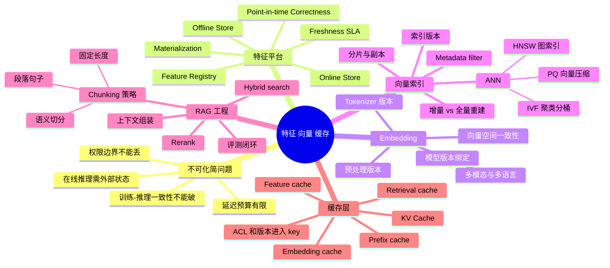
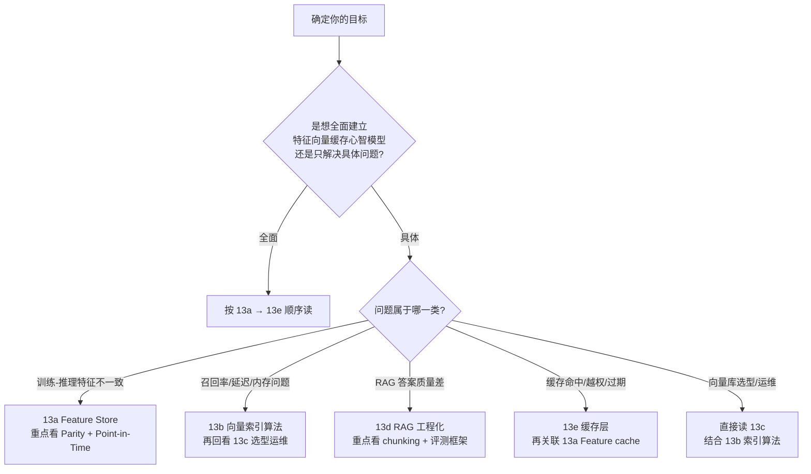

# 第 13 章 · 特征、向量与缓存总览

> 进入检索、推荐、RAG 和在线特征场景后，平台管理的就不再只是模型权重，而是一整套"特征 / embedding / 索引 / 缓存"的状态系统。这套状态系统与模型一起决定线上输出，却常被当作旁路优化处理，直到一致性、权限或延迟问题爆发才被认真对待。

本章是 **第 13 章系列的总览章**。它用第一性原理把特征平台、向量索引、RAG 工程和缓存层的全部机制串成一张推导图，并指引你按需进入 13a—13e 五个独立深挖章。如果你只关心一个具体话题（比如"Feature Store 的 Online/Offline Parity"），可以直接跳到对应深挖章；如果你要建立完整心智模型，按 13a → 13e 顺序阅读即可。

## 13.1 第一性原理拆解 + 学习大纲

### 拆 — 不可化简的问题

剥离"Feature Store""Embedding""Vector DB""RAG""Cache"这些工具名以后，本章真正面对的是一个不可化简的平台工程问题：**在线推理需要从海量历史数据/文档中找出与当前请求相关的少量上下文，且训练-推理一致性不能破。**

这个问题不能被化简，是因为以下四个约束同时成立，并且相互制约。

**第一，外部状态比模型权重变化快得多。** 文档会更新，权限会变，商品会下架，用户行为每秒都在写入。模型权重通常以周为单位迭代，但特征值、检索目标和缓存内容的新鲜度要求往往在分钟或小时级别。这意味着平台必须在"状态会持续变化"的前提下维持推理一致性——而这个前提和"一次训练、静态部署"的直觉完全不同。

**第二，模型只能消费有限上下文和有限延迟预算。** 即使面对千亿级向量库或千万篇文档，RAG 每次只能把少量 chunk 注入 prompt；推荐系统也不能对全量候选做精排。这就逼出了 ANN（近似最近邻）检索：用可控的召回损失换取可接受的 P95/P99 延迟。HNSW、IVF、PQ 的差别，本质是在内存、构建时间、召回率、更新成本之间移动，没有一个设置能在所有维度上同时最优。

**第三，相似性搜索不是数据库等值查询。** Embedding 空间、chunk 规则、ANN 索引和 reranker 共同定义了"查到什么"。其中任一版本变化——哪怕只是 tokenizer 更新——都会改变向量含义，继而使旧索引不可与新向量混用。平台必须把向量索引当作有版本、有生命周期的平台对象，而不是单纯的"embedding 的持久化文件"。

**第四，缓存会把历史结果带到未来。** 缓存能降低延迟、减少重复计算，但也会把已删除、已越权、已过期的数据继续送进模型。尤其在 RAG 与企业知识库中，缓存命中不能绕过 ACL；prefix cache 如果包含检索结果、用户画像或 policy 条件，就不再是纯静态前缀，必须把租户、授权、工具定义、tokenizer 版本和索引版本纳入 cache key。否则缓存越有效，泄露和过期的风险越大。

这四个约束合并之后，产生的工程要求是：必须设计一条从数据产生、特征计算、向量化、索引构建、检索、重排、上下文组装到缓存失效的闭环，使得性能提升不会破坏一致性，召回优化不会破坏权限边界，增量更新不会制造不可解释的混合版本，训练时看到的特征世界和推理时看到的特征世界是同一个。

### 推 — 从这个问题如何推导出每个机制

从"模型需要外部状态"出发，第一步推导出**特征**。特征是把业务世界压缩成模型可用字段的过程：用户画像、实时计数、商品属性、会话上下文都属于这一类。它带来的第一个关键机制是 **point-in-time correctness**：训练样本只能看到样本时间点之前存在的特征，线上服务也必须明确 freshness SLA。否则训练和线上看到的世界不是同一个世界，模型上线就相当于在另一个特征分布上测试。

当外部状态是非结构化文本、图片或长文档时，结构化字段不够用，于是推导出 **embedding**。Embedding 把对象映射到向量空间，但这个空间由模型版本、tokenizer、预处理和归一化共同定义——模型一换，向量含义就变了。由此自然推出**向量索引**：如果每次 query 都全量比较千万或十亿级向量，延迟和成本都不可接受，所以需要 ANN，用少量召回损失换取可用的延迟。HNSW 用图索引换低延迟高召回但内存较高；IVF 用聚类分桶换大规模可扩展但依赖聚类质量；PQ 用向量压缩换低内存但精度损失更明显。

非结构化文档通常又太长，不能直接整篇 embedding 或整篇塞进 LLM，于是推导出 **chunking**。固定长度切分让索引规模可预测，段落/句子切分保留文档结构，语义切分追求更自然的边界。chunk policy 一旦变化，索引行数、召回粒度、rerank 候选和缓存 key 都会变化，所以它必须成为版本化配置，而不是 ingestion 脚本里的隐式常量。

状态会变化，因此推导出**增量更新与全量重建的边界**。文档少量新增、元数据变化通常可以增量；embedding 模型、chunk 规则、距离度量变化时，向量空间或文档边界已经改变，继续增量修补会得到一个不可解释的混合索引。平台需要双索引灰度、golden queries 回归和可回滚切换，而不是直接覆盖生产索引。

最后，延迟和成本压力推导出**缓存**。缓存可以存在于在线特征、embedding、检索结果、文档元数据、prefix cache 和单请求 KV Cache 多个层次。它们共同的工程问题是 cache key 必须覆盖版本、权限和上下文。prefix cache 如果包含检索结果、用户画像或 policy 条件，就不再是纯静态前缀，这些维度都必须进入 key；如果做不到，就宁可只缓存严格静态的公共前缀，而不要做"命中率看起来高、实际越权风险高"的共享。

### 绘 — 因果链路

### 导 — 读完本章你应该能回答

1. 为什么"在线推理需要从海量数据中找出与当前请求相关的少量上下文，且训练-推理一致性不能破"是不可化简的问题？四个同时成立的约束分别是什么？
2. 为什么向量索引不是"embedding 的持久化文件"，而是由模型版本、chunk 规则、距离度量和索引算法共同定义的服务状态？
3. 当 embedding 模型、tokenizer 或预处理规则变化时，为什么通常要全量重建索引，而不是只对新增文档做增量写入？
4. HNSW、IVF、PQ 分别在召回率、内存、构建时间、更新成本上做了什么取舍？
5. RAG 的固定长度、段落/句子级、语义级 chunking 会如何改变索引规模、召回粒度和上下文质量？
6. 检索缓存、embedding cache、prefix cache、KV Cache 的 cache key 应分别包含哪些版本与权限维度？
7. 为什么 point-in-time correctness 是特征平台契约，而不只是离线训练流程的细节？

## 13.2 五个深挖章节导览

| 章节 | 标题 | 核心主题 | 何时优先读 |
|---|---|---|---|
| [13a](./13a-feature-store.md) | Feature Store 体系 | Feature Registry、Offline/Online Store、Materialization、Point-in-Time Correctness、Online/Offline Parity、实时特征工程 | 推荐或 RAG 系统出现训练-线上特征不一致；想规范化特征定义与版本管理 |
| [13b](./13b-vector-index-algorithms.md) | 向量索引算法 | HNSW / IVF / PQ / DiskANN / ScaNN 算法原理；维度诅咒；距离度量选型；GPU vs CPU 索引；filter 策略；Multi-vector ColBERT | 向量库召回率不达标、延迟超预算、内存超限，或需要选型 ANN 索引 |
| [13c](./13c-vector-db-selection-and-operations.md) | 向量数据库选型与运维 | Milvus / Qdrant / Weaviate / pgvector / Pinecone 选型矩阵；分布式架构；sharding；hybrid search；容量规划；多租户；索引重建与灰度切换 | 向量库选型决策；RAG 系统 P99 抖动；多租户 ACL 隔离；运维 SOP |
| [13d](./13d-rag-engineering.md) | RAG 工程化 | 完整 RAG pipeline：chunking、embedding、hybrid search、reranker、query 改写、上下文压缩、citation、评测框架（Ragas）、缓存策略 | 生产 RAG 质量不稳定；离线评测与线上效果脱节；需要建立 RAG 评测回路 |
| [13e](./13e-embedding-and-cache-layer.md) | Embedding 工程与缓存层 | Embedding 模型选型（MTEB / 领域适配）；Matryoshka / 量化；ColBERT；Embedding 服务化；Embedding cache / Semantic cache / Prefix cache / KV Cache 多级缓存 key 设计与失效策略 | Embedding 成本过高；语义缓存命中率低；prefix cache 越权风险；drift detection |

## 13.3 阅读路径建议

| 角色 | 推荐路径 | 估算时间 |
|---|---|---|
| ML 平台工程师 | 全顺序阅读 13a → 13e | 10-14 小时（含练习） |
| RAG / 搜索工程师 | 13b → 13c → 13d → 13e | 6-8 小时 |
| 推荐系统工程师 | 13a → 13b → 13e | 5-6 小时 |
| SRE / on-call | 13c（运维 SOP），按问题类型回看 13b / 13e | 2-3 小时打底，按需 |
| 算法工程师（关心 Infra） | 13a → 13d → 13e | 5-6 小时 |

> [!NOTE]
> **本总览章不重复深挖内容**：Feature Store 架构图、HNSW 参数推导、Milvus 集群容量公式、Ragas 评测框架、Semantic Cache 阈值设计等都在对应深挖章里。这里只保留第一性原理推导链 + 章节导航。

> [!TIP]
> **读完所有 5 章后应能独立完成的事**：给定一个生产 RAG 或推荐系统场景，能在 30 分钟内判断瓶颈属于特征一致性、索引选型、RAG pipeline 质量还是缓存 key 设计；并对照各章的"不可化简问题"给出下一步排查动作。

## 13.4 与其他章的关系

**上游联动：**

- [第 11 章 · 数据管道](./11-data-pipeline.md)：数据管道产出的原始文档、事件流和标注数据，是特征计算和 embedding 向量化的输入源头。数据质量问题（缺失值、时区偏差、schema 漂移）会直接传导到特征 parity 和 RAG 召回质量，两章联读最直接。
- [第 12 章 · 制品与检查点](./12-artifacts-and-checkpoints.md)：向量索引与 embedding 模型都是有版本、有生命周期的制品。索引的双索引灰度切换和 Model Registry 的蓝绿发布是同构问题；embedding 模型版本绑定索引版本的机制，与模型包版本绑定 tokenizer 的机制如出一辙。

**下游联动：**

- [第 15 章 · Batching、调度与 KV Cache](../part5-serving-infra/15-batching-scheduling-and-kv-cache.md)：本章讨论的 prefix cache 和 KV Cache 的概念区分，以及 cache key 的权限维度设计，在 Ch 15 里会深入展开 PagedAttention 和显存生命周期管理。RAG 检索到的 chunk 注入 prompt 后，对 prefill 成本和 KV Cache 命中率的影响在 Ch 15 有量化分析。
- [第 16a 章 · vLLM](../part5-serving-infra/16a-vllm-inference.md)：向量库的 P99 延迟稳定性直接影响 vLLM continuous batching 的 batch 填充率。向量库 P99 从 200ms 抖动到 2000ms，vLLM GPU 利用率会从 85% 跌至 40-60%。两者之间的检索缓存层设计（Redis/Valkey + 向量相似度 cache key）在 13c/13e 和 16a 的交叉点。
- [第 16b 章 · SGLang RadixAttention](../part5-serving-infra/16b-sglang-radix-attention.md)：RAG 系统中，相同 system prompt + 文档模板的公共前缀可以通过 SGLang RadixAttention 的 prefix 复用，把相同前缀的 prefill 成本降到接近零。但这要求路由层把相同前缀请求送到同一实例，且 prefix 不能混入用户态或权限差异的动态内容。13d 的 RAG pipeline 设计与 16b 的 prefix 复用策略必须协同对齐。
- [第 23 章 · 安全隔离与治理](../part7-reliability-security/23-security-isolation-and-governance.md)：缓存命中和向量索引的 ACL 过滤是安全问题，不只是性能优化问题。企业 RAG 里权限字段必须进入 metadata filter 和 cache key；缓存层绕过 ACL 会把检索系统变成数据泄露面。两章联读是多租户 AI 平台合规审计的必要准备。

## 深度参考阅读（总览级）

- Uber Engineering, *Meet Michelangelo: Uber's Machine Learning Platform* (2017)。Feature Store 概念的奠基性文章，描述了 Uber 如何构建第一个大规模 Feature Store，确立了 Online/Offline Store 分层和 point-in-time correctness 的工程范式。
- Netflix TechBlog, *Distributed Time Travel for Feature Generation*。Point-in-Time Correctness 的工程实践，是理解 temporal leakage 防护机制的最佳入口。
- Malkov & Yashunin, *Efficient and Robust Approximate Nearest Neighbor Search Using Hierarchical Navigable Small World Graphs*, IEEE TPAMI 2020。HNSW 原论文，是理解图索引机制和参数取舍的权威来源。[arXiv:1603.09320](https://arxiv.org/abs/1603.09320)
- Subramanya et al., *DiskANN: Fast Accurate Billion-point Nearest Neighbor Search on a Single Node*, NeurIPS 2019。盘内图索引方案，解决超大规模向量库内存受限场景。[arXiv:1907.08509](https://arxiv.org/abs/1907.08509)
- Lewis et al., *Retrieval-Augmented Generation for Knowledge-Intensive NLP Tasks*, NeurIPS 2020。RAG 的奠基论文，明确了检索增强生成的基本框架和评测方法。[arXiv:2005.11401](https://arxiv.org/abs/2005.11401)
- ANN Benchmarks: [ann-benchmarks.com](https://ann-benchmarks.com)。统一的 ANN 基准，可查各算法在不同数据集上的 Recall-QPS 曲线，是向量索引选型的重要参考。

> 各深挖章节末尾还有面向具体主题的进一步深读列表。本总览只列共用的总览级参考文献。
