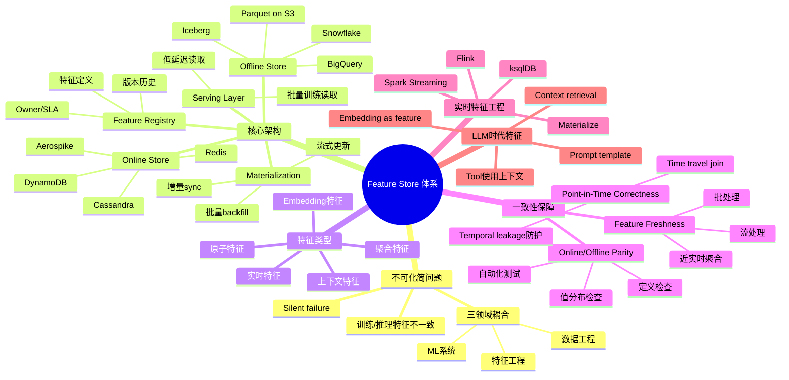
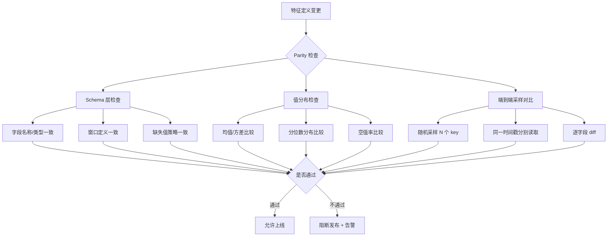
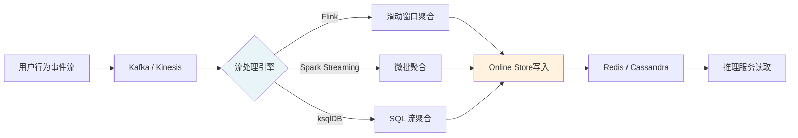
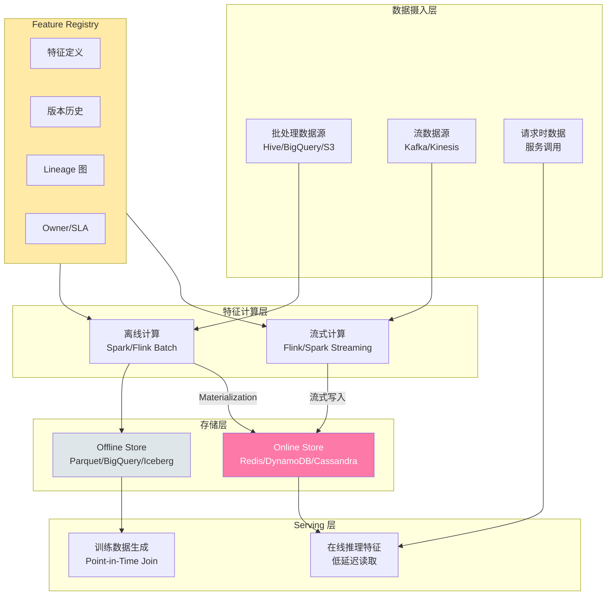
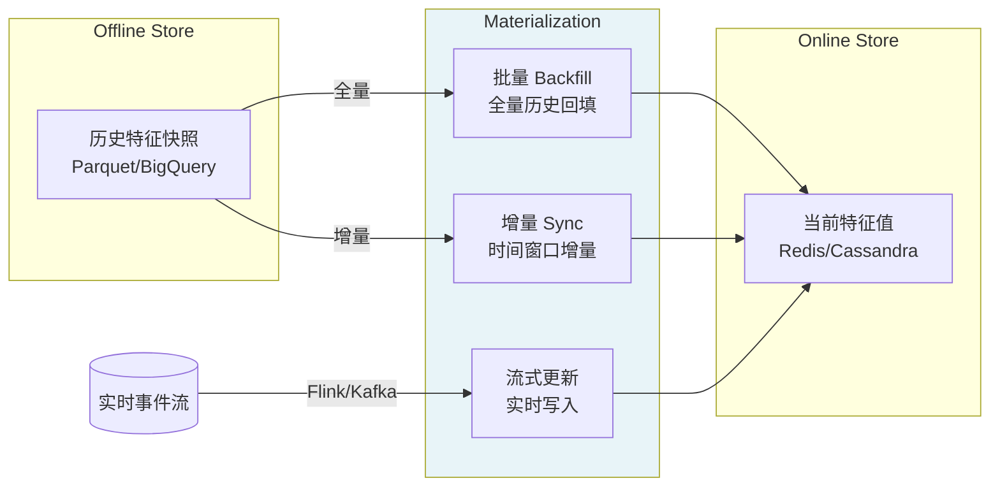
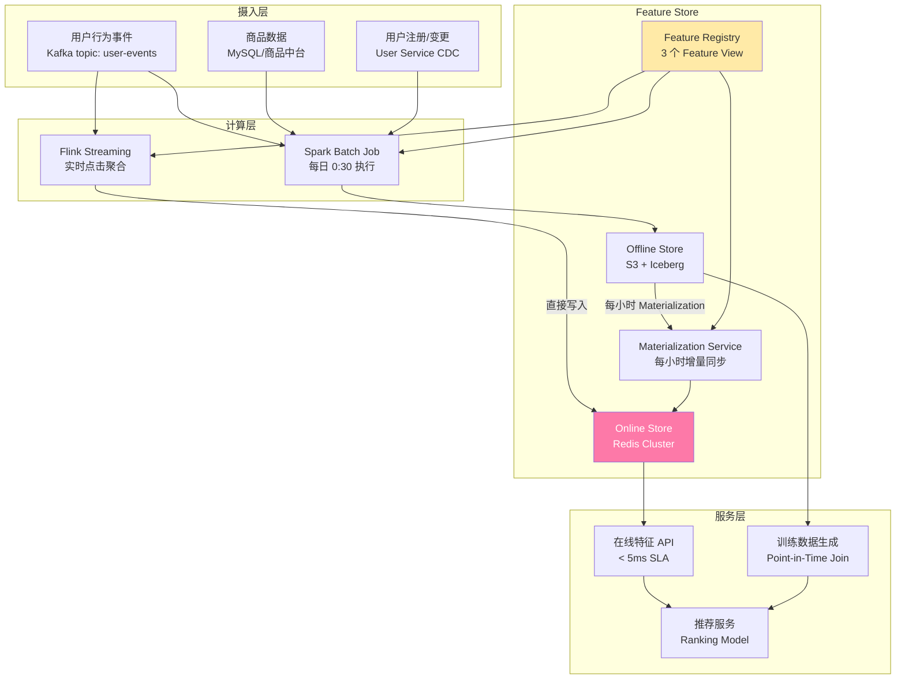
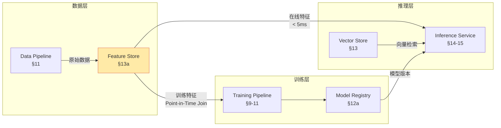

# 第 13a 章 · Feature Store 体系

> **关联章节**：本章深挖 Feature Store 的架构与工程细节，与 [第13章](./13-feature-vector-and-cache.md) 的 point-in-time correctness 契约、[第11e章](./11e-data-versioning-and-lineage.md) 的数据版本与 lineage、[第23章](../part7-reliability-security/23-security-isolation-and-governance.md) 的安全治理直接相关。Feature pipeline 如果不做 parity 检测，就是在把 silent failure 系统化。

## 13a.1 第一性原理拆解 + 学习大纲

### 拆 — 不可化简的问题

剥离 Feast、Tecton、Feature Store、Materialization、Online Store 这些工具名以后，本章真正面对的是 ML 系统工程中最常见也最难察觉的 silent failure：**训练时计算的特征与推理时计算的特征如果不一致，模型上线就是另一个模型**。

为什么这是"不可化简的问题"？因为它不能通过加更多监控、更多测试在事后修复——它是一个根本性的架构约束。考虑一个用户购买预测模型：离线训练时，用的是 Spark 在 Hive 上计算的"用户过去 7 天购买次数"，窗口为整天粒度；线上推理时，用的是 Redis 里缓存的"用户过去 7 天购买次数"，窗口按小时更新。这两个"同名特征"在业务含义上接近，但计算逻辑不同、时区处理不同、缺失值填充策略不同。模型上线后，AUC 从 0.82 下降到 0.74，团队花三周排查才发现是特征计算不一致。没有报错，没有异常，只有模型悄悄变差。

这个问题之所以难，是因为它同时跨越了三个本来独立的工程领域：

**第一，特征工程领域**：特征的定义（窗口、聚合函数、缺失值策略）通常散落在离线训练代码、在线服务代码、ETL 脚本和 Notebook 里。每处实现都可能有细微差异，且没有单一的"真相来源"（single source of truth）。

**第二，数据工程领域**：特征的物化（Materialization）——把离线计算好的特征写入在线存储——本身是一个跨批处理、流处理、在线写入的多系统链路，任何一个环节的延迟、去重逻辑或格式转换都可能悄悄引入不一致。

**第三，ML 系统领域**：训练 pipeline 用 batch fetch，推理 pipeline 用实时 fetch，两者的代码路径、库版本、精度（float32 vs float64 vs int32）可能完全不同，但返回的字段名称相同，于是差异永远不会触发任何显式错误。

Feature Store 的存在，就是要把这三个领域的"特征定义"收归到同一套系统，用统一的计算逻辑服务训练和推理，用版本化治理每一次变更，用 parity 测试验证 online 与 offline 的一致性。这不是锦上添花的平台工具，而是 ML 系统可靠性的地基。

从 AI Infra 视角看，Feature Store 还承担了 feature pipeline 与训练 pipeline、推理 pipeline 的解耦。没有 Feature Store 时，这三条 pipeline 通常用各自的特征计算逻辑深度耦合，任何一处变更都需要同步更新其他两处。有了 Feature Store，训练 pipeline 从 Offline Store 读取，推理 pipeline 从 Online Store 读取，两者共享同一套特征定义和计算逻辑，变更只需在 Feature Store 层做一次。

### 推 — 从这个问题如何推导出每个机制

从"特征定义必须有唯一来源"出发，推导出 **Feature Registry**：一个集中存储特征元数据（名称、类型、计算逻辑、owner、SLA、版本历史）的目录服务。它是 Feature Store 的神经中枢，没有 Registry，就无法知道"这个特征从哪来、怎么算、多久更新"。

从"训练需要大量历史特征，推理需要极低延迟当前特征"出发，推导出 **Offline Store 与 Online Store 的分层**：Offline Store（Parquet/BigQuery/Snowflake）为训练提供 TB 级历史数据，Online Store（Redis/DynamoDB/Cassandra）为推理提供亚毫秒级读取。两个 Store 的数据通过 Materialization 同步。

从"Offline Store 的数据必须同步到 Online Store"出发，推导出 **Materialization**：批量 backfill（历史回填）、增量 sync（按时间窗口同步）、流式更新（实时写入）三种策略对应不同的 freshness 需求。Materialization 的正确性直接决定 Online/Offline parity。

从"训练样本不能看到未来的特征值"出发，推导出 **Point-in-Time Correctness**：训练时，针对每个样本的事件时间（event timestamp），只读取该时刻之前存在的特征版本。这个机制防止 temporal leakage（特征时序泄露），是最常被忽视、后果最严重的数据一致性问题。

从"特征需要满足不同的 freshness 要求"出发，推导出**实时特征工程**：用户点击流、库存变化、价格更新这类特征需要秒级或分钟级 freshness，批处理满足不了，需要 Flink/Spark Streaming/ksqlDB 做流式聚合写入 Online Store。

从"模型迭代时需要知道特征变化历史"出发，推导出 **Feature Versioning 与 Lineage**：特征的每次变更（计算逻辑、聚合窗口、数据源）都应该留下版本记录，并与使用该特征的模型版本关联，从而支持调试、复现和审计。

从"不同类型的特征有不同的存储与更新需求"出发，推导出**特征类型分类**：原子特征（用户 ID、商品 ID）、聚合特征（过去 N 天点击次数）、实时特征（最近 5 分钟浏览商品）、上下文特征（当前 session、请求时刻）对应不同的计算、存储和 freshness 策略。

### 绘 — 因果链路



### 导 — 读完本章你应该能回答

1. 为什么训练与推理使用"同名特征"但不共享计算代码，就等同于部署了另一个模型？这个问题为何是 silent failure？
2. Feature Registry、Offline Store、Online Store、Materialization、Serving 各自的职责边界在哪？它们如何共同保证 Online/Offline parity？
3. Point-in-time correctness 的定义是什么？Time travel join 如何在训练时防止 temporal leakage？
4. 批量 backfill、增量 sync、流式更新三种 Materialization 策略分别适合什么 freshness 需求？各自的失败条件是什么？
5. 在线 Store 选型（Redis vs DynamoDB vs Cassandra vs Aerospike）的核心维度是什么？P99 延迟、吞吐、成本如何取舍？
6. Feast、Tecton、SageMaker FS、Vertex FS、Hopsworks 在架构哲学和适用场景上有何根本差异？
7. Embedding 作为 Feature 与传统 numerical/categorical 特征的工程差异体现在哪里？LLM 时代的 feature 有哪些新的范式？

---

## 13a.2 Online/Offline Parity：定义、检查与自动化测试

Online/Offline Parity（线上线下一致性）是 Feature Store 最核心的契约。它不是一个抽象原则，而是有具体的可测量定义：

**定义层面**：对于同一个 feature key（user_id=U, item_id=I）和同一个时间戳 T，Offline Store 返回的特征值 F_offline(U,I,T) 与 Online Store 返回的特征值 F_online(U,I,T) 应该相等（或在可接受的精度误差内）。差异不应超过数值精度（float32 vs float64 的舍入误差），不应有逻辑差异（窗口定义不同、缺失值填充不同）。

**Parity 破坏的三个层次**：

| 破坏层次 | 示例 | 检测方式 | 影响严重性 |
|---------|------|---------|----------|
| 定义不一致 | 训练用 UTC 时区，推理用本地时区；训练用 median 填充缺失值，推理用 0 | Code review + Schema diff | 最严重，全量特征偏差 |
| 实现不一致 | 训练用 Spark sum，推理用 Redis 手写聚合但有 off-by-one | Unit test + Value diff | 严重，部分样本偏差 |
| 时效不一致 | 训练用 T-0 特征，推理用 T-30min 特征（Materialization 延迟） | Freshness monitoring | 中等，统计可察觉 |



**自动化 Parity 测试框架**：

生产 Feature Store 应在每次 Materialization 完成后触发 parity 检测作业：

```python
# 伪代码：parity 检测逻辑
def check_parity(feature_name: str, sample_keys: List[str], ts: datetime):
    results = []
    for key in sample_keys:
        offline_val = offline_store.get(feature_name, key, ts)
        online_val = online_store.get(feature_name, key)
        diff = abs(offline_val - online_val) / (abs(offline_val) + 1e-9)
        results.append({
            "key": key,
            "offline": offline_val,
            "online": online_val,
            "relative_diff": diff,
            "pass": diff < TOLERANCE_THRESHOLD
        })
    pass_rate = sum(r["pass"] for r in results) / len(results)
    if pass_rate < PASS_RATE_THRESHOLD:
        raise ParityCheckFailure(f"{feature_name} parity {pass_rate:.2%} < {PASS_RATE_THRESHOLD:.2%}")
    return results
```

> **工程边界**：Parity 检测不能只在上线前跑一次。生产环境应有持续的 parity monitoring，每小时或每次 Materialization 后采样检测。Materialization 延迟、批处理窗口、时区边界这三类问题在白天正常、在凌晨 0 点边界时容易出现，必须覆盖时间边界测试用例。

---

## 13a.3 Point-in-Time Correctness 与 Temporal Leakage

Point-in-time correctness 是 Feature Store 的时序契约：**训练时，每个样本只能看到该样本事件时间之前存在的特征值。**

### Temporal Leakage 的经典场景

假设要训练"用户是否会在购买后 7 天内退货"的预测模型：

- 样本事件时间：用户下单时刻 T_order
- 特征："用户过去 30 天退货次数"
- 错误实现：直接从当前时刻读取该特征，包含了 T_order 之后发生的退货
- 结果：模型在训练时"看到了未来"，测试集 AUC 虚高，上线后性能大幅下降

这类问题之所以难发现，是因为：训练指标（AUC、Loss）在有 leakage 时反而更好；只有上线后性能下降才暴露问题，而此时已经过了几周的迭代周期。

### Time Travel Join

Time travel join 是防止 temporal leakage 的核心机制：对每个训练样本的事件时间戳，从 Feature Store 查询"该时间点存在的特征快照"。

```mermaid
sequenceDiagram
    participant Trainer as 训练 Pipeline
    participant FS as Feature Store
    participant OFF as Offline Store (历史快照)
    
    Trainer->>FS: 提交样本表 (entity_id, event_timestamp, label)
    FS->>OFF: Time travel join 查询
    Note over OFF: 对每个 (entity_id, event_timestamp)<br/>找到 event_timestamp 之前<br/>最近一次特征快照
    OFF-->>FS: 返回 point-in-time 特征值
    FS-->>Trainer: 样本表 + 正确时间点特征
    Trainer->>Trainer: 训练，无 temporal leakage
```

**Offline Store 必须支持历史快照**，常见实现方式：

| 实现方式 | 原理 | 优势 | 局限 |
|---------|------|------|------|
| 带时间戳分区的 Parquet | 每次 Materialization 写入带时间戳的分区，查询时过滤 | 实现简单，Spark/BigQuery 原生支持 | 存储放大，查询需扫描多分区 |
| Apache Iceberg Time Travel | Iceberg snapshot 机制，`AS OF TIMESTAMP` 查询 | 存储高效，支持事务 | 需要 Iceberg 生态支持 |
| Delta Lake Time Travel | Delta Log 版本记录，`VERSION AS OF N` | 与 Databricks 深度集成 | 同上 |
| 自定义 SCD Type 2 | 记录 valid_from / valid_to，SQL 区间查询 | 细粒度控制 | 查询复杂度高，需额外 ETL |

> **工程边界**：Time travel join 是计算密集型操作。对亿级样本的训练集做 point-in-time join，可能需要数小时。要设计合理的分区策略（按时间 + 实体分区），并考虑是否需要预物化"训练专用特征视图"以加速 join。

---

## 13a.4 特征类型：原子、聚合、实时、上下文

不同类型的特征在计算复杂度、更新频率、存储要求和一致性保证上有本质差异：

| 特征类型 | 定义 | 示例 | 更新频率 | 存储位置 | Freshness 要求 |
|---------|------|------|---------|---------|--------------|
| 原子特征 | 直接来自源数据，无聚合 | 用户注册时间、商品类目、商品价格 | 低频（按天/按事件） | Offline + Online | 天级 |
| 聚合特征 | 时间窗口内的统计量 | 用户过去7天点击次数、商品过去30天销量 | 中频（小时级到天级） | Offline + Online | 小时级 |
| 实时特征 | 近实时流式计算 | 用户最近5分钟浏览的商品类目、当前session购买金额 | 高频（秒级到分钟级） | Online Only | 分钟级 |
| 上下文特征 | 请求时刻的动态信息 | 当前时间、请求设备类型、用户当前地理位置 | 每次请求 | 不持久化，请求时构建 | 实时 |
| 预计算 Embedding | 实体的向量表示 | 用户 embedding、商品 embedding、文档 embedding | 低频（模型更新时） | Offline + Online（特殊存储） | 天级到周级 |

### 实时特征的特殊挑战

实时特征（近实时聚合）是 Feature Store 中工程复杂度最高的部分：



实时特征工程框架对比：

| 框架 | 延迟 | 吞吐 | 窗口语义 | 运维复杂度 | 适用场景 |
|------|------|------|---------|----------|---------|
| Apache Flink | 亚秒级 | 极高 | 事件时间、处理时间、滑动/滚动/会话 | 高 | 大规模实时特征，精确语义需求 |
| Spark Streaming | 秒级-分钟级 | 高 | 处理时间为主，事件时间支持有限 | 中 | 已有 Spark 生态，可接受微批 |
| ksqlDB | 秒级 | 中 | 事件时间，SQL 语法 | 低-中 | 快速上线，SQL 友好团队 |
| Materialize | 亚秒级 | 中 | 事件时间，增量维护 | 中 | 需要 SQL 接口的实时聚合 |
| 自建 Redis Script | 毫秒级 | 高（单点） | 无窗口语义，手动实现 | 低（代码复杂） | 简单计数器，不需要复杂窗口 |

> **工程边界**：实时特征工程的最大陷阱是"Online Store 里的实时聚合结果与 Offline 训练数据不一致"。因为 Flink 计算的实时窗口聚合与 Spark Batch 计算的历史窗口聚合，在窗口对齐、late event 处理、Watermark 策略上存在根本差异。如果不做专项 parity 测试，实时特征是最容易引入 silent failure 的特征类型。

---

## 13a.5 Feature Store 架构组件

一个完整的 Feature Store 包含五个核心组件，缺一不可：



### Feature Registry 详解

Registry 是 Feature Store 的神经中枢，存储所有特征的元数据：

```yaml
# Feature Registry 元数据示例
feature_view:
  name: user_purchase_stats
  version: v3.2
  owner: ml-platform-team
  entity: user_id
  source:
    type: batch
    table: warehouse.user_events
    timestamp_col: event_ts
  features:
    - name: purchase_count_7d
      dtype: int64
      window: 7 days
      agg: count
      filter: "event_type = 'purchase'"
      ttl: 2 hours
    - name: purchase_amount_30d
      dtype: float32
      window: 30 days
      agg: sum
      filter: "event_type = 'purchase'"
      ttl: 24 hours
  materialization:
    schedule: "0 * * * *"  # 每小时
    strategy: incremental
  sla:
    freshness: 2h
    availability: 99.9%
  lineage:
    upstream: [warehouse.user_events]
    downstream: [model:purchase_prediction_v7, model:recommendation_v12]
```

---

## 13a.6 Online Store 选型：延迟/吞吐/成本对比

Online Store 直接影响推理链路的 P99 延迟。选型时最关键的三个维度是：单 key 读取延迟（P99）、批量读取能力（多 key 批量 Get）、写入吞吐（Materialization 速度）。

| 存储 | P99 单 key 读取 | 批量 Get | 写入吞吐 | 内存成本 | 持久化 | 适用规模 | 核心优势 |
|------|---------------|---------|---------|---------|-------|---------|---------|
| Redis (Cluster) | < 1ms | Pipeline 批量，< 5ms | 高 | 高（全内存） | AOF/RDB，弱 | 中等（< 1TB） | 极低延迟，生态成熟 |
| DynamoDB | 1-5ms (P50)，10-20ms (P99) | BatchGetItem，25 items/call | 中 | 低（磁盘） | 是 | 大规模 | 全托管，自动扩容 |
| Cassandra | 1-5ms | 多 key 查询 | 极高 | 低（磁盘） | 是 | 超大规模 | 写入吞吐极高，线性扩展 |
| Aerospike | < 1ms | 批量 Get | 极高 | 中（混合内存+SSD） | 是 | 大规模 | 内存效率，成本介于 Redis 和 Cassandra 之间 |
| Bigtable | 5-10ms | 批量 read rows | 高 | 低 | 是 | 超大规模 | GCP 生态深度集成 |
| ScyllaDB | < 1ms | 批量 | 极高 | 低 | 是 | 大规模 | Cassandra 协议，C++ 高性能实现 |

**选型决策路径**：

```
1. P99 延迟要求 < 2ms？
   → 是：Redis 或 Aerospike（内存型）
   → 否：Cassandra / DynamoDB / Bigtable 均可

2. 数据量 > 1TB？
   → 是：Cassandra / Aerospike / Bigtable（成本可控）
   → 否：Redis Cluster 仍可（若内存成本可接受）

3. Materialization 写入 QPS > 10万/s？
   → 是：Cassandra / Aerospike（写入优化设计）
   → 否：Redis / DynamoDB 均足够

4. 是否需要全托管？
   → 是：DynamoDB / Bigtable / ElastiCache for Redis
   → 否：自托管 Redis Cluster / Cassandra / Aerospike

5. 多地域副本需求？
   → 是：Cassandra（多 DC replication）/ DynamoDB（Global Tables）
   → 否：按其他维度选
```

> **工程边界**：Online Store 的 P99 延迟不能只在空载时测。推荐系统在大促时，单次请求可能需要批量读取 50-200 个 key（user profile + candidate items 的多个特征）。批量 Get 的延迟曲线与单 key 读取差异极大，Redis Pipeline、DynamoDB BatchGetItem、Cassandra IN 查询各有不同的表现，必须用真实业务负载压测。

---

## 13a.7 Offline Store：Parquet/BigQuery/Snowflake/Iceberg 的取舍

Offline Store 的主要职责是：存储大规模历史特征数据，支持训练时的 point-in-time join，支持 Materialization 作业的读取。

| 方案 | 查询引擎 | 存储格式 | Time Travel 支持 | 规模 | 适用场景 | 核心限制 |
|------|---------|---------|----------------|------|---------|---------|
| Parquet on S3 | Spark/Athena/Trino | Parquet | 手动分区（日期分区模拟） | PB 级 | 通用，与 Spark 深度集成 | 无原生 Time Travel，查询需扫描多分区 |
| BigQuery | BigQuery SQL | 托管列式 | `FOR SYSTEM_TIME AS OF` | PB 级 | GCP 生态，SQL 友好 | 成本随查询量线性增长 |
| Snowflake | Snowflake SQL | 托管列式 | Time Travel（0-90天） | PB 级 | 多云，数据共享 | 成本较高，与 ML 框架集成需额外工作 |
| Apache Iceberg | Spark/Flink/Trino | Iceberg（Parquet/ORC） | 原生 Snapshot Time Travel | PB 级 | 开源，多引擎支持 | 需要 Catalog（HMS/Nessie），生态稍复杂 |
| Delta Lake | Spark | Delta（Parquet） | `VERSION AS OF / TIMESTAMP AS OF` | PB 级 | Databricks 生态 | 与 Databricks 深度绑定 |

**对 Feature Store 的关键需求是 Time Travel 能力**。Parquet on S3 通常用日期分区 + 版本文件夹模拟：

```
s3://feature-store/user_purchase_stats/
  dt=2026-05-01/hour=00/part-00000.parquet
  dt=2026-05-01/hour=01/part-00000.parquet
  ...
  dt=2026-05-02/hour=00/part-00000.parquet
```

训练时，point-in-time join 扫描样本事件时间戳对应的分区。这种方案实现简单，但存储放大严重（相同数据写多次），且跨分区 join 的 Shuffle 成本高。Iceberg 的 Time Travel 通过 Snapshot 元数据解决了这个问题，但引入了额外的 Catalog 依赖。

> **工程边界**：Offline Store 的分区策略直接影响训练 job 的执行时间。对 10 亿条样本做 point-in-time join，如果分区粒度是天级，可能需要扫描 30 个分区；如果是小时级，扫描 720 个分区但单分区更小。要根据样本时间分布和特征更新频率设计合理的分区粒度，不是越细越好。

---

## 13a.8 Materialization 策略：批量/增量/流式

Materialization 是把 Offline Store 的特征数据同步到 Online Store 的过程，直接决定 Feature Freshness。



三种 Materialization 策略的详细对比：

| 策略 | Freshness | 计算成本 | 实现复杂度 | 失败恢复 | 适用场景 |
|------|----------|---------|----------|---------|---------|
| 批量 Backfill | 天级到小时级 | 高（全量扫描） | 低 | 简单（重跑即可） | 初始化 Online Store；历史数据回填；冷启动 |
| 增量 Sync | 小时级到分钟级 | 中（增量扫描） | 中 | 中（需要幂等写入） | 绝大多数聚合特征的常规更新 |
| 流式更新 | 秒级到分钟级 | 低（只处理新事件） | 高（流处理框架） | 复杂（Checkpoint/Exactly-once） | 实时特征，对 freshness 要求严格 |

**增量 Sync 的幂等性设计**：

增量 Materialization 必须是幂等的——重跑同一个时间窗口不应产生错误结果：

```python
# 幂等 Materialization 示例
def incremental_materialize(feature_view, start_ts, end_ts):
    # 1. 读取 [start_ts, end_ts] 内新增/变更的特征
    features = offline_store.query(
        feature_view=feature_view,
        start_ts=start_ts,
        end_ts=end_ts
    )
    
    # 2. 幂等写入 Online Store（UPSERT 语义）
    for batch in chunk(features, batch_size=1000):
        online_store.upsert(
            feature_view=feature_view,
            records=batch,
            ttl=feature_view.ttl
        )
    
    # 3. 记录 Materialization 元数据（用于监控和调试）
    registry.record_materialization(
        feature_view=feature_view,
        start_ts=start_ts,
        end_ts=end_ts,
        record_count=len(features),
        status="success"
    )
```

> **工程边界**：批量 Backfill 通常是一次性操作，但在以下场景需要重新触发：新增 feature view 上线；Online Store 数据丢失（Redis flush 或 DynamoDB 误操作）；重大计算逻辑变更后的数据修正。Backfill 作业应与增量 sync 作业在资源上隔离，避免 Backfill 抢占 sync 资源，导致常规特征 freshness SLA 被破坏。

---

## 13a.9 主流 Feature Store 对比

当前主流 Feature Store 方案在架构哲学、适用规模和集成深度上有显著差异：

| 方案 | 架构类型 | Offline Store | Online Store | 实时特征 | Point-in-Time | 部署模式 | 核心优势 | 主要局限 |
|------|---------|--------------|-------------|---------|--------------|---------|---------|---------|
| **Feast** | 开源，声明式 | 可插拔（BigQuery/Snowflake/Parquet） | 可插拔（Redis/DynamoDB/Bigtable） | 有限（Flink 集成） | 支持 | 自托管 | 开源，轻量，易上手 | 实时特征弱，需大量自建 |
| **Tecton** | 托管 SaaS | Databricks/S3 | DynamoDB/Redis | 原生 Flink 支持 | 支持 | 托管 | 实时特征成熟，企业级 | 成本高，与 AWS 绑定 |
| **SageMaker Feature Store** | AWS 托管 | S3+Glue | DynamoDB | 有限（需自建） | 支持 | AWS 托管 | AWS 生态集成，全托管 | AWS 锁定，定价透明度低 |
| **Vertex Feature Store** | GCP 托管 | BigQuery | Bigtable | 通过 Dataflow | 支持 | GCP 托管 | GCP 生态集成，AutoML | GCP 锁定 |
| **Hopsworks** | 开源+托管 | Hudi on S3/HDFS | RonDB（MySQL Cluster） | Flink/Spark | 支持 | 自托管+托管 | 功能全面，强 Flink 集成 | 部署复杂，学习曲线陡 |
| **自建** | 定制 | 按需选择 | 按需选择 | 按需接入 | 手动实现 | 自托管 | 完全控制，无锁定 | 开发成本极高，需专职团队 |

### 选型决策框架

```
1. 团队规模 < 10 人，ML 成熟度低？
   → Feast（开源轻量）或 SageMaker/Vertex（全托管）

2. 实时特征是核心需求（秒级 freshness）？
   → Tecton（最成熟）或 Hopsworks（开源选项）

3. 已经深度在 AWS 生态？
   → SageMaker Feature Store 或 Tecton

4. 已经深度在 GCP 生态？
   → Vertex Feature Store

5. 需要完全数据控制，不接受 SaaS？
   → Feast（自建扩展）或 Hopsworks

6. 超大规模（> 100 个 feature view，> 10 个模型团队）？
   → 考虑自建或 Hopsworks，Feast 在超大规模有 operational 挑战
```

> **工程边界**：没有任何一个 Feature Store 方案在"开箱即用"和"完整实时特征支持"上同时做到最好。Feast 需要大量自建工作才能达到生产级别；Tecton 功能完整但成本高；Hopsworks 功能全面但部署复杂。在选型前，必须明确：实时特征的 freshness 要求、团队 ML 成熟度、预算、与现有数据栈的集成需求这四个约束，不能只看功能列表。

---

## 13a.10 Feature Versioning 与 Lineage

Feature 版本化与 Lineage 是 Feature Store 的治理层，直接影响模型的可调试性、可复现性和合规审计能力。（与 [第11e章](./11e-data-versioning-and-lineage.md) 的数据 Lineage 深度联动）

### Feature Versioning 的必要性

当模型性能下降时，工程师需要回答：

- 这个特征的计算逻辑最近有没有变化？
- 上次变化是什么时候？变了什么？
- 用旧版特征重新训练，性能能否恢复？

没有版本化，这些问题都无法回答。Feature 版本化应覆盖：

| 变更类型 | 是否触发新版本 | 兼容性 | 处理方式 |
|---------|-------------|-------|---------|
| 聚合窗口变化（7天→14天） | 是 | 不兼容 | 创建新 feature view 版本，旧版本继续服务现有模型 |
| 数据源变化 | 是 | 通常不兼容 | 同上 |
| 缺失值填充策略变化 | 是 | 不兼容 | 同上 |
| 字段重命名 | 是（兼容别名） | 可兼容 | 保留旧名称别名一段时间 |
| Bug 修复（计算错误） | 是 | 语义变更 | 需要通知下游模型团队重新训练 |
| 性能优化（无语义变化） | 否（patch） | 完全兼容 | parity 测试验证后直接替换 |

### Lineage 图

Feature Lineage 应追踪从数据源到特征到模型的完整血缘：

```
数据源（warehouse.user_events） 
  → 特征计算（Spark Job purchase_stats_v3） 
  → Feature View（user_purchase_stats v3.2）
  → 模型训练（purchase_prediction training run 2026-05-01）
  → 模型版本（purchase_prediction_v7）
  → 在线服务（recommendation-service prod）
```

当数据源发生变化（如字段 rename 或 schema 变更），Lineage 图可以自动识别受影响的所有下游特征和模型，发送告警给对应 owner。

> **工程边界**：Feature Lineage 的实用价值不在于"画一张好看的图"，而在于"当 P0 事故发生时，能在 15 分钟内找到受影响的所有上下游"。Registry 的 lineage 图必须实时更新，不能是离线文档。

---

## 13a.11 Embedding 作为 Feature 与 LLM 时代的特征范式

### Embedding 与传统特征的工程差异

将 Embedding（向量）作为特征存入 Feature Store，与传统 numerical/categorical 特征有本质区别：

| 维度 | 传统特征 | Embedding 特征 |
|------|---------|--------------|
| 存储大小 | 字节级（float32 标量/小数组） | 千字节级（512-4096 维 float32 = 2-16KB） |
| Online Store 存储成本 | 低 | 高（1000万用户 × 1024维 × 4B ≈ 40GB） |
| 计算成本 | 低（SQL 聚合） | 高（需要模型推理） |
| 更新频率决定因素 | 数据变化 | 模型版本变化 |
| Freshness 语义 | 明确（数据时间戳） | 模糊（embedding 模型版本 + 数据时间戳） |
| Parity 检查方式 | 数值比较 | 余弦相似度比较（同一模型版本下） |

**Embedding Feature 的特殊工程需求**：

1. **版本化双重复杂性**：每次 embedding 模型更新，所有 embedding feature 都需要全量重算。这不同于普通特征的增量更新，是计算成本极高的全量操作。
2. **存储分层**：高维 embedding 不适合存在标准 Online Store（Redis 内存成本过高），通常用专用的 Vector Store（Faiss Index on SSD、Milvus 等）存储，Online Store 只存索引 key。
3. **近似匹配**：Embedding Feature 的"检索"是 ANN（近似最近邻），不是精确等值查询，返回的是 Top-K 相似向量，而非单个确定值。

### LLM 时代的新特征范式

LLM 系统引入了传统 Feature Store 没有考虑的新特征类型：

| 特征类型 | 描述 | 工程挑战 | 现有 Feature Store 支持度 |
|---------|------|---------|------------------------|
| Prompt Template | 系统 prompt 模板、few-shot 示例 | 版本化、A/B 测试、权限控制 | 基本不支持，需自建 |
| Retrieved Context | RAG 检索到的文档片段 | 实时计算、不可缓存（权限敏感）、不应进入 Feature Store | 不适合 Feature Store |
| Tool 使用上下文 | 可用 tool 列表、tool 调用历史 | 动态变化，session 级别 | 不适合 Feature Store |
| User Memory | 用户长期偏好、历史对话摘要 | 更新频率低，但需要精确版本控制 | 可用 Feature Store，需扩展 |
| Model Capability Profile | 模型支持的任务类型、context window | 随模型版本变化 | 可用 Registry 管理 |

> **工程边界**：不要强行把 LLM 的所有上下文信息都纳入传统 Feature Store 管理。RAG 检索到的文档、实时 tool 调用结果是"请求时计算的上下文"，不是"预计算并物化的特征"，它们的生命周期是单次请求，不适合 Feature Store 的持久化语义。Feature Store 适合管理的 LLM 特征是：用户历史行为摘要、用户偏好 profile、可缓存的 embedding 向量。

---

## 13a.12 反模式：特征计算逻辑写在两边

这是 Feature Store 最经典的反模式，也是最常见的 silent failure 来源：

```
反模式结构：
  训练代码（Python/Spark）：
    def compute_user_feature(user_id):
        clicks = db.query("SELECT count(*) FROM clicks WHERE user_id=? AND date > NOW() - 7 DAYS")
        return clicks[0]
  
  推理代码（Go/Java Service）：
    func computeUserFeature(userID string) float64 {
        clicks := redis.Get("user:" + userID + ":click_7d")
        return float64(clicks)
    }
  
  看起来相同，实际差异：
  - 训练用数据库实时查询，推理用 Redis 缓存（可能滞后 2 小时）
  - 训练的 "7 DAYS" 是精确天数，推理的 Redis key 是每天 0 点更新的整天统计
  - 训练代码缺失值返回 0，推理代码 Redis miss 时返回 nil 被转换为 -1
```

**诊断方法**：

如果你的系统有以下任意一个现象，很可能已经存在特征计算两边不一致的问题：

- 模型离线评测 AUC 和线上 AUC 差距 > 3 个百分点
- 线上推理特征值的分布与训练特征值的分布在直方图上有明显差异
- 特征计算相关的代码修改只在一个代码库（训练或推理），而非在 Feature Store 层统一修改
- 无法回答"这个特征在训练时的计算逻辑"和"在推理时的计算逻辑"是否相同

**正确做法**：

```
正确架构：
  唯一特征定义来源：Feature Store Registry
  
  训练路径：
    trainer.get_historical_features(entity_ids, timestamps)
    → Feature Store SDK
    → Offline Store（Point-in-Time Join）
  
  推理路径：
    inference.get_online_features(entity_ids)
    → Feature Store SDK
    → Online Store（低延迟读取）
  
  共享：同一套特征定义，同一套计算逻辑，不同存储后端
```

> **工程边界**：迁移到 Feature Store 的最大阻力通常不是技术，而是组织。训练团队和推理团队往往是不同的 squad，各自有既有代码库和发布流程。Feature Store 迁移需要明确的 ownership（谁负责特征定义）、清晰的 API 契约（SDK 接口稳定）和分阶段迁移计划（不要试图一次性迁移所有特征）。

---

## 13a.13 Worked Example：电商推荐 Feature Store 端到端

### 场景描述

电商推荐系统，目标是给用户实时推荐商品。核心特征：

1. **User Profile（用户画像）**：用户年龄段、城市、注册时间、历史购买品类偏好（聚合特征，每日更新）
2. **Item Profile（商品画像）**：商品类目、价格区间、品牌、历史 30 天销量（聚合特征，每日更新）
3. **Real-time Click Aggregation（实时点击聚合）**：用户最近 5 分钟、30 分钟、2 小时点击商品的品类分布（实时特征，分钟级更新）
4. **Context Features（上下文特征）**：请求时间（hour of day, day of week）、设备类型、网络类型（请求时构建，不入 Online Store）

### 端到端架构



### 特征定义（Feature Registry）

```yaml
# Feature View 1: user_profile
feature_view:
  name: user_profile
  entities: [user_id]
  source: warehouse.user_profile_daily
  materialization:
    schedule: "30 0 * * *"  # 每天 0:30
    strategy: full_overwrite
  features:
    - {name: age_group, dtype: int32, ttl: 25h}
    - {name: city_tier, dtype: int32, ttl: 25h}
    - {name: preferred_category_l1, dtype: int32, ttl: 25h}
    - {name: purchase_category_vector, dtype: float32[64], ttl: 25h}  # Embedding

# Feature View 2: item_profile  
feature_view:
  name: item_profile
  entities: [item_id]
  source: warehouse.item_stats_daily
  materialization:
    schedule: "0 1 * * *"  # 每天 1:00
    strategy: incremental
  features:
    - {name: category_l1, dtype: int32, ttl: 25h}
    - {name: price_bucket, dtype: int32, ttl: 25h}
    - {name: sales_30d, dtype: float32, ttl: 25h}
    - {name: item_embedding, dtype: float32[128], ttl: 25h}  # Embedding

# Feature View 3: user_realtime_clicks（实时特征）
feature_view:
  name: user_realtime_clicks
  entities: [user_id]
  source: kafka://user-events
  stream_processing: flink
  features:
    - {name: click_count_5min, dtype: int32, ttl: 10min}
    - {name: click_count_30min, dtype: int32, ttl: 60min}
    - {name: click_category_5min, dtype: int32[10], ttl: 10min}  # Top 10 类目
    - {name: click_amount_2h, dtype: float32, ttl: 4h}
```

### 训练数据生成（Point-in-Time Join）

```python
# 训练数据生成
entity_df = pd.DataFrame({
    "user_id": [...],
    "item_id": [...],
    "event_timestamp": [...],  # 用户点击/购买时刻
    "label": [...]  # 是否购买
})

# Feature Store 自动做 Point-in-Time Join
training_df = feature_store.get_historical_features(
    entity_df=entity_df,
    features=[
        "user_profile:age_group",
        "user_profile:preferred_category_l1",
        "user_profile:purchase_category_vector",
        "item_profile:category_l1",
        "item_profile:sales_30d",
        "item_profile:item_embedding",
        "user_realtime_clicks:click_count_30min",
        "user_realtime_clicks:click_category_5min",
    ]
).to_dataframe()
# 每个样本使用 event_timestamp 之前最近的特征快照，无 temporal leakage
```

### 在线推理特征读取

```python
# 在线推理（< 5ms SLA）
def get_ranking_features(user_id: str, candidate_item_ids: List[str]) -> dict:
    # 批量读取特征（一次 pipeline）
    features = feature_store.get_online_features(
        features=[
            "user_profile:age_group",
            "user_profile:preferred_category_l1",
            "user_profile:purchase_category_vector",
            "item_profile:category_l1",
            "item_profile:sales_30d",
            "item_profile:item_embedding",
            "user_realtime_clicks:click_count_5min",
            "user_realtime_clicks:click_category_5min",
        ],
        entity_rows=[
            {"user_id": user_id},  # 用户特征：1 次读取
            *[{"item_id": iid} for iid in candidate_item_ids],  # 商品特征：N 次读取
        ]
    ).to_dict()
    
    # 上下文特征（请求时构建，不从 Feature Store 读取）
    features["hour_of_day"] = datetime.now().hour
    features["is_weekend"] = datetime.now().weekday() >= 5
    
    return features
```

### Parity 验证流程

```mermaid
sequenceDiagram
    participant CI as CI/CD Pipeline
    participant MAT as Materialization Service
    participant PAR as Parity Checker
    participant ALT as 告警系统
    
    CI->>MAT: 触发 Materialization（每小时）
    MAT->>MAT: 增量同步 Offline → Online
    MAT->>PAR: 通知完成，触发 Parity Check
    PAR->>PAR: 随机采样 1000 个 user_id
    PAR->>PAR: 分别从 Offline/Online 读取同一时间戳特征
    PAR->>PAR: 计算差异率（per feature）
    alt 差异率 < 0.1%
        PAR->>MAT: Parity PASS，记录 metrics
    else 差异率 >= 0.1%
        PAR->>ALT: Parity FAIL 告警
        ALT->>ALT: PagerDuty 通知 on-call
        ALT->>MAT: 标记本次 Materialization 为 degraded
    end
```

### 关键工程决策点

| 决策 | 选择 | 理由 |
|------|------|------|
| Online Store | Redis Cluster（用户+商品画像）+ Redis（实时点击） | user/item profile 数据量适中（< 100GB），Redis 延迟最低；实时特征由 Flink 直接写入，不走 Materialization |
| Offline Store | Iceberg on S3 | 原生 Time Travel 支持，避免手动分区管理；与 Spark 和 Flink 深度集成 |
| 实时聚合 | Flink | 精确的事件时间语义，支持 exactly-once 写入 Redis |
| Embedding 存储 | user/item embedding 存入 Redis（128维×4B×10M实体 ≈ 5GB），可接受 | 规模不大，直接存 Redis 简化架构；若扩展到十亿实体则迁移到 Milvus |
| Parity 检测 | 每次 Materialization 后自动触发，采样率 1000 key/feature | 自动化，无需手动执行；采样量足以检测系统性偏差 |
| Feature 版本化 | 语义变更创建新版本号，向下游广播影响 | 防止静默升级影响生产模型 |

---

## 13a.14 Feature Store 在 AI Infra 中的位置

从 AI Infra 全局视角，Feature Store 是 feature pipeline（数据层）、training pipeline（训练层）、serving pipeline（推理层）三者的解耦层：



三条 pipeline 的耦合关系：

- **Feature pipeline 变更** → 需通知 training pipeline（可能需重新训练）和 serving pipeline（可能需更新特征读取代码）
- **Training pipeline 变更** → 通常不直接影响 Feature Store，但若引入新特征则需在 Registry 注册
- **Serving pipeline 变更** → 若更换模型版本且新模型用不同特征，需确认对应特征已在 Online Store 就绪

> **工程边界**：Feature Store 的最大价值不是"提供更快的特征读取"，而是"让训练和推理共享同一套特征定义，消除它们之间的 parity gap"。如果你的 Feature Store 只是一个快速的 key-value store，而特征计算逻辑仍然分散在训练代码和推理服务里，那它没有解决核心问题。

---

## 13a.15 本章小结

| 组件/概念 | 核心职责 | 最常见的失败模式 |
|---------|---------|--------------|
| Feature Registry | 特征定义的单一来源，版本化管理 | 不更新 Registry，特征定义与实现脱节 |
| Offline Store | 历史特征存储，支持 Point-in-Time Join | 分区策略设计不合理，Time Travel 查询极慢 |
| Online Store | 低延迟在线特征读取 | P99 延迟不达标；批量 Get 未 pipeline，每次请求串行查询 |
| Materialization | Offline → Online 同步，保障 Parity | 增量 Sync 非幂等，重跑产生重复或错误数据 |
| Parity 检测 | Online/Offline 一致性自动化验证 | 只在上线时做一次，生产运行后无持续监控 |
| Point-in-Time Correctness | 防止训练时的 temporal leakage | 训练特征未做 time travel join，用当前值训练 |
| 实时特征 | 秒级到分钟级 freshness 的流式特征 | Flink 窗口语义与 Spark Batch 不一致，parity 测试未覆盖 |
| Feature Versioning | 特征变更的历史记录与 Lineage | 计算逻辑变更未创建新版本，下游模型静默受影响 |

---

## 练习题

**13a-1（基础）**：解释为什么"训练用 Spark 计算特征，推理从 Redis 读特征"这个架构在没有 Feature Store 的情况下必然导致 parity 问题。给出至少 3 个具体差异来源。

**13a-2（基础）**：Temporal leakage 的定义是什么？给出一个具体的业务场景，说明它如何导致模型"训练时 AUC 高，上线后 AUC 低"。

**13a-3（基础）**：比较 Redis 和 DynamoDB 作为 Online Store 的选型差异。在什么情况下应该选 Cassandra 而不是 Redis？

**13a-4（进阶）**：设计一个 parity 检测方案。要求：检测频率、采样策略、对比指标（至少 3 个）、失败处理流程（告警 → 降级 → 恢复）。

**13a-5（进阶）**：解释 Materialization 的三种策略（批量 backfill、增量 sync、流式更新）的适用场景、失败条件和幂等性设计要点。

**13a-6（进阶）**：在电商推荐场景中，"用户最近 5 分钟点击商品数量"这个实时特征，如何用 Flink 实现，并写入 Online Store（Redis）？描述窗口类型、Watermark 策略和 exactly-once 保证。

**13a-7（进阶）**：Embedding 作为 Feature 与 numerical 特征在 Online Store 存储上有什么差异？当 embedding 模型从 128 维升级到 512 维时，需要执行哪些操作？

**13a-8（进阶）**：比较 Feast 和 Tecton 的架构哲学差异。什么团队特征和业务需求应该选 Feast？什么情况下 Tecton 的成本是合理的？

**13a-9（设计）**：为一个内容推荐场景（新闻/视频）设计 Feature Store 方案。需要包含：至少 4 种特征类型、Online Store 选型理由、Materialization 策略、parity 检测方案和实时特征处理框架选择。

**13a-10（设计）**：设计一个 Feature Versioning 方案。覆盖：版本号规则、兼容性分类（向后兼容/不兼容）、变更通知机制（如何通知下游模型 owner）、灰度发布流程（新版本特征如何在不影响现有模型的情况下上线验证）。

**13a-11（调试）**：你发现生产模型的推荐质量在过去 3 天下降，初步怀疑是特征 parity 问题。请描述完整的排查步骤：从哪个指标开始看？如何确认是特征问题而不是模型问题或数据分布漂移？如何定位到具体哪个特征出了问题？

**13a-12（开放）**：LLM 时代（RAG/Agent 系统）的"特征"与传统推荐系统的特征有哪些根本差异？为什么 Retrieved Context 不适合放入 Feature Store？哪类 LLM 相关信息适合用 Feature Store 管理？

---

## 深度参考阅读

### Feature Store 官方文档

- **Feast**: [https://docs.feast.dev/](https://docs.feast.dev/) — 开源 Feature Store 的架构设计文档，特别是 Feature View、Materialization 和 Point-in-Time Join 部分
- **Tecton**: [https://docs.tecton.ai/](https://docs.tecton.ai/) — 重点阅读 Stream Feature 和 Real-time Feature 的架构设计
- **Hopsworks**: [https://docs.hopsworks.ai/](https://docs.hopsworks.ai/) — Hopsworks Feature Store 的 RonDB Online Store 和 Flink 集成文档
- **SageMaker Feature Store**: AWS 官方文档中的 [Feature Store Developer Guide](https://docs.aws.amazon.com/sagemaker/latest/dg/feature-store.html)
- **Vertex AI Feature Store**: GCP 文档中的 [Feature Store overview](https://cloud.google.com/vertex-ai/docs/featurestore/overview)

### 工业界实践

- **Uber Michelangelo**: *Meet Michelangelo: Uber's Machine Learning Platform* (Uber Engineering Blog, 2017) — Feature Store 概念的奠基性文章，描述了 Uber 如何构建第一个大规模 Feature Store
- **LinkedIn Featurization**: *Open Sourcing Venice: LinkedIn's derived data platform* (LinkedIn Engineering Blog) — 大规模特征系统的工程实践
- **Netflix**: *Distributed Time Travel for Feature Generation* (Netflix TechBlog) — Point-in-Time Correctness 的工程实践
- **Airbnb Zipline**: *Zipline: Airbnb's Machine Learning Data Management Platform* — 流批统一特征计算

### 学术与技术深读

- Baylor et al., *TFX: A TensorFlow-Extended Production Machine Learning Platform* (KDD 2017) — TFX 的特征工程架构
- Zaharia et al., *Accelerating the Machine Learning Lifecycle with MLflow* (IEEE Data Eng. Bulletin 2018) — ML 生命周期管理
- Chang et al., *F1: A Distributed SQL Database That Scales* — 在线存储一致性保证的工程基础
