# 第 13b 章 · 向量索引算法

> **关联章节**：本章深挖 [第 13 章](./13-feature-vector-and-cache.md) §13.6 ANN 搜索的算法内核，是对 HNSW / IVF / PQ / DiskANN 等索引机制的逐层拆解。如果还没读 §13.5 向量库选型决策路径，建议先读完再来。GPU 加速索引的成本与 [第 15 章](../part5-serving-infra/15-batching-scheduling-and-kv-cache.md) KV Cache 内存压力直接相关。

---

## 13b.1 第一性原理拆解 + 学习大纲

### 拆 — 不可化简的问题

剥掉 HNSW、IVF-PQ、DiskANN、ScaNN 这些算法名字之后，本章真正面对的问题是：当向量库规模从百万增长到十亿时，精确 Top-K 搜索的时间复杂度是 O(N × d)，在 768 维、1 亿向量的库上，单次查询需要比较 1 亿条向量，每条 768 个浮点乘加，约 768 亿次浮点运算。即使 CPU 峰值达到 100 GFLOPS，单次查询也需要约 768 毫秒——这在交互式 RAG、推荐召回、实时检索场景下完全不可接受，P99 延迟目标通常在 10-100ms 以内。

这个问题的不可化简性在于：向量空间里没有"精确索引"的捷径。关系数据库可以用 B-Tree 把等值查询从 O(N) 降到 O(log N)；但相似度搜索的本质是距离排序，不是等值匹配。高维空间的结构破坏了低维空间里树结构的有效性——维度一旦超过 20-30 维，KD-tree 的搜索效率退化到接近线性扫描，这就是"维度诅咒"（Curse of Dimensionality）。因此，本章所有算法都在做同一件事：用精心设计的数据结构，把大多数不相关的向量排除在比较之外，用可控的召回损失（Recall@K < 1.0）换取可用的延迟。

这个问题的难度还在于它是一个多目标优化问题：在召回率（Recall@K）、查询延迟（QPS / P99 latency）、内存占用（Memory footprint）、构建时间（Build time）和维护成本（Update cost）五个维度之间，不存在同时最优的解。每一种算法都是在这五个维度上的不同取舍点。AI Infra 工程师的核心任务不是"找最好的索引算法"，而是"在业务约束集合内，找当前最合适的取舍点"。

距离度量的选择也不是独立决策。Embedding 模型训练时使用的损失函数决定了向量空间的几何结构：用对比学习训练的文本 embedding 通常在归一化后的余弦空间里表现最好；视觉 embedding 有时在 L2 空间里更稳定；推荐系统的双塔模型通常优化内积（Inner Product）。距离度量与 embedding 模型紧耦合——如果索引用的是 L2 距离，但 embedding 模型用 cosine 训练，召回质量会系统性下降，且很难从召回率指标本身发现问题（因为你不知道"正确答案"本来应该是什么）。

### 推 — 从这个问题如何推导出每个机制

从"O(N × d) 不可接受"这个出发点，可以自然推导出所有主要索引策略的必然性。

第一条推导路径是"空间分区"。如果能把向量空间分成若干簇，查询时只搜索最近的几个簇，就能把比较次数从 N 压缩到 N/K（K 为簇数）。这直接推导出 IVF（Inverted File Index）：用 K-Means 聚类把向量分到 nlist 个倒排桶，查询时只搜索最近的 nprobe 个桶。代价是聚类边界处的向量可能被错误地排除（漏召），通过增大 nprobe 可以提高召回但延迟也随之上升。

第二条推导路径是"图的局部性"。如果为每个向量预先记录它最近的邻居集合，查询时从一个随机起点出发，沿着图的边贪心跳跃，就能以 O(log N) 的跳数到达近邻区域。这推导出 NSW（Navigable Small World）图，再加上层级结构（上层图稀疏、下层图稠密）就是 HNSW（Hierarchical NSW）。层级设计让长距离跳跃用稀疏上层图完成，精细定位用稠密下层图完成，兼顾了搜索速度和精度。

第三条推导路径是"向量压缩"。如果把每个 768 维的 float32 向量（3072 字节）压缩成更短的编码（如 64 字节），内存占用降低 48 倍，同时 CPU 能一次性把更多向量加载进 L1/L2 cache，实际比较速度可能提高 10 倍以上。这推导出 Product Quantization（PQ）：把 768 维向量拆成 M 个子空间（例如 M=32，每个子空间 24 维），对每个子空间独立聚类得到 256 个 codebook 条目，用 M 个 1 字节的索引表示一个向量（64 字节）。代价是量化误差——压缩后的近似向量不等于原始向量，排序会有偏差。

这三条路径可以组合：IVF 负责粗粒度分区，PQ 负责细粒度压缩，得到 IVFPQ；HNSW 负责图导航，SQ（Scalar Quantization）负责内存压缩。组合策略是大规模向量库的实际选择。

从"磁盘友好"继续推导：当向量库规模超过内存容量（例如 10 亿 768d 向量需要约 3TB float32 存储），需要把索引存在 SSD 上，查询时按需从盘加载。DiskANN 就是这条路径的答案：在盘上存储图索引，设计算法让搜索时的随机 IO 次数最小化，让内存只存压缩向量（PQ 编码），用内存中的压缩向量做初步过滤，再用盘上的精确向量做最终排序。

### 绘 — 因果链路

```mermaid
mindmap
  root((向量索引算法))
    不可化简问题
      O(N×d) 精确搜索不可承受
      维度诅咒 树结构失效
      多目标优化 无单一最优
      距离度量与模型耦合
    空间分区路径
      IVF
        K-Means 聚类
        倒排桶 nlist
        nprobe 控制召回
      IVF+PQ 组合
      ScaNN 各向异性损失
    图索引路径
      NSW 小世界图
      HNSW 层级结构
        M 控制连接数
        efConstruction 构建质量
        ef 查询束宽
      NSG 最优导航图
      DiskANN 盘内图
    量化压缩路径
      PQ 乘积量化
        子空间分解
        codebook 训练
        ADC 近似距离
      OPQ 正交旋转优化
      SQ 标量量化
    树索引路径
      KD-tree 高维失效
      Annoy 随机超平面
    多目标权衡
      召回率 Recall
      延迟 QPS P99
      内存 Memory footprint
      构建时间 Build time
      更新成本 Update cost
    工程决策
      GPU vs CPU 索引
      Filter 与 hybrid search
      Multi-vector ColBERT
      增量更新 vs 全量重建
```

### 导 — 读完本章你应该能回答

1. 为什么高维空间（768 维以上）使 KD-tree 的搜索效率退化到接近线性扫描？维度诅咒的根本机制是什么？
2. HNSW 的层级结构如何解决"搜索速度"与"搜索精度"的矛盾？参数 M、efConstruction、ef 分别控制什么，为什么不能同时调大三个？
3. IVF 的 nprobe 参数如何影响召回率与延迟？聚类质量（nlist 取值）如何影响召回上限？
4. PQ 的 codebook 训练为什么要在索引构建前单独运行？子空间数 M 增大，精度如何变化，内存如何变化？
5. 在 100M 768d 向量的库上，HNSW、IVFPQ、DiskANN 在内存、延迟、召回率三个维度上的实测数量级差异是什么？
6. Filter（metadata 过滤）与 ANN 搜索配合时，为什么"先过滤再搜索"和"先搜索再过滤"在高选择性过滤条件下会产生完全不同的召回结果？
7. GPU 加速索引（FAISS-GPU、cuVS）在哪些条件下优于 CPU 索引，在哪些条件下受限于 PCIe 带宽和显存容量反而不划算？

---

## 13b.2 距离度量：不是实现细节，是模型契约

距离度量不是索引库配置里可以随便改的一行参数，它是 embedding 模型的训练目标在检索阶段的投影。

| 度量 | 公式（简化） | 适用场景 | embedding 模型对应训练目标 | 注意事项 |
|------|-------------|----------|--------------------------|----------|
| 余弦相似度（Cosine） | cos(θ) = a·b / (‖a‖·‖b‖) | 文本检索、跨语言、语义相似 | 对比学习，通常在归一化向量上训练 | 向量归一化后等价于内积；归一化前后结果不同 |
| L2 欧氏距离 | ‖a-b‖² = Σ(aᵢ-bᵢ)² | 视觉特征、地理坐标、几何向量 | MSE 或 triplet loss 不含归一化 | 对向量模长敏感；不同维度量纲要先标准化 |
| 内积（Inner Product） | a·b = Σ aᵢbᵢ | 推荐召回、双塔模型、MIPS | 双塔对比，user/item 向量不归一化 | 不满足三角不等式；部分 ANN 算法需转换才能支持 |
| Hamming 距离 | 不同 bit 位数 | 二值化特征、哈希检索 | LSH 或二值化网络输出 | 只适用于 0/1 向量；精度通常低于浮点距离 |

> **工程边界**：距离度量必须与生成 embedding 的模型版本绑定。如果你更换了 embedding 模型（例如从 text-embed-v3 切换到 text-embed-v4），不仅要重建索引，还要验证新模型的训练目标是否与你在索引中配置的距离度量一致。一个常见的错误是：新模型用 cosine 训练，但线上索引仍然配置 L2 距离，召回率下降 10-30% 却很难从指标上直接发现，因为指标是相对的，没有"正确答案"的绝对参照。

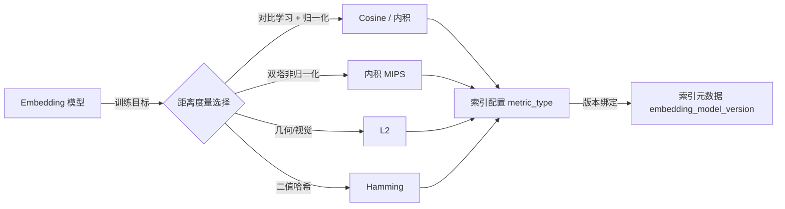

---

## 13b.3 维度诅咒：为什么树结构在高维空间失效

KD-tree 在低维（d ≤ 10）空间的效率接近 O(log N)，但在高维（d ≥ 20）空间退化到接近 O(N)。这不是工程实现问题，而是数学结构问题。

**核心机制：高维球体的体积集中在表面附近**。在 d 维单位超球体中，半径为 r（0 < r < 1）的内球体积占比约为 r^d。当 d=768 时，即使内球半径是 0.99（只比外球小 1%），它的体积占比是 0.99^768 ≈ 2×10⁻³，即内球体积不到外球的 0.3%。这意味着：随机采样的任意两个高维向量，其距离几乎都集中在一个很小的区间内——所有点看起来距离都差不多远。

KD-tree 依赖的假设是：如果当前最近点距离为 d_min，那么可以通过超平面剪枝排除大量点（距离大于 d_min 的区域）。但高维空间中，几乎所有点的距离都在 d_min 的 1.05 倍以内，超平面无法有效剪枝，必须回溯搜索绝大多数节点。

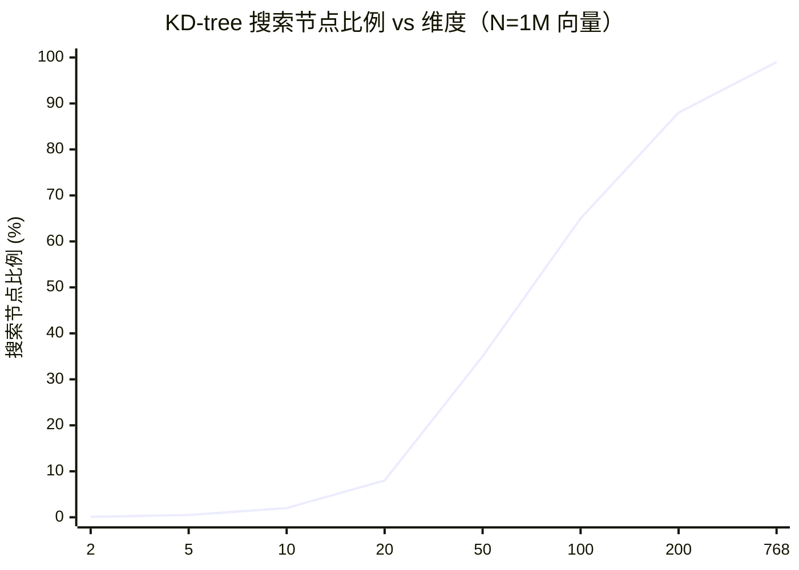

| 维度 | KD-tree 搜索比例（估算） | 实际效果 |
|------|------------------------|----------|
| 2 | < 0.1% | 极高效 |
| 10 | ~2% | 仍有效 |
| 20 | ~8% | 开始退化 |
| 50 | ~35% | 接近暴力搜索成本的一半 |
| 100 | ~65% | 不如暴力+SIMD |
| 768 | ~99% | 完全退化 |

这解释了为什么实用的高维 ANN 算法必须放弃树结构，转向图索引或基于量化的分区：它们不依赖"超平面剪枝"，而是依赖"局部邻域假设"（图）或"聚类簇假设"（IVF）。

> **工程边界**：Annoy（随机投影树）在低维（d < 100）和离线批量场景下仍然实用，因为它支持内存映射（mmap）和并行构建，适合嵌入式 RAG 工具。但 d ≥ 256 时，Annoy 的树数量需要显著增加（通常需要 50-200 棵树）才能保持 95% 以上的召回，此时内存占用和构建时间已接近 HNSW，不再有优势。

---

## 13b.4 HNSW 详解：层级跳表 + 小世界图

HNSW（Hierarchical Navigable Small World）是目前工程中最广泛使用的高召回、低延迟 ANN 索引，被 FAISS、Milvus、Qdrant、Weaviate、pgvector 等主流向量库采用。

### 13b.4.1 算法结构

HNSW 由两个经典数据结构融合而来：

1. **跳表（Skip List）**：多层链表，上层稀疏、下层稠密，支持 O(log N) 的插入和搜索。
2. **小世界图（Small World Graph）**：节点既有局部近邻连接，又有少量长程连接，使得任意两点之间的路径长度为 O(log N)。

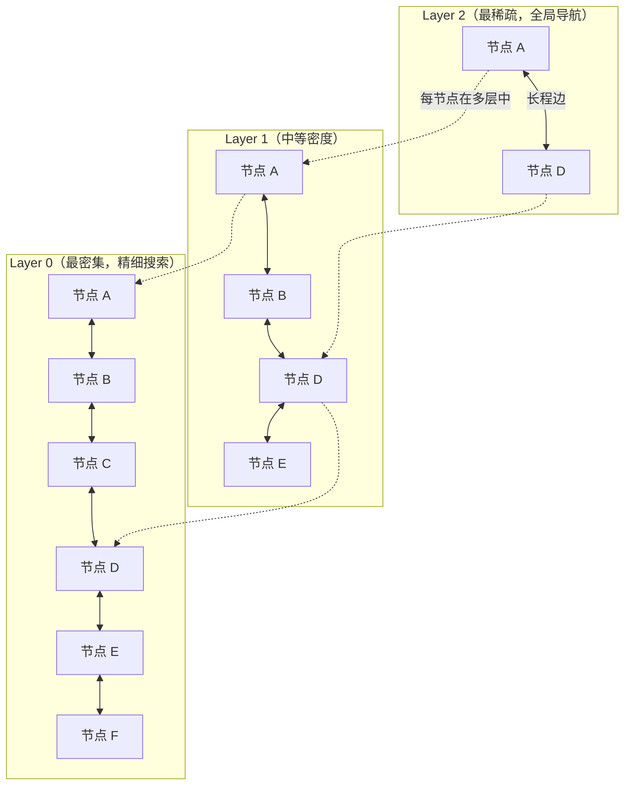

**搜索过程**：从最高层的入口点出发，在每层做贪心搜索（沿最近邻方向移动），到达当前层最近点后下降到下一层，直到 Layer 0。Layer 0 做精细搜索，返回 ef 个候选，取 Top-K。

**插入过程**：随机决定新节点的最大层数（指数分布，概率参数 1/ln(M)），在每一层找到最近的 M 个邻居并建立双向边，如果某个节点的连接数超过 M_max，剪掉最远的连接。

### 13b.4.2 关键参数

| 参数 | 含义 | 典型值 | 调大的效果 | 调大的代价 |
|------|------|--------|-----------|-----------|
| M | 每个节点在 Layer 0 的最大连接数（Layer 1+ 为 M/2） | 16-64 | 召回率提升，图结构更密 | 内存线性增加，构建时间增加 |
| efConstruction | 构建时每层的动态候选集大小 | 100-500 | 构建质量提升，边更优 | 构建时间线性增加 |
| ef（efSearch） | 查询时动态候选集大小 | 50-1000 | 召回率提升 | 查询延迟线性增加 |

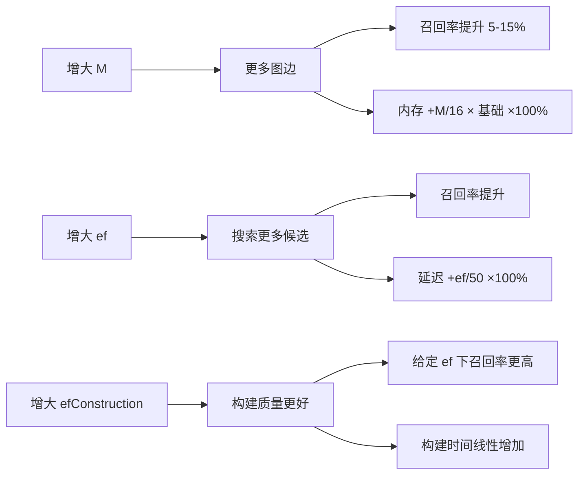

**经验调参策略**：
- 优先调 ef（查询时参数，不影响构建，可热更新）
- 召回率不满足时再考虑增大 M（需要重建索引）
- efConstruction 通常设为 ef 的 2-4 倍即可，过大回报递减
- 100M 向量场景参考值：M=32, efConstruction=200, ef=200

> **工程边界**：HNSW 的最大痛点是更新成本。插入新向量需要修改多个节点的连接列表，删除通常通过"软删除"（tombstone + 定期重建）实现。如果更新频率高（每秒数千条），HNSW 的图结构会逐渐退化（被删除节点的连接残留、新插入节点连接质量差），召回率会随时间下降。监控指标：定期用 golden queries 计算 Recall@10，如果相比构建时下降超过 5%，考虑触发部分重建。

---

## 13b.5 IVF 详解：聚类 + 倒排

IVF（Inverted File Index）是向量库版本的倒排索引，将向量空间用 K-Means 分成 nlist 个 Voronoi 格，查询时只搜索最近的 nprobe 个格。

### 13b.5.1 算法结构

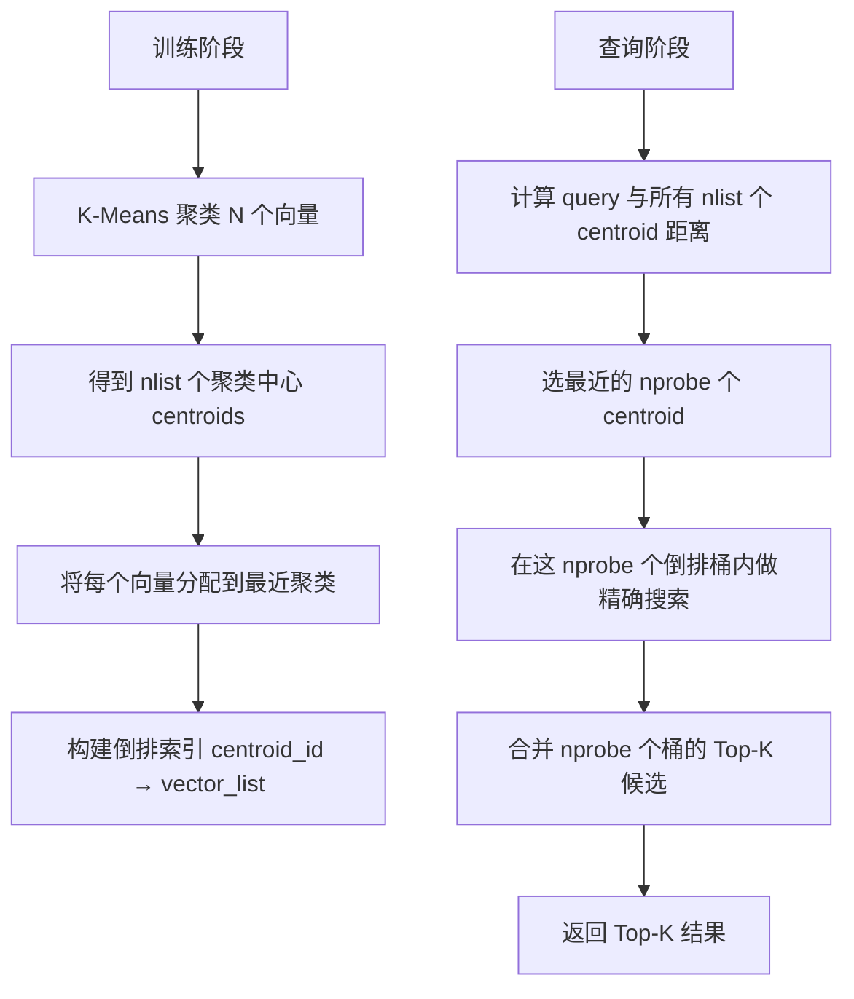

**核心参数**：
- **nlist**：聚类桶数，通常取 `4√N` 到 `16√N`（N 为向量数）
- **nprobe**：查询时搜索的桶数，控制召回-延迟权衡

| nlist | nprobe | 召回率（估算） | 平均延迟（相对） | 适用场景 |
|-------|--------|---------------|-----------------|----------|
| 1024 | 8 | ~80% | 1x | 速度优先，可接受较多漏召 |
| 1024 | 32 | ~92% | 4x | 平衡场景 |
| 1024 | 128 | ~97% | 16x | 召回优先，延迟不敏感 |
| 4096 | 32 | ~88% | 2x（桶更小） | 大规模数据，更细粒度分区 |

### 13b.5.2 训练阶段

IVF 有训练阶段：需要先对索引数据集（或代表性样本）跑 K-Means，生成 nlist 个聚类中心，才能构建倒排桶。这意味着：

- 训练集必须足够大（通常建议 ≥ 30 × nlist 条向量）才能得到稳定的 centroid
- 如果数据分布变化（例如切换了 embedding 模型），centroid 失效，必须重新训练和重建
- 训练完 centroid 后，新增向量可以增量写入最近的桶，不需要重训练（只要分布没有大变化）

> **工程边界**：IVF 的召回率上限由聚类质量决定。如果 nlist 太小（例如 100 个桶用于 10M 向量，每桶平均 100k 向量），nprobe 必须设很大才能有好召回，失去了分区的意义。如果 nlist 太大（每桶平均向量数 < 50），桶内向量太少，K-Means 质量差，聚类中心不稳定。经验法则：nlist ≈ √N，每桶平均向量数约 √N。

---

## 13b.6 PQ / OPQ：乘积量化与向量压缩

Product Quantization（PQ）是解决内存瓶颈的核心技术，在 10 亿量级向量库中几乎不可绕过。

### 13b.6.1 PQ 压缩原理

将 d 维向量切分为 M 个子空间（每个子空间 d/M 维），对每个子空间独立训练一个大小为 K 的 codebook（通常 K=256），用 M 个字节表示一个向量。

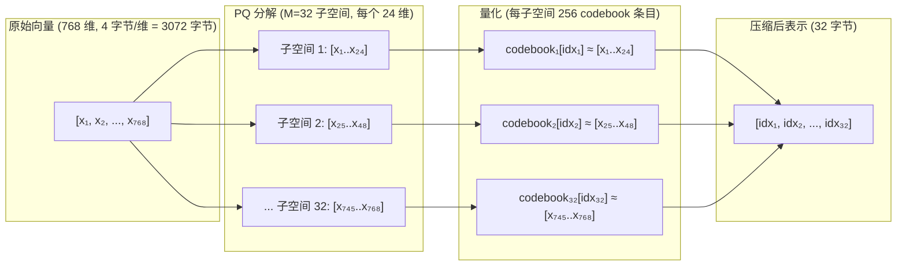

**内存压缩比例**：
- 原始：768 × 4 = 3072 字节/向量
- PQ(M=32, K=256)：32 字节/向量（压缩比 96:1）
- PQ(M=64, K=256)：64 字节/向量（压缩比 48:1）

| M（子空间数） | 压缩后大小 | 压缩比（768d float32） | 量化误差（相对） | 适用场景 |
|--------------|-----------|----------------------|-----------------|---------|
| 8 | 8 字节 | 384:1 | 很高 | 超大规模，精度要求低 |
| 16 | 16 字节 | 192:1 | 高 | 大规模，需 rerank 补偿 |
| 32 | 32 字节 | 96:1 | 中等 | 常用平衡点 |
| 64 | 64 字节 | 48:1 | 低 | 精度要求较高 |
| 96 | 96 字节 | 32:1 | 很低 | 接近精确搜索质量 |

### 13b.6.2 ADC（Asymmetric Distance Computation）

查询向量不压缩（保留原始精度），只对数据库向量压缩。查询时，预先计算 query 与每个 codebook 条目的距离，存入距离查找表（每子空间 256 项）。对每个数据库向量，通过 M 次表查找累加近似距离，不需要做真正的浮点乘法。

> **工程边界**：PQ 有训练阶段（codebook 训练）。当 embedding 模型切换时，codebook 必须重新训练，否则子空间分解与新向量空间不匹配，量化误差会急剧增大，相当于在错误的坐标系里做近似。

### 13b.6.3 OPQ（Optimized PQ）

PQ 的一个缺陷是：原始向量的 d 维空间中，不同维度的方差可能差异很大，简单按维度顺序切分子空间会导致各子空间的量化误差不均匀。OPQ 在 PQ 之前对向量做一次正交旋转（旋转矩阵 R），使旋转后的各维度方差尽量均匀，从而让每个子空间的量化误差更均匀、总量化误差更小。代价是额外的矩阵乘法开销（查询时也要先乘旋转矩阵）。

---

## 13b.7 IVFPQ / IVFSQ：组合策略

### IVFPQ

最常用的大规模向量索引组合：IVF 做粗粒度分区，PQ 做精细压缩。

```
查询流程：
1. query → 找最近 nprobe 个 IVF centroid
2. 在 nprobe 个倒排桶内用 ADC 做 PQ 近似距离排序
3. 取 Top-K × 候选放大系数 个候选
4. （可选）对候选用原始向量精确重排序（Rerank）
```

**参数矩阵**：

| nlist | nprobe | M（PQ 子空间） | 内存（100M 768d） | Recall@10（估算） | QPS（估算，32 核） |
|-------|--------|---------------|-----------------|-------------------|------------------|
| 4096 | 32 | 32 | ~3.4 GB | ~88% | ~2000 |
| 4096 | 64 | 32 | ~3.4 GB | ~93% | ~1000 |
| 4096 | 128 | 64 | ~6.8 GB | ~96% | ~500 |
| 16384 | 64 | 32 | ~3.6 GB | ~91% | ~1200 |

### IVFSQ（Scalar Quantization）

SQ 是比 PQ 更简单的量化方式：对每个维度的值做线性缩放，映射到 uint8（256 级）或 uint16（65536 级）。精度损失比 PQ 小，但压缩比也小（768d → uint8 节省 75% 内存）。

| 量化方式 | 压缩比（float32 起点） | 精度损失 | 计算复杂度 | 适用场景 |
|---------|----------------------|---------|-----------|---------|
| SQ uint8 | 4:1 | 很小 | 低 | 内存不极度紧张时优选 |
| SQ uint4 | 8:1 | 中等 | 中 | 需要更多压缩 |
| PQ M=32 | 96:1 | 中等 | 中（ADC 表查找） | 超大规模标准选择 |
| PQ M=64 | 48:1 | 小 | 中 | 精度优先 |

---

## 13b.8 ScaNN（Google）：各向异性量化损失

ScaNN（Scalable Nearest Neighbors）是 Google 提出的高性能 ANN 算法，核心创新是各向异性量化损失函数（Anisotropic Quantization Loss）。

**核心洞察**：传统 PQ 最小化平均 L2 量化误差，但对于近邻搜索，量化误差对最终 Top-K 排序的影响是不均匀的。沿着原始向量方向的误差（平行误差）对内积估算的影响远大于垂直方向的误差。ScaNN 将量化时的误差权重向平行方向倾斜，使量化后的内积估算更准确，即使总 L2 误差增加也可以接受。

**多阶段设计**：
1. 分区（类似 IVF）：将向量库分成树状簇
2. 各向异性量化（AQ）：对簇内向量做各向异性量化压缩
3. 精确重排序（Reranking）：对候选用 float32 精确距离重排

ScaNN 在 Google 内部 ANN benchmark 中展示了优异的召回-延迟权衡，在 recall@10=0.90 时比同期 HNSW 快约 2-3 倍，主要来自于更紧凑的量化表示带来的更好的 SIMD 利用率和更高的内存带宽效率。

> **工程边界**：ScaNN 的 C++ API 需要一定的集成成本，开箱即用的 Python 接口最简单，但生产部署通常通过 Vertex AI Vector Search（Google Cloud 托管）。如果你不在 GCP 生态，FAISS 和 Milvus 在大多数场景是更现实的选择。

---

## 13b.9 DiskANN：盘内图索引

DiskANN（Microsoft Research）解决的问题是：当向量库规模超过服务器 RAM 容量时，如何在 SSD 上存储图索引并仍然保持低延迟。

**核心设计**：
1. 在 SSD 上存储完整的图索引（Vamana 图，类似 HNSW 但专为磁盘访问优化）
2. 在内存中只存储 PQ 压缩版本的所有向量（用于初步过滤）
3. 查询时：先用内存中的 PQ 向量做初步候选筛选，再从 SSD 读取候选向量的精确值做最终排序
4. 图的边被设计为最小化随机 IO 次数（每次搜索约 20-40 次 SSD 随机读）

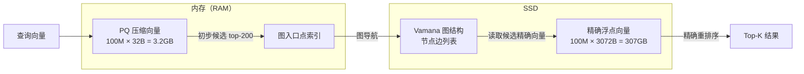

> **口径提醒**：下表的 HNSW 内存必须区分 raw vector storage 和 graph adjacency。对 100M × 768d float32，raw vectors alone 约 307 GB，因此不能写成几十 GB 的"原始向量 + 图"。

| 场景 | 内存需求（100M 768d） | SSD 需求 | Recall@10 | P99 延迟 |
|------|---------------------|----------|-----------|---------|
| DiskANN（M=32） | ~3.2 GB（PQ 压缩） | ~350 GB | ~95% | 5-15 ms |
| HNSW（M=32） | 307 GB 原始向量 + 图邻接；需分片、量化或 mmap | 0（仅 full-in-memory 口径；mmap 变体需 SSD 原始向量空间） | ~97% | 1-5 ms |
| IVFPQ | ~3.5 GB | 0 | ~90% | 1-3 ms |

**适用场景**：超大规模向量库（10 亿级）、内存受限的服务器（128GB RAM 无法容纳 HNSW）、可以接受 10-20ms P99 延迟但需要 95%+ 召回率。

> **工程边界**：DiskANN 的延迟对 SSD 质量极度敏感。NVMe SSD 的随机读 IOPS 约 500k-1M，而 SATA SSD 约 100k，机械硬盘约 200。在 SATA SSD 上使用 DiskANN，P99 延迟可能达到 100ms 以上，完全不可用。生产部署必须使用 NVMe SSD，且要测试在并发查询（例如 100 QPS）下的 IO 争用。

---

## 13b.10 GPU vs CPU 索引

| 维度 | CPU 索引（FAISS-CPU、HNSW） | GPU 索引（FAISS-GPU、cuVS） | 混合（cuVS + CPU fallback） |
|------|--------------------------|--------------------------|--------------------------|
| 适用规模 | 百万到十亿 | 百万到十亿（受显存限制） | 十亿级 |
| 显存限制 | 无 | A100 80GB → ~80M 768d float32 | 索引分片 |
| 单查询延迟 | 1-20 ms | 0.5-5 ms | 1-10 ms |
| 批量吞吐 | 中 | 高（GPU 大 batch 并行优势） | 高 |
| 构建时间 | 慢（HNSW 100M 768d 约 2-4 小时） | 快（GPU 并行构建） | 快 |
| PCIe 带宽限制 | 无 | 向量 batch 小时 CPU↔GPU 传输成为瓶颈 | 部分影响 |
| 推荐场景 | 延迟敏感的单请求查询、内存足够 | 高吞吐批量检索、推荐召回 | 超大库 + 高 QPS |

**GPU 索引的隐藏成本**：
- H100 80GB 显存约 2400 元/小时（云计算按需价），A10G 24GB 约 500 元/小时
- 如果向量库 50M × 768d float32 = 153 GB，超过单卡显存，需要多卡分片或 PQ 压缩后再放 GPU
- 单查询的 CPU→GPU 数据传输（PCIe 带宽约 64 GB/s，但实际延迟约 10-50 μs per small transfer）在低并发场景下可能抵消 GPU 计算优势

> **工程边界**：GPU 索引在 batch size ≥ 64 时才有明显吞吐优势。在交互式 RAG（每次查询 1-4 个 embedding）场景中，CPU HNSW 的延迟（1-5ms）通常优于 GPU IVFPQ 加上 PCIe 传输的总延迟。只有在推荐召回（每秒数千个 embedding batch）场景下，GPU 才是明确的优势。

---

## 13b.11 Filter 与 Hybrid Search

### 13b.11.1 Metadata 过滤与 ANN 的配合

生产 RAG 和推荐系统通常需要在 ANN 搜索的同时过滤 metadata（例如：只搜索属于租户 A 的文档、时间范围在过去 30 天内的向量）。过滤与 ANN 的集成方式对召回率有显著影响：

| 策略 | 执行顺序 | 适用条件 | 召回风险 |
|------|---------|---------|---------|
| 先 ANN 后过滤（Post-filter） | ANN(topK×n) → filter | 过滤选择性低（大多数向量通过过滤） | 如果过滤率高，最终结果可能远少于 K |
| 先过滤后 ANN（Pre-filter） | filter → ANN(on subset) | 过滤选择性高，可以找到足够多的候选 | 过滤后向量子集可能不适合 ANN 索引结构 |
| 带过滤条件的 ANN（Native filter） | ANN + filter 同步执行 | 索引原生支持（Qdrant、Milvus 等） | 实现复杂，高选择性时仍可能回退到线性扫描 |

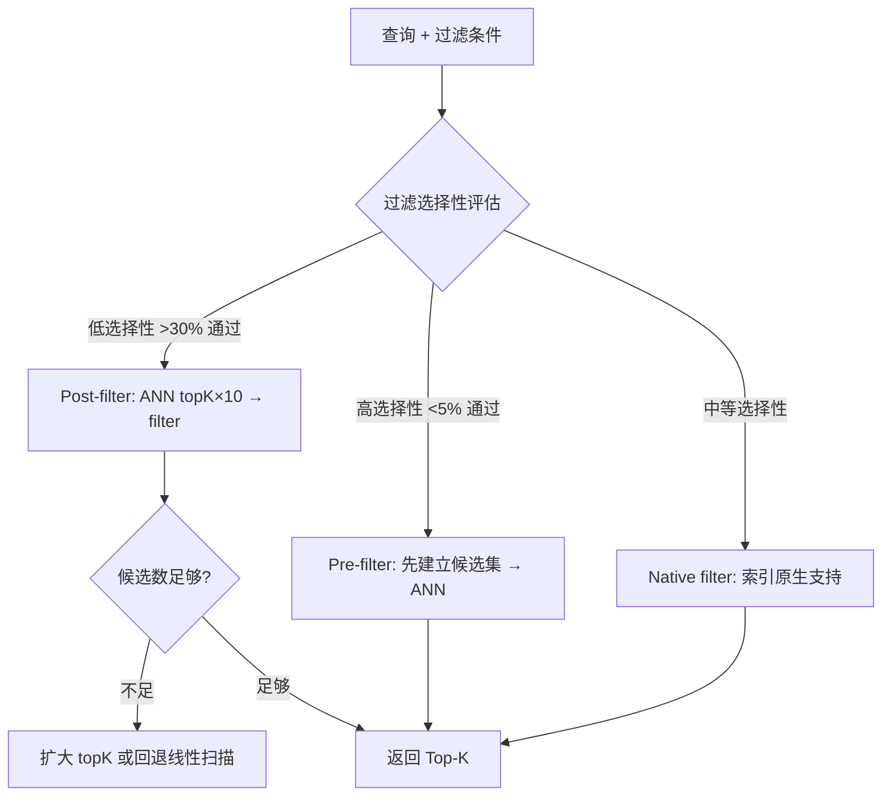

> **工程边界**：如果你的 RAG 系统有强 ACL 过滤（例如每个租户只能看到自己的文档，每个文档有细粒度权限），并且某些租户的文档数量很少（高选择性），Post-filter 策略会导致 Top-K 结果不足（例如 filter 之后只剩 2 个结果，但需要 5 个）。这种情况下，应该为每个租户或权限组建立独立的 IVF 桶，或者对每个租户单独建立小索引，而不是依赖全局索引 + 过滤。

### 13b.11.2 Hybrid Search：BM25 + 向量

详见 [第 13 章 §13.10](./13-feature-vector-and-cache.md#1310-混合搜索)，在此只补充索引算法视角：

- BM25 检索走倒排索引（Elasticsearch / OpenSearch 自带），延迟通常 < 10ms
- 向量检索走 ANN 索引，延迟取决于 K 和 nprobe / ef 设置
- RRF 融合（Reciprocal Rank Fusion）是无参数合并方式，对两路排序各取倒数排名的加和作为最终分数
- 如果两路延迟差异大（例如 BM25 2ms vs HNSW 15ms），可以并行发出两路请求，等较慢的那路完成后再合并

---

## 13b.12 Multi-vector / Late Interaction：ColBERT 等

ColBERT（Contextualized Late Interaction over BERT）代表了另一类检索范式：不把整个文档压缩成单个向量，而是保留每个 token 的向量，在检索时做 token 级别的延迟交互（MaxSim：对 query 每个 token，找 document 所有 token 中最相似的那个，累加得到文档分数）。

| 维度 | 单向量（Bi-encoder） | ColBERT（Multi-vector） |
|------|---------------------|----------------------|
| 存储 | 1 向量/文档 | N_tokens 向量/文档 |
| 索引结构 | 标准 ANN 索引 | PLAID 优化的 token 向量索引 |
| 检索质量 | 中等 | 高（接近 cross-encoder） |
| 延迟 | 低（1-10ms） | 中（10-100ms，取决于 token 数） |
| 内存占用 | 低 | 高（约 tokens/文档 倍） |
| 适用场景 | 大规模第一阶段召回 | 精度要求高的第二阶段召回或直接检索 |

**ColBERT 的索引工程挑战**：
- 100M 文档 × 平均 128 tokens × 128 维 = 1.6 万亿维度，约 6.4 TB float16
- 实际使用通常配合 PQ 压缩到 2 字节/token（约 200 GB），再用 PLAID 的两阶段过滤（cell interaction + decompression reranking）
- 目前主流实现：RAGatouille、ColBERT-v2、VoyageAI 的 ColBERT API

---

## 13b.13 召回率 vs 延迟 vs 内存的三角权衡

这是所有 ANN 索引选型的核心约束。没有算法能同时在三个维度都最优。

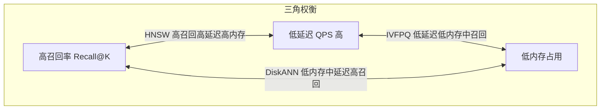

| 索引 | 召回率 | 延迟 | 内存 | 最适合场景 |
|------|--------|------|------|-----------|
| 暴力（Flat） | 100% | 最差 | 最高 | 规模 < 1M，离线评测基线 |
| HNSW | 95-99% | 极低（1-5ms） | 高 | 内存足够，延迟敏感 RAG |
| IVF-Flat | 90-98% | 低 | 中高 | 大规模、延迟中等、可接受训练 |
| IVFPQ | 85-95% | 低 | 低 | 超大规模、内存有限 |
| DiskANN | 93-97% | 中（5-20ms） | 极低（内存） | 超大库、内存受限、NVMe |
| ScaNN | 92-97% | 极低 | 低 | GCP 生态、高吞吐批量 |

**调参方向总结**：

| 目标 | 操作 | 代价 |
|------|------|------|
| 提高召回率（不重建） | 增大 ef（HNSW）或 nprobe（IVF） | 延迟线性上升 |
| 降低延迟（不重建） | 减小 ef / nprobe，接受召回损失 | 召回率下降 |
| 降低内存（需重建） | 切换到 IVFPQ 或 SQ 量化 | 构建时间，召回下降 |
| 提高召回率上限（需重建） | 增大 M（HNSW）或 nlist（IVF） | 构建时间，内存增加 |

---

## 13b.14 索引训练与重建策略

| 触发条件 | 建议策略 | 原因 |
|---------|---------|------|
| 少量新增文档（< 1% 库大小） | 增量写入 | 图/桶结构变化小，召回影响有限 |
| 大量新增（> 10% 库大小） | 评估后决定；通常需重建 | HNSW 图质量退化，IVF centroid 分布偏移 |
| embedding 模型版本变更 | 全量重建 | 向量空间整体变化，旧索引不可比 |
| 距离度量变更 | 全量重建 | 索引内部排序依赖旧度量 |
| IVF centroid 训练集分布偏移 | 重训练 centroid + 重建 | 桶分配失准，召回下降 |
| 大规模软删除（tombstone 累积） | 定期重建 | 软删除节点影响图结构和内存 |
| 批量元数据更新（不改变向量） | 只更新 metadata 字段 | 向量不变，ANN 索引结构不需重建 |

**双索引蓝绿切换流程**（必须遵守）：
```
1. 后台并行构建新索引（不影响线上）
2. 用 golden queries（≥100 条）对比 Recall@K、P99 延迟、过滤召回率
3. 对比通过 → 按租户或流量比例灰度切换（例如 5% → 20% → 50% → 100%）
4. 保留旧索引 24-72 小时（用于回滚）
5. 记录切换时间、新索引版本、触发原因
```

---

## 13b.15 性能指标与监控

| 指标 | 含义 | 健康参考值 | 报警条件 |
|------|------|-----------|---------|
| Recall@K | 前 K 个结果中包含真实 Top-K 的比例 | ≥ 90%（标准），≥ 95%（高质量） | 相比 baseline 下降 > 5% |
| QPS | 每秒查询数 | 取决于场景，通常 100-5000 | 低于 SLO 的 80% |
| P50 latency | 中位延迟 | < 10ms（HNSW），< 30ms（DiskANN） | 超过 SLO |
| P99 latency | 尾部延迟 | P99/P50 < 5x | P99 > 100ms（交互式场景） |
| Memory footprint | 索引内存占用 | 取决于向量库规模 | 超过服务器 RAM 的 70% |
| Build time | 索引构建耗时 | HNSW 100M：2-4 小时 | 超过维护窗口 |
| Index freshness lag | 最新文档到可检索的延迟 | < 5 分钟（增量），< 24 小时（重建） | 超过 SLA |

---

## 13b.16 Worked Example：100M 768d 向量库索引选型

### 场景设定

企业知识库 RAG 系统：
- 向量规模：1 亿条，768 维，float32（约 307 GB 原始数据）
- 查询：交互式问答，P99 < 50ms，Recall@10 ≥ 92%
- 服务器：256 GB RAM，4× NVMe SSD（总计 8 TB），无 GPU
- 更新频率：每天增量写入约 10 万条新向量，每月全量重建一次

> **数值口径（2026-05 示例）**：本例区分 raw vector storage、graph adjacency、metadata 和压缩码。100M × 768d × float32 的原始向量约 307 GB，因此如果 HNSW 在内存中保留 float32 原始向量，单机 256 GB RAM 不可行。只有在向量被量化、内存映射、分片，或仅把压缩码/图邻接放入内存时，内存数字才可能降到几十 GB。

### 三种方案对比

| 指标 | HNSW（M=32, ef=200） | IVFPQ（nlist=16384, M=32, nprobe=64） | DiskANN（M=32, PQ 压缩内存） |
|------|---------------------|--------------------------------------|---------------------------|
| **构建时间** | ~3.5 小时 | 训练 20 分钟 + 构建 45 分钟 | ~2 小时 |
| **索引内存** | > 307 GB 原始向量 + 图邻接；单机 256 GB 不可行，除非量化/分片/内存映射 | ~3.6 GB PQ code + centroid/metadata，不含原始向量副本 | ~3.2 GB PQ code/导航结构 + SSD 原始向量 |
| **SSD 需求** | 0（仅 full-in-memory 口径；mmap 变体需 SSD 原始向量空间并重测 P99） | 0 | ~350 GB（精确向量 + 图） |
| **Recall@10** | ~97% | ~91% | ~95% |
| **P50 延迟** | ~2 ms | ~1.5 ms | ~8 ms |
| **P99 延迟** | ~8 ms | ~6 ms | ~22 ms |
| **QPS（32 核）** | ~800 | ~2500 | ~400 |
| **增量写入成本** | 中等（图修改） | 低（直接写入最近桶） | 高（需重建受影响区域） |
| **内存安全边界** | raw vectors 已超过 256 GB，不安全 | 256 GB 中占 1.4%，安全 | 256 GB 中占 1.3%，安全 |

### 决策推荐

本场景若必须在单台 256 GB RAM 机器上运行，不应选择保留 float32 原始向量的 HNSW，因为 raw vector storage 已经超过内存。优先推荐 DiskANN；IVFPQ 只有在调大 `nprobe`、增加重排序或调整 PQ 参数后，实测 Recall@10 达到 92% 以上，才适合作为低内存高 QPS 备选。如果业务强依赖 HNSW 的召回和低延迟，需要先做向量量化、分片到多节点，或把原始向量放到 mmap/SSD 并用压缩表示参与检索。

### 参数调优日志示例

```yaml
# HNSW 调优记录
index_version: hnsw-2026-04-28
vectors: 100M × 768d float32
distance_metric: cosine
M: 32
efConstruction: 200

# 查询参数（可热更新，无需重建）
ef: 200

# 实测指标（golden queries = 500 条）
recall_at_1: 0.942
recall_at_5: 0.971
recall_at_10: 0.983
p50_latency_ms: 2.1
p95_latency_ms: 5.4
p99_latency_ms: 8.2
qps_at_32_threads: 812
memory_model:
  raw_vectors_gb: 307
  graph_and_metadata_gb: "depends on M, level distribution, id width, implementation"
  compression: "required for single-node 256GB RAM"

# 调优历程
# ef=100 → Recall@10=0.961, P99=4.3ms （不满足 92% 要求仍可接受，但期望更高余量）
# ef=200 → Recall@10=0.983, P99=8.2ms （当前配置）
# ef=400 → Recall@10=0.991, P99=17.8ms （召回提升不大，延迟代价过高，不采用）
```

---

## 13b.17 SQ-HNSW 与量化感知索引

### 为什么纯 HNSW 在十亿级场景难以承受

HNSW 在召回率和延迟上是目前最优的内存索引，但它有一个根本性的内存瓶颈：所有原始向量必须保留在内存中（用于精确距离计算）。在大规模场景下：

| 向量规模 | 维度 | 精度 | 原始向量内存 |
|---------|------|------|------------|
| 100M | 768d | float32 | 307 GB |
| 1B | 768d | float32 | 3.07 **TB** |
| 1B | 1536d | float32 | 6.14 **TB** |

1B 768 维 float32 向量需要约 3 TB 内存——这对单机来说完全不可承受，即使是 HBM 最大的 H100（80 GB 显存）也只能放约 2600 万个 768 维向量。

**HNSW 的图邻接结构还需要额外内存**：每条边约 4 字节，M=32 时每个节点约 M × 2 × 4 = 256 字节，10 亿节点额外需要 256 GB——这在已经 3 TB 的原始向量之外。

这就催生了量化感知索引的需求：在保留 HNSW 高召回优势的同时，用向量压缩把内存降低到可承受的范围。

### SQ-HNSW：标量量化 + HNSW 图结构

SQ-HNSW 是在 HNSW 图结构不变的前提下，把存储在内存中的原始向量替换为 int8 标量量化版本：

| 方案 | 每向量存储（768d） | 相对 float32 压缩比 | 召回精度损失 |
|------|-------------------|---------------------|------------|
| float32 HNSW | 3072 字节 | 1x | 0% |
| float16 HNSW | 1536 字节 | 2x | < 0.5% |
| **SQ int8 HNSW** | **768 字节** | **4x** | **< 1%** |
| SQ int4 HNSW | 384 字节 | 8x | 1-3% |

对于 1B × 768d 的库：
- float32 HNSW：3 TB → 不可行（单机）
- **SQ int8 HNSW：768 GB → 可以用 HBM 分片 GPU 集群，或大内存 CPU 服务器**
- SQ int4 HNSW：384 GB → 可以用高内存服务器（384 GB RAM）

**标量量化的原理**：对每个维度找到训练集的最小值 `min_i` 和最大值 `max_i`，将 float32 值线性映射到 [0, 255]（int8）：

```
int8_value = round((float32_value - min_i) / (max_i - min_i) × 255)
```

量化误差相比 PQ 小得多（因为 SQ 在每个维度独立量化，信息损失最小），但压缩比也远低于 PQ（4x vs 96x）。SQ 的设计点在"低精度损失、中等压缩"。

### Rescoring HNSW：量化候选 + 精确精排

Rescoring（也称 Two-Level HNSW）是目前工业界最常用的量化感知索引方案：

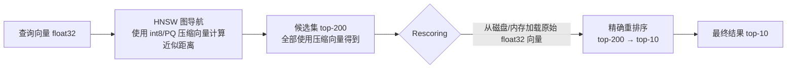

**核心思路**：
1. **图导航阶段**：HNSW 的搜索走量化向量（int8 或 PQ），速度快，内存小，但距离是近似的。
2. **Rescoring 阶段**：从候选集（top-100 到 top-500）中，用原始 float32 向量做精确距离计算，重新排序取 top-K。

这个设计的理论基础：HNSW 图导航的目的是找到"一个好的候选集"，不要求每个候选的距离精确——只要真正的 top-K 在候选集里（召回不漏），精排可以纠正顺序。

**Rescoring 的效果**：
- 量化（int8 SQ）+ Rescoring vs 纯 float32 HNSW：
  - 召回率损失：< 1%（Recall@10 从 0.97 → 0.965）
  - 内存降低：4x（SQ int8）
  - 查询加速：5-10x（int8 SIMD 计算更快 + 内存 cache 命中率更高）

> **工程边界**：Rescoring 的代价是需要保留原始 float32 向量用于精排（通常存在 SSD 上，按需加载）。如果 Rescoring 候选集太大（如 top-500），SSD 随机读的延迟会显著增加。通常 top-100 到 top-200 是 Rescoring 候选集大小的合理上限。

### 主流向量库的量化支持现状

| 向量库 | SQ 支持 | 量化类型 | Rescoring | 备注 |
|--------|--------|---------|---------|------|
| **Qdrant** | 是（默认启用） | int8 SQ、binary | 是（原始向量 Rescore） | SQ 量化是 Qdrant 最推荐的内存优化方案 |
| **Milvus** | 是 | SQ8（int8）、PQ | 是 | 支持 HNSW + SQ8 组合 |
| **pgvector 0.7+** | 是 | int2（halfvec）、binary | 部分 | halfvec 只压缩到 float16 |
| **FAISS** | 是 | SQ（int8/int4）、PQ | 需手工实现 | IndexHNSWFlat + SQ 量化后 flat index Rescore |
| **Weaviate** | 是 | SQ、PQ、BQ（binary） | 是 | 量化功能在 1.23+ 版本成熟 |

---

## 13b.18 ANN 算法三维权衡实测基准

### 基准说明

以下数据基于公开 ANN Benchmarks（ann-benchmarks.com）、各算法原始论文和 Qdrant/Milvus 官方测试报告，单机环境（32 核 CPU，无 GPU，NVMe SSD），测试数据集为 SIFT-1M（1M × 128d float32，L2 距离）和 Deep-1M（1M × 96d float32）的代表性结果，并推断到 100M 768d 场景（加注换算说明）。

> **注意**：实际性能高度依赖硬件、库版本、参数调优和数据分布。以下数字是量级参考，不是精确测量值。生产部署前必须在自有数据集上测试。

### SIFT-1M 基准（1M × 128d，recall@10=0.95 时）

| 算法 | QPS | 内存（GB / 1M 向量） | 构建时长 | 备注 |
|------|-----|---------------------|---------|------|
| HNSW M=16 | ~8,000 | ~0.7（float32）| ~3 分钟 | 低内存版，召回达标快 |
| HNSW M=32 | ~6,000 | ~1.2（float32）| ~6 分钟 | 标准平衡配置 |
| HNSW M=64 | ~4,000 | ~2.4（float32）| ~15 分钟 | 高召回配置 |
| SQ-HNSW（int8）M=32 | ~10,000 | ~0.35（int8）| ~7 分钟 | 4x 内存节省，QPS 更高（SIMD） |
| IVFPQ nprobe=32 | ~5,000 | ~0.04（PQ 码）| ~5 分钟 | 极低内存，召回稍低 |
| IVFPQ nprobe=128 | ~1,500 | ~0.04 | ~5 分钟 | 提高召回但 QPS 大降 |
| ScaNN | ~15,000 | ~0.1 | ~10 分钟 | SIMD 高度优化，GCP 最优 |
| DiskANN M=32 | ~2,000 | ~0.04（PQ in RAM）| ~8 分钟 | SSD 随机 IO 限制 QPS |

### 100M × 768d 换算估算（recall@10 ≈ 0.95）

> 从 1M × 128d 换算到 100M × 768d 需要注意：(1) 向量数多 100x；(2) 维度多 6x。维度变化对量化误差影响大，对图结构影响中等。

| 算法 | QPS（估算） | 内存（GB）| 构建时长（估算）| 注意事项 |
|------|-----------|---------|--------------|---------|
| HNSW M=32，float32 | 500-1000 | 307（原始）+ 30+ | 3-5 小时 | 307 GB 原始向量不含图结构 |
| SQ-HNSW int8 M=32 | 800-1500 | ~80（int8 向量）| 3.5-6 小时 | 4x 压缩后可放入 256 GB 服务器 |
| IVFPQ nlist=16384，nprobe=64，M=32 | 1000-3000 | ~3.5 | 1-2 小时 | 内存极省，适合高 QPS 低内存场景 |
| DiskANN M=32 | 300-600 | ~3.2（PQ 码）| 2-4 小时 | NVMe SSD 存精确向量，IO 是瓶颈 |
| ScaNN（SIMD 优化） | 2000-5000 | ~10 | 2-3 小时 | 需要 Google ScaNN 库或 Vertex AI |

### 三维权衡可视化（概念图）

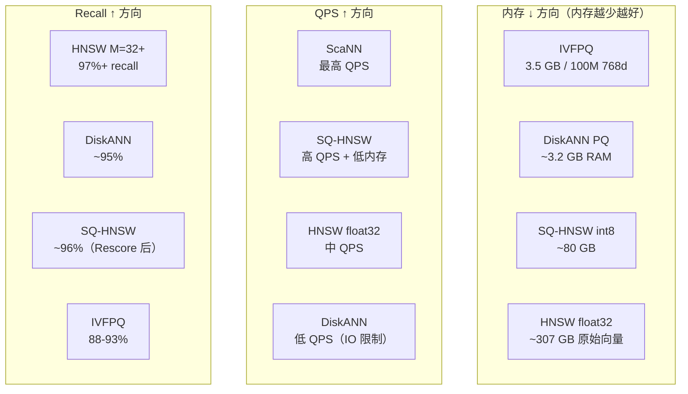

### 算法选型决策路径（基于三维权衡）

| 约束条件 | 推荐算法 | 理由 |
|---------|---------|------|
| 内存充足（> 400 GB），延迟极敏感（< 5ms P99） | HNSW float32 M=32-64 | 最高召回 + 最低延迟，内存够就用 |
| 内存受限（< 100 GB），可接受 8ms P99 | SQ-HNSW int8 + Rescore | 4x 内存节省，召回损失 < 1%，QPS 更高 |
| 超大规模（> 500M 向量），内存极度受限 | DiskANN + SQ-HNSW 分片 | DiskANN 内存只需 PQ 码，SSD 存精确向量 |
| 极高 QPS（> 5000 QPS），可接受 93% 召回 | IVFPQ nlist=16384，nprobe=32-64 | 最小内存，最高吞吐 |
| GCP 生态，高吞吐批量召回 | ScaNN / Vertex AI Vector Search | SIMD 优化最充分，生态集成最好 |
| 100M 768d，256 GB RAM 服务器（典型配置） | **SQ-HNSW int8** | 4x 压缩后约 80 GB，fit in RAM，召回接近 float32 |

> **核心结论**：SQ-HNSW int8 是 100M-1B 规模、内存预算有限场景下"HNSW 性能"和"IVFPQ 内存效率"之间最好的折衷点——它不需要昂贵的 SSD 随机读（DiskANN），也不牺牲 10%+ 的召回率（IVFPQ）。

---

## 本章小结

| 算法类型 | 代表实现 | 适合场景 | 关键约束 |
|---------|---------|---------|---------|
| 图索引 | HNSW, NSG, Vamana | 内存足、延迟敏感 | 高内存，更新成本 |
| 分区索引 | IVF, IVF-Flat | 大规模可扩展 | 聚类训练，漏召 |
| 量化压缩 | PQ, OPQ, SQ | 超大规模内存受限 | 量化误差 |
| 组合 | IVFPQ, IVFSQ | 十亿级标准方案 | 参数调优复杂 |
| 盘内图 | DiskANN | 超大库内存不足 | NVMe SSD 依赖 |
| 各向异性 | ScaNN | GCP 高吞吐批量 | 生态依赖 |

---

## 练习题

**13b-1**  解释维度诅咒（Curse of Dimensionality）的核心机制：为什么在 768 维空间中，KD-tree 的搜索效率接近暴力 O(N) 扫描？请用超球体体积分布来解释。

**13b-2**  HNSW 的参数 M=16 和 M=64 分别在什么场景下更合适？如果发现线上 Recall@10 从 95% 下降到 88%，在不重建索引的前提下，你会首先调整哪个参数？

**13b-3**  解释 IVF 训练阶段的必要性：如果跳过 K-Means 训练，直接把向量均匀分配到 nlist 个桶，查询效果会有什么问题？

**13b-4**  PQ 量化为什么需要为每个子空间单独训练 codebook，而不是用一个全局 codebook？如果将 768 维向量分成 M=32 个子空间，每个子空间有 256 个 codebook 条目，训练 codebook 需要多少样本向量才足够？

**13b-5**  你有一个生产 RAG 系统，Recall@10 指标良好（95%），但用户反映答案质量差。列出 3 个可能的原因，其中至少 1 个与索引算法参数直接相关，至少 1 个与索引算法参数无关。

**13b-6**  比较"先过滤后 ANN"（Pre-filter）和"先 ANN 后过滤"（Post-filter）两种策略在以下场景的适用性：一个多租户 RAG 系统，租户 A 有 100 万文档，租户 B 只有 500 文档，两者共用一个 HNSW 索引（总计 100 万 + 500 向量）。

**13b-7**  DiskANN 的查询延迟对 SSD 类型极度敏感。假设你有两台服务器，一台配置 SATA SSD（随机读 IOPS ~100k），另一台配置 NVMe SSD（随机读 IOPS ~500k），预计 DiskANN 在两台服务器上的 P99 查询延迟差异有多大？推导过程。

**13b-8**  IVFPQ 和 DiskANN 都适合内存受限的大规模场景，但机制不同。请从"查询时 SSD IO 次数"和"量化误差补偿方式"两个角度比较两者的差异。

**13b-9**  ColBERT（Multi-vector）相比 Bi-encoder（单向量）在检索质量上通常更好，但为什么在大规模生产系统中仍然大多数用 Bi-encoder 做第一阶段召回？ColBERT 的索引工程挑战是什么？

**13b-10**  你负责一个每月全量重建索引的系统。这个月的重建因为 embedding 模型升级而触发，你需要设计双索引蓝绿切换方案。请列出切换前必须验证的 5 个关键指标，以及如果其中一个指标不达标，你会如何处置。

**13b-11**  ScaNN 的各向异性量化损失（Anisotropic Quantization Loss）解决了什么问题？与标准 PQ（最小化 L2 量化误差）相比，它为什么在内积搜索场景下有更好的召回率？

**13b-12**  设计一个 10 亿 768d 向量的搜索系统，要求：P99 < 30ms，Recall@10 ≥ 90%，可用内存 128GB，有 4 台 NVMe SSD 服务器（每台 8TB NVMe SSD）。请给出索引算法选型、关键参数范围和分片策略。

**13b-13**  解释 SQ int8 量化（标量量化）和 PQ（乘积量化）在以下三个维度的本质差异：(1) 压缩比；(2) 量化误差；(3) 距离计算方式。在什么场景下应该选 SQ 而不是 PQ？

**13b-14**  Rescoring HNSW（量化做导航 + 精确向量精排）的"召回损失 < 1%"这个结论依赖什么假设？如果原始向量存在 SSD 而非 RAM，Rescoring 的延迟会如何变化？推导 NVMe SSD 场景下 top-200 Rescoring 的额外延迟。

---

## 深度参考阅读

**核心论文**

1. **HNSW**：Malkov & Yashunin, "Efficient and Robust Approximate Nearest Neighbor Search Using Hierarchical Navigable Small World Graphs", *IEEE TPAMI* 2020. [arXiv:1603.09320](https://arxiv.org/abs/1603.09320)

2. **ScaNN**：Guo et al., "Accelerating Large-Scale Inference with Anisotropic Vector Quantization", *ICML* 2020. [arXiv:1908.10396](https://arxiv.org/abs/1908.10396)

3. **DiskANN / Vamana**：Subramanya et al., "DiskANN: Fast Accurate Billion-point Nearest Neighbor Search on a Single Node", *NeurIPS* 2019. [arXiv:1907.08509v1 / NeurIPS 2019](https://papers.nips.cc/paper/2019/hash/09853c7fb1d3f8ee67a61b6bf4a7f8e6-Abstract.html)

4. **FAISS**：Johnson, Douze & Jégou, "Billion-scale Similarity Search with GPUs", *IEEE Big Data* 2021. [arXiv:1702.08734](https://arxiv.org/abs/1702.08734)

5. **Product Quantization**：Jégou, Douze & Schmid, "Product Quantization for Nearest Neighbor Search", *IEEE TPAMI* 2011. [PDF](https://inria.hal.science/inria-00514462/document)

6. **NSW（前身）**：Malkov et al., "Approximate Nearest Neighbor Algorithm based on Navigable Small World Graphs", *IS* 2014.

**工程资源**

7. **FAISS 官方 Wiki**：[github.com/facebookresearch/faiss/wiki](https://github.com/facebookresearch/faiss/wiki) — 涵盖 IndexIVFPQ 调参、GPU 索引用法、大规模部署最佳实践

8. **ANN Benchmarks**：[ann-benchmarks.com](https://ann-benchmarks.com) — 统一基准，可查各算法在不同数据集上的 Recall-QPS 曲线

9. **DiskANN 代码**：[github.com/microsoft/DiskANN](https://github.com/microsoft/DiskANN)

10. **cuVS（RAPIDS）**：[github.com/rapidsai/cuvs](https://github.com/rapidsai/cuvs) — GPU 加速向量搜索，FAISS-GPU 的继任

**延伸阅读**

11. **ColBERT v2**：Santhanam et al., "ColBERTv2: Effective and Efficient Retrieval via Lightweight Late Interaction", *NAACL* 2022. [arXiv:2112.01488](https://arxiv.org/abs/2112.01488)

12. **NSG（Navigating Spreading-out Graph）**：Fu et al., "Fast Approximate Nearest Neighbor Search With The Navigating Spreading-out Graph", *VLDB* 2019.

13. **Milvus 技术报告**：Wang et al., "Milvus: A Purpose-Built Vector Data Management System", *SIGMOD* 2021. [arXiv:2010.11305](https://arxiv.org/abs/2010.11305)

14. **Scalar Quantization + HNSW**：Qdrant 官方文档 "Quantization" 章节 — [qdrant.tech/documentation/guides/quantization](https://qdrant.tech/documentation/guides/quantization/)

15. **ANN Benchmarks 方法论**：Aumuller, Martin et al., "ANN-Benchmarks: A Benchmarking Tool for Approximate Nearest Neighbor Algorithms", *Information Systems* 2020. [arXiv:1807.05614](https://arxiv.org/abs/1807.05614)

16. **Weaviate 量化指南**：Weaviate 官方文档 "Product Quantization" + "Scalar Quantization" — [weaviate.io/developers/weaviate/configuration/pq-compression](https://weaviate.io/developers/weaviate/configuration/pq-compression)
