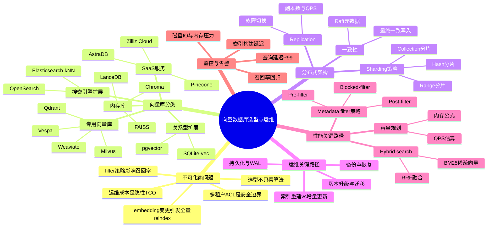
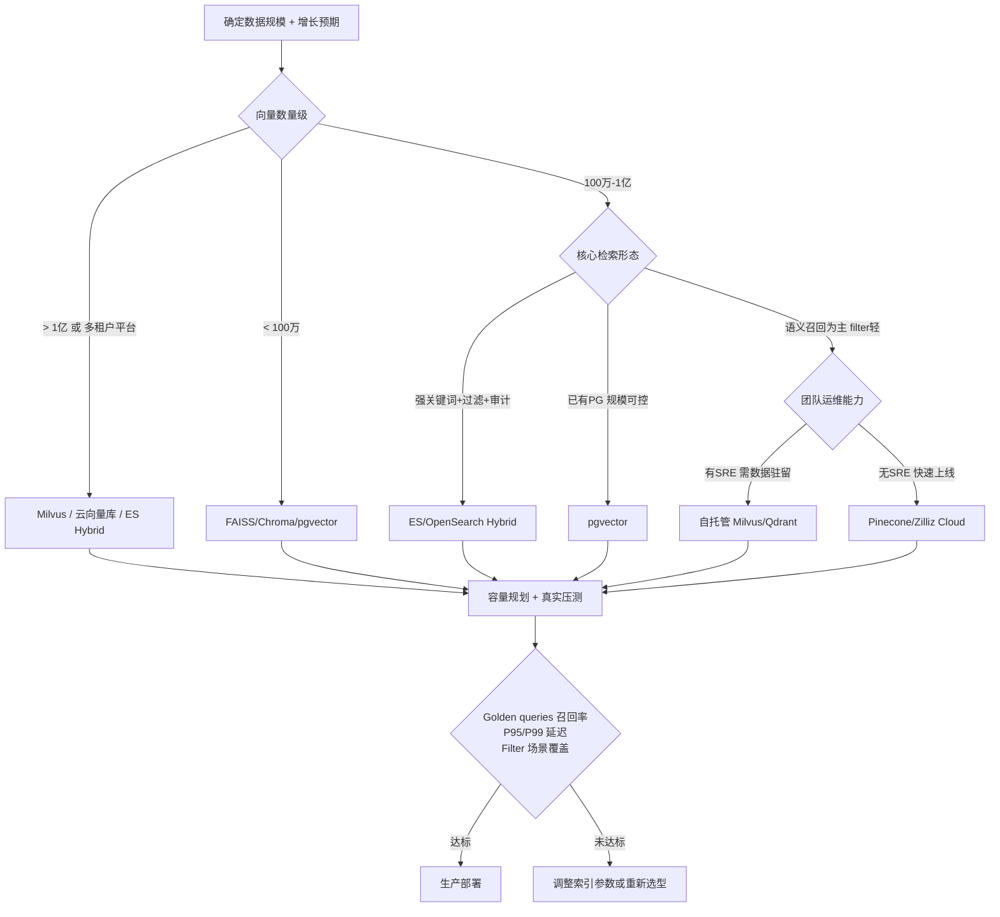
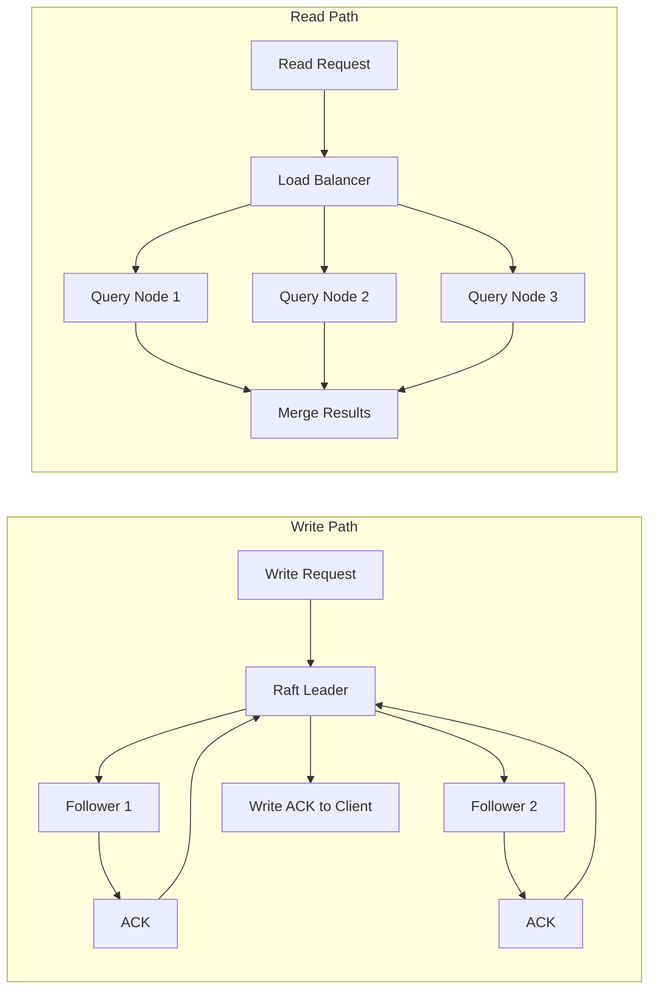
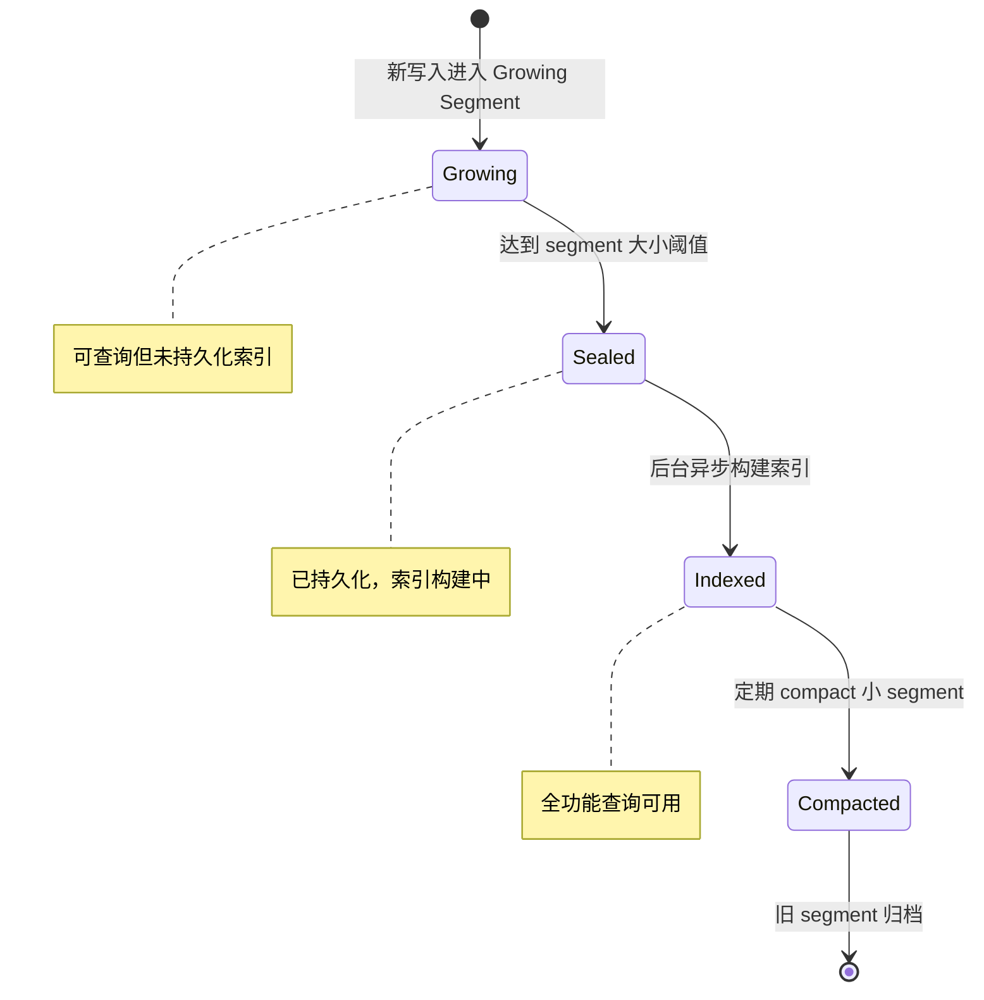
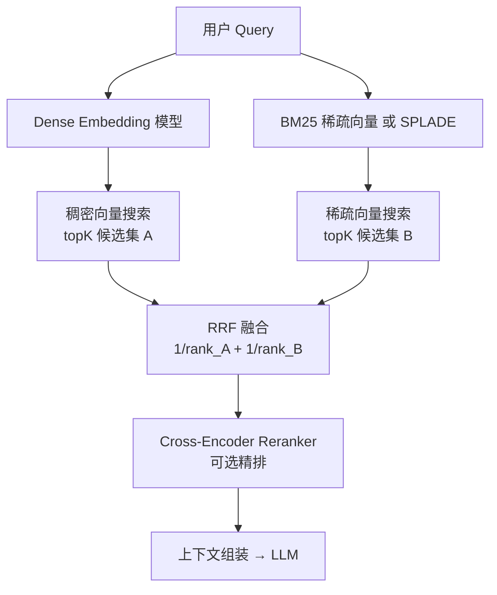
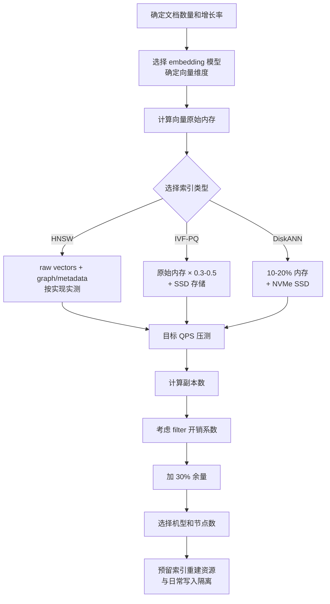
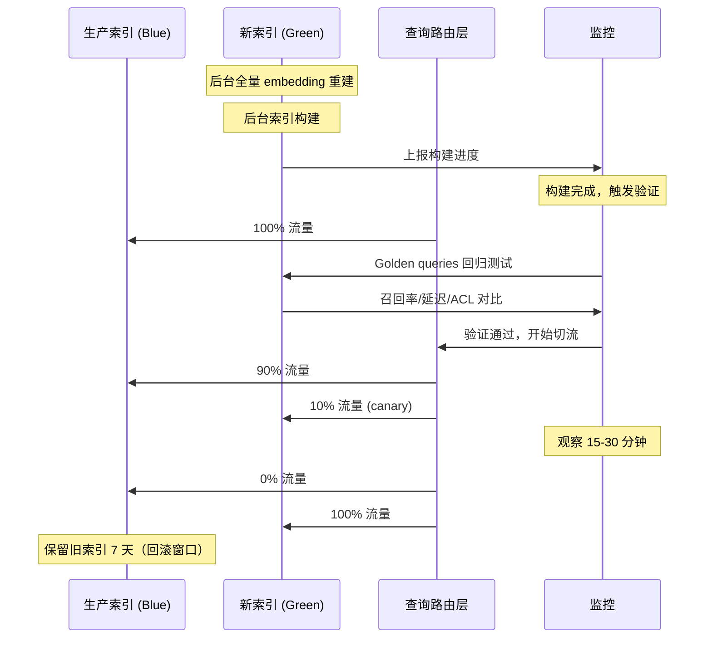

# 第 13c 章 · 向量数据库选型与运维

> 向量数据库已经是 RAG 系统、推荐召回、语义搜索的核心基础设施。选错或运维失当，业务停摆的速度比关系型数据库快得多，因为没有任何应用层降级能替代向量召回。

> **关联章节**：本章的分布式架构和 SLA 设计与 [第16a章 vLLM 推理](../part5-serving-infra/16a-vllm-internals.md) 和 [第16b章 SGLang](../part5-serving-infra/16b-sglang-internals.md) 协同；向量库的 ACL 与多租户问题与 [第23章安全治理](../part7-reliability-security/23-security-isolation-and-governance.md) 直接相关。

---

## 13c.1 第一性原理拆解 + 学习大纲

### 拆 — 不可化简的问题

剥离 Milvus、Qdrant、Pinecone、pgvector 这些产品名之后，向量数据库选型与运维真正面对的是一个比"找个最快的 ANN 库"更难的问题：**向量数据库是 RAG 系统的状态核心，它的可用性、一致性、过滤能力和运维成本直接决定整个 AI 应用能否在生产环境中稳定运转。**

这个问题不可化简，是因为以下约束同时成立，并且相互制约：

**约束一：向量召回不是纯计算问题，而是系统问题。** benchmark 里测的是裸向量 topK QPS，但生产 RAG 里的查询几乎都带 metadata filter（租户、权限、时间范围、文档类型）。高选择性 filter + 向量搜索的组合，在不同数据库中性能差异可达 10 倍以上。一个 filter 过滤掉 99% 文档后只剩 1% 候选，pre-filter 策略下召回集合可能根本不够 topK，post-filter 策略下则可能扫描大量无用向量。没有真实数据和真实过滤条件的压测，benchmark 毫无参考价值。

**约束二：数据规模与更新频率决定架构选型，而不是反过来。** 单机内存向量库（FAISS、Chroma）在百万向量以内表现优秀，但没有 WAL、没有 crash recovery、没有副本。一旦进入亿级规模或需要高可用保障，就必须接受分布式架构带来的 sharding、replication、一致性延迟等额外复杂度。问题是：很多团队在规模较小时选了单机库，等到需要扩展时发现迁移成本远高于当初多想几个月。

**约束三：embedding model 变更是最被忽视的运维事件。** 向量数据库里存的不是文档，而是特定 embedding model 在特定版本下对文档的映射结果。模型一升级，所有向量失效，必须全量重新 embedding 并重建索引。对一个 1 亿文档的知识库，这意味着数十 GPU-小时的重新推理、数十 GB 的新向量写入和数小时的索引构建。如果没有双索引灰度机制，业务在重建期间只能降级或停摆。

**约束四：多租户和权限边界是安全问题，不是性能优化问题。** 企业 RAG 系统里不同部门、不同用户能看到的文档范围不同。如果向量库的 metadata filter 没有把 ACL 字段做成强制索引，或者缓存层命中了跨租户的结果，后果是数据泄露，而不只是召回质量下降。这一类问题在系统负载低时完全看不出来，在高并发时才会暴露，而且往往在安全审计时才被发现。

**约束五：运维成本是隐性 TCO 的最大来源。** 向量数据库的存储、计算、副本、备份、索引重建和版本升级成本，往往比初始部署成本高 3-5 倍。一个没有 SRE 能力的团队选了自托管 Milvus 集群，在索引碎片化、OOM、Raft 选举风暴、跨版本升级这些问题上消耗的工程时间，很可能超过直接使用托管服务的费用差。

正因为这五个约束同时成立，向量数据库选型不是一道"找最优解"的算法题，而是一道需要同时考量技术、业务、团队能力和长期 TCO 的工程决策题。

### 推 — 从这个问题如何推导出每个机制

从"向量库是状态核心"出发，第一步推出**分类体系**。向量数据库并非一类东西：专用向量库（Milvus、Qdrant、Weaviate）为向量搜索原生设计，拥有最完整的 ANN 算法、分布式架构和运维工具；SaaS 服务（Pinecone、Zilliz Cloud）以托管换取运维复杂度；关系型扩展（pgvector）以 SQL 事务一致性换取专用向量性能；搜索引擎扩展（Elasticsearch kNN、Vespa）以关键词+向量混合能力换取部署复杂度；内存库（FAISS、Chroma、LanceDB）以极致速度换取持久化和高可用。选型的第一步是识别自己处于哪个象限。

从"规模不同，架构不同"推出**分布式架构机制**。单机库在内存里建 HNSW 图，扩展性靠垂直升级；分布式库靠 sharding 把向量集合切分到多个节点，靠 replication 提供高可用，靠 Raft/Paxos 保证元数据一致性。sharding 策略的选择（hash vs range vs partition-by-collection）决定查询路由、负载均衡和 rebalance 成本。副本数决定读 QPS 线性扩展能力和故障切换时间。一致性模型（最终一致 vs 强一致）决定写入确认延迟。

从"数据会变化"推出**持久化与增量更新机制**。向量库需要 WAL（Write-Ahead Log）来保证 crash recovery，需要 segment compaction 来控制存储膨胀，需要增量索引来避免每次插入都触发全量重建。但不同数据库在这些机制上的成熟度差异很大：FAISS 完全没有持久化；Milvus 使用 etcd 管理元数据 + MinIO/S3 存储 segment；Qdrant 使用内置的 WAL + segment 机制；pgvector 直接复用 PostgreSQL 的 WAL。

从"性能瓶颈多样"推出**metadata filter 的多种实现策略**。pre-filter 先按 metadata 缩小候选集再做向量搜索，适合高选择性过滤（过滤后候选 < 1%）但召回率有风险；post-filter 先做向量搜索再过滤，适合低选择性过滤（过滤后候选 > 10%）；blocked filter 把 metadata bitmap 与向量搜索并行，Qdrant 和 Weaviate 的实现接近这一策略，在中等选择性下性能最稳定。

从"业务增长不可预测"推出**容量规划公式**。内存需求 = 向量维度 × 字节数 × 向量数量 × (1 + HNSW overhead ratio)；磁盘需求 = 向量文件 + metadata + WAL + 索引结构 + compaction 余量；QPS 容量 = 单副本 QPS × 副本数 × 查询并行度 / 平均 filter 选择率。这些公式提供估算框架，实际数字需要用真实数据压测校准。

从"运维事件不可避免"推出**备份、升级、迁移机制**。snapshot 备份是向量库的基础运维能力，但不同产品的 snapshot 粒度（collection vs cluster）和恢复时间差异很大。embedding model 变更触发的 reindex 是最复杂的迁移场景，需要双索引灰度、流量切换和回滚窗口。跨版本升级在 Milvus 这类系统中历史上是高风险操作，新版本的数据格式变化可能导致旧数据不可读。

从"单一检索不够好"推出 **hybrid search 机制**。纯向量搜索在精确词汇匹配上弱于 BM25；纯关键词搜索在语义理解上弱于 embedding 向量。Reciprocal Rank Fusion（RRF）把两路排序结果稳健合并，避免分数域不同带来的融合失真。稀疏向量（SPLADE）把 BM25 的词汇信号编码进向量空间，使稀疏+稠密向量可以在同一索引里检索，是目前 hybrid search 最优雅的实现路径之一。

### 绘 — 因果链路



### 导 — 读完本章你应该能回答

1. 为什么只看 ANN benchmark QPS 会导致向量库选型决策错误？生产 RAG 的真实压测集应该包含哪些维度？
2. Milvus、Qdrant、pgvector、Pinecone 在规模、运维能力要求和生态上各自的核心工程边界是什么？
3. 向量库的 sharding 策略（hash / range / collection）分别在什么场景下优先选择？副本数如何计算？
4. pre-filter、post-filter、blocked filter 的性能差异是什么？如何根据 filter 选择率选择策略？
5. 什么情况下必须做全量索引重建，什么情况下可以做增量更新？双索引灰度切换的最小流程是什么？
6. hybrid search（稀疏+稠密）的 RRF 融合是如何工作的？Milvus、Qdrant、Weaviate 的实现路径有何差异？
7. 100M 文档 RAG 系统如何做容量规划？内存、磁盘、副本数、QPS 各自的估算公式是什么？

---

## 13c.2 向量库生态全景与分类

向量数据库不是一类东西，而是一个覆盖从单机内存到全球分布式服务的宽谱生态。按部署模式和技术定位划分，有五个主要类别：

### 专用向量库

专为向量搜索设计，提供最完整的 ANN 算法选择、分布式架构和运维工具集。

**Milvus**：开源向量数据库，2.x 版本采用存算分离架构（etcd 管元数据 + MinIO/S3 存数据 + 独立 Query/Data/Index 节点）。支持 HNSW、IVF、FLAT、DISKANN 等多种索引，原生支持 hybrid search（稠密+稀疏）。适合亿级向量规模的自建平台，运维复杂度较高。

**Qdrant**：Rust 实现，内置 WAL 和 segment 机制，filter 性能尤其强（使用 payload index + HNSW 的结合）。API 友好，支持 on-disk 索引（适合内存受限场景）。有托管云服务。适合过滤条件重、追求低延迟的场景。

**Weaviate**：GraphQL/REST API，内置模块化 vectorizer（可挂接 OpenAI、Cohere、Hugging Face），schema 管理完善。支持 BM25 + 向量混合搜索。适合 schema 复杂、知识图谱与向量结合的场景。

**Vespa**：Yahoo 开源，搜索引擎基因，支持实时向量更新（无需重建索引）、多向量字段、复杂 rank profile。延迟和吞吐在实时更新场景下表现突出，但学习曲线陡峭。

### SaaS 托管服务

**Pinecone**：最知名的托管向量数据库，API 极简，无需运维集群。Serverless 和 Pod 两种模式，serverless 适合中低 QPS、成本敏感场景，pod 适合低延迟高吞吐。主要边界：成本在大规模下较高，数据驻留和深度调优空间有限。

**Zilliz Cloud**：Milvus 的托管版本，保留了 Milvus 的能力集，降低了运维复杂度。适合想用 Milvus 能力但不想自建集群的团队。

**AstraDB**（DataStax）：基于 Cassandra 的向量数据库云服务，擅长高写入吞吐和宽行数据，适合与 Cassandra 生态整合的场景。

### 关系型扩展

**pgvector**：PostgreSQL 扩展，支持 HNSW 和 IVF 索引。最大优势是与 PostgreSQL 完整集成：事务 ACID、SQL join、row-level security、触发器。适合已有 PG 团队、规模中等（千万向量以内）、需要事务一致性的场景。主要限制：高 QPS 纯向量搜索会压主库，超大规模需要单独的分区和 vacuum 策略。

**SQLite-vec**：SQLite 的向量扩展，极轻量，适合边缘部署、移动端、嵌入式 RAG。生产规模有限。

### 搜索引擎扩展

**Elasticsearch / OpenSearch kNN**：在成熟的全文搜索引擎上叠加向量搜索能力，BM25 关键词搜索原生强，hybrid search 生态完整（RRF 已内置）。适合关键词搜索和向量搜索比重相近的场景。主要限制：纯向量搜索的 ANN 参数调优和内存管理需要额外关注，不如专用向量库自然。

### 内存库（嵌入式/原型）

**FAISS**（Meta）：业界最广泛使用的 ANN 库，支持 HNSW、IVF、PQ 等几乎所有主流算法。无持久化、无服务、无 HA。适合离线评测、实验和作为嵌入式 ANN 引擎。

**Chroma**：Python 优先，API 简单，适合 RAG 原型和教学实验。有 persistent mode 但生产运维能力弱。

**LanceDB**：基于 Lance 列式格式（Apache Arrow 兼容），支持 serverless 模式和云存储（S3）。在数据集成和嵌入式场景有独特优势，社区快速成长。

---

## 13c.3 六维选型矩阵

选型矩阵需要跨 10 个维度评估。以下是针对主流向量库的系统对比：

| 维度 | FAISS/Chroma | pgvector | Milvus | Qdrant | Weaviate | Pinecone | ES/OpenSearch |
|------|-------------|---------|--------|--------|----------|----------|--------------|
| **最大规模** | ~百万 | ~千万 | 十亿+ | ~亿 | ~亿 | 亿+ | 亿+ |
| **写入 QPS** | 本地写入极快 | 受 PG 主库限制 | 高（分布式写入） | 高 | 中-高 | 中（托管限流） | 高 |
| **查询 QPS** | 单机有上限 | 中（受 PG 连接） | 高（副本线性扩展） | 高 | 中-高 | 中-高（自动扩展） | 高 |
| **Metadata filter** | 无（需外部） | 强（SQL WHERE） | 中（scalar filter） | 极强（payload index） | 强（GraphQL filter） | 中 | 极强（Query DSL） |
| **Hybrid search** | 无 | 无原生支持 | 有（sparse+dense） | 有（sparse+dense） | 有（BM25+dense） | 无（需应用层） | 原生（BM25+kNN） |
| **一致性模型** | 无 | 强一致（ACID） | 最终一致 | 最终一致 | 最终一致 | 最终一致 | 近实时 |
| **多租户支持** | 无 | Row-level security | Collection/Partition | Collection/Payload | Class/Tenant | Namespace | Index/Tenant |
| **运维复杂度** | 低（单机） | 低（已有PG） | 高（多组件） | 中 | 中 | 极低（托管） | 高（集群） |
| **生态/SDK** | Python为主 | SQL生态完整 | Python/Java/Go | Python/Rust/Go | Python/JS | Python为主 | 多语言完整 |
| **成本模型** | 硬件成本 | PG基础设施 | 自托管服务器 | 自托管/托管 | 自托管/托管 | 按向量数+QPS | 自托管服务器 |

> **工程边界**：选型矩阵是初筛工具，不是最终答案。任何超过百万向量、带真实过滤条件的生产场景，必须用自己的数据做压测。压测集最低要求：10-100 条 golden queries、真实 metadata filter、目标 topK（通常 10-50）、目标并发（通常 QPS 峰值的 1.5 倍）、至少一次索引构建或导入完整流程、至少一次 ACL 变更后的可见性验证。

### 选型决策树



---

## 13c.4 分布式架构深解

### Sharding 策略

向量数据库的分布式扩展核心是 sharding（分片），决定向量数据如何分布到多个节点。

| 策略 | 原理 | 优点 | 缺点 | 适用场景 |
|------|------|------|------|----------|
| **Hash 分片** | 对 vector ID 取哈希均匀分配 | 负载均匀，实现简单 | 范围查询效率低，rebalance 成本高 | 随机读写、高并发查询 |
| **Range 分片** | 按 ID 范围或时间范围切分 | 范围查询高效，数据局部性好 | 热点数据集中，分片不均 | 时序数据、按时间召回 |
| **Collection/Partition 分片** | 按租户或业务 collection 切分 | 租户隔离彻底，运维边界清晰 | 分片数量随租户增长，小租户浪费资源 | 多租户平台、SaaS 向量服务 |

Milvus 2.x 支持 Partition Key 机制，通过在 collection 内按 partition key（如 tenant_id）将数据分到不同物理 shard，兼顾租户隔离和资源效率。

### 复制与一致性



**副本数计算**：目标副本数 = ceil(目标 QPS / 单副本峰值 QPS) × 1.5（余量因子），最少 3 副本（保证 Raft quorum 和单节点故障不影响读取）。

**一致性取舍**：Milvus/Qdrant 默认写入后不立即对所有查询节点可见（段未 flush 前只能被 growing segment 查询）。强一致性场景（如权限变更、文档删除后即刻不可见）需要显式 flush 或配置 consistency_level=Strong，代价是查询延迟增加 20-50ms。



### WAL 与 Crash Recovery

向量库的 WAL 机制与关系型数据库类似，但有向量特有的挑战：

- **写入放大**：一条向量写入需要写 WAL + 写原始向量 + 触发索引增量更新，实际写放大系数 3-5x
- **段文件管理**：Milvus 的 segment 文件在 MinIO/S3 上存储，crash 后从 WAL replay 恢复状态，但大规模 replay 可能需要数十分钟
- **索引重建 vs WAL replay**：HNSW 等图索引不能增量 replay（只能重建），IVF 和 FLAT 可以部分增量

> **工程边界**：向量库的 crash recovery 时间与数据规模线性相关。10 亿向量的 Milvus 集群，完整重建索引可能需要 4-8 小时。生产环境必须配置足够的副本（≥3），避免所有副本同时故障触发全量恢复。

---

## 13c.5 Metadata Filter 深解

filter 能力是向量库之间差距最大的维度之一，也是 RAG 系统最常遇到性能问题的根源。

### 三种 Filter 策略对比

| 策略 | 执行顺序 | 适用选择率 | 召回率风险 | 延迟特征 |
|------|----------|-----------|-----------|---------|
| **Pre-filter** | 先 filter，再 ANN 搜索 | 选择率 > 10%（filter 后有足够候选） | 低（过滤后候选不足时召回差） | 低延迟（减少 ANN 搜索空间） |
| **Post-filter** | 先 ANN 搜索 topK×N，再 filter | 选择率 > 1%（结果集覆盖率高） | 中（高选择性 filter 下漏召概率高） | 中延迟（需要更大 topK 补偿） |
| **Blocked filter** | ANN 搜索与 filter bitmap 并行 | 中等选择率（1%-50%） | 低（动态调整搜索范围） | 中-低延迟（最稳定） |

Qdrant 的 filter 实现最为成熟，使用 payload index（类似倒排索引）+ HNSW 的结合，在高选择性过滤场景下召回率和延迟均优于竞品。Weaviate 使用 roaring bitmap 结合 HNSW 搜索。Milvus 使用标量索引（BitSet）过滤。

### Filter 性能估算

```
有效 QPS = 单副本 QPS × 副本数 / (1 + filter_overhead_factor)

filter_overhead_factor:
  - 无 filter: 0
  - 低选择性（>10% 候选）: 0.1-0.3
  - 中选择性（1%-10% 候选）: 0.5-2.0
  - 高选择性（<1% 候选，pre-filter）: 2.0-10.0
```

> **工程边界**：当 filter 选择率低于 1%（即 99% 文档被过滤），召回质量和延迟都会急剧恶化。此时应考虑：(1) 把高选择性字段做成独立的 collection/index；(2) 使用 Qdrant 等 filter-optimized 数据库；(3) 在应用层先用 metadata 服务缩小候选 ID 集，再做向量搜索（两阶段召回）。

---

## 13c.6 Hybrid Search：稀疏+稠密融合

### 为什么纯向量搜索不够

纯稠密向量搜索在语义相关性上表现优秀，但在精确词汇匹配（产品 ID、专有名词、缩写词）上弱于 BM25。生产 RAG 里用户查询往往混合语义和精确词汇，纯向量方案的召回缺口明显。

### 主流实现路径



**RRF（Reciprocal Rank Fusion）公式**：
```
RRF_score(d) = Σ 1 / (k + rank_i(d))
```
其中 k=60 是标准参数（防止 rank 1 的文档分数过高），rank_i(d) 是文档 d 在第 i 路检索的排名。RRF 的优势是无需对不同检索路的分数做归一化，天然鲁棒。

**稀疏向量（SPLADE）**：把 BM25 的词汇信号编码进稀疏高维向量（维度 = 词表大小，通常 3-5 万维），使稀疏和稠密向量可以在同一向量库里检索。Milvus 2.4+ 和 Qdrant 0.19+ 均支持稀疏向量原生存储，无需维护独立的 Elasticsearch 索引。

| 实现方式 | 优点 | 缺点 | 适用场景 |
|----------|------|------|----------|
| 双索引 RRF（ES + 向量库） | 两个系统各自最优 | 维护两套系统，数据同步复杂 | 已有 ES 集群的团队 |
| 稀疏+稠密同库（Milvus/Qdrant） | 单一系统，一致性好 | 稀疏向量索引内存占用较大 | 新建系统，追求运维简单 |
| Vespa 原生 hybrid | 实时更新强，rank profile 灵活 | 学习曲线陡 | 实时性要求高的场景 |
| ES 内置 hybrid（RRF API） | 原生支持，ES 生态完整 | 向量搜索性能不如专用库 | 已有 ES 且关键词搜索是主力 |

> **工程边界**：hybrid search 的收益取决于查询分布。如果 80% 查询是自然语言语义查询，仅 20% 涉及精确词汇，则 hybrid 增益有限；如果精确词汇查询占 40%+，hybrid 对召回率的提升可达 10-20 个百分点。上线前用真实查询日志评估分布，不要盲目引入 hybrid 增加运维复杂度。

---

## 13c.7 容量规划

容量规划是向量库选型后最容易被忽视、代价最高的工程任务。以下提供完整的估算框架：

### 内存容量公式

```
向量原始内存 = 向量维度 × 字节数 × 向量数量
  - float32: 4 字节/维
  - float16: 2 字节/维
  - int8 量化: 1 字节/维

HNSW 内存 = 原始向量存储 + 图邻接 + level metadata + payload/filter index + allocator overhead
  - 原始向量是否在内存中保留，取决于实现、量化和 mmap 策略
  - 图邻接粗估可按 `N × M × id_width × layer_factor` 起步，再用真实构建结果校准
  - 不要把"图额外内存比例"和"总内存比例"混用
IVF 额外内存 ≈ 向量原始内存 × 0.1-0.3 (聚类中心)
PQ 压缩后内存 ≈ 向量原始内存 × (code_size / dim)

总内存需求 = (向量原始内存 + 索引结构内存 + metadata 内存) × 1.3 (安全余量)
```

**示例：100M 文档，每文档 1536 维 float32 向量**
```
向量原始内存 = 1536 × 4 × 100,000,000 = 614 GB
HNSW 图邻接和元数据：需按实现实测；若按 full-in-memory 粗估，总内存通常会超过 1 TB
总内存需求 = raw vectors + graph/metadata + payload/filter index + safety margin

→ 单机 128GB/256GB 内存不适合承载这个口径的 HNSW；应选择分片、量化、DiskANN、IVFPQ，或把原始向量 mmap 到 SSD 并重新压测召回和 P99。
```

### QPS 容量规划

```
单副本 QPS 估算（HNSW, 1536维, M=16, ef=128）：
  - 无 filter: ~1000-3000 QPS/节点（取决于 CPU 核数）
  - 有 filter（选择率 50%）: ~500-1500 QPS/节点
  - 有 filter（选择率 5%）: ~200-800 QPS/节点

目标副本数 = ceil(峰值 QPS / 单副本 QPS) × 1.5 余量
最少副本数 = 3（Raft quorum 保障）
```

### 磁盘与 SSD 规划

```
磁盘总需求 = 向量文件 + metadata 文件 + WAL (3× 日写入量) + 索引构建临时空间 (1.5×)
           + compaction 余量 (20%)

建议使用 NVMe SSD：
  - 索引构建 IO 密集，HDD 会使构建时间延长 5-10x
  - DiskANN 模式下向量文件常驻 SSD，随机读延迟决定查询 P99
```

### 容量规划流程



> **工程边界**：容量规划数字必须用真实数据压测校准，估算误差通常在 2-3 倍。建议先部署 10% 数据量做压测，外推到全量时保留 50% 余量，留出 6 个月的增长空间。

---

## 13c.8 多租户架构

企业 RAG 系统几乎都是多租户的，不同部门或用户只能访问自己有权限的文档。向量库的多租户实现有三种粒度：

| 隔离粒度 | 实现方式 | 隔离程度 | 资源效率 | 适用规模 |
|----------|----------|---------|---------|---------|
| **Collection 隔离** | 每个租户独立 collection/index | 完全隔离 | 低（大量小 collection 浪费资源） | 租户数 < 100，数据量差异大 |
| **Partition/Namespace 隔离** | 同一 collection 内按 tenant_id 分区 | 中（元数据隔离） | 高 | 租户数 100-10000 |
| **Row-level Filter** | 同一 collection，查询时加 tenant_id filter | 弱（应用层保证） | 极高 | 租户数 > 10000，数据量接近 |

**Milvus Partition Key 方案**（推荐中大规模多租户）：
```python
# 创建支持 partition key 的 collection
collection = Collection(
    name="enterprise_docs",
    schema=CollectionSchema(fields=[
        FieldSchema(name="id", dtype=DataType.INT64, is_primary=True),
        FieldSchema(name="tenant_id", dtype=DataType.VARCHAR, 
                   max_length=64, is_partition_key=True),  # 分区键
        FieldSchema(name="embedding", dtype=DataType.FLOAT_VECTOR, dim=1536),
        FieldSchema(name="acl_groups", dtype=DataType.ARRAY,  # ACL 字段
                   element_type=DataType.VARCHAR, max_capacity=32),
    ]),
    num_partitions=64  # 根据租户数调整
)

# 查询时自动路由到对应分区
results = collection.search(
    data=[query_embedding],
    anns_field="embedding",
    param={"metric_type": "IP", "params": {"ef": 128}},
    limit=10,
    expr='tenant_id == "dept_finance" and "user_123" in acl_groups'
)
```

> **安全边界**：row-level filter 方案下，如果应用层忘记加 tenant_id 条件，会返回所有租户的数据。建议在数据访问层强制注入 filter，不依赖调用方自觉。Qdrant 的 collection 隔离最为彻底，但超过 1000 个 collection 时性能会下降。

---

## 13c.9 索引重建与增量更新

### 什么时候必须全量重建

| 变更类型 | 策略 | 原因 | 注意事项 |
|----------|------|------|----------|
| **文档新增/删除（少量）** | 增量更新 | 写入成本低，不改变整体分布 | 删除需要 tombstone + 后台 compaction |
| **文档内容修改** | 重新 embedding + 增量更新 | embedding 向量与内容绑定 | 更新旧向量 ID 或使用 upsert |
| **metadata 更新（ACL/时间）** | 直接更新 metadata | 不改变向量语义 | ACL 变更需即刻生效，flush 优先 |
| **embedding 模型升级** | **全量重建** | 向量空间整体变化，新旧不可比 | 双索引灰度，golden queries 回归 |
| **chunk 规则变更** | **全量重建** | 文档边界变化影响所有召回 | 旧 chunk 缓存结果不能复用 |
| **索引算法/距离度量变更** | **全量重建** | 索引结构和排序含义变化 | 离线 golden queries 先做回归 |
| **大规模脏数据修复（>30%）** | 倾向全量重建 | 增量修补留下历史碎片 | 重建比例超阈值直接重建更可控 |

### 双索引灰度切换流程



**最小 golden queries 回归集**：
```yaml
golden_queries_spec:
  min_queries: 50      # 覆盖主要业务场景
  required_checks:
    - recall_at_10: ">= 0.85"      # 正确文档出现在 top-10 比例
    - p95_latency: "<= 200ms"      # P95 查询延迟
    - p99_latency: "<= 500ms"      # P99 查询延迟
    - acl_filter_correctness: "1.0" # 权限过滤准确率（零容忍）
    - no_deleted_docs: "true"       # 已删除文档不出现
  rollback_trigger:
    - recall_drop: "> 5%"          # 召回率下降超 5% 立即回滚
    - p99_increase: "> 50%"        # P99 延迟增加超 50% 立即回滚
```

---

## 13c.10 监控指标体系

向量库的监控不能只看系统层面的 CPU/内存，必须覆盖查询质量、索引状态和业务影响。

| 指标类别 | 指标名 | 采集方式 | 告警阈值 | 意义 |
|----------|--------|----------|---------|------|
| **查询延迟** | query_latency_p50/p95/p99 | 应用层打点 | p99 > 500ms | 用户体验直接指标 |
| **查询质量** | recall@10（golden queries） | 定时回归 | 下降 > 5% | 召回退化的早期预警 |
| **写入延迟** | index_write_latency_p99 | 应用层打点 | > 1s | 写入积压风险 |
| **索引构建** | index_build_latency | Milvus/Qdrant metrics | > 预期 2x | 构建资源不足 |
| **Segment 状态** | growing_segment_count | 向量库 metrics API | > 100 | flush 追不上写入 |
| **内存压力** | memory_usage_ratio | node_exporter | > 85% | OOM 风险 |
| **磁盘 IO** | disk_read_iops / disk_write_iops | node_exporter | 接近设备上限 | 索引读取或写入瓶颈 |
| **副本健康** | replica_sync_lag | 向量库 metrics API | > 10s | 副本一致性风险 |
| **Filter 命中率** | filter_selectivity_ratio | 应用层打点 | < 1% | 高选择性 filter 召回风险 |
| **缓存命中率** | retrieval_cache_hit_rate | 应用层 | < 30% 或突然下降 | 缓存失效或 key 设计问题 |

**Prometheus 告警规则示例**：
```yaml
groups:
  - name: vector_db_alerts
    rules:
      - alert: VectorQueryP99High
        expr: histogram_quantile(0.99, rate(vector_query_duration_seconds_bucket[5m])) > 0.5
        for: 5m
        annotations:
          summary: "向量库 P99 查询延迟超过 500ms，可能影响 RAG 响应质量"

      - alert: VectorRecallDrop
        expr: vector_golden_query_recall10 < 0.80
        for: 2m
        annotations:
          summary: "Golden queries 召回率低于 80%，可能发生索引退化或数据问题"

      - alert: VectorMemoryPressure
        expr: node_memory_MemAvailable_bytes / node_memory_MemTotal_bytes < 0.15
        for: 5m
        annotations:
          summary: "向量库节点可用内存低于 15%，OOM 风险"
```

---

## 13c.11 备份、恢复与升级

### 备份策略

| 备份类型 | 触发方式 | 粒度 | 恢复时间（RTO） | 适用场景 |
|----------|----------|------|----------------|---------|
| **Snapshot 备份** | 定时（每日/每6小时） | Collection 级 | 1-4 小时（取决于数据量） | 灾难恢复 |
| **增量备份** | 实时 WAL 复制 | 操作级 | 分钟级 | 近实时恢复 |
| **跨 region 复制** | 异步复制 | Segment 级 | 小时级 | 多 region 容灾 |
| **索引导出** | 手动或定时 | 向量文件 | 重建需数小时 | 迁移和归档 |

**Milvus 备份操作**：
```bash
# 使用 milvus-backup 工具
milvus-backup create \
  --config backup.yaml \
  --name daily_backup_$(date +%Y%m%d) \
  --collections enterprise_docs,product_catalog

# 恢复
milvus-backup restore \
  --name daily_backup_20260503 \
  --suffix _restored  # 避免覆盖生产
```

### 版本升级策略

Milvus 跨大版本升级（如 2.3 → 2.4）历史上有数据格式变化，升级前必须：
1. 完整备份所有 collection 的向量和 metadata
2. 在预发环境用备份数据验证升级兼容性
3. 准备回滚方案（旧版本 docker image 保留）
4. 升级后运行 golden queries 验证召回率不变

### embedding model 变更的完整迁移流程

```
阶段一（T-7天）：准备
  - 确认新 embedding model 版本和接口
  - 评估全量重新 embedding 的计算成本（GPU 小时数）
  - 准备双索引资源（新旧各一套集群或各一组 collection）
  - 更新 golden queries 数据集（用新模型预计算标准答案）

阶段二（T-3天）：构建新索引
  - 批量触发文档重新 embedding（利用空闲 GPU 时段）
  - 写入新 collection（命名加版本后缀，如 docs_v2）
  - 后台构建 HNSW 索引
  - 运行 golden queries 回归（新模型 recall@10）

阶段三（T-0）：切流
  - 灰度：10% → 50% → 100% 流量切换（每步观察 30 分钟）
  - 同步更新应用层 embedding 模型（查询时也用新模型）
  - 旧 collection 保留 14 天

阶段四（T+14天）：清理
  - 确认无回滚需求后删除旧 collection
  - 更新 embedding cache key（包含新模型版本号）
  - 清理旧 embedding cache
```

> **工程边界**：embedding model 变更必须同步更新查询侧和文档侧的 embedding 逻辑。最常见的错误是先更新文档索引，但忘记同步更新查询 embedding 的模型版本，导致查询向量和文档向量来自不同空间，召回质量急剧下降。

---

## 13c.12 反模式

### 反模式一：把向量库当 OLTP 数据库

向量库不是通用数据库，不支持点查询的事务 ACID 保证，不能替代 PostgreSQL/MySQL 存储业务状态。把订单状态、用户账户、计费记录等强一致性业务数据放进向量库，会在 crash recovery、事务回滚、唯一约束等场景付出极高代价。

**正确做法**：向量库只存向量和 metadata，业务状态在关系型数据库，通过 doc_id 关联。

### 反模式二：把所有 metadata 都做成索引

向量库的 metadata 字段（Milvus scalar field、Qdrant payload、Weaviate property）支持索引，但不是所有字段都应该索引。过多索引会增加写入延迟（每次写入更新所有索引）、内存占用（每个 bitmap/倒排索引都占内存）和 compaction 压力。

**正确做法**：只对高频 filter 字段（tenant_id、acl_group、doc_type）建索引，低频或高基数字段（raw_url、full_title）不建索引，必要时在查询层过滤。

### 反模式三：用全量 benchmark 数字做选型

厂商 benchmark 通常在以下条件下测试：全内存、无 filter、固定维度（768 或 1536）、单一 collection、无写入压力、专用 benchmark 硬件。这些条件与生产 RAG 差距极大。

**正确做法**：用自己的数据、真实 filter 条件、混合读写负载做压测，至少跑 30 分钟以上排除冷启动效应。

### 反模式四：忽略索引重建对在线流量的影响

全量索引重建是 CPU 和 IO 密集型操作，如果重建任务与在线查询争抢同一资源，会导致查询延迟飙升。

**正确做法**：索引重建在独立节点或时间窗口执行，通过资源隔离（cgroup、优先级）避免影响在线流量。Milvus 的 Index Node 组件专门用于隔离索引构建。

### 反模式五：向量库作为唯一数据源

向量库没有可靠的 point-in-time 查询和事务语义，不能作为唯一数据源。如果文档同时在向量库和对象存储（S3）中，向量库丢数据时还能从 S3 恢复重建；如果只有向量库，丢数据就等于业务数据丢失。

**正确做法**：原始文档存在 S3 或数据库，向量库是可重建的索引层，定期做 snapshot 备份。

---

## 13c.13 与 LLM 推理服务的集成

向量库是 RAG pipeline 的上游，LLM 推理服务是下游。两者的集成点决定了端到端延迟和质量。

### 延迟预算分配

```
典型 RAG 请求端到端延迟预算（P95 = 3000ms）：
  - 查询 embedding：50-100ms（嵌入服务）
  - 向量检索（含 filter）：50-200ms（向量库）
  - 可选 reranking：100-500ms（cross-encoder）
  - 上下文组装：10-30ms
  - LLM 生成（vLLM/SGLang）：500-2000ms（取决于输出长度）
  
向量检索超过 200ms P95 时，需要检查：
  1. 副本数是否足够
  2. filter 选择率是否过高
  3. HNSW ef 参数是否过大
  4. 节点内存是否不足（触发 disk swap）
```

### 与 vLLM 的协同

vLLM 的 continuous batching 需要稳定的前置 token 供给。向量库的 P99 延迟抖动会直接影响 vLLM 的 batch 填充率：

- 向量库 P99 稳定 < 200ms → vLLM batch 填充率高，GPU 利用率 85%+
- 向量库 P99 偶发 2000ms → vLLM 等待检索完成，GPU 利用率掉到 40-60%

> **工程建议**：在向量库查询和 LLM 生成之间加检索缓存层（Redis/Valkey），命中时直接返回缓存结果，绕过向量库。cache key = hash(query_text + user_acl_hash + index_version)，TTL 建议 10-60 分钟（视文档更新频率）。

---

## 13c.14 Worked Example：100M 文档 RAG 系统，单机到分布式集群

### 业务背景

企业内部知识问答系统，覆盖 1 亿份文档（合同、技术文档、政策文件），多部门使用，每个部门只能访问自己授权的文档。峰值 QPS 500，P95 延迟要求 < 500ms，RTO < 30 分钟。

### 第一阶段：单机原型（0-100万文档）

```python
# 使用 Qdrant 单机版快速验证
from qdrant_client import QdrantClient
from qdrant_client.models import (
    Distance, VectorParams, PointStruct, 
    PayloadSchemaType, CreatePayload
)

client = QdrantClient(host="localhost", port=6333)

# 创建 collection
client.create_collection(
    collection_name="enterprise_docs",
    vectors_config=VectorParams(size=1536, distance=Distance.COSINE),
)

# 创建 payload 索引（用于 filter 加速）
client.create_payload_index(
    collection_name="enterprise_docs",
    field_name="dept_id",
    field_schema=PayloadSchemaType.KEYWORD,
)
client.create_payload_index(
    collection_name="enterprise_docs",
    field_name="acl_groups",
    field_schema=PayloadSchemaType.KEYWORD,
)
```

**单机阶段发现的问题**：
- 100万文档 HNSW 内存占用 ~25GB，单机 64GB 可用
- P95 延迟 80ms（无 filter）→ 320ms（有 dept_id + acl_groups filter）
- 无法满足 100M 文档的内存需求（估算需要 2.5TB）

### 第二阶段：分布式迁移（Milvus 集群）

**集群规划**（100M 文档，1536维 float32）：

```yaml
# Milvus 集群规划
nodes:
  proxy:        # 请求路由
    count: 2
    spec: 8 vCPU, 16GB RAM
  
  query_node:   # 向量查询节点（内存密集）
    count: 8
    spec: 32 vCPU, 256GB RAM
    # 每节点负责约 12.5M 向量段
    # 内存：12.5M × 1536 × 4B × 1.5(HNSW) = 115GB，余量 256-115 = 141GB
  
  data_node:    # 数据写入节点
    count: 2
    spec: 16 vCPU, 64GB RAM
  
  index_node:   # 索引构建（与查询隔离）
    count: 4
    spec: 32 vCPU, 128GB RAM
  
  etcd:         # 元数据存储
    count: 3    # Raft quorum
  
  minio:        # 持久化存储
    count: 4    # 分布式对象存储

total_memory: 8 × 256GB = 2TB (query nodes)
total_replicas: 2 (每个 shard 2副本)
```

**Sharding 策略选择**：使用 Partition Key（dept_id）
```python
# Milvus 多分区 collection
from pymilvus import (
    Collection, CollectionSchema, FieldSchema, DataType
)

schema = CollectionSchema(fields=[
    FieldSchema(name="doc_id", dtype=DataType.VARCHAR, 
               max_length=128, is_primary=True),
    FieldSchema(name="dept_id", dtype=DataType.VARCHAR, 
               max_length=64, is_partition_key=True),  # 分区键
    FieldSchema(name="acl_groups", dtype=DataType.ARRAY,
               element_type=DataType.VARCHAR, max_capacity=16),
    FieldSchema(name="doc_type", dtype=DataType.VARCHAR, max_length=32),
    FieldSchema(name="updated_at", dtype=DataType.INT64),
    FieldSchema(name="embedding", dtype=DataType.FLOAT_VECTOR, dim=1536),
])

collection = Collection(
    name="enterprise_docs",
    schema=schema,
    num_partitions=128,  # 128 个物理分区
)

# 创建 HNSW 索引
collection.create_index(
    field_name="embedding",
    index_params={
        "index_type": "HNSW",
        "metric_type": "IP",
        "params": {"M": 16, "efConstruction": 200}
    }
)

# 创建标量索引
collection.create_index("dept_id")
collection.create_index("acl_groups")
collection.create_index("doc_type")
```

**查询示例**：
```python
def search_with_acl(query_embedding, user_dept_id, user_groups, top_k=10):
    # 构建 ACL filter
    acl_filter = (
        f'dept_id == "{user_dept_id}" and '
        f'array_contains_any(acl_groups, {user_groups})'
    )
    
    results = collection.search(
        data=[query_embedding],
        anns_field="embedding",
        param={"metric_type": "IP", "params": {"ef": 128}},
        limit=top_k,
        expr=acl_filter,
        output_fields=["doc_id", "doc_type", "updated_at"]
    )
    return results
```

### 容量验证与压测结果

```
压测环境：
  - 数据量：100M 文档，1536 维 float32
  - 查询集：500 条真实用户查询（含 dept_id + acl_groups filter）
  - 并发：500 QPS（峰值）
  - 副本数：2

压测结果（调优后）：
  - P50 延迟：85ms
  - P95 延迟：220ms  ← 满足 500ms 要求
  - P99 延迟：480ms
  - 召回率@10：0.89  ← golden queries 验证
  - 内存利用率：82%（query nodes）
  - CPU 利用率：45%（有余量）

关键调优参数：
  - HNSW ef_search: 128（平衡召回率和延迟）
  - 副本数: 2（满足 QPS 且有故障容量）
  - Partition 数: 128（dept_id 均匀分布 ~50 个部门）
  - Consistency_level: Bounded（ACL 变更用 Strong）
```

### 故障演练

**场景一：单 query node 故障**
```
触发：kubectl delete pod milvus-querynode-3
预期：流量自动切换到其他副本，P99 延迟从 480ms 上升到 600ms（副本少了）
实际：60 秒内自动切换，P99 短暂飙升到 1200ms（比预期高）
原因：该 node 上的 segment 需要从 MinIO 重新加载到内存（约 90 秒）
改进：预先在备用 node 上热加载 segment（需要额外内存）
```

**场景二：网络分区（etcd 不可达）**
```
触发：iptables 隔离 etcd 节点
预期：读服务继续，写服务降级
实际：读服务正常，写服务返回 503
恢复：恢复网络后，etcd 自动 Raft 选举，约 15 秒恢复写服务
```

**场景三：embedding model 更新（1536→3072 维）**
```
执行 13c.9 节双索引灰度流程
总耗时：
  - 重新 embedding 100M 文档：32 GPU-小时（8× A100）
  - 索引构建：6 小时（4× Index Node 并行）
  - 灰度切流：1 小时
  - 总计：约 40 小时
关键问题：新旧模型维度不同，必须分离 collection（不能 in-place 升级）
```

### 运维 SOP 总结

```
日常检查（每日）：
  - 检查 query_latency_p99 是否有异常抖动
  - 检查 growing_segment_count（> 50 时调查 flush 延迟）
  - 检查内存利用率（> 85% 告警）

每周检查：
  - 运行 golden queries 回归（50 条标准查询 recall@10 ≥ 0.85）
  - 检查 segment 碎片化（小 segment 过多时触发手动 compaction）
  - 检查 MinIO 存储使用量和增长趋势

每月：
  - Snapshot 备份验证（恢复测试到独立环境）
  - 检查 Milvus 版本，评估升级必要性
  - 审查 filter 命中率和选择率分布
```

---

## 13c.15 练习题

**13c-1（基础）**：解释 pre-filter 和 post-filter 在向量搜索中的执行顺序差异。当 filter 选择率为 0.5%（99.5% 文档被过滤）时，pre-filter 可能出现什么问题？如何在应用层缓解？

**13c-2（基础）**：一个 1536 维 float32 向量数据库，存储 5000 万向量，使用 HNSW M=16 索引。估算所需内存，并说明如果改用 IVF-PQ（nlist=4096, code_size=64）后内存会变化多少？

**13c-3（基础）**：解释 RRF（Reciprocal Rank Fusion）的公式和 k=60 参数的作用。为什么 RRF 比直接加权分数求和更适合 hybrid search 融合？

**13c-4（进阶）**：设计一个多租户向量库方案，支持 5000 个企业客户，每个客户平均 10 万文档，总计 5 亿文档。比较 Collection 隔离、Partition Key 隔离、Row-level Filter 三种方案的优缺点，并给出你的选择和理由。

**13c-5（进阶）**：向量库的 growing segment 和 sealed segment 有什么区别？如果 growing_segment_count 持续超过 200，可能的原因有哪些？应该如何调查和缓解？

**13c-6（进阶）**：某 RAG 系统的 golden queries 召回率从 0.91 下降到 0.75，同期 P99 延迟没有明显变化。列举至少 5 个可能的原因，并为每个原因说明验证方法。

**13c-7（进阶）**：比较 Milvus 的存算分离架构（etcd + MinIO + 独立计算节点）与 Qdrant 的单机 WAL + segment 架构在以下三个场景的优缺点：(a) 单节点部署；(b) 水平扩展到 20 节点；(c) 节点故障后的恢复时间。

**13c-8（设计）**：为一个日均新增 50 万文档、每月 embedding model 升级一次的新闻推荐向量库，设计完整的索引重建与灰度切换流程。需要考虑：资源隔离、构建时间估算、golden queries 回归标准、回滚触发条件。

**13c-9（设计）**：设计向量库的监控仪表盘（Grafana/Prometheus），包含：(a) 至少 8 个核心指标和告警阈值；(b) 2 个组合视图（如"查询质量概览"和"系统健康概览"）；(c) 3 条告警规则的 PromQL 草稿。

**13c-10（设计）**：某企业 RAG 系统，当前用 pgvector 存储 500 万文档，计划扩展到 5000 万文档。设计从 pgvector 迁移到 Milvus 的完整方案，包括：数据迁移步骤、双写期间的一致性保证、应用层切换方式、回滚方案。

**13c-11（开放）**：分析以下反模式：一个团队把所有 metadata 字段（包括文档全文、用户评论、原始 URL、版本历史）都存入 Qdrant payload 并建立 payload index。会产生哪些具体的性能和运维问题？给出改进建议。

**13c-12（综合）**：结合 Ch 16a（vLLM）的 continuous batching 机制，分析以下场景：RAG 系统在高峰期向量库 P99 延迟从 200ms 抖动到 2000ms，会如何影响 vLLM 的 GPU 利用率和端到端 QPS？提出至少 3 个缓解措施，并分析各自的延迟 / 质量 / 成本权衡。

---

## 深度参考阅读

### 核心论文

- Malkov & Yashunin, *Efficient and Robust Approximate Nearest Neighbor Search Using Hierarchical Navigable Small World Graphs*, IEEE TPAMI 2020（HNSW 原论文）
- Johnson et al., *Billion-scale Similarity Search with GPUs*, IEEE BigData 2019（FAISS 论文）
- Robertson & Zaragoza, *The Probabilistic Relevance Framework: BM25 and Beyond*, Foundations and Trends in Information Retrieval 2009
- Formal et al., *SPLADE: Sparse Lexical and Expansion Model for First Stage Ranking*, SIGIR 2021

### 系统设计文档

- Milvus Architecture Overview: https://milvus.io/docs/architecture_overview.md
- Qdrant HNSW with Payload Filtering: https://qdrant.tech/articles/filtrable-hnsw/
- Weaviate Vector Search Design: https://weaviate.io/developers/weaviate/concepts/vector-index
- pgvector GitHub Wiki: https://github.com/pgvector/pgvector/wiki

### 工程实践

- Pinecone 博客 *Why Your Vector Search Is Slower Than You Think*（filter 性能分析）
- Weaviate 博客 *Reciprocal Rank Fusion (RRF) explained*（RRF 融合实现）
- Qdrant 博客 *Filtrable HNSW*（payload index 实现原理）
- LlamaIndex 文档 *Choosing a Vector Store*（选型综合比较）

### 运维与容量规划

- Milvus 文档 *Sizing Tool*：https://milvus.io/tools/sizing
- Weaviate *Replication Architecture*：https://weaviate.io/developers/weaviate/concepts/replication-architecture
- Elasticsearch *kNN search* 调优指南：https://www.elastic.co/guide/en/elasticsearch/reference/current/knn-search.html

### 关联章节

- [第 13 章 · 特征、向量与缓存](./13-feature-vector-and-cache.md)：ANN 索引原理、chunking 策略、缓存层设计
- [第 16a 章 · vLLM 推理](../part5-serving-infra/16a-vllm-internals.md)：与向量库的集成和延迟预算分配
- [第 23 章 · 安全隔离与治理](../part7-reliability-security/23-security-isolation-and-governance.md)：多租户 ACL 与数据隔离
