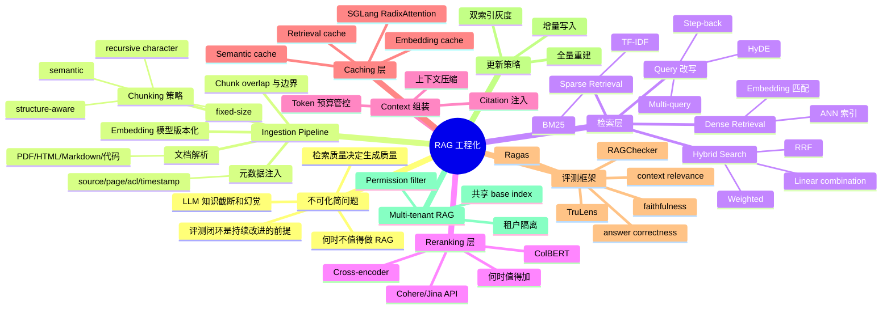
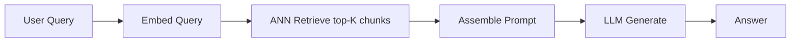
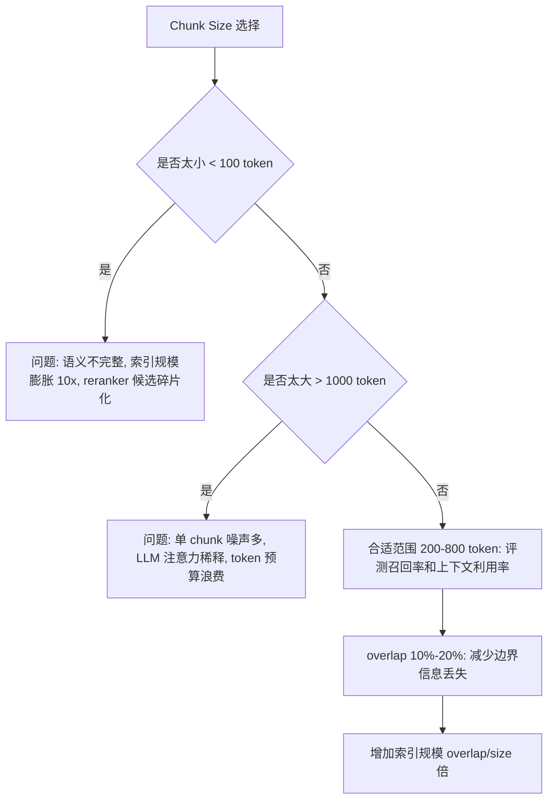
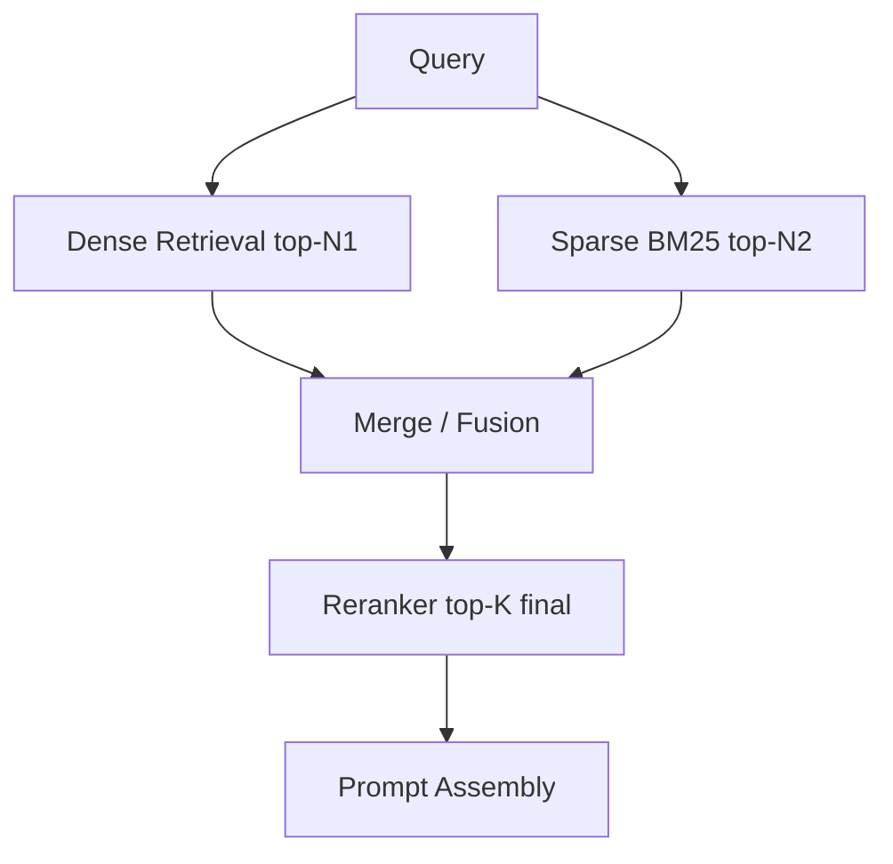
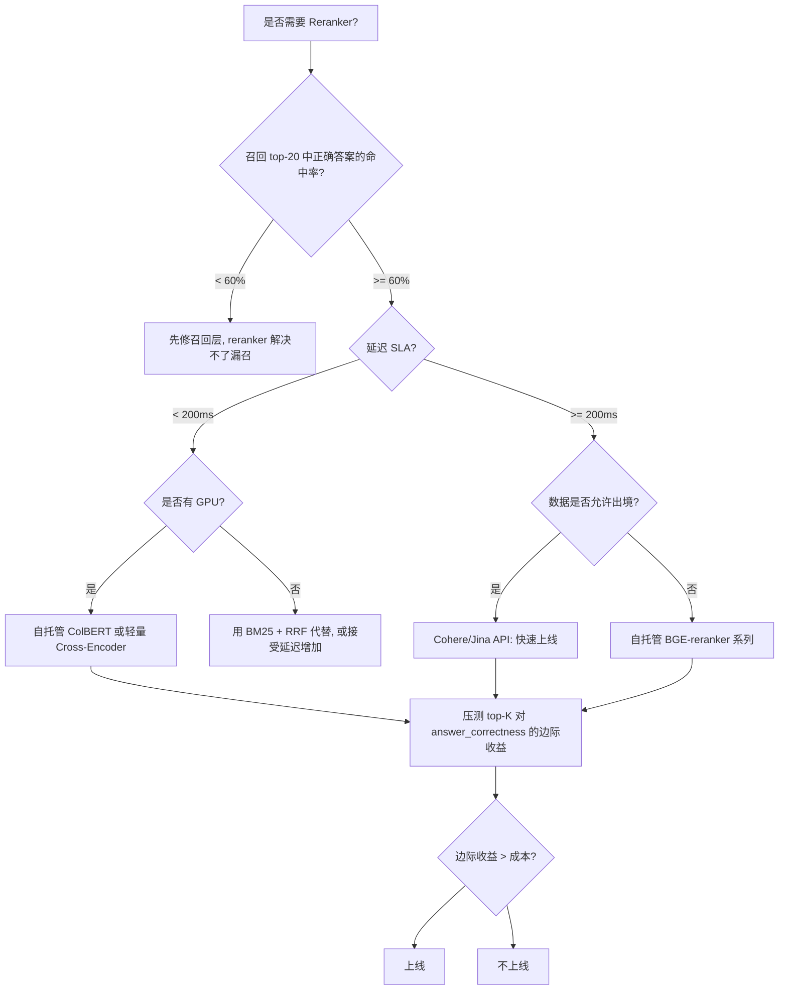
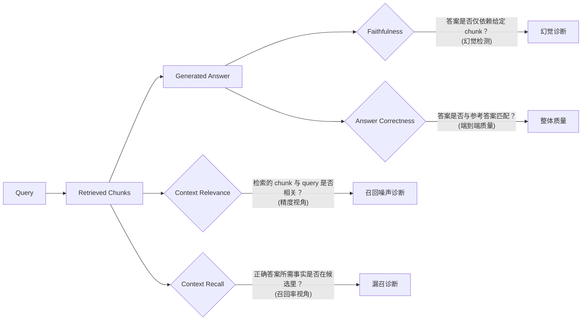
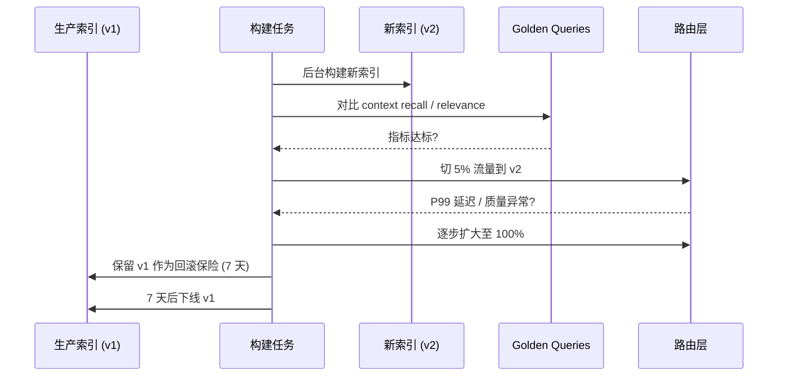

# 第 13d 章 · RAG 工程化

> RAG（Retrieval-Augmented Generation）不是"把向量库接进 prompt"这么简单。它是检索系统、推理系统和评测系统的混合工程——每个子系统都有自己的瓶颈直觉和失败模式，三者的版本边界不对齐就足以让上线效果与离线评测完全脱节。

> **关联章节**：本章是 [第 13 章](13-feature-vector-and-cache.md) 的工程化纵深，延续向量索引、chunking 与缓存的设计原则；与 [第 16b 章](../part5-serving-infra/16b-sglang-internals.md) 的 SGLang RadixAttention prefix 复用协同；与 [第 11e 章](11e-data-versioning-and-lineage.md) 的数据版本管理联动。

---

## 13d.1 第一性原理拆解 + 学习大纲

### 拆 — 不可化简的问题

剥掉 LangChain、LlamaIndex、Weaviate、FAISS、Cohere Rerank、Ragas 这些工具名，RAG 工程面对的不可化简问题只有两条，且它们相互咬合：

**第一条：LLM 的知识截断和幻觉无法在模型内部消除，必须靠检索把外部事实注入到每次推理的上下文里。** 但这带来了一个不对称：注入的上下文质量直接决定生成质量，而上下文质量取决于整条检索管线——chunk 边界、embedding 模型、ANN 索引、混合检索权重、reranker——中最弱的那个环节。模型本身很强，检索管线很烂，最终输出也会烂。模型不需要变大；检索管线需要被当成一等公民对待。

**第二条：检索的代价（latency、token cost、infra 复杂度）和检索的收益（召回率、答案质量）之间存在真实的工程权衡，不是所有场景都值得做 RAG。** 当文档集极小（几十页以内）、知识变化极慢、模型上下文窗口足够大时，把全部文档塞进 system prompt 往往比 RAG 更简单且更准。当需要复杂多步推理（例如数学推导、代码综合）时，RAG 注入的离散 chunk 甚至会干扰 LLM 的推理链。反过来，当文档集超过模型上下文窗口（哪怕是 1M token 的长上下文模型也有成本上限），当知识每天更新，当需要精确溯源，RAG 就是不可绕过的路径。

这两条的合并意味着：一个可运营的 RAG 系统必须同时回答三个层次的问题——

1. **检索层**：怎样从海量文档里高置信度地找到与当前 query 最相关的证据？（召回率、精度、延迟）
2. **生成层**：怎样把检索到的 chunk 组装成 prompt，使 LLM 在给定上下文里正确、忠实地回答？（上下文质量、token 预算、幻觉率）
3. **评测层**：怎样持续测量系统在以上两个层次上的表现，使得每一次迭代都有数字支撑，而不是靠人工感受？（自动化评测、黄金集、regression gate）

这三层都不能委托给另一层。把弱召回的责任推给 reranker、把 reranker 失败的责任推给 LLM、把 LLM 幻觉的责任推给"这个问题太难"——这是 RAG 工程的最常见失败模式。

### 推 — 从这个问题如何推导出每个机制

**从"需要检索"推导出 chunking**。文档通常比 LLM 上下文窗口小一个数量级，但比单次向量化的有效粒度大一个数量级：整篇 10 万 token 的文档既无法整体做语义检索（ANN 索引需要固定维度的向量，整篇 embedding 会丢失细节），也不能整体塞进 prompt（token 预算不够，相关性太分散）。于是必须切分。切分的粒度（chunk size）和切分方式（fixed、recursive、semantic、structure-aware）直接决定召回粒度和上下文质量，所以它不能是 ingestion 脚本里的隐式参数，必须成为版本化配置。

**从"单一检索不够"推导出混合检索**。Dense retrieval（embedding + ANN）对语义相似性敏感，但对精确关键词（产品型号、人名、缩写、代码 snippet）召回率差。Sparse retrieval（BM25）对精确关键词极好，但对同义词和换说法无感。没有单一方法能在所有 query 类型上最好，所以需要把两路并联，再用 RRF 或加权融合做召回合并。

**从"召回到的候选不能直接用"推导出 reranking**。ANN + BM25 的召回阶段追求高召回率（宁可多召也不漏），候选集 top-50 甚至 top-200 里有大量仅仅相关但不精准的 chunk。Cross-encoder 或 ColBERT 这类 reranker 能对 query 和每个候选做更深的语义匹配，把真正有用的 chunk 排到最前面。代价是 reranker 只能在候选集内精排，它不能扩大召回范围；如果召回阶段漏掉了正确 chunk，reranker 无能为力。

**从"固定 query 召回率有上限"推导出 query 改写**。用户输入的 query 可能是口语化的、不完整的、有歧义的。LLM 改写（multi-query、HyDE、step-back prompting）能生成多个视角的 query，分别召回，再合并去重，显著提升召回率——尤其是在文档语言与用户语言有风格差异时。代价是每次改写都要调用 LLM，增加延迟和成本，需要在实际流量下评估是否值得。

**从"注入 chunk 数量有限"推导出上下文压缩**。LLM 的上下文窗口有成本（token 定价）和质量（注意力稀释，长尾内容被忽视）双重约束。从 top-20 候选中选最相关的 top-5，或者对冗余 chunk 做 map-reduce 摘要，能在保留核心信息的同时降低 token 消耗。代价是压缩本身可能丢失细节，需要 eval 指标支撑。

**从"答案需要可追溯"推导出 citation**。生产级 RAG 系统不能只输出答案，必须输出"这句话依据哪个 chunk、哪个文档"。这要求把 source 元数据随 chunk 一起存入向量库，在生成时指示 LLM 标注引用，并在验证阶段检查引用是否真实存在于对应 chunk。

**从"系统需要持续改进"推导出评测框架**。没有自动化评测，每次改动 chunk 策略、embedding 模型、reranker 都是盲目的。Ragas、TruLens 等框架定义了 context relevance（召回的 chunk 是否和 query 相关）、context recall（正确答案所需的事实是否在召回 chunk 里）、faithfulness（生成答案是否仅依赖给定 chunk）、answer correctness（生成答案是否与参考答案匹配）四类核心指标，把 RAG 质量从"人工感受"变成可回归的数字。

**从"系统上线后文档会变"推导出更新策略**。新文档增量写入、旧文档删除 tombstone、元数据更新可以走增量路径；但 embedding 模型升级、chunk 规则改变、距离度量变化必须走全量重建，因为向量空间已经改变，混合新旧向量的索引是不可解释的。

**从"成本压力"推导出缓存层设计**。RAG 的主要成本是 LLM prefill token（把检索到的 chunk 塞进 prompt 的代价），其次是 embedding API 调用和 reranker 调用。Semantic cache 对语义相似的 query 命中同一个缓存条目（不需要精确字符串匹配），可以大幅减少 LLM 调用；SGLang RadixAttention 对共享长公共前缀的请求复用 KV Cache，能把相同 system prompt + RAG 模板的 prefill 成本降到接近零。

### 绘 — 因果链路



### 导 — 读完本章你应该能回答

1. 朴素 RAG（query → embed → retrieve → rerank → 生成）的每个步骤分别受什么因素制约？哪个环节是最常见的质量瓶颈？
2. 为什么 chunk size 和 overlap 不能只靠经验决定，需要哪些 eval 指标才能做出有依据的选择？
3. Hybrid retrieval（RRF、weighted、linear combination）各自在什么 query 分布下比 dense-only 或 sparse-only 更好？
4. Cross-encoder reranker 相比 bi-encoder ANN 在什么场景下显著有效，在什么场景下 cost 大于 gain？
5. Context relevance、context recall、faithfulness、answer correctness 四个评测维度分别测量什么，为什么缺任何一个都会导致评测失真？
6. 当 embedding 模型升级或 chunk 规则改变时，为什么不能只做增量更新，必须全量重建？
7. RAG 系统的主要 token 成本在哪里，semantic cache 和 SGLang RadixAttention prefix 复用各自能在哪个层次降低这个成本？

---

## 13d.2 朴素 RAG 流程与常见失败点

最简单的 RAG 流程只有五步：



每一步都有自己的失败模式，且失败会向下游放大：

| 步骤 | 常见失败 | 典型表现 | 根因 |
|------|----------|----------|------|
| Embed Query | Embedding 模型与文档语言风格不匹配 | 相关文档排在后 50 名之外 | 模型在领域外语料上训练不足 |
| ANN Retrieve | topK 太小、chunk 太碎 | 正确答案的句子被截断在候选集之外 | chunk size < 语义完整单元 |
| Assemble Prompt | 无 rerank、噪声 chunk 靠前 | LLM 用错误事实回答 | 召回精度不足，依赖模型自己过滤 |
| LLM Generate | 上下文与 query 不一致但 LLM 仍生成答案 | 幻觉但听起来有依据 | 缺 faithfulness 约束 |
| 全链路 | 无 eval 闭环 | 只在上线时感知质量下降 | 缺自动化评测 |

> **不可化简的工程边界**：朴素 RAG 的最大问题不是某一步做得不够好，而是每步都只有"输入 → 输出"，没有"输出 → 评分 → 反馈"。在生产环境里，没有 eval 的 RAG 是一个会随时漂移的黑盒。

### 何时不值得做 RAG

不是所有场景都需要 RAG。以下场景建议先评估替代方案：

| 场景 | 替代方案 | 判断依据 |
|------|----------|----------|
| 文档总量 < 50 页，更新 < 月 | 全部放入 system prompt | token 成本低于 RAG infra 成本 |
| 需要复杂多步推理（数学、代码综合） | 纯 chain-of-thought，不注入外部文档 | 离散 chunk 会打断 LLM 推理链 |
| 长上下文模型够用（文档总量 < 200K token） | Gemini 1.5 / Claude 3.7 长上下文 | 先测长上下文基线再引入 RAG 复杂度 |
| 知识极为稳定，query 形式固定 | Fine-tuning + 内化知识 | 检索 latency 是主要成本 |

> **工程边界**：RAG 引入的复杂度（ingestion pipeline、向量库运维、eval 框架、cache 设计）都有固定成本。当文档集合小于阈值或 LLM 上下文窗口足够大时，这个固定成本往往超过 RAG 带来的质量收益。

---

## 13d.3 Chunking 策略深度

Chunking 是 RAG 的根基。chunk 策略错误，后面所有优化都是在沙地上建楼。

### 主要策略对比

| 策略 | 原理 | 典型参数 | 优势 | 风险 | 适用场景 |
|------|------|----------|------|------|----------|
| Fixed-size | 按固定 token 数切分，不考虑语义边界 | size=512, overlap=64 | 实现简单，索引规模可预测，吞吐稳定 | 截断语义单元，上下文不完整 | 早期原型，结构松散纯文本 |
| Recursive Character | 按段落→句子→词序列递归切，保留结构边界 | size=400, overlap=50 | 比 fixed 更贴近自然边界，实现仍简单 | 短段落碎片噪声多 | 通用 markdown/txt 文档 |
| Semantic | 用 embedding 相似度检测话题边界，在相似度骤降处切分 | threshold=0.85 | 话题完整性好，边界自然 | 构建成本高，threshold 需调，切分不稳定 | 高质量知识库，长报告 |
| Structure-Aware (Markdown) | 按 heading 层级切，每个 chunk 带完整 heading 路径 | heading_level=h2 | 召回到的 chunk 有完整章节上下文 | 不同文档格式差异大 | 结构化 Markdown 文档库 |
| Structure-Aware (PDF) | 按段落/表格/图片框切，保留 page/section 元数据 | min_chars=200 | 保留版式语义 | 解析质量强依赖 PDF 库 | 企业 PDF 文档库 |
| Code-Aware | 按函数/类/模块边界切，保留语法完整性 | unit=function | 代码语义完整 | 需要 AST 解析 | 代码库 RAG |

### Chunk Size 与召回率关系

chunk 大小不是越小越好，也不是越大越好，是一个真实的权衡：



**工程建议**：先用 300-600 token + 10% overlap 建基线；用 context recall 和 context relevance 两个指标同时看，chunk 太小时 context recall 好（覆盖全面）但 context relevance 差（每个 chunk 信息太零散），chunk 太大时反过来。

### 元数据策略

元数据是 RAG 的"免费增强"，应当在 ingestion 时注入，不做会在排查时后悔：

```yaml
chunk_metadata:
  source_url: "https://internal-wiki/page/42"
  page: 3
  section: "§2.3 部署配置"
  heading_path: ["产品手册", "部署指南", "网络配置"]
  acl: ["group:sre", "group:platform"]
  doc_version: "v2.1.0"
  updated_at: "2026-04-15T09:00:00Z"
  ingestion_job_id: "ingest-20260415-007"
  chunk_policy_version: "title-paragraph-v3"
```

ACL 字段必须在 ingestion 时写入，并在检索时做 pre-filter（不是 post-filter），否则向量库会把无权限的 chunk 返回给 reranker，即使最终答案不包含这些 chunk，也已经消耗了 reranker 计算资源，且存在边界泄露风险。

---

## 13d.4 检索策略：Dense、Sparse 与 Hybrid

### Dense Retrieval

用 embedding 模型把 query 和所有 chunk 映射到同一向量空间，用 ANN（HNSW / IVF）做近邻搜索。

优势：语义理解强，能召回与 query 意思相同但措辞完全不同的 chunk。

边界：对精确关键词（产品型号 "RTX 4090"、内部代号"Project-X"、数字"42.7%"）敏感度低；embedding 模型在领域外语料表现差。

### Sparse Retrieval (BM25)

基于词频和逆文档频率的稀疏匹配，无需 embedding 模型。

优势：对精确关键词极好；不依赖 GPU；可以用 Elasticsearch/OpenSearch 现成部署。

边界：无语义理解，换个说法就找不到；中文分词质量影响结果。

### Hybrid Retrieval 策略对比



| 融合方法 | 原理 | 优势 | 适用 |
|----------|------|------|------|
| RRF (Reciprocal Rank Fusion) | `score = Σ 1/(k + rank_i)`，k 通常取 60 | 对两路排名都不太好时最稳健，无需调参 | 默认首选 |
| Weighted Sum | `α × dense_score + (1-α) × sparse_score` | 可以针对 query 类型调 α | 需要 eval 数据集调参 |
| Linear Combination + Normalize | 归一化后线性加权 | 分数绝对值有意义时更准 | 有标注数据时精调 |
| Cascade | 先 sparse 粗筛，再 dense 精排 | 节省 embedding 计算 | 稀疏召回质量已经足够高 |

**RRF 是工程上的默认选择**，因为它对两路的绝对分数无要求（dense 和 sparse 的分数范围完全不同），只看排名，不需要标注数据调权重。在有足够评测数据后再考虑 weighted sum。

---

## 13d.5 Query 改写：Multi-Query、HyDE、Step-Back

当用户 query 本身质量差（口语化、歧义、领域外词汇），或文档表达与用户语言风格差异大时，单次 embedding 的召回率有上限。Query 改写用 LLM 生成多视角 query，分别召回后合并去重。

### Multi-Query

```python
# 用 LLM 生成 3-5 个改写 query
rewrites = llm.generate(
    f"为下面的问题生成 4 个语义等价但措辞不同的搜索 query:\n{original_query}"
)
# 分别召回
all_chunks = []
for q in [original_query] + rewrites:
    chunks = vector_store.search(embed(q), top_k=10)
    all_chunks.extend(chunks)
# 去重后 rerank
unique_chunks = deduplicate(all_chunks)
final_chunks = reranker.rank(original_query, unique_chunks)[:5]
```

代价：N 次 embedding 调用 + 1 次 LLM 改写调用。

### HyDE (Hypothetical Document Embeddings)

不改写 query，而是让 LLM 先生成一个"假设答案文档"，再用这个假设文档的 embedding 去检索真实文档。

```python
hypothetical_doc = llm.generate(
    f"请写一段简短的文档，回答：{query}（即使不确定也请尽力写）"
)
retrieved = vector_store.search(embed(hypothetical_doc), top_k=20)
```

HyDE 的核心假设：答案文档的 embedding 比 query embedding 更接近真实答案文档的 embedding。在领域专业知识场景（法律、医学、技术文档）效果通常优于直接 embed query。

边界：LLM 生成的假设文档如果包含幻觉，会拉偏 embedding 方向，召回到错误文档。

### Step-Back Prompting

先让 LLM 生成一个比 query 更抽象的"背景问题"，检索这个背景问题，把背景 chunk + 原始 query 一起交给 LLM 回答。

| 方法 | 额外 LLM 调用 | 延迟增加 | 适用场景 |
|------|-------------|----------|----------|
| Multi-Query | 1 次（改写）| +200-500ms | 用户 query 语言风格多样 |
| HyDE | 1 次（生成假设文档）| +300-800ms | 领域专业文档，query 很短 |
| Step-Back | 1 次（生成背景问题）| +300-600ms | 需要宏观背景再回答细节 |
| 无改写 | 0 | 0 | query 质量高，延迟敏感 |

> **工程边界**：query 改写的收益必须用 context recall 指标量化验证，不能只凭直觉上线。每次改写都增加一次 LLM 调用成本，对延迟敏感的场景（< 500ms SLA）慎用。

---

## 13d.6 Reranking：何时值得，如何选型

Reranker 是 RAG 管线里"性价比最高的质量提升点"，但不是无成本的。

### Reranker 选型对比

| 类型 | 代表实现 | 原理 | 延迟（top-20 候选） | 优势 | 限制 |
|------|----------|------|---------------------|------|------|
| Cross-Encoder | BGE-reranker-large | 拼接 [query, chunk] 过完整 Transformer | 50-200ms（GPU） | 最准，直接建模 query-chunk 交互 | 延迟高，不能做 ANN 预索引 |
| ColBERT | ColBERT-v2 | Late interaction: 分别 embed 再 MaxSim | 20-80ms（GPU） | 准确度接近 Cross-Encoder，更快 | 需要特殊索引结构 |
| Cohere Rerank API | Cohere Rerank v3 | 云端 Cross-Encoder | API call 100-400ms | 无需部署，效果好 | 数据出境、成本按调用计 |
| Jina Rerank API | jina-reranker-v2 | 云端 | API call 100-300ms | 支持多语言 | 同上 |
| BM25 作为第二路 | 无独立 reranker | RRF 融合 | 0（已在召回阶段完成） | 零额外成本 | 不是真正 reranker，精度有限 |



> **工程边界**：Reranker 只在候选集内精排，不能弥补召回层的漏召。在加 reranker 之前，先确认 context recall >= 70%（即正确答案所需的事实片段在 top-K 候选里出现的概率）。否则 reranker 是在错误的候选集上排序，浪费计算。

---

## 13d.7 上下文压缩与 Citation 溯源

### 上下文压缩

当 top-K reranked chunks 总 token 数超过 LLM 上下文预算，或存在大量冗余时，需要压缩。

| 压缩方法 | 原理 | 适用 | 代价 |
|----------|------|------|------|
| 选择最相关 chunk | 按 reranker 分数取 top-N（N < K） | 简单，延迟低 | 可能丢失分散在不同 chunk 的事实 |
| Sentence-level 过滤 | 对每个 chunk 中的句子打相关分，只保留高分句 | 精细控制 token | 需要额外 scoring 模型 |
| Map-Reduce 摘要 | 对每个 chunk 分别生成摘要，合并后送 LLM | 长文档 RAG | 额外 LLM 调用，摘要可能丢细节 |
| Reranker 分数阈值 | 只保留分数 > threshold 的 chunk | 自适应 | threshold 需要基于 eval 校准 |

### Citation 溯源

生产级 RAG 必须把每句话映射回 source chunk：

```python
system_prompt = """
请根据以下检索到的文档片段回答用户问题。
对于你答案中的每个关键事实，请用 [来源:N] 标注对应的文档片段编号。
如果检索文档中没有相关信息，请明确说明。

文档片段：
[1] {chunk_1_text} (来源: {chunk_1_source}, 第{chunk_1_page}页)
[2] {chunk_2_text} (来源: {chunk_2_source}, 第{chunk_2_page}页)
...
"""
```

Citation 验证：生成后自动检查 `[来源:N]` 标注的事实是否真实存在于对应 chunk，检测"引用幻觉"（LLM 声称来自某 chunk 但实际该 chunk 没有对应内容）。

> **工程边界**：Citation 功能需要在 eval 中专门测"引用准确率"（citation accuracy）。约 15-30% 的 LLM 会产生引用幻觉——声称某事实来自某 chunk，但该 chunk 实际不包含该事实。不检测这个指标，用户会误信不存在的依据。

---

## 13d.8 评测框架

RAG 的评测不能只看答案对不对。需要分层测量，找到每个层次的瓶颈。

### 四个核心指标



| 指标 | 测量什么 | 如何计算 | 低分说明什么 |
|------|----------|----------|-------------|
| Context Relevance | 召回 chunk 与 query 的相关度 | LLM-as-judge 或 embedding similarity | 召回噪声多，chunk 太大或 ANN 参数不当 |
| Context Recall | 参考答案所需事实是否在召回 chunk 中 | 需要参考答案 + LLM 提取事实点 | 漏召，topK 太小或 chunk 太碎 |
| Faithfulness | 生成答案是否忠实于 chunk（不幻觉） | LLM 逐句验证是否有 chunk 依据 | LLM 幻觉，或 chunk 没有足够信息 |
| Answer Correctness | 生成答案与参考答案的语义匹配度 | 语义相似度 + 事实点 F1 | 端到端质量差，需要分解排查 |

### 评测框架对比

| 框架 | 核心能力 | 优势 | 边界 |
|------|----------|------|------|
| Ragas | Context Relevance/Recall, Faithfulness, Answer Correctness | 开箱即用，指标定义清晰，支持无参考答案评测 | 依赖 LLM-as-judge，成本随语料规模线性增长 |
| TruLens | RAG Triad（Answer Relevance, Context Relevance, Groundedness） | 有 UI，支持追踪每次 RAG 调用 | 指标定义与 Ragas 略有差异，需要统一对齐 |
| RAGChecker | 细粒度事实核查 | 事实点级别的 precision/recall | 需要参考答案，配置复杂 |
| ARES | 自动生成合成测试集 + 评测 | 减少人工标注量 | 合成数据质量影响评测可信度 |
| 自建 eval | 基于业务 golden 问答集 | 最贴近真实场景 | 需要持续维护 golden 集 |

> **工程建议**：推荐同时运行 Ragas（快速迭代，无参考答案版本）+ 自建 golden 集（业务对齐，有参考答案）。纯用 LLM-as-judge 会有评测成本，建议只在 CI 触发关键变更时跑全量评测，日常开发用 golden 集的小规模抽样。

### Golden 集维护

Golden 集是 RAG 评测的基础设施：

```python
# golden 集条目结构
{
  "query": "H100 在 FP16 矩阵乘法的峰值算力是多少？",
  "reference_answer": "H100 SXM5 在 FP16 矩阵乘法的峰值算力为 989 TFLOPS。",
  "reference_chunks": [
    {"doc_id": "nvidia-h100-datasheet-2024", "page": 4, "text_snippet": "..."}
  ],
  "metadata": {"difficulty": "factual", "domain": "hardware_spec", "created": "2026-01-15"}
}
```

Golden 集要定期审计：当知识库更新、文档版本变化时，参考答案和参考 chunk 也需要同步更新，否则评测分数的下降可能来自 golden 集过期而非系统退步。

---

## 13d.9 增量更新 vs 全量重建

联动 [第 11e 章](11e-data-versioning-and-lineage.md) 的数据版本管理，RAG 的索引更新策略必须与数据变更类型绑定：

| 变更类型 | 推荐策略 | 理由 | 注意事项 |
|----------|----------|------|----------|
| 新增少量文档（< 1% 总量） | 增量写入 | 不影响现有向量，成本低 | 需要幂等写入，避免重复 chunk |
| 删除文档 | 增量 tombstone + 物理删除 | 立即生效比等重建更安全 | 必须同时失效 retrieval cache |
| 元数据/ACL 更新 | 立即增量更新 filter 字段 | 权限变更不能等重建 | 按安全事件优先级处理，cache 立即失效 |
| Embedding 模型升级 | 全量重建 | 向量空间整体变化，新旧向量不可比较 | 双索引灰度，golden queries 回归 |
| Chunk 规则变更 | 全量重建 | 文档边界变化影响全部召回 | 旧 chunk 的 retrieval cache 完全作废 |
| 大规模脏数据修复（> 10%） | 全量重建 | 增量修补留下不可解释的混合索引 | 修复前先在测试集上验证清洗效果 |
| 索引算法/距离度量变更 | 全量重建 | 索引结构和排序含义完全变化 | 先离线对比 golden queries 的 recall 变化 |

### 双索引灰度切换



---

## 13d.10 Multi-Tenant RAG 与权限过滤

企业 RAG 的权限问题比单用户 RAG 复杂一个数量级，但容易被工程师忽视到上线后才发现泄露：

### 三种隔离模式

| 模式 | 实现 | 隔离强度 | 适用 |
|------|------|----------|------|
| 完全隔离 | 每个租户独立向量库实例 | 最强 | 极高安全要求，租户数 < 100 |
| 共享库 + metadata filter | 单个向量库，ACL 字段做 pre-filter | 中等 | 大多数企业场景，需严格测试 filter 逻辑 |
| 共享 base index + 租户扩展 | 公共文档共享，私有文档隔离 | 分层 | 大量公共内容 + 少量私有 |

### Pre-filter vs Post-filter

Pre-filter（在 ANN 搜索时过滤）是正确做法：

```python
# 正确：pre-filter，只在有权限的文档中搜索
results = vector_store.search(
    query_embedding,
    top_k=20,
    filter={"acl": {"$in": user.groups}, "tenant_id": user.tenant_id}
)

# 错误：post-filter，先召回再过滤
results = vector_store.search(query_embedding, top_k=100)
results = [r for r in results if user.has_access(r.doc_id)]  # 可能让无权限文档参与 ANN 计算
```

Post-filter 的问题：向量库内部的 ANN 计算已经看到了无权限文档，即使最终过滤掉，也可能通过 ANN 图结构影响其他文档的召回排名（取决于具体实现）。此外，post-filter 会导致实际召回数量远小于 top_k，在权限复杂场景下 top-20 可能过滤后只剩 3 个。

> **工程边界**：对 permission filter 做专项压测：针对高选择性过滤（只有 5% 的文档有权限），确认召回数量和延迟是否仍满足 SLA。Pre-filter 在高选择性场景下会有 ANN 召回率下降的风险，需要调大 topK 参数补偿。

---

## 13d.11 成本控制：Token 预算、Semantic Cache 与 Prefix 复用

### RAG 成本构成

LLM token 成本是 RAG 的主要支出，且被 chunk 数量线性放大：

| 成本来源 | 占比（典型 RAG） | 控制手段 |
|----------|-----------------|----------|
| LLM prefill tokens（检索 chunk 注入 prompt） | 60-80% | 减少 chunk 数量、压缩上下文、semantic cache |
| LLM decode tokens（生成答案） | 5-15% | 限制 max_tokens，summary 代替全文 |
| Embedding API 调用（query embed） | 3-8% | Embedding cache（相同 query 不重复算）|
| Reranker API 调用 | 5-15% | 只在必要时开 reranker，本地化部署 |
| 向量库计算（ANN） | 2-5% | 通常可忽略，除非超高 QPS |

### Semantic Cache

Semantic cache 对语义相似（但字面不同）的 query 命中同一缓存条目，避免重复 RAG + LLM 调用：

```python
# Semantic cache 实现骨架
def semantic_cache_lookup(query, threshold=0.92):
    query_emb = embed(query)
    # 在 cache index 中搜索最相似的历史 query
    results = cache_index.search(query_emb, top_k=1)
    if results and results[0].score >= threshold:
        return cache_store.get(results[0].query_id)
    return None  # 缓存未命中

def rag_with_cache(query):
    cached = semantic_cache_lookup(query)
    if cached:
        return cached
    answer = full_rag_pipeline(query)
    cache_store.set(embed(query), query, answer, ttl=3600)
    return answer
```

Cache key 设计要点：

- 必须包含用户权限上下文（不同权限的用户不能共享同一缓存条目）
- 必须包含索引版本（索引更新后旧缓存作废）
- TTL 设置与知识库更新频率匹配（每日更新的知识库 TTL 不超过 24 小时）

### SGLang RadixAttention 与 RAG 的协同

[第 16b 章](../part5-serving-infra/16b-sglang-internals.md) 的 RadixAttention 对 RAG 场景有直接收益：当多个请求共享相同的 system prompt + RAG 模板（约几百到上千 token），SGLang 只 prefill 一次，后续请求直接复用 KV Cache。

典型 RAG prompt 结构：

```
[system prompt: 角色定义 ~200 token]  ← 高度共享，RadixAttention 永久缓存
[RAG 指令模板 ~100 token]              ← 高度共享
[检索到的 chunk 1 ~500 token]          ← 每次不同，不共享
[检索到的 chunk 2 ~500 token]          ← 每次不同，不共享
[用户 query ~50 token]                 ← 每次不同
```

即使检索到的 chunk 每次不同，共享的 system prompt + 模板部分（~300 token）仍可以被 RadixAttention 缓存，在高并发场景下能减少 15-30% 的 prefill 计算。

> **工程边界**：RadixAttention 的收益仅在 system prompt 和 RAG 模板稳定时有效。如果把检索结果注入 system prompt（而非 user message），会破坏 prefix 共享，让 RadixAttention 完全失效。设计 prompt 模板时应让可共享的部分（system prompt、指令）与每次变化的部分（检索 chunk、用户 query）严格分开。

---

## 13d.12 反模式 Checklist

| 反模式 | 现象 | 修复方向 |
|--------|------|----------|
| Chunk 太小（< 100 token） | 答案引用的信息分散在 5+ chunk，LLM 无法整合 | 增大 chunk size，检查 context recall |
| Chunk 太大（> 1200 token） | 召回到的 chunk 大量无关内容，LLM 注意力稀释 | 减小 chunk size，检查 context relevance |
| 只用 dense retrieval | 精确产品型号/代号无法召回 | 加 BM25 sparse retrieval，用 RRF 融合 |
| 不做 reranking 直接喂 LLM | 第 2-20 名的 chunk 排序是 ANN 相似度，不是 query 相关性 | 加 cross-encoder 或 ColBERT reranker |
| Post-filter 权限 | 无权限文档参与 ANN 计算，过滤后有效候选不足 | 改为 ANN pre-filter |
| 不做 eval 就改参数 | 每次改动都靠人工感受质量，无法可靠迭代 | 建 golden 集，接入 Ragas/TruLens |
| Cache key 不含权限 | A 用户的答案被 B 用户命中 | Cache key 必须含 tenant_id 和 ACL |
| 把检索结果注入 system prompt | 破坏 prefix 共享，prefix cache 完全失效 | 检索 chunk 放 user message，system prompt 保持稳定 |
| 全量重建时覆盖生产索引 | 重建失败导致生产检索降级 | 双索引灰度，golden queries 通过后再切 |
| Query 改写不做 A/B 验证 | 改写可能引入噪声，实际使 recall 下降 | 用 context recall 指标对比改写前后 |

---

## 13d.13 Worked Example：100GB 企业内部文档 RAG 系统

### 场景设定

| 维度 | 取值 |
|------|------|
| 文档规模 | 100GB 原始文档（约 200 万页 PDF/Word/Markdown/Wiki） |
| 语言 | 中英文混合 |
| 更新频率 | 每日增量更新约 5000 页，每月大版本更新 |
| 租户 | 500 个部门，每个部门有独立 ACL |
| QPS | 高峰 500 QPS |
| 延迟 SLA | P50 < 800ms，P99 < 3s |
| LLM | 自托管 Llama-3-70B，vLLM 服务 |

### 阶段一：Chunking 决策

**文档分类**：

| 文档类型 | 比例 | 推荐 Chunking 方案 |
|----------|------|-------------------|
| 技术手册 PDF | 35% | Structure-Aware，按段落+表格，size=400 token，overlap=60 |
| Wiki/Markdown | 30% | Recursive Character by heading，size=500 token，overlap=75 |
| 会议纪要 Word | 20% | Recursive Character，size=300 token，overlap=45 |
| 代码文档 | 10% | Code-Aware，按函数/类，无固定 size |
| 其他（PPT、邮件）| 5% | Fixed-size 降级，size=400 token |

**索引规模估算**：

```
200 万页 × 平均 3 chunk/页 = 600 万 chunk
× 平均 450 token/chunk = 27 亿 token 文本
Embedding 维度 768d，float16 = 1536 byte/向量
600 万 × 1536 = 9.2 GB 向量数据
HNSW 内存开销约 2-3x = 20-28 GB 向量索引内存
```

选型：Qdrant（支持 ACL pre-filter，分片部署，支持 HNSW + payload filter）。

### 阶段二：Hybrid Retrieval 配置

```yaml
retrieval:
  dense:
    model: bge-large-zh-v1.5  # 中英双语 embedding
    top_k: 50
    index: HNSW (m=32, ef_construction=200, ef_search=100)
  sparse:
    method: BM25
    top_k: 50
    tokenizer: jieba (中文) + whitespace (英文)
  fusion:
    method: RRF
    k: 60
    output_top_k: 30  # 送入 reranker 的候选数
  pre_filter:
    fields: [tenant_id, acl_groups, is_deleted]
```

### 阶段三：Reranking 策略

基于延迟 SLA（P99 < 3s）和 GPU 资源：

```yaml
reranker:
  model: bge-reranker-large  # 自托管，768M 参数
  deployment: 4 × A10G GPU (2 instance, 2 GPU each)
  input_top_k: 30
  output_top_k: 5
  timeout: 500ms  # 超时降级为 RRF 结果
  batch_size: 16  # 每次 rerank 最多 16 个候选
```

预估延迟分解：

| 步骤 | P50 | P99 |
|------|-----|-----|
| Query embed | 20ms | 50ms |
| ANN search (dense) | 30ms | 80ms |
| BM25 search | 10ms | 30ms |
| RRF fusion | 5ms | 10ms |
| Reranker | 80ms | 200ms |
| LLM prefill+decode | 400ms | 1500ms |
| **端到端** | **545ms** | **1870ms** |

满足 P50 < 800ms，P99 < 3s。

### 阶段四：Eval 指标与 CI Gate

```yaml
eval_gates:
  # CI 每次推送必须通过
  context_relevance: >= 0.75
  context_recall: >= 0.70
  faithfulness: >= 0.85
  # 周度回归
  answer_correctness: >= 0.72
  citation_accuracy: >= 0.90
  # 性能
  p99_latency_ms: <= 3000
  retrieval_p99_ms: <= 350
```

### 阶段五：Caching Layer

```yaml
caching:
  semantic_cache:
    backend: Redis + Qdrant (cache index)
    similarity_threshold: 0.93
    ttl_seconds: 7200  # 2 小时，知识库每日更新
    key_includes: [tenant_id, user_acl_hash, index_version]
  embedding_cache:
    backend: Redis
    ttl_seconds: 86400  # 24 小时
    key: sha256(text + model_version + preprocess_version)
  retrieval_cache:
    backend: Redis
    ttl_seconds: 3600
    key: sha256(query_text + filter_hash + index_version + top_k)
```

### 阶段六：与 vLLM 集成 + Prefix Cache

```python
# RAG prompt 结构（设计为最大化 prefix cache 命中率）
def build_prompt(query, chunks, system_prompt):
    # system_prompt 固定，约 200 token，跨请求共享
    # 不把检索结果放 system_prompt，保持 prefix 稳定
    messages = [
        {"role": "system", "content": system_prompt},  # 稳定前缀
        {"role": "user", "content": f"""
请根据以下文档片段回答问题。对每个关键事实注明 [来源:N]。

{format_chunks(chunks)}

问题：{query}
"""}  # 变化部分
    ]
    return messages

# vLLM 配置开启 prefix caching
vllm_server_args = {
    "enable_prefix_caching": True,
    "max_num_batched_tokens": 4096,
    "kv_cache_dtype": "fp8",  # 减少 KV 显存，容纳更多 cached prefix
}
```

### 全量重建流程

当 embedding 模型升级或 chunk 规则变化时：

```bash
# 1. 触发后台全量重建任务（不影响生产）
python rebuild_index.py \
  --source-bucket s3://docs-raw/ \
  --target-index qdrant-v2 \
  --chunk-policy title-paragraph-v4 \
  --embedding-model bge-m3 \
  --workers 64 \
  --dry-run false

# 2. 自动触发 golden queries 回归
python eval_index.py \
  --index qdrant-v2 \
  --golden-set golden-queries-v3.jsonl \
  --metrics context_recall,context_relevance,faithfulness \
  --baseline-index qdrant-v1

# 3. 如果指标达标，切 5% 流量
kubectl set env deployment/rag-router INDEX_VERSION=v2 INDEX_WEIGHT=0.05

# 4. 观察 48 小时后，切全量
kubectl set env deployment/rag-router INDEX_WEIGHT=1.0

# 5. 7 天后下线 v1
kubectl delete qdrant-collection qdrant-v1
```

---

## 练习

**13d-1（基础）**：解释为什么 chunk size 太小（< 100 token）和太大（> 1000 token）分别会损害 RAG 质量。各给出一个具体场景举例。

**13d-2（基础）**：RRF（Reciprocal Rank Fusion）为什么比直接对 dense 和 sparse 的分数做加权平均更鲁棒？给出 RRF 公式并解释 k 参数的作用。

**13d-3（基础）**：HyDE（Hypothetical Document Embeddings）的核心假设是什么？在什么情况下 HyDE 会比直接 embed query 效果更差？

**13d-4（基础）**：解释 context recall 和 context relevance 两个指标的区别。如果一个系统 context relevance 高但 context recall 低，最可能是哪个环节有问题？

**13d-5（进阶）**：设计一个实验，验证对某个 RAG 系统加入 cross-encoder reranker 是否"值得"。需要明确定义你的评测指标、基线、控制变量和判断阈值。

**13d-6（进阶）**：一个 RAG 系统 faithfulness 分数只有 0.55，表示大约 45% 的回答包含幻觉或无法在检索 chunk 中验证的内容。给出至少 3 个可能的根因和对应的排查步骤。

**13d-7（进阶）**：设计企业 RAG 系统的 semantic cache key 方案，使其满足：(1) 相同权限、相同 query 的用户共享缓存；(2) 权限不同的用户不共享；(3) 索引更新后自动失效。给出 key 的具体构成。

**13d-8（进阶）**：当 embedding 模型从 bge-large-zh-v1.5 升级到 bge-m3 时，为什么不能只对新增文档用新模型 embed，旧文档保持旧 embedding？给出完整理由并描述正确的升级流程。

**13d-9（设计）**：为 Worked Example 中的 100GB 企业 RAG 系统设计 multi-tenant 权限架构。500 个部门，部门间文档完全隔离，但有一批"公共文档"所有部门都可访问。给出向量库的 schema 设计、filter 逻辑、以及如何避免 post-filter 的召回不足问题。

**13d-10（设计）**：一家公司想在现有 LangChain + vLLM RAG 系统上增加 SGLang 来降低成本。分析哪些部分能从 SGLang RadixAttention 获益，哪些不能，并给出集成方案骨架（prompt 结构调整、服务路由设计）。

**13d-11（设计）**：为 RAG 系统设计一个最小可运行的 eval CI pipeline，要求：每次合并到 main 分支时自动运行；用 Ragas 计算 context_recall 和 faithfulness；当指标低于阈值时阻止合并；报告包含与上次合并的指标对比。给出 pipeline 配置骨架（GitHub Actions 或等价工具）。

**13d-12（开放）**：在你接触过的或文献中的 RAG 系统里，找到一个"反直觉的失败案例"：某个看起来应该有效的优化（比如加更多 chunk、用更强的 embedding 模型、加 query 改写）实际上让系统变得更差。分析可能的原因。

---

## 深度参考阅读

### RAG 基础论文

- Lewis, Patrick et al. "Retrieval-Augmented Generation for Knowledge-Intensive NLP Tasks." NeurIPS 2020. （RAG 原始论文）
- Shi, Weijia et al. "REPLUG: Retrieval-Augmented Language Model Pre-Training." ACL 2023.
- Ram, Ori et al. "In-Context Retrieval-Augmented Language Models." TACL 2023.
- Gao, Yunfan et al. "Retrieval-Augmented Generation for Large Language Models: A Survey." arXiv 2312.10997. （2024 综述，覆盖 naive RAG / advanced RAG / modular RAG）

### Query 改写与检索增强

- Gao, Luyu et al. "Precise Zero-Shot Dense Retrieval without Relevance Labels." ACL 2023. （HyDE 原始论文）
- Ma, Xinbei et al. "Query Rewriting in Retrieval-Augmented Large Language Models." EMNLP 2023.
- Zheng, Shen et al. "Take a Step Back: Evoking Reasoning via Abstraction in Large Language Models." ICLR 2024. （Step-Back Prompting）

### Reranking

- Khattab, Omar and Zaharia, Matei. "ColBERT: Efficient and Effective Passage Search via Contextualized Late Interaction over BERT." SIGIR 2020.
- Santhanam, Keshav et al. "ColBERT v2: Effective and Efficient Retrieval via Lightweight Late Interaction." NAACL 2022.
- Sun, Weiwei et al. "Is ChatGPT Good at Search? Investigating Large Language Models as Re-Ranking Agents." EMNLP 2023.

### 评测框架

- Es, Shahul et al. "RAGAS: Automated Evaluation of Retrieval Augmented Generation." EACL 2024 Findings. （Ragas 论文）
- Saad-Falcon, Jon et al. "ARES: An Automated Evaluation Framework for Retrieval-Augmented Generation Systems." NAACL 2024.
- Chen, Jiawei et al. "RAGChecker: A Fine-grained Framework for Diagnosing Retrieval-Augmented Generation." arXiv 2408.08067.

### 微调与 RAG 结合

- Zhang, Tianhao et al. "RAFT: Adapting Language Model to Domain Specific RAG." arXiv 2403.10131. （RAFT：专门针对 RAG 场景的微调方法）
- Lin, Xi Victoria et al. "RA-DIT: Retrieval-Augmented Dual Instruction Tuning." ICLR 2024.

### 工程实践

- SGLang RadixAttention: Zheng, Lianmin et al. "SGLang: Efficient Execution of Structured Language Model Programs." （见 [第 16b 章](../part5-serving-infra/16b-sglang-internals.md)）
- Pinecone, Weaviate, Qdrant 官方文档的 "Hybrid Search" 章节（各自对 RRF 和 dense+sparse 融合的具体实现）
- LangChain `MultiQueryRetriever`, `EnsembleRetriever`, `ContextualCompressionRetriever` 源码
- LlamaIndex `RouterRetriever`, `AutoMergingRetriever`, `SentenceWindowNodeParser` 源码

### 关联章节

- [第 13 章 特征、向量与缓存](13-feature-vector-and-cache.md)：向量索引、ANN、chunking、缓存基础
- [第 11e 章 数据版本与血缘](11e-data-versioning-and-lineage.md)：增量更新、版本管理基础
- [第 16b 章 SGLang 内部机制](../part5-serving-infra/16b-sglang-internals.md)：RadixAttention prefix 复用与 RAG 协同
- [第 23 章 安全隔离与治理](../part7-reliability-security/23-security-isolation-and-governance.md)：权限边界、multi-tenant 安全
