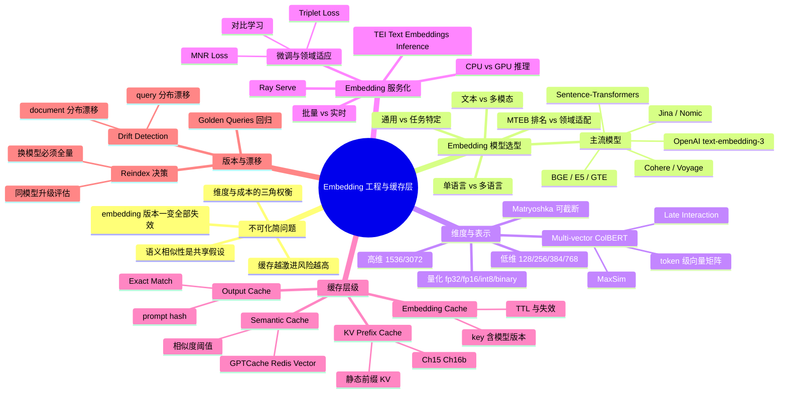
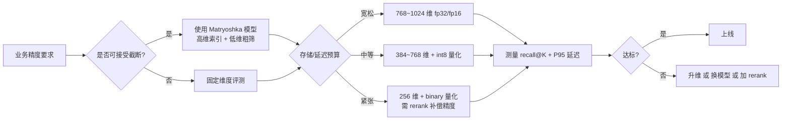
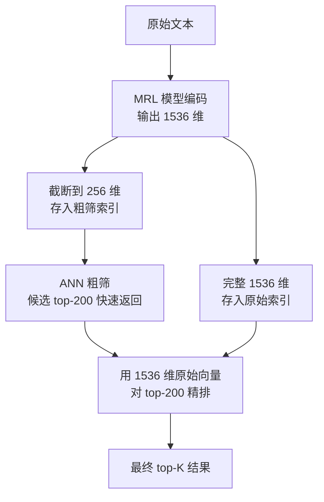
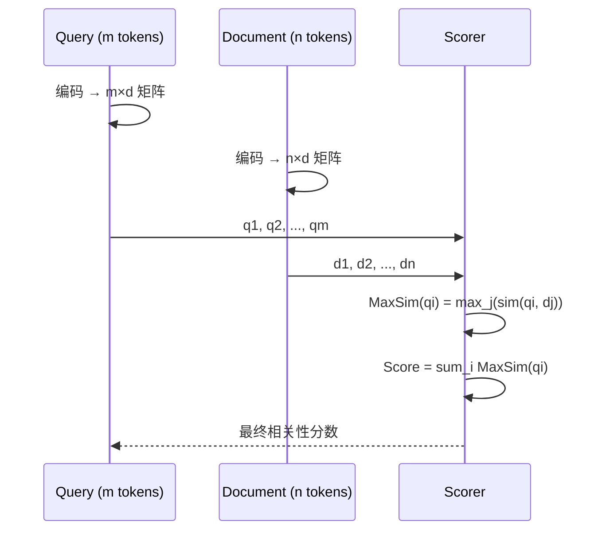
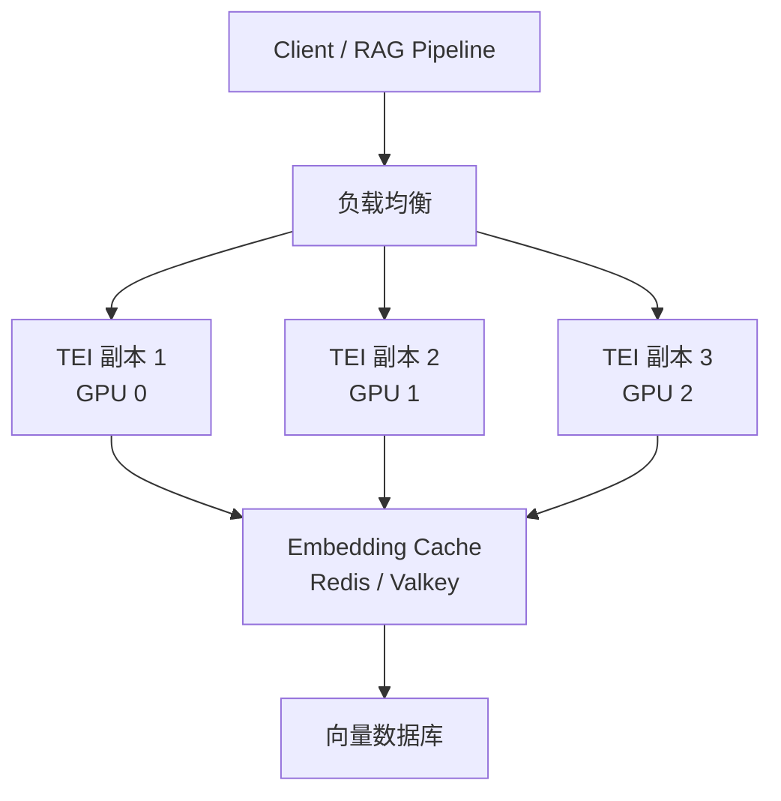
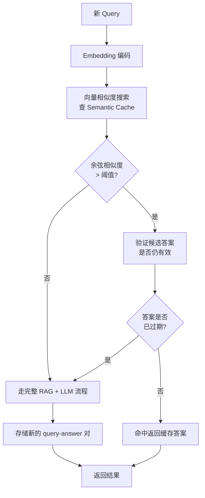

# 第 13e 章 · Embedding 工程与缓存层

> **关联章节**：本章深挖 embedding 工程与多级缓存，与 [第 13 章](./13-feature-vector-and-cache.md) 的特征和向量索引、[第 15 章](../part5-serving-infra/15-batching-scheduling-and-kv-cache.md) 的 KV Cache 调度、以及 [第 16b 章](../part5-serving-infra/16b-sglang-internals.md) 的 RadixAttention 直接衔接。Embedding 选错或没有维护好版本，所有下游的 retrieval / RAG / 推荐 / 风控全部失效；缓存设计错误，命中率越高，过期和越权风险越大。

---

## 13e.1 第一性原理拆解 + 学习大纲

### 拆 — 不可化简的问题

剥离 "text-embedding-3-large"、"ColBERT"、"Matryoshka"、"GPTCache"、"Semantic Cache"这些工具和名词之后，本章真正面对的是一个不可化简的基础设施问题：**AI 系统里所有需要"找相似"的任务——RAG、推荐召回、语义搜索、意图分类、风控判别——都共享同一个底层假设：两个语义相近的对象在向量空间里也彼此靠近。** 这个假设能否成立，完全取决于你选了哪个 embedding 模型、用在哪个领域、是否经过微调、是否和索引保持同一个版本。

这个问题为什么不可化简？因为 embedding 是多个系统的"共享坐标系"。换一个模型，所有旧向量的含义就全变了；不重建索引就复用，相当于在不同投影仪的画面上叠加不同坐标系的点——表面上看不出异常，实际上召回质量会悄悄崩塌，而且没有显式报错。线上指标下滑会被归咎于"用户搜索习惯变化"或者"模型回答质量下降"，排查困难度很高。

问题的第二层难点在于维度与成本的权衡。高维 embedding（1536/3072 维）表达力更强，但存储、ANN 检索延迟、量化损失、索引内存都随维度增长。低维（128/256）速度快、成本低，但细粒度语义可能丢失。平台需要在精度、成本、延迟三者之间找到可持续的工作点，而不是默认用最高维度。

第三层难点是缓存。RAG 系统里有至少三类缓存：Embedding Cache（减少重复编码）、Semantic Cache（找到语义相似的历史 query 直接复用 LLM 回答）、Output Cache（完整 prompt-response 哈希命中），加上 LLM serving 层的 KV Prefix Cache。四种缓存各自命中条件不同、失效策略不同、权限风险不同。把它们混为一谈，或者把命中率最高的缓存策略不加甄别地部署，很快会出现权限越界、过期数据被持续服务的严重问题。

### 推 — 从这个问题如何推导出每个机制

**从"需要语义相似"推出 embedding 模型选型**。不同任务需要不同的语义空间：通用语义比较不一定适合专业领域；中文文档检索需要支持多语言或中文特化模型；图文混合场景需要多模态 embedding。MTEB Benchmark 是选型的起点，但 benchmark 是通用数据集；如果你的语料是医疗合规文件，benchmark 上排名第三的模型也许比第一名更合适。

**从"向量质量依赖模型"推出版本控制**。Embedding 模型版本 + tokenizer 版本 + 预处理规则三者共同定义一个向量空间。任何一个变化都意味着旧索引不再可比，必须全量重建。这是一个不能妥协的边界：用不同模型版本产生的向量做 ANN 检索，等价于把苹果和橙子放在同一个坐标系里比距离。

**从"维度 vs 成本"推出 Matryoshka Embedding 和量化**。Matryoshka Representation Learning（MRL）训练出的 embedding 有一个特殊性质：可以截断到更低维度（如 1536→256），截断后的子向量仍然保持语义一致性。这让平台可以在索引层用低维快速粗筛，在 rerank 层用高维精排，一个模型服务两种精度需求，无需维护两套索引。量化（fp32→fp16→int8→binary）进一步压缩存储和计算，但每一步都有精度代价，需要用 recall@K 测量并设定可接受下限。

**从"单向量不够"推出 Multi-vector 表示（ColBERT）**。传统 embedding 把整段文本压缩成一个向量，会丢失 token 级别的细粒度信息。ColBERT 的 Late Interaction 方案：query 和 document 分别产生 token 级向量矩阵，检索时用 MaxSim 做交叉打分，保留更细粒度的语义匹配信号。代价是存储和计算都比单向量大，适合对召回精度要求最高的场景，但对存储和 serving 架构要求更高。

**从"embedding 计算有成本"推出 embedding 服务化**。批量 embedding 的 GPU 利用率比单条高得多；TEI（Text Embeddings Inference）、Ray Serve 等方案把 embedding 模型抽象为独立微服务，支持动态 batch、多副本、滚动更新。这和 LLM serving 类似，但 embedding 模型通常更小（几十到几百 MB），CPU 推理也可行，具体要看 batch size 和延迟要求。

**从"相同 query 不必重算"推出 Embedding Cache**。相同或高度相近的 query 在一定时间窗口内频繁出现（如电商搜索的热词），embedding 结果可以缓存，直接复用，节省模型调用。cache key 必须包含输入文本 + 模型版本 + 预处理版本；否则模型升级后旧向量被复用，后续检索结果悄悄退化。

**从"相同语义 query 不必重新生成 LLM 回答"推出 Semantic Cache**。比 Embedding Cache 更进一步：如果新 query 的 embedding 和已有历史 query 的 embedding 余弦相似度超过阈值，直接返回历史 LLM 回答，跳过整个 RAG+LLM 流程。GPTCache、Redis Vector 是代表实现。难点在于相似度阈值设定：太低会把不同问题的答案混为一谈（"北京天气"和"上海天气"可能向量相似但答案完全不同）；太高则命中率接近 Exact Match Cache，失去语义扩展的价值。

**从"公共前缀不必重算 KV"推出 KV Prefix Cache**。LLM serving 层的 Prefix Cache 在本章意义上是"embedding 上游的状态缓存"：system prompt、文档模板、few-shot 例子等静态前缀在多次请求里相同，KV 可以复用，节省 prefill 计算。与 Ch 15 的 PagedAttention 配合，与 Ch 16b 的 SGLang RadixAttention 深度结合。本章关注的是 Prefix Cache 的 key 设计与失效策略，不深入 serving runtime 实现。

**从"模型和分布都会漂移"推出 Drift Detection 和 Reindex 决策**。Query 分布漂移（新 query 类型出现，旧 embedding 覆盖不足）和 document 分布漂移（新文档类型入库）都会悄悄降低召回质量。平台需要定期测量 golden queries 的 recall@K，监控 query embedding 分布变化，有阈值触发 reindex 或模型升级评估。

### 绘 — 因果链路



### 导 — 读完本章你应该能回答

1. 为什么 embedding 模型选型不能只看 MTEB 排名，需要在自己的领域数据上评测？换模型之后为什么必须全量重建索引而不能做增量修补？
2. Matryoshka Embedding 的截断机制在工程上解决了什么问题？量化从 fp32 到 binary 各步骤分别损失什么，如何用 recall@K 设定可接受下限？
3. ColBERT 的 Late Interaction 相比单向量 bi-encoder 在召回精度和存储/计算成本上分别做了哪些取舍？什么场景值得引入？
4. Embedding Cache、Semantic Cache、Output Cache、KV Prefix Cache 四种缓存分别命中什么条件，失效策略有何不同，各自的越权风险在哪里？
5. Semantic Cache 的相似度阈值该如何设定？阈值过低和过高分别导致什么工程问题？
6. Embedding 微调（对比学习、Triplet Loss、MNR Loss）在什么场景下有收益，ROI 如何评估？领域适应和全参微调的边界在哪里？
7. 如何设计一套 embedding 版本治理流程，使得模型升级时能做到双索引灰度、golden query 回归、滚动切流和可回滚？

---

## 13e.2 Embedding 模型分类与主流选型

### 通用 vs 任务特定 vs 多语言 vs 多模态

Embedding 模型不是一个统一类别，而是一个按任务需求分层的生态。选型的第一步是搞清楚业务需要的是哪类语义表示：

| 类别 | 代表模型 | 适用场景 | 局限 |
|------|----------|----------|------|
| 通用语义 | OpenAI text-embedding-3-large、Cohere embed-v3、Voyage-3 | 文档检索、RAG、通用语义搜索 | 专业领域（医疗、法律、代码）可能被领域特化模型超越 |
| 领域特化 | BioLinkBERT、Legal-BERT、CodeBERT 系列 | 生物医学文献、合规文档、代码搜索 | 迁移性差，换场景重新评估 |
| 多语言 | BGE-M3、mE5、Jina Embeddings v3（89 语言）、multilingual-e5 | 多语种混合文档、跨语言检索 | 英文精度通常稍低于英文特化模型 |
| 中文特化 | BGE-large-zh、GTE-Qwen、text2vec-large-chinese | 中文 RAG、中文电商搜索 | 英文能力弱 |
| 多模态 | CLIP、E5-Mistral（长文本）、Jina CLIP v2 | 图文混合检索、视觉问答预处理 | 模型更大，serving 成本高 |
| 高效小模型 | nomic-embed-text-v1.5、all-MiniLM-L6-v2 | 低延迟场景、边缘推理、原型开发 | 精度低于大模型 |

> **工程边界**：MTEB Leaderboard 是选型的起点，不是终点。商业模型（OpenAI、Cohere、Voyage）有 API 依赖和数据隐私风险；开源模型（BGE、E5、GTE、Nomic）自托管更可控但需要运维。先在 1000-5000 条自有标注 query-document 对上评测 recall@1/5/10，再做最终选型。

### 主流模型性能对比

| 模型 | 维度 | MTEB 均分（参考）| 最大 token | 开源/API | Matryoshka | 多语言 |
|------|------|-----------------|-----------|---------|-----------|--------|
| OpenAI text-embedding-3-large | 3072（可截断到 256） | ~64.6 | 8191 | API | 是 | 是 |
| OpenAI text-embedding-3-small | 1536（可截断到 512） | ~62.3 | 8191 | API | 是 | 是 |
| Cohere embed-v3-english | 1024 | ~64.5 | 512 | API | 否 | 否 |
| Voyage-3-large | 1024 | ~67.4 | 32000 | API | 否 | 是 |
| BGE-M3 | 1024 | ~64.3 | 8192 | 开源 | 否 | 是（100+）|
| E5-mistral-7b-instruct | 4096 | ~66.6 | 32768 | 开源 | 否 | 否 |
| GTE-Qwen2-7B-instruct | 3584 | ~67.5 | 32768 | 开源 | 否 | 是 |
| nomic-embed-text-v1.5 | 768（可截断到 64） | ~62.4 | 8192 | 开源 | 是 | 否 |
| Jina Embeddings v3 | 1024 | ~63.9 | 8192 | 开源/API | 是 | 是（89）|
| all-MiniLM-L6-v2 | 384 | ~56.3 | 512 | 开源 | 否 | 否 |

> **注意**：MTEB 分数每年随新模型发布持续更新，以上数值供参考，以实际评测为准。

---

## 13e.3 维度、精度与成本的三角权衡

### 维度对系统各层的影响

Embedding 维度不是越高越好，每一个维度的增加都在全链路累积成本：

| 维度 | 代表场景 | 每向量存储（fp32） | ANN 索引内存（100 万向量，HNSW） | 精排精度（参考） | 典型用途 |
|------|----------|-------------------|----------------------------------|-----------------|----------|
| 128 | 极低成本粗筛 | 0.5 KB | ~0.8 GB | 较低 | 大规模粗召回第一层 |
| 256 | 低成本粗筛 | 1 KB | ~1.5 GB | 中低 | Matryoshka 截断后的快速检索 |
| 384 | 小型通用 | 1.5 KB | ~2.2 GB | 中 | all-MiniLM、原型系统 |
| 768 | 中型通用 | 3 KB | ~4.5 GB | 中高 | 生产 RAG 常见基线 |
| 1024 | 标准高质量 | 4 KB | ~6 GB | 高 | BGE-M3、Cohere、Voyage 默认 |
| 1536 | OpenAI small | 6 KB | ~9 GB | 高 | OpenAI text-embedding-3-small 默认 |
| 3072 | OpenAI large | 12 KB | ~18 GB | 很高 | 精度要求极高场景 |
| 4096 | 大型开源 | 16 KB | ~24 GB | 很高 | E5-mistral-7B 默认 |

**ANN 检索延迟**随维度近似线性增长（HNSW 情况下）；**量化带来的精度损失**在高维向量上通常相对更小，低维向量量化到 int8 或 binary 后精度下降更显著。



### 量化：从 fp32 到 binary 的精度-成本折中

| 量化级别 | 每维度位数 | 存储压缩比（vs fp32） | 速度提升（参考） | Recall 损失（参考） | 适用条件 |
|----------|-----------|----------------------|-----------------|---------------------|----------|
| fp32 | 32 bit | 1x | 1x | 0% | 精度要求最高，存储充裕 |
| fp16/bf16 | 16 bit | 2x | 1-1.5x | <0.5% | 推荐生产默认，几乎无精度损失 |
| int8 | 8 bit | 4x | 1.5-3x | 1-3% | 大规模索引，recall@K > 90% 可接受 |
| binary | 1 bit | 32x | 5-15x | 5-15%（需 rerank） | 超大规模粗筛，必须配合精排 |

> **工程边界**：量化后必须在你自己的 query 集上测 recall@K，不能只依赖论文数据。binary 量化通常结合粗筛 + 精排（用原始 fp32 向量对 top-N 候选重新打分）来弥补精度损失。量化版本要和原始版本一起写入索引元数据。

---

## 13e.4 Matryoshka Embedding：可截断的向量空间

Matryoshka Representation Learning（MRL，出自 Kusupati 等 2022 年论文）是当前最实用的维度弹性方案。核心思想：在训练时让模型同时优化多个维度截断的 embedding 质量（如 32/64/128/256/512/1536），使得截断后的前 D 维子向量仍然是高质量的语义表示。



**实际收益（以 OpenAI text-embedding-3-large 为例）**：

| 截断维度 | MTEB 均分（参考） | vs 3072 维损失 | 存储压缩比 |
|----------|-----------------|----------------|-----------|
| 3072（原始） | ~64.6 | 0% | 1x |
| 1536 | ~64.1 | ~0.8% | 2x |
| 512 | ~63.3 | ~2% | 6x |
| 256 | ~62.0 | ~4% | 12x |
| 64 | ~57.8 | ~10% | 48x |

> **工程价值**：两阶段检索（低维粗筛 + 高维精排）用一个模型实现，无需训练两个独立模型，也无需维护两套完全不同的向量空间。适合规模在百万到十亿级向量、对存储和延迟敏感的生产系统。

---

## 13e.5 Multi-vector 表示：ColBERT 与 Late Interaction

### 单向量 bi-encoder 的局限

传统 embedding（bi-encoder）把整段文本压缩成一个向量：query 一个向量，document 一个向量，相似度 = 一次点积。这在粗粒度检索上效率极高，但丢失了 token 级别的匹配信号：query "Python 内存管理 GC" 和 document 里的段落"CPython 用引用计数实现垃圾回收"的向量相似度，很难准确反映两者在"GC 机制"这个细粒度概念上的匹配强度。

### ColBERT Late Interaction

ColBERT（Khattab & Zaharia，2020）把 query 和 document 各自编码成 token 级向量矩阵（每个 token 一个向量），打分时用 **MaxSim**：对 query 的每个 token，找 document 所有 token 向量中与它最相似的那个，取最大值；再对所有 query token 的 MaxSim 求和。



| 对比维度 | Bi-Encoder（单向量） | ColBERT（多向量 Late Interaction） |
|----------|---------------------|-----------------------------------|
| 查询编码 | 1 个向量 | m 个 token 向量 |
| 文档编码 | 1 个向量 | n 个 token 向量 |
| 检索时计算量 | 极低（向量点积） | 中等（MaxSim 矩阵乘法） |
| 存储开销 | 1x | n×（文档平均长度） |
| 召回精度 | 中高 | 高（细粒度匹配） |
| 适用规模 | 亿级以上 | 千万级以内（或需专用 index） |
| 代表实现 | FAISS + 任意 bi-encoder | RAGatouille、PLAID、ColBERT-v2 |

> **工程边界**：ColBERT 的存储开销和检索计算量都显著高于单向量方案，但在精度要求极高的法律文档检索、学术论文检索等场景有明显优势。规模超过 1 亿向量时，需要 PLAID 等专用压缩索引来控制存储。

---

## 13e.6 Embedding 服务化：从单机推理到生产 Serving

### 计算成本与 GPU vs CPU 的边界

Embedding 模型通常比 LLM 小得多（BERT-base ~110M 参数，all-MiniLM ~22M），但高 QPS 下的 batching 效率决定了 GPU 是否值得。

| 场景 | 推荐方案 | 典型配置 | 每秒向量数（参考） |
|------|----------|----------|-------------------|
| 低 QPS 原型（< 100 req/s） | CPU 推理（ONNX） | 8-16 核 CPU | 100-500 向量/s |
| 中等 QPS（100-1000 req/s） | GPU 推理 + 动态 batching | T4 / A10G | 5000-20000 向量/s |
| 高 QPS（> 1000 req/s） | 多副本 GPU + TEI | A100 集群 | 50000+ 向量/s |
| 批量离线索引构建 | 大 batch GPU | A100 80G | 100000+ 向量/s |

**Text Embeddings Inference（TEI）** 是 Hugging Face 开源的 embedding serving 框架，支持：
- 动态 batching（最大吞吐优先 或 最低延迟优先 两种策略）
- Flash Attention 优化
- 多种量化（fp16、int8）
- OpenAI 兼容 API

**Ray Serve** 适合需要和 LLM 推理、特征工程混合部署的复杂 pipeline，但运维复杂度更高。



> **工程边界**：Embedding 服务的扩容指标是向量/秒（或 token/秒），不是 req/s，因为不同长度文本的计算量差异很大。P99 延迟要分 short/medium/long 三类输入分别测。升级 embedding 模型时，新模型必须先上线并行运行，旧索引继续服务，直到新索引完全构建并通过回归测试后再切流。

---

## 13e.7 Embedding 微调：对比学习与领域适应

### 什么时候值得微调

| 信号 | 建议 |
|------|------|
| 自有标注 query-positive-negative 对 < 500 | 先用通用模型 + 更好的 chunking 和 rerank |
| 领域词汇大量 OOV 或被通用模型误解 | 值得做领域适应微调 |
| MTEB top 模型在自有测试集上 recall@5 < 70% | 考虑微调 |
| 训练数据 > 5000 query-document 对 | 微调 ROI 通常为正 |

### 对比学习损失函数

**Triplet Loss**：每个样本是 (anchor, positive, negative) 三元组，训练使 anchor-positive 距离小于 anchor-negative 距离，加一个 margin。
```
L = max(0, d(a,p) - d(a,n) + margin)
```

缺点：需要显式负样本构造，困难负样本（hard negative）选择对效果影响极大。

**Multiple Negatives Ranking Loss（MNR Loss）**：在一个 batch 里，把同批次其他 query 的 positive 当作当前 query 的 negative（in-batch negatives）。计算效率高，不需要显式构造负样本，是当前 Sentence-Transformers 微调最常用的损失函数。
```
L = -log( exp(sim(q,d+)) / sum_j exp(sim(q,d_j)) )
```

**In-Batch Negatives + Hard Negatives 混合**：在 MNR 基础上加入从 BM25 或 ANN 检索得到的困难负样本，显著提升困难查询的召回精度。BGE、E5 等主流模型的微调流程都采用这种方式。

> **工程边界**：微调不改变模型架构，只改变权重；微调后产生的 embedding 与原模型不同，必须全量重建索引。推荐用 LLaRA、Sentence-Transformers 框架；微调完成后在保留测试集上用 recall@1/5/10、MRR、NDCG@10 全面评测，再决定是否替换生产模型。

---

## 13e.8 Embedding 缓存与 Semantic Cache

### 三类应用层缓存的对比

| 缓存类型 | 缓存什么 | Key 设计 | 命中条件 | 失效触发 | 越权风险 |
|---------|---------|---------|---------|---------|---------|
| Embedding Cache | query/doc 的向量 | hash(text + model_id + model_revision + tokenizer_version + preprocess_version) | 完全相同的输入+模型 | 模型版本升级、预处理规则变更 | 低（向量本身不含业务数据） |
| Semantic Cache | LLM 的完整回答 | query embedding + tenant/ACL + index_version + model_id/model_revision + generation params + policy version | 语义相近且权限、模型、策略一致 | 底层文档更新、模型/策略/参数变化、时效性内容 | 中（不同权限用户可能问相似问题但答案应不同） |
| Output Cache | 完整 prompt-response 对 | hash(full_prompt + model_id + model_revision + tokenizer/chat_template version + generation params + tool schema version + policy version) | 完全相同的 prompt 与生成环境 | 文档更新、用户上下文变化、工具或策略变化 | 高（必须按 user/tenant 隔离） |
| KV Prefix Cache | LLM 的前缀 KV 状态 | prefix token hash + model_id/model_revision + tokenizer/chat_template version + LoRA/adapter id + policy version | 静态前缀 token 完全相同 | 前缀内容变化、模型/tokenizer/template/策略升级 | 极高（必须按租户/权限隔离）|

其中 `generation params` 至少包括 temperature、top_p/top_k、max_tokens、stop sequences、logits processors、guided/grammar decoding 配置；`tool schema version` 要覆盖 function/tool 名称、参数 schema、序列化顺序和默认值；`policy version` 覆盖安全、权限、脱敏和合规策略。业务可以把这些字段 canonicalize 后做 hash，但不能在语义上省略。

### Semantic Cache 深入：阈值设定与失效策略

Semantic Cache 的核心工程挑战是阈值选择。余弦相似度 0.95 以上可以认为是"几乎相同的问题"；0.85-0.95 是"同主题不同问法"；0.75-0.85 可能是"相关但不同"。



**时效性内容的特殊处理**：对于带时间性的 query（"今天的 XX 是多少"、"最新的 XX"），即使语义相似度极高，也不能命中 Semantic Cache，需要在 key 设计或过滤规则里加入时效性判断。

**多租户 Semantic Cache**：不同租户的 Semantic Cache 必须隔离，不能跨租户共享回答（即使问题语义相同，底层文档集不同，答案可能完全不同）。

> **工程边界**：Semantic Cache 最适合的场景是 FAQ 类、知识库固定、查询高度重复的企业内部问答系统。对于个性化强、实时性高、文档频繁更新的场景，Semantic Cache 的维护成本（阈值调优、TTL 管理、失效追踪）可能超过收益。

---

## 13e.9 KV Prefix Cache：与 Ch 15、Ch 16b 的衔接

### Prefix Cache 在 Embedding 工程视角下的含义

在第 13e 章的语境里，KV Prefix Cache 指的是 LLM serving 层对公共 prompt 前缀的 KV 状态复用。其与 embedding 工程的交集在于：RAG 系统在 prompt 里注入了检索结果，而检索结果是 embedding 驱动的。一旦检索结果不同（比如因为 embedding 模型升级导致召回结果变化），原本可以命中 Prefix Cache 的请求就无法再命中。

| 前缀内容 | 是否适合 Prefix Cache | 原因 |
|---------|----------------------|------|
| 纯静态 system prompt + 工具 schema | 最适合 | 内容完全固定，命中率高 |
| system prompt + few-shot 例子 | 适合 | 少量变化，大部分可命中 |
| system prompt + 检索结果（RAG） | 慎用 | 检索结果因 query 而异，前缀几乎每次不同 |
| system prompt + 用户历史对话 | 不适合跨用户共享 | 必须按 user 隔离 |

### 与 SGLang RadixAttention 的关系

SGLang 的 RadixAttention（见 Ch 16b）用 Radix Tree 对 token 序列进行最长公共前缀匹配，自动识别可复用的 KV 块。从 embedding 工程视角来看，这意味着：

1. 如果 RAG 召回结果在多个 query 中高度相似（比如检索同一段文档），RadixAttention 可以复用这段文档对应的 KV 状态。
2. 如果 embedding 模型升级导致召回结果改变，之前缓存的 KV 树节点需要失效。
3. Semantic Cache 命中可以在进入 LLM 之前就返回，完全绕过 KV Prefix Cache；两者是互补而非重叠的关系。

---

## 13e.10 Drift Detection 与 Reindex 决策

### 什么时候必须全量 Reindex

> **核心原则**：换 embedding 模型必然 reindex；同一模型升级需要评估，评估标准是新旧模型在相同输入上的向量空间是否兼容。

```mermaid
flowchart TD
    T[触发 Reindex 评估] --> A{是否更换 embedding 模型?}
    A -- 是 --> R[全量 Reindex\n双索引灰度]
    A -- 否 --> B{是否更新了 tokenizer 或预处理规则?}
    B -- 是 --> R
    B -- 否 --> C{新模型版本是否只是权重微更新\n且官方声明向量兼容?}
    C -- 是 --> D[抽样评测\n500 条 golden queries]
    C -- 否 --> R
    D --> E{recall@K 变化 > 阈值?}
    E -- 是 --> R
    E -- 否 --> F[保持现有索引\n记录评测结果]
    R --> G[构建新索引\nblue/green 部署]
    G --> H[golden queries 全量回归]
    H --> I{达标?}
    I -- 是 --> J[按比例切流\n保留旧索引 7-14 天]
    I -- 否 --> K[保留旧索引\n修正问题]
```

### Drift Detection：监控 Query 和 Document 分布漂移

| 监控维度 | 方法 | 告警阈值（参考） |
|---------|------|-----------------|
| Query embedding 分布漂移 | 每日计算新 query 嵌入均值，与基线余弦距离 | 距离 > 0.05 触发评估 |
| 高 OOV 率 query | 统计 tokenizer OOV token 比例 | OOV > 5% 触发评估 |
| 召回率下降 | 每日跑 golden queries，计算 recall@5 | 下降 > 3% 触发告警 |
| 文档分布漂移 | 新入库文档 embedding 与现有索引均值距离 | 距离 > 0.1 触发评估 |
| 用户反馈信号 | 搜索点击率（CTR）、答案采纳率下降 | 下降 > 10% 触发评估 |

> **工程边界**：Drift detection 不能只依赖离线指标，必须有在线反馈回路。对于无法收集显式用户反馈的内部系统，可用隐式信号（重复搜索率、会话放弃率）替代。

---

## 13e.11 Embedding 服务架构：全链路视图

```mermaid
flowchart TD
    subgraph Ingestion["索引构建管道"]
        Doc[文档入库] --> Parse[解析/清洗]
        Parse --> Chunk[Chunking\n版本化配置]
        Chunk --> EmbModel[Embedding 模型\n版本 v2.1]
        EmbModel --> ECache[Embedding Cache\nRedis 去重]
        ECache --> VDB[(向量数据库\n双索引 blue/green)]
    end

    subgraph Serving["在线查询服务"]
        Q[用户 Query] --> QNorm[Query 归一化/改写]
        QNorm --> QEmb[Query Embedding\nTEI 服务]
        QEmb --> SCacheCheck{Semantic Cache\n命中?}
        SCacheCheck -- 命中 --> Ret[返回缓存答案]
        SCacheCheck -- 未命中 --> ANN[ANN 检索\n向量数据库]
        ANN --> BM25[BM25 关键词检索]
        BM25 --> Merge[RRF 合并]
        Merge --> Rerank[Cross-encoder Rerank]
        Rerank --> Prompt[Prompt 组装]
        Prompt --> PCache{KV Prefix Cache\n命中?}
        PCache -- 命中 --> LLM[LLM Decode 续写]
        PCache -- 未命中 --> LLMFull[LLM Prefill + Decode]
        LLM --> Ans[返回答案]
        LLMFull --> SCacheStore[存入 Semantic Cache]
        SCacheStore --> Ans
    end

    subgraph Monitor["监控与治理"]
        GoldenQ[Golden Queries 定期跑] --> RecallMetric[Recall@K 监控]
        DriftDet[Drift Detection] --> ReindexTrigger[触发 Reindex 评估]
    end
```

---

## 13e.12 Worked Example：电商搜索从 v1 到 v3 的演进

### 场景背景

某电商平台商品搜索系统，SKU 数量 800 万，日均查询 1000 万次，P99 延迟要求 < 200ms，高峰期 QPS 约 3000。

### v1：纯 BM25 关键词检索

**架构**：Elasticsearch BM25 → top-20 → 规则排序

| 指标 | v1 数值 |
|------|---------|
| P50 延迟 | 25ms |
| P99 延迟 | 85ms |
| 精确关键词 recall@10 | 91% |
| 语义/同义词 recall@10 | 43% |
| "冬季羽绒服"→"防寒保暖外套"召回 | 12% |
| 每日 API 成本 | ~0 |
| 索引大小 | 40 GB |

**问题**：用户用口语、近义词、长尾描述搜索时，召回极差。"手机保护套"无法匹配"手机壳"；"显示器 144帧"无法匹配"144Hz 电竞屏"。

### v2：加入 Dense Embedding 检索

**架构**：BM25 + BGE-M3 Dense Retrieval → RRF 合并 → Cross-encoder Rerank → top-10

**关键决策**：
- 选用 BGE-M3（多语言，1024 维，中文中文效果好）
- 向量量化到 fp16（存储压缩 50%，几乎无精度损失）
- 部署 TEI（2 × A10G），批量 embedding 800 万 SKU 耗时约 3 小时
- Qdrant 作为向量库（支持过滤、支持增量写入）

| 指标 | v1 | v2 |
|------|----|----|
| P50 延迟 | 25ms | 68ms |
| P99 延迟 | 85ms | 145ms |
| 精确关键词 recall@10 | 91% | 89%（RRF 略有折损） |
| 语义/同义词 recall@10 | 43% | 79% |
| 同义词匹配提升 | +0% | +36pp |
| 每日 Embedding API 成本 | 0 | ~0（自托管） |
| 每日推理成本（GPU） | 0 | ~$200 |
| 向量索引大小 | 0 | 38 GB（fp16，800 万向量） |

**问题**：
- P99 延迟从 85ms 升到 145ms，接近 200ms 预算上限
- 热词重复 embedding（"Nike 运动鞋"每天被检索 5 万次）
- 没有利用 LLM 生成更好的答案（搜索结果仍是 SKU 列表，没有结构化答案）

### v3：加入 Semantic Cache + Output Cache + Reranking 优化

**新增组件**：
1. **Query Embedding Cache**（Redis，TTL 24h）：热词缓存命中 85%，embedding 服务 QPS 降低 85%
2. **Semantic Cache**（Qdrant 向量库，阈值 0.92）：对"相同意图"的重复 query 直接返回缓存搜索结果列表
3. **Output Cache**（Redis，TTL 4h）：对精确相同 query（带 user context）直接返回完整回答
4. **Cross-encoder Rerank 优化**：候选从 top-50 压缩到 top-10，提升精排质量

| 指标 | v2 | v3 |
|------|----|----|
| P50 延迟 | 68ms | 28ms（Semantic Cache 命中路径） |
| P99 延迟 | 145ms | 95ms |
| Semantic Cache 命中率 | 0% | 52% |
| Query Embedding Cache 命中率 | 0% | 85% |
| Output Cache 命中率 | 0% | 31% |
| 语义/同义词 recall@10 | 79% | 83%（Rerank 优化） |
| 每日 GPU 成本 | ~$200 | ~$60（缓存减少 70% 推理） |
| 索引大小 | 38 GB | 42 GB（+Semantic Cache 历史 query） |

**关键数据说明**：
- Semantic Cache 阈值 0.92 在测试集上验证：相似度 > 0.92 的 query 对中，98% 的用户期望相同搜索结果
- 对时效性强的 query（带"最新"、"今天"、"促销"等词）自动跳过 Semantic Cache
- Query Embedding Cache 的 TTL 设为 24h 是因为 embedding 模型不频繁更新；模型升级时 flush 全部缓存

**v3 架构演进教训**：
1. Semantic Cache 阈值比预期难设定，最终用了 3 周 A/B 测试确定 0.92
2. 多租户（不同品类店铺）必须隔离 Semantic Cache，否则 A 店铺的促销答案会泄露给 B 店铺的 query
3. Output Cache 命中率 31% 低于预期（预期 50%），因为查询个性化（用户历史）导致 cache key 过于细粒度；后来改为只缓存纯商品类 query，命中率升到 47%

---

## 13e.13 与 AI Infra 其他系统的关系

> **Embedding 是多系统的共享基础设施**。以下是 embedding 在不同业务系统中的角色：

| 业务系统 | Embedding 的角色 | 版本更新影响 |
|---------|-----------------|-------------|
| RAG 问答 | 文档检索向量 + query 编码 | 模型升级 → 全量 reindex → 召回质量变化 |
| 推荐系统 | Item/User 向量召回 | 模型升级 → 需重新训练推荐模型对齐新空间 |
| 语义搜索 | 商品/内容向量检索 | 同 RAG |
| 风控系统 | 异常行为 embedding 聚类 | 空间变化 → 聚类边界需重新标定 |
| 安全审核 | 有害内容 embedding 分类 | 分类器需重新训练 |
| 多模态检索 | 图文对齐向量 | 图文 embedding 模型必须联动升级 |

> **核心风险**：如果平台对 embedding 模型的版本管理不够严格，各系统可能在不知情的情况下同时使用不同版本的 embedding，导致系统间召回结果不一致、行为难以解释。

---

## 13e.14 工程检查清单

在上线或更新 embedding 相关系统时，按以下清单自检：

**Embedding 模型选型与评测**
- [ ] 在自有领域数据（≥1000 query-doc 对）上评测 recall@1/5/10
- [ ] 测量 P95/P99 embedding 延迟（分 short/medium/long 输入）
- [ ] 明确维度和量化方案，测量 recall 损失是否可接受
- [ ] 确认是否支持 Matryoshka 截断（如需两阶段检索）

**版本与索引治理**
- [ ] 索引元数据包含：embedding_model_version、tokenizer_version、preprocess_version、build_time、chunk_policy
- [ ] 模型升级前先评估是否需要全量 reindex
- [ ] 全量 reindex 采用双索引（blue/green）灰度切流
- [ ] 保留旧索引至少 7 天备用回滚

**缓存设计**
- [ ] Embedding Cache key 包含模型版本和预处理版本
- [ ] Semantic Cache 阈值经 A/B 测试验证，并对时效性 query 做例外处理
- [ ] Output Cache 按 user/tenant 隔离
- [ ] Output/Semantic/KV Prefix Cache key 包含 model_id、model_revision、tokenizer/chat_template version、generation params、tool schema version、policy version
- [ ] KV Prefix Cache key 不跨租户共享

**监控与漂移检测**
- [ ] Golden queries 集（≥100 条）每日自动跑，alert on recall 下降
- [ ] Embedding 分布漂移监控（每日计算距离基线）
- [ ] Query OOV 率监控

---

## 本章小结

| 核心概念 | 关键判断 | 最常见错误 |
|---------|---------|-----------|
| Embedding 模型选型 | 领域 + MTEB + 自有数据评测三合一 | 只看 MTEB 排名，不做领域评测 |
| 维度选择 | 从 768/1024 起步，用 Matryoshka 做两阶段优化 | 默认最高维度，忽视成本 |
| 量化 | fp16 几乎无损，int8 可接受，binary 需 rerank | 直接 binary 量化不测 recall 就上线 |
| ColBERT | 高精度场景的多向量表示，存储成本高 | 忽视存储成本，在亿级规模直接用 |
| Embedding Cache | key 含模型版本，TTL 跟随模型生命周期 | 模型升级忘记 flush 缓存 |
| Semantic Cache | 阈值需实验确定，时效性 query 例外 | 阈值过低导致错误答案被复用 |
| Reindex 决策 | 换模型必须全量 reindex | 用增量写入修补不兼容的向量空间 |
| Drift Detection | Golden queries + 分布监控双保险 | 只靠用户投诉发现质量下降 |

---

## 练习题

**13e-1**：选择两个不同的 embedding 模型（如 BGE-M3 和 all-MiniLM-L6-v2），在同一批 100 条 query-document 对上计算 recall@5，比较结果，并解释为什么 MTEB 排名较高的模型在你的测试集上不一定更好。

**13e-2**：一家公司有一个 500 万文档的向量索引，使用 1536 维 fp32 存储。请计算：（a）总存储大小；（b）如果改用 fp16 和 int8 分别节省多少；（c）如果用 Matryoshka 截断到 512 维 + fp16，节省多少，recall 预期损失多少？

**13e-3**：解释 Matryoshka Embedding 的训练目标与普通 embedding 训练的区别，以及为什么截断后的子向量仍能保持语义一致性。

**13e-4**：设计一个 Semantic Cache 的阈值选择实验。你会用什么数据、什么指标来判断阈值从 0.88 调到 0.92 是否合理？如何处理时效性 query？

**13e-5**：ColBERT 的 MaxSim 打分机制如何在 token 级别捕捉 query-document 的细粒度匹配？为什么它比单向量内积在长文档检索上通常更准确？举例说明一个单向量会失效但 ColBERT 可以正确匹配的 case。

**13e-6**：公司的 embedding 模型从 BGE-M3 升级到 GTE-Qwen2-7B。写出完整的升级计划，包括：评测阶段、双索引构建、灰度切流、监控指标、回滚条件。

**13e-7**：对比 MNR Loss 和 Triplet Loss 在 embedding 微调中的优缺点。如果你只有 2000 条 (query, positive_document) 对，没有显式负样本标注，应该用哪种 loss？为什么？

**13e-8**：解释为什么 Output Cache 按 user/tenant 隔离是安全要求而不只是功能要求。如果一个企业知识库的 Semantic Cache 跨租户共享，最坏情况下会发生什么？

**13e-9**：一个电商搜索系统的 Query Embedding Cache TTL 设置为 7 天，但 embedding 模型每 3 天会有小版本更新。描述这种配置下会出现的问题，以及正确的 cache key 设计应该如何避免。

**13e-10**：解释 KV Prefix Cache 和 Semantic Cache 在架构位置上的区别：为什么 Semantic Cache 命中可以完全绕过 LLM 调用，而 KV Prefix Cache 命中仍然需要进入 LLM 做 decode？

**13e-11**：设计一个 embedding drift detection 方案。你会用什么指标判断当前 embedding 模型已经无法满足 query 分布的需要？监控频率如何设定？告警阈值如何校准？

**13e-12**：在 Worked Example 的 v3 架构中，Semantic Cache 命中率 52% 意味着什么？如果你想把命中率提升到 70%，可以调整哪些参数？提升命中率的代价是什么？

---

## 深度参考阅读

**Embedding 模型与评测**
- Muennighoff et al., "MTEB: Massive Text Embedding Benchmark"（2022）— embedding 评测的权威综合基准
- Xiao et al., "C-Pack: Packaged Resources To Advance General Chinese Embedding"（BGE，2023）— 中文 embedding 和微调方法
- Wang et al., "Text Embeddings by Weakly-Supervised Contrastive Pre-training"（E5，2022）— 弱监督对比学习 embedding

**Matryoshka 与维度压缩**
- Kusupati et al., "Matryoshka Representation Learning"（NeurIPS 2022）— MRL 原论文，提出可截断 embedding 训练框架

**Multi-vector 与 Late Interaction**
- Khattab & Zaharia, "ColBERT: Efficient and Effective Passage Search via Contextualized Late Interaction over BERT"（SIGIR 2020）— ColBERT 原论文
- Santhanam et al., "ColBERTv2: Effective and Efficient Retrieval via Lightweight Late Interaction"（NAACL 2022）— ColBERT v2 与 PLAID 压缩索引

**量化与高效检索**
- Jégou et al., "Product Quantization for Nearest Neighbor Search"（TPAMI 2011）— PQ 量化经典论文
- Malkov & Yashunin, "Efficient and Robust Approximate Nearest Neighbor Search Using Hierarchical Navigable Small World Graphs"（TPAMI 2020）— HNSW 论文

**Semantic Cache 与应用层缓存**
- Bang et al., "GPTCache: A Data or Cache for Large Language Models"（2023）— Semantic Cache 实现参考
- Redis Vector Library 文档 — Redis 向量搜索与 Semantic Cache 实现

**Embedding 微调**
- Sentence-Transformers 文档，Multiple Negatives Ranking Loss — MNR Loss 工程实现参考
- Günther et al., "Jina Embeddings: A Novel Set of High-Performance Sentence Embedding Models"（2023）— 工业级 embedding 微调实践

**Drift Detection 与系统治理**
- Ramirez et al., "Monitoring and explainability of models in production"（2022）— ML 系统漂移检测综述

**关联章节**
- [第 13 章](./13-feature-vector-and-cache.md) — 特征、向量索引与缓存基础
- [第 15 章](../part5-serving-infra/15-batching-scheduling-and-kv-cache.md) — KV Cache 调度与 PagedAttention
- [第 16b 章](../part5-serving-infra/16b-sglang-internals.md) — SGLang RadixAttention 与前缀复用
- [第 23 章](../part7-reliability-security/23-security-isolation-and-governance.md) — 安全治理与权限隔离
