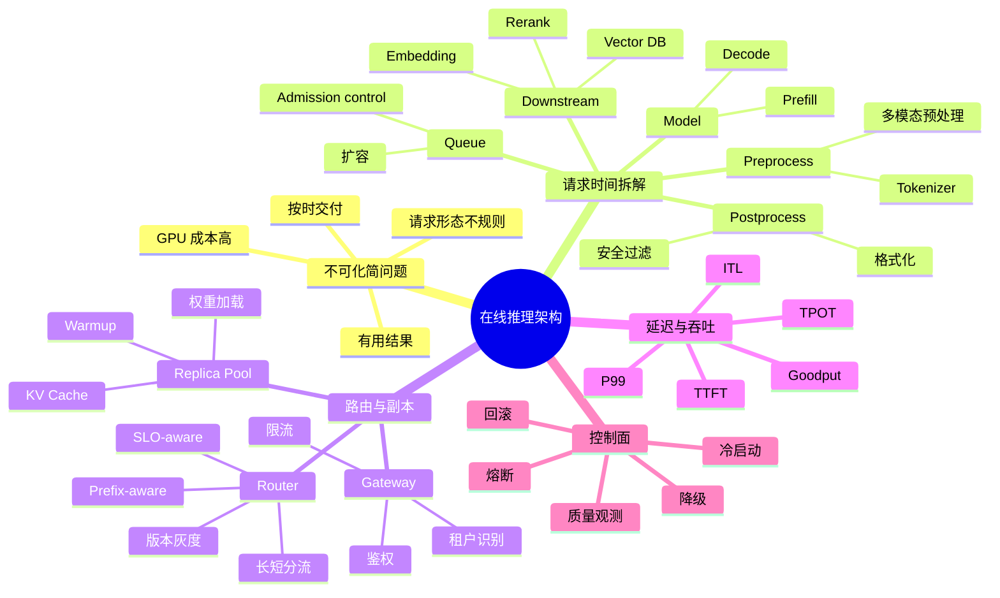

# 第14章：在线推理架构

> 线上推理不是"把模型变成一个 HTTP 接口"这么简单；它是一条围绕路由、缓存、扩缩容、依赖治理和质量观测组织起来的完整请求链路。

> **关联章节**：本章的路由、流量分层和副本组织，是 [第17章](17-multitenancy-and-cost.md) 多租户治理的执行基础；租户策略最终都要落到在线推理链路里。批处理和 KV Cache 的细节在 [第15章](15-batching-scheduling-and-kv-cache.md)，量化与引擎的选择在 [第16章](16-quantization-compilation-and-engines.md)。

## 1. 第一性原理拆解 + 学习大纲

### 拆 — 不可化简的问题

在线推理架构要解决的不可化简问题，不是"如何把模型挂到一个 HTTP 端口后面"，而是：**在请求不可预测、计算昂贵、状态沉重、用户等待有上限的条件下，怎样让每一次调用都尽量在承诺的时间内交付有用结果**。第一次做模型服务的团队，最容易把在线推理理解成"带 GPU 的 Flask 服务"：写一个接口接 HTTP 请求，把模型 load 到显存，前向跑一次返回结果。这个心智模型在 demo 上完全够用，因为 demo 里的请求少、输入短、没有灰度、没有租户、没有下游依赖，也不需要解释为什么某个用户等了 12 秒。但生产系统的物理现实更硬：一个 70B 模型的单个副本可能占用多张 GPU；一次长 prompt prefill 会吞掉大量算力；decode 阶段会把 KV Cache 留在显存里；RAG 链路还会调用 embedding、向量库、rerank、安全过滤和工具服务。于是"模型推理"只是一条请求链路中的一段，服务是否可用取决于这条链路里最慢、最抖、最不可控的那几跳。

从第一性原理看，在线推理比传统 Web 服务难，不是因为它的入口协议特殊，而是因为它把四类约束叠在了一起。第一，**成本约束**：GPU 秒很贵，副本不是可以随便复制的廉价进程，扩容会带来显存、权重加载、warm pool 和缓存命中率的代价。第二，**时间约束**：用户不关心平均值，只关心自己这一次是否卡住；聊天场景的 TTFT 可能要压到 500 ms 内，TPOT 超过 150 ms/token 就会明显卡顿。第三，**状态约束**：KV Cache、prefix cache、会话亲和、模型版本和预热状态都决定了"同一个请求路由到不同副本"会有不同成本。第四，**质量约束**：HTTP 200 只能说明系统返回了字节，不能说明回答正确、安全、相关或可用。因此本章的核心不是记住某个 serving 框架，而是建立一种拆链路的直觉：一次请求的时间去哪了，尾延迟由哪一跳主导，哪些状态必须亲和，哪些失败必须在控制面里有自动动作。

### 推 — 从这个问题如何推导出每个机制

如果不可化简的问题是"按时交付有用结果"，第一个必然机制就是**请求生命周期拆解**。只有把端到端时间拆成 `queue / preprocess / model / downstream / postprocess`，再把 LLM 的 `model` 拆成 `prefill / decode`，平台才知道该扩 GPU、限流、优化检索、改 tokenizer，还是调整 batch。第二个必然机制是**入口与路由分层**。网关负责鉴权、限流、租户识别和基础日志；路由层负责模型版本、长短上下文、优先级、灰度、prefix-aware 亲和和 SLO-aware 选择副本。二者分离，是因为"谁可以进来"和"进来后去哪一个副本最合适"是两个不同问题。

第三个必然机制是**副本池与缓存治理**。模型副本不是无状态 worker：它有权重、CUDA context、allocator、KV Cache、prefix cache 和 warmup 状态。Round-robin 在普通 Web 服务里可能足够，在 LLM serving 里却可能摧毁 prefix cache 命中率，让同一 system prompt 的请求反复 prefill。第四个必然机制是**尾延迟治理**。输入长度可以差 100 倍，输出长度也可能被 `max_tokens` 顶满；如果只看平均延迟，最慢 1% 用户会被隐藏。于是指标必须从 QPS 扩展到 P50/P95/P99、TTFT、TPOT、ITL、E2EL 和 goodput。Goodput 的意义是把 SLO 纳入吞吐：超时完成的 token 不再被当作有价值的产出。

第五个必然机制是**资源形态分离**。Prefill 更偏 compute-bound，decode 更偏 memory-bandwidth-bound，还会长期占用 KV Cache。长上下文和短请求混在同一池里时，长 prefill 会把短请求的首 token 和后续 token 都拖慢，所以会推导出 chunked prefill、长短分流，甚至 prefill/decode disaggregation。第六个必然机制是**冷启动、熔断和降级控制面**。权重加载、运行时初始化、CUDA graph 捕获、缓存预热都需要时间，副本 ready 不等于可以立即接流量；下游抖动或 GPU 池饱和时，也不能靠人工临时决定是否关闭 rerank、切小模型、截短上下文或返回 429。这些策略必须是可配置、可观测、可演练的规则。最后，**质量观测**必然独立存在，因为模型可能"健康地生成垃圾"：系统指标、链路 trace、输出评测、灰度发布和回滚门禁要一起构成在线推理的运营闭环。

### 绘 — 因果链路



### 导 — 读完本章你应该能回答

1. 当一个 RAG 或 Agent 服务端到端变慢时，你能否把延迟拆成 queue、preprocess、model、downstream、postprocess，并判断哪一段最可能主导 P99？
2. 为什么网关、路由层和模型副本池不能混成一个组件？哪些策略应该放在 gateway，哪些策略必须放在 LLM router？
3. 为什么 LLM 服务不能只看 QPS 和平均延迟？TTFT、TPOT、ITL、E2EL、goodput 分别在约束什么用户体验或平台目标？
4. 为什么同一个模型副本不是普通无状态 worker？KV Cache、prefix cache、warmup 状态和版本灰度会怎样改变路由策略？
5. 当长 prompt prefill 拖慢短请求 decode 时，你会先考虑 chunked prefill、长短分流，还是完整 prefill/decode 解耦？判断信号是什么？
6. 冷启动、熔断、降级、回滚为什么必须写进控制面规则，而不能依赖人工操作？你会为每个动作设置哪些触发指标和退出条件？
7. 为什么有了网关和路由层把请求分发到副本之后，模型服务进程内仍然必须再做一层 batching、prefill/decode 调度和 KV Cache 管理？这层"看不见的内层调度"和外层路由是如何隐性耦合的——当你单独优化任意一层时，可能在另一层制造哪些副作用？

---

## 正文内容

### 14.1 在线推理到底在处理什么

一个在线推理系统最常见的工作流是：

```text
客户端请求
  -> 网关
  -> 路由与鉴权
  -> 预处理
  -> 模型执行
  -> 后处理
  -> 返回结果
```

如果是更复杂的 AI 应用，例如 RAG 或多模型组合，这条链还会继续延长：

```text
客户端
  -> API 网关
  -> 意图识别 / 路由
  -> embedding
  -> 向量检索
  -> 重排
  -> LLM 生成
  -> 安全过滤
  -> 返回
```

这意味着"模型推理延迟"通常只是总延迟的一部分。  
平台工程里最危险的误解之一，就是把模型执行时间误当成整个服务延迟。

#### 14.1.1 一个真实的时间构成比例

作为一个粗略的感受，一个典型 RAG 服务的延迟构成大约是这样：

```text
总延迟 1500 ms:
│
├── 网关 + 鉴权         ~5 ms    (0.3%)
├── embedding 调用      ~80 ms   (5%)
├── 向量检索            ~40 ms   (3%)
├── 重排模型            ~120 ms  (8%)
├── LLM prefill         ~300 ms  (20%)
├── LLM decode          ~900 ms  (60%)
├── 安全过滤            ~30 ms   (2%)
└── 后处理 + 返回       ~25 ms   (2%)
```

这张图里有两个工程启示：

1. **LLM 确实占大头（80%），但不是全部**。"只优化模型"往往漏掉检索、重排和预处理。
2. **尾延迟的组成可能完全不同**。平均 1500 ms 的服务，P99 可能是 8000 ms，而且多出来的 6500 ms 大概率不在 LLM，而在 embedding 抖动、向量库扫全表、或者某个租户的长 prompt 把 decode 拖慢了。

### 14.2 一次请求的时间拆解

可以用一个非常实用的式子来理解：

$$
t_{\text{request}} = t_{\text{queue}} + t_{\text{preprocess}} + t_{\text{model}} + t_{\text{downstream}} + t_{\text{postprocess}}
$$

如果是 LLM，还可以进一步拆成：

$$
t_{\text{model}} = t_{\text{prefill}} + t_{\text{decode}}
$$

这个拆解的工程意义非常大：

- 如果 `t_queue` 高，问题可能在扩容、队列或批处理
- 如果 `t_downstream` 高，问题可能在检索、特征、向量库
- 如果 `t_model` 高，才更可能是模型执行本身或显存约束

#### 14.2.1 LLM 专属的延迟指标：TTFT / TPOT / ITL / E2EL

LLM 服务的延迟不能只看"总请求时间"，因为用户感知的是流式输出。业内比较统一的几个指标：

| 指标 | 全称 | 含义 | 典型目标 |
|------|------|------|----------|
| TTFT | Time to First Token | 请求到达到第一个 token 返回的时间 | 聊天场景 < 500 ms，代码补全 < 100 ms |
| TPOT | Time per Output Token | 除第一个 token 外，平均每个 token 耗时 | < 100 ms 流畅，> 150 ms 明显卡顿 |
| ITL | Inter-Token Latency | 两个相邻 token 之间的时间间隔 | 和 TPOT 近似，但更细粒度，能抓到抖动 |
| E2EL | End-to-End Latency | 从请求到最后一个 token 完成 | 用例决定，报告生成可以几十秒 |
| TTLT | Time to Last Token | 同 E2EL | 有些文档里用 TTLT 区分于 TPOT |

一个常被引用的"读速直觉"：人类阅读速度约 250 词/分钟，按 1.3 token/词换算约 5 token/秒 ≈ **200 ms / token**。所以 TPOT 做到 100 ms 以下，用户就感觉"流畅"；做到 50 ms 以下，基本是"模型比我读得还快"。

TPOT 和 ITL 的差别值得注意：**TPOT 是平均数，ITL 更像每步的直方图**。一个请求可能 TPOT 正常但 ITL 的 P99 很差（生成 10 个 token 后卡了 2 秒再继续），用户感知会很糟。成熟的监控要两个都看。

#### 14.2.2 Goodput：只有"按时交付的吞吐"才算数

传统 QPS / TPS 指标在 LLM 服务里有一个严重缺陷：**它把超时请求也算进去了**。一个系统每秒"完成"1000 个请求，但如果其中 400 个已经超过客户端超时、被丢弃了，那真正有价值的只有 600 个。

Goodput 这个指标把 SLO 纳入计算：

$$
\text{Goodput} = \frac{\text{满足所有 SLO 的请求数}}{\text{总请求数}} \times \text{吞吐}
$$

例如一个 SLO 定为 "P90 TTFT < 500 ms 且 P90 TPOT < 100 ms"，goodput 就是每秒能同时满足这两个条件的请求数。

对平台的启示：

- **扩容决策不要只看 QPS 曲线**，要看 goodput 曲线
- 很多优化（比如加大 batch）会**同时**提高 QPS 和降低 goodput —— 多完成了请求，但都是慢的
- 压测脚本要支持带 SLO 的 goodput 计算（vLLM、genai-perf、guidellm 都已内置）

### 14.3 网关、路由和模型副本各自解决什么问题

#### 网关

负责统一入口，包括：

- 鉴权
- 限流
- 基础路由
- 请求日志
- 租户识别（用于下游 chargeback，详见 [第17章](17-multitenancy-and-cost.md)）

#### 路由层

负责把请求导向合适的模型或版本，例如：

- 模型 A / 模型 B
- 新版本灰度
- 长上下文请求与短上下文请求分流
- 高优先级用户与普通用户区分
- prefix-aware 路由：带相同 system prompt 的请求倾向同一副本，提高 prefix cache 命中

#### 模型副本

真正加载模型权重并执行推理。  
副本数量、预热方式、缓存策略、设备选择，都会直接决定吞吐与尾延迟。

#### 14.3.1 Prefix-aware 路由：一个常被忽略的优化点

一个不起眼但收益很大的路由策略：**把带相同 system prompt 的请求尽量送到同一副本**。

原因是现代 serving 引擎（vLLM、SGLang）都支持 prefix cache —— 已经 prefill 过的 prefix 会留在 KV Cache 里，后续带相同 prefix 的请求可以跳过这部分 prefill。根据 vLLM V1 的公开测试，**高 prefix 命中时吞吐可以翻倍以上**。

但这个收益只有在路由"让对的请求进对的副本"时才能拿到。常见做法：

- 对 system prompt（或它的 hash）做一致性哈希路由
- 多租户场景下按租户亲和
- 长对话场景按 session id 亲和

如果路由层只做简单 round-robin，prefix cache 基本形同虚设。

#### 14.3.2 Predicted-latency 路由：更精细的副本选择

更进一步的路由策略是**基于预测延迟选副本**。Google 在 Vertex AI 上部署的 llm-d 项目公开报告：用 XGBoost 预测每个副本的 TTFT 和 TPOT，再选 headroom 最大的副本，在生产环境把 TTFT 和 ITL 降低了约 40%。

这背后的观察是：

- 简单的 queue depth、memory pressure 都是**代理指标**，不直接告诉你"这个副本能不能按时完成请求"
- 最佳调度策略其实随流量变化：追 TPOT 时要分散（减小 batch），追 TTFT 时要集中（提高 prefix hit）
- 固定权重的负载均衡器永远不可能两者兼顾

对大多数平台团队来说，不一定要立刻上 ML 路由，但要知道：**简单 LB 在 LLM 服务上的上限明显低于传统服务**。

### 14.4 为什么在线推理的核心不是平均延迟，而是尾延迟

用户不会感知"平均一次请求很快"，用户感知的是：

- 偶发慢请求
- 高峰期超时
- 首次请求冷启动
- 某些路径特别慢

因此，线上推理更关心：

- P95
- P99
- 队列等待时间
- 依赖链路尾延迟

一个简单但重要的事实是：

> 当一个请求依赖多个下游时，总尾延迟往往由最慢的那一跳决定。

所以模型服务里，很多设计的目标并不是"把平均值做低"，而是"控制尾部风险"。

#### 14.4.1 为什么平均值会骗人

一个真实的例子：某服务平均 TTFT = 200 ms，看起来很好。但实际分布是：

```text
P50:   150 ms    ← 大多数用户体验
P90:   350 ms    ← 还能接受
P95:   800 ms    ← 开始慢
P99:   3500 ms   ← 用户会明显感知到卡
P99.9: 15000 ms  ← 用户可能已经关页面了
```

P99 是 P50 的 23 倍 —— 这在 LLM 服务里**非常常见**，因为输入长度差异可以轻易到 100 倍（100 token vs 10000 token）。所以：

- 报告指标要带分位数，不要只有平均
- P99 不等于"偶然噪声"，它对应的是真实的最慢 1% 用户
- P99.9 在大流量服务里也要看 —— 每天 10M 请求的服务，P99.9 的长尾就是 1 万个用户

#### 14.4.2 尾延迟的常见来源

出现 P99 异常时，可以按以下几类排查：

| 尾延迟来源 | 典型触发 | 诊断方法 |
|------------|----------|----------|
| 冷启动 | 新副本拉起时接到了第一批流量 | 看请求 timestamp 是否和副本 ready 时间接近 |
| 长 prompt prefill | 某个请求 prompt 特别长 | 按输入 token 数分桶看延迟 |
| 长 decode | 某个请求输出被顶满 max_tokens | 按输出 token 数分桶看延迟 |
| 下游抖动 | 向量库 / 检索 / rerank 偶发慢 | 把每一跳的延迟单独埋点 |
| 队列堆积 | 某瞬间 QPS 尖峰 | 看 queue time 和 concurrency |
| GC / checkpoint | 进程级别的 stop-the-world | 对齐时间点看是否周期性 |
| Noisy neighbor | 共享 GPU 的其他租户占满 decode 槽 | 按租户分桶看 P99 |

**一个反模式**：遇到 P99 问题，先去优化模型推理内核。通常收益比不上先把请求分桶（按长度、按租户、按版本），定位是"所有请求都慢"还是"某一类请求很慢"。

### 14.5 在线推理与传统 Web 服务的不同

它们当然有很多共性，但 AI 推理多了几类特别难的问题：

#### （1）计算更重

一次请求可能要消耗大量 GPU 时间和显存状态。一个 LLM 请求可能是 Web API 的 1000-10000 倍 CPU·秒。

#### （2）输入更不规则

序列长度、图像大小、文档数量往往变化很大，导致资源消耗不稳定。同一个 API 的两个请求资源消耗差 100 倍是家常便饭。

#### （3）缓存更复杂

不仅有普通服务缓存，还有：

- 模型权重缓存
- KV Cache
- prefix cache
- 向量检索结果缓存
- tokenizer 结果缓存（对长 prompt 有意义）

#### （4）质量观测更难

系统稳定不等于模型输出可用。可能模型在"健康地生成垃圾"。

#### （5）发布更重

传统服务回滚是切个镜像，几秒完成。模型回滚涉及权重加载（10 秒-几分钟）、warm pool 重建、prefix cache 冷缓存，整体可能几分钟到十几分钟。

下面这张表总结核心差异：

| 维度 | 传统 Web 服务 | LLM 推理服务 |
|------|---------------|-------------|
| 单请求资源 | CPU 毫秒级 | GPU 秒级 |
| 请求同质性 | 高 | 极低（输入输出长度 100x 差异） |
| 状态 | 大多无状态 | KV Cache、prefix cache、sessions |
| 冷启动 | < 1 秒 | 10 秒-数分钟 |
| 发布滚动 | 秒级 | 分钟级 |
| 质量闭环 | HTTP 状态码即可判断 | 输出内容要单独评估 |
| 副本成本 | 几美元/副本/天 | 几十到上千美元/副本/天 |

### 14.6 一个最小在线推理架构

对一个中等复杂度模型服务，你至少要考虑：

```text
Client
  -> API Gateway        (鉴权、限流、日志)
  -> Auth / Rate Limit
  -> Router             (版本路由、长短路由、prefix 亲和)
  -> Model Service Replica Pool
  -> Feature / Retrieval Dependencies
  -> Metrics / Logs / Traces
  -> Release / Rollback Control
```

这张图背后的工程含义是：

- 推理不是单进程问题
- 发布不是"替换模型文件"问题
- 观测不是"只看 QPS"问题

#### 14.6.1 一个更完整的参考架构

真实生产系统通常还会有几层：

```text
                  ┌──────────────────────────────────┐
     Client  ───> │  Edge / CDN / WAF               │
                  └──────────────────────────────────┘
                              │
                  ┌──────────────────────────────────┐
                  │  API Gateway                     │
                  │  (auth, rate limit, tenant tag)  │
                  └──────────────────────────────────┘
                              │
                  ┌──────────────────────────────────┐
                  │  LLM Router                      │
                  │  (version, length class,         │
                  │   prefix-aware, SLO-aware)       │
                  └──────────────────────────────────┘
                     │        │        │
                ┌────▼───┐ ┌──▼───┐ ┌──▼───┐
                │ Pool A │ │Pool B│ │Shadow│  <- 模型副本池
                │ (prod) │ │(canary) (offline eval)
                └────┬───┘ └──┬───┘ └──┬───┘
                     │        │        │
                ┌────────────────────────────┐
                │  Dependencies              │
                │  (Vector DB, Rerank,       │
                │   Feature Store, Tools)    │
                └────────────────────────────┘
                     │        │
                ┌────────────────────────────┐
                │  Observability & Control   │
                │  (metrics, traces, evals,  │
                │   budget, release gate)    │
                └────────────────────────────┘
```

关键点：

- **router 和 gateway 分离** —— gateway 是通用能力（限流、鉴权），router 承载 LLM 特有的策略
- **多个 pool 并存** —— 生产、灰度、shadow 各有用途，不能只有一个 pool
- **依赖和主模型分层** —— 向量库、rerank 模型有独立的扩缩容节奏
- **可观测性和控制面是一等公民** —— 不是"部署后再加"，而是从一开始就参与架构

### 14.7 Prefill / Decode 解耦架构

当长上下文 prefill 和持续 decode 同时落在同一副本池时，常见结果是：

- prefill 抢走大量算力
- decode token 级调度被拉长
- 短请求被长上下文请求拖慢

这里的根本原因是两者**计算特征不同**：

| 阶段 | 瓶颈类型 | 好的硬件特征 |
|------|----------|--------------|
| Prefill | compute-bound（算力密集） | 高 FLOPS、高带宽 |
| Decode | memory-bandwidth-bound（访存密集） | 高 HBM 带宽、大显存 |

让两种负载共用同一副本池，相当于用同一把锤子钉钉子和拧螺丝。

因此一些平台会把两阶段拆开：

```text
Client
  -> Router
  -> Prefill Pool
  -> KV transfer / KV store
  -> Decode Pool
  -> Stream back response
```

这种设计的核心不是"组件变多"，而是把两种负载分到不同资源池。

| 维度 | 一体化副本 | Prefill / Decode 解耦 |
|------|------------|-----------------------|
| 优势 | 实现简单，状态本地化 | 资源池可独立扩缩，长 prompt 更不容易拖垮 decode |
| 代价 | 难针对两类负载分别调优 | 需要 KV 传输、状态一致性与更复杂路由 |
| 更适合 | 中小规模、请求形态较稳定 | 长上下文、高并发、请求长度差异极大 |

是否值得解耦，通常取决于三个信号：

1. `t_prefill` 是否已显著挤压 decode token 吞吐
2. 长上下文流量是否和短请求共享同一资源池
3. 平台是否有能力管理远端 KV 状态与跨池排障

工程上常被提到的方案名字包括 `DistServe`、`Mooncake`、`Splitwise` 等。它们的共同点不是"某个实现细节相同"，而是都在回答同一个问题：如何把 prefill 的高算力路径和 decode 的高显存路径拆开，同时把 KV handoff 的代价控制在可接受范围内。

#### 14.7.1 一个轻量级替代：Chunked Prefill

完整的 prefill/decode 解耦是重量级方案，需要 KV 传输、双池调度、跨池容错。还有一个更轻的替代方案叫 **chunked prefill**（vLLM、TensorRT-LLM 都支持）：

- 不把 prefill 和 decode 拆到不同机器
- 而是在**同一次 forward 里**，把大 prefill 切成小块，和 decode token 混在一起跑
- 单次 GPU 执行既处理一段 prefill chunk，也处理若干 decode token

效果：

- 长 prompt 的 prefill 不再"独占"一次 forward，不会把 decode 饿死
- 实现上只需要单池，复杂度远低于 DistServe 这类方案
- 比不上完全解耦的吞吐极限，但对多数业务足够

一个选型建议：**先试 chunked prefill，再考虑完全解耦**。大多数团队不需要上 DistServe，但 chunked prefill 几乎无脑开。

### 14.8 多模态 serving 为什么更像"组合服务"

多模态请求不是简单"把图片也喂给 LLM"，它通常会在链路里新增编码器、预处理和更大的前缀状态。

| 维度 | 纯文本 LLM | 多模态模型 |
|------|------------|------------|
| 预处理 | tokenizer 为主 | 还要做图像 resize、patch 化、音频分帧、OCR 等 |
| Prefill 成本 | 主要由 token 长度决定 | 还受视觉 token、音频帧数影响 |
| 缓存键 | prompt 模板、tokenizer 版本 | 还要包含图像预处理、视觉编码器版本 |
| 运行时瓶颈 | decode、KV Cache 常更突出 | prefill、带宽、跨模态对齐常更突出 |

所以多模态 serving 常见的架构选择是：

- 编码器与生成器分开扩缩
- 对大图 / 长音频单独限流
- 把预处理版本纳入缓存与发布元数据

如果这些边界没设计清楚，prefix cache、检索 cache 和模型版本很容易同时失效。

### 14.9 模型服务框架对照

不同服务框架的差别，不只是吞吐 benchmark，而是它们把哪些运行时问题内置到了平台层。

| 框架 | 核心定位 | 优势 | 更适合的场景 |
|------|----------|------|--------------|
| vLLM | 面向 LLM 的高吞吐服务 | continuous batching、PagedAttention、prefix cache、chunked prefill 能力成熟 | 大模型在线生成服务 |
| SGLang | 面向复杂生成的 serving 引擎 | RadixAttention、结构化生成、工具调用编排 | agent、tool-use、结构化输出 |
| TensorRT-LLM | NVIDIA 深度优化引擎 | 对 NVIDIA GPU、量化和 kernel 优化支持强 | 追求极致性能的 NVIDIA 环境 |
| TGI | Hugging Face 系推理服务 | 集成度高，生态广 | 快速部署 HF 模型 |
| Triton Inference Server | 通用多模型服务框架 | 多后端统一接入，适合混合模型栈 | CV/NLP/LLM 混部平台 |
| KServe | Kubernetes 原生模型服务 | 与 K8s 控制面、灰度和 autoscaling 集成自然 | 平台化、多团队托管 |
| Ollama | 本地轻量模型运行时 | 接入简单，适合开发机和小规模场景 | 本地开发、演示、边缘验证 |

框架选型时要先问：是追求极限吞吐，还是追求统一托管能力；两者很少能同时做到最优。

#### 14.9.1 一个实用的选型决策

```text
请求是 LLM 为主吗？
├── 否（CV / 传统 ML / 混部）
│   └── Triton 或 KServe
│
└── 是
    ├── 需要 tool-use / agent / 结构化输出
    │   └── SGLang
    ├── NVIDIA 硬件 + 追求极致性能 + 接受重运维
    │   └── TensorRT-LLM
    ├── 追求"平衡且活跃的生态"
    │   └── vLLM（大多数团队的默认选择）
    └── 本地开发 / 边缘
        └── Ollama / llama.cpp
```

根据 2025 年的第三方基准，**vLLM 在高并发场景下吞吐可达 TGI 的 2-24 倍**，主要来自 PagedAttention + continuous batching。这个差距在低并发（单用户）场景会大幅缩小甚至反转。所以"哪个最快"取决于并发模式，不是单一答案。

### 14.10 冷启动与预热

推理服务的冷启动，通常不是单一步骤，而是三段叠加：

- **权重加载**：从对象存储或本地盘搬到进程和显存
- **运行时初始化**：CUDA context、allocator、依赖连接建立
- **首次执行优化**：图捕获、kernel autotune、缓存填充

这也是为什么"副本已经拉起"不等于"流量马上可接"。常见做法是给新副本打一组预热请求，让 tokenizer、算子和缓存路径先走一遍，再放入正式流量池。

> **参考数量级（仅供建立直觉，实际值因模型大小、存储介质和硬件差异较大）**
>
> | 场景 | 典型值 | 说明 |
> |------|--------|------|
> | API 网关与鉴权 | 1-10 ms | 通常远低于模型执行，但会影响整体 P99 |
> | 向量检索 / 特征依赖 | 10-80 ms | RAG 场景里常成为次要尾延迟来源 |
> | 已预热 LLM 首 token 延迟 | 50-300 ms | 与模型规模、batch 和 prompt 长度强相关 |
> | 7B-13B 模型冷启动 | 10-60 s | 主要受权重加载和 runtime 初始化影响 |
> | 70B 级模型冷启动 | 30-180 s | 多 GPU 协调和权重搬运更重 |

#### 14.10.1 冷启动优化清单

冷启动时间直接影响 autoscaling 效果 —— 副本起得越慢，就越要保留更多 warm 容量（也就越贵）。常见加速手段：

| 手段 | 能省多少 | 代价 |
|------|----------|------|
| 权重分层预拉取（镜像 / 本地 NVMe 缓存） | 10-60 秒 | 机器本地盘空间 |
| safetensors 直接 mmap | 5-30 秒 | 几乎无代价 |
| CUDA graph 预捕获 | 1-5 秒 | 开发工作量 |
| prefill warmup（跑几个预设 prompt） | 1-10 秒（首批请求受益） | 几秒副本不可用时间 |
| 副本保活 / warm pool | 几乎归零 | 空转成本（详见 [第17章](17-multitenancy-and-cost.md)） |
| 用更快的对象存储（S3 → 本地 NVMe） | 30-50% | 存储成本 |

一个工程经验：**冷启动时间应作为 SLO 的一部分**，而不是"出问题时再看"。典型目标：P99 冷启动 < 60 秒（7B-13B）、< 180 秒（70B）。超出就要触发告警，因为它直接决定你敢把 warm pool 开多少。

#### 14.10.2 预热请求（Warmup Requests）怎么做

新副本 ready 后不应立刻接入流量。一个健壮的预热流程：

```text
1. health check 通过（模型加载完成）
2. 发送一组预热请求：
   - 短 prompt（覆盖最常见的 prefix）
   - 长 prompt（触发长序列 kernel 编译）
   - 各种 batch size（让 CUDA graph 都捕获一遍）
3. 观察 TTFT / TPOT 进入稳态
4. 正式接入流量池（先分小比例，再全量）
```

没有这套流程的话，第一个真实用户通常会吃到几秒的额外延迟 —— 这在 P99 图上会表现为"每次扩容都有一段 spike"。

### 14.11 熔断与降级

当下游依赖抖动或模型池接近饱和时，在线推理不能只靠"多加副本"兜底，还要有明确的保护动作。

| 机制 | 作用 | 常见触发条件 |
|------|------|--------------|
| 熔断器 | 暂停访问异常下游，避免放大故障 | 检索服务错误率升高、超时持续上升 |
| 排队上限 | 防止请求无限堆积 | 队列长度、排队时长超过阈值 |
| 降级响应 | 返回简化结果或切换低成本模型 | GPU 池饱和、关键依赖不可用 |
| 超时回退 | 保护整体 SLA | 非核心后处理或检索链路超时 |
| Admission control | 拒绝无法按 SLO 完成的请求 | 预测延迟超过 SLO |

在多租户环境下，这些策略还会和优先级耦合在一起（详见 [第17章](17-multitenancy-and-cost.md)），高优先级流量通常拥有更高的排队预算和更晚的降级阈值。

#### 14.11.1 降级的几种姿态

"降级"不是一个动作，而是一组可选择的行为。按破坏性从小到大：

1. **关闭非核心增强**：关掉 rerank、去掉工具调用、跳过二次安全审查
2. **切小模型**：主模型饱和时切到 quantized 版本或更小的后备模型
3. **截短上下文**：对超长 prompt 自动截断到固定长度
4. **减 max_tokens**：限制最大输出长度，保证周转率
5. **返回缓存 / 模板回复**：完全不走模型
6. **拒绝请求**：返回 429 / 503，让客户端重试

平台要做的是把这套梯度写成**可配置、可观测**的规则，而不是靠运维同学半夜手动改。

一个实战经验：**降级策略要定期演练**。如果线上从来没真正触发过降级，那它出问题时多半不会按你想的方式工作。

### 14.12 工程建议

- 用请求时间拆解定位瓶颈，不要先假设模型执行最慢
- 路由策略要显式区分模型版本、上下文长度和租户优先级
- 尽量做 prefix-aware 路由，不要让 prefix cache 白费
- 当 `t_prefill` 与 `t_decode` 的资源特征明显分化时，先试 chunked prefill，再考虑完整解耦
- 冷启动要作为容量模型的一部分，而不是仅在故障时考虑
- 多模态请求要把预处理、编码器和生成器一起纳入容量与缓存设计
- 熔断、排队上限和降级策略要写入控制面，而不是靠人工临时切换
- 指标要看分位数（P50/P95/P99），不要只看平均
- goodput 比 QPS 更诚实 —— 前者考虑了 SLO

#### 本章涉及的常见工具

| 概念 | 常见工具 / 命令 | 备注 |
|------|-----------------|------|
| LLM 在线服务 | vLLM、TensorRT-LLM、SGLang、TGI | 分别偏通用吞吐、NVIDIA 深度优化、结构化生成、HF 集成 |
| 通用模型服务 | Triton Inference Server、KServe | 适合多模型、多团队托管 |
| 多模态服务编排 | SGLang、Triton ensemble | 适合把编码器与生成器串成统一链路 |
| API 网关与限流 | Envoy、NGINX、Kong、Istio | 常用于鉴权、限流和基础路由 |
| 压测与延迟分析 | GenAI-Perf、guidellm、Locust、`hey`、`wrk` | 能算 TTFT/TPOT/ITL/goodput 的优先用 |
| 可观测性 | Prometheus + Grafana、OpenTelemetry | trace 一定要穿透到模型副本层 |

### 14.13 常见误区

#### 误区一：在线推理慢，先去优化模型算子

不对。很多时候队列、依赖服务、冷启动、缓存未命中才是主因。

#### 误区二：副本数多就一定稳定

不对。副本增加也会带来：

- 更高成本
- 更慢预热
- 更低缓存命中

#### 误区三：模型服务和普通 HTTP 服务没本质区别

不对。AI 推理更重状态、更吃设备、更难做质量治理。

#### 误区四：GPU 利用率高就说明服务运营得好

不对。GPU 可能在做低价值工作（详见 [第17章](17-multitenancy-and-cost.md) 对 MFU 的讨论）。更诚实的指标是 `useful tokens per GPU-hour`。

#### 误区五：负载均衡做 round-robin 就行

不对。Round-robin 会让 prefix cache 命中率几乎归零，LLM 服务的路由要考虑 session / prefix 亲和。

---

## 本章小结

| 主题 | 关键点 |
|------|--------|
| 在线推理本质 | 一条多阶段请求链路，而不是单一模型调用 |
| 关键时间分解 | queue、preprocess、model、downstream、postprocess |
| LLM 专属指标 | TTFT、TPOT、ITL、E2EL、goodput，都要看分位数 |
| 核心风险 | 尾延迟、冷启动、prefill/decode 争用、质量不可见 |
| 路由策略 | prefix-aware、长短分流、版本灰度缺一不可 |
| 平台价值 | 管理入口、路由、副本、发布与观测闭环 |
| 选型重点 | 服务框架、解耦方式、预热策略和降级机制共同决定可运营性 |

---

## 练习题

### 基础题

1. 为什么在线推理架构不能只看模型执行时间？
2. 网关、路由层和模型副本池分别解决什么问题？
3. 为什么尾延迟比平均延迟更能决定用户体验？
4. 如果一个 RAG 服务变慢，你会先从哪几段时间开始拆解？
5. 为什么冷启动问题不能只靠 autoscaling 解决？
6. vLLM、Triton Inference Server 和 KServe 分别更适合什么平台诉求？
7. 什么情况下值得把 prefill 和 decode 拆到不同资源池？

### 进阶题

8. TTFT、TPOT、ITL 这三个指标互相有什么关系？如果 TPOT 正常但 ITL 的 P99 很差，说明什么？
9. 一个 LLM 服务的 QPS 从 100 提升到 200，但用户投诉变多了。你会看什么指标来判断问题？为什么 "goodput" 可能比 "QPS" 更能说明问题？
10. Chunked prefill 和完整的 prefill/decode 解耦架构相比，各自适合什么场景？
11. 你的路由层目前做简单 round-robin。估算一下，如果切到 prefix-aware 路由，对一个大量复用 system prompt 的 chatbot 服务，吞吐大概能提升多少？为什么？
12. 设计一个"自动降级"规则集：当 GPU 池使用率超过 85%、向量库 P99 > 500ms、单租户 burst 超出配额时，分别应该触发什么动作？

### 开放题

13. 你所在团队的 LLM 服务冷启动要 90 秒。领导说"那就一直开 10 个 warm 副本兜底"。从成本和 SLA 角度，怎么评估这个决策是否合理？有哪些替代方案？
14. 某同事说"把模型换成 TensorRT-LLM 能快 2x，我们直接换吧"。从本章提到的运营维度（发布、回滚、排障、观测、灰度），你会问哪些问题来决定是否该换？
