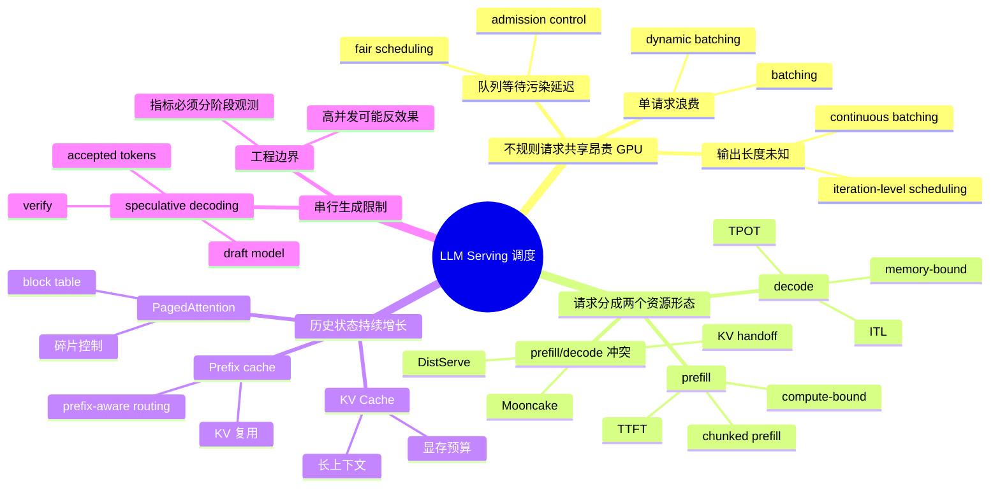
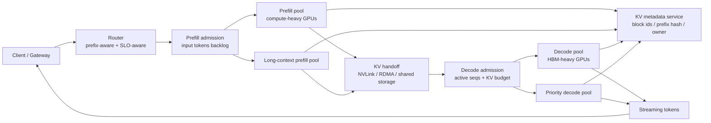
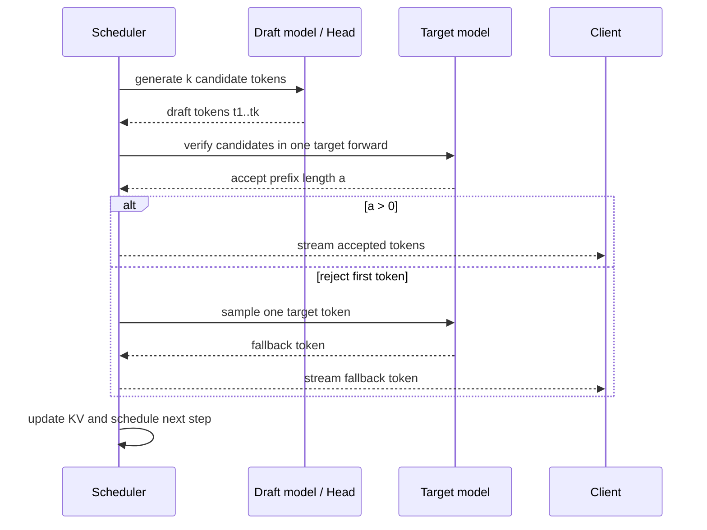

# 第15章：批处理、调度与 KV Cache

> 现代 LLM 推理系统的核心竞争力，很多时候不体现在模型本身，而体现在调度器如何组织请求、缓存状态和显存。

> **关联章节**：本章的 KV Cache 与调度策略，会直接影响 [第16章](16-quantization-compilation-and-engines.md) 的量化与引擎选型；如果显存预算判断错了，再好的推理引擎也很难稳定运行。调度策略最终要通过 [第14章](14-online-inference-architecture.md) 的路由和副本组织落到真实流量上。

## 1. 第一性原理拆解：请求、状态与有限 GPU

### 拆 — 不可化简的问题

剥掉 vLLM、TensorRT-LLM、PagedAttention、DistServe、Mooncake 这些名字，本章面对的不可化简问题只有一个：**大量到达时间、输入长度、输出长度和优先级都不同的请求，要共享少量昂贵 GPU；每个请求还会在生成过程中制造持续增长的状态。** 在线推理不是一次矩阵乘法，而是一条长时间占用资源的工作流。用户输入的 prompt 先触发 prefill，系统要把已有上下文一次性读入模型并生成第一批 KV；之后 decode 每次只前进一步，但每一步都要读取模型权重和历史 KV。于是一个请求不只是"算一次"，而是"先大块算，再反复小步算，并持续占显存"。

这和离线训练的直觉不同。训练中一个 global batch 的形状相对固定，吞吐目标可以压过单个样本延迟；在线服务中，一个 128 token 的短问答和一个 32K token 的长文档请求可能同时进入同一副本。若调度器把它们当成相同任务，短请求会被长 prefill 拖住，decode step 会被大 prompt 阻塞，KV Cache 会被少量长上下文占满，最终表现为 TTFT、ITL、TPOT 和 P99 同时恶化。GPU 利用率看起来很高，也可能只是忙在低价值的重算、搬运和排队上。

因此，本章不是在介绍某个框架的参数，而是在回答一个资源组织问题：**如何把一批不规则请求切成适合 GPU 执行的计算单元，同时让每个请求的 KV 状态可分配、可迁移、可复用、可回收，并且让延迟指标仍然可控。** 批处理解决"单请求浪费 GPU"；continuous batching 解决"一批请求长短不同"；KV Cache 解决"历史上下文不能反复重算"；PagedAttention 解决"KV 状态不能靠连续大块显存管理"；chunked prefill 和 P/D 解耦解决"prefill 与 decode 资源形态冲突"；speculative decoding 解决"decode 每步只产一个 token 的串行性"。它们都不是孤立技巧，而是同一个物理约束被一层层逼出来的结果。

### 推 — 从这个问题如何推导出每个机制

第一步推导 batching。GPU 的强项是大矩阵和高并行度，单请求 decode 往往 batch=1、算子很小、HBM 反复读权重，SM 会空等。于是系统必须把时间上接近的请求合并，让一次 forward 里有更多 token 和序列，摊薄 kernel launch、调度和权重读取成本。但固定 batch 会遇到第二个问题：LLM 输出长度未知，短请求结束后槽位空着，长请求继续拖住整批。于是 continuous batching 成为必然：每个 decode iteration 重新组 batch，完成的请求释放槽位，新请求补进来。

第二步推导 prefill / decode 分离。LLM 请求不是均匀计算。Prefill 处理整段 prompt，通常更接近 compute-bound；decode 每次只生成一个 token，更容易受 HBM 带宽、KV Cache、调度粒度和活跃序列数限制。如果把 32K prompt prefill 和大量短请求 decode 放在同一条队列，长 prefill 会把 decode 的 ITL 拉长。轻量解法是 chunked prefill，把长 prompt 切成 512 或 1024 token 的小片，夹在 decode step 之间执行；重型解法是 Prefill-Decode Disaggregated，把 prefill pool 和 decode pool 拆开，分别扩缩容，但要承担 KV handoff、双队列背压和失败恢复。

第三步推导 KV Cache。自回归生成中，第 N+1 个 token 需要看前 N 个 token。如果每一步都重算全历史，计算量会随上下文长度爆炸；所以必须缓存每层 attention 的 K/V。KV Cache 把重复计算换成显存占用，问题从"算不动"转成"放不下、管不好"。在 70B、长上下文、高并发场景，KV 显存可能比权重更先成为 admission 上限。连续分配又会带来碎片和过度预留，于是 PagedAttention 把 KV 切成固定 block，用 block table 映射逻辑上下文和物理显存；同样的 block 机制又自然支持 prefix cache，让相同 system prompt、few-shot 模板和 RAG 前缀复用 KV。

第四步推导指标。平均吞吐或平均 GPU utilization 不足以判断服务是否好。用户先感知 TTFT，再感知 token 是否稳定吐出；对流式输出，ITL（Inter-Token Latency）往往比总耗时更贴近体验；对平台，goodput 比 raw throughput 更重要，因为违反 SLO 的 token 不应算作有效容量。调度器的目标也因此不是"永远最大 batch"，而是在显存、吞吐、TTFT、ITL/TPOT、公平性和成本之间找到稳定工作点。

### 绘 — 因果链路



### 导 — 读完本章你应该能回答

1. 为什么 LLM 在线推理不能只按 QPS 做容量规划，而必须拆成 input tokens/s、output tokens/s 和活跃 KV 并发？
2. 为什么 continuous batching 能显著提高吞吐，但仍然可能把 TTFT 或 ITL 做坏？
3. 给定层数、KV heads、head_dim、上下文长度和 TP 度数，如何估算每请求 KV Cache 显存，并判断 admission 上限？
4. 为什么 prefill 与 decode 的资源特征不同，chunked prefill 和 Prefill-Decode Disaggregated 分别在解决哪一层冲突？
5. PagedAttention 为什么像操作系统分页，它降低的是哪几类显存浪费，又带来哪些调度复杂度？
6. Speculative decoding 为什么能减少目标模型 decode 步数，为什么在高并发场景下可能不加速？
7. 线上排障时，TTFT、ITL、TPOT、prefix cache hit rate、KV block utilization 和 preemption count 分别指向哪些问题？

## 学习目标

完成本章学习后，你将能够：

1. 理解批处理与调度在推理系统中的价值
2. 区分 Prefill / Decode 两个阶段的资源特征
3. 认识 KV Cache 与 PagedAttention 的核心思想
4. 学会从吞吐、延迟与显存三者之间做权衡
5. 读懂一个简化版 LLM 调度器在解决什么问题
6. 估算 KV Cache 显存占用，预判长上下文服务的显存瓶颈
7. 理解 prefix cache、chunked prefill、speculative decoding 这些进阶优化分别解决什么问题

---

## 本章导读

一个容易被忽视的事实：**LLM 推理服务性能差异的 10 倍甚至 20 倍，往往不来自模型本身，而来自调度器**。

这一点在 2023 年之后被反复验证：

- vLLM 相对 Hugging Face 原生 Transformers：**吞吐 24x**，来自 PagedAttention + continuous batching
- Continuous batching 相对 static batching：**P50 延迟降低、吞吐提升 23x**（Anyscale 早期测试）
- 开 prefix cache 的 chatbot：**TTFT 近乎归零**（相同 system prompt 的请求）

这些数字背后是同一件事 —— **GPU 是昂贵的，不能让它空等**。调度器的全部工作就是在显存、吞吐、延迟、公平性之间做实时权衡，让 GPU 尽可能多做"有价值的工作"。

本章要建立的核心直觉是：

```text
请求不是独立的
  ├── 它们可以共享 prefix（→ prefix cache）
  ├── 它们可以填补彼此的空隙（→ continuous batching）
  ├── 它们共享有限显存（→ PagedAttention、admission control）
  └── 它们的两个阶段（prefill / decode）资源需求完全不同（→ 分池或 chunked）
```

## 正文内容

### 15.1 为什么批处理是推理系统的第一性问题

GPU 适合高吞吐批量计算。如果请求一个个独立执行，GPU 很可能无法高效利用。

因此，批处理的目标是：

- 合并时间上接近的请求
- 提高矩阵计算规模
- 摊薄单次 launch 和调度成本

但批处理不是免费午餐，因为它会引入等待时间。
你可以把总延迟粗略写成：

$$
t_{\text{request}} = t_{\text{queue}} + t_{\text{batch\_compute}}
$$

批处理越激进，`t_batch_compute` 可能更经济，但 `t_queue` 往往会上升。
这就是吞吐和延迟的第一层矛盾。

#### 15.1.1 一个直观的数字：为什么单请求是浪费

一张 H100 的 bf16 峰值是 ~990 TFLOPS。一个 7B 模型跑单请求 decode（batch=1）时，算力利用率通常只有 **1-3%** —— 因为 decode 是 memory-bandwidth-bound，绝大部分时间在从 HBM 读权重，计算单元空等。

| Batch size | 7B decode 吞吐（tokens/sec） | GPU 算力利用率 | 每 token 成本 |
|------------|------------------------------|----------------|---------------|
| 1 | ~50 | ~1% | 高 |
| 8 | ~300 | ~5% | 中 |
| 32 | ~900 | ~15% | 低 |
| 128 | ~2500 | ~35% | 很低 |
| 256 | ~3500 | ~45% | 最低 |

（以上是 7B 在 H100 的典型数量级，具体数字和模型、序列长度、kernel 版本相关）

从这张表可以看到：**batch 从 1 提到 128，吞吐能升 50 倍，单位成本降 50 倍**。这就是为什么 LLM serving 里 batching 是"第一性"问题 —— 如果 batch 永远是 1，显卡 95% 的钱就白花了。

#### 15.1.2 Batching 的演进史

不是所有 batching 都一样。理解这几种演进很重要：

```text
Static batching（朴素批处理）
   │
   │ 问题：短请求要等长请求，槽位不够灵活
   ▼
Dynamic batching（动态批处理，传统 ML 服务常用）
   │
   │ 问题：还是 "一批进，一批出"；LLM 的输出长度差异让这条路走不远
   ▼
Iteration-level / Continuous batching（Orca、vLLM）
   │
   │ 核心：每个 decode 步骤重新组 batch，完成的请求立刻出队，新请求立刻进
   ▼
Chunked prefill + Continuous batching（vLLM V1、TensorRT-LLM）
   │
   │ 核心：prefill 也切片，和 decode 混在同一 batch 里跑
   ▼
Disaggregated prefill / decode（DistServe、Mooncake）
     把两个阶段彻底拆到不同机器
```

对大多数团队来说，**continuous batching 是必选项，chunked prefill 是默认开启**，disaggregated 是"大规模长上下文业务才考虑"的选项。

### 15.2 Prefill 与 Decode 的本质区别

LLM 推理通常分成两个阶段：

#### Prefill

- 处理用户输入 prompt
- 对整段上下文做 attention
- 更接近"大块计算"

#### Decode

- 一次生成一个 token
- 更强调调度粒度和缓存状态
- 请求长度差异更明显

这两个阶段的资源特征并不相同：

| 阶段 | 更像什么 | 常见瓶颈 | 硬件偏好 |
|------|----------|----------|----------|
| Prefill | 批量矩阵计算 | 算力、带宽 | 高 FLOPS GPU |
| Decode | 小步增量生成 | 调度、KV Cache、显存 | 大显存 + 高 HBM 带宽 |

好的推理系统不会把这两个阶段完全当成同一类工作负载处理。

#### 15.2.1 数量级差异：为什么一个长 prompt 能拖死一池 decode

假设 7B 模型处理请求：

- **短 prompt（100 token）prefill**：一次 forward，~10 ms
- **长 prompt（32K token）prefill**：一次 forward，~2000 ms（30-300x 放大）
- **单 token decode**：~20 ms

如果这两个请求都进了同一个副本池，长 prompt 的这 2000 ms prefill 会**独占 GPU 2 秒**，在此期间：

- 其他 decode 请求全部卡住
- 大约 100 个其他 token 被延迟
- 短 prompt 的 TTFT 和 TPOT 同时被污染

这就是"为什么 prefill/decode 争用是 LLM 服务最常见的尾延迟来源"。解决思路有二：要么像 §15.6 介绍的那样把两者拆到不同池，要么像 §15.7b 的 chunked prefill 把大 prefill 切成小片，让 decode 能"插队"。

### 15.3 KV Cache 为什么重要

如果每生成一个新 token 都重新计算全部历史上下文，复杂度会迅速变大。
KV Cache 的核心思想是：

> 把历史 token 的 key / value 保留在显存里，后续 decode 只计算新增 token。

一个非常粗略的 KV Cache 显存估算式可以写成：

$$
M_{\text{kv}} \approx 2 \times L \times H \times T \times B \times \text{dtype\_bytes}
$$

其中：

- `L`：层数
- `H`：每层隐藏表示规模（或等价 head 维度总量）
- `T`：上下文长度
- `B`：并发请求数

这条式子揭示了两个现实：

1. 长上下文会直接把显存吃满
2. 高并发与长输出叠加时，KV Cache 可能比权重本身更难管理

> **参考数量级（仅供建立直觉，实际值因模型结构、GQA 配置、dtype 和实现方式差异较大）**
>
> | 场景 | 典型值 | 说明 |
> |------|--------|------|
> | 7B-8B 模型单卡 warm decode 吞吐 | 每秒数十到数百 token / 请求 | 强依赖 batch 合并程度 |
> | 70B 模型单请求 8K 上下文 KV Cache | 数 GB 到十余 GB | 取决于 KV 头数与数据类型 |
> | 70B 模型单请求 128K 上下文 KV Cache | 约 40 GB（BF16，GQA） | 长上下文会迅速吃掉整卡显存 |
> | Continuous batching 等待窗口 | 亚毫秒到数毫秒 | 窗口越大，吞吐越好但排队越长 |

以 LLaMA-70B 类模型为例，若取 `L=80`、`H=1024`（这里指 K/V 总维度，而不是隐藏层总维度）、`T=128K`、`B=1`、BF16 两字节，则：

$$
M_{\text{kv}} \approx 2 \times 80 \times 1024 \times 131072 \times 1 \times 2 \approx 40\,\text{GiB}
$$

这解释了为什么长上下文服务经常优先受 KV Cache 约束，而不是先受权重大小约束。

#### 15.3.1 KV Cache vs 权重：谁先顶爆？

让我们用一张卡（H100 80 GB）跑 Llama 3 70B（约 140 GB bf16，需要多卡 TP），看不同配置下谁先顶爆：

| 场景 | 权重占用 | KV Cache 占用 | 谁先爆 |
|------|----------|---------------|--------|
| 70B, TP=2, 短 prompt（2K）, B=16 | 70 GB/卡 | ~5 GB/卡 | 权重 |
| 70B, TP=2, 中 prompt（8K）, B=32 | 70 GB/卡 | ~20 GB/卡 | 权重仍是大头 |
| 70B, TP=2, 长 prompt（32K）, B=16 | 70 GB/卡 | ~40 GB/卡 | 接近 1:1 |
| 70B, TP=2, 超长（128K）, B=1 | 70 GB/卡 | ~40 GB/卡 | 1:1 |
| 70B, TP=2, 超长（128K）, B=8 | 70 GB/卡 | **~320 GB/卡，不可行** | KV 爆，根本装不下 |

这个"权重越大的模型 KV Cache 越贵"规律意味着：

- 小模型（7B）通常先被权重压住，KV Cache 不是主要问题
- 大模型（70B+）+ 长上下文场景，KV Cache 会比权重更先顶爆
- 权重量化（→ [第16章](16-quantization-compilation-and-engines.md)）不一定解决问题 —— 你需要的可能是 **KV Cache 量化** 或 **GQA / MLA 这类架构改进**

#### 15.3.2 MHA、GQA、MLA：KV Cache 的架构级优化

从模型结构层面，不同 attention 机制对 KV Cache 开销影响巨大：

| 机制 | 典型模型 | KV Cache 相对规模 | 说明 |
|------|----------|-------------------|------|
| MHA（Multi-Head） | GPT-3、Llama 1 | 1x | 每个 head 独立 K/V |
| MQA（Multi-Query） | Falcon、PaLM | ~1/N | 所有 head 共享一套 K/V |
| GQA（Grouped-Query） | Llama 2/3、Mistral | ~1/G（典型 1/4 - 1/8） | 折中：每 G 个 head 共享 K/V |
| MLA（Multi-Latent） | DeepSeek V2/V3 | ~1/10 以下 | 把 K/V 压到低维 latent |

从平台视角：**同一个模型参数量，MHA 和 MLA 的显存预算可能差 10 倍**。所以看一个模型"能不能上 128K 上下文"，不能只看参数量，要看 attention 实现。

### 15.3b Worked Example：LLaMA-70B 推理容量规划

现在把前面的公式落到一个平台工程师真正会遇到的问题上：

> 一个线上聊天服务要上 LLaMA-70B 类模型，目标是 **100 QPS**、**P99 TTFT < 500 ms**、**P99 TPOT < 50 ms/token**。典型请求是 3072 input tokens + 512 output tokens，容量规划按 4K resident context 做 admission。需要多少副本、多少 GPU、每月大概要多少钱？

先明确假设。真实生产一定要用自己的压测数据替换这些数字，但推演方法不变。

| 项 | 取值 | 说明 |
|----|------|------|
| 模型 | LLaMA-70B 类 dense 模型 | 约 70B 参数 |
| 层数 | 80 | LLaMA 70B 量级 |
| Attention | GQA，8 个 KV heads，head_dim=128 | 不是 64 个 query heads 全量存 KV |
| 权重精度 | BF16 | 权重约 `70B x 2 bytes = 140 GB` |
| KV 精度 | BF16 | 每个 K/V 元素 2 bytes |
| 单副本 | 4 x H100 80 GB，TP=4 | 一个 replica 是一个 4 卡 tensor-parallel group |
| 显存利用上限 | 90% | 80 GB 卡按 72 GB 可用预算算 |
| Runtime 预留 | 8 GB/GPU | CUDA graph、workspace、碎片、通信 buffer |
| GPU 单价 | 3.5 美元/GPU-hour | 只算 GPU 租用，不含 CPU、网络、存储和平台税 |

#### 第一步：算单请求 KV Cache

GQA 下每个 token 的 KV Cache 不是按 hidden size `8192` 算，而是按 KV heads 的总维度算：

$$
\begin{aligned}
M_{\text{kv/token}}
&= 2 \times L \times n_{\text{kv\_heads}} \times d_{\text{head}} \times \text{dtype\_bytes} \\
&= 2 \times 80 \times 8 \times 128 \times 2 \\
&= 327{,}680\ \text{bytes} \approx 320\ \text{KiB/token}
\end{aligned}
$$

4K resident context 的单请求 KV Cache 是：

$$
4096 \times 320\ \text{KiB} = 1.25\ \text{GiB/request}
$$

这是整个 TP replica 的 KV 总量。TP=4 时，KV heads 通常按卡切分，所以单 GPU 约为：

$$
1.25\ \text{GiB} / 4 = 0.3125\ \text{GiB/GPU/request}
$$

#### 第二步：算单副本最大并发

每张 H100 80GB 的显存账：

| 项 | 每 GPU 显存 |
|----|-------------|
| 可用预算（80GB x 90%） | 72 GB |
| 权重 shard（140GB / TP=4） | 35 GB |
| Runtime / workspace 预留 | 8 GB |
| 留给 KV Cache | 约 29 GB |

因此 4K context 下，单副本受 KV 显存约束的理论并发是：

$$
\lfloor 29 / 0.3125 \rfloor = 92\ \text{requests/replica}
$$

这不是生产 admission 上限。PagedAttention 可以把碎片浪费压低，但不能消除长尾、swap、prefix cache miss 和批调度抖动。平台上通常会把 `max_num_seqs` 设在 64-80 这一档，给 P99 留余量。

#### 第三步：算单副本吞吐

容量规划不能只看"能放多少请求"，还要看 prefill 和 decode 哪个先打满。假设用 vLLM / TensorRT-LLM 类 continuous batching + PagedAttention，并在同类硬件上压测得到下面的保守容量：

| 阶段 | 资源特征 | 规划用单副本能力 | SLA 影响 |
|------|----------|------------------|----------|
| Prefill | compute-bound，大矩阵计算 | 约 28K input tokens/s | 决定 TTFT；长 prompt 会制造排队尖峰 |
| Decode, batch=32 | memory-bandwidth-bound | step latency 约 28 ms，约 1.1K output tokens/s | TPOT 余量大，但吞吐低 |
| Decode, batch=64 | memory-bandwidth-bound | step latency 约 42 ms，约 1.5K output tokens/s | 满足 P99 TPOT < 50 ms 的主工作点 |
| Decode, batch=92 | memory + 调度都紧 | step latency 约 60 ms，约 1.5K output tokens/s | 吞吐不再明显增加，且违反 TPOT |

这张表给出一个关键结论：**单副本虽然能在显存上放 92 个 4K 请求，但为了 TPOT < 50 ms，decode admission 应该按 64 个活跃序列左右规划**。Continuous batching 的价值是让这 64 个槽位持续被填满；PagedAttention 的价值是让 4K 长短不一的请求不因为碎片提前 OOM。它们提高 goodput，但不会让 60 ms 的 decode step 变成满足 50 ms SLA。

#### 第四步：把 100 QPS 转成 token 需求

请求分布假设为：

```text
QPS = 100 requests/s
input = 3072 tokens/request
output = 512 tokens/request
resident context cap = 4096 tokens/request
```

则集群 token 需求是：

$$
\text{prefill demand} = 100 \times 3072 = 307{,}200\ \text{input tokens/s}
$$

$$
\text{decode demand} = 100 \times 512 = 51{,}200\ \text{output tokens/s}
$$

按单副本能力粗算：

$$
N_{\text{prefill}} = \lceil 307{,}200 / 28{,}000 \rceil = 11\ \text{replicas}
$$

$$
N_{\text{decode}} = \lceil 51{,}200 / 1{,}500 \rceil = 35\ \text{replicas}
$$

如果只按平均吞吐部署 35 个副本，看起来 decode 刚好够。但 P99 SLA 不能按 100% 利用率规划：请求到达不是均匀的，输出长度有长尾，batch 也不可能每一步都正好填满。按 70% 目标利用率留尾延迟余量：

$$
N_{\text{replica}} = \left\lceil \max(11, 35) / 0.70 \right\rceil = 50\ \text{replicas}
$$

最终资源：

```text
50 replicas x 4 H100/replica = 200 H100
200 H100 x $3.5/hour = $700/hour
$700/hour x 24 x 30 = $504,000/month
```

这个结果很贵，但它是合理的数量级：100 QPS 的 70B 在线生成服务，本质上是在持续生产每秒 5 万多个 output tokens。若业务实际平均输出只有 128 tokens，decode demand 会降到 12,800 tokens/s，副本数也会显著下降；若平均输出是 1024 tokens，成本大约翻倍。

#### 第五步：检查并发是否和 KV 上限冲突

在主工作点 `batch=64`、TPOT 约 42 ms 时，一个 512-token 输出请求的 decode 生命周期约为：

$$
512 \times 42\ \text{ms} \approx 21.5\ \text{s}
$$

整个集群的平均活跃 decode 请求数约为：

$$
100\ \text{QPS} \times 21.5\ \text{s} = 2150\ \text{active requests}
$$

50 个副本平均每副本：

$$
2150 / 50 = 43\ \text{active requests/replica}
$$

43 低于 decode SLA 工作点 64，也低于 4K KV 显存理论上限 92。也就是说，在这个 4K 场景里，**decode token 吞吐先于 KV 显存成为主约束**；但 KV 显存仍然决定了 admission 上限和长尾时是否会 preempt。

#### Prefill / Decode 对容量估算的影响

同一组 QPS，prefill 和 decode 的扩容逻辑不同：

| 维度 | Prefill | Decode | 平台工程边界 |
|------|---------|--------|--------------|
| 主要输入 | input tokens/s | output tokens/s x active sequences | 不能只按 requests/s 规划 |
| 主要瓶颈 | FLOPS、长 prompt 排队 | HBM 带宽、KV Cache、step latency | 两阶段要分别打点 |
| 影响的 SLO | TTFT | TPOT、整体完成时间 | TTFT 好不代表 TPOT 好 |
| batching 策略 | chunked prefill 控制单次大 prompt | continuous batching 保持活跃槽位 | 长 prompt 和短 decode 混跑会污染 P99 |
| 扩容信号 | prefill queue、input token backlog | decode queue、KV blocks、TPOT P99 | autoscaler 应看 token backlog，不只看 GPU 利用率 |

如果做 Prefill-Decode 分离，这个例子的容量账会变成两套池：

| 池 | 按 70% 利用率的副本数 | GPU 数 | 说明 |
|----|----------------------|--------|------|
| Prefill pool | `ceil(11 / 0.70) = 16` | 64 H100 | 隔离长 prompt，保护 TTFT |
| Decode pool | `ceil(35 / 0.70) = 50` | 200 H100 | 仍由 output token demand 主导 |
| 合计 | 66 | 264 H100 | 同卡同精度下不一定省钱，主要收益是隔离和独立扩缩 |

P/D 分离还要额外付出 KV transfer 成本。3072-token prompt 的 KV 大小约为：

$$
3072 \times 320\ \text{KiB} \approx 0.94\ \text{GiB/request}
$$

100 QPS 意味着 prefill 到 decode 的集群级 KV handoff 带宽约：

$$
100 \times 0.94 = 94\ \text{GiB/s}
$$

如果跨机走 200Gbps IB（有效约 25 GB/s），平均带宽看似可以靠多机分摊，但 burst、tail latency、GPU-Direct RDMA 支持和失败重试都会进入 SLO。若只是 25GbE，这个架构基本不适合把 KV 跨机搬来搬去。

#### 敏感性分析：4K 到 32K context 会发生什么

把 resident context cap 从 4K 提到 32K，KV Cache 线性放大 8 倍：

| Context cap | KV / request（replica 总量） | KV / GPU / request（TP=4） | 单副本理论并发（29GB KV/GPU） | 容量主约束 |
|-------------|------------------------------|-----------------------------|-------------------------------|------------|
| 4K | 1.25 GiB | 0.3125 GiB | 92 | decode token 吞吐 |
| 8K | 2.5 GiB | 0.625 GiB | 46 | decode + KV 都要看 |
| 16K | 5 GiB | 1.25 GiB | 23 | KV/admission 开始主导 |
| 32K | 10 GiB | 2.5 GiB | 11 | KV 显存和长 prefill 主导 |

32K 时即使 output 仍是 512 tokens，活跃请求平均仍约 2150 个。若每副本为了显存和 TPOT 只能安全放 8-10 个长上下文请求，仅并发就需要 215-269 个副本，也就是 860-1076 张 H100。更糟的是，input tokens/s 从 `100 x 3072` 变成接近 `100 x 31K`，prefill pool 也会被打满。长上下文容量规划不能简单说"把 max context 从 4K 开到 32K"，它通常意味着：

- 更严格的 admission control：按 tenant、请求类型、context length 分桶限流
- 更激进的 prefix cache / KV reuse：能复用 system prompt、few-shot、RAG 模板就不要重算
- 更小的 decode batch 或更多副本：避免长 KV 把短请求挤出
- KV Cache 量化、GQA/MLA、更大 TP/PP 拆分：用模型结构和并行策略换显存
- 单独的长上下文池：不要让 32K 请求和 1K 聊天请求共享同一组 admission

这个 worked example 的重点不是记住 50 个副本这个数字，而是记住容量规划顺序：**先把 QPS 拆成 input token demand 和 output token demand，再算 KV 显存并发上限，最后用 P99 SLA 决定可接受的利用率和批处理工作点**。

### 15.4 为什么固定 batch 不够

普通批处理适合形状相近、耗时相近的任务。
但 LLM 请求往往非常不规则：

- 输入长度不同
- 输出长度不同
- 有的请求几步就结束，有的请求持续很久

如果用固定 batch，会遇到：

- 短请求等长请求
- 已完成请求占着 batch 槽位
- 资源利用率不稳定

这就是为什么现代 LLM Serving 更强调 **continuous batching**。

#### 15.4.1 Continuous Batching 工作原理的直观图示

假设 batch size = 4，四个请求 A/B/C/D 的输出长度分别是 2/10/3/5 个 token：

**Static batching**：
```text
step:  1  2  3  4  5  6  7  8  9  10
  A:   x  x  -  -  -  -  -  -  -  -      (完成后槽位空着)
  B:   x  x  x  x  x  x  x  x  x  x
  C:   x  x  x  -  -  -  -  -  -  -      (完成后槽位空着)
  D:   x  x  x  x  x  -  -  -  -  -      (完成后槽位空着)

GPU 利用率曲线: 100% → 50% → 25% → 25%
```

**Continuous batching**：
```text
step:  1  2  3  4  5  6  7  8  9  10
  A:   x  x  [E E E E E E E E]         (槽位让给新请求 E)
  B:   x  x  x  x  x  x  x  x  x  x
  C:   x  x  x  [F F F F F F F]        (槽位让给新请求 F)
  D:   x  x  x  x  x  [G G G G G]      (槽位让给新请求 G)

GPU 利用率: 基本保持 100%
```

核心思想非常简单：**每一步 decode 结束后，完成的请求立刻出队，队列里的新请求立刻顶上**。没有"等一整个 batch 跑完"的概念。

这对工程师的启示：**几乎所有现代 LLM 服务都应该开 continuous batching**，vLLM / TensorRT-LLM / TGI / SGLang 都默认打开。如果你的服务还在用 static batching，通常能立刻拿到 2-10x 的吞吐提升。

### 15.5 一个简化版 continuous batching 调度器

可以用下面的伪代码理解它的目标：

```text
while service_is_running:
    collect newly arrived requests
    move ready requests into prefill queue
    run as much prefill as memory allows

    move prefilled requests into decode queue
    build current decode batch from active requests
    run one decode step

    remove finished requests
    recycle freed KV blocks
```

调度器真正解决的问题不是"如何把请求放进队列"这么简单，而是：

- 哪些请求先进
- 哪些请求可被延后
- 显存还够不够
- KV block 怎么回收
- 是否允许长请求饿死短请求

#### 15.5.1 真实调度器要处理的"边角案例"

上面的伪代码是教学版。生产级调度器（比如 vLLM V1）还要处理这些问题：

| 情况 | 调度器要做什么 |
|------|----------------|
| 新请求到来但 KV 显存不够 | 要么拒绝（admission）、要么抢占（preempt）一个已在跑的请求 |
| 某个请求的 KV 已经分配但还没开始 decode | 要不要因为新的高优请求把它换出？ |
| 某个 decode 请求已经跑了 500 个 token，显存告急 | 抢占它（swap 或 recompute），还是杀掉重跑？ |
| 一个超长 prompt 进来 | chunked prefill 切片，还是独占一次 forward？ |
| 多个请求带相同 system prompt | prefix cache 命中，这些请求能共享前缀的 KV |
| 有抢占 / 换出历史的请求恢复 | 用 recompute 还是 swap-in？哪个更快？ |

这些判断的共同点是：**没有一个"最优"答案，全看当前显存、队列状态、SLO 预算**。所以好的调度器是**启发式 + 可调参数**的组合，不是固定算法。

#### 15.5.2 Preemption：当显存不够时，谁先被"踢出去"

在 continuous batching 下，新请求抢占老请求是常态。vLLM 的两种抢占策略：

| 策略 | 机制 | 开销 | 适合场景 |
|------|------|------|----------|
| Swap preemption | 把被抢占请求的 KV 从 GPU 挪到 CPU 内存 | 几十毫秒（PCIe 传输） | 显存和内存都够，但 GPU 显存紧张 |
| Recompute preemption | 把被抢占请求的 KV 直接丢掉，恢复时重算 prefill | 几百毫秒到秒级（看 prompt 长度） | 内存不够、或 prompt 不长 |

V1 版本默认采用 recompute，因为：

- swap 需要 CPU 内存 buffer，多租户下 buffer 规模难定
- prefix cache 能让 recompute 的"重算"其实跳过大部分计算

**一个容易被忽视的事实**：prefix cache 不仅是吞吐优化，还是**让 preemption 变便宜**的关键机制。

### 15.6 Prefill / Decode 解耦会怎样改写调度器

一旦把 prefill 和 decode 分到不同资源池，调度器就不再只是"排一个队列"，而是变成两段 admission control：

```text
arrival
  -> prefill admission
  -> prefill compute
  -> KV handoff
  -> decode admission
  -> token-by-token scheduling
```

这里新增的工程问题包括：

| 问题 | 一体化副本里较弱 | 解耦后为什么会变重要 |
|------|------------------|----------------------|
| KV handoff 延迟 | 状态本地传递 | 需要跨进程甚至跨机器搬运 |
| 双队列背压 | 通常只有单队列 | prefill 快、decode 慢时会堆积中间状态 |
| 容量配比 | 单池统一扩缩 | prefill 池和 decode 池要分别做容量规划 |
| 失败恢复 | 副本级重试即可 | 需要处理"prefill 成功、decode 未接住"的半完成状态 |
| 资源异构 | 全用同一种卡 | 可以给 prefill 用 compute-heavy 卡，给 decode 用 memory-heavy 卡 |

所以解耦并不是免费吞吐优化，而是把问题从"单机调度"升级成"跨池状态调度"。这一点与 [第14章](14-online-inference-architecture.md) 的架构拆分是一一对应的。

如果你在行业文章或开源方案里看到 `DistServe`、`Mooncake`、`Splitwise` 这类名字，可以把它们先归到同一类问题域里理解：都是在探索 prefill / decode 解耦、KV 远端传输和双池调度的不同工程折中。

#### 15.6.1 DistServe / Mooncake 类架构的共同骨架

DistServe 的核心思想可以概括为"goodput-oriented disaggregation"：把 prefill worker 和 decode worker 分开建模，按 TTFT 与 TPOT 两个目标分别放置和扩缩。Mooncake 更强调 KV-centric serving：把 KV Cache 当作一等状态来管理，围绕 KV placement、transfer、reuse 和 cache locality 做调度。两者实现路径不同，但在平台视角里都落到同一个架构骨架：



| 组件 | DistServe 视角 | Mooncake 视角 | 工程边界 |
|------|----------------|---------------|----------|
| Router | 按 SLO、长度和池容量选 prefill/decode 路径 | 尽量把相同 prefix 和 KV locality 路由到可复用位置 | 路由随机会让 prefix cache 和 KV locality 同时失效 |
| Prefill pool | 主要消化 input tokens/s，保护 TTFT | 产生可复用 KV，并把 KV 注册为可调度对象 | 长 prompt 需要 admission 和 chunking，否则仍会打爆队列 |
| KV handoff | prefill 完成后把 KV 交给 decode | KV 是核心数据面，需要 placement 与传输优化 | 跨机传输慢于收益时，解耦会变成负优化 |
| Decode pool | 按 active sequences、TPOT/ITL 和 HBM 规划 | 选择已有 KV 或最近 KV 的 worker 做 decode | decode 池常由 output tokens/s 主导，不一定随 prefill 同比例扩容 |
| Metadata | 记录请求状态、KV owner、失败恢复 | 记录 block、prefix hash、引用计数与 eviction | metadata 不一致会导致重复计算、泄漏或错误复用 |

一个生产实现通常还会加三层保护：第一，prefill queue 和 decode queue 都有独立限流，不能让 prefill 产生的 KV 中间态无限堆积；第二，KV handoff 必须有超时、重试和幂等标识，避免"prefill 成功但 decode 没接住"的半完成请求泄漏显存；第三，decode admission 必须按剩余输出预算、tenant 优先级和 block 可用量共同决策，而不是简单 FIFO。

**工程边界**：P/D 解耦首先是 SLO 隔离与弹性扩缩方案，其次才可能是降本方案。若流量主要是短 prompt、短输出，或者副本内 chunked prefill 已经能把 TTFT/ITL 压住，解耦增加的网络、metadata 和故障恢复复杂度通常不划算。若业务是 16K-128K 长上下文、RAG 模板高度复用、prefill 尖峰与 decode 长尾明显错峰，解耦才更可能体现价值。

#### 15.6.2 KV Handoff：解耦架构里最被低估的难点

P/D 解耦的宣传点通常是"吞吐提升 2-4x"。但工程上，**KV handoff（把 prefill 产生的 KV 从 A 机器送到 B 机器）是这个架构的核心难点**。

一个 70B 模型、8K prompt 的 KV 数据量大约是 10-20 GB 级别。在不同网络下的传输时间：

| 传输路径 | 有效带宽 | 10 GB 的传输时间 |
|----------|----------|------------------|
| NVLink（同机） | ~300 GB/s | 30 ms |
| IB 200Gbps（跨机） | ~25 GB/s | 400 ms |
| 以太网 25GbE（跨机） | ~3 GB/s | 3300 ms |

对比：一个 decode 步大约 20 ms。也就是说，**如果 KV 传输慢于 decode 一步的时间，解耦的收益可能被传输吃掉**。所以 P/D 解耦对网络的要求非常高，通常要求 IB 及以上，且支持 GPU-Direct RDMA。

常见的工程折中：

- **同机解耦**：prefill 和 decode 在同一机器的不同 GPU（走 NVLink），传输便宜但资源弹性变差
- **局部解耦**：只把特别长的 prompt 送去独立 prefill 池，短 prompt 还是一体化
- **KV 复用**：用 prefix cache 让很多请求根本不需要 handoff

#### 15.6.3 ITL 指标：为什么 decode 不能只看 TPOT

TTFT（Time To First Token）衡量用户等多久看到第一个 token，TPOT（Time Per Output Token）常用总 decode 时间除以输出 token 数，ITL（Inter-Token Latency）则看流式输出中相邻 token 之间的真实间隔。TPOT 是平均账，ITL 是体验账：一个请求平均 40 ms/token，但中间出现 3 次 800 ms 卡顿，TPOT 可能仍然合格，用户却会明显感到输出停顿。

| 指标 | 计算口径 | 主要受什么影响 | 典型告警信号 | 调度动作 |
|------|----------|----------------|--------------|----------|
| TTFT P99 | arrival 到第一个 token | prefill queue、prompt 长度、prefix hit、chunked prefill | 长 prompt 租户进入后整体首 token 变慢 | prefill 分桶、prefix-aware routing、提高 prefill pool |
| ITL P50/P99 | 相邻 streaming token 时间差 | decode step latency、active seqs、preemption、KV miss | 输出时快时慢，流式体验抖动 | 降低 `max_num_seqs`、限制长输出、拆 decode 池 |
| TPOT P99 | decode 总时长 / output tokens | 平均 decode 能力、batch 工作点 | 总体生成慢但不一定有明显卡顿 | 调整 batch、引擎、量化和 speculative decoding |
| E2E latency | arrival 到最终 token | TTFT + output length x TPOT | 长输出请求尾延迟大 | 按输出长度 admission，设置 max tokens 和排队上限 |
| Goodput | 满足 SLO 的 tokens/s 或 req/s | 以上全部 | throughput 高但 SLO 失败率高 | 以 SLO 约束做 autoscaling，而不是只看 GPU 利用率 |

ITL 的采集要在服务端 streaming flush 点打点，而不是只在模型 worker 内部打点。否则网络缓冲、gateway backpressure、client 断连重试和 HTTP/2 flush 策略都会被漏掉。实践中建议同时记录 `itl_ms_bucket{model,tenant,prompt_len_bucket,output_len_bucket,pool}`，再和 `decode_step_ms`、`num_running_seqs`、`kv_cache_usage`、`preemption_total` 关联。若 `decode_step_ms` 稳定但 ITL 抖，问题更可能在网关或流式传输；若二者同步抖，问题更可能在调度器或 KV 状态。

### 15.7 PagedAttention 在解决什么

如果 KV Cache 需要按连续显存预分配，那么会造成显著浪费：

- 请求长度未知
- 已完成请求释放后留下碎片
- 高并发下显存利用率下降

PagedAttention 的思路类似操作系统分页：

- 把 KV Cache 切成固定大小 block（vLLM 默认 block_size=16 个 token）
- 逻辑上连续，物理上可不连续
- 通过映射表（block table）管理分配和回收

这意味着推理系统可以：

- 更高效地复用显存
- 降低碎片
- 更灵活地容纳不同长度请求

#### 15.7.1 数字感受：PagedAttention 省了多少显存

PagedAttention 论文和后续 vLLM 数据显示：**传统系统浪费 60-80% 的 KV Cache 显存，vLLM 把浪费降到 4% 以下**。

浪费来自三种碎片：

1. **内部碎片**：为最大可能长度预分配，大部分没用到
2. **外部碎片**：不同长度请求释放后留下大小不一的空洞
3. **保留碎片**：为"可能还要生成的 token"预留

传统连续分配：
```text
[AAAAAA            ][BBBBBBBBBB  ][CCC       ]
  ↑ 实际用的        ↑ 预留的空间，大部分浪费
```

PagedAttention：
```text
block table for A: [0, 2, 5]
block table for B: [1, 3, 4, 7]
block table for C: [6]
物理显存: [B0][A0][A1][B1][B2][A2][C0][B3]
         每个 block 16 token，按需分配、按需回收
```

实际收益：**同样显存可以跑 3-5 倍更多的并发请求**。这就是 vLLM 为什么能在同样硬件上达到 24x 吞吐的核心原因之一。

#### 15.7.2 Prefix Cache：PagedAttention 的"副产品"杀手锏

PagedAttention 有个意想不到的副产品：**不同请求可以共享 KV block**。

如果两个请求有相同的 system prompt：
```text
Req A: "You are a helpful assistant. <user: what's 1+1?>"
Req B: "You are a helpful assistant. <user: capital of France?>"
         └──── 相同的 prefix ────┘
```

它们的前 N 个 token 的 KV 完全一样。PagedAttention 可以让这两个请求**共享同一批 physical KV block**，只有 prompt 分叉后才各自分配新 block。

这带来两个巨大收益：

1. **显存节省**：高复用的 system prompt 只需存一份
2. **TTFT 降到接近零**：后续相同 prefix 的请求直接跳过 prefill 部分

根据 vLLM V1 的数据：**prefix cache 命中时 TTFT 降到近零；即使零命中，也几乎没有吞吐损失（<1%）**。

对平台工程的启示：**prefix cache 应该默认开启**，没有理由不开。但要配合 prefix-aware 路由（见 [第14章](14-online-inference-architecture.md) §14.3.1），否则命中率会被随机路由拉低。

### 15.7b Chunked Prefill：一个被低估的关键优化

前面提到 prefill 和 decode 争用 GPU 是 LLM 服务最大的尾延迟来源。完整的 P/D 解耦（§15.6）是重型方案，**chunked prefill 是一个轻量得多、效果也很显著的替代**。

#### 15.7b.1 核心思想

不解耦，而是在**同一次 forward 中**把 prefill 切片和 decode token 混在一起：

```text
Forward pass 的 batch 构成（chunked prefill 启用）:

┌───────────────────────────────────────────┐
│ prefill chunk of req A (first 512 tokens) │
│ prefill chunk of req B (first 512 tokens) │
│ decode token of req C                     │
│ decode token of req D                     │
│ decode token of req E                     │
│ ...                                        │
└───────────────────────────────────────────┘

下一次 forward:

┌───────────────────────────────────────────┐
│ prefill chunk of req A (tokens 512-1024)  │
│ decode token of req B (now prefill done)  │
│ decode token of req C                     │
│ ...                                        │
└───────────────────────────────────────────┘
```

这样：
- 长 prompt 的 prefill 不再"霸占"一次 forward
- decode 请求能持续推进，TTFT / TPOT 都稳定
- 实现代价远低于完整的 P/D 解耦

#### 15.7b.2 什么时候 chunked prefill 是默认项

vLLM V1、TensorRT-LLM、SGLang 都已经默认开启或推荐开启 chunked prefill。对大多数团队的建议是：

- **如果你的流量有任何长 prompt**（> 1K token），开
- **如果你的 TPOT 在某些时段异常**，开
- **如果你本来准备上 DistServe**，先试 chunked prefill，很多场景已经够用

唯一要注意的是 `chunk_size` 参数的选择：太小会增加 schedule overhead，太大又失去切片意义。vLLM 默认是 512 token 左右，大多数场景不需要动。

### 15.8 一个简单的调度权衡表

| 设计选择 | 收益 | 代价 |
|----------|------|------|
| 更大 batch | 更高吞吐 | 更长排队时间 |
| 更激进 KV Cache | 更快 decode | 更大显存压力 |
| 更强公平调度 | 降低饥饿 | 可能损失吞吐 |
| 更保守 admission | 更稳 | 峰值吞吐下降 |
| 更大 chunk_size | 调度 overhead 更低 | 长 prompt 更容易卡 decode |
| 更激进 preemption | 高优先级响应更快 | 被抢的请求 recompute 成本高 |

所以调度器的本质不是"尽量快"，而是：

> 在显存、吞吐、延迟和公平性之间做持续的实时权衡。

#### 15.8.1 几个关键调度参数

以 vLLM 为例，生产上最值得调的几个参数：

| 参数 | 含义 | 经验值 | 影响 |
|------|------|--------|------|
| `max_num_seqs` | 单 step 最多多少个请求同时跑 | 128-512 | 吞吐 vs TTFT/TPOT |
| `max_num_batched_tokens` | 单 step 所有 token（prefill+decode）总上限 | 4K-16K | 控制 prefill 切片大小 |
| `gpu_memory_utilization` | 显存占用比例 | 0.85-0.95 | 留给 KV 的空间 vs OOM 风险 |
| `enable_prefix_caching` | 是否开 prefix cache | 默认 True | 几乎总是开 |
| `enable_chunked_prefill` | 是否开 chunked prefill | 默认 True（V1） | 几乎总是开 |
| `block_size` | PagedAttention block 大小 | 16 | 很少需要动 |
| `swap_space` | CPU 上给 preemption 保留多少 | 4-16 GB | swap vs recompute 选择 |

调参心法：**先固定架构选项（prefix cache、chunked prefill 都开），再调数值参数**。数值参数之间耦合很强，一次动一个变量。

### 15.9 Speculative Decoding 简述

Speculative decoding 的核心思路是：先让一个更小、更快的草稿模型生成候选 token，再由目标大模型批量验证；验证通过的部分直接接受，不通过的部分再回退重算。



| 收益 | 条件 | 限制 |
|------|------|------|
| 降低目标模型 decode 步数 | 草稿模型足够快，且与目标模型分布接近 | 双模型协同更复杂 |
| 提高单请求感知速度 | 验证批处理做得好 | 对短输出或低并发收益有限 |
| 理论上保持目标模型分布 | 验证阶段严格执行 | 实现、观测和排障成本上升 |

它适合的是 decode 成本占主导、且平台能接受更复杂运行时的场景，不是所有在线服务的默认优化项。

#### 15.9.1 几种投机解码变体

| 变体 | 草稿来源 | 典型加速 | 复杂度 |
|------|----------|----------|--------|
| Draft model | 单独训练的小模型（比如 1B 对 70B） | 2-3x | 中 |
| EAGLE | 从目标模型的 hidden state 直接预测 | 2-4x | 高 |
| n-gram / suffix | 用请求自身的 prefix 做 n-gram 预测 | 1.5-2x | 低 |
| Medusa | 在目标模型上加多头预测 | 2-3x | 中（需改模型） |

**n-gram 投机解码是一个经常被低估的选项**：它不需要额外模型，代码改动很小，对"大量重复文本"的场景（代码补全、结构化输出）收益很高。vLLM、SGLang 都已经内置。

#### 15.9.2 一个投机解码的"隐藏成本"

投机解码的吞吐收益来自**降低 decode 步数**，但代价是**每步计算量变大**（要验证多个候选）。

这意味着：

- **低并发、decode 瓶颈**：收益大（原本 GPU 利用率低，多算一些没成本）
- **高并发、已经填满 batch**：收益小甚至反效果（GPU 已经满了，再塞更多计算只是排队）

所以投机解码不是"全场景加速器"，它是**给低并发或长输出场景的特效药**。

**工程边界**：上线 speculative decoding 前要先压测 accepted tokens/step，而不是只看论文里的加速倍数。若 draft 每步预测 4 个 token，但平均只接受 1.2 个，同时目标模型验证 forward 让 batch token 数翻倍，decode pool 的 goodput 可能下降。生产上至少要观测 `draft_latency_ms`、`verify_latency_ms`、`acceptance_rate`、`accepted_tokens_per_step`、`fallback_rate` 和 ITL P99；并按场景开关，例如代码补全、结构化 JSON、长文本续写可打开，短问答、高并发聊天可关闭或只对低负载时段启用。使用独立 draft model 时还要考虑权重显存、版本一致性和发布回滚；使用 Medusa/EAGLE 这类模型内方法时，要确认推理引擎、量化路径和 KV layout 都支持对应 head 或 hidden-state 预测。

### 15.10 MoE 模型的调度特殊性

MoE 模型并不是简单把 dense 模型做大，而是把调度问题进一步放大：不同 token 会路由到不同 expert，导致负载不均衡和显存分布都更难预测。

| 问题 | 体现 | 平台影响 |
|------|------|----------|
| Expert 负载倾斜 | 热门 expert 被打满，冷门 expert 空闲 | 吞吐不稳、尾延迟抖动 |
| Token routing 波动 | 同 batch 内 token 走向不同设备 | 通信和同步成本上升 |
| 显存分布不均 | expert 状态与 cache 不均衡 | admission control 更复杂 |

这也是为什么 MoE 服务通常需要把调度、通信拓扑和容量规划一起看，而不能只复用 dense 模型的批处理策略。

#### 15.10.1 MoE 常见工程对策

对 MoE 服务，有几个常见的平台级对策：

| 对策 | 解决什么 | 代价 |
|------|----------|------|
| Expert parallelism（EP） | 把不同 expert 放到不同 GPU | 需要 all-to-all 通信 |
| Capacity factor | 限制每个 expert 每批最多接收多少 token | 可能丢 token，精度受损 |
| 动态 batching by routing | 先 route 再组 batch | 调度复杂度上升 |
| Expert 预热 | 冷 expert 也要预热，避免首批请求慢 | warmup 更长 |

对平台团队：**MoE 的基础设施复杂度至少是 dense 的 2x**。如果团队还没把 dense 模型的 serving 做稳，不建议立刻上 MoE。

### 15.11 多模态请求的调度差异

多模态请求会把"不规则性"再放大一层，因为 prefill 成本不再只由文本 token 决定。

| 请求类型 | 额外负担 | 调度上的常见动作 |
|----------|----------|------------------|
| 图文问答 | 视觉 encoder 预处理、图像 token 展开 | 把大图和普通文本分层排队 |
| 文档理解 | OCR、版面解析、长上下文拼接 | 给 prefill 单独预算与更严格 admission |
| 语音输入 | 音频分帧、流式 chunk 聚合 | 将编码器阶段与生成阶段拆开观测 |
| 视频输入 | 帧采样、跨帧编码、极长 token 序列 | 几乎必须独立资源池 |

这意味着多模态服务的 batch key 往往不仅包含长度，还包含模态类型、预处理版本和 encoder 负载等级。否则同一批次里的请求 shape 差异太大，吞吐和尾延迟都会变差。

**一个实用经验**：多模态服务上线前，专门看一下"图像 token 占比"对资源的影响。一张高分辨率图可以轻易展开成 1000-4000 个 token，等价于一段很长的文本 prompt，但用户不会意识到这一点。

### 15.12 工程建议

#### 必选项（几乎总是开）

- Continuous batching
- PagedAttention（vLLM、TensorRT-LLM 都默认）
- Prefix cache
- Chunked prefill

#### 按场景选

- **长上下文多 + 短请求多混部** → chunked prefill（优先）或 P/D 解耦（大规模）
- **低并发、长输出** → speculative decoding
- **高并发相同 system prompt** → prefix-aware routing + prefix cache
- **128K+ 上下文 + 大模型** → 重点关注 KV Cache 量化、GQA/MLA 架构

#### 监控必看

- Prefill 时间 vs Decode 时间的比例
- Prefix cache 命中率
- KV block 利用率和碎片率
- Preemption 次数（过高说明 admission 过激进）
- 按输入/输出长度分桶的 P99 延迟
- Goodput（满足 SLO 的吞吐，见 [第14章](14-online-inference-architecture.md) §14.2.2）

#### 通用建议

- Prefill 和 decode 要分别观测，不要只保留一个总时延指标
- KV Cache 预算要按上下文长度和并发上限建模，再决定 batch 策略
- 如果采用 prefill / decode 解耦，要为 KV handoff 和双队列背压单独建指标
- 调度器既要看吞吐，也要看饥饿和排队上限
- 多模态请求应按模态和预处理成本分层，而不是和纯文本请求完全混排
- 评估量化或新引擎前，先确认它们对 KV Cache 和分页策略的支持情况（详见 [第16章](16-quantization-compilation-and-engines.md)）
- 不要一上来就上 MoE / P/D 解耦这类重型方案，先把 continuous batching + prefix cache + chunked prefill 做扎实

#### 本章涉及的常见工具

| 概念 | 常见工具 / 命令 | 备注 |
|------|-----------------|------|
| LLM 调度与 KV Cache | vLLM、TensorRT-LLM、SGLang | 都提供面向 decode 阶段的专门优化 |
| 服务框架调优 | Hugging Face TGI、SGLang | 适合对比不同 batching 策略 |
| GPU 运行观测 | `nvidia-smi dmon`、DCGM、Nsight Systems | 观察显存、SM 利用率和等待时间 |
| 压测 | GenAI-Perf、guidellm、Locust | 适合模拟不同输入长度与并发 |
| 调度器可视化 | vLLM Prometheus metrics、SGLang metrics | 看 preemption 次数、KV 占用、prefix hit |

### 15.13 常见误区

#### 误区一：LLM 推理优化就是换一个更快算子

不对。很多收益来自请求组织和缓存管理，而不是单个 kernel。

#### 误区二：KV Cache 只有收益，没有代价

不对。它在降低计算量的同时，把显存管理难度推到了前台。

#### 误区三：批处理越大越好

不对。在线服务还必须承担用户等待时间和尾延迟。

#### 误区四：Speculative decoding 一定带来加速

不对。高并发下可能反而降低吞吐。

#### 误区五：Prefix cache 只对相同 prompt 有用

不对。只要 prefix 相同就能共享，常见命中场景包括：相同 system prompt 的多租户服务、相同 few-shot 示例的批量任务、continuation 场景（对话、code 补全）。

#### 误区六：看平均 GPU 利用率就知道调度好不好

不对。平均 95% 可能是"60% 在算 prefill / 35% 在算 decode / 5% 在 schedule"，也可能是"GPU 忙在做低价值的 cache miss 重算"。要看具体工作构成。

---

## 本章小结

| 技术 | 主要收益 | 主要代价 |
|------|----------|----------|
| Dynamic / Continuous Batching | 提升吞吐 | 增加排队与调度复杂度 |
| KV Cache | 降低重复计算 | 占用显存、带来回收问题 |
| PagedAttention | 提高显存利用率 | 映射与调度实现复杂 |
| Prefix Cache | 降 TTFT、省显存 | 需要 prefix-aware 路由配合 |
| Chunked Prefill | 避免长 prompt 拖慢 decode | 调度复杂度小幅上升 |
| P/D 解耦 | 两阶段独立扩缩 | KV handoff 是真瓶颈，对网络要求高 |
| Speculative Decoding | 加速低并发 decode | 高并发下可能反效果 |
| 新增视角 | 解耦调度、多模态请求、MoE 会进一步提高调度复杂度 |

---

## 练习题

### 基础题

1. 为什么批处理策略会直接影响用户延迟？
2. Prefill 和 Decode 为什么应该区别对待？
3. KV Cache 为什么既是性能利器，也是显存压力来源？
4. Continuous batching 相比固定 batch 在工程上解决了什么问题？
5. 为什么 128K 长上下文场景下，KV Cache 可能先于权重成为显存瓶颈？
6. Speculative decoding 和 MoE 调度分别会给运行时带来什么额外复杂度？
7. 如果采用 prefill / decode 解耦，为什么 KV handoff 会成为新的瓶颈点？

### 进阶题

8. 用本章 §15.3 的公式估算：Llama 3 8B（32 层，GQA 8 头，head_dim=128），单请求 32K 上下文、bf16，KV Cache 多大？如果并发 16 个请求呢？
9. 一个服务观察到 prefix cache 命中率只有 5%。可能的原因是什么？分别要怎么排查？
10. Chunked prefill 和 DistServe 类完全解耦方案相比，各自的适用场景和代价是什么？
11. 为什么 speculative decoding 在高并发下可能反效果？解释其中的算力账。
12. 设计一个 vLLM 参数调优的步骤清单：从打开服务、跑压测、到稳定上线，每一步调哪个参数、观察什么指标？

### 开放题

13. 你的 LLM 服务遇到一个场景：高峰期 P99 TTFT 飙到 10 秒，但 P50 还很正常。结合本章的调度机制，列出至少 5 个可能的原因，以及排查顺序。
14. 某团队声称通过自研调度器比 vLLM 快 30%。基于本章内容，你会问哪些问题来判断这个"30%"是否可信、是否可迁移？
