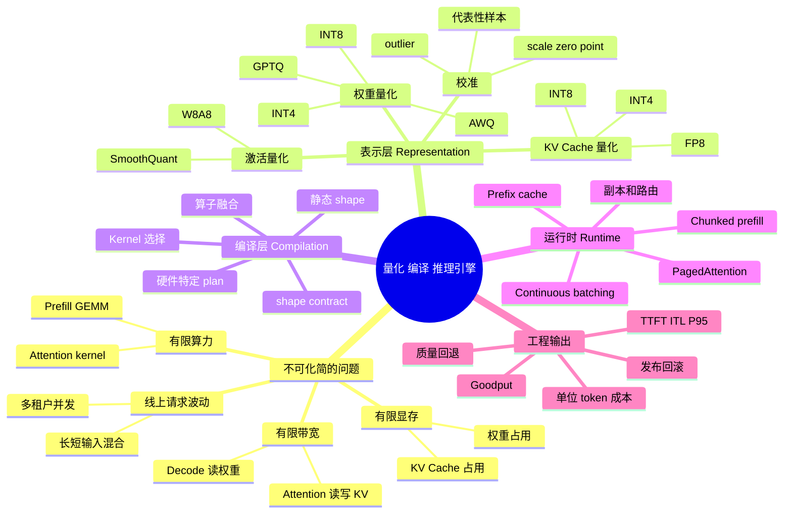
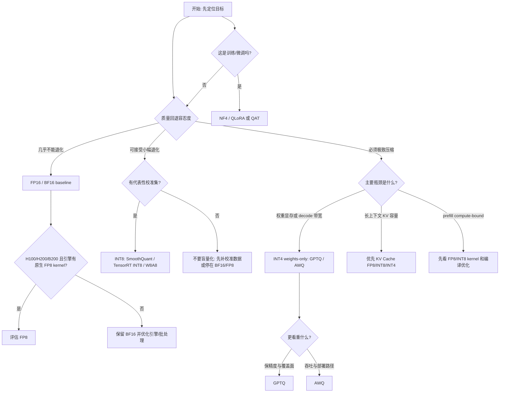
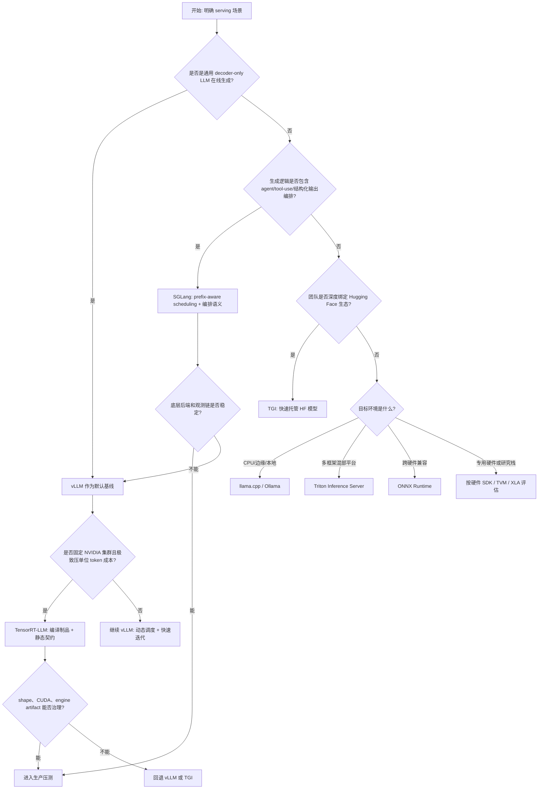

# 第16章：量化、编译与推理引擎

> 推理优化不是单点技巧，而是一整条"模型表示 -> 执行计划 -> 运行时"的优化链路。

> **关联章节**：本章的量化和引擎选择，与 [第15章](15-batching-scheduling-and-kv-cache.md) 的 KV Cache 显存压力密切相关；权重量化能缓解权重占用，但不一定自动解决长上下文缓存问题。引擎最终要通过 [第14章](14-online-inference-architecture.md) 的路由和副本架构落地；量化带来的质量风险又会进入 [第17章](17-multitenancy-and-cost.md) 的发布和回滚流程。

## 1. 第一性原理拆解 + 学习大纲

### 拆 — 不可化简的问题

推理优化的不可化简问题不是"怎样把模型变快"，而是：一个已经训练好的函数，要在有限显存、有限带宽、有限算力、有限延迟预算和可控质量风险下，被反复执行成线上服务。训练阶段可以用更长时间换更好参数，推理阶段却不同：每个请求都带着 SLA、成本和排队压力进入系统。用户感受到的是 TTFT、ITL、P95/P99 延迟和回答质量；平台看到的是 GPU HBM 是否被权重和 KV Cache 塞满，Tensor Core 是否有足够饱和度，调度器是否能把不同长度请求拼成有效 batch，发布系统是否能在质量回退时快速回滚。

剥离所有工具名之后，本章只处理三类物理约束。第一，数字表示有成本。7B 模型用 BF16 权重大约 14GB，70B 大约 140GB；如果再叠加长上下文 KV Cache，显存容量会比算力更早成为瓶颈。第二，同一个数学图有很多执行方式。Transformer 里的 LayerNorm、GEMM、Attention、RoPE 和采样可以被通用框架逐个 kernel 执行，也可以被编译器重排、融合、专门化，差异体现在 HBM 往返次数、kernel launch 次数和 shape 假设上。第三，线上请求不是离线 batch。真实流量有长短 prompt、不同输出长度、prefix 复用、多租户隔离和扩缩容，运行时必须管理 batch、KV Cache、队列和副本。

因此，量化、编译、推理引擎不是三组互不相干的技巧，而是一条从"模型如何被表示"到"执行计划如何生成"再到"请求如何被运行时组织"的链路。很多团队第一次做推理优化会陷入单点最优：听说 INT4 省显存就直接量化，听说 TensorRT-LLM 快就换引擎，听说 `torch.compile` 能加速就打开。单点做法容易翻车，是因为它没有回答更底层的问题：瓶颈到底是权重带宽、KV 容量、prefill 算力、调度空洞，还是发布链无法承受新制品的复杂度。

### 推 — 从这个问题如何推导出每个机制

从"数字表示有成本"出发，首先会推导出量化。权重从 BF16 压到 INT8 或 INT4，可以减少权重显存与 HBM 读取；KV Cache 从 BF16 压到 FP8/INT8/INT4，可以让长上下文服务容纳更高并发；激活量化则试图降低中间张量和算子输入输出的带宽压力。但低精度不是免费压缩，scale、zero point、per-channel、outlier 和校准集分布都会影响误差。于是 PTQ、QAT、GPTQ、AWQ、SmoothQuant 等方法出现，本质是在不同成本下回答同一个问题：低精度表示怎样尽量保留高精度函数的行为。

从"同一个数学图有很多执行方式"出发，会推导出编译与图优化。通用 eager 执行足够灵活，但每个算子单独启动 kernel，很多中间结果必须写回 HBM。编译器会做算子融合、常量折叠、内存布局选择、kernel autotune 和静态 shape 专门化，让硬件少搬数据、多做有效计算。代价是执行计划带有前提：GPU 型号、CUDA/TensorRT 版本、batch 范围、sequence length 范围、输入模态规格。超出这些前提，轻则重新编译或回退慢路径，重则直接失败。因此编译产物不是普通模型文件，而是带 shape contract 的制品。

从"线上请求不是离线 batch"出发，会推导出推理引擎。训练框架能跑 forward，不等于能稳定服务高并发 LLM。在线系统需要 continuous batching、PagedAttention、prefix cache、chunked prefill、speculative decoding、张量并行、指标导出、OpenAI-compatible API、灰度和回滚语义。vLLM、TensorRT-LLM、SGLang、TGI、ONNX Runtime、llama.cpp 和 Triton Inference Server 的差异，不只是"谁 benchmark 快"，而是它们选择了不同的运行时假设：动态调度还是静态 engine，通用模型迭代还是固定 NVIDIA 集群极致压榨，标准文本生成还是复杂 agent / tool-use 编排。

把这三层合在一起，本章的学习目标就变成一个工程推理题：先定位瓶颈，再选择量化对象和精度；再确认硬件和引擎是否有真实 kernel 支持；再决定是否引入编译产物以及如何治理 shape contract；最后用真实流量分布验证 TTFT、ITL、goodput、显存、质量回退和运维复杂度。优化链路任何一段断开，局部收益都可能变成系统风险。

### 绘 — 因果链路



### 导 — 读完本章你应该能回答

1. 一个服务的瓶颈是权重带宽、KV Cache 容量、prefill 算力还是调度空洞时，量化收益分别会怎样变化？
2. 为什么 BF16、FP8、INT8、INT4 不是简单的"越低越好"，而是质量、硬件、kernel 和校准数据共同决定的阶梯？
3. 为什么 PTQ 必须做校准，且校准集和评测集不能混用？
4. 一个 TensorRT-LLM engine、AOT compile artifact 或专用 kernel plan 需要记录哪些 shape contract 元数据？
5. vLLM、TensorRT-LLM 和 SGLang 的核心运行时假设分别是什么，为什么它们适合的组织和流量不同？
6. 当 benchmark 显示某引擎快 2x 时，你要补哪些实验才能判断它是否真的能降低生产单位 token 成本？
7. 量化、编译和引擎迁移分别会给发布、观测、排障和回滚带来哪些新边界？

---

## 2. 本章导读

很多团队第一次做推理优化时，会陷入"单点最优"的陷阱：

- "听说 INT4 量化能降一半显存，我们上"
- "听说 TensorRT-LLM 快 2x，换引擎"
- "听说 torch.compile 能加速 30%，开着"

这些想法都不错，但单独拿出来做决策往往会翻车。真正决定推理服务成败的，是模型表示层、编译 / 优化层、运行时层能不能配合：量化要说明对象、方法、校准数据和硬件支持；编译要说明 shape contract、kernel 路径和回退方式；引擎要说明批处理、KV Cache、发布、观测与回滚语义。

本章的判断框架是：

- **量化不只是"开关"**，它有对象（权重/激活/KV）、方法（PTQ/QAT/GPTQ/AWQ/...）、硬件支持要求
- **编译不是"一次搞定"**，它产出的是带前提假设的制品，shape 超出假设就会退化
- **引擎选型不只是 benchmark**，它还决定了你平台的发布、回滚、排障方式

> **版本矩阵 / 适用口径**：本章涉及 vLLM V1、SGLang、TensorRT-LLM、ModelOpt、FP8 KV、FP4/FP8、FlashAttention V3、A100/H100/B200 等能力时，都默认需要按实际版本、GPU SKU、CUDA/driver、attention backend、量化 checkpoint、容器镜像或 commit 重新确认。表格里的"支持"表示常见能力方向，不等于任意版本和任意模型都可直接上线；benchmark 结论必须附带模型、输入/输出分布、并发、测量指标和复测环境。

### 概念先说清楚：三层边界

本章的三个词经常被混用，先把边界说清楚：

| 概念 | 它是什么 | 它不是什么 | 主要产物 | 主要风险 |
|------|----------|------------|----------|----------|
| 量化 | 改变模型数值表示，把 FP16/BF16 的权重、激活或 KV Cache 压到 FP8/INT8/INT4 等低精度 | 不是通用压缩算法，也不是一定提速的开关 | 低精度权重、scale/zero point、校准记录、量化配置 | 质量回退、kernel 不支持、反量化开销吃掉收益 |
| 编译 | 把模型图和算子组合转换成更适合硬件执行的 plan | 不是模型训练，也不是自动适配任意 shape | engine、CUDA graph、AOT artifact、kernel plan | shape contract、版本绑定、回退路径难观测 |
| 推理引擎 | 在线组织请求、batch、KV Cache、并行和 API 的运行时 | 不是单个 kernel，也不是简单 HTTP wrapper | vLLM/TensorRT-LLM/SGLang/TGI 服务进程、metrics、调度状态 | 运行时语义变复杂，发布、回滚和排障路径变化 |

更工程化的说法是：**量化改变模型怎么存和怎么算，编译改变算子怎么排和怎么发，推理引擎改变请求怎么进入 GPU。** 三者可以组合，但不能互相替代。权重量化不会自动解决 KV Cache 爆显存；`torch.compile` 不会自动提供 continuous batching；换 vLLM 也不等于模型质量风险消失。

还有一个容易误解的边界：Triton Inference Server 和 Triton language/kernel 不是同一个东西。前者是 NVIDIA 的模型托管服务器，可以挂 TensorRT、ONNX Runtime、Python backend 等；后者是 OpenAI Triton 语言，用来写 GPU kernel。讨论"引擎选型"时通常指前者；讨论"自定义 fused kernel"时通常指后者。

## 3. 正文内容

### 16.1 推理优化到底在优化什么

线上推理系统的目标通常不是单一的"更快"，而是同时优化：

- 更低延迟
- 更高吞吐
- 更低显存占用
- 更低单位请求成本
- 更稳定的可运维性

这意味着量化、编译和引擎选择都应该被放进同一个框架里看，而不是孤立比较 benchmark。

#### 16.1.1 四种"快"并不是一回事

一个容易被混淆的事实：**推理优化的"加速"可能来自完全不同的机制，它们不会简单叠加**。

| "快"的类型 | 机制 | 典型收益 | 谁适合 |
|------------|------|----------|--------|
| 权重加载快 | mmap、量化减小文件 | 冷启动 -50% | 频繁扩缩容场景 |
| 单 kernel 快 | FlashAttention、fused GEMM、低精度 | 单步 forward -20%~50% | 所有场景 |
| 单请求 decode 快 | speculative decoding、小模型草稿 | TPOT -30%~60% | 低并发、长输出 |
| 吞吐快 | continuous batching、PagedAttention、prefix cache | QPS 10-24x | 高并发服务 |

"我把 kernel 提速 30%，为什么 QPS 没涨？"—— 因为 GPU 本来不是被 kernel 拖住的，而是被调度器 / KV 管理拖住的。优化前先问：**瓶颈在哪一层？** 否则多半会花时间在不是瓶颈的地方。

### 16.2 量化在解决什么

量化的核心是把高精度浮点表示压缩到低精度表示。
一个常见的简化表达是：

$$
x_q = \text{round}\left(\frac{x}{s}\right) + z
$$

其中：

- `s` 是 scale
- `z` 是 zero point

量化的工程收益通常包括：

- 更低的显存占用
- 更小的带宽压力
- 更高的吞吐

但代价也很现实：

- 精度可能退化
- 校准过程复杂
- 某些模型结构更难量化
- 不同硬件对不同量化方案支持不一样

所以量化不只是"开一个开关"，而是模型、硬件和引擎三者共同决定的结果。

#### 16.2.1 量化对不同瓶颈的收益是不一样的

一个经常被忽略的细节：**权重量化是否提速，取决于服务本来是不是 memory-bound 的**。

- **Memory-bound（decode 为主）**：把 fp16 权重换成 int4，显存带宽占用减半，decode 速度几乎翻倍
- **Compute-bound（prefill 长上下文为主）**：权重量化帮助不大，因为瓶颈是算力不是访存
- **Memory-capacity-bound（放不下）**：量化直接把模型塞进更便宜的卡

所以"量化能加速多少"没有统一答案。一个 7B 模型服务在 A100 上跑单请求 decode（memory-bound），int4 常常能快 1.8-2x；同一个模型在高并发 prefill（compute-bound）下，int4 可能只快 10%，甚至因为反量化开销而略慢。

### 16.3 常见量化方案对照

从平台视角看，量化方案至少要同时回答四个问题：何时量化、量化到什么精度、需要什么校准数据、目标引擎是否支持。

| 方案 / 档位 | 核心特点 | 代表方法 | 常见适用场景 | 典型风险 |
|-------------|----------|----------|--------------|----------|
| PTQ | 训练后量化，不改训练流程 | GPTQ、AWQ、SmoothQuant | 已有模型上线加速 | 对校准集和模型分布敏感 |
| QAT | 训练中感知量化 | QAT、Fake Quant 流程 | 对质量回退极敏感的任务 | 训练成本更高，流程更重 |
| FP8 | 低于 BF16、精度仍较高 | Hopper FP8、Transformer Engine | 新硬件上的训练或推理优化 | 硬件与库支持要求高 |
| INT8 | 平衡显存与精度 | SmoothQuant、TensorRT INT8 | 通用推理加速 | 某些层精度回退明显 |
| INT4 / NF4 | 极致压缩 | GPTQ、AWQ、bitsandbytes NF4 | 单卡部署、低成本 serving | 质量损失和兼容性压力更大 |

一个实用判断是：如果目标是快速降低部署门槛，通常先看 PTQ；如果目标是稳定保留质量并长期运营，再考虑更重的 QAT 或硬件原生低精度方案。

如果要在同一精度档里继续细分，方法级差异通常也值得单独看：

| 方法 | 核心机制（一句话） | 与同精度方法的关键差异 |
|------|--------------------|------------------------|
| GPTQ | 逐层重建量化误差最小化 | 精度通常略优，但校准更慢 |
| AWQ | 保护重要权重通道 | 推理路径常更快，部分模型精度可能略低于 GPTQ |
| SmoothQuant | 把激活量化难度转移到权重侧 | 专注 W8A8 / INT8 路径，更适合 INT8 部署 |
| GGUF（k-quants） | llama.cpp 系列自有格式，多档位 | 主要用于 CPU / 边缘，不用于 GPU serving |
| NF4 | 4-bit 非均匀量化，保留更多动态范围 | bitsandbytes QLoRA 训练时常用 |

#### 16.3.1 量化方案怎么选：一个工程决策表

真正做选型时，团队先别问"最新的量化论文是什么"，而要先把四个约束钉死：**精度能退多少、硬件原生支持什么、目标是压 TTFT 还是压单位成本、有没有可信的校准数据**。下面这张表是一个从约束直接走到方案的实用路径。

| 决策起点 | 更推荐的精度 / 方法 | 为什么 | 工程边界 | 失败条件 |
|----------|---------------------|--------|----------|----------|
| 质量回退几乎不可接受，且模型已经能装下 GPU | FP16 / BF16 | 风险最低，排障最直接 | 成本高，但最容易做基线与回滚 | 如果显存已经被权重或 KV Cache 压满，这条路通常根本跑不起来 |
| 有 H100/H200/B200 这类原生 FP8 路线，目标是在尽量保精度的前提下提吞吐 | FP8 | 比 INT8 / INT4 更接近高精度路径，通常更容易守住质量 | 依赖新硬件、特定库和引擎支持 | 卡型不是 Hopper/Blackwell，或者引擎只是"能加载"却没有原生 FP8 kernel，就容易退化成伪收益 |
| 主要目标是通用在线 serving，加速和稳定性都要，且能拿到代表性校准集 | INT8（如 SmoothQuant、TensorRT INT8） | 压缩和质量之间更平衡，部署面广 | 更适合 W8A8 / W8A16 这类温和方案 | 校准集分布失真时，INT8 往往先在激活敏感层上出问题，离线分数看着正常、线上对话质量抖动 |
| 模型必须塞进更小显卡，或 decode 明显 memory-bound，需要极致压缩 | INT4 weights-only（GPTQ / AWQ） | 对权重显存和带宽收益最大，最常见于低成本 serving | 更适合 decode 主导、W4A16 路径成熟的模型族；**A100/H100 上必须配合 Marlin 或 Machete kernel 才有真实加速**（见下） | 如果瓶颈其实是 prefill 算力、不是权重带宽，INT4 收益会很有限；**没有 W4A16 优化 kernel 时，模型先反量化到 FP16 再算 GEMM，反而比 FP16 慢** |
| 同样是 INT4，但你更看重通用性、模型覆盖面和保精度 | GPTQ | 逐层重建误差，通常在复杂模型上更稳 | 校准与离线量化时间更长 | 校准窗口太小或线上 prompt 形态变化快时，重建出的误差模型会失真 |
| 同样是 INT4，但你更看重吞吐、部署路径和小中型模型的工程效率 | AWQ | 保护重要通道，很多 serving 引擎路径更顺 | 需要确认目标模型和目标引擎都对 AWQ 路径成熟 | 某些模型上精度可能不如 GPTQ，特别是长尾语言 / 代码 / 推理任务 |
| 这是训练或 LoRA 微调，而不是线上推理 | NF4 / QLoRA | 训练显存收益很好，生态成熟 | 主要是训练格式，不是标准 GPU serving 终态 | 直接把 NF4 训练格式当生产推理格式，往往会卡在引擎支持或吞吐表现上 |
| 愿意付出训练或蒸馏成本，且质量目标严格 | QAT 或更重的混合精度方案 | 量化感知训练通常最能守住质量 | 流程长、成本高，适合长期运营模型 | 如果模型和数据还在频繁迭代，QAT 的维护成本会高到抵消收益 |

把这张表压缩成一个顺序更容易记的决策树：



一个经验法则：**FP16/BF16、FP8、INT8、INT4 不是线性升级关系，而是"质量风险更高，压缩能力更强，工程前置条件也更苛刻"的阶梯。**

#### 16.3.2 硬件对量化精度的支持矩阵

**一个残酷的事实**：精度再好的量化方法，硬件不原生支持也白搭（只能做"伪量化"，反量化后再算，反而更慢）。

| 精度 | Ampere (A100) | Hopper (H100) | Ada (L40S) | Blackwell (B200) |
|------|---------------|---------------|-----------|------------------|
| FP16/BF16 | ✓ 原生 | ✓ 原生 | ✓ 原生 | ✓ 原生 |
| INT8 | ✓ 原生（Tensor Core） | ✓ 原生 | ✓ 原生 | ✓ 原生 |
| FP8 | ✗ 无原生支持 | ✓ 原生 | ✓ 原生（部分） | ✓ 原生 |
| INT4（W4A16） | 部分（weights-only） | 部分 | 部分 | 支持更广 |
| MXFP8 / NVFP4 | ✗ | ✗ | ✗ | ✓ |

这张表的意思：你手里的卡决定了你能上什么低精度计算路径。比如 A100 没有 Hopper FP8 Tensor Core，不能把 FP8 当作通用计算加速路线；某些引擎可能支持在 A100 上用 FP8 KV 做存储压缩，但那首先是容量收益，不等同于 TPOT 一定下降。H100 之后才需要重点评估 FP8 计算、FA3 融合反量化等性能口径；B200 引入的 MXFP8/NVFP4 则是面向更新硬件的软件栈路线。

对平台决策者：**量化方案要和硬件采购路线对齐**，否则"明年换 H100，今年先上 FP8"这种表述往往落不了地。

#### 16.3.3 W4A16 的 kernel 决定一切：Marlin 与 Machete

INT4 weights-only（W4A16）量化省显存的故事很美好——把 70B 模型从 140GB 压到 35GB——但**省显存不等于跑得快**。GPU Tensor Core 不直接执行 INT4 × FP16 的混合精度 GEMM，必须有专门写过的 kernel 把 INT4 权重在寄存器/共享内存里反量化，再喂给 Tensor Core。**没有这种 kernel，框架的 fallback 路径是先把整个 INT4 权重反量化到 FP16，再走标准 GEMM——结果是 INT4 推理比 FP16 还慢**（多一次反量化 + 同样的 compute + 多一次显存写回）。

这就是为什么生产 W4A16 的真实瓶颈是 kernel 而不是量化算法：

| Kernel | 开发方 | 目标硬件 | 适用场景 | 关键设计 |
|---|---|---|---|---|
| **Marlin** | IST Austria（vLLM 集成） | A100 / H100 | batch < 32 的 LLM decode | 用 mma.sync + ldmatrix 做 INT4→FP16 解码后立即喂 Tensor Core；只对 small-batch decode 的 GEMV 形态优化 |
| **Machete** | NVIDIA（vLLM 集成） | H100 / Hopper-only | 中大 batch decode + prefill | 重写以利用 H100 WGMMA + TMA，比 Marlin 在 H100 上吞吐高 30-50% |
| **bitblas / TileBlas** | Microsoft | A100 / H100 / 多种位宽 | 自定义量化格式 | 模板生成器，可生成 W2A16 / W4A16 / W8A16 kernel |
| **MarlinV2 / GPTQ-Marlin** | vLLM 社区 | A100 / H100 | 兼容 GPTQ checkpoint 格式 | 接 GPTQ 输出格式，免去 repack |

**工程含义**：
- 你部署 GPTQ INT4 模型到 A100，必须确认 vLLM / TRT-LLM 走 Marlin 路径而不是反量化 fallback；否则 throughput 会比 BF16 还低（实测 30-50% 慢）
- 在 H100 上优先选 Machete（vLLM `--quantization=marlin` 会自动在 H100 上用 Machete 后端），可以拿到比 A100 + Marlin 高得多的 throughput
- batch 很大（比如 prefill 大 batch）时，W4A16 kernel 的反量化开销开始稀释收益，此时考虑 W8A8（INT8）或 FP8 路径
- L40S / RTX 4090 等 Ada 卡 Marlin 支持有限（社区版本）

> [!DANGER]
> **最常见的 W4A16 部署陷阱**：团队听说 INT4 省显存就上线，但没看 kernel 路径，结果 P99 latency 不降反升。修复前先用 vLLM `--profile` 或 `nvidia-smi` 观察："这一次推理的 GEMM 时长真的下降了吗？" 如果没有，说明 kernel 路径退化了。

> [!NOTE]
> **W4A4 / W4A8 / 整体 INT4** 是另一类故事：Marlin / Machete 只解决 W4A16（权重 INT4，激活 FP16）。如果想把激活也压到 INT4 或 INT8，需要 SmoothQuant、QServe 等额外路径，kernel 选型完全不同。

### 16.3a GPTQ 算法：逐列量化 + 误差补偿

GPTQ 的核心问题是：**不重训的情况下，把 BF16 权重压到 INT4 而尽量保住精度**。它把每一层独立看作一个最小化问题：

$$
\arg\min_{\hat{W}} \| W X - \hat{W} X \|_F^2
$$

其中 $W$ 是该层原始权重、$X$ 是该层在校准集上的输入激活。如果允许 $\hat{W}$ 取任意实数，最优解就是 $W$ 自身——一旦 $\hat{W}$ 被限制在 INT4 量化网格上，问题变成一个**带约束的二次优化**，直接量化会丢精度。GPTQ 的关键观察是：这个问题对每一行（output channel）独立、对每一列（input dim）有耦合，且最优解可以用 **Hessian 矩阵的逆** 一列一列推进。

**算法核心**（每行独立处理）：

1. 算 Hessian $H = 2 X X^T + \lambda I$（$\lambda$ 防奇异）。
2. 算 Cholesky 分解 $H^{-1} = L L^T$，得到逆矩阵的上三角。
3. 按列从左到右处理。处理第 $j$ 列时：
   - 把 $w_j$ 量化到最近的 INT4 网格点 $\hat{w}_j$，得到误差 $e_j = w_j - \hat{w}_j$。
   - **把 $e_j$ 按 $H^{-1}$ 的对应列分摊到剩余还没量化的列上**：$w_{j+1:} \mathrel{-}= e_j \cdot \frac{H^{-1}_{j, j+1:}}{H^{-1}_{j,j}}$。
   - 这一步是 GPTQ 的灵魂：当前列量化造成的误差，**用后面还能改的列去补偿**。

```text
未补偿（Round-To-Nearest, RTN）的量化:
  w = [1.3, 0.7, -1.1, 0.4, ...]
  量化后:[1, 1, -1, 0, ...]   // 每个 token 累积误差，可能越走越偏

GPTQ 的量化:
  量化第 1 列（误差 0.3）→ 把 0.3 按 H⁻¹ 分摊到列 2,3,4,...
                            列 2,3,4 的 w 被修正，新值更"知道"前面有 0.3 的偏差
  量化第 2 列（修正后的 w₂，误差更小）→ 继续补偿
  ...
```

**为什么用 Hessian**？$H = X X^T$ 描述的是"输入激活之间的相关性"。如果列 $j$ 和列 $k$ 的输入高度相关（$H_{jk}$ 大），列 $j$ 量化产生的误差对总损失的影响和列 $k$ 类似——所以应该把误差更多地分摊到列 $k$。GPTQ 用 $H^{-1}$ 一次性算出"误差应该按什么比例分摊给后续列"，这是一种 **Optimal Brain Surgeon (OBS)** 风格的局部最优补偿。

工程上的几个关键点：

- **校准集大小**：典型 128-512 条样本就够算 $X X^T$；多了帮助有限。
- **per-row vs per-channel**：每个 output row 独立处理，因为它们共享同一个输入 $X$，可以并行。
- **act_order（desc_act）**：先处理"激活方差大"的列（重要的列），把误差留给"激活方差小"的列（不重要）。开 `desc_act=True` 通常多 0.5-1pp 精度。
- **groupsize**：把列分组（128 是典型值），每组共享一个 scale。groupsize 小精度好但元数据开销大。

GPTQ 的代价是**校准时间长**：70B 模型逐层逐列处理，单 A100 通常要 4-8 小时。但因为是 PTQ，跑一次出 checkpoint 可永久使用。

### 16.3b AWQ 算法：activation-aware 通道保护

AWQ 的核心观察是：**模型权重里只有少数 channel（通常 < 1%）真正"重要"**——它们对应的激活值大，对最终输出影响大。RTN 量化对所有 channel 一视同仁，把这些重要 channel 量化坏就直接掉点。AWQ 的解法不是改算法，而是**在量化前对权重做一个 channel-wise 缩放**，让重要 channel 的数值放大，量化后的相对误差减小。

**核心数学等价**：对线性层 $Y = X W$，引入 per-channel scale $s$（向量，长度 = input channel 数）：

$$
Y = X W = (X \cdot \text{diag}(1/s)) \cdot (\text{diag}(s) \cdot W)
$$

这是恒等变换——但变换后**激活变小、权重变大**。在量化时只量化新权重 $W' = \text{diag}(s) \cdot W$，激活 $X' = X / s$ 保持 BF16（W4A16 不量化激活，所以 $X/s$ 在线时直接做或预先 fuse 进前一层）。

**为什么有效**：INT4 量化的相对误差大致是 $\Delta / W_{max}$，其中 $\Delta$ 是量化步长。对于 scale 后的新权重，重要 channel 的 $W'_j = s_j \cdot W_j$ 更大，相对误差更小；不重要 channel 的 $W'_k$ 仍然小但反正它对输出影响也小。**误差被搬到了"不重要"的地方**。

**怎么搜 $s$**？AWQ 在校准集上跑前向，统计每个 channel 的激活幅度均值 $|X|_j$，然后用一个**幂律启发式**：

$$
s_j = |X|_j^{\alpha}
$$

$\alpha$（典型 0.5）通过对小校准集做 grid search 选——评测指标是量化后输出与原始输出的 MSE。整个过程对单层只要几秒钟，所以 AWQ 校准比 GPTQ 快得多（70B 通常 30 分钟内）。

```text
RTN 量化:                      AWQ 量化:
  W: [大权重, 小权重, 小权重]    W: [大权重, 小权重, 小权重]
  X: [大激活, 小激活, 小激活]    X: [大激活, 小激活, 小激活]
                                ↓ 引入 s = |X|^0.5
                                W' = diag(s) · W = [更大, 略大, 略大]
                                X' = X / s         = [略小, 略小, 略小]
  量化 W → 大权重的相对误差大     量化 W' → 重要 channel 因为放大，量化误差相对小
  → 重要 channel 掉点             → 重要 channel 几乎不掉
```

**与 GPTQ 的本质差异**：

- GPTQ 改 **W**（量化时用 Hessian 重分布误差）。
- AWQ 改 **scale**（量化前用 activation 引导重要 channel 缩放）。
- 二者**正交**：理论上可以叠加（先 AWQ scale 再 GPTQ 误差补偿），实践中 vLLM/TRT-LLM 选一个就够。

工程上的关键点：

- **激活信息很重要**：校准集分布偏，搜出的 $s$ 偏，重要 channel 选错。AWQ 对校准集质量的要求和 GPTQ 一样高。
- **AWQ 的 scale 可以 fuse 进前一层**：让推理时不用真的算 $X / s$。这是 vLLM AWQ 路径几乎 0 反量化开销的根本。
- **AWQ 比 GPTQ 推理稍快**：因为 fuse 后 kernel 路径更短；但精度 GPTQ 通常略好（特别在长尾任务）。

### 16.3c SmoothQuant：把激活的难题转移给权重

W8A8 INT8 比 W4A16 难的根本原因：**LLM 激活有严重的 outlier**。某些 channel（也是 ~1%）的激活值可以是其他 channel 的 100 倍。RTN 量化激活时 scale 必须迁就这些 outlier，结果**绝大多数普通激活被量化到只有几个值**——精度暴跌。

GPTQ 解决不了这个，因为它只动权重；AWQ 也解决不了，因为 W4A16 根本不量化激活。SmoothQuant 的核心 trick 是：**用一个 per-channel scale，让 outlier 通道的激活幅度变小、权重幅度变大；权重容易量化（无 outlier），所以多承担一点动态范围反而 work**。

**核心数学等价**（同 AWQ 的等价变换，但目标不同）：

$$
Y = X W = (X \cdot \text{diag}(1/s)) \cdot (\text{diag}(s) \cdot W)
$$

差别在于 SmoothQuant 之后**激活和权重都要量化**（W8A8）。现在变换让：

- 激活 $X' = X/s$ 的 outlier 被压平，per-tensor INT8 量化精度大幅提升。
- 权重 $W' = s \cdot W$ 的动态范围变大——但权重量化对此并不敏感（因为权重本身没有 outlier，只是数值变大）。

**怎么选 $s$**？SmoothQuant 用一个**迁移强度 $\alpha$**（典型 0.5）平衡两侧难度：

$$
s_j = \frac{\max(|X_j|)^\alpha}{\max(|W_j|)^{1-\alpha}}
$$

$\alpha = 0$ 完全不缩放，$\alpha = 1$ 完全把 outlier 转到权重。0.5 是经验上多数模型的甜点。

```text
原始量化（W8A8 INT8 RTN）:
  X channel j: [0.1, 0.2, 100.0, 0.15, ...]   ← outlier 100
  量化 scale = 100/127 ≈ 0.79
  普通激活 0.1 → round(0.1/0.79) = 0           ← 严重精度损失！
  
SmoothQuant（α=0.5, 选 s_j 让 outlier 平摊）:
  X' = X / s_j → [0.01, 0.02, 10.0, 0.015, ...]  ← outlier 缩小 10x
  W' = s_j × W → 权重变大 10x，但权重无 outlier 所以 OK
  量化 X' scale = 10/127 ≈ 0.079
  普通激活 0.01 → round(0.01/0.079) = 0          ← 仍然有精度损失
                                                 但相对 outlier 而言比例更好
  量化 W' → INT8，权重量化精度反而比原始好（动态范围更平均）
```

**与 AWQ 的关系**：数学上是同一个等价变换，但优化目标不同：

- AWQ 优化 W4A16，scale 选择最大化"重要 channel 的相对量化精度"。
- SmoothQuant 优化 W8A8，scale 选择最小化"激活 outlier 对量化的影响"。

**工程上的关键点**：

- **SmoothQuant 必须配合 INT8 GEMM kernel**（cuBLASLt INT8、CUTLASS、TRT-LLM gemm plugin），否则没有真实加速。
- **对长尾任务敏感**：α 选错（特别是 0.7 以上）会让权重侧动态范围过大，复杂任务（代码、长链推理）首先掉点。
- **可以 per-channel scale per-tensor quant**：scale 是 per-channel 的，但量化用 per-tensor scale；这是大多数 INT8 GEMM kernel 的硬约束。

**三种方法的总结对比**：

| 方法 | 核心思想 | 改什么 | 怎么用 activation 信息 | 主要适用 |
|---|---|---|---|---|
| GPTQ | 量化误差用 Hessian 分摊到后续列 | W | $X X^T$ 决定误差分摊比例 | W4A16 weights-only |
| AWQ | 重要 channel 量化前放大 | scale | $\|X\|_j^{0.5}$ 决定每 channel 缩放 | W4A16 weights-only |
| SmoothQuant | 把激活 outlier 转移到权重 | scale | $\max\|X\|^\alpha / \max\|W\|^{1-\alpha}$ | W8A8（含激活量化） |

> [!NOTE]
> **三种方法都不重训**——这是 PTQ 的共同优势。它们的差异不在"压缩率上限"，而在"针对什么数值现象做了什么数学补偿"。理解这一点后，就不会问"GPTQ 比 AWQ 快多少"这种没有意义的问题——它们解决的是同一个问题的不同侧面。

### 16.4 校准（Calibration）过程说明

PTQ 的关键步骤不是"跑一次脚本"，而是让量化器见到一组能够代表真实推理分布的样本，用来估计激活范围、scale、zero point 和 outlier 行为。换句话说，校准是在回答："这个模型在线上最常见的数值范围是什么，哪些通道最容易被截断，哪些层必须保留更多动态范围？"

没有这一步，很多低精度路径只能用非常保守的默认范围，结果往往是两头都不讨好：显存是省了，但某些层被量化得过猛，回答质量在长上下文、多语言、代码生成这些高动态范围场景里突然掉下来。校准的价值不在于把平均指标抬高一点，而在于让量化器知道**真实线上分布**，避免最坏样本把模型打穿。

| 维度 | 平台上要关心的问题 |
|------|--------------------|
| 校准样本来源 | 是否覆盖真实 prompt 长度、语言分布和业务场景 |
| 样本规模 | 通常先用 128-1024 条代表性样本建立基线，过小容易失真 |
| per-tensor vs per-channel | 前者简单、开销低；后者精度通常更稳 |
| 静态 vs 动态校准 | 静态更易优化，动态更灵活但运行时更复杂 |

如果校准集和线上分布差太远，量化结果就可能在离线 benchmark 好看、线上真实流量掉点明显。

#### 16.4.1 校准要怎么做决策

| 选择点 | 推荐默认值 | 什么时候升级 | 工程边界 | 失败条件 |
|--------|------------|--------------|----------|----------|
| 校准样本规模 | 128-1024 条分层样本 | 任务分布很散、多语言或多模态时再扩容 | 先拿能代表真实流量的样本，比盲目堆数量更重要 | 只拿几十条 demo prompt，scale 估计会非常不稳 |
| 采样方式 | 从线上日志脱敏抽样，按语言 / 长度 / 任务分层 | 新业务刚上线、线上样本不足时，用离线数据补齐但要标记来源 | 采样分层要能复现，最好保留 hash 和版本 | 校准集和生产流量完全不同，离线效果会严重乐观 |
| per-tensor vs per-channel | INT8 默认先看 per-channel，简单基线可先用 per-tensor | 对 outlier 很敏感的层，per-channel 更稳 | per-channel 精度通常更好，但实现和存储更复杂 | 只因实现省事一律用 per-tensor，常会把少数大通道拉坏 |
| 静态 vs 动态校准 | 先做静态校准，拿到稳定基线 | 输入分布跨度极大，且运行时明确支持动态量化时再考虑动态 | 静态最利于编译和复现 | 动态校准如果运行时支持不成熟，排障会明显变难 |
| 校准后验收 | 离线指标 + 业务回归集 + 小流量影子发布 | 风险高的模型再补人工评审和长尾集 | 评测集必须和校准集不重叠 | 只看 benchmark 平均分，不看线上长尾失败样本 |

校准不是独立步骤，它直接决定你能不能安全地下探到 INT8 / INT4。没有代表性校准集时，最稳妥的工程判断通常不是"硬上更保守的量化参数"，而是**先停在 FP16/BF16 或 FP8，等数据准备好再继续压缩**。

#### 16.4.2 一个真实翻车：校准集的陷阱

一个不少团队踩过的坑：

1. 用英文维基百科做校准，量化 7B 模型
2. 离线 benchmark（MMLU / HumanEval）基本不掉
3. 上线后中文用户投诉激增，回答质量明显下降
4. 排查发现：校准集里中文不足 1%，中文激活的动态范围没被覆盖，量化 scale 对中文 token 是次优的

教训：**校准集的分布必须匹配真实流量**。对多语言、多模态、多领域服务，这意味着：

- 从线上日志采样（注意脱敏）
- 按语言 / 领域 / 长度做分层抽样
- 保留校准集的版本 hash，以便复现
- 量化后要用和校准集**不重叠**的数据做评测

### 16.5 不只是权重：激活与 KV Cache 也可能成为量化对象

很多团队一提量化，只想到权重量化。但在线 serving 里，真正吃掉资源的通常至少有三类对象：

| 对象 | 主要收益 | 典型限制 | 更常见的判断方式 |
|------|----------|----------|------------------|
| 权重 | 降显存、降带宽 | 质量回退、引擎兼容性 | 模型能否在目标显卡上稳定装下 |
| 激活 | 降中间张量开销、提吞吐 | 校准更难，运行时路径更复杂 | prefill 是否明显受激活带宽限制 |
| KV Cache | 降长上下文显存占用 | 可能影响长程注意力质量，需引擎支持 | 长上下文服务是否先被 KV 占满 |

这也是为什么"模型已经 INT4"并不等于"服务成本已经优化完"。
如果瓶颈其实在 [第15章](15-batching-scheduling-and-kv-cache.md) 讨论的 KV Cache，那么只压权重通常不够。

#### 16.5.1 W / A / KV 量化的命名惯例

行业里的命名常以 "W_A_KV" 的形式出现：

| 命名 | 含义 | 典型场景 |
|------|------|----------|
| W16A16 | 原始 bf16/fp16，不量化 | baseline |
| W8A16 | 权重 int8，激活 bf16 | 温和压缩，多数 GPU 支持 |
| W4A16 | 权重 int4，激活 bf16 | 主流的 GPTQ/AWQ 路径 |
| W8A8 | 权重激活都 int8 | SmoothQuant 典型，H100 也跑 FP8 等价路径 |
| W4A8 | 权重 int4，激活 int8 | 进阶，吞吐更高但难度也更大 |
| KV8 / KV4 | KV Cache 单独量化到 int8 / int4 | 长上下文服务必看 |

组合可以是 `W4A16 + KV8`，意思是权重 int4、激活 bf16、KV Cache int8。实际配置通常是这种组合，不是单一精度。

#### 16.5.2 KV Cache 量化：长上下文服务的关键旋钮

如果你的服务支持 32K+ 上下文，KV Cache 量化的收益通常比权重量化更大。

一个数量级感受：Llama 3 70B、128K 上下文、B=1 的 KV Cache 在 bf16 下约 40 GB；量化到 int8 后约 20 GB，int4 后约 10 GB。**这直接决定了你在同等显存下能跑多高的并发**。

| KV 精度 | 显存节省 | 质量影响 | 引擎支持 |
|---------|----------|----------|----------|
| bf16 | baseline | 无 | 所有 |
| fp8 | 2x | 极小 | vLLM、TensorRT-LLM |
| int8 | 2x | 小 | vLLM、TensorRT-LLM |
| int4 | 4x | 中等（长程注意力受影响） | vLLM 部分 |

**一个实战经验**：KV Cache 量化几乎没有"自由午餐"吞吐（因为 KV Cache 不是计算瓶颈，是容量瓶颈），但它能让你**塞进去更大的 batch 或更长的上下文**，间接换来吞吐。

#### KV Cache 量化的内部机制

权重量化是离线一次完成的；KV Cache 量化必须**在线**做——每生成一个 token 都要把新的 K、V 量化后写入 KV pool，attention 计算时再反量化。这条路径的实现细节决定了"看起来 2x 显存节省"是不是真能拿到。

**关键决策 1：scale 的粒度**

| 粒度 | 含义 | 显存额外代价 | 精度 | 主流引擎选择 |
|---|---|---|---|---|
| per-tensor | 整个 KV pool 共享一个 scale | 几乎 0 | 差，长上下文累积 outlier 一次性打穿 | 几乎不用 |
| per-token | 每个 token 的 K（或 V）一个 scale | 每 token 加 2 个 FP16（4 bytes / token） | 中 | TRT-LLM 默认 INT8 KV |
| per-channel（per-head_dim） | 每个 head_dim 维度一个 scale | scale 数量 = num_kv_heads × head_dim，固定开销 | 好 | vLLM FP8 KV |
| per-token + per-channel（双向） | 两套 scale 共同决定 | per-token 那部分线性增长 | 最好但开销最大 | 实验性 |

**关键决策 2：量化时机**

```text
方案 A（写入时量化）：
  decode step → 算出新 token 的 K, V (BF16) 
              → quantize(K, V, scale) → 存 INT8/FP8 到 KV pool
              → attention 时 dequantize KV → 算 BF16 attention

方案 B（attention 内融合反量化）：
  decode step → 算出新 token 的 K, V (BF16)
              → quantize(K, V) → 存 INT8/FP8 到 KV pool
              → attention kernel 内部一边读 INT8/FP8 KV 一边 dequant，
                直接用 reduced precision GEMM（如 H100 FP8 Tensor Core）累加到 FP32
```

方案 B 是 **FlashAttention V3 + FP8 KV** 的实际路径——FA3 接受 FP8 K、V 作为输入，dequant 与 attention GEMM 在同一 kernel 里完成，没有单独的 dequant pass。这就是 H100 上 FP8 KV"几乎没有反量化开销"的来源。

方案 A 是更老的实现，每次 attention 前要先把整段历史 KV 反量化到 BF16 到一个临时 buffer——多了一次 HBM 读写，量化收益被吃掉一部分。INT8 KV 在不支持原生 INT8 attention kernel 的引擎上仍然走方案 A。

**关键决策 3：FP8 vs INT8 的 dynamic range**

FP8 有两种格式：

| 格式 | 指数位 | 尾数位 | Dynamic range | 适合 |
|---|---|---|---|---|
| **E4M3**（4 指数 + 3 尾数） | 4 | 3 | $\pm 448$ | KV 存储、GEMM 输入 |
| **E5M2**（5 指数 + 2 尾数） | 5 | 2 | $\pm 57344$ | gradient（训练）、累加器 |

KV Cache 一律用 **E4M3**——LLM 激活的 dynamic range 通常在 $\pm 50$ 以内，E4M3 的精度（3 尾数位 ≈ $2^{-3} = 12.5\%$ ULP）远好于 E5M2，dynamic range 也够。

INT8 的 dynamic range 是 $[-127, 127]$，配 per-token scale 后等效 dynamic range 接近 FP8 E4M3，但**精度分布不同**：INT8 等距，FP8 在 0 附近精度更高。LLM 的激活分布是"小值多、大值少"，FP8 E4M3 的非线性精度分布刚好对得上——这是为什么 H100 上 FP8 KV 通常质量比 INT8 KV 略好的根本原因。

**关键决策 4：K 与 V 是否分别量化**

K 和 V 的 dynamic range 通常不同：K 经过 RoPE 后值域更窄，V 来自 down-projection 通常更宽。生产引擎一般给 K、V 各算一套 scale（per-token），不共用。共享 scale 会让一边精度严重浪费。

**实际工程选择**：

- **vLLM `kv_cache_dtype=fp8`**：在 A100 上即便版本支持，也主要按"KV 存储容量减半、降低 preemption/OOM 风险"评估，不应默认承诺 TPOT 提升；在 H100+ 且 attention backend 走 FA3/融合反量化路径时，才可能同时讨论容量与性能收益。上线前必须对 BF16 KV vs FP8 KV 做同环境 P99 TTFT/TPOT/goodput 复测。
- **vLLM `kv_cache_dtype=fp8_e5m2`**：实验性，dynamic range 大但精度差，长上下文质量明显回退，**不要用于生产**。
- **TRT-LLM `kv_cache_dtype=int8`**：per-token scale + per-K/V scale，配合 GPT attention plugin 内部融合反量化。
- **vLLM INT4 KV**：实验性，per-token + per-channel 双向 scale；显存对半再对半，但长上下文（>16K）质量回退明显，慎用。

**诊断 KV 量化是否真生效**：

```bash
# vLLM Prometheus metrics 看 kv_cache_usage 和 num_running_seqs 同时上升
vllm:gpu_cache_usage_perc

# nvidia-smi dmon 看显存占用，应该比 BF16 KV 小约 50%
nvidia-smi --query-gpu=memory.used --format=csv -l 1
```

**反模式**：开了 `kv_cache_dtype=fp8` 但没确认引擎使用的 attention backend 支持 FP8 KV——某些版本回退到"FP8 存储 + 反量化到 BF16 再算 attention"，显存省了但 latency 反而升高。生产前务必跑一组 baseline（BF16 KV）vs 量化（FP8 KV）的 P99 对比，看 TPOT 有没有恶化。

#### 16.5.3 量化对象的排障边界

量化上线后，"质量掉了"这个症状太粗，必须先定位是哪类数值对象带来的误差。

| 症状 | 更可能的问题 | 如何验证 | 常见修复 |
|------|--------------|----------|----------|
| 普通短问答也明显退化 | 权重量化误差过大，或 outlier 通道被压坏 | 对同一 prompt 比较 BF16 与量化 logits/top-k，逐层开关量化 | 从 INT4 回到 INT8/FP8；换 GPTQ/AWQ；关键层保高精度 |
| 长上下文后半段更容易丢事实 | KV Cache 量化误差累积，长程 attention 受影响 | 按上下文长度分桶评测，比较 KV BF16/FP8/INT8 | KV 从 INT4 升到 INT8/FP8；缩小 max context；加强长上下文回归集 |
| 代码/数学/多语言任务掉得比闲聊多 | 校准集覆盖不足，scale 对高动态范围 token 不友好 | 按语言、任务、长度切分离线指标 | 重做分层校准；增加代码/中文/长 prompt 样本 |
| 吞吐不升反降 | 低精度格式没有走原生 kernel，运行时反量化后再算 | 打开 kernel trace，看 GEMM/attention backend 名称和 dtype | 换引擎支持的格式；改用 Marlin/FP8 kernel；回到 W8A16 |
| TTFT 改善小但显存下降明显 | 量化解决的是容量，不是 prefill 算力 | 分开压测 prefill tokens/s 和 decode tokens/s | 调 batch/chunked prefill；引入编译或更强 prefill kernel |

> **工程边界**：量化排障要保留 BF16 基线、量化配置、校准集 hash、评测集 hash、引擎版本和 kernel 路径。缺少任何一项，最后都会变成"这个模型好像不适合量化"这种不可复现的结论。

### 16.6 编译优化在解决什么

编译和图优化关注的是：
如何把"模型表达"转换成"更适合硬件执行的计划"。

常见优化包括：

- 算子融合
- 内存布局优化
- kernel 选择
- 常量折叠
- 静态 shape 优化

这类优化的本质是：

> 尽量减少无效开销，让设备做更多有价值的计算。

#### 16.6.1 几种常见优化的直观理解

**算子融合（Operator Fusion）**：把多个连续算子合并成一个 kernel，减少启动开销和显存往返。

```text
未融合:  LayerNorm → Linear → GELU → Linear
        每个算子各起一个 kernel，中间结果都要写回 HBM

融合后:  [ LayerNorm + Linear + GELU + Linear ]
        一个 kernel，中间结果留在寄存器 / shared memory
```

典型收益：对 transformer block 的 MLP 部分做 fused kernel，能减少 30-50% 的显存带宽。FlashAttention 本质就是把整个 attention 计算融成一个 kernel。

**常量折叠**：把训练时恒定但推理时不变的部分提前算好。比如 position embeddings、rotary embeddings 的查找表。

**内存布局优化**：让 tensor 的物理排列匹配计算 kernel 的访问模式。比如 attention 需要的 K/V 在内存里是按 head 分开还是交错，直接影响带宽利用率。

**静态 shape 优化**：如果编译器知道 batch、seq len 的确切值，可以选择专门优化的 kernel 而不是"通用万能" kernel。代价是一旦 shape 变了就得重新编译或回退。

#### 算子融合的两个具体例子

**例 1：FlashAttention 的 online softmax** —— 教科书 attention 是 `softmax(QK^T / √d) V`，传统实现要分三步：
1. 算 $S = QK^T$（HBM 写出 $S$，shape = [seq, seq]）
2. 算 $P = \text{softmax}(S)$（HBM 读 $S$、再写出 $P$）
3. 算 $O = PV$（HBM 读 $P$、写出 $O$）

中间矩阵 $S$、$P$ 在长 seq 下是 $O(N^2)$，HBM 读写带宽完全主导延迟，且占 $N^2$ 显存。FlashAttention 的核心是把这三步**融在一个 kernel 里、永不写出 $S$ 和 $P$ 到 HBM**。

难点是 softmax 必须看到整行才能归一化（要先求 max、再求 sum）。**Online softmax** 用增量更新避开两遍扫描。把 K/V 切成 block，沿 seq 轴一块一块扫：

```text
对每个 K, V block i 处理:
  S_i = Q · K_i^T              // 局部 attention scores
  m_new = max(m_old, max(S_i))  // 全局 max 增量更新
  P_i = exp(S_i - m_new)        // 局部 softmax 数值，用新的 max 重 normalize
  alpha = exp(m_old - m_new)    // 旧累加结果的修正因子
  O = O · alpha + P_i · V_i     // 输出累加，旧 O 用 alpha 修正
  l = l · alpha + sum(P_i)      // 归一化分母同样修正
end loop
O = O / l                       // 最终归一化
```

关键观察：每次新 block 进来，旧累加结果 $O$ 和分母 $l$ 都用 `exp(m_old - m_new)` 缩放——这就是 online softmax 的正确性证明。融合后整个 attention 只需要 $O(N)$ HBM 读（Q、K、V 各一遍），$O$ 一次写出，**完全不写中间矩阵**。FlashAttention V2/V3 在此基础上进一步优化 block 调度顺序（V2 把外循环改到 Q 维度让 GPU SM 并行更高效）和指令选择（V3 在 H100 上用 WGMMA + TMA + warp specialization）。

**例 2：GEMM epilogue fusion** —— Transformer block 里 GEMM 后通常跟一连串 elementwise 算子：`Y = GeLU(X·W + bias) * scale`。朴素实现是 GEMM 写出 $X·W$ 到 HBM、再启 bias kernel、再启 GeLU kernel、再启 scale kernel——四次 HBM 读写。

CUTLASS 的 **Epilogue Visitor Tree (EVT)** 让用户在 GEMM kernel 内部直接 inline 这些后处理：每个线程算完自己负责的输出 tile（结果还在寄存器里），紧接着做 bias add、GeLU、scale，**结果直接写出最终值**。FlashInfer、CUTLASS、TRT-LLM 的 GEMM plugin 大量用这条路径。

工程上 epilogue 能融的算子有限制：
- **不能改 GEMM 输出 shape**（broadcast 可以，reduce 不行——reduce 要跨 thread block 同步）。
- **激活函数必须是 elementwise**（GeLU、SiLU、ReLU 都行，softmax 不行）。
- **bias 必须是简单 broadcast**（per-row 或 per-column）。

**编译器决定哪些 op 能融的判断**（producer-consumer rule）：
- A 的输出是 B 的唯一输入 → 可融。
- A、B 都是 pointwise → 几乎一定融。
- B 需要 cross-thread reduction（如 softmax、layernorm）→ 一般不能和上游 GEMM 融。
- 共享内存 / 寄存器预算够 → 可融；否则编译器会拆分。

`torch.compile` 的 Inductor、TensorRT、TVM 都自动做这套 producer-consumer 分析；手写 kernel（FlashAttention、Marlin）则是开发者把这套规则手工应用到极致。

#### 16.6.2 编译器、graph capture、kernel library 的边界

推理优化里"编译"也经常被叫混。平台上至少要区分三类东西：

| 层次 | 代表 | 解决的问题 | 典型前提 | 失效信号 |
|------|------|------------|----------|----------|
| Graph compiler | `torch.compile`/TorchInductor、XLA、TensorRT build、TVM | 从模型图生成更少、更快的算子计划 | shape 范围、dtype、硬件、算子覆盖 | 首次请求编译很慢；shape 变化触发 recompile；某些算子 graph break |
| Graph capture | CUDA Graph、vLLM warmup capture | 捕获一段稳定 CUDA 调用，减少 CPU launch overhead | batch/shape/内存地址稳定 | P99 抖动；capture 失败回到 eager；显存因 capture pool 增加 |
| Kernel library | cuBLASLt、FlashAttention、FlashInfer、Marlin、Triton kernels | 为某个算子提供手写或自动生成的高性能 kernel | dtype/layout/head_dim/block_size 匹配 | profiler 里走了 fallback kernel；低精度没有 Tensor Core 利用 |

这三层可以叠加，但排障方式不同。Graph compiler 出问题，通常看 graph break、recompile 次数和编译 artifact；CUDA Graph 出问题，通常看 shape bucket、warmup、内存地址稳定性；kernel library 出问题，通常看 profiler 里的 kernel 名称、Tensor Core 利用率和 HBM 带宽。

> **反模式警告**：把 `torch.compile=True` 写进配置就认为"已经编译优化"是不够的。在线 LLM 的 shape 经常变化，prefill/decode 路径不同，采样逻辑也可能 graph break。编译收益必须按 prefill、decode、sampler 三段分别验证。

#### CUDA Graph 是怎么工作的

CUDA Graph 不是一种"编译"，而是一种**减少 CPU launch 开销**的机制。每个 CUDA kernel launch 都要走 driver API（参数打包、stream submit、同步），单次 launch 在现代 GPU 上 ~5-10 μs 的 CPU 开销。一个 LLM decode step 内部有几百个 kernel（attention、各 layer 的 GEMM、norm、采样等），launch 开销加起来可能 1-2 ms——decode 本身才几十 ms，CPU launch 占 5-10% 不奇怪。CUDA Graph 把"一段 stream 上所有的 kernel launch + memcpy"录制成一个 DAG，之后 replay 整个 graph 只需要一次 driver call。

**Capture 的实际过程**：

```text
1. cudaStreamBeginCapture(stream, mode):
     stream 进入 capture 模式，所有 launch 不真正执行，
     只把 (kernel name, args, dependencies) 记到一个内部 graph node
2. 用户跑一段正常代码（一次 forward，含 N 个 kernel launch + memcpy）：
     每次 launch 在 graph 里加一个 node
     每次 cudaStreamSynchronize / wait event 加一条依赖边
3. cudaStreamEndCapture(stream, &graph):
     得到 cudaGraph_t，是个不可变的 DAG
4. cudaGraphInstantiate(&graphExec, graph):
     把 graph 编译成可执行的 graphExec（实例化阶段）
5. cudaGraphLaunch(graphExec, stream):
     之后每次 launch 这个 graphExec 只需要一次 driver call，
     N 个 kernel 按 DAG 顺序在 GPU 上自动跑
```

关键约束：**capture 时 kernel 参数中的指针、size、dim 都被 hardcode 进 graph node**。这意味着：

- **shape 变了必须重新 capture**：vLLM 在 warmup 时对常见 shape（batch=1, 2, 4, 8, 16, ..., 256；context=128, 256, 512, ...）逐个 capture，得到一个 graph pool。运行时按当前 shape 选最匹配的 graph 跑。
- **指针变了必须重新 capture**：内存分配位置必须稳定。这就是为什么 vLLM 用专门的 KV pool 而不是每次动态 alloc——动态 alloc 后地址变了，graph 里 hardcode 的指针就指错了。
- **控制流不能在 graph 里**：if/else 决定走哪个 kernel 不能 capture（capture 时只走一个分支）。所以 sampler 里 top-k vs top-p、greedy vs random 的分支必须在 capture **之外**；进入 graph 的部分必须是固定路径。

**显存代价**：每个 captured shape 占一份 workspace（GEMM 中间结果、attention 临时 buffer 等）。vLLM `gpu_memory_utilization=0.9` 留 10% 给 CUDA workspace + graph pool 是经验值，因为典型 graph pool 占 5-10%。

**与 `torch.compile` 的关系**：

| 层 | torch.compile mode | 用什么 |
|---|---|---|
| `default` | 算子融合 + Triton kernel | 不开 CUDA Graph |
| `reduce-overhead` | 默认 + CUDA Graph capture | 自动按 shape bucket capture |
| `max-autotune` | 默认 + CUDA Graph + autotune kernel | 同上 + 更激进的 kernel 搜索 |

vLLM V1 的 model executor 内部就是 `torch.compile(mode="reduce-overhead")` + 手动管理 shape bucket。

**生产排障**：

- **首次请求慢**：第一次跑某个 shape 会触发 capture（可能数百毫秒），看起来像"P99 偶发尖峰"。修复：服务启动时的 warmup pass 必须覆盖所有线上常见 shape。
- **OOM at warmup**：graph pool 把显存吃完。修复：降 `gpu_memory_utilization`，或减少 capture 的 shape 数（vLLM 的 `--enforce-eager` 关闭 graph capture，方便排查）。
- **Capture 失败回退到 eager**：常见原因是某个算子在 capture 时调用了 host-side decision（e.g., 动态 reshape、host-to-device sync），这会让 capture mode 自动失败。打开 `CUDA_LAUNCH_BLOCKING=1` 可以定位是哪个 kernel。

### 16.7 主流推理引擎对照

引擎选择本质上是在性能、兼容性和平台整合度之间取舍。

| 引擎 | 核心特性 | 常见量化支持 | 多 GPU 支持 | 更适合的场景 |
|------|----------|--------------|-------------|--------------|
| vLLM | 连续批处理、PagedAttention、prefix cache、chunked prefill | AWQ、GPTQ、FP8、MXFP8/MXFP4、NVFP4、INT8、INT4、GGUF、compressed-tensors、ModelOpt、TorchAO 等 | 支持 | LLM 在线生成与共享 GPU 服务 |
| TensorRT-LLM | NVIDIA 深度优化、编译后执行计划 | FP8、INT8、部分 INT4，KV cache 路径优化较强 | 强 | NVIDIA 集群上的高性能服务 |
| SGLang | RadixAttention、prefix-aware scheduling、结构化生成 | 依赖底层后端 | 支持 | 需要生成、工具调用与结构化解码编排 |
| TGI | Hugging Face 系，生态集成度高 | GPTQ、AWQ、EETQ 等 | 支持 | 快速部署 HF 模型、中等并发 |
| ONNX Runtime | 跨硬件、生态广 | INT8 为主，也支持部分低精度扩展 | 可支持 | 需要兼顾部署广度的推理服务 |
| llama.cpp | CPU / 边缘设备友好 | GGUF 量化家族 | 有限 | 本地部署、边缘、实验环境 |
| Triton Inference Server | 多后端统一托管 | 依赖后端实现 | 支持 | 多模型、多框架统一平台 |

选择时不要只问"谁最快"，还要问：当前发布链、观测链和排障工具能否接受这个引擎的运行时语义。

这里的 Triton Inference Server 不等于 Triton language/kernel。前者是模型托管与多后端编排服务；后者是写自定义 GPU kernel 的语言和编译链，解决的是 fused kernel 和算子实现问题，不直接提供 LLM 请求调度、KV Cache 管理或 OpenAI-compatible API。

量化支持矩阵会随版本、硬件和后端路径快速变化。像 vLLM、SGLang 这类项目，表里信息更适合作为"常见能力方向"，上线前仍应回到官方 support matrix 和当前 release note 做二次确认。

#### 16.7.1 vLLM / TensorRT-LLM / SGLang / TGI 怎么选

如果你的问题是"今天要把在线 LLM 服务跑起来，该先评估哪个引擎"，先看下面这张表，而不是先看极限 benchmark。

| 引擎 | 开发效率 | 峰值吞吐潜力 | 硬件绑定 | 动态图 / 静态图倾向 | 长上下文 / 批处理 / KV Cache | 更适合的场景 | 典型边界 | 失败条件 |
|------|----------|--------------|----------|----------------------|-------------------------------|--------------|----------|----------|
| vLLM | 高，默认就是很多团队的第一站 | 高，尤其是在线生成和共享 GPU | 低到中，主战场是 NVIDIA，但工程语义相对通用 | 偏动态运行时，保留较强灵活性 | PagedAttention、continuous batching、prefix cache、chunked prefill 都很成熟 | 通用 LLM API 服务、模型快速迭代、多租户共享 GPU | 绝对性能不一定是全场第一，但平台接入和演进成本低 | 如果你要极致压榨单一 NVIDIA 集群，且愿意接受更重编译链，vLLM 往往不是终点 |
| TensorRT-LLM | 中，建链和 artifact 管理都更重 | 很高，尤其在 NVIDIA 固定机型上 | 高，强绑定 NVIDIA GPU / CUDA / TensorRT 版本 | 偏静态图和编译产物驱动 | KV Cache、batch plan、低精度 kernel 很强，但更依赖 shape contract | 固定机型的大规模 NVIDIA 集群、追求单位 GPU 产能 | 需要更严格的版本、shape、engine artifact 治理 | 流量 shape 波动大、模型频繁迭代、团队不想维护编译制品时，很容易被运维复杂度反噬 |
| SGLang | 中到高，适合把生成编排与 serving 放一起 | 高，特别是带复杂 prompt 编排、结构化生成时 | 中，性能常取决于底层后端 | 运行时编排灵活，静态约束比 TensorRT-LLM 轻 | 在 prefix-aware scheduling、复杂生成控制上有优势，长上下文能力取决于底层后端 | agent、tool-use、结构化输出、多轮复杂 prompt pipeline | 如果底层执行栈选型不稳，整体行为会更像"组合系统"而不是单引擎 | 团队若只需要一个朴素 OpenAI-compatible LLM 服务，SGLang 往往增加了不必要的系统复杂度 |
| TGI | 高，HF 生态接入顺手 | 中到高，取决于模型和量化路径 | 中，通常跟随 Transformers / HF 生态 | 偏动态，工程体验友好 | 批处理和 KV 能力够用，但在极端吞吐与长上下文上通常不如 vLLM / TensorRT-LLM 激进 | 快速托管 Hugging Face 模型、统一 HF 运维体验 | 容易上手，但不是所有场景都做到最优 | 如果目标是超长上下文、高密度批处理或最新量化路径，TGI 可能跟进不够快 |

一个简单的默认顺序是：

| 如果你的主要约束是... | 默认起点 | 什么时候切换 |
|------------------------|----------|--------------|
| 开发效率、模型快速迭代、通用在线生成 | vLLM | 证明 NVIDIA 固定集群上的单位成本还能再降很多时，再评估 TensorRT-LLM |
| 单一 NVIDIA 平台、极致吞吐、能接受编译与 artifact 治理 | TensorRT-LLM | 当模型和 shape 变化太快，重新编译成本高过收益时，回退 vLLM |
| agent / tool-use / 结构化生成 / prompt 编排复杂 | SGLang | 当复杂编排需求下降，只剩标准文本生成时，可简化回 vLLM 或 TGI |
| 团队已经深度使用 Hugging Face 生态，追求快速托管 | TGI | 当长上下文、KV Cache 或量化能力成为瓶颈时，再迁到 vLLM 或 TensorRT-LLM |

#### 16.7.2 推理引擎选型决策树



**一个评估框架**：不要用"某引擎遥遥领先"来做选型结论，而要把引擎放进同一套 workload 里比较：模型与量化格式支持、input/output length 分布、TTFT/TPOT/goodput、prefix/cache 命中、KV 容量、显卡与网络拓扑、发布回滚成本、metrics 可观测性和团队维护能力。vLLM 常适合作为通用在线生成基线；TensorRT-LLM、SGLang、TGI、llama.cpp 是否更合适，要由这些维度的复测结果决定。

#### 16.7.3 vLLM / TensorRT-LLM / SGLang 内部机制对比

三者的差异不只是 API 名字不同，而是它们把"请求进入 GPU 前要做哪些决定"放在了不同位置。vLLM 把重点放在运行时调度：请求到达后进入 scheduler，prefill 和 decode 可以被 continuous batching 动态混排，KV Cache 被切成 block 并通过 PagedAttention 间接寻址，prefix cache 和 chunked prefill 让长 prompt 不必一次性占满全部 batch。这个设计适合真实线上流量，因为请求长度波动、输出长度不可预知、模型版本迭代快。工程边界是：vLLM 保留了较强动态性，绝对峰值性能不一定压到每块 NVIDIA GPU 的极限；当模型、shape、硬件都固定时，动态调度的灵活性可能变成额外开销。

TensorRT-LLM 的重心在编译与计划。模型先被构造成 TensorRT-LLM network，再按 GPU 型号、精度、tensor parallel、max batch、max sequence length 等参数生成 engine。运行时执行的是高度优化过的 plan，kernel、memory layout、KV Cache 策略和低精度路径可以更贴近 NVIDIA 硬件。它适合固定机型、固定模型族、流量 shape 可被分桶的大规模集群。工程边界是：engine artifact 要和 GPU、CUDA、TensorRT-LLM 版本、shape range 绑定；模型一改、上下文长度一变、硬件池一混，就可能重新 build 或增加多份 artifact，发布链和回滚链必须能承受。

SGLang 的重心在生成程序和 prefix 复用。它不仅把单次 completion 当作请求，还把多轮对话、工具调用、结构化输出、分支采样、约束解码等模式视作可调度的生成图。RadixAttention / prefix-aware scheduling 的核心价值，是把共享 prompt 前缀显式纳入缓存和调度决策；当 agent workflow 里大量请求共享 system prompt、工具描述、few-shot 示例时，它能减少重复 prefill。工程边界是：SGLang 更像"编排层 + 执行后端"的组合系统，性能和稳定性同时取决于调度器、后端 kernel、约束解码实现和业务生成程序写法；如果只是标准 OpenAI-compatible chat completion，它的额外语义可能并不划算。

| 维度 | vLLM | TensorRT-LLM | SGLang |
|------|------|---------------|--------|
| 核心优化位置 | 运行时 scheduler、PagedAttention、KV block 管理 | 编译期 engine、硬件专用 kernel、静态 plan | 生成程序调度、prefix 复用、结构化解码 |
| 请求形态假设 | 长短请求混合、动态 batch、模型快速迭代 | shape 可分桶、机型固定、追求峰值吞吐 | 多轮、工具调用、共享前缀、复杂控制流 |
| KV Cache 机制 | block/page 化管理，便于碎片治理和换入换出 | engine 内部计划化管理，依赖 build 参数 | prefix-aware cache，强调共享前缀命中 |
| 量化路径 | 覆盖广，适合快速验证多种 PTQ 格式 | NVIDIA 低精度路径强，FP8/INT8/部分 INT4 更贴近硬件 | 取决于底层后端和模型路径 |
| 发布复杂度 | 中等，模型 artifact 相对直接 | 高，需要治理 engine artifact 和 shape contract | 中到高，需要同时治理生成程序和后端 |
| 最容易踩的边界 | 极致峰值性能不一定最优 | 流量 shape 和硬件版本变化会放大维护成本 | 简单服务场景可能引入过多系统复杂度 |

### 16.8 为什么推理引擎会存在

如果直接用通用训练框架做线上推理，常常会遇到：

- 模型加载效率一般
- 并发管理不强
- 批处理策略有限
- KV Cache 管理不足
- 多模型与多租户治理困难

于是专门的推理引擎会承担：

- 模型加载
- batch 管理
- cache 管理
- kernel / plan 选择
- 设备与副本调度

也就是说，引擎不只是"跑得快"，还是"把线上运行时语义补齐"。

#### 16.8.1 引擎内置了哪些"别人要重写一遍"的能力

把"直接用 Transformers" 和 "用 vLLM" 做对比：

| 能力 | Transformers 裸跑 | vLLM | 自己实现要花多久 |
|------|-------------------|------|------------------|
| 连续批处理 | 无 | 有 | 数月 |
| PagedAttention | 无 | 有 | 数月 + 大量测试 |
| Prefix cache | 无 | 有 | 数周 |
| Chunked prefill | 无 | 有 | 数周 |
| 多种量化 | 部分 | 全 | 数月 |
| 张量并行 | 有限 | 全 | 数周 |
| Speculative decoding | 无 | 有 | 数周 |
| OpenAI 兼容 API | 无 | 有 | 几天 |
| Prometheus metrics | 无 | 有 | 几天 |

**这张表的意思**：推理引擎不是"加速库"，它是一个把近十年工程经验固化下来的运行时。自己重写这些能力的性价比极低，除非你的业务场景真的特殊到开源引擎不能支持。

### 16.9 编译器生态简述

编译器并不是只有一个名字，背后代表的是不同硬件路线和图优化策略。

| 编译器 / 路线 | 定位 | 优势 | 注意点 |
|---------------|------|------|--------|
| TorchInductor | PyTorch 2.x 默认编译路径 | 与 PyTorch 集成自然，适合渐进优化 | 动态 shape 场景仍需验证稳定性 |
| TensorRT | NVIDIA 专用高性能编译器 | 对 NVIDIA GPU 的 kernel 与量化优化强 | 平台绑定较深 |
| TVM | 跨平台编译生态 | 适合研究自定义硬件与算子调优 | 接入和维护成本较高 |
| XLA | TPU 为主，也覆盖部分 GPU 路径 | 静态图优化能力强 | 对模型与运行时约束更敏感 |
| MLIR | 基础设施，不是端到端编译器 | 很多新编译器都基于 MLIR | 直接用意义不大 |

平台选型时更稳妥的顺序通常是：先看现有框架默认编译路径够不够，再决定是否引入更专用的编译器栈。

#### 16.9.1 torch.compile 在 LLM serving 里怎么用

`torch.compile`（基于 TorchInductor）在 PyTorch 2.0+ 下几乎"无成本开启"。vLLM V1 已经内置 `torch.compile` 路径，能做自动 kernel 生成和图级变换。

典型使用方式：

- **vLLM / SGLang 默认就会对模型图做 compile**，你不需要手动写
- 自己写 serving 代码时，可以 `model = torch.compile(model, mode="max-autotune")`
- 首次 forward 会很慢（编译耗时），之后会稳定加速

常见的"不值得"场景：

- 模型刚迭代、shape 变化频繁 —— 每次都重新编译反而慢
- 调试期 —— compile 后的 trace 不直观
- 小模型、低并发 —— 收益不显著

### 16.10 编译产物其实是一份 shape contract

很多编译问题不是"算子错了"，而是运行时请求形状超出了编译时假设。

| 契约项 | 如果没管住会怎样 | 平台上应如何治理 |
|--------|------------------|------------------|
| 最大输入长度 | 超出后回退到慢路径，甚至直接失败 | 把 max sequence length 写入发布元数据 |
| Batch shape | benchmark 很快，线上混合流量却抖动 | 分层压测不同 batch / length 档位 |
| 模态输入规格 | 多模态请求触发未编译路径 | 把分辨率、patch 数、音频帧长也纳入契约 |
| 硬件 / 驱动版本 | 同一 plan 在不同节点表现不一致 | 编译产物和节点镜像版本绑定发布 |

所以编译产物更像"带硬件前提的执行计划包"，而不是普通模型文件。

#### 16.10.1 TensorRT 引擎文件：一个典型的 shape contract 例子

TensorRT 编译的 `.engine` 文件是个很好的反面教材：

- 它和**GPU 型号**绑定（A100 上编译的不能跑在 H100 上，反之亦然）
- 它和 **TensorRT 版本**绑定（10.0 编译的不保证能跑在 10.1 的 runtime）
- 它和 **CUDA 版本**、**驱动版本**有弱绑定
- 它有**最小/最大 batch size、seq len** 的编译时设定，超出范围要么 fallback 要么报错

所以生产上管理 TensorRT engine 的正确姿势：

```text
artifact_id: my-model-v3-trtllm-h100-cuda12.4-trt10.0-bsz1-256-seq1-32768.engine
metadata.json:
  model_version: my-model-v3
  engine: tensorrt-llm
  engine_version: 10.0.0
  cuda: 12.4
  gpu: H100-80GB
  batch_range: [1, 256]
  seq_range: [1, 32768]
  precision: fp8
  build_time: 2026-01-15T...
  source_ckpt: s3://.../my-model-v3.safetensors
```

没有这种元数据，engine 文件就是一个"只有编译它的那台机器能跑"的黑盒。**任何编译型推理方案（TensorRT、XLA、AOT inductor）都要配套做 artifact 治理**，否则发布和回滚迟早出事。

### 16.11 为什么同一模型在不同引擎上差异很大

同样的模型，在不同引擎上的表现差异常见于：

- 量化支持程度不同
- batch 策略不同
- KV Cache 管理不同
- 编译优化路径不同
- shape 限制不同
- 多 GPU 支持不同

因此，选择引擎时不能只看一张 benchmark 表，而要问：

- 模型族是否匹配
- 运维复杂度能否接受
- 调试是否方便
- 发布与回滚是否容易

#### 16.11.1 Benchmark 数字背后的常见误导

一些"XX 比 YY 快 3x"的 benchmark 要当心：

| 常见猫腻 | 实际含义 |
|----------|----------|
| "峰值吞吐 3x" | 可能在特定 batch 下是 3x，实际线上流量下只有 1.2x |
| "TTFT 低 50%" | 可能关了 prefix cache / 开了静态 batch 对比 |
| "8 并发快 2x" | 16 并发下可能反超 |
| "单机吞吐 SOTA" | 跨节点可能完全不一样 |
| "比 baseline 快 N%" | baseline 可能是未优化的原生 Transformers，不代表主流 |

**评估引擎性能的正确方式**：

1. 用自己的模型（不是 demo 的 Llama-2-7B-chat）
2. 用自己的流量分布（输入 / 输出长度、并发模式）
3. 对比真实生产引擎（vLLM 最新版，不是某论文的 baseline）
4. 报告分位数（P50/P95/P99），不是只有 mean
5. 报告 goodput，不是只有 throughput

### 16.12 多模态与 encoder-decoder 模型为什么更难统一

很多引擎对 decoder-only LLM 支持最好，但一旦进入多模态或 encoder-decoder，运行时假设会明显变化。

| 模型类型 | 额外复杂度 | 对引擎的要求 |
|----------|------------|--------------|
| Decoder-only LLM | 主要关注 prefill / decode 与 KV Cache | 连续批处理、分页缓存、长上下文支持 |
| Encoder-decoder | 编码与生成分两段，状态传递更复杂 | 要能同时优化 encoder 和 decoder 路径 |
| 多模态生成 | 图像 / 音频 encoder、跨模态对齐、视觉 token 展开 | 要支持多阶段图、更多 shape 变化与缓存键治理 |

这也是为什么多模态服务常常不能直接复用"文本 LLM 的最佳 benchmark 配置"。

### 16.13 一个现实中的决策表

| 方案 | 可能优势 | 常见代价 |
|------|----------|----------|
| 保持高精度 | 风险低、质量稳 | 显存和成本高 |
| 量化 | 吞吐更高、成本更低 | 质量风险、校准复杂 |
| 强编译优化 | 速度更好 | shape 约束更强、调试更难 |
| 专用引擎 | 更强批处理和缓存 | 接入复杂、迁移成本高 |

这张表的核心提醒是：
**更快的方案通常伴随更强的约束和更高的运维要求。**

### 16.14 工程上怎么评估是否值得

可以从四个维度看：

1. **性能收益**：延迟、吞吐、显存
2. **质量风险**：精度退化是否可接受
3. **运维复杂度**：排障、升级、回滚是否更难
4. **平台兼容性**：是否能接入当前发布和观测流程

如果吞吐提高了，但：

- 问题排查更难
- 灰度更复杂
- 回滚更难
- 质量波动难监控

那么这个优化未必真的值。

#### 16.14.1 一个量化上线的标准流程

给团队一个可照搬的量化上线模板：

```text
[1] 瓶颈分析
    - 目前服务的瓶颈是显存容量、显存带宽，还是算力？
    - 决定量化对象：权重 / KV / 激活

[2] 方法选型
    - 根据硬件支持决定精度档位（FP8 需要 H100+，INT4 更通用）
    - 根据质量容忍度决定方法（GPTQ 偏精度，AWQ 偏速度）

[3] 校准
    - 从线上日志抽样（脱敏）作为校准集，规模 128-1024
    - 保存校准集 hash、来源、时间

[4] 离线评测
    - 跑一组 benchmark（MMLU、HumanEval、业务专属指标）
    - 跑质量回归集（和校准集不重叠）
    - 报告量化前后的对比，含置信区间

[5] 影子部署
    - 新模型和旧模型并行服务
    - 线上流量镜像给新模型，不返回结果
    - 收集指标对比 1-2 周

[6] 灰度发布
    - 1% -> 10% -> 50% -> 100%
    - 每档观察 24 小时以上
    - 关键告警阈值: goodput 下降 > 2% 立刻回滚

[7] 持续监控
    - 保留回滚路径至少 2 周
    - 对比旧版长期质量指标
    - 记录校准集版本，便于未来复现
```

跳过其中任何一步，上线出问题的概率都会大幅上升。

### 16.15 精度 / 吞吐 / 延迟排障手册

推理优化的排障要按链路分段，先确认指标定义，再定位瓶颈层。否则一个"QPS 降了"可能被误判成量化失败，实际只是 router 把长 prompt 集中打到了同一个副本。

| 指标异常 | 第一判断 | 要看的分解指标 | 常见原因 | 处理方向 |
|----------|----------|----------------|----------|----------|
| TTFT P99 高 | prefill 或排队慢 | queue time、prefill tokens/s、prefix hit rate、active seqs | 长 prompt burst、prefix cache 失效、chunk 太大、冷启动编译 | chunked prefill、prefix-aware routing、预热 compile/capture、单独 prefill 副本 |
| TPOT/ITL 高 | decode 慢 | decode tokens/s、HBM bandwidth、SM util、batch size | 权重带宽瓶颈、低精度 kernel 没命中、TP 通信慢 | W4A16/W8A16、Marlin/FP8 kernel、调 TP、查 NCCL |
| 吞吐高但 goodput 低 | 产出 token 多但不满足 SLO | SLO 内 tokens/s、P95/P99、超时率 | batch 塞太满、max_num_seqs 过大、抢占过多 | 降并发上限，按 SLO 做 admission control |
| 显存 OOM | 权重/KV/workspace 预算错误 | weights memory、KV usage、CUDA graph pool、workspace | max_model_len 过大、gpu_memory_utilization 太激进、KV 未量化 | 降 max_num_seqs/max_model_len，KV FP8/INT8，预留 workspace |
| 质量掉点 | 数值误差或分布漂移 | 分任务指标、logits diff、校准覆盖率 | INT4 过猛、KV 量化影响长上下文、校准集偏 | 回退精度、重做校准、关键层保高精度 |
| 首次请求很慢 | 编译 / capture / 权重加载 | compile time、engine load time、warmup time | AOT artifact 缺失、CUDA graph 未预热、懒加载 | 发布前 warmup，保存 engine artifact，探针请求预热 |

一个生产压测报告至少要按下面几个维度切片：

| 切片维度 | 为什么必须切 |
|----------|--------------|
| input length bucket | TTFT 和 prefill 成本几乎按 prompt token 增长 |
| output length bucket | 长输出会放大 decode 路径和 KV 压力 |
| concurrency bucket | 低并发看 latency，高并发看吞吐和抢占 |
| prefix share ratio | prefix cache 命中率会直接改变 prefill 成本 |
| quantization mode | W4A16、W8A8、KV8 的瓶颈完全不同 |
| hardware SKU | A100/H100/L40S/B200 的低精度 kernel 支持不同 |

#### 16.15.1 反模式 Checklist

| 反模式 | 现象 | 修复方向 |
|--------|------|----------|
| 只看平均 tokens/s | benchmark 很漂亮，上线 P99 超时 | 报告 TTFT/TPOT P50/P95/P99 和 goodput |
| 用 demo prompt 校准 | 离线不掉点，线上长尾任务掉 | 从真实日志脱敏分层采样，记录校准集版本 |
| 把权重量化当作长上下文解法 | 模型权重变小了，32K 并发仍上不去 | 计算 KV Cache 预算，评估 KV FP8/INT8 |
| 引擎 artifact 没有元数据 | 换节点或升级 CUDA 后不可复现 | artifact 绑定模型、GPU、CUDA、shape、dtype、引擎版本 |
| 混用 tokenizer / prompt 模板版本 | prefix cache 命中率突然归零 | tokenizer 和模板作为发布制品一起 pin |
| 线上直接切 TensorRT-LLM | 极限性能提升，但回滚、构建、排障变慢 | 先做 shape bucket 和 engine 管理，再灰度 |
| 只压测单请求 | 单请求 TPOT 很低，高并发吞吐差 | 用真实到达过程和长度分布做压测 |
| 低精度 kernel 没确认 | 显存省了，延迟反而升 | profiler 确认 kernel 名称、Tensor Core 利用率和 fallback |

### 16.16 工程建议

- 先明确瓶颈在权重、带宽还是 KV Cache，再决定量化对象（详见 [第15章](15-batching-scheduling-and-kv-cache.md)）
- PTQ 项目必须保留校准集来源与版本信息，否则问题难以复现
- 量化方案要和硬件路线对齐 —— 手上没 H100 就别规划 FP8
- 编译产物必须带上 shape contract、硬件前提和回退路径说明
- 引擎和编译器选型要同时评估发布、观测和回滚成本
- 多模态和 encoder-decoder 模型要单独验证引擎支持面，不要沿用纯文本结论
- benchmark 至少同时看吞吐、首 token 延迟、显存占用和质量回退
- 组合量化（W4A16+KV8）通常比单一精度更实用

#### 本章涉及的常见工具

| 概念 | 常见工具 / 命令 | 备注 |
|------|-----------------|------|
| 权重量化 | bitsandbytes、AutoGPTQ、AutoAWQ、llm-compressor | 适合快速验证 PTQ 路径 |
| KV / 激活量化 | TensorRT-LLM、ModelOpt、vLLM 内置 | 更适合在专用引擎内验证端到端收益 |
| 编译优化 | `torch.compile`、TensorRT、ONNX Runtime、XLA | 分别代表 PyTorch、NVIDIA、跨平台路线 |
| 推理引擎 | vLLM、TensorRT-LLM、SGLang、TGI、llama.cpp | 面向不同硬件和服务目标 |
| 模型导出 | `torch.onnx.export`、`trtllm-build`、`trtexec` | 用于跨引擎验证和编译产物生成 |
| 质量评测 | lm-eval-harness、AlpacaEval、MT-Bench | 量化前后回归对比必备 |

### 16.17 常见误区

#### 误区一：量化一定稳赚不赔

不对。收益和风险都与模型、数据分布和硬件绑定。

#### 误区二：编译优化是纯技术问题，与平台无关

不对。编译产物、版本兼容、调试方式和发布流程都会受影响。

#### 误区三：只要 benchmark 快，就应该换推理引擎

不对。线上系统还要考虑运维和治理。

#### 误区四：权重量化了，服务成本就优化完了

不对。长上下文场景下 KV Cache 才是主要瓶颈，只压权重不够。

#### 误区五：离线评测没掉点，就可以上线

不对。校准集和评测集都可能和线上分布不一致。要做影子部署和灰度。

#### 误区六：新硬件的新精度一定更好

不对。FP8、NVFP4 等新精度需要成熟的软件栈配合，早期版本可能有各种坑。生产上落后官方支持半年到一年是合理的。

---

## 本章小结

| 手段 | 主要目标 | 关键代价 |
|------|----------|----------|
| 量化 | 减少显存与计算成本 | 可能影响质量 |
| 编译优化 | 提升执行效率 | 可能限制形状和调试性 |
| 推理引擎 | 提供线上执行、批处理和缓存能力 | 接入和运维复杂度上升 |
| 量化对象分层 | 权重 / 激活 / KV 各自解决不同瓶颈 | 组合策略比单一精度更值得 |
| 平台视角 | 量化对象、shape contract 和引擎支持面必须一起评估 | 局部最优不一定带来系统最优 |

---

## 练习题

### 基础题

1. 为什么量化收益常常和模型类型、硬件类型绑定？
2. 编译优化和量化分别更偏向解决什么问题？
3. 推理引擎和框架直接推理各自适合什么场景？
4. 如果吞吐提高了但排障更困难，是否一定值得？为什么？
5. PTQ 和 QAT 在平台接入流程上最大的区别是什么？
6. 为什么权重量化后，KV Cache 仍可能是长上下文服务的主瓶颈？
7. 为什么编译产物应该被当成一份带 shape contract 的制品来管理？

### 进阶题

8. 一个 7B 模型在 A100 上做 decode（batch=1），是 memory-bound 还是 compute-bound？量化成 int4 预期能加速多少？如果 batch 开到 64 呢？
9. 你的服务要支持 128K 长上下文，硬件是 H100 80GB。给出一个量化组合（W / A / KV 精度），并解释为什么这个组合合理。
10. TensorRT engine 文件的 shape contract 具体包含哪些维度？发布时这些信息应该如何管理？
11. 你的团队想从 vLLM 换到 TensorRT-LLM 追求极致性能。列出换之前需要评估的至少 5 个非性能因素。
12. 为什么 "benchmark 报告 XX 比 YY 快 3x" 这种结论常常难以直接复用？设计一个严谨的引擎对比测试方案。

### 开放题

13. 你的服务目前是 bf16 Llama 3 70B，QPS 100，P99 TTFT 2s，P99 TPOT 80ms。领导要求成本降 40%。基于本章内容，给出至少三套不同的优化路径，说明各自的收益、风险、运维代价。
14. 某算法同事声称用一个新的 INT4 方法，精度损失比 GPTQ 还小，并给出了 MMLU 分数对比。作为平台方，你会问哪些问题决定要不要推动上线？
