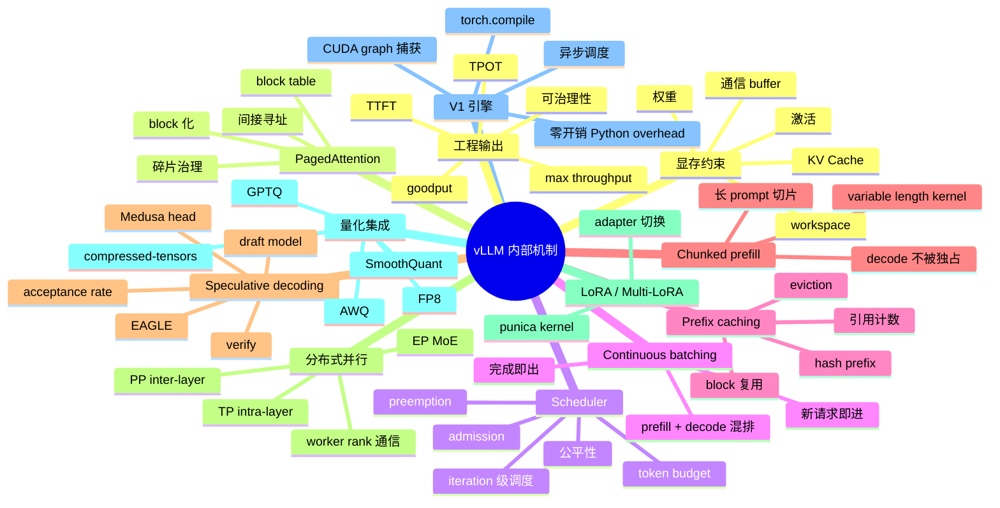
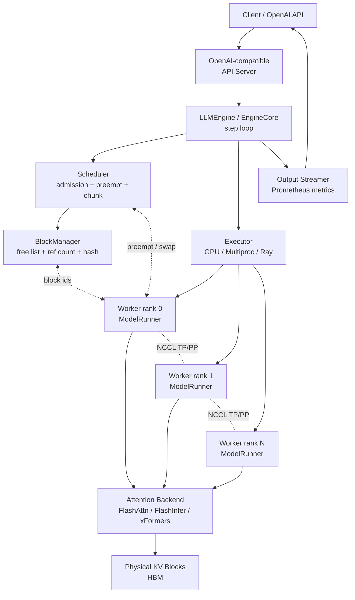
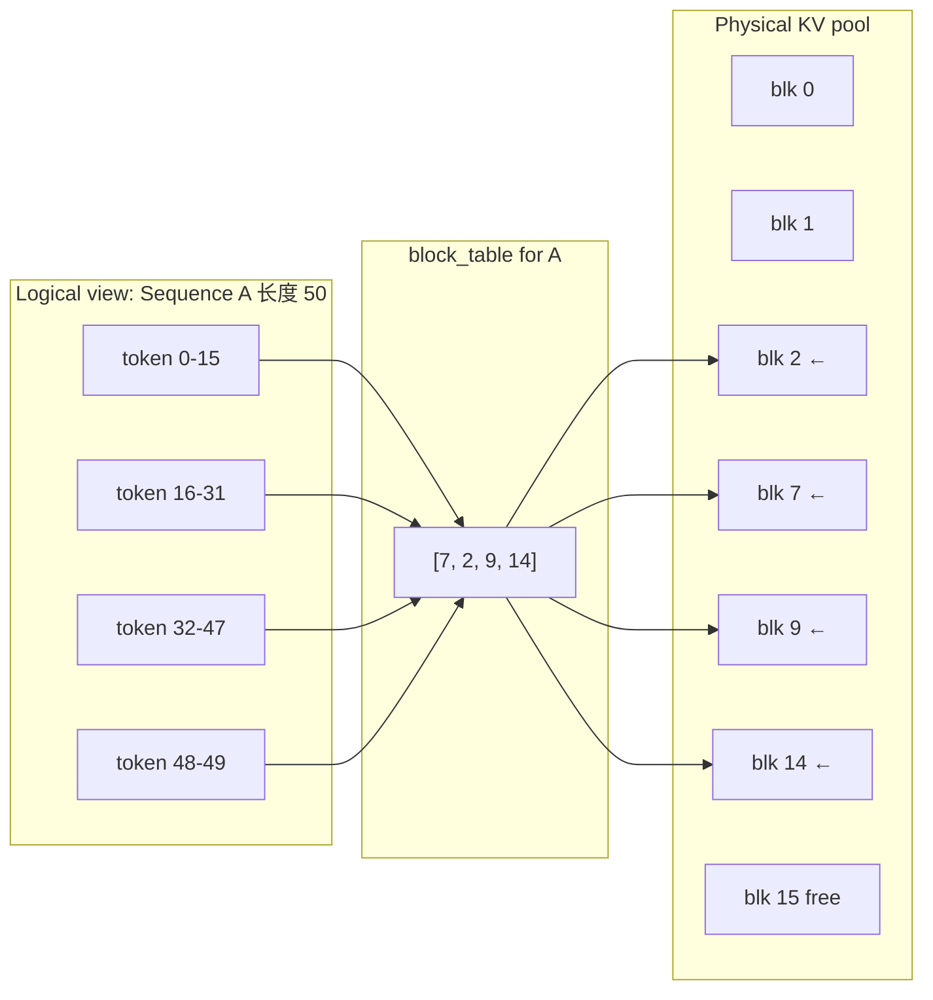
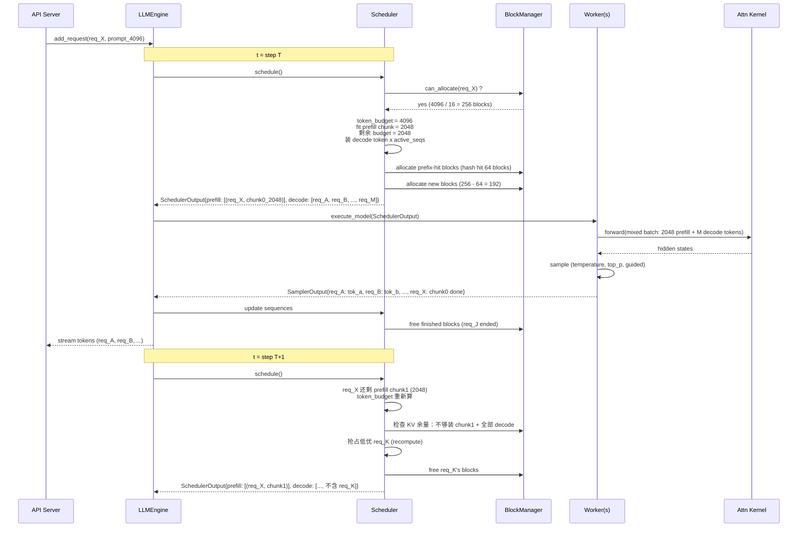
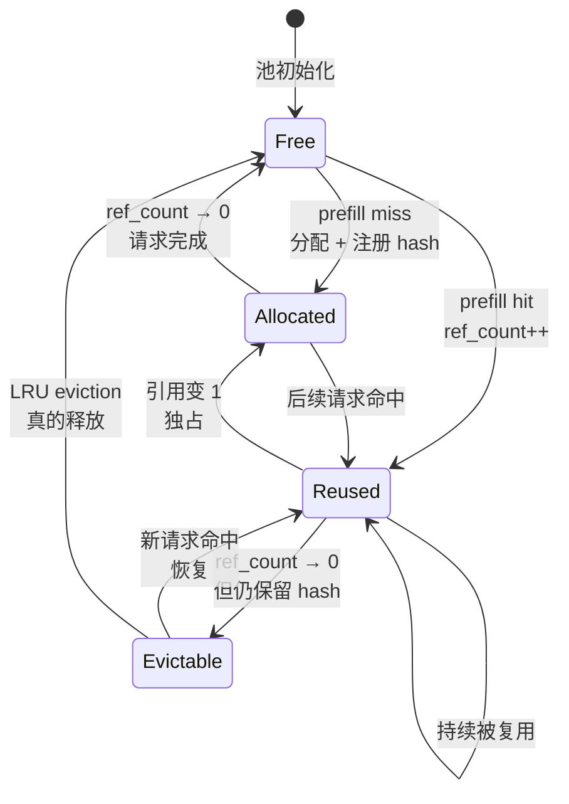
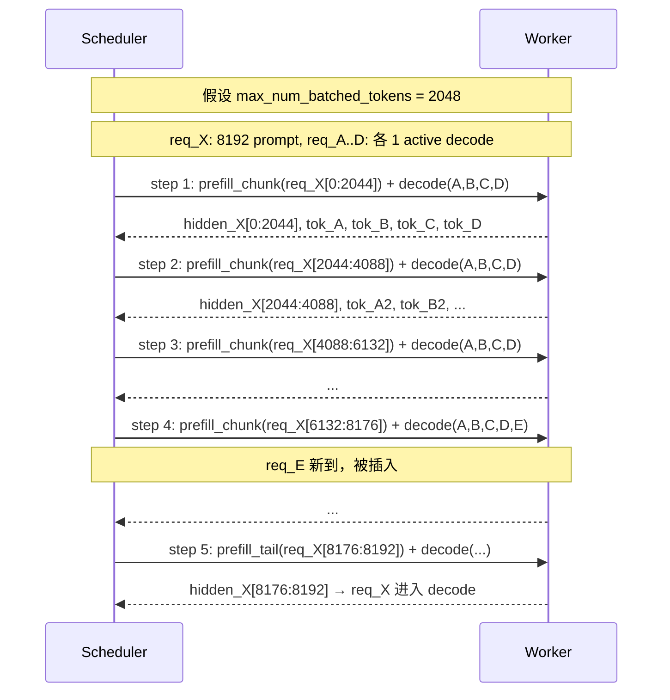
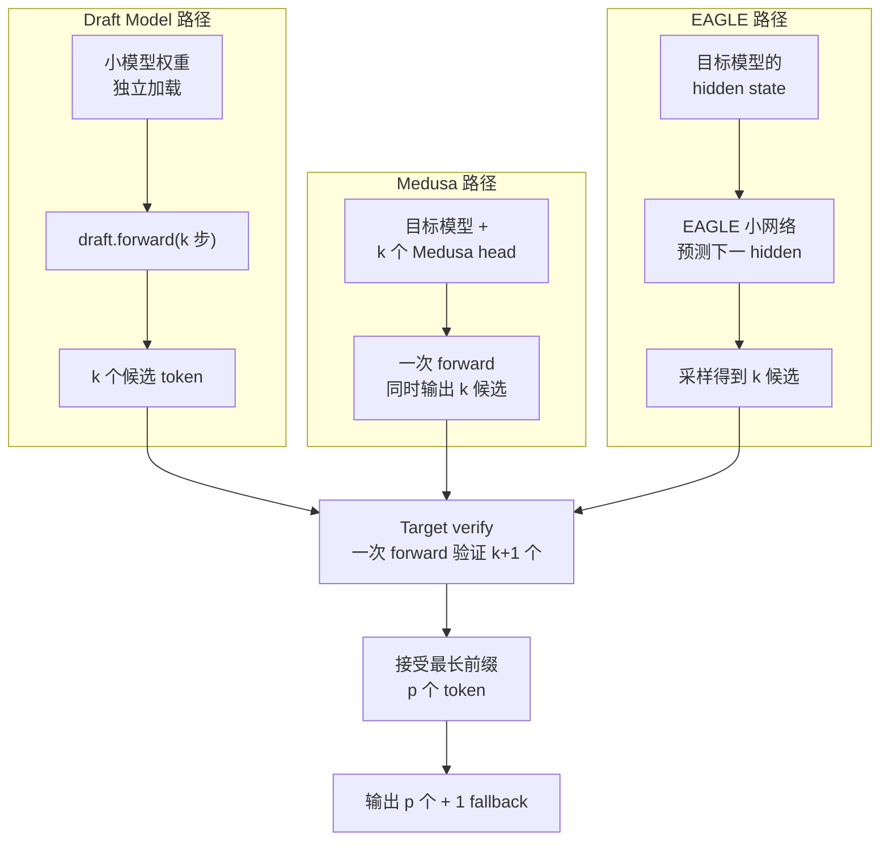
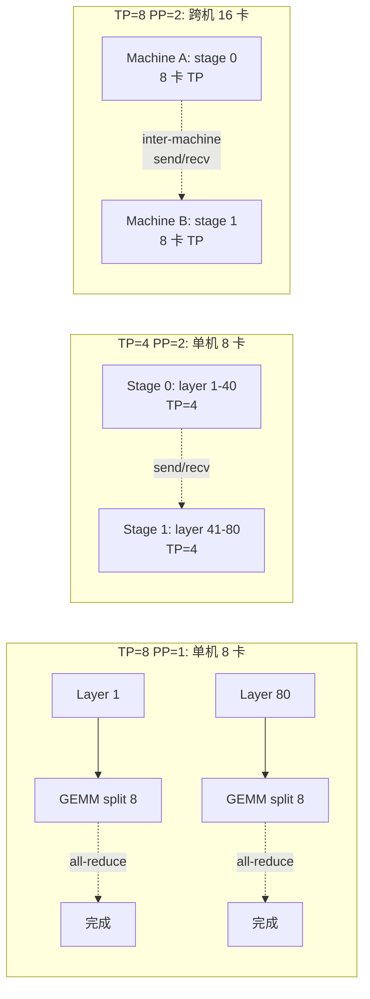
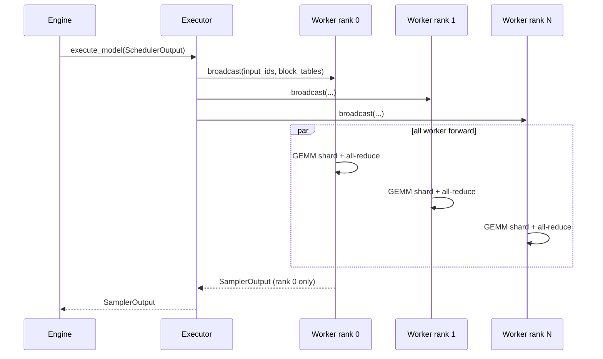
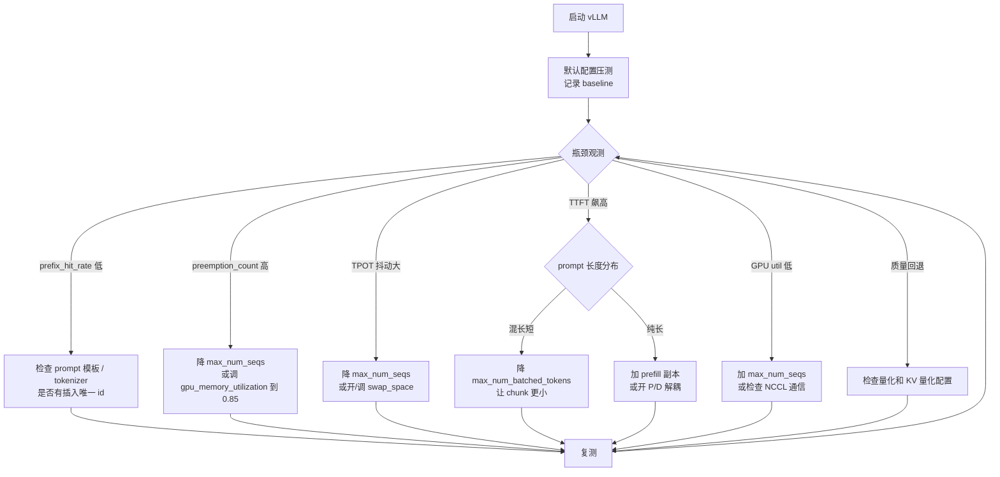

# 第 16a 章 · vLLM 内部机制深入

> 把 PagedAttention、continuous batching、prefix caching、chunked prefill、speculative decoding、多卡并行和量化集成在同一个进程里组织起来——这就是 vLLM 真正在做的事情。

> **关联章节**：本章承接 [第15章](15-batching-scheduling-and-kv-cache.md) 关于 KV Cache、PagedAttention、调度循环的概念铺垫，以及 [第16章](16-quantization-compilation-and-engines.md) 关于推理引擎选型的整体对比。读完 Ch 15/16 后，本章回答的是更深入的问题：vLLM 在内部如何把这些机制串成一个完整的运行时；不同机制之间存在哪些实现耦合；某个参数动起来会让哪几条路径同时变化。本章不是 vLLM 用户手册，而是 vLLM 工程师视角的深挖：每一个机制为何如此设计、与替代方案相比贵在哪、便宜在哪、什么场景失效。Worked example 用一个 LLaMA-70B × 8×A100 的真实调优过程来贯穿。

---

## 16a.1 第一性原理拆解：vLLM 在解决的工程问题

### 概念先说清楚：vLLM 是什么，不是什么

vLLM 是一个面向 LLM 在线生成的推理运行时。它的核心工作不是"把一次 forward 跑通"，而是在一个长时间运行的服务进程里持续回答：哪些请求下一步进入 GPU、每个请求的 KV Cache 放在哪里、哪些 prefix 可以复用、长 prompt 是否要切片、输出 token 如何流式返回、多卡 worker 如何同步、量化和 LoRA 该走哪个 kernel。

| 概念 | 在 vLLM 里具体指什么 | 常见误解 | 工程边界 |
|------|----------------------|----------|----------|
| PagedAttention | KV Cache 的 block/page 化寻址方式，attention kernel 通过 block table 读取非连续物理 KV | 不是一种新的 attention 数学公式 | 解决显存碎片和复用，不自动提升所有 workload 的单请求 latency |
| BlockManager / BlockPool | 管理 physical KV blocks 的分配、释放、引用计数、prefix hash 和 eviction | 不是普通 Python cache | 它的状态决定能不能继续 admission，任何泄漏都会变成 KV OOM |
| Scheduler iteration | vLLM 每个 step 的调度决策单位，同时安排 prefill chunk、decode token、抢占和恢复 | 不是 HTTP request 级别的调度 | `max_num_batched_tokens` 和 `max_num_seqs` 直接改变每个 iteration 的形状 |
| Prefix cache | 用 token id 前缀 hash 复用已经算好的 KV blocks | 不是语义缓存，不理解文本含义 | token id 必须完全一致；tokenizer、模板、LoRA id 都会影响命中 |
| Chunked prefill | 把长 prompt 的 prefill 切成多个 chunk，和 decode 混合进入 batch | 不是缩短长 prompt 的总计算量 | 改善其他请求 TTFT/ITL，但可能增加长 prompt 自身 TTFT |
| Spec decode | 用 draft 路径预测多个 token，target 一次 verify | 不是近似采样，也不应该改变分布 | acceptance rate、额外显存和高并发 token budget 会决定收益 |
| LoRA serving | 同一 base model 上按请求切换 adapter，常用 punica/segmented GEMM | 不是免费多模型托管 | adapter 数量会影响 GPU cache、prefix cache 命中率和 batch 形状 |
| TP/PP | 把同一个逻辑模型切到多卡 / 多机 Worker 上执行 | 不是简单复制副本 | TP 降低单卡显存但增加 all-reduce；PP 增加容量但引入 bubble |

一句话总结：**vLLM 是一个带内存管理器和调度器的 LLM runtime，不是单纯的模型加载库。** 如果只把它当成 OpenAI API server，很多参数会显得像黑魔法；如果把它当成"GPU 上的操作系统"，PagedAttention、BlockManager、Scheduler 和 prefix cache 的边界就会清楚很多。

### 拆 — 不可化简的问题

剥掉 PagedAttention、continuous batching、prefix cache、chunked prefill、speculative decoding 这些工具名之后，vLLM 真正面对的不可化简问题只有一个：**在 GPU 显存有限的前提下，让动态长度、动态到达的请求在共享 KV Cache 池上达到最高 token 吞吐，并保持 TTFT/TPOT 可控。** 这一句听起来简单，但每一个限定词都对应一类工程约束。"显存有限"意味着权重、KV Cache、激活、CUDA workspace、通信 buffer 必须共用同一张 80 GB HBM；"动态长度"意味着 prompt 和输出长度都不可预测，无法用静态 batch 尺寸预分配；"动态到达"意味着调度器必须随时把新请求插入正在运行的 forward；"共享 KV Cache 池"意味着同一段 system prompt 的 KV 必须能被多个请求复用，而不是每个请求各算一份；"最高 token 吞吐 + TTFT/TPOT 可控"意味着平均延迟和尾延迟同时是约束条件，而不是可以二选一。

如果只优化其中一个目标，每个机制的形态都会变。比如只追求峰值吞吐而不管 TTFT，可以用 1024 的 max_num_seqs 和 32K 的 batched_tokens；如果只追求 TTFT 而不管吞吐，可以让每张卡只跑一个 prefill。vLLM 的所有运行时设计——从 BlockManager 的 block 大小、Scheduler 的 token budget、Worker 的 CUDA graph 捕获、再到 Engine 的 step 循环——都是在试图同时压住吞吐、TTFT、TPOT、显存占用、抢占次数和尾延迟这几个互相冲突的目标。

vLLM 的另一个不可化简问题是"运行时即治理"。它不只是把模型 forward 跑得快，还要承担 admission control、抢占恢复、prefix 复用、量化兼容、TP/PP 通信、LoRA 切换、metrics 上报、OpenAI API 接入、健康检查这些服务化能力。这些能力不能是事后包一层，否则会和核心调度路径互相牵制。所以 vLLM 的代码组织是"调度内核 + 模型执行 + 服务外壳"三层，而不是简单的"模型 + 服务器"。理解这一点，才能解释为什么很多看起来"应该简单"的优化（比如把 RequestStats 加 cache line padding，或者改 BlockManager 的 free list 数据结构）能让吞吐有几十个百分点的差异。

### 推 — 从这个问题如何推导出每个机制

第一层推 PagedAttention。如果显存按"每请求最大上下文 × dtype × 层数"预分配，70B 模型 32K 上下文每请求要预留 10 GB，单卡 80 GB 最多放 5 个请求，绝大部分空间被未使用的尾部 token 浪费。于是必须把 KV Cache 切成固定大小的 block（vLLM 默认 16 token），用 block table 间接寻址，让请求按需申请、按需释放。Block 既是分配单位，也是复用单位——同一段 prefix 的 block 可以被多个请求共享，引用计数管理生命周期。

第二层推 Scheduler。Block 是显存的"页"，Scheduler 是显存的"内存管理器 + 进程调度器"。每一次 step 都要回答四个问题：哪些请求可以进入下一次 forward；这一次 forward 的 token budget 是多少（prefill chunk + decode token 总和）；当 KV 不够时谁被抢占；被抢占的请求用 swap 还是 recompute 恢复。vLLM 的 V1 Scheduler 把这四个决策合并成一次 `_schedule_running()` + `_schedule_waiting()` + `_schedule_preempted()` 的调用链，并且让每次决策都基于显存余量、SLO 余量和请求年龄做加权。

第三层推 chunked prefill。如果每次 forward 要么是纯 prefill 要么是纯 decode，长 prompt 的 prefill 会独占整个 forward；如果允许 prefill 和 decode 同 batch，长 prompt 可以被切成 512 或 1024 token 的 chunk，每个 chunk 和当前活跃 decode 一起跑。这就要求 attention kernel 必须支持"variable length prefill + decode mixed batch"，flashattn-2 的 varlen 接口和 vLLM 的 attention backend 抽象都为此而生。

第四层推 prefix caching。当 KV Cache 是 block，Block Manager 又有引用计数，那么"两个请求共享前缀的 KV"自然就变成"两个 SequenceGroup 的 block table 前 N 项指向同一组 physical block"。vLLM v0.6+ 引入 hash-based prefix caching，让任意请求都能基于 token id 序列的 hash 命中已有 block，不再要求请求显式声明 prefix。这一步把 prefix cache 从"对话场景的可选优化"变成"所有场景的默认基线"。

第五层推 speculative decoding。Decode 每步只产一个 token、目标模型 forward 一次的 cost 和算 k 个 token 的 cost 相差不大，于是引入 draft model（小模型）一次预测 k 个候选，目标模型一次 verify k 个，接受的部分按目标模型分布吐出。vLLM 把这条路径抽象为 SpecDecodeWorker，draft 可以是另一个小模型，也可以是 Medusa head，也可以是 EAGLE 隐藏态预测器，背后共享同一套调度和 KV 管理。

第六层推分布式并行。TP 把单层的 GEMM 切到多卡，PP 把不同层切到不同 stage，EP 把 MoE 的 expert 切到不同卡。vLLM 通过 distributed Worker + ParallelConfig + `init_distributed_environment` 构造拓扑，让上层 Scheduler 完全无感知地按"逻辑模型"调度。这要求 Worker 之间的通信（all-reduce、send/recv、all-to-all）必须封装在模型层，而不是泄漏到 Scheduler。

第七层推量化和编译。AWQ、GPTQ、FP8、INT8、SmoothQuant 在 vLLM 里都不是"单独的执行路径"，而是"特定的 Linear 层实现"。配合 V1 引擎的 `torch.compile` 路径和 CUDA graph 捕获，量化模型可以保留绝大部分调度逻辑不变，只在 GEMM kernel 这一层切换实现。这种"机制正交"的设计让 vLLM 能在一个版本里同时支持十多种量化方案。

### 绘 — 因果链路



### 导 — 读完本章你应该能回答

1. PagedAttention 的 block size 为什么常常默认 16？把它调到 8 或 32 会怎样影响 prefix cache 命中率、显存碎片和 attention kernel 性能？
2. vLLM Scheduler 在一次 step 里如何同时安排 prefill chunk 和 decode token？token budget 不够时谁先被抢占？swap 和 recompute 的选择规则是什么？
3. Hash-based prefix caching 在何时命中、何时失效？相同 system prompt 的两个请求一定能命中吗？
4. Chunked prefill 的 chunk_size 为什么不能太小也不能太大？它和 max_num_batched_tokens 是什么关系？
5. Speculative decoding 的 draft model、Medusa、EAGLE 三种实现路径在 vLLM 内部的差异是什么？acceptance rate 应该怎么观测？高并发下为什么可能反效果？
6. TP/PP/EP 在 vLLM 中如何组合？跨机部署时的 worker 拓扑、KV Cache 分布和通信开销分别是怎样的？
7. AWQ、GPTQ、FP8 在 vLLM 里走的是同一条调度路径吗？它们对 prefix cache 和 chunked prefill 的兼容性有什么差异？
8. V1 引擎相对 V0 重构了哪些核心组件？为什么"零开销 Python overhead"是它的关键卖点？
9. `max_num_batched_tokens`、`max_num_seqs`、`gpu_memory_utilization`、`swap_space`、`block_size` 的物理含义分别是什么？什么样的服务应该把它们调到什么档位？

### 学习 checklist

- 能画出 vLLM 一次 step 内的完整数据流（Scheduler → ModelRunner → Worker → Attention kernel → BlockManager），并说明每一步的 GPU/CPU 开销
- 能解释 BlockManager 的 free block list、ref count、CoW 复制三者如何协作支持 prefix cache 和 beam search
- 能给出 chunked prefill 在 chunk=512 / 1024 / 2048 时的吞吐和 TTFT 取舍曲线
- 能在 vLLM Prometheus metrics 中找到 acceptance_rate、preemption_count、prefix_hit_rate、kv_cache_usage 这些关键指标，并解释每个指标飙高时该调哪个参数
- 能在 LLaMA-70B × 8×A100 的部署中，从默认配置出发，做出至少 3 轮参数调优，把吞吐提升 2 倍以上

---

## 16a.2 vLLM 整体架构：Engine / Scheduler / Worker / ModelRunner / BlockManager

vLLM 的代码组织是分层的。最外层是 `LLMEngine`（V1 中是 `LLMEngine` + `EngineCore`），负责接收请求、把请求拆成 `SequenceGroup`、驱动 step 循环、收集输出。中间层是 `Scheduler`，每一次 step 决定哪些 `SequenceGroup` 进入下一次 forward；它内部依赖 `BlockManager` 管理 KV Cache 的物理 block 分配。下层是 `Executor`（如 `GPUExecutor`、`MultiprocExecutor`、`RayDistributedExecutor`），把调度结果分发给一个或多个 `Worker` 进程；每个 Worker 持有一个 `ModelRunner`，ModelRunner 负责把请求组织成 input tensor、调用模型 forward、采样、把输出送回 Engine。



下面把每个组件再展开一层：

| 组件 | 职责 | 关键抽象 | 性能敏感点 |
|------|------|----------|------------|
| `LLMEngine` / `EngineCore` | 整个引擎的入口，驱动 step 循环 | `SequenceGroup`、`RequestOutput` | step 频率、Python 开销 |
| `Scheduler` | 每 step 决策 prefill/decode/preempt | `running`、`waiting`、`swapped` 三个队列 | 排序成本、token budget 计算 |
| `BlockManager` | 物理 block 分配、引用计数、prefix hash | `free_block_list`、`block_hash → block_id` | 分配/释放路径必须 O(1) |
| `Executor` | 把 step 任务分发到 Worker | RPC / Ray / multiproc | 跨进程通信开销 |
| `Worker` | 持有模型、KV、CUDA stream | `ModelRunner`、`CacheEngine` | warmup、CUDA graph 捕获 |
| `ModelRunner` | 组 input、跑 forward、采样 | `prepare_inputs`、`execute_model` | tensor 拷贝、kernel launch |
| `AttentionBackend` | PagedAttention kernel 抽象 | `forward(prefill)` / `forward(decode)` | block table 访存 |
| `Sampler` | 采样逻辑（temperature、top_p、guided 等） | `LogitsProcessor` chain | 长 vocab 上的 softmax 成本 |

> **设计原则**：调度路径上的每一个对象都尽量做到 O(1) 或 O(active_seqs)。vLLM 性能的很多次关键提升（V0 → V1）都来自把 O(N) 的 list 操作换成 dict 或 free list。

> **工程边界**：这个分层在大多数场景里都很清晰；但当你要改某些跨层的行为（比如让 Scheduler 感知 LoRA、让 BlockManager 感知量化），就会发现"机制正交"是有代价的——必须维持抽象不破。社区 PR 经常就是在这个抽象边界上拉锯。

---

## 16a.3 PagedAttention 底层实现：Block Table、Block Manager、Physical/Logical 映射

第 15 章 §15.7 已经说过 PagedAttention 的"分页"思想：把 KV Cache 切成固定 block，用 block table 间接寻址。这一节展开 vLLM 实现里更深入的几层细节：block 的物理布局、block table 的数据结构、引用计数和 CoW（copy-on-write）的协作、以及 attention kernel 对 block table 的访存模式。

### 物理 KV 池布局

vLLM 在初始化时会预分配一大块连续 HBM，作为 KV Cache 的物理池。这块内存按"层 × KV × num_blocks × block_size × num_heads × head_dim"的形状组织。例如 70B 模型 80 层、TP=8 时每卡的 num_kv_heads_per_rank = 1（GQA 8 头切到 8 卡），head_dim=128，block_size=16，那么每个 block 在每卡上的 KV 占用是 `2 (K/V) × 16 × 1 × 128 × 2 (bf16) = 8 KiB`。如果一卡留给 KV 的预算是 32 GB，单卡可容纳 `32 GiB / (8 KiB × 80 layers) = 50K blocks`，对应 `50K × 16 = 800K tokens` 的总 KV 预算。

### Block Table 数据结构

每个 `Sequence` 持有一个 `block_table: List[int]`，索引是 logical block id（按 token 顺序），值是 physical block id（指向上面那块大池）。Decode 一步推进一次，如果当前 block 还有空位（`len(seq) % block_size != 0`），不分配新 block；否则向 BlockManager 请求一个新 physical block。Attention kernel 在 forward 时拿到 block table，按 logical id 顺序去 KV 池里"跳着读"——这就是 PagedAttention kernel 的核心循环。



### Free List、Ref Count 与 CoW

BlockManager 维护一个 `free_block_list`（vLLM 实现里实际是 `BlockPool`，O(1) 分配 + 释放）。每个物理 block 有一个引用计数 `ref_count`：

- 单请求独占的 block，`ref_count = 1`
- 多个请求共享的 prefix block，`ref_count = N`（N 个请求引用）
- 当 `ref_count = 0` 时 block 回到 free list

当一个共享 prefix 的请求需要在某个 block 上"分叉"写新 token 时，BlockManager 会做 CoW：复制一份新 block（从 free list 取），把原 block 的内容拷贝过去（实际上 vLLM 实现里因为这一步发生在 prefill/decode 边界，可以避免实际拷贝，只把 logical 指向新 block 然后正常写入），把原 block 的 ref_count 减 1。这是 prefix caching 安全性的核心。

### Block 大小为什么常常是 16

| block_size | 利与弊 |
|------------|--------|
| 4 | 浪费极少（最大碎片 = 3 token），但 block table 长，attention kernel 跳读次数多，prefix 命中粒度太细 |
| 8 | 比 4 略好，但仍偏小 |
| **16（默认）** | 在 carbon 标准 attention kernel 上访存效率最优；prefix 命中粒度合理；尾部碎片可控 |
| 32 | 尾部碎片增大（最差 31 token），prefix 命中粒度变粗，但 block table 短 |
| 64+ | 长 prompt 友好，但 short request 浪费大；prefix cache 命中率显著下降 |

> **工程边界**：block_size 是 vLLM 里"最不该乱动"的参数之一。改它会同时影响 attention kernel 性能、显存利用率、prefix cache 命中率、preemption 粒度。除非你有非常具体的场景理由（比如全是 8K+ 长 prompt），保持默认 16。

> **danger**：把 block_size 改成 1 听起来"碎片为零"，实际上会让 block table 长度暴涨，attention kernel 访存模式完全失效，吞吐可能掉 80%。

---

## 16a.4 Continuous Batching 调度循环：iteration-level scheduling 详解

vLLM 的 step 循环是整个引擎的心跳。每 step 内部，Scheduler 必须在一次决策中同时处理：新到请求的 admission、正在 prefill 请求的 chunk 推进、正在 decode 请求的 token 推进、显存不够时的 preempt、被 preempt 请求的 swap-in 或 recompute。这一节用一个具体的 step 时序图把这些动作串起来。



### Token Budget 怎么算

vLLM Scheduler 的核心 budget 是 `max_num_batched_tokens`。一次 step 内，所有 prefill chunk 的 token 数加上所有 decode 的 token 数（每个 active sequence 算 1）必须 ≤ budget。decode 占 token 少但 forward latency 主要来自调度开销和 attention 访存；prefill 占 token 多但每 token 算力消耗低。chunked prefill 让两者可以混排。

| 工作模式 | token 组成示例（budget=8192） |
|----------|--------------------------------|
| 纯 decode（高并发对话） | 256 个 active sequences × 1 token = 256，远低于 budget，吞吐受 decode kernel 限制 |
| 纯 prefill（冷启动） | 1 个 8K prompt × 8192 token = 8192，刚好填满 budget |
| 混合（典型生产） | 1 个 prompt prefill chunk 6144 + 2048 个 active decode = 8192 |
| 高 prefill 压力（RAG burst） | 4 个 prompt 各 chunk 1024 + 4096 active decode = 8192 |

### Preemption 决策

当 BlockManager 报告"无法为当前调度方案分配足够 block"时，Scheduler 必须抢占已 running 的 SequenceGroup。vLLM V1 默认策略：

- 优先抢年龄最小（最近开始的）请求
- 先尝试 swap：把 KV blocks 拷到 CPU 内存（占用 `swap_space`）
- swap_space 用满或没配置时，做 recompute：丢弃 KV，请求回到 waiting 队列，下次重新 prefill（prefix cache 会救回大部分计算）

| 抢占策略 | 恢复 latency | 需要的资源 | 何时使用 |
|----------|--------------|------------|----------|
| Swap | 几十 ms（PCIe 拷贝） | swap_space CPU 内存 | 短 prompt 长输出，重算成本高；CPU 内存够 |
| Recompute | 几百 ms 到秒级（重新 prefill） | 无额外资源 | 长 prompt 短输出，prefix cache 能命中 |

> **note**：V1 默认偏好 recompute，因为 prefix cache 让重算成本被极大压缩。如果你的服务 prefix cache 命中率低（< 30%），可以显式开 swap。

> **warn**：preemption 次数飙高（`vllm:num_preemptions_total` 持续增长）几乎一定意味着 `max_num_seqs` 或 `gpu_memory_utilization` 设得太激进，应该回调一档。

---

## 16a.5 Prefix Caching：Hash Prefix + Block Reuse + Eviction

第 15 章 §15.7.2 已经讲过 prefix cache 的"两个请求共享前缀 KV"这个直觉。vLLM v0.6+ 的实现把这个机制升级成了"自动 hash-based prefix caching"：不需要请求显式声明 prefix，任何两个请求只要 token 序列前缀相同，就能命中。

### Hash 算法

vLLM 对每个 block 计算一个 hash：`hash(prev_block_hash, block_token_ids)`。即每个 block 的 hash 依赖前面所有 block 的 hash 和当前 block 内的 16 个 token id。这保证两个请求的 hash 序列相同，当且仅当它们的 token id 序列前缀相同。BlockManager 维护一个 `block_hash → physical_block_id` 的字典，prefill 时查表，命中则直接复用 physical block 并增加 ref_count，未命中则分配新 block 并注册 hash。



### Eviction 策略

当一个 block 的 ref_count 降到 0，它不会立刻进入 free list，而是进入"evictable"状态——hash 仍然保留，物理 block 还能被命中。只有当 free list 空了、需要新分配时，才会从 evictable pool 中按 LRU 选一个真正释放（清掉 hash 注册，回到 free 状态）。这个设计让"刚结束的请求"的 KV 仍然能为后续相同 prefix 的请求所用。

### 命中率从哪来

| 场景 | 典型命中率 | 主要命中来源 |
|------|------------|--------------|
| 多租户 system prompt 共享 | 80-95% | 几百到几千 token 的 system prompt + few-shot |
| 多轮对话 | 60-80% | 历史对话作为 prefix |
| RAG 模板 | 50-80% | 模板 + 检索文档片段 |
| 代码补全 | 40-70% | 文件头部、import、上下文 |
| 完全独立的短问答 | < 5% | 几乎不共享 |

> **note**：prefix cache 的命中率是 vLLM 调优中收益最大的单一指标。`vllm:gpu_prefix_cache_hit_rate` 在生产上应该是 dashboard 必看项。

> **success**：prefix cache 几乎是免费的——v0.6+ 默认开启，开关基本不需要关。少数场景（比如每个请求都用唯一 hash 后的 prompt）可能因为 hash 计算和字典查找产生少量开销，但实测一般 < 1%。

> **工程边界**：prefix cache 的命中要求 token id 完全一致。任何 tokenizer 版本变化、`add_special_tokens` 不一致、prompt 中插入时间戳/uuid，都会让命中率归零。生产上要把 prompt 模板作为 versioned artifact 管理。

---

## 16a.6 Chunked Prefill：长 prompt 切片 + 与 decode 混合 batch

Chunked prefill 是 vLLM V1 的默认行为（V0 时是 opt-in）。它的核心思路是：不让任何一次 forward 被单个长 prompt 独占；所有 prefill 都按 `chunk_size`（实际由 `max_num_batched_tokens` 隐含决定）切片，每片和当前活跃 decode 一起进 batch。



### 对比：non-chunked vs chunked

| 指标 | Non-chunked（V0 默认） | Chunked（V1 默认） |
|------|------------------------|--------------------|
| 长 prompt prefill 期间 GPU 利用率 | 高（纯 prefill） | 略低（混 decode） |
| 同期 decode 请求 ITL | 被独占 2 秒 | 每步正常推进 |
| 短 prompt 的 TTFT | 被长 prompt 阻塞 | 几乎不受影响 |
| 长 prompt 自身的 TTFT | 一次 forward 完成 | 略高（分多次） |
| 整体 goodput | 长 prompt 拖累整池 | 显著提升 |

> **note**：vLLM 内部并没有显式的 `chunk_size` 参数。Prefill 的实际 chunk 大小由 Scheduler 在每个 step 计算：`chunk = max_num_batched_tokens - sum(active_decode_tokens)`。换句话说，活跃 decode 越多，chunk 越小。

### 何时关掉 chunked prefill

罕见情况下，如果你的服务全是短 prompt（< 1024 token），decode 很少，开 chunked prefill 反而引入额外的 schedule 开销。可以用 `--enable-chunked-prefill=False`（V0 风格）或者把 `max_num_batched_tokens` 调到大于最长 prompt 来等价禁用。

> **工程边界**：chunked prefill 对 attention backend 要求很严——必须支持 variable-length prefill kernel（FlashAttn-2 的 varlen 接口）。某些自定义 attention 实现不支持时，启用会回退到慢路径。

---

## 16a.7 Speculative Decoding：vLLM 中的 Draft Model / Medusa / EAGLE

Speculative decoding（投机解码）的核心已经在 [§15.9](15-batching-scheduling-and-kv-cache.md#159-speculative-decoding-简述) 介绍过：用一个便宜的 draft 一次预测 k 个候选，再用目标模型一次 verify k 个。vLLM 把这条路径抽象为 `SpecDecodeWorker`，下面三种 draft 实现共享同一套 verify、KV 管理和调度逻辑。

### 三种实现路径



### 三者对比

| 维度 | Draft Model | Medusa | EAGLE |
|------|-------------|--------|-------|
| 是否需要额外训练 | 通常使用现成小模型 | 需要训练 Medusa heads | 需要训练 EAGLE 小网络 |
| 显存开销 | 较高（独立小模型权重） | 中（多 head） | 低（小网络） |
| Draft 速度 | 看小模型大小 | 一次 target forward | 极快 |
| Acceptance rate | 60-80%（取决于 draft 质量） | 60-80% | 70-90%（因为基于 hidden state，更接近目标分布） |
| 实现复杂度 | 低（vLLM 原生支持） | 中 | 高 |
| 在 vLLM 的成熟度 | 高 | 中 | 实验性 |

### Verify 流程的工程细节

`SpecDecodeWorker` 在 verify 时，会把 `k+1` 个 token id 一次性送进 target model 做一次 forward。Target model 输出 `k+1` 个 logits，依次和 draft 候选比较。vLLM 用了 rejection sampling 的修正算法保证最终采样分布与目标模型一致。Verify 通过后，被接受的 token 都是"免费"的——它们共享同一次 target forward 的算力。

### 何时不用

| 场景 | 加速效果 | 原因 |
|------|----------|------|
| 单请求 / 低并发 decode | 2-3x | GPU 本来空闲，多算无成本 |
| 长输出（数千 token） | 1.5-2x | 单次 verify 的多余成本被多 token 摊薄 |
| 高并发（batch > 32） | 1.0x 或负 | target verify 让 batch 总 token 翻倍，撑爆 token budget |
| 短输出（< 100 token） | 1.0-1.2x | 投机收益还没积累就结束 |
| 严格质量约束 | 不应使用 | 虽然分布上正确，但实现 bug 风险高 |

> **danger**：上线 speculative decoding 前，必须监控 `vllm:spec_decode_acceptance_rate`、`vllm:spec_decode_num_accepted_tokens`、`vllm:spec_decode_num_draft_tokens`。如果 acceptance rate < 50%，几乎一定是负优化。

> **工程边界**：speculative decoding 与 chunked prefill、prefix cache 是正交机制，但与 LoRA 切换、guided decoding（结构化输出）有耦合——后两者会让 draft 分布和 target 分布发散，acceptance rate 大幅下降。

---

## 16a.8 张量并行（TP）+ 流水并行（PP）+ EP：vLLM 的多卡/多机部署形态

vLLM 通过 `--tensor-parallel-size`、`--pipeline-parallel-size`、`--expert-parallel-size` 三个参数支持任意拓扑组合。Worker 进程数 = TP × PP（× EP for MoE 层），分布在一台或多台机器上。下面是一个 70B 模型在 8 卡上的典型部署对比。



### 拓扑选择

| 拓扑 | 适用模型规模 | 通信开销 | 优点 | 缺点 |
|------|--------------|----------|------|------|
| TP=2-8 单机 | 7B - 200B | NVLink all-reduce，每层 1 次 | latency 最低，最常见 | 受单机 GPU 数限制 |
| PP=2 单机 + TP=4 | 大模型单机不够 KV 时 | NVLink send/recv，每 stage 1 次 | 显存翻倍 | 引入 pipeline bubble |
| TP=8 跨机（NVLink + IB） | 200B+ | IB all-reduce 较慢 | 多机扩 KV | all-reduce 跨机延迟高 |
| TP=N + PP=M 跨机 | 超大模型 / DeepSeek 类 | 混合 | 容量灵活 | 调优最复杂 |
| EP（MoE） | DeepSeek-MoE / Mixtral 等 | all-to-all token 路由 | expert 显存分布 | all-to-all 是新瓶颈 |

### Worker 通信细节



实际的 all-reduce 调用是 NCCL 的 `ncclAllReduce`，每一层 attention 后 1 次、每一层 MLP 后 1 次（总共 ~ 2 × num_layers 次）。70B 模型 80 层 ≈ 160 次 all-reduce per forward。NVLink 上一次 ~ 30 us，跨机 IB 上一次 ~ 200 us 起。

> **note**：跨机 TP 通常不推荐，除非模型实在装不下。优先尝试 TP=8 单机 + PP 跨机。

> **工程边界**：vLLM 的 Worker 是独立进程（multiproc 或 Ray），不共享 Python GIL。但他们必须严格同步 step——如果某个 Worker 慢了（比如 NCCL 抖动），整个 step 都卡。生产上要监控 `vllm:time_to_first_token_seconds`、`vllm:time_per_output_token_seconds` 的分布而不是 mean。

---

## 16a.9 LoRA / Multi-LoRA Serving：punica 集成、adapter 切换路径

vLLM 支持在同一个 base model 上动态挂载多个 LoRA adapter，请求级别指定 `lora_request`，所有 LoRA 在同一个 batch 里被并行处理（基于 punica kernel 的 segmented gemm）。这让"多个微调版本共享一套底座"成为可能。

### 工作原理

LoRA 把 `W' = W + α × B × A`，A、B 是低秩矩阵。Punica kernel 的核心是一个 segmented batch matmul：一个 batch 内不同请求可以走不同的 (A, B) 对，kernel 内按 segment 选 LoRA 权重。vLLM 的 `LoRAModelManager` 把所有加载的 LoRA 权重放进 LRU 缓存（GPU），未命中时从 CPU 或磁盘换入。

| 维度 | 说明 |
|------|------|
| 最大并发 LoRA 数 | `--max-loras`（默认 1，可调到几十） |
| LoRA rank | `--max-lora-rank`（典型 16-64） |
| 切换开销 | LRU 命中时几乎为零；未命中时 ~ 100ms 加载 |
| Prefix cache 兼容 | LoRA id 也参与 hash，不同 LoRA 的相同 prefix 不命中 |
| Speculative decoding 兼容 | 部分支持（draft 必须用同一 LoRA） |

> **工程边界**：multi-LoRA 看起来很美，但每个 LoRA 都会让 prefix cache 命中率下降（因为 hash 加入 LoRA id）。如果你有 100 个 LoRA、流量均匀分布，prefix cache 几乎归零。

> **warn**：punica kernel 对 LoRA rank 有上限要求；rank 超过 kernel 支持时（通常是 64）会回退到逐请求循环，性能急剧下降。

---

## 16a.10 量化集成：AWQ、GPTQ、FP8、SmoothQuant 在 vLLM 中的落地路径

vLLM 把量化封装成 Linear 层的不同实现。`QuantizationConfig` 在模型加载时决定每一层的 Linear 走哪个 backend。下表对比常见量化方案在 vLLM 中的成熟度。

| 方案 | vLLM 支持情况 | 权重格式 | 激活精度 | 是否兼容 chunked prefill | 是否兼容 prefix cache | 性能特点 |
|------|---------------|----------|----------|--------------------------|------------------------|----------|
| AWQ (W4A16) | 成熟 | INT4 + scale | BF16 | 是 | 是 | decode 快 1.5-2x，prefill 略快 |
| GPTQ (W4A16) | 成熟 | INT4 + scale + zeros | BF16 | 是 | 是 | 与 AWQ 接近 |
| GPTQ-Marlin | 成熟（Ampere+） | INT4 packed | BF16 | 是 | 是 | 比 GPTQ 默认快 1.5x |
| FP8 (W8A8) | 成熟（Hopper+） | FP8 E4M3 | FP8 | 是 | 是 | 在 H100 上 prefill+decode 都快 1.5-2x |
| SmoothQuant W8A8 INT8 | 成熟 | INT8 | INT8 | 是 | 是 | 通用 GPU 上加速 |
| compressed-tensors | 成熟（覆盖多种） | 多种 | 多种 | 是 | 是 | Neural Magic 路径，覆盖最广 |
| KV Cache FP8 | 成熟 | KV: FP8 | 计算 BF16 | 是 | 是 | 长上下文必看 |
| INT4 KV Cache | 实验性 | KV: INT4 | 计算 BF16 | 部分 | 部分 | 长上下文显存对半 |
| MXFP4 / NVFP4 | 实验性（Blackwell） | 4-bit float | 4-bit float | 待验证 | 待验证 | 未来路线 |

### 量化和调度的耦合

| 调度路径 | 量化的影响 |
|----------|-----------|
| BlockManager | 不感知（KV Cache 量化是 attention kernel 内部的事，block 仍然按物理大小算） |
| Scheduler | 不感知（token budget 计算不变） |
| AttentionBackend | 强相关（KV 量化要求 kernel 支持 dequant on the fly） |
| Sampler | 不感知 |
| LoRA | 部分耦合（LoRA 通常是 BF16，加在量化 base 上需要 dequant + add + quant） |

> **success**："机制正交"是 vLLM 设计的核心优势。同一份 PagedAttention + Scheduler 代码可以服务 BF16、AWQ、GPTQ、FP8 任意组合，只需要切 Linear backend。

> **工程边界**：但激活量化（W8A8）+ chunked prefill 的某些组合在历史版本中曾出现 bug（混合长度的激活 outlier 处理不一致）。生产上量化方案选定后必须 pin vLLM 版本。

---

## 16a.11 V1 引擎重构：与 V0 相比的架构变化

vLLM V1（v0.6+ 引入，v0.8 后默认）相对 V0 是一次系统性重构，核心目标是消除"Python overhead"——把调度循环里所有可能的 Python-level 开销搬到 C++/Rust 或 CUDA。

### 主要变化

| 维度 | V0 | V1 | 影响 |
|------|----|----|------|
| Engine 循环 | 同步 step，Python 主导 | 异步 step + EngineCore 子进程 | 调度和执行重叠 |
| Scheduler | 单文件大类，O(N) 操作 | 拆分 `running` / `waiting` 队列，O(active) | 大并发下吞吐显著提升 |
| Block Manager | 多种 block manager（v0、v1、v2） | 统一 block manager + hash prefix | 实现简化 |
| Sampler | Python 循环 | torch.compile + CUDA graph 化 | 长 vocab 模型 sampler 不再是瓶颈 |
| Worker | 同步 RPC | 异步 RPC + CUDA graph capture | warmup 后 step 几乎零 Python overhead |
| Chunked prefill | opt-in | 默认开 | 长 prompt 不再独占 |
| Prefix caching | opt-in，session-level | 默认开，hash-based | 命中率显著提升 |
| Speculative decoding | 单独 worker，集成度低 | 统一抽象 SpecDecodeWorker | 更易扩展新 draft 算法 |
| 多模态 | 实验性 | 成熟（VLM 主流模型支持） | 多模态服务可生产 |
| LoRA | 通过 punica，集成有限 | 一等公民，与 prefix cache、quant 协调 | 多 LoRA 服务化更顺 |

### "零开销 Python overhead"为什么重要

V0 时代，一次 step 的 Python 调度开销 ~ 5-10 ms；当 batch=256、decode step 本身只需 30 ms 时，Python 开销占了 20-30%。V1 把这部分压到 < 1 ms。在高并发场景（多个长上下文请求 + 大 batch decode）下，V1 相对 V0 的吞吐提升常常达到 30-80%，且 ITL P99 显著更稳。

> **note**：从 v0.8 开始，V1 是默认选项。如果你还在使用 V0，几乎所有场景都建议升级。

> **工程边界**：V1 的某些边缘特性（如某些自定义 sampler、特定老模型）支持还不完整。生产上要确认你需要的特性在 V1 上有等价实现。

---

## 16a.12 性能调优手册：关键参数的物理含义和决策规则

下面这张表是 vLLM 调优中最常动的几个参数。每个参数列出物理含义、典型范围、调优方向、典型副作用。

| 参数 | 物理含义 | 默认 / 范围 | 调大的代价 | 调小的代价 | 决策规则 |
|------|----------|-------------|------------|------------|----------|
| `gpu_memory_utilization` | 整张卡总预算占比（含权重 + KV + workspace） | 0.9 / 0.5-0.95 | OOM 风险，CUDA workspace 不够 | KV 池小，能放的请求少 | 起点 0.9；遇到 OOM 回到 0.85；需要 CUDA graph 时考虑留 5-10% buffer |
| `max_num_batched_tokens` | 每 step 所有 token（prefill chunk + decode）总上限 | 8192 / 2048-32768 | 长 prefill 不被切碎，但 ITL 抖 | chunk 太小，schedule overhead 高 | 短 prompt 服务调小到 2048-4096；长 prompt 调大到 16384-32768 |
| `max_num_seqs` | 同一 step 最多多少个 active sequence | 256 / 64-1024 | 并发更高，吞吐更高，但 KV 容易满，TPOT 抖 | 吞吐受限 | 用 KV 显存预算反推：`max_num_seqs ≈ KV_budget / per_seq_KV` |
| `block_size` | 每个 KV block 的 token 数 | 16 / 8-32 | prefix 命中粒度变粗，碎片大 | block table 长，attention 慢 | 99% 场景保持 16 |
| `swap_space` | preempt 时换出 KV 用的 CPU 内存（GB / GPU） | 4 / 0-32 | 占主机内存 | 抢占时只能 recompute | 长输出 + 低 prefix 命中时调到 8-16 |
| `enable_prefix_caching` | 是否开 prefix cache | True / bool | 极小（< 1%） | 命中场景吞吐显著下降 | 永远开 |
| `enable_chunked_prefill` | 是否开 chunked prefill | True (V1) | 短 prompt 多时略增 schedule | 长 prompt 独占 forward | V1 默认开；除非全是短 prompt |
| `tensor_parallel_size` | TP 卡数 | 1 / 1-8 | NCCL 通信 | 装不下大模型 | 按模型大小：7B→1, 70B→4 或 8 |
| `pipeline_parallel_size` | PP stage 数 | 1 / 1-8 | pipeline bubble | 单 stage 显存不够 | 跨机扩 KV 时考虑 |
| `kv_cache_dtype` | KV Cache 精度 | auto / fp8 / int8 | 长上下文显存对半 | 极小质量退化 | 长上下文 + Hopper+ 默认 fp8 |
| `quantization` | 模型量化方案 | None / awq / gptq / fp8 / ... | 取决于硬件 | BF16 / FP16 baseline | 见 §16a.10 |
| `max_lora_rank` / `max_loras` | LoRA 配置 | 16 / 1 | LRU 切换开销 | LoRA 并发受限 | 按业务需要 |
| `disable_log_stats` | 是否关停 metrics | False | 几乎为零 | 失去观测 | 永远开 metrics |

### 调优决策树



> **success**：调优心法——一次只动一个参数，每次都对比 6 个核心指标（throughput tokens/s, TTFT P99, TPOT P99, prefix hit rate, preemption count, KV cache usage）。把这些指标做成 Grafana dashboard，调参就是看曲线。

### 16a.12.1 三类生产配置画像

默认参数只是起点。生产配置应该从流量形状反推，而不是从"别人 benchmark 的命令行"复制。

| 服务画像 | 流量特征 | 推荐起点 | 重点指标 | 最容易踩的坑 |
|----------|----------|----------|----------|--------------|
| 短问答 / Chatbot | prompt 200-2K，输出 100-800，高并发 | `max_num_seqs=512-1024`，`max_num_batched_tokens=4096-8192`，prefix cache 开启 | TPOT P99、goodput、prefix hit rate | `max_num_seqs` 拉太高导致 KV 满和抢占 |
| 长上下文 / RAG | prompt 4K-64K，输出中等，prefix 共享明显 | `max_num_batched_tokens=8192-32768`，`kv_cache_dtype=fp8/int8`，chunked prefill 开启 | TTFT P99、KV usage、preemption_count | 只做权重量化，不压 KV；prompt 模板插入时间戳导致 prefix miss |
| 低并发长输出 | prompt 中短，输出 2K+，并发低 | 评估 speculative decoding，`max_num_seqs` 保守，`swap_space=8-16` | TPOT、acceptance_rate、GPU util | 高 acceptance rate 但总 token budget 被 verify 撑爆 |
| Multi-LoRA SaaS | 多租户 adapter，请求级 LoRA id | `--enable-lora`，按热度设置 `max_loras`，限制 `max_lora_rank` | LoRA cache hit、prefix hit by LoRA、adapter load latency | adapter 太多且流量均匀，prefix cache 和 LoRA GPU cache 同时失效 |
| 固定系统提示词 Copilot | 大量共享 system prompt / few-shot | prefix-aware routing，模板版本化，prefix cache 默认开 | prefix_hit_rate、TTFT by replica | 多副本随机路由稀释 prefix cache |
| 跨机超大模型 | 200B+ 或 MoE，单机装不下 | 优先 PP 跨机、TP 尽量留在 NVLink 域内，EP 单独压测 | NCCL latency、step time skew、bubble ratio | 跨机 TP all-reduce 把每层延迟放大 |

一个可执行的配置评审模板：

```yaml
model: llama-3-70b-instruct
traffic_profile:
  input_tokens_p50_p95_p99: [900, 6000, 16000]
  output_tokens_p50_p95_p99: [250, 900, 2000]
  prefix_share_ratio: 0.65
  target_slo:
    ttft_p99_ms: 1000
    tpot_p99_ms: 80
runtime:
  tensor_parallel_size: 8
  max_model_len: 32768
  max_num_seqs: 512
  max_num_batched_tokens: 8192
  kv_cache_dtype: fp8
  gpu_memory_utilization: 0.90
release_guardrails:
  preemption_rate_max: 0.05/s
  prefix_hit_rate_min: 0.50
  quality_regression_max: 1.0%
```

> **工程边界**：`max_model_len` 是容量承诺，不是越大越好。即使 99% 请求只有 4K，只要配置成 128K，KV block 预算和 admission 行为都会按更大的上限变保守。生产上通常按业务 SKU 分不同上下文长度的副本池，而不是一个池承诺所有长度。

### 16a.12.2 故障排除：从指标回到内部机制

vLLM 的故障排除要把指标映射回 Scheduler、BlockManager、AttentionBackend、Worker 通信四条路径。

| 现象 | 首先定位到 | 关键指标 / 证据 | 常见原因 | 调整动作 |
|------|------------|------------------|----------|----------|
| TTFT P99 突然升高 | prefill 或 admission | queue time、prefill time、waiting seqs、prefix hit rate | 长 prompt burst、prefix cache 失效、chunk 太大 | 降 `max_num_batched_tokens`，做 prefix-aware routing，拆长上下文副本池 |
| TPOT P99 抖动 | decode iteration | step latency、active seqs、preemption_count | `max_num_seqs` 过高、KV 逼近上限、NCCL 抖动 | 降 `max_num_seqs`，增加 KV 预算，检查跨卡通信 |
| `num_preemptions_total` 持续增长 | BlockManager 容量 | KV cache usage、free blocks、swap/recompute 次数 | admission 太激进、输出长度被低估、KV dtype 太大 | 降并发，KV FP8/INT8，限制 max output，调 `swap_space` |
| prefix hit rate 从 80% 掉到 5% | Prefix cache | tokenizer/template 版本、LoRA id 分布、hash miss | 模板加入 request id/time，tokenizer 升级，router 随机打散 | 模板版本化，固定 tokenizer，按 prefix 路由 |
| GPU util 低但排队高 | CPU / 调度 / 通信 | scheduler time、model execute time、NCCL time、Python overhead | V0 路径、采样慢、Worker 同步等待 | 升 V1，打开 CUDA graph/compile，查慢 rank |
| OOM 发生在 warmup 后 | CUDA graph / workspace | reserved memory、graph pool、workspace | `gpu_memory_utilization` 太高，没有给 capture 留 buffer | 调到 0.85-0.90，减少 capture shapes，降 batch |
| LoRA 请求尾延迟高 | LoRA cache | adapter load count、LoRA LRU hit、rank 分布 | 冷 adapter 从磁盘/CPU 换入，rank 超 kernel 支持 | 预热热 adapter，限制 rank，把冷租户隔离到独立池 |
| spec decode 负优化 | SpecDecodeWorker | acceptance_rate、draft tokens、verify tokens、batch token usage | 高并发下 verify 撑大 batch，draft 太慢，guided decoding 降接受率 | 只给低并发长输出池开启，降低 draft length，关闭 guided 场景 |

> **反模式警告**：看到 preemption 就直接把 `gpu_memory_utilization` 调到 0.98，通常会把问题从"偶发抢占"变成"CUDA workspace 或 graph capture OOM"。先用 KV 预算算清楚，再决定是降并发、降上下文、压 KV 还是加副本。

### 16a.12.3 生产上线 Checklist

| 类别 | 检查项 | 为什么重要 |
|------|--------|------------|
| 模型制品 | 权重、tokenizer、chat template、generation config 版本一起 pin | prefix cache 和质量回归都依赖 token id 完全一致 |
| 容量预算 | 明确权重、KV、activation peak、CUDA graph pool、NCCL buffer 的显存预算 | `gpu_memory_utilization` 只是一行配置，不等于真实安全余量 |
| 流量分桶 | 按 input/output length、prefix share、LoRA id、租户切分压测 | 平均流量会掩盖长上下文和 adapter 冷启动 |
| 指标 | TTFT、TPOT、goodput、prefix hit、preemption、KV usage、NCCL time、LoRA load 全部进 dashboard | vLLM 的瓶颈跨 CPU/GPU/网络/缓存，单指标不够 |
| 回滚 | BF16 或旧量化模型、副本配置、router 权重都能独立回滚 | vLLM 参数变更也可能造成事故，不只是模型权重 |
| 预热 | 服务启动后跑代表性 shape、LoRA、prefix 和 CUDA graph warmup | 避免首次真实用户承担编译和加载成本 |
| 限流 | 对超长 prompt、超长输出、冷 LoRA、低优租户设置 admission control | 防止少数请求把 KV 池或 Scheduler 占满 |
| 版本绑定 | vLLM、CUDA、driver、NCCL、FlashAttention/FlashInfer、量化 backend 固定 | 低精度和 attention kernel 对版本非常敏感 |
| 灰度 | 先影子，再 1%/10%/50%，每档看 P99 和质量回归 | vLLM 运行时变化可能只在真实并发下暴露 |

---

## 16a.13 何时不该用 vLLM：边界场景与替代方案

vLLM 不是万能的。下面这些场景应该考虑替代方案。

| 场景 | 为什么 vLLM 不合适 | 替代方案 |
|------|--------------------|----------|
| 小模型（< 1B）+ 极低延迟（< 5ms） | vLLM 的 step overhead（即使 V1 也有 1-2ms）相对总 latency 占比高 | 直接 PyTorch + `torch.compile` 或 ONNX Runtime / TensorRT |
| 单请求超低首 token 延迟（< 50ms） | vLLM 的 admission + scheduler + KV 分配开销不可避免 | TensorRT-LLM 静态 plan |
| 复杂结构化输出（每 token guided + grammar） | vLLM 的 guided decoding 性能不如专门方案 | SGLang（RadixAttention + 编排原生） |
| CPU-only 推理 | vLLM 的 PagedAttention kernel 是 GPU only | llama.cpp / Ollama / ONNX Runtime |
| 边缘 / 移动端 | 同上，vLLM 太重 | llama.cpp / MLX / ExecuTorch |
| 极致单请求吞吐压榨 NVIDIA 集群 | 动态调度有开销 | TensorRT-LLM 静态 engine |
| 多模型快速切换（每秒切换） | vLLM 的模型加载是分钟级 | NVIDIA Triton + 模型仓库 |
| Encoder-decoder（T5、BART）密集服务 | vLLM 对 encoder-decoder 支持有限 | TGI 或专门服务 |
| 训练 / fine-tuning | vLLM 不做训练 | DeepSpeed / Megatron / FSDP |

> **note**：上面这些"不该用 vLLM"的场景，往往不是 vLLM 性能不行，而是它的运行时假设和你的需求不匹配。选错引擎比调错参数代价更大。

---

## 16a.14 Worked Example：LLaMA-70B × 8×A100，从 1200 tps 到 4500 tps

下面用一个真实风格的调优过程，把前面几节的机制串起来。场景：把 LLaMA-3-70B-Instruct 部署到一台 8×A100 80GB 服务器（NVLink，单机），目标支持企业内部 chatbot，峰值 200 QPS，平均输入 1500 token、输出 400 token，目标 P99 TTFT < 800ms、P99 TPOT < 80ms。

### 第 0 步：baseline

最朴素的启动命令：

```bash
vllm serve meta-llama/Llama-3-70B-Instruct \
  --tensor-parallel-size 8 \
  --max-model-len 8192
```

| 指标 | 数值 |
|------|------|
| Throughput | **1,200 tps**（output tokens/s） |
| P99 TTFT | 4,200 ms |
| P99 TPOT | 145 ms |
| Prefix hit rate | 62% |
| Preemption count | 0.3 / s |
| GPU mem util | 85% |
| GPU SM util | 42% |
| 瓶颈观测 | TTFT 极差，TPOT 也差，SM 利用率不高 |

### 第 1 步：开 V1 + 提高 max_num_seqs

诊断：默认 V0 引擎 + `max_num_seqs=256`。SM 利用率低意味着 batch 没填满。

```bash
vllm serve meta-llama/Llama-3-70B-Instruct \
  --tensor-parallel-size 8 \
  --max-model-len 8192 \
  --max-num-seqs 512 \
  --gpu-memory-utilization 0.92
# V1 在 v0.8+ 已是默认
```

| 指标 | 数值 | Δ |
|------|------|---|
| Throughput | **2,100 tps** | +75% |
| P99 TTFT | 3,800 ms | -10% |
| P99 TPOT | 110 ms | -24% |
| Preemption count | 1.2 / s | 上升，因为 max_num_seqs 大 |
| GPU SM util | 65% | +23pp |

### 第 2 步：开 chunked prefill 调小 batched_tokens

诊断：TTFT 仍然差，因为长 prompt 把 forward 独占。把 `max_num_batched_tokens` 从默认 8192 调到 4096，让 chunk 更细。

```bash
vllm serve meta-llama/Llama-3-70B-Instruct \
  --tensor-parallel-size 8 \
  --max-model-len 8192 \
  --max-num-seqs 512 \
  --max-num-batched-tokens 4096 \
  --gpu-memory-utilization 0.92
```

| 指标 | 数值 | Δ |
|------|------|---|
| Throughput | **2,800 tps** | +33% |
| P99 TTFT | 1,400 ms | -63% |
| P99 TPOT | 95 ms | -14% |
| Preemption count | 1.5 / s | 略升 |

### 第 3 步：开 FP8 KV Cache

诊断：A100 不支持 FP8 计算，但支持 FP8 KV Cache（vLLM 的 `kv_cache_dtype=fp8`）。这能把 KV 占用减半，让 max_num_seqs 进一步提高，吞吐提升。

```bash
vllm serve meta-llama/Llama-3-70B-Instruct \
  --tensor-parallel-size 8 \
  --max-model-len 8192 \
  --max-num-seqs 768 \
  --max-num-batched-tokens 4096 \
  --gpu-memory-utilization 0.92 \
  --kv-cache-dtype fp8
```

| 指标 | 数值 | Δ |
|------|------|---|
| Throughput | **3,400 tps** | +21% |
| P99 TTFT | 1,200 ms | -14% |
| P99 TPOT | 78 ms | -18% |
| Preemption count | 0.6 / s | 下降，KV 余量更大 |
| GPU SM util | 79% | +14pp |

### 第 4 步：上 GPTQ-Marlin INT4 量化

诊断：权重读取仍然是 decode 瓶颈。用 INT4 GPTQ 模型替换 BF16 权重。

```bash
vllm serve TheBloke/Llama-3-70B-Instruct-GPTQ \
  --tensor-parallel-size 8 \
  --max-model-len 8192 \
  --max-num-seqs 1024 \
  --max-num-batched-tokens 4096 \
  --gpu-memory-utilization 0.92 \
  --kv-cache-dtype fp8 \
  --quantization gptq_marlin
```

权重从 70GB/卡（BF16/8）变成 ~ 17.5GB/卡（INT4/8），KV 余量从 ~ 30GB 变成 ~ 50GB，max_num_seqs 可以拉到 1024。

| 指标 | 数值 | Δ |
|------|------|---|
| Throughput | **4,500 tps** | +32% |
| P99 TTFT | 750 ms | -38% |
| P99 TPOT | 65 ms | -17% |
| GPU SM util | 88% | +9pp |
| 离线评测（MMLU） | -1.2% | 可接受 |

### 第 5 步（可选）：开 prefix-aware routing

如果服务前面有 router，把相同 system prompt 的请求路由到同一个副本，prefix hit rate 可从 62% 提到 90%+，再降一波 TTFT。本机（单副本）测试无效，但生产多副本场景能继续提升。

### 总结调优表

| 阶段 | 主要动作 | tps | TTFT P99 | TPOT P99 | 吞吐相对 baseline |
|------|----------|-----|----------|----------|-------------------|
| 0 | 默认 baseline | 1,200 | 4,200ms | 145ms | 1.0x |
| 1 | V1 + max_num_seqs=512 | 2,100 | 3,800ms | 110ms | 1.75x |
| 2 | chunked prefill (batched_tokens=4096) | 2,800 | 1,400ms | 95ms | 2.33x |
| 3 | FP8 KV Cache | 3,400 | 1,200ms | 78ms | 2.83x |
| 4 | GPTQ-Marlin INT4 | **4,500** | **750ms** | **65ms** | **3.75x** |

### 教训

1. **先看 V1 / chunked prefill / prefix cache 这些"默认开关"**——它们已经是 V1 的默认，但老配置文件可能继承了 V0 的关停设置。
2. **max_num_seqs 和 gpu_memory_utilization 要联动调**——单独调一个常常引发 OOM 或 KV 浪费。
3. **量化是最后一步**，因为它改变模型版本，影响发布、回滚、质量评估流程。前面四步都不动模型权重，只调 runtime。
4. **每步都要复测全部 6 个指标**——只看 throughput 不看 TTFT 会上线翻车。
5. **A100 不支持 FP8 计算但支持 FP8 KV Cache**——这是个常被忽视的免费优化。

---

## 练习

### 基础题

1. **16a-1（基础）**：vLLM 默认 block_size=16。如果一个请求的 prompt 是 100 token，输出 50 token，分别会消耗多少个 block？block table 有多长？
2. **16a-2（基础）**：解释 PagedAttention 中 ref_count 的作用。如果 prefix cache 命中后，请求开始生成新 token，ref_count 会怎么变？
3. **16a-3（基础）**：`max_num_batched_tokens=4096`，当前 active decode 有 1000 个 sequence，新到一个 6000 token 的 prompt。Scheduler 这一步会怎么安排 prefill chunk？
4. **16a-4（基础）**：vLLM Scheduler 的 swap 和 recompute 两种 preemption 策略，分别在什么场景更合适？
5. **16a-5（基础）**：列出 vLLM v0.6+ hash-based prefix cache 失效的至少 3 种典型原因。

### 进阶题

6. **16a-6（进阶）**：你的 70B 模型部署在 4×H100 上，请求平均 prompt 8K + 输出 1K。给出一组初始参数（max_num_seqs、max_num_batched_tokens、gpu_memory_utilization、kv_cache_dtype），并说明每个参数的依据。
7. **16a-7（进阶）**：开 speculative decoding 后 throughput 反而下降 15%，acceptance_rate 显示 78%（不低）。可能的原因有哪些？应该看哪些 metrics 验证？
8. **16a-8（进阶）**：你的服务上线了 multi-LoRA（10 个 LoRA，流量均匀），prefix cache 命中率从 80% 掉到 8%。给出 3 种可能的工程对策。
9. **16a-9（进阶）**：解释为什么 vLLM 在 V1 中把 EngineCore 拆成独立子进程。这对 latency 和 throughput 分别有什么影响？
10. **16a-10（进阶）**：一个长上下文（32K）服务在 H100 80GB × 8 上跑 70B + FP8 KV Cache，但 preemption_count 仍然很高。给出至少 4 种排查思路。

### 设计题

11. **16a-11（设计）**：为 vLLM 部署设计一份 Grafana dashboard，至少包含 8 个核心指标（指标名 + PromQL + 告警阈值），并解释每个指标该指向哪个调优动作。
12. **16a-12（设计）**：你的团队要把一个使用 TensorRT-LLM 的服务迁移到 vLLM。设计一份迁移评估清单（至少 8 项），覆盖性能、运维、回滚、监控、量化方案兼容性等维度。

---

## 深度参考阅读

### 论文与官方资料

- *vLLM: Easy, Fast, and Cheap LLM Serving with PagedAttention*（Kwon et al., SOSP 2023）—— PagedAttention 原始论文
- *Orca: A Distributed Serving System for Transformer-Based Generative Models*（Yu et al., OSDI 2022）—— iteration-level scheduling 的最早系统化论述
- *EAGLE / EAGLE-2 / EAGLE-3*（SafeAILab 系列论文）—— vLLM 中 EAGLE speculative decoding 的算法基础
- *Medusa: Simple LLM Inference Acceleration Framework with Multiple Decoding Heads*（Cai et al., 2024）
- *FlashAttention-2 / FlashAttention-3*（Dao et al.）—— vLLM attention backend 的 kernel 基础
- vLLM 官方文档 `docs.vllm.ai`，特别是 "Architecture Overview"、"V1 Engine"、"Prefix Caching"、"Speculative Decoding"、"LoRA" 几节
- vLLM blog（`blog.vllm.ai`），特别是 V1 引擎发布、prefix caching 实现、FP8 KV Cache 等技术博文

### 关键代码模块入口

- `vllm/engine/llm_engine.py`、`vllm/v1/engine/core.py` —— Engine 主循环
- `vllm/core/scheduler.py`、`vllm/v1/core/sched/scheduler.py` —— Scheduler 实现
- `vllm/core/block_manager.py`、`vllm/v1/core/block_pool.py` —— BlockManager / BlockPool
- `vllm/worker/worker.py`、`vllm/v1/worker/gpu_worker.py` —— Worker
- `vllm/worker/model_runner.py`、`vllm/v1/worker/gpu_model_runner.py` —— ModelRunner
- `vllm/attention/backends/` —— Attention backend 抽象（FlashAttn、FlashInfer、xFormers、ROCm）
- `vllm/spec_decode/` —— Speculative decoding 实现
- `vllm/lora/` —— LoRA 实现，含 punica 集成
- `vllm/model_executor/layers/quantization/` —— 量化层实现（AWQ、GPTQ、FP8、compressed-tensors 等）

### 关键 PR / 设计文档

- vLLM V1 引擎发布说明（搜索 "vLLM V1 Alpha" / "RFC: vLLM V1"）
- Hash-based prefix caching 引入 PR（v0.6.x 系列）
- Chunked prefill 默认开启 PR
- FP8 KV Cache 引入 PR
- EAGLE / Medusa / MLPSpeculator 实现 PR
- punica 集成与 multi-LoRA 调度 PR

### 相关章节

- [第 14 章 · 在线推理架构](14-online-inference-architecture.md)：路由、副本、SLO 与 vLLM serving 的整体集成
- [第 15 章 · 批处理、调度与 KV Cache](15-batching-scheduling-and-kv-cache.md)：本章的概念前置
- [第 16 章 · 量化、编译与推理引擎](16-quantization-compilation-and-engines.md)：vLLM 与 TRT-LLM、SGLang、TGI 的横向对比
- [第 16a-lab 章 · Mini-vLLM 实战](16a-lab-mini-vllm.md)：本章概念的**配套实战代码**，1500 行 Python 从零实现 PagedAttention / continuous batching / chunked prefill / prefix caching / swap / streaming，与 HF transformers 在 TinyLlama-1.1B 上 8/8 token greedy 完全一致
- [第 17 章 · 多租户与成本治理](17-multitenancy-and-cost.md)：vLLM 在多租户平台中的隔离、配额与成本归因
