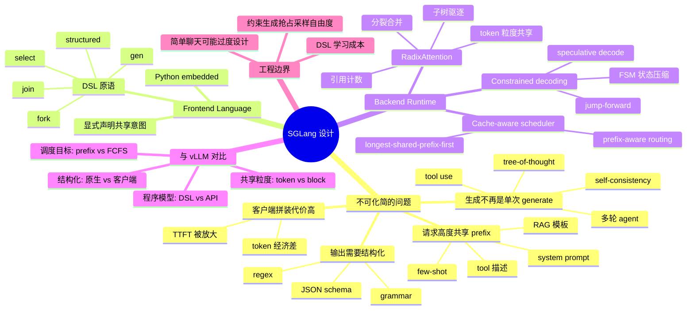
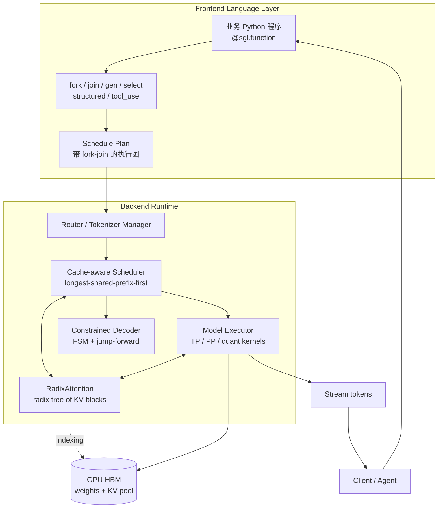
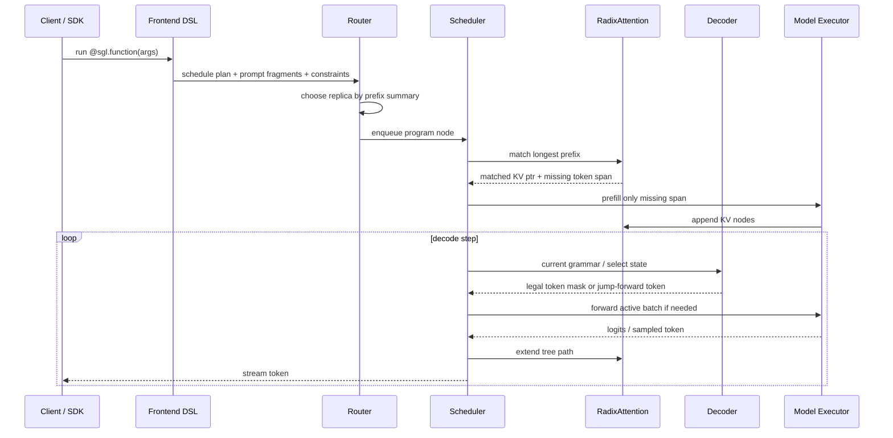
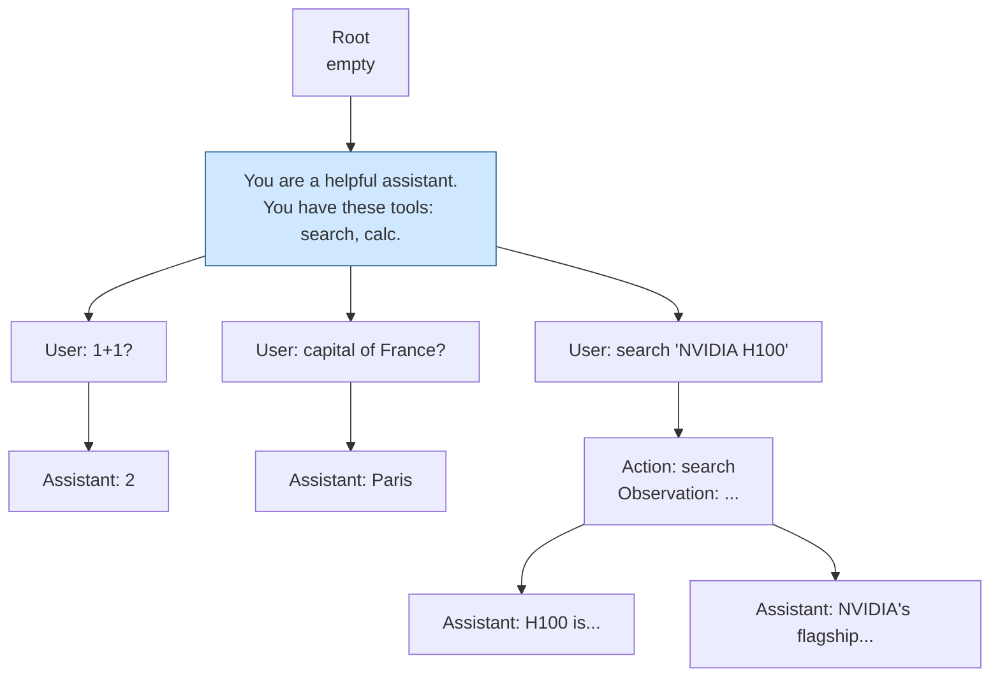
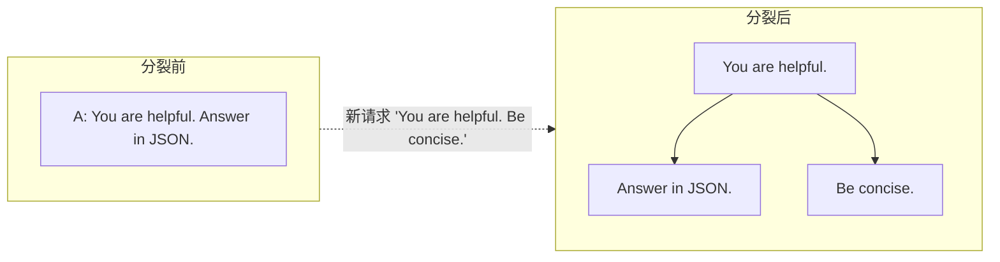
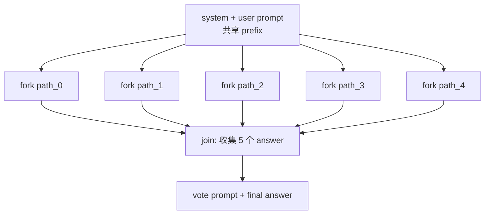
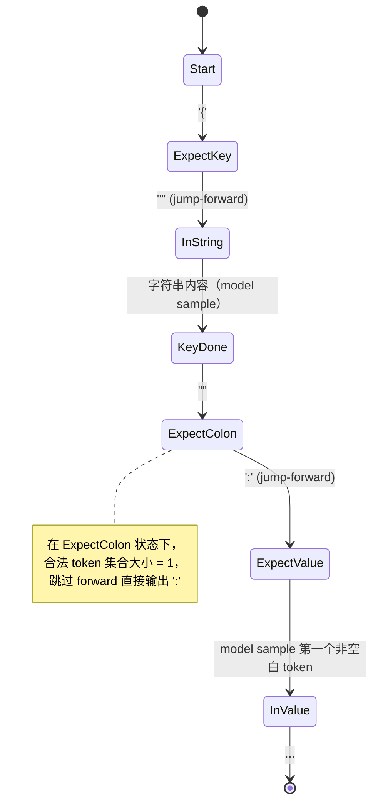
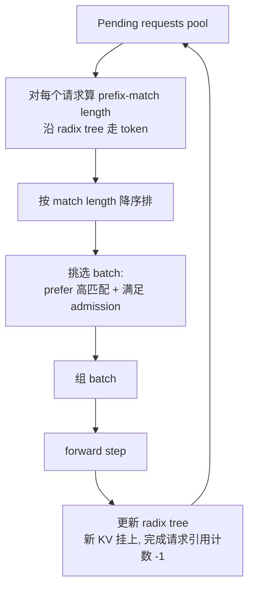
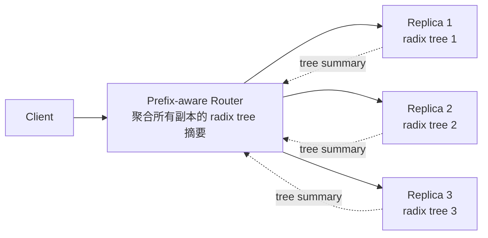
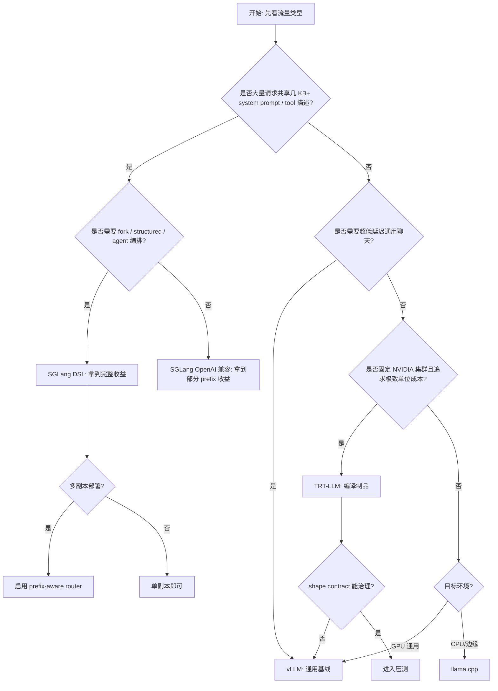

# 第 16b 章 · SGLang 内部机制深入

> 本章和 16a 是姊妹章。SGLang 与 vLLM 都解决"高吞吐 LLM serving"，但取向不同：vLLM 把通用的高吞吐在线生成放在第一位，SGLang 把"prompt 复用 + 结构化输出 + 复杂程序化生成"放在第一位。本章讲清楚为什么 SGLang 会做出这套设计，以及它的 RadixAttention、frontend language、constrained decoding 和 cache-aware scheduler 是怎样彼此咬合的。

> **关联章节**：本章在 [第 15 章](15-batching-scheduling-and-kv-cache.md) 的 KV Cache 与调度基础上，深入 SGLang 的内部实现；与 [第 16 章](16-quantization-compilation-and-engines.md) 的引擎选型互补；并与 16a vLLM 内部机制（`16a-vllm-internals.md`）形成左右路线对比。

## 16b.1 第一性原理拆解 + 学习大纲

### 概念先说清楚

在深入机制前，先把本章几个词定义清楚，避免把 SGLang 理解成"另一个 vLLM server"：

| 概念 | 一句话定义 | 工程上真正管理的东西 |
|------|------------|----------------------|
| SGLang | 面向结构化语言模型程序的 serving runtime | 生成程序、KV Cache、调度计划和 decoder 约束 |
| Frontend Language | 嵌入 Python 的生成 DSL | `gen`、`select`、`fork`、structured output、tool call 的执行图 |
| Runtime | 把生成程序变成 GPU 可执行步骤的服务端执行层 | tokenizer、scheduler、KV pool、model executor、streaming |
| RadixAttention | 用 radix tree 索引 KV Cache 的 prefix 复用机制 | token 序列到 KV 指针的树形映射、引用计数、驱逐 |
| Cache-aware scheduling | 把 prefix 命中长度纳入调度优先级 | 谁先进 prefill、谁进 decode batch、谁被推迟 |
| Constrained decoding | 让每一步采样只从合法 token 集合中选 | logits mask、FSM / grammar 状态、jump-forward |
| Tool / function calling | 让模型输出可执行工具名和参数的结构化生成模式 | tool schema、参数 grammar、工具执行结果回灌 |

**SGLang 的核心边界**也要先说清楚：它不是通用 agent 框架，不负责替你设计工具、记忆、权限和业务流程；它负责把已经明确的生成流程高效执行。LangChain / LlamaIndex 更像客户端编排层，vLLM 更像通用高吞吐模型引擎，TensorRT-LLM 更像编译优化后的 NVIDIA 推理栈；SGLang 夹在应用程序和模型执行器之间，把"程序结构"下推到 serving 层。

### 拆 — 不可化简的问题

剥掉 vLLM、SGLang、TensorRT-LLM、PagedAttention、RadixAttention 这些名字，本章面对的不可化简问题只有一个：**当 LLM 调用从"单次 generate"演化成"复杂程序"——多轮对话、分支采样、约束生成、tool use、agent loop——之后，怎样把 prefix 复用、KV Cache 调度、结构化解码做成原生设施，而不是在应用层一层一层拼装？**

vLLM 的设计假设是"请求是独立的、prompt 是黑盒、KV Cache 按 block 管理"，调度器只需要在 prefill / decode 之间做 continuous batching。这套假设非常适合"一个 OpenAI-compatible chat completion 接口承接所有流量"的场景。但当业务变成 agent 编排、function calling、JSON mode、自一致性投票、tree-of-thought、RAG fork-join、re-ranking 时，请求之间不再独立：它们共享几 KB 到几十 KB 的 system prompt 和 tool 描述，它们的 prefix 是高度结构化的（"Thought:" / "Action:" / "Observation:"），它们的输出还要严格符合 JSON schema 或 grammar。如果只用 vLLM 的 prefix cache hash + block table 来承载这些复用，会有几个工程边界露出来：第一，prefix cache 的命中粒度是 block（默认 16 token），共享前缀的判断是 hash + LRU，碰到分支采样时只能"复制 KV"或"重新 prefill"；第二，结构化生成被推到客户端做"sample → 验证 → 重试"，token 经济性极差；第三，多轮 agent 的中间状态在客户端和服务端反复来回，TTFT 被网络放大。

SGLang 的回答方式不同：它把**生成程序本身**做成一等公民。前端是一个嵌入式 DSL（Python），程序员可以在其中描述 fork、join、gen、select、structured generation、tool call 这些原语；后端是一个 cache-aware scheduler，配合一棵 radix tree 形式的 KV Cache 索引——RadixAttention——它能在 token 粒度（不是 block 粒度）识别共享前缀，并自然支持分支共享、子树驱逐、按引用计数的 GC；约束生成则被下推到 decoder 内部，靠 FSM 压缩状态、靠 jump-forward decoding 跳过那些被 grammar 强制确定的 token。这套设计的核心断言是：**当生成程序的复杂度成为主导时，后端必须暴露 prefix 树和约束解码这两个底层能力，应用层才能写得简洁、跑得快**。

因此，本章不是在对比两套引擎的 benchmark 数字，而是在回答一个架构问题：**为什么"以生成程序为中心、以 prefix 树为底座"是 LLM serving 的另一条主流路线，它的边界又在哪里**。

### 推 — 从这个问题如何推导出每个机制

第一步推 RadixAttention。共享前缀的复用有两层粒度：vLLM 选择 block 粒度（hash 一段 16 个 token）+ 前缀链；SGLang 选择 token 粒度（共享前缀走到 radix tree 的同一个节点，分叉处分裂出新子节点）。前者实现更简单，命中是 0/1 的；后者实现更复杂，但能让"两个请求共享 1024 token，第 1025 token 不同"这种情况自动只共享前 1024 个 KV，后续各自延伸。这种结构对 fork、tree-of-thought、self-consistency 这类"同一前缀 N 路展开"的程序天然友好——分裂只是 radix tree 上多一条边，不需要复制 KV，也不需要重新 prefill。

第二步推 frontend language。如果 prefix 树是一等公民，那么"程序如何在树上行走"就需要一种描述语言。`fork(N)` 让当前 prefix 同时延伸 N 条路径；`gen(name, ...)` 在某条路径上生成；`select(choices)` 让模型在受限选项中选择；`@function` 让一段 Python 代码被翻译成调度计划。所有这些原语的共同语义是：**它们告诉后端"哪些 token 是同一棵 prefix 树的、可以共享 KV"**。如果不暴露这个语义，后端无论怎么 hash 都猜不出这种共享意图——比如客户端随机重排 prompt 顺序，prefix hash 就失效了。

第三步推 constrained decoding。结构化输出的本质是"让 sampling 只能从合法 token 集中选"。最朴素的实现是 sample 后验证、不合法就重采样，token 经济性极差。更聪明的做法是用 FSM 在每一步预先算出"合法 token 集"作为 logits mask；更进一步，FSM 在某些状态下只有一个合法 token（例如 JSON 中 key 后必跟冒号），那这个 token 完全可以**不通过模型 forward 就直接输出**——这就是 jump-forward decoding。这两层优化让 JSON / grammar 生成的速度从"比自由生成更慢"变成"明显更快"。

第四步推 cache-aware scheduling。如果 prefix 树是核心数据结构，那么调度策略也应该围绕它转：在调度队列里，**优先选择能复用最长 prefix 的请求**（longest-shared-prefix-first）能最大化 cache hit；同一个 prefix 子树下的请求应被路由到同一副本（prefix-aware routing），否则 radix tree 又得在另一台机器上重建。这一层和 vLLM 的"FCFS + preemption"调度路线明显不同：SGLang 的调度器把 prefix 复用从"性能优化"提升为"调度第一目标"。

把这四步合在一起，就回答了本章主线：**SGLang 不是 vLLM 的"换皮版"，而是把 LLM serving 的中心从"请求队列 + block KV"挪到了"生成程序 + prefix 树"。**

### 绘 — 因果链路



### 导 — 读完本章你应该能回答

1. RadixAttention 与 vLLM 的 hash-based prefix caching 在共享粒度、分裂行为和驱逐策略上的本质区别是什么？
2. 为什么 SGLang 要暴露 frontend language 而不是直接做"OpenAI 兼容 + 更聪明的 prefix cache"？
3. Constrained decoding 的 FSM 压缩和 jump-forward decoding 在什么场景下能把吞吐拉高到自由生成之上？
4. SGLang 的 cache-aware scheduling（longest-shared-prefix-first）和 vLLM 的 continuous batching 是冲突还是互补？
5. 给定一个 agent + tool use 服务，怎样判断 SGLang fork+RadixAttention 比"朴素 vLLM 多次请求"能省多少 token、降多少 TTFT？
6. SGLang 在 TP / DP / 量化、speculative decoding 上和 vLLM 的实现路径有哪些异同？
7. 什么场景应当选 SGLang，什么场景应当回退到 vLLM 或 TRT-LLM？

### 学习 checklist

- 能用一段话解释 RadixAttention 是"按 token 粒度做 prefix 复用的 radix tree"
- 能写出一段 SGLang frontend 程序，包含 fork / gen / select / structured 原语
- 能解释 jump-forward decoding 为什么能让结构化生成比自由生成更快
- 能从 mem-fraction、max-running-requests、tp-size、chunked-prefill-size 四个参数说出它们的物理含义
- 能在 vLLM / SGLang / TRT-LLM 之间做一次有理有据的选型决策
- 能识别一个声称"SGLang 比 vLLM 快 5x"的 benchmark 是否可信（看 prefix 复用率 / 输出长度 / batch 工作点）
- 能列出至少一个 SGLang 不应该上的反场景

---

## 16b.2 SGLang 整体架构：Frontend Language / Runtime / Scheduler / RadixAttention

SGLang 在工程上分成两个清晰的层。**Frontend** 是一个嵌入在 Python 里的 DSL，业务写的"生成程序"被翻译成一份**调度计划**（一棵带 fork / join 的执行图）发送到 backend；**Backend Runtime** 接收这份计划，由 cache-aware scheduler 把它拆成可被 GPU 执行的 micro-batch，并通过 RadixAttention 复用前缀的 KV Cache。两层之间用一份显式的 schedule plan 通讯，这是 SGLang 与"裸 OpenAI API"的关键差别——OpenAI API 一次只描述一段 prompt，DSL 一次描述整个生成图。



| 层 | 主要职责 | 核心数据结构 | 与 vLLM 的对应关系 |
|----|----------|--------------|--------------------|
| Frontend Language | 把生成程序翻译成 schedule plan | 执行图 / fork-join 树 | 大致对应 OpenAI API + 业务自己的 orchestrator |
| Router / Tokenizer Manager | 接 plan、做 prefix-aware 路由、tokenize | 请求队列 + tenant 路由表 | vLLM 的 entrypoint + 路由层 |
| Cache-aware Scheduler | 按 prefix 长度组 batch | 待调度池 + 优先级 | vLLM Scheduler，但优先级函数不同 |
| RadixAttention | KV Cache 的索引与共享 | radix tree（节点存 token slice + KV ptr） | vLLM PagedAttention block table |
| Constrained Decoder | logits mask、jump-forward | FSM / grammar | vLLM 的 logits processor + 第三方 outlines |
| Model Executor | 真正跑 GPU forward | kernel + TP/PP shards | vLLM Worker / Engine |

这套架构的关键约束是：**Frontend 和 Backend 之间必须传递"程序结构"而不是只传 token**。如果业务方不写 SGLang DSL 而只用 OpenAI 兼容接口，SGLang 会退化成"prefix cache 比 vLLM 强一点的引擎"，本章要讨论的大部分收益都拿不到。

> **note**：SGLang 也提供 OpenAI 兼容的 HTTP server。但 OpenAI API 是无状态的、prompt 是黑盒，SGLang 在这条路径上只能基于 prefix hash + radix tree 做"被动复用"。要拿到 fork / join / structured 的 token 经济性，必须显式写 DSL，或在 client 用 SGLang 提供的 SDK。

### 一次请求在 runtime 里的生命周期

把 SGLang 当成生产系统看，最重要的是知道一次请求在每层留下了什么状态：



| 阶段 | 关键决策 | 常见故障信号 |
|------|----------|--------------|
| Frontend plan 构造 | DSL 是否显式表达共享 prefix、fork、约束 | DSL 写法像普通 Python loop，server 端看不到复用机会 |
| Router 选副本 | 是否把同 prefix 请求送到同一副本 | 多副本整体命中率低，单副本局部命中高 |
| Scheduler admission | KV pool 是否容得下新请求 | queue wait 高、admission reject、反复 preempt |
| Radix match | 能否复用已有 KV | prefix hit length 低于预期 |
| Constrained decode | grammar 是否可编译、mask 是否过窄 | 编译耗时高、输出质量被硬约束拉低 |
| Streaming | token 是否及时返回客户端 | server 内部 TPOT 正常但端到端延迟高 |

这个生命周期也解释了为什么 SGLang 的性能问题很少能只靠 `nvidia-smi` 定位：同样是 GPU 不满，可能是 router 没有 cache locality，也可能是 grammar 编译卡在 CPU，或者 scheduler 因 KV pool 紧张不敢 admission。

---

## 16b.3 RadixAttention 详解：用 radix tree 组织 KV Cache 实现自动 prefix 共享

vLLM 的 PagedAttention 把 KV Cache 切成定长 block（默认 16 token），用 hash(prefix block) 在 prefix cache 里查命中。这种设计简单、对 dense 流量友好，但在以下场景会遇到工程边界：分支采样时要复制 KV；prefix 共享只能按 16 token 对齐；驱逐用 LRU，不感知 prefix 树形结构。

SGLang 的 RadixAttention 把 KV Cache 组织成一棵 radix tree（也叫 PATRICIA tree）。每个节点保存一段连续 token 序列的 KV 指针；从根到任意节点的路径就是某个上下文的完整 KV。新请求进来时，scheduler 沿着 token 序列走树：能匹配到的部分**直接复用 KV，根本不进 prefill**；匹配不上的部分作为新子节点挂上去。fork 操作只是在树上多挂几条边——共享前缀真的物理共享，不是"逻辑上共享 + 数据复制"。



上图里 system prompt + tool 描述（约几百到上千 token）只在 radix tree 上存一份；三个用户查询挂在不同的子节点；search 的结果（Observation）又被两个候选 assistant 答案共享。如果有 1000 个并发用户都共用同一个 system prompt，SGLang 只会为这段 prompt **prefill 一次**，并把 KV 永久挂在 radix tree 顶部。

### 分裂与合并

当一个新请求与已有节点的 token 序列**部分匹配**时，radix tree 会把已有节点**分裂**：前缀部分留在原节点，后缀部分作为子节点；新请求的不匹配部分作为另一个子节点挂上去。这正是 PATRICIA tree 的标准操作。



### 引用计数与驱逐

每个 radix tree 节点带引用计数：被某个活跃请求覆盖时计数 +1，请求结束时 -1。计数为 0 的节点进入 LRU 候选；当 KV pool 空间不足时，从叶子开始向上驱逐（叶子节点的 KV 一定不被任何子节点共享）。

| 维度 | vLLM PagedAttention + Prefix Cache | SGLang RadixAttention |
|------|--------------------------------------|------------------------|
| 共享粒度 | block（默认 16 token） | token（任意分裂点） |
| 数据结构 | block table + hash 表 | radix tree（PATRICIA） |
| Fork 行为 | 拷贝 block table，KV 共享 | 树上加边，KV 共享 |
| 共享前缀判定 | hash 相等 + 链式匹配 | 沿树走 token 序列 |
| 驱逐策略 | LRU on free blocks | 树叶 LRU + 引用计数 |
| 适合负载 | 通用混合流量、prefix 形态多样 | 大量请求共享高度结构化 prefix |
| 内存效率 | 内部碎片 < 1 block | 极低（按需分裂） |
| 实现复杂度 | 低 | 中到高 |

> **success**：RadixAttention 的最大胜场是"agent 类工作流，几百到几千请求共享几 KB system prompt + tool 描述"。这种场景下 prefix 命中率可以稳定 > 90%，等效 TTFT 接近零。

> **warn**：如果业务流量是"每次请求 prompt 都不同"（比如自由聊天 + 用户上传长文档），RadixAttention 的树结构开销和 vLLM 的 hash 命中率几乎打平，反而 SGLang 的 DSL 编程成本变成纯负担。

---

## 16b.4 Frontend Language：fork / join / gen / select / structured 调用模型

SGLang 的 frontend 是一个嵌入在 Python 里的 DSL。最小的例子：

```python
import sglang as sgl

@sgl.function
def multi_turn(s, question):
    s += sgl.system("You are a helpful assistant.")
    s += sgl.user(question)
    s += sgl.assistant(sgl.gen("answer", max_tokens=256))

state = multi_turn.run(question="capital of France?")
print(state["answer"])
```

`@sgl.function` 装饰器并不会真的执行 Python 代码，而是构造一份调度计划。`sgl.system / sgl.user / sgl.assistant` 是 prompt 角色标记，`sgl.gen` 表示一个生成节点，`sgl.select` 表示在受限集合中选择，`sgl.fork` 表示从当前 prefix 分叉。

### Self-consistency / Tree-of-Thought：fork + join

```python
@sgl.function
def self_consistency(s, problem, n_paths=5):
    s += sgl.system("Solve step by step.")
    s += sgl.user(problem)
    forks = s.fork(n_paths)
    for i, f in enumerate(forks):
        f += sgl.assistant(sgl.gen(f"path_{i}", max_tokens=512, temperature=0.7))
    answers = [f["path_" + str(i)] for i, f in enumerate(forks)]
    s += sgl.user("Pick the most common answer from: " + str(answers))
    s += sgl.assistant(sgl.gen("final", max_tokens=64, temperature=0))
```

这段程序在后端的执行图：



关键观察：**5 个分支共享同一个 prefix（system + user prompt + 共享的 step-by-step instruction），后端只 prefill 一次**。在 vLLM 上做同样的事，业务通常需要发 5 次请求或自己处理 prefix 缓存对齐——即使开了 prefix caching，仍要跨请求 hash 命中，且 fork 与 join 的语义在 client 侧拼装。

### Tool use：把 tool 调用直接写进 DSL

```python
@sgl.function
def agent(s, query, tools):
    s += sgl.system(f"You are an agent. Tools: {tools}")
    s += sgl.user(query)
    for step in range(MAX_STEPS):
        s += sgl.assistant("Thought: " + sgl.gen("thought", stop="\n"))
        s += sgl.assistant("Action: " + sgl.select("action", choices=list(tools.keys())))
        s += sgl.assistant("Args: " + sgl.gen("args", stop="\n", regex=ARGS_REGEX))
        result = tools[s["action"]](s["args"])
        s += sgl.user(f"Observation: {result}")
        if "final answer" in s["thought"].lower():
            break
    s += sgl.assistant(sgl.gen("final", max_tokens=256))
```

这段程序在 SGLang 后端跑得"快"的几个原因：第一，每一轮 Thought / Action / Observation 都让 prefix 树往下延伸一层，下一次 LLM 调用直接复用所有历史 KV；第二，`sgl.select(choices=...)` 会被翻译成一个仅允许特定 token 的 logits mask，在受限选择上几乎瞬时返回；第三，整个 agent loop 在 server 端跑（不是客户端循环发请求），网络往返从 N 次降到 1 次，TTFT 不再被网络放大。

| DSL 原语 | 作用 | 后端实现 | vLLM 等价做法 |
|----------|------|----------|----------------|
| `sgl.gen(name, ...)` | 自由生成 | 普通 decode + 收集 | OpenAI completion |
| `sgl.select(name, choices)` | 受限选择 | logits mask + jump-forward | client side sample + 验证 |
| `sgl.fork(N)` | 分叉 N 路 | radix tree 加 N 条边 | 发 N 次请求 + 自己 hash prefix |
| `sgl.gen(..., regex=R)` | 正则约束生成 | regex → FSM → mask | client 重采样直到匹配 |
| `sgl.gen(..., schema=S)` | JSON schema 约束 | schema → FSM | 第三方库 outlines / guidance |
| `s += sgl.image(img)` | 多模态 prompt 拼接 | 图像 token 展开 | OpenAI vision 接口 |

> **note**：SGLang 的 DSL 不是"另一种 LangChain"。LangChain 是客户端编排框架，最终还是把 prompt 拼好后发给 LLM；SGLang 把编排下推到了 serving 层，prefix 树和 fork-join 是后端原生概念。这两条路线并不互斥——可以用 LangChain 调用 SGLang server，但要拿到 fork / select 的 token 经济性必须用 SGLang DSL。

### Function calling 的语义拆解

很多人把 tool calling 理解成"模型输出一段 JSON，然后应用层执行"。在 SGLang 视角里，它其实被拆成四个可优化的子问题：

| 子问题 | 普通 OpenAI-compatible 路径 | SGLang native 路径 |
|--------|----------------------------|--------------------|
| 选择哪个工具 | 模型自由生成 tool name，再由客户端校验 | `select(choices=tool_names)`，非法工具名不会出现 |
| 生成参数 | 生成 JSON 字符串，客户端 parse / retry | JSON schema / regex 编译成 grammar，decoder 内部保证合法 |
| 执行工具 | 客户端拿到响应后再调用工具 | DSL 内部调用 Python 函数或由 server-side runtime 执行 |
| 回灌 observation | 客户端拼历史 prompt 再发下一次请求 | 同一条 prefix 路径继续延伸，KV 原地复用 |

把这四步拆开后，tool calling 的成本来源也更清楚：

```text
tool_call_cost =
  tool schema prefill
+ tool name decode
+ argument decode
+ tool runtime latency
+ observation prefill
+ next-step decode
```

SGLang 能省的是 schema / 历史对话的重复 prefill、非法 JSON 的重试、以及多轮 HTTP 往返；它不能省工具本身的执行时间。如果工具是慢 SQL、网页检索或外部 SaaS API，端到端延迟仍可能主要卡在工具层，这时要把 tool timeout、幂等重试、结果缓存和权限审计放在同等重要的位置。

#### Tool calling 的反模式

| 反模式 | 表现 | 后果 | 修正 |
|--------|------|------|------|
| 把请求 ID / 时间戳写进 system prompt | 每次 prompt 顶部都不同 | RadixAttention 顶部公共前缀失效 | 变量放到 user message 或 metadata |
| tool schema 每次动态排序 | 同一组工具 token 顺序不同 | prefix hash / radix match 下降 | 固定 schema 序列化顺序 |
| 参数 schema 过宽 | `args` 几乎等于自由文本 | constrained decoding 收益低 | 用 enum、pattern、required 字段收紧 |
| 参数 schema 过窄 | 合法业务值没写进 enum | 模型被迫输出错误参数 | 用线上样本回放校验 schema 覆盖率 |
| 客户端循环调用 SGLang OpenAI API | 每轮重新走网关和队列 | 拿不到 native DSL 的主要收益 | 把 loop 下推成 `@sgl.function` |
| Observation 不做截断 | 工具返回几万 token | KV pool 被工具结果挤爆 | 对 observation 做摘要、分页或 top-k |

---

## 16b.5 Constrained Decoding：JSON schema、regex、CFG 的 token 级约束

结构化生成的需求很常见：JSON 输出、function call 参数、SQL、特定格式日志。最朴素做法是"sample → 解析 → 不合法就重采样"，token 经济极差。SGLang 把 constrained decoding 做成原生设施，分三层：

### 第一层：FSM 状态压缩

把 regex 或 grammar 编译成 FSM（finite state machine）。每生成一个 token，FSM 状态前进一步；每一步用当前状态算出"合法 token 集"，作为 `-inf` mask 加到 logits 上，再 sample。这一层让"输出一定符合 grammar"成为 GPU 内部的事，不再依赖客户端验证。

| 约束类型 | 编译产物 | 表达力 | 典型用途 |
|----------|----------|--------|----------|
| `choices=[...]` | 离散 FSM（叶子集合） | 弱 | tool 名、yes/no、枚举 |
| `regex=R` | NFA → DFA | 中 | 数字格式、ID、URL |
| `schema=JSON Schema` | schema → grammar → FSM | 强 | function call、API 输出 |
| `grammar=CFG` | LR / LL parser table | 最强 | SQL、代码、DSL |

直接做 FSM 的工程边界是状态爆炸。一个嵌套很深的 JSON schema 可以编译出几百万个状态。SGLang 借鉴了 outlines 等项目的做法，对 FSM 做 lazy expansion + 状态合并，让常见 schema 在毫秒级编译完成。

### 第二层：Jump-Forward Decoding

在 grammar 的某些状态下，**只有一个合法 token**。比如 JSON 中：写完 `"name"` 之后必须接 `:`；写完一个 string 必须接 `"`；写完 `{"a": 1` 后下一个非空白 token 必须是 `,` 或 `}`。这些 token 完全可以**不通过模型 forward 就直接拼接到输出里**，并把对应位置的 KV 直接从 embedding lookup 算出。



收益：对深度嵌套的 JSON，"模板字符"（括号、引号、冒号、逗号）通常占输出 token 的 30%-60%，jump-forward 直接把这部分 decode 步数省掉。SGLang 论文报告对典型 JSON 场景，**结构化生成可以比自由生成快 1.5-3x**——这违背直觉，因为约束本应"更慢"。

### 第三层：Speculative + Constrained 配合

constrained decoding 也可以与 speculative decoding 叠加：草稿模型预测 k 个 token，目标模型 verify 时同时检查 grammar 合法性，不合法的部分被截断。这一层在 SGLang 里仍在演进，且对 draft model 与目标模型 vocabulary 一致性要求较高。

> **danger**：constrained decoding 不是"免费的精度保证"。如果 grammar 写得过于严格（比如 enum 漏掉某个合法值），模型会被强制选择次优 token，输出质量反而下降。约束生成上线前，必须用业务真实样本回归测一遍"被强制走的低概率分支"。

---

## 16b.6 Speculative Decoding：与 vLLM 实现路径的对比

speculative decoding 的基本机制（draft → verify → accept / reject）在 [§15.9](15-batching-scheduling-and-kv-cache.md) 已经讲过。这里只看 SGLang 与 vLLM 的实现路径差异。

| 维度 | vLLM | SGLang |
|------|------|--------|
| 主流变体 | draft model、Medusa、EAGLE、n-gram | EAGLE 系列优化最多、Medusa、n-gram |
| Draft 与目标共享 KV | 两套 KV，分别管理 | 草稿与目标共用 RadixAttention 树 |
| 与 prefix cache 协同 | block 命中后 draft 也可复用 | 节点级共享，prefix 命中后 draft 直接走树 |
| 与 constrained decoding 协同 | logits processor 链式 | 内置 grammar 验证 in verify |
| 多分支投机（tree spec） | 实验性 | 与 RadixAttention 天然契合 |
| 高并发下表现 | acceptance 下降时容易拖慢 | 同上，但因 prefix 共享 verify batch 更经济 |

SGLang 在 EAGLE-2 / EAGLE-3 等树状投机解码上集成较深：草稿模型一次产生一棵 token 树而不是一条 token 链，目标模型 verify 时一次性吃掉整棵树，accept 落在最长合法路径上。这种"树形 spec"和 RadixAttention 的树形 KV 天然对齐——草稿树的每个节点直接对应 radix tree 的潜在子节点，verify 通过后整棵子树就被"激活"挂入 prefix 树。

> **note**：speculative decoding 对 SGLang 的相对价值反而比 vLLM 略弱。原因是 SGLang 的主要客户场景（agent / structured generation）已经通过 RadixAttention 和 jump-forward 把"重复计算"的部分压得很低，speculative 能补的额外空间相对小。但对长输出、低并发的纯文本生成，spec 仍是 SGLang 的标配优化项。

---

## 16b.7 调度器设计：cache-aware scheduling、longest-shared-prefix-first

vLLM 的 scheduler 大致是 FCFS + admission control + preemption。SGLang 的 scheduler 在此之上多了一层：**优先调度能复用最长 prefix 的请求**。这条策略也叫 longest-shared-prefix-first（LSPF）。



为什么 LSPF 重要：

- **降低 prefill 重复计算**：高匹配请求几乎不需要 prefill，节省的 GPU 算力可以让 batch 更大
- **降低 KV pool 压力**：复用已有 KV，不必为新请求再分配
- **提高 prefix-aware routing 收益**：调度器和路由器联动，把同 prefix 子树的请求集中在一个副本

LSPF 的工程边界：

| 风险 | 表现 | 对策 |
|------|------|------|
| 长 prefix 请求饿死短请求 | 短 prompt P99 TTFT 抖动 | 加 starvation guard，超过阈值强制调度 |
| Prefix 树偏斜 | 单一 system prompt 占 80% 流量，热点子树驱逐慢 | 按 prefix 子树大小限流，或 split 副本 |
| Admission 与 LSPF 冲突 | KV pool 紧张时低匹配请求被 preempt 反复 | 按 prefix 匹配长度计算 admission 优先级 |
| Multi-tenant 公平性 | 大客户的 prefix 占满调度位 | 按 tenant 加 quota，再在 quota 内做 LSPF |

> **warn**：SGLang 的 LSPF 不是要替代 continuous batching，而是叠加在它之上。每个 decode iteration 仍然重组 batch，只是组 batch 时优先选 prefix 命中长的请求。

---

## 16b.8 张量并行 / 数据并行：SGLang 的多卡形态与 vLLM 异同

SGLang 在多卡形态上沿用业界标准：

| 并行方式 | SGLang 支持 | vLLM 支持 | 关键差别 |
|----------|-------------|-----------|----------|
| TP（Tensor Parallel） | 支持，类似 megatron-style | 支持 | 实现接近，都依赖 NCCL allreduce |
| PP（Pipeline Parallel） | 支持但生态较薄 | 支持 | vLLM PP 路径更成熟 |
| DP（Data Parallel） | 多 server replica + router | 多 engine 实例 | SGLang router 内置 prefix-aware DP |
| EP（Expert Parallel，MoE） | 支持 DeepSeek 系等 | 支持 | 对 DeepSeek MLA / MoE 有专门优化 |
| Sequence Parallel | 部分支持 | 部分支持 | 与 ring attention / context parallel 相关 |

一个 SGLang 特色：**多副本之间的 prefix-aware 路由是内建的**。Router 看到新请求时，会在所有副本的 radix tree 元数据里查找最长 prefix 匹配，把请求路由到匹配最长的副本，而不是 round-robin。这让 system prompt 共享的收益可以扩展到多副本部署，而不是每个副本各自重新缓存一份。



这套路由的工程代价是 router 与 replica 之间需要同步 prefix 摘要（hash + 长度），更新频率和传输量需要权衡。生产实践通常按 1-5 秒一次同步，配合 LRU 摘要做大小控制。

---

## 16b.9 量化与扩展：FP8、AWQ、GPTQ 集成、自定义 kernel 接入路径

SGLang 在量化生态上偏"借力底层后端"。它通过 FlashInfer / FlashAttention / CUTLASS / vendor kernels 接入主流量化方案：

| 方案 | SGLang 支持成熟度 | 主要后端 | 备注 |
|------|--------------------|----------|------|
| FP8（H100 W8A8） | 高 | Transformer Engine、FlashInfer | DeepSeek FP8、Llama FP8 都有路径 |
| AWQ（W4A16） | 高 | AWQ kernel + FlashInfer | 与 vLLM 接近 |
| GPTQ（W4A16） | 高 | GPTQ kernel | |
| INT8 SmoothQuant | 中 | TensorRT INT8 / 自带 kernel | 不是主推路线 |
| FP8 KV Cache | 高 | FlashInfer FP8 attn | 长上下文场景重点 |
| INT4 KV Cache | 实验性 | 自带 kernel | 长上下文极致压缩 |
| MLA（DeepSeek） | 高 | 专用 attention kernel | RadixAttention + MLA 是 SGLang 强项 |

SGLang 对自定义 kernel 的接入路径也比较开放：核心 attention 通过 FlashInfer 后端切换；其他算子可以通过 PyTorch custom op 注入。如果需要把自家硬件 kernel 接入 SGLang，工程量主要在 attention layer 适配（要兼容 RadixAttention 的 KV 索引）和 quant kernel 注册。

> **success**：DeepSeek V2/V3 这一类带 MLA + MoE + FP8 的复杂模型，SGLang 的支持节奏通常和 vLLM 接近，部分场景甚至更早。原因是 SGLang 团队与 DeepSeek 等模型团队联系紧密，且 RadixAttention 对 MLA 这种"低维 latent KV"的复用收益更明显。

---

## 16b.10 与 OpenAI API / function calling / Tool Use 的对接

SGLang 同时支持两套 API：

| 接口形态 | 用途 | 能否拿到 SGLang 的核心收益 |
|----------|------|----------------------------|
| OpenAI 兼容 HTTP（/v1/chat/completions） | 替换 vLLM / OpenAI 的零成本迁移 | 部分（被动 prefix 复用） |
| OpenAI function calling | 结构化 tool 调用 | 部分（schema → grammar） |
| SGLang Native HTTP（/generate） | 提交 schedule plan | 完整（fork / select / structured） |
| Python SDK（@sgl.function） | 写 DSL 程序 | 完整 |

很多团队的迁移路径是：

1. **第一阶段**：把 vLLM 直接换成 SGLang 的 OpenAI 兼容 server，开 prefix caching，验证基础性能不退步
2. **第二阶段**：把高 prefix 复用业务（agent、function call、固定 system prompt）改用 SGLang DSL，拿到主要收益
3. **第三阶段**：评估是否把 constrained decoding、jump-forward、tree spec 等高级特性也开启

> **note**：SGLang 的 function calling 实现底层就是"structured generation + grammar"，所以同一套机制天然兼容 OpenAI / Anthropic / 自定义 schema。这一点比"在客户端循环 sample 直到合法"省 token，也更确定性。

---

## 16b.11 性能调优手册：mem-fraction / max-running-requests / tp-size / chunked-prefill-size

SGLang 的核心调优参数与 vLLM 类似，但语义略有差别。生产上必须搞清楚这几个参数的物理含义，否则调参会从"系统优化"退化成"撞运气"。

| 参数 | 物理含义 | 默认值（参考） | 调高的代价 | 调低的代价 |
|------|----------|----------------|------------|------------|
| `--mem-fraction-static` | 给权重 + KV pool 的显存比例 | 0.85-0.90 | OOM 风险、CUDA workspace 不足 | KV pool 变小、admission 更严 |
| `--max-running-requests` | 同时活跃请求上限 | 自动 | TPOT 抖动、step 变慢 | 吞吐天花板降低 |
| `--max-total-tokens` | radix tree 总 token 数上限 | 自动 | KV pool OOM | prefix 容量受限 |
| `--max-prefill-tokens` | 单步 prefill token 上限 | 16384 | 长 prompt 卡住 decode | TTFT 变慢 |
| `--chunked-prefill-size` | prefill 切片大小 | 8192 / 0=关 | 调度 overhead 变高 | 长 prompt 拖累 ITL |
| `--schedule-policy` | 调度策略 | `lpm`（longest prefix match） | starvation 风险 | prefix 命中率下降 |
| `--tp-size` | tensor parallel 度 | 1 | 通信开销 | 单卡显存压力 |
| `--dp-size` | 数据并行副本数 | 1 | 内存重复 | 吞吐天花板低 |
| `--enable-torch-compile` | 是否开 torch.compile | False（视版本） | 首次 forward 慢 | 失去 kernel 融合收益 |
| `--quantization` | 量化方案 | None | 质量回退 | 显存与吞吐打不上去 |
| `--kv-cache-dtype` | KV Cache 精度 | auto / fp8 | 长上下文质量风险 | 长上下文容量受限 |

### 调参决策表

| 现象 | 优先看的参数 | 调整方向 |
|------|--------------|----------|
| OOM at startup | `mem-fraction-static`, `max-total-tokens` | 调小 |
| TTFT 高、prefix 命中率低 | `schedule-policy`, prefix-aware router | 切到 LPM、确认 router 配置 |
| TPOT 抖动、ITL 不稳 | `max-running-requests`, `chunked-prefill-size` | 降低 running requests、开 chunked prefill |
| 长 prompt 拖累 decode | `chunked-prefill-size`, `max-prefill-tokens` | 开 chunked、调低 prefill token 上限 |
| 长上下文 KV 不够 | `kv-cache-dtype`, `tp-size` | 切 fp8 KV、增加 TP |
| 多副本但 cache hit 低 | router prefix-aware 是否开启 | 切 prefix-aware DP |
| 吞吐天花板低 | `max-running-requests`, `tp-size`, `dp-size` | 综合扩 |
| 结构化输出慢 | jump-forward 是否开 | 确认 constrained decoding 走 grammar 路径 |

> **danger**：与 vLLM 一样，**一次只动一个参数**。SGLang 的参数耦合度比 vLLM 还高（因为 RadixAttention 和 schedule policy 互相影响），同时改两个参数往往让 A/B 失去因果关系。

### 16b.11a 排障手册：从症状反推 SGLang 内部机制

SGLang 的排障要先判断问题发生在哪条链路：prefix 复用、调度 admission、decoder 约束、GPU 执行，还是外部工具。下面这张表适合直接放进 on-call runbook：

| 症状 | 第一怀疑 | 需要看的指标 / 日志 | 快速验证 | 常见修复 |
|------|----------|---------------------|----------|----------|
| prefix hit rate 突然下降 | prompt 模板或路由亲和变了 | matched prefix length、router replica choice、prompt hash diff | 抽样比较新旧 prompt token 序列 | 固定模板序列化、开启 prefix-aware routing |
| TTFT 高但 GPU 不满 | prefill 被长 prompt 或 admission 卡住 | queue wait、prefill tokens、KV free blocks | 分桶看 0-2K / 2-8K / 8K+ prompt | chunked prefill、长上下文单独池 |
| TPOT / ITL 抖动 | decode batch 过大或频繁抢占 | running requests、decode batch size、preempt count | 降低 `max-running-requests` 做 A/B | 降并发上限、分离高低优请求 |
| OOM 或 admission reject | KV pool 预算不足 | KV used tokens、eviction rate、max-total-tokens | 临时调低上下文 / 并发是否恢复 | fp8 KV、调小 max tokens、扩 TP / DP |
| structured output 很慢 | grammar 编译或 mask 过大 | grammar compile time、jump-forward ratio | 对同 schema 复用 compiled grammar | 缓存 grammar、简化 schema |
| structured output 质量差 | 约束过窄 | forced low-prob token rate、invalid business cases | 关闭 grammar 与 grammar 版对比 | 放宽 enum / regex，增加 fallback |
| 多副本命中率低 | router 没拿到 tree summary | per-replica prefix hit、summary staleness | 单副本压测与多副本压测对比 | 调整 summary 同步频率和路由策略 |
| tool agent 端到端慢 | 外部工具而非模型慢 | tool latency、timeout、retry count | 把 tool mock 成常量响应压测 | tool cache、超时预算、并发隔离 |
| 延迟只在某租户高 | 租户 prompt / schema 异常 | tenant-level input len、cache hit、schema compile | 按 tenant 过滤 trace | 租户配额、模板治理、独占池 |

#### 排查顺序 checklist

1. 先用真实请求 trace 切分 `queue wait / prefill / decode / tool / stream`，不要先猜 GPU kernel。
2. 看 prefix hit length 的分布，而不是只看平均 hit rate；少数超长 miss 会主导成本。
3. 单副本复现一次。如果单副本好、多副本差，优先查 prefix-aware router。
4. 关闭 constrained decoding 做一次对照。如果自由生成快很多，查 grammar 编译、jump-forward ratio 和 schema 复杂度。
5. 把 tool mock 掉做一次对照。如果 mock 后恢复，模型 serving 不是主因。
6. 每次只改一个参数，至少跑过相同流量分桶，否则无法判断因果。

#### Benchmark 可信度检查

看到"SGLang 比 vLLM 快 N 倍"时，先问下面这些问题：

| 问题 | 为什么重要 |
|------|------------|
| prefix 复用率是多少？ | SGLang 的主收益来自复用；无复用流量不能外推 |
| 输出长度分布是什么？ | jump-forward 和 speculative 对短输出 / 长输出收益不同 |
| 是否使用 native DSL？ | OpenAI-compatible 模式只能拿到部分收益 |
| grammar / schema 是否真实？ | toy JSON schema 会高估 constrained decoding 收益 |
| 多副本路由是否 prefix-aware？ | 单副本 benchmark 常高估生产多副本收益 |
| P99 和 goodput 是否同时达标？ | 平均吞吐提高可能牺牲短请求尾延迟 |
| vLLM 是否开了 prefix cache / chunked prefill？ | 关掉对照组优化会得到无意义结论 |

---

## 16b.12 何时选 SGLang vs vLLM vs TRT-LLM

这一节不重复 [§16.7.1](16-quantization-compilation-and-engines.md) 的整体引擎对比，而是聚焦在"什么场景应当走 SGLang"。

| 场景 | 首选 | 备选 | 关键判断 |
|------|------|------|----------|
| 通用聊天 / 低复杂度 OpenAI 兼容 | vLLM | SGLang（OpenAI 兼容 mode） | 流量是否高度共享 prefix |
| Agent / Tool Use / 多轮编排 | SGLang | vLLM + 客户端编排 | DSL 收益是否能落地 |
| Structured Generation / JSON / Function Call | SGLang | vLLM + outlines | jump-forward 是否能用上 |
| 极致单位 token 成本 / 固定 NVIDIA 集群 | TRT-LLM | vLLM | 能否承担 engine artifact 治理 |
| 超低延迟（小模型 / 短输出） | vLLM / TRT-LLM | SGLang | TTFT 主导还是吞吐主导 |
| 企业大规模混合部署 | vLLM 默认 + SGLang 子集 | TRT-LLM | 平台是否能维护两套引擎 |
| CPU 推理 / 边缘 | llama.cpp | ONNX Runtime | 都不是 SGLang 的目标场景 |
| Long context（128K+） | vLLM / SGLang（视模型） | TRT-LLM | 看 KV Cache 量化和 attention kernel |
| Self-Consistency / Tree-of-Thought / Voting | SGLang | 自写 client | fork / join 是否能复用 |
| DeepSeek V2/V3 / MLA / MoE | SGLang | vLLM | RadixAttention + MLA 强项 |



> **note**：以上决策树不是绝对的。一个常见的稳健路径是"vLLM 做基线 + 对高 prefix 复用业务单独跑 SGLang 实例"，让两条路线并存几个月，再根据实际数据收敛。

---

## 16b.13 Worked Example：用 SGLang 实现 Agent + Tool Use 服务，对比朴素 vLLM 多次请求

我们用一个具体的 agent 服务来量化 SGLang 的收益。设定如下：

| 项 | 取值 |
|---|------|
| 模型 | Llama-3-70B-Instruct（FP8） |
| 硬件 | 1 副本 = 4 x H100 80GB，TP=4 |
| Agent 流程 | ReAct 风格：Thought → Action → Observation → ... → Final |
| 平均轮数 | 4 轮 tool 调用 + 1 轮 final answer |
| System prompt | 1500 token（包含 tool 描述） |
| 用户 query | 平均 200 token |
| 每轮 Thought | 平均 80 token |
| 每轮 Observation | 平均 300 token |
| Final answer | 平均 250 token |
| 并发 | 100 并发 agent 会话 |

### 朴素 vLLM 多次请求方案

业务在客户端实现 agent loop。每一轮把"完整对话历史"重新拼成 prompt，发到 vLLM。第 N 轮的 prompt 长度大约是：

```
1500 (system) + 200 (query) + N × (80 (thought) + 30 (action+args) + 300 (observation))
```

| 轮次 | Prompt 长度（token） | 输出（token） | Prefill 是否复用 |
|------|----------------------|---------------|--------------------|
| 1 | 1700 | 110 | 仅 system prompt 复用（1500） |
| 2 | 2110 | 110 | 复用前 1810 |
| 3 | 2520 | 110 | 复用前 2220 |
| 4 | 2930 | 110 | 复用前 2630 |
| 5 (final) | 3340 | 250 | 复用前 3040 |

vLLM 的 prefix cache 默认按 16 token block 命中。理想情况下复用率高，但实际：客户端拼接 prompt 时如果有任何不一致（time stamp、随机序）block hash 就会失效；客户端发 5 次请求每次都付一次 HTTP / TLS / queue 开销；agent 会话间客户端无法共享 prefix（除非自己实现 router）。

### SGLang DSL 方案

```python
@sgl.function
def react_agent(s, query, tools):
    s += sgl.system(SYSTEM_PROMPT_WITH_TOOLS)
    s += sgl.user(query)
    for step in range(MAX_STEPS):
        s += sgl.assistant("Thought: " + sgl.gen("thought", stop="\n"))
        s += sgl.assistant("Action: " + sgl.select("act", choices=TOOL_NAMES))
        s += sgl.assistant("Args: " + sgl.gen("args", regex=ARG_RE, stop="\n"))
        if "FINISH" in s["thought"]:
            break
        result = tools[s["act"]](s["args"])
        s += sgl.user(f"Observation: {result}")
    s += sgl.assistant("Final: " + sgl.gen("final", max_tokens=300))
```

后端执行：

- system prompt（1500 token）只 prefill 一次，挂在 radix tree 顶部，**100 并发会话共享**
- 每轮 Thought / Action / Observation 在 radix tree 上自然延伸，下一轮直接复用
- `sgl.select(choices=TOOL_NAMES)` 对 action 部分用 jump-forward / mask，平均仅消耗 1-2 个 forward
- `regex=ARG_RE` 对 args 做 grammar 约束，jump-forward 跳过模板字符
- 整个 agent loop 在 server 端跑，客户端只发 1 次请求

### 对比表

| 指标 | 朴素 vLLM 多次请求 | SGLang Native | 收益 |
|------|---------------------|---------------|------|
| 单会话 prefill token 数（含重复） | 1700 + 2110 + 2520 + 2930 + 3340 = 12600 | 1500（system）+ ~1500（增量）= ~3000 | -76% |
| Prefix 复用率 | ~70%（按 block hash 估） | ~92%（token 级 + tree 共享） | +22pp |
| 客户端 → server HTTP 往返 | 5 | 1 | -80% |
| 单会话端到端 TTFT（首 token） | 350 ms | 120 ms | -66% |
| 单会话端到端总耗时 | 8.5 s | 4.2 s | -50% |
| 单副本支持的并发会话数（保持 TPOT < 50ms） | ~80 | ~150 | +88% |
| 集群 QPS（按 100 并发会话需要的副本） | ~1.25 副本 / 100 会话 | ~0.67 副本 / 100 会话 | -46% |
| 结构化 action 失败重试率 | 4-8%（客户端重采样） | 0%（grammar 强制） | -100% |

> **success**：这个例子里 SGLang 的主要收益不在"单 forward 更快"，而在"少做了大量 prefill + 客户端往返 + 重采样"。当业务程序的 prefix 复用机会越多、tool 调用越复杂、结构化要求越严，SGLang 的相对收益越高。

> **warn**：以上数字是基于 RadixAttention + jump-forward 充分发挥的理想情况。如果业务方写的 DSL 不让 prefix 真正共享（比如 system prompt 里塞了请求 ID 这种"看似常量但每次都变"的字段），收益会迅速归零。**上线前必须用真实流量测 prefix 命中率，不能只看 demo 数字**。

---

## 练习

### 基础题

1. **16b-1（基础）**：用一段话解释 RadixAttention 与 vLLM 的 hash-based prefix caching 在共享粒度上的本质区别。
2. **16b-2（基础）**：SGLang frontend language 的 `fork(N)` 在后端做了什么？如果用 vLLM 实现等价语义，业务侧需要写哪些代码？
3. **16b-3（基础）**：什么是 jump-forward decoding？为什么它能让结构化生成比自由生成更快？
4. **16b-4（基础）**：解释 `--mem-fraction-static`、`--max-running-requests`、`--chunked-prefill-size` 三个参数的物理含义。

### 进阶题

5. **16b-5（进阶）**：用 §16b.13 的方法估算另一个场景：模型 Llama-3-8B、并发 200 会话、每个会话 6 轮 tool 调用，system prompt 800 token。对比 vLLM 与 SGLang 的 prefill token、TTFT 和单副本承载。
6. **16b-6（进阶）**：你的 SGLang 服务上线后发现 prefix 命中率只有 30%，远低于预期。列出至少 5 个可能原因和排查顺序。
7. **16b-7（进阶）**：为什么 longest-shared-prefix-first 调度策略可能让短 prompt 请求 P99 TTFT 抖动？设计一个 starvation guard。
8. **16b-8（进阶）**：解释为什么 RadixAttention + MLA（DeepSeek V2/V3）的组合在长上下文 + 高并发场景下比 PagedAttention + MHA 收益更大。

### 设计题

9. **16b-9（设计）**：你要为一个 agent 平台（每个租户有自己的 system prompt + tool 集，租户数 500，单租户并发 10-50）做引擎选型。给出 vLLM / SGLang / 混合部署三套方案的对比，包括副本组织、路由、监控指标。
10. **16b-10（设计）**：基于本章 §16b.5，设计一个把"OpenAPI 3.0 schema → SGLang grammar"的转换器骨架，并讨论哪些 OpenAPI 特性必须舍弃才能编译成可用 FSM。
11. **16b-11（设计）**：你的团队现在用 vLLM + LangChain 跑 agent 服务。给出一个三阶段迁移到 SGLang 的计划，每阶段的目标、风险、回滚策略。
12. **16b-12（设计）**：从 SGLang 的 RadixAttention 出发，思考如果要支持"多机 KV 共享"（比如 100 副本共享同一个超大 system prompt 的 KV），需要新增哪些机制？工程边界是什么？

---

## 深度参考阅读

### 论文与技术报告

- Zheng, Lianmin et al. "SGLang: Efficient Execution of Structured Language Model Programs." (RadixAttention + frontend DSL 原始论文)
- "Efficiently Programming Large Language Models using SGLang." (早期 preprint，详述 fork/join 语义)
- Willard, Brandon T. et al. "Efficient Guided Generation for Large Language Models." (Outlines 论文，FSM-based constrained decoding 基础)
- Kwon, Woosuk et al. "Efficient Memory Management for Large Language Model Serving with PagedAttention." (vLLM PagedAttention 原始论文，对照阅读)
- Li, Yuhong et al. "EAGLE: Speculative Sampling Requires Rethinking Feature Uncertainty." (SGLang 内置 EAGLE 实现的理论基础)
- Cai, Tianle et al. "Medusa: Simple LLM Inference Acceleration Framework with Multiple Decoding Heads."
- DeepSeek-V2 / V3 技术报告（MLA 架构与 SGLang 集成路径）

### 开源代码与文档入口

- `github.com/sgl-project/sglang` — 主仓库，重点看 `python/sglang/srt/` 下的 `mem_cache`（RadixAttention 实现）、`scheduler.py`（cache-aware scheduling）、`constrained/`（jump-forward / FSM）、`speculative/`（EAGLE）
- `github.com/flashinfer-ai/flashinfer` — SGLang 默认 attention 后端，理解 KV layout、FP8 attention、page-table 风格 attention kernel
- `github.com/outlines-dev/outlines` — constrained generation 生态参照，SGLang grammar 路径与之有类似设计
- `github.com/vllm-project/vllm` — 对照阅读 vLLM v1 的 scheduler、PagedAttention、prefix cache 实现
- SGLang 官方 docs（`docs.sglang.ai`）— 包含完整 frontend language reference 和参数手册

### Blog 与实战

- "Fast and Expressive LLM Inference with RadixAttention and SGLang" (lmsys.org 官方介绍)
- LMSYS 系列 blog，包含 SGLang 在 Chatbot Arena、function calling benchmark 上的真实数据
- DeepSeek 官方关于 SGLang + DeepSeek 部署的 blog
- 各大云厂商（AWS、Azure、GCP）关于 SGLang vs vLLM 的对比文章（注意识别 marketing 偏差）

### 关联章节

- [第 14 章 在线推理架构](14-online-inference-architecture.md)：路由、副本与流量治理
- [第 15 章 批处理、调度与 KV Cache](15-batching-scheduling-and-kv-cache.md)：本章 RadixAttention / cache-aware scheduling 的基础概念
- [第 16 章 量化、编译与推理引擎](16-quantization-compilation-and-engines.md)：SGLang 在引擎选型矩阵中的位置
- 16a vLLM 内部机制（姊妹章节，对照阅读）：另一条主流路线的内部细节
- [第 17 章 多租户与成本治理](17-multitenancy-and-cost.md)：把 SGLang 的 prefix-aware 能力下放到 tenant 维度
