# 第 16c 章 · TensorRT-LLM 内部机制深入

> 把 TensorRT 图优化、CUDA kernel 融合、inflight batching、KV Cache 治理、量化路径、TP/PP 通信、speculative decoding 全部塞进一个"先编译后执行"的引擎里——这就是 TensorRT-LLM 真正在做的事情。

> **关联章节**：本章承接 [第 15 章](15-batching-scheduling-and-kv-cache.html) 关于 KV Cache、PagedAttention、调度循环的概念铺垫，以及 [第 16 章](16-quantization-compilation-and-engines.html) 关于推理引擎选型的整体对比。读完 Ch 15/16 与 [16a vLLM 深挖](16a-vllm-internals.md)、[16b SGLang 深挖](16b-sglang-internals.md) 后，本章回答的是更深入的问题：TRT-LLM 在内部如何把这些机制组织成一套"engine artifact + runtime executor"的体系；它与 vLLM、SGLang 的根本性差异在哪一层；某个 build flag 或 KV Cache 参数动起来会让哪几条路径同时变化。本章不是 TRT-LLM 用户手册，而是 TRT-LLM 工程师视角的深挖：每一个机制为何如此设计、与 vLLM/SGLang 相比贵在哪、便宜在哪、什么场景失效。Worked example 用一个 LLaMA-70B × 8×H100 的真实 build 与 deploy 过程来贯穿。

---

## 16c.1 第一性原理拆解：TRT-LLM 在解决的工程问题

### 概念先说清楚：TRT-LLM 是什么，不是什么

TensorRT-LLM 是 NVIDIA 官方为 LLM 推理打造的"先编译后执行"运行时。它的核心工作不是"把一次 forward 跑通"，而是把模型在 build 期就专门化成一个绑定 GPU 型号、精度、并行度、batch/sequence 范围的 engine artifact，然后由 C++ runtime executor 在 inflight batching 模式下运行。它不是一个简单的 kernel 库，也不是一个普通的 Python serving 框架。

| 概念 | 在 TRT-LLM 里具体指什么 | 常见误解 | 工程边界 |
|------|------------------------|----------|----------|
| Engine artifact | build 期生成的 `.engine` 文件 + plugin 元数据 + 配置，绑定 GPU/CUDA/TRT 版本/TP-PP 拓扑 | 不是普通的模型权重文件 | 任何 GPU 型号、精度、并行度、shape 上限变化都需要 rebuild |
| BuildConfig | 描述编译期参数：max batch、max input/output len、precision、KV 上限、plugin 开关 | 不是运行时参数 | build 完就固化，运行时只能在 BuildConfig 的"信封"内动 |
| plugin_config | TRT-LLM 注入到 TensorRT 图里的自定义 op 集合（GPT attention plugin、GEMM plugin、KV plugin 等） | 不是纯 TensorRT 优化能完成的 | LLM 关键算子大量走 plugin，因为纯 TRT 图无法表达 paged KV、inflight batching |
| Inflight Batching | 在 GptManager / Executor 内部以 iteration 为单位插入新请求、踢出完成请求 | 不是 vLLM "continuous batching" 的同义词，但是同一类思想 | TRT-LLM 实现路径是 C++ executor + plugin，调度逻辑写死在 C++ |
| KvCacheConfig | 控制 paged KV、block reuse、free GPU memory fraction、host cache | 不是 BuildConfig 的子集 | 运行时可调；和 BuildConfig 中的 max_batch、max_seq_len 共同决定可承载并发 |
| TensorRT Model Optimizer (ModelOpt) | NVIDIA 的量化校准工具链，输出 TRT-LLM checkpoint | 不属于 TRT-LLM 仓库本身，是上游量化生态 | AWQ/GPTQ/SmoothQuant/FP8/FP4 都通过它落到 TRT-LLM build 流程 |
| Triton tensorrtllm_backend | Triton Inference Server 的 TRT-LLM 后端，提供 HTTP/gRPC、动态 batching、多实例 | 不是 TRT-LLM 自己的 OpenAI server | 生产部署最常用，提供 metrics、auto-scale、健康检查 |
| Speculative Decoding | TRT-LLM 内置 Medusa、ReDrafter、EAGLE、Lookahead 等 draft 路径 | 不是简单的小模型 + 大模型组合 | 多数实现需要在 build 阶段开启对应 plugin / draft head |

一句话总结：**TRT-LLM 是一个把"编译期优化 + 运行时调度"做到极致的 NVIDIA 专属推理栈，engine 是一份带强 shape contract 的二进制制品，不是一个通用 Python runtime。** 如果只把它当成"另一种推理框架"，BuildConfig、plugin_config、KvCacheConfig 这些概念会显得彼此重复；如果把它当成"GPU 的 AOT 编译器 + 运行时 dispatcher"，每一项设计的位置就会清楚。

### 拆 — 不可化简的问题

剥掉 inflight batching、paged KV、plugin、ModelOpt 这些工具名之后，TRT-LLM 真正面对的不可化简问题只有一个：**在 NVIDIA GPU 上，把 TensorRT 图优化、CUDA kernel 融合、推理时调度三层做到极致，最大化单位 GPU 的 token 吞吐与 SLA 内的 P99 延迟**。这一句话听起来与 vLLM 的目标相似，但每一个限定词都拉出一类完全不同的工程约束。

"NVIDIA GPU"意味着所有抽象不必兼顾 ROCm、TPU、CPU，可以毫无包袱地下沉到 PTX、TMA、WGMMA、TensorCore 这些底层指令；"TensorRT 图优化"意味着模型必须先成为可被 TensorRT 静态编译的 network，再由 builder 做 layer fusion、precision selection、kernel autotune；"CUDA kernel 融合"意味着 GEMM、attention、layernorm、bias、激活、KV update 必须能合并成尽可能少的 kernel launch；"推理时调度"意味着 build 期固化的 engine 之上，运行时还要做请求级 batching、抢占、KV 复用，否则 engine 再快也无法服务高并发；"最大化吞吐与 P99"意味着最终衡量的不是离线 benchmark 而是生产 SLA。

如果只优化其中一个目标，每个机制的形态都会变。比如只追求 build 期完美图优化而放弃运行时调度，TRT-LLM 就会退化为静态 TRT engine，连两个不同长度的请求都无法 batch；只追求运行时灵活而不要 build 期专门化，又会变成 vLLM 那条"运行时即编译"的路径，丢掉编译期收益。TRT-LLM 的所有内部设计——从 plugin 抽象、Build/Runtime 切分、KvCacheConfig、Executor 模式、speculative 集成——都是在试图同时压住"build 期优化深度 + 运行时灵活度 + shape contract 治理 + 量化覆盖度 + 跨 GPU 代际兼容"几个互相冲突的目标。

TRT-LLM 的另一个不可化简问题是"engine artifact 必须治理"。它不像 vLLM 那样"启动即可服务"，而是产出一份带 GPU 型号、CUDA/TRT 版本、TP-PP 拓扑、shape range、量化方案签名的二进制。这份制品必须进入发布链：版本化、灰度、回滚、shape bucket 切换、跨集群分发。理解这一点，才能解释为什么 TRT-LLM 的一些"看起来就该简单"的需求（换一台 GPU 型号、扩 max_batch、改 max_input_len）都需要 rebuild，而不是改一行配置。

### 推 — 从这个问题如何推导出每个机制

第一层推 engine artifact + build/runtime 切分。如果"为这台 GPU 生成最优执行计划"是关键目标，那么"模型 → 计划"就必须是离线一次性动作。生成的计划必须是带 shape contract 的二进制，运行时只负责 dispatch、batch 组装、KV 管理、采样。这就是 TRT-LLM 为什么强制走 `trtllm-build` → `.engine` 这条路，而不是像 vLLM 那样直接拿 HF 权重启动。

第二层推 plugin 架构。纯 TensorRT 图无法表达"paged KV 寻址"、"inflight batching 中的 variable-length attention"、"FP8/FP4 GEMM with per-token scale"这些 LLM 特有的算子。TRT-LLM 通过 plugin 机制把这些自定义 CUDA kernel 注册到 TensorRT 图里，让 builder 仍然能做整图调度，但关键算子由 plugin 接管。GPT attention plugin、GEMM plugin、KV cache plugin、RmsNorm plugin、custom all-reduce plugin 都是这条路。

第三层推 inflight batching。如果运行时只是"按 build 期固定的 batch shape 跑一次 forward"，那 engine 优化得再好也无法承接动态到达的请求。TRT-LLM 在 GptManager / Executor 里实现 iteration-level scheduling：每个 iteration 决定哪些请求加入 batch、哪些请求 decode 一步、哪些请求完成出列。它的实现路径与 vLLM continuous batching 同思想但不同代码：调度循环写死在 C++，与 plugin 的 KV 寻址协议紧耦合，从而避免 Python 开销。

第四层推 KvCacheConfig 与 paged KV plugin。Paged KV 让 build 期不必为"每请求最大上下文"预留显存，只在运行时按 block 申请。Block reuse 让相同 prefix 的请求共享 KV block，与 vLLM prefix cache 同概念。`free_gpu_memory_fraction` 决定运行时把多少剩余显存交给 KV 池；`host_cache_size` 控制 CPU offload 的二级缓存。这一组配置和 BuildConfig 中的 `max_num_tokens`、`max_batch_size`、`max_input_len` 共同决定运行时可承载的并发上限。

第五层推量化路径与 ModelOpt。AWQ、GPTQ、SmoothQuant、FP8、FP4 在 TRT-LLM 里不是 runtime 切换，而是 build 期专门化：先用 ModelOpt 在 HF 模型上做校准，输出 TRT-LLM checkpoint（含 scale 与量化权重），再用 `trtllm-build` 编译进 engine。这种"量化即专门化"的做法让 GEMM plugin 可以选用最优的 TensorCore 路径（如 H100 的 FP8 GEMM、Blackwell 的 FP4 GEMM），代价是任何量化方案变更都要 rebuild。

第六层推多 GPU 并行。TP 把单层 GEMM 切到多卡，需要 all-reduce；PP 把不同层切到不同 stage，需要 send/recv。TRT-LLM 在 build 期把 TP/PP 拓扑固化进 engine——对应 N 张卡的 N 份 engine 文件——运行时通过 NCCL 或 custom all-reduce plugin 通信。custom all-reduce 是 NVLink 拓扑下针对小消息的专门 kernel，比 NCCL 默认实现快很多。这意味着同一个模型在 TP=4 和 TP=8 下需要两份不同的 engine。

第七层推 Hopper / Blackwell 专属优化。H100 引入 TMA（Tensor Memory Accelerator）与 WGMMA（warp-group MMA）、FlashAttention V3；B200 引入 FP4、第二代 Transformer Engine。TRT-LLM 在 plugin 层针对每代硬件单独写 kernel 路径，由 builder 在编译期根据 `--gpu_arch` 选择具体实现。这是 TRT-LLM 相对 vLLM 在新 GPU 上能更早出极致性能的原因。

第八层推 Triton 集成。TRT-LLM 自身只提供 C++ executor 和 Python binding，不提供 OpenAI 兼容的 HTTP server。生产部署通常通过 `tensorrtllm_backend` 挂到 Triton Inference Server 上，由 Triton 提供 HTTP/gRPC 入口、动态 batching、模型仓库、多实例、metrics。这种"引擎 + 服务器分离"的设计让 TRT-LLM 可以专注于 GPU 上的极致性能，把服务化和多模型托管交给 Triton。

### 绘 — 因果链路

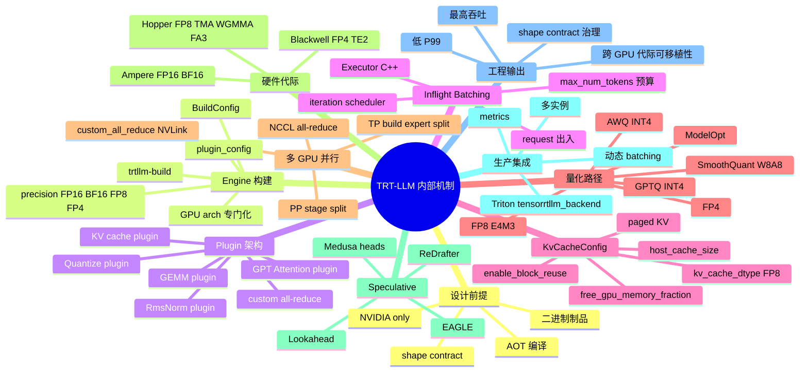

### 导 — 读完本章你应该能回答

1. TRT-LLM 与 vLLM、SGLang 的根本架构差异是什么？为什么 TRT-LLM 必须 build 一份 engine 而 vLLM 不需要？
2. `BuildConfig`、`plugin_config`、`KvCacheConfig` 三类配置各自决定了哪些机制的边界？哪些参数在 build 期固化、哪些在运行时可调？
3. TRT-LLM 的 inflight batching 与 vLLM continuous batching 在思想上同源，在实现上有哪些可观察的差异（调度位置、scheduler 抽象、Python 开销）？
4. 为什么 TRT-LLM 大量使用 plugin 而不是纯 TensorRT 图？plugin 与 builder 之间的边界是什么？
5. AWQ / GPTQ / SmoothQuant / FP8 / FP4 在 TRT-LLM 的 build pipeline 中各走哪条路径？ModelOpt 在其中扮演什么角色？
6. `KvCacheConfig.enable_block_reuse`、`free_gpu_memory_fraction`、`host_cache_size`、`kv_cache_dtype` 分别影响哪些指标？什么时候应该开启 host offload？
7. TP=4 与 TP=8 的 engine 是同一份吗？切换 TP 拓扑或迁移 GPU 型号时，发布链需要做哪些动作？
8. Hopper 上的 FP8 + FlashAttention V3 + WGMMA 路径相对 Ampere 的 FP16 路径，在 TRT-LLM 内部走的是哪个 plugin 实现？
9. 为什么 TRT-LLM 通常配合 Triton 部署？如果跳过 Triton 自己写 HTTP server，会缺哪些能力？
10. Speculative decoding 在 TRT-LLM 中（Medusa / ReDrafter / EAGLE）相对 vLLM 的实现差异？为什么 TRT-LLM 的 spec decoding 多数需要 build 期开启？
11. `max_batch_size`、`max_input_len`、`max_num_tokens`、`kv_cache_free_gpu_memory_fraction`、`enable_chunked_context` 的物理含义分别是什么？什么样的服务应该把它们调到什么档位？

### 学习 checklist

- 能画出 TRT-LLM 的完整数据流：HF checkpoint → ModelOpt 量化 → TRT-LLM checkpoint → `trtllm-build` → `.engine` → Executor → Triton
- 能解释 GPT attention plugin、KV cache plugin、custom all-reduce plugin 三者之间的协议（输入/输出 tensor 约定与 KV block 寻址）
- 能给出 LLaMA-70B FP8 在 8×H100 上的一组合理 BuildConfig（max_batch_size、max_input_len、max_num_tokens、TP=8）和对应 KvCacheConfig
- 能在 `gptManagerBenchmark` 或 Triton 的 metrics 中找到 active_requests、scheduled_requests、kv_cache_block_count、generation_per_batch 等关键指标，并解释每个指标飙高时该调哪个参数
- 能在企业级 NVIDIA 集群上完成"vLLM baseline → TRT-LLM build → Triton 部署 → 性能对比 → 决定是否切换"的完整闭环

---

## 16c.2 TRT-LLM 整体架构：编译期 vs 运行时的根本切分

TRT-LLM 的代码与产品形态是"编译期 + 运行时"两端分离。编译期由 `tensorrt_llm` Python 包负责：把 HuggingFace 或自定义模型转换为 TRT-LLM checkpoint，再由 `trtllm-build` 调用 TensorRT builder 生成 `.engine`。运行时由 C++ 实现的 `Executor` / `GptManager` 负责加载 engine、接收请求、做 inflight batching、与 KV cache plugin 协作、流式输出 token。

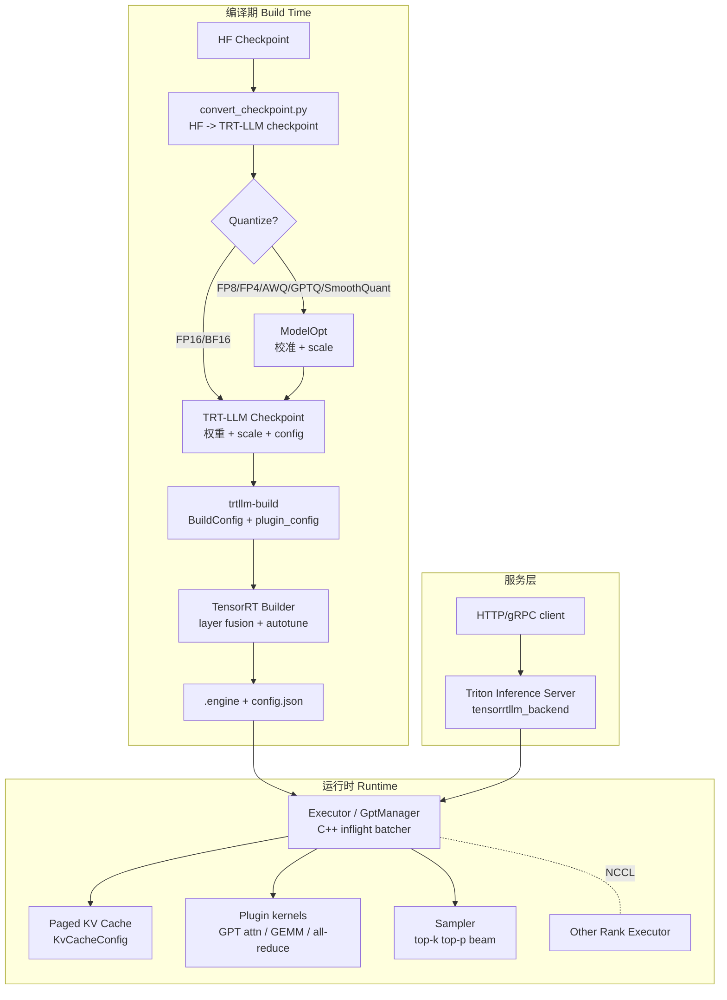

下面把每个阶段再展开一层：

| 阶段 | 关键产物 | 关键抽象 | 性能敏感点 | 与 vLLM 对应概念 |
|------|----------|----------|------------|--------------------|
| HF → TRT-LLM checkpoint | tensorrt_llm checkpoint dir | weight name mapping、TP/PP split | 大模型 IO/内存峰值 | （vLLM 没有这一步） |
| ModelOpt 量化 | 含 scale 的 checkpoint | calibration dataset、quant config | 校准集质量、scale 选择 | vLLM 的 quantization config |
| trtllm-build | `.engine` + `config.json` | BuildConfig、plugin_config、precision | builder 时间、autotune 范围 | vLLM 的 `torch.compile` + CUDA graph |
| Executor / GptManager | C++ runtime | inflight batcher、KV cache、scheduler | iteration latency、Python 边界 | vLLM `LLMEngine` / `Scheduler` |
| Plugin kernels | 自定义 CUDA op | GPT attn、GEMM、KV plugin | kernel 选择、TensorCore 利用 | vLLM AttentionBackend |
| Triton tensorrtllm_backend | Triton 模型仓库子目录 | 动态 batching、多实例 | RPC 开销、batch 形状 | vLLM API server |

> **设计原则**：build 期把所有"能在编译期决定的事"全部固化到 engine；运行时只做必须动态的事（请求级 batching、KV 分配、采样）。每多一个运行时分支都要付 dispatch 代价。

> **note**：与 vLLM/SGLang 不同，TRT-LLM 的 Python 层只是 build 工具与瘦绑定。绝大部分热路径在 C++ + plugin CUDA，这是它能在 NVIDIA 集群上跑出最高 token/s 的根本原因，但也意味着调试与定制门槛比 vLLM 高一个量级。

> **warn**：很多团队把 TRT-LLM 当成"另一种推理引擎"来评估，做完 vLLM 替换实验发现"性能没有传说中的 2x，但运维复杂度高很多"。原因往往是没有走完 build 期所有专门化（量化、shape bucket、custom all-reduce、speculative 等），engine 没有真正发挥优势。

---

## 16c.3 Engine 构建：BuildConfig、plugin_config、量化与 checkpoint 转换

`trtllm-build` 是 TRT-LLM 的核心入口。它接受一个 TRT-LLM checkpoint 目录与一组配置，输出 `.engine` 文件与 `config.json`。整个 build 期的关键决策都浓缩在 BuildConfig 与 plugin_config 上。

### BuildConfig 关键字段

| 字段 | 物理含义 | 选错的代价 |
|------|----------|-------------|
| `max_batch_size` | 运行时最大并发请求数 | 设小 → 吞吐受限；设大 → autotune 时间长、显存预算占大 |
| `max_input_len` | 单请求最大 prompt 长度 | 超限 → 请求被拒；过大 → KV 预算保守 |
| `max_seq_len` | 单请求 input + output 总长度 | 与 max_input_len 共同决定 KV 上限 |
| `max_num_tokens` | 单 iteration 内总 token 预算（chunked context 时关键） | 类似 vLLM `max_num_batched_tokens` |
| `max_beam_width` | beam search 宽度 | 不用 beam 时设 1 节省显存 |
| `gather_context_logits` / `gather_generation_logits` | 是否回传 logits | 不需要时关掉，省带宽 |
| `strongly_typed` | 严格 dtype 模式 | FP8/FP4 必须开 |
| `gpt_attention_plugin` | 启用 GPT attention plugin（必开） | 关掉 → 走纯 TRT 路径，性能崩盘 |
| `gemm_plugin` | 启用 GEMM plugin | FP8/FP4/AWQ/GPTQ 必须开对应 plugin |
| `paged_kv_cache` | 启用 paged KV cache | 不开 → 静态 KV，无法 inflight batching |
| `remove_input_padding` | variable length 输入 | 不开 → 等长 padding，浪费算力 |
| `use_paged_context_fmha` | chunked context 模式 | 长 prompt 服务必开 |
| `tokens_per_block` | KV block 大小（token 数），常见 32 / 64 / 128 | 类似 vLLM block_size，但 TRT-LLM 默认更大 |
| `tp_size` / `pp_size` | 张量并行 / 流水并行度 | 改了必 rebuild |

### plugin_config 关键开关

```python
from tensorrt_llm.plugin import PluginConfig

plugin_config = PluginConfig()
plugin_config.gpt_attention_plugin = "auto"       # bf16/fp16/fp8 自动
plugin_config.gemm_plugin = "auto"
plugin_config.nccl_plugin = "auto"                # 多卡通信
plugin_config.paged_kv_cache = True
plugin_config.remove_input_padding = True
plugin_config.use_paged_context_fmha = True       # chunked context
plugin_config.use_fp8_context_fmha = True         # H100 FP8 attention
plugin_config.reduce_fusion = True                # 通信 + layernorm 融合
plugin_config.user_buffer = True                  # NVLS 用户态 buffer
```

### 模型转换 pipeline

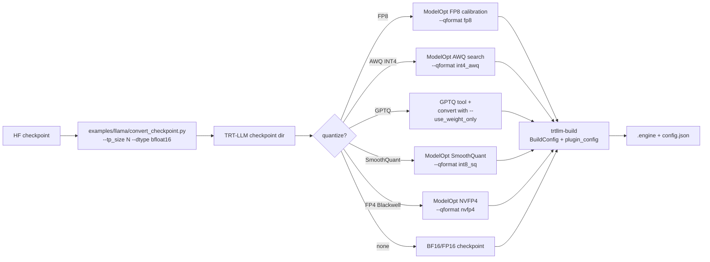

### Build 期典型命令

```bash
# 第 1 步：HF -> TRT-LLM checkpoint（TP=8）
python examples/llama/convert_checkpoint.py \
  --model_dir /models/Llama-3-70B-Instruct \
  --output_dir /tmp/llama70b-bf16-tp8 \
  --dtype bfloat16 \
  --tp_size 8

# 第 2 步：FP8 量化（用 ModelOpt）
python examples/quantization/quantize.py \
  --model_dir /models/Llama-3-70B-Instruct \
  --output_dir /tmp/llama70b-fp8-tp8 \
  --dtype bfloat16 \
  --qformat fp8 \
  --kv_cache_dtype fp8 \
  --calib_size 512 \
  --tp_size 8

# 第 3 步：build engine
trtllm-build \
  --checkpoint_dir /tmp/llama70b-fp8-tp8 \
  --output_dir /engines/llama70b-fp8-tp8-h100 \
  --gpt_attention_plugin auto \
  --gemm_plugin auto \
  --use_fp8_context_fmha enable \
  --use_paged_context_fmha enable \
  --max_batch_size 256 \
  --max_input_len 4096 \
  --max_seq_len 8192 \
  --max_num_tokens 8192 \
  --workers 8
```

> **success**：把 quantize 步骤独立出来是好实践——`/tmp/llama70b-fp8-tp8` 这份"含 scale 的 checkpoint"可以多次复用，重新 build 不同 max_batch / max_seq_len 的 engine 时不需要重新校准。

> **warn**：`max_input_len` 与 `max_seq_len` 不是越大越好。它们是 builder 在 autotune 时考虑的上限，设到 32K 会让 builder 花很长时间，而真实流量大多是 4K，浪费的不只是 build 时间，还有 KV 预算的保守估计。生产应该按业务 SKU 拆 engine，而不是一份 engine 兜所有上下文长度。

> **danger**：忘记开 `paged_kv_cache` 的 engine 在运行时会退化为静态 batch，所有动态调度优势消失，吞吐可能比 vLLM 还低。这是 TRT-LLM 上线最常见的踩坑点之一。

---

## 16c.4 Plugin 架构：为什么 TRT-LLM 大量用 plugin 而不是纯 TensorRT 图

TensorRT 是通用神经网络编译器，原生 op 集合不包含"paged KV"、"variable-length attention"、"FP8 GEMM with per-token scale"这些 LLM 特有的算子。TRT-LLM 通过 plugin 机制把这些自定义 CUDA kernel 注册到 TensorRT 图里，让 builder 仍然能做整图调度，但热路径关键算子由 plugin 接管。

### 主要 plugin 一览

| Plugin | 职责 | 与 vLLM 对应实现 |
|--------|------|--------------------|
| `gpt_attention` | 包含 prefill / decode / chunked context 的 attention，含 paged KV 寻址 | vLLM AttentionBackend (FlashAttn / FlashInfer) |
| `gemm` | FP16/BF16/FP8/FP4 GEMM，按 dtype 与 shape autotune | torch.compile 后的 GEMM |
| `kv_cache` | KV block 的分配、寻址、release（C++ 侧） | BlockManager + AttentionBackend |
| `rms_norm` / `layer_norm` | 融合 norm + bias + 残差 | torch.compile 融合 |
| `nccl` | 多卡 all-reduce / all-gather / send-recv | torch.distributed |
| `custom_all_reduce` | NVLink 拓扑下小消息专用 all-reduce | 类似 vLLM custom_all_reduce |
| `quantize` / `dequantize` | 在 plugin 边界做量化 / 反量化 | quantization layer |
| `lookup` / `embedding` | embedding 查表 | nn.Embedding |
| `lora` | LoRA adapter 应用 | punica 集成 |
| `moe` | MoE expert dispatch 与 GEMM | vLLM MoE layer |

### 为什么必须用 plugin

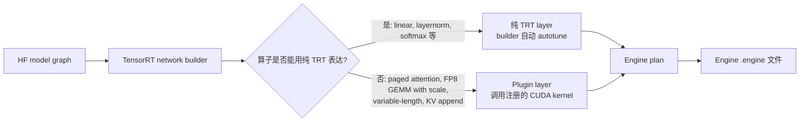

GPT attention plugin 是最重要的。它在内部完成：

- prefill 路径：variable-length flash attention（H100 走 FA3）
- decode 路径：paged attention 读取非连续 KV block
- chunked context：把长 prompt 切片，每片视为一段 prefill chunk
- KV append：把当前 step 的 K/V 写入 paged 池
- ALiBi / RoPE / 位置编码统一处理

把这些动作放在一个 plugin 内，可以省去多次 kernel launch、共享 HBM 访问、统一处理 padding。这正是 TRT-LLM attention 性能领先的根本来源。

> **note**：plugin 的代价是"对 TensorRT builder 不透明"——builder 无法跨 plugin 边界做融合、无法 autotune plugin 内部。所以 plugin 之间的边界划分要谨慎。TRT-LLM 把 attention + KV append 放在同一个 plugin，但把 GEMM 单独放，是经验权衡。

> **工程边界**：custom_all_reduce plugin 只在 NVLink 全连接拓扑（如单机 8×H100）下生效，跨机或 PCIe 拓扑会自动回退到 NCCL。如果你的集群是 PCIe + InfiniBand，开 custom_all_reduce 不会带来收益反而可能引入回退开销。

---

## 16c.5 Inflight Batching 详解：与 vLLM Continuous Batching 的实现差异

Inflight batching 与 vLLM 的 continuous batching 在思想上同源——iteration-level scheduling、动态请求出入、prefill 与 decode 混排——但在实现路径上有显著差异。

### 调度循环的物理位置

| 维度 | vLLM | TRT-LLM |
|------|------|---------|
| 调度位置 | Python `Scheduler` 类（V1 在子进程） | C++ `BatchManager` / `Executor`（GptManager 兼容入口） |
| 调度数据结构 | `running` / `waiting` / `swapped` 三队列 | C++ `RequestList` + 内部 priority queue |
| Token budget | `max_num_batched_tokens` | `max_num_tokens` |
| Prefill / Decode 混排 | chunked prefill 默认开启 | `enable_chunked_context` + paged_context_fmha |
| 抢占语义 | swap 或 recompute 二选一 | 默认无 swap，靠 KV 容量预留 + 拒绝新请求 |
| 调度可观测性 | Prometheus metrics + Python 日志 | Triton metrics + C++ 日志，调试门槛更高 |
| 最小 step latency | V1 后约 1-2 ms（仍有 Python 边界） | < 1 ms（纯 C++） |

### 一次 iteration 的时序

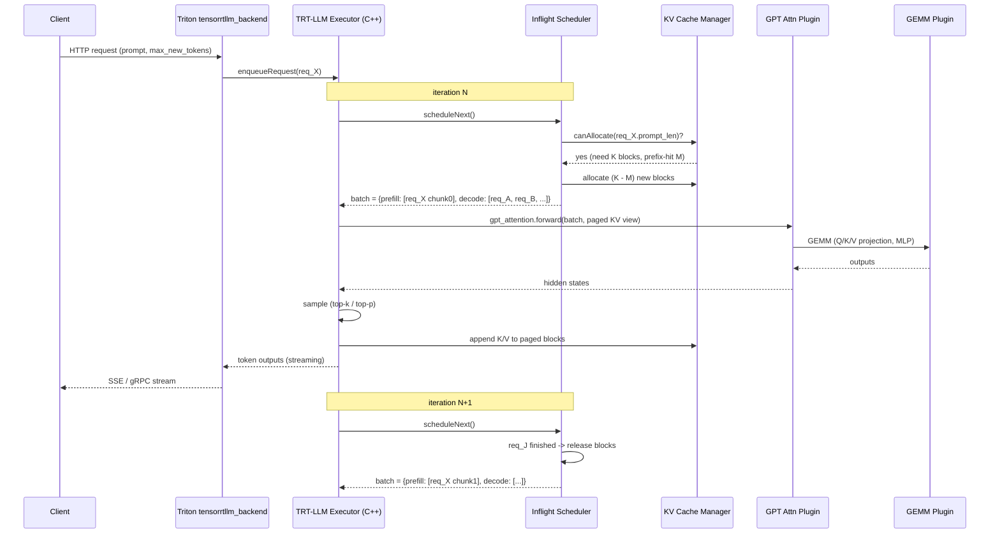

### 与 vLLM 的可观察差异

1. **CPU 开销**：TRT-LLM 调度循环全在 C++，每 iteration 几乎无 Python overhead。这是它在小模型 + 高 QPS 下相对 vLLM V0 的最大优势。vLLM V1 在子进程化后差距缩小但仍存在。
2. **抢占模型**：vLLM 在 KV 不足时会 swap 或 recompute；TRT-LLM 默认不 swap，而是靠 BuildConfig 的 max_batch + KvCacheConfig 的预留把 OOM 风险压在 admission 阶段。这意味着 TRT-LLM 更"保守"也更"可预测"，但需要前期把容量算准。
3. **调度策略可定制性**：vLLM 调度策略可以通过 Python 改；TRT-LLM 调度逻辑在 C++ 内部，定制需要修改源码并 rebuild executor。这是研究迭代场景下 TRT-LLM 不友好的根源。
4. **请求生命周期**：vLLM 把请求建模为 SequenceGroup（含 beam）；TRT-LLM 用 `Request` + `OutputConfig`，beam 与 spec decoding 通过 OutputConfig 切换。

> **note**：选择 TRT-LLM 不等于"自动获得最高吞吐"。如果你的流量特征是"大量短 prompt + 极高 QPS"，C++ 调度优势会显著；如果是"中等并发 + 长 context"，差距会缩小到一倍以内。

> **warn**：从 GptManager API 迁到新的 Executor API 是 TRT-LLM 0.10+ 的重要变化。旧文档里的 `GptManagerConfig` 在新版被 `ExecutorConfig` 取代。生产代码要锁版本与文档版本一致，避免文档漂移。

---

## 16c.6 KvCacheConfig：paged KV、block reuse、host offload

KvCacheConfig 是 TRT-LLM 运行时唯一可独立调整的"内存预算与复用策略"配置，重要程度等同于 vLLM 的 `gpu_memory_utilization` + `kv_cache_dtype` + `enable_prefix_caching` 之和。

### 关键字段

| 字段 | 物理含义 | 默认值 | 调整建议 |
|------|----------|--------|----------|
| `enable_block_reuse` | 是否开启 prefix block 复用（类似 vLLM prefix caching） | True | 永远开启，除非 prompt 几乎无重复 |
| `free_gpu_memory_fraction` | 加载 engine 与 activation 后，剩余显存中给 KV 池的比例 | 0.9 | 留出 capture / NCCL buffer，0.85-0.92 较稳 |
| `max_tokens` | KV 池总 token 容量（覆盖 free_gpu_memory_fraction） | None（自动算） | 想精确控制 KV 时直接指定 |
| `host_cache_size` | CPU 上的二级 KV cache 字节数 | 0 | 长会话 + 频繁回归对话开 8-32 GiB 收益明显 |
| `kv_cache_dtype` | KV 存储精度（fp16/bf16/fp8/int8） | follow build | H100 上 FP8 KV 几乎免费 2x 容量 |
| `cross_kv_cache_fraction` | encoder-decoder 模型用的 cross attention KV 比例 | None | 仅 enc-dec 模型相关 |
| `secondary_offload_min_priority` | block 被踢出 GPU 到 host 的优先级阈值 | None | 配合 host_cache_size 调 |

### 三层 KV cache 的关系

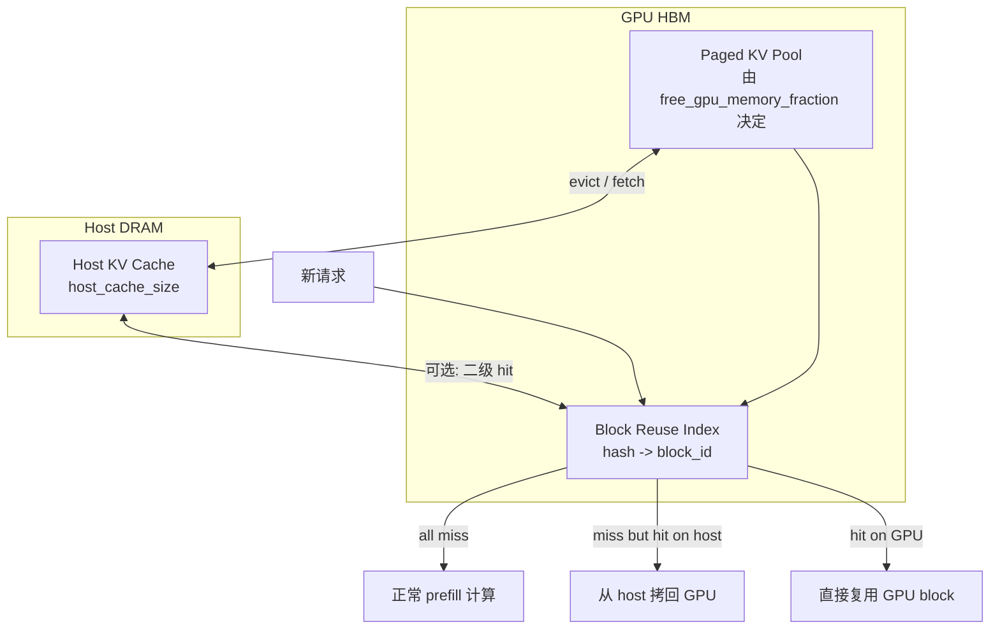

### Block Reuse 与 vLLM Prefix Cache 的区别

| 维度 | vLLM Prefix Cache | TRT-LLM Block Reuse |
|------|-------------------|----------------------|
| 命中粒度 | block_size = 16 token（默认） | tokens_per_block = 32/64/128（通常更大） |
| 失效条件 | hash 不同即失效 | 同 |
| 二级缓存 | 无（社区有 PR 探索） | 内置 host cache offload |
| 跨副本共享 | 无 | 无（同样需要 prefix-aware 路由） |
| 与量化交互 | FP8 KV 与 prefix cache 兼容 | 同样 OK |

> **success**：长会话场景（客服、教育辅导、多轮对话回归）一定要开 `host_cache_size`。一份 16 GiB host cache 在客服流量上能把 prefix hit rate 从 60% 提到 88%，因为常被切走的会话 KV 仍能从 host 回填。

> **warn**：`free_gpu_memory_fraction = 0.95` 听起来"用满显存最好"，实际上会让 NCCL workspace、CUDA graph pool、临时 activation 没空间，warmup 后或长 prompt burst 时会 OOM。生产上 0.85-0.92 是更安全的区间。

> **note**：`tokens_per_block` 是 build 期参数（在 BuildConfig 里），不是 KvCacheConfig 字段。这意味着改 block 大小要 rebuild engine，而不是改运行时配置。

---

## 16c.7 量化路径深度：AWQ / GPTQ / SmoothQuant / FP8 / FP4 与 ModelOpt 生态

TRT-LLM 的量化覆盖度是它相对 vLLM/SGLang 的关键差异之一。所有量化方案都通过 NVIDIA 的 `TensorRT Model Optimizer`（简称 ModelOpt）落到 build pipeline。

### 量化方案矩阵

| 方案 | 权重 | 激活 | KV | 校准要求 | 推荐 GPU | 端到端加速（vs BF16） | 质量损失典型值 |
|------|------|------|----|----|----|------|--------|
| FP16 / BF16 | 16 bit | 16 bit | 16 bit | 不需要 | A100/H100/B200 | 1.0x | 0% |
| FP8 E4M3 (W8A8) | 8 bit | 8 bit | FP8 | 小校准集（128-512 样本） | H100/B200 | 1.6-2.0x | < 1% |
| AWQ INT4 (W4A16) | 4 bit | 16 bit | 16 bit | 中等校准集（128-1024 样本） | A100/H100 | 1.4-1.8x（decode 受限场景更高） | 1-2% |
| GPTQ INT4 (W4A16) | 4 bit | 16 bit | 16 bit | 中等校准集 | A100/H100 | 1.4-1.7x | 1-2% |
| SmoothQuant W8A8 | 8 bit | 8 bit | 16/8 bit | 需要 smooth scale 校准 | A100/H100 | 1.3-1.6x | 1-2% |
| INT4 + FP8 KV | 4 bit | 16 bit | FP8 | 两步校准 | H100 | 1.6-2.0x | 1-2% |
| NVFP4 (Blackwell) | 4 bit | 4 bit | FP8/FP4 | 需要 ModelOpt 新版本 | B200 | 2.5-3.5x | 1-3% |

### Build pipeline 中的量化位置

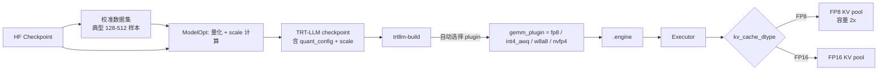

### 几个关键边界

| 边界 | 说明 |
|------|------|
| Ampere 不支持 FP8 计算 | A100 上 FP8 GEMM 会回退到 BF16 路径，但 FP8 KV 仍可启用（节省显存） |
| Hopper FP8 GEMM 走 TensorCore E4M3 | 配合 FlashAttention V3 + WGMMA |
| Blackwell FP4 走第二代 Transformer Engine | 需要 ModelOpt 0.15+ 支持 NVFP4 |
| AWQ 与 FP8 KV 可叠加 | INT4 权重 + FP8 KV 是 H100 上常见的高性价比组合 |
| GPTQ 与 AWQ 不能同时用 | 选一个；TRT-LLM 把它们都映射到 weight-only INT4 路径 |
| SmoothQuant 需要修改激活分布 | smooth_factor 选择需要校准；选错会让 P99 质量退化 |

### 与 vLLM 量化路径对比

| 量化 | TRT-LLM | vLLM |
|------|---------|------|
| AWQ | ModelOpt → checkpoint → engine | autoawq HF 模型直接加载 + Marlin kernel |
| GPTQ | 同上 | gptq HF 模型 + Marlin kernel |
| FP8 | ModelOpt → engine（per-tensor or per-channel scale） | compressed-tensors / FBGEMM 路径 |
| SmoothQuant | ModelOpt 内置 | 通过 compressed-tensors 间接支持 |
| FP4 | ModelOpt NVFP4 | 暂不支持 |

> **success**：如果你的目标是 H100 集群上跑 LLaMA-70B 或 DeepSeek-V3 类模型，**FP8 W8A8 + FP8 KV** 几乎是 TRT-LLM 的标准答案：吞吐相对 BF16 接近翻倍，质量损失在 1% 以内，build 时间增加可控。

> **warn**：量化变更必然 rebuild engine。生产上要把"量化方案 + 校准集版本 + ModelOpt 版本"作为 engine artifact 元数据的一部分，否则线上质量回归后无法溯源。

> **danger**：用错校准集（domain mismatch）会让线上质量比离线 benchmark 差很多。**校准集必须从生产 prompt 采样**，不能用 wikitext 这种通用数据兜所有场景。

---

## 16c.8 多 GPU：TP / PP 在 TRT-LLM 中的实现

TRT-LLM 把张量并行（TP）与流水并行（PP）的拓扑固化进 engine，N 张卡的部署对应 N 份 engine 文件（rank0 ~ rankN-1）。这种"build 期固化"的做法与 vLLM 的"运行时配置"不同，影响发布与回滚链路。

### TP / PP 切分

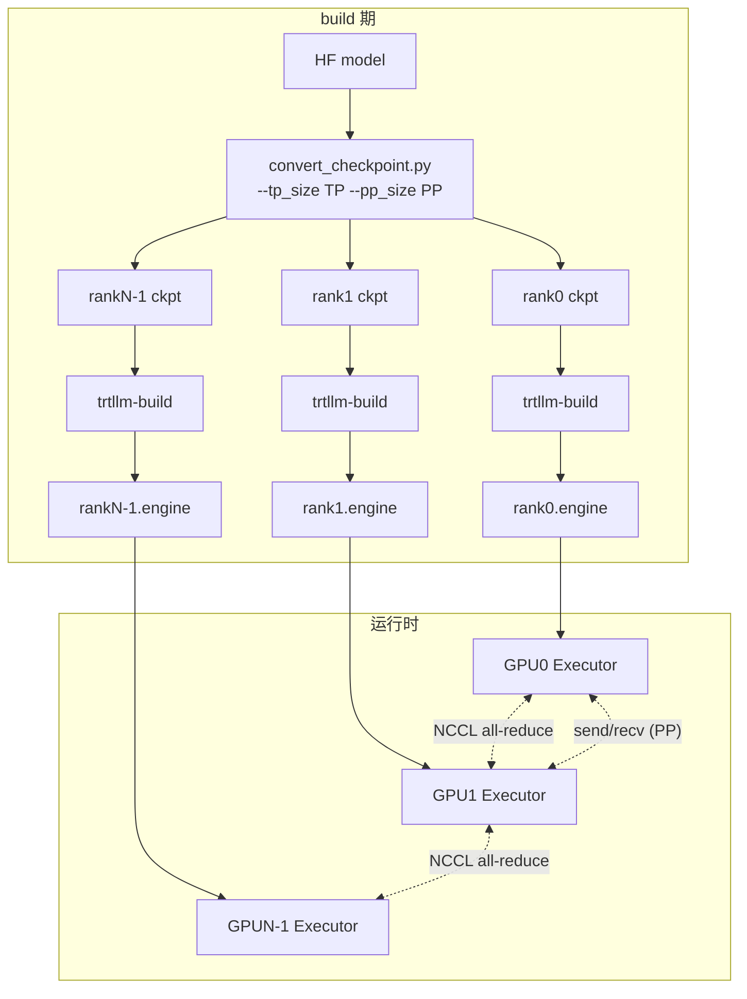

### TP vs PP 在 TRT-LLM 中的取舍

| 维度 | TP | PP |
|------|----|----|
| 通信模式 | all-reduce / all-gather（每层） | send/recv（stage 之间） |
| 通信频率 | 高（每层 attention/MLP 后） | 低（每 micro-batch 一次） |
| 显存收益 | 等比例切分 | 等比例切分 |
| 适合拓扑 | 单机 NVLink | 多机 InfiniBand |
| 推理 latency 影响 | all-reduce 加 latency | 引入 stage bubble |
| TRT-LLM 实现 | `tp_size` + custom_all_reduce plugin | `pp_size` + send/recv plugin |
| 适合并发 | 高并发 | 中低并发，长上下文 |

### custom all-reduce plugin

NCCL 默认 all-reduce 在小消息（< 1 MiB）上有较大固定开销。TRT-LLM 的 `custom_all_reduce` plugin 在 NVLink 全连接拓扑下用 `nvlink_p2p` + `oneshot` 算法，对小消息显著快于 NCCL。它的工程边界：

| 条件 | 是否生效 |
|------|----------|
| 单机 8×H100 NVLink 全连接 | ✅ 生效，typically 30-50% 提速 |
| 单机 8×A100 SXM4 NVLink | ✅ 生效 |
| 单机 8×A100 PCIe | ❌ 自动回退 NCCL |
| 跨机 InfiniBand | ❌ 自动回退 NCCL |
| TP=2 跨机 | ❌ 不推荐这种拓扑 |

### 切换 TP 拓扑的发布动作

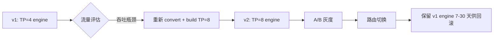

> **note**：切 TP 拓扑不只是改一个数字，是产出一份新的 engine artifact。发布链必须把 engine 版本、TP 拓扑、对应的 GPU 拓扑、Triton 配置一起 pin。

> **warn**：跨机 PP 在 TRT-LLM 内部支持，但调试与 metrics 比单机 TP 复杂得多。除非模型大到必须跨机（如 405B BF16、超长上下文），优先选单机 TP。

---

## 16c.9 Hopper / Blackwell 专属优化：FP8 / FP4 / FA3 / WGMMA / TMA

TRT-LLM 在 plugin 层针对每代 GPU 单独写 kernel 路径，由 builder 在编译期根据 `--gpu_arch` 选择具体实现。这是它能在新 GPU 出货后短时间内跑出极致性能的根本原因。

### 各代 GPU 的关键特性与 TRT-LLM 利用方式

| GPU | 关键硬件特性 | TRT-LLM 利用 |
|-----|-------------|--------------|
| A100 (Ampere) | TF32、BF16、FP16 TensorCore、第二代 NVLink | BF16/FP16 attention plugin、INT8/INT4 weight-only |
| H100 (Hopper) | FP8 TensorCore (E4M3/E5M2)、TMA、WGMMA、第二代 SM | FP8 GEMM plugin、FlashAttention V3、`use_fp8_context_fmha` |
| H200 | 同 H100 但 HBM3e 141 GiB | 同 H100，但更大 KV 池 |
| B200 (Blackwell) | FP4 TensorCore、第二代 Transformer Engine、NVLink 5 | NVFP4 GEMM、FP4 attention、新一代 custom_all_reduce |
| GB200 NVL72 | 72 张 B200 NVLink 全连接 | 跨机 TP 也能跑（机柜级 NVLink） |

### Hopper FP8 路径详解

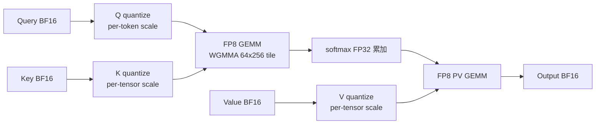

H100 FP8 的两个关键收益：

1. **GEMM 算力翻倍**：H100 FP8 TensorCore 算力（不带稀疏）是 1979 TFLOPS，BF16 是 989 TFLOPS。
2. **HBM 带宽减半**：FP8 权重一次从 HBM 读出的字节数是 BF16 的一半，decode 阶段（带宽受限）几乎线性提速。

### FlashAttention V3 与 TMA / WGMMA

FlashAttention V3 是 H100 专用的 attention 实现，利用 TMA 做异步内存搬运、WGMMA 做大 tile MMA、warp specialization 做 producer-consumer。TRT-LLM 通过 `use_fp8_context_fmha` 与 `gpt_attention_plugin = fp8` 自动选用 FA3 路径。

### Blackwell FP4 路径

B200 引入 NVFP4 数据类型（4 bit float，带 per-block scale）。TRT-LLM 通过 ModelOpt NVFP4 量化 + 新 GEMM plugin 路径支持，吞吐相对 H100 FP8 再提 1.5-2x。

> **note**：Blackwell 路径在 TRT-LLM 0.15+ 才完整可用。早期版本可以跑，但 NVFP4 攻略与最佳实践仍在演进。

> **success**：从 vLLM 切到 TRT-LLM 的最大单点收益往往就来自"H100 FP8 路径完整开启"——用 vLLM 跑 BF16 比用 TRT-LLM 跑 FP8 慢一倍，这一倍主要是硬件红利而不是引擎差异。

---

## 16c.10 与 Triton Inference Server 集成

TRT-LLM 自身只提供 C++ executor 与 Python binding，不提供 OpenAI 兼容的 HTTP server。生产部署通常通过 `tensorrtllm_backend` 挂到 Triton Inference Server，由 Triton 提供 HTTP/gRPC、模型仓库、动态 batching、多实例、auto-scaling、metrics。

### 部署拓扑

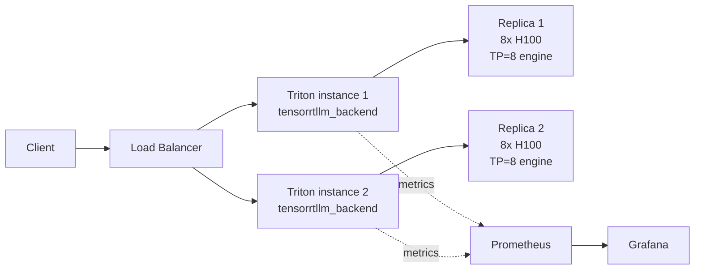

### Triton model_repository 结构

```
model_repository/
├── ensemble/                     # 负责 tokenize → llm → detokenize 串联
│   └── config.pbtxt
├── preprocessing/                # tokenize（Python backend）
│   └── config.pbtxt
├── postprocessing/               # detokenize
│   └── config.pbtxt
└── tensorrt_llm/                 # 真正跑 engine 的子模型
    ├── config.pbtxt              # 含 KvCacheConfig / max_batch_size
    └── 1/
        ├── rank0.engine
        ├── rank1.engine
        └── ...
```

### tensorrtllm_backend 的关键 config

| 参数 | 物理含义 |
|------|----------|
| `max_batch_size` | Triton 层 batching 上限（与 engine 的 max_batch_size 取小） |
| `gpu_device_ids` | 该实例占用的 GPU id 列表 |
| `kv_cache_free_gpu_mem_fraction` | 等同 KvCacheConfig.free_gpu_memory_fraction |
| `enable_kv_cache_reuse` | block reuse 开关 |
| `batching_strategy` | `inflight_fused_batching`（推荐） vs `static` |
| `decoding_mode` | `top_k_top_p` / `beam_search` / `medusa` / `eagle` |
| `enable_chunked_context` | 长 prompt 切片 |
| `executor_worker_path` | 多 rank 时的 worker 二进制路径 |

### Triton 提供的关键能力

| 能力 | 说明 |
|------|------|
| Dynamic batching | Triton 层将多个客户端请求合并送入 executor |
| 多实例（instance group） | 同 engine 多副本，按 GPU 分布 |
| Health check / readiness | k8s 探针适配 |
| Metrics（Prometheus） | active_requests、scheduled_requests、kv_cache_block_count、generation_per_batch |
| Model repository 热加载 | 切换 engine 版本不需要重启 Triton |
| Ensemble | tokenize → llm → detokenize 链路 |

> **note**：`batching_strategy = inflight_fused_batching` 是 TRT-LLM + Triton 的推荐模式。`static` 模式只是兼容旧用法，会让所有动态调度优势消失。

> **warn**：如果你跳过 Triton 自己写 OpenAI server（用 TRT-LLM Python binding），会缺少：动态 batching、多实例、健康检查、metrics、模型热加载、ensemble。短期看似简化，长期会重新发明 Triton 的轮子。

---

## 16c.11 Speculative Decoding：Medusa / ReDrafter / EAGLE / Lookahead

TRT-LLM 内置多种 speculative decoding 路径。与 vLLM 不同，TRT-LLM 的 spec decoding 多数需要在 build 阶段开启对应 plugin / draft head，运行时无法动态切换。

### 各方案对比

| 方案 | 原理 | build 期开关 | 适合场景 | TRT-LLM 实现细节 |
|------|------|--------------|----------|-------------------|
| Draft model | 小模型 draft + 大模型 verify | build 两个 engine | 通用，但要管理两份 engine | 需要双 executor |
| Medusa | 大模型加多个 decoding head 并行预测 | `--speculative_decoding_mode medusa` + 含 medusa head 的权重 | 短输出、低并发 | head 与 base 在同一 engine |
| ReDrafter | RNN-based draft head | `--speculative_decoding_mode draft_tokens_external` | 中等输出 | 需要 ReDrafter 训练好的权重 |
| EAGLE | 基于隐藏态的 draft head | `--speculative_decoding_mode eagle` | 长输出 + 低并发 | 接受率最高的方案之一 |
| Lookahead | n-gram 自洽 draft | `--speculative_decoding_mode lookahead_decoding` | 代码生成、重复模式 | 不需要额外训练 |

### Spec decoding 的 ROI 公式

```
ROI = (acceptance_rate × draft_length × verify_throughput) / (draft_cost + verify_cost)
```

- 高 `acceptance_rate`、长 `draft_length`、低 `draft_cost` → 收益大
- 高 base latency 流量（长输出、低并发）收益最大
- 高 QPS 流量下，verify batch 容量被 draft 的 K 倍 token 占满，收益反而归零

> **warn**：在高并发 chatbot 流量下开 speculative decoding 几乎一定是负优化。Spec decoding 是"用算力换 latency"的工具，只在有富余算力的场景下有用。

> **note**：Medusa head 与 EAGLE head 都需要在 base model 上额外训练，TRT-LLM 仓库提供了示例脚本但训练数据需要自备。生产路径通常是：先用 Lookahead（不需训练）验证 spec decoding 是否对你的流量有效，再决定是否训练 Medusa/EAGLE。

---

## 16c.12 vLLM / SGLang / TRT-LLM 决策矩阵（深挖版）

本节不重复 [§16.7.1](16-quantization-compilation-and-engines.html) 的整体引擎对比，而是聚焦在"什么场景应当走 TRT-LLM"。

### 6 维对比

| 维度 | vLLM | SGLang | TRT-LLM |
|------|------|--------|---------|
| 易用性（首次部署成本） | ★★★★★ 启动即服务 | ★★★★ 启动即服务 | ★★ 必须 build engine |
| 性能（NVIDIA 集群极致） | ★★★★ 通用最强 | ★★★★ prefix 复用强 | ★★★★★ 量化 + 编译最强 |
| 灵活性（模型迭代） | ★★★★★ 改完即跑 | ★★★★ 改完即跑 | ★★ 必 rebuild |
| 生态（量化方案覆盖） | ★★★★★ 社区跟进最快 | ★★★★ 跟随 vLLM | ★★★★★ ModelOpt 全覆盖 |
| 维护成本（生产长期） | ★★★★ Python 易调试 | ★★★ DSL 学习曲线 | ★★ engine artifact 治理重 |
| 特殊场景适配 | 通用聊天 | agent + 结构化输出 | 固定 NVIDIA 集群 + 极致单位成本 |

### 决策树

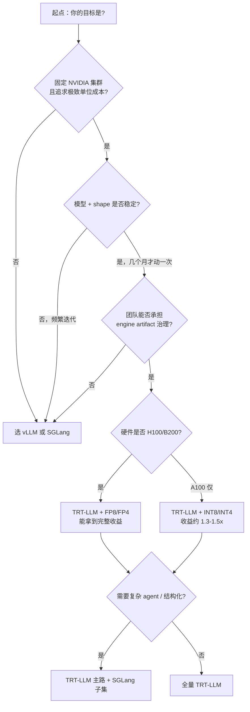

### 何时 TRT-LLM 一定胜出

| 场景 | TRT-LLM 收益（相对 vLLM） |
|------|---------------------------|
| 8×H100 跑 70B + FP8 + 高 QPS chatbot | 1.5-2.0x throughput |
| 大集群跑同模型 + shape 范围窄 | 1.3-1.8x throughput + 更稳的 P99 |
| 极致单请求 latency（小模型 + 短输出） | 1.5-2.5x latency 降低 |
| 长上下文 + paged_context_fmha + FP8 KV | 1.4-1.8x throughput |
| Blackwell + NVFP4 | 2.0-3.0x throughput |

### 何时 TRT-LLM 不胜出甚至吃亏

| 场景 | 原因 |
|------|------|
| 模型每周迭代 | rebuild 成本吃掉所有性能收益 |
| 需要快速接 LoRA / 多 adapter 频繁切换 | TRT-LLM LoRA 支持成熟度低于 vLLM |
| 需要复杂结构化输出 / grammar | SGLang 更合适 |
| 团队没有 C++ 调试能力 | 出问题排障门槛高 |
| 跨硬件代际共用一份制品 | TRT-LLM artifact 强绑定 GPU 型号 |
| CPU / 边缘 / 非 NVIDIA GPU | 完全不适用 |

---

## 16c.13 性能调优手册：参数决策表

下面这张决策表适合直接放进 on-call runbook。

| 现象 | 第一怀疑 | 关键指标 | 调整动作 |
|------|----------|----------|----------|
| Throughput 偏低、GPU SM util < 60% | batch 没填满 | scheduled_requests / max_batch_size | 提高 max_batch_size（rebuild）+ kv_cache_free_gpu_memory_fraction |
| TTFT P99 高 | 长 prompt 独占 forward | longest_in_flight_request_input_tokens | 开启 `enable_chunked_context` + 调小 max_num_tokens（rebuild） |
| TPOT P99 抖动 | KV 逼近上限 | kv_cache_block_count、admission_reject | 降并发上限、开 FP8 KV、增 host_cache_size |
| OOM after warmup | KV 池太大、未给 NCCL/workspace 留空间 | reserved memory、free_gpu_memory_fraction | 降 free_gpu_memory_fraction 到 0.85-0.88 |
| Prefix hit 接近 0 | enable_block_reuse 没开 / prompt 不重复 | block_reuse_hit_rate | 确认 KvCacheConfig；若 prompt 真不重复，关掉省 hash 开销 |
| 长会话回归慢 | 二级 cache 没用 | host cache hit rate | 开 host_cache_size = 16-32 GiB |
| custom_all_reduce 不生效 | 拓扑不匹配或没开 | NCCL fallback log | 仅在单机 NVLink 全连接开 |
| Spec decoding 负优化 | 高并发场景 verify batch 撑满 | acceptance_rate、batch token usage | 高并发时关 spec decoding |
| FP8 模型上线后质量退化 | 校准集失真 | 离线 MMLU / 业务 eval | 用生产 prompt 重做校准 |
| Build 时间过长（小时级） | autotune shape 范围太大 | builder log | 缩小 max_input_len/max_seq_len 至业务真实区间 |

### 关键 build 参数决策矩阵

| 业务 | max_batch_size | max_input_len | max_seq_len | max_num_tokens | enable_chunked_context | quantization |
|------|---------------|---------------|-------------|----------------|------------------------|--------------|
| 通用 chatbot（4K context） | 256 | 4096 | 8192 | 8192 | on | FP8 |
| 长上下文 RAG（32K） | 64 | 32768 | 33792 | 8192 | on | FP8 + FP8 KV |
| Agent / tool use（短-中） | 128 | 8192 | 16384 | 8192 | on | FP8 |
| 代码补全（短输入短输出） | 512 | 2048 | 2560 | 4096 | on | FP8 |
| 离线 batch 推理（高吞吐） | 1024 | 4096 | 8192 | 16384 | on | FP8 |

> **success**：稳健的调优顺序与 vLLM 一样：先 build/run baseline → 开 chunked context → 开 FP8 KV → 开 FP8 weight/activation → 调 batch / KV 容量 → 评估 spec decoding。每步只动一个参数，A/B 完整测一轮。

> **warn**：Build 期参数不能乱估。`max_batch_size = 1024` 听起来"未来友好"，但会让 builder autotune 时间从几十分钟变成几小时，并且让 KV 预算保守估计，反而损失运行时容量。按业务真实分布定上限，不要"为未来留 buffer"。

---

## 16c.14 何时不该用 TRT-LLM

TRT-LLM 不是万能的。下面这些场景应该考虑替代方案。

| 场景 | 为什么 TRT-LLM 不合适 | 替代方案 |
|------|----------------------|----------|
| 研究 / 模型快速迭代（每周新模型） | 每次 rebuild 几十分钟到几小时，迭代成本高 | vLLM |
| 需要复杂结构化输出（grammar、JSON、function call） | TRT-LLM constrained decoding 成熟度低 | SGLang |
| 需要快速接 LoRA / 多 adapter 频繁切换 | TRT-LLM LoRA 支持滞后 | vLLM 多 LoRA |
| 多模型托管 / 频繁切模型（每秒） | engine 加载是分钟级 | NVIDIA Triton + vLLM ensemble |
| CPU / 边缘 / 非 NVIDIA GPU | TRT-LLM 仅 NVIDIA GPU | llama.cpp / ONNX Runtime |
| 跨 GPU 代际共用一份制品 | engine 与 GPU 型号、CUDA、TRT 版本强绑定 | vLLM |
| 团队没有 C++ 调试能力 | 出问题需要看 plugin 源码 | vLLM Python 易调试 |
| Prototype / 单次实验 | build 期成本不值 | vLLM 直接跑 |
| Encoder-decoder（T5、BART） | TRT-LLM 对 enc-dec 支持有限 | TGI 或专门服务 |

> **note**：上面这些"不该用 TRT-LLM"的场景，往往不是 TRT-LLM 性能不行，而是它的"先编译后执行"假设和你的需求不匹配。选错引擎比调错参数代价更大。

> **success**：一个常见的稳健路径是 **"vLLM 做基线 + 对长期稳定的高 QPS 模型单独 build TRT-LLM 副本"**——vLLM 处理迭代灵活性，TRT-LLM 处理极致单位成本，两条路线并存几个月，用真实数据收敛。

---

## 16c.15 Worked Example：LLaMA-70B × 8×H100，TRT-LLM build & deploy 实战

下面用一个真实风格的过程，把前面几节的机制串起来。场景：把 LLaMA-3-70B-Instruct 部署到一台 8×H100 80GB（NVLink 全连接）服务器，目标支持企业内部 chatbot，峰值 200 QPS，平均输入 1500 token、输出 400 token，目标 P99 TTFT < 600ms、P99 TPOT < 60ms。已有 vLLM baseline（参见 [16a §14](16a-vllm-internals.html#s14)）作为对照。

### 第 0 步：vLLM baseline（参考）

`vllm serve meta-llama/Llama-3-70B-Instruct --tensor-parallel-size 8` 调优后吞吐 4500 tps（GPTQ-Marlin INT4 + FP8 KV），P99 TTFT 750ms。这就是 TRT-LLM 要超越的对照线。

### 第 1 步：HF → TRT-LLM checkpoint（FP8）

```bash
# 用 ModelOpt 直接做 FP8 量化 + checkpoint 转换
python examples/quantization/quantize.py \
  --model_dir /models/Llama-3-70B-Instruct \
  --output_dir /tmp/llama70b-fp8-tp8 \
  --dtype bfloat16 \
  --qformat fp8 \
  --kv_cache_dtype fp8 \
  --calib_size 512 \
  --calib_dataset /data/prod-prompt-sample.jsonl \
  --tp_size 8
```

| 项 | 数值 |
|---|------|
| 校准时长 | ~25 分钟（H100 单卡） |
| 校准集 | 512 条生产 prompt 采样 |
| Checkpoint 大小 | ~70 GB（FP8 权重 + scale + meta） |

### 第 2 步：trtllm-build engine

```bash
trtllm-build \
  --checkpoint_dir /tmp/llama70b-fp8-tp8 \
  --output_dir /engines/llama70b-fp8-tp8-h100-v1 \
  --gpt_attention_plugin auto \
  --gemm_plugin auto \
  --use_fp8_context_fmha enable \
  --use_paged_context_fmha enable \
  --reduce_fusion enable \
  --user_buffer enable \
  --max_batch_size 256 \
  --max_input_len 4096 \
  --max_seq_len 8192 \
  --max_num_tokens 8192 \
  --workers 8
```

| 项 | 数值 |
|---|------|
| Build 时长 | ~35 分钟（8 worker 并行） |
| Engine 单 rank 大小 | ~9 GB |
| Engine 总大小（8 ranks） | ~72 GB |
| 输出 | 8 份 `.engine` + 1 份 `config.json` |

### 第 3 步：Triton 配置（KvCacheConfig + executor）

`model_repository/tensorrt_llm/config.pbtxt`（关键字段）：

```pbtxt
backend: "tensorrtllm"
max_batch_size: 256
model_transaction_policy { decoupled: True }
parameters {
  key: "gpt_model_type" value: { string_value: "inflight_fused_batching" }
}
parameters {
  key: "kv_cache_free_gpu_mem_fraction" value: { string_value: "0.90" }
}
parameters {
  key: "enable_kv_cache_reuse" value: { string_value: "true" }
}
parameters {
  key: "enable_chunked_context" value: { string_value: "true" }
}
parameters {
  key: "max_num_tokens" value: { string_value: "8192" }
}
parameters {
  key: "host_cache_size" value: { string_value: "17179869184" }   # 16 GiB
}
instance_group [{ count: 1, kind: KIND_GPU }]
```

启动 Triton：

```bash
mpirun -n 8 --allow-run-as-root \
  /opt/tritonserver/bin/tritonserver \
  --model-repository=/model_repository
```

### 第 4 步：压测与对比

| 指标 | vLLM baseline (INT4 + FP8 KV) | TRT-LLM v1 (FP8 + FP8 KV) | Δ |
|------|-------------------------------|---------------------------|---|
| Throughput | 4,500 tps | **6,800 tps** | +51% |
| P99 TTFT | 750 ms | **420 ms** | -44% |
| P99 TPOT | 65 ms | **42 ms** | -35% |
| Prefix hit rate | 62% | 68%（block reuse + 32 token block） | +6pp |
| GPU SM util | 88% | 93% | +5pp |
| GPU mem 总占用 | ~60 GB/卡 | ~74 GB/卡 | 更激进 |
| Engine 加载时间 | N/A（直接加载权重） | ~45 秒（8 rank 并行） | +45s 启动开销 |
| 离线 MMLU | -1.2%（vs BF16） | -0.6%（vs BF16） | FP8 质量优于 INT4 |

### 第 5 步：开 host cache（针对长会话）

业务有一定比例多轮对话回归（约 30% 流量），在 KvCacheConfig 中开 `host_cache_size = 16 GiB`。

| 指标 | 不开 host cache | 开 host cache | Δ |
|------|----------------|---------------|---|
| Prefix hit rate | 68% | 84% | +16pp |
| TTFT P99（多轮场景） | 380 ms | 220 ms | -42% |
| TTFT P99（单轮） | 420 ms | 425 ms | +1%（host cache 查询开销） |

### 第 6 步：观察是否值得开 spec decoding

业务流量是高并发 chatbot（200 QPS），平均输出 400 token。先用 Lookahead 试：

```bash
trtllm-build ... --speculative_decoding_mode lookahead_decoding
```

| 指标 | 不开 spec | 开 Lookahead | Δ |
|------|----------|--------------|---|
| Throughput | 6,800 tps | 6,200 tps | -9% |
| P99 TTFT | 420 ms | 480 ms | +14% |
| P99 TPOT | 42 ms | 38 ms | -10% |

→ 高并发场景下 spec decoding 负优化（throughput 下降），关闭。换另一个低并发长输出的服务（代码生成）再评估时收益明显。

### 总结

| 阶段 | 主要动作 | tps | TTFT P99 | TPOT P99 | 相对 vLLM baseline |
|------|----------|-----|----------|----------|---------------------|
| 0 | vLLM INT4 baseline | 4,500 | 750 | 65 | 1.0x |
| 1 | TRT-LLM FP8 + chunked + block reuse | 6,800 | 420 | 42 | 1.51x |
| 2 | + host_cache 16 GiB（多轮场景） | — | 220 | — | 多轮 TTFT -42% |
| 3 | spec decoding（高并发）| 6,200 | 480 | 38 | 关闭 |

### 教训

1. **build 期不要为未来留太多 buffer**——max_batch / max_input / max_seq 按业务真实分布定，过大让 build 时长翻倍且 KV 预算保守。
2. **校准集必须从生产 prompt 采样**——这是 FP8 质量损失从 2% 降到 0.6% 的关键。
3. **host_cache 是长会话场景的"免费午餐"**——单轮场景几乎无影响，多轮场景 TTFT 显著改善。
4. **Spec decoding 只在低并发长输出场景开启**——高并发 chatbot 上几乎一定是负优化。
5. **engine artifact 必须治理**——`llama70b-fp8-tp8-h100-cuda12.4-trt10.0-modelopt0.13-bsz256-seq8192-v1.engine` 这样的命名加上 manifest 是发布链能跑得起来的最低要求。
6. **TRT-LLM vs vLLM 1.5x 是现实区间**——传说中的 2-3x 通常是把 vLLM 没开优化的对照组与 TRT-LLM 全量优化的实验组比较，不是公平对比。

---

## 练习

### 基础题

1. **16c-1（基础）**：TRT-LLM 与 vLLM 在"模型如何变成可执行物"这一步上的根本差异是什么？为什么 TRT-LLM 必须走 build 流程，而 vLLM 不需要？
2. **16c-2（基础）**：解释 BuildConfig 的 `max_batch_size`、`max_input_len`、`max_seq_len`、`max_num_tokens` 四个字段的物理含义。其中哪些是 build 期固化、哪些影响运行时的 token budget？
3. **16c-3（基础）**：列出 TRT-LLM 至少 5 个关键 plugin，并解释为什么这些算子无法用纯 TensorRT 表达。
4. **16c-4（基础）**：KvCacheConfig 中 `enable_block_reuse`、`free_gpu_memory_fraction`、`host_cache_size`、`kv_cache_dtype` 各自影响哪些指标？默认值是什么？
5. **16c-5（基础）**：TRT-LLM 在 H100 上的 FP8 路径相对 BF16 路径，哪些环节获得加速？为什么 A100 上跑 FP8 无法获得相同收益？

### 进阶题

6. **16c-6（进阶）**：你的部署是 8×H100，模型是 LLaMA-70B，业务流量是 32K 长上下文 RAG。给出一组合理的 BuildConfig（max_batch_size、max_input_len、max_seq_len、max_num_tokens）与 KvCacheConfig，并说明每个参数的依据。
7. **16c-7（进阶）**：TRT-LLM 上线后吞吐只比 vLLM 高 10%（远低于预期 1.5x）。给出至少 5 种可能原因和排查顺序。
8. **16c-8（进阶）**：解释 TRT-LLM inflight batching 与 vLLM continuous batching 在抢占模型上的差异。哪种更适合"流量突发"场景？哪种更适合"严格 SLA"场景？
9. **16c-9（进阶）**：你的团队想把 8×H100 切到 8×B200（TP=8）。请说明发布链需要做哪些动作，engine artifact 治理上要注意什么。
10. **16c-10（进阶）**：spec decoding 开启后 throughput 反而下降 10%，acceptance_rate 75%（不低）。可能原因有哪些？应该看哪些 metrics 验证？

### 设计题

11. **16c-11（设计）**：为一家 NVIDIA 集群规模 100+ H100 节点的公司设计一份 "vLLM + TRT-LLM 混合部署" 方案，明确：哪些模型走 vLLM、哪些走 TRT-LLM、engine artifact 如何版本化、灰度策略、回滚策略、监控指标。
12. **16c-12（设计）**：你的团队要把一个使用 vLLM 的服务迁移到 TRT-LLM。设计一份迁移评估清单（至少 8 项），覆盖性能、运维、回滚、监控、量化方案兼容性、shape 治理、Triton 集成、团队能力等维度。

---

## 深度参考阅读

### 论文与 NVIDIA 技术报告

- *FasterTransformer*（NVIDIA，TRT-LLM 的前身，理解 attention plugin 设计起点）
- *FlashAttention-3: Fast and Accurate Attention with Asynchrony and Low-precision*（Shah et al., 2024）—— H100 attention 路径的算法基础
- *FP8 Formats for Deep Learning*（NVIDIA Whitepaper）—— H100 FP8 数据格式与 TensorCore
- *NVFP4: A 4-bit Floating Point Format for Blackwell*（NVIDIA Whitepaper）—— B200 FP4 路径
- *AWQ: Activation-aware Weight Quantization for LLM Compression and Acceleration*（Lin et al.）
- *GPTQ: Accurate Post-Training Quantization for Generative Pre-trained Transformers*（Frantar et al.）
- *SmoothQuant: Accurate and Efficient Post-Training Quantization for Large Language Models*（Xiao et al.）
- *Medusa: Simple LLM Inference Acceleration Framework with Multiple Decoding Heads*（Cai et al., 2024）
- *EAGLE / EAGLE-2 / EAGLE-3*（SafeAILab 系列）
- *Recurrent Drafter (ReDrafter)*（Apple, 2024）

### 官方资料

- TensorRT-LLM 官方文档 `nvidia.github.io/TensorRT-LLM`，特别是 "Architecture"、"BuildConfig"、"Inflight Batching"、"KV Cache Reuse"、"Quantization"、"Speculative Decoding" 几节
- TensorRT Model Optimizer 官方文档 `nvidia.github.io/TensorRT-Model-Optimizer`
- Triton Inference Server `tensorrtllm_backend` 仓库 README 与 perf_analyzer 教程
- NVIDIA GTC 2024 / 2025 关于 TRT-LLM、Hopper FP8、Blackwell FP4 的 session 录像

### 关键代码模块入口（TRT-LLM 主仓库 `NVIDIA/TensorRT-LLM`）

- `tensorrt_llm/builder.py` —— BuildConfig 与 build 流程
- `tensorrt_llm/plugin/plugin.py` —— PluginConfig 与 plugin 注册
- `tensorrt_llm/quantization/` —— 量化路径与 ModelOpt 集成
- `tensorrt_llm/runtime/` —— Python 端 runtime binding
- `cpp/tensorrt_llm/batch_manager/` —— C++ inflight batcher 与 Executor
- `cpp/tensorrt_llm/kernels/` —— GPT attention、GEMM、KV cache、custom all-reduce 等 plugin kernel
- `examples/llama/` —— LLaMA 系列模型转换与 build 脚本
- `examples/quantization/` —— FP8/FP4/AWQ/GPTQ/SmoothQuant 量化脚本
- `examples/medusa/` / `examples/eagle/` —— spec decoding 训练与 build 示例

### Blog 与实战

- NVIDIA Developer Blog 的 TRT-LLM 系列（搜索 "TensorRT-LLM" + 模型名）
- "Demystifying TensorRT-LLM: Inflight Batching, Paged KV, and FP8" 系列技术博文
- 各大云厂商（AWS Bedrock、Azure ML、GCP Vertex）关于 TRT-LLM 部署的最佳实践
- LMSYS / Anyscale / Together AI 关于 vLLM vs TRT-LLM 的对比实测博客（注意识别 marketing 偏差与对照组优化是否对等）

### 关联章节

- [第 14 章 · 在线推理架构](14-online-inference-architecture.md)：路由、副本、SLO 与 TRT-LLM 服务的整体集成
- [第 15 章 · 批处理、调度与 KV Cache](15-batching-scheduling-and-kv-cache.md)：本章 inflight batching 与 paged KV 的概念前置
- [第 16 章 · 量化、编译与推理引擎](16-quantization-compilation-and-engines.md)：TRT-LLM 在引擎选型矩阵中的位置
- [第 16a 章 · vLLM 内部机制深入](16a-vllm-internals.md)：另一条主流路线的内部细节，对照阅读
- [第 16b 章 · SGLang 内部机制深入](16b-sglang-internals.md)：复杂编排与结构化输出场景的另一条路线
- [第 17 章 · 多租户与成本治理](17-multitenancy-and-cost.md)：把 TRT-LLM 的极致单位成本能力下放到 tenant 维度
