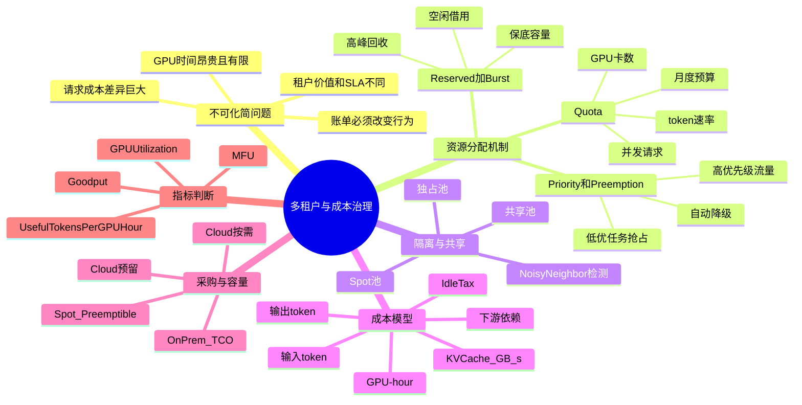

# 第17章：多租户与成本治理

> 推理系统真正进入平台阶段的标志，往往不是 QPS 上去了，而是多个团队、多个模型、多个优先级同时进入同一个资源池后，系统还能保持可解释和可控。

> **关联章节**：本章的配额、优先级和成本规则，需要依附于 [第14章](14-online-inference-architecture.md) 的路由与副本架构才能真正执行；治理策略最终都要落到在线流量控制。量化和引擎选择（见 [第16章](16-quantization-compilation-and-engines.md)）决定了单位成本的下限，批处理和 KV Cache 策略（见 [第15章](15-batching-scheduling-and-kv-cache.md)）决定了它的上限。

## 1. 第一性原理拆解 + 学习大纲

### 概念先说清楚

多租户和成本治理里有很多词容易混用，先把边界定清楚：

| 概念 | 一句话定义 | 工程上要落到哪里 |
|------|------------|------------------|
| Tenant | 拥有独立身份、预算、策略和审计边界的使用方 | API key、JWT claim、namespace、billing tag |
| Isolation | 限制一个租户影响其他租户的范围 | GPU pool、MIG、queue、KV cache、日志与数据权限 |
| Quota | 租户可消耗资源的硬上限或软上限 | gateway、scheduler、budget service |
| Rate limit | 单位时间内允许进入系统的请求 / token 速率 | API gateway、router |
| Fairness | 资源紧张时不同租户获得服务的规则 | 调度权重、reserved + burst、preemption |
| Showback | 把成本展示给租户但不真实扣款 | 成本看板、月度报告 |
| Chargeback | 把成本转成预算扣减或内部结算 | 财务系统、预算服务、准入控制 |
| SLO class | 平台承诺的服务等级档位 | P99、可用性、warm pool、降级规则 |
| Noisy neighbor | 一个租户的流量让其他租户 SLO 恶化 | 监控、隔离、限流、迁移 |

**租户不是 Kubernetes namespace 的同义词**。一个租户可能跨多个 namespace、多个模型和多个区域；一个 namespace 里也可能有多个租户。真正不能丢的是 `tenant_id` 这条主线：从 gateway、router、model replica、KV cache、downstream trace 到账单，每一跳都要能带上同一个可审计的 tenant tag。

### 拆 — 不可化简的问题

把所有平台名、调度器名、计费名词先拿掉，多租户与成本治理要解决的不可化简问题只有一个：**有限且昂贵的 GPU 时间，必须在多个会互相影响、价值不同、风险不同的请求之间分配，并且分配结果要能被解释、约束和纠偏**。GPU 不是一个抽象的"弹性资源"，它是每秒都在折旧或计费的物理设备；一次 LLM 请求也不是一个均匀的 HTTP 调用，而是输入 token 的 prefill、输出 token 的 decode、KV Cache 显存占用、下游检索 / rerank、日志与安全检查的组合。只要多个团队、多个模型版本、多个 SLA 档位进入同一个资源池，就必然出现四个不可逃避的事实：第一，资源在时间上有波峰波谷，按峰值隔离会贵，按平均共享会抖；第二，请求的成本差异极大，1K prompt 和 32K prompt 对 GPU、显存和排队的压力不是线性可替代的；第三，业务价值不同，核心生产流量和一次临时评测不应在高峰期拥有相同抢占权；第四，账单如果无法归因到租户和行为，就不会改变任何人的使用方式。

因此，本章不是在讲"怎么把 Kubernetes namespace 分给不同团队"，也不是在讲"怎么月底生成一张报表"。它要回答的是：当一个共享推理平台被真实组织使用时，如何让每个租户知道自己能用多少、超用会发生什么、为什么被限流、为什么账单变贵、什么时候应该用 Cloud / On-Prem / Spot，以及什么指标能证明 GPU 时间确实转化成了有价值的 token。原来的导读中说，阶段 4 才是真正的平台：多模型、多团队、多优先级、多 SLA 同时存在。第一性原理地看，阶段 4 的困难不在服务能不能跑，而在平台必须把技术约束、业务优先级和经济激励合成一套可执行规则。

### 推 — 从这个问题如何推导出每个机制

从"昂贵 GPU 时间要被多人共享"出发，首先会推出 **quota**：没有配额，每个租户都会按自己的峰值和局部最优申请资源，最后共享池退化成谁先占谁赢。仅有 quota 还不够，因为空闲资源如果不能借用，整体利用率会很差，所以需要 **reserved + burst** 这类机制：保底容量保证可预测性，burst 容量利用空闲水位。只要允许 burst，就会遇到高峰争用，于是需要 **priority** 和 **preemption**：线上核心流量能压过实验流量，低优任务可被抢占或降级。

共享继续深入后，会推出 **isolation**。隔离不是越强越好，而是成本与稳定性的交换：独占池、MIG、专用 warm pool 能降低 noisy neighbor 风险，但会增加 idle tax；完全混部能提高平均利用率，却可能让长上下文租户拖垮其他租户的 P99。因此平台必须把资源池分层：核心业务强隔离，中等业务共享池，实验 / 离线流量进入可抢占池。

再往下推，成本治理必然出现。GPU-hour 是最容易采集的成本单位，但它无法解释为什么同样 1 万次请求，有的租户贵 10 倍；所以要拆到输入 token、输出 token、KV Cache GB·s、下游依赖调用和 warm pool 分摊。这个拆解导出 **chargeback**：不是为了财务惩罚租户，而是让租户看见"长输出、低 cache hit、过度保留容量"如何变成钱。chargeback 一旦存在，就会反过来影响行为，因此计费模型本身也是平台政策。

最后，"便宜"本身也要被拆开。Cloud 按需便宜在风险低和弹性强，On-Prem 便宜在长期高利用率下的 GPU-hour 摊销，Spot / Preemptible 便宜在可中断任务能接受回滚。它们不是三种单价，而是三种风险分配方式。类似地，GPU utilization 也不是最终目标：SM Active 高只能说明设备忙，MFU、useful tokens / GPU-hour 和 goodput 才能说明这份忙是否转化成有效产出。

### 绘 — 因果链路



### 导 — 读完本章你应该能回答

1. 如果一个推理平台只有 GPU 利用率和总账单两个指标，为什么它无法做真正的成本治理？
2. reserved、burst、priority、preemption 分别解决哪个不可化简的问题，边界在哪里？
3. 为什么 Cloud vs On-Prem 的结论不能只比较单张 H100 的小时单价，而要看利用率曲线、承诺周期和运维能力？
4. Spot / Preemptible 适合承接哪些推理或训练负载，为什么不应直接放在线上主路径？
5. GPU utilization、MFU、useful tokens / GPU-hour、goodput 四个指标分别在回答什么问题？
6. 一个合理的 chargeback 模型应该如何拆分 GPU-hour、token、KV Cache、下游依赖和隔离溢价？
7. 当某个租户成为 noisy neighbor 时，平台应该如何用配额、路由、隔离和账单规则共同纠偏？

## 学习目标

完成本章学习后，你将能够：

1. 理解推理系统为什么天然会走向多租户
2. 认识配额、优先级、隔离、成本归因的作用
3. 学会从单位请求成本角度分析服务设计
4. 理解多租户调度中的公平性与利用率冲突
5. 知道为什么成本治理必须进入平台而不是停留在报表
6. 区分 GPU utilization、MFU 和 useful tokens per GPU-hour 这几个指标
7. 看懂 Cloud vs On-Prem、Spot vs On-Demand 的 TCO 权衡

---

## 本章导读

一个团队的推理平台常常会经历这样的几个阶段：

```text
[阶段 1] 一个模型 + 一个团队
         "能跑就行"
               ↓
[阶段 2] 多个模型 + 一个团队
         "不同模型装不同镜像，手动切"
               ↓
[阶段 3] 多个模型 + 多个团队
         "A 团队把 GPU 占满了，B 团队跑不了实验"
               ↓
[阶段 4] 多模型 + 多团队 + 多优先级 + 多 SLA
         "谁先用，谁能抢，谁付钱，出了事谁负责"
```

**阶段 4 才是真正意义上的"平台"**。从阶段 2 到阶段 4，技术难度不大，但治理难度是台阶式上升的。很多公司在 GPU 上投入了上亿美元，但平台停留在阶段 2/3，结果就是：

- GPU 平均利用率 30%，看起来很浪费
- 但高峰期关键业务又经常抢不到卡
- 成本账单每月都在涨，但没人能说清花在哪
- 新业务想用平台，要找人批资源、跟老板协调

这一章的核心判断框架是：

```text
多租户治理要回答的 5 个问题
  ├── 谁能用多少？     (quota)
  ├── 谁先用？         (priority)
  ├── 互相影响多大？   (isolation / noisy neighbor)
  ├── 谁付多少钱？     (chargeback)
  └── 怎么改变行为？   (control-plane actions)
```

不能回答这 5 个问题的平台，GPU 再多也会持续"又贵又紧张"。

## 正文内容

### 17.1 为什么推理系统会走向多租户

刚开始时，很多模型服务是单租户的：

- 一个模型
- 一组副本
- 一个团队维护

但只要模型数量增加，就会自然出现：

- 多模型共享 GPU
- 不同团队共享集群
- 同一模型有不同版本同时在线
- 不同用户群体有不同 SLA

此时问题不再只是"跑得动"，而是：

- 谁先用资源
- 谁可以抢占
- 谁为成本负责
- 谁的请求可以被限流或降级

#### 17.1.1 单租户到多租户的三道坎

实际演进中，团队通常会连续踩中三道坎：

**第一道坎：静态资源分配撑不住了**

最初的方案是"A 团队分 4 张卡，B 团队分 4 张卡"。但很快发现：

- A 团队高峰期 4 张卡不够，B 团队低峰期 4 张卡空转
- 平均利用率 < 30%
- 静态切分的账单是"永远按峰值付费"

**第二道坎：共享池没有优先级**

改成共享池后，又出现新问题：

- B 团队的离线实验占满 GPU，A 团队的线上服务延迟飙升
- "大家都是一家公司，应该让高优业务先跑"成了每天吵架的话题
- 没有规则驱动的优先级，就只能靠老板拍板

**第三道坎：成本无法归因**

共享池建起来后，月底看账单：

- 总共花了 50 万美元
- 但每个团队都说"我们没用那么多"
- 无法追溯哪次流量尖峰是谁引起的
- 优化了半年，账单还在涨，因为没人为浪费负责

**多租户治理本质就是把这三道坎翻译成可执行规则**。

### 17.2 多租户系统真正要管理的是什么

多租户不是简单"每个团队一个 namespace"。
真正需要管理的是：

- **资源边界**：谁最多能占多少 GPU
- **优先级**：线上紧急流量是否能压过低优先级任务
- **隔离**：一个租户的问题是否会拖垮全局
- **成本归因**：GPU 小时、token、带宽、存储归谁
- **发布边界**：不同团队是否能独立灰度和回滚

这意味着多租户本质上是一组规则，不只是资源切片。

#### 17.2.1 隔离 vs 共享：一个永恒的张力

多租户里最核心的矛盾是"隔离"和"共享"的张力：

| 维度 | 强隔离（各自独立集群） | 强共享（混部） |
|------|------------------------|----------------|
| 利用率 | 低（每个池按峰值留冗余） | 高（波峰波谷互补） |
| 可预测性 | 高（互不干扰） | 低（noisy neighbor 风险） |
| 成本 | 高（冗余多） | 低（复用好） |
| 安全 | 高 | 需要额外机制 |
| 运维 | 多套基础设施 | 一套但更复杂 |

成熟平台通常不是"全隔离"或"全共享"，而是**分层**：

- **核心业务 + 高优租户** → 专用保留池（强隔离）
- **中等业务** → 共享主池 + 配额（弱隔离）
- **实验 / 离线 / 低优** → Spot / preemptible 池（最弱隔离，甚至可被抢占）

这种分层让平台能同时达到"关键业务稳"和"整体利用率高"的目标。

#### 17.2.2 Tenant isolation 的四层边界

推理平台里的隔离不是一个开关，而是四层边界叠加：

| 隔离层 | 要防什么 | 常见机制 | 成本代价 |
|--------|----------|----------|----------|
| 身份与权限隔离 | 租户越权调用模型、读取他人日志 | API key / OIDC、RBAC、OPA、审计日志 | 低，主要是控制面复杂度 |
| 数据隔离 | prompt、response、RAG 文档、tool 结果串租户 | tenant-scoped cache key、per-tenant encryption、日志脱敏 | 中，cache 命中率可能下降 |
| 资源隔离 | 一个租户吃满 GPU、显存、queue、下游 QPS | quota、rate limit、MIG、独占池、队列隔离 | 中到高，牺牲共享效率 |
| 故障隔离 | 某租户 bug / 流量尖峰拖垮平台 | circuit breaker、bulkhead、独立副本、降级策略 | 高，需要冗余容量 |

在 LLM serving 里，**缓存隔离尤其容易被低估**。Embedding cache、semantic cache、response cache、KV prefix cache 都必须把 tenant / model / policy version 纳入 key 或隔离域。否则命中率越高，越可能把 A 租户的上下文、权限或过期业务规则复用给 B 租户。

```text
安全的 cache key 至少包含:
  tenant_id
  model_id / model_version
  tokenizer_version
  policy_version
  prompt_template_hash
  data_acl_hash
  normalized_input_hash
```

> **danger**：跨租户共享 system prompt 的 KV Cache 只有在 prompt 完全公共、没有租户私有工具、没有租户私有 policy、没有数据 ACL 差异时才安全。只要 tool schema 或安全策略按租户变化，就应把它们作为 prefix 的一部分，或者做 per-tenant cache namespace。

### 17.3 单位请求成本怎么看

一个粗略但实用的成本模型可以写成：

$$
\text{cost per request} \approx \frac{\text{instance cost per second} \times t_{\text{occupied}}}{\text{useful requests served}}
$$

对于 LLM，更进一步常常要看：

$$
\text{cost per processed token} \approx \frac{\text{GPU cost} + \text{downstream cost}}{\text{input tokens} + \text{output tokens}}
$$

这提醒我们：

- 长上下文请求更贵
- 长输出请求更贵
- cache 命中率低会让成本飙升
- 冷启动和低利用率会显著抬高单位成本

所以很多"系统架构选择"其实最终都会在成本报表上被放大。

> **参考数量级（仅供建立直觉，实际值因模型大小、显卡代际、上下文长度和业务流量差异较大）**
>
> | 场景 | 典型值 | 说明 |
> |------|--------|------|
> | GPU 利用率从 30% 提升到 60% | 单位请求成本可近似减半 | 前提是质量和 SLA 没被破坏 |
> | 冷启动副本空转 | 几分钟内几乎没有有效请求产出 | 会显著抬高低峰期成本 |
> | 长上下文请求 | 成本常为短请求的数倍到十余倍 | 主要受 prefill 与 KV Cache 影响 |
> | 缓存命中提升 10-20 个百分点 | 单位 token 成本可明显下降 | 取决于下游检索和重复计算占比 |

#### 17.3.1 一个量化的单位 token 成本例子

假设一张 H100 的云价格约 $3/小时（具体价格随地区、承诺、合约差异很大），模型跑到 4000 tokens/s 稳态吞吐：

```text
每小时产出 = 4000 tokens/s × 3600 s = 14.4M tokens
每 M token 成本 = $3 / 14.4 = $0.21 / M tokens
```

这就是"裸成本下限"。再加上：

- 冷启动空转时间（假设 5% 时间是冷启动）→ 乘以 1.05
- Warm pool 保留（假设保留 20% 容量兜底）→ 乘以 1.25
- 检索 / 重排下游（每请求 $0.01）→ 加上 $0.01/req
- 跨租户共享池的利用率折扣（从 60% 提到 80%）→ 乘以 0.75

**真实成本可能是 "下限" 的 2-5 倍**。这就是为什么"单位 token 成本"不是一个固定数字，而是一组放大器的组合。

#### 17.3.2 成本的非线性效应

一个容易忽略的事实：**很多因素对成本是非线性的**。

- **上下文长度**：prompt 从 2K 扩到 32K，prefill 时间可能从 20ms 变成 2s（100x），但 token 数只变 16x —— 单位 token 成本涨 6x
- **并发**：从 10 并发到 50 并发，吞吐可能涨 3x；但再到 200 并发，可能只再涨 1.5x（KV Cache 碎片化、调度开销）
- **利用率**：30%→60% 成本近似减半，但 60%→90% 只能再降 33%，而且 P99 可能显著恶化

这些非线性效应的工程含义是：**不能用"线性外推"做容量和成本规划**。上下文要做分档、并发要找甜蜜点、利用率要和 SLA 配合着看。

#### 17.3.3 从 GPU 小时拆到单 token、单请求、租户账单

更接近工程落地的估算，通常不是一个总价，而是三层账：

```text
GPU 固定成本 = GPU 数 × 小时单价 × 运行小时
有效 token 单价 = GPU 固定成本 / useful tokens
单请求成本 = prefill 成本 + decode 成本 + KV Cache 成本 + 下游成本 + 冗余成本
租户账单 = 请求成本求和 + 保底容量分摊 + SLA / 隔离溢价
```

其中最容易漏掉的是后两项：

- **空闲冗余（idle tax）**：为了 P99 和冷启动，副本不能按平均流量配置，而要按峰值或高分位配置；低峰时这部分 GPU 仍然在计费。
- **隔离溢价（isolation tax）**：高 SLA 租户使用独占池、MIG 切片或专用 warm pool，会牺牲共享池的复用效率；这不是浪费，而是稳定性的价格。

下面是一个简化的 worked example。假设一个 8 GPU 在线池，每张 GPU $4/小时，每天运行 24 小时，平均有效吞吐 28K tokens/s，整池有效利用率 70%：

| 估算层级 | 计算 | 结果 |
|----------|------|------|
| 每日 GPU 固定成本 | 8 × $4/h × 24h | $768 / day |
| 每日有效 token | 28K tokens/s × 86400s × 70% | 1.69B tokens / day |
| 裸 token 成本 | $768 / 1690M | $0.45 / 1M tokens |
| 加 25% idle tax | $0.45 × 1.25 | $0.56 / 1M tokens |
| 加 15% SLA / 隔离溢价 | $0.56 × 1.15 | $0.64 / 1M tokens |

再看单请求。假设一个请求有 4K 输入、1K 输出，平台把 prefill 和 decode 分开估算：

| 成本项 | 粗略单价 | 用量 | 请求成本 |
|--------|----------|------|----------|
| Prefill 输入 token | $0.30 / 1M tokens | 4K | $0.0012 |
| Decode 输出 token | $1.20 / 1M tokens | 1K | $0.0012 |
| KV Cache 占用 | $0.00002 / GB·s | 8 GB × 6s | $0.0010 |
| 检索 / rerank / 日志 | 固定估算 | 1 次 | $0.0020 |
| SLA / idle 分摊 | 请求侧加成 20% | - | $0.0011 |
| **单请求合计** | - | - | **约 $0.0065** |

这个例子里的输出 token 单价更高，是因为 decode 阶段通常受自回归串行生成限制，单位时间里能并行摊薄的工作少；长输出会持续占用 decode 槽位，也会让其他租户排队。

最后落到租户账单时，不要只乘请求数。一个月内某租户如果有：

| 项目 | 用量 | 单价 / 规则 | 月费用 |
|------|------|-------------|--------|
| 普通请求 | 200 万次 | $0.0065 / req | $13,000 |
| 保底容量 | 1 GPU × 720h | $4/h × 60% 分摊 | $1,728 |
| 高 SLA warm pool | 20% 容量溢价 | 按请求成本加成 | $2,600 |
| 超长上下文请求 | 5 万次 | 额外 $0.02 / req | $1,000 |
| **租户月账单** | - | - | **约 $18,328** |

这个数字不应被理解为精确报价，而是一个可解释的成本模型：租户能看懂自己为什么贵，平台也能解释"减少长上下文、提升 cache 命中、降低 SLA 档位"分别能省哪一部分钱。

### 17.4 成本工程真正关心哪些放大器

真实账单通常不是被"模型参数量"单独决定，而是被一组放大器共同推高：

| 放大器 | 为什么会贵 | 平台上的典型动作 |
|--------|------------|------------------|
| 长上下文 prefill | 占用大量算力和带宽，且未必能被 cache 命中 | 把长上下文单独分层计费或限流 |
| 长输出 decode | decode 槽位被持续占用，压低共享池吞吐 | 对 max output length 做档位治理 |
| Warm pool / 空转副本 | 为了 SLA 保留容量，但低峰期没有有效产出 | 用时段策略、共享池或延迟回收控制 idle tax |
| 低命中缓存 | 重复跑 embedding、检索、prefix 计算 | 持续跟踪 cache hit、prefix hit、重复请求比 |
| 下游依赖 | 检索、OCR、rerank、工具调用都会计入单次成本 | 把全链路依赖费用并入 chargeback |
| 冷启动 | 副本起来的几十秒几乎没有产出 | 预热、镜像预拉取、延长副本生命周期 |
| 版本重复 | 多个模型版本同时在线，互相不复用 | 灰度时设最大并存版本数 |

从平台视角看，成本工程不是月底看报表，而是提前把这些放大器做成控制旋钮。

#### 17.4.1 一个诊断成本的顺序

发现账单涨了，一个系统化的诊断顺序：

```text
[1] 先看总量: 本月 GPU-hour 比上月多了多少？
   └── 如果是流量自然增长，检查 cost / 1M tokens 是否保持
         ├── 保持 → 正常业务增长
         └── 上涨 → 进入 [2]

[2] 分租户看增长: 哪个租户的 cost 涨得最多？
   └── 聚焦到具体租户后，进入 [3]

[3] 分请求特征看: 该租户的请求变了什么？
   ├── 平均输入长度变长了 → 长上下文 prefill 占比高
   ├── 平均输出长度变长了 → decode 时间占用高
   ├── Prefix cache 命中下降 → prompt 模板变化或路由不亲和
   ├── 重试率上升 → 下游抖动或超时设置不合理
   └── QPS 变化不大但成本涨 → 进入 [4]

[4] 看利用率指标:
   ├── GPU utilization 下降 → 可能 warm pool 空转多
   ├── MFU 下降 → 可能在做低价值工作（见 17.4c）
   └── 冷启动次数上升 → autoscaling 抖动
```

**一个实战经验**：90% 的成本异常能在这个诊断流程的前三步定位。但需要平台有**按租户、按时间段、按请求特征分桶**的埋点能力。如果只有一个"总账单"的数字，诊断就做不下去。

#### 17.4.2 真实推理成本的拆解清单

把推理成本拆细后，很多"优化"才有判断标准：

| 成本项 | 真实来源 | 典型观测指标 | 常见误判 |
|--------|----------|--------------|----------|
| GPU 固定成本 | 实例 / 机器只要开着就按小时计费 | GPU-hour、实例小时、预留容量 | 只看请求量，忽略低峰空转 |
| 利用率折扣 | 有效产出低于理论吞吐 | useful tokens / GPU-hour、goodput | SM Active 高就以为成本低 |
| Prefill | 处理输入上下文，长 prompt 会放大算力和显存带宽 | TTFT、input tokens/s、prefix cache hit | 只按总 token 计费，低估长上下文 |
| Decode | 自回归输出，持续占用 batch 槽位 | output tokens/s、decode occupancy | 忽略长输出对排队的影响 |
| KV Cache | 为每个活跃序列保留显存，长上下文和高并发会吃满 | KV GB、KV block hit、eviction | 只看 GPU 算力，不看显存碎片 |
| 空闲冗余 | 为冷启动、突发流量和 P99 保留 warm pool | idle GPU-hour、warm replicas | 把所有空闲都当浪费砍掉 |
| SLA / 隔离 | 独占池、MIG、专用副本牺牲复用效率 | reserved vs shared 成本差 | 只比较共享池单价，忽略尾延迟 |
| 多租户调度开销 | 配额、优先级、抢占、cache 亲和带来的非最优排布 | queue wait、preemption、cache locality | 以为全局混部一定最省钱 |

工程上要先回答"钱主要花在哪一项"，再决定优化手段。否则很容易对 decode 问题做 prompt 压缩，或对 idle tax 问题做量化，优化方向完全错位。

#### 17.4.3 成本优化策略要写清适用条件和失败条件

成本优化不是"尽量省钱"，而是在质量、延迟、隔离和账单之间选一个可执行的点。

| 策略 | 能省哪部分钱 | 适用条件 | 失败条件 / 工程边界 |
|------|--------------|----------|---------------------|
| Dynamic batching / continuous batching | 提高吞吐，摊薄 GPU 固定成本 | 请求有足够并发，P99 预算允许短暂等待 | 低 QPS 下批不起来；高优短请求可能被长请求拖慢 |
| Quantization | 降低显存和算力成本，提升可部署密度 | 模型对 INT8/FP8/INT4 精度损失可接受 | 质量回归、长尾任务退化、某些 kernel 反而不快 |
| Model routing | 用小模型处理简单请求，把大模型留给复杂请求 | 有可靠的难度分类器和回退路径 | 误路由导致质量事故；分类器成本抵消收益 |
| Prefix / response / retrieval cache | 减少重复 prefill、embedding 和下游调用 | prompt 模板稳定，租户流量有重复性 | cache miss 率高、跨租户数据隔离要求强、缓存失效难控 |
| Spot / preemptible | 降低可恢复任务的 GPU-hour 单价 | 训练、批评测、低优离线任务可 checkpoint | 在线主路径被抢占会造成 SLA 事故 |
| Reserved / committed use | 降低长期稳态容量单价 | 需求稳定，机型和区域选择明确 | 业务下降或模型迁移后被承诺容量套牢 |
| 租户 quota | 控制异常流量和预算爆炸 | 租户边界清晰，入口能强制执行 | 配额太硬会拒掉关键流量；太软则无法控费 |
| 降级策略 | 在容量或预算紧张时保住核心功能 | 已定义模型、上下文、输出长度、SLA 的降级梯度 | 降级不可预测会变成隐性故障；质量不可接受时不能降 |

每个策略上线前至少要有三个 guardrail：质量评测不过不省、P99 超预算不省、租户隔离被破坏不省。平台的目标不是把账单压到最低，而是把**满足业务约束的单位有效产出成本**压低。

### 17.4a Cloud vs On-Prem：什么时候该算 TCO

平台一旦进入百卡级，成本工程就不能只看云账单，还要开始比较 Cloud 与 On-Prem 的总拥有成本（TCO）。

| 维度 | Cloud | On-Prem |
|------|-------|---------|
| 前期投入 | 低，按需付费 | 高，要先买卡、网络、存储和机房能力 |
| 弹性 | 强，适合波峰波谷明显的业务 | 弱，但长期稳态成本更低 |
| 运维复杂度 | 部分外包给云厂商 | 需要自己承担硬件、网络和容量运维 |
| 更适合 | 规模波动大、需求仍在探索 | 百卡以上且长期高利用率运行 |

一个常见判断框架是：如果 GPU 需求长期稳定、利用率能持续拉高、且运行周期按年计，On-Prem 往往更值得进入 TCO 计算；反之 Cloud 的弹性通常更有价值。

常见 TCO 构成至少包括：硬件折旧（常按 3-4 年摊销）、电力成本（GPU TDP x PUE）、网络 / 存储，以及运维人力。只盯采购单价，通常会明显低估 On-Prem 的真实成本。

更工程化的 TCO 表应该把"钱从哪里来"和"风险由谁承担"同时列出来：

| TCO 项 | Cloud 按需 | Cloud Reserved / Committed | On-Prem |
|--------|------------|----------------------------|---------|
| GPU 计算 | 按实际实例小时付费，单价最高 | 承诺 1-3 年换折扣 | 采购后按折旧摊销 |
| 空闲容量 | 空闲时可关，idle tax 可控 | 承诺容量空闲仍要付 | 机器空闲仍折旧和耗电 |
| 网络 | 公网 / 跨 AZ / 跨区流量可能很贵 | 同左，但可通过架构降低 | 机房内东西向流量边际成本低，但交换机 upfront 高 |
| 存储 | 对象存储、块存储、快照按量计费 | 同左 | 本地 NVMe、并行文件系统、备份系统要自建 |
| 运维 | 云厂商承担硬件和基础设施故障 | 同左 | 需要硬件、网络、机房、备件、值班团队 |
| 容量风险 | 可快速扩缩，缺点是热门 GPU 可能没货 | 价格低但灵活性下降 | 买错机型、需求下降、模型迁移都会沉没 |
| 合规 / 数据 | 云上合规依赖供应商与区域 | 同左 | 数据本地化控制强，但审计责任也在自己 |
| 适合利用率 | 10%-50% 或波动极大 | 50%-75% 且需求较确定 | 70%+ 且能持续 2-4 年 |

**工程边界**：TCO 表只能支持容量决策，不能替代压测。On-Prem 的每 GPU-hour 看起来低，不代表单位 token 成本一定低；如果调度、批处理、故障恢复和模型发布能力不足，70% 的机器利用率可能只产出 30%-40% 的 useful tokens。Cloud 也不能只看按需价，GPU 缺货、跨区流量、镜像拉取、存储快照和长期预留失败都会让实际成本偏离表格。

#### 17.4a.1 一个粗略的 TCO 对比算法

以 8 张 H100 的集群为例，非常粗略的估算（具体数字因地区、厂商、合约差异巨大，仅供建立直觉）：

**On-Prem 路径**：
```text
硬件采购: 8 × H100 服务器约 $300K-400K（单机，含网络）
折旧 3 年: 约 $110K/年
电力: 8 × 700W × 24 × 365 × PUE 1.5 × $0.1/kWh ≈ $7K/年
网络 / 存储 / 机房: ~$20K/年
运维人力（分摊）: ~$40K/年
---------------------------
年度 TCO: ~$180K
每 GPU-hour: $180K / (8 × 8760) ≈ $2.5
```

**Cloud 路径（按需价）**：
```text
H100 按需价: ~$3-5/hour/GPU
8 GPU × 8760 hour × $4 = ~$280K/年
```

**Cloud 路径（3 年预留）**：
```text
通常是按需价的 50-60%
~$170K/年
```

这三条路径看起来差距不大（都在 $170K-280K/年），但结论完全不同：

- **利用率 30%**：Cloud 按需最优（你真的只用 30%）
- **利用率 70%+**：On-Prem 或 Cloud 预留最优（持续占用更省）
- **需求不稳定**：Cloud 按需 + Spot 组合最优

所以"Cloud 贵还是 On-Prem 贵"的答案，**本质是你的利用率曲线长什么样**。

把上述例子压成一张决策表：

| 场景 | Cloud 按需 | Cloud 预留 | On-Prem | 推荐判断 |
|------|------------|------------|---------|----------|
| 新业务探索，流量每周变化 2-3 倍 | 成本高但风险低 | 容易承诺过早 | 采购风险高 | 先 Cloud 按需 |
| 稳定线上池，预计 12 个月都在 60%+ | 单价偏高 | 折扣和弹性平衡 | 需要机房能力 | Cloud 预留优先 |
| 训练 / 推理平台长期百卡级，70%+ 使用 3 年 | 长期成本偏高 | 可作为过渡 | 摊销后有优势 | 进入 On-Prem TCO 论证 |
| 季节性高峰，平时低谷明显 | 高峰能扛，低谷可关 | 承诺容量可能浪费 | 低谷折旧浪费 | Cloud 按需 + Spot |
| 数据不能出本地机房 | 受区域和合规限制 | 同左 | 控制力强 | On-Prem 或专有云 |

#### 17.4a.2 Reserved Instance / Committed Use：被低估的中间选项

很多团队在 Cloud 和 On-Prem 之间二选一，忽略了中间选项：

- **Reserved Instance（AWS）/ Committed Use（GCP）/ Savings Plan**：承诺 1-3 年，换 30-60% 折扣
- **预留到具体机型** vs **可灵活切换**：后者折扣低但弹性大
- **Part-time 承诺**：只承诺上班时间，低峰期释放

对尚未确定规模的团队，**先 Cloud 按需建基线 → 稳定后转 Reserved → 进入稳态后评估 On-Prem** 往往是风险最低的路径。

### 17.4b Spot / Preemptible 为什么像"便宜但不稳定的第二池"

Spot / Preemptible 的价值，不在"所有任务都更便宜"，而在"某些可恢复任务可以显著降本"。
官方公开口径常写成 `up to 90%`（AWS EC2 Spot）或 `up to 91%`（GCP Spot VM），但实际折扣高度依赖云厂商、地区、实例族和时间点；工程上应把它理解为"价格波动很大的第二池"，而不是稳定的固定折扣。

| 场景 | 更适合用 Spot / Preemptible 吗 | 原因 |
|------|-------------------------------|------|
| 离线训练、回放、批评测 | 是 | 可结合 checkpoint 容忍中断 |
| 在线推理主路径 | 通常否 | 服务不能在高峰时被直接收走 |
| Warm pool 扩展容量 | 视 SLA 决定 | 可以承接低优或可降级流量 |

更稳妥的策略通常不是"全上 spot"，而是：on-demand / 保底池兜底，spot / preemptible 池承接弹性任务。

Spot 策略要先写风险表，而不是先写折扣目标：

| 风险 | 典型表现 | 影响 | 缓解策略 | 工程边界 |
|------|----------|------|----------|----------|
| 实例被回收 | 几十秒到几分钟通知后机器消失 | 在线请求失败、训练进度丢失 | checkpoint、drain、双池路由 | 没有 checkpoint 的任务不应上 Spot |
| 容量不可得 | 某区域 / 机型突然拿不到卡 | 扩容失败，队列堆积 | 多 AZ、多实例族、保底池兜底 | 模型必须支持多机型镜像和性能校准 |
| 价格波动 | 折扣变小或抢占频率变高 | 预算不可预测 | 设置最高可接受单价和替代池 | 不要把 Spot 折扣写进硬 SLA |
| 冷启动放大 | Spot 节点频繁进出，模型反复加载 | TTFT 和 GPU 空转上升 | 镜像预拉取、权重本地缓存、lazy admission | 大模型权重加载超过分钟级时收益会被吃掉 |
| Cache 失效 | prefix / KV / embedding cache 随节点丢失 | 重新 prefill，成本上升 | 租户亲和、外部 cache、降级到小模型 | 强状态依赖服务不适合频繁迁移 |
| 抢占风暴 | 同一池子大量实例同时消失 | 低优任务回滚，高优流量受牵连 | 按池限额、分散采购、限速迁移 | Spot 占比过高会把平台变成不稳定系统 |

一个可落地的比例经验是：在线推理主路径 Spot 占比从 0 开始，先让低优 / 可降级流量进入 5%-10% 的 Spot 池；连续 2-4 周观察抢占率、冷启动时间、请求失败率和成本下降，再逐步提高。批评测和离线回放可以激进一些，但也要以 checkpoint 间隔控制浪费，例如每 10-15 分钟落一次进度，避免一次回收损失 1 小时计算。

#### 17.4b.1 Spot 在线推理的"半自动降级"模式

虽然 spot 不适合承担主路径，但有一种有趣的用法：**主路径 on-demand，burst 容量用 spot 承接低优流量**。

```text
流量进入 → Router
  ├── 高优 / SLA 租户 → on-demand 池
  ├── 中优 / 普通流量 → on-demand 池（优先）+ spot 池（备用）
  └── 低优 / 实验流量 → spot 池

Spot 被收走时:
  ├── on-demand 池吸收溢出流量
  └── 低优流量被降级（切小模型、截短上下文、返回 429）
```

这种架构能让整体成本下降 20-40%，代价是**运维复杂度明显上升**。推荐只在规模足够大（日 GPU-hour 万级以上）的团队采用。

**工程边界**：Spot 池只能承接"可丢、可重试、可降级、可延迟"的工作。把生产主路径完全建立在 Spot 上，本质是在用不可控的供应风险换账面折扣；如果业务没有清晰的降级协议、请求幂等性、checkpoint 和自动 drain，Spot 会把成本问题变成稳定性问题。

### 17.4c GPU utilization 高，不等于有效产出高

很多团队看到 `nvidia-smi` 或 DCGM 面板上的 SM Active 接近 90%，就以为 GPU 已经被"榨干"了。这个判断经常过于乐观。一个典型场景是：GPU 看起来一直很忙，但 MFU 可能只有 35%-40%。常见原因不是设备没在工作，而是它在做很多"不够值钱"的工作，比如 micro-batch 太小导致 kernel 很碎、长上下文 prefill 主要受显存 / 带宽限制、重计算和同步等待占了大量时间，或者低价值流量把 warm pool 填满却没有产出足够多的有效 token。

所以平台不能只看 utilization，还要一起看 MFU、TTFT / tokens/s、cache hit 和 `useful tokens per GPU-hour`。否则很容易把"GPU 很忙"误判成"钱花得很值"。

几个指标的真实含义要分清：

| 指标 | 粗略定义 | 回答的问题 | 它不能回答什么 |
|------|----------|------------|----------------|
| GPU utilization / SM Active | GPU 上有多少时间至少有 kernel 在跑 | 设备忙不忙 | 工作是否接近理论峰值、是否有业务价值 |
| MFU（Model FLOPs Utilization） | 实际模型有效 FLOPs / GPU 理论峰值 FLOPs | 模型计算是否高效 | token 是否有用、SLO 是否满足 |
| HFU（Hardware FLOPs Utilization） | 硬件实际执行 FLOPs / 理论峰值 | 硬件算术单元是否充分使用 | 重算、padding、无效请求是否有价值 |
| useful tokens / GPU-hour | 满足质量与策略要求的 token / GPU 小时 | 每张卡最终产出了多少有效 token | 单个租户的尾延迟和公平性 |
| goodput | 在 SLO 内完成的有效请求或 token | 产出是否既有效又准时 | 资源是否被长期过载 |

MFU 的常见估算是：

```text
MFU ≈ model_flops_per_token × generated_or_processed_tokens_per_second
      / GPU_peak_flops
```

例如一个模型理论每 token 需要 140 TFLOPs，单张 H100 BF16 峰值按 989 TFLOPs/s 估算，实测 2500 tokens/s：

```text
MFU ≈ 140 × 2500 / 989000 ≈ 35%
```

这不等于 GPU utilization 35%。SM Active 可能同时显示 85%-95%，因为 GPU 一直在跑 kernel；但这些 kernel 可能受访存、同步、碎片化 batch 或无效重算限制，没有把理论 FLOPs 转化成有效模型计算。

**工程边界**：推理服务的 MFU 估算比训练更不稳定，因为 prefill 和 decode 的算术强度不同，batch 大小随流量变化，KV Cache 命中会改变实际计算量。平台可以用 MFU 做趋势比较和容量实验，不应把它当成跨模型、跨引擎的唯一 KPI；最终仍要回到 goodput、P99 和成本 / 1M useful tokens。

#### 17.4c.1 "GPU 忙"的几种假象

几种典型的"忙但不值钱"场景：

| 假象 | 表现 | 真实问题 |
|------|------|----------|
| 小 batch 空转 | SM 90%，吞吐很低 | Kernel launch overhead 主导，没批起来 |
| 反复重算 | SM 忙，但 prefix cache 命中 < 20% | 路由不亲和，每次都重跑 prefill |
| 长上下文碾压 | SM 忙，但 active 请求数只有 1-2 | 一个 32K prompt 占了所有资源 |
| Warm pool 空转 | 副本数多，平均 util 中等，但大部分时间没请求 | 预热开销 > 实际产出 |
| Preemption 抖动 | SM 时高时低 | 抢占回滚多，计算白算 |
| 同步等待 | SM 看起来高但算术强度低 | 跨机通信或 CPU 同步拖住 |

**对平台的建议**：监控面板上至少同时摆四个指标：

1. **GPU utilization（SM active）**：表面忙不忙
2. **MFU（Model FLOPs Utilization）**：忙得值不值
3. **Useful tokens / GPU-hour**：最终产出多少
4. **Goodput**：多少产出满足了 SLO

这四个指标要**联合看**，单看任何一个都会被骗。

#### 17.4c.2 一个"便宜但没用"的典型案例

一个真实的复盘场景：

某团队把 GPU 利用率从 40% 提升到 75%，老板很开心。但财务同事提醒：单位 token 成本并没有下降。深入查了才发现：

- 提升的 35% 利用率，大部分来自一个离线批评测任务
- 这个任务每天跑 8 小时，占用大量 GPU
- 但它的输出（模型评估分数）对业务决策价值很低
- 以前跑得慢也没人抱怨

**结论**：GPU utilization 上升并不等于平台价值上升。评测任务如果能接受跑得慢，其实应该放 Spot / 夜间低峰跑。

这个案例的启示：**不要只追"利用率"这个代理指标，要追"产出价值"这个实际指标**。

### 17.4d GPU pool 与 autoscaling：把容量变成可治理的池子

多租户平台通常不应该把所有 GPU 放进一个大池。更可控的做法是按 SLO、机型、引擎和抢占属性分池：

| GPU pool | 典型租户 | 资源形态 | 调度规则 | 成本特征 |
|----------|----------|----------|----------|----------|
| `prod-reserved` | 核心产品、高 SLA 客户 | on-demand / on-prem，专用 warm pool | 保底容量优先，不轻易抢占 | 单价高，idle tax 明确 |
| `prod-shared` | 普通线上业务 | on-demand / reserved 混合 | reserved + burst，按权重公平 | 利用率和尾延迟折中 |
| `long-context` | 32K/128K 长上下文业务 | 大显存卡、fp8 KV、较低并发 | 按 input token 和 KV GB·s 限流 | 防止长 prompt 拖垮主池 |
| `batch-eval` | 批评测、回放、离线 agent | spot / preemptible | 可抢占、可排队、可 checkpoint | 单价低，完成时间不稳定 |
| `canary` | 新模型、新引擎、新版本 | 少量隔离副本 | 限租户、限流量、易回滚 | 容量小但避免污染主池 |

Autoscaling 的目标也不能只写成"CPU/GPU 利用率高就扩容"。LLM 推理的扩缩容至少要看五类信号：

| 信号 | 扩容含义 | 缩容风险 |
|------|----------|----------|
| queue wait / TTFT | 排队已经影响首 token | 新副本冷启动慢，可能来不及救 P99 |
| decode occupancy | 自回归槽位被占满 | 缩容会让长输出租户互相挤压 |
| KV pool pressure | 显存上下文容量不足 | 缩容会触发 eviction 和 cache miss |
| request / token rate | 流量持续增长 | 只看 QPS 会低估长 prompt |
| cache hit / prefix locality | 某些副本缓存已经热 | 缩掉热副本会造成成本反弹 |

一个更像生产系统的 autoscaling 策略：

```text
scale_out if:
  P95 queue_wait > 200ms for 5m
  OR KV free ratio < 15% for 3m
  OR goodput/SLO target < 98% for 5m

scale_in only if:
  P95 queue_wait < 50ms for 20m
  AND KV free ratio > 35% for 20m
  AND warm replica age > minimum_lifetime
  AND replica is not a hot prefix/cache holder
```

> **warn**：大模型副本的冷启动通常是分钟级，包括镜像拉取、权重加载、CUDA graph / kernel warmup、prefix cache 预热。Autoscaling 必须配合预测式扩容和 warm pool；只靠反应式 HPA，常常是在高峰已经过去后才把副本拉起来。

#### 17.4d.1 SLO class：把服务等级写成资源合同

SLO class 是多租户成本治理的连接点：同一个请求，选择不同 SLO class，平台就应该给不同资源、不同价格、不同降级规则。

| SLO class | 目标 | 资源策略 | 降级规则 | 计费 |
|-----------|------|----------|----------|------|
| Platinum | P99 TTFT < 300ms，可用性 99.95% | reserved pool + warm replica + 强隔离 | 只在全局故障时降级 | 高隔离溢价 |
| Gold | P99 TTFT < 800ms，可用性 99.9% | shared pool + reserved quota | 容量紧张时限制 burst | 中等加成 |
| Silver | P95 TTFT < 2s | shared pool + best effort burst | 可切小模型、截短输出 | 标准价 |
| Batch | 完成时间按小时级 | spot / batch pool | 可排队、可抢占、可重试 | 折扣价 |

SLO class 不能只写在文档里，必须进入 admission control：

```text
admission_score =
  priority_weight(SLO)
+ reserved_capacity_credit
+ starvation_age_bonus
- estimated_kv_cost
- estimated_decode_time
- budget_risk_penalty
```

这个分数不必一开始就很复杂，但要把平台政策变成可执行排序，而不是 on-call 临时决定谁让路。

### 17.5 公平性与利用率为什么会冲突

如果你极度追求利用率，常见做法会是：

- 尽量填满 GPU
- 尽量合并请求
- 尽量把空闲资源给任何可运行任务

但这样可能导致：

- 低优先级长请求霸占资源
- 高优先级短请求等待变长
- 某些租户长期拿不到稳定容量

如果你极度追求公平，则可能出现：

- 资源空着却不敢借给别人
- 整体利用率下降
- 单位成本变高

这说明多租户调度不是简单数学最优，而是平台政策问题。

#### 17.5.1 几种常见的公平性模型

不同团队在这条光谱上的选择不同：

| 公平模型 | 规则 | 优点 | 缺点 |
|----------|------|------|------|
| Strict quota | 每个租户固定份额，超出直接拒 | 可预测、公平 | 空闲资源浪费 |
| Weighted fair | 按权重分配，可借用空闲 | 利用率好 | 抢占逻辑复杂 |
| Priority-only | 高优先级完全优先 | 实现简单 | 低优容易饿死 |
| Reserved + burst | 每人保底 + 超用限制 | 平衡 | 参数调优难 |
| Market-based | 内部"计价"，租户按钱竞价 | 经济激励强 | 组织成熟度要求高 |

大多数成熟平台用的是 **reserved + burst**（每人一个保底，burst 超出部分看总池剩余），具体实现参考 §17.7。

#### 17.5.2 公平性算法如何落到 LLM 请求

LLM 请求的公平性不能只按"请求数"算，因为一个 64K 输入、4K 输出的请求可能比几十个短请求更贵。更合理的做法是把请求换算成资源份额：

```text
estimated_request_cost =
  a × input_tokens
+ b × output_tokens
+ c × expected_kv_gb_seconds
+ d × tool_calls
+ e × priority_penalty_or_discount
```

然后在租户维度做加权公平：

```text
tenant_deficit[T] += weight[T] × refill_rate
admit request R from T only if tenant_deficit[T] >= estimated_request_cost(R)
tenant_deficit[T] -= actual_request_cost(R) after completion
```

这种 token-bucket / deficit-round-robin 的混合策略有三个好处：

| 好处 | 解释 |
|------|------|
| 短请求不会被长请求完全挤掉 | 长请求消耗更多 deficit，天然限速 |
| 高权重租户可获得更多 burst | `weight` 直接表达业务优先级 |
| 成本模型能反哺调度 | 估算越准确，公平性越接近真实资源消耗 |

失败条件也要写清楚：如果 `estimated_output_tokens` 总是低估，长输出租户会占便宜；如果所有请求都在完成后才扣费，瞬时尖峰会突破池子。因此生产实现通常在 admission 时先按 `max_tokens` 或历史 P90 做预扣，完成后再按实际 token 结算，多退少补。

### 17.6 一个常见的治理工具箱

多租户推理平台通常会用到：

- 配额（quota）
- 优先级（priority）
- 限流（rate limit）
- 降级（degrade）
- 租户隔离
- 成本标签
- 使用审计

这些能力共同构成"服务化经营能力"。
没有它们，平台很快就会变成：
"谁先占到卡，谁就赢。"

#### 17.6.1 配额应该管什么维度

单一的"GPU 卡数"配额往往不够。一个相对完整的配额维度清单：

| 配额维度 | 控制什么 | 适用场景 |
|----------|----------|----------|
| GPU 卡数 | 副本容量上限 | 容量规划 |
| QPS / RPM | 每分钟请求数 | 防突发 |
| 输入 token / 分钟 | 长上下文流量控制 | prefill 密集型租户 |
| 输出 token / 分钟 | decode 占用 | 长输出租户 |
| 并发请求数 | 单租户最多 inflight | 防占满 decode 槽位 |
| 最大上下文长度 | 单请求输入上限 | 防极端长 prompt |
| 最大输出长度 | 单请求输出上限 | 防无限循环生成 |
| 预算（$/月） | 成本上限 | 超出触发降级 |
| 模型白名单 | 允许访问的模型 | 灰度控制 |

成熟平台通常做成**多维度配额组合**，可以精细表达"这个租户每分钟最多 60 个请求，每个请求最长 8K 输入、2K 输出，总预算每月 $1000"。

#### 17.6.2 Rate limit 与 quota 的区别

Rate limit 管瞬时速率，quota 管一段时间内能用多少。两者都需要，因为它们处理的是不同事故：

| 机制 | 时间尺度 | 防什么 | 例子 |
|------|----------|--------|------|
| Rate limit | 秒 / 分钟 | 流量尖峰打爆队列 | `600 RPM`、`2M input tokens/min` |
| Concurrency limit | 当前时刻 | inflight 长请求占满 decode | `max 32 running requests` |
| Daily quota | 天 | 自动任务失控烧钱 | `daily budget $500` |
| Monthly budget | 月 | 团队长期超支 | `monthly budget $10K` |
| Reserved quota | 长期合同 | 保证核心业务容量 | `reserved 4 GPU` |
| Burst quota | 高峰临时借用 | 提升利用率 | `burst up to 12 GPU if pool idle` |

入口处推荐按"由便宜到昂贵"的顺序检查：

```text
authn/authz
→ tenant policy lookup
→ request shape check (model, input length, max output)
→ rate limit / concurrency limit
→ budget check
→ estimated cost precharge
→ router / scheduler admission
```

越早拒绝越便宜。等请求进入 GPU prefill 后再拒绝，平台已经付出了最贵的成本。

#### 17.6.3 分布式 quota 的实际同步机制

"网关检查 quota" 在单实例 gateway 时是简单的 token bucket。多实例 gateway（一个 LLM 平台通常有几十到几百个 gateway pod）时，**多个实例怎么共享同一个租户的配额**就成了核心工程问题。

**强一致方案：Redis Lua 原子 token bucket**

```lua
-- KEYS[1] = bucket key, ARGV[1] = current_time, ARGV[2] = cost
-- ARGV[3] = capacity, ARGV[4] = refill_rate
local bucket = redis.call('HMGET', KEYS[1], 'tokens', 'last_refill')
local tokens = tonumber(bucket[1]) or tonumber(ARGV[3])
local last_refill = tonumber(bucket[2]) or tonumber(ARGV[1])

-- 按时间补充 token
local elapsed = tonumber(ARGV[1]) - last_refill
tokens = math.min(tonumber(ARGV[3]), tokens + elapsed * tonumber(ARGV[4]))

if tokens >= tonumber(ARGV[2]) then
    tokens = tokens - tonumber(ARGV[2])
    redis.call('HMSET', KEYS[1], 'tokens', tokens, 'last_refill', ARGV[1])
    return 1   -- 通过
else
    return 0   -- 拒绝
end
```

每次请求 gateway 都跑这段 Lua 脚本（Redis 单线程保证原子）。优点是配额严格不超用；代价是**每个请求一次 Redis round-trip**，gateway → Redis 通常 0.5-2ms，对 LLM 场景可接受（相比 GPU 处理时间），但对超低延迟服务可能成为瓶颈。

**最终一致方案：Local bucket + 周期同步**

每个 gateway 持有一份本地 bucket，独立扣 token。每 100-500ms 向中心 Redis 同步一次：

```text
gateway_local_bucket:
  reserved_share = total_capacity / num_gateways  # 启动时分配
  
请求到达:
  if local_tokens >= cost:
    local_tokens -= cost
    accept
  else:
    refresh_from_central()  # 从中心 Redis 看是否还有借用空间
    retry
    
周期同步（每 200ms）:
  central.tokens = sum(gateway_local_tokens) over all gateways
  gateway 按当前流量重新分配 share
```

代价是**配额会被超用 1-2x**：在同步窗口内，多个 gateway 都觉得自己还有 token，独立放过去。生产权衡：

- 用 Redis 原子 bucket：配额准确但延迟高、Redis 单点。
- 用 local bucket + 同步：高吞吐、Redis 抖动不影响数据面，但配额是"软上限"。
- 多数 LLM 平台选 local + 同步，因为 quota 本身已经是"防爆"而非"精确计费"——多放过 5% 不是事故，但所有 gateway 都被 Redis 拖慢就是事故。

**Sliding window vs Token bucket vs Leaky bucket**：

| 算法 | 适合 | LLM 场景 |
|---|---|---|
| Token bucket | 允许 burst，按平均速率 refill | RPS / RPM 限流首选 |
| Leaky bucket | 严格平滑流出，不允许 burst | 防止下游过载（如向量库） |
| Fixed window | 简单，但跨窗口边界有 2x burst | 不适合 LLM（请求成本差异大） |
| Sliding window log | 精确但内存代价高（存每次请求时间戳） | 对小流量、严格精度场景 |
| Sliding window counter | 平衡精度和开销（前一窗口的 weighted decay） | 大流量推荐 |

LLM 场景特殊点：**请求成本差异巨大**。短问答 100 token vs 长上下文 32K token，token bucket 应该按 **estimated tokens** 扣 cost 而非按"1 个请求 = 1 个 token"。Pre-charge by `max_tokens`、完成后多退少补是更合理的实现。

#### 17.6.4 Deficit Round-Robin 在 LLM 场景的实际队列

§17.5.2 给了 DRR 公式，这里讲实际队列怎么实现。生产通常长这样：

```text
struct TenantQueue {
    queue: FIFO<Request>            # 该租户的等待请求
    deficit: f64                    # 当前还能消耗的 token 预算
    weight: f64                     # 租户优先级权重
    last_active_ts: timestamp       # 上次有请求的时间
}

scheduler 主循环:
    for tenant in active_tenants（按 round-robin 顺序）:
        tenant.deficit += tenant.weight × refill_rate × dt
        
        while tenant.queue not empty:
            req = tenant.queue.peek()
            cost = estimate_cost(req)           # input + output × decode_rate + KV
            if cost <= tenant.deficit:
                tenant.deficit -= cost
                admit(req)                      # 进入实际 GPU 调度
                tenant.queue.pop()
            else:
                break                            # 这租户配额不够，下一轮再处理
        
        if tenant.queue empty for > idle_timeout:
            remove tenant from active list      # 闲置租户从轮转中移除
```

关键工程点：

- **Cost estimation 必须 conservative**：估低了短租户会偷占长租户预算。`max_tokens` 而非平均输出。
- **Aging（饥饿保护）**：长期等待的请求 deficit 加 bonus，防止长 prompt 大户永远抢不到资源。`bonus = (now - req.arrived_at) × age_weight`。
- **Active list 维护**：不让"死租户"占轮转位（每 round 都要白白遍历）。idle 超过 30s 移出，新请求来时再加回来。
- **Per-shard scheduler**：单 scheduler 通常 100-500K req/s 上限。超过用 consistent hash 把 tenant_id 分到多个 scheduler shard，每 shard 独立跑 DRR。

**Borrowed Virtual Time (BVT) 变体**：紧急请求允许"透支" deficit（变成负的），未来通过更慢的 refill 还回来。这对 SLO Platinum 租户的 burst 场景有用，但实现要小心防止租户长期透支。

### 17.4e Autoscaling controller 的实际机制

§17.4d 给了五类信号，生产里这些信号怎么变成"扩缩容动作"？这里讲三种主流 controller 的实际机制。

**机制 1：Kubernetes HPA + Custom Metrics Adapter**

```text
HPA controller（kube-controller-manager 内置）每 15s 跑一次：
  1. 从 metrics.k8s.io 拉取目标指标（如 P95 TTFT、KV usage）
  2. 当前 replicas × (current_metric / target_metric) = desired_replicas
  3. 如果 desired ≠ current，调整 Deployment.replicas

custom metrics 来源：
  Prometheus Adapter:
    Prometheus 持续抓取 vLLM /metrics 端点
    Adapter 把 PromQL 查询结果暴露为 metrics.k8s.io API
    HPA 看到的是 "vllm_p95_ttft_seconds_5m" 这种聚合指标
```

工程边界：

- HPA 的反应延迟典型 30s-2min（scrape interval + adapter 延迟 + HPA loop）。LLM 副本冷启动 1-3 分钟——HPA 反应过来时高峰可能已经过去。
- 不要直接用 GPU utilization 触发扩容；用 queue wait 或 KV pressure。
- `behavior` 字段控制扩缩速度。生产配置常见 `scaleUp.policies={Pods: 4 per 60s}` 防止瞬时尖峰过度扩容。

**机制 2：KEDA（事件驱动 autoscaler）**

KEDA 比 HPA 更适合 LLM 场景，因为它支持外部指标作为触发器：

```yaml
apiVersion: keda.sh/v1alpha1
kind: ScaledObject
metadata:
  name: vllm-scaler
spec:
  scaleTargetRef:
    name: vllm-deployment
  pollingInterval: 10
  cooldownPeriod: 60
  minReplicaCount: 2
  maxReplicaCount: 50
  triggers:
  - type: prometheus
    metadata:
      serverAddress: http://prometheus:9090
      query: |
        avg(rate(vllm_request_queue_time_seconds_sum[1m]) /
            rate(vllm_request_queue_time_seconds_count[1m]))
      threshold: "0.2"   # 200ms queue wait
  - type: prometheus
    metadata:
      query: max(vllm_gpu_cache_usage_perc)
      threshold: "85"
```

KEDA 把多个 trigger 取 max（"任一指标超阈值就扩"），比 HPA 的单指标灵活得多。

**机制 3：Karpenter / Cluster Autoscaler（节点级扩缩）**

HPA/KEDA 改 replica 数，但没有节点的话 pod 永远 pending。Karpenter 看 pending pod 自动 provision GPU 节点：

```text
HPA 决定 replicas = 20 → 创建 20 个 vLLM pod
当前节点池只装得下 12 个 → 8 个 pod pending
Karpenter:
  → 看到 pending pod 的 resources.limits.nvidia.com/gpu = 8
  → 计算需要新增 1 台 8×H100 节点
  → 调云厂商 API provision EC2 / GCE 实例
  → 节点 ready 后 pod 自动调度上去
```

工程边界：

- GPU 节点 provision 通常 3-10 分钟（比 CPU 节点慢得多，因为镜像大、驱动初始化、CUDA warmup）。
- Spot 实例 + Karpenter 配合 `consolidation`（自动整理碎片）能省 30-50%，但要做好 drain 演练。

**机制 4：预测式扩容**

反应式（reactive）autoscaling 在 LLM 场景永远跟不上——副本冷启动比流量上升慢。生产高 SLO 服务必须叠加**预测式扩容**：

```text
预测模型输入特征:
  - 过去 7 天每分钟的 QPS 时间序列
  - hour-of-day, day-of-week, holiday flag
  - 上游业务的预期事件（如 "今晚 8 点直播"）
  - 当前 1 分钟、5 分钟、15 分钟的实际 QPS（观测最新趋势）

预测算法:
  Holt-Winters / 简单 EMA: 季节性 + 趋势分解
  Prophet: Facebook 开源，对节假日和周期性友好
  小型 LSTM / Transformer: 流量形态复杂时
  
输出:
  predicted_qps_at(t + 5min), predicted_qps_at(t + 15min)
  → 转换为 predicted_replicas = predicted_qps × seconds_per_request / target_concurrency
  → 提前 N 分钟 scale，N = 副本冷启动时间 + 安全 buffer
```

实战经验：

- **简单 EMA 通常足够**：特别是流量形态周期性强（早高峰、晚高峰）的内部业务。复杂模型反而过拟合。
- **预测错时 fallback 到反应式**：永远不要让预测路径成为唯一扩缩容路径。Reactive HPA 是兜底。
- **Buffer pool（warm pool）是预测扩容的退化版**：如果不愿意做预测模型，预留 N 个 warm 副本兜底也行——成本高但实现简单。

#### 17.9.4 Noisy neighbor 反事实估计的实现

§17.9.1 给了 ΔP99 的概念，但"如果没有 T 流量时其他租户会怎样"这个反事实怎么实际估计？三种主流方法：

**方法 A：时间段对比（最简单）**

```text
对租户 T，找出今天 T 的高峰时段（top 20% 流量）
对比同时段的其他租户 P99 vs 昨天/上周同时段（T 流量正常时）

ΔP99(T) = P99(others, T_high_today) - P99(others, T_normal_yesterday)
```

简单但易受混淆：周二和周三流量本来就不同。

**方法 B：A/B 流量分桶（更可靠）**

```text
配 5% 流量永久走 "T-isolated pool"（强隔离副本）
对比:
  control_group: 5% 走 isolated（不受 T 影响）
  treatment_group: 95% 走 shared（受 T 影响）

ΔP99(T) = P99(others, treatment) - P99(others, control)
```

成本是要预留 5% 容量做 control。但能持续监测，不依赖时间窗口对齐。

**方法 C：因果推断（学术风格，少用）**

用 propensity score matching 或 instrumental variable，从历史观测数据估计因果。理论严格但实现复杂，工程上少用。

实际生产更多用 A 做粗筛、B 做核心租户的持续监测。识别出 noisy neighbor 后的处置流水线：

```text
1. ΔP99(T) > threshold 持续 15min → 标记 candidate
2. 查 T 的近期变化（input length 变长？QPS 翻倍？新接入租户？）
3. 自动动作:
   - 把 T 的长 prompt 路由到 long-context pool
   - T 的输入 token rate 限到原 80%
   - 通知 T 的 owner（Slack / 工单）
4. 人工 review:
   - T 是否需要独立池？
   - T 的 SLO class 是否需要调整（升 Gold 让 T 付溢价）
```

### 17.7 一个简单的多租户策略示例

可以想象这样一套规则：

```yaml
tenant_policies:
  core_product:
    priority: high
    reserved_gpu: 8
    burst_gpu: 16
    max_input_tokens_per_request: 32768
    max_output_tokens_per_request: 4096
    rate_limit_rpm: 1000
    degrade_threshold_pct: 95    # 池子用到 95% 才降级
    preemption_score: 100        # 高分不易被抢占

  internal_tools:
    priority: medium
    reserved_gpu: 2
    burst_gpu: 6
    max_input_tokens_per_request: 8192
    max_output_tokens_per_request: 2048
    rate_limit_rpm: 300
    degrade_threshold_pct: 80
    preemption_score: 50

  experiments:
    priority: low
    reserved_gpu: 0
    burst_gpu: 4
    max_input_tokens_per_request: 4096
    max_output_tokens_per_request: 1024
    rate_limit_rpm: 60
    degrade_threshold_pct: 60
    preemptible: true
    preemption_score: 10         # 低分最先被抢占
```

这份策略的目的，不是追求绝对公平，而是让平台行为可预测。

#### 17.7.1 配额规则如何落到实际路由

配额规则要真正起作用，必须在每个入口强制执行：

```text
请求进入 → Gateway
  ↓
[Check 1] rate limit (按 tenant tag)
  ↓ 不通过 → 429 Too Many Requests
  ↓
[Check 2] input / output length limit
  ↓ 不通过 → 400 Bad Request
  ↓
[Check 3] budget check (月预算)
  ↓ 不通过 → 402 Payment Required / 降级
  ↓
Router 选副本
  ├── reserved pool 可用 → 路由到 reserved
  ├── burst pool 可用 → 路由到 burst
  └── 池子满 → 按 preemption_score 决定抢占谁
```

**关键点**：这些 check 必须在进入模型副本**之前**完成。如果到了 GPU 才发现超配额，GPU 的算力已经花了。

#### 17.7.2 策略反模式

| 反模式 | 结果 | 更好的做法 |
|--------|------|------------|
| 只按 QPS 限流 | 长 prompt 租户用很低 QPS 就能打满 GPU | 同时限制 input token/min、output token/min 和并发 |
| 配额只写在文档里 | 网关和调度器无法执行 | 策略进入 policy service，所有入口强制检查 |
| 高优租户无限 burst | 普通租户长期饿死 | reserved 保底 + burst 上限 + starvation guard |
| 预算超了直接停服 | 租户月底业务事故 | 80% / 95% / 100% 分级降级 |
| 所有租户共享一个 cache namespace | 越权和污染风险 | tenant-scoped cache key 或强隔离 |
| 把实验流量放主池 | P99 被低价值任务拖高 | 实验进入 batch / spot / low-priority pool |

### 17.8 Chargeback 与成本归因

成本治理如果只停留在"本月 GPU 花了多少钱"，平台就无法推动租户做行为优化。更实用的做法，是把成本拆到租户、业务线甚至具体模型版本。

| 归因维度 | 常见采集方式 | 适合的计费模型 |
|----------|--------------|----------------|
| GPU 时间 | 调度器记录实例占用时长 | 按 GPU·时计费 |
| 显存占用 | 采集副本保留量与峰值 | 适合做保底容量分摊 |
| 请求量 / token | 网关和服务侧埋点 | 按请求、按输入 / 输出 token 计费 |
| 下游依赖成本 | 检索、特征、存储调用埋点 | 适合做全链路成本归因 |

在平台上，chargeback 的目的不是财务记账，而是让租户看到自己的长上下文、低命中率、低利用率行为是如何变成真实成本的。

一个可执行的 chargeback 模型通常分两层：先算资源池成本，再把资源池成本按租户行为拆回去。

```text
资源池月成本 =
  GPU实例/折旧成本
+ 网络与存储成本
+ 下游服务成本
+ 运维与平台分摊
+ 预留容量 idle tax

租户月成本 =
  保底容量费
+ 输入token费
+ 输出token费
+ KV Cache占用费
+ 下游依赖调用费
+ SLA/隔离溢价
+ 超额/抢占/低优折扣调整
```

一个简化但能落地的模型如下：

| 成本项 | 计量单位 | 归因来源 | 适合计入谁 | 行为激励 |
|--------|----------|----------|------------|----------|
| 保底容量 | GPU·hour | 调度器 reserved allocation | 预留池租户 | 少申请长期闲置 GPU |
| 共享计算 | input / output token | 网关 + 推理服务埋点 | 实际请求租户 | 压缩 prompt、控制输出 |
| KV Cache | GB·s 或 block·s | 引擎侧 KV block 统计 | 长上下文 / 高并发租户 | 控制上下文和并发 |
| Warm pool | idle GPU·hour | 副本管理器 | 高 SLA 租户或全平台分摊 | 明确低延迟的价格 |
| 下游依赖 | request、GB、QPS、存储量 | embedding / vector DB / rerank 埋点 | 发起请求租户 | 减少无效检索和重复调用 |
| 隔离溢价 | 百分比加成 | 独占池 vs 共享池成本差 | 选择强隔离的租户 | 让稳定性诉求显性化 |
| 平台税 | 固定比例 | 控制面、监控、人力 | 全租户按用量分摊 | 防止只优化局部 GPU 账单 |

可以用一套混合计费规则表达：

```text
tenant_bill =
  reserved_gpu_hours × reserved_rate
+ input_tokens_M × input_rate
+ output_tokens_M × output_rate
+ kv_gb_seconds × kv_rate
+ downstream_calls × downstream_rate
+ idle_tax_share
+ isolation_premium
```

其中 `output_rate` 通常高于 `input_rate`，因为 decode 自回归生成更难批量摊薄；`idle_tax_share` 可以按 reserved 容量分摊，也可以只分摊给要求高 SLA 的租户；`isolation_premium` 应显式写入策略，避免租户以为独占池和共享池是同价资源。

#### 17.8.1 几种 chargeback 模型的行为激励

不同 chargeback 模型会诱导租户做不同的优化。这是一个常被忽略的"政策设计"维度：

| 模型 | 计费方式 | 会激励租户做什么 | 潜在问题 |
|------|----------|------------------|----------|
| 按 GPU-小时 | 租了多少 GPU × 多少小时 | 尽量少申请、多复用 | 不鼓励优化模型本身 |
| 按请求数 | 每次调用固定费用 | 减少无效调用、合并请求 | 忽略请求大小差异 |
| 按输入 token | 每个输入 token 计费 | 压缩 prompt、复用 system prompt | 不反映 decode 成本 |
| 按输出 token | 每个输出 token 计费 | 控制 max_tokens、让模型简洁 | 不反映长上下文 prefill |
| 输入+输出 token 分别定价 | 输入便宜、输出贵 | 更接近实际成本结构 | 对租户理解要求高 |
| GPU-小时 + token 混合 | 保底容量按 GPU-小时，burst 按 token | 稳定业务付 GPU-小时，波动业务付 token | 模型复杂 |

**一个实战观察**：OpenAI、Anthropic 这类公司对外 API 用的就是"输入/输出 token 分别定价"（输出通常是输入的 3-5 倍单价），这个定价结构本身就是 chargeback 政策在公司外的映射。

**工程边界**：chargeback 的精度不能超过埋点精度。没有稳定的 tenant tag、request id、model version、token count、cache hit、downstream trace，就不要宣称能精确到"每个团队每个功能的真实成本"。早期可以先做 showback（展示不扣款），等数据稳定 1-2 个结算周期后再做 chargeback（真实扣款或预算约束）。否则错误账单会迅速摧毁平台治理的可信度。

#### 17.8.2 成本归因不能只看副本，要看整条链路

一个常被忽略的点：LLM 服务的成本不只是 GPU。一条完整的 RAG 请求可能涉及：

```text
Gateway (CPU) ──┐
Embedding 模型 ─┤
向量库 ─────────┤
Rerank 模型 ───┤──→ 都要归到同一次请求
LLM prefill ───┤
LLM decode ────┤
Safety filter ─┤
Logging ───────┘
```

只统计 LLM 那部分，就会低估 30-50% 的真实成本。**chargeback 要覆盖全链路依赖**，否则优化 LLM 的钱可能漏到向量库账单里。

#### 17.8.3 成本公式：从 request trace 到租户账单

实际系统里，最稳妥的做法是每个请求生成一条 cost trace：

```json
{
  "tenant_id": "core_product",
  "request_id": "req-123",
  "model": "llama-70b-fp8",
  "slo_class": "gold",
  "input_tokens": 4200,
  "output_tokens": 780,
  "prefix_hit_tokens": 3000,
  "kv_gb_seconds": 42.5,
  "queue_ms": 80,
  "prefill_ms": 260,
  "decode_ms": 3100,
  "tool_calls": 2,
  "downstream_cost_usd": 0.003
}
```

然后用同一套公式离线结算：

```text
effective_input_tokens = max(input_tokens - prefix_hit_tokens × cache_discount, 0)

request_cost =
  effective_input_tokens / 1e6 × input_rate
+ output_tokens / 1e6 × output_rate
+ kv_gb_seconds × kv_rate
+ downstream_cost
+ slo_multiplier × base_request_overhead

tenant_monthly_bill =
  sum(request_cost)
+ reserved_gpu_hours × reserved_rate
+ idle_tax_share
+ isolation_premium
- spot_or_batch_discount
```

这里 `cache_discount` 可以小于 1，因为 prefix 命中虽然省了 prefill 计算，但仍占用 KV Cache 和调度资源。`slo_multiplier` 不应藏在黑盒里：Platinum 租户支付的 warm pool 和隔离溢价要能解释，否则 chargeback 会变成不可审计的内部税。

#### 17.8.4 Showback 到 chargeback 的三阶段路线

| 阶段 | 做什么 | 退出条件 |
|------|--------|----------|
| Stage 1: Showback | 只展示租户用量、成本估算和异常原因，不扣预算 | tenant tag 覆盖率 > 95%，token / trace 数据稳定 |
| Stage 2: Budget guardrail | 超预算触发告警、软降级、需要审批才能继续 burst | 连续 2 个账期账单误差 < 10% |
| Stage 3: Chargeback | 成本进入内部结算或硬预算扣减 | 租户认可规则，有争议处理流程 |

不要跳过 showback。早期埋点一定会错：缺 tenant tag、token 计数不一致、重试重复计费、下游成本漏记都很常见。先展示、校准、建立信任，再把规则变成硬约束。

### 17.9 Noisy Neighbor 问题

多租户共享 GPU 时，常见的麻烦并不是某个租户完全把服务打挂，而是它持续把别人的尾延迟拉高。

| 干扰模式 | 典型表现 | 常见隔离手段 |
|----------|----------|--------------|
| 长请求占满 decode 槽位 | 高优先级短请求 P99 恶化 | 时分调度、优先级抢占 |
| 大上下文请求吃满显存 | 其他租户 admission 失败 | 显存配额、上下文长度分层 |
| 热租户持续冲高流量 | 整体队列抖动 | 独占池、限流、空分隔离 |
| 新租户 prefix cache miss | 整体 cache 命中率下降 | prefix-aware 路由隔离 |

平台上检测 noisy neighbor 的有效信号通常不是平均延迟，而是某个租户到来后，其他租户的 P95/P99 是否突变。如果有，就说明共享策略需要重做。

#### 17.9.1 Noisy neighbor 的定量检测

一个可以直接落地的检测方案：

```text
对每个租户 T，每 5 分钟计算：
  ΔP99(T) = P99 latency of other tenants WITH T's traffic
           - P99 latency of other tenants WITHOUT T's traffic

如果某租户持续 ΔP99 > threshold (e.g. 500ms):
  → 标记为 "noisy neighbor candidate"
  → 触发深入分析（长 prompt 占比？并发数？）
  → 可能的动作：降级、独占池、加配额硬顶
```

这需要平台有能力做**反事实估计**（如果没有租户 T，其他租户会怎样），通常通过时间段对比或 A/B 分桶实现。

#### 17.9.2 长尾租户：80/20 分布在 LLM 服务里更极端

LLM 服务里的租户流量分布通常比传统服务更极端：

```text
租户流量分布（典型）:
  Top 1%   租户: 占 40-60% 的 GPU 用量
  Top 10%  租户: 占 80-90%
  其余 90% 租户: 共用剩下的 10-20%
```

这意味着：

- **少数大户**主要决定集群容量
- **少数大户**也是主要的 noisy neighbor 风险源
- **优化成本**要优先聚焦在 Top 10%

所以治理策略要对大小租户**差异化**：

- 大户：专用池、强 chargeback、精细监控
- 小户：共享池、简化计费、基础限流

一刀切的策略通常对大户太松、对小户太紧。

#### 17.9.3 Noisy neighbor 排障矩阵

| 现象 | 可能的 noisy 源 | 快速确认 | 处置动作 |
|------|-----------------|----------|----------|
| 所有租户 TTFT 突然上升 | 某租户长上下文流量激增 | 按 tenant 看 input token P95 | 长上下文池、input token/min 限流 |
| 短请求 P99 被拉高 | 长输出请求占 decode 槽位 | 按 tenant 看 output token P95 和 running time | max output 档位、decode 并发上限 |
| admission reject 变多 | 某租户 KV Cache 占用过高 | KV GB·s / tenant、eviction rate | KV 配额、缩短上下文、独占池 |
| cache hit 下降 | 新租户模板随机化或路由不亲和 | prefix hit / tenant、prompt hash diff | 模板治理、prefix-aware routing |
| 下游依赖超时 | 某租户 tool / RAG 调用暴涨 | downstream QPS / tenant、timeout | tool rate limit、bulkhead、熔断 |
| GPU 忙但 goodput 下降 | 低价值批任务进入主池 | SLO miss 与 batch job overlap | 迁移到 batch / spot 池 |

Noisy neighbor 的处置原则是：先限影响面，再追根因。生产高峰时不应先做复杂归因，而是先把异常租户降级、限流或迁移到隔离池；事后再通过 trace 和成本报告修正策略。

### 17.10 把成本规则变成控制面动作

如果成本治理只停留在看板，它就无法反过来改变平台行为。更实用的做法是把预算、SLA 和容量策略直接接进控制面。

| 控制动作 | 作用 | 典型触发条件 |
|----------|------|--------------|
| 长上下文单独路由 | 避免少量超长请求拖垮共享池 | 输入长度超过某个档位 |
| 租户预算阈值 | 预算逼近时自动降级模型或降低 burst | 日 / 周 / 月预算到达阈值 |
| Prefix / retrieval cache 观测联动 | 命中率下滑时优先查模板变化与热键失效 | 命中率突然下降、成本突然上升 |
| Warm pool 分层 | 只为高 SLA 租户保留热副本 | 高优租户需要稳定首 token 延迟 |
| Preemptible 池 | 让实验流量承接空闲容量 | 低优任务允许被抢占 |
| 自动切小模型 | 预算紧或容量紧时切量化版 | 预算 > 80%、GPU 池 > 90% |
| 截短上下文 | 防长 prompt 异常放大 | 单请求 > 租户 max 时自动截 |

这样一来，成本治理才会从"解释账单"变成"提前塑造账单"。

#### 17.10.1 一个"自动化降级"的状态机例子

一个具体的实现示意：

```text
Normal state:
  ├── all requests → main model (70B)
  ├── warm pool = 10 replicas
  └── accept all SLO-compatible requests

Budget warning (80% of monthly budget used):
  ├── low-priority requests → smaller model (13B)
  ├── warm pool = 8 replicas
  └── notify tenants with budget status

Budget critical (95% used):
  ├── all requests → smaller model (13B)
  ├── warm pool = 5 replicas
  └── reject requests that can't fit in budget

Budget exceeded (100%):
  ├── experimental tenants → 429
  ├── core tenants → smaller model (13B)
  └── escalate to human review
```

这种状态机的价值在于**可预测**——当预算告警时，租户事先知道会发生什么。避免"月底突然全服务被砍"这种运营灾难。

#### 17.10.2 Worked Example：三租户共享 24 张 H100 的治理方案

假设平台有 24 张 H100，服务三个租户：

| 租户 | 业务 | 流量特征 | SLO | 月预算 |
|------|------|----------|-----|--------|
| `search_core` | 线上搜索问答 | 2K 输入、500 输出，高峰明显 | Gold | $40K |
| `agent_ops` | 内部 agent 工具 | 6K 输入、1K 输出，tool 调用多 | Silver | $12K |
| `eval_lab` | 离线评测 | 可排队、长输出 | Batch | $8K |

先把 24 张卡分池：

| Pool | GPU | 租户 | 规则 |
|------|-----|------|------|
| prod-reserved | 8 | `search_core` | 保底，warm replicas，不被低优抢占 |
| prod-shared | 10 | `search_core` + `agent_ops` | weighted fair，search 权重 3，agent 权重 1 |
| long-context | 2 | `agent_ops` | 8K+ 输入路由到这里，限制并发 |
| batch-spot | 4 | `eval_lab` | 可抢占，低价，完成时间 best effort |

策略写成可执行规则：

```yaml
tenants:
  search_core:
    slo_class: gold
    reserved_gpu: 8
    burst_gpu: 8
    input_tokens_per_min: 8_000_000
    output_tokens_per_min: 2_000_000
    max_input_tokens: 8192
    max_output_tokens: 1024
    monthly_budget_usd: 40000

  agent_ops:
    slo_class: silver
    reserved_gpu: 0
    burst_gpu: 6
    input_tokens_per_min: 3_000_000
    output_tokens_per_min: 800_000
    max_input_tokens: 32768
    max_output_tokens: 2048
    long_context_pool_threshold: 8192
    monthly_budget_usd: 12000

  eval_lab:
    slo_class: batch
    reserved_gpu: 0
    burst_gpu: 4
    preemptible: true
    max_output_tokens: 4096
    monthly_budget_usd: 8000
```

按 §17.8 的公式估算一个月后：

| 租户 | 主要成本来源 | 月成本 | 治理动作 |
|------|--------------|--------|----------|
| `search_core` | reserved + 高峰 burst + warm pool | $37K | 正常，继续保留 Gold |
| `agent_ops` | 长上下文 KV GB·s + tool rerank | $15K | 超预算 25%，触发 Silver 降级：8K+ 请求排队或摘要 |
| `eval_lab` | spot GPU-hour + 长输出 | $5K | 低于预算，可增加夜间 batch 配额 |

一次事故复盘：某天 `agent_ops` 发布新 prompt，把完整工具日志塞进下一轮 observation，平均输入从 6K 变成 24K。平台看到：

```text
agent_ops input_tokens/min ↑ 3.8x
long-context pool KV free ratio ↓ to 8%
search_core P99 TTFT 在 shared pool 上升 600ms
agent_ops 月预算预测从 $12K → $28K
```

控制面自动执行：

1. `agent_ops` 8K+ 请求全部路由到 `long-context` 池，禁止进入 `prod-shared`。
2. `agent_ops` 超过 16K 的 observation 先摘要，否则返回 400。
3. `search_core` 暂停借出 reserved pool 的空闲容量。
4. 给 `agent_ops` 发 showback 报告：成本上涨来自 input token 和 KV GB·s，而不是 QPS。

这个案例说明，多租户治理不是一个单点功能，而是 tenant tag、资源池、quota、SLO class、成本公式和自动化动作的闭环。

### 17.11 发布与回滚：多租户里的"额外一层复杂度"

一个单租户服务的发布很简单：切新版本、观察、回滚。多租户下这条路会多出几个问题：

| 问题 | 为什么 | 对策 |
|------|--------|------|
| 不同租户对新版本容忍度不同 | 核心租户要先灰度、实验租户可直接上 | 按租户分级灰度 |
| 回滚成本对租户不均等 | 大户的 prefix cache 冷缓存损失更大 | 回滚前预热、或保留双版本并存 |
| 版本兼容性 | 新版本可能 API 行为略变 | SemVer 规范、向后兼容期 |
| Chargeback 归因 | 新老版本单位成本不同 | 按版本拆账单 |
| 多版本并存期间成本翻倍 | 两个版本同时 serve 占双倍容量 | 限制并存时长、快速收敛 |

一个常被忽略的点：**多版本并存是多租户平台的"隐形税"**。假设每次发布要并存 1 周，一年 10 次发布，就有 10 周（约 20%）时间容量是被"冗余"占着的。这笔钱要计入平台成本。

### 17.12 工程建议

#### 架构层面

- 配额、优先级和限流策略要能被路由层与调度层直接执行（详见 [第14章](14-online-inference-architecture.md)）
- 分层资源池：核心业务独占 + 中等业务共享 + 实验 Spot
- 把 noisy neighbor 检测内建到监控，而不是靠事后投诉
- 多版本并存期要有时长上限

#### 成本治理层面

- 成本归因至少要覆盖 GPU 时间、token 和关键下游调用
- 要单独跟踪长上下文、长输出、warm pool 和 cache miss 这些成本放大器
- 预算阈值、上下文档位和 warm pool 策略应直接接入控制面
- 按租户、按请求特征、按时间段都要能切分，不能只有总账单
- TCO 评估要每季度做一次，随规模变化调整 Cloud / On-Prem / Spot 组合

#### 指标层面

- 不要只追求平均利用率，要把关键租户的尾延迟预算一起纳入治理目标
- 除了 GPU utilization，还要持续看 MFU 或 `useful tokens per GPU-hour`
- Goodput 是比 QPS 更好的北极星指标
- 发现成本异常时用分桶诊断流程（17.4.1），不要盯总账单发呆

#### 政策层面

- 计费模型的选择会改变租户行为，不是中性的
- 大户和小户要差异化治理，一刀切会两头不讨好
- 发布策略要和 chargeback 政策配合 —— 不能让租户为你的发布失误买单

#### 本章涉及的常见工具

| 概念 | 常见工具 / 命令 | 备注 |
|------|-----------------|------|
| 成本观测与 chargeback | Kubecost、OpenCost、CloudZero | 适合做集群与租户级成本归因 |
| 网关限流 / 配额 | Envoy、Kong、NGINX、Istio | 适合把预算与优先级落到入口控制 |
| LLM 压测 | GenAI-Perf、guidellm、Locust | 适合测量长上下文、长输出对成本的放大 |
| GPU 运行观测 | DCGM、`nvidia-smi dmon`、NVIDIA MIG | 用于关联利用率、空转与 warm pool 成本；MIG 可做硬件级隔离 |
| 多租户调度 | KServe、Kubeflow、Ray Serve、vLLM production stack | 提供租户级副本管理和路由 |
| 预算 / 配额 | Kubernetes ResourceQuota、自研 OPA 策略 | 硬性资源上限管理 |

### 17.13 常见误区

#### 误区一：多租户就是资源切分

不对。真正困难的是优先级、回滚、限流和成本归因。

#### 误区二：单位请求成本只和模型大小有关

不对。上下文长度、batch、利用率、缓存命中率都直接影响成本。

#### 误区三：只要利用率高，平台就运营得好

不对。如果高利用率是以牺牲关键业务延迟和公平性为代价，那平台治理仍然失败。

#### 误区四：Cloud 一定比 On-Prem 贵（或反过来）

不对。TCO 取决于利用率曲线、承诺周期、运维能力，没有普适答案。

#### 误区五：Spot 能降本 80%，应该全上 Spot

不对。实际折扣远小于 "up to" 宣传值，且生产主路径不能承受被收走的风险。

#### 误区六：Chargeback 只是财务工作

不对。它是政策设计，不同计费模型会诱导租户做不同的优化。

#### 误区七：GPU 利用率就是平台健康度

不对。GPU 可能"忙在做低价值的事情"。`useful tokens per GPU-hour` 和 goodput 才是诚实指标。

---

## 本章小结

| 主题 | 关键点 |
|------|--------|
| 多租户本质 | 对资源、优先级、隔离和成本的联合治理 |
| 成本核心 | 单位请求 / token 成本由模型、流量和利用率共同决定 |
| 放大器视角 | 长上下文、长输出、空转、低命中是真正的钱去处 |
| TCO 判断 | 利用率曲线决定 Cloud / On-Prem / Spot 的组合选择 |
| GPU 利用率陷阱 | 忙 ≠ 值，要一起看 MFU 和 useful tokens |
| 平台难点 | 公平性、利用率和业务优先级之间存在持续冲突 |
| 控制面 | 预算、降级、优先级要成为可自动执行的规则，不是看板 |
| 新增视角 | 成本放大器、chargeback 计费政策、noisy neighbor 检测共同决定治理能否闭环 |

---

## 练习题

### 基础题

1. 为什么推理平台一旦服务多个团队，就必须考虑多租户治理？
2. 单位请求成本为什么不能只看模型大小？
3. 公平性和利用率为什么会冲突？
4. 请为 3 类租户设计一套简单的 GPU 与优先级策略。
5. 如果两个租户共享同一组 GPU，哪些指标最能帮助你识别 noisy neighbor？
6. 按 GPU·时、按 token、按请求三种 chargeback 模型分别会激励租户做什么优化？
7. 为什么 warm pool 既是 SLA 工具，也是成本放大器？

### 进阶题

8. 用 §17.4a 的粗略 TCO 算法：你的团队需要 16 张 H100，预计使用 2 年，平均利用率 65%。估算 Cloud 按需、Cloud 3 年预留、On-Prem 三种路径的大致总成本。哪个最划算？
9. 你发现平台 GPU utilization 从 40% 涨到 70%，但单位 token 成本没降反而略涨。按 §17.4 的诊断流程，你会按什么顺序排查？
10. 某租户每月预算 $1000，但第 20 天就用掉了 $950。设计一套"软着陆"降级策略，让他在月底前还能用基本功能但不爆预算。
11. 你的平台有一个大户占了 50% 的 GPU 用量，另有 200 个小户共用剩下 50%。这两群租户的治理策略应该有什么不同？
12. 某算法同事说"把 warm pool 从 10 砍到 2，每月能省 $30K"。作为平台方，你会看哪些指标来判断这个决策的风险？

### 开放题

13. 你所在平台目前的成本治理只有"每月账单"一个数字，团队想推进精细化。给出一个从 0 到 1 的 6 个月路线图：分别要接入哪些埋点、建立哪些流程、推动哪些政策变化？
14. 有人建议"把所有租户的 GPU 都合成一个共享池，利用率最高"。从本章内容出发，列出这种做法的至少 5 个潜在问题。
15. 设想你的平台即将迎来一个新大户（流量占当前总量的 30%）。从容量规划、配额、chargeback、发布隔离等角度，你会在正式接入前做哪些准备？
