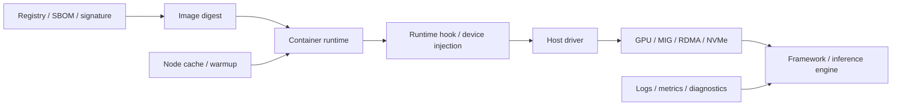

# 第18章：容器与运行时导览

> AI 平台里的容器不是简单“打包个 Python 环境”，而是把镜像、运行时、设备、驱动、制品和排障证据链放到同一条执行路径里治理。

> **关联章节**：本章是第18组容器专题的导览；镜像构建见 [第18a章](./18a-ai-images-and-cuda-compatibility.md)，设备注入与运行时见 [第18b章](./18b-container-runtime-and-device-injection.md)，镜像供应链治理见 [第18c章](./18c-artifact-supply-chain-and-image-governance.md)，运行时排障见 [第18d章](./18d-runtime-troubleshooting.md)。这些内容是理解 [第19章](./19-kubernetes-for-ai.md) 中 Pod、Device Plugin 和 GPU 调度的前置。

## 1. 第一性原理拆解 + 学习大纲

### 拆 — 不可化简的问题

剥离 Docker、containerd、NVIDIA Container Toolkit、Kubernetes Device Plugin、Trivy、cosign 这些名字之后，AI 容器要解决的不可化简问题只有一个：**如何让一段高度依赖 GPU、驱动、动态库和数据制品的软件，在不同节点上以可复现、可隔离、可发布、可回滚、可排障的方式运行起来**。

普通 Web 服务通常可以把运行环境近似看成“镜像内部的事”：应用代码、系统包、语言运行时和端口都在镜像里。AI 工作负载不同。容器内的 PyTorch、CUDA userspace、cuDNN、NCCL、推理引擎和自定义算子，必须和宿主机 Driver、GPU 设备节点、MIG 分区、RDMA/NVMe 设备、runtime hook、权限策略和镜像 registry 形成一致链路。镜像能 build 成功，不代表 GPU 初始化成功；容器能启动，不代表 NCCL 能走 RDMA；漏洞扫描通过，也不代表线上可以快速回滚。

因此第18章拆成四个深挖章节：镜像、运行时、供应链、排障。拆分不是为了堆工具名，而是为了把责任边界说清楚：哪些东西应该固化在镜像里，哪些必须来自宿主机，哪些由运行时注入，哪些由发布系统治理，哪些必须进入故障证据链。

### 推 — 从这个问题如何推导出章节边界

从“跨节点可复现”出发，首先得到镜像问题：基础镜像、CUDA/Driver 兼容矩阵、训练/推理镜像分层、多阶段构建、体积和漏洞治理。这部分放在 18a。

从“隔离进程还要访问硬件”出发，会得到运行时问题：containerd/runc 负责创建容器进程，NVIDIA Container Toolkit 负责把 GPU 设备和必要 userspace 能力暴露进去，平台还要处理 MIG、RDMA、NVMe 等设备注入和权限最小化。这部分放在 18b。

从“生产发布必须可证明和可回滚”出发，会得到供应链问题：镜像不只是 tag，而是 digest、SBOM、签名、漏洞扫描、registry 策略、发布回滚和缓存预热的组合。这部分放在 18c。

从“真实事故通常跨层出现”出发，会得到排障问题：GPU 看不见、库加载失败、Driver/CUDA 不匹配、NCCL/RDMA 容器问题、冷启动慢、节点差异，都不能只在应用日志里找答案。这部分放在 18d。

### 绘 — 容器执行链路



这张图里最重要的不是箭头数量，而是责任边界：镜像固定 userspace；运行时创建进程并挂载设备；宿主机提供 Driver 和真实硬件；供应链系统证明镜像来源；排障系统把这些版本和节点状态收集到一起。

### 导 — 读完本章组你应该能回答

1. 为什么 AI 容器不能只理解为“带 Python 依赖的镜像”？
2. Driver、CUDA userspace、cuDNN、NCCL、PyTorch 和推理引擎之间的兼容关系应该在哪里治理？
3. containerd/runc、NVIDIA Container Toolkit、Device Plugin 分别解决什么问题，又不解决什么问题？
4. 为什么生产发布要使用 digest、签名和 SBOM，而不是只靠 `latest` 或人工命名约定？
5. 训练镜像和推理镜像为什么通常应该拆开？
6. 同一个镜像在不同节点表现不同，应该收集哪些证据？
7. GPU 看不见、库加载失败、NCCL 不通、冷启动慢分别该从哪一层开始排查？

## 2. 本章组阅读路径

| 你当前的问题 | 优先阅读 | 重点产出 |
|------|----------|----------|
| 镜像太大、构建慢、依赖容易坏 | [18a](./18a-ai-images-and-cuda-compatibility.md) | 镜像分层、兼容矩阵、多阶段 Dockerfile |
| 容器里 GPU/MIG/RDMA/NVMe 设备不可用 | [18b](./18b-container-runtime-and-device-injection.md) | 运行时链路、设备注入、权限最小化 |
| 不知道线上镜像从哪里来、能否回滚 | [18c](./18c-artifact-supply-chain-and-image-governance.md) | SBOM、签名、digest、registry、发布策略 |
| 线上容器启动失败或节点差异明显 | [18d](./18d-runtime-troubleshooting.md) | 分层排障 SOP、证据收集、反模式 |

建议顺序是 18a -> 18b -> 18c -> 18d。镜像和运行时是执行路径，供应链是发布路径，排障把两条路径合到同一个证据链里。

## 3. 概念先说清楚：四个边界

| 概念 | 它负责什么 | 它不负责什么 | 常见误解 |
|------|------------|--------------|----------|
| 镜像 | 固定文件系统、userspace 依赖、应用入口 | 不能替代宿主机 Driver 和真实设备 | “镜像里装了 CUDA 就一定能用 GPU” |
| 运行时 | 创建容器进程、namespace/cgroup、挂载设备和文件 | 不保证框架 ABI 兼容 | “Docker 能启动就代表设备可用” |
| 供应链 | 证明镜像来源、内容、版本、漏洞和发布状态 | 不证明业务质量和性能达标 | “扫一次漏洞就等于镜像治理” |
| 排障证据链 | 把 image、runtime、driver、node、device、app 版本串起来 | 不替代预先设计的兼容矩阵 | “看应用日志就够了” |

## 4. 责任边界速记

```text
镜像层：
  OS userspace、CUDA runtime、框架、引擎、应用代码、启动脚本

宿主机层：
  kernel、NVIDIA Driver、GPU 设备、RDMA/NVMe 设备、节点拓扑

运行时层：
  namespace、cgroup、device mounts、runtime hook、capabilities、seccomp

平台治理层：
  registry、digest、SBOM、签名、漏洞扫描、发布、回滚、缓存预热

应用层：
  模型加载、engine 初始化、NCCL 初始化、健康检查、业务指标
```

边界清楚以后，事故定位会快很多。比如 `torch.cuda.is_available()` 为 `False`，不应该先改业务代码，而应该先确认容器是否拿到设备、runtime hook 是否工作、宿主机 Driver 是否可用、镜像 CUDA userspace 是否兼容。

## 5. 快速自测

| 问题 | 如果答不上来，去读 |
|------|--------------------|
| 你的生产推理镜像基于 `base`、`runtime` 还是 `devel`？为什么？ | 18a |
| 宿主机 Driver 支持哪些 CUDA userspace 版本？这个矩阵在哪里维护？ | 18a |
| 容器里的 `/dev/nvidia*`、MIG 设备、RDMA 设备是谁挂进去的？ | 18b |
| 生产 Pod 是否需要 `privileged: true`？如果需要，原因是否被证明确实不可避免？ | 18b |
| 线上部署的是 tag 还是 digest？回滚时是否能定位相同镜像内容？ | 18c |
| 镜像是否有 SBOM、签名、漏洞扫描结果和发布审批记录？ | 18c |
| 同一个镜像在 A 节点成功、B 节点失败时，你会收集哪些命令输出？ | 18d |
| 冷启动慢是镜像拉取、模型下载、engine build、GPU warmup 还是健康检查策略导致的？ | 18d |

## 6. 本章组小结

| 深挖章节 | 核心问题 | 工程产物 |
|------|----------|----------|
| 18a 镜像与 CUDA 兼容 | 怎么构建可复现、可运行、不过度臃肿的 AI 镜像 | 基础镜像策略、兼容矩阵、Dockerfile 模板 |
| 18b 运行时与设备注入 | 容器如何在隔离下访问 GPU/MIG/RDMA/NVMe | runtime 配置、设备挂载策略、权限基线 |
| 18c 供应链与治理 | 镜像如何被证明、发布、回滚和预热 | SBOM、签名、扫描、digest 发布、缓存策略 |
| 18d 运行时排障 | 出问题时如何按层缩小范围 | SOP、诊断命令、节点差异对比表 |

## 练习题

1. 画出你所在平台从镜像构建到 Pod 启动再到 GPU 初始化的完整链路，并标出每一层负责人。
2. 给一个“镜像能启动但 GPU 不可用”的事故，列出最少 8 个必须收集的证据。
3. 解释为什么 `image: repo/app:latest` 不适合作为生产发布记录。
4. 设计一个最小的 AI 容器支持矩阵，至少包含 Driver、CUDA、框架、GPU 型号和基础镜像。
