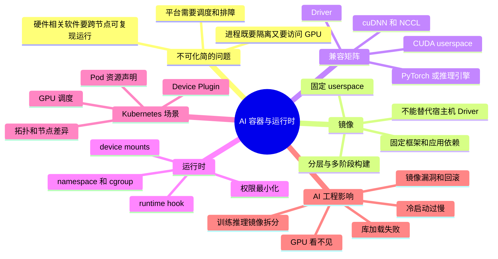

# 第18章：容器与运行时

> AI 平台里的容器不是简单“打包个 Python 环境”，而是把驱动兼容、框架依赖、设备访问和可复现执行一起封装起来。

> **关联章节**：本章解释“镜像 -> 运行时 -> 设备 -> 驱动”的执行路径，是理解 [第19章](./19-kubernetes-for-ai.md) 中 Pod、Device Plugin 和 GPU 调度的前置。

## 1. 第一性原理拆解：为什么 AI 容器必须同时管理软件、设备与宿主机

### 拆 — 不可化简的问题

先把 Docker、containerd、Kubernetes、CUDA 镜像、NVIDIA Container Toolkit 这些名字都拿掉，AI 平台里的容器要解决的不可化简问题只有一个：**如何让一段高度依赖硬件的软件，在不同机器上以可复现、可隔离、可调度、可排障的方式运行起来**。普通 Web 服务通常只需要把应用代码、系统包和网络端口封进镜像；它对宿主机硬件的要求相对弱，只要 CPU 指令集、Linux ABI 和少量系统库可用，就能把运行环境近似看成“镜像内部的事”。AI 工作负载不同。一个训练或推理进程能不能跑，取决于容器内的框架二进制、CUDA userspace、cuDNN、NCCL、推理引擎、模型文件、宿主机 Driver、GPU 设备节点、MIG 切分、RDMA/NVMe 设备、权限策略和启动预热路径是否形成一条一致的链路。也就是说，AI 容器不是简单“打包个 Python 环境”，而是把驱动兼容、框架依赖、设备访问和可复现执行一起封装起来。

这个问题不能再被简化成“镜像里装哪些包”。镜像只是静态文件系统快照，不能替代宿主机 Driver；运行时只是把进程放进 namespace/cgroup 并挂载设备，不能替代框架 ABI 兼容；Device Plugin 只是 Kubernetes 里的资源声明和分配接口，不能保证容器内库版本正确；安全扫描只能降低供应链风险，不能证明 GPU 初始化会成功。平台工程师真正要掌握的是边界：哪些东西应该固定在镜像里，哪些东西必须来自宿主机，哪些东西由运行时注入，哪些东西由编排系统声明，哪些东西必须进入版本矩阵和排障信息。边界不清时，常见结果是“build 成功但运行失败”“A 节点能用 B 节点不可用”“训练镜像拿去推理导致冷启动过慢”“为了调通 GPU 给了过大的宿主机权限”。

### 推 — 从这个问题如何推导出每个机制

从“同一应用要跨节点稳定运行”出发，首先必然需要镜像。镜像把 OS userspace、Python 包、框架、服务入口和部分模型侧工具链固定下来，减少“今天机器上有什么包”的随机性。但 AI 应用依赖 GPU，GPU Driver 位于宿主机内核和驱动栈中，不能被普通容器镜像完整携带，因此又必然需要一条“容器内 CUDA userspace 与宿主机 Driver 兼容”的规则。这个规则推导出基础镜像选择、CUDA 版本矩阵、框架版本矩阵，以及“新 Driver 通常向前兼容旧 CUDA userspace，反过来通常不成立”的工程判断。

镜像固定了文件系统，还不够。进程要访问 GPU、MIG、RDMA 或 NVMe，就必须把设备节点、动态库和权限以受控方式暴露给容器，于是运行时层出现了 device mounts、runtime hook 和 NVIDIA Container Toolkit 这类机制。运行时如果没有正确注入设备，容器里的 `torch.cuda.is_available()` 可能失败；如果权限放得过宽，排障看似方便，却扩大了逃逸和误操作影响面。再往上，一旦进入 Kubernetes，平台需要把“这类 Pod 需要几张 GPU、哪种 GPU、是否需要拓扑亲和”变成调度可理解的资源，于是 Device Plugin 和调度链路出现。它们解决的是编排系统如何发现和分配设备，而不是替代底层驱动兼容。

从“训练和推理的目标不同”继续推导，会得到镜像分层和镜像拆分。训练镜像通常需要编译扩展、profiling、debug、数据处理和实验工具，体积大但交互能力强；推理镜像更关心启动速度、漏洞面、依赖最小化和与推理引擎的强绑定。因此多阶段构建成为自然选择：builder 层保留 `nvcc`、头文件和编译缓存，final 层只保留运行产物。最后，从“平台要能定位失败”推导出治理机制：镜像版本、Driver 版本、CUDA 版本、框架版本、节点类型、设备拓扑和启动日志必须一起进入观测与发布流程；否则故障会被误归因到应用代码，而真正的问题可能在 runtime hook、基础镜像、宿主机 Driver 或节点缓存。

### 绘 — 因果链路



### 导 — 读完本章你应该能回答

1. 为什么 AI 容器不能只理解为“带 Python 依赖的镜像”，而必须同时看镜像、运行时、设备和宿主机 Driver？
2. 当容器能启动但 GPU 不可用时，如何按“镜像 -> 运行时 -> 设备挂载 -> Driver -> 应用初始化”的链路缩小问题范围？
3. 为什么宿主机 Driver 和容器内 CUDA userspace 的兼容关系应该进入平台支持矩阵，而不是交给每个项目临时试错？
4. 训练镜像和推理镜像的目标函数分别是什么，为什么长期共用一套镜像会带来冷启动、安全和运维边界问题？
5. 多阶段构建在 AI 镜像中具体切开了哪些东西，哪些内容应该留在 builder 层，哪些内容应该进入 final 层？
6. 在 Kubernetes 场景下，Device Plugin 解决了什么问题，又不解决哪些镜像和驱动兼容问题？
7. 如果同一个镜像在不同节点表现不同，你会收集哪些版本、拓扑、运行时和节点缓存信息来建立排障证据链？

## 学习目标

完成本章学习后，你将能够：

1. 理解 AI 容器镜像与普通服务镜像的差异
2. 区分驱动、运行时、设备插件和镜像依赖各自的职责
3. 设计训练镜像和推理镜像的分层策略
4. 识别镜像和运行时层面的典型兼容性故障
5. 理解为什么运行时选择会直接影响启动、调度和排障体验

---

## 正文内容

### 18.1 AI 容器为什么更复杂

普通 Web 服务镜像通常主要关心：

- 应用代码
- 系统依赖
- Web 框架

AI 容器则往往还要携带：

- 深度学习框架版本
- CUDA / cuDNN / NCCL 兼容关系
- 推理引擎依赖
- 数据处理工具链
- 调试、profiling 或 graph 编译能力

这导致 AI 镜像更大、更复杂，也更容易出现兼容性问题。

### 18.2 一条从镜像到 GPU 的运行路径

可以把运行过程看成：

```text
image
  -> container runtime
  -> device mounts / NVIDIA container toolkit
  -> host driver
  -> GPU device access
```

任何一层不匹配，都可能表现为：

- 容器起不来
- GPU 看不见
- 库加载失败
- 运行时报错

如果是在 Kubernetes 里，这条链路还会再包上一层 `device plugin + 调度 + runtime hook`。也就是说，`device plugin` 是 K8s 场景下的编排接口，不是所有容器运行环境都天然存在的一跳。

这条路径到了 Kubernetes 里，会被包装成 Pod、runtime hook、device plugin 和宿主机驱动的组合链路（详见 [第19章](./19-kubernetes-for-ai.md) §19.5）。

### 18.3 训练镜像和推理镜像为什么最好分开

### 训练镜像更看重

- 工具链完整
- 调试能力
- 数据处理依赖
- 编译扩展能力

### 推理镜像更看重

- 体积小
- 启动快
- 攻击面小
- 与推理引擎强兼容

如果长期共用一套镜像，通常会带来：

- 镜像臃肿
- 冷启动变慢
- 安全面扩大
- 运维边界模糊

### 18.4 一个镜像分层示例

```text
base-os
  -> cuda-runtime
    -> framework-runtime
      -> team-common-libs
        -> project-app
```

这样分层的好处：

- 底层更稳定
- 缓存更好复用
- 团队共用依赖更容易维护
- 项目变更不会影响基础 GPU 运行层

#### 18.4.1 CUDA 基础镜像选择指南

为什么这里要单独讲基础镜像？因为 AI 镜像里最常见的“能 build、不能跑”问题，往往不是 Python 包，而是 CUDA userspace、框架二进制和宿主机 Driver 的组合关系。

| `nvidia/cuda` 类型 | 适合放什么 | 不适合放什么 | 常见场景 |
|------|-----------|--------------|----------|
| `base` | 最小 CUDA userspace 基线、少量自定义运行库 | 直接承载需要完整 CUDA runtime 的训练 / 推理框架 | 自建极简基础层 |
| `runtime` | CUDA runtime 动态库、框架运行时、推理服务 | 需要 `nvcc`、头文件和静态库的编译步骤 | 推理镜像、纯运行训练镜像 |
| `devel` | `runtime` + `nvcc` + 头文件 + 编译工具链 | 直接作为生产最终镜像长期运行 | 编译自定义算子、多阶段构建的 builder 层 |

驱动兼容可以先记一条工程规则：**宿主机 Driver 必须满足容器内 CUDA 版本要求；新 Driver 往往能向前兼容旧 CUDA userspace，反过来通常不成立。** 平台如果不维护“Driver 版本 + CUDA 版本 + 框架版本”的支持矩阵，排障会迅速变成黑箱。

| 常见踩坑点 | 典型表现 | 更稳妥的做法 |
|------|----------|--------------|
| 宿主机 Driver 偏旧 | 容器能起但框架初始化 GPU 失败 | 先以 Driver 为基线维护受支持 CUDA 列表 |
| 运行镜像里临时编译扩展 | 启动时缺 `nvcc`、头文件或编译耗时过长 | 编译放到 `devel` builder 阶段，最终镜像只保留产物 |
| 生产直接用 `devel` 镜像 | 体积过大、漏洞面扩大、冷启动更慢 | 最终层落到 `runtime` 或更小的自定义基线 |

#### 18.4.2 多阶段构建最佳实践

为什么 AI 镜像尤其适合多阶段构建？因为训练和推理经常都需要“编译时很重、运行时很轻”的二段式结构。把编译工具链留在 builder 层，能同时减小镜像体积和攻击面。

| 镜像类型 | builder 层重点 | final 层重点 |
|------|----------------|-------------|
| 训练镜像 | 编译自定义算子、安装 profiling / debug 依赖 | 保留训练运行时和必要工具，但去掉无关构建缓存 |
| 推理镜像 | 预编译 wheel、engine、Tokenizer 资源 | 只保留推理引擎、模型服务入口和最小运行依赖 |

```dockerfile
FROM nvidia/cuda:12.4.1-devel-ubuntu22.04 AS builder
WORKDIR /build
COPY requirements.txt .
RUN pip install --prefix=/opt/venv -r requirements.txt
COPY . .
RUN python setup.py bdist_wheel

FROM nvidia/cuda:12.4.1-runtime-ubuntu22.04
WORKDIR /app
COPY --from=builder /opt/venv /opt/venv
COPY --from=builder /build/dist/*.whl /tmp/
RUN pip install /tmp/*.whl && rm -rf /tmp/*.whl
COPY serve.py .
USER 10001
CMD ["python", "serve.py"]
```

这个示例表达的不是固定写法，而是固定边界：**编译、下载、缓存清理放前一层；最终层只留下运行必需品。**

### 18.5 运行时层的关键关注点

### 设备发现

容器是否真的能看到 GPU、MIG、RDMA、NVMe 等设备。

### 权限与安全

容器是否被授予过多宿主机能力。

### 启动与预热

推理服务是否能在合理时间内完成：

- 模型加载
- 显存预热
- graph capture 或 engine 初始化

### 可观测性

容器日志、指标、trace 是否能被平台统一采集。

#### 18.5.1 镜像安全

镜像安全不是“上线前扫一次漏洞”这么简单。对 AI 平台来说，更重要的是把镜像治理接到发布默认流程里。

| 安全动作 | 目的 | 平台侧最小要求 |
|------|------|----------------|
| 镜像签名 | 确认镜像来源和发布责任 | 关键镜像发布后签名，部署前校验 |
| 漏洞扫描 | 提前暴露高危系统包和基础镜像问题 | 基线镜像进入仓库前执行扫描 |
| 非 root 运行 | 降低逃逸和误操作影响面 | 默认使用非 root UID，按需最小化能力 |

### 18.6 典型故障模式

### 故障一：镜像能起，但 GPU 不可用

可能原因：

- 运行时未正确挂载设备
- 宿主机驱动与镜像 runtime 不兼容
- 设备插件配置错误

### 故障二：训练正常，推理镜像却启动很慢

可能原因：

- 镜像过大
- 模型拉取和引擎初始化太重
- 共用了不必要的训练依赖

### 故障三：同一个镜像在不同节点表现不同

可能原因：

- 驱动差异
- 设备拓扑差异
- 节点本地缓存差异

### 18.7 工程建议

- 维护官方支持的镜像矩阵，而不是让每个项目自由组合
- 训练和推理镜像分开治理
- 把镜像版本、驱动版本、框架版本一起纳入排障信息
- 对关键镜像做漏洞扫描、签名和回滚管理

### 本章涉及的常见工具

| 概念 | 常见工具 / 命令 | 备注 |
|------|-----------------|------|
| GPU 容器运行时 | NVIDIA Container Toolkit、`nvidia-smi` | 验证容器是否真实看到 GPU |
| 多阶段构建 | Docker BuildKit、`docker buildx build` | 适合把 builder 层和 final 层拆开 |
| 漏洞扫描 | Trivy、`trivy image <image>` | 常用于镜像基线扫描 |
| 镜像签名 | cosign、`cosign sign` / `cosign verify` | 适合把镜像来源校验接入发布链路 |

---

## 本章小结

| 层 | 主要问题 |
|----|----------|
| 镜像 | 依赖、体积、分层、漏洞 |
| 运行时 | 设备挂载、权限、隔离 |
| 宿主机 | 驱动、拓扑、硬件差异 |
| 应用层 | 模型加载、预热、观测、排障 |

---

## 练习题

1. 为什么训练镜像和推理镜像的优化目标不同？
2. 容器能启动但 GPU 不可用时，你会从哪几层排查？
3. 请设计一个 AI 镜像的最小分层结构。
4. 为什么 AI 镜像治理必须和宿主机驱动治理一起看？
