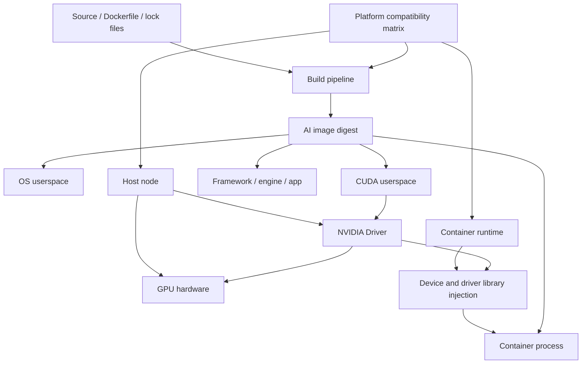
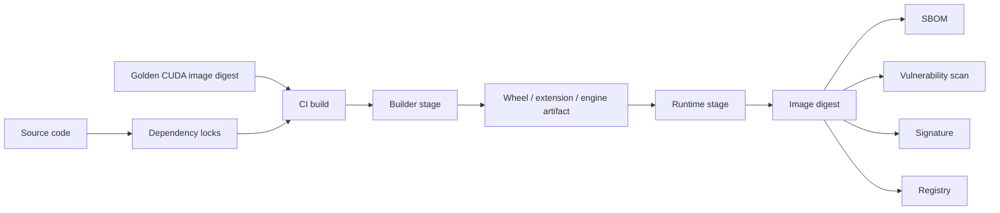
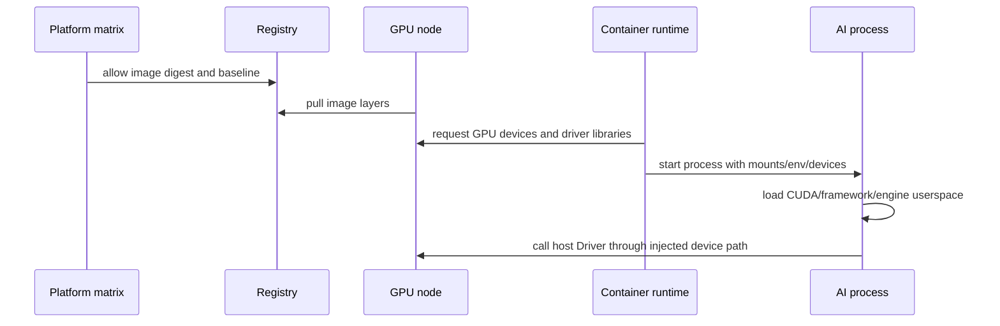

# 第18a章：AI 镜像与 CUDA 兼容矩阵

> AI 镜像的核心不是“能 build 出来”，而是把 CUDA userspace、深度学习框架、推理引擎、应用依赖、模型运行约束和宿主机 Driver 的兼容关系固化成可复现、可发布、可审计、可回滚的平台基线。

> **关联章节**：本章承接 [第18章](./18-containers-and-runtime.md) 的镜像边界；运行时设备注入见 [第18b章](./18b-container-runtime-and-device-injection.md)，镜像签名、SBOM 与发布治理见 [第18c章](./18c-artifact-supply-chain-and-image-governance.md)，故障排查见 [第18d章](./18d-runtime-troubleshooting.md)。

## 18a.1 第一性原理拆解 + 学习大纲

### 拆：AI 镜像到底在解决什么问题

AI 镜像要解决的不可化简问题是：

**把一个依赖 GPU 的软件栈变成可重复拉取、可重复运行、可审计、可回滚的文件系统快照，同时不把宿主机 Driver 这类应该由节点提供的能力错误地封进镜像。**

普通 Web 服务镜像通常只需要 OS userspace、语言运行时、应用包和配置。AI 镜像更复杂，因为一次训练或推理会同时依赖：

| 层 | 典型内容 | 错误后果 |
|---|---|---|
| OS userspace | glibc、libstdc++、openssl、python、system package | Python wheel 加载失败、TLS/证书问题、CVE 扫描噪音 |
| CUDA userspace | libcudart、cuBLAS、cuDNN、NCCL、CUDA compatibility libraries | CUDA 初始化失败、算子性能异常、通信失败 |
| 框架 | PyTorch、JAX、TensorFlow、DeepSpeed、Megatron | wheel ABI 不匹配、自定义算子 import 失败 |
| 推理引擎 | vLLM、TensorRT-LLM、SGLang、TGI、Triton Inference Server | engine 构建失败、kernel 不支持、冷启动过慢 |
| 自定义扩展 | FlashAttention、xFormers、自研 CUDA op、Triton kernel | 编译架构不对、运行节点不可用 |
| 应用层 | tokenizer、serve entrypoint、health check、配置模板 | 启动失败、探针误杀、回滚不可复现 |
| 模型相关制品 | engine plan、tokenizer files、adapter、model config | 权重和运行环境错配、启动时重复构建 |

真正驱动 GPU 的 NVIDIA Driver 在宿主机上，包括内核模块和一部分驱动相关 userspace 能力。容器镜像中通常不应该安装或升级宿主机 Driver。容器里放的是 CUDA userspace、框架和应用。运行时再把必要的设备节点和驱动库注入进容器。这个边界一旦混乱，就会出现“镜像能构建、容器能启动、业务一碰 CUDA 就失败”的典型事故。

第一原则可以写成一句话：

**镜像锁定 userspace，节点锁定 Driver，平台锁定兼容矩阵，运行时负责设备与驱动能力注入。**

### 推：为什么会有这些工程机制

从上面的第一原则可以推导出本章所有机制：

| 需求 | 推导出的机制 |
|---|---|
| userspace 要可复现 | 使用基础镜像、锁依赖、固定 digest、生成 SBOM |
| Driver 不进镜像 | 维护 Driver/CUDA 兼容矩阵，由节点池提供 Driver |
| 编译和运行目标不同 | 使用 `devel` 构建、`runtime` 运行，多阶段构建 |
| 训练和推理目标不同 | 拆分训练镜像、推理镜像、debug 镜像 |
| 扩展 ABI 脆弱 | 固定 Python、CUDA、torch、GPU arch、编译参数 |
| 镜像体积影响启动 | 分层复用、裁剪依赖、预构建 wheel/engine、节点预热 |
| 漏洞和许可证要治理 | 扫描、豁免、基础镜像生命周期、发布门禁 |
| 多团队共享平台 | golden image、版本矩阵、准入规则、弃用窗口 |

### 绘：镜像、Driver、运行时三者关系



这张图的关键是责任边界：

- 镜像负责应用可执行文件和 CUDA userspace。
- 宿主机负责 Driver 和硬件健康。
- 运行时负责把设备和驱动能力以受控方式暴露给容器。
- 平台矩阵负责定义哪些组合允许进入生产。

### 导：本章学习大纲

读完本章，你应该能回答：

1. AI 镜像与普通服务镜像的本质差异是什么？
2. `nvidia/cuda` 的 `base`、`runtime`、`devel` 分别包含什么，适合什么阶段？
3. 为什么 CUDA userspace 版本必须和宿主机 Driver 版本一起管理？
4. PyTorch、cuDNN、NCCL、TensorRT-LLM、vLLM 这类组件如何进入版本矩阵？
5. 训练镜像、推理镜像、builder 镜像、debug 镜像为什么不应该长期混用？
6. 多阶段构建应该如何切分编译依赖、运行依赖、模型制品和应用代码？
7. 镜像体积、漏洞治理、冷启动、缓存命中率之间如何权衡？
8. 如何设计一个可执行的 AI 镜像基线和发布门禁？
9. GPU 初始化失败时，如何判断是镜像问题、Driver 问题还是运行时注入问题？

## 18a.2 概念先说清楚

### AI 镜像是什么

AI 镜像是一个包含 AI 工作负载运行所需 userspace 依赖的容器镜像。它通常包括：

- Linux 发行版 userspace。
- Python 或其他语言运行时。
- CUDA runtime 相关库。
- 深度学习框架。
- 通信、算子、推理引擎依赖。
- 应用服务代码、entrypoint、健康检查。
- 可选的预编译 wheel、kernel cache、engine plan 或轻量模型配置。

AI 镜像的目标是让运行环境可复制。它不是 GPU 本身，也不是节点 Driver，也不是 Kubernetes 调度策略。

### AI 镜像不是什么

| 容易混淆的对象 | 为什么不是 AI 镜像的职责 |
|---|---|
| NVIDIA Driver 生命周期 | Driver 应由节点镜像、驱动安装器或 GPU Operator 管理 |
| GPU 分配 | 由编排系统、Device Plugin、调度器和运行时完成 |
| 多机网络 fabric | 由节点、NIC、CNI、RDMA 配置、网络团队和平台基线管理 |
| 模型注册表 | 镜像可引用模型制品，但模型版本和血缘应由模型仓库管理 |
| 全部安全治理 | 镜像扫描是安全治理输入，不等于运行时隔离、身份、网络策略 |

### 与相邻概念的边界

| 概念 | 定义 | 与 AI 镜像的边界 |
|---|---|---|
| 基础镜像 | 构建上层镜像的起点，提供 OS 和 CUDA userspace 基线 | AI 镜像继承它，但还要加入框架和应用 |
| golden image | 平台验证过并承诺支持的内部基础镜像 | 不是业务镜像，而是业务镜像的标准底座 |
| Driver | 宿主机内核态驱动和配套组件 | 不应靠业务镜像安装或升级 |
| CUDA toolkit | nvcc、头文件、库和工具集合 | builder 阶段可能需要，runtime 阶段通常不需要完整 toolkit |
| CUDA runtime | 运行 CUDA 程序所需动态库 | 推理和训练运行镜像通常需要 |
| cuDNN | 深度学习算子库 | 通常随框架或基础镜像进入，需要和框架/CUDA 对齐 |
| NCCL | GPU 集合通信库 | 多卡、多机训练和部分推理场景需要重点验证 |
| 推理 engine | TensorRT engine、TensorRT-LLM 构建产物等 | 可放镜像或外置缓存，但必须记录生成环境 |
| SBOM | 镜像软件物料清单 | 用于审计和漏洞影响分析，不改变镜像本身 |

### 一条实用心智模型

可以把 AI 镜像想成“GPU userspace 合同”：

```text
镜像承诺：我包含这些 CUDA/框架/应用 userspace。
节点承诺：我提供满足矩阵要求的 Driver、GPU、拓扑和设备健康。
运行时承诺：我把被分配的设备和必要驱动库注入容器。
平台承诺：这些组合经过验证，超出矩阵默认不支持。
```

## 18a.3 架构：关键组件、数据路径与责任边界

### 关键组件

| 组件 | 责任 | 常见拥有者 |
|---|---|---|
| Dockerfile / build config | 描述镜像如何构建 | 应用团队、平台团队 |
| 基础镜像 registry | 提供 `base`、`runtime`、`devel` 或内部 golden image | 平台团队 |
| 依赖锁文件 | 固定 Python/system/engine 版本 | 应用团队 |
| CI builder | 构建镜像、生成 SBOM、扫描、签名 | 平台团队 |
| 兼容矩阵 | 定义 Driver/CUDA/框架/引擎/GPU 组合 | 平台团队、训练/推理框架团队 |
| 镜像 registry | 存储和分发镜像层 | 平台团队 |
| 节点池 | 提供 Driver、GPU、运行时、缓存 | 基础设施团队 |
| 发布系统 | 选择 digest、灰度、回滚、记录证据 | 平台团队、SRE |

### 构建时数据路径



构建路径里最重要的原则是：编译结果可以进入最终镜像，编译环境不应该无条件进入最终镜像。

### 运行时数据路径



### 责任边界

| 问题 | 首要归属 | 说明 |
|---|---|---|
| `torch` wheel 与 CUDA 不匹配 | 镜像/矩阵 | 由镜像构建和依赖锁控制 |
| 宿主机 Driver 太旧 | 节点基线 | 镜像不能修复旧 Driver |
| `/dev/nvidia0` 不存在 | 运行时注入/资源分配 | 先查 18b 的 runtime path |
| NCCL 版本与框架冲突 | 镜像/矩阵 | 需要在基线测试中覆盖 |
| 镜像拉取 8 分钟 | 镜像工程/registry/cache | 与体积、层复用、预热相关 |
| CVE 来自编译工具链 | 镜像分层 | 多阶段构建应移除编译工具 |

## 18a.4 原理：CUDA/Driver 兼容为什么存在

### 内核态 Driver 与 userspace CUDA 的分工

GPU 程序不是直接“访问显卡”。它大致经过这些层：

```text
PyTorch / TensorRT / custom op
  -> CUDA runtime / CUDA driver API / cuDNN / cuBLAS / NCCL
  -> libcuda.so and driver userspace interface
  -> NVIDIA kernel driver
  -> GPU hardware
```

镜像里通常包含上半部分的 userspace 库。宿主机提供下半部分的 Driver 和硬件。CUDA userspace 会调用 Driver 提供的接口。如果 userspace 需要的 Driver 能力比宿主机 Driver 新，就会失败。

这就是为什么“镜像 CUDA 版本”和“宿主机 Driver 版本”必须一起看。只看镜像 tag 或只看 `nvidia-smi` 都不够。

### 向后兼容的直觉

工程上可以先记住一条粗规则：

**较新的 NVIDIA Driver 通常能运行较旧的 CUDA userspace；较旧的 Driver 通常不能运行需要更新 Driver 的 CUDA userspace。**

但这只是方向，不是发布依据。生产平台必须以 NVIDIA、框架、推理引擎的 release note 和内部验证结果为准，把可用组合固化成矩阵。

### 为什么 PyTorch wheel 也进入矩阵

PyTorch、JAX、TensorFlow 的 GPU wheel 不是普通 Python 包。它们通常绑定特定 CUDA 版本、cuDNN/NCCL 版本和编译 ABI。自定义 CUDA extension 又绑定：

- Python minor version。
- PyTorch ABI。
- CUDA toolkit 版本。
- GPU compute capability。
- 编译器和 libstdc++。
- 是否使用特定 kernel 或 Triton 版本。

所以不能把 `pip install torch` 当成普通业务依赖处理。AI 镜像要记录并验证框架 wheel 来源、CUDA 变体、NCCL/cuDNN 版本和扩展构建环境。

### 为什么推理引擎更脆弱

推理引擎通常会更强地绑定底层能力：

| 引擎/组件 | 常见绑定点 |
|---|---|
| TensorRT | CUDA、cuDNN、GPU 架构、plugin ABI、engine plan 生成版本 |
| TensorRT-LLM | TensorRT、CUDA、NCCL、MPI/通信库、GPU 架构 |
| vLLM | PyTorch、CUDA、Triton、FlashAttention、GPU capability |
| SGLang | PyTorch/CUDA、后端 kernel、scheduler/runtime 约束 |
| Triton Inference Server | backend 版本、CUDA/TensorRT backend、模型仓库格式 |

训练镜像经常以“能跑脚本”为验收，推理镜像必须以“固定模型、固定 engine、固定并发、固定启动路径、固定健康检查”为验收。

## 18a.5 `nvidia/cuda` 基础镜像：base/runtime/devel

NVIDIA CUDA 镜像常见分层是 `base`、`runtime`、`devel`。不要只看名字，要看它们的责任。

| 镜像类型 | 通常包含 | 适合场景 | 不适合场景 |
|---|---|---|---|
| `base` | 最小 CUDA userspace 基础组件 | 自己精确安装所需 CUDA 库、极简服务 | 直接运行复杂 PyTorch/vLLM 服务 |
| `runtime` | CUDA runtime 动态库和常见运行依赖 | 生产推理、训练运行层、已预编译 wheel 的运行环境 | 编译 CUDA extension、构建 TensorRT plugin |
| `devel` | `runtime` + nvcc + headers + 开发工具链 | builder 阶段、开发调试、编译自定义算子 | 生产最终镜像长期运行 |
| 框架官方镜像 | CUDA + PyTorch/JAX/TensorFlow 预装 | 快速实验、上游组合验证 | 严格安全基线、内部治理、体积控制 |
| 推理引擎官方镜像 | 引擎和 backend 预装 | PoC、对齐官方示例 | 多团队统一平台和精简生产镜像 |
| 内部 golden image | OS、CUDA、基础安全策略、镜像标签规范 | 生产基线、多团队复用 | 没有维护 SLA 的临时实验 |

选择顺序应该是：

1. 目标 GPU 和节点 Driver。
2. 框架或推理引擎支持范围。
3. CUDA userspace 版本。
4. 是否需要编译 CUDA extension。
5. OS 发行版和 glibc/libstdc++ 要求。
6. 体积、安全、冷启动和运维治理要求。

不要从“最新版 CUDA”开始选。最新版经常意味着更高 Driver 要求、更少第三方 wheel 支持、更长验证周期。

## 18a.6 版本矩阵：从文档表格变成发布控制面

### 最小矩阵字段

一个可运营的平台至少维护下面这些字段：

| 字段 | 示例 | 为什么必须记录 |
|---|---|---|
| 平台基线名 | `cuda12.4-pytorch2.4-runtime` | 供人沟通和策略引用 |
| 基础镜像 digest | `registry/ai/cuda@sha256:...` | 防止 tag 漂移 |
| OS 发行版 | Ubuntu 22.04 | 决定 glibc、包管理和 CVE 基线 |
| GPU 型号 | A100、H100、L40S | 决定 compute capability、MIG、FP8 等能力 |
| Driver 最低版本 | `>= 550.xx` | 决定 CUDA userspace 能否运行 |
| CUDA userspace | 12.4 | 框架和扩展 ABI 基线 |
| cuDNN | 9.x | 算子库兼容和性能 |
| NCCL | 2.x | 多卡/多机通信 |
| Python | 3.10/3.11 | wheel ABI |
| 框架 | PyTorch 2.4.x | 应用和 extension 兼容 |
| 推理引擎 | vLLM/TensorRT-LLM/SGLang 版本 | 推理路径兼容 |
| 支持状态 | canary/supported/deprecated/blocked | 发布门禁 |
| 支持到期日 | `2026-09-30` | 迁移计划 |
| 验证套件 | smoke/perf/regression 链接 | 证明不是只写文档 |

### 矩阵示例

下面是示意矩阵，具体版本应以组织内部验证和上游 release note 为准。

| 基线 | Driver 要求 | CUDA | 框架/引擎 | 适用场景 | 状态 |
|---|---:|---:|---|---|---|
| `ai-cu11.8-legacy` | 520+ | 11.8 | PyTorch 2.0/2.1、老扩展 | 存量训练和老模型服务 | deprecated |
| `ai-cu12.1-stable` | 535+ | 12.1 | PyTorch 2.2/2.3、vLLM 稳定线 | 常规训练和稳定推理 | supported |
| `ai-cu12.4-current` | 550+ | 12.4 | PyTorch 2.4/2.5、TensorRT-LLM 验证线 | 新 GPU、新推理优化 | supported/canary |
| `ai-cu12.x-experimental` | 按节点池 | 12.x | nightly wheel、自研 kernel | 性能实验 | blocked for prod |

### 矩阵如何落到工程系统

矩阵不能只存在 Wiki 里。它至少要影响这些环节：

| 环节 | 矩阵动作 |
|---|---|
| 镜像构建 | 只允许从矩阵内基础镜像构建生产镜像 |
| CI 测试 | 自动读取基线，运行 CUDA/framework/NCCL smoke test |
| 发布门禁 | 不在矩阵内的 digest 默认阻断 |
| 节点准入 | 节点 Driver、GPU、runtime 版本必须打标签并校验 |
| 调度策略 | 工作负载声明所需基线，调度到匹配节点池 |
| 漏洞治理 | 按基线更新基础镜像，通知下游重建 |
| 弃用迁移 | deprecated 基线设期限，超过期限阻断新发布 |

## 18a.7 训练镜像与推理镜像分层

### 训练镜像的目标函数

训练镜像重视“实验和分布式训练能力完整”：

- 支持编译或加载自定义 CUDA extension。
- 包含 DeepSpeed、Megatron、FSDP、数据处理工具。
- 包含 NCCL tests、profiling、debug 工具。
- 支持 checkpoint、对象存储、数据集读取。
- 支持多机启动器和作业调度入口。

训练镜像可以比推理镜像大，但不能无限膨胀。训练集群也会受镜像拉取、CVE 和依赖冲突影响。

### 推理镜像的目标函数

推理镜像重视“稳定、快、可回滚、攻击面小”：

- 只保留服务运行必要依赖。
- 不在启动路径安装依赖或编译核心产物。
- 入口、健康检查、metrics 和日志路径固定。
- 与模型格式、engine plan、tokenizer、adapter 版本绑定。
- 冷启动时间可拆解、可观测、可优化。

### 分层建议

```text
OS + security baseline
  -> CUDA runtime baseline
  -> framework or inference engine baseline
  -> prebuilt wheels / kernels / engine plugins
  -> application code
  -> small config defaults
```

训练和推理可以共用底层 golden image，但不应该共用上层工具集合。

| 维度 | 训练镜像 | 推理镜像 |
|---|---|---|
| 依赖范围 | 宽，含训练框架、数据工具、debug 工具 | 窄，只含服务运行路径 |
| 编译能力 | 可以在 builder 或开发镜像中保留 | 生产最终镜像通常不保留 |
| 体积容忍度 | 中等偏高 | 低 |
| 漏洞容忍 | 仍需治理 | 更严格 |
| 启动路径 | 作业启动、分布式 launcher、checkpoint resume | 服务启动、模型加载、warmup、health check |
| 变更频率 | 随实验较快 | 跟发布节奏和回滚策略 |
| 验收 | 训练 smoke、NCCL、checkpoint | SLA、冷启动、吞吐、延迟、回滚 |

长期共用一个“大而全”镜像的后果通常是：

- 推理服务背着训练工具上线。
- 漏洞报告里充满生产不用的软件包。
- 节点扩容时拉取巨大镜像。
- 镜像缓存命中变差。
- 任何依赖升级都可能影响训练和推理两条链路。
- 排障时无法判断某个库到底是否属于运行路径。

## 18a.8 多阶段构建：把编译环境和运行环境切开

### 基本模式

```dockerfile
FROM nvidia/cuda:12.4.1-devel-ubuntu22.04 AS builder

WORKDIR /src
ENV PIP_NO_CACHE_DIR=1

RUN apt-get update && apt-get install -y --no-install-recommends \
    python3 python3-pip python3-dev build-essential git ca-certificates \
    && rm -rf /var/lib/apt/lists/*

COPY requirements-build.txt .
RUN python3 -m pip install --upgrade pip && \
    python3 -m pip install -r requirements-build.txt

COPY . .
RUN python3 -m build --wheel

FROM nvidia/cuda:12.4.1-runtime-ubuntu22.04 AS runtime

WORKDIR /app
ENV PIP_NO_CACHE_DIR=1 \
    PYTHONDONTWRITEBYTECODE=1 \
    PYTHONUNBUFFERED=1

RUN apt-get update && apt-get install -y --no-install-recommends \
    python3 python3-pip ca-certificates \
    && rm -rf /var/lib/apt/lists/*

COPY requirements-runtime.txt .
RUN python3 -m pip install --upgrade pip && \
    python3 -m pip install -r requirements-runtime.txt

COPY --from=builder /src/dist/*.whl /tmp/
RUN python3 -m pip install /tmp/*.whl && rm -rf /tmp/*.whl

COPY serve.py .

RUN useradd --create-home --uid 10001 appuser
USER 10001

CMD ["python3", "serve.py"]
```

这个例子的重点不是具体包名，而是边界：

- `builder` 可以有 nvcc、头文件、编译器、git、源码和缓存。
- `runtime` 只保留运行所需库、wheel、服务入口。
- 最终镜像不应该依赖 build cache。
- 生产默认非 root。
- apt 缓存和 pip 缓存在同一层清理。

### AI 镜像多阶段构建的常见切分

| 阶段 | 内容 | 产出 | 是否进入最终镜像 |
|---|---|---|---|
| `base` | OS、证书、用户、安全基线 | 可复用底层 | 是 |
| `cuda-runtime` | CUDA runtime、cuDNN/NCCL | 运行库 | 是 |
| `builder` | nvcc、headers、compiler、source | wheel、plugin、engine | 否，只复制产物 |
| `test` | smoke test、单元测试、NCCL test | 测试报告 | 否 |
| `runtime` | 运行依赖、应用、entrypoint | 生产镜像 | 是 |
| `debug` | gdb、nsys、curl、vim、shell 工具 | 调试镜像 | 单独发布，不作为默认生产镜像 |

### 自定义 CUDA extension 的关键点

构建 FlashAttention、xFormers、自研 op 或 Triton kernel 时，要记录：

- 构建使用的 CUDA toolkit 版本。
- PyTorch/JAX 版本。
- Python 版本。
- `TORCH_CUDA_ARCH_LIST` 或目标 GPU 架构。
- 编译器版本。
- wheel 文件名和 build metadata。
- 是否依赖运行时 JIT。

如果训练在 A100、推理在 L40S 或 H100，必须确认编译架构覆盖目标 GPU。否则可能出现“开发环境能跑，生产节点第一次调用 kernel 失败”。

## 18a.9 镜像体积、漏洞治理与冷启动

### 镜像体积为什么是 AI 平台问题

镜像体积不仅占 registry 空间，还会影响：

- 节点扩容时 image pull 时间。
- Pod 冷启动和自动扩缩容响应。
- registry 出口带宽和缓存压力。
- 漏洞扫描时间。
- 层缓存命中率。
- 回滚速度。

推理服务尤其敏感。一个 12GB 镜像在单副本滚动发布时可能只是慢，在突发扩容时会变成 SLA 事故。

### 体积治理动作

| 动作 | 解决的问题 | 注意事项 |
|---|---|---|
| 使用 runtime 而不是 devel | 减少工具链和头文件 | builder 产物要完整复制 |
| 合并安装与清理 | 减少无效层 | `apt-get update/install/clean` 放同一层 |
| 固定依赖并裁剪 extras | 避免装入 notebook/dev/test 工具 | requirements 分 build/runtime |
| 预构建 wheel | 避免启动时编译 | wheel 要进入矩阵和 SBOM |
| 外置大模型权重 | 减少镜像变更频率 | 需要模型缓存和版本绑定 |
| 分层复用 golden image | 提高缓存命中 | 底层 digest 不要频繁漂移 |
| 单独 debug 镜像 | 生产镜像更小 | debug 镜像要有权限控制 |

### 漏洞治理

漏洞治理不是“扫描出 0 个 CVE”这么简单。现实中 AI 镜像依赖多，某些 CVE 可能暂时无修复版本。平台需要可执行策略：

| 风险 | 默认动作 |
|---|---|
| Critical 且可利用 | 阻断发布 |
| High | 修复或提交限期豁免 |
| 来自生产不需要的工具 | 从 runtime 镜像移除 |
| 来自基础镜像 | 平台发布新 golden image，下游重建 |
| 来自 Python wheel | 升级、替换或记录风险接受 |
| 无修复版本 | 限期豁免、隔离部署、持续复查 |

生产镜像中最常见、也最容易处理的漏洞来源，是 builder 工具、notebook 工具、包管理缓存和调试工具进入最终镜像。

### 冷启动时间拆解

冷启动不要只看总耗时，要拆成：

| 阶段 | 观测点 | 优化方向 |
|---|---|---|
| 调度等待 | scheduler event、队列等待 | 容量、优先级、节点池 |
| image pull | kubelet/containerd event | 缩小镜像、registry mirror、预拉取 |
| 容器创建 | runtime 日志 | 减少 mount、修 hook、优化权限 |
| Python import | 应用启动日志 | 裁剪依赖、lazy import、预编译 |
| 模型下载 | 对象存储指标 | 本地缓存、分层缓存、并行下载 |
| engine build | TensorRT/vLLM 日志 | 预构建 engine、持久缓存 |
| GPU warmup | metrics、首请求延迟 | 显式 warmup、CUDA graph 预热 |
| 探针通过 | startupProbe/health event | 分离 startupProbe 和 readinessProbe |

镜像治理只能解决其中一部分。模型下载和 engine 构建如果仍在启动路径里，镜像变小也不能让服务快速 ready。

## 18a.10 工程化落地：生产基线、发布、观测、治理

### 生产镜像基线

一个平台可以定义如下基线：

```yaml
baseline:
  name: ai-cu12.4-pytorch2.4-runtime
  os: ubuntu22.04
  cuda: "12.4"
  min_driver: "550.xx"
  python: "3.10"
  framework:
    torch: "2.4.x+cu124"
  libraries:
    cudnn: "9.x"
    nccl: "2.x"
  allowed_gpu:
    - A100
    - H100
    - L40S
  image:
    tag: registry.internal/ai/golden:cu12.4-py310-runtime
    digest: sha256:...
  status: supported
  expires_after: "2026-12-31"
```

业务镜像声明继承哪个 baseline，CI 根据 baseline 注入测试和发布门禁。

### 发布流程

| 阶段 | 必做动作 |
|---|---|
| 设计 | 选择矩阵内 baseline，确认目标节点池和 GPU |
| 构建 | 使用 digest 固定基础镜像，多阶段构建 |
| 测试 | 运行 import、CUDA、framework、NCCL/engine smoke test |
| 扫描 | 生成 SBOM、漏洞扫描、许可证检查 |
| 签名 | 对镜像 digest 签名 |
| 发布 | 按 digest 部署，不按可变 tag 部署 |
| 预热 | 目标节点池预拉取镜像层或复用缓存 |
| 观测 | 记录 image pull、startup、模型加载、warmup 指标 |
| 回滚 | 回滚到已验证且仍保留的 digest |

### 镜像观测指标

| 指标 | 用途 |
|---|---|
| image pull duration | 判断镜像体积和 registry/cache 问题 |
| unpack duration | 判断层数、节点 IO、containerd 压力 |
| cold start duration | 发布和扩缩容 SLO |
| import duration | Python 依赖膨胀信号 |
| model load duration | 区分镜像慢还是模型慢 |
| engine build duration | 判断是否应预构建 |
| vulnerability count by severity | 风险趋势 |
| baseline adoption ratio | 迁移和弃用治理 |
| cache hit ratio | 预热和分层复用效果 |

### 版本升级策略

升级顺序建议是：

1. 新建 canary baseline，不直接覆盖 stable baseline。
2. 在独立节点池或少量节点升级 Driver。
3. 构建新 CUDA/framework 镜像。
4. 跑框架 smoke、NCCL、多模型推理、性能回归。
5. 选择少量服务灰度。
6. 标记 supported。
7. 宣布旧 baseline deprecated 和迁移截止日期。
8. 到期后阻断旧 baseline 新发布，只允许安全修复。

不要在一个发布窗口里同时升级 Driver、CUDA、PyTorch、推理引擎、模型权重和服务代码。出问题时无法归因。

## 18a.11 方案设计：AI 镜像基线决策表

### 设计目标

为一个同时支持训练和在线推理的平台设计镜像策略：

- 节点池包含 A100 和 H100。
- 训练团队需要自定义 CUDA extension。
- 推理团队使用 vLLM 和 TensorRT-LLM。
- 线上扩容要求冷启动可控。
- 安全团队要求高危漏洞有处置记录。

### 决策表

| 决策项 | 方案 A：单一大镜像 | 方案 B：分层 golden + 训练/推理拆分 | 方案 C：每团队自选 |
|---|---|---|---|
| 兼容治理 | 简单但脆弱 | 平台矩阵统一控制 | 不可控 |
| 镜像体积 | 最大 | 可控 | 不确定 |
| 冷启动 | 差 | 好 | 不确定 |
| 漏洞治理 | 噪音大 | 可按运行路径裁剪 | 难统一 |
| 实验灵活性 | 中 | builder/debug 镜像支持 | 高 |
| 生产稳定性 | 中低 | 高 | 低 |
| 推荐 | 不推荐 | 推荐 | 只适合沙箱 |

### 可执行设计

```text
1. 平台维护 3 类 golden image：
   - ai-cu12.1-runtime
   - ai-cu12.4-runtime
   - ai-cu12.4-devel

2. 应用团队只能从 golden image digest 构建生产镜像。

3. 训练镜像：
   - final 可以包含训练 launcher、NCCL tests、必要 debug 工具。
   - 自定义 extension 在 builder 阶段构建 wheel。
   - 训练镜像允许更宽依赖，但必须扫描和记录 SBOM。

4. 推理镜像：
   - final 使用 runtime baseline。
   - 不含 notebook、compiler、git、vim。
   - engine、plugin、wheel 预构建。
   - 启动路径禁止 pip install 和编译核心产物。

5. 发布门禁：
   - baseline 必须 supported。
   - image digest、SBOM、扫描报告、签名必须存在。
   - CUDA/framework/engine smoke test 必须通过。
   - Critical CVE 阻断或有到期豁免。

6. 节点池：
   - A100 stable 池运行 supported baseline。
   - H100 canary 池验证新 CUDA/Driver/engine。
   - 节点标签记录 driver、gpu、cuda-baseline-support。
```

## 18a.12 Worked Example：把实验镜像改造成生产推理镜像

### 初始镜像

```dockerfile
FROM nvidia/cuda:12.4.1-devel-ubuntu22.04

RUN apt-get update && apt-get install -y git build-essential vim curl
RUN pip install torch vllm flash-attn jupyter pandas scipy

COPY . /workspace
WORKDIR /workspace

CMD ["python", "serve.py"]
```

### 问题分析

| 问题 | 影响 |
|---|---|
| 最终镜像使用 `devel` | nvcc、headers、编译工具增加体积和漏洞面 |
| 依赖未锁定 | 每次构建结果可能不同 |
| `pip install torch vllm` 未指定 CUDA 变体 | 可能装到不符合矩阵的 wheel |
| Jupyter、vim、git、pandas 进入生产 | 攻击面和 CVE 增加 |
| FlashAttention 可能在运行时编译 | 冷启动不稳定 |
| 默认 root | 权限边界过宽 |
| 无 digest/SBOM/扫描 | 无法审计和回滚 |

### 改造目标

| 指标 | 改造前 | 改造后目标 |
|---|---|---|
| 基础镜像 | 上游 tag | 内部 supported baseline digest |
| 构建方式 | 单阶段 | builder/runtime 多阶段 |
| 生产依赖 | 训练和 debug 工具混入 | 只保留服务路径 |
| 启动路径 | 可能安装/编译 | 不安装、不编译 |
| 权限 | root | 非 root |
| 发布证据 | 无 | digest + SBOM + scan + signature |
| 冷启动 | 不可预测 | 分阶段可观测 |

### 改造后示意

```dockerfile
FROM registry.internal/ai/golden:cu12.4-devel@sha256:... AS builder

WORKDIR /src
ENV PIP_NO_CACHE_DIR=1

COPY requirements-build.lock .
RUN python3 -m pip install -r requirements-build.lock

COPY . .
RUN python3 -m build --wheel

FROM registry.internal/ai/golden:cu12.4-runtime@sha256:... AS runtime

WORKDIR /app
ENV PIP_NO_CACHE_DIR=1 \
    PYTHONDONTWRITEBYTECODE=1 \
    PYTHONUNBUFFERED=1

COPY requirements-runtime.lock .
RUN python3 -m pip install -r requirements-runtime.lock

COPY --from=builder /src/dist/*.whl /tmp/
RUN python3 -m pip install /tmp/*.whl && rm -rf /tmp/*.whl

COPY serve.py .
COPY config/ ./config/

USER 10001
CMD ["python3", "serve.py"]
```

### 验证脚本

```bash
python3 - <<'PY'
import torch
print("torch", torch.__version__)
print("cuda", torch.version.cuda)
print("available", torch.cuda.is_available())
print("devices", torch.cuda.device_count())
PY

python3 - <<'PY'
import vllm
print("vllm import ok")
PY
```

如果是多卡或多机推理，还要加入 NCCL 或引擎 smoke test。验收不是“容器能启动”，而是“在目标节点池上完成 GPU 初始化、模型加载、warmup 和健康检查”。

## 18a.13 故障排除：症状、证据、根因、处理动作

| 症状 | 必收证据 | 常见根因 | 处理动作 |
|---|---|---|---|
| `CUDA driver version is insufficient` | 宿主机 `nvidia-smi`、镜像 CUDA、框架 CUDA | Driver 低于 CUDA userspace 要求 | 升级节点 Driver，或降级镜像到矩阵内 |
| `libcuda.so.1` 找不到 | 容器内 `ldconfig -p`、`/dev/nvidia*`、runtime 配置 | Driver 库未由运行时注入 | 查 18b 的 NVIDIA runtime hook |
| `libcudart.so` 或 `libcudnn.so` 找不到 | `ldd`、基础镜像类型、SBOM | runtime 镜像缺运行库或路径错误 | 换正确 runtime baseline，修库路径 |
| 自定义 op import 失败 | wheel build log、torch/CUDA/Python 版本 | ABI 或 GPU arch 不匹配 | 在矩阵内重建 wheel |
| H100 上失败，A100 上成功 | GPU capability、编译 arch、Driver、engine 版本 | wheel/engine 未覆盖 H100 架构 | 重编译并纳入 H100 验证 |
| `no kernel image is available` | `TORCH_CUDA_ARCH_LIST`、GPU 型号、extension 信息 | 编译时未包含目标架构 | 重新构建扩展 |
| 推理容器启动 10 分钟 | image pull、模型下载、engine build 时间线 | 镜像大、启动时下载或编译 | 裁剪镜像、预热缓存、预构建 engine |
| 漏洞扫描高危很多 | SBOM、包列表、层分析 | builder/debug 工具进入 final | 多阶段构建，拆 debug 镜像 |
| 同一 tag 昨天能跑今天失败 | image digest、registry tag history | tag 漂移 | 按 digest 发布，禁止生产覆盖 tag |
| PyTorch 可用但 NCCL timeout | NCCL 版本、RDMA 注入、NCCL debug | 通信库或运行时设备问题 | 对照矩阵和 18b RDMA 注入排查 |

排障顺序建议：

1. 固定 image digest，不用可变 tag 排查。
2. 记录宿主机 Driver、GPU 型号、MIG 状态。
3. 记录容器内 CUDA/framework/engine 版本。
4. 先跑最小 CUDA smoke test。
5. 再跑 framework/import/custom op smoke test。
6. 涉及多卡多机时再跑 NCCL/RDMA test。
7. 把结论写回矩阵或镜像构建规则。

## 18a.14 反模式与 Checklist

### 反模式

- 生产镜像长期使用 `devel`。
- 使用 `latest` 或可覆盖 tag 作为生产发布依据。
- 每个团队自行选择 CUDA/Driver/PyTorch/vLLM 组合。
- 在容器启动时 `pip install`、下载大量依赖或编译 CUDA extension。
- 训练、推理、notebook、debug 共用同一个镜像。
- 把宿主机 Driver 安装逻辑写进业务 Dockerfile。
- 只验证 `nvidia-smi`，不验证框架、引擎和自定义 op。
- 镜像里塞入模型权重但没有模型版本和镜像版本绑定策略。
- 为了修一个库加载问题，在 final 镜像里复制整棵 `/usr/local/cuda`。
- CVE 只做截图式扫描，不进入发布阻断、豁免和修复闭环。

### Checklist

| 检查项 | 通过标准 |
|---|---|
| 基础镜像 | 来自 supported baseline，记录 digest |
| Driver/CUDA | 组合在平台矩阵内 |
| 框架/引擎 | PyTorch/cuDNN/NCCL/vLLM/TensorRT-LLM 版本明确 |
| Python 依赖 | lock file 可复现，wheel 来源明确 |
| 自定义扩展 | 记录 CUDA、torch、Python、GPU arch 构建信息 |
| 多阶段构建 | builder/runtime 边界清楚 |
| 训练/推理拆分 | 生产推理不含无关训练、notebook、debug 工具 |
| 镜像体积 | 有目标阈值，层复用和缓存策略明确 |
| 漏洞治理 | SBOM、扫描、修复/豁免、阻断规则齐全 |
| 权限 | 默认非 root，不依赖 root 启动 |
| 冷启动 | image pull、模型加载、engine build、warmup 可观测 |
| 发布 | 按 digest 部署，支持回滚 |

## 18a.15 本章小结

AI 镜像治理的本质是把 GPU userspace 变成平台合同。镜像负责固定 CUDA runtime、框架、引擎和应用；节点负责 Driver 和硬件；运行时负责设备和驱动能力注入；兼容矩阵负责告诉所有人哪些组合可以进入生产。

生产级 AI 镜像不是一个 Dockerfile，而是一套工程系统：基础镜像、版本矩阵、多阶段构建、训练/推理拆分、SBOM、漏洞治理、发布门禁、缓存预热和可观测性。只要 Driver/CUDA/框架/引擎组合没有进入矩阵，镜像问题迟早会变成运行时事故。

## 18a.16 练习题

1. 你的团队有一个 `nvidia/cuda:12.4.1-devel` 单阶段训练镜像，现在要改造成在线推理镜像。列出应该移除、保留、预构建和外置的内容。
2. 设计一张最小兼容矩阵，字段至少包含 Driver、CUDA、PyTorch、NCCL、GPU 型号、基础镜像 digest 和支持状态。
3. 某服务在 A100 节点正常，在 H100 节点报 `no kernel image is available for execution on the device`。请写出排障证据链和修复方案。
4. 一个 14GB 推理镜像扩容慢。请把冷启动拆成至少 5 个阶段，并说明每个阶段如何观测。
5. 为什么不能靠在业务 Dockerfile 里安装 NVIDIA Driver 来解决 CUDA 兼容问题？
6. 比较“模型权重打进镜像”和“模型权重外置缓存”两种方案的优缺点。什么时候可以接受前者？
